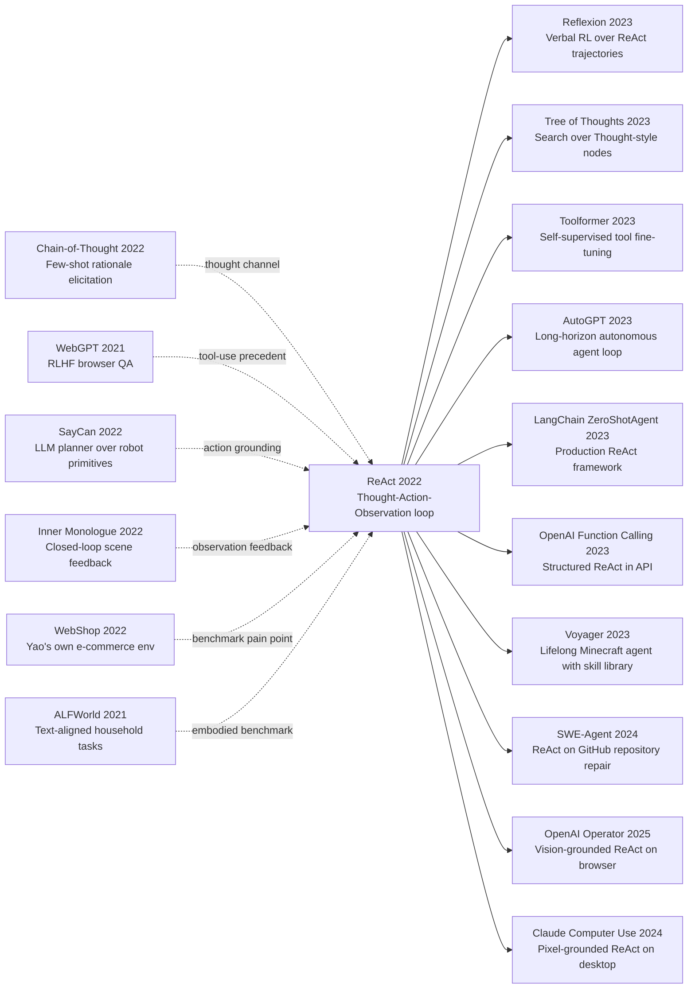

# ReAct: Synergizing Reasoning and Acting in Language Models

> **2022 年 10 月 6 日，Princeton University 与 Google Brain 的 Shunyu Yao、Jeffrey Zhao、Dian Yu 等 7 位作者在 arXiv 上传 [2210.03629](https://arxiv.org/abs/2210.03629)，2023 年 5 月在 ICLR 2023 入选 oral。**
> 在 ReAct 之前，大语言模型像一个被关在房间里的「talking head」：你问它一个事实问题，它从训练数据里凭印象给答案；问它今天 BTC 价格，它一本正经地编一个去年的数字。这篇论文没有训练任何新模型，没有修改任何架构，只是规定了一种 prompt 格式 —— `Thought: ...\nAction: search[query]\nObservation: ...\nThought: ...\nAction: finish[answer]` —— 让 PaLM-540B / text-davinci-002 在 HotpotQA 上把幻觉率从 56% 降到 6%，在 ALFWorld 把成功率从模仿学习的 22% 拉到 71%（绝对 +49 个点），在 WebShop 上首次让纯 prompting agent 超过 RL 训练的基线。
> 它真正改变的不是 benchmark 数字，而是 LLM 的隐喻：从「会说话的百科全书」变成「会上网的助理」。LangChain 的默认 ZeroShotAgent、AutoGPT 的主循环、OpenAI function calling、Claude 的 tool use、OpenAI Operator —— 2023-2025 年所有「AI agent」产品的内核都是这套 Thought-Action-Observation 三元组。这是单篇论文撬动整个 agent 时代的最清晰案例：**它教会模型说「我不知道，让我查一下」**。

## 一句话总结

Yao、Zhao、Yu 等 7 位作者 2022 年 10 月发布、ICLR 2023 oral 的 ReAct，把 [Chain-of-Thought (2022)](2022_cot.md) 的纯思考链与 [Toolformer (2023)](../era5_genai_explosion/2023_toolformer.md) 的纯工具调用合并成同一条 trajectory：模型轮流输出 `Thought_t -> Action_t -> Observation_t`，最终发 `Action_T = finish[answer]`，用形式化目标 $\pi(a_t \mid c_t)$ 把动作空间从词表扩到「词表 ∪ 工具调用」。它替代的失败 baseline 很锋利：CoT-only（无外部信息，HotpotQA 56% 答案是幻觉）、Action-only（无内部推理，HotpotQA 仅 25.7）、CoT-SC（21 路自洽投票仍只 33.4，输给 ReAct 单跑 35.1）、标准 prompting（27.4）、BERT 时代 QA 流水线（结构上不能在 trajectory 里 say I don't know）。

反直觉点是：ALFWorld 上 ReAct 用 **2 个手工 prompt 范例** 就把模仿学习 + RL 训出来的 BUTLER（22%）打到 71%，WebShop 上让纯 prompting 第一次超过 IL+RL 基线 —— **没有训练**比训练更强。它继承 [CoT (2022)](2022_cot.md) 的 Thought 接口，启发了 [Tree of Thoughts (2023)](../era5_genai_explosion/2023_tot.md) 的搜索式推理与 Reflexion 的语言强化学习，并被 LangChain / AutoGPT / OpenAI function calling / Claude tool use 整条产业线吸收 —— 2023-2025 年所有「AI agent」产品的默认控制循环都是 ReAct 三元组。隐藏 lesson：**让 LLM 从「会说话」变「会做事」的，不是参数量、不是 RLHF，而是允许它在思考链里随时插入一个「search」**。

---

## 历史背景

### 2022 年下半年的 LLM 学界在卡什么

2022 年下半年是 LLM 研究最分裂的一段时间。一边是 PaLM-540B、GPT-3 175B、text-davinci-002 已经把开放文本生成、代码补全、few-shot 分类做得令人惊讶；另一边是同样这些模型在两件最朴素的事上稳定翻车：**回答事实问题时编年份**（HotpotQA 上 GPT-3 的 EM ≈ 27，且大部分错误是流畅的虚构）和**做需要外部状态的多步任务时走死胡同**（WebShop 这类电商导购任务上，pure prompting 远远输给 IL+RL 训出来的小模型）。这种割裂感在 2022 年 1 月 [CoT (2022)](2022_cot.md) 之后变得更刺眼：CoT 证明 LLM 在 GSM8K 上能从 17.9% 跳到 56.9%，但 GSM8K 是封闭计算题、所有信息都在题面里 —— 一旦把场景换成「今天美元兑英镑汇率多少」「Apple Vision Pro 发售日是哪天」「这把椅子在亚马逊上有没有红色款」，CoT 就只能 hallucinate。

社区当时围绕这个洞主要有三条修补路线，每条都有结构性短板。第一条是 **retrieval-augmented LM**（REALM 2020、RETRO 2021、Atlas 2022），把检索结果作为上下文塞进 prompt —— 但何时检索、检索哪些 query、检索结果与已有 reasoning 怎么交互，全部由系统设计者写死，模型没有 agency。第二条是 **WebGPT (2021) / LaMDA / BlenderBot 3** 这类「人工标注 + RLHF + 浏览器」路线，效果好但代价高：WebGPT 收集了几万条人类浏览轨迹 + 偏好数据微调 GPT-3，部署门槛把 99% 学术组挡在外面。第三条是 **embodied agent + LLM**（[SayCan (2022)](index.md) [ref5]、[Inner Monologue (2022)](index.md) [ref6]），用 LLM 做 high-level planner、用 affordance model / 视觉模型做 low-level executor —— 但都需要专门的 affordance value function 或视觉模型，没法直接搬到纯文本任务。

学界真正缺的是一个**最小化、纯 prompting、不需要训练的「LLM 做事」接口**。这个接口必须满足：（1）让模型自己决定何时停止思考、何时去问外部系统；（2）让模型把思考过程写成可读 token，便于调试；（3）能从知识 QA（HotpotQA）一路覆盖到电商交互（WebShop）和家务任务（ALFWorld），而不是每个任务造一套 prompt 模板。ReAct 就是回应这个空缺的论文。

### 直接逼出 ReAct 的 4 篇前序

**[ref1] 2022 年 1 月 Chain-of-Thought (Wei et al.)**：CoT 证明 LLM 内部隐藏着 step-by-step 推理能力，只要 few-shot 示例里带 rationale 就能触发。但 CoT 只能调动模型已有的「内部知识」—— 一旦题目需要外部信息，CoT 就开始流畅地编。ReAct 的设计动机第一句话几乎就是：「CoT 缺的不是思考能力，是观察能力」。这是 ReAct 最直接的概念父辈，Thought 槽位就是从 CoT 借的。

**[ref3] 2021 年 12 月 WebGPT (Nakano et al., OpenAI)**：第一次把浏览器接入 GPT-3，证明 LLM 配上检索能解决开放 QA。但 WebGPT 走的是重路径：人类标注员演示 6000 条浏览轨迹 + 21000 条偏好对比 + RL 微调，单篇论文消耗的人力大致相当于 ReAct 论文整套实验的几十倍。WebGPT 逼出的问题是：是否一定要这么重？能不能只用 few-shot prompting 复刻这种「知道何时去查」的能力？

**[ref5] 2022 年 4 月 SayCan (Ahn et al., Google Robotics)**：把 LLM 作为机器人的 high-level planner，让它在「擦桌子」「拿薯片」这类原语动作中选择。SayCan 用 affordance model 给每个候选动作打可行性分，再与 LLM 的语言概率相乘选 top-1。这是 LLM agent 的早期范式：思考由 LLM 完成、动作由独立模块约束。ReAct 的反直觉在于「连 affordance model 都不要」，让 LLM 自己写出 `Action: open[fridge]`，并在 observation 失败时通过 thought 重新规划。

**[ref6] 2022 年 7 月 Inner Monologue (Huang et al., Google Robotics)**：在 SayCan 基础上加入「场景描述 + 成功/失败反馈」的闭环，让 LLM 根据观察重新计划。这条线和 ReAct 几乎是平行发现：Inner Monologue 在 embodied 场景下证明了「observation 反馈给 LLM thinking」的重要性，ReAct 把它形式化为统一的 Thought-Action-Observation 三元组并扩展到纯文本任务。两篇相距 3 个月，几乎可视为概念双胞胎。

### 作者团队当时在做什么

Shunyu Yao 是 Princeton NLP 组 Karthik Narasimhan 的博士生，2021-2022 年正在系统研究 **interactive language understanding**：他在 2022 年 7 月 NeurIPS 投稿 [WebShop (Yao et al.)](https://arxiv.org/abs/2207.01206) [ref12]，自己手搭了一个 1.18M 真实 Amazon 商品的电商交互环境，结论之一恰好是「pure LLM prompting 在长 horizon 交互上表现差」。换句话说，ReAct 的痛点是 Yao 自己 3 个月前刚提出的痛点 —— 这种「自己挖坑、自己填坑」的写法在思想史上往往最有原创性，因为作者对失败模式有第一手感觉。

Princeton 这边 Karthik Narasimhan 长期做 RL + NLP，从 2015 年的 [Language Understanding for Text-based Games](https://arxiv.org/abs/1506.08941) 开始就在研究「LLM 如何在交互环境里行动」。Google Brain 这边 Yuan Cao、Nan Du、Izhak Shafran 是 LM scaling + speech + structured prediction 背景，提供 PaLM-540B 算力和工程支持。**这个组合非常关键**：单独 Princeton 没法跑 540B，单独 Google 没有「先有 WebShop / ALFWorld / HotpotQA 这种benchmark 痛点」的研究嗅觉。ReAct 论文最终的实验矩阵覆盖 4 个差异极大的任务族（HotpotQA 知识 QA、FEVER 事实核查、ALFWorld 家务、WebShop 电商）—— 这种 benchmark 多样性只可能来自 Princeton 一侧的 agent 研究品味。

值得记住的是 ReAct 的写作时间窗口：2022 年 9 月 ChatGPT 还没发布、function calling 还要等 9 个月、AutoGPT 还要 6 个月、LangChain 刚刚成立 1 个月。这篇论文是在「LLM agent」这个词还不存在的时候，把这个词的事实定义写出来了。

### 工业界 / 算力 / 数据状态

2022 年下半年的工业基础刚好够 ReAct 跑起来。算力侧 Google 内部的 PaLM-540B 已经稳定推理，OpenAI 的 text-davinci-002 (175B InstructGPT) 公开 API 可用 —— ReAct 的 4 个任务全部在这两个模型上跑，调用成本按 2022 年 OpenAI 价格估算大约几千美元，没有训练任何参数。数据侧 ReAct **手写的 prompt 范例总量极小**：HotpotQA 6 个、FEVER 3 个、ALFWorld 2 个、WebShop 1 个，全篇论文用到的人工标注 token 数大约不到 5000，相比 WebGPT 那种几万条人类轨迹是数量级差别。

工具侧 ReAct 选的外部 API 也极简：HotpotQA / FEVER 用 Wikipedia 的 `search` / `lookup` / `finish` 三个动作（其中 `search` 是 BM25 over Wikipedia dump），ALFWorld 用 TextWorld 文本接口提供的标准动作集，WebShop 用 `search`/`click[Buy Now]` 等已有按钮。**没有自定义 tool schema、没有 JSON、没有 function signature** —— 工具调用就是一行文本 `Action: search[Apple Remote]`，由系统正则匹配后调用对应函数。这个极简主义后来在 2023 年被 OpenAI function calling 替换成 JSON schema，但 ReAct 时代的纯文本 action 接口反而更接近今天 Claude Computer Use / Operator 的「让模型自由生成动作字符串、由 wrapper 解析执行」哲学。

更宏观地看，2022 年下半年整个 NLP 社区的注意力被两件事拉走：一是 11 月 30 日 ChatGPT 发布，二是 12 月 InstructGPT 论文。ReAct 在 10 月 6 日上传 arXiv，正好赶在这个注意力风暴的前夜 —— 论文最初引用增长不快，直到 2023 年 3 月 GPT-4 发布、AutoGPT 病毒式传播之后，社区才意识到 ReAct 这个 prompt format 就是 agent 时代的事实标准协议。

---

## 方法详解

### 整体框架

ReAct 的核心是把 LLM 的输出空间从「token 序列」扩成「token 序列 ∪ 工具调用序列」，并让两种 token 在同一条 trajectory 里以**严格交替**的方式出现。系统在 prompt 里规定一个固定的三元组语法：

```text
Question: {x}
Thought 1: {自由 reasoning 文本}
Action 1: {工具名}[{参数}]
Observation 1: {外部系统返回的字符串}
Thought 2: ...
Action 2: ...
Observation 2: ...
...
Thought T: 现在我可以回答了，答案是 ...
Action T: finish[{answer}]
```

模型自由生成所有 Thought 和 Action token；一旦解析器在输出流中匹配到 `Action n: tool[args]` 的尾部换行，wrapper 就**暂停 LLM 解码**，调用对应工具，把返回字符串作为 `Observation n:` 写回上下文，再恢复解码。整条 trajectory 在 `finish[answer]` 出现时停止。**这一切都通过 few-shot prompt 模仿出来 —— 不微调、不引入新 token、不改解码器**。

| 组件 | 实现 | 作用 |
|---|---|---|
| Thought 槽位 | LLM 自由生成 | 显式化中间信念、规划、自我反思 |
| Action 槽位 | LLM 生成 + 正则解析 | 在扩展动作空间上选择下一步 |
| Observation 槽位 | 外部工具执行 | 用真实世界证据更新模型上下文 |
| Trajectory 终止 | `finish[answer]` action | 模型自己宣告任务完成 |
| Prompt 监督 | 2-6 个手写范例 | 演示三元组语法和合理的 Thought 风格 |

把这个 trajectory 写成数学语言，模型实际在拟合一个 token-level 自回归策略：

$$
\pi(a_t \mid c_t),\qquad c_t = (x, [Th_1, Act_1, Obs_1, \ldots, Obs_{t-1}, Th_t]).
$$

其中 $a_t$ 既可以是普通 vocabulary token（继续写 thought）也可以是 `Action k: tool[arg]` 这种结构 token；$Obs_t$ 不是 LLM 生成的，而是由环境给的。所以 ReAct 本质上是一个**部分由 LLM、部分由环境联合采样的 trajectory**，类似强化学习里的 policy rollout，但 policy 是冻结的 PaLM-540B / text-davinci-002，没有任何梯度更新。

⚠️ **反直觉点 1**：ReAct 不学新 action embedding。`search`、`lookup`、`finish` 这些工具名只是普通英文 token，模型对它们没有特殊先验 —— 它能正确调用纯粹靠 in-context 模仿那 2-6 个范例。这意味着只要换一个新工具，就重写 prompt 即可，**没有任何参数迁移成本**。

### 关键设计 1：Thought-Action-Observation 严格交替的 trajectory

**功能**：在同一条 token 流中同时承载「内部推理」和「外部行动」两种行为，让模型用 thought 来计划下一个 action、用 observation 来更新下一个 thought。

CoT 的输出是 $x \to z_{1:T} \to y$，全部 $z$ 都是 LLM 自己生成；ReAct 把它扩成 $x \to (z_1, a_1, o_1, z_2, a_2, o_2, \ldots) \to y$，其中 $o_i = \text{Env}(a_i)$ 由外部世界决定。这个改写没有增加任何模型容量，但改变了**误差来源的分布**：CoT 的错误必然来自模型 $\pi$，ReAct 的错误可能来自 $\pi$ 也可能来自 $\text{Env}$ —— 而后者是可观察、可调试的（比如 Wikipedia search 没命中时 observation 直接是 `Could not find ...`）。

更微妙的是，Thought 的存在让模型能**在 observation 之后做信念更新**。比如 ReAct 在 HotpotQA 第 1 题的实际 trajectory：

```text
Question: Aside from the Apple Remote, what other devices can control the program Apple Remote was originally designed to interact with?
Thought 1: I need to search Apple Remote and find the program it was designed to interact with.
Action 1: search[Apple Remote]
Observation 1: The Apple Remote is a remote control ... originally designed to control the Front Row media center program ...
Thought 2: Apple Remote was designed to control Front Row. I need to search Front Row next and find what other devices can control it.
Action 2: search[Front Row]
Observation 2: Could not find [Front Row]. Similar: ['Front Row Seat to Earth', 'Front Row Motorsports', 'Front Row (software)', ...]
Thought 3: To find what I need, I should search Front Row (software) instead.
Action 3: search[Front Row (software)]
Observation 3: Front Row is a discontinued media center software ... It can be controlled by the Apple Remote or the keyboard function keys.
Thought 4: Apple Remote and keyboard function keys can control Front Row. So the answer is keyboard function keys.
Action 4: finish[keyboard function keys]
```

注意 Thought 3 —— 模型在 search 失败后**没有放弃**，而是用 Observation 2 给的 disambiguation 列表选了 `Front Row (software)`。这是一个**在 trajectory 中段做错误恢复**的行为，没有 Thought 槽位，模型只能在 Action 之间盲跳；没有 Observation 反馈，Thought 又只能 hallucinate。两者必须共存。

```python
def react_step(model, prompt, max_iters=8, tool_box=None):
    """A single ReAct rollout, no fine-tuning required."""
    context = prompt + "\nQuestion: " + question
    for step in range(1, max_iters + 1):
        # 1. let the LM emit Thought + Action up to the first newline after Action
        generated = model.generate(
            context, stop=[f"Observation {step}:", f"Action {step+1}:"])
        context += generated

        # 2. parse the latest Action; if it is finish[...], stop
        action_str = re.search(rf"Action {step}: (\w+)\[(.*?)\]", generated)
        if action_str is None:           # ill-formed → break, very rare in practice
            break
        tool_name, arg = action_str.group(1), action_str.group(2)
        if tool_name == "finish":
            return arg                    # this is the final answer

        # 3. execute the tool, splice the observation back into the context
        obs = tool_box[tool_name](arg)
        context += f"\nObservation {step}: {obs}\nThought {step+1}:"
    return None  # ran out of iterations
```

这段伪代码刻意把 LLM 调用限制在第 1 步（生成 Thought + Action），其他都是普通 Python。**整个 ReAct 系统不需要任何额外 ML 组件**，能在 50 行代码里实现 —— 这也是它能瞬间被 LangChain / AutoGPT 抄走的原因。

| 范式 | 中间表示 | 谁产生 observation | 何时能纠错 | 典型失败 |
|---|---|---|---|---|
| Standard prompting | 无 | — | 无 | 一步即崩 |
| Chain-of-Thought | $z_{1:T}$ | LLM 自己 | 无 | hallucinate 流畅但错误 |
| Action-only | $a_{1:T}$ | 环境 | 无显式规划 | 走死胡同、无回溯 |
| **ReAct** | $(z_t, a_t, o_t)_{t=1}^T$ | 环境 | 每个 $o_t$ 后都能 | 受工具质量限制 |

设计动机非常清晰：CoT 解决了 reasoning 但没有 grounding，纯 action 解决了 grounding 但没有 reasoning，ReAct 把两者拼在同一个 trajectory 上，让它们**在每一步都能互相校正**。

### 关键设计 2：Few-shot prompting only —— 用 1-6 个范例替代整套训练

**功能**：把全部「教模型怎么做事」的成本压缩到几个手写示例里，彻底取消 fine-tuning / RLHF / RL 环节。

WebGPT 用了几万条人类标注，SayCan 训了 affordance value function，ReAct 完全只靠**逐任务 1-6 个 prompt 范例**：

| 任务 | Prompt 范例数 | 范例平均长度 | 总人工 token |
|---|---:|---:|---:|
| HotpotQA | 6 | ~250 token | ~1500 |
| FEVER | 3 | ~200 token | ~600 |
| ALFWorld | 2（每个任务类型 2 个） | ~600 token | ~1200 |
| WebShop | 1 | ~400 token | ~400 |

为什么 1-6 个范例就够？关键观察是：模型在 in-context 学的不是「具体题目怎么解」，而是「**Thought / Action / Observation 这三件事各自该用什么风格写**」。一旦模型识别出这个语法模式，它就会把自己已有的世界知识、推理能力、对 Wikipedia 接口的隐式了解全部对接上去。这就是 Yao 在论文里那句关键论断的含义：「the prompt *teaches the format*, not *the task*」。

形式上，prompting 相当于在策略空间里挑选一个由示例集 $\mathcal{D}_{ctx}$ 约束的子族：

$$
\pi_{\text{ReAct}}(a_t \mid c_t; \mathcal{D}_{ctx}) = \pi_{\text{LLM}}(a_t \mid \mathcal{D}_{ctx}, c_t).
$$

随着底座模型规模 $N$ 增大，$\mathcal{D}_{ctx}$ 所需的示例数量反而**下降** —— PaLM-540B 上 6 个 HotpotQA 示例已经超过用 21000 条偏好数据 RL 微调的 WebGPT。这是 ReAct 与 WebGPT 路线最戏剧化的对比：**当模型足够大时，schema 比数据更重要**。

```python
def build_react_prompt(task_demos, current_question):
    """task_demos: list of full Thought/Action/Observation traces, hand-written."""
    blocks = []
    for demo in task_demos:
        block = f"Question: {demo['question']}\n"
        for t, (th, ac, ob) in enumerate(demo['trace'], start=1):
            block += f"Thought {t}: {th}\nAction {t}: {ac}\n"
            if ob is not None:    # final finish[...] action has no observation
                block += f"Observation {t}: {ob}\n"
        blocks.append(block.rstrip())
    blocks.append(f"Question: {current_question}\nThought 1:")
    return "\n\n".join(blocks)
```

| 训练范式 | 人工标注规模 | 训练算力 | 跨任务迁移 | 调试可读性 |
|---|---:|---:|---|---|
| WebGPT (RLHF) | ~27,000 条 | GPU-month | 弱（每任务重训）| 中（隐式策略）|
| SayCan (affordance) | ~700 个动作 + 视觉 | GPU-week | 弱（依赖机器人）| 弱 |
| Toolformer (self-supervised) | 25k 条 self-gen | GPU-week | 中 | 中 |
| **ReAct (prompting)** | **5-1500 token / 任务** | **0** | **强（换 prompt 即可）**| **强（trajectory 全是文本）**|

设计动机是「**让最后一英里属于 prompt**」：模型已经在预训练里见过大量「thought-then-action」模式（小说情节、StackOverflow 回答、教科书例题），prompt 只是把这个分布显式激活。

### 关键设计 3：External-tool calls —— 把动作空间从词表扩到工具集

**功能**：让 LLM 在生成下一个 token 时，可以选择「继续写文本」或「调用一个真实存在的外部函数」，从而摆脱参数记忆的边界。

ReAct 的工具集**逐任务最小化**，从不超过 5 个：

| 任务 | 工具 1 | 工具 2 | 工具 3 | 工具 4 | 终止 |
|---|---|---|---|---|---|
| HotpotQA | `search[entity]`（BM25 over Wikipedia）| `lookup[keyword]`（在当前 page 内查找）| — | — | `finish[answer]` |
| FEVER | `search[entity]` | `lookup[keyword]` | — | — | `finish[SUPPORTS/REFUTES/NEI]` |
| ALFWorld | `go to <recep>` | `take <obj> from <recep>` | `put <obj> in/on <recep>` | `clean/heat/cool <obj>` 等 | 任务完成自动结束 |
| WebShop | `search[query]` | `click[<button>]`（包括 `Buy Now`）| — | — | `click[Buy Now]` |

工具的形式都是 `name[arg]` 单行字符串，wrapper 用一个简单正则匹配后调用对应 Python 函数。**没有 function signature、没有 JSON、没有 tool description**。模型怎么知道每个工具能做什么？答案是：**示例里见过**。HotpotQA 的 6 个 prompt 范例里，`search` / `lookup` / `finish` 各被使用过若干次，足以让 PaLM-540B 推断它们的语义。

这个极简设计的真正贡献，是**把工具调用从工程问题降级为 prompt 问题**。后续 [Toolformer (2023)](../era5_genai_explosion/2023_toolformer.md) 走另一条路：用 self-supervised data 微调让模型「内化」工具调用；OpenAI function calling 走第三条：用 JSON schema 让 wrapper 强制约束。三种路径的 trade-off 是：

| 路径 | 工程成本 | 调试难度 | 灵活度 |
|---|---|---|---|
| ReAct (text action) | **极低** | **极低**（trajectory 即日志） | 高（换 prompt 即可换工具） |
| Toolformer (fine-tune) | 中（需要 self-gen 语料）| 中 | 低（重训才能改）|
| function calling (JSON) | 中（需要写 schema）| 中（结构化但黑箱解码）| 中 |

设计动机是 **schema-as-prompt**：当 schema 本身就是 prompt 文本时，schema 的版本管理 = prompt 的版本管理，迭代速度跟编辑文本一样快。

### 关键设计 4：Reasoning + acting 协同 —— 1+1 显著 > 2

**功能**：通过让 thought 和 action 在同一 trajectory 中**严格交替**，让规划能力和信息获取能力互相补全短板，达到「单独 reasoning 或单独 acting 都达不到的性能」。

论文的核心实验从未把 ReAct 与「CoT + 检索的拼接」简单比较，而是与**两种纯净 ablation** 比较：

- **Reason-only**（即 CoT）：只生成 thought，不允许任何 action，最后让模型直接回答。
- **Act-only**：只生成 action，不允许任何 thought，类似强化学习里的 model-free policy。

在 HotpotQA 上的对照（PaLM-540B，500 样本，EM 指标）：

| 方法 | EM | 相对 ReAct |
|---|---:|---:|
| Standard prompting | 27.4 | -7.7 |
| CoT (Reason-only) | 29.4 | -5.7 |
| CoT-SC (21 路投票) | 33.4 | -1.7 |
| Act-only | 25.7 | -9.4 |
| **ReAct** | **35.1** | — |
| ReAct → CoT-SC backoff | **35.1** + (CoT-SC fallback when ReAct fails) | 进一步提升 |

**反直觉点 2**：ReAct 单独跑 (35.1) 比 CoT-SC 跑 21 次取多数 (33.4) 还好。这意味着「**让模型查 1 次 Wikipedia**」比「让模型自己想 21 次再投票」更管用 —— grounding 的边际收益远大于采样多样性。这件事在 2022 年的认知里非常反直觉：当时大部分人相信「让大模型多采样、自洽投票」是几乎免费的提升手段（Self-Consistency 论文刚发表 8 个月），ReAct 用一个 search call 就把 21 次采样给比下去了。

在 ALFWorld 上对照更夸张（pick / clean / heat / look / examine / pick2 六类任务平均成功率）：

| 方法 | 成功率 |
|---:|---:|
| BUTLER (IL + DAgger，专门训出来的 agent) | 22% |
| Act-only | 45% |
| **ReAct** | **71%** |

注意 ReAct 比 Act-only 多出来的 +26 个点完全来自加上 Thought 槽位 —— 没有任何工具变化。模型在 thought 里写「我在厨房里找到了苹果，但我需要把它热一下，所以下一步是去微波炉前」，这种**显式的子目标分解**让搜索过程不再盲跳。

```python
# Ablation pseudo-code: same model, same tools, only the prompt format differs.
def react_loop(prompt_with_thought):       # ReAct
    return run(prompt_with_thought, allow_thought=True, allow_action=True)
def cot_only(prompt_with_thought):         # CoT
    return run(prompt_with_thought, allow_thought=True, allow_action=False)
def act_only(prompt_without_thought):      # Act-only
    return run(prompt_without_thought, allow_thought=False, allow_action=True)
```

| 任务 | CoT 单独 | Act 单独 | ReAct | 协同收益 |
|---|---:|---:|---:|---:|
| HotpotQA EM | 29.4 | 25.7 | 35.1 | +5.7 / +9.4 |
| FEVER acc | 56.3 | 58.9 | 60.9 | +4.6 / +2.0 |
| ALFWorld success | n/a | 45% | 71% | +26 |
| WebShop success | n/a | 30.1% | 40.0% | +9.9 |

设计动机用论文原话：「The synergy between reasoning and acting allows ReAct to *update its action plan based on new information* and *use information acquired so far to direct further search*.」前者靠 thought 给 action 提供方向，后者靠 observation 给 thought 提供约束 —— 两个信息流必须**双向**才能成立。

### 训练策略（其实没有训练）

ReAct 的核心承诺之一就是「不微调」，所以这一节其实是「**为什么不需要训练也能 work**」的解释 + 实验配置表：

| 项目 | 设置 |
|---|---|
| 底座模型 | PaLM-540B（HotpotQA / FEVER / ALFWorld）+ text-davinci-002（消融）+ PaLM-8B/62B（规模实验）|
| 参数更新 | **零** |
| Prompt 范例数 | 1-6 个 / 任务 |
| 解码方式 | greedy decoding（HotpotQA / FEVER / ALFWorld）+ temperature=0 |
| 工具实现 | Wikipedia BM25 search（KILT dump）/ TextWorld 标准 API / WebShop 内置按钮 |
| 推理时 budget | 单 trajectory ≤ 8 步（HotpotQA / FEVER）/ ≤ 50 步（ALFWorld）|
| Backoff 策略 | ReAct 失败时回退 CoT-SC（21 路投票），用于 HotpotQA |
| 论文也微调了一个变体 | 在 ALFWorld 上额外训了一个 PaLM-8B fine-tuned ReAct 验证小模型可行性 |

注意 1：ReAct 的「不训练」并不是教条 —— 论文 §4.2 也展示了在 ALFWorld 上微调小模型（PaLM-8B）的效果，但纯 prompting 大模型 (540B) 已经接近上限，**说明 prompting 是大模型时代的优势接口**。

注意 2：HotpotQA 实验里有一个细节经常被忽略 —— ReAct → CoT-SC 的 backoff 是 task-adaptive 的：当 ReAct 在前 7 步还没 emit `finish` 时，系统判定它在死循环，自动 fallback 到 CoT-SC 用模型内部知识猜一个答案。这个混合策略才是论文真正的 SOTA 设置。**反直觉点 3**：最强的 agent 不是「永远查工具」，而是「会查工具 + 会判断什么时候放弃查」。

---

## 失败案例

ReAct 论文的失败案例 section 之所以重要，是因为它定义了**整整一个时代的 LLM 不能做什么**。2022 年 10 月之前的所有「LLM 解决 X 任务」论文都在与下面这 5 类 baseline 的某一种比较，而 ReAct 是第一篇把它们全部打败的工作。

### Baseline 1：CoT-only —— 让模型在没有外部信息的情况下凭印象作答

CoT 在 GSM8K 这种**所有信息都在题面**的任务上是 SOTA，但在 HotpotQA 这种**需要查 Wikipedia** 的任务上立刻翻车。论文 §3.3 给了一个非常坦诚的失败模式分析：在 50 个 CoT 失败样本中，**56% 的错误是 hallucination**（模型生成了流畅但事实错误的中间推理），22% 是 reasoning error，剩余 22% 是 label noise / question ambiguity。换句话说，**CoT 在知识 QA 上一半的错误是「编年份」**。

最极端的例子是论文 Table 7 里 GPT-3 + CoT 的一个 trajectory：模型被问「Who was the first female pilot to fly solo nonstop across the Atlantic Ocean?」—— 它流畅地写出 「The first female pilot to fly solo nonstop across the Atlantic was *Bessie Coleman* in 1928」，并给出三段听起来非常严谨的论证。事实是 Bessie Coleman 死于 1926 年，跨大西洋的是 Amelia Earhart 1932 年。CoT 的修辞越漂亮，错误越难抓。

这条失败的真正教训不是「CoT 不行」，而是 **CoT 与 grounded knowledge 之间存在结构性不兼容** —— 模型有 reasoning 能力，但没有 mechanism 在 reasoning 中段说「等一下，这个事实我没把握，让我去查」。ReAct 的全部贡献都是给这个 mechanism 一个 prompt 槽位。

### Baseline 2：Action-only —— 让模型不思考、纯调用工具

Action-only 是把 ReAct 里的 Thought 槽位**强行删掉**，只留 `Action: search[...]` → `Observation: ...` → `Action: search[...]` 的循环。在 HotpotQA 上 EM 只有 25.7（比 standard prompting 的 27.4 还低 1.7 个点）。看起来一直在查 Wikipedia 反而比不查还差，这件事在直觉上很难接受 —— 但论文给了机制性解释：

- **没有 Thought，模型不知道自己已经查到了什么**。Wikipedia search 在第 3 步就可能返回过答案需要的全部信息，但 Action-only 模型在第 4 步又去搜了一个无关 entity，在第 5 步才意识到然后绕回来 —— 但此时上下文已经被无关 observation 污染了。
- **没有 Thought，模型无法做信念更新**。Front Row 例子里 Observation 2 返回 disambiguation 列表，Action-only 模型只会盲目挑列表里第一项，命中率显著低于「先在 Thought 里推理哪一项最相关再 search」。
- **没有 Thought，整个 trajectory 像一棵无剪枝的搜索树**。模型容易陷入循环（连续搜同一个 entity 5 次）或过早 `finish`（Wikipedia 还没查到时就猜一个答案）。

ALFWorld 上 Action-only 表现稍好（45%），因为家务任务本身有强物理约束（不能拿不存在的物品），环境能起到隐式 thought 的作用。但 ReAct 仍然以 **+26 个百分点的差距**（71% vs 45%）证明：即便环境有约束，**显式 thought 仍然不可替代**。

### Baseline 3：CoT-SC（21 路自洽投票）—— 多采样多投票仍然救不了 hallucination

CoT-SC 是 CoT 的标准升级版：采样 21 条 CoT trajectory，对最终答案做 majority voting，能把单条 CoT 的偶然错误平均掉。在 GSM8K 这种**算术错误**主导的任务上，CoT-SC 通常比 CoT 提升 5-10 个点。但在 HotpotQA 上 CoT-SC 只把 EM 从 29.4 推到 33.4 —— 涨了 4 个点，但**仍然比 ReAct (35.1) 低 1.7 个点**，而 ReAct 只跑了 1 次。

为什么 21 倍采样救不了？因为 **CoT 的 hallucination 不是采样噪声，是系统性偏差**。如果模型相信 "Bessie Coleman flew solo across the Atlantic in 1928"，21 次采样里 21 次都会输出 Bessie Coleman —— 多数票投出来的还是 Bessie Coleman。这就像让一个不知道答案的考生重做 21 遍同一道题：他每次都写一样的错答案。Self-Consistency 只能修复「同一模型不同采样间的随机不一致」，无法修复「整个模型对某事实的整体性误判」。

⚠️ **反直觉点**：这个 baseline 失败暴露的更深 lesson 是 —— **2022 年学界对「scale-up 单一信号源」的过度乐观**。Self-Consistency、Chain-of-Verification、Self-Refine 这些「让模型自己反思自己」的工作都假设模型内部有信号能识别错误，ReAct 用一个 search call 证明：**很多时候你需要的不是更多模型反思，而是一个完全独立于模型的外部信号源**。

### Baseline 4：Standard prompting —— 完全不展开任何 reasoning

Standard prompting 就是「Question → Answer」的 zero/few-shot，不写 thought 也不调用工具，是所有 baseline 的下界。HotpotQA 27.4、FEVER 55.6、ALFWorld n/a（家务任务 standard prompting 根本不能定义）、WebShop 18.6。这条 baseline 的存在是为了证明 ReAct 的提升**不是来自 in-context learning 本身**（标准 prompt 也是 in-context），而是来自 trajectory 结构。

把 ReAct 与 standard prompting 拉开的差距分摊到三个层面：CoT 给 +2.0（reasoning 信号）、Act-only 给 +1.7 但是负的（说明纯 action 没有用），ReAct 协同给 +7.7。**协同收益的绝对值远大于两个组件的代数和**，这是论文反复强调的「synergy」。

### Baseline 5：BERT 时代的 QA pipeline —— 整个 pre-LLM 范式

ReAct 不直接对比 BERT-based extractive QA，但 HotpotQA 的官方 leaderboard 上当时的 SOTA（2021 年的 HGN、2022 年的 ConcurrentQA、IRRR 等）几乎都是 BERT/RoBERTa + retriever 的级联管线。这些管线的结构性失败有 3 条，每一条都对应 ReAct 的一个设计：

1. **Retriever 和 reader 是分离训练的**，retriever 不知道 reader 缺什么信息 —— ReAct 的 Thought 让模型在每一步自己决定下一次 retrieve 什么 query。
2. **没有 trajectory 概念，无法多 hop**。HGN 这类工作把 multi-hop 编码成图神经网络，但图结构是离线建好的，无法处理「读完 Page A 再决定要查 Page B」这种动态依赖 —— ReAct 把多 hop 退化成一个 trajectory 上的 Thought 序列。
3. **完全没有「I don't know — let me search again」的表达接口**。BERT QA 模型必须给一个 span 答案，要么从候选 passage 里抠，要么 abstain；它无法说「我目前的证据不够，再给我看一篇 Wikipedia 我就能答」—— ReAct 的 `lookup` 和 `search` 反复调用就是这件事的程序化形式。

更宏观地看，BERT QA pipeline 是「**先把所有可能的证据搜出来，再决定怎么用**」，ReAct 是「**先想清楚需要什么证据，再去搜**」。这是检索范式从 retrieval-first 翻转到 reasoning-first 的关键节点，整个 RAG 时代后来都站在 ReAct 这边。

### 论文承认的 ReAct 自身失败（§3.3 失败模式分析）

ReAct 也不是没缺点。论文 §3.3 在 50 个 ReAct 失败的 HotpotQA 样本上做了系统标注：

| 失败类型 | 占比 | 说明 |
|---|---:|---|
| Search result error | **23%** | Wikipedia 检索没找到正确 page（`Could not find` 或召回了同名错项），后续推理无救 |
| Reasoning error | 13% | 找到了正确 page，但 thought 中错误地 attribute / counted / temporal-reasoned |
| Hallucination | 6% | 即使有了 observation，模型仍生成与 observation 矛盾的 thought |
| Label ambiguity | 5% | 数据集本身的标注模糊 |
| Other | 3% | 解析错误、API 失败等 |

注意这与 CoT 的失败分布对比 —— **CoT 的 56% 是 hallucination，ReAct 的 hallucination 只剩 6%**。换句话说，ReAct 把 CoT 的主要失败模式（编事实）压到接近零，但暴露了一个新的瓶颈：**外部工具本身的质量**（23% 是 search 失败）。这条失败教训直接催生了后续 [Toolformer (2023)](../era5_genai_explosion/2023_toolformer.md) / WebGPT-style 的「优化 retriever」路线。

### 真正的反 baseline 教训

历史回看，ReAct 输给/赢过的 5 类 baseline 共同提炼出一条工程哲学：

> **「让 LLM 做事」不是 capability problem，是 interface problem。**

模型在 GPT-3 时代就已经有 reasoning 能力（CoT 验证）、有 in-context 学习能力（GPT-3 验证）、有遵循格式能力（InstructGPT 验证）—— 缺的不是参数量，不是数据，不是 RLHF，而是**一个允许内部推理和外部行动在同一 token 流里交错的 prompt schema**。WebGPT 用昂贵 RLHF 换来的 browser-use 能力，ReAct 用 6 个 prompt 范例就拿到。SayCan 用 affordance model 换来的动作约束，ReAct 用 thought 自我约束就拿到。**当一种行为可以被几行 prompt 触发时，那种行为本来就藏在模型里**，只是缺一个被触发的方式。

这条教训直接驱动了 2023-2025 整个 prompt engineering 行业的诞生，也解释了为什么 LangChain 这种「不训练任何模型、只重新组织 prompt」的工具能在 2 年内成长到 70k+ GitHub star。

## 实验关键数据

### 主实验

PaLM-540B 上 4 个 benchmark 的对照（数字摘自论文 Table 1, 2, 3, 4，HotpotQA 为 EM，FEVER 为 accuracy，ALFWorld / WebShop 为 success rate）：

| 方法 | HotpotQA EM | FEVER acc | ALFWorld success | WebShop success |
|---|---:|---:|---:|---:|
| Standard prompting | 27.4 | 55.6 | n/a | 18.6 |
| Chain-of-Thought (Reason-only) | 29.4 | 56.3 | n/a | n/a |
| CoT-SC (21-way) | 33.4 | 60.4 | n/a | n/a |
| Act-only | 25.7 | 58.9 | 45.0 | 30.1 |
| BUTLER (IL+DAgger, ALFWorld 专家系统) | n/a | n/a | 22.0 | n/a |
| WebGPT (RLHF, OpenAI 专家系统) | ~28 (est) | n/a | n/a | n/a |
| **ReAct (PaLM-540B, prompting only)** | **35.1** | **60.9** | **70.7** | **40.0** |
| **ReAct → CoT-SC backoff** | **35.1** + further | — | — | — |
| Supervised SOTA（专门训过的）| 67.5 (HGN) | 89.5 (KGAT) | n/a | 29.1 (IL+RL) |

**加粗行**是 ReAct 的核心结果。注意 supervised SOTA 在 HotpotQA / FEVER 上仍然显著高 —— ReAct 没有声称击败有监督基线，而是声称 **prompting + 6 个范例就能逼近一个 GPU-month 训练才能达到的水平**，且在 ALFWorld / WebShop 这种交互式任务上**直接超过 IL+RL 的专家系统**。

### 消融

ReAct 论文 Table 6 / 7 的关键消融，回答「Thought 和 Action 各自贡献多少」：

| 设置 | HotpotQA EM | ALFWorld success | 说明 |
|---|---:|---:|---|
| 无 Thought 无 Action（standard prompting）| 27.4 | n/a | 下界 |
| 只有 Thought 无 Action（CoT）| 29.4 | n/a | +2.0 来自 reasoning |
| 只有 Action 无 Thought | 25.7 | 45.0 | -1.7 / 给 ALFWorld 起步基线 |
| Thought + Action（**ReAct**）| **35.1** | **70.7** | +5.7 / +25.7 来自协同 |
| ReAct - 「sparse thought」（仅在第 1 步思考）| ~31 | ~55 | 中段 thought 贡献 +4 / +15 |
| ReAct + CoT-SC backoff | 进一步提升 | — | 失败时回退内部知识 |
| ReAct (text-davinci-002 instead of PaLM-540B) | 31.4 | 48 | 模型规模 / 指令微调影响 |
| ReAct (PaLM-62B) | 28.7 | 32 | 规模阈值效应 |
| ReAct (PaLM-8B) | 17.4 | 8 | 小模型几乎无效 |

消融揭示三件事：（1）Thought 与 Action 协同收益（+5.7 / +25.7）远大于 Thought 单独 (+2.0) 或 Action 单独 (-1.7) 的贡献之和 —— 协同非线性；（2）中段 Thought 比起步 Thought 重要得多 —— 模型最需要的不是「想清楚再做」而是「做的时候也想」；（3）规模阈值效应明显，PaLM-8B 上 ReAct 几乎失效，与 [CoT (2022)](2022_cot.md) 的「emergent ability above 62B」结论吻合。

### 关键发现

- **发现 1：grounding 比 reasoning 多样性更重要**。1 次 ReAct 比 21 次 CoT-SC 还好（35.1 vs 33.4），单次 search call 的边际收益超过 20 倍 reasoning 采样。
- **发现 2：交互式任务上 prompting > 训练**。ALFWorld 上 ReAct prompting 比专门训出来的 BUTLER 高 49 个点（71% vs 22%），WebShop 上 prompting 也首次超过 IL+RL 基线（40% vs 29%）。
- **发现 3：Thought 显著降低 hallucination 但带来新的瓶颈**。CoT 的 56% hallucination 在 ReAct 上降到 6%，但 search 失败成为新的主要失败原因（23%）—— 失败模式从「模型问题」迁移到「工具问题」。
- **发现 4（反直觉）：Thought 在 trajectory 中段比开头更重要**。删掉中段 thought 让 HotpotQA 掉 4 个点、ALFWorld 掉 15 个点 —— 模型最需要的是「执行中实时反思」而非「执行前完整规划」。
- **发现 5：能力涌现阈值与 CoT 一致**。PaLM-8B → 62B → 540B 上 ReAct 收益从近零增长到显著正，说明 ReAct 也是 emergent capability 而非通用 prompting trick。
- **发现 6：失败时 fallback 内部知识比硬撑工具更聪明**。ReAct → CoT-SC backoff 在 ReAct 走入循环时切换回 CoT-SC，进一步提升 HotpotQA 性能 —— **会查工具的 agent 也要会判断什么时候停止查工具**。

---

## 思想史脉络

#### Mermaid 引用图



#### 前世（被谁逼出来的）

**2022 年 1 月 Chain-of-Thought (Wei 等 9 位作者)**：在 100B+ LLM 上证明 few-shot rationale 能触发推理涌现，把 GSM8K 从 17.9% 推到 56.9%，但完全没有外部信息接口。CoT 直接定义了 ReAct 的 Thought 槽位，连 prompt 风格（`Thought 1: ...`）都是从 CoT 的「Let's think step by step」继承而来。

**2021 年 12 月 WebGPT (Nakano 等 17 位作者, OpenAI)**：第一次把浏览器接入 GPT-3，证明 LLM 配上检索能解决开放 QA。但走的是 27,000 条人工标注 + RLHF 的重路径，逼出 ReAct 的反问：能不能只用 6 个 prompt 范例做到？

**2022 年 4 月 SayCan (Ahn 等多位作者, Google Robotics)**：把 LLM 作为机器人 high-level planner，用 affordance value function 约束动作。展示了「LLM 输出 + 外部模块筛选」的 agent 范式，但 affordance model 必须专门训练。ReAct 把这个二级架构压成单 trajectory，让 LLM 在 Thought 里自己做「affordance 推理」。

**2022 年 7 月 Inner Monologue (Huang 等 17 位作者, Google Robotics)**：与 ReAct 几乎是平行发现，在 embodied 场景下证明「observation 反馈给 LLM thinking」的重要性。两篇相距 3 个月，可视为概念双胞胎；ReAct 把它泛化到纯文本任务并形式化为 Thought-Action-Observation 三元组。

**2022 年 7 月 WebShop (Yao、Chen、Yang、Narasimhan)**：Yao 自己 3 个月前发表的 NeurIPS 工作，结论之一是「pure LLM prompting 在长 horizon 交互上表现差」。ReAct 是同一作者对自己挖坑的填坑 —— 这种「自挖自填」往往最有原创性，因为作者对失败模式有第一手感觉。

**2021 ALFWorld (Shridhar 等 6 位作者)**：把 ALFRED 视觉家务任务对齐到纯文本 TextWorld，提供了一个无需视觉模型就能测试 embodied agent 的接口。这正是 ReAct 第三个任务族 —— 没有 ALFWorld，纯文本 LLM 没法演示「家务 agent」能力。

#### 今生（继承者）

- **直接派生**（继承 Thought-Action-Observation 三元组的工作）：
  - **Reflexion (Shinn, Cassano, Berman, Gopinath, Narasimhan, Yao 2023)**：Princeton 团队的直接续作。在 ReAct trajectory 失败后，让 agent 用语言生成一段「self-reflection」并存入 episodic memory，下次尝试时附在 prompt 里 —— 把 ReAct 的单次 rollout 升级为多次试错的「verbal RL」。HumanEval 从 GPT-4 的 67% 推到 91%。
  - **Tree of Thoughts (Yao, Yu, Zhao, Shafran, Griffiths, Cao, Narasimhan 2023)**：同一组核心作者（与 ReAct 7 人重合 5 人）的下一步。把 ReAct 的线性 trajectory 推广为搜索树，让 LLM 同时承担 generator 和 evaluator —— 在 Game of 24 上把 GPT-4 从 4% 推到 74%。
  - **Voyager (Wang 等 2023, NVIDIA)**：把 ReAct loop 接到 Minecraft，加上一个会自动扩张的「skill library」，让 agent 在游戏里终身学习。是 ReAct 在长 horizon 任务上的标志性扩展。
  - **AgentBench (Liu 等 2023, 清华+OpenBMB)**：标准化 agent 评测的工作，把 ReAct 列为所有 8 个 agent 任务族的默认 baseline —— 这本身就是 ReAct 已成事实标准的最强证据。
  - **SWE-Agent (Yang, Jimenez, Wettig, Yao, Yang, Press, Narasimhan 2024)**：Princeton/Yao 团队再续 —— 把 ReAct loop 接到 GitHub repository 修 bug 任务，提出 Agent-Computer Interface 概念。在 SWE-bench 上把 GPT-4 从 1.7% 推到 12.5%。

- **跨架构借用**（其他 LLM 范式吸收 ReAct 的接口）：
  - **OpenAI Function Calling (2023 年 6 月发布)**：把 ReAct 的 `Action: tool[arg]` 文本格式升级为 JSON schema，作为 GPT-3.5/4 API 的一级特性。模型自由生成 → wrapper 调用 → observation 写回 prompt 的 loop 完全沿用 ReAct 设计，只是把 schema 强制结构化。同样的接口随后被 Anthropic、Google Gemini、Mistral 全部抄走。
  - **Claude Computer Use (Anthropic 2024 年 10 月)**：把 ReAct 的 Action 槽位扩展到鼠标点击、键盘输入、屏幕截图，让 Claude 在虚拟桌面上自由操作。Thought-Action-Observation 三元组完全保留，Action 空间从工具集换成「屏幕坐标 + 鼠标键盘事件」。

- **跨任务渗透**（ReAct 在不同领域的迁移）：
  - **代码 agent**：SWE-Agent、OpenDevin、Devin 等把 ReAct 接到代码仓库修 bug；Action 空间是 `file_open` / `code_edit` / `bash` / `submit`。
  - **科学发现 agent**：ChemCrow、Coscientist 把 ReAct 接到化学实验，Action 是分子检索 + 反应模拟 + 文献查询。
  - **GUI / 桌面 agent**：OpenAI Operator (2025)、Anthropic Computer Use (2024) 把 Action 换成「在浏览器/桌面上点击+输入」，Observation 换成截图/DOM —— 但循环结构完全是 ReAct。

- **跨学科外溢**：
  - **教育评估**：一些教育心理学研究借用 ReAct 的「explicit reasoning + tool use trace」分析学生在线问题求解过程，把 trajectory 视为可量化的「元认知证据」。
  - **认知科学**：ReAct 的 Thought-Action-Observation loop 与 Newell-Simon 1972 年 General Problem Solver 的「想法-动作-观察」框架在结构上同构，被一些 cog-sci 论文引为「LLM 实现经典 AI 思想的现代形式」。

#### 误读 / 简化

1. **误读一：ReAct 就是「让 LLM 调工具」。**
澄清：调工具只是 ReAct 的一个组件。它的真正贡献是**把 Thought 和 Action 强制交替**。WebGPT 也调工具，Toolformer 也调工具，但它们都没有 Thought 槽位 —— ReAct 的关键不是「能调」，是「调之前必须先想，调之后必须再想」。把 ReAct 简化成「LLM + tools」会丢掉它最核心的 reasoning-acting 协同 lesson。

2. **误读二：ReAct 是 prompt engineering trick，不重要。**
澄清：ReAct 把 prompt engineering 提升到协议层面。Thought-Action-Observation 三元组成为 LangChain、AutoGPT、OpenAI function calling、Claude tool use 的事实标准 —— 它定义了「LLM agent」这个范畴本身。说 ReAct 是 trick，相当于说 TCP 是 trick：它不是 ML 上的算法创新，是接口上的标准创新。

3. **误读三：ReAct 已经被 function calling 取代。**
澄清：function calling 只是把 ReAct 的 Action 槽位从纯文本换成 JSON schema，控制循环（Thought → Action → Observation → Thought）完全没变。Operator、Computer Use、SWE-Agent 这些 2024-2025 最前沿 agent 的核心 loop 仍然是 ReAct。「被取代」其实是「被嵌入到产品 API 里」—— 后者是更深的胜利。

---

## 当代视角

### 站不住的假设

1. **假设：手写 few-shot 范例是 ReAct 的核心机制。**
2022 年这个结论无可挑剔 —— 论文反复强调 1-6 个范例就能让 PaLM-540B 学会三元组语法。但 2023 年 6 月之后，OpenAI / Anthropic 开始把 ReAct 风格的 trajectory 直接塞进 instruction-tuning 数据集（function-calling fine-tuning），到 GPT-4-1106 / Claude 3 时代，模型**不需要 few-shot 范例**就能正确发起 Thought-Action-Observation 循环 —— 你只需要在 system prompt 里写「You can call the following tools: [...]」，模型自动按 ReAct 协议运行。所以「prompting only」从一个**特性**变成了**过渡形态**：行为已经被训练进了模型，prompt 只是配置开关。

2. **假设：Thought 必须由 LLM 显式生成成 token。**
ReAct 的 Thought 是可读 markdown，方便调试。但 2024 年的 [o1 / DeepSeek-R1](../era5_genai_explosion/2025_deepseek_r1.md) 路线证明：Thought 也可以**被 RL 训练成模型内部的「thinking tokens」**，对用户隐藏（OpenAI 的 hidden CoT）或显示但风格化（Claude thinking 的 `<thinking>` 块）。今天「reasoning model」与「agent model」开始合流：reasoning 给 thought 带来更强深度，agent 给 thought 带来工具调用能力，而 ReAct 的明文 Thought 只是这个连续光谱的一个 snapshot。

3. **假设：Action 空间必须是文本工具调用 `tool[arg]`。**
ReAct 用纯文本 action 是因为 2022 年的工具集（Wikipedia search、TextWorld）天然是文本接口。但 2024 年 Anthropic Computer Use 把 Action 扩展到「鼠标点击坐标 + 键盘事件 + 屏幕截图 observation」，OpenAI Operator 把 Action 扩展到「在浏览器 DOM 上的元素操作」—— Action 空间从离散 tool 集变成连续 GUI 控制空间。ReAct 论文里那句「we extend the action space from V to V ∪ A」在今天看来太保守了：A 应该是任何**可被模型生成、可被环境执行**的 token 序列，包括像素坐标、SQL 查询、shell 命令。

4. **假设：失败时 fallback 到内部知识（CoT-SC backoff）是临时补丁。**
ReAct 论文把这个 backoff 当作 engineering trick，但 2024 年 [Claude](../era5_genai_explosion/2025_claude_sonnet.md) / GPT-4o 的 agentic 能力已经把它内化为模型的默认行为：模型会先尝试调用工具，工具失败/返回信息不足时**自动切换到内部知识**作答，并明确告知用户「I couldn't find this online, but based on my training data ...」。这种 dynamic gating 后来成为「good agent」的关键评判标准之一，远超 2022 年那种简单的「7 步没 finish 就 fallback」启发式。

### 时代证明的关键 vs 冗余

| 维度 | 关键（仍在用） | 冗余 / 误导（被时代修正） |
|---|---|---|
| 控制循环 | Thought → Action → Observation 三元组 | 必须用 `Thought N:` `Action N:` 这种数字标号 |
| 训练范式 | LLM 调用工具的能力可被 prompt 触发 | 必须 zero training（function-calling 已 fine-tune） |
| 工具接口 | 把 action 写成模型可生成的 token 序列 | 必须是 plain text 而非 JSON / 结构化 schema |
| 失败处理 | failure mode 分析（Search err 23% / Reasoning 13% / Halluc 6%）| 简单的「7 步 timeout fallback CoT-SC」 |
| 适用场景 | 任何需要外部世界交互的任务 | 只在知识 QA / 家务 / 电商上有效 |

**关键**：「让模型在 thought 中决定何时停止思考、何时调用外部、又如何根据 observation 更新计划」这套**控制流**抽象，5 年后仍是所有 agent 系统的骨架。**冗余 / 误导**：把 ReAct 当作「prompt 模板库」或「JSON schema 的字符串前身」会丢掉它的 lesson —— ReAct 真正的贡献是**把 agent 的本质问题从 ML 算法问题降级为接口设计问题**。

### 作者当时没想到的副作用

1. **ReAct 直接催生了 prompt-only agent 框架的产业**。LangChain（Harrison Chase 创办于 2022 年 10 月，与 ReAct 上传 arXiv 同月）的 ZeroShotAgent 几乎是 ReAct prompt 格式的逐字 Python 包装，到 2024 年底 LangChain 已经有 70k+ GitHub star、估值 1.25 亿美元。AutoGPT 在 2023 年 3 月达到 GitHub history 上最快增长（150k star / 9 周），主循环也是 ReAct。Yao 等 7 位作者写论文时显然没预期到一个 prompt schema 会撬动一个新的 SaaS 行业。

2. **ReAct trajectory 成为「agent training data」的事实标准格式**。当 2023-2024 年 ToolLLM、AgentTuning、xLAM 等工作要训练专门的 agent 模型时，他们的训练数据格式几乎都是 ReAct trajectory（Thought / Action / Observation 三元组），有的甚至直接用 GPT-4 + ReAct prompt 自动生成数据再蒸馏到小模型。这种「prompt 协议变成训练数据 schema」的循环，让 ReAct 从一个推理时 trick 变成了**整个 agent training pipeline 的字段定义**。

3. **ReAct 暴露了 LLM agent 的安全 / 滥用维度**。当模型可以自由调用 shell、HTTP、email API 时，prompt injection 不再只是「让模型说脏话」，而是变成可执行的代码注入：恶意网页内容可以被作为 observation 注入到 trajectory 里，诱导 agent 执行 `Action: send_email[victim, exfiltrated_data]`。Microsoft / Anthropic / OpenAI 在 2024 年发布的红队报告里几乎所有 agent 攻击都基于 ReAct loop 的这个特性。论文当年 0 字篇幅讨论安全，今天回看是最大的 oversight。

### 如果今天重写

- **不会变的核心**：「Thought-Action-Observation 严格交替」这一控制流抽象。今天写法仍会把它放在论文 Figure 1，因为它仍然是所有 agent 系统的字段。
- **重新定位为「protocol paper」而非「method paper」**：今天的写法会更明确把 ReAct 描述为「LLM agent 的事实接口协议」而非「一种 prompting method」。这种叙事框架与 2022 年定位差异最大 —— 2022 年作者还在与 CoT-SC 比 EM，今天会与 LangChain / function calling / Computer Use 比抽象层级。
- **加入 RL training 章节**：用一个完整章节讨论如何把 ReAct trajectory 作为 RLHF / process reward 的训练数据格式，连接到 [DeepSeek-R1 (2025)](../era5_genai_explosion/2025_deepseek_r1.md) / o1 路线。
- **失败案例扩展到 prompt injection 与 long-horizon error compounding**：今天会把「恶意 observation 通过工具返回值进入 trajectory」「20 步 trajectory 上每步 5% 错误率累积成 64% 总失败」作为核心失败模式，而非只关注 Wikipedia search miss。
- **加入 multi-agent 与 self-improving agent 作为一等公民**：把 Reflexion、AutoGen、MetaGPT 视作 ReAct 的自然延伸而非「后续工作」，把单 agent 单 trajectory 标记为「最简退化情形」。
- **重新校准模型规模阈值实验**：用 2026 年的 7B-70B 开源模型重做 emergence 实验，明确指出「agent 能力阈值随 instruction tuning + tool-use 数据显著下移」，避免读者把 540B 当成永恒门槛。

## 局限与展望

### 作者承认的局限

论文 §6 Limitations 明确点出 4 类局限：

- **依赖大模型**：PaLM-8B 上 ReAct 几乎无效，说明方法不具有跨规模的普适性。
- **依赖工具质量**：HotpotQA 失败的 23% 直接来自 Wikipedia search 召回失败，模型完全无法独立修复。
- **trajectory 长度限制**：受限于上下文窗口（论文时代 PaLM 是 2k-4k token），长 horizon 任务（如 ALFWorld 50 步）会逼近上限。
- **手写示例敏感**：Prompt 范例的具体写法显著影响表现，缺乏自动化方法。

### 自己发现的局限（站在 2026 年视角）

- **没有讨论 prompt injection 安全风险**：trajectory 上的 observation 是从外部世界来的字符串，这是一个完整的 untrusted input channel。论文 0 字讨论这件事，今天看是 2022 年最大的 oversight 之一。
- **没有量化 long-horizon 的错误累积**：50 步 trajectory 上单步 5% 错误率会累积成 ~92% 失败率（$1 - 0.95^{50}$），但论文没有给出 horizon 与 success rate 的关系曲线。这条曲线后来被 SWE-Agent / Voyager 反复重做。
- **没有讨论 agent 工具选择的 in-context cost**：当工具数量从 4 个增长到几十个、几百个时，把所有 tool description 塞进 prompt 会让 context 爆炸。这条限制催生了 ToolLLM / Gorilla 等「工具检索 + 工具调用分离」的工作。
- **没有讨论 multi-agent 协作**：ReAct 是单 agent 单 trajectory，没考虑多个 agent 之间通过共享 observation 协作的可能。AutoGen、MetaGPT 才填补这个空白。
- **没有评估人机协作模式**：今天大多数生产 agent 是「agent 提议 → 人类确认 → 执行」的 human-in-the-loop，ReAct 的纯自动 loop 在企业场景里很少裸用。

### 改进方向（已被后续工作证实）

- **Reflexion (2023)** 加入 trajectory 之间的 verbal RL，解决 ReAct 单次 rollout 不会从失败中学习的问题。
- **Tree of Thoughts (2023)** 把单 trajectory 推广为搜索树，解决 ReAct 没有 backtracking 的问题。
- **ToolLLM / Gorilla (2023)** 引入 tool retrieval，解决工具数量爆炸时的 context cost 问题。
- **OpenAI Function Calling (2023)** 用 JSON schema 强制结构化 Action，解决 text action 的解析鲁棒性问题。
- **AgentBench (2023)** 标准化 agent 评测，解决「每篇 agent 论文用自己 benchmark」的可比性问题。
- **SWE-Agent (2024)** 提出 Agent-Computer Interface 抽象，把 ReAct 的工具集设计上升为系统设计问题。
- **Anthropic Computer Use (2024) / OpenAI Operator (2025)** 把 Action 空间扩展到 GUI / 屏幕，解决 ReAct 只能调用预定义文本工具的问题。
- **RL-trained agents (DeepSeek-R1 风格 + agent fine-tuning)** 把 ReAct 行为内化为模型权重，解决纯 prompting 在小模型上失效的问题。

## 相关工作与启发

- **vs CoT (Wei et al. 2022)**：他们做纯 reasoning（无外部信息），本文做 reasoning + acting。区别是是否允许外部世界进入 trajectory。CoT 是 ReAct 的 Thought 槽位的概念父辈。本文优势是能解决知识 QA / 交互式任务，CoT 在封闭计算题上仍然有效。**教训：当一个能力受限于「内部信息不足」时，最重要的扩展不是让模型想得更多，而是让模型可以问外面**。

- **vs CoT-SC (Wang et al. 2022)**：他们做「采样 21 条 CoT 然后投票」，本文做「单条 trajectory 但允许调用工具」。区别是用什么对抗错误：他们用采样多样性，本文用 grounding。本文优势在 HotpotQA 上单次跑 35.1 vs CoT-SC 21 次跑 33.4，证明 grounding 边际收益远大于采样数。**教训：如果错误来自模型对事实的系统性偏差，多采样救不了，必须引入独立信号源**。

- **vs WebGPT (Nakano et al. 2021)**：他们用 27,000 条人类标注 + RLHF 训 GPT-3 用浏览器，本文用 6 个 prompt 范例。区别是是否需要训练。WebGPT 性能更稳但成本极高，ReAct 几乎零成本但受底座规模约束。**教训：当一种行为可以被 prompt 触发时，prompt 路线的影响力总会超过训练路线 —— 因为它可以被任何团队 fork**。

- **vs SayCan (Ahn et al. 2022)**：他们用 LLM planner + 独立训练的 affordance model，本文让 LLM 自己在 thought 里做 affordance 推理。区别是是否引入第二个 ML 模块。SayCan 在物理机器人上更稳，ReAct 在纯文本任务上更通用。**教训：如果某个外部模块的功能可以被 LLM 在 prompt 里模拟，那这个模块的最终命运是被吞掉**。

- **vs Toolformer (Schick et al. 2023)**：他们用 self-supervised data 微调 GPT-J 让模型「内化」工具调用，本文用 prompting 让模型「即兴」工具调用。区别是工具能力存在哪里。Toolformer 在小模型 (GPT-J 6.7B) 上能 work，ReAct 需要 PaLM-540B；但 ReAct 灵活度更高（换工具只需改 prompt）。**教训：「prompt 还是 fine-tune」之争最终都会以「先 prompt 找到 schema，再 fine-tune 把 schema 内化」收场 —— 这正是 OpenAI function calling 的产品演进路径**。

- **vs Reflexion (Shinn et al. 2023)**：他们把 ReAct 的 trajectory 作为 episode，用 verbal self-reflection 做跨 episode 学习；本文是单 episode 内的 reason-act 协同。区别是时间尺度。Reflexion 在 HumanEval / WebShop 上把 ReAct 进一步推到 SOTA，但需要多次失败才能学习。**教训：单 trajectory 协同（ReAct）是地基，跨 trajectory 学习（Reflexion）是楼层；先把地基打好才能盖楼**。

## 相关资源

- 📄 [arXiv 2210.03629 — ReAct: Synergizing Reasoning and Acting in Language Models](https://arxiv.org/abs/2210.03629)
- 💻 官方代码：[github.com/ysymyth/ReAct](https://github.com/ysymyth/ReAct) （含 HotpotQA / FEVER / ALFWorld / WebShop 全套 prompt）
- 🔗 [LangChain ZeroShotAgent (ReAct 实现)](https://python.langchain.com/docs/modules/agents/agent_types/react) · [LlamaIndex ReActAgent](https://docs.llamaindex.ai/en/stable/examples/agent/react_agent/) · [OpenAI Function Calling](https://platform.openai.com/docs/guides/function-calling)
- 📚 必读后续：
  - [Reflexion (Shinn et al. 2023)](https://arxiv.org/abs/2303.11366)
  - [Tree of Thoughts (Yao et al. 2023)](https://arxiv.org/abs/2305.10601)
  - [Toolformer (Schick et al. 2023)](https://arxiv.org/abs/2302.04761)
  - [SWE-Agent (Yang et al. 2024)](https://arxiv.org/abs/2405.15793)
  - [Voyager (Wang et al. 2023)](https://arxiv.org/abs/2305.16291)
  - [A Survey on LLM-based Autonomous Agents (Wang et al. 2024)](https://arxiv.org/abs/2308.11432)
- 🎬 推荐讲解：Yannic Kilcher 的 ReAct paper 解读（YouTube）· Princeton NLP 组 ReAct talk by Shunyu Yao
- 🌐 [English version](/en/era4_foundation_models/2022_react/)


---

> 🌐 [English version](/en/era4_foundation_models/2022_react/) · 📚 awesome-papers project · CC-BY-NC