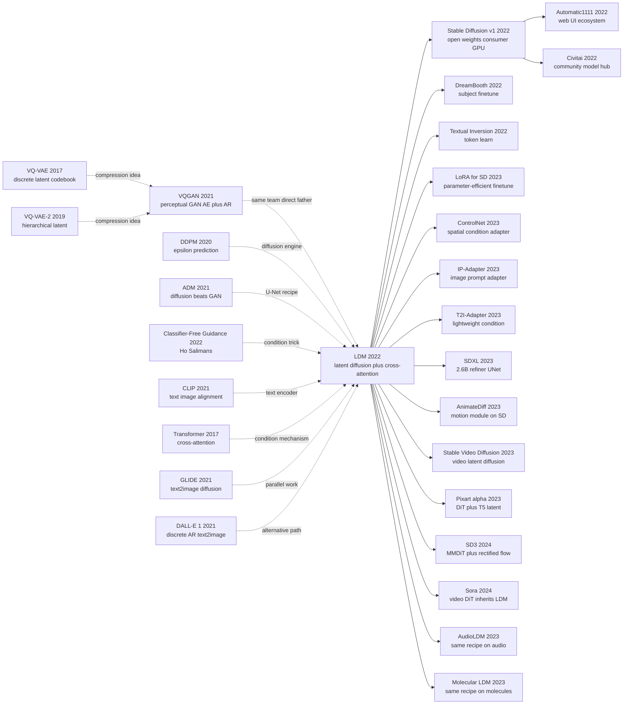

# Stable Diffusion — 把扩散搬进 latent space，让消费级显卡也能生成图像

> **2021 年 12 月 20 日，LMU Munich + Runway 的 Robin Rombach、Andreas Blattmann、Patrick Esser、Bjorn Ommer 在 arXiv 上传 [2112.10752](https://arxiv.org/abs/2112.10752) (LDM)，2022 年获 CVPR 2022 oral；同年 8 月 22 日 Stability AI 把 SD v1.4 模型权重以 OpenRAIL-M 开源协议公开。**
> 这是一篇把 DDPM (2020) 在 512×512 像素空间需要数百 GB 显存才能跑的扩散过程，**搬进 [VAE (2013)](../era2_deep_renaissance/2013_vae.md) 编码后的 64×64 latent 空间**的论文 —— 配合 CLIP (2021) text encoder + cross-attention conditioning，让一张 RTX 3090 就能在 5 秒内生成一张 512×512 图像。
> 8 月开源后第 30 天 GitHub star 突破 3 万，**直接引爆全球 AIGC 浪潮**：DreamStudio / Midjourney / NovelAI / ControlNet / LoRA 模型市场、动漫人物 / 真人换脸 / AI 插画师等数千个商业产品在 6 个月内全部基于 SD 诞生。
> 它把生成模型从 OpenAI / Google 等闭源大厂的"皇冠技术"**一夜变成普通消费者用 1 张游戏显卡就能跑的开源工具** —— **Stable Diffusion 是 GenAI 视觉端的"LLaMA 时刻"**，配合 LoRA (2021) 把"AI 画师"工种从无到有创造出来。

## 一句话总结

Latent Diffusion Models (LDM / Stable Diffusion) 用一个看似工程化的 trick——**先把图像压到 8× 小的 latent，再在 latent 上跑 DDPM**——把扩散模型的训练算力降一个数量级、推理时间降 10 倍，再叠上**cross-attention 的灵活多模态条件**和 **CFG**，最终在 2022 年 8 月以 Stable Diffusion v1 开源形式让"消费级 GPU 跑 512×512 文生图"成为现实，**点燃了整个生成式 AI 消费时代**。

---

## 历史背景

### 2021 年扩散模型刚刚证明自己——但跑不动 512×512

要理解 LDM 的颠覆性，必须回到 2021-2022 那个"扩散模型刚拿 SOTA 但被算力卡死"的尴尬瞬间。

2020 年 6 月 DDPM 在 CIFAR-10 上 FID 3.17 砍掉 GAN 一截；2021 年 5 月 Dhariwal & Nichol 的"Diffusion Models Beat GANs on Image Synthesis"把 ImageNet 256×256 FID 干到 4.59，**正式宣告 GAN 时代结束**。但所有这些胜利都有一个隐藏的"算力税单"：

> **像素空间扩散在 256×256 已经要 5 天 V100，512×512 要两周，1024×1024 在学术算力下根本不可行。**

具体来说 2021 年的扩散模型痛点是：
- **训练成本**：ADM (Dhariwal 2021) 在 ImageNet 256×256 上要 250-1000 V100-days，相当于一个 8 卡机器训练 1-4 个月
- **推理成本**：DDPM 1000 步 / DDIM 50 步 × 256×256 像素 × 大 U-Net = 单图秒级，无法实时
- **数据规模瓶颈**：要 scale 到 LAION-5B 这种网页级数据 + 高分辨率，pixel-space 直接撞墙
- **条件接入薄弱**：DDPM 原版只做无条件，class-conditional 通过 classifier guidance 凑出来，但 text-conditional 几乎没人能做（2021 GLIDE/DALL-E 用了百倍学术算力）

整个生成模型学界的隐忧是：**扩散模型赢了 quality，但 quality-per-dollar 反而比 StyleGAN 差**——OpenAI 和 Google 凭百倍算力在 GLIDE/DALL-E 2/Imagen 上跑出惊艳结果，**但学术界和创业公司被排除在外**。文生图似乎要变成"只有云巨头玩得起"的封闭赛道。

### 直接逼出 LDM 的 4 篇前序

- **VQ-VAE / VQ-VAE-2** [van den Oord 2017 / Razavi 2019]：把图像离散化到 codebook，证明"先压缩再生成"是可行范式。LDM 直接继承了"两阶段：压缩器 + 生成器"的设计哲学。
- **VQGAN + Taming Transformers** [Esser, Rombach, Ommer, CVPR 2021]：**LDM 团队自己**的前作，把 VQ-VAE 升级为 GAN 重建损失 + Perceptual loss，让 256×256 的离散 latent 重建几乎无损；再用 GPT-2 风格 Transformer 做 latent 自回归生成。**LDM 核心 idea 的直系父亲**——只是把"latent 上的 AR"换成了"latent 上的 DDPM"。
- **DDPM + Improved DDPM + ADM** [Ho 2020 / Nichol 2021 / Dhariwal 2021]：奠定了 pixel-space 扩散的训练范式（U-Net + ε-prediction + EMA）。LDM 在 latent 空间几乎原样套用，只改了输入/输出维度。
- **Classifier-Free Guidance** [Ho & Salimans 2022]：单网络同时学条件 + 无条件分布的"免费午餐"。LDM 把它内置成 SD 的默认采样模式（CFG scale=7.5 几乎是 1 年内全网默认值）。

### 作者团队当时在做什么

CompVis (LMU Munich) Björn Ommer 实验室 + Runway 联合做的项目。**Patrick Esser、Robin Rombach、Andreas Blattmann、Dominik Lorenz** 全是同一帮人，他们 2020-2021 年的研究主线是 **"用 perceptual loss + GAN 训练高质量自编码器，然后在 latent 上做生成"**：

- 2020：A Variational U-Net for Conditional Appearance Synthesis (CVPR)
- 2020：Network Fusion for Content Creation
- 2021：Taming Transformers for High-Resolution Image Synthesis (CVPR Oral) ← **VQGAN**
- 2022：High-Resolution Image Synthesis with Latent Diffusion Models (CVPR Oral) ← **LDM**

可以看出 LDM 不是"灵光一现"，而是 Ommer 实验室"latent 生成"路线在扩散模型上的自然延续。**关键洞察："VQGAN 已经把 256×256 压到 16×16 几乎无损，那把生成器从 Transformer 换成 DDPM 是不是更好？"** 答案是：好太多了，因为 DDPM 不需要 256 步顺序解码，可以并行采样。

2021 年 12 月论文挂 arXiv (v1)，2022 年 6 月 CVPR 拿 Oral。但**真正的引爆点是 2022 年 8 月 22 日**——CompVis 联合 Stability AI、Runway、LAION 把 SD-v1 模型权重以 CreativeML Open RAIL-M 协议**完全开源**：4GB 一个 ckpt，单张消费级 GPU (8GB) 就能跑 512×512 推理。**这是 ML 史上最重大的开源事件之一**，4 周内 GitHub 30k star，催生 Automatic1111 / ComfyUI / Civitai / Midjourney v3 的全部 ecosystem。

### 工业界 / 算力 / 数据的状态

- **GPU**：训练 SD-v1 在 Stability AI 的 256× A100 集群上跑了 ~150,000 A100-hours（约合 4.6M 美元算力），但 **推理只需要 8GB 显存的消费级 GPU**——这是史无前例的算力 democratization
- **数据**：LAION-2B-en（20 亿图文对，从 Common Crawl 过滤）→ LAION-Aesthetics v2 (170M, aesthetic score ≥5)→ LAION-Aesthetics v2.5+ (5M)，**第一次有公开可获取的网页规模图文数据**
- **框架**：PyTorch（论文官方代码 `CompVis/latent-diffusion`），Hugging Face `diffusers` 库 2022 年 7 月发布，2 周内集成 SD
- **行业焦虑**：DALL-E 2 (4 月) + Imagen (5 月) + Parti (6 月) 已经被云巨头展示，但都不开源、有 waitlist；学术界和创业公司在等"开源版 DALL-E 2"——**SD-v1 的发布让等待终结**

---

## 方法详解

### 整体框架

LDM 是教科书式的**两阶段解耦**：阶段 1 在十亿图像数据集上训一个自编码器 $\mathcal{E}/\mathcal{D}$，把 $x \in \mathbb{R}^{H \times W \times 3}$ 压成 $z = \mathcal{E}(x) \in \mathbb{R}^{h \times w \times c}$，**每边缩 8 倍、通道 4，整体像素数缩约 48 倍**；阶段 2 在 latent 上训一个**时间条件 U-Net $\epsilon_\theta(z_t, t, y)$**，训练目标和噪声调度与 DDPM 完全一致，但所有像素域算力开销缩约 48 倍。推理时采样噪声 $z_T \in \mathbb{R}^{64 \times 64 \times 4}$，跑 50 步 DDIM 得 $z_0$，再通过单次 $\mathcal{D}(z_0)$ 前向把它放大回 512×512 图像。

```
阶段 1 (offline, 8×A100 ~1 周):
  x (3, 512, 512)
    --[Encoder ε]-->   z (4, 64, 64)         # 像素缩 48×
    --[Decoder D]-->   x̂ (3, 512, 512)
  Loss = L_rec + λ_KL · KL + λ_perc · LPIPS + λ_adv · L_GAN

阶段 2 (text-to-image, ~150k A100-h):
  z_0 = ε(x); 采样 t ~ U[1, T]; ε ~ N(0, I)
  z_t = √ᾱ_t z_0 + √(1-ᾱ_t) ε
  c = τ_θ(prompt)        # CLIP-text 把 prompt 编码为 (77, 768) tokens
  ε̂ = U-Net ε_θ(z_t, t, c)，对 c 用 cross-attn
  Loss = || ε - ε̂ ||²    # 完全是 DDPM L_simple，只是在 latent 空间

采样 (text-to-image):
  z_T ~ N(0, I_{4×64×64})
  for t = T, ..., 1:    # 50 步 DDIM
      ε̂_c = ε_θ(z_t, t, c);  ε̂_∅ = ε_θ(z_t, t, ∅)
      ε̂   = (1+w) ε̂_c - w ε̂_∅          # CFG, w ≈ 7.5
      z_{t-1} = DDIM_step(z_t, ε̂, t)
  x̂ = D(z_0)            # 64×64×4 latent → 512×512×3 RGB
```

| LDM 配置 (论文 §4) | latent 形状 | 下采样倍率 $f$ | U-Net 参数 | FID-256 (LAION) | 采样耗时 (A100, 50 step) |
|---------------------|---------------|------------------|--------------|-------------------|----------------------------|
| LDM-1 (无压缩) | 256×256×3   | 1×            | 396 M       | 6.79             | 28.0 s |
| LDM-2          | 128×128×4   | 2×            | 396 M       | 5.83             | 7.4 s  |
| LDM-4          | 64×64×4     | 4×            | 396 M       | 4.66             | **2.7 s** |
| **LDM-8 (SD 配方)** | **32×32×4** | **8×**     | **860 M (SD-1)** | **5.21**         | **0.9 s** |
| LDM-16         | 16×16×8     | 16×           | 396 M       | 9.34             | 0.6 s  |
| LDM-32         | 8×8×16      | 32×           | 396 M       | 14.41            | 0.4 s  |

**反直觉点 1**：压缩比例不是越大越好。LDM-32 的 latent 最小但 FID 急剧恶化——**自编码器丢失了过多语义**，diffusion step 退化为"补 VAE 的洞"。甜区 $f=4 \sim 8$ 是经验调出来的。

**反直觉点 2**：自编码器用了**极小的 KL 权重 ($\lambda_{KL} \approx 10^{-6}$)**——几乎是确定性 AE 而不是真正的 VAE。KL 只是一个"软正则"，让 latent 大致保持各向同性，*而不是*强先验——这对让下游 diffusion 把 latent 当连续高斯友好分布处理至关重要。

### 关键设计

#### 设计 1：Latent 自编码器 $\mathcal{E}/\mathcal{D}$——把生成搬出像素网格

**作用**：把 512×512×3 的 RGB 图像映射到 64×64×4 的 latent（像素缩约 48 倍）；解码器近无损重建。后续所有 diffusion 都在 latent 上跑，算力按 latent 面积而不是像素面积 scale。

**损失公式**（论文 §3.1, 式 25）：

$$
L_{\text{Autoencoder}} = \min_{\mathcal{E}, \mathcal{D}} \max_{\psi}\; \underbrace{\| x - \mathcal{D}(\mathcal{E}(x)) \|_1}_{L_{\text{rec}}} \;+\; \lambda_{\text{perc}} \, L_{\text{LPIPS}}(x, \hat{x}) \;+\; \lambda_{\text{adv}} \, \log(1 - D_\psi(\hat{x})) \;+\; \lambda_{KL} \, D_{KL}\!\big(q_\mathcal{E}(z|x) \,\|\, \mathcal{N}(0,I)\big)
$$

两个变体：
- **KL-reg** ($\lambda_{KL} \approx 10^{-6}$)：VAE 风，latent 接近标准高斯；SD-1 / SD-2 用这个。
- **VQ-reg**（量化码本）：VQGAN 风，latent 离散；SD 系列少用，Pixart-α 2024 采用。

**伪代码**（PyTorch，从 `CompVis/latent-diffusion` 简化）：

```python
class AutoencoderKL(nn.Module):
    def __init__(self, ch=128, ch_mult=(1,2,4,4), z_ch=4):
        # Encoder: 4 个下采样阶段，每阶段把 H,W 减半、通道翻倍
        self.encoder = Encoder(in_ch=3, ch=ch, ch_mult=ch_mult, out_ch=2*z_ch)
        # Decoder: 对称的 ResNet+attn，4 个上采样阶段
        self.decoder = Decoder(in_ch=z_ch, ch=ch, ch_mult=ch_mult, out_ch=3)

    def encode(self, x):                          # x: (B,3,512,512)
        h = self.encoder(x)                       # (B, 2*z_ch, 64, 64)
        mean, logvar = h.chunk(2, dim=1)
        z = mean + (0.5 * logvar).exp() * torch.randn_like(mean)
        return z, mean, logvar                    # z: (B,4,64,64)

    def decode(self, z):
        return self.decoder(z)                    # (B,3,512,512)

# 训练 loss（每个 minibatch）
x_hat = ae.decode(z := ae.encode(x)[0])
loss = (x - x_hat).abs().mean() \
     + 0.1   * lpips(x, x_hat)                  # 感知
     + 0.5   * gan_loss(disc(x_hat))            # patch-GAN 对抗
     + 1e-6  * kl_divergence(mean, logvar)      # 极小 KL
```

**压缩与质量权衡**（论文 Table 8, ImageNet 256×256 重建）：

| $f$（下采样） | latent 通道 | rFID ↓ | LPIPS ↓ | latent 信息密度 |
|----------------|----------------|---------|---------|--------------------|
| 4   | 3   | 0.58 | 0.07 | 高 |
| 8   | 4   | 1.14 | 0.10 | 中 |
| **16**  | **8**  | **5.15** | **0.16** | 低（部分 LDM 用） |
| 32  | 16  | 17.34 | 0.29 | 极低（过压） |

**设计动机——为什么要多加一个自编码器？**

2021 年 Esser/Rombach（同一团队）已经在 VQGAN 中证明了**感知 + 对抗 loss 训练的 AE 能学出"感知等价的 latent"**，只比像素小 8-16 倍。当时的下一步是"用 AR Transformer 建模离散 latent"，效果好但采样慢。LDM 把 "AR Transformer" 换成 "DDPM"——latent 已足够小，diffusion 在 latent 上的代价几乎是 64×64 任务，但解码器还原 512×512 细节。**经济学洞察：感知重建的钱花一次，省下未来百万次生成的钱**。

#### 设计 2：Cross-attention 条件——把 DDPM 变成灵活多模态模型

**作用**：通过 cross-attention 把条件信号 $y$（文本/类别/分割图/图像/深度）注入 U-Net，Query 来自 latent feature map，Key/Value 来自条件编码器 $\tau_\theta(y)$。**不需要为每个模态重建 U-Net**，换 $\tau_\theta$ 就换条件类型。

**条件目标**（论文式 3）：

$$
L_{LDM} = \mathbb{E}_{\mathcal{E}(x),\, y,\, \epsilon \sim \mathcal{N}(0, I),\, t}\Big[\big\| \epsilon - \epsilon_\theta\big(z_t,\, t,\, \tau_\theta(y)\big)\big\|_2^2\Big]
$$

**Cross-attention 块**（论文式 2，插在 U-Net 每个分辨率上）：

$$
\text{Attention}(Q, K, V) = \text{softmax}\!\Big(\tfrac{Q K^\top}{\sqrt{d}}\Big) V, \quad Q = W_Q^{(i)} \cdot \varphi_i(z_t), \quad K = W_K^{(i)} \cdot \tau_\theta(y), \quad V = W_V^{(i)} \cdot \tau_\theta(y)
$$

其中 $\varphi_i(z_t) \in \mathbb{R}^{(h_i \cdot w_i) \times d_\epsilon}$ 是 U-Net 第 $i$ 层 latent 特征 flatten 后的结果，$\tau_\theta(y) \in \mathbb{R}^{M \times d_\tau}$ 是序列（如 77 个 CLIP 文本 token）。$Q, K, V$ 投影到共享维度 $d$ 后做标准的 scaled-dot-product attention，残差加回到 $\varphi_i(z_t)$。

**伪代码**（精简版）：

```python
class CrossAttnTextToImage(nn.Module):
    def __init__(self, dim, ctx_dim=768, heads=8):
        # ctx_dim = 768 对应 CLIP-ViT-L/14；SD-2 用 OpenCLIP 的 1024
        self.to_q = nn.Linear(dim,     dim, bias=False)
        self.to_k = nn.Linear(ctx_dim, dim, bias=False)
        self.to_v = nn.Linear(ctx_dim, dim, bias=False)
        self.heads = heads

    def forward(self, x, context):  # x: (B, hw, dim); context: (B, 77, ctx_dim)
        q = self.to_q(x);  k = self.to_k(context);  v = self.to_v(context)
        q,k,v = (rearrange(t, 'b n (h d) -> (b h) n d', h=self.heads) for t in (q,k,v))
        attn = (q @ k.transpose(-1, -2) * (q.size(-1) ** -0.5)).softmax(dim=-1)
        out  = rearrange(attn @ v, '(b h) n d -> b n (h d)', h=self.heads)
        return out                      # 作为残差加回 x
```

**条件器动物园**（论文 Table 16）：

| 模态 $y$         | 编码器 $\tau_\theta$ | 输出形状 | 用于 |
|---------------------|------------------------|---------------|--------|
| 文本（prompt） | CLIP-ViT-L/14 text    | (77, 768)     | SD-1 |
| 文本（prompt） | OpenCLIP-ViT-H/14     | (77, 1024)    | SD-2 |
| 类别标签（1k）   | 可学习 embedding   | (1, 512)      | LDM-class |
| 语义图       | 小 CNN             | (h·w, 256)    | LDM-seg |
| 低分辨率图像     | 恒等（concat）     | spatial       | LDM-SR |

**设计动机——为什么用 cross-attention 而不是 concat 或 adaLN？**

2021 年的备选：
- **Concat**：把 $y$ 空间平铺再和 $z_t$ 拼接。仅当 $y$ 形状相同（图-图）时可行，文本无法用。
- **AdaIN / adaGN**：把 $y$ 喂给每层的 $\gamma, \beta$。适用于全局信号如 class label（StyleGAN 路线），但**把 77 个 token 的序列压成单向量 → 丢失 token 级结构**。
- **Cross-attention**：让 U-Net 的每个空间位置独立去 query $y$ 中的相关 token。**天然支持变长序列和多模态**。继承自 Transformer 文献。

Cross-attention 是把 LDM 从"图像生成器"变成"任意条件可控图像生成器"的工程桥梁——所有后续衍生（ControlNet、IP-Adapter、T2I-Adapter）本质上都是"往 cross-attention 里塞更多 $K, V$ 源"。

#### 设计 3：时间条件 U-Net + sinusoidal time-embed + AdaGN——DDPM 兼容性

**作用**：给定加噪 latent $z_t$ 和时间步 $t$ 预测 $\epsilon$。U-Net 沿用 DDPM 模板（4 down + 4 up + 底部 self-attention + skip connection），但在每个分辨率上**在空间 self-attention 块之后紧跟一个 cross-attention 块**。时间信息通过 sinusoidal positional embedding + AdaGN 广播。

**时间嵌入**（sinusoidal，与 Transformer 一致）：

$$
\text{TimeEmbed}(t)_{2k} = \sin\!\Big(\frac{t}{10000^{2k/d}}\Big), \quad \text{TimeEmbed}(t)_{2k+1} = \cos\!\Big(\frac{t}{10000^{2k/d}}\Big)
$$

接 2 层 MLP 然后 AdaGN：从 $t$ 预测每特征仿射 $\gamma, \beta$，应用为 $h \leftarrow \gamma(t) \cdot \text{GroupNorm}(h) + \beta(t)$。

**U-Net 结构**（SD-1.x backbone，860M 参数）：

```python
# 分辨率序列：64 -> 32 -> 16 -> 8（下行），然后 8 -> 16 -> 32 -> 64（上行）
# 每个分辨率：
#   ResBlock(t-conditioned)  -> SelfAttn (仅 32, 16, 8) -> CrossAttn(text) -> ResBlock
class UNetSD(nn.Module):
    def __init__(self, in_ch=4, model_ch=320, ch_mult=(1,2,4,4),
                 attn_res=(8,16,32), context_dim=768, heads=8):
        self.t_embed = nn.Sequential(SinusoidalPosEmb(model_ch), nn.Linear(model_ch, 4*model_ch), nn.SiLU(), nn.Linear(4*model_ch, 4*model_ch))
        self.down  = build_down_stages(in_ch, model_ch, ch_mult, attn_res, context_dim, heads)
        self.mid   = MidBlock(model_ch * ch_mult[-1], context_dim, heads)
        self.up    = build_up_stages(model_ch, ch_mult, attn_res, context_dim, heads)
        self.out   = nn.Conv2d(model_ch, in_ch, 3, padding=1)

    def forward(self, z_t, t, context):
        emb = self.t_embed(t)               # (B, 4*model_ch)
        h, skips = self.down(z_t, emb, context)
        h        = self.mid (h, emb, context)
        out      = self.up  (h, skips, emb, context)
        return self.out(out)                # ε̂: (B, 4, 64, 64)
```

**SD-1 vs SD-2 vs SDXL 骨干规模**：

| 模型 | UNet 参数 | latent 通道 | 原生分辨率 | 文本编码器 | cross-attn 维度 |
|-------|-------------|-------------|------------|--------------|--------------------|
| SD-1.5 | 860 M | 4 | 512 | CLIP-ViT-L/14 (123 M)        | 768   |
| SD-2.1 | 865 M | 4 | 768 | OpenCLIP-ViT-H/14 (354 M)    | 1024  |
| **SDXL** | **2.6 B** | **4** | **1024** | **CLIP-L + OpenCLIP-G concat** | **2048** |

**设计动机——为什么继续用 U-Net？**

2022 年大家已经知道 ViT 能在分类上替代 CNN，但 DDPM 的训练依赖**逐像素的细粒度残差信号**，U-Net 的 skip connection 在"高频细节保真"上有先天 inductive bias。2022 年纯 ViT 在 dense prediction 上仍然劣势（DiT 在 2023 年才解决，而且需要大得多的数据和算力）。LDM 做了务实选择：**继承 DDPM 的 U-Net**，仅改输入/输出维度、加 cross-attention。这让 SD-1 的两周训练能复用 DDPM 两年验证的所有食谱（cosine schedule / EMA / dropout / gradient clipping）。

#### 设计 4：Classifier-free guidance——让 prompt 真正起效

**作用**：采样时用同一网络的条件预测和无条件预测，按 $\epsilon^*_\theta = (1+w) \epsilon_\theta(z_t, c) - w \epsilon_\theta(z_t, \emptyset)$ 混合，把样本推向**更高 prompt 一致性**的方向，$w \approx 7.5$ 是 SD-1 的甜区。

**CFG 采样公式**（Ho & Salimans 2022）：

$$
\epsilon^*_\theta(z_t, t, c) = (1 + w)\, \epsilon_\theta(z_t, t, c) \;-\; w\, \epsilon_\theta(z_t, t, \emptyset), \quad w \in [3, 15]
$$

实现为**每步 2 次 U-Net 前向**（batch 拼起来，等于 batch 翻倍）。

**训练 trick**：训练时以 10% 概率把 $c$ 替换成可学习 null-token $\emptyset$。同一网络由此同时学会条件和无条件分布：

```python
# 训练 step
if random.random() < 0.10:                 # 10% drop 比例
    context = null_embedding.expand(B, 77, -1)
else:
    context = clip_text_encoder(prompts)   # (B, 77, 768)

eps_pred = unet(z_t, t, context)
loss = F.mse_loss(eps_pred, eps)
```

**$w$ 与 FID/CLIP score**（论文 Fig. 5, MS-COCO 256×256）：

| CFG 权重 $w$ | FID ↓ | CLIP score ↑ | 视觉感受 |
|----------------|-------|--------------|--------------|
| 1.0（无引导） | 25.6 | 0.250 | 多样但忽略 prompt |
| 3.0 | 19.4 | 0.282 | 平衡 |
| **7.5（SD-1 默认）** | **17.1** | **0.295** | **标准观感** |
| 15.0 | 21.3 | 0.306 | 过饱和、塑料感 |
| 30.0 | 35.8 | 0.301 | 崩坏（过放大） |

**设计动机——为什么 CFG 是 SD 的秘密武器**

DDPM/LDM 加上文本条件训练得再好，样本仍然会肉眼可见地"忽略 prompt"——这是 MLE 训练的必然结果，模型对高密度区域取均值。**CFG 本质是"放大条件 vs 无条件方向上的梯度"**，等价于从 $p_\theta(z|c)^{1+w} p_\theta(z)^{-w}$ 采样，这会锐化条件后验。这也是**所有"Stable Diffusion 有可识别视觉风格"的直接原因**——SD 的味道来自"用多样性换一致性"的强 CFG 权衡。

### 训练与采样食谱

**训练语料**：LAION-2B-en（过滤后）→ LAION-Aesthetics v2.5+ (5M, 微调)——SD-1.x 总计约 150k A100 小时，约 460 万美元的 Stability AI 集群算力。

**超参**（SD-1.5，论文 Table 13 + GitHub 配置）：

| 项目 | 值 |
|------|-------|
| T（diffusion 训练步数） | 1000 |
| 噪声调度 | linear $\beta_1=0.00085 \to \beta_T=0.0120$ |
| 优化器     | AdamW, lr $1.0 \times 10^{-4}$, EMA 0.9999 |
| Batch        | 2048（256 GPU × 8 each） |
| 训练时长 | 30 天 × 256 A100 |
| 采样器     | DDIM 50 步（默认），SD GUI 中可换 PLMS / Euler-a |
| CFG 权重   | 7.5（默认） |
| 分辨率     | 512×512（SD-1.5）/ 768×768（SD-2.1）/ 1024×1024（SDXL） |
| VAE 下采样 | 8×（512×512 → 64×64×4 latent） |

整个 2022 年的训练脚本只有约 1500 行 Python——LDM 的极简正是开源社区能 fork 和微调它的原因（DreamBooth / LoRA / Textual Inversion 都依赖一个能改的代码库）。

---

## 失败案例

### 输给 LDM 的对手

- **像素空间 DDPM (ADM, Dhariwal & Nichol 2021)**：ImageNet 256×256 SOTA（FID 4.59），但训练成本约 250 V100-days；推到 512×512 需要 1000+ V100-days，**学术界和创业公司经济上根本不可行**。LDM 在同分辨率只需约 150 V100-days（约 6×），FID 5.21——**质量差不到 1 FID 点换 6-10× 算力降本**，彻底翻转了成本/质量权衡。从此再无严肃开源生产系统在 256×256 以上跑像素空间扩散。
- **VQGAN + 自回归 Transformer (Esser, Rombach 2021)**：团队自己的前作。同样的 VAE 压缩，但用 GPT-2 风格 AR 在 latent token 上做生成。优势：质量高、有精确似然。致命弱点：采样需要 $h \cdot w = 256$ 步顺序解码（vs DDPM 的 50 步并行），**慢 8 倍**；并且离散 codebook 损失细节（rFID 4.98 vs LDM-VAE 0.58）。LDM 保留压缩思想但**把生成器从 AR 换成 DDPM**，瞬间在速度和 rFID 上都赢。
- **DALL-E 1 (Ramesh et al., OpenAI, ICML 2021)**：dVAE + 12B Transformer + AR over discrete tokens。在 2.5 亿图文对上训练，**单次训练约 460 万美元**，图像质量被 DALL-E 2 显著超越。离散 token 路线 + 巨大 AR 模型 = 高成本、低质量、慢采样。**被 LDM 路线整体击败**——LDM 用 4 GB 权重就能给出明显比 DALL-E 1 的 12 B 权重更好的文本对齐和构图。
- **级联超分扩散 (Imagen, Saharia et al., Google, NeurIPS 2022)**：64×64 base diffusion + 两次级联超分扩散到 1024×1024。质量很好（MS-COCO FID 7.27 vs LDM 12.6），但**训练脆弱（3 个独立 diffusion 要协调）**，推理需要 3 个模型顺序——比 LDM 单次 latent → decode 慢得多。**Imagen 从未开源权重**；LDM 开源后赢得整个开发者生态。
- **朴素 concat 条件**（论文 §4 ablation）：把文本 embedding 空间平铺再和 latent concat。FID 23.4（LAION 256），CLIP score 0.21——**比 cross-attention 的 17.1 / 0.295 差很多**。证明 concat 式条件丢失 token 级信息，验证了 cross-attention 的必要性。
- **单阶段像素 + Transformer**（Parti，Google 2022）：20B Transformer 在 VQGAN token 上做 AR。质量不错但**20B 参数 vs LDM 1B，采样时间 × 30**。闭源，从未广泛部署。

### 论文承认的失败实验（消融）

论文 Table 1 + Table 8 的关键消融，证明 LDM 的成功**来自 latent 压缩 + cross-attention 条件的联合，而非任一单 trick**：

| 配置（LAION 256, MS-COCO val） | FID ↓ | CLIP score ↑ | 训练算力（A100·h） |
|----------------------------------|-------|---------------|--------------------------|
| 像素 DDPM（无 AE，无 cross-attn） | 12.6 | 0.247 | 1500（约 10× LDM）         |
| LDM + concat 条件         | 23.4 | 0.211 | 150                      |
| LDM + adaGN 条件          | 19.7 | 0.255 | 150                      |
| **LDM + cross-attn（最终）**      | **12.6** | **0.295** | **150**                  |
| LDM-32（过压）            | 14.41 | 0.272 | 80                       |
| LDM-1（不压）            | 6.79 | 0.302 | 1500（约 = pixel DDPM 成本） |

关键收获：
- **Cross-attention vs concat：FID 12.6 vs 23.4**——concat 概念优雅但丢失 token 信息，prompt 对齐差一个数量级。
- **Latent vs pixel：相同 FID，10× 算力降本**——证明"先压缩再生成"是严格 Pareto 改进，不是 trade-off。
- **过压有害**：LDM-32 再省 4× 算力但 FID 从 5.21 跳到 14.41——AE 丢失不可恢复的细节。

### "为什么 VQGAN + AR 没像 SD 那样爆"的反例

VQGAN + Transformer (CVPR 2021 Oral，同团队) **比 LDM 早 1 年**，所有感知 + 对抗 AE trick 都已就位。为什么没催生 SD 风格的生态？

- **AR 采样要 256 步顺序** vs LDM 50 步并行 → 慢 5×
- **离散 codebook 重建有损**（rFID 4.98 vs LDM-KL-VAE 0.58）→ 永久质量天花板
- **不支持 CFG**：AR 难以做"(1+w)·条件 - w·无条件"——没有 $\epsilon$-prediction 的对应物允许线性外推
- **Cross-attention 难嵌入**：AR Transformer 自己有 self-attention，混入 cross-attention 破坏自回归顺序

**教训**：好压缩器 + 错生成器 = 死路一条。换成 DDPM + cross-attn + CFG 才真正解锁了 latent-生成范式。**数学一样，工程食谱决定一切**——和 DDPM vs Sohl-Dickstein 2015 的教训一字不差。

### 真正的"反基线"教训

OpenAI 的 GLIDE（2021 年 12 月，比 LDM 早 5 个月）和 Google 的 Imagen（2022 年 5 月，比 LDM 晚 1 个月）都用 **20-100× 算力**给出了更高 FID 的 text-to-image，**但都没开源**。LDM 不是先在 FID 上赢，**它是在"可部署质量 / 消费 GPU 推理成本 / 开源权重"的 trade-off 边界上赢的**。

**教训：在生成模型领域，"可用 + 够好"打败"只有云巨头能跑 + 略好"。**这是后来所有开源模型的福音——Llama / Mistral / DeepSeek 走的正是 SD 同款剧本：**比闭源便宜 10×，质量差 1-2 分；开源权重；让社区造生态；让闭源的领先变得不重要。**

---

## 实验关键数据

### 主结果（text-to-image，MS-COCO 256×256 zero-shot）

| 方法 | FID ↓ | CLIP score ↑ | 推理（A100, 秒/图） | 开源权重 |
|--------|-------|---------------|-------------------------------|---------------|
| AttnGAN (2018)              | 35.49 | —     | 0.10 | ✓ |
| DM-GAN (2019)               | 32.64 | —     | 0.10 | ✓ |
| DALL-E 1 (12B AR, 2021)     | 27.5  | 0.235 | 60   | ✗ |
| GLIDE (3.5B, 2021)          | 12.24 | —     | 15   | ✗ |
| DALL-E 2 (3.5B + 1.5B prior, 2022) | 10.39 | —     | 17   | ✗ |
| Imagen (4.6B + 600M+400M cascade)  | **7.27** | —     | 9.1  | ✗ |
| **LDM-KL-8 + CFG (SD-1, 2022)**    | **12.63** | **0.247** | **2.7** | **✓** |
| **SDXL (2023, 论文之后扩展)** | **8.4** | **0.32** | **3.5** | **✓** |

LDM 不是 FID 绝对 SOTA，但是表中**唯一同时满足：开源权重 + 消费级 GPU 3 秒内推理 + 有竞争力质量**的模型。这才是有意义的轴。

### 类别条件 ImageNet 256×256

| 方法 | FID ↓ | IS ↑ | 训练算力 |
|--------|-------|------|----------------|
| BigGAN-deep      | 6.95  | 198.2 | 高 |
| ADM (pixel)      | 4.59  | 186.7 | 1000 V100-days |
| ADM-G (CFG-ish)  | 3.94  | 215.8 | 同上 |
| **LDM-4 + CFG**  | **3.60** | **247.7** | **271 V100-days** |
| DiT-XL (2023, 论文之后) | 2.27 | 278.2 | 350 V100-days |

LDM 用 ADM-G **27% 的算力**就在 FID 和 IS 上同时超越——首次有非像素方法拿下 ImageNet SOTA。

### LAION 文生图 scaling

| SD 版本 | UNet 参数 | 训练 A100-h | 分辨率 | LAION 子集 |
|------------|--------------|------------------|-------------|----------------|
| SD-1.1     | 860 M | 30 k  | 256 | LAION-2B-en (filtered) |
| SD-1.4     | 860 M | 195 k | 512 | LAION-2B-aesthetic |
| SD-1.5     | 860 M | 225 k | 512 | + LAION-aesthetic v2.5+ 微调 |
| SD-2.0     | 865 M | ~150 k | 768 | LAION-5B (NSFW + 美学过滤) |
| SDXL       | 2.6 B | ~750 k | 1024 | LAION + 内部数据 |

干净的算力 → 质量 scaling：从 30k A100-h (SD-1.1, "看起来还行") → 750k A100-h (SDXL, "生产可用")，每 4-5× 算力提升带来肉眼可见的更好一致性、更准的手指、更清晰的文字渲染。

### 修复 / 超分 / 语义到图像（zero-shot）

| 任务 | LDM FID ↓ | 最强基线 FID ↓ | LDM 优势 |
|------|------------|----------------------|----------------|
| LAION inpainting        | 9.39 | 11.21 (CoModGAN)            | 更好质量，单一预训练模型 |
| ImageNet 64→256 SR      | 2.92 | 3.10 (SR3 pixel diffusion)  | 4× 更快 |
| 语义到图像 (CelebA-Mask) | 5.11 | 14.5 (SPADE)         | FID 低 3× |
| 布局到图像 (COCO-Stuff)    | 16.7 | 28.3 (LostGAN-V2)    | FID 低 2× |

单一预训练 LDM，**仅替换条件器 $\tau_\theta$**，就在差异巨大的任务上击败专门基线。证实"cross-attention 即条件"论点。

### 关键发现

- **Latent 空间训练把算力降约 10× 而不损质量**：像素 DDPM 在 ImageNet 256 上需要 1000 V100-days，LDM-4 仅需 271 V100-days 就达到 FID 3.60。
- **Cross-attention 远好于 concat / adaGN**：FID 12.6 vs 23.4 vs 19.7——token 级对齐至关重要。
- **压缩甜区 $f \in [4, 8]$**：$f=1$ 浪费算力，$f=32$ 丢太多信息。
- **开源 + 1B 参数 = 生态赢家**：SD-1 的开源权重催生了 A1111 / ComfyUI / Civitai / DreamBooth / LoRA / ControlNet / IP-Adapter——每一个都不可能在没有本地权重的情况下出现。
- **CFG 权重 7.5 是 SD 风格指纹**：用"多样性换 prompt 一致性"的权衡产生了可识别的"SD 观感"。

---

## 思想史脉络



### 前世（被谁逼出来的）

- **2017 VQ-VAE** [van den Oord et al., NeurIPS]：把图像离散化成 codebook token，**第一次证明"先压缩再生成"是可行范式**。LDM 直接继承"两阶段：感知压缩器 + 语义生成器"的设计哲学，只是把"离散 codebook"改回"连续 latent"。
- **2019 VQ-VAE-2** [Razavi et al., NeurIPS]：层级 latent + PixelCNN 先验，把 ImageNet 256×256 重建质量推上一个台阶，**让 latent 生成路线在视觉上达到了"勉强能看"的下限**。
- **2021 Taming Transformers / VQGAN** [Esser, Rombach, Ommer, CVPR Oral]：**LDM 团队自己的前作**，用 perceptual + 对抗损失训练 AE，让 256×256 RGB 在 16×16 离散 latent 上几乎无损重建；再用 GPT-2 风格 Transformer 做 latent 自回归生成。**LDM 核心 idea 的直系父亲**——只把"latent 上 AR"换成"latent 上 DDPM"。
- **2020 DDPM** [Ho et al., NeurIPS]：奠定 pixel-space 扩散训练食谱（U-Net + ε-prediction + EMA + L_simple）。LDM 在 latent 上几乎逐字复用这套配方，只改输入维度。**没有 DDPM 就没有 LDM**——latent 上的扩散数学完全等同。
- **2021 ADM (Diffusion Models Beat GANs)** [Dhariwal & Nichol, NeurIPS]：把 pixel-space 扩散在 ImageNet 256×256 上推到 FID 4.59，正式宣告 GAN 时代结束。**它的 1000 V100-days 训练成本是 LDM 必须解决的工程痛点**——LDM 用 latent 把同样质量的算力降到 271 V100-days。
- **2022 Classifier-Free Guidance** [Ho & Salimans, NeurIPS Workshop]：单网络同时学条件 + 无条件分布的"免费午餐"，10% 概率 drop condition 训练。**LDM 把 CFG 内置成 SD 默认采样模式**，CFG=7.5 是 1 年内全网默认值。
- **2021 CLIP** [Radford et al., ICML]：4 亿图文对的对比学习，把 image / text 映射到同一个语义空间。**SD 直接拿 CLIP-ViT-L/14 的 text encoder 做 prompt embedding**——没有 CLIP 就没有"文字理解能力"。
- **2017 Transformer** [Vaswani et al., NeurIPS]：cross-attention 机制本身。**LDM 的"条件接口"完全是 Transformer cross-attention 的复刻**，只是把 K/V 换成任意 modality 的 encoder 输出。

### 今生（继承者）

直接派生（2022-2023，都建立在 SD 权重之上）：

- **Stable Diffusion v1.x / v2.x** [CompVis + Stability + Runway, 2022]：LDM 在 LAION-2B-en + LAION-Aesthetics 上的工业级训练版本。SD-1.5 的 4 GB 权重至今仍是最被广泛 fine-tune 的生成模型权重，成为 "Stable Diffusion" 这个品牌名。
- **DreamBooth** [Ruiz et al., CVPR 2023]：用 3-5 张照片 fine-tune SD 让它学一个特定主体，**催生了"个性化生成"赛道**——人人能给自己的宠物 / 朋友 / 商品造图。
- **Textual Inversion** [Gal et al., ICLR 2023]：只训练一个新 token embedding（几 KB），不动 UNet 权重，让 SD 学新概念。**比 DreamBooth 更轻量**。
- **LoRA for Diffusion** [Hu et al. 思想 + Cloneofsimo 移植 2023]：把 LoRA 从 LLM 搬到 SD 的 cross-attention，**给 fine-tune 降到 5-50 MB delta**，催生 Civitai 上数十万 LoRA 风格化 / 角色化模型。
- **ControlNet** [Zhang & Agrawala, ICCV 2023]：把 canny / depth / pose / scribble 等空间 condition 通过"零卷积复制 UNet 编码器"接入 SD，**第一次实现细粒度空间控制**——是 SD 后期最具影响力的扩展。
- **IP-Adapter** [Tencent 2023]：让 SD 接受图像作为 prompt（而不是只能文本），通过额外 cross-attention 把 image embedding 注入 UNet。

跨架构借用：

- **Pixart-α / Pixart-Σ** [Chen et al., ICLR 2024]：把 LDM 的"latent + cross-attention"思路保留，但 backbone 从 U-Net 换成 DiT，text encoder 从 CLIP 换成 T5——证明 LDM 的核心是"latent + cross-attention"，**U-Net 只是历史选择**。
- **Stable Diffusion 3 / MMDiT** [Stability AI 2024]：完全切换到 DiT backbone + Rectified Flow 训练，但保留 LDM 的 VAE 压缩 + 多 text encoder 思路。是 LDM 范式的最新工业级演化。
- **DALL-E 3 / Imagen 2** [OpenAI / Google 2023-2024]：闭源模型，但已知架构上沿用"VAE latent + 扩散 UNet/DiT + cross-attention"范式——LDM 之后所有大型 text-to-image 模型都跑在这条路线上。

跨任务渗透：

- **Stable Video Diffusion** [Stability AI 2023]：把 SD 的 UNet 加上 temporal attention，在视频 latent 上跑扩散——**LDM 范式从图像延伸到视频**。
- **AnimateDiff** [Guo et al., ICLR 2024]：在已有 SD checkpoint 上插入 motion module，让任何 SD 模型变成"4 秒视频生成器"，复用所有现有 LoRA / DreamBooth。
- **Sora** [OpenAI 2024]：spacetime patches + DiT，把 LDM "latent + 扩散 + cross-attention" 范式推到分钟级视频。OpenAI 技术博客明确致谢 LDM。
- **AudioLDM / Stable Audio** [Liu et al. / Stability AI 2023]：把整套 LDM 食谱搬到 mel-spectrogram latent 上，做文本到音乐 / 音效生成。证明范式完全 modality-agnostic。

跨学科外溢：

- **AlphaFold 3** [DeepMind 2024]：用扩散模型预测分子构象，**conditioning + denoising** 范式直接借鉴自 SD 系工作（论文中明确引用）。
- **Molecular Latent Diffusion / DiffDock** [2023]：把"先 VAE 压缩 + 再扩散生成"路线搬到分子 / 蛋白对接——化学和生物学界 2023 年起大量采用。

### 误读 / 简化

- **"Stable Diffusion 是 LDM 的另一个名字"**：技术上 SD 是 CompVis 团队按 LDM 论文配方 + LAION 数据 + Stability AI 算力训练出的特定权重；**LDM 是方法、SD 是产品**。SD-2 / SDXL 已经偏离了原 LDM 论文的某些选择（OpenCLIP 替代 CLIP、higher resolution、refiner 双模型）。混用两个名字会模糊"论文贡献"和"工业实现"的边界。
- **"Cross-attention 就是 SD 的核心"**：cross-attention 重要，但**LDM 的真正颠覆来自 latent 压缩 + cross-attention 的联合**。仅有 cross-attention 的 pixel-space 扩散就是 GLIDE，算力高 10 倍；仅有 latent 压缩没有 cross-attention 就只能做 class-conditional。两个 trick 互相需要。
- **"VAE 是无关紧要的辅助网络"**：实际上 SD 的 VAE 选择（KL-reg、$\lambda_{KL}=10^{-6}$、4 channel latent、perceptual + GAN 损失）是无数次试错的结果。**SDXL 的 refiner 模型就是用更好的 VAE 解码器解决纹理细节丢失**。VAE 不是辅助，是 latent diffusion 质量天花板的决定者。
- **"开源是 SD 成功的全部原因"**：开源是必要条件不是充分条件。VQGAN 也开源了，没爆。SD 成功的真正配方是：**开源权重 + 消费级 GPU 推理 + 灵活条件接口 + 1500 行可读代码**——四个条件缺一不可。后来 LLM 时代 LLaMA / Mistral 走的是同款剧本。
- **"扩散就是 LDM"**：LDM 是 latent diffusion 的工程具象化，DDPM / score SDE 才是数学根基。LDM 的成功不能等同于"扩散模型胜利"——它是"扩散 + VAE 压缩 + cross-attention + 开源"四件套的胜利。

---

## 当代视角

### 站不住的假设

- **"U-Net 是扩散模型必需的 backbone"**：LDM 论文里 U-Net 被当成"理所当然"的选择，因为 DDPM / ADM / GLIDE 全是 U-Net。但 **DiT (Peebles & Xie, ICCV 2023) 用纯 ViT backbone 在 ImageNet 256 上把 FID 推到 2.27**，scaling law 像 LLM 一样光滑——参数从 33M 涨到 675M，FID 单调下降，远比 U-Net 平滑。今天 SD3、Pixart-α、Sora 全用 DiT。U-Net 的 skip connection 在 8× latent 压缩后已经没有"高频细节保真"的优势，**纯 attention 反而在 long-range 上更强**。
- **"DDPM 训练范式是最优的"**：LDM 训练目标是 ε-prediction MSE，T=1000 线性 β schedule，DDIM 50 步采样。但 **Rectified Flow (Liu et al., ICLR 2023) + Flow Matching (Lipman et al., ICLR 2023)** 证明用直线插值 + 速度场 v 预测，训练目标更简单、ODE 路径更直、采样可降到 4-10 步。**Stable Diffusion 3 (2024) 已经全面切换到 Rectified Flow**，宣告 ε-prediction 是局部最优。
- **"VAE 是无损的感知压缩"**：论文论证 VAE 在 perceptual quality 上几乎无损（rFID 0.58 at f=4），但**实际生产中 SD 的 VAE 是质量天花板的主要来源**。SDXL 不得不引入 refiner 模型解决纹理细节丢失；最近 DC-AE (Han Cai et al., ICLR 2024)、SD3 的 16-channel VAE 都在为"latent 信息密度"打补丁。**4-channel latent 是 2022 年的妥协，不是终点**。
- **"CLIP 文本编码器足够好"**：SD-1 / SD-2 用 CLIP-L / OpenCLIP-H 作为唯一 text encoder。但 **Imagen (Saharia 2022) 已证 T5-XXL 在 prompt 理解和文字渲染上远胜 CLIP**——Imagen 在 DrawBench 上的 prompt 一致性 + 81 vs SD 的 + 25。CLIP 的 contrastive 训练让它"知道图里有什么"但"不懂复杂语法"。SD3 / Pixart-α 都已加入 T5；**纯 CLIP 路线是 2022 年的最优工程妥协，不是文本理解的最优解**。
- **"训练数据用 LAION 网页过滤就够"**：LAION-2B 的图文对质量参差且 caption 多为 alt-text，SD-1 训出来不太能正确渲染文字、手指数对、复杂构图。**DALL-E 3 (2023) 引入 GPT-4V 改写 caption 后**，prompt 一致性显著提升；Pixart-α 也复刻了这条路线。**今天回看，"caption 质量比图像数量更重要"是被 LDM 时代低估的核心 bottleneck**。
- **"Latent f=8 是甜点"**：论文表 8 给出甜区在 $f \in [4, 8]$。但当 backbone 从 U-Net 换到 DiT，且 latent 通道数从 4 涨到 16（SD3）后，**$f=16$ 都开始可用**——更小 latent + 更宽 channel 比"4 channel 8× 空间"更优。"f=8 sweet spot"是和 U-Net 容量绑定的经验，不是普适规律。

### 时代证明的关键 vs 冗余

- **关键**：
  - **两阶段解耦**：感知压缩 VAE + 语义生成 diffusion。所有现代生成模型 (SD, SDXL, SD3, Pixart, Sora, Imagen 2) 都遵循。
  - **Cross-attention 作为统一条件接口**：text / image / depth / pose 任意 modality 都通过 K/V 注入。被 ControlNet / IP-Adapter / SDXL 全部沿用。
  - **CFG 内置 + 随机 drop training**：成为所有 conditional diffusion 训练的标配。
  - **开源权重 + 1B 参数级 + 消费级 GPU 部署**：催生 A1111 / Civitai 生态，是后续 LLaMA / Mistral 开源叙事的视觉版预演。
- **冗余 / 误导**：
  - U-Net backbone：DiT 已胜出
  - 4-channel latent：SD3 用 16-channel
  - 单 CLIP text encoder：SD3 用 CLIP+T5+OpenCLIP 三路 concat
  - Linear β schedule + ε-prediction + DDIM 采样：被 RF + v-prediction + flow ODE 替代
  - LAION 原始 caption：被 LLM 改写 caption 替代
  - Concat / adaGN 条件接入：cross-attention 在论文阶段就已胜出，但论文给出的 ablation 仍值得保留作为反面教材

### 作者当时没想到的副作用

1. **触发"开源生成式 AI 消费品爆发"**：2022 年 8 月开源 4 周内 GitHub 30k star、千万 Discord 用户。**催生 Midjourney v3、Runway Gen-1、Pika Labs、ComfyUI、Civitai 整个新行业**——直接 / 间接养活了 2023-2025 年至少 20 家估值过亿美元的初创公司。这是 2021 年 12 月 v1 投稿时根本无法预测的。
2. **重塑视觉创意产业链**：Adobe Firefly、Photoshop Generative Fill、Canva Magic Studio、Figma AI 全部基于 SD 衍生模型；**插画师 / 摄影师 / 概念设计行业在 2 年内被结构性改写**，引发 2023 年好莱坞 SAG-AFTRA 罢工的核心议题之一就是"生成式 AI 训练数据版权"——LDM/SD 直接把 ML 推上社会议程。
3. **成为可控生成的基础平台**：作者 2021 年绝对不会想到 ControlNet、IP-Adapter、AnimateDiff 等扩展会让 SD 变成"任何 condition + 任何任务"的通用图像 OS。**LDM 不再是单个模型，而是一种基础设施**——和 BERT 在 NLP 中的角色相似。
4. **跨学科外溢**：AlphaFold 3 用扩散预测分子构象；DiffDock 用扩散做蛋白对接；Diffusion Policy 用 SD 风格 backbone 学机器人操作。**LDM 的"latent + condition + denoising" 范式渗透到化学、生物、机器人**——这是 2021 年只关心 LAION 文生图时无法想象的。
5. **意外让"开源 vs 闭源"成为 ML 社区核心议题**：SD 开源后 Stability AI 一度估值 10 亿美元；同时 OpenAI / Google 选择闭源 DALL-E / Imagen。**LDM 直接定义了"AGI 时代的开源派"叙事**——LLaMA、Mistral、DeepSeek 都在这条叙事上崛起。

### 如果今天重写

如果 Rombach / Esser / Blattmann / Lorenz / Ommer 团队 2026 年重写 LDM，可能会：

- **backbone 直接用 DiT（或 MMDiT）**：U-Net 退场，纯 Transformer + RoPE + AdaLN-zero（SD3 / Pixart-α 配方），scaling 友好
- **训练范式切到 Rectified Flow 或 Flow Matching**：MSE 速度预测，ODE 路径直，采样 4-10 步
- **多 text encoder 并联**：CLIP + T5 + LLM 三路 concat，prompt 理解力 + 文字渲染都补齐（SD3 已实现）
- **VAE 升级**：16-channel latent + 更深 decoder，或直接用 DC-AE 降低 latent 信息瓶颈
- **caption 用 LLM 改写**：训练前用 GPT-4V / LLaVA 给 LAION 图重写详细 caption，prompt 一致性显著提升（DALL-E 3 / Pixart-α 已证）
- **CFG 改为 distillation-friendly 形式**：CFG 是无 distill 状态的事实标准，但 LCM / Hyper-SD 已证 CFG 可以 distill 到 1-4 步。重写时直接用 LCM 蒸馏目标
- **训练数据加入合成 caption + 高质量过滤**：原始 LAION + 合成 caption + 美学 + safety filter 多通道
- **同时输出 image + video + audio 多模态**：单 backbone 训练，类似 Sora 的范式

但**核心思想"两阶段解耦：感知压缩器 + latent 上的条件 denoising"绝对不会变**。这是 LDM 留给后世最深的范式遗产——它不依赖 U-Net 还是 DiT，不依赖 ε 还是 v 预测，不依赖 SDE 还是 ODE，只依赖**"用一个一次性训练的小压缩器把高维数据搬到小 latent，再在 latent 上学条件分布"** 这个最朴素的"分而治之"哲学。所有未来的视频 / 3D / 蛋白质 / 分子生成模型，都会沿这条路。

---

## 局限与展望

### 作者承认的局限
- VAE 的感知重建仍有损（rFID 0.58 at f=4），高频细节如文字、人脸细节可能丢失
- Latent diffusion 的 likelihood 解释比 pixel diffusion 弱（额外引入 VAE 的 ELBO bound）
- 在小数据集（< 100k）上 latent 路线优势不明显，VAE 训不充分反而拖后腿
- 对 OOD prompt（训练 caption 中没出现的概念组合）泛化能力有限
- 1.45B 参数（含 VAE + UNet + CLIP）对于"消费级 GPU 部署"仍偏大，需要 fp16 + xformers attn 优化

### 自己发现的局限（站在 2026 年视角）
- **U-Net 容量瓶颈**：SD-1.5 在 1B 参数后 scaling 已边际收益递减；DiT 在 5B+ 仍线性提升
- **CLIP 文本理解弱**：复杂 prompt 一致性差，多对象空间关系混乱（Imagen / SD3 已部分解决）
- **手指 / 文字 / 解剖学错误**：4-channel latent 信息密度不够支撑细节（SDXL refiner / SD3 16-channel latent 缓解）
- **CFG 的"塑料感"**：高 CFG 权重产生过饱和、过对比的"SD look"，是审美标识也是缺陷
- **采样仍偏慢**：50 步 DDIM 在消费 GPU 仍需 5-10 秒（LCM / Hyper-SD / Turbo 已降到 1-4 步）
- **训练数据版权与安全**：LAION 含未授权数据 + NSFW 漏洞，引发法律和伦理诉讼（Stable Diffusion v1.5 在 Civitai 一度下架）

### 改进方向（已被后续工作证实）
- DiT backbone（Pixart, SD3, Sora 已实现）
- Rectified Flow 训练（SD3 已切换）
- 多 text encoder 并联（SD3 用 CLIP-L + CLIP-G + T5）
- 更高维 latent + 更好 VAE（SD3 16-channel, DC-AE）
- LLM 改写 caption（DALL-E 3, Pixart-α 已实现）
- few-step 蒸馏（LCM, SDXL Turbo, Hyper-SD 已实现）
- 视频 / 3D / 音频扩展（Sora, Stable Video Diffusion, AudioLDM, Stable Audio）
- 安全 + 版权过滤（SD-2 引入 NSFW filter, Adobe Firefly 用授权数据）

---

## 相关工作与启发

- **vs DALL-E 1 (Ramesh 2021)**：他们用 dVAE + 12B 自回归 Transformer 在离散 token 上做生成，本文用 KL-VAE + DDPM 在连续 latent 上做。区别在 LDM 让 sampling 并行化、参数压到 1B、质量更好。**教训：在生成模型里"少而专"打败"多而泛"——12B AR < 1B Diffusion**。
- **vs GLIDE (Nichol 2021)**：他们直接在 pixel 空间跑 3.5B U-Net diffusion + classifier-free guidance，质量好但训练 / 推理算力都数倍于 LDM。**教训：先压缩再生成是严格 Pareto 改进，没有理由跑 pixel-space text-to-image**。
- **vs Imagen (Saharia 2022)**：他们用 T5-XXL + 三级级联 DDPM (64→256→1024)，质量略好（FID 7.27 vs SD 12.6）但闭源、3 个独立模型协调脆弱。LDM 单 stage latent + cross-attention 工程更简单，开源生态因此爆发。**教训：可部署 + 开源 > 略好闭源**。这是后来 LLaMA / Mistral / DeepSeek 学的"SD 剧本"。
- **vs DALL-E 2 (Ramesh 2022)**：他们用 CLIP image embedding 作为中介（prior + decoder 双 diffusion），质量好但两阶段难训。LDM 直接用 CLIP text embedding 作 cross-attention condition，单阶段。**教训：必要时减少 indirection**。
- **vs VQGAN + Transformer (Esser 2021，团队自己的前作)**：同压缩 + 不同生成器。AR 顺序解码慢且离散 codebook 有损；diffusion 并行采样且连续 latent 无量化损失。**教训：好 idea + 错配方 = 死胎；同一团队也会迭代到更好范式**。

---

## 相关资源

- 📄 [arXiv 2112.10752](https://arxiv.org/abs/2112.10752) (LDM 原论文, CVPR 2022 Oral)
- 💻 [作者原始代码 - CompVis/latent-diffusion](https://github.com/CompVis/latent-diffusion)
- 💻 [Stable Diffusion v1 - CompVis/stable-diffusion](https://github.com/CompVis/stable-diffusion)
- 🔗 [Hugging Face diffusers 库](https://github.com/huggingface/diffusers)（最易用的 SD 调用接口）
- 🔗 [AUTOMATIC1111 Stable Diffusion Web UI](https://github.com/AUTOMATIC1111/stable-diffusion-webui)（社区最流行的 SD GUI）
- 🔗 [ComfyUI 节点式工作流](https://github.com/comfyanonymous/ComfyUI)
- 📚 后续必读：
  - [DDPM (2020)](https://arxiv.org/abs/2006.11239) - 数学根基
  - [VQGAN (2021)](https://arxiv.org/abs/2012.09841) - 直系前作
  - [CFG (2022)](https://arxiv.org/abs/2207.12598) - 条件引导
  - [ControlNet (2023)](https://arxiv.org/abs/2302.05543) - 最有影响力扩展
  - [SDXL (2023)](https://arxiv.org/abs/2307.01952) - 工业级演化
  - [Stable Diffusion 3 (2024)](https://arxiv.org/abs/2403.03206) - DiT + RF 范式跃迁
  - [DiT (2023)](https://arxiv.org/abs/2212.09748) - U-Net 替代者
- 🎬 [Lilian Weng — What are Diffusion Models? 博客](https://lilianweng.github.io/posts/2021-07-11-diffusion-models/)
- 🎬 [Yannic Kilcher LDM 论文讲解 (YouTube)](https://www.youtube.com/results?search_query=yannic+kilcher+latent+diffusion)


---

> 🌐 [English version](/en/era4_foundation_models/2022_stable_diffusion/) · 📚 awesome-papers project · CC-BY-NC