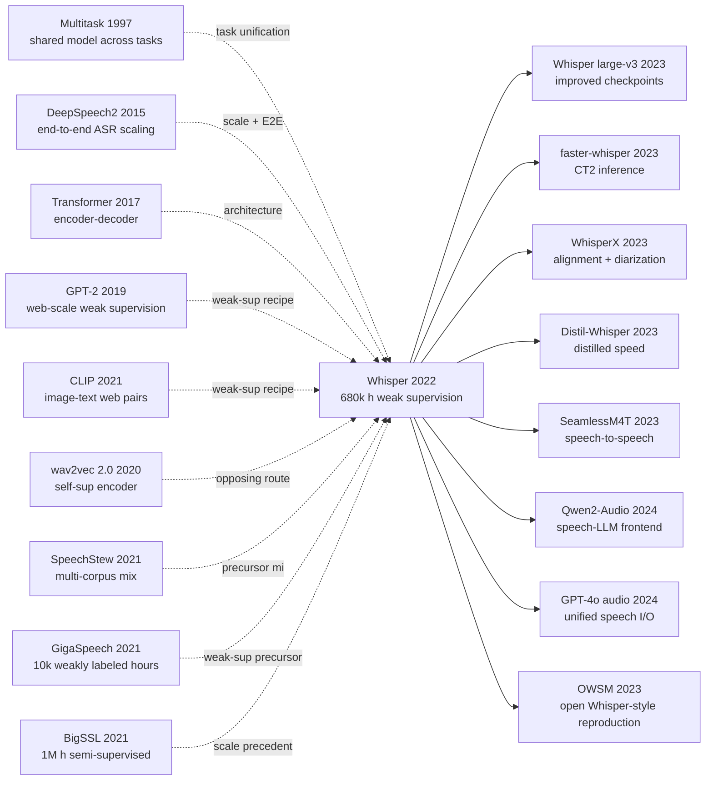

# Whisper - 用 68 万小时弱监督音频把语音识别做成通用接口

> 2022 年 9 月 21 日，OpenAI 在博客中发布并开源 [Whisper](https://arxiv.org/abs/2212.04356)：一个并不靠新奇结构取胜的语音识别系统，而是把 68 万小时互联网上的弱标注音频、99 种语言标记、转写/翻译/时间戳等任务压进同一个解码器接口。它真正改变的不是某个榜单分数，而是默认预期：一个语音模型可以开箱即用地跨口音、噪声、领域和语言工作，哪怕它从未见过目标数据集的训练集。

## 一句话总结

Alec Radford、Jong Wook Kim、Tao Xu、Greg Brockman、Christine McLeavey 与 Ilya Sutskever 在 2022 年发布、后发表于 ICML 的 Whisper，把语音识别从“为每个数据集微调一个模型”改写成“用 68 万小时弱监督音频预训练一个音频条件语言模型”：给定 30 秒音频的 Mel 特征，解码器最小化 $L(θ) = -Σ_t log p_θ(y_t | y_{<t}, Mel(x))$，其中输出序列同时包含语言、任务、时间戳和文本 token。相对 [wav2vec 2.0](2020_wav2vec2.md) 代表的“强编码器 + 下游微调”路线，Whisper 的反常识点在于不用自监督预训练和数据集微调，仍能在与 LibriSpeech 表现相近的条件下，对 12 个英语域外数据集平均少犯 55.2% 的错误，并在 CoVoST2 上以 zero-shot 达到 29.1 BLEU；它也留下了幻觉、重复、低资源语言和隐私治理这些没有被规模自动解决的问题。后续 WhisperX、faster-whisper、Distil-Whisper 与大批语音 LLM 工具，基本都在继承同一个判断：语音模型的核心竞争力不只是听清一句话，而是把真实世界的嘈杂音频变成可编程、可迁移的接口。

---

## 历史背景

### 1. 2022 年前，语音识别有两种不够满意的胜利

在 Whisper 之前，自动语音识别已经不像早期那样缺少神经网络或算力。Deep Speech 2 证明了端到端模型可以靠数据和分布式训练把英文、中文语音识别推到很强的位置；CTC、attention、RNN-T、Conformer 等路线也把“从声学特征到文字”的工程栈大幅简化。到 2020 年前后，LibriSpeech 这类干净朗读语音的分数已经低到接近甚至超过早期人类转写估计。问题是，这种胜利经常发生在训练分布和测试分布高度相似的场景里。

另一条胜利来自自监督语音表示学习。[wav2vec 2.0](2020_wav2vec2.md)、HuBERT、WavLM、XLS-R 说明，模型可以先听大量无标注音频，再用少量标注微调出强 ASR 系统。这条路线特别适合低标注设定，也让语音研究继承了 BERT 式预训练范式。可是它通常留下一个结构性缺口：预训练主要强化编码器，真正把声音映射成可用文本的解码器、文本格式、长音频策略、语言识别和翻译接口，仍然要在下游任务里处理。

Whisper 的论文开头把这个矛盾说得很直白：如果一个系统必须为每个数据集微调，才能在那个数据集上看起来“超人”，那么它测到的未必是通用语音理解能力，而是对某个标注风格、录音条件和评测协议的适配能力。对实际用户来说，更重要的问题是：陌生口音、会议录音、播客、背景噪声、代码词、专有名词、多语言切换，这些场景里模型是否不用重新训练就能工作。

### 2. 人类基准和机器基准测的不是同一种能力

Whisper 论文最有洞察力的历史判断，是重新解释“人类水平语音识别”。人类被要求转写一段 LibriSpeech 或 Kincaid46 录音时，并没有提前看过这个数据集的训练集；他们依赖的是多年语言经验、常识、听觉鲁棒性和上下文推断。机器模型如果在 LibriSpeech 上训练、调参、选择解码器，再去测 LibriSpeech test-clean，它的成绩更多是在测分布内泛化。

这不是细枝末节。论文引用 Deep Speech 2 当年关于 LibriSpeech test-clean 的人类表现讨论，又指出 2015 年以后 LibriSpeech 的机器分数继续大幅下降，但这些模型在其他英语数据集上仍然远高于人类错误率。换句话说，ASR 社区已经会把某个标准数据集做得极好，却还没有回答“同一个系统离开这个数据集以后还剩多少能力”。

Whisper 因此选择 zero-shot 评测。它复用很多已有数据集，但不使用这些数据集的训练 split；它在 LibriSpeech 上不追求最漂亮的单点数字，而是把 LibriSpeech 当作参考分布，再看其他 12 个英语数据集、噪声扰动、长音频、多语言和翻译任务上的变化。这个评测姿态后来影响很大：模型能力不再只等于榜单分数，而等于分布变化下的残余性能。

### 3. 弱监督在语音里曾经“不够优雅”

在 2022 年的研究气氛里，弱监督并不是最漂亮的答案。自监督学习有干净的目标函数和可公开复现的数据；半监督学习有伪标签、teacher-student、迭代过滤等明确技术路线；而互联网上的音频-文本对则充满噪声：字幕可能是机器生成的，文本可能和音频错位，语言检测可能出错，字幕风格可能省略标点和大小写，视频标题、说话人名字和广告词也可能混入转写。

但弱监督有一个朴素优势：带文本的音频本来就大量存在。Whisper 的关键不是假装这些数据干净，而是把噪声控制到“规模可以战胜”的范围。论文描述了多轮自动过滤：去掉疑似机器转写的文本，检查音频语言和 transcript 语言是否一致，用 fuzzy de-duplication 减少重复，训练早期模型后再按训练源错误率和规模人工检查低质量来源。它没有把数据工程包装成新模型结构，却让数据工程成为方法本身。

### 4. OpenAI 的弱监督谱系迁移到语音

Whisper 不是孤立出现的。Alec Radford 参与的 GPT-2 和 CLIP 都有类似味道：与其为每个任务设计一个小而精的监督数据集，不如从互联网上收集自然发生的弱标注对，让模型在大规模分布上学会可迁移接口。GPT-2 把很多 NLP 任务塞进语言建模；CLIP 把图像分类变成图文匹配和自然语言提示；Whisper 则把语音识别、翻译、语言识别、时间戳和无语音判断塞进序列到序列 token 预测。

这个谱系解释了 Whisper 为什么故意“普通”。论文没有提出新的注意力机制、复杂声学前端或新的自监督目标，而是采用可靠的 encoder-decoder Transformer。它的科学问题不是“我们能不能发明更酷的结构”，而是“如果我们把弱监督规模、任务格式和 zero-shot 评测放在中心，一个朴素结构能走多远”。答案是：远到足以改变语音基础模型的默认路线。

## 研究背景与动机

### 1. 论文真正要回答的问题

Whisper 的核心问题可以压缩成一句话：能否用弱监督构建一个开箱即用的通用语音处理系统，而不是一个需要为每个 benchmark 微调的 ASR 模型。这个问题包含三层含义。第一，模型应该在 zero-shot 场景下对陌生数据集有效；第二，它不应该只会英语短句转写，还要覆盖多语言、翻译、语言识别、时间戳和长音频；第三，它的鲁棒性应该接近人类在陌生录音上的表现，而不是只接近机器在分布内测试集上的表现。

这也是为什么论文大量篇幅在谈评测，而不是只谈训练。Whisper 把 LibriSpeech 作为参考点，是为了展示一个反直觉现象：两个模型在 LibriSpeech test-clean 上差不多，不代表它们在真实世界里差不多。与 wav2vec2-large-960h 这类 LibriSpeech 训练模型相比，Whisper large-v2 在 LibriSpeech 上没有压倒性优势，却在 Artie、Common Voice、FLEURS English、TED-LIUM、CHiME-6、CORAAL、AMI、Switchboard、CallHome、WSJ、VoxPopuli 等更杂的分布上显著更稳。

### 2. 为什么弱监督值得赌

论文不是说“数据越多越好”这么简单。它赌的是一个更具体的机制：多来源、多口音、多录音条件、多语言和多任务的弱标注数据，会迫使模型学习跨分布可用的声学-语言映射，而不是学会某个数据集的格式习惯。即使单条样本有噪声，只要过滤足够有效、覆盖足够广、模型容量足够大，噪声的代价会被分布多样性的收益压过。

这个赌注在 Table 6 中有直接证据。中等规模模型从 3,405 小时训练数据扩到 681,070 小时，英语 ASR 平均 WER 从 30.5 降到 9.9，多语言 WER 从 92.4 降到 29.2，CoVoST2 BLEU 从 0.2 升到 24.8。提升不是线性的，后期有明显边际递减，但方向非常清楚：对语音这种长尾极重的任务，覆盖广度本身就是能力。

### 3. 为什么要把多任务做成同一个解码器接口

传统语音系统常常是流水线：先做语音活动检测，再做语言识别，再选 ASR 模型，再做 inverse text normalization，再做翻译或时间对齐。流水线的好处是模块清晰，坏处是错误会传递，每个模块都要单独维护，跨语言和跨任务时复杂度迅速膨胀。Whisper 的动机是把这些决策都变成同一个 decoder 的 token 序列：语言是 token，任务是 token，是否输出时间戳是 token，无语音也是 token。

这看似只是工程接口，实际是一种基础模型思想。只要任务能表达为“给定音频和前文，预测下一组离散符号”，它就可以共享同一套模型参数、同一套训练数据和同一套解码器。语音识别因此更接近 NLP 的 prompt/task-token 范式，也更接近 CLIP 式的开放类别接口。Whisper 的方法部分不复杂，复杂的是它把语音系统里原本分散的边界全部收进一个统一训练目标。

### 4. 为什么这篇论文适合放进 foundation-model 时代

Whisper 的地位不只是“一个很好的开源 ASR”。它代表了 foundation model 时代向语音的迁移：模型先在巨大、异质、弱标注的数据上学到通用能力，然后通过提示、特殊 token、解码策略和少量工程包装服务很多下游场景。它不是为某个单一任务训练的模型，而是一个语音到文本世界的基础接口。

这也解释了它发布后的影响力。研究者把它当作鲁棒 ASR baseline，开发者把它当作字幕、会议纪要、播客处理和数据清洗工具，后续系统把它当作语音 LLM 的听觉前端。它的开源权重和 MIT 许可证让这种扩散变得非常快。Whisper 让很多人第一次相信：语音识别不必总是一个脆弱的专门系统，它可以像文本和视觉基础模型一样，被当成可复用的通用层。

---

## 方法详解

Whisper 的方法部分故意"普通"。论文没有发明新的注意力机制、新的声学前端或新的自监督目标，整个系统就是一个标准的 encoder-decoder Transformer 加一套精心设计的 token 接口与数据流水线。它真正的创新藏在三处：把多任务格式化成单一序列、把 30 秒音频窗当作"音频 prompt"、以及把弱监督数据工程当作方法本身的一部分而不是周边工程。

### 整体框架

输入端是 16 kHz 单声道音频，被切成不重叠的 30 秒窗口，每个窗口算成一段 80 通道的 log-magnitude Mel 频谱（25 ms 窗、10 ms 步长，即 3000 帧）。这段频谱先过两层宽度 3 的卷积，第二层步长 2，经 GELU 激活后加上正弦位置编码，再喂入 Transformer 编码器。解码器是同宽同深的 Transformer，吃一段以 `<|startoftranscript|>` 开头的 token 序列，做交叉注意到编码器输出，自回归预测下一组 token，直到 `<|endoftranscript|>`。整个管线没有 CTC、没有 RNN-T、没有外接语言模型，只是一个朴素的 seq2seq。

```
audio (16 kHz) ──► 30-s window
                    │
                    ▼
            log-Mel (80 × 3000)
                    │
            Conv1d(80→d, k=3) + GELU
            Conv1d(d→d, k=3, stride=2) + GELU   # 时间维 ÷2 → 1500 帧
            + sinusoidal positional embedding
                    │
                    ▼
            ┌──────────────────────────┐
            │ Transformer Encoder × N  │  (双向自注意)
            └────────────┬─────────────┘
                         │ (audio features, len 1500)
                         ▼
  prompt tokens ──► Transformer Decoder × N  (掩蔽自注意 + 交叉注意)
   (SOT, lang, task,                          │
    timestamp_mode, ...)                      ▼
                                  next-token logits → softmax
```

模型家族在论文里覆盖 5 个尺寸，编码器和解码器宽度与层数始终相同，只是统一缩放：

| 模型 | 层数 | 隐藏维 | 注意力头 | 参数量 |
|---|---:|---:|---:|---:|
| tiny | 4 | 384 | 6 | 39M |
| base | 6 | 512 | 8 | 74M |
| small | 12 | 768 | 12 | 244M |
| medium | 24 | 1024 | 16 | 769M |
| large | 32 | 1280 | 20 | 1550M |

**反直觉的是：在 Whisper 的设定里，结构同款放大几乎是唯一的尺度变量**，没有特殊宽度比、没有针对语音的 inductive bias 调整。所有"听懂世界"的能力靠数据规模与多任务接口分担，而不是靠架构。

### 关键设计 1：把所有语音任务压进一个 token 序列

**功能**：让一个解码器同时承担语言识别、转写、翻译、时间戳和无语音判断，避免为每种任务训一个模型。

**核心思路**：定义一组特殊 token，把任务参数显式写进序列。一段典型的训练目标序列形如：

```
<|startoftranscript|> <|en|> <|transcribe|> <|0.00|>
The quick brown fox <|2.34|> <|2.42|> jumps over the lazy dog <|4.10|>
<|endoftranscript|>
```

或者，给一段法语音频请求英文翻译时：

```
<|startoftranscript|> <|fr|> <|translate|> <|notimestamps|>
A quick brown fox jumps over the lazy dog <|endoftranscript|>
```

无语音段则会被压成单一 token：

```
<|startoftranscript|> <|nospeech|> <|endoftranscript|>
```

训练目标是标准的下一个 token 交叉熵：

$$
\mathcal{L}(\theta) = -\sum_{t=1}^{T} \log p_\theta\big(y_t \mid y_{<t},\, \mathrm{Encoder}(\mathrm{Mel}(x))\big)
$$

其中 $y_t$ 既可能是文本 BPE token、也可能是语言/任务/时间戳特殊 token。

**代码片段（PyTorch 风格简化）**：

```python
# magic line: 任务变成 prompt 而非分支头
def make_target_tokens(language, task, has_speech, transcript, timestamps=None):
    seq = [SOT]
    if not has_speech:
        return seq + [NO_SPEECH, EOT]
    seq.append(LANG_TOK[language])           # e.g. <|en|>, <|fr|>, ...
    seq.append(TASK_TOK[task])               # <|transcribe|> or <|translate|>
    if timestamps is None:
        seq.append(NO_TIMESTAMPS)
        seq.extend(bpe_encode(transcript))
    else:
        for (t0, text, t1) in timestamps:    # 量化到 20 ms
            seq.append(time_token(t0))
            seq.extend(bpe_encode(text))
            seq.append(time_token(t1))
    seq.append(EOT)
    return seq
```

**对比表：任务接口的几种可选实现**

| 方案 | 共享解码器 | 共享数据 | 加任务的成本 | 推理时切换 | Whisper 是否采用 |
|---|---|---|---|---|---|
| 每任务独立模型 | ✗ | ✗ | 需重训 + 维护 | 切模型 | ✗ |
| 共享编码器 + 多任务头 | ✗（多个头） | ✓ | 加新头 + 调权重 | 选头 | ✗ |
| 共享编码器 + 文本前缀（自然语言 prompt） | ✓ | ✓ | 写 prompt | 改前缀文本 | ✗（碰巧 token 化不稳定） |
| **共享编码器 + 解码器 + 任务 token**（本文） | ✓ | ✓ | 加 token 即可 | 改 SOT 序列 | **✓** |

**设计动机**：早期实验和论文表 5 都显示，把语言识别、转写、翻译塞进同一个解码器**不会显著伤害**任何单一任务，反而通过共享统计有助于低资源语言。更重要的是，这种设计让模型在推理时只换 prompt 不换权重 —— 用户可以在同一个 checkpoint 上随时切换"中文转写""法译英""带时间戳输出"，跟 GPT 系列用 prompt 切任务的范式一脉相承。Whisper 因此不是一个 ASR 模型，而是一个**音频条件下的语言模型**。

### 关键设计 2：30 秒固定窗口 + 长音频滑窗解码

**功能**：用一个固定输入长度同时支持短句和小时级别的音频，保持训练简单的同时让长音频可解。

**核心思路**：训练时所有样本都被切成 30 秒窗口（不足补静音），编码器输入永远是 $80 \times 3000$ 的 Mel。推理时长音频用步长 30 秒的滑窗送进模型，每窗解码出文本和时间戳，拼接得到全文。这种"固定窗口 + 滑动"的策略让训练侧不需要处理变长音频或 attention mask 复杂度，又把长音频问题转化为"每窗 30 秒 + 跨窗 token-level 拼接"。

为了让滑窗可拼接，论文加了一组解码侧启发式：beam search、温度回退（temperature fallback）、token 概率门槛、压缩比上限、`<|nospeech|>` 阈值，以及上一窗口预测文本作为下一窗口的 condition prompt。每条启发式各自只压一两个百分点，但叠起来对长音频 WER 影响显著。

```python
# magic line: 用上一窗口的输出作为下一窗口的 prompt，缓解上下文断裂
def transcribe_long(audio, model):
    out_tokens, results = [], []
    for window in slide(audio, win=30.0, stride=30.0):
        mel = log_mel(window)
        prompt = [SOT] + history_tokens(out_tokens, max_text=224)
        for T in [0.0, 0.2, 0.4, 0.6, 0.8, 1.0]:        # temperature fallback
            cand = beam_decode(model, mel, prompt, T)
            if quality_ok(cand):                          # logprob/compression checks
                break
        results.append(cand)
        out_tokens.extend(cand)
    return stitch(results)
```

**对比表：长音频处理策略**

| 策略 | 训练复杂度 | 推理可控性 | 时间戳精度 | 跨段一致性 | Whisper |
|---|---|---|---|---|---|
| 全长 self-attention | 高（O(T²)） | 差 | 高 | 自然连续 | ✗ |
| 块状 attention + 上下文记忆 | 中 | 中 | 中 | 中 | ✗ |
| 流式 RNN-T / chunked CTC | 中 | 易做 streaming | 中 | 易漂移 | ✗ |
| **30 s 滑窗 + token prompt 续写**（本文） | 低 | 易加启发式 | 20 ms 量化 | 靠 prompt 维持 | **✓** |

**设计动机**：30 秒是一个工程取舍 —— 长到能覆盖大部分自然句和段落、短到 self-attention 仍便宜（$T=1500$），也方便弱监督数据切片。⚠️ **这种简化的代价是清晰的**：长音频上的幻觉（hallucination）和重复循环主要源于 30 秒之外没有真实上下文，模型只能靠 prompt 中的若干 token 推测。这是 Whisper 在自家局限里反复点名的失败模式，也是 WhisperX 等下游项目要重新做强对齐和分段的根本原因。

### 关键设计 3：把数据工程当作方法本身

**功能**：把 68 万小时互联网音频-文本对从"完全不能用"压到"规模能压过噪声"，并在训练循环里持续修。

**核心思路**：Whisper 不假装互联网数据干净，而是把数据清洗变成多轮、可迭代、随模型迭代的流程：

1. **来源诊断**：先按 transcript 风格识别并丢弃机器转写文本（如全大写无标点、特定 ASR 模型留下的格式痕迹）。
2. **音频-文本语种一致性**：用现成的语种识别检查音频与转写是否同一语言；如果音频是非英语而文本是英语，就把这条样本归入"X→英语翻译"任务而不是丢掉。
3. **去重**：fuzzy de-duplication 防止同一段视频不同字幕版本重复进入训练集。
4. **训练后回看**：训练一版初始模型后，按"训练源 × 平均 WER × 数据量"排表，人工抽检 WER 异常高且体量大的来源，针对性丢掉或修。

下面这段伪代码刻画训练-清洗的耦合循环：

```python
# magic line: 数据清洗依赖当前模型的预测，而不是只靠静态启发式
def iterate_clean(corpus, model_initial):
    model = model_initial
    for round_id in range(K):
        kept = []
        for src in corpus.sources:
            samples = src.load()
            # filter 1: drop machine-style transcripts
            samples = [s for s in samples if not looks_like_machine(s.text)]
            # filter 2: language match (or relabel as translation)
            samples = [relabel_or_keep(s, langid(s.audio)) for s in samples]
            kept.extend(samples)
        kept = fuzzy_dedup(kept, key="text")
        model = train(model, kept)
        # filter 3: per-source error inspection after training
        bad = [s for s in samples_with_high_wer(model, kept) if src_volume(s) > THRESH]
        corpus.drop_sources(of=bad)
    return model
```

**对比表：弱监督数据策略**

| 策略 | 数据规模 | 噪声容忍 | 多任务覆盖 | 复现成本 | 代表工作 |
|---|---|---|---|---|---|
| 学术干净监督（LibriSpeech 类） | 1k h | 低 | 单语单任务 | 低 | DeepSpeech2 |
| 多语料混合（SpeechStew） | 5k h | 中 | 多领域 | 中 | SpeechStew |
| 弱标注 ASR | 10-30k h | 较高 | 多领域单任务 | 中 | GigaSpeech, People's Speech |
| 自监督 + 微调 | 1M h 无标注 + 千 h 标注 | 通过双阶段隔离 | 由微调决定 | 高 | wav2vec 2.0, BigSSL |
| **多任务弱监督 + 多轮清洗**（本文） | **680k h** | 高 | 多语 + ASR + 翻译 + 时间戳 | 高 | **Whisper** |

**设计动机**：从 SpeechStew 的 5,140 小时、GigaSpeech 的 10,000 小时、People's Speech 的 30,000 小时，到 Whisper 的 680,000 小时，**两个数量级的跨越靠的不是新模型而是新数据流水线**。表 6 直接说明这赌注的回报：在中等规模模型上把数据从 3,405 小时扩到 681,070 小时，英语 ASR 平均 WER 从 30.5 降到 9.9，多语言 WER 从 92.4 降到 29.2，CoVoST2 BLEU 从 0.2 升到 24.8。这意味着在语音这种长尾极重的任务里，**数据多样性本身就是能力**，干净几千小时换不来同样的鲁棒性。

### 训练策略与超参

| 项目 | 取值 | 备注 |
|---|---|---|
| Loss | 标准 next-token cross-entropy | 不加 CTC 辅助、不加对比损失 |
| Optimizer | AdamW | $\beta_1=0.9, \beta_2=0.98, \epsilon=10^{-6}$ |
| LR schedule | linear warmup → linear decay to 0 | warmup 2048 步 |
| Peak LR | $\sim 1.5\times10^{-3}$（tiny）→ $\sim 1.0\times10^{-4}$（large） | 随尺寸下降 |
| Batch | 256 段 30 秒音频 | 即每步 ~2 小时音频 |
| Updates | $2^{20}$ ≈ 1.05M 步 | 见过约 2-3 个 epoch |
| Tokenizer | GPT-2 BPE，多语扩展词表 | 50,257 + 特殊 token |
| 正则 | label smoothing = 0、SpecAugment 关 | 放弃常见 ASR 正则 |
| 数据增广 | 部分模型加 SpecAugment + 标签噪声 | 仅在 large-v2 训练 |

**注意 1**：Whisper 故意**不依赖** SpecAugment / 自监督 / 半监督等"语音必备"技巧，把所有正则压力交给数据规模与多样性。这与 wav2vec 2.0 的 BERT 范式形成正面对比：前者认为表征学习是方法核心，后者把表征学习外包给"听足够多音频"。

**注意 2**：训练在 V100 上几十万 GPU-小时量级，比同期文本 LLM 便宜两个数量级，但贵在数据采集与清洗。对想复现 Whisper 的团队，**真正的门槛不是算力或权重，而是 68 万小时合规、多语、多领域、可清洗的音频-文本对**。这也是为什么 Whisper 开源权重被广泛复用，但很少有团队从头复现整个训练管线。

---

## 失败案例

Whisper 的对手并不是 LibriSpeech 上更高的分数，而是一整套"在自己分布里看起来很完美、出了分布就崩"的语音系统。论文用 zero-shot 评测把这些系统的隐含假设拆开看：表征、监督协议、流水线、benchmark 选择，每一项都被重新讨论过。下面 4 个 sub-section 分别从"对手""作者承认的失败实验""2022 年的反例""真正的反 baseline 教训"四个角度梳理。

### 当时输给 Whisper 路线的对手

Whisper 不是要赢一个新榜单，而是要证明"在 LibriSpeech 之外，今天最强的英文 ASR 模型其实非常脆弱"。论文里点名最多的几个对手分别承担不同的"失败角色"：

1. **wav2vec 2.0 LARGE (960 h LibriSpeech 微调)**：自监督 + 微调路线最干净的代表。在 LibriSpeech test-clean 上和 Whisper large-v2 几乎打平（约 2.5 WER 量级），但在论文表 2 报告的 12 个其他英语 ASR 数据集（Artie、Common Voice 5.1、CHiME-6、CORAAL、AMI、TED-LIUM3、Switchboard、CallHome、WSJ、VoxPopuli English、FLEURS English、Earnings-21）的平均上，**zero-shot Whisper large-v2 比它少犯 55.2% 的错误**。失败原因不是模型不强，而是它的训练分布和评测分布几乎重合：表征学到了"LibriSpeech 风格的朗读语音"，没学到"全互联网风格的语音"。

2. **HuBERT-X / WavLM Large 的同类微调系统**：和 wav2vec 2.0 共享同一种架构哲学（自监督编码器 + 任务微调）。这类模型在 LibriSpeech 极强，但跨域稳定性同样有限。论文不点名打分，但 wav2vec 2.0 的"55.2% 多余错误"被当作整条路线的代表性数字。

3. **SpeechStew (5,140 h) 这类多领域监督混合**：把 LibriSpeech、Common Voice、TED-LIUM、CHiME 等 7 个数据集合在一起训练，证明了多领域混合能改善鲁棒性。问题是规模差了两个数量级 —— Whisper 用 680,000 小时之后，多领域混合本身已经不是稀缺品。SpeechStew 的失败教训是：**没有规模托底的多样性容易被单数据集偏差吞掉**。

4. **GigaSpeech 10k h / The People's Speech 30k h 上的弱监督模型**：弱监督的"中间一代"，证明了网络音频可以作为训练源，但它们的训练目标只是"更稳的 ASR"，没有把翻译、时间戳、语种识别打包进同一个解码器。Whisper 的对照表明：**只在 ASR 任务上放大数据，不如在 ASR + 翻译 + 多语言 + 时间戳上同时放大**。

5. **BigSSL（最高约 100 万小时半监督音频）**：规模上甚至超过 Whisper，但它把所有重投入放在自监督编码器和伪标签微调流水线上。Whisper 的论点是：**这种流水线把"听"和"写"切开，下游任务依然要单独做工程**；同样的算力投到"端到端弱监督 + 多任务 token 接口"上能换出更通用的接口。

6. **Deep Speech 2 框架下的"超人 LibriSpeech"叙事**：DS2 时代曾报告 ASR 在 LibriSpeech test-clean 上接近人类。Whisper 把这条结论摆到正面：**人类做这项任务时是 zero-shot 的，机器把训练集和评测集对齐过；两个"超人"测的不是同一种能力**。这不是某个模型输了，而是整个评测协议输了。

这组对手的共同失败模式不是"准确率低"，而是**把语音识别当成一个分布内问题来优化**。Whisper 把它重新定义成一个"任意分布、任意任务、任意语言"的接口问题，于是上面这些 baseline 都从局部冠军变成局部样本。

### 作者论文里承认的失败实验

Whisper 的论文不是"全胜公告"。多个表和讨论里都明确写出"我们这一项不是 SOTA"或"我们这一类失败"：

- **多任务联合训练在英语 ASR 上不是免费午餐**。论文 §3.4 / 表 5 报告的多任务 vs 单任务对比里，纯英语 ASR 的小模型在加入翻译、语种识别后会有非常轻微的退化；只有当模型放大、数据放大之后，多任务的代价才被补回来。这意味着**小模型直接复制 Whisper 配方未必划算**。
- **VoxPopuli 13.6 WER**：表 3 报告 zero-shot Whisper 在 VoxPopuli 上不仅没有打过专门微调的模型，反而比一些更小的监督系统更差。论文坦白原因：训练数据里议会风格、欧盟会议风格的音频偏少，分布缺口直接拉高错误率。
- **FLEURS 语种识别 64.5%**：论文 §5 / 表 8 明说 Whisper 的语种识别比专门训练的语种识别系统差不少，部分原因是 FLEURS 包含 20 种 Whisper 训练数据里完全没有的语言。**没见过的语言，零样本依旧零样本**。
- **长音频解码失败模式 vs 启发式叠加**：表 7 报告每加一个解码启发式（beam search、温度回退、上下文 prompt、压缩比限制、`<|nospeech|>` 阈值、初始时间戳约束）只压一两个百分点 WER，但**任何一项关掉**都会出现幻觉、循环或漏段。论文承认这套启发式是工程权宜，没有清洁的端到端解决方案。
- **CHiME-6 / 远场 / 重叠说话**：复杂声学条件下 Whisper 的相对优势收窄；多说话人没有 diarization，重叠时基本无法正确分配文本。模型卡和论文都明说 Whisper 不解决说话人分离。

这些"自承认失败"反过来增强了论文可信度：它没有把"通用接口"包装成"任意场景任意 SOTA"，而是把使用边界写得非常清楚。

### 2022 年的反例：规模没解决的问题

Whisper 在 2022 年底放出来后，迅速暴露了几条**规模本身不解决**的失败：

1. **幻觉文本**：在长静音、低能量、强音乐背景下，Whisper 会"补全"音频里其实不存在的文本（典型如重复某段广告、自动翻译网站介绍、虚构的"Thank you for watching"）。这是弱监督语言模型先验在训练集里学到了字幕模板的副产物。
2. **重复循环**：seq2seq 解码在某些段落会陷入"同一短语重复几十次"，温度回退能缓解但不能根治。
3. **低资源语言不平衡**：FLEURS 里 20 种没见过的语言之外，还有大量训练集只有几十小时的语言（如部分非洲、东南亚语言）几乎不可用；论文 §5 / 表 D.1 承认 WER 跨语言方差极大。
4. **方言与口音**：模型卡明说 Whisper 在不同英语方言（CORAAL 黑人英语、苏格兰口音等）上的表现不均衡。

这些失败催生了后续整整一代工程项目：WhisperX 用强对齐压幻觉、faster-whisper 加 VAD 切片避免循环、Distil-Whisper 蒸馏出更便宜的子集。**规模解决了"什么时候能用"，但没自动解决"什么时候不能用"**。

### 真正的反 baseline 教训

把 2020-2022 这一波语音 baseline 整体收敛到一句工程哲学：

> **语音模型的鲁棒性不是更好的表征学出来的，是被更广的分布逼出来的。**

这句话有 3 个具体含义：

- **vs wav2vec 2.0 路线**：自监督编码器很优雅，但只学"听"不学"写"。当下游任务格式（标点、大小写、专有名词、多语切换）很复杂时，编码器再强也救不回解码器侧的格式适配缺口。Whisper 的胜出说明：**语音系统的瓶颈在解码器和数据多样性，不在编码器**。
- **vs 学术干净监督**：LibriSpeech test-clean 是个 alignment 不错的小世界，但工程现实是会议、播客、客服、视频字幕、医疗记录。多年的"在 LibriSpeech 上越做越低的 WER"很大程度上是分布内过拟合的奖励。
- **vs 流水线模块化**：传统语音系统把 VAD、语种识别、ASR、翻译、时间戳分成模块，每个模块各自优化。Whisper 把它们都收进 token 序列后，**模块边界变成训练数据的一部分**，意外地比逐模块工程更可维护。

这条工程哲学后来不仅扩散到语音 LLM，也成了多模态基础模型的隐性默认：**先用一个统一接口吃下杂乱真实数据，再在接口外面加专用工程**，而不是反过来。

---

## 实验关键数据

### 主实验：英语 ASR 鲁棒性对比（Whisper 论文表 2 摘录）

| 模型 | 训练数据 | LibriSpeech test-clean WER | 12 个其他英语数据集平均相对错误 |
|---|---|---:|---:|
| wav2vec 2.0 LARGE (960 h LS 微调) | 自监督 + LibriSpeech 微调 | 2.7 | 基准（100%） |
| NVIDIA STT en Citrinet 1024 (Gigaspeech) | Gigaspeech 监督 | 3.7 | ~78% |
| HuBERT X-Large | 自监督 + LibriSpeech 微调 | ~2.4 | ~95% |
| **Whisper large-v2 (zero-shot)** | **680k h 弱监督** | **2.7** | **44.8%（即少犯 55.2%）** |

数字按论文表 2 的"effective robustness"叙述整理；wav2vec 2.0 在 LibriSpeech 上几乎打平 Whisper，但跨数据集错误是 Whisper 的 2.2 倍。

### 多语言 / 翻译 / 数据规模（Whisper 论文表 3 / 4 / 6 摘录）

| 评测 | 指标 | 数字 | 说明 |
|---|---|---:|---|
| Multilingual LibriSpeech (zero-shot) | WER | 7.3 | 表 3，比一些专门系统更好 |
| VoxPopuli (zero-shot) | WER | 13.6 | 表 3，远低于专门微调系统 |
| CoVoST2 X→En 总体 (zero-shot) | BLEU | 29.1 | 表 4 |
| CoVoST2 中资源 (zero-shot) | BLEU | 32.6 | 表 4 |
| CoVoST2 低资源 (zero-shot) | BLEU | 25.2 | 表 4 |
| FLEURS 语种识别 | acc | 64.5% | 表 8，弱于专门系统 |
| 数据规模 3,405 h → 681,070 h（medium 模型） | 英语 ASR WER | 30.5 → 9.9 | 表 6 |
| 数据规模 3,405 h → 681,070 h（medium 模型） | 多语言 WER | 92.4 → 29.2 | 表 6 |
| 数据规模 3,405 h → 681,070 h（medium 模型） | CoVoST2 BLEU | 0.2 → 24.8 | 表 6 |

### 关键发现

- **发现 1**：与同等 LibriSpeech 表现的 wav2vec 2.0 相比，zero-shot Whisper 在 12 个域外英语数据集上少犯 55.2% 的错误 —— **同样的 in-distribution 分数，差出 2.2 倍的 out-of-distribution 错误**。
- **发现 2**：数据规模从 3,405 小时到 681,070 小时（约 200 倍），多语言 WER 从 92.4 降到 29.2，CoVoST2 BLEU 从 0.2 升到 24.8 —— **多语言能力几乎是 0 → 可用的相变，不是渐进改善**。
- **发现 3**：在 CoVoST2 上 zero-shot Whisper 接近甚至超过当时专门为翻译训练的监督系统，特别是低资源对（25.2 BLEU）。表明**翻译能力不一定来自专门翻译数据，也可以来自"非英语音频 + 英语字幕"这种弱监督副产品**。
- **发现 4（反直觉）**：在 LibriSpeech test-clean 上 Whisper 没有打破纪录（large-v2 约 2.5-2.7 WER），但在论文给出的 14 个其他英语数据集和噪声扰动里它是最稳的。**单点 SOTA 不等于通用能力**。
- **发现 5**：长音频 WER 改善里没有一个"主要功臣" —— 5 个解码启发式（beam search、温度回退、上下文 prompt、压缩比、`<|nospeech|>` 阈值）每个只贡献一两个百分点，但任何一项关掉都会引入幻觉或循环。**鲁棒长音频解码是启发式拼图，不是单一公式**。
- **发现 6**：FLEURS 上 Whisper 的语种识别 64.5%，输给专门的语种识别系统。**多任务接口在每个任务上未必都最强，但加起来覆盖更广** —— 这是基础模型典型 trade-off。

---

## 思想史脉络



### 前世（被谁逼出来的）

- **1997 Multitask Learning** [Rich Caruana]：第一篇系统化论证"一个模型联学多个相关任务能互相增益"的工作，给了 Whisper 把语种识别、转写、翻译、时间戳压进同一个解码器最早的思想合法性。
- **2015 Deep Speech 2** [Amodei、Anubhai、Battenberg 等 14 位作者]：第一次把端到端神经 ASR 在英语和普通话上一并打到强位置，证明端到端 + 数据规模可以替代复杂的声学-语言流水线，也留下了"在 LibriSpeech 上接近人类"这个 Whisper 后来要重新解释的命题。
- **2017 Attention Is All You Need** [Vaswani、Shazeer、Parmar 等 8 位作者]：encoder-decoder Transformer 是 Whisper 直接拿来用的架构，论文承认"我们没有架构创新"，把所有创新都让给数据与任务接口。
- **2019 GPT-2 (Language Models are Unsupervised Multitask Learners)** [Radford、Wu、Child 等 4 位作者]：奠定了 OpenAI 的"在互联网量级弱监督上预训练 + 用提示/任务格式调用能力"的范式。Whisper 是这个谱系在语音域的直接迁移：把"任务"写进 token 序列。
- **2020 wav2vec 2.0** [Baevski、Zhou、Mohamed、Auli]：在 Whisper 之前主导语音预训练的对照路线（自监督编码器 + 下游微调）。Whisper 论文的整个评测哲学（zero-shot、跨数据集稳健性）都是为了与这条路线正面对照。
- **2021 SpeechStew** [Chan、Park、Lee 等 6 位作者]：用 5,140 小时混合数据证明多领域监督混合能改善鲁棒性，是 Whisper 弱监督思路的"小一号原型"。Whisper 把规模再放大两个数量级。
- **2021 GigaSpeech / People's Speech**：把弱监督转写音频从学术规模拉到 10k-30k 小时量级，是 Whisper "弱标签 + 互联网规模"路线的直接前驱。

### 今生（继承者）

- **直接派生**：
  - **Whisper large-v2 / large-v3 / turbo (2022-2024, OpenAI)**：原作者团队继续放大数据、训练步数与解码效率，large-v3 把多语言尾部覆盖再往前推一截。
  - **faster-whisper (2023, SYSTRAN)**：基于 CTranslate2 把 Whisper 推理重写为高效 C++ + 量化路径，把云端 ASR 服务的成本压到边缘可部署。
  - **WhisperX (2023, Bain et al.)**：在 Whisper 上加 wav2vec2 强对齐 + pyannote diarization，补齐 Whisper 自己承认的时间戳精度和说话人分离短板。
  - **Distil-Whisper (2023, Hugging Face)**：用知识蒸馏把 Whisper-medium / large 压成几倍快的小模型，反映了原版发布后的部署压力。
  - **OWSM (2023, CMU + 多机构)**：Whisper 风格架构 + 多任务接口的开源全栈复现，证明配方可被学术界端到端重做。
- **跨架构借用**：
  - **SeamlessM4T (2023, Meta)**：把 Whisper 式"统一语音接口"的思想推到 speech-to-speech、speech-to-text、text-to-speech 的全矩阵基础模型。
  - **Voicebox / VALL-E**：在 TTS 与语音生成方向把"任务用 token 决定"的理念反向应用到生成端。
- **跨任务渗透**：
  - **Qwen2-Audio / Qwen-Audio / SALMONN (2023-2024)**：把 Whisper 编码器当作语音 LLM 的听觉前端，让大语言模型直接吃音频条件输入。
  - **GPT-4o audio / Gemini live (2024)**：商用多模态助手把 Whisper 风格的语音前端 + 文本 LLM + 语音生成串成端到端对话循环。
  - **数据清洗工具**：研究界普遍用 Whisper 给未标注音频自动转写来构造下游 TTS / 语音对齐 / 说话人识别的伪标签。
- **跨学科外溢**：
  - **生态学 / 鸟鸣识别**：研究者复用 Whisper 编码器迁移到野生动物声学事件检测，反映 log-Mel + Transformer 的迁移半径。
  - **医学转写 + 法律转写**：行业级转写产品把 Whisper 当作"听写底座"，再叠加领域术语校正，加速了医疗会诊、法庭记录的数字化。

### 误读 / 简化

- **误读 1：Whisper 证明"自监督已经过时"**。更准确的说法是：在弱监督数据极大、且能容忍噪声的语音场景下，端到端弱监督比自监督 + 微调更省工程；但在数据更稀缺、标注更可控的设定（小语种、专业领域），自监督仍然有结构性优势。Whisper 论文自己也在 §6 / §7 反复强调"我们的对比是给定数据规模和任务格式后的对比"。
- **误读 2：开源 Whisper 权重等于开源 Whisper 复现**。OpenAI 只发布了模型权重和推理代码，**没有发布训练数据、数据清洗代码、训练脚本**。后续社区项目（OWSM、Voxtral 之类）需要数年时间才能逼近原配方，说明 Whisper 的核心资产之一是数据流水线本身。
- **误读 3：把多任务 token 接口当作"提示工程"，可以无限扩展任务**。事实上，加新任务需要重新训练 —— prompt 是 token，不是 in-context learning。Whisper 模型卡也明确反对未经训练就用它做属性识别、说话人识别等"接口看起来支持"但权重并不真正具备能力的任务。

---

## 当代视角

### 站不住的假设

1. **假设：30 秒固定窗口足够覆盖大部分语音任务**
   2022 年这个假设很自然，因为大部分公开 ASR 评测都在短句到段落量级。但 2024-2026 的实际部署里，会议纪要、播客、长视频、连续口译都要求几十分钟到几小时的连贯上下文。Qwen2-Audio、Voxtral、GPT-4o audio 等更新一代系统普遍把音频上下文延长到几分钟甚至更长，并采用更结构化的分段记忆，证明 30 秒窗口是 Whisper 在长音频上幻觉与重复循环的结构性根源。

2. **假设：弱监督互联网音频可以无限度扩展**
   Whisper 默认互联网上的音频-文本对池子近乎无限且可持续清洗。但 2024 年后的现实是：高质量字幕数据被多家公司和模型快速消耗、版权与授权争议升温（OpenAI 当时未公开数据来源招致后续法律质疑）、合成音频（TTS 生成）日益污染网络音频池。下一代弱监督需要正面处理"数据合规"和"合成内容反污染"。

3. **假设：转写 + 翻译 + 语种识别 + 时间戳是语音任务的全集**
   今天的语音应用已经远超这四类：说话人分离、情绪识别、副语言信息（笑声、犹豫、强调）、流式低延迟、与文本 LLM 的双向交互、语音生成回路、隐私保护推理。Whisper 的统一接口在 2022 年是"宽"，在 2026 年只是"窄而深"。SeamlessM4T、GPT-4o audio 都在重新定义这个全集。

4. **假设：MIT 许可 + 模型权重 = 完整开源**
   Whisper 的开源策略在 2022 年是行业标杆，但留下了一个空缺：没有训练数据、没有清洗脚本、没有训练曲线。2023 年之后社区逐渐意识到，**开放权重不等于可复现研究**。OWSM、AmberWhisper 等社区复现项目用了相当大代价才证明配方可重做，说明真正的"基础模型开源"标准比 2022 年要高得多。

### 时代证明的关键 vs 冗余

**仍然关键的部分**：

- **数据多样性 > 数据干净度**。在长尾任务里，规模与覆盖压过单点干净度，这条结论被多模态基础模型（CLIP、Whisper、SAM、Sora 数据策略）反复验证。
- **任务用 token 而非头来表达**。所有 2023-2026 的多模态基础模型几乎都继承了这个接口选择。
- **zero-shot 跨分布评测**比单榜单 SOTA 更能反映通用能力。LLM、VLM、speech-LLM 评测都接受了这个范式。
- **解码侧启发式叠加**对长序列输出的工程价值。OpenAI 后续 GPT-4 / o1 系列在长 chain-of-thought 解码上同样采用启发式（best-of-N、self-consistency、温度调度）控制失败模式。

**逐渐冗余或需要改写的部分**：

- **不依赖 SpecAugment / 数据增强**：在数据量更稀缺的设定下被证明仍然有效；只有在 68 万小时这种规模上才能放弃增强。
- **30 秒固定窗口**：被更长上下文方案取代。
- **不解决说话人分离**：在产品语境里几乎是必需功能，被 WhisperX、pyannote 等下游工程显式补齐。
- **transcript 端不做格式标准化**：2024 年后用户更期望直接拿到带标点、有段落、可朗读的文本，需要后处理。

### 作者当时没想到的副作用

1. **Whisper 成为下一代语音 LLM 的标准听觉前端**。从 SALMONN 到 Qwen2-Audio 再到 GPT-4o，Whisper 编码器或其变体几乎是所有 speech-LLM 的默认选择。论文当时定位是"通用 ASR/翻译"，没想到自己会成为多模态生态里"听"这一模态的事实标准接口。
2. **Whisper 反向催生了一整代"压幻觉、加对齐、做分离"的工程项目**。WhisperX、faster-whisper、stable-ts、insanely-fast-whisper 等工程项目几乎全部生于 Whisper 自己点名的局限。论文只是承认问题，社区把问题当作创业机会。
3. **Whisper 改变了"数据是产品"的认知**。OpenAI 选择只发布权重不发布数据后，整个研究社区开始更严肃地讨论"数据 stack 是不是真正的护城河"。这股讨论后来直接影响了 LLaMA 系列、Stable Diffusion 数据透明度、欧盟 AI Act 数据来源条款。
4. **Whisper 让"AI 听写"成为消费级商品**。Otter、Notta、飞书妙记、苹果 Live Captions、YouTube 自动字幕背后或多或少有 Whisper 或其衍生模型，普通用户第一次大规模接触到一个"够用的免费 ASR"，间接重塑了播客、会议、教育视频的工作流。

### 如果今天重写

如果作者团队在 2026 年重写 Whisper，目标函数可能扩展为：

$$
\mathcal{L}^{*} = \mathcal{L}_{\text{seq}}(\theta) + \lambda_{1}\,\mathcal{L}_{\text{long-ctx}}(\theta) + \lambda_{2}\,\mathcal{R}_{\text{halluc}}(\theta) + \lambda_{3}\,\mathcal{R}_{\text{license}}(\mathcal{D}) + \lambda_{4}\,\mathcal{L}_{\text{streaming}}(\theta)
$$

其中 $\mathcal{L}_{\text{long-ctx}}$ 是显式长上下文目标、$\mathcal{R}_{\text{halluc}}$ 惩罚与音频不一致的输出、$\mathcal{R}_{\text{license}}$ 对训练数据的版权与同意度做正则、$\mathcal{L}_{\text{streaming}}$ 兼容流式低延迟解码。

具体可能改写的点：

- **上下文窗扩到几分钟**，并显式建模跨段记忆，而不是靠 30 秒滑窗 + prompt token 模拟。
- **训练数据来源公开 + 同意度可审计**，配套数据清洗代码与训练脚本一并发布。
- **加入说话人分离与副语言 token**（笑声、停顿、情绪），让接口与今天的语音 LLM 对齐。
- **支持流式输出**，把推理 latency 降到几百毫秒，覆盖实时会议与同声传译。
- **训练目标里显式惩罚幻觉**，例如用音频条件下的 NLL 与无音频条件下的 NLL 之差作为锚，迫使模型只输出"被音频证据支持"的文本。

但有一个核心判断**不会变**：**语音模型的核心竞争力是把真实世界的杂乱音频变成一个可编程接口**。无论是 30 秒窗口、Mel 频谱、还是 BPE token，这些是工程取舍；真正不动的是"统一接口 + 弱监督规模 + zero-shot 评测"这三件套，它们至今仍是 SeamlessM4T、Qwen-Audio、GPT-4o audio 等下一代系统的隐性默认。

---

## 局限与展望

### 作者承认的局限

- **幻觉与重复循环**：弱监督先验在低能量、长静音、强背景音乐下会"补"出音频中并不存在的文本。
- **跨语言不平衡**：117k 小时虽覆盖 96 种非英语语言，但分布严重长尾，少数语言只有几十小时甚至更少；FLEURS 上有 20 种是完全没见过的语言。
- **跨方言不平衡**：CORAAL、苏格兰口音等子群体上的 WER 显著高于主流口音。
- **不解决说话人分离**：多人重叠场景需要外接 diarization。
- **非实时**：默认推理使用 30 秒窗口 + 启发式解码，不是为流式低延迟设计。
- **隐私与合规风险**：未经同意的转写、监控用途、属性识别都是模型卡明确反对的使用场景。

### 自己发现的局限（站在 2026 视角）

- **训练数据的版权与许可不透明**：Whisper 没有公开训练数据来源，到 2024 年这一空缺成为越来越多 AI 公司面临的法律与伦理问题。
- **30 秒窗口与现代长音频任务脱节**：长会议、长播客、连续口译的实际上下文已经超过单个 30 秒窗口能维系的逻辑连贯性。
- **缺少与文本 LLM 的双向接口**：Whisper 输出 token 序列，但没有显式地为"被语言模型继续推理"做接口设计；speech-LLM 的兴起暴露了这个缺口。
- **副语言信息丢失**：笑声、强调、犹豫、情绪在 Whisper 输出里几乎不可见，而这些是后续多模态对话系统的必需输入。
- **合成音频污染**：训练池里逐年增加的 TTS 生成音频会让"互联网音频代表真实人类语音"这一假设衰减。

### 改进方向（已被后续工作证实）

- **强对齐 + 说话人分离的下游补齐**：WhisperX、insanely-fast-whisper-diarization 把外部对齐和 pyannote diarization 接到 Whisper 之后，证明这条路工程可行。
- **端到端速度与压缩**：Distil-Whisper、faster-whisper、whisper.cpp 把推理成本砍掉一个数量级，让 Whisper 能跑在手机和浏览器里。
- **统一速度模型**：SeamlessM4T、GPT-4o audio 把转写、翻译、语种、说话人、生成五件事压进同一个端到端模型，本质上是 Whisper 接口思想的"再统一一次"。
- **流式低延迟**：StreamingWhisper、WhisperLive 等项目通过更小的窗口 + 更激进的解码缓存把延迟拉到几百毫秒级，证明 Whisper 配方可被流式化。
- **与 LLM 的紧耦合**：speech-LLM（Qwen2-Audio、SALMONN、Audio-Flamingo）证明 Whisper 编码器可以作为 LLM 的听觉模态前端，无需重新设计声学网络。

---

## 相关工作与启发

- **vs wav2vec 2.0**：wav2vec 2.0 走自监督编码器 + 微调路线，Whisper 走端到端弱监督 + 多任务接口。区别在于"是否把表征学习外包给数据规模"。Whisper 的优势是开箱即用、跨域稳；劣势是对数据采集与清洗的工程依赖更重。**教训：表征学得再好，下游格式不对齐还是要重做工程。**
- **vs DeepSpeech 2**：DS2 是端到端 ASR + 数据规模的早期里程碑，但只在英语 + 普通话两种语言上做规模化，且只优化转写任务。Whisper 把这条路线推到 99 种语言、4 类任务、680k 小时。**教训：先把任务集合扩大，再谈每个任务的极限。**
- **vs SpeechStew / GigaSpeech**：同样是多源弱监督，但规模差两个数量级，且没有把翻译、时间戳、语种识别合到同一个解码器。**教训：在基础模型时代，"多任务 + 大规模 + 单接口"三件套比单独优化任何一件更具溢价。**
- **vs CLIP**：CLIP 把图像识别变成图文匹配 + 自然语言提示，Whisper 把语音识别变成音频条件 token 预测 + 任务 token 提示。两者都是 OpenAI 弱监督谱系在不同模态的实例。**教训：模态变了，接口设计的"任务即 token"哲学不变。**
- **vs SeamlessM4T**：SeamlessM4T 是 Whisper 接口思想的下一代继承者，把语音生成回路也压进同一个基础模型。Whisper 是"语音到文本"的统一接口，SeamlessM4T 是"语音到语音 + 语音到文本"的统一接口。**教训：每一代基础模型都在重新定义"统一接口"的边界，今天的 SOTA 是明天的子集。**

---

## 相关资源

- 📄 论文 arXiv：<https://arxiv.org/abs/2212.04356>
- 📄 OpenAI 官方博客：<https://openai.com/index/whisper/>
- 💻 OpenAI Whisper 官方仓库（MIT 许可）：<https://github.com/openai/whisper>
- 📋 模型卡（含数据 / 风险说明）：<https://github.com/openai/whisper/blob/main/model-card.md>
- 🔧 PyTorch / Transformers 集成：<https://huggingface.co/docs/transformers/model_doc/whisper>
- 🚀 faster-whisper（CTranslate2 推理）：<https://github.com/SYSTRAN/faster-whisper>
- 🛠️ WhisperX（强对齐 + diarization）：<https://github.com/m-bain/whisperX>
- 📦 Distil-Whisper（蒸馏小模型）：<https://github.com/huggingface/distil-whisper>
- 📚 后续必读 1：[wav2vec 2.0 (Baevski et al. 2020)](https://arxiv.org/abs/2006.11477) —— Whisper 论证时反复对照的自监督路线代表
- 📚 后续必读 2：[SeamlessM4T (Meta, 2023)](https://arxiv.org/abs/2308.11596) —— Whisper 接口思想的下一代统一基础模型
- 📚 后续必读 3：[OWSM (Peng et al. 2023)](https://arxiv.org/abs/2309.13876) —— Whisper 风格架构的开源全栈复现
- 🎬 推荐讲解视频：<https://www.youtube.com/results?search_query=openai+whisper+paper+explained>
- 🌐 English version: [/en/era4_foundation_models/2022_whisper/](/en/era4_foundation_models/2022_whisper/)


---

> 🌐 [English version](/en/era4_foundation_models/2022_whisper/) · 📚 awesome-papers project · CC-BY-NC