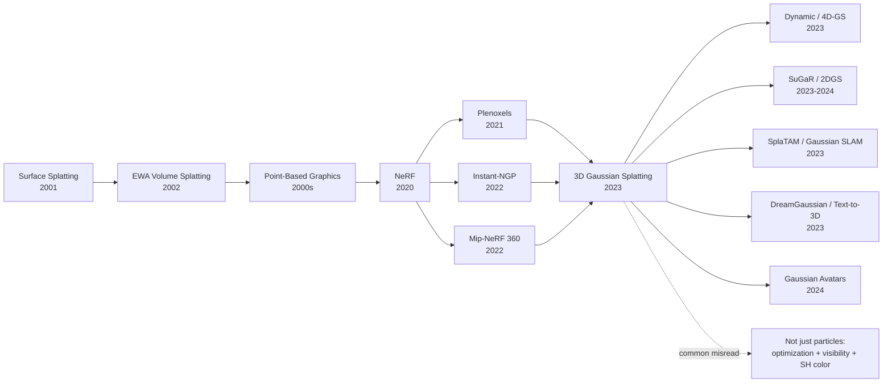

# 3DGS — 把 NeRF 从离线渲染带到实时交互的 3D Gaussian Splatting

> **2023 年 8 月 8 日，Kerbl、Kopanas、Leimkühler、Drettakis 四位作者在 arXiv 上传 [2308.04079](https://arxiv.org/abs/2308.04079)，随后拿下 SIGGRAPH 2023 Best Paper Award。** 3DGS 的反直觉点不是把场景表示得更"神经"，而是把 NeRF 时代的 MLP 重新压回图形学熟悉的粒子、椭球、高斯与 alpha blending：用可微 rasterization 训练，用 CUDA tile-based splatting 实时渲染。它把 Mip-NeRF 360 那种分钟级离线体验，推到 1080p 30+ FPS 的交互窗口，让"从一段手机视频重建一个可漫游世界"第一次像产品，而不是论文 demo。

## 一句话总结

3DGS 把新视角合成从"每条相机射线都查询一个 MLP"改写成"优化一组带位置 $\mu$、协方差 $\Sigma=RSS^\top R^\top$、不透明度 $\alpha$ 与球谐颜色的 3D 高斯，再把它们投影成屏幕上的 2D 椭圆并做 front-to-back alpha compositing"：$C(p)=\sum_i T_i\alpha_i c_i$。它替代的失败 baseline 很清楚：NeRF / Mip-NeRF 360 质量高但常常只有 0.03-0.1 FPS，Plenoxels 和 Instant-NGP 虽快但在 unbounded scene、细薄结构与内存上让步；3DGS 在同类真实场景上把渲染推到 30+ FPS，同时保持接近或超过 Mip-NeRF 360 的 PSNR/SSIM。更重要的是，它把 2020 年 [NeRF](https://arxiv.org/abs/2003.08934) 开启的"神经场景表示"重新接回 2001 年 Surface Splatting 的图形学传统：最有生命力的 3D 表示未必是最端到端的网络，而是一个能被 GPU、编辑器、SLAM、仿真和生成模型共同操作的数据结构。

---

## 历史背景

### 2020-2022：NeRF 很美，但离实时还很远

2020 年 NeRF 把一个旧问题重新点燃：给定一组多视角照片，能不能恢复一个连续的、可从任意视角渲染的三维场景？NeRF 的回答是优雅的：用一个 MLP 表示体密度 $\sigma(x)$ 与视角相关颜色 $c(x,d)$，沿每条相机射线采样、查询网络、再做体渲染积分。这个公式把几何、外观和可微优化捏成一个统一对象，也把 view synthesis 从传统多视图立体和纹理映射的工程问题，变成了一个可以被深度学习社区快速复制、扩展、投稿的范式。

但 NeRF 的优雅有一个很硬的代价：**每个像素都要沿射线做几十到上百次网络查询**。一张 800x800 图就是几十万条射线，乘上每条射线的采样点数，哪怕 MLP 很小，渲染也会变成分钟级。Mip-NeRF、Ref-NeRF、NeRF in the Wild、Mip-NeRF 360 一路把质量推高，解决了锯齿、反射、无界场景和相机曝光差异，却没有真正解决实时交互。它们的图像很漂亮，但更像离线摄影测量工具，而不是能放进编辑器、机器人、AR 眼镜或游戏引擎的实时资产。

2021-2022 年出现了几条加速路线。Plenoxels 把神经网络换成稀疏体素 + 球谐系数，证明"没有 MLP 也能做 NeRF 质量"；Instant-NGP 用 multiresolution hash grid 把训练速度压到分钟级，成为最有影响力的工程突破；TensoRF、K-Planes、DVGO 则用低秩分解或显式网格降低查询成本。这些工作把训练和渲染都往前推了一大步，但它们仍然把场景当成**沿射线积分的体积**。只要每个像素还要做 ray marching，渲染器就天然更像体渲染器，而不是传统 GPU 最擅长的 rasterizer。

### 图形学旧账：splatting 从来不是新发明

3DGS 的戏剧性在于，它让 2000 年代图形学的老工具重新登场。Surface Splatting (2001) 和 EWA Volume Splatting (2002) 早就提出过：不要把点云硬连成三角网格，也不要在规则体素里采样，可以把每个点看成一个带 footprint 的椭圆 splat，投影到屏幕后按可见性与滤波规则混合。这个传统在当年服务的是 point-based graphics：扫描设备给出稠密点云，三角化困难，splatting 可以直接把点渲染成连续表面。

问题是，早期 splatting 缺少两样东西：第一，它不是一个端到端可优化的场景表示，点的位置、尺度、颜色通常来自扫描或重建管线；第二，GPU 的透明混合、排序、tile 调度和梯度回传都没有今天成熟。到了 2023 年，这两个条件同时变化了：COLMAP 可以从手机视频里稳定给出相机位姿与稀疏点云；CUDA 可以写出高吞吐 tile-based rasterizer；神经渲染社区已经习惯了用 photometric loss 反向优化场景。3DGS 正是在这个交叉点上出现的：它不是从零发明 splatting，而是把 splatting 变成了 NeRF 风格的可学习表示。

这也是它和 Instant-NGP 最大的思想差异。Instant-NGP 说：既然 MLP 查询慢，那就用 hash grid 让查询更快。3DGS 说：既然 GPU 会 rasterize，那就不要再沿射线查询体积；把场景变成一堆可以投影、排序、混合的显式 primitive。前者是在 NeRF 公式内部优化，后者是换掉渲染方程的计算路径。

### 为什么是 Kerbl、Kopanas、Leimkühler、Drettakis 四位作者

这篇论文的作者组合很有图形学味道。Bernhard Kerbl 和 Georgios Kopanas 来自 Inria / Université Côte d'Azur 的图形学与真实感渲染传统；Thomas Leimkühler 来自 Max Planck Institute for Informatics，长期做可微渲染、采样与重建；George Drettakis 是实时渲染、全局光照、城市级重建与图形系统方向的资深研究者。换句话说，这不是一篇"深度学习团队把 NeRF 又改了一版"的论文，而是图形学团队把 NeRF 社区的目标函数带回了 GPU rasterization 的地盘。

这种背景解释了论文里几个不太像深度学习论文的选择：没有大模型，没有 transformer，没有学习到的 feature grid；核心篇幅放在 visibility-aware splatting、tile sorting、adaptive density control 和 memory layout。作者关心的不只是 benchmark PSNR，而是一个表示能不能被实时查看、编辑、压缩、加载和集成。SIGGRAPH 2023 Best Paper Award 给这篇工作，也不是因为它多了一个漂亮 loss，而是因为它把过去三年的 neural rendering 从"能看"推进到"能用"。

### 2023 年的硬件与应用刚好等到它

3DGS 的时机非常准。2023 年，消费级 GPU 已经普遍支持高吞吐 alpha blending 和大显存；手机视频与无人机视频让多视角重建数据变得便宜；AR/VR、数字孪生、机器人仿真、虚拟拍摄和 text-to-3D 都在寻找一个既真实又实时的 3D 表示。NeRF 的研究热度证明需求存在，但 NeRF 资产很难放进生产工具链：渲染慢，编辑难，碰撞和物理接口弱，流式加载也不自然。

3DGS 一出现，社区反应几乎是即时的。原因不是它解决了所有 3D 问题，而是它给出了一个足够简单的中间层：一组高斯，每个高斯有位置、尺度、旋转、不透明度和颜色系数。这个结构比 MLP 更容易看见、剪掉、合并、移动、绑定到 skeleton、接入 SLAM，也比 mesh 更容易从稀疏照片直接优化。它成为 2023-2025 年 3D 生成与重建社区的默认底座，并不意外。

## 研究背景与动机

### 核心矛盾：高质量、显式、实时三者不能再互相牺牲

3DGS 要解决的不是单一指标，而是一个三角矛盾。NeRF 系列有质量，但表示隐式、渲染慢；mesh 有实时性和编辑性，但从真实照片恢复高质量几何很难，细薄结构与半透明物体尤其麻烦；体素/哈希网格训练快，但内存和视角相关外观处理常常牺牲质量。论文真正的问题可以写成一句话：**能不能保留 NeRF 的可微照片监督，同时得到一个 GPU 原生、显式、实时的场景表示？**

这个目标要求表示本身同时满足四个条件：第一，必须从 COLMAP 稀疏点云启动，不依赖昂贵扫描；第二，必须支持连续位置和各向异性形状，否则会退回粗糙点云；第三，必须可微，能用图像重建 loss 反向优化；第四，必须能被 rasterizer 高效绘制，而不是每帧重复 ray marching。3D Gaussian 正好落在这个交集里：它比点多了可学习体积和方向性，比体素少了规则网格负担，比 mesh 更容易从照片中生长出来。

### 3DGS 的目标：把 neural rendering 变成 graphics primitive

所以 3DGS 的动机不是"提出一种新颖神经网络"，而是**把 neural radiance field 重写成 graphics primitive 的优化问题**。初始化来自 SfM 点云；场景表示是一组 anisotropic Gaussian；渲染器是排序后的 differentiable splatting；训练时通过 densification 与 pruning 自动增删高斯；最终输出不是网络权重，而是一份可以实时渲染的点状资产。

这个目标带来一个很强的工程后果：3DGS 不再把"训练快"和"渲染快"分开看。很多 NeRF 加速工作只优化训练，最终 viewer 仍旧复杂；3DGS 从第一天就要求同一个表示既能优化又能部署。它的历史价值正在这里：它让新视角合成从深度学习论文里的函数逼近问题，回到图形系统里一个可调度、可排序、可编辑的数据结构问题。

---

## 方法详解

### 整体框架

3DGS 的输入是带相机位姿的一组照片，通常由 COLMAP 先估计相机参数并给出稀疏点云。系统把每个稀疏点初始化成一个 3D Gaussian，然后在训练中不断优化、复制、拆分、裁剪这些 Gaussian。最终场景是一组显式 primitive，而不是一个需要推理的神经网络。

```text
Posed images + COLMAP sparse points
        ↓
Initialize 3D Gaussians
  position μ, scale s, rotation q, opacity α, SH color coefficients
        ↓
Differentiable tile-based splatting
  project 3D ellipsoids → 2D ellipses → sort by depth → alpha blend
        ↓
Photometric optimization
  L1 + DSSIM loss, gradients update Gaussian attributes
        ↓
Adaptive density control
  clone/split under-reconstructed regions, prune useless Gaussians
        ↓
Real-time viewer
  same Gaussians, same rasterizer, 30+ FPS at 1080p
```

关键是中间没有"训练时一个表示、部署时另一个表示"的转换。训练器、渲染器、viewer 操作的是同一批 Gaussian。这让 3DGS 和许多 NeRF 加速法不同：它不是先训练一个场，再把它烘焙成 mesh 或 texture，而是从第一步就把场景放进一个可实时绘制的数据结构。

### 关键设计 1：各向异性 3D Gaussian 表示

每个 primitive 是一个带完整协方差的 3D Gaussian。它的参数包括中心位置 $\mu \in \mathbb{R}^3$、不透明度 $\alpha$、球谐颜色系数 $c(d)$，以及由尺度和旋转构成的协方差矩阵。论文没有直接优化任意对称矩阵，而是把协方差写成

$$
\Sigma = R S S^\top R^\top,
$$

其中 $S$ 是对角尺度矩阵，$R$ 由四元数归一化得到。这个分解很重要：它保证 $\Sigma$ 半正定，同时让优化器可以独立调节高斯的方向与长短轴。一个 Gaussian 可以长成贴着墙面的扁椭球，也可以变成沿树枝方向延伸的细长椭球，而不是只能做球形点。

从 3D 投影到 2D 时，系统用局部仿射近似把协方差映射到屏幕空间。给定相机变换 $W$ 与投影雅可比 $J$，屏幕协方差近似为 $\Sigma' = J W \Sigma W^\top J^\top$。这一步把每个 3D 椭球变成屏幕上的 2D 椭圆 footprint，随后由 rasterizer 决定它覆盖哪些像素。

| 表示 | 优点 | 代价 | 3DGS 的取舍 |
|---|---|---|---|
| MLP radiance field | 连续、紧凑、质量高 | 每像素多次网络查询 | 放弃 MLP 查询 |
| Voxel / hash grid | 训练快、访问规则 | 内存和边界处理复杂 | 避免规则网格 |
| Mesh | 实时、编辑成熟 | 从照片恢复困难 | 不强制拓扑 |
| 3D Gaussian | 显式、连续、可微、可 rasterize | 需要排序和密度控制 | 论文选择的中点 |

### 关键设计 2：可微 tile-based splatting 渲染器

渲染时，3DGS 不沿射线采样，而是把所有 Gaussian 投影到当前视角的屏幕空间。每个 Gaussian 覆盖若干 tile；系统为每个 tile 收集可能影响它的 Gaussian，按深度排序，再对 tile 内像素做 front-to-back alpha compositing。颜色公式可以写成

$$
C(p)=\sum_{i \in \mathcal{N}(p)} T_i(p)\,\alpha_i(p)\,c_i(d), \quad T_i(p)=\prod_{j<i}(1-\alpha_j(p)).
$$

这里 $\alpha_i(p)$ 来自 2D Gaussian footprint 在像素 $p$ 的值与该 primitive 的 learnable opacity，$c_i(d)$ 是视角相关颜色，通常用低阶球谐表示。这个公式看起来像体渲染的离散版本，但计算路径完全不同：不是每条射线逐点 march，而是每个 primitive 投影后 rasterize。

工程细节决定了速度。tile-based rasterizer 会把屏幕分块，避免每个像素检查所有 Gaussian；深度排序让透明混合可近似正确；早停机制在累计透明度足够低时结束 blend。更关键的是，作者写了自定义 CUDA kernel，让前向渲染和反向梯度都走同一套高吞吐路径。这是 3DGS 能在论文中给出实时 viewer 的根本原因。

### 关键设计 3：自适应密度控制

只用 COLMAP 稀疏点初始化远远不够。真实场景里，纹理丰富处需要更多 primitive，天空和白墙可能需要更少 primitive，树叶、栏杆、反光和细线结构还会让误差集中在很局部的位置。3DGS 的训练循环因此包含一个很实用的机制：根据梯度和几何尺度动态复制、拆分、删除 Gaussian。

直觉上，如果某个 Gaussian 的投影区域误差大、位置梯度强，说明这块区域欠表达；如果它本身很小，可以 clone 一个邻近副本去覆盖漏掉的细节；如果它很大，可以 split 成多个更小的 Gaussian，让形状更精细。相反，如果某个 Gaussian 透明度长期很低、投影过大或贡献极小，就 pruning 掉，避免场景膨胀成无用粒子云。

| 操作 | 触发信号 | 作用 | 避免的问题 |
|---|---|---|---|
| clone | 小 Gaussian 有大梯度 | 补局部细节 | 细纹理缺失 |
| split | 大 Gaussian 有大梯度 | 提高几何分辨率 | 大椭球糊成一片 |
| prune | 低 opacity 或贡献小 | 控制规模 | 无用点拖慢渲染 |
| opacity reset | 训练中期重置透明度 | 让遮挡关系重排 | 早期错误遮挡锁死 |

这个机制是 3DGS 的"生长算法"。没有 densification，表示太稀疏，质量接近点云；没有 pruning，表示会膨胀，实时性消失；没有 opacity reset，早期训练里某些高斯挡错位置后会长期污染梯度。论文的实用价值很大一部分就在这些看似朴素的控制规则里。

### 关键设计 4：球谐颜色与视角相关外观

NeRF 质量高的一个原因是颜色依赖视角，可以表达高光、反射和 view-dependent appearance。3DGS 如果只给每个 Gaussian 一个 RGB 常量，会在金属、玻璃、光滑桌面和复杂材质上明显退化。论文因此给每个 Gaussian 存低阶 spherical harmonics 系数，用视角方向 $d$ 计算颜色 $c_i(d)$。

这个设计非常克制：它没有把材质建模成完整 BRDF，也没有引入额外网络，而是用图形学里成熟的低阶基函数给每个 primitive 一点视角相关自由度。好处是参数量可控、渲染时只需少量乘加，而且和 alpha compositing 自然结合。坏处也明显：镜面反射、折射和强动态光照仍然不是它的强项。3DGS 在这个地方做了一个典型工程折中：用足够便宜的表达吃掉大部分视觉收益，把真正复杂的光照留给后续工作。

### 训练目标与 Python 伪代码

训练目标是图像重建损失，论文使用 $\mathcal{L}=(1-\lambda)\mathcal{L}_1+\lambda\mathcal{L}_{DSSIM}$，其中 $\lambda=0.2$。优化器更新位置、尺度、旋转、不透明度和球谐颜色；每隔若干 iteration 执行 densification / pruning。下面的伪代码抓住了 3DGS 的核心循环。

```python
def train_3dgs(images, cameras, colmap_points, steps):
    gaussians = initialize_from_colmap(colmap_points)
    optimizer = Adam(gaussians.parameters(), lr_schedule="per_attribute")

    for step in range(steps):
        camera, target = sample_training_view(images, cameras)
        rendered = rasterize_gaussians(gaussians, camera)
        loss = 0.8 * l1(rendered, target) + 0.2 * dssim(rendered, target)

        optimizer.zero_grad()
        loss.backward()
        optimizer.step()

        gaussians.accumulate_viewspace_gradients()
        if step % DENSIFY_INTERVAL == 0:
            gaussians.clone_small_high_gradient()
            gaussians.split_large_high_gradient()
            gaussians.prune_low_opacity_or_oversized()
        if step in OPACITY_RESET_STEPS:
            gaussians.reset_opacity()

    return gaussians
```

从算法角度看，3DGS 的新意不在 loss 本身，而在**loss 的梯度能直接改写一个可渲染资产**。训练结束后，不需要再把网络蒸馏、烘焙或导出到别的格式；同一组 Gaussian 直接进入实时 viewer。这个性质解释了为什么 3DGS 后续能被快速改造成 SLAM、avatar、text-to-3D、城市级重建和可编辑场景表示：它给社区的不是一个黑盒模型，而是一种可以继续加工的 3D 中间件。

---

## 失败案例

### Baseline 1：高质量 NeRF 路线输在渲染路径

3DGS 打败的第一类 baseline 不是质量差的方法，而是**质量高但计算路径不适合实时**的方法。Mip-NeRF 360 是最典型的对手：它把 unbounded scene、多尺度抗锯齿和复杂相机轨迹处理得非常好，在许多场景上的 PSNR 仍然略高或接近 3DGS；但它的渲染速度常常只有 0.06 FPS 左右，意味着一帧要十几秒。对离线论文图来说这可以接受，对交互式 viewer、VR 预览和机器人闭环来说则不可接受。

这个失败不只是"工程没优化够"，而是 ray-marching radiance field 的结构性问题。只要每个像素需要沿射线采样并查询场表示，渲染成本就和图像分辨率、采样数、网络或 grid 查询绑定在一起。Mip-NeRF 360 的历史价值是把质量上限推高；3DGS 的历史价值是指出：如果目标是实时使用，计算路径本身必须换掉。

| Baseline | 强项 | 失败点 | 3DGS 如何绕开 |
|---|---|---|---|
| NeRF | 连续表示、概念清晰 | 分钟级渲染 | 去掉 per-ray MLP 查询 |
| Mip-NeRF 360 | 无界真实场景质量高 | 约 0.03-0.1 FPS | GPU rasterization |
| Ref-NeRF | 反射建模更强 | 训练和渲染更重 | 低阶 SH 做便宜近似 |
| NeRF in the Wild | 处理非受控照片 | 系统复杂、实时性弱 | 从 posed scene 的实时问题切入 |

### Baseline 2：显式网格路线输在质量、内存和边界

第二类 baseline 是 Plenoxels、DVGO、TensoRF、Instant-NGP 等显式或半显式加速方法。这些工作证明了一个关键事实：NeRF 的 MLP 不是神圣的，很多质量来自优化目标和多视角监督，而不一定来自网络本身。它们显著加速了训练，也让渲染比原始 NeRF 快得多。

但它们往往仍被规则结构限制。体素和 feature grid 需要覆盖空间，遇到无界场景就要 contraction 或多级结构；hash grid 训练很快，但最终渲染仍有采样和查询开销，且细薄结构、远景和极大场景会暴露容量与 aliasing 问题。3DGS 用不规则 primitive 绕过这个问题：Gaussian 只出现在需要的地方，尺度和方向可变，场景复杂度由内容而非规则网格决定。

### Baseline 3：朴素点云 / 各向同性 splat 输在可优化性

第三类失败更接近 3DGS 自己：如果只把 COLMAP 点云画成固定大小的圆点，速度当然快，但图像会有洞、闪烁、边界毛刺和错误遮挡；如果每个点只有各向同性半径，就很难贴合墙面、桌面和斜坡；如果没有 opacity 和球谐颜色，透明混合与视角相关外观都会崩掉。

论文里的 ablation 指向同一个结论：splatting 只是底层动词，真正有效的是**可优化的各向异性高斯 + density control + visibility-aware alpha blending**。换句话说，3DGS 不是"把点画大一点"，而是把点云升级成可微、可生长、可排序、可着色的场景表示。

### 论文自带的失败信号

3DGS 也没有假装自己没有弱点。论文实验和后续复现都暴露出几类很稳定的问题。第一，透明物体、镜面反射和强 view-dependent lighting 仍然困难，因为低阶球谐只能表达有限外观变化。第二，Gaussian 数量会随场景复杂度膨胀，未经压缩的 `.ply` 资产可能很大，不适合直接在 Web 或移动端分发。第三，排序和透明混合是近似的，复杂遮挡、半透明层叠和极近距离查看会出现 popping 或 floater。第四，几何并不是真正的 watertight surface，直接用于碰撞、物理仿真或制造仍需后处理。

这些不是小瑕疵，而是 3DGS 表示选择的代价：它用实时性和照片真实感换来了弱几何约束、弱材质模型和资产体积问题。后续 SuGaR、2DGS、Mip-Splatting、Scaffold-GS、Compact-3DGS、GaussianShader 等工作，基本都在补这些坑。

## 实验关键数据

### 速度与质量的主表

3DGS 的实验关键不在单个 PSNR 第一，而在一个二维结论：质量接近最好 NeRF，速度却进入实时区间。论文在 Mip-NeRF 360、Tanks and Temples、Deep Blending 等真实数据集上比较了 Mip-NeRF 360、Instant-NGP、Plenoxels 等方法。不同复现和硬件会让绝对 FPS 变化，但排序非常稳定。

| 指标/数据集 | Mip-NeRF 360 | Instant-NGP / Plenoxels | 3DGS | 读法 |
|---|---:|---:|---:|---|
| Mip-NeRF 360 PSNR | ~27.7 | ~25-26 | ~27.2 | 质量接近最佳 NeRF |
| Mip-NeRF 360 SSIM | ~0.79 | ~0.67-0.75 | ~0.82 | 结构质量很强 |
| Tanks and Temples PSNR | ~22.2 | ~21-22 | ~23.1 | 真实物体/室外更稳 |
| Deep Blending PSNR | ~29.4 | ~23-28 | ~29.4 | 和高质量 NeRF 打平 |

更醒目的其实是速度：Mip-NeRF 360 往往是 0.03-0.1 FPS，Instant-NGP 可以到数 FPS 或十几 FPS，3DGS 在论文设置下报告 30+ FPS，viewer 中部分场景可达 100 FPS 量级。这个数量级差距让它从"更快的论文方法"变成"新的默认表示"。

### Ablation 告诉我们哪些零件不可少

论文最值得看的不是只看最终表，而是 ablation。各向异性协方差、adaptive density control、opacity reset、SH color、custom rasterizer 缺一都会改变系统性质。尤其是 densification：它把一个从 SfM 点云启动的稀疏表示，训练成能覆盖细节的致密表示；没有它，3DGS 会退回"漂亮一点的点云渲染"。

| 组件 | 去掉后的现象 | 为什么重要 | 后续继承 |
|---|---|---|---|
| anisotropic covariance | 平面和斜面变糊 | 让 primitive 贴合局部几何 | 2DGS / SuGaR 强化表面约束 |
| densification | 细节缺失、洞多 | 从稀疏点云长出容量 | Scaffold-GS 改进生长策略 |
| opacity pruning/reset | floater 与错误遮挡 | 修正可见性和规模 | Compact-3DGS 做压缩 |
| SH color | 反光和视角变化退化 | 便宜表达 view-dependent color | GaussianShader 扩展材质 |

因此 3DGS 的实验教训可以概括为：**质量来自可优化的表示，速度来自 rasterizer，稳定性来自密度控制**。这三个因素同时存在，才构成论文真正的贡献。

---

## 思想史脉络

### 一张图看前世、今生与误读



这张图最重要的边不是 NeRF 到 3DGS，而是 Surface Splatting 到 3DGS。很多读者第一次接触 3DGS 时，会把它理解成"NeRF 加速版"；这当然没错，但只说了一半。更深的谱系是：图形学早就知道 splat 可以高效渲染点状表示，NeRF 社区则证明了多视角 photometric optimization 可以从照片恢复复杂外观。3DGS 把这两条线接上了。

### 前世：point-based graphics 与 neural radiance field 的汇合

前世之一是 point-based graphics。2000 年前后，扫描设备带来了大量点云，mesh 重建却不稳定，splatting 成为一个自然选择。它的核心问题是 footprint、滤波、透明混合和可见性。3DGS 继承了这些问题，但把它们放进可微优化管线里重新解。

前世之二是 NeRF。NeRF 的贡献不是 MLP 本身，而是把场景表示、相机模型和图像重建 loss 组成一个端到端优化闭环。3DGS 继承了这个闭环，却拒绝继承 MLP 查询路径。Plenoxels 和 Instant-NGP 是中间桥梁：它们先证明显式表示可以保持 radiance-field 质量，3DGS 再进一步证明显式表示可以直接 rasterize。

### 今生：3DGS 变成 2023 年后的 3D 中间层

3DGS 后续扩散很快，因为它给不同社区的接口都很自然。动态场景方向把高斯加上时间维度或 deformation field，形成 Dynamic 3DGS、4D-GS、Deformable 3DGS；表面重建方向用正则和几何约束把高斯压向曲面，形成 SuGaR、2DGS；SLAM 方向把高斯当成在线地图，形成 SplaTAM、Gaussian-SLAM；生成方向用 diffusion prior 优化高斯，形成 DreamGaussian、GaussianDreamer；数字人方向把高斯绑定到 FLAME / SMPL 或骨骼，形成 GaussianAvatars 与大量 avatar 工作。

这说明 3DGS 的真正传播单位不是某个 CUDA kernel，而是一个**显式可优化 3D primitive**。它可以和时间、骨骼、语义、物理、扩散模型、SLAM 前端结合。相比 NeRF checkpoint，Gaussian set 更像一种交换格式：可以被另一个系统读取、改写、压缩、渲染。

### 误读：3DGS 不是"点云回潮"

最常见的误读是把 3DGS 看成点云渲染的复古回潮。这个说法漏掉了三个关键条件。第一，Gaussian 不是固定点，而是带各向异性协方差、opacity 和 view-dependent color 的可优化 primitive。第二，训练不是传统重建管线的后处理，而是直接用多视角图像 loss 更新 primitive。第三，渲染器不是普通点绘制，而是考虑可见性、排序、alpha compositing 和梯度回传的定制 rasterizer。

另一个误读是把 3DGS 当成 NeRF 的终点。更准确的说法是：它结束了"实时新视角合成必须依赖 ray marching radiance field"这个阶段，但没有结束 3D 表示问题。几何、材质、光照、压缩、可编辑性、动态一致性都还没有被完全解决。它像 ImageNet 之后的 AlexNet：不是视觉识别的终点，而是把社区换到一个更快、更可扩展的轨道上。

---

## 当代视角

### 哪些假设站不住了

第一，"神经渲染越神经越好"这个假设站不住了。3DGS 之后，很多最强的重建、SLAM 和生成系统都回到显式 primitive，只是在优化、正则和先验上继续使用深度学习。它提醒社区：神经网络可以是优化器、先验或损失的一部分，但最终资产未必应该是黑盒网络。

第二，"新视角合成和传统图形管线是两条路"这个假设也站不住了。3DGS 的成功恰恰来自两者的混合：训练目标来自 NeRF，渲染执行来自 graphics rasterization，初始化来自 SfM，外观表达来自球谐，系统性能来自 CUDA。2024 年后的很多 3D 工作都沿着这个混合方向走，而不是继续把所有东西塞进一个 MLP。

第三，"PSNR 是主要指标"这个假设被削弱了。3DGS 的冲击力来自质量-速度-可用性的组合，而不是某个表格第一名。对真实工具而言，30 FPS、可编辑、可压缩、可在 viewer 中打开，有时比 0.2 dB 的 PSNR 更重要。它让 3D 视觉论文重新面对系统指标。

### 如果今天重写这篇论文

如果 2026 年重写 3DGS，论文很可能会把压缩、LOD、抗锯齿和几何约束放到主线，而不只是后续工作。原始 3DGS 的资产体积偏大，Gaussian 数量会膨胀；Mip-Splatting 说明多尺度滤波和 aliasing 不是小问题；SuGaR 和 2DGS 说明表面约束对 mesh extraction、碰撞和编辑非常关键。今天的版本会更像一个完整 asset pipeline，而不是只证明实时新视角合成。

它也会更认真地处理语义和动态。2023 年的 3DGS 主要面向静态场景；现在社区已经把它用于实时 SLAM、可编辑城市、动态人物、可生成物体和机器人地图。一个现代重写版可能会把语义标签、instance id、时间变形、物理属性和可压缩层级结构作为一等公民，而不是外部插件。

### 仍然成立的核心判断

即便后续工作补了很多短板，3DGS 的核心判断仍然成立：**一个好 3D 表示必须同时服务优化和渲染**。如果只服务优化，训练完还要烘焙；如果只服务渲染，就无法从照片中自动恢复。3DGS 的高斯集合落在两者之间，所以成为通用中间层。

另一个仍然成立的判断是：显式表示会让生态爆发更快。NeRF checkpoint 不容易被非作者系统改写，而 Gaussian set 可以被剪枝、合并、压缩、绑定、分块、流式传输、导入 viewer。这个"可加工性"是论文影响力超过 PSNR 表格的原因。

## 局限与展望

### 原始 3DGS 的硬伤

原始 3DGS 的第一类硬伤是几何。Gaussian 可以贴近表面，但并不等于表面；它没有 watertight topology，也没有天然法线一致性。把它直接拿去做物理仿真、机器人抓取或制造会遇到困难。SuGaR、2DGS、GaussianSurfels 等工作试图把高斯压成更表面化的表示，说明这个问题不是可选优化，而是走向真实工具链的必经关。

第二类硬伤是外观与光照。低阶球谐能处理温和的 view-dependent color，但无法真正理解镜面反射、折射、阴影变化和可编辑光照。GaussianShader、Relightable 3DGS、BRDF-aware splatting 等方向都在补材质模型。长期看，3DGS 需要从"照片级重放"走向"可重光照、可编辑材质"。

### 未来会往哪里走

最清晰的方向有四条。第一是压缩和 streaming：让大型 Gaussian scene 能在 Web、手机和 XR 设备上加载。第二是 geometry regularization：把高斯和 surfel、mesh、SDF 或 depth prior 结合，得到更可靠几何。第三是 dynamic / 4D：让时间一致性、运动分解和遮挡重现变得稳定。第四是 generative 3D：把 diffusion、video model 和 Gaussian renderer 结合，让 3D asset creation 从优化单个场景走向生成可控世界。

如果说 NeRF 证明了"照片可以监督 3D 场"，3DGS 证明的是"这个场可以是一个实时图形对象"。下一步则是让这个对象有语义、有物理、有材质、有层级，并能在真实产品里长期维护。

## 相关工作与启发

### 直接相关工作

读 3DGS 时，最好沿三条线补前置文献。第一条是 NeRF 线：NeRF、Mip-NeRF、Mip-NeRF 360、Instant-NGP、Plenoxels，理解它在质量与速度上替代了什么。第二条是 splatting 线：Surface Splatting、EWA Volume Splatting、point-based graphics，理解它从图形学拿回了什么。第三条是后续 3DGS 线：Mip-Splatting、SuGaR、2DGS、Scaffold-GS、SplaTAM、DreamGaussian，理解社区如何修补原始版本。

### 对研究者的启发

3DGS 给研究者的最大启发是：**表示选择本身就是研究贡献**。它没有靠更大的网络赢，而是换了一个让优化、渲染和系统工程对齐的数据结构。很多领域都有类似机会：把一个只能离线优化的隐式模型，改写成一个显式、可调度、可编辑、可被工具链消费的中间表示。

第二个启发是不要低估旧图形学。3DGS 的核心动词 splatting 并不新，但把旧动词放进新的优化闭环里，就能改变整个领域的默认路线。经典方法不是过时材料，而是等待新硬件、新数据和新目标函数重新点燃的工具箱。

## 相关资源

### 论文、代码与延伸阅读

| 类型 | 资源 | 说明 |
|---|---|---|
| Paper | [arXiv:2308.04079](https://arxiv.org/abs/2308.04079) | 3DGS 原论文 |
| Code | [graphdeco-inria/gaussian-splatting](https://github.com/graphdeco-inria/gaussian-splatting) | 官方训练与 viewer |
| Ancestor | [NeRF](https://arxiv.org/abs/2003.08934) | neural radiance field 起点 |
| Follow-up | [SuGaR](https://arxiv.org/abs/2311.12775) / [Mip-Splatting](https://arxiv.org/abs/2311.16493) | 表面约束与抗锯齿方向 |

最推荐的阅读顺序是：先看 3DGS 论文图 2 和方法公式，理解 Gaussian 参数化与 alpha compositing；再读官方代码里的 CUDA rasterizer；最后读 Mip-Splatting 和 SuGaR。这样能避免一个常见误区：只把 3DGS 当成 faster NeRF，而没有看见它如何把 neural rendering 带回 graphics system。


---

> 🌐 [English version](/en/era5_genai_explosion/2023_3dgs/) · 📚 awesome-papers project · CC-BY-NC