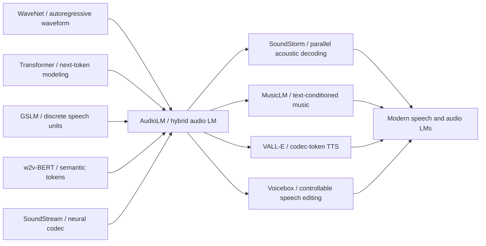

# AudioLM - 把原始音频变成语言模型问题

> **2022 年 9 月 7 日，Google Research 的 Borsos、Marinier、Zeghidour 等 11 位作者把 [arXiv:2209.03143](https://arxiv.org/abs/2209.03143) 上传到网上，题目叫 AudioLM。**这篇论文最反直觉的地方不是“生成语音”，而是它把语音和钢琴都先拆成离散 token，再像训练文本语言模型一样预测下一枚 token：语义 token 管长程内容，SoundStream 声学 token 管音色和波形细节。官方 blog 后来给出一个抓人的数字：人类听众区分真实语音与 AudioLM 续写的成功率只有 51.2%，接近随机猜测；但 Google 同时声明没有计划开放模型，并训练了 98.6% 准确率的检测器。AudioLM 因而成了 2023 年生成音频的一个分水岭：从“音频合成器”转向“音频语言模型”。

## 一句话总结

AudioLM 是 Borsos、Marinier、Zeghidour 等 11 位作者在 Google Research 完成、以 ICLR 2023 / arXiv 形式传播的“音频版语言模型”论文：它把原始波形 $x_{1:T}$ 先压成两类离散序列，语义 token $s$ 来自 w2v-BERT 的离散激活，负责语音内容、句法和音乐动机；声学 token $a$ 来自 SoundStream 残差量化码本，负责音色、说话人、录音条件和可还原波形。生成时不直接预测采样点，而是近似分解为 $p(s,a)=p(s)\,p(a^{\text{coarse}}\mid s)\,p(a^{\text{fine}}\mid s,a^{\text{coarse}})$，再用 SoundStream 解码器还原音频。它替代的失败路线很清楚：只做 WaveNet 式波形自回归太慢，只用 GSLM/HuBERT 类语义单位会丢音质，只依赖 Tacotron/MIDI/文本标注又无法覆盖说话人身份、韵律和演奏风格。AudioLM 把 [Transformer](../era3_attention/2017_transformer.md) 的“下一 token 预测”搬进音频空间，直接影响了 SoundStorm、MusicLM、VALL-E、Voicebox 和后来的 speech/audio LM。隐藏 lesson 是：音频生成的瓶颈不是模型会不会“听懂文字”，而是能不能找到一种既低速率又不丢身份和细节的离散表示。

---

## 历史背景

### 2022 年前后的音频生成卡在什么地方

AudioLM 出现前，生成音频大体有两条路线。第一条是“从波形开始”：WaveNet、SampleRNN 这类模型直接对采样点或短时频谱做自回归建模，优势是声音自然，缺点是序列太长。16 kHz 的 10 秒语音就是 16 万个采样点；如果每一步都像语言模型那样只预测下一个值，模型很难同时保持局部音色、句法连贯和分钟级结构。WaveNet 证明神经网络可以合成高保真语音，却也把一个现实问题暴露得很清楚：原始波形不是适合长程生成的“语言”。

第二条是“从标注开始”：Tacotron 2、FastSpeech、Music Transformer、Jukebox 周边的一批工作往往依赖文本、音素、MIDI、歌词、谱面或高度整理过的中间表示。它们在 TTS 或音乐任务上很强，但问题也明显：真实音频里大量信息没有文本对应物。说话人的身份、口音、情绪、麦克风条件、房间混响、钢琴触键力度和踏板习惯，都不容易写进 transcript 或 MIDI。更关键的是，很多场景根本没有成规模的标注：想让模型学会“像这个人继续说下去”或“像这段钢琴继续弹下去”，要求它从原始音频本身学习结构。

2021 年前后，语音表示学习和神经音频 codec 给了第三条路的材料。HuBERT、wav2vec 2.0、w2v-BERT 等自监督模型能把语音压成较低速率的离散单位，这些单位带有音素、词形和句法线索；SoundStream、EnCodec 一类神经 codec 又能把波形压成可还原的残差量化 token，保留音色和录音条件。问题是：两种 token 各有短板。语义 token 懂“说了什么”，但重建声音很糙；声学 token 懂“听起来像什么”，但序列仍然密集，长程语言结构会漂。AudioLM 的历史位置正是在这里：它不是发明一个全新 Transformer，而是把两个 tokenizer 的互补性第一次变成可工作的生成系统。

### 直接逼出 AudioLM 的前序工作

WaveNet 让大家相信神经网络可以直接生成自然波形，但也留下“长序列太慢”的代价。Tacotron 2 证明 text-to-speech 可以非常自然，却把生成过程绑在 transcript 上。Music Transformer 证明注意力模型能保持乐曲长期结构，但它依赖符号化音乐表示，而非原始录音。GSLM 则向 AudioLM 靠得最近：它用离散 speech units 做无文本语音语言建模，让模型学会生成像语言的声音；可是只靠这种单位，声音细节和自然度不足。

SoundStream 是另一块关键拼图。它用残差向量量化把音频压成多层 codebook token，并能用 decoder 还原高质量波形。官方 AudioLM examples 页面还专门比较了 3 层 RVQ 和 12 层 RVQ：前者约 1.5 kbps，后者约 6 kbps，后者是默认配置，说明 AudioLM 并不想牺牲音质来换取语义。与此同时，w2v-BERT 把语音自监督预训练中的 masked language modeling 和 contrastive learning 结合起来，离散化后的激活更像“内容骨架”。AudioLM 的核心不是在二者中选一个，而是承认音频生成需要两种时间尺度：低速率语义单位负责长程一致性，高速率 codec 单位负责可听质量。

### 作者团队与发布语境

这篇论文来自 Google Research 的音频团队，作者包括 Zalán Borsos、Raphaël Marinier、Damien Vincent、Eugene Kharitonov、Olivier Pietquin、Matt Sharifi、Dominik Roblek、Olivier Teboul、David Grangier、Marco Tagliasacchi 和 Neil Zeghidour。Zeghidour 等作者此前已经做过 SoundStream，团队手里既有 neural codec 经验，也有 Google 在大规模语音自监督学习上的积累。AudioLM 因而不是一个临时拼装的 demo，而是 Google 把自监督语音表示、神经 codec 和 Transformer 语言建模三条线接到一起的节点。

发布时间也很重要。2022 年 9 月，文本和图像生成已经在公众视野中爆发：DALL-E 2、Imagen、Stable Diffusion、PaLM 等系统让“把离散 token 喂给大模型”成为默认直觉。但音频仍然尴尬：高保真生成和长程结构往往只能二选一，文本控制和无监督学习也没有统一。AudioLM 的影响力来自它给了一个极简答案：把音频先 token 化，然后让 Transformer 做它最擅长的 next-token prediction。这个答案后来被 MusicLM、SoundStorm、VALL-E 和一系列 speech language model 继承。

### 当时的工业与安全背景

AudioLM 的官方 blog 一方面展示了非常惊人的续写样例，另一方面明确说没有计划广泛发布模型，并提到为合成音频训练了检测器。这个姿态很能代表 2022 年底的生成音频生态：能力已经逼近“普通听众分不清”，但社会接受度、安全机制和水印技术还没准备好。与图像生成相比，语音生成天然涉及身份冒充、诈骗、政治音频伪造和个人声纹复制。AudioLM 团队把 51.2% 的真人/合成区分率和 98.6% 的检测器准确率放在同一个故事里，其实是在说同一件事：这项技术已经强到需要被治理。

## 研究背景与动机

### 把音频从波形搬到离散 token 空间

AudioLM 的第一动机是降低建模难度。原始音频的采样率太高，直接对波形建模等于让语言模型每秒处理上万 token；而人类感知音频时并不是逐点理解，而是在音素、音节、音色、节奏、和声等层级上组织信息。离散 token 化把连续信号拆成可学习的符号序列，让音频可以进入语言模型的世界。这里的“语言”不是自然语言，而是任何可被下一 token 预测建模的离散序列。

第二动机是避免过度依赖人工标注。传统 TTS 需要文本，音乐生成常依赖 MIDI 或乐谱，可真实世界里的音频大多没有同步标注。AudioLM 想证明：只看原始波形，也能学到“说话像一句话”“钢琴像一段乐句”这样的长期规律。这是生成音频领域很重要的一次转向，因为它把模型能力从 supervised pipeline 推向 self-supervised / unsupervised audio modeling。

### 这篇论文真正要证明的问题

AudioLM 真正要证明的不是“Transformer 可以处理音频 token”，这在 GSLM 和 codec LM 里已经有迹象；它要证明的是“同一个层级 token 方案能同时拿到长程一致性和高保真”。如果只追求内容，semantic token 足够；如果只追求音质，codec token 足够；但一个让听众相信的 speech continuation 必须同时满足三件事：接着同一个人说、说出像人类语言的内容、声音质量不崩。钢琴 continuation 也类似：旋律、和声、节奏和触键质感都要连续。

这也是 AudioLM 被放进 awesome-papers 的原因。它不是最早的 neural vocoder，也不是最早的 speech representation learning，更不是最大规模的音频模型；它的贡献在于把“语义离散化 + 声学离散化 + 层级 LM”变成了一个可复制的范式。2023 年之后的很多生成音频系统，哪怕换成 diffusion、flow matching 或 parallel decoding，仍然在回答 AudioLM 提出的表示问题：先用什么 token 承载内容，再用什么 token 承载声音。

---

## 方法详解

### 整体框架

AudioLM 的系统可以压缩成一句话：先把连续音频变成两组互补的离散 token，再用一串 Transformer 语言模型逐级预测这些 token，最后交给 SoundStream decoder 还原波形。它没有把 speech 和 piano 写成两个任务，也没有在方法层要求 transcript、phoneme、MIDI 或 score；输入是原始音频，输出也是原始音频。区别只在训练语料：语音模型学 LibriLight/LibriSpeech 风格的 spoken audio，钢琴模型学 MAESTRO 风格的 piano recording。

AudioLM 的概率分解可以写成一条简化公式：

$$
p(x) \approx p_\theta(s_{1:N})\;p_\phi(c_{1:M}\mid s_{1:N})\;p_\psi(f_{1:M}\mid s_{1:N},c_{1:M}),\qquad \hat{x}=D_{\text{SoundStream}}(c,f).
$$

这里 $s$ 是 semantic token，$c$ 是 coarse acoustic token，$f$ 是 fine acoustic token，$D_{\text{SoundStream}}$ 是 codec decoder。这个分解的好处是把“内容先走，声学后补”的直觉写进生成顺序：先决定一句话或一段乐句大概要往哪里走，再补说话人、音色、录音环境和细节。

| 组件 | 来源 | 主要保留 | 主要丢失 | 在 AudioLM 中的角色 |
|---|---|---|---|---|
| Semantic tokens | w2v-BERT 离散激活 | 音素、词形、句法、旋律骨架 | 说话人细节、录音质感 | 长程结构建模 |
| Coarse acoustic tokens | SoundStream 前几层 RVQ | 音色、身份、粗粒度声学条件 | 高频细节 | 连接语义与波形 |
| Fine acoustic tokens | SoundStream 后几层 RVQ | 高频纹理、瞬态、细节 | 长程语义 | 提升可听质量 |
| Waveform | SoundStream decoder 输出 | 可播放音频 | 可编辑符号性 | 最终合成结果 |

### 关键设计 1：混合 tokenization

AudioLM 的第一处关键设计是拒绝单一 token。只用 semantic token，模型确实能生成更像语言的单位序列，但 decoder 无法恢复自然音色，听起来容易像被压扁的伪语音；只用 acoustic token，声音可以很像 prompt，甚至能保留说话人和房间感，但语言内容很容易变成 babbling。官方 examples 页面专门展示了“generation without semantic tokens”：4 秒 prompt 后的续写还能维持说话人身份，却经常失去一致语言内容。这不是小瑕疵，而是表示选择的根本失败。

混合 tokenization 把二者分工拆开。w2v-BERT 是被预训练过的 masked audio model，它的离散激活偏向内容和结构；SoundStream 是端到端 neural codec，它的 RVQ codebook 偏向可还原声音。AudioLM 不是把两组 token 简单拼接后交给一个大模型，而是用层级生成顺序控制信息流：semantic token 先生成，acoustic token 在它们的条件下生成。这样，声学模型不用自己发明句法，语义模型也不用背负所有波形细节。

| 只用某种表示 | 典型收益 | 典型失败 | AudioLM 的处理 |
|---|---|---|---|
| 只用波形 | 细节最完整 | 序列极长、生成慢 | 不直接建模波形 |
| 只用 semantic token | 长程内容较稳 | 音质差、身份弱 | 只放在第一阶段 |
| 只用 acoustic token | 音色和质量好 | 语言内容漂移 | 置于 semantic 条件下 |
| 混合 token | 内容与音质兼顾 | 系统更复杂 | 三阶段 LM 分解 |

### 关键设计 2：层级自回归生成

AudioLM 的生成过程由三个 Transformer stage 组成。第一阶段是 semantic LM：给定 prompt 的 semantic tokens 后，继续预测未来 semantic tokens。第二阶段是 coarse acoustic LM：把完整 semantic sequence 和已经出现的 coarse acoustic tokens 拼起来作为条件，预测未来 coarse acoustic tokens。第三阶段是 fine acoustic LM：在 semantic 和 coarse acoustic 条件下补更细的 RVQ 层。最后，SoundStream decoder 把 coarse/fine acoustic token 变回 waveform。

这个层级顺序有一个工程优势：最难保持长期一致性的部分由低速率 token 承担，最消耗带宽的波形细节被推迟到后面。语义阶段处理的序列更短，能够覆盖更长上下文；声学阶段虽然 token 更密，但它不需要独立规划语言内容。对 speech continuation 来说，第一阶段决定“接下来像一句什么话”，第二、三阶段决定“由同一个人用类似语气说出来”。

```python
def audiolm_generate(prompt_audio, semantic_lm, coarse_lm, fine_lm, codec):
    semantic_prompt = w2v_bert_quantize(prompt_audio)
    acoustic_prompt = codec.encode(prompt_audio)          # RVQ codebook streams

    semantic_full = semantic_lm.sample(prefix=semantic_prompt)
    coarse_full = coarse_lm.sample(
        semantic=semantic_full,
        prefix=acoustic_prompt.coarse,
    )
    fine_full = fine_lm.sample(
        semantic=semantic_full,
        coarse=coarse_full,
        prefix=acoustic_prompt.fine,
    )
    return codec.decode(coarse=coarse_full, fine=fine_full)
```

| 生成阶段 | 输入条件 | 预测目标 | 解决的问题 |
|---|---|---|---|
| Semantic LM | prompt semantic tokens | future semantic tokens | 内容、句法、旋律方向 |
| Coarse acoustic LM | semantic tokens + past coarse codes | future coarse codes | 说话人、音色、录音条件 |
| Fine acoustic LM | semantic + coarse + past fine codes | future fine codes | 高频细节和波形自然度 |

### 关键设计 3：用提示音频做 continuation

AudioLM 的主任务不是传统 TTS，而是 continuation：给几秒 prompt，让模型继续生成同一语境下的新音频。这个设置很聪明，因为 prompt 同时提供了内容开端和声学身份。模型不需要显式 speaker embedding，也不需要文本描述“这是某某人的声音”；SoundStream token 已经把身份、音色和录音条件带进去了，semantic token 则带进上下文。

这种 prompt-based continuation 也让 AudioLM 的评测更尖锐。对人类听众来说，真正难分辨的不是一段完全孤立的合成语音，而是“前几秒是真的，后面接得像不像同一个录音”。这会同时考验语义、韵律、身份和声学纹理。官方 demo 里的 LibriSpeech test-clean/test-other 样例强调了 unseen speakers and content，说明模型并不是记住训练说话人，而是学习了从 prompt 中复制/延续声学条件的机制。

### 关键设计 4：跨语音和音乐的同一接口

AudioLM 最有思想史价值的一点，是它把 speech 和 piano music 放进同一接口。语音里的“语义”可以理解为音素、词、句法；钢琴里的“语义”则更接近局部旋律、和声、节奏模式。论文并没有为音乐引入 MIDI，也没有把钢琴音频先转成谱面，而是继续用 audio-only tokenization。这样一来，AudioLM 的主张就从“语音生成方法”上升为“通用音频序列建模方法”。

当然，这个接口并不意味着所有音频都同样容易。语音有强离散结构，钢琴也有相对清晰的音高和节奏；环境声、多人对话、重叠乐器、电影音效可能更复杂。AudioLM 在论文中展示 speech 和 piano，是选择了两个足够不同但仍然有结构的领域：一个验证语言内容，一个验证音乐长程结构。它的成功说明 token-LM 路线可迁移，但也留下了后续工作要回答的问题：怎样让 tokenizer 覆盖更开放、更混杂、更可控的音频世界。

---

## 失败案例

### 失败案例 1：只用 acoustic token

AudioLM 最有说服力的失败案例，是官方 examples 页面里“generation without semantic tokens”的对照。模型只拿 SoundStream acoustic tokens 做 continuation 时，短期音色、说话人和录音条件仍然可以延续，听感上甚至会让人以为它抓住了 prompt；但继续听下去，语言内容开始漂移，像是在同一个声音里发出没有稳定语义的 babbling。这个失败说明 acoustic token 的信息量太偏“声音表面”：它擅长保留谁在说、在哪里录、音色是什么，却没有足够强的低速率结构来规划一句话。

这个 baseline 很重要，因为它挡住了一条看似更简单的路线：既然 SoundStream 可以高质量重建音频，为什么不直接训练 codec token LM？AudioLM 的答案是，重建质量不等于生成质量。codec token 的 bitrate 即使远低于 waveform，对长程语言建模仍然太密；而且它们把内容、身份、噪声和局部纹理混在一起，模型要同时解决太多问题。只用 acoustic token 的失败，反过来证明了 semantic token 不是装饰，而是生成链条里的规划层。

### 失败案例 2：只用 semantic token

另一端的失败是只用语义单位。GSLM 和 HuBERT-unit 语言模型已经证明，离散语音单位可以生成具备一定语言结构的声音，但这类表示通常严重丢失说话人身份、音色和细粒度韵律。对研究者来说，它们像“内容草稿”；对普通听众来说，它们不像可以被相信的真实录音。AudioLM 没有否定这条路线，而是把它降级为第一阶段：semantic token 负责决定未来内容，但不负责最后可听质量。

这个失败也解释了为什么 AudioLM 不只是一个 speech representation paper。好的语音生成不是把文本或音素说出来，而是让听众相信“这是同一个人在同一个场景里继续说”。如果表示层已经把 speaker identity 和 recording conditions 丢掉，后面的 decoder 很难无中生有地补回来。AudioLM 引入 SoundStream acoustic token，就是承认这些副语言信息不是噪声，而是生成真实感的一部分。

### 失败案例 3：依赖 transcript 或 symbolic score

传统 TTS 和音乐生成系统的失败不在单项质量，而在任务边界。Tacotron 2 可以把文本读得很自然，Music Transformer 可以在 MIDI 空间延展乐句，但它们都要求人类先给出离散符号。AudioLM 关心的是没有 transcript、没有 phoneme、没有 MIDI、没有 score 的原始音频；如果模型必须先等一个标注管线，它就不能学习那些标注本身没有覆盖的现象。

这个失败案例在 piano continuation 上尤其明显。钢琴演奏不仅是音符序列，还包括速度细微波动、踏板、触键、录音空间和演奏者风格。MIDI 能表达一部分结构，却不是完整声音。AudioLM 直接从钢琴录音中学习 continuation，等于把“音乐语言”从符号谱面扩展到真实演奏音频。它的结果不一定比所有专门音乐系统都强，但它证明了 audio-only route 可以跨出 speech。

| 失败路线 | 当年看起来为什么合理 | 具体问题 | AudioLM 学到的教训 |
|---|---|---|---|
| WaveNet 式波形自回归 | 最直接、细节最完整 | 序列太长，长程规划困难 | 不在 waveform 空间做主建模 |
| 只用 semantic units | 低速率、语言结构强 | 音质和身份不足 | 让它只负责高层内容 |
| 只用 codec tokens | 可重建、声音自然 | 内容漂移，容易 babbling | 必须受 semantic tokens 约束 |
| 依赖 transcript/MIDI | 控制清晰，训练稳定 | 覆盖不了未标注声学因素 | 用 audio-only tokenization 学结构 |

## 实验关键数据

### 实验设置

AudioLM 的实验不是普通 benchmark 排名，而是围绕两个问题设计：第一，speech continuation 是否能让听众觉得后半段像真实语音；第二，同一套方法是否能迁移到 piano continuation。语音样例使用来自 LibriSpeech test-clean/test-other 的短 prompt，强调 speakers and content not seen during training；钢琴样例来自 MAESTRO test split。官方 demo 中常见 3 秒或 4 秒 prompt，这个长度足以提供声学身份，却不足以让模型只靠复制完成任务。

对生成音频来说，主观评测比单个自动指标更关键。AudioLM 论文和 Google Research blog 使用人类听评来检验真实/合成可分辨性：听众判断短音频是真实录音还是 AudioLM 续写，成功率为 51.2%，与随机猜测的 50% 没有显著差异。这个数字不是“模型完美”的证明，因为测试条件、样本选择和听评协议都会影响结果；但它确实说明，在受控 continuation 场景里，AudioLM 已经接近普通听众的感知边界。

### 关键数据怎么读

另一个关键数字是 98.6%：Google 表示训练了一个检测 AudioLM 合成语音的分类器，并达到 98.6% accuracy。这个数字经常被忽略，却对理解论文很重要。51.2% 说明人耳难分；98.6% 说明机器检测仍有信号可用。换句话说，AudioLM 的威胁不是“任何检测都失效”，而是“没有检测工具的普通传播场景已经很危险”。这也是 Google 当时不开放模型的理由之一。

官方 examples 还展示了 SoundStream 3-RVQ 与 12-RVQ 重建差异：3 层约 1.5 kbps，12 层约 6 kbps，AudioLM 默认使用更高保真的设置。这个对照告诉我们，AudioLM 并没有把音质问题留给后处理，而是在 tokenizer 层就认真权衡 bitrate 与 fidelity。语音和钢琴任务一起出现，则证明该框架不是单纯 TTS pipeline，而是可以迁移的 audio LM recipe。

| 观察点 | 数字或设置 | 意义 | 需要小心的解读 |
|---|---:|---|---|
| 真人/合成区分 | 51.2% success rate | 普通听众接近随机猜测 | 不是开放场景的万能质量保证 |
| 合成检测器 | 98.6% accuracy | 机器仍可捕捉生成痕迹 | 只针对 AudioLM 风格样本 |
| SoundStream 对照 | 3-RVQ 约 1.5 kbps / 12-RVQ 约 6 kbps | 高保真需要更多 codec 层 | bitrate 与建模成本同时上升 |
| Speech prompt | 3-4 秒 prompt | 同时提供内容前缀和声学身份 | 不是零提示语音生成 |
| Piano prompt | MAESTRO test split prompt | 证明 audio-only route 可跨域 | 仍是结构化乐器，不等于所有环境声 |

### 为什么这些实验足够改变路线

AudioLM 的实验没有给出今天大模型论文那种铺满几十个数据集的 leaderboard，但它改变路线靠的是“反事实清晰”。只用 acoustic token 会说得像同一个人却内容乱；只用 semantic token 有内容却没有真实声音；依赖 transcript/MIDI 又失去 audio-only learning 的目标。AudioLM 同时把这些反事实摆出来，让读者看到混合 token hierarchy 不是复杂化，而是解决矛盾。

从后来的影响看，实验真正留下的是一组评测问题：continuation 是否保留 prompt 身份，长音频是否保持结构，tokenizer 是否在语义和声学之间分工，安全检测能不能跟上生成质量。这些问题后来进入 MusicLM、SoundStorm、VALL-E、Voicebox 和许多 speech/audio foundation model 的实验设计里。AudioLM 的数据点不多，但每个都打在范式选择上。

---

## 思想史脉络

### 前世：把连续世界离散化

AudioLM 的前世不是单一论文，而是一组把连续信号离散化的努力。WaveNet 证明 waveform 可以被神经网络生成，但它还在连续采样点附近工作；Transformer 证明离散 token 序列可以用 next-token prediction 学到复杂结构；GSLM 证明 speech units 可以像语言一样被建模；SoundStream 证明神经 codec 可以把音频压成可还原 token。AudioLM 把这些线索合在一起，给出了一个更干净的说法：音频生成先是表示问题，其次才是模型规模问题。



### 今生：audio token language model

AudioLM 之后，“audio token language model” 成为一个自然概念。研究者开始不再把 vocoder、TTS、music generation、speech representation 分成完全不同的孤岛，而是问：tokenizer 是什么，token rate 是多少，哪些 token 承载内容，哪些 token 承载声学，decoder 如何还原声音，生成器是自回归、并行、diffusion 还是 flow。这个问题框架比单个模型更长寿。

SoundStorm 是最直接的后继之一。它接受 AudioLM 的 token hierarchy，但把 acoustic token 生成从慢自回归改成更高效的并行 masked decoding。MusicLM 则把 AudioLM 的音频 token 路线接到文本条件音乐生成上。VALL-E 把 neural codec token LM 推到 zero-shot TTS。Voicebox 和后来的 flow-matching speech model 又把重点转向编辑、填补和多语言控制。它们各自改了模型形式，却都沿着 AudioLM 打开的表示路线走。

### 后世：从 continuation 到 controllable generation

AudioLM 的主任务是 continuation，这个任务非常适合证明模型“听懂 prompt”。但后续世界更关心 controllability：给定文本生成语音，给定声音克隆说话人，给定风格提示生成音乐，编辑一句话中间的片段，实时双工对话，甚至在多模态 LLM 里直接输入输出语音。AudioLM 没有解决这些产品级问题，却给了后续系统一个底座：先把音频变成可以被语言模型操作的 token，再在 token 空间上加条件和控制。

思想史上，这和图像生成里的 VQ-VAE/VQGAN 有相似性。先把连续感知信号离散化，再让强序列模型或扩散模型操作离散/潜变量空间。区别是音频的时间结构更强，身份和韵律更敏感，采样率也更残酷。AudioLM 的贡献是让这件事在 audio 里第一次听起来可信，而不是只在抽象上可行。

### 误读：AudioLM 不是文本到语音模型

最常见的误读，是把 AudioLM 当作 TTS 模型。严格说，AudioLM 是 audio continuation / audio generation 框架，它不以文本为输入，也不需要 transcript。它可以生成 syntactically and semantically plausible speech，但这里的“semantic”来自自监督 audio tokens，不是文本语义标签。把它说成 TTS 会错过论文最重要的地方：AudioLM 证明了不借助文本，也可以从原始音频中学出可生成的长期结构。

另一个误读是把 AudioLM 的质量归因于“大模型”。论文真正打动人的地方并不是参数规模，而是表示分解。后来的系统当然会扩大数据和模型，也会引入更强 decoder；但如果没有 semantic/acoustic token 分工，再大的模型也容易在“内容”和“声音”之间拉扯。AudioLM 的思想遗产是：先把生成问题切到正确的表示空间。

---

## 当代视角

### 哪些判断经受住了时间

从 2026 年回看，AudioLM 最站得住的判断是“音频生成需要离散表示分工”。后来的 SoundStorm、MusicLM、VALL-E、Encodec-based TTS、Mimi/SpeechTokenizer 系列、实时 speech-to-speech model，都在不同程度上继承了这个判断。它们可能换掉自回归生成器，可能换掉 tokenizer，可能引入文本条件、speaker prompt、instruction tuning 或多模态 LLM，但几乎都会问同一个问题：内容 token 和声学 token 如何对齐。

第二个经受住时间的判断，是 continuation 是检验 audio model 的强任务。文本到语音可以隐藏很多困难，因为文本已经给了内容；无条件生成又太开放，评测容易松散。Continuation 把模型放在一个窄而尖的缝里：它必须听懂 prompt，保留身份和风格，还要生成新内容。这种评测思想后来迁移到 zero-shot voice cloning、music continuation、speech editing 和 real-time dialogue。

### 哪些假设今天站不住了

AudioLM 的一个隐含假设是，自回归 token generation 足以覆盖高质量音频生成。这个假设在概念上成立，但在产品层面很快被挑战。SoundStorm 证明 acoustic token 可以用 parallel masked decoding 大幅提速；diffusion 和 flow matching 也在语音编辑、音乐和通用音频里变得强势。今天如果只按 AudioLM 的三阶段自回归路线做长音频，延迟和采样成本都会偏高。

另一个今天站不住的假设，是 audio-only 足以覆盖主流需求。Audio-only learning 很优雅，但产品世界需要控制：文本、情感、说话人、语言、节奏、风格、场景、编辑区间和安全策略都要进入模型。AudioLM 故意不处理这些条件，是为了证明无标注学习的极限；可后续系统必须把它接入 conditional generation。也就是说，AudioLM 解决了“音频能不能像语言一样建模”，没有解决“人如何精确地指挥音频模型”。

### 如果今天重写 AudioLM

如果今天重写 AudioLM，我会保留 hybrid token hierarchy，但会换掉很多工程部件。semantic tokenizer 可能不再只依赖 w2v-BERT，而会使用更强的 multilingual speech foundation model，甚至让 tokenizer 同时服务 ASR、TTS、speech understanding 和 dialogue。acoustic tokenizer 可能换成更高质量、更低延迟、更适合 streaming 的 codec，比如 Mimi、DAC 或新的 residual/semantic codec。

生成器也会更混合：semantic stage 可以继续自回归，保证长程结构；acoustic stage 则更适合 parallel decoding、diffusion 或 flow matching，减少延迟。安全侧也不会只训练一个检测器，而会在生成时加入 watermark、speaker consent、content provenance 和 misuse monitoring。AudioLM 的论文版像一台漂亮的研究发动机；今天的版本需要变成可控、可审计、可部署的系统。

## 局限与展望

### 模型能力边界

AudioLM 最大的能力边界是 controllability。它会继续 prompt，但用户不能稳定指定文字内容、情绪、语言、语速、停顿或编辑位置。它也没有解决多人对话、重叠声源、环境声组合和长分钟级结构。钢琴 demo 很有启发，但 piano 是高度结构化的单一乐器；把同样方法直接推广到完整歌曲、交响乐、电影音效或开放世界声景，需要更强 tokenizer 和更复杂条件。

另一个边界是评价。51.2% human discrimination 很抓人，但它不等于广泛泛化。真实应用里，听众设备、语言、口音、噪声、prompt 长度、生成长度和攻击者后处理都会改变难度。AudioLM 的实验让路线成立，却没有给出完整安全评估框架。今天看，这不是论文缺陷，而是当时整个生成音频领域都还没形成评测标准。

### 安全与治理边界

AudioLM 把语音合成的风险提前摆在桌面上。官方不开放模型，同时报告检测器，说明团队清楚 voice cloning 和 synthetic speech misuse 的危险。可检测器本身并不是最终答案：它可能过拟合某一代模型，可能被压缩、加噪、重采样或混音绕过，也可能无法覆盖未来模型。更稳的治理需要水印、授权机制、模型访问控制、训练数据合规、平台 provenance 和用户教育一起工作。

这也是 AudioLM 后续影响里最需要谨慎的一点。它推动了 speech/audio LM 的技术路线，也降低了“像某个人说话”的门槛。对于研究社区，正确态度不是忽视这篇论文，也不是只把它当 demo 欣赏，而是把它作为生成音频安全标准的早期警报：当人耳接近随机猜测时，系统责任必须前移。

## 相关工作与启发

### 对 speech/audio LM 的启发

AudioLM 的直接启发是把 tokenizer 当作第一等公民。过去很多生成模型论文把表示当预处理，真正的“方法”只写模型结构；AudioLM 反过来告诉我们，表示分解决定了模型能不能同时处理内容、身份和质量。后来的 SpeechTokenizer、Mimi、FACodec、semantic codec 和 multilingual codec 工作，本质上都在优化 AudioLM 提出的分工问题。

对 speech LM 来说，AudioLM 还把无文本训练的重要性推到台前。文本当然有用，但 speech 不是 text 的附属品。语音里的停顿、犹豫、情绪、韵律和说话人身份，都是语言交流的一部分。一个真正的 speech foundation model 不能只把语音当 ASR 前端；它必须在 audio token 空间里建模这些非文本信息。

### 对通用生成模型的启发

AudioLM 给通用生成模型的启发，是“先选对离散化层级，再谈模型能力”。图像有 patch/token/latent，视频有 spatiotemporal token，机器人有 action token，音频有 semantic/acoustic token。不同模态的问题不是都塞进同一个 Transformer 就结束，而是要找到能表达任务因果结构的 tokenization。AudioLM 的方法很朴素，却正因为朴素而可迁移。

它也提醒我们，foundation model 的突破常常发生在表示和目标函数之间，而不只是规模。AudioLM 不是一个最大参数的模型，也没有公布震撼的训练算力；它的力量来自把自监督语义表示、神经 codec 和语言建模目标接成闭环。这类“接口创新”在历史上常被低估，但后续生态会用脚投票。

## 相关资源

### 阅读入口

| 资源 | 链接 | 用途 | 备注 |
|---|---|---|---|
| 论文 | [arXiv:2209.03143](https://arxiv.org/abs/2209.03143) | 阅读原文 | v1 2022-09，v2 2023-07 |
| 官方样例 | [AudioLM examples](https://google-research.github.io/seanet/audiolm/examples/) | 听 speech/piano continuation | 包含 acoustic-only 对照 |
| Google Research blog | [AudioLM blog](https://research.google/blog/audiolm-a-language-modeling-approach-to-audio-generation/) | 快速理解动机和安全表述 | 含 51.2% 与 98.6% 数字 |
| 前序 codec | [SoundStream](https://research.google/pubs/soundstream-an-end-to-end-neural-audio-codec/) | 理解声学 token 来源 | AudioLM 的关键底座 |

读 AudioLM 最好的方式是先听官方 examples，再看论文方法图，最后回到实验对照。只看文字很容易低估这篇论文，因为它的说服力有一半在听感：semantic token 让内容连贯，acoustic token 让声音可信，两者缺一不可。它的历史价值也不在“有没有开源代码”，而在把 audio generation 的问题重新命名为 language modeling in token space。


---

> 🌐 [English version](/en/era5_genai_explosion/2023_audiolm/) · 📚 awesome-papers project · CC-BY-NC