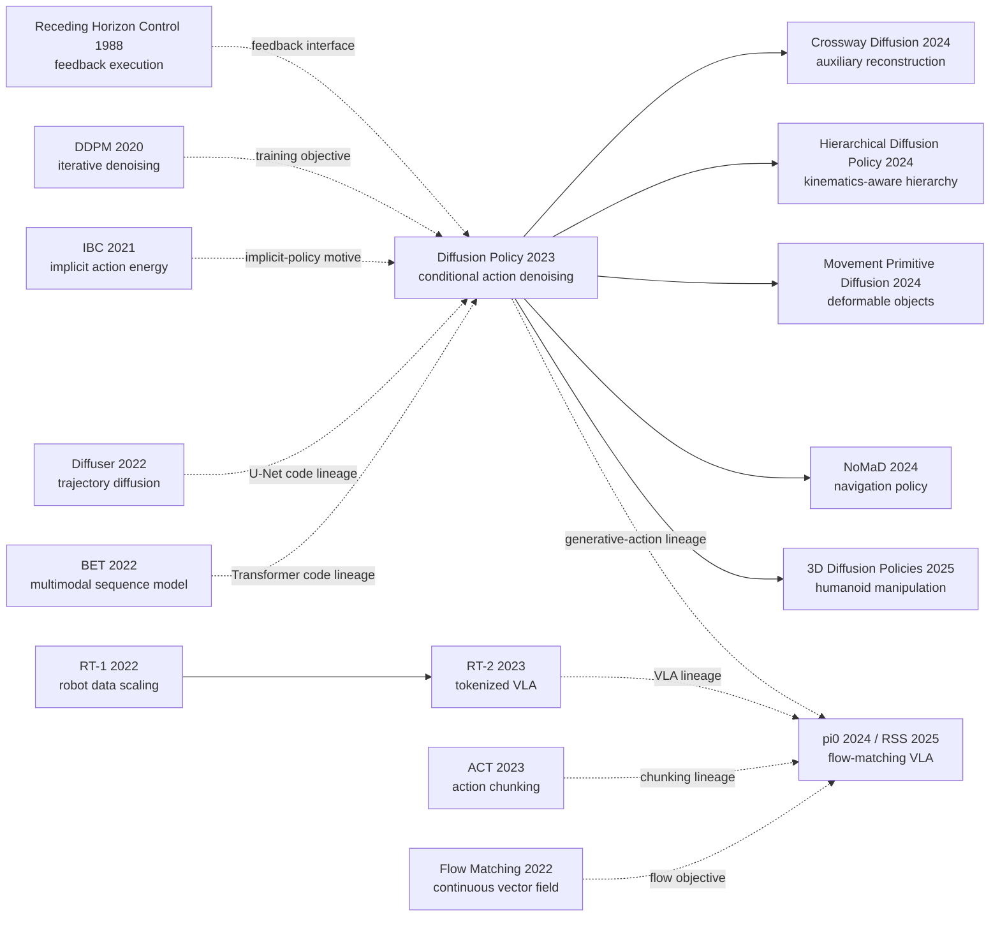

# Diffusion Policy: Visuomotor Policy Learning via Action Diffusion

> **2023 年 3 月，[Diffusion Policy（arXiv:2303.04137）](https://arxiv.org/abs/2303.04137) 把图像扩散里“从噪声反复修出样本”的机制搬到了机器人动作空间。** 它没有让机器人一次猜下一步，而是联合去噪一段动作、只执行前缀、再看一眼世界：15 个任务上的平均提升为 46.9%，真实 Push-T 达到 95% 成功率，而最佳 IBC 与 LSTM-GMM 变体分别只有 0% 和 20%。更耐人寻味的是后续：2024 年公开、发表于 RSS 2025 的 π0 也从噪声生成连续动作块，却换成 PaliGemma、action expert 与 flow matching。两者之间真正延续的是“生成动作分布”这道题，不是同一份代码或同一个损失。

## 一句话总结

Cheng Chi、Zhenjia Xu、Siyuan Feng、Eric Cousineau、Yilun Du、Benjamin Burchfiel、Russ Tedrake 与 Shuran Song 八位作者在 RSS 2023 发表的 Diffusion Policy，把 [DDPM 的逐步生成机制](/era4_foundation_models/2020_ddpm/) 从像素迁移到动作序列：策略直接建模 $p(A_t\mid O_t)$，用 $\mathcal L=\mathbb E\|\epsilon-\epsilon_\theta(O_t,A_t^k,k)\|_2^2$ 学习条件动作分数，从高斯噪声联合去噪未来动作块，只执行前缀后再观测。它在 4 组基准的 15 个任务上报告平均 46.9% 提升；真实 Push-T 达到 95% 成功率，而 LSTM-GMM 与 IBC 的最佳变体只有 20% 和 0%，分别暴露阶段卡死与不稳定能量采样。

后续影响不是一条简单的代码分支：[π0（2024，RSS 2025）](https://arxiv.org/abs/2410.24164) 延续“从噪声生成连续动作块”，却把任务级 ResNet/U-Net 换成 PaliGemma 加 action expert，并以 flow matching 速度场取代离散噪声预测；[RT-2](/era5_genai_explosion/2023_rt2/) 则代表离散动作 token 的平行 VLA 路线。最反直觉的 lesson 是，胜负不由“扩散”标签单独决定：位置控制让 Diffusion Policy 更强却伤害多种基线，CNN 在视觉任务更稳、Transformer 在高频 BlockPush 更强。论文真正留下的是把多峰动作分布、时间一致性与滚动反馈绑在同一个策略接口中。

---

## 历史背景

### 2022 年的机器人模仿学习卡在哪里

2022 年，机器人行为克隆已经有一条看似成熟的流水线：把相机图像和本体状态编码成特征，再让网络回归下一步动作。真正把系统部署到接触丰富的操作任务时，这个“普通监督学习问题”却会在三个地方同时失灵。第一，同一个观测往往对应不止一种正确动作。推 T 形块时，机械臂可以从左侧绕，也可以从右侧绕；均方误差回归会把两条路线平均成一条撞向障碍物的路线。第二，动作不是彼此独立的标签。若策略每一步都重新在左右模式之间抽样，即使每一步单看都合理，连起来也会左右抖动。第三，机器人动作既连续又要求精确，简单量化会带来误差，而在高维动作空间里把每一维切成类别，组合数又会迅速膨胀。

当时的主流办法各自只解了一部分问题。RoboMimic 的 LSTM-GMM 用循环网络维持历史，再用高斯混合表达多个动作峰；它需要预先选定混合分量数，而且在长时序、停顿动作和阶段切换处仍会陷入错误模式。Implicit Behavioral Cloning（IBC）把策略写成能量函数，理论上能给任意多个动作模式分配低能量，但训练时必须靠负样本近似难算的归一化常数，训练误差下降并不保证实际采样变好。Behavior Transformer（BET）先把动作聚类成离散中心，再预测中心及连续偏移，扩大了多模态表达能力，却仍可能在相邻时刻切换不同模式。问题的核心因此不是“视觉编码器还不够大”，而是**策略究竟应该怎样表示一整段连续、相关且多峰的动作分布**。

### 直接逼出 Diffusion Policy 的四条前序

- **2020，Denoising Diffusion Probabilistic Models（DDPM）**：Ho、Jain 与 Abbeel 在 [arXiv:2006.11239](https://arxiv.org/abs/2006.11239) 中证明，网络可以学习逐噪声层级的去噪方向，把高斯噪声逐步变成复杂样本。Diffusion Policy 的关键迁移不是“拿图像扩散模型生成机器人视频”，而是把 DDPM 的输出变量从图像换成未来动作序列。
- **2021，Implicit Behavioral Cloning（IBC）**：Florence、Lynch、Zeng 等作者在 [arXiv:2109.00137](https://arxiv.org/abs/2109.00137) 中用能量模型表示多峰动作分布，并以采样加优化来选动作。它证明隐式策略适合精细操作，也暴露了负采样、归一化常数和检查点选择不稳定的问题。Diffusion Policy 保留“沿能量地形找动作”的直觉，却直接学习分数梯度，绕开 $Z(o,\theta)$ 的估计。
- **2022，Planning with Diffusion（Diffuser）**：Janner、Du、Tenenbaum 与 Levine 在 [ICML 2022 论文](https://arxiv.org/abs/2205.09991) 中对状态-动作轨迹的联合分布做扩散，并通过条件引导完成规划。它说明扩散模型能处理高维轨迹；Diffusion Policy 随后把目标收窄为 $p(A_t\mid O_t)$，不再反复生成未来观测，从而让视觉编码只运行一次，更适合实时闭环控制。官方代码也明确说明其 `ConditionalUnet1D` 改自 Diffuser，而不是两项工作共享一个未经说明的实现。
- **2022，Behavior Transformer（BET）**：Shafiullah、Cui、Altanzaya 与 Pinto 在 [arXiv:2206.11251](https://arxiv.org/abs/2206.11251) 中用动作聚类和 Transformer 建模长程多模态行为。它既提供了强基线，也提供了时间序列 Transformer 的实现起点；Diffusion Policy 官方仓库明确写明 `TransformerForDiffusion` 改自 minGPT/BET。这里存在直接代码借鉴，但借的是序列骨架，不是扩散训练目标。

这四条线分别带来生成机制、隐式策略、轨迹扩散和序列建模。Diffusion Policy 的原创性不在于单独发明其中任何一块，而在于把它们重新约束成一个能在实体机器人上按时返回动作的闭环策略。

### 作者团队当时在做什么

论文由 Cheng Chi、Zhenjia Xu、Siyuan Feng、Eric Cousineau、Yilun Du、Benjamin Burchfiel、Russ Tedrake、Shuran Song 八位作者完成，团队横跨 Columbia University、Toyota Research Institute 和 MIT。这个组合恰好覆盖了方法落地所需的三种能力：Shuran Song 团队长期研究视觉驱动的机器人操作，Russ Tedrake 团队擅长控制、规划与真实机器人系统，Yilun Du 则在能量模型、分数模型和组合式生成建模上持续工作。论文也不是只在模拟器里换一个损失函数：作者把模型接到 UR5 和 Franka 平台，处理精确推物、翻转杯子、舀取和摊开黏稠酱料，v5 又加入双臂打蛋器、展开垫子和叠衣服等任务。

时间线上也要分清两个版本。[arXiv:2303.04137](https://arxiv.org/abs/2303.04137) 在 2023 年 3 月公开，会议版发表于 RSS 2023；2024 年的扩展版补入控制理论讨论、视觉编码器消融和三项双臂实验，之后以 IJRR 文章形式发表。本笔记把 RSS 2023 视为历史原点，定量部分则优先采用本地保存的 v5 TeX 源表，因为这些表比 PDF 文本抽取更可靠。后来的 π0 不是作者团队在 2023 年已经实现的组成部分，而是 2024 年把连续动作生成接入大规模 VLM 的后续路线。

### 当时的算力、数据与工程边界

Diffusion Policy 出现时，机器人学习的数据规模仍以“每个任务几百条演示”为常态。论文的模拟评测覆盖 4 组基准、15 个任务：RoboMimic 同时含熟练者与混合质量数据，Push-T 检查接触动力学和精确定位，BlockPush 与 Kitchen 检查阶段顺序的长程多模态。真实 Push-T 只有 136 条演示；原始酱料任务各用 90 条演示。这个规模与 2024 年 π0 宣布的 10,000 小时以上跨机器人预训练数据不是一个量级，因此不能把 Diffusion Policy 描述成基础模型。

推理预算同样塑造了方法。扩散采样需要多次网络前向，而机器人必须持续接收控制指令。论文正文报告用 DDIM 把 100 个训练扩散步缩到 10 个推理步，在 NVIDIA RTX 3080 上约 0.1 秒；v5 的真实任务超参数表则列出 16 个评测步。两处记录反映不同实验配置，不能混成一个唯一默认值。真实 Push-T 以 10 Hz 产生动作、插值到 125 Hz 执行，每次预测 16 步并执行其中 6 步，相当于策略约每秒重规划 1.67 次。正是在这类预算下，“一次编码视觉、一次生成动作块、执行几步后再观察”的结构才不是审美选择，而是系统能够闭环运行的必要条件。

## 研究背景与动机

### 平均动作、动作量化与固定混合分量的三重陷阱

行为克隆最简单的目标是让 $f_\theta(o_t)$ 接近专家动作 $a_t$。若损失是均方误差，模型学到的是条件均值；当专家数据在同一个观测附近有两个合法峰时，均值可能一个峰也不属于。高斯混合把一个峰扩成若干峰，但工程师必须提前决定峰数，且训练中会有分量塌缩。BET 的离散中心加偏移避免直接平均，却把连续控制的几何结构先压进有限码本。对二维 Push-T，这些折衷尚可调参；对双臂、6DoF 位姿和一整段动作联合建模，分量数或码本大小会很快成为新的瓶颈。

Diffusion Policy 的动机是把问题反过来问：与其一次猜出正确动作，不如学习“任意带噪动作应该往哪里修”。从高斯噪声初始化后，网络反复给出条件去噪方向，样本便能落入动作分布的某个有效模式。不同随机初值可以进入不同吸引域，而同一次采样会共同生成整段动作，所以多模态与时间一致性不再互相冲突。

### 表达力不能以训练不稳定为代价

IBC 已经说明能量模型能表达复杂动作分布，但它需要通过负样本近似配分函数。负样本若没有覆盖真正困难的动作区域，能量损失仍可能平滑下降，采样出来的动作却持续恶化；实体机器人上不可能像模拟器那样把每个检查点都滚动几十次再挑最好的一份。Diffusion Policy 利用一个简单但关键的微分事实：对动作求导时，$\nabla_a\log Z(o,\theta)=0$。因此它不学习归一化后的概率值，而学习 $\nabla_a\log p(a\mid o)$ 所对应的分数方向，用加噪样本和已知噪声构造稠密监督。

这个选择把“隐式策略的表达力”与“普通回归的稳定训练”拉到同一套目标中。它也解释了为什么论文不只报告最佳检查点，还报告最后 10 个检查点的平均表现：作者要证明性能不是偶然挑出来的尖峰。训练稳定性在这里不是附带优点，而是让机器人实验可重复、让模型选择成本可承受的首要动机。

### 动作块为何必须配合滚动时域控制

只预测下一步动作反应快，却看不到动作之间的联合结构；一次承诺整条轨迹又会在环境发生变化后继续盲目执行。Diffusion Policy 用三个不同的时域拆开这个矛盾：观测窗口 $T_o$、预测窗口 $T_p$ 和实际执行窗口 $T_a$。模型在一次去噪中生成 $T_p$ 步未来动作，只执行前 $T_a$ 步，然后读取新观测并重规划。典型视觉 CNN 配置取 $T_o=2$、$T_p=16$、$T_a=8$；真实 Push-T 把 $T_a$ 缩为 6，以换取更快反馈。

动作块让左绕或右绕这样的模式在一个采样过程中保持一致，也能把演示中的短暂停顿作为序列上下文理解；滚动重规划则限制了开环误差。这里的关键不是“扩散比控制理论更聪明”，而是生成模型与 receding-horizon control 各管一半：前者表示复杂条件分布，后者把有限时域预测重新接回闭环。

### 论文真正检验的问题与边界

论文提出的是一个可被实验推翻的问题：**若把条件动作序列本身作为扩散变量，并把视觉仅作为条件，是否能在不牺牲闭环响应和训练稳定性的前提下，比显式回归、离散动作和能量策略更好地克隆机器人行为？** 为回答它，作者没有只挑单一成功视频，而是横跨状态与图像观测、2DoF 到 6DoF 动作、单臂与双臂、刚体与流体、单阶段与多阶段任务，并与 LSTM-GMM、IBC、BET 做对应比较。

边界同样清楚：这是离线示范上的行为克隆，不会主动探索，也不会从失败或奖励中改进；它仍受演示覆盖范围限制；多次去噪比单次网络前向昂贵。论文要建立的不是“扩散解决机器人学习的一切”，而是一个更窄也更耐久的结论：**当策略表示本身成为多模态、高维和时序一致性的瓶颈时，条件动作去噪是一个强而稳定的策略类。** 这也是后来动作扩散、动作块和 VLA 流模型能够继续扩展的起点，但不等于这些后继系统直接复制了它的代码或训练目标。

---

## 方法详解

### 整体框架

Diffusion Policy 不把“策略”定义成一次前向计算得到的单个动作，而把它定义成一个**以观测为条件、在动作序列空间中运行的迭代生成过程**。在时刻 $t$，策略读取最近 $T_o$ 帧观测 $O_t$，从高斯噪声动作块 $A_t^K$ 出发，调用去噪网络 $K$ 次得到 $A_t^0$。它不把整段预测一次执行完，而只发送前 $T_a$ 步，随后获取新观测并重新生成。视觉编码、动作生成和滚动执行的边界如下：

```
camera images + proprioception over To steps
                    |
                    v
        visual/state encoder runs once
                    |
                    v
       observation condition O_t / h_t
                    |
Gaussian A_t^K --> denoiser x K --> clean action chunk A_t^0
                                      |
                                      v
                         execute first Ta actions
                                      |
                                      v
                         observe again and replan
```

三个时域不能混为一谈。$T_o$ 决定策略看多长历史，$T_p$ 决定一次联合生成多长动作，$T_a$ 决定开环承诺多久。论文的 CNN 视觉配置大多采用 $T_o=2,T_p=16,T_a=8$；真实 Push-T 仍预测 16 步，但只执行 6 步。配置表里的“扩散参数”是去噪网络规模，“视觉参数”是图像编码器规模：

| 配置 | $T_o$ | $T_p$ | $T_a$ | 去噪网络 | 视觉编码器 | 推理步数 |
|---|---:|---:|---:|---|---|---:|
| 模拟视觉 CNN（常用） | 2 | 16 | 8 | 256M | 22M/视角组 | 100 |
| 模拟 Push-T Transformer | 2 | 16 | 8 | 9M，8 层，宽度 256 | 22M | 100 |
| 模拟 Kitchen Transformer | 4 | 16 | 8 | 80M，8 层，宽度 768 | 无 | 100 |
| 真实 Push-T CNN | 2 | 16 | 6 | 67M | 22M | 16 |
| 真实 Push-T Transformer | 2 | 16 | 6 | 80M，8 层，宽度 768 | 22M | 16 |

一个容易误读的反直觉点是：**推理时的优化变量不是网络参数，而是当前动作样本。** 网络参数在训练后固定；每个去噪步只是用网络预测的向量场更新 $A_t^k$。这使策略像在动作能量地形上迭代找低能量解，但训练仍然是有直接监督信号的噪声回归。

### 关键设计

#### 设计 1：在条件动作空间中去噪，而不是一次回归动作

**功能**：用一串容易监督的去噪问题代替“一次猜中整段动作”，从而表示连续、高维、可多峰的条件分布。

训练时从示范动作块 $A_t^0$ 取样扩散层级 $k$ 与高斯噪声 $\epsilon$，构造带噪动作：

$$
A_t^k=\sqrt{\bar\alpha_k}A_t^0+\sqrt{1-\bar\alpha_k}\,\epsilon,\qquad \epsilon\sim\mathcal N(0,I).
$$

去噪网络接收观测、带噪动作和层级，最小化噪声预测误差。论文正文用 $A_t^0+\epsilon^k$ 的简写表达同一训练过程：

$$
\mathcal L(\theta)=\mathbb E_{A_t^0,O_t,k,\epsilon}\left[\left\|\epsilon-\epsilon_\theta(O_t,A_t^k,k)\right\|_2^2\right].
$$

推理从 $A_t^K\sim\mathcal N(0,I)$ 开始，按噪声日程反复更新。论文用带 Langevin 噪声的形式概括一步：

$$
A_t^{k-1}=\alpha_k\left(A_t^k-\gamma_k\epsilon_\theta(O_t,A_t^k,k)+\eta_k\right),\qquad \eta_k\sim\mathcal N(0,\sigma_k^2I).
$$

核心过程可以压缩成下面的 PyTorch 风格伪代码。代码特意把训练目标和采样器分开，因为 DDPM 训练并不要求推理必须使用同一个离散求解器：

```python
def conditional_action_sample(obs, denoiser, scheduler, shape):
    action = torch.randn(shape, device=obs.device)
    for step in scheduler.timesteps:
        noise = denoiser(obs, action, step)
        action = scheduler.step(noise, step, action).prev_sample
    return action
```

| 策略表示 | 输出对象 | 多峰方式 | 高维扩展 | 主要代价 |
|---|---|---|---|---|
| L2 回归 | 单动作/动作块 | 条件均值 | 容易 | 模式平均 |
| LSTM-GMM | 混合分布参数 | 固定数量高斯 | 分量数难选 | 分量塌缩、调参 |
| IBC | 动作能量 | 多个低能量盆地 | 采样变难 | 负样本与训练不稳 |
| Diffusion Policy | 动作块的分数/噪声 | 随机初始化加迭代去噪 | 原生联合生成 | 多次网络前向 |

**设计动机**：图像扩散已经证明，迭代生成不必把复杂分布压成少量参数；机器人动作序列比图像维度低得多，却有更苛刻的精度与实时约束。作者把扩散的表示能力保留下来，再通过短动作块和快速采样器控制计算成本。由于一次采样联合更新整段 $A_t^k$，某个样本一旦进入“从左绕”的盆地，后续动作也会沿同一模式收敛，而不是每一步重新掷骰子。

这里也必须与 π0 区分。Diffusion Policy 在离散噪声层级 $k$ 上预测噪声，并使用 DDPM/iDDPM 或 DDIM 反推；π0 则在连续时间 $\tau$ 上训练速度场 $v_\theta(A^\tau,o)$，用 Euler 积分执行 flow matching。两者都从噪声得到连续动作块，**但损失、时间参数化和网络组成并不相同**。

#### 设计 2：动作块与滚动时域控制共同约束承诺长度

**功能**：联合预测保证动作连贯，只执行前缀保证遇到新观测时还能改主意。

策略把输入和输出写成窗口，并明确只执行预测的一部分：

$$
O_t=(o_{t-T_o+1},\ldots,o_t),\quad A_t^0=(a_t,\ldots,a_{t+T_p-1}),\quad \text{execute }A_t^0[0:T_a].
$$

官方实现还要处理训练序列的 padding 与索引偏移。下面的伪代码展示控制接口，而不是完整调度器实现：

```python
def predict_action(obs, policy, n_obs_steps, n_action_steps):
    pred_action = policy.sample_action_chunk(obs)
    start = n_obs_steps - 1
    end = start + n_action_steps
    return pred_action[:, start:end]
```

| $T_a$ 选择 | 时间一致性 | 扰动响应 | 推理频率 | 典型风险 |
|---|---|---|---|---|
| 1 | 低 | 最快 | 最高 | 相邻步模式切换、抖动 |
| 4-8 | 高 | 中等 | 中等 | 论文多数任务的折中区间 |
| 接近 $T_p$ | 最高 | 慢 | 最低 | 环境变化后继续盲目执行 |
| 完整轨迹 | 取决于模型 | 最慢 | 一次 | 退化为开环规划 |

**设计动机**：多模态不是只存在于单步动作。BlockPush 中“先推哪个块”、Kitchen 中“先完成哪个子任务”都要跨很多步才显现。若策略独立生成每一步，它可能在两个合法计划间来回跳；动作块把模式选择提升到轨迹片段。另一方面，真实机器人会滑动、遮挡或被人移动，不能把模型第一次想出的 16 步当成不可更改的承诺。论文的动作时域消融显示 8 步通常最好，延迟消融则显示位置控制的 Diffusion Policy 在最多 4 步延迟下仍能保持峰值附近表现。

论文还指出下一轮可以用上一轮结果 warm-start，以进一步平滑滚动预测；这是一项由结构允许的控制选项，不应误写成所有公开配置都默认启用。方法真正稳定的部分是“预测长于执行、执行后重观测”这个接口。

#### 设计 3：视觉是条件，不是扩散输出

**功能**：每轮决策只编码一次图像，让内层去噪循环只更新动作，避免同时生成未来图像或状态。

Diffuser 式规划可以学习状态与动作的联合轨迹；Diffusion Policy 则有意只建模条件动作分布：

$$
p_\theta(A_t\mid O_t)\quad\text{instead of}\quad p_\theta(A_t,O_t),\qquad h_t=\operatorname{Encoder}(O_t).
$$

这个区分直接改变计算图。图像特征 $h_t$ 在循环外计算，随后通过 FiLM 或 cross-attention 注入每个去噪层：

```python
def sample_with_cached_vision(images, proprio, denoiser, scheduler):
    condition = encode_observation_once(images, proprio)
    action = torch.randn(make_action_shape(proprio))
    for step in scheduler.timesteps:
        noise = denoiser(action, step, condition)
        action = scheduler.step(noise, step, action).prev_sample
    return action
```

| 视觉方案 | 内层循环是否重算视觉 | 空间信息 | v5 Square-PH 结果 | 结论 |
|---|---|---|---:|---|
| ResNet-18 从零端到端 | 否 | spatial softmax | 0.94 | 原始默认稳健 |
| ResNet-18 ImageNet-21k 冻结 | 否 | 预训练特征固定 | 0.58 | 通用特征与控制错配 |
| ViT-B/16 CLIP 从零训练 | 否 | patch token | 0.22 | 小数据难以训练 |
| ViT-B/16 CLIP 微调 | 否 | patch token | 0.98 | 50 epoch 即达最佳 |

**设计动机**：视觉控制需要保留“物体在哪里”，而标准图像分类的 global average pooling 会抹掉位置。论文因此使用未预训练的 ResNet-18，把全局池化换成 spatial softmax；不同相机使用独立编码器，每个时刻独立编码后再拼接。BatchNorm 又会与扩散模型常用的 EMA 权重产生统计不一致，因此作者改用 GroupNorm。v5 消融补充了更细的结论：冻结预训练编码器并不可靠，但以策略网络十分之一学习率微调 CLIP ViT 可以在 Square-PH 上达到 0.98。正确教训不是“预训练视觉无用”，而是**控制任务不能把视觉表征永久冻结在分类目标上**。

#### 设计 4：用 FiLM-U-Net 求稳，用时间序列 Transformer 追高频变化

**功能**：让同一条件扩散目标适配两种动作信号；CNN 提供稳健默认值，Transformer 减轻时间卷积对高频命令的过度平滑。

CNN 版本改造 Diffuser 的 1D temporal U-Net，并在卷积层中用 FiLM 注入观测与扩散步。其基本调制为：

$$
\operatorname{FiLM}(x;c)=s(c)\odot x+b(c),\qquad c=[h_t;\operatorname{embed}(k)].
$$

Transformer 版本把带噪动作当 token，把扩散步嵌入放在序列前，并让动作通过 cross-attention 读取观测。动作 token 使用因果 mask，只看自己和之前的动作。两个骨干实现同一接口：

```python
def predict_noise(backbone, noisy_action, step, condition):
    if backbone.kind == "temporal_unet":
        return backbone(noisy_action, step, global_cond=condition)
    if backbone.kind == "transformer":
        return backbone(noisy_action, step, encoder_hidden_states=condition)
    raise ValueError("unsupported denoiser")
```

| 骨干 | 条件注入 | 优势 | 弱点 | 论文建议 |
|---|---|---|---|---|
| 1D temporal U-Net | 每层 FiLM | 易训练、视觉任务稳定 | 偏好低频，可能过平滑 | 新任务先用它 |
| Time-series Transformer | cross-attention | 复杂阶段、高频变化更强 | 对 dropout/weight decay 敏感 | CNN 不够时再调 |
| Kitchen Transformer | 8 层、宽度 768 | $p_4=0.96$ | 80M 去噪参数 | 适合长程多模态 |
| BlockPush Transformer | 8 层、宽度 256 | $p_2=0.94$ | CNN 仅 0.11 | 适合急剧模式切换 |

**设计动机**：一维卷积的平滑归纳偏置对多数位置控制任务是帮助，但在速度控制或脚本 oracle 产生的急变动作中会删除有用高频成分。Transformer 不带同样的局部平滑偏置，因此在 BlockPush 和 Kitchen 的状态输入上明显更强；它也更难端到端联合训练视觉编码器。论文没有宣布 Transformer 全面胜出，而是给出工程次序：先用 CNN 得到稳定基线，只有当任务复杂度或动作变化率暴露过平滑问题时，才承担 Transformer 的调参成本。

这也厘清代码血缘：官方仓库把 U-Net 的来源标为 Diffuser，把 Transformer 的来源标为 minGPT/BET。它们是可追踪的实现借鉴；后来的 π0 则使用 PaliGemma VLM 加独立 action expert，没有从这些类直接继承代码。

### 损失函数与训练策略

| 项目 | 论文/补充材料配置 | 为什么重要 |
|---|---|---|
| 目标 | 条件噪声 MSE | 每个带噪示范都有精确监督 |
| 噪声日程 | iDDPM squared-cosine | 论文在控制任务中实测最好 |
| 训练扩散步 | 100 | CNN 与 Transformer 表均一致 |
| 模拟推理 | 100 步 iDDPM | 优先评测质量而非实体时延 |
| 实体推理 | v5 表为 16 步 DDIM | 减少闭环延迟；正文另报告 10 步约 0.1 秒 |
| Batch size | 状态 256；图像 64 | 补充材料统一配置 |
| 学习率 | $10^{-4}$ | 所列任务的策略网络默认值 |
| Warmup | CNN 500 步；Transformer 1000 步 | 后接 cosine 学习率调度 |
| Weight decay | CNN $10^{-6}$；Transformer 多为 $10^{-3}$ | Transformer 对任务更敏感；Push-T 表列 $10^{-1}$ |
| 视觉规范化 | GroupNorm + EMA 权重 | 避免 BatchNorm 运行统计与 EMA 参数错位 |
| 训练时长 | 状态 4500 epoch；图像 3000 epoch | 每 50 epoch 保存并评测 |

训练稳定性的数学原因可以从 IBC 的配分函数看出来。若 $p_\theta(a\mid o)=e^{-E_\theta(o,a)}/Z(o,\theta)$，则对动作求导后归一化项消失：

$$
\nabla_a\log p_\theta(a\mid o)=-\nabla_aE_\theta(o,a)-\underbrace{\nabla_a\log Z(o,\theta)}_{0}\approx-\epsilon_\theta(a,o).
$$

因此 Diffusion Policy 不必靠有限负样本估计 $Z$。需要谨慎的是，这个等式解释的是为何分数学习绕开归一化，并不保证任何网络、数据或采样器都自动稳定。Transformer 的 weight decay 从多数任务的 $10^{-3}$ 到 Push-T 的 $10^{-1}$ 变化两个数量级，正说明骨干仍然需要任务级调参。

最后，DDIM 加速与动作块执行解决的是不同层面的延迟：前者减少每次生成要跑多少个去噪步，后者减少策略每秒要生成多少次。把两者叠加，迭代生成才进入实体控制的预算；代价是 $T_a$ 过长会牺牲反馈，去噪步过少则可能降低样本质量。论文最有价值的不是给出一个永远正确的数字，而是把这两个旋钮及其物理含义明确暴露出来。

对复现者而言，这还意味着报告结果时必须同时记录观测、预测、执行三个时域，以及训练和推理各自的扩散步数。只写“使用 Diffusion Policy”而省略这些值，无法判断性能差异来自策略表示、闭环频率还是采样预算，也无法公平对照一次前向的行为克隆基线。

---

## 失败案例

### 当时输给 Diffusion Policy 的对手

**LSTM-GMM / BC-RNN** 是最接近“标准强行为克隆”的对手：循环状态吸收历史，高斯混合头输出多峰动作。它在简单 RoboMimic 任务上并不弱，视觉 Lift 的最佳/末 10 检查点均值甚至达到 1.00/0.96；问题出在精细阶段转换和长程模式。真实 Push-T 要先摆正 T 块、再离开评测区域，LSTM-GMM 最佳变体只有 20% 成功率，20 次测试中有 8 次卡在 T 块旁反复微调。酱料倒取任务又必须先停住等待勺中装满、最后主动抬起；LSTM-GMM 在 20 次中有 15 次舀到酱后没能抬勺。它输的不是单步拟合能力，而是无法可靠区分“相似小动作属于不同阶段”。

**Implicit Behavioral Cloning（IBC）** 在概念上与 Diffusion Policy 最近：两者都不把条件分布压成一个均值，都通过动作空间中的迭代过程寻找样本。IBC 在模拟 Push-T 的图像输入上有 0.75/0.64，证明它不是无效基线；可在同一张 v5 源表的多个 RoboMimic 视觉任务上跌到 0。论文 Figure 6 还显示，IBC 的能量训练损失可以平滑下降，而训练动作误差与 rollout 成功率仍出现尖峰。实体 Push-T 中，无论位置还是速度控制，IBC 成功率都是 0%；6/20 次过早离开 T 块去结束区。负样本近似配分函数带来的不稳定，在实体硬件上会进一步放大，因为无法把每个检查点都昂贵地滚动一遍。

**Behavior Transformer（BET）** 是离散动作路线中最强的多模态对手。它在 BlockPush 的 $p_2$ 指标达到 0.71，远高于 LSTM-GMM 的 0.01 和 IBC 的 0.00，说明动作聚类加序列 Transformer 确实捕捉了阶段顺序。但论文的定性 Push-T 图揭示了它的边界：相邻动作可能选择不同聚类模式，机器人在“左绕”和“右绕”之间失去承诺。时间序列 Transformer 版 Diffusion Policy 把同一骨干与联合动作去噪结合后，BlockPush $p_2$ 提升到 0.94。

这些比较不能简化成“扩散模型参数更多所以赢”。DiffusionPolicy-T 在若干视觉任务反而输给 CNN 版；BlockPush 上 CNN 版只有 0.11，甚至远低于 BET。结果支持的是“合适的分布表示加合适的时间骨干”，不是一个与架构无关的万能扩散标签。

### 论文与扩展版承认的失败实验

作者最诚实的一组失败来自**骨干并非越新越好**。时间卷积偏好低频信号，在 BlockPush 的脚本动作与速度控制上会过度平滑，因此 DiffusionPolicy-C 的 $p_2$ 只有 0.11；换 Transformer 后是 0.94。可 Transformer 又在端到端视觉训练中更难调：视觉 Push-T 的 CNN 为 0.91/0.84，Transformer 只有 0.78/0.66；视觉 ToolHang 分别是 0.95/0.73 与 0.76/0.47。论文因此没有把 Transformer 设成默认，而建议先训练 CNN，确认存在高频或复杂度瓶颈后再付出调参成本。

第二组失败是**预训练视觉表征不能直接冻结后使用**。v5 在 RoboMimic Square-PH 上比较三种骨干和三种训练方式：从零端到端的 ResNet-18 达到 0.94，冻结 ImageNet-21k ResNet-18 只剩 0.58；CLIP ViT-B/16 从零训练仅 0.22，冻结后 0.70，低学习率微调才达到 0.98。真实 Push-T 也呈现同一模式：端到端视觉 CNN 为 95% 成功率，R3M 冻结编码器为 80%，ImageNet 冻结编码器仅 15%。失败指向任务错配，而非“预训练”这三个字本身；能成功的是让视觉特征继续适应控制目标。

第三组失败来自**时域取值没有单调最优**。$T_a=1$ 时策略几乎每步重采样，时间一致性不足；$T_a$ 太长时又对扰动反应迟缓。论文 Figure 5 只给相对最大成功率变化，没有足够源表数字支持逐点抄值，但结论清楚：多数任务的折中点在 8 步附近。扩散采样步同样有代价；作者用 DDIM 降低实体推理延迟，却在局限中明确承认其计算成本仍高于 LSTM-GMM。

最后，扩展版增加的双臂任务并非全胜。打蛋器任务在 210 条演示上只有 55% 成功率，失败主要来自初始位置超出训练分布、没抓到摇柄或中途脱手。这组结果提醒读者：策略表示可以解决多模态与一致性，但不能凭空补齐演示覆盖、机器人可达性和接触感知。

### 2023 年结果里的反例与评测缺口

最强的反例就在作者自己的表里。若“动作扩散”本身已经足够，CNN 版不应在 BlockPush $p_2$ 上得到 0.11，而 BET 有 0.71；若“Transformer”本身已经足够，BET 又不应输给 0.94 的 DiffusionPolicy-T。这个交叉结果把因果结论限制在组合层面：联合扩散动作块解决模式表达，Transformer 保住高频变化，两者缺一不可。类似地，位置控制只让 Diffusion Policy 变好，却让 LSTM-GMM 与 BET 变差，说明动作坐标系与策略表示存在交互，不能把位置控制当成所有方法共享的免费增益。

评测也有一个必须保留的脚注：论文原计划让每个种子在 50 个 RoboMimic 初始条件上评测，但作者后来发现代码 bug，实际只有 22 个初始条件。所有方法使用同一错误设置，因此作者认为主结论不变；不过有效样本数比正文概述的小，这会扩大不确定性。表中的“最佳检查点”还天然偏向可频繁模拟评测的方法。作者补报末 10 个检查点均值，正是为了展示部署时不靠事后挑选的表现，但真实机器人表每种设置只有 20 次 trial，仍不足以估计小概率故障。

另一个边界是比较时允许每种方法采用其最佳动作空间：Diffusion Policy 用位置控制，基线多用速度控制。这是面向“每种方法最佳系统”的公平比较，却不是只改变策略表示的严格消融。位置控制、动作块与扩散目标共同贡献了增益，不能把全部 46.9% 平均提升归因于噪声预测损失。论文的价值恰恰在于系统设计，而非一个孤立组件；阅读数字时也应维持同样的因果克制。

### 真正的“反 baseline”教训

这篇论文留下的工程教训不是“把 diffusion 加到策略就会赢”，而是**基线的失败模式必须与新表示逐项对上**。L2 回归平均模式，于是需要能表达完整分布；IBC 有表达力却难训练，于是需要不估计配分函数的分数监督；BET 能表达离散模式却会逐步切换，于是需要联合生成动作块；完整轨迹又太开环，于是只执行一个前缀。每个新增模块都有一个可观察的失败作为理由。

反过来，论文也让自己的失败暴露设计边界。CNN 过平滑时换 Transformer，Transformer 难训时回到 CNN；冻结视觉失配时端到端训练，动作块反应慢时缩短执行窗口。这比宣布单一架构胜出更耐久。**真正胜出的不是某个网络，而是一套让生成模型服从机器人反馈时钟的接口。** 后来的系统可以把 DDPM 换成 flow matching、把 ResNet 换成 VLM，却仍必须回答分布表达、动作一致性、推理延迟和重规划频率四个问题。

这也解释为何 π0 是历史继承者而非直接代码分支。π0 同样输出连续动作块，但它以 PaliGemma 的图像语言表征和约 300M 参数 action expert 组成 3.3B 模型，在 10,000 小时以上数据上训练连续速度场。它继承的是“用生成过程表示动作块”的问题设定；损失从离散条件去噪变为 flow matching，模型从任务级视觉策略变为 VLA，公开实现也来自 Physical Intelligence 的 openpi，而非 Diffusion Policy 仓库。

还有一层更实际的教训：一个强基线必须同时复现数据处理、动作规范化、控制频率与检查点选择，而不只是复现网络名字。官方 Diffusion Policy 仓库为每项实验发布配置、逐步日志、三个种子的最佳与最终检查点，这让读者能看到表格数字背后的训练轨迹。它也暴露出“最佳检查点”对 IBC 尤其有利：若部署前没有实体 rollout 预算，最低训练损失并不能可靠指出最好策略。末 10 个检查点均值虽然也不等于置信区间，却更接近工程师在无法事后挑选时会拿到的结果。

同样，失败视频的价值不只是戏剧效果。LSTM-GMM 卡在 T 块旁、IBC 过早离开、BET 在模式间抖动，分别对应隐藏状态阶段辨识、能量采样与逐步离散决策的结构弱点；Diffusion Policy 自己在打蛋器上漏抓摇柄，则对应数据和感知覆盖，而不是去噪目标。把故障归到正确层级，才能判断下一步应改策略表示、骨干、控制接口，还是重新采集演示。若把所有失败都归为“模型不够大”，这篇论文最有用的诊断信息反而会消失。

## 实验关键数据

### 主实验：视觉行为克隆基准

下表来自 v5 TeX 的 `table_image.tex`，格式均为“最佳检查点 / 末 10 个检查点均值”。Square-MH、Transport-MH 和 ToolHang-PH 是成功率，Push-T 是归一化覆盖指标。加粗行不是声称每一格都优于另一种 Diffusion Policy 骨干，而是标出整体更稳健的视觉 CNN 版本：

| 方法 | Square-MH | Transport-MH | ToolHang-PH | Push-T |
|---|---:|---:|---:|---:|
| LSTM-GMM | 0.64/0.38 | 0.44/0.24 | 0.68/0.49 | 0.69/0.54 |
| IBC | 0.00/0.00 | 0.00/0.00 | 0.00/0.00 | 0.75/0.64 |
| **DiffusionPolicy-C** | **0.98/0.84** | **0.89/0.69** | **0.95/0.73** | **0.91/0.84** |
| DiffusionPolicy-T | 0.94/0.80 | 0.73/0.50 | 0.76/0.47 | 0.78/0.66 |

论文汇总 15 个任务、4 组基准后报告平均成功率提升 46.9%。上表同时说明“最佳点”和“可部署稳定性”是两项指标：例如 DiffusionPolicy-C 的 Transport-MH 从最佳 0.89 到末段均值 0.69，仍有明显检查点方差，不能只看第一组数字。

### 长程多模态与真实机器人

BlockPush 的 $p_1/p_2$ 分别表示至少推入一个/两个方块；Kitchen 的 $p_4$ 表示至少完成四个子任务。Transformer 扩散在高频 BlockPush 上最强，CNN 扩散在 Kitchen 上略高：

| 方法 | BlockPush $p_1$ | BlockPush $p_2$ | Kitchen $p_4$ |
|---|---:|---:|---:|
| LSTM-GMM | 0.03 | 0.01 | 0.34 |
| IBC | 0.01 | 0.00 | 0.24 |
| BET | 0.96 | 0.71 | 0.44 |
| DiffusionPolicy-C | 0.36 | 0.11 | **0.99** |
| **DiffusionPolicy-T** | **0.99** | **0.94** | 0.96 |

真实 Push-T 使用 136 条演示，每个设置测试 20 次。端到端 CNN Diffusion Policy 达到 0.80 IoU、95% 成功率和 22.9 秒时长，接近人类演示的 0.84、100% 与 20.3 秒：

| 方法/视觉方案 | IoU | 成功率 | 时长（秒） |
|---|---:|---:|---:|
| 人类演示 | 0.84 | 1.00 | 20.3 |
| IBC（最佳动作空间仍为 0 成功） | 0.19 | 0.00 | 41.6 |
| LSTM-GMM（位置控制） | 0.24 | 0.20 | 47.3 |
| Diffusion Policy Transformer E2E | 0.53 | 0.65 | 57.5 |
| Diffusion Policy + frozen R3M | 0.66 | 0.80 | 31.7 |
| **Diffusion Policy CNN E2E** | **0.80** | **0.95** | **22.9** |

三张表应按不同问题读取：视觉基准检验跨检查点稳定性，BlockPush/Kitchen 检验动作模式跨时间展开时能否保持一致，真实 Push-T 则把感知、推理时延、阶段终止和接触误差放进同一个系统。它们不能互相替代，也不支持从某一列推断所有机器人任务。最稳妥的结论是：增益在多种任务形态中重复出现，而具体最佳骨干仍随信号频率和视觉训练难度改变。

还要同时看相对提升与绝对成功率。46.9% 的汇总数字便于概括跨任务趋势，却不会告诉读者某个任务是否已经可部署；真实 Push-T 的 95% 更直观，却只有 20 次试验，无法精确刻画尾部风险。末 10 检查点均值降低了挑点偏差，却也不是跨种子置信区间。三种读法合在一起，才能区分“比基线稳定地更好”“绝对性能足够高”和“已经证明低故障率”这三个不同命题。

### 关键发现

- **短程多模态需要“选择后承诺”**：Push-T 可左绕或右绕；Diffusion Policy 两种都能采样，但一次 rollout 内会坚持一种。BET 的问题不是没有模式，而是相邻步可能换模式。
- **长程多模态同时依赖目标与骨干**：BlockPush $p_2$ 从 BET 的 0.71 到 DiffusionPolicy-T 的 0.94，但 CNN 扩散只有 0.11，表明去噪目标与高频序列骨干必须配合。
- **位置控制的结果反直觉**：当时多数行为克隆偏好速度控制，Diffusion Policy 却能利用位置控制的精度，并因预测绝对目标而更耐延迟；同一切换会伤害 LSTM-GMM 与 BET。
- **动作执行时域存在峰值**：$T_a$ 大于 1 能抑制模式切换和停顿过拟合，太大又使反馈变慢；多数任务在 8 步附近取得折中，真实 Push-T 用 6 步。
- **训练稳定性要看末段而非只看最佳点**：IBC 可出现低训练损失但高动作误差，Diffusion Policy 的末 10 检查点均值整体更可靠，不过并非零方差。
- **扰动恢复不是开环动作重放**：真实 Push-T 中，T 块在机器人前往结束区时被移走，策略会返回重新摆正，再继续结束；训练演示没有这条完整恢复轨迹，滚动观察让已有局部行为得以重新组合。
- **数据覆盖仍是上限**：双臂打蛋器只有 55% 成功率，说明扩散表示不能消除分布外初始状态、抓取失败或硬件约束。

---

## 思想史脉络

### 谱系图

下面的箭头故意区分三种关系：进入 Diffusion Policy 的两条“code lineage”来自官方仓库 README 的明确致谢；从 Diffusion Policy 指向后继的实线表示论文在本地 OpenAlex 引用快照中引用它并扩展相近方法；指向 π0 的虚线只表示问题设定与思想延续，不表示 Python 类、权重或训练代码直接继承。



这张图不是软件依赖图。实线后继也只说明论文引用与方法扩展关系，除非作者公开说明，否则不能据此断言复制了实现。它把两条在 2022-2024 年间逐渐汇合的路线画在一起：左侧是“如何生成连续、多峰、连贯的动作”，右下是“如何把互联网语义与跨机器人数据装进一个通用策略”。π0 的位置正在两者交点，但其动作头与训练目标是新的组合。

### 前世：哪些问题把它逼了出来

- **1988，Receding Horizon Control**：Mayne 与 Michalska 所代表的滚动时域思想提供系统接口：预测一段，只执行前缀，再用新状态求解。Diffusion Policy 没有发明这套控制原则，而是让一个生成式动作模型遵守它。图中是“feedback interface”，不是神经网络血缘。
- **2020，DDPM**：[Ho、Jain 与 Abbeel](https://arxiv.org/abs/2006.11239) 把复杂数据生成拆成多级噪声预测。Diffusion Policy 直接采用条件噪声 MSE、噪声日程与反向采样，只把生成变量换成动作块。这是训练目标的核心血缘。
- **2021，IBC**：[Implicit Behavioral Cloning](https://arxiv.org/abs/2109.00137) 证明能量模型能表示高精度、多峰动作，却让负采样不稳与检查点难选暴露为系统成本。Diffusion Policy 学分数梯度而不估计配分函数，是对 IBC 失败模式的直接回应；没有证据表明它复用了 IBC 官方代码。
- **2022，Diffuser**：[Planning with Diffusion](https://arxiv.org/abs/2205.09991) 已经在状态-动作轨迹上运行扩散。Diffusion Policy 把联合轨迹建模改成视觉条件下的动作建模，并配上闭环执行。官方仓库写明 `ConditionalUnet1D` 改自 Diffuser，因此这里既有思想前序，也有可核验的 U-Net 代码来源。
- **2022，BET**：[Behavior Transformer](https://arxiv.org/abs/2206.11251) 用聚类动作 token 与 Transformer 处理长程多模态。它给出强基线并暴露逐步模式切换问题；官方仓库把 `TransformerForDiffusion` 标为改自 minGPT/BET。这是第二条明确代码血缘，但扩散损失与联合去噪动作块仍由 Diffusion Policy 自己加入。

还有两条同年背景不应被强行塞进直接前序。RT-1 在 2022 年展示跨任务机器人数据与大 Transformer 的规模化潜力；它影响的是后来 VLA 的“数据与模型规模”路线。ACT 的 [arXiv:2304.13705](https://arxiv.org/abs/2304.13705) 比 Diffusion Policy 的 2023 年 3 月预印本晚约六周，两者都是动作块路线的重要工作，但如此接近的公开时间不足以声称 ACT 直接继承了 Diffusion Policy，或反过来。

### 今生：继承者与分叉

- **直接方法扩展**：[Crossway Diffusion（2024）](https://doi.org/10.1109/ICRA57147.2024.10610175) 给扩散策略增加自监督观测重建的辅助路径，目标是改善视觉表征；[Hierarchical Diffusion Policy（2024）](https://doi.org/10.1109/CVPR52733.2024.01712) 把任务与运动层级拆开以纳入运动学约束；[Movement Primitive Diffusion（2024）](https://doi.org/10.1109/LRA.2024.3382529) 把去噪对象与运动原语结合，面向柔性物体的轻柔操作；[Generalizable Humanoid Manipulation with 3D Diffusion Policies（2025）](https://doi.org/10.1109/IROS60139.2025.11246340) 把 3D 表示和扩散策略推到人形机器人操作。这些工作在本地引用快照中都明确引用 Diffusion Policy，但是否复用代码要逐个查官方仓库，引用关系本身不够。
- **训练与数据闭环扩展**：[Diff-Dagger（2025）](https://doi.org/10.1109/ICRA55743.2025.11127730) 用扩散策略的不确定性支持 DAgger 式数据收集，回应纯离线行为克隆无法主动补数据的局限；[Flow Matching Imitation Learning for Multi-Support Manipulation（2024）](https://doi.org/10.1109/HUMANOIDS58906.2024.10769838) 改用 flow matching 学连续向量场，显示“从噪声到动作”的思想不必绑定离散 DDPM 参数化。
- **跨任务渗透**：[NoMaD（2024）](https://doi.org/10.1109/ICRA57147.2024.10610665) 把 goal-masked diffusion policy 用于导航与探索；[Diffusion-EDFs（2024）](https://doi.org/10.1109/CVPR52733.2024.01705) 在 $SE(3)$ 上构建双等变去噪模型用于视觉操作；[DiffusionDrive（2025）](https://doi.org/10.1109/CVPR52734.2025.01124) 把截断扩散带入端到端自动驾驶。它们继承的是条件生成与迭代修正范式，任务接口和几何对象已经改变。
- **跨架构借用：π0**：[π0（arXiv:2410.24164，RSS 2025）](https://arxiv.org/abs/2410.24164) 明确引用 Diffusion Policy，并把连续动作块生成接到 PaliGemma VLM。它从 10,000 小时以上机器人数据与互联网视觉语言预训练获得语义，以约 300M 参数 action expert 处理状态和动作；训练的是连续 flow-matching 速度场，10 次 Euler 积分得到长度 50 的动作块。换言之，π0 沿用了“生成式连续动作块”这道题，但答案还结合了 RT-2 的 VLA 路线、ACT 的 action chunking 与独立的 Flow Matching 理论。官方 openpi 没有宣称从 Diffusion Policy 代码派生。
- **跨学科外溢**：在已核验的本地引用快照中，没有足够证据支持“Diffusion Policy 已被某个机器人以外学科直接采用”的强说法。自动驾驶与角色动画仍属于序列决策/控制的邻近任务，而不是独立学科迁移；因此这里保留为“尚无可验证的显著外溢”，不为凑图虚构案例。

把这些后继放在一起，可以看到真正被继承的不是某个固定 U-Net，而是四个接口选择：动作是连续分布而非单点；一次生成的是时间块而非独立步；生成过程接受观测条件；执行端保留重新观测与再规划的节奏。后继可以替换视觉编码器、几何空间、随机过程甚至数据规模，只要还在回答这四个问题，就处于同一思想谱系。

### 误读与过度简化

- **“Diffusion Policy 就是把图像扩散模型用于机器人。”** 它没有生成图像，也没有把未来视觉放进扩散变量。真正的随机变量是动作序列，图像只被编码一次并作为条件。这个改变同时减少计算，并把模型从轨迹世界模型收窄成策略。
- **“它每个控制周期都把整条轨迹执行完。”** 论文恰恰通过 $T_p>T_a$ 避免这种开环行为：预测窗口长于执行窗口，执行前缀后重新观测。动作块负责一致性，滚动时域负责反馈，两者缺一会变成不同方法。
- **“分数函数等于传统控制器的代价梯度，所以模型做了最优控制。”** 论文把去噪方向解释成条件动作分布的分数，并在扩展版用线性系统做 sanity check；它没有从任务代价和动力学推出全局最优控制律。行为仍由演示分布决定。
- **“π0 是把 Diffusion Policy 扩大到 3.3B 参数。”** 这忽略了三项结构变化：π0 以 PaliGemma 提供图像语言 backbone，另设 action expert，并用 flow matching 的连续速度场代替离散噪声预测。两者有思想血缘，不能写成直接代码继承或同一个损失的规模化。
- **“所有后续 action diffusion 论文都来自同一代码库。”** 唯一由 Diffusion Policy 官方 README 明示的直接代码关系是它自身向前借用 Diffuser 的 U-Net 与 minGPT/BET 的 Transformer。后继论文引用它，最多证明学术关联；要断言代码继承，仍需查看各自仓库、许可证和提交历史。

思想史最容易犯的错，是把后来成功的共同词汇反投射成一条笔直家谱。Diffusion Policy 处在轨迹扩散、隐式策略、动作块、滚动控制与 VLA 规模化几条线的交叉点。它最明确的历史地位，是让“在动作空间里运行生成模型”从模拟规划概念变成可复现的视觉闭环机器人策略；π0 又证明这类连续生成头可以嵌入 VLM，但不是唯一后继，也不是原实现的自然放大。

---

## 当代视角

### 站不住的假设

**假设一：每项技能用几百条任务内演示单独训练，就是视觉运动策略的自然单位。** Diffusion Policy 在这个单位上做得极好：真实 Push-T 用 136 条演示，Mug Flip 用 250 条，多个任务第一次训练就接近人类表现。但 2024 年 10 月公开、发表于 RSS 2025 的 [π0](https://arxiv.org/abs/2410.24164) 把单位改成了“先预训练一个跨机器人基础策略，再对具体技能后训练”。π0 论文报告超过 10,000 小时机器人数据，内部数据覆盖 7 种机器人配置与 68 个任务，并加入 Open X-Embodiment。它没有证明小数据任务策略失效，反而在微调比较中把 Diffusion Policy 当作有竞争力的从零训练基线；它证明的是语义泛化、跨 embodiment 和复杂任务不能只靠每项技能的孤立数据。

**假设二：从零端到端训练 ResNet-18 是视觉控制最稳妥的默认。** 原始真实机器人结果确实支持这个选择：冻结 ImageNet 或 R3M 都不如端到端编码器。可 Diffusion Policy v5 自己已经动摇了结论：在 Square-PH 上，CLIP 预训练 ViT-B/16 若以策略网络十分之一学习率微调，可以在 50 epoch 达到 0.98；真正失败的是“冻结”，不是“预训练”。π0 更进一步，从 PaliGemma 的互联网视觉语言权重起步，再与机器人数据共同训练。到 2026 年，合理默认已变成“预训练表征必须适应控制”，而不是“预训练与控制二选一”。

**假设三：离散 DDPM 噪声预测是生成连续动作的固定形式。** Diffusion Policy 学 $\epsilon_\theta(O,A^k,k)$，在有限噪声层级上反向采样；π0 学连续时间速度场 $v_\theta(A^\tau,o)$，从 $\tau=0$ 积分到 $\tau=1$。π0 的训练路径为 $A^\tau=\tau A+(1-\tau)\epsilon$，目标向量是 $A-\epsilon$，推理用 10 次 Euler 步。Flow Matching Imitation Learning 等后继也沿这条路线发展。被时代保留的是“从简单噪声分布沿条件向量场到动作块”，不是 DDPM 的某一套离散参数化。

**假设四：动作语义与动作几何可以由同一个任务级视觉编码器隐式吸收。** Diffusion Policy 的输入是图像和本体状态，没有语言命令，也不追求跨机器人动作空间统一。π0 则把图像和文本送入 PaliGemma，把本体状态与带噪动作送入约 300M 参数 action expert，两组权重通过 Transformer 注意力交互。RT-2 走的是离散动作 token 路线，π0 改用连续 flow head。后来的结果说明，理解“把哪个物体放到哪里”和生成“接下来 50 个低层控制值”是可以组合、却不必由同一参数子集解决的两个问题。

这些变化并没有让 2023 年结论过时。它们反而把 Diffusion Policy 的贡献剥得更清楚：论文找到的是连续动作分布的生成接口，不是最后一种视觉 backbone、噪声日程或数据制度。

### 时代证明的关键与冗余

**经受住时间的关键设计**有四项。第一，策略输出应该是一段动作的条件分布，而不是单个条件均值；π0 仍以长度 50 的动作块为生成对象。第二，多峰选择与时间一致性要联合处理；随机生成负责选择模式，动作块负责在短时间内承诺。第三，生成必须置于反馈回路中；Diffusion Policy 执行前缀后重规划，π0 也按机器人频率分段运行，只是其论文选择开环执行每个片段而不做 temporal ensembling。第四，视觉/语义条件与动作生成可以分工并缓存；Diffusion Policy 把视觉编码移出 DDPM 内循环，π0 缓存观测前缀的 attention key/value，只重算动作后缀。

**可以替换的实现细节**同样清楚。1D U-Net 与时间序列 Transformer 都不是定论，后继可以换 DiT、3D 等变网络或 VLM action expert；squared-cosine 日程和 100 个训练步是 2023 年配方，不是动作生成定律；ResNet-18 加 spatial softmax 是小数据定位任务的强基线，不是跨任务语义理解的终点；位置控制在论文任务上与扩散协同，但不同机器人、遥操作数据和低层控制器未必共享这一优势。最重要的分界是：**抽象接口跨代保留，具体求解器不断被替换。**

π0 正好提供一组反事实检验。若 Diffusion Policy 的关键只是 U-Net 代码，π0 换成 PaliGemma/action expert 后不应仍受益于连续动作块；若关键只是“扩散”这个名字，RT-2 的离散 token 和 ACT 的 CVAE 动作块也不应成为强路线。真正穿过架构变化的是对动作分布、时间块与反馈预算的共同建模。

### 作者当时没想到的副作用

1. **Push-T 变成了策略表示的显微镜。** 这个二维任务看似简单，却同时暴露接触动力学、双路线多模态、终点精度与闭环恢复。大量后继沿用它，不是因为它接近通用机器人，而是因为失败轨迹容易解释。副作用是研究者也可能过度优化一个小型基准，把高覆盖率误当成语义或跨任务能力。
2. **动作生成头从任务方法变成 VLA 的连续“末梢”。** π0 论文明确把 Diffusion Policy 列为近期动作生成工作，并用 flow matching action expert 取代自回归离散动作。Diffusion Policy 没有提供 π0 的语言、数据或模型规模，却帮助确立“低层连续动作值得拥有专门生成目标”这一架构位置。
3. **策略部署开始像流式生成服务。** 一次视觉/语言前缀编码，多次动作后缀更新，再把动作块通过本地或远程服务发送给机器人。π0 官方 openpi 甚至提供远程推理接口；论文测得 RTX 4090 上三相机图像编码 14 ms、观测前向 32 ms、10 次动作前向共 27 ms。这个系统形态延续了 Diffusion Policy“缓存条件、迭代动作”的计算划分，但不是其代码的直接复用。

副作用中也有风险：生成式策略把随机性带进低层控制。随机性帮助覆盖多个合法模式，也让安全验证比确定性回归更难。2023 年论文主要用成功率和定性扰动测试回答有效性，没有给动作分布校准、尾部碰撞概率或实时 deadline miss 的完整分析；后续把模型放大并远程部署后，这些问题只会更重要。

### 如果今天重写

若在 2026 年按同一个研究问题重写这篇论文，我会保留问题结构，但更新实现与评测：

- 同时实现离散噪声预测与 conditional flow matching，在相同 backbone、数据和推理时延下比较，而不是把求解器变化与模型规模混在一起。
- 以预训练视觉语言模型为条件编码器，同时保留从零 ResNet-18 作为小数据对照；分别报告冻结、低学习率微调和全量微调。
- 把动作、力/触觉与相机时间戳一起纳入条件，测试接触任务是否仍主要受策略表示限制。
- 默认报告 wall-clock latency、deadline miss、能耗和闭环频率，而不只报告扩散步数；同一成功率下比较 1、4、10、16 个生成步。
- 加入 ACT、RT-2/开放 VLA 与 π0 风格 flow head，并严格区分从零训练、公平数据量微调和大规模预训练三种问题。
- 用不确定性驱动的数据补采集或 DAgger，检查模型能否主动修补打蛋器这类分布外初始状态。
- 扩大真实 trial 数并预注册检查点选择；对 RoboMimic 的 22 初始条件 bug 给出修复后结果与置信区间。

不会改变的核心是：**直接建模 $p(A_t\mid O_t)$ 的连续、多峰动作块，并在执行前缀后重新观测。** 无论网络输出噪声还是速度场，这个接口同时回答了“动作往哪里分叉”和“机器人何时可以改主意”。这比任何一个采样器名称更接近论文穿越时间的贡献。

## 局限与展望

### 作者承认的局限

- **继承行为克隆的数据上限**：演示不足或质量差时性能下降，纯行为克隆不能利用负例、次优数据或环境奖励。论文建议把扩散策略接到强化学习和离线强化学习。
- **推理成本高**：多次去噪比 LSTM-GMM 的一次前向更慢。动作块降低了每秒规划次数，DDIM 降低了单次采样步数，但高频控制仍可能不够。
- **骨干与动作空间仍需选择**：CNN 稳但会过平滑，Transformer 对超参数敏感；位置控制在本文中占优，不代表所有低层控制器都适用。
- **演示分布外失败**：扩展版的双臂打蛋器只有 55% 成功率，漏抓、脱手和异常初始位姿没有被策略表示消除。

### 站在 2026 年看到的额外局限

- **没有语言与跨 embodiment 机制**：每个任务独立训练，不能从互联网语义或其他机器人动作中迁移；这正是 RT-2、Open X-Embodiment 与 π0 解决的另一维问题。
- **随机策略缺少安全校准**：论文没有报告分位风险、动作约束违反概率或如何在多样性与保守控制之间调节。对高速、双臂或人机协作，这比均值成功率更关键。
- **感知以 RGB 和本体状态为主**：接触丰富任务缺少显式力觉、触觉与不确定性输入，视觉遮挡后的恢复证据仍来自少量案例。
- **评测统计有限**：真实设置每项 20 次，RoboMimic 又因 bug 实际只评 22 个初始条件；这足以显示大差距，不足以证明工业级故障率。
- **动作块内部仍近似开环**：滚动时域只在块边界重新观察，$T_a$ 内的意外接触只能由低层控制器吸收。频率越高、动力学越快，这个缺口越明显。

### 已被后续工作验证的改进方向

- **表征辅助目标**：Crossway Diffusion 用观测重建增强策略表征，回应小数据视觉特征不足。
- **几何与层级结构**：Diffusion-EDFs、Hierarchical Diffusion Policy 和 3D 扩散策略把 $SE(3)$ 等变性、运动学层级或 3D 感知写进模型，而不是全交给数据学习。
- **连续时间生成**：π0 与 Flow Matching Imitation Learning 用速度场替代离散噪声预测，说明核心接口可脱离 DDPM 求解器。
- **数据闭环**：Diff-Dagger 用不确定性选择新增演示，开始补足纯离线行为克隆不能主动探索的缺口。
- **语义与规模**：π0 把 PaliGemma、跨机器人预训练和 action expert 结合，扩展到语言条件与多 embodiment；它提升的是任务范围，不自动解决安全校准或块内反馈。

展望不应写成“后继已经全部解决”。例如 π0 在论文附录中报告尝试 temporal ensembling 会伤害性能，最终按块开环执行；这说明动作平滑与反馈频率的老问题换了模型仍在。未来更值得追问的是如何在连续生成、硬约束控制和在线纠错之间建立可验证接口。

## 相关工作与启发

- **vs IBC**：IBC 直接学习动作能量，并用负样本与采样近似归一化；Diffusion Policy 学带噪动作的分数方向，避开配分函数。IBC 单次动作优化更接近经典隐式策略，Diffusion Policy 的动作块更适合时间一致性但推理也需多步。**教训：表达力只有在训练与模型选择可重复时才有工程价值。**
- **vs Diffuser**：Diffuser 对状态-动作联合轨迹扩散，用奖励或条件做规划；Diffusion Policy 只生成观测条件下的动作，视觉只编码一次，并频繁重规划。前者更像生成式规划器，后者是反馈策略。**教训：把不需要生成的变量移出内循环，往往比单纯加速网络更有效。**
- **vs BET**：BET 把动作聚类成 token 再预测偏移，推理快、长程模式强，却可能逐步切换模式且需要码本；Diffusion Policy 直接在连续动作块上去噪。**教训：离散化简化学习，也会把几何精度和模式数量变成超参数。**
- **vs ACT**：ACT 以 CVAE 和 Transformer 生成动作块，并用 temporal ensembling 缓解策略抖动；Diffusion Policy 用随机去噪表示更一般的连续多峰分布，再以滚动执行闭环。两者几乎同期公开，不应写成单向继承。**教训：动作块是共同抽象，生成目标决定它如何表达不确定性。**
- **vs π0**：Diffusion Policy 是任务级视觉行为克隆，离散层级预测噪声；π0 是 PaliGemma VLM 加 action expert 的 3.3B flow model，在大规模跨机器人数据上学 $v_\theta(A^\tau,o)$。π0 的语义与规模更强，部署和数据成本也高得多；其官方仓库提示跨平台适配并不保证成功。**教训：历史思想可以继承，代码、损失、数据制度和能力边界必须分别核验。**

## 相关资源

- 论文：[Diffusion Policy arXiv:2303.04137](https://arxiv.org/abs/2303.04137)
- 官方项目页：[diffusion-policy.cs.columbia.edu](https://diffusion-policy.cs.columbia.edu/)
- 官方代码与配置：[real-stanford/diffusion_policy](https://github.com/real-stanford/diffusion_policy)
- 官方数据、日志与检查点：[experiment archive](https://diffusion-policy.cs.columbia.edu/data/)
- 在线示例：[state-based Colab](https://colab.research.google.com/drive/1gxdkgRVfM55zihY9TFLja97cSVZOZq2B) 与 [vision-based Colab](https://colab.research.google.com/drive/18GIHeOQ5DyjMN8iIRZL2EKZ0745NLIpg)
- 方法前序：[DDPM 深度解读](/era4_foundation_models/2020_ddpm/)、[IBC](https://arxiv.org/abs/2109.00137)、[Diffuser](https://arxiv.org/abs/2205.09991)、[BET](https://arxiv.org/abs/2206.11251)
- 同期动作块路线：[ACT / ALOHA](https://arxiv.org/abs/2304.13705)
- VLA 旁支：[RT-2 深度解读](/era5_genai_explosion/2023_rt2/)
- 关键后继：[π0 arXiv:2410.24164](https://arxiv.org/abs/2410.24164)、[Physical Intelligence 官方介绍](https://www.physicalintelligence.company/blog/pi0)、[openpi 官方代码](https://github.com/Physical-Intelligence/openpi)
- 本文英文版：[English version](/en/era5_genai_explosion/2023_diffusion_policy/)

资源中的“官方”只用于作者/机构控制的页面与仓库。π0 材料用于解释后继方向，不替代 Diffusion Policy 原论文中的方法或实验事实；两套代码也应按各自仓库和许可证独立复现。


---

> 🌐 [English version](/en/era5_genai_explosion/2023_diffusion_policy/) · 📚 awesome-papers project · CC-BY-NC