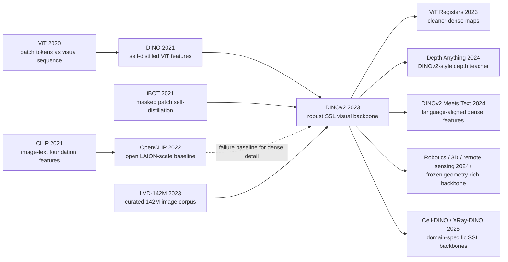

# DINOv2 - 无监督视觉特征的通用底座

> **2023 年 4 月 14 日，Meta AI Research 的 Maxime Oquab、Timothee Darcet、Theo Moutakanni、Huy V. Vo 等 26 位作者把 [arXiv:2304.07193](https://arxiv.org/abs/2304.07193) 上传到网上，三天后 Meta 开源 [facebookresearch/dinov2](https://github.com/facebookresearch/dinov2)。** 这篇论文的反直觉之处在于，它没有用文字 caption 教模型“这是什么”，也没有用人工类别标签校准语义，而是从 1.2B 张候选 web 图里自动筛出 142M 张 LVD 图像，用 DINO+iBOT 式自监督把一个 1.1B 参数 ViT-g/14 训练成通用视觉特征。DINOv2 最锋利的信号不是某个单项 SOTA，而是冻结 backbone 后仍能在分类、检索、分割、单目深度上同时工作，证明“视觉基础模型”不一定必须走 CLIP 式图文对齐路线。

## 一句话总结

Oquab、Darcet、Moutakanni、Vo 等 26 位作者 2023 年发布的 DINOv2，把视觉基础模型从“图像-文字对比学习”拉回到纯视觉自监督：先用 25 个第三方数据集作 seed，从 1.2B web 图像中检索并平衡出 LVD-142M，再训练 1.1B 参数 ViT-g/14，使 student 去匹配 EMA teacher 的全图分布与 masked patch 分布，核心损失可写成 $\mathcal{L}=\mathcal{L}_{DINO}+\mathcal{L}_{iBOT}+\lambda\mathcal{L}_{KoLeo}$。它替代的失败 baseline 是三类：ImageNet-1k/22k 上调出来的 SSL 特征跨域不够稳，未整理 web 图像会让自监督学到噪声，CLIP/OpenCLIP 虽强却常丢失局部几何。关键数字很集中：DINOv2-g/14 冻结特征在 ImageNet-1k k-NN/linear 达 83.5/86.5，在 ADE20K linear/+ms 达 49.0/53.0 mIoU，在 NYUd 深度 RMSE 达 0.344/0.298/0.279；后续 SAM 负责 promptable segmentation，[CLIP](../era4_foundation_models/2021_clip.md) 负责语言语义，而 DINOv2 成了 2023 之后许多 VLM、机器人、3D、医学和遥感系统默认的“几何感视觉 backbone”。隐藏 lesson 是：数据整理和特征几何有时比更花哨的跨模态接口更像基础设施。

---

## 历史背景

### 2023 年春天的视觉基础模型分裂

2023 年 4 月 DINOv2 出现时，计算机视觉刚经历一轮路线分裂。一条线由 CLIP 和 OpenCLIP 代表：用图文对比学习把图像 embedding 拉进语言空间，零样本分类、检索和开放词汇识别因此突然可用。另一条线由 MAE、DINO、iBOT、BEiT 等自监督方法代表：不借助文字，而是从图像自身的增强、遮挡、patch 关系和 teacher-student 一致性里学习视觉结构。前者更像语义接口，后者更像视觉几何引擎。

问题在于，2021-2022 年的社区注意力明显偏向图文路线。CLIP 的 demo 太强，LAION/OpenCLIP 又把 web-scale 图文预训练变成开源基线；多模态大模型也很自然地把 CLIP 当成“眼睛”。但图文对齐有一个代价：caption 往往只说图里最容易命名的物体和属性，空间位置、部件边界、纹理、深度、可通行区域、遮挡关系很少被文字完整描述。一个 caption 可以写“a dog on a chair”，却不会告诉模型椅背和狗腿在像素层怎么交错。

DINOv2 的历史位置就在这个裂缝里。它不反对 CLIP，而是指出：如果视觉 backbone 要给分割、深度、检测、机器人、遥感和医学图像当基础设施，单靠文本语义不够。视觉模型必须保留 patch 级别的局部一致性和跨域几何感。Meta 在同一个月发布 SAM 和 DINOv2，也很说明问题：SAM 让“点一下就出 mask”成为产品形态，DINOv2 则回答“冻结视觉特征本身能不能足够通用”。

### 从 DINO 到 iBOT：自监督视觉的前史

DINOv2 不是凭空出现的。2021 年的 DINO 已经展示了一个很迷人的现象：Vision Transformer 用自蒸馏训练后，attention map 会自然贴住物体区域，patch token 似乎学到了某种前景-背景结构。DINO 的核心是 teacher-student 框架：student 看不同增强视图，teacher 是 student 的 EMA 版本，student 要匹配 teacher 经过 sharpening 和 centering 后的输出分布。这条线的优雅之处在于没有人工标签，也没有负样本队列，却能形成可用的类别和物体结构。

iBOT 接着把自蒸馏推到 patch 层。它不只看全图 class token，还对被 mask 的 patch token 做在线 tokenizer 式预测，让模型在局部区域上也学会一致表示。这个设计对 DINOv2 非常关键，因为 DINOv2 的目标不只是 ImageNet linear probing，而是分割和深度这类 dense prediction。一个只会输出全局语义的 backbone 再强，也很难在像素级任务上稳定泛化。

但早期 DINO/iBOT 仍有两个限制。第一，许多结果是在 ImageNet-1k 或 ImageNet-22k 这类高度整理的数据上调出来的，容易把“自监督方法好”与“ImageNet 分布干净”混在一起。第二，训练大 ViT 的稳定性和工程效率还不够，尤其是 teacher-student、multi-crop、masked patch、large batch、high resolution 同时上时，很容易遇到 NaN、显存峰值和吞吐瓶颈。DINOv2 的贡献不是发明全新 SSL 目标，而是把这些已知组件扩到“基础模型”规模。

### Meta AI 当时在做什么

DINOv2 的作者团队来自 Meta AI Research / FAIR。这个团队在视觉上有两条长期积累：一条是 DINO、iBOT、SEER、self-supervised ViT，另一条是 Detectron、Mask R-CNN、SAM 等分割和 dense prediction 系统。Maxime Oquab、Timothee Darcet、Piotr Bojanowski、Armand Joulin 等作者的共同风格不是“为一个 benchmark 发明一个模块”，而是把数据、训练、模型和开源 release 拼成能被别人拿走复用的基础设施。

这也解释了 DINOv2 和 SAM 的互补关系。SAM 是交互式分割系统，重点是 promptable task、SA-1B 数据引擎和 mask decoder；DINOv2 是通用特征系统，重点是无标签预训练、冻结 backbone、linear/DPT/Mask2Former 等轻量下游头。两者都来自 Meta，但解决的是视觉基础模型的两个不同层面：一个是“如何让用户指定要哪个对象”，一个是“如何让模型本身看到稳健的视觉结构”。

### 工业界与开源生态的需求

2023 年的视觉产业已经很清楚地感到一个痛点：每个任务都微调一个 backbone 变得越来越不可持续。自动驾驶、AR、机器人、医疗、遥感、内容审核、商品理解都需要视觉表示，但标注成本、合规边界和域迁移问题各不相同。CLIP 可以给很多系统一个语义入口，却不一定给出足够好的深度、边界和局部对应。传统 supervised backbone 在 ImageNet 上很强，却需要密集标签或下游微调才能适应新任务。

DINOv2 把目标写得非常工程化：训练一次 backbone，冻结后直接服务多个下游任务；需要分类就接 linear head，需要语义分割就接 linear/multiscale 或 Mask2Former，需要深度就接 linear/DPT head，需要检索就用 nearest neighbor。它把视觉 foundation model 的评价标准从“某个任务最高分”改成“同一套特征在多种任务和分布上都不掉链子”。这正是它能在后续两年被机器人、3D、医学、遥感和 VLM 系统反复引用的原因。

## 研究背景与动机

### 核心矛盾：CLIP 会说名字，DINOv2 要保住结构

CLIP 的强项是把图像放进语言语义空间。它知道这张图像和“a red car”更接近，和“a green chair”更远；它也能把开放类别、文本检索和多模态对话接起来。但许多视觉任务并不只问“它叫什么”。分割问边界在哪里，深度问前后关系是什么，机器人问可抓取区域和接触面在哪里，3D 重建问跨视角 patch 如何对应。caption 里没有充分监督这些东西。

DINOv2 的动机正是给这类任务保留一个纯视觉、几何丰富、无需标签的 backbone。它不需要人类写 caption，也不需要类别 taxonomy；它需要的是足够多、足够多样、足够干净的图像，以及一个能同时塑造全局语义和局部 patch 的自监督目标。这里的“without supervision”不是浪漫口号，而是工程约束：很多真实领域没有足够标签，甚至没有可靠文字描述，但仍然有大量图像。

### 为什么关键不是“更多 web 图像”

如果只读摘要，DINOv2 很容易被误读成“把 DINO 放大到 142M 图”。论文实际更强调 curated data。早期 web-scale SSL 的一个反例是：数据越多不一定越好，未整理图像会把重复、低质、分布偏斜和无关样本一起灌进模型，最后得到的特征可能比 ImageNet-22k 还差。DINOv2 从 1.2B candidate pool 里构建 LVD-142M，不是为了追求最大规模，而是为了追求多样性、平衡性和评测安全。

这一步的思想很接近语言模型的数据清洗：同样是互联网数据，质量、去重、覆盖面和抽样策略决定了模型学到什么。DINOv2 用 25 个第三方数据集作 seed，计算自监督图像 embedding，用相似检索扩展，再做去重和平衡。这样做的结果是，训练集既不局限于 ImageNet 的物体分类语义，也不被原始 web 噪声淹没。它把“数据工程”提升到视觉自监督论文的中心位置。

### 目标：冻结特征，而不是赢一次微调

DINOv2 的目标并不是训练一个 end-to-end 在每个任务上微调到最高分的模型。论文反复强调 frozen features：分类用 k-NN 或 linear probe，分割用 frozen patch token 加线性/多尺度头，深度用简单线性或 DPT 解码器。这个评测选择非常克制，也非常有野心。克制在于它不把下游微调当作主要贡献；有野心在于它要求 backbone 本身足够通用，不能靠下游训练把缺陷补回来。

因此，DINOv2 的研究问题可以压成一句话：能否用无标签、纯视觉、自监督训练得到一套“开箱即用”的视觉特征，在图像级和像素级任务上同时超过最强开放图文模型 OpenCLIP？论文的答案是肯定的，但附带一个重要条件：必须同时做好数据整理、DINO+iBOT 目标、KoLeo 特征均匀性、高分辨率短训、可扩展 ViT-g 和蒸馏。少掉任何一块，DINOv2 都只是另一个大 SSL 模型；全部拼起来，它才成为基础设施。

---

## 方法详解

DINOv2 的方法价值不在于某个孤立新模块，而在于把“数据整理、DINO+iBOT 目标、训练稳定性、高分辨率适配、蒸馏和开源模型族”连成一条可复用流水线。它看起来像一篇自监督学习论文，实际更像一份视觉 backbone 的系统工程报告：如果目标是冻结特征在许多任务上直接用，训练目标、数据分布和工程吞吐必须同时成立。

### 整体框架

DINOv2 的训练主线是先训练一个大 teacher，再把它压缩成可部署模型族。大模型是 ViT-g/14，约 1.1B 参数；训练数据是 LVD-142M；预训练目标是 DINO 全图自蒸馏 + iBOT masked patch 自蒸馏 + KoLeo 正则；最后把 ViT-g 的知识蒸馏到 ViT-S/B/L/14。这样 release 出来的模型既有一个最大精度版本，也有面向下游部署的轻量版本。

| Model | Params | Backbone shape | Training role |
|---|---:|---|---|
| ViT-S/14 distilled | 21M | small patch-14 ViT | mobile and fast feature extraction |
| ViT-B/14 distilled | 86M | base patch-14 ViT | common research baseline |
| ViT-L/14 distilled | 300M | large patch-14 ViT | strong practical backbone |
| ViT-g/14 | 1.1B | 40 layers, dim 1536, 24 heads | largest teacher and top accuracy model |

这个架构选择有两个细节。第一，patch size 14 是 DINOv2 释放模型的统一接口，后续 dense tasks 可以直接从 patch token 取特征。第二，ViT-g/14 没有照搬原始 giant ViT 的 1408/16-head 设计，而是用 dim=1536、24 heads、每头 64 维来提高硬件效率；FFN 使用 SwiGLU，distilled S/B/L 模型则使用常规 MLP。论文的关键词不是“神秘新结构”，而是“可训练、可评估、可发布”。

### 关键设计 1：LVD-142M 数据引擎

DINOv2 最容易被低估的部分是数据。论文不是把所有 web 图像都扔进 SSL，而是先从约 25 个第三方数据集构造 seed corpus，包括 ImageNet-22k、ImageNet-1k、Google Landmarks、细粒度分类、分割、深度等数据源；再从 1.2B unique web images 中检索与 seed embedding 接近的图像，最后去重、平衡并形成 LVD-142M。

$$
\mathcal{D}_{\mathrm{LVD}} = \operatorname{Balance}\left(\operatorname{NN}_{\cos}\left(E_{\mathrm{seed}}, E_{\mathrm{web}}\right)\right)
$$

这里 $E$ 是用自监督 ViT-H/16 提取的图像 embedding，距离度量是 cosine similarity。这个公式当然简化了真实工程，但抓住了核心：DINOv2 的数据不是人工逐张标注，也不是盲目 web crawl，而是“用已有 curated domains 给 web 数据定形”。

| Stage | Operation | Why it matters |
|---|---|---|
| Seed corpus | collect curated third-party datasets | anchors useful visual concepts |
| Candidate pool | gather 1.2B unique web images | supplies scale and diversity |
| Embedding retrieval | search neighbors in SSL feature space | selects visually related images without labels |
| Dedup and balance | remove copies and cap overrepresented regions | avoids memorization and distribution collapse |

设计动机很直接：ImageNet-22k 够干净但覆盖窄，原始 web 数据够大但噪声重。LVD-142M 试图取两者中间点。论文的数据消融也支持这个判断：在相同 ViT-g/14 和相同迭代数下，LVD-142M 在多数 transfer benchmark 上优于 ImageNet-22k，尤其是那些不贴近 ImageNet taxonomy 的领域。

### 关键设计 2：DINO + iBOT + KoLeo 的训练目标

DINOv2 的 self-supervised objective 有三个部分。DINO 部分让 student 的全局表示匹配 teacher 的全局表示；iBOT 部分让 student 的 masked patch token 匹配 teacher 对应 patch token；KoLeo 正则鼓励 batch 内特征分布更均匀，避免最近邻空间塌缩。teacher 是 student 的 EMA 版本，输出经过 centering 和 sharpening。

$$
p_t = \operatorname{softmax}\left((g_{\theta_t}(x_t)-c)/\tau_t\right),\qquad p_s = \operatorname{softmax}\left(g_{\theta_s}(x_s)/\tau_s\right)
$$

$$
\mathcal{L}=\mathcal{L}_{\mathrm{DINO}}+\mathcal{L}_{\mathrm{iBOT}}+\lambda\mathcal{L}_{\mathrm{KoLeo}},\qquad \mathcal{L}_{\mathrm{iBOT}}=-\sum_i p_{t,i}\log p_{s,i}
$$

| Component | Signal | Acts on | Main effect |
|---|---|---|---|
| DINO loss | teacher-student distribution matching | class token / global crops | global semantic invariance |
| iBOT loss | masked patch prediction from teacher tokens | patch tokens | dense and local structure |
| KoLeo regularizer | entropy-like feature spreading | batch features | stronger nearest-neighbor geometry |
| SwAV centering | moving output center | teacher logits | prevents collapse under self-distillation |

下面的伪代码只保留训练循环的骨架，帮助读者看清 DINOv2 并不是“一个 loss”，而是 teacher-student、多 crop、mask、centering 和 EMA 共同作用。

```python
def dinov2_step(images, student, teacher, center, optimizer):
    global_crops, local_crops, masks = augment_and_mask(images)

    with torch.no_grad():
        teacher_cls, teacher_patch = teacher(global_crops)
        teacher_probs = sharpen_and_center(teacher_cls, center)
        patch_targets = sharpen_and_center(teacher_patch[masks], center)

    student_cls, student_patch = student(global_crops + local_crops, masks=masks)
    dino_loss = cross_entropy(student_cls, teacher_probs)
    ibot_loss = cross_entropy(student_patch[masks], patch_targets)
    koleo_loss = koleo_regularizer(student_cls)
    loss = dino_loss + ibot_loss + 0.1 * koleo_loss

    loss.backward()
    optimizer.step()
    update_ema_teacher(student, teacher)
    update_center(center, teacher_cls)
    optimizer.zero_grad()
```

这个设计的关键平衡是：DINO 给全图语义，iBOT 给 patch 结构，KoLeo 给检索空间。DINOv2 的实验也把这个拆开验证：KoLeo 对 nearest-neighbor retrieval 有明显帮助，iBOT 的 masked image modeling term 对 ADE20K 这类 patch-level 任务更重要。它不是把旧目标简单相加，而是在“冻结特征要同时服务全局和局部任务”的目标下重新组合。

### 关键设计 3：高分辨率短训与可扩展 ViT-g

像素级任务需要高分辨率。224 训练出来的 patch token 对分类足够，但小物体、边界和深度细节容易丢失；从头用 518x518 训练又太贵。DINOv2 采用折中策略：主要阶段用较低分辨率训练，在预训练末尾短时间把输入提升到 518x518。论文的 ablation 说明，这种短高分辨率阶段接近全程高分辨率训练的效果，但只花一小部分计算。

训练 ViT-g/14 还需要大量工程修补。DINOv2 采用 PyTorch 2、FSDP、xFormers memory-efficient attention、efficient stochastic depth、mixed precision，并报告同等硬件下相比 iBOT 实现约 2 倍速度、只用 1/3 显存。这个数字不是边角料：teacher-student SSL 的每一步都很重，如果吞吐和显存不稳，LVD-142M 和 1.1B 参数只是纸面规模。

另一个稳定性选择是 LayerScale 和较高 stochastic depth。它们在某些 linear probe 指标上不一定立刻加分，但能降低大模型训练中的 NaN 和发散风险。DINOv2 的方法论很现实：基础模型训练先要活着跑完，再谈下游泛化。许多“看起来不提升最终表格”的工程设计，其实是在给后续更大的数据和模型开路。

### 关键设计 4：从 ViT-g 到 S/B/L 的蒸馏

如果只发布 ViT-g/14，DINOv2 会变成少数机构才能部署的模型。论文选择把 ViT-g 作为 frozen teacher，蒸馏出 ViT-S/B/L/14。蒸馏训练沿用同一类 teacher-student 循环，但去掉 masking 和 stochastic depth，用大模型输出指导小模型。最后 release 的 S/B/L 模型在速度、显存和精度之间形成梯度。

这个蒸馏很重要，因为 DINOv2 的实际影响来自“模型族”而不是单一最大模型。README 里的发布模型显示，ViT-S/14 distilled 只有 21M 参数，linear eval 已到约 81%；ViT-B/14 到 84.5%；ViT-L/14 到 86.3；ViT-g/14 到 86.5。许多下游系统不会加载 1.1B 模型，但可以把 B/L 版本作为默认视觉特征。

更微妙的是，蒸馏让小模型继承大模型在 LVD-142M 上学到的分布覆盖，而不必从头承受同等训练成本。论文消融里，distilled ViT-L 在 12 个 benchmark 上都超过从头训练的 ViT-L，有时甚至超过 teacher 的单项结果。这说明 DINOv2 的大模型不仅是最终产物，也是一个特征生成器和训练信号放大器。

---

## 失败案例

DINOv2 的失败案例不是“某个小 baseline 被大模型暴打”这么简单。它真正反驳的是 2023 年视觉基础模型里的几种默认直觉：web 图像越多越好、CLIP 特征足够通用、ImageNet 上调好的 SSL recipe 自然能扩展、只要最终能微调就不必关心 frozen 特征。这些路线都部分正确，但不足以产出 DINOv2 想要的 all-purpose visual features。

### 失败路线 1：未整理的大规模 web 图像

早期 self-supervised scaling 的自然想法是：既然不需要标签，那就把 web 图像尽可能多地喂给模型。DINOv2 的数据消融说明这条路不稳。原始 web pool 里有重复图、低质图、广告截图、近似模板、极端长尾和过度代表的概念；SSL 不会自动知道哪些视觉模式值得学。噪声足够大时，模型可能把容量浪费在分布偏差上。

LVD-142M 的存在就是对这条失败路线的修正。DINOv2 没有选择最大数据量，而是从 1.2B 图里挑 142M；没有只靠 metadata，而是用自监督 embedding 做视觉相似检索；没有让热门概念无限膨胀，而是做平衡和去重。这个 lesson 后来在视觉、视频和多模态数据集里反复出现：scale 是必要条件，curation 才是放大器。

### 失败路线 2：只靠文本监督的视觉语义

CLIP/OpenCLIP 是 DINOv2 必须正面比较的强 baseline。它们在 ImageNet、开放类别和图文检索上非常强，甚至常常超过监督或自监督模型。但 DINOv2 指出它们并不是所有视觉任务的通用解。caption 监督偏向可命名物体和语义类别，对 patch boundary、局部几何和深度关系的监督很弱。结果是，CLIP 特征可以很好地告诉你“这像什么”，却不一定告诉你“边界在哪里、表面怎么弯、哪些 patch 是同一对象”。

这个失败不是 CLIP 的失败，而是把 CLIP 当成唯一视觉 backbone 的失败。DINOv2 在 ImageNet linear 上只比 OpenCLIP-G 小幅领先，但在 dense prediction 和某些跨域检索上拉开差距。2023 年之后许多系统开始同时用两类视觉特征：CLIP/SigLIP 负责语言语义，DINOv2 负责局部几何和 patch-level matching。

### 失败路线 3：只在 ImageNet 上调自监督 recipe

DINO 和 iBOT 的早期 success 很容易让社区把 ImageNet validation 作为 debugging signal。问题是 ImageNet 太整洁了：物体居中、类别清晰、标注 taxonomy 稳定。一个在 ImageNet 上调好的 SSL recipe，未必知道显微图、遥感图、街景深度、室内布局或细粒度商品的结构。DINOv2 的实验证明，ImageNet-22k 训练的模型可以在 ImageNet-1k 上表现很好，但在许多 transfer benchmark 上不如 LVD-142M。

这条失败路线的本质是评价信号太窄。DINOv2 把分类、鲁棒性、视频、检索、语义分割、深度估计一起放进评估，逼迫 backbone 在多种视觉需求中保持一致。它不是说 ImageNet 不重要，而是说 ImageNet 不足以定义“通用视觉特征”。

### DINOv2 自己承认的边界

DINOv2 也没有解决所有问题。它没有直接输出开放词汇类别，不能像 CLIP 那样把任意文本 prompt 变成分类器；它训练数据的完整来源、许可和潜在偏差仍需要外部审视；它的最大模型和完整训练仍是大厂级资源；它在 semantic segmentation 上用线性头已经很强，但要冲到绝对 SOTA 仍需要 Mask2Former/ViT-Adapter 这类专门头。DINOv2 最诚实的定位是“强视觉特征”，不是“完整视觉助手”。

| Failed route | Why it looked plausible | Where it breaks | DINOv2 correction |
|---|---|---|---|
| Raw web-scale SSL | labels are unnecessary, so more images should help | duplicates and noisy distributions dominate | curate LVD-142M from 1.2B candidates |
| Text-only visual pretraining | CLIP is strong on semantics and open vocab | captions underspecify local geometry | learn from image structure directly |
| ImageNet-tuned SSL | ImageNet gives clean debugging signal | transfer domains need broader coverage | train on diverse curated visual data |
| Downstream finetuning dependence | task heads can repair the backbone | frozen features reveal missing structure | optimize for k-NN, linear, dense frozen use |

## 实验关键数据

DINOv2 的实验价值在于覆盖面。论文没有只拿一个 ImageNet 表说事，而是同时看全局图像表示、跨域鲁棒性、细粒度分类、视频动作、实例检索、语义分割、单目深度和消融。下面只列最能说明历史位置的数字；它们共同指向同一个结论：DINOv2 的 frozen features 不只会分类，也更适合像素级和几何任务。

### 图像级别：分类、鲁棒性与检索

ImageNet linear probing 是最容易传播的指标。DINOv2-g/14 在 ImageNet-1k k-NN/linear 达到 83.5/86.5，超过 iBOT ViT-L/16 的 72.9/82.3，也略高于 OpenCLIP-G 的 83.2/86.2。更重要的是 ImageNet-V2：DINOv2 到 78.4，高于 OpenCLIP-G 的 77.2 和 EVA-CLIP 的 77.4，说明它不是只贴合 ImageNet validation。

| Setting | OpenCLIP-G | iBOT-L | DINOv2-g | Takeaway |
|---|---:|---:|---:|---|
| ImageNet k-NN | 83.2 | 72.9 | 83.5 | SSL catches text-supervised global features |
| ImageNet linear | 86.2 | 82.3 | 86.5 | frozen features are competitive with OpenCLIP |
| ImageNet-V2 linear | 77.2 | 72.4 | 78.4 | better generalization to shifted validation |
| ImageNet-A linear | 63.8 | 41.5 | 75.9 | strong robustness to adversarial natural images |

检索表更能说明 DINOv2 的几何优势。论文在 Oxford/Paris 等实例级检索上报告 DINOv2-g/14 明显超过 OpenCLIP-G 和 iBOT-L。例如 Oxford-Hard 上 OpenCLIP-G 约 50.7、iBOT-L 约 39.0，而 DINOv2-g 到 73.6；Oxford-Medium 上 DINOv2-g 到 92.1。检索不是纯语义分类，要求局部结构和实例细节，这正是 DINOv2 想保住的能力。

### 像素级别：分割与深度

语义分割是 DINOv2 对 CLIP 路线最有力的反例之一。只用 frozen patch tokens 加线性头，DINOv2-g/14 在 ADE20K 达到 49.0 mIoU，OpenCLIP-G 是 39.3；加 multiscale 后 DINOv2 到 53.0，OpenCLIP-G 是 46.0。Cityscapes 和 Pascal VOC 也有类似趋势。论文还报告，如果在 frozen ViT-g 上接 Mask2Former/ViT-Adapter pipeline，ADE20K 可到 60.2 mIoU。

| Dense task | OpenCLIP-G | iBOT-L | DINOv2-g | Protocol |
|---|---:|---:|---:|---|
| ADE20K segmentation | 39.3 | 44.6 | 49.0 | linear mIoU |
| ADE20K segmentation | 46.0 | 47.5 | 53.0 | multiscale mIoU |
| Cityscapes segmentation | 70.3 | 74.5 | 81.0 | multiscale mIoU |
| NYUd depth | 0.414 | 0.358 | 0.279 | DPT RMSE, lower is better |
| KITTI depth | 2.56 | 2.55 | 2.11 | DPT RMSE, lower is better |

单目深度尤其重要，因为它不是 caption 能直接教出来的任务。论文的 NYUd/KITTI/SUN RGB-D 结果显示，DINOv2 特征能被非常轻的 depth head 线性分离出几何信息；在 out-of-domain 样例上，OpenCLIP 预测常有碎片和错位，DINOv2 的深度图更平滑、更贴合物体结构。这解释了为什么后来的 Depth Anything、机器人和 3D 系统会频繁借用 DINOv2 表示。

### 消融：KoLeo、MIM、数据和蒸馏

DINOv2 的 ablation 不只是工程附录，而是论文说服力的一部分。它证明每个组件在不同任务上负责不同角色：KoLeo 改善 nearest-neighbor 几何，iBOT masked patch term 改善 ADE20K 这类局部任务，LVD-142M 比 ImageNet-22k 更适合跨域，短高分辨率训练几乎复制 full high-resolution 的 dense-task 好处，distillation 让小模型继承大 teacher 的覆盖面。

| Ablation | Reported signal | Interpretation |
|---|---|---|
| iBOT baseline | 72.9 k-NN / 82.3 linear on ImageNet | strong but not foundation-scale |
| Add KoLeo | retrieval improves and k-NN jumps in the staged ablation | feature space spreads better |
| Add iBOT MIM term | ADE20K benefits most clearly | patch supervision matters for dense tasks |
| LVD-142M vs ImageNet-22k | LVD wins most non-ImageNet benchmarks | curation plus diversity beats narrow cleanliness |
| Distilled ViT-L vs scratch ViT-L | distilled wins on all 12 checked benchmarks | large teacher transfers distributional coverage |

一个容易忽略的实验结论是“fine-tuning is optional”。ViT-g/14 在 ImageNet linear 是 86.5，finetuning 到 88.5，提升约 2 个点。对许多 supervised backbone 来说，冻结与微调差距会更大；DINOv2 的差距相对小，说明 backbone 自身已经把相当多的类别结构编码进特征里。它不是不要下游训练，而是把下游训练从“修复 backbone”变成“选择轻量接口”。

---

## 思想史脉络

DINOv2 在思想史上不像 Transformer 那样改写模块拓扑，也不像 CLIP 那样把语言直接接进视觉。它的影响更像一次基础设施修正：在大家几乎默认“视觉基础模型 = 图文对齐”时，DINOv2 证明纯视觉自监督仍然能在基础模型时代成立，而且在局部几何、像素级迁移和领域外视觉任务上有自己的不可替代位置。



### 前世：谁逼出来的

DINOv2 的前世有三条线。第一条是 ViT 线：把图像切成 patch token 后，视觉模型第一次能像语言模型一样处理序列，也让 class token 和 patch token 的分工变得清晰。没有 ViT，DINO 的 object attention 和 iBOT 的 patch distillation 都很难以这种形式出现。第二条是 DINO/iBOT 线：DINO 证明自蒸馏 ViT 会自然长出物体区域感，iBOT 证明 masked patch 目标能把局部结构纳入训练。第三条是 CLIP/OpenCLIP 线：它们把“foundation model for vision”这个词推到中心，也暴露出 caption 对局部几何监督不足的问题。

DINOv2 的直接压力来自第三条线。OpenCLIP 太强了，强到任何纯视觉 SSL 模型都必须回答一个问题：如果不用文本，为什么还值得训练？DINOv2 的回答是：因为并非所有视觉任务都能被语言监督覆盖。分类和图文检索只是视觉的一部分，patch 对应、深度、分割、局部纹理、跨域几何也需要基础模型级别的特征。

数据线同样重要。ImageNet 时代的 SSL 往往把“干净数据”视为默认条件；LAION 时代的图文预训练又把“web-scale”变成默认方向。DINOv2 把这两者重新合并：不是 ImageNet 小而洁净，也不是 web 无限放大，而是 curated web-scale。这个思想后来对视觉/视频数据构建影响很大：大模型训练里，数据筛选本身就是方法。

### 今生：被谁继承

DINOv2 的继承者分两类。一类直接修补 DINOv2 的视觉问题。Darcet、Oquab、Mairal、Bojanowski 2023 年的 “Vision Transformers Need Registers” 发现大 ViT dense feature maps 中会出现 artifact tokens，于是加入 register tokens 作为额外汇聚槽，减少 patch map 中的异常高范数点。这个工作几乎可以看作 DINOv2 的后记：当 backbone 真正被用于 dense tasks，内部 token pathology 就从美学问题变成工程问题。

另一类把 DINOv2 作为默认视觉 backbone。Depth Anything 等深度模型用 DINOv2 风格的表示和大规模伪标签加强单目深度；DINOv2 Meets Text 试图把 DINOv2 的 dense visual features 接上语言；机器人和具身模型把 DINOv2 patch token 用作几何感知；3D、遥感、医学和生物图像系统则把它当成少标签领域的强初始表示。2024-2026 年大量论文标题里出现 “with DINOv2” 或 “DINOv2 features”，说明它已经从单篇 paper 变成工具箱零件。

这种继承很少表现为“完全复现 DINOv2 训练”。更多时候，DINOv2 被作为 frozen encoder、teacher、metric、retrieval feature、pseudo-label source 或局部 matching prior。它的影响方式因此更像 ImageNet/ResNet 早期的 backbone 角色：后续论文未必研究 DINOv2 本身，但默认它是一个可以信任的视觉表征。

### 误读：不是没有标签的 CLIP

最常见误读是把 DINOv2 看成“没有文本的 CLIP”。这个说法太粗。CLIP 的目标是把图像和文本拉进同一个语义空间，优势是开放词汇、文本检索和多模态接口；DINOv2 的目标是让图像自身形成稳定的全局和局部特征，优势是 frozen dense representation。二者的失败模式也不同：CLIP 可能语义对但边界差，DINOv2 可能几何好但不知道文本类别名。

另一个误读是把 DINOv2 归结为“142M 数据 + 大 ViT”。论文的 ablation 正好反驳这一点。未整理数据不是答案，ImageNet-22k 不是答案，单纯 iBOT baseline 也不是答案。DINOv2 的关键是系统组合：数据 curated、loss 覆盖 global/local、KoLeo 保持特征分布、短高分辨率服务 dense tasks、工程优化让大模型可训、蒸馏让小模型可用。

第三个误读是把它当成 2023 年视觉基础模型的终点。实际上 DINOv2 是一个很强的中间层：它不解决语言对齐，不解决开放词汇，不解决 task planning，也不解决所有数据合规问题。它更像给后续系统提供了一块可靠视觉皮层。2023 年之后的强系统往往不是 CLIP 或 DINOv2 二选一，而是把语言语义、视觉几何、分割 prompt、深度和 3D 表示组合起来。

---

## 当代视角

### 站不住的假设

从 2026 年回看，DINOv2 最先打掉的是一个隐含假设：视觉基础模型必须通过文字监督获得通用性。2023 年的多模态热潮让这个假设很诱人，因为 CLIP 到 GPT-4V 的路线看起来一路通畅。但 DINOv2 证明，图像自身也能提供足够丰富的监督信号，尤其是当任务关心局部结构、密集对应和几何关系时。语言是强接口，却不是视觉表征的唯一源头。

第二个站不住的假设是“自监督视觉已经过了黄金期”。2021 年之后，MAE、BEiT、DINO、iBOT 的增益在 ImageNet 表格上看似变小，社区转向图文数据和生成模型。但 DINOv2 说明，瓶颈不只是 objective novelty，而是数据整理和训练系统是否跟上基础模型规模。一个旧目标在更好的数据和更稳的工程下，可以重新变得有生命力。

第三个站不住的假设是“强 backbone 一定要靠下游微调证明”。DINOv2 的影响恰好来自 frozen use。后续许多机器人、3D、医学和遥感工作并不想从头微调一个巨大的视觉模型；它们想要一个可靠 feature extractor。DINOv2 把视觉基础模型的价值从“我能在某个 benchmark finetune 到多少”转向“我被冻结后还能给多少任务打底”。

### 如果今天重写 DINOv2

如果今天重写 DINOv2，第一处变化会是更透明的数据治理。2023 年论文已经强调去重、平衡和评测泄漏控制，但 2026 年读者会进一步要求可审计的数据来源、版权边界、地域/文化偏差报告、医疗和人脸等敏感域处理。视觉 foundation model 的数据合规压力已经比 2023 年更高。

第二处变化会是和语言/多模态接口更早耦合。DINOv2 原文有意保持纯视觉，这让它的几何性很强；但今天的系统通常需要“既懂文本又懂局部结构”。一个 2026 版 DINOv2 可能会把 dense visual SSL 作为第一阶段，再用轻量 language alignment、region-text grounding 或 mask-text 对齐作为第二阶段，而不是让社区事后再写 DINOv2 Meets Text。

第三处变化会是视频和 3D。DINOv2 主要在静态图像上训练和评测，但机器人、AR、自动驾驶和世界模型需要时间一致性、跨视角对应和可交互空间。今天重写这篇论文，很可能会把 video SSL、multi-view consistency、depth/normal/flow pseudo-task 和 3D-aware evaluation 放进同一个 backbone 目标里。DINOv2 已经证明“图像自身足够教很多东西”，下一步自然是“世界自身如何教视觉”。

## 局限与展望

### 盲点 1：语义类别和文本接口缺失

DINOv2 的几何和局部结构很强，但它没有 CLIP 那样自然的文本接口。用户不能直接写一个类别 prompt，让 DINOv2 零样本分类；模型也不会天然把 patch 与短语对齐。这意味着很多开放词汇检测、VQA、图文检索和多模态助手系统仍需要 CLIP/SigLIP 或额外 alignment。DINOv2 更像视觉皮层，不是完整语言接口。

这个盲点也给后续工作留下空间。DINOv2 Meets Text、region-level contrastive alignment、SAM + DINOv2 + text grounding 这类系统都在补同一个缺口：保留 DINOv2 的 dense geometry，同时接入语言语义。真正难的是不把 DINOv2 变成另一个只会 caption 的 encoder；语言对齐如果过强，可能会牺牲它最有价值的局部结构。

### 盲点 2：数据、许可与评测泄漏风险

LVD-142M 是 DINOv2 的核心资产，但它并没有作为完整数据集公开给社区复刻。论文说明了构建流程和部分来源，却不能让外部研究者逐张审计图像、许可、地域分布、人物敏感性和评测集重叠。这是大规模视觉 foundation model 的共同问题：数据质量决定模型质量，但数据本身常常最难开放。

评测也有隐性风险。DINOv2 用 curated seed datasets 扩展 web 图像，训练集需要避免和 downstream benchmark 过度重叠；论文做了去重和检查，但外部很难完全验证。随着模型被用于医疗、遥感、生态监测和人类图像，数据治理会从“论文复现问题”变成“部署责任问题”。后续视觉基础模型必须把这部分写得更清楚。

## 相关工作与启发

### 对 VLM、机器人和 3D 的启发

DINOv2 给多模态系统的启发是：不要把“会说出类别名”误当成“看清了世界”。很多 VLM 在文字问答上很强，却会在计数、空间关系、局部属性和几何推理上出错；把 DINOv2 这类 patch-level 视觉特征接入语言模型，是缓解这一问题的自然方向。后来的 LLaVA-like 系统、grounding 模型和 image-text alignment 方法都在探索这件事。

对机器人和 3D 来说，DINOv2 的意义更直接。一个冻结 backbone 如果能稳定提供对象部件、纹理、深度和跨域 patch 关系，就可以作为抓取、导航、视觉定位、场景重建和少样本识别的共用感知层。很多现实机器人系统没有百万级标注，也不可能为每个新环境从头训练视觉模型；DINOv2 这类无监督 backbone 正好填补这个空白。

### 对自监督研究的启发

DINOv2 给自监督研究留下的最大启发，是把“算法创新”重新放回“数据与工程”旁边。很多 SSL 论文习惯在同一个数据集上替换 loss 或 augmentation；DINOv2 说明，当目标是 foundation model，数据构建、去重、seed 选择、检索策略、batch 特征几何、高分辨率阶段、蒸馏路线和开源接口都属于方法。

它也提醒研究者不要只盯 ImageNet。一个好的视觉表征应当被实例检索、分割、深度、鲁棒性、视频和领域外任务共同检验。ImageNet linear 仍然有用，但已经不能独自代表视觉通用性。DINOv2 的评价矩阵虽然还不完美，却把自监督视觉从“分类预训练”推向“多任务基础特征”。

## 相关资源

### 论文与代码

- Paper: [DINOv2: Learning Robust Visual Features without Supervision](https://arxiv.org/abs/2304.07193)
- Code and models: [facebookresearch/dinov2](https://github.com/facebookresearch/dinov2)
- Meta blog: [DINOv2: State-of-the-art computer vision models with self-supervised learning](https://ai.meta.com/blog/dino-v2-computer-vision-self-supervised-learning/)
- Demo: [dinov2.metademolab.com](https://dinov2.metademolab.com/)

### 后续项目

- [Vision Transformers Need Registers](https://arxiv.org/abs/2309.16588): 修复大 ViT dense feature maps 中的 artifact token，是 DINOv2 后续最直接的内部补丁。
- [Depth Anything](https://arxiv.org/abs/2401.10891): 把 DINOv2 风格的视觉特征和大规模伪标签推向单目深度。
- [DINOv2 Meets Text](https://arxiv.org/abs/2412.16334): 尝试把 DINOv2 的 image/pixel features 与语言对齐。
- Domain-specific DINO lines: Cell-DINO、XRay-DINO、Channel-Adaptive DINO 等项目说明 DINOv2 recipe 已经被迁移到生物、医学和多通道图像。


---

> 🌐 [English version](/en/era5_genai_explosion/2023_dinov2/) · 📚 awesome-papers project · CC-BY-NC