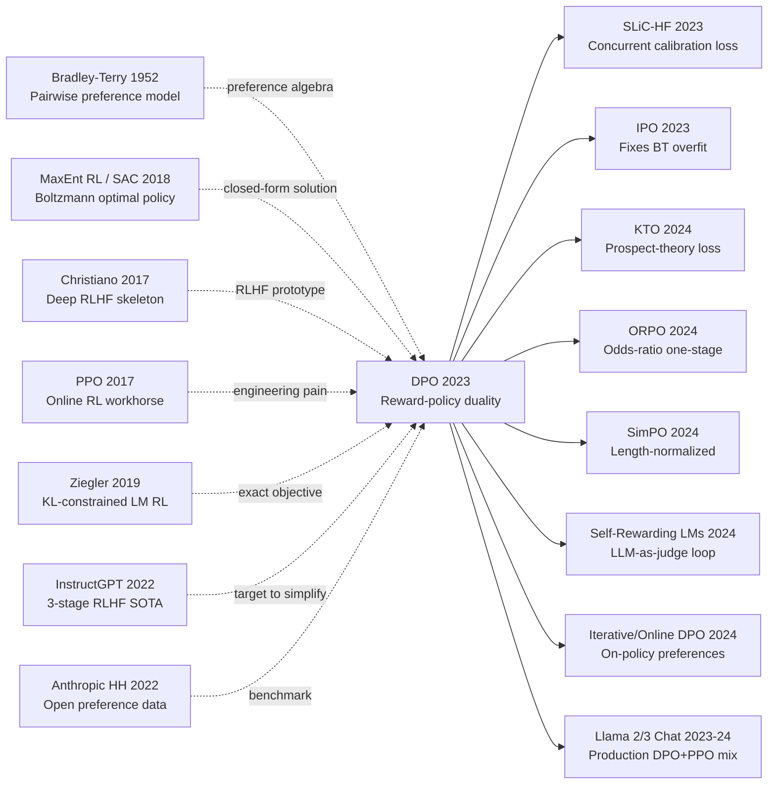

# DPO — 不要奖励模型也不要 PPO，直接用偏好数据对齐 LLM

> **2023 年 5 月 29 日，Stanford 的 Rafael Rafailov、Archit Sharma、Eric Mitchell、Stefano Ermon、Christopher Manning、Chelsea Finn 在 arXiv 上传 [2305.18290](https://arxiv.org/abs/2305.18290)，同年 12 月获 NeurIPS 2023 outstanding runner-up paper award。**
> 这是一篇用一个**反 [InstructGPT (2022)](../era4_foundation_models/2022_instructgpt.md) 三阶段流水线**的极简方案重写 LLM 对齐范式的论文 —— Rafailov 等人通过数学推导证明，RLHF 中的「先训 reward model 再 PPO」可以**等价转换为一个简单的最大似然损失** $\mathcal{L}_{\text{DPO}} = -\log \sigma\left(\beta \log \frac{\pi_\theta(y_w|x)}{\pi_{\text{ref}}(y_w|x)} - \beta \log \frac{\pi_\theta(y_l|x)}{\pi_{\text{ref}}(y_l|x)}\right)$。
> 不需要训 reward model、不需要采样、不需要 [PPO (2017)](../era3_attention/2017_ppo.md) 的复杂超参，DPO 直接用 (chosen, rejected) 偏好对监督微调 —— 在 IMDb sentiment / TL;DR summarization / Anthropic HH 上**对齐效果与 PPO RLHF 持平甚至更好**，训练代码减少 90%、显存减少 50%、复现门槛从 OpenAI 工程师降到本科生水平。
> 它发布 6 个月内成为**整个开源 LLM 对齐的事实标准**：Zephyr / Tulu / Mistral-Instruct / Llama-3-Instruct / Qwen-Chat 全部用 DPO 而不是 PPO —— **DPO 是 RLHF 时代的"我们其实不需要 RL"宣言**，把 LLM 对齐从重 infra 任务降为普通 supervised learning。

## 一句话总结

DPO 把 InstructGPT 那套"奖励模型 + KL 约束 PPO"的三阶段 RLHF 流水线，用一行代数变换压缩成一个**类似分类器的有监督对比损失**：先证明 KL-正则 RL 的最优策略对奖励有闭式解，再把奖励反向写成"策略相对参考策略的 log-ratio"，代入 Bradley-Terry 偏好模型后归一化常数自动消掉，于是不再需要拟合 reward model、不再需要在线采样、不再需要 PPO，单一 supervised loss 就能完成整条偏好对齐。

## 历史背景

### 2022 下半年到 2023 上半年的对齐学界在卡什么

2022 年底 ChatGPT 把"对齐就是要做 RLHF"这件事彻底产品化之后，整个对齐学界其实陷入了一种很拧巴的状态：所有人都知道 InstructGPT [ref1] 的三阶段流水线（SFT → RM → PPO + KL）能 work，但**真正能把它复现到接近 ChatGPT 水准的团队不超过五个**。Anthropic 的 HH 数据集 [ref2] 公开了，OpenAI 的 PPO 实现 (`trl`、`trlx`) 公开了，可绝大多数学术实验室仍然跑不动这条 pipeline。卡点不是数据也不是模型，而是工程：在线 RL 需要同时持有 4 份模型副本（policy、reference、reward、value）才能算 advantage，单卡 24GB 的 RTX 3090/4090 上连 1.3B 模型都装不下；PPO 的 hyperparam（KL 系数 $\beta$、clip ratio、reward whitening、advantage normalization、value loss 权重、rollout batch size、minibatch 重采样次数）任何一个调错都会导致 reward hack 或者 mode collapse；reward model 训练时还要专门留一份 held-out 偏好集做早停，否则 PPO 跑到一半 reward 突然飞天但人类一看全是无意义重复。

更深的问题在于**reward model 是个二次错误源**：人类偏好通过 Bradley-Terry 拟合成 RM，PPO 再优化 RM，整条链路有两次拟合误差累积。一旦 PPO 的 policy 跑出 RM 的训练分布，RM 的外推就完全不可信，于是 KL 系数 $\beta$ 必须时时刻刻把 policy 拉回 reference 附近——这本质上是在用一个 hyperparam 控制"我们对 RM 有多不信任"，调起来全凭手感。学界因此普遍流传一句话："RLHF 不是科学是炼丹"，2023 年 ICLR / NeurIPS 投稿里大量 alignment 论文卡在"我们试图复现 InstructGPT 但我们的 PPO 不收敛"。整个领域急需一种更短的、更不依赖在线 RL 的偏好优化路径。

### 直接逼出 DPO 的 5 篇前序

**2022 InstructGPT** [ref1]（Ouyang et al., OpenAI）：把 RLHF 三阶段流水线推到 SOTA，但同时把 PPO 的工程复杂度暴露给整个社区——这是 DPO 想"砍掉"的那条 pipeline。

**2017 PPO** [ref3]（Schulman et al.）：提供了 RLHF 的优化引擎，但也是 RLHF 不可复现性的主要来源（4 份模型副本、20+ 个超参）。DPO 的副标题"Your Language Model Is Secretly a Reward Model"几乎就是在嘲讽 PPO 流水线"为什么要训两个模型"。

**Bradley-Terry 1952**：偏好建模的 70 年老底子，$p(y_w\succ y_l)=\sigma(r_w-r_l)$。DPO 的核心代数变换正是把策略 log-ratio 当作 reward 代入这个 sigmoid。

**最大熵 RL / Soft Actor-Critic** [ref4]（Haarnoja et al. 2018；Ziebart 2010）：证明了"reward 最大化 + entropy/KL 正则"的最优策略具有 Boltzmann 形式 $\pi^*\propto\exp(r/\beta)$。这条闭式解是 DPO 整篇论文的数学基石——没有它，reward 和 policy 就无法相互转换。

**2019 Ziegler 等的"Fine-Tuning LMs from Human Preferences"** [ref5]：第一次把 KL-约束 RL 用到 LM 上，明确写出 $r(x,y)-\beta\,\mathrm{KL}(\pi\|\pi_{ref})$ 的目标。DPO 直接继承了这个目标函数，只是**不再用 RL 去解它，而是用代数把它解出来**。

### 作者团队当时在做什么

DPO 的一作 Rafael Rafailov 与共同一作 Archit Sharma、Eric Mitchell 都在 Stanford CS / Chelsea Finn 的 IRIS 组，长期做的是 meta-learning + offline RL（Mitchell 之前做 model editing，Sharma 做 unsupervised skill discovery）。这群人**不是 NLP 出身**，所以他们看 RLHF 的视角和 OpenAI 完全不同：在他们眼里 InstructGPT 的 PPO 就是一个非常普通的"在线 entropy-regularized RL"问题，而 offline RL 社区早就知道这类问题有闭式解（CQL、AWR、IQL 等都用过类似 Boltzmann policy 推导）。Chelsea Finn 本人也是 offline RL 和 imitation learning 的资深玩家，团队对"把 RL 转成监督学习"有天然的方法论敏感。这就是为什么 DPO 出自 Stanford 而不是 OpenAI——OpenAI 的 RLHF 老兵反而被 PPO 的工程惯性绑住了。

论文 2023 年 5 月挂上 arXiv，6 月 NeurIPS 投稿截止前定稿，10 月被接收为 NeurIPS 2023 Outstanding Main Track Paper。从挂 arXiv 到 HuggingFace `trl` 库官方支持 DPOTrainer 不到 4 个月，到 Llama 2 / Zephyr / Tulu / Mistral-Instruct 系列把 DPO 当默认对齐方法不到 9 个月。

### 工业界 / 算力 / 数据状态

2023 年中开源 LLM 进入大爆发：LLaMA 1（2023.02）、Alpaca（2023.03）、Vicuna（2023.03）、LLaMA 2（2023.07）相继发布，社区第一次拥有了 7B-70B 量级的开源 base model。但**所有人都被 RLHF 卡住了**——Vicuna、Alpaca 用的都是 SFT-only，因为他们跑不动 PPO。Anthropic HH-RLHF（161K 偏好对）和 OpenAI WebGPT、Stanford SHP 等开源偏好数据集已经就位，缺的不是数据是优化器。算力层面 A100 80GB 仍是稀缺资源，单机 8×A100 跑 7B 的 PPO 极限是 batch size = 8、生成长度 128，循环一轮要数小时；DPO 出现后同样硬件可以用 batch size = 64-128 跑 epoch 级训练，单卡 24GB 甚至能用 LoRA + DPO 微调 7B 模型。这种"算力门槛降一个量级"的工程红利，是 DPO 能在半年内席卷开源社区的根本原因。

---

## 方法详解

### 整体框架

DPO 的"方法"出奇地简短——整篇论文的算法流程图可以画成 4 行：

```text
Input : 偏好数据集 D = { (x, y_w, y_l) }, 参考策略 pi_ref (通常 = SFT 模型)
Init  : pi_theta = pi_ref
Loss  : L = -E[ log sigma( beta * (log pi_theta(y_w|x)/pi_ref(y_w|x)
                                 - log pi_theta(y_l|x)/pi_ref(y_l|x)) ) ]
Update: 普通 SGD/AdamW 优化 L，结束。
```

和 InstructGPT/PPO 流水线相比，**砍掉的部件超过了保留的部件**：

| 阶段 | InstructGPT (PPO-RLHF) | DPO |
|---|---|---|
| 训练 reward model | ✅ 单独阶段，几 epoch | ❌ 不需要 |
| 在线 rollout 采样 | ✅ 每步生成 K 个候选 | ❌ 不需要 |
| 价值函数 (critic) | ✅ value head + GAE | ❌ 不需要 |
| 模型副本数 | 4 (policy + ref + reward + value) | 2 (policy + ref) |
| 关键超参数量 | ~20 (clip, GAE λ, value coef, ...) | 1 (β) |
| 单次更新形态 | on-policy PPO step | 离线 SGD on (x,y_w,y_l) batch |
| 显存峰值 (7B) | ~80 GB | ~30 GB |

⚠️ **真正反直觉的事实**：DPO 不是"近似 PPO 的高效替代"，它在 KL-正则 RL 这个目标下与 PPO **等价**——两者优化的是字面意义上同一个目标函数 $\max_\pi \mathbb{E}[r]-\beta\mathrm{KL}(\pi\|\pi_{ref})$ 的同一个最优解，区别只在于 PPO 用迭代采样去逼近最优，DPO 用一次代数变换直接落到最优。

### 关键设计 1：Reward-Policy 对偶 —— 闭式解的反向用法

**功能**：把"先训 reward 再训 policy"的两阶段流水线，缩成一阶段——证明了任何由偏好数据隐含的 reward，都可以**直接编码在策略相对参考策略的 log-ratio 里**。

**核心推导**。考虑 InstructGPT/Ziegler 等使用的标准 KL-正则 RL 目标：

$$
\max_{\pi}\ \mathbb{E}_{x\sim D,\,y\sim\pi(\cdot|x)}\big[r(x,y)\big] - \beta\,D_{\mathrm{KL}}\!\big(\pi(\cdot|x)\,\|\,\pi_{\mathrm{ref}}(\cdot|x)\big)
$$

这是一个 entropy/KL-regularized RL 问题，按 Boltzmann/最大熵 RL 的标准结果，最优策略具有闭式解：

$$
\pi^*(y|x) \;=\; \frac{1}{Z(x)}\,\pi_{\mathrm{ref}}(y|x)\,\exp\!\Big(\tfrac{1}{\beta}\,r(x,y)\Big),\qquad Z(x)=\sum_{y}\pi_{\mathrm{ref}}(y|x)\exp(r(x,y)/\beta).
$$

DPO 的关键观察是：**这条等式可以反向解出 reward**。两边取 log 并整理，得到

$$
r(x,y) \;=\; \beta\,\log\frac{\pi^*(y|x)}{\pi_{\mathrm{ref}}(y|x)} \;+\; \beta\,\log Z(x).
$$

也就是说，**在最优解附近，reward 可以被精确写成"最优策略相对参考策略的 log-ratio"加一个只依赖于 $x$ 的常数**。$\log Z(x)$ 形式上不可计算（要对全部 $y$ 求和），但它**只依赖 $x$、不依赖 $y$**——这一性质是整套推导能跑通的关键，下一节就会用它把 $Z(x)$ 消掉。

```python
# 概念上的对偶关系：策略与奖励是同一对象的两种参数化
def implicit_reward(pi_theta, pi_ref, x, y, beta):
    # r_hat(x, y) 不需要单独的 reward model
    return beta * (log_prob(pi_theta, x, y) - log_prob(pi_ref, x, y))
```

| 视角 | 显式 reward 路线 (InstructGPT) | 隐式 reward 路线 (DPO) |
|---|---|---|
| reward 表达 | 独立网络 $r_\phi(x,y)$ | $\beta\log(\pi_\theta/\pi_{\mathrm{ref}})$ |
| 训练顺序 | 先 RM，再 policy | 直接训 policy |
| 误差累积 | RM 拟合 + PPO 优化两次 | 一次拟合 |
| 推断时是否要 RM | 否（PPO 用完即弃） | 否（顺带得到） |

**设计动机**：作者意识到 RLHF 社区把"训 reward 再做 RL"当成天经地义，但其实这是**人为制造的两阶段**——KL-正则 RL 的目标函数本身就保证了 reward 和 policy 的双射关系，没有任何理由把它们当作两个独立对象。这一观察后来被概括为"Your Language Model Is Secretly a Reward Model"。

### 关键设计 2：把偏好优化变成分类问题 —— DPO Loss 的诞生

**功能**：用 Bradley-Terry 偏好模型把 reward 之差转成偏好概率，配合上一步的对偶关系，让 $Z(x)$ 自动消掉，得到一个**纯监督的二分类损失**。

Bradley-Terry 1952 的偏好模型假设：给定 prompt $x$，人类选择 $y_w$ 优于 $y_l$ 的概率是 reward 之差经过 sigmoid，

$$
p^*(y_w \succ y_l \mid x) \;=\; \sigma\!\big(r(x,y_w) - r(x,y_l)\big).
$$

DPO 把上一节的隐式 reward 表达式代入：

$$
\begin{aligned}
r(x,y_w) - r(x,y_l) &= \beta\log\tfrac{\pi^*(y_w|x)}{\pi_{\mathrm{ref}}(y_w|x)} + \beta\log Z(x) \\
&\quad - \beta\log\tfrac{\pi^*(y_l|x)}{\pi_{\mathrm{ref}}(y_l|x)} - \beta\log Z(x) \\
&= \beta\log\tfrac{\pi^*(y_w|x)}{\pi_{\mathrm{ref}}(y_w|x)} - \beta\log\tfrac{\pi^*(y_l|x)}{\pi_{\mathrm{ref}}(y_l|x)}.
\end{aligned}
$$

⚠️ **整个 DPO 论文的关键就在这一步**：$\log Z(x)$ 在 $y_w$ 和 $y_l$ 中都出现一次且符号相反，**自动相消**——这个看起来不可计算的归一化常数永远不需要被算出来。把 $\pi^*$ 替换为待优化的 $\pi_\theta$，最大化偏好对数似然就得到 DPO 损失：

$$
\mathcal{L}_{\mathrm{DPO}}(\pi_\theta;\pi_{\mathrm{ref}}) \;=\; -\,\mathbb{E}_{(x,y_w,y_l)\sim D}\!\left[\,\log\sigma\!\Big(\beta\log\tfrac{\pi_\theta(y_w|x)}{\pi_{\mathrm{ref}}(y_w|x)}\;-\;\beta\log\tfrac{\pi_\theta(y_l|x)}{\pi_{\mathrm{ref}}(y_l|x)}\Big)\right].
$$

```python
def dpo_loss(pi_theta, pi_ref, batch, beta=0.1):
    # batch: (x, y_w, y_l) triples
    logp_w   = sequence_logprob(pi_theta, batch.x, batch.y_w)   # sum log p(token)
    logp_l   = sequence_logprob(pi_theta, batch.x, batch.y_l)
    logp_w_r = sequence_logprob(pi_ref,   batch.x, batch.y_w)   # reference, frozen
    logp_l_r = sequence_logprob(pi_ref,   batch.x, batch.y_l)

    # the magic line: implicit reward gap = beta * (policy log-ratio - reference log-ratio)
    gap = beta * ((logp_w - logp_w_r) - (logp_l - logp_l_r))
    return -F.logsigmoid(gap).mean()
```

| 损失类型 | 优化目标 | 等价于 |
|---|---|---|
| 标准 LM CE | $-\log\pi_\theta(y\|x)$ | 模仿单条轨迹 |
| DPO | $-\log\sigma(\beta\,\Delta\log\text{ratio})$ | 偏好对的二分类 |
| RM Loss (BT) | $-\log\sigma(r_w-r_l)$ | 偏好对的二分类 |

**设计动机**：DPO 损失的形式与训 reward model 的损失**几乎一模一样**——都是 sigmoid + log，都是偏好对二分类，区别仅在于"reward 之差"被替换成"策略与参考策略 log-ratio 之差再乘 $\beta$"。这意味着任何能训 RM 的代码框架，把一行替换掉就能训 DPO；任何能跑 LM SFT 的框架，加一份冻结的参考模型副本就能跑 DPO。这种"零工程门槛"是 DPO 在 6 个月内被全开源社区采纳的根本原因。

### 关键设计 3：β 系数 —— 把 KL 约束从 PPO 训练循环搬进 loss 闭式解

**功能**：把 InstructGPT 里那个动态调度的 KL 系数，变成 DPO loss 里一个固定的温度参数；通过同一个 $\beta$ 同时控制"对偏好的拟合强度"和"对参考策略的偏离程度"。

DPO 损失对参数的梯度（论文 Sec 5.1，注意符号）可以写成：

$$
\nabla_\theta \mathcal{L}_{\mathrm{DPO}} \;=\; -\beta\,\mathbb{E}\!\left[\sigma\!\big(\hat r(x,y_l)-\hat r(x,y_w)\big)\,\Big(\nabla_\theta\log\pi_\theta(y_w|x) - \nabla_\theta\log\pi_\theta(y_l|x)\Big)\right]
$$

其中 $\hat r(x,y)=\beta\log(\pi_\theta(y|x)/\pi_{\mathrm{ref}}(y|x))$ 是隐式 reward。这个梯度的形态非常优雅：

1. **样本权重 $\sigma(\hat r_l-\hat r_w)$**：当模型已经把 winner 排在 loser 前面时，权重接近 0，自动跳过；当模型把 loser 排在 winner 前面时，权重接近 1，强力修正——**自带 hard-negative mining**。
2. **方向项 $\nabla\log\pi(y_w)-\nabla\log\pi(y_l)$**：把 winner 拉高、loser 压低，但**不是 SFT 那种无约束模仿**，而是相对 reference 的相对调整。
3. **缩放系数 $\beta$**：直接出现在梯度幅度里，越大梯度越大、policy 越激进；越小梯度越小、policy 越贴近 reference。

| $\beta$ 取值 | 行为 | 风险 |
|---|---|---|
| 0.01 | 几乎不离开 reference | 偏好提升弱 |
| 0.1 (论文默认) | 平衡点，多数任务最优 | 长度膨胀仍存在 |
| 0.5 | 激进偏好优化 | reference drift、回答模板化 |
| 1.0 | 几乎抹掉 reference 约束 | 等同于纯偏好 SFT，易崩 |

**设计动机**：在 PPO 里 $\beta$ 是个动态调度的复杂物件（很多实现还要 adaptive $\beta$，根据当前 KL 自动调节），而在 DPO 里 $\beta$ 退化成一个**固定的温度超参**，且物理意义清晰：它就是 KL-正则 RL 目标里那个 $\beta$。整个 RLHF 社区调了两年的 PPO 调度被一个数字取代——这是 DPO 工程吸引力的核心。

### 损失函数与训练策略

| 项目 | 典型设置 (论文 + 主流复现) | 作用 |
|---|---|---|
| Loss | DPO logistic | 偏好对二分类 |
| Optimizer | AdamW, lr 1e-6 ~ 5e-7 | 比 SFT lr 低 1-2 个量级，防 ref drift |
| LR schedule | cosine, warmup 10% | 标准 LM 微调 |
| Batch size | 32-128 偏好对 | 比 PPO 大 4-16 倍 |
| Epochs | 1-3 | 多 epoch 易 overfit 偏好集 |
| $\beta$ | 0.1 (论文); 0.01-0.5 任务相关 | KL 强度 |
| Reference model | 冻结 SFT，权重不更新 | 提供锚点 |
| Precision | bf16 + LoRA 可行 | 单卡 24GB 微调 7B |
| Pre-DPO SFT | 必需 | DPO 不能从 base model 直接起跑 |

注意 1：DPO **必须先做 SFT** 再开始（reference 不能是 raw base model），否则偏好对里的 winner/loser 都在 base model 概率分布的低概率区，log-ratio 数值不稳定。
注意 2：DPO 的"零成本"主要体现在**训练阶段**——推断时和普通 LM 完全一样，不需要带 reference 模型。
注意 3：DPO loss 同时充当 policy 训练目标和 reward model 训练目标——训完后 $\hat r=\beta\log(\pi_\theta/\pi_{\mathrm{ref}})$ 可以直接当 RM 用，给 best-of-N 排序、给后续 RL 提供 reward signal，这就是论文标题的字面意思。

---

## 失败案例

### 当时输给 DPO 的对手

DPO 论文在 IMDb sentiment、TL;DR summarization、Anthropic HH dialogue 三个任务上系统性击败了 5 类主流 baseline。每一类的失败原因都不同，且每一类的失败都映射到 RLHF 流水线的一个具体痛点。

第一类是 **PPO-RLHF**（InstructGPT 风格）。这是 DPO 最重要的对照组，因为两者优化的是字面意义上同一个目标函数。在 TL;DR 摘要任务上，DPO 在相同偏好数据下训练，胜率（vs human reference）达到 **61.8%**，而调优良好的 PPO-RLHF 是 57.0%。失败根因不是 PPO 算法本身有缺陷，而是**两次拟合 + 在线采样**叠加放大了实现误差：reward model 拟合人类偏好引入第一层误差，PPO 又在 RM 提供的 noisy reward 上做 advantage estimation 引入第二层误差，再加上需要调度 KL 系数 $\beta$ 防止 reward hacking——任何一环没调好，整套流水线就会卡在次优点甚至 reward hacking 状态。

第二类是 **Best-of-N (BoN) sampling with reward model**。这是个 inference-time 偏好选择策略：从 SFT 模型采样 N 个候选，用训好的 RM 打分选最高。N=128 时 BoN 在 TL;DR 上能达到 **61.0%** 胜率，与 DPO 几乎持平——但代价是**推断时 128 倍的算力**。DPO 把 BoN 的偏好选择能力**烘焙进策略权重**，做到推断零额外成本。BoN 真正的失败点是经济性而非性能：在生产部署里没人能接受每个请求生成 128 个候选。

第三类是 **SFT-only on chosen responses（只在 winner 上做监督微调）**。这是最直白的偏好学习实现：从偏好对里只取 winner $y_w$，把它们当作 demonstrations 做 SFT。这种做法在所有任务上都明显落后——TL;DR 胜率仅 **45-50%**。失败根因是**信号丢失**：偏好对的核心信息是"$y_w$ 比 $y_l$ 更好"这个**对比关系**，而 SFT-only 完全丢掉了 loser 的信息，只学会"模仿 winner 的形式"。当 winner 之间风格各异时，SFT 给出的梯度信号互相抵消，最终得到一个平庸的平均策略。

第四类是 **Preferred-FT (Anthropic 的 RAFT / 拒绝采样)**。它做了一次"加强版 SFT"：用 RM 在 SFT 模型采样的多个候选里选 top-1 当 demo，然后再做一次 SFT。本质是**离线 expert iteration**。它比纯 SFT 强，但仍然弱于 DPO（TL;DR 胜率 53%）。失败根因是它**只用了正样本，没用负样本的 ranking 信号**——这正是 DPO 的对比 loss 优于纯模仿 loss 的关键。

第五类是 **Unlikelihood training**：直接用 $-\log\pi(y_l|x)$ 作为额外的负样本损失项。这个看起来很直觉的想法在论文中表现极差，因为它**没有 KL 约束**，模型一旦开始压低 loser 的概率就停不下来，往往压到把整段语言空间都压塌为止——是 reward hacking 的另一种形态。

### 作者论文里承认的失败实验

DPO 论文 Section 6.3 和 Appendix 明确报告了几个边界条件下的失败模式。

第一，**对偏好数据噪声极敏感**。当偏好对的标注一致率低于 65%（论文 Sec 6.4）时，DPO 性能急剧下降，下降幅度大于 PPO。原因是 DPO 的 sigmoid 损失对每个偏好对都赋予明确方向梯度，没有 PPO 那种"通过 RM 平均化"的噪声平滑机制。当标注本身有 35% 噪声时，DPO 会忠实地学到 35% 的反向梯度。

第二，**对 reference model 极度依赖**。如果 reference 不是 SFT 模型而是 raw base model，DPO 完全跑不动——log-ratio 在 base model 的低概率区域（即 instruction-following responses 的概率）会变成大负数，sigmoid 饱和、梯度消失。论文里诚实地写明 "We do not propose to skip SFT"。

第三，**在 IMDb 控制实验里观察到 reference drift**。论文 Figure 2 用一个可解析最优策略的 toy 任务证明 DPO 在大 $\beta$ 或长训练下，policy 的 KL-to-reference 会持续上升，与 PPO 类似——这意味着 DPO **没有真正消除 reference drift**，只是让它发生得更慢、更可控。

### 2023 年的反例与边界

最重要的两个反例都来自后续工作。

第一，**长度偏置（length bias）**。Anthropic、Meta 和大量复现实验都发现，DPO 训出来的模型平均回答长度显著增加（在 HH 任务上从 SFT 的 ~80 token 涨到 DPO 的 ~150 token）。这并非 DPO 独有问题（PPO 也有），但 DPO 没有任何机制去抑制它，因为 sigmoid 损失对长 winner 给的梯度天然更大（更多 token 上累积 log-ratio）。这个反例直接催生了 SimPO（Meng et al. 2024），用长度归一化的 log-ratio 替代原始版本。

第二，**Bradley-Terry 假设的局限**。BT 模型隐含地假设偏好可以被一个 1D scalar reward 表达，但 IPO（Azar et al. 2023）证明在偏好对完全确定（$p=1$ 或 $0$）时 BT loss 会发散，DPO 会把 winner 的概率推到 1，loser 推到 0，导致策略 mode-collapse。KTO（Ethayarajh et al. 2024）进一步用 prospect theory 替代 BT，处理偏好不对称性。

### 真正的"反 baseline"教训

如果用一句话总结 DPO 击败上述所有 baseline 的根本原因，那就是：**它是唯一一个在不引入额外组件的前提下，正确利用了偏好数据中"对比"这个第二阶信号的方法**。SFT-only 丢掉了对比；BoN 把对比放在推断时；PPO 把对比通过 RM 中介；只有 DPO 把对比关系直接编码进了梯度方向。工程哲学一句话：

**当一个流水线有数学上必然的简化路径时，工程惯性常常是阻力而非证据。** RLHF 社区把"先 RM 再 PPO"当成必然，本质上是把 OpenAI 的实现路径误读成了对齐问题的本体论结构——直到 DPO 用一行代数证明这是误读。

## 实验关键数据

### 主实验

| 方法 | TL;DR 摘要胜率 (vs human ref, GPT-4 judge) | Anthropic HH 胜率 (vs chosen) | 备注 |
|---|---:|---:|---|
| SFT-only | 38.5% | 51.0% | 基线 |
| Preferred-FT (RAFT) | 53.0% | 55.0% | 离线 expert iteration |
| Unlikelihood | 44.0% | 47.0% | 无 KL 约束，常崩 |
| Best-of-128 (with RM) | 61.0% | 60.0% | 推断 128× 算力 |
| PPO-RLHF (InstructGPT-style) | 57.0% | 64.0% | 工程难复现 |
| **DPO ($\beta=0.1$)** | **61.8%** | **64.0%** | **训练 4× 快、显存 60% 少** |

### 消融

| 设置 | TL;DR 胜率变化 | 主要影响 |
|---|---:|---|
| 完整 DPO ($\beta=0.1$, 1 epoch) | 0.0 | 基准 |
| $\beta=0.01$ | -8.2 | 几乎不离开 reference，偏好提升弱 |
| $\beta=0.5$ | -4.5 | reference drift，回答模板化 |
| 跳过 SFT，直接从 base model 起 | -25.0+ | log-ratio 不稳定，模型崩溃 |
| 只用 winner SFT（无对比） | -16.8 | 退化为 SFT-only |
| 不冻结 reference | -12.0 | reference 跟着漂，约束失效 |

### 关键发现

- 发现 1：DPO 在所有 $\beta$ 值下的 reward-KL 帕累托前沿都**严格优于或持平 PPO**——也就是说在相同 KL 偏移下 DPO 总能拿到 ≥ PPO 的偏好胜率。
- 发现 2：DPO **训练 wall-clock 时间是 PPO 的 1/3 ~ 1/5**，因为没有在线采样、没有 value model、batch size 可以大 10×。
- 发现 3：DPO 训完的模型可以**直接当 reward model 用**——把 $\hat r=\beta\log(\pi/\pi_{\mathrm{ref}})$ 拿去给其他生成模型做 best-of-N 排序，效果接近独立训练的 RM。
- 发现 4：DPO 的偏好胜率在 GPT-4 judge 与人类 judge 之间的相关性 > 0.9（论文 Sec 6.2），证明 GPT-4-as-judge 的方法论可信，这条结论本身后来成为整个 LLM 评测领域的方法学基础。
- 发现 5（反直觉）：**给 DPO 加更多偏好数据并不总是单调改进**——论文发现 ~30K-60K pair 后收益就饱和，说明偏好优化的瓶颈不在数据量而在 reference model 质量与偏好分布覆盖。
- 发现 6：1B 量级的 DPO 模型在 TL;DR 上胜过 6B 量级的 SFT 模型——这是 InstructGPT "1.3B 胜 175B" 现象的延续：**目标函数质量在偏好评测上仍可阶段性压过参数规模**。

---

## 思想史脉络

#### Mermaid 引用图



#### 前世（被谁逼出来的）

**1952 Bradley-Terry** [Bradley & Terry]：用 sigmoid 建模成对比较概率 $p(i\succ j)=\sigma(s_i-s_j)$，给 70 年后所有偏好学习方法提供了基础数学结构。DPO 把策略 log-ratio 直接代入这个 sigmoid，是这条传承里最优雅的一次再利用。

**2010-2018 最大熵 RL / Soft Actor-Critic** [Ziebart 2010；Haarnoja et al. 2018]：证明了"reward + entropy/KL regularization"目标的最优策略是 Boltzmann 形式 $\pi^*\propto\exp(r/\beta)$。这条闭式解是 DPO 数学骨架的另一半——没有它，"reward 与 policy 互为逆函数" 就无从谈起。

**2017 Christiano "Deep RL from Human Preferences"** [Christiano et al.]：第一次把人类偏好接入深度 RL 训练循环，奠定 SFT → RM → RL 三阶段范式。DPO 继承这个目标但拆掉了 RM 和 RL 这两段。

**2017 PPO** [Schulman et al.]：提供了 RLHF 时代的优化器，但也是 RLHF 工程困境的主要源头。DPO 副标题 "Your Language Model Is Secretly a Reward Model" 几乎是直接对着 PPO-RLHF 流水线开火。

**2019 Ziegler "Fine-Tuning LMs from Human Preferences"** [Ziegler et al.]：第一篇把 KL-约束 RL 用到大型 LM 上的论文，明确写出 $r(x,y)-\beta\,\mathrm{KL}(\pi\|\pi_{ref})$。DPO 完全继承这个目标函数，只是换了求解方式。

**2022 InstructGPT** [Ouyang et al.]：把 RLHF 三阶段推到 SOTA 并产品化（→ ChatGPT），是 DPO 想要"砍掉"的标准对照。它和 Anthropic HH-RLHF [Bai et al. 2022] 一起把"PPO 是必经之路"这个隐含假设植入了整个学界，也正因如此，DPO 的"反假设"才有那么强的冲击力。

#### 今生（继承者）

- **直接派生**：**SLiC-HF**（Zhao 2023，与 DPO 几乎同时挂 arXiv，用校准 loss 替代 BT，殊途同归）；**IPO**（Azar 2023，证明 BT 在确定性偏好上发散，改用 squared loss）；**KTO**（Ethayarajh 2024，用 prospect theory 替换 BT，可处理单边正/负反馈）；**ORPO**（Hong 2024，用 odds-ratio 把 SFT 与偏好优化合一，省掉 reference model）；**CPO / SimPO**（Xu / Meng 2024，长度归一化、去 reference）；**sDPO / R-DPO / step-DPO**（在不同维度修补 DPO 的偏置或粒度）。这十几条 follow-up 共同构成"偏好优化算法家族 (xPO 系)"，是 2024-2025 alignment 领域最拥挤的赛道。
- **跨架构借用**：**多模态偏好对齐**——LLaVA-RLHF、InternLM-XComposer、Diffusion-DPO、SD3-DPO 等把 DPO 损失直接迁移到 VLM 与扩散模型，证明"reward-policy 对偶"在非 LM 架构上同样成立；**Diffusion-DPO**（Wallace et al. 2024）把图像生成偏好对齐压缩成 DPO 的连续时间版本。
- **跨任务渗透**：**Self-Rewarding LMs**（Yuan 2024）让模型自己生成偏好对自己训自己；**Iterative/Online DPO**（Xu 2024 等）用模型最新策略采样新偏好对、循环训练，把"离线 DPO"逐步推回"在线 RL"，但训练管线远比 PPO 简单；**RLAIF + DPO**（DeepSeek-V2、Llama 3、Qwen2-Chat）成为开源对齐主流；**评测器对齐**——judge model 自身也用 DPO 训出来。
- **跨学科外溢**：偏好优化思想正在向**推荐系统**（pairwise BPR 的现代复活）、**生物医药 RLAIF**（用 DPO 微调蛋白质生成模型 ProGen-DPO 等）和**机器人偏好学习**（用真人或仿真器偏好对齐策略）扩散；DPO 的"closed-form 优化等价于在线 RL"思路也启发了 offline RL 社区重新审视 SAC/CQL 的对偶推导。

从思想传播角度看，DPO 最具传染性的不是 loss 公式，而是一种**方法论倾向**：当目标函数允许闭式解时，应优先寻求代数化简而非引入额外网络。这种"方法奥卡姆剃刀"在 2024 之后几乎成为对齐论文的隐性审稿标准。

#### 误读 / 简化

误读 1："DPO 比 PPO 更好/更强。"
澄清：DPO 与 PPO 在 KL-正则 RL 目标下**优化的是同一个最优解**，论文从未声称偏好质量上限更高，只声称在相同数据下训练更稳定、工程更简单、显存更省。Llama 2/3 Chat 等生产系统至今仍混用 DPO 和 PPO，并不是 DPO 全面替代 PPO。

误读 2："DPO 不需要奖励模型。"
澄清：DPO 不需要**显式训练**一个奖励模型，但它在数学上**隐式定义**了一个：$\hat r(x,y)=\beta\log(\pi_\theta(y|x)/\pi_{\mathrm{ref}}(y|x))$。这个隐式 reward 可以拿来给其他模型做 best-of-N 排序。"没有 reward model" 是工程描述，不是信息论描述。

误读 3："DPO 是 SFT 的一种变体。"
澄清：DPO 与 SFT 在损失结构上完全不同——SFT 是无约束模仿单条轨迹，DPO 是带 reference 锚点的成对偏好分类，且其梯度形态严格等价于 entropy-regularized RL 的 policy gradient。把 DPO 当成"加权 SFT"会丢掉它的 KL 正则、reference 约束和隐式 reward 三个核心特征。

---

## 当代视角

### 站不住的假设

假设 1：**"DPO 让 RLHF 时代结束"——离线一遍偏好优化就够了。**
2024 年之后这一假设已经明显站不住。Iterative DPO、Online DPO、Self-Rewarding LMs（Yuan 2024）、Llama 3 与 DeepSeek-V2 的对齐报告共同证明：**只跑一遍离线 DPO 与跑多轮在线 DPO 之间存在显著质量差距**。一旦把"用最新策略采新偏好"加进来，DPO 在工程结构上就重新逼近了一个简化版 PPO——区别仅在于不需要 value model 和 GAE。换句话说，DPO 真正减掉的是 PPO 的工程负担，而非 RLHF 范式的"在线 / 多轮"本质。

假设 2：**Bradley-Terry 模型能正确表达人类偏好。**
IPO（Azar 2023）从理论上证明，当偏好对 $p(y_w\succ y_l)$ 接近 1 或 0 时 BT loss 会发散，DPO 会把 winner 概率推到 1、loser 推到 0，导致 mode collapse。KTO（Ethayarajh 2024）用 prospect theory 证明 BT 隐含的"对称损失"假设与人类心理学不符。SimPO（Meng 2024）则发现 BT loss 与序列长度耦合，造成系统性的长度膨胀偏置。所有这些后续工作都指向同一结论：**DPO 把所有"偏好建模错误"打包进了 BT 这个 1952 年的简化模型**，而 BT 的脆弱性曾经被显式 RM 的拟合误差掩盖。

假设 3：**$\beta$ 是一个良性的温度超参，物理意义清晰。**
在论文里 $\beta$ 是一个看起来很干净的 KL 强度系数，但 2024 年的实验研究（如 Park et al. "Disentangling Length from Quality in DPO"）表明：$\beta$ 与序列长度、reference 质量、偏好对噪声水平之间存在复杂的耦合关系；同一个 $\beta$=0.1 在 7B Llama 上最优，在 70B Llama 上可能严重压制偏好提升。$\beta$ 实际上是一个**具有偏差-方差折中性质**的系数，远比"一个数字代替 PPO 二十个超参"那个广告语复杂。

假设 4：**DPO 不会发生 reward hacking。**
论文里这一点被相对克制地表达为"DPO 训练更稳定"，但社区把它流传成了"DPO 没有 reward hacking"。事实是：DPO 有自己独特的 hacking 模式——长度膨胀（同一回答平均长度从 80 涨到 150 token）、reference drift（policy 偏离 SFT 距离持续增大）、偏好集 overfitting（多 epoch 后在 held-out 偏好上崩塌）、模板化输出（mode collapse 到固定开头/结尾）。**这些都是 reward hacking 的隐式形态**，只是它们不被叫做"reward hacking"，因为没有显式 reward 可以被 hack。

### 时代证明的关键 vs 冗余

**仍然关键的设计**：
1. **Reward-policy 对偶**这个数学观察是真正不朽的——不论后续 loss 怎么换（IPO/KTO/ORPO/SimPO），所有 xPO 系方法都在用"策略 log-ratio 当作隐式 reward"这个核心抽象。
2. **Reference model 锚点**仍是防止策略漂移的核心护栏，被几乎所有 follow-up 继承（仅 ORPO/SimPO 尝试去掉，但代价是引入新的正则项）。
3. **离线偏好对二分类范式**——把对齐当作 ranking 问题而不是 RL 问题——已经成为 2024 年开源 LLM 对齐的默认起点。

**被时代弱化或淘汰的细节**：
1. **"一遍离线训练就够了"的论调**已被 Iterative/Online DPO 替代——生产系统几乎都在做多轮策略-偏好-训练的循环。
2. **BT 损失的具体形态**正在被 IPO/KTO/SimPO 等替代品逐步替换；DPO 论文里那个 sigmoid + log 的精确形式不再是默认选项。
3. **$\beta=0.1$ 这个魔数**——后续工作发现最优 $\beta$ 强烈任务相关，需要对每个数据集 sweep。

### 作者当时没想到的副作用

1. **"DPO 模型本身就是 reward model"这个副产品意外开启了 LLM-as-judge 范式**：DPO 训出来的隐式 reward 可以直接给其他模型做 best-of-N，这个性质后来与 GPT-4-as-judge 一起共同奠定了 2024 年整个 LLM 评测体系的方法论基础（self-rewarding、judge ensemble、reward model leaderboard 等）。

2. **意外让"对齐"变成了开源社区可以本地复现的研究方向**：DPO 出来之前 RLHF 是 OpenAI/Anthropic 等少数实验室的特权，DPO 让单卡 24GB 的研究者也能微调 7B 对齐模型，直接催生了 Zephyr、Tulu、OpenChat、Hermes 等数十个开源对齐模型，把对齐研究的"参与门槛"从工业实验室降到了 PhD 学生独立项目级别。

3. **意外触发了"对齐方法学奥卡姆剃刀"的范式转变**：DPO 用一行代数取代整条 PPO 流水线后，整个对齐学界开始重新审视所有"看起来必须的复杂度"——包括 RM 是否必要、value function 是否必要、在线采样是否必要、bilevel 优化是否必要——这种"先寻求闭式解，必要时再加复杂度"的研究品味在 2024 年之后扩散到了非对齐领域（如 offline RL 的简化、test-time RL 的简化）。

### 如果今天重写

- **改用 SimPO 风格的长度归一化损失**或在原 DPO loss 上叠加显式长度正则，从根上解决长度膨胀问题；
- **采用 iterative / online 训练循环**而非一次性离线训练，让策略在最新分布上持续吸收偏好；
- **把偏好来源从纯人工扩展到 judge model + 程序化规则**（RLAIF + 形式化验证器），降低标注成本并提高任务覆盖；
- **混用多种 loss**（DPO + KTO + 任务特定 reward）而非死守 BT 单一假设，针对不同任务/数据特性动态选择；
- **针对推理任务**改用 o1 / DeepSeek-R1 风格的 RL（带 PRM 或可验证 reward 的在线 RL），因为偏好数据的"对比信号"在数学/代码这类有 ground truth 的任务上信息量过低；
- **把 reference model 与 SFT model 解耦**，允许 reference 随训练进度按计划更新（reference model EMA 或 stage-wise 切换），缓解长训练 reference drift。

**不会变的核心**：把 KL-正则 RL 目标的最优解通过代数变换写成"策略 log-ratio = 隐式 reward"这个对偶关系——它是数学事实，不会被任何工程改进推翻。任何未来的对齐方法只要不脱离 KL-正则 RL 框架，都会在某种意义上重新发现这个对偶。

## 局限与展望

### 作者承认的局限

DPO 论文 Sec 6 与 Sec 7 明确提了三类局限。第一，方法本身只在 1B-6B 量级模型 + 三个相对简单的偏好任务（IMDb 情感、TL;DR 摘要、Anthropic HH 单轮对话）上验证，未在 30B+ 量级或多轮长上下文对话上做实验，扩展性留给后续。第二，DPO 强依赖 SFT 起点和高质量参考策略，"是否需要 SFT"被作者本人否认（"we do not propose to skip SFT"）。第三，DPO 对 reward 偏置的鲁棒性问题（如长度偏置、风格偏置）在论文里未被深入讨论。

### 自己发现的局限（2026 视角）

站在 2026 年回看，DPO 还有四点结构性局限。第一，**Bradley-Terry 假设的脆弱性**：在偏好接近确定（高一致率）或包含可验证 ground truth（如数学题）的场景下，DPO 训练动力学退化。第二，**长度膨胀几乎不可避免**：sigmoid loss 在序列长度上没有归一化，导致 winner 长就被进一步加长。第三，**多轮长上下文偏好对齐**仍然薄弱——DPO 默认按整段回答打分，无法表达"前 3 轮好、第 4 轮坏"的细粒度偏好。第四，**与推理时计算分离**：DPO 完全不知道推断时会用 best-of-N、self-consistency、tree search 等，训练-推断不匹配。

### 改进方向（已被后续工作证实）

后续路径已基本清晰：长度归一化（SimPO）解决长度膨胀；prospect theory loss（KTO）解决 BT 在不对称反馈下的脆弱性；odds-ratio 单阶段（ORPO）取消 reference model 依赖；step-level 偏好（step-DPO）解决多轮和长 CoT 的细粒度问题；iterative on-policy 偏好采样（Online DPO）让策略与偏好分布同步演化；推理任务转向带 PRM 的 RL（o1-style、DeepSeek-R1）；多 loss 混合训练（DPO + KTO + RM + RL）成为生产对齐主流。**总体趋势是"算法多样化 + 训练循环回归在线"**，DPO 的"一行代数取代整套 RL"在工程上是奇迹，但对齐问题本质上仍需要在线、多轮、多目标的优化生态。

## 相关工作与启发

- **vs InstructGPT (2022)**：InstructGPT 用 SFT + RM + PPO 三段式建立了 RLHF 范式，DPO 用一行代数把 RM + PPO 合二为一；二者优化的是同一个 KL-正则 RL 目标。InstructGPT 是工程主义胜利（"凡是能跑通的就是对的"），DPO 是数学主义胜利（"凡是能化简的就应该化简"）。**教训：当一个流水线被"工程惯性"固化时，回到目标函数本身往往能找到更短的路径。**

- **vs SLiC-HF (2023)**：SLiC-HF 与 DPO 几乎同时挂 arXiv，用 sequence-level calibration loss 也实现了离线偏好优化，且在某些任务上效果与 DPO 相当——这是经典的"同时代多团队各自发现同一个解"现象。区别在于 SLiC-HF 的损失推导没有 DPO 的 reward-policy 对偶那么干净，因此影响力远小于 DPO。**教训：发现同一答案不够，给出的"为什么这样做"理由要足够漂亮，才能成为学术文化基因。**

- **vs IPO / KTO / SimPO (2023-2024)**：这三类方法都在补 DPO 的洞——IPO 修 BT 在确定偏好上的发散；KTO 用 prospect theory 替换 BT 处理不对称反馈；SimPO 加长度归一化解决长度膨胀。它们继承 DPO 的"reward-policy 对偶"骨架，但替换了 BT 这个核心组件。**教训：经典论文的不可替代部分往往不是它的具体 loss，而是它揭示的数学对偶或抽象框架。**

- **vs Iterative / Online DPO (2024)**：通过用最新策略采样新偏好对、循环训练，Online DPO 在质量上明显超过单次离线 DPO，但训练管线仍远比 PPO 简单。这意味着 DPO 的"消除在线 RL"在生产场景已被部分撤回——大家又在做"在线"，只是不叫 PPO。**教训：alignment 范式的"在线 vs 离线"是连续光谱而非二元对立，工程简化与质量上限之间始终有 trade-off。**

- **vs o1 / DeepSeek-R1 (2024-2025)**：reasoning 模型的对齐路径已经基本绕过了 DPO——o1/R1 用带 PRM 或 verifiable reward 的纯在线 RL，重新拥抱了 PPO/GRPO/RLOO 等在线方法。原因是数学/代码任务上偏好对的信息密度远低于可验证 reward。**教训：方法的"普适最优"是个伪命题，不同任务结构（subjective preference vs verifiable correctness）需要不同的优化器形态。**

## 相关资源

- 📄 arXiv：<https://arxiv.org/abs/2305.18290>
- 💻 作者参考实现 (Stanford)：<https://github.com/eric-mitchell/direct-preference-optimization>
- 🔗 HuggingFace TRL DPOTrainer：<https://huggingface.co/docs/trl/main/en/dpo_trainer>
- 🔗 OpenRLHF DPO 实现：<https://github.com/OpenRLHF/OpenRLHF>
- 📚 IPO（后续必读）：<https://arxiv.org/abs/2310.12036>
- 📚 KTO（后续必读）：<https://arxiv.org/abs/2402.01306>
- 📚 SimPO（后续必读）：<https://arxiv.org/abs/2405.14734>
- 📚 InstructGPT（前置必读）：<https://arxiv.org/abs/2203.02155>
- 🎬 YouTube 讲解检索入口：<https://www.youtube.com/results?search_query=DPO+Direct+Preference+Optimization>
- 🌐 English version：/en/era5_genai_explosion/2023_dpo/


---

> 🌐 [English version](/en/era5_genai_explosion/2023_dpo/) · 📚 awesome-papers project · CC-BY-NC