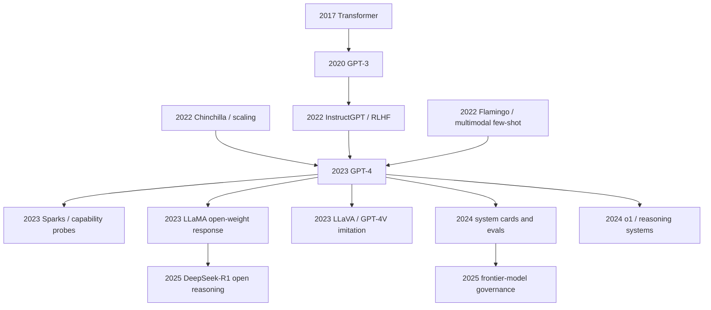

# GPT-4 Technical Report - 闭源时代的能力跃迁与黑箱技术报告

> **2023 年 3 月 14 日，OpenAI 在 ChatGPT 爆红 104 天后上传 [arXiv:2303.08774](https://arxiv.org/abs/2303.08774)，没有公开参数量、训练数据、架构、算力和代码，却给出一组让行业失语的结果：Uniform Bar Exam 从 GPT-3.5 的后 10% 跳到前 10%，MMLU 到 86.4%，HumanEval 到 67.0%，还能把图像和文本放进同一个推理循环。** GPT-4 Technical Report 的历史张力正在这里：它既是大模型能力跃迁最强的公开证据，也是 AI 研究从“可复现实验论文”转向“闭源系统卡片”的标志性文本。读它，不能只读 benchmark；更要读它如何把 scaling law、RLHF、安全红队、产品化评测和选择性披露缝成了 2023 年之后所有 frontier model report 的模板。

## 一句话总结

OpenAI 2023 年发布的 GPT-4 Technical Report 不是一篇传统“提出某个模块”的论文，而是一份 frontier model 的系统证据包：它把 [GPT-3](../era4_foundation_models/2020_gpt3.md) 的自回归语言建模、[InstructGPT](../era4_foundation_models/2022_instructgpt.md) 的人类反馈对齐和多模态输入接口合在同一个闭源系统里，用可预测 scaling 关系 $L(C)=L_\infty+aC^{-\alpha}$ 管住训练风险，再用 RLHF 风格目标 $\max_\pi \mathbb{E}[r_\phi(x,y)-\beta\mathrm{KL}(\pi\|\pi_0)]$ 把能力约束到可交互产品上。它替代的失败 baseline 不是某个单一模型，而是 GPT-3.5 级系统在考试、代码、数学和安全上的天花板：Uniform Bar Exam 从后 10% 到前 10%，MMLU 从约 70% 到 86.4%，HumanEval 从 48.1% 到 67.0%，内部安全评测中不合规回答率比 GPT-3.5 降低 82%。反直觉之处在于，GPT-4 最有影响力的“方法”恰恰没有被公开；它用一份黑箱报告规定了此后 Gemini、Claude、Llama 2/3、DeepSeek、Qwen 等模型报告的写法，也逼出 LLaMA 和 LLaVA 这类开源追赶路线。

---

## 历史背景

### 2023 年 3 月之前的缺口

GPT-4 Technical Report 出现前，语言模型领域已经有两个事实同时成立。第一，GPT-3 证明了 decoder-only Transformer 可以通过规模获得 in-context learning；第二，ChatGPT 证明了同一类模型一旦经过指令微调和人类反馈对齐，就能变成普通用户每天愿意打开的产品。但这两个事实之间仍有一个缺口：GPT-3 是论文里的 few-shot learner，ChatGPT 是产品里的对话系统，社区并不知道“下一代 frontier model”到底靠什么跨过考试、代码、多语言、视觉输入和安全约束这些更硬的门槛。

OpenAI 在 2020 年 GPT-3 论文里还提供了参数量、模型尺寸、数据量、batch、学习率、训练 token 等大量细节；到 2022 年 InstructGPT，论文已经把重点从预训练配方转向 RLHF 流程、偏好数据和线上安全；到 2023 年 GPT-4，公开文本进一步变成了“能力与风险报告”。这种变化不是偶然的写作风格，而是 frontier AI 研究社会结构的变化：训练一次模型需要公司级算力和私有数据，模型本身直接接入付费产品，风险评估和政策沟通变成论文的一部分，传统“给出 recipe、别人复现”的科研契约被大幅削弱。

所以 GPT-4 Technical Report 的历史位置很特殊。它不是第一篇大语言模型论文，不是第一篇 RLHF 论文，也不是第一篇多模态模型论文；它的价值在于把这些线索汇合成一个公开可见的能力跃迁。报告给出了足够多的测量结果，让外界确信 GPT-4 与 GPT-3.5 不是“调参小升级”；同时又留下足够多的空白，让外界无法按论文复刻它。这个矛盾后来成为 2023 年之后 AI 研究的默认背景：最重要的模型往往最难复现，最完整的公开材料往往是 benchmark 表、系统卡、安全声明和 API 行为。

### 从 GPT-3 到 ChatGPT 的三段阶梯

第一段阶梯是 GPT-3。Brown 等作者 2020 年证明，只要把 decoder-only Transformer 扩到 175B 参数并喂入数千亿 token，模型就能在少量示例下完成翻译、问答、完形、算术、常识推理等任务。GPT-3 的核心 lesson 是“单一 next-token objective 足以吸收大量任务格式”；它的弱点也很清楚：幻觉、拒答能力弱、对用户意图不稳、数学和代码不可靠、考试表现离专业门槛很远。

第二段阶梯是 InstructGPT。Ouyang 等作者 2022 年把监督指令微调、奖励模型和 PPO 串起来，让模型学会“按人类偏好回答”。这一步没有显著改变底层预训练目标，却改变了模型在交互界面的性格：同样的语言能力，被重新包装成会遵循指令、能拒绝一部分危险请求、愿意给出结构化答案的助手。ChatGPT 正是这条路线的产品化放大，2022 年 11 月上线后用 2 个月达到 1 亿月活，迫使整个行业承认 LLM 不再只是研究 demo。

第三段阶梯就是 GPT-4。报告没有说它到底有多少参数，也没有说图像如何被接入语言模型，但结果显示：它不只是更会聊天，而是在考试、编程、数学、长文本、多语言和视觉理解上同时前进。Uniform Bar Exam、LSAT、GRE、AP、MMLU、HumanEval、GSM8K 这些指标覆盖了多个认知侧面；安全评测又显示对齐流程已经成为模型能力的一部分，而不是上线前的补丁。GPT-4 把“语言模型”推进成“通用任务接口”：用户输入文本或图像，系统返回可执行、可解释、可拒绝、可审计的文本行为。

### GPT-4 报告为什么像系统卡片

读 GPT-4 Technical Report 时，一个最强烈的感受是：它不像 GPT-3 那样教你怎么训练模型，更像告诉监管者、客户、研究者和竞争对手“这个系统现在能做什么、不能做什么、风险如何被处理”。报告的章节重心放在可预测 scaling、公开 benchmark、专业考试、多语言、视觉输入、安全缓解、局限和社会影响上。预训练数据、模型规模、优化器细节、架构改动、训练总算力都被省略。

这让它成为一个新文体的开端：frontier model report。后来的 Gemini Technical Report、Claude system card、Llama 2 paper、GPT-4o system card、OpenAI o1 system card 都沿着类似结构写作：先给能力表，再给安全表，再承认若干已知风险，最后保留核心 recipe。这个文体的好处是能让社会尽快看到模型能力和风险；坏处是把“科学可复现性”换成了“平台可信度”。GPT-4 不是这个变化的唯一原因，但它是最清晰的分水岭。

## 研究背景与动机

GPT-4 Technical Report 的真正动机有三层。第一层是向外界证明：ChatGPT 的爆发不是 GPT-3.5 的偶然产品包装，而是 OpenAI 已经掌握了可预测训练更强模型的工程系统。报告中特别强调，团队能用小模型外推最终 loss，甚至能在训练前预测 HumanEval 这类能力指标的大致趋势。这是给内部工程和外部投资人的信号：frontier training 不是押注，而是可管理的工业过程。

第二层是重置 benchmark 标尺。2022 年底，许多 NLP benchmark 已经被 GPT-3.5、PaLM、Flan-PaLM、Chinchilla 推到很高，但考试、数学、代码和多语言仍能区分模型。GPT-4 把这些指标集中展示，一方面宣告旧 baseline 不够强，另一方面迫使研究社区寻找更难的评测：从静态选择题走向长程任务、代理式评测、真实工具调用、人类专家红队和安全 case study。换句话说，GPT-4 不只在 benchmark 上赢，它还让 benchmark 失去了原来的分辨率。

第三层是建立“能力发布 + 风险缓解”的叙事。GPT-4 上线时，社会已经开始讨论模型是否会帮助网络攻击、化学/生物风险、欺骗、隐私泄露和教育作弊。报告把红队、安全拒答、事实性改进、模型辅助评估写进技术文本，等于承认安全不再是部署文档的附录，而是 frontier model 论文的一部分。这一点后来深刻影响了所有大模型发布：没有 safety eval 的能力报告会被认为不完整。

### 被刻意留白的方法部分

GPT-4 最反常的地方，是“Technical Report”四个字和方法披露程度之间的落差。传统技术报告会回答“模型是什么、数据是什么、怎么训练、失败在哪里”；GPT-4 只回答“它表现如何、我们如何知道它更强、我们做了哪些风险缓解”。这不是疏忽。报告明确写道，出于竞争和安全原因，不披露架构、硬件、训练计算、数据集构成和训练方法细节。

这个留白改变了读者的阅读方式。我们无法像读 ResNet 或 Transformer 那样复现模块，只能从结果反推系统设计：它一定继承了 GPT 系列的自回归预训练；一定用了指令微调和 RLHF；一定有规模可预测的训练基础设施；很可能有视觉编码器或视觉 token 接入；一定有红队、过滤、规则和后训练安全层。这些推断不是论文原文给出的完整 recipe，而是从报告的证据结构中读出来的“影子方法”。因此，写 GPT-4 的深度笔记，也不能假装它是一篇透明架构论文；更应该把它当成一个时代转折：能力跃迁是真的，方法黑箱也是真的。

---

## 方法详解

GPT-4 Technical Report 的方法详解必须先承认一个事实：论文没有公开足以复现模型的训练 recipe。它没有模型层数、参数量、数据混合、token 数、优化器、硬件规模、视觉模块接口、RLHF 数据规模，也没有代码。因此，这里的“方法”不是复刻 OpenAI 内部配方，而是把报告中明确披露的技术结构、可由结果约束出的系统设计、以及后续领域共识拆开。GPT-4 的方法论贡献，不是某个可复制模块，而是把四件事连成一个 frontier model 生产流程：可预测预训练、多模态输入、偏好对齐与安全后训练、以评测为中心的发布决策。

### 整体框架：能公开说出的最小系统

报告对模型本体的描述非常克制：GPT-4 是一个大规模多模态模型，接受图像和文本输入，输出文本；它在公开 benchmark 和真实考试上显著强于 GPT-3.5；训练过程具有可预测 scaling；发布前经过多轮安全评估和缓解。把这些信息压缩成最小系统图，可以得到如下抽象：

| 层级 | 公开证据 | 可合理推断 | 未披露内容 |
|---|---|---|---|
| 预训练 | 训练过程可预测，loss 能从小模型外推 | 大规模自回归 Transformer 仍是核心 | 参数量、token 数、数据配比 |
| 多模态 | 图像 + 文本输入，文本输出 | 视觉表征被映射到语言模型可消费的 token/embedding | 视觉编码器、对齐数据、融合方式 |
| 后训练 | GPT-4 比 GPT-3.5 更会拒绝危险请求 | SFT、RLHF、规则约束和红队反馈共同作用 | 偏好数据规模、奖励模型结构 |
| 评测 | 考试、MMLU、HumanEval、GSM8K、安全集 | 发布由能力评估和风险评估共同门控 | 内部 eval 全集、阈值、失败样本 |
| 部署 | ChatGPT Plus / API 逐步开放 | 系统提示、工具层、监控和速率限制在模型外部 | 产品端完整安全栈 |

如果把 GPT-4 写成一个透明架构，会误导读者；更准确的写法是“模型 + 后训练 + 评测 + 部署约束”的系统。报告中的每个结果都不是单纯预训练模型的裸能力，而是经过 prompt、对齐、拒答策略、评测协议共同塑形后的系统行为。

### 关键设计 1：可预测 scaling 不是装饰，而是训练保险

GPT-4 报告中最像传统机器学习方法的一节，是对 scaling 预测的强调。OpenAI 写道，他们能从用 1/1,000 到 1/10,000 计算量训练的小模型，预测 GPT-4 最终 loss 的某些性质。这不是为了炫耀曲线拟合，而是 frontier training 的风险控制：当一次完整训练花费数千万美元级别资源时，不能等训练结束才发现数据、优化器或架构选择错了。

核心形式可以写成带不可约项的幂律：

$$
L(C) = L_\infty + a C^{-\alpha},
$$

其中 $C$ 是训练计算量，$L_\infty$ 是数据分布和目标函数留下的不可约损失，$a$ 与 $\alpha$ 由小模型实验拟合。这个公式的意义不在于每个 benchmark 都能被 loss 精确解释，而在于它把“更大模型是否还会继续变好”变成了训练前可以检验的工程假设。

报告还展示了 HumanEval 的可预测性：从远小于 GPT-4 的模型外推 coding benchmark 表现。由于 pass@1 是概率型指标，实际预测通常会在 logit 或类似变换空间中拟合，而不是直接对百分比做线性外推：

$$
\mathrm{logit}(p_\text{pass}) = b_0 + b_1 \log C + b_2 L(C).
$$

| 预测对象 | 为什么重要 | GPT-4 报告中的含义 | 局限 |
|---|---|---|---|
| 预训练 loss | 最稳定、最早可观测 | 训练基础设施足够可控 | 不直接等价于用户体验 |
| HumanEval | 代码能力的早期代理 | 部分能力可由小模型外推 | benchmark 容易被污染或饱和 |
| 考试分位 | 面向社会沟通 | 说明能力跃迁对非技术读者可见 | 考试不是完整智能测量 |
| 安全拒答 | 上线风险控制 | 后训练改变行为分布 | 过度拒答和 jailbreak 难平衡 |

这个 scaling 设计有一个容易被忽略的 lesson：GPT-4 的“创新”不只是训练了更大模型，而是把大模型训练做成了可预测工业流程。后来的 frontier lab 都在强调 eval-driven development、训练前预测和模型卡，就是因为 GPT-4 把这套说法公开立住了。

### 关键设计 2：多模态输入被纳入同一文本行为接口

GPT-4 是多模态模型，但报告公开的输出仍是文本。它接受图像和文本，生成文字回答。这与 Flamingo、BLIP-2、LLaVA 等视觉语言模型共享一个核心思路：先把视觉信息转成语言模型可以条件化的连续表征，再让语言模型在统一的 token 序列上做生成。抽象目标可以写成：

$$
\mathcal{L}(\theta) = -\sum_{t=1}^{T} \log p_\theta(y_t \mid y_{<t}, x_\text{text}, f_\psi(x_\text{image})),
$$

其中 $f_\psi$ 是视觉编码或视觉适配器，$x_\text{text}$ 是文本上下文，$y_t$ 是输出 token。报告没有说明 $f_\psi$ 的实现，也没有说明视觉数据和文本数据如何混训；但从表现看，GPT-4 的视觉能力不只是图像分类，而是能把图像作为推理上下文：读图表、解释梗图、识别手写草图、结合视觉线索回答多步问题。

| 多模态路线 | 输入如何进语言模型 | 优点 | 风险 |
|---|---|---|---|
| 图像 caption 后再问答 | 先转文本描述 | 简单、易控 | 视觉细节早期丢失 |
| 视觉 token 前缀 | 图像编码成连续 token | 可端到端对齐 | 需要大量图文数据 |
| cross-attention 读视觉特征 | LM 层内访问视觉 memory | 表达力强 | 系统更复杂 |
| 工具式 OCR/检测 | 外部工具产结构化结果 | 可解释、可替换 | 依赖工具质量 |

GPT-4 报告的重要性不在于公开了哪条路线，而在于证明“图像输入 + 通用语言推理 + 对话接口”已经足够成熟，可以作为同一个产品系统呈现。后续 GPT-4V、Gemini、Claude 3、LLaVA、Qwen-VL 都在这个问题上展开：不是训练一个只会看图的模型，而是让视觉成为通用助手的上下文。

### 关键设计 3：RLHF 和安全后训练把能力变成产品行为

GPT-4 的 raw capability 很强，但报告反复强调安全缓解、拒答、事实性和红队。这说明后训练不是可选装饰，而是系统定义的一部分。沿着 InstructGPT 的公开路线，最小的对齐目标可以写成带 KL 约束的偏好优化：

$$
\max_\pi \; \mathbb{E}_{x,y\sim\pi}[r_\phi(x,y)] - \beta\,\mathrm{KL}(\pi(\cdot\mid x)\,\|\,\pi_0(\cdot\mid x)),
$$

其中 $\pi_0$ 是参考模型，$r_\phi$ 是奖励模型或偏好打分器，$\beta$ 控制“别为了讨好奖励模型偏离太远”。GPT-4 的实际系统很可能比这个公式复杂得多：监督指令数据、偏好比较、拒答样例、红队攻击、政策文本、工具调用限制、上线监控都会参与塑形。

| 后训练组件 | 作用 | 在 GPT-4 报告中的证据 | 典型副作用 |
|---|---|---|---|
| SFT | 学会遵循指令格式 | 对话和考试题回答更稳定 | 可能模仿训练答案风格 |
| 奖励模型 / 偏好优化 | 提升人类偏好评分 | 比 GPT-3.5 更有用、更安全 | reward hacking、迎合用户 |
| 安全拒答数据 | 降低危险请求响应 | 不合规回答率下降 82% | 过度拒绝良性请求 |
| 红队反馈 | 暴露罕见高风险模式 | 报告列出多类风险场景 | 无法覆盖开放世界 |

GPT-4 的对齐方法还有一个隐含设计：它不只优化“回答得好”，还优化“什么时候不回答”。这把语言模型从文本补全器改造成了受政策约束的交互系统。对用户而言，这表现为 refusal、caveat、分步骤解释和安全替代建议；对研究者而言，这意味着评测模型能力时必须区分 base capability、post-trained behavior 和 product policy。

### 关键设计 4：评测驱动的系统工程

GPT-4 报告把评测本身提升到方法层。模型是否值得发布，不再只看 validation loss，而要看一组覆盖能力、鲁棒性、安全、偏见和真实用途的指标。下面的伪代码不是 OpenAI 的内部脚本，而是 GPT-4 报告所体现的 eval-driven workflow：

```python
def frontier_release_gate(model, eval_suites, policy):
    report = {}
    for suite in eval_suites:
        prompts = suite.load_prompts()
        outputs = model.generate(prompts, system_policy=policy)
        scores = suite.score(outputs)
        report[suite.name] = scores

    capability_ok = all(report[k].meets_target for k in policy.capability_suites)
    safety_ok = all(report[k].risk <= policy.max_risk[k] for k in policy.safety_suites)
    regression_ok = not any(report[k].regressed for k in policy.must_not_regress)

    if capability_ok and safety_ok and regression_ok:
        return "release", report
    return "mitigate_or_retrain", report
```

| 评测类型 | 代表指标 | 检查的问题 | 对方法的反向压力 |
|---|---|---|---|
| 学术 benchmark | MMLU、HellaSwag、GSM8K、MATH | 通用知识与推理是否提升 | 需要更强预训练和数据质量 |
| 专业考试 | Bar、LSAT、GRE、AP | 能否迁移到人类制度化任务 | 需要更稳的长题理解 |
| 代码评测 | HumanEval | 是否会生成可执行程序 | 需要代码数据和推理能力 |
| 多语言 | translated MMLU | 英文外能力是否保留 | 需要跨语言数据和 tokenizer 设计 |
| 安全评测 | disallowed requests、hallucination probes | 能否拒绝危险请求并减少错误 | 需要后训练、红队和政策约束 |

这种评测驱动的系统工程后来变成大模型开发常识。模型不是训练结束后才被评测，而是在训练前、训练中、后训练和发布前都被 eval 牵引。GPT-4 报告的贡献，是让外界第一次看到 frontier model 发布时“能力表 + 安全表 + 局限表”如何共同构成技术论证。

### 读法：把留白也当成方法

GPT-4 的方法部分不完整，恰恰是它最需要被认真解读的地方。留白本身传递了三条信息。第一，frontier capability 的关键不再是某个单点模块，而是数据、算力、训练稳定性、对齐、评测和部署的整体系统；公开其中任何一个局部都不足以复现。第二，安全和竞争被用来重新定义学术披露边界；这会保护模型开发者，也会削弱外部审计。第三，读者被迫从“学习 recipe”转向“审查证据”：结果是否可信、评测是否充分、风险是否被低估、没有公开的信息是否会改变结论。

因此，GPT-4 Technical Report 的方法 lesson 可以浓缩成一句：当模型进入公司级基础设施和社会级影响范围后，方法不再只是算法图，而是从 scaling 预测到安全门控的整条生产线。这个 lesson 后来同时催生了两个方向：闭源 frontier lab 更系统地写 model card / system card，开源社区则用 LLaMA、LLaVA、Mistral、Qwen、DeepSeek 去重建可复现的替代路线。

---

## 失败案例

GPT-4 Technical Report 不是一篇有 ablation table 的透明算法论文，所以“失败案例”不能写成某个模块被替换后的精确对照。更合适的读法是：GPT-4 让 2022 年底之前几类看似足够强的 baseline 失效。它证明，聊天产品包装、单纯文本扩模、窄 benchmark 刷分、以及传统开放 recipe 预期，都无法完整解释 frontier model 的能力和影响。

### Baseline 1：GPT-3.5 级聊天模型的天花板

ChatGPT 让公众第一次感受到 LLM 的可用性，但 GPT-3.5 仍然有明显天花板。它可以写邮件、解释代码、改写文案，却在专业考试、复杂数学、长链路代码生成和高压安全 prompt 上不稳定。GPT-4 报告用最有传播力的方式打破这个 baseline：同样是对话式模型，GPT-4 在 Uniform Bar Exam 上从 GPT-3.5 的后 10% 跳到前 10%，这不是“语气更自然”，而是制度化考试能力的跨档。

这个 baseline 的失败说明，RLHF 只把模型包装成助手还不够；底层预训练能力、推理稳定性、代码数据、多轮评测和后训练安全都必须一起提升。GPT-3.5 的成功容易让人误判“产品层优化已经足够”；GPT-4 证明产品层只是入口，能力层仍然决定上限。

### Baseline 2：只靠文本扩模、不处理对齐与安全

GPT-3、PaLM、Chinchilla 这些模型证明了 scaling 的力量，但它们大多作为 base model 或有限对话系统被讨论。GPT-4 报告则把模型放在真实产品语境里：用户会问危险问题，会诱导模型编造，会要求法律、医学、金融建议，会上传图像，会追问前文漏洞。只靠“更低 loss”无法保证系统在这些情境下可部署。

这个 baseline 的失败不是说 scaling 不重要；恰好相反，GPT-4 强烈依赖 scaling。失败的是把 scaling 当成唯一方法。GPT-4 把 scaling、RLHF、红队、安全策略和发布门控绑在一起，说明 frontier model 的工程目标从“训练一个更会预测 token 的模型”变成“部署一个更强但更受控的交互系统”。

### Baseline 3：窄 benchmark 专家和 leaderboard 思维

在 GPT-4 之前，很多模型可以在单个 benchmark 上报出漂亮数字：某个阅读理解集、某个数学集、某个代码集、某个多语言分类集。GPT-4 的威胁在于横向覆盖。它同时提升 MMLU、HumanEval、GSM8K、MATH、专业考试、多语言 MMLU 和图像输入样例，而且这些能力统一在同一个对话接口里。窄专家 baseline 可以解释单点胜利，解释不了这种跨域迁移。

GPT-4 之后，leaderboard 思维开始暴露短板。一个模型是否真正强，不再只看它在某个公开测试集上的分数，而要看能否在陌生任务、复杂指令、长上下文、多模态线索、工具接口和安全约束中保持一致行为。这也是为什么 2023 年之后 agent benchmark、真实任务评测、红队评测和 arena 对战迅速兴起。

### Baseline 4：传统透明论文的复现预期

另一个“失败 baseline”更尴尬：学术社区默认顶级技术报告应该披露足够 recipe，让外部研究者复现或至少缩小差距。GPT-4 明确打破这个期待。它用结果建立权威，却不提供核心训练细节。对能力展示来说，这份报告非常成功；对开放科学来说，它是一个压力测试。

这个 baseline 的失败引出两条后续路线。闭源实验室继续发布更像系统卡片的报告，把安全、产品和政策纳入技术文本；开源社区则反向追求可复现替代品，用 LLaMA、Mistral、Qwen、DeepSeek、LLaVA 等项目重建公开配方。GPT-4 没有杀死开放研究，但它迫使开放研究承认：最前沿系统的 recipe 可能不再由最前沿论文公开。

| 失败 baseline | GPT-4 如何击穿 | 关键证据 | 后续影响 |
|---|---|---|---|
| GPT-3.5 聊天能力 | 从可用助手提升到专业考试前列 | Bar exam 后 10% 到前 10% | Chatbot 不再等于低风险玩具 |
| 只靠文本 scaling | 能力与安全必须共同评估 | 82% 更少不合规回答 | safety eval 进入模型报告正文 |
| 窄 benchmark 专家 | 多域能力统一提升 | MMLU、HumanEval、GSM8K 同时上升 | 促成更难、更真实的评测 |
| 透明 recipe 预期 | 结果公开、方法保留 | 无参数量、数据、算力、代码 | 开源社区转向替代复现路线 |

## 实验关键数据

GPT-4 报告的实验数据可以分成四类：专业考试、公开学术 benchmark、跨语言与多模态、安全和事实性。它们共同完成一件事：把“模型更聪明”从主观体验变成跨场景证据。需要注意的是，很多数字来自 OpenAI 设定的评测协议；不同 prompt、工具、采样和后训练版本会改变分数，所以这里更应该读趋势和量级，而不是把每个小数点当成可复现常数。

### 专业考试：最容易被社会理解的能力跃迁

| 评测 | GPT-4 结果 | GPT-3.5 对照 | 读法 |
|---|---:|---:|---|
| Uniform Bar Exam | 前 10% | 后 10% | 法律资格考试的跨档跃迁 |
| LSAT | 约第 88 百分位 | 约第 40 百分位 | 长题阅读与逻辑推理提升 |
| GRE Verbal | 约第 99 百分位 | 约第 63 百分位 | 语言与词汇推理极强 |
| GRE Quantitative | 约第 80 百分位 | 约第 25 百分位 | 数学仍强但不是完美 |
| GRE Writing | 约第 54 百分位 | 约第 54 百分位 | 写作评分未同幅提升 |
| Biology Olympiad | 约第 99 百分位 | 约第 31 百分位 | 专业知识与推理叠加 |

考试数据之所以重要，不是因为考试等于智能，而是因为它们把模型能力映射到社会熟悉的制度标尺。GPT-4 在 Bar、LSAT、GRE、AP 和奥赛题上的表现，让非技术人群也能理解“这不是更会闲聊，而是能跨过专业门槛”。这也是 GPT-4 对监管、教育和知识工作冲击巨大的原因。

### 学术与代码 benchmark：旧标尺被推到高位

| Benchmark | GPT-4 | GPT-3.5 / 近邻基线 | 主要测量面 |
|---|---:|---:|---|
| MMLU | 86.4% | GPT-3.5 约 70.0% | 多学科知识与推理 |
| HellaSwag | 95.3% | GPT-3.5 约 85.5% | 常识补全 |
| AI2 ARC Challenge | 96.3% | GPT-3.5 约 85.2% | 小学/中学科学推理 |
| WinoGrande | 87.5% | GPT-3.5 约 81.6% | 指代消歧 |
| GSM8K | 92.0% | GPT-3.5 约 57.1% | 小学数学文字题 |
| MATH | 42.5% | GPT-3.5 约 34.1% | 竞赛数学，仍未饱和 |
| HumanEval | 67.0% | GPT-3.5 约 48.1% | Python 代码生成 |

这组数字有两个细节值得看。第一，MMLU 86.4% 意味着 GPT-4 已经接近或超过许多人类专家在部分子领域的表现，但不是所有任务都被解决；MATH 42.5% 说明高难数学仍有巨大空间。第二，HumanEval 67.0% 让代码能力从“能帮忙写片段”变成“能经常生成可运行函数”，直接催生了 2023 年之后 coding assistant 的商业爆发。

### 多语言与视觉评测：从英语模型走向通用接口

GPT-4 报告用翻译版 MMLU 测试 26 种语言，并指出 GPT-4 在 24 种语言上超过 GPT-3.5 的英文表现。这一点很关键：GPT-3 时代，强能力通常首先出现在英语；GPT-4 显示，frontier model 的高层推理能力可以通过跨语言表示迁移到低资源语言上，尽管不同语言之间仍有差距。

视觉部分更像 capability demo，而不是完整公开 benchmark。报告展示了图像理解、图表推理、视觉幽默解释、手写草图转网页等样例，强调 GPT-4 可以把图像当作推理上下文。这些例子后来被 GPT-4V 和 Gemini 的发布进一步系统化。它们的意义不在于每个样例本身，而在于模型接口从“文本框”变成“世界状态的一部分”：图像、文档、网页、截图都可以进入同一个推理循环。

| 能力面 | 报告证据 | 为什么重要 | 未解决问题 |
|---|---|---|---|
| 多语言 MMLU | 26 种语言翻译评测 | 英语外能力显著增强 | 低资源语言仍不均衡 |
| 图像理解 | 图表、梗图、草图样例 | 视觉可作为推理上下文 | 缺少完整公开视觉分数 |
| 文档式输入 | 长题和复杂说明 | 接近真实知识工作流 | 上下文窗口仍有限 |
| 代码生成 | HumanEval 67.0% | 编程助手可商业化 | 大项目级可靠性不足 |

### 安全与事实性：能力越强，拒绝也越重要

报告写明，相比 GPT-3.5，GPT-4 在内部 adversarial factuality 评测中更可能给出事实性回答，在禁止内容请求上更少直接配合。最常被引用的两个数字是：不合规请求响应率降低 82%，事实性表现提升 40%。这些数字不能说明 GPT-4 已经安全；报告自己也列出幻觉、越狱、隐私、偏见、过度依赖和潜在高风险能力等问题。但它们说明安全评测已经成为能力报告的核心证据。

| 安全面 | 报告数字 / 描述 | 正向含义 | 剩余风险 |
|---|---|---|---|
| 禁止内容 | 不合规回答率比 GPT-3.5 低 82% | 拒答策略有效 | jailbreak 仍可绕过 |
| 事实性 | 内部评测事实性高 40% | 幻觉减少 | 高置信错误仍存在 |
| 红队 | 发布前多轮专家测试 | 暴露高风险模式 | 覆盖不了开放世界 |
| 局限声明 | 承认 hallucination 和推理错误 | 避免过度宣传 | 用户仍可能过度信任 |

这部分数据的深层影响，是把“模型是否强”和“模型是否可发布”拆成两个问题。GPT-4 强到足以让许多 benchmark 失去区分度，但还不强到可以无约束部署。这个张力后来成为所有 frontier model 的核心叙事：能力是卖点，安全是准入条件，评测是二者之间的桥。

---

## 思想史脉络

GPT-4 的思想史脉络有两条线交叉在一起。第一条是技术线：Transformer 让长程自注意力成为可扩展骨架，GPT-3 证明自回归预训练能获得 few-shot 行为，InstructGPT 把偏好对齐接到用户界面，Chinchilla 和 scaling law 让训练规模变成可预测工程。第二条是制度线：模型能力越来越接近社会基础设施，论文越来越像系统卡片，开放复现越来越依赖开源社区的二次建设。GPT-4 位于这两条线的交点。

### 前世：从 Transformer 到对齐助手

GPT-4 不是突然出现的。它继承了 2017 Transformer 的核心架构范式：用 self-attention 让每个 token 在同一层内读到上下文；继承了 GPT-3 的自回归预训练范式：在海量文本上预测下一个 token，让任务格式自然浮现；继承了 InstructGPT 的对齐范式：用人类偏好把“会补全文本”的模型塑造成“会回答用户”的助手；也继承了 Chinchilla 之后的工程共识：参数、数据和计算之间必须按可预测规律配置。

这条前史的关键，不是每篇论文都给 GPT-4 贡献一个模块，而是它们共同把“通用模型”从抽象愿景变成工程对象。Transformer 给骨架，GPT-3 给规模信念，InstructGPT 给交互界面，scaling law 给训练管理，Flamingo 等多模态工作给图像输入的参考路线。GPT-4 把这些线索打包成一个闭源系统。

### 今生：黑箱报告成为发布模板

GPT-4 的直接后果，是 frontier model 发布方式发生变化。报告用能力表、安全表、局限声明和少量 scaling 证据建立可信度，却不公开核心 recipe。这种格式后来几乎成为行业标准。Gemini、Claude、GPT-4o、o1、Llama 2/3、DeepSeek、Qwen 的公开材料虽然开放程度不同，但都必须回答同一组问题：能力在哪里，风险在哪里，评测怎么做，系统边界是什么。

这让 GPT-4 的思想影响超出模型本身。它规定了“如何谈论一个 frontier model”。对闭源公司来说，GPT-4 提供了一个兼顾商业秘密、安全叙事和市场沟通的模板。对开源社区来说，它也提供了一个反面坐标：如果闭源报告不公开方法，那么开源模型就必须用可下载权重、训练日志、数据说明和复现实验来争夺可信度。



### 误读：GPT-4 不是单个魔法模块

关于 GPT-4 最常见的误读，是把它想象成某个神秘架构突破：也许是 MoE，也许是更长上下文，也许是某种全新的推理模块。由于 OpenAI 没有披露架构，这些猜测无法被完全排除；但从报告本身看，GPT-4 更像系统工程胜利，而不是单点算法胜利。它的公开证据集中在 scaling、对齐、评测、安全和多模态接口，而不是一个可以画在图里的新 block。

另一种误读是把 GPT-4 当作“接近 AGI 的终点”。报告和早期实验确实展示了惊人的跨域能力，Microsoft 的 Sparks 报告也把 GPT-4 描述成通用智能的早期火花。但 GPT-4 仍然会幻觉，会犯简单推理错误，会被 jailbreak，会在长程任务中丢失目标，会受上下文和工具限制。更准确的定位是：GPT-4 把语言模型推到足以重塑社会想象力的能力区间，但没有结束可靠智能的问题。

### 影响：开源追赶与治理评测同时加速

GPT-4 发布后，开源社区的反应非常快。LLaMA 权重泄露和 Alpaca、Vicuna、LLaVA、QLoRA 等项目接连出现，很多工作明确以“复现 GPT-4 风格能力”为叙事目标。它们未必达到 GPT-4 的整体能力，但把可复现实验重新拉回社区：更小模型、更公开数据、更低成本微调、更透明 eval。

治理和评测方向也被加速。GPT-4 报告把安全、事实性、红队和社会影响写进技术文本，后来模型发布必须面对同样问题：会不会帮人攻击系统，会不会制造生物化学风险，会不会欺骗用户，会不会泄露隐私，会不会在关键决策中被过度依赖。GPT-4 的思想史意义因此有两面：它扩大了“模型能做什么”的想象，也扩大了“模型发布者必须解释什么”的责任。

| 思想线索 | GPT-4 前的形态 | GPT-4 的转折 | 后续继承者 |
|---|---|---|---|
| 自回归预训练 | GPT-3 few-shot learner | 能力进入专业考试区间 | Gemini、Claude、Llama 3 |
| 人类反馈对齐 | InstructGPT / ChatGPT | 安全和可用性成为核心指标 | DPO、RLHF variants、RLAIF |
| 多模态接口 | Flamingo / BLIP-2 等探索 | 图像进入通用助手循环 | GPT-4V、Gemini、LLaVA |
| 模型报告文体 | 传统论文 + model card | 黑箱 technical report 成为模板 | system cards、frontier eval reports |
| 开源追赶 | OPT / BLOOM 能力不足 | GPT-4 变成追赶靶标 | LLaMA、Mistral、Qwen、DeepSeek |

---

## 当代视角

### 2026 年回看：它改变了什么

从 2026 年回看，GPT-4 Technical Report 的影响可以分成三层。第一层是能力预期。GPT-4 让行业相信，一个通用对话模型可以通过专业考试、写可运行代码、理解图像、跨语言回答，并在同一个产品界面里完成这些任务。它把“LLM 是搜索增强写作工具”的想象，推到“LLM 是知识工作操作系统入口”的想象。

第二层是发布规范。GPT-4 之后，frontier model 的公开材料很少再只是论文；它们往往是一套组合包：technical report、system card、safety evaluation、red-team summary、API policy、product demo。即使开源模型发布，也会模仿这种结构，给出 benchmark 表、风险说明、模型权重、训练配方和使用限制。GPT-4 没有发明 model card，但它让“系统级报告”成为一线模型的默认语言。

第三层是竞争格局。GPT-4 的闭源强能力刺激了两种相反运动：闭源公司加速堆高模型能力和产品护城河；开源社区加速把 GPT-4 风格能力拆解成可复现零件。LLaMA、LLaVA、QLoRA、Mistral、Qwen、DeepSeek、Claude、Gemini 都可以被读作 GPT-4 时刻之后的回答：要么追赶它的能力，要么替代它的开放性，要么重新定义它的评测。

### 今天仍站得住的判断

GPT-4 报告里有几条判断到 2026 年仍然站得住。第一，可预测 scaling 是 frontier training 的基础设施，而不是论文装饰。后来的 Gemini、Claude、Llama、DeepSeek 都以不同方式证明，大模型开发必须在训练前就用小规模实验、数据质量评估和中途 eval 管理风险。

第二，后训练决定产品性格。DPO、RLAIF、Constitutional AI、process reward model、reasoning RL 等方法各有路线，但它们都承认同一件事：base model 的能力必须被偏好、政策和任务目标重新塑形，才会变成可交互系统。GPT-4 报告把这件事从产品实践写进技术文本。

第三，评测必须覆盖安全。2023 年之前，很多模型报告把安全当作附录；GPT-4 之后，缺少安全评测的 frontier release 会显得不完整。今天的模型发布必须回答 hallucination、bias、privacy、jailbreak、cyber、biosecurity、overreliance、misuse 等问题，这个框架很大程度由 GPT-4 时代固定下来。

| 仍站得住的判断 | 2023 年证据 | 2026 年状态 | 解释 |
|---|---|---|---|
| scaling 可预测 | 小模型外推 loss | frontier labs 普遍使用预测与 eval | 降低昂贵训练风险 |
| post-training 是核心 | GPT-4 比 GPT-3.5 更安全有用 | RLHF/DPO/RLAIF 成为标准层 | 产品行为不是裸模型行为 |
| 多模态是默认方向 | 图像 + 文本输入 | GPT-4V、Gemini、Claude、Qwen-VL 普及 | 助手需要读世界状态 |
| safety eval 必不可少 | 82% 更少不合规回答 | system card 成为常规材料 | 能力发布需要风险论证 |
| 方法披露会收缩 | 竞争与安全理由保留 recipe | 闭源报告持续黑箱化 | 外部审计压力同步上升 |

### 今天站不住的假设

也有一些 2023 年的隐含假设后来变得站不稳。第一，“闭源强能力不可追赶”的假设被削弱。LLaMA 系列、Mistral、Qwen、DeepSeek 等开源或开放权重模型不断缩小差距，尤其在代码、数学、长上下文和推理蒸馏上把 GPT-4 风格能力拆成了社区可优化的组件。

第二，“benchmark 高分足以说明通用可靠性”的假设不成立。GPT-4 分数很高，但用户很快发现它仍会编造引用、在长链路任务中偏航、对环境状态理解不足。后来 agent eval、arena、真实软件工程任务和长程规划评测，就是为了补足静态 benchmark 的盲区。

第三，“RLHF 足以解决安全”的假设不成立。RLHF 能改善拒答和有用性，却不能根除 jailbreak、欺骗、偏见和高风险知识滥用。到 2026 年，安全研究已经转向更系统的 threat modeling、agent monitoring、constitutional training、interpretability、secure tool use 和治理流程，而不是只靠一个奖励模型。

## 局限与展望

### 技术局限

GPT-4 报告自己承认模型会 hallucinate、会犯推理错误、知识截止导致过时、不能从经验中持续学习、对提示方式敏感，并可能输出有偏或有害内容。今天看，这些局限仍然准确。更强模型减少了错误频率，却没有从根上解决“语言似然不等于事实约束”。当模型在法律、医学、金融、科研中被使用时，最危险的不是明显胡说，而是以高置信语气给出细微错误。

多模态能力也有局限。图像输入让模型能读图表、草图和截图，但不等于稳定视觉推理。模型可能漏掉小物体、误读空间关系、被视觉 prompt injection 影响，或者在 OCR 错误基础上继续推理。把视觉并入语言接口，是通用助手的关键一步；让模型可靠理解真实世界状态，则仍需要更强感知、工具验证和环境反馈。

### 开放科学局限

GPT-4 最大的学术局限，是不可复现。报告没有参数量、数据配方、训练算力、模型架构和完整评测细节，外部研究者只能验证 API 行为，不能审计训练过程。这使得 GPT-4 很难被传统意义上的科学共同体吸收：它可以被使用、被比较、被模仿、被批评，但不能被独立复刻。

这种局限在安全上也有代价。模型越强，外部审计越重要；但核心细节越少，审计越依赖开发者自述。GPT-4 报告开创的黑箱披露模式后来引发持续争论：安全理由确实存在，但安全也需要透明度。未来更合理的路线可能不是完全公开 recipe，也不是完全黑箱，而是分层披露、受控审计、第三方 eval、红队访问和事后可追溯记录。

### 如果今天重写

如果 2026 年重写 GPT-4 Technical Report，至少应该补四类内容。第一，给出更细的 eval provenance：每个 benchmark 的 prompt、采样、工具、过滤、污染检查和置信区间。第二，给出更多失败样本，而不仅是平均分，让用户看到模型在哪些题型、语言、图像和安全场景中会失效。第三，提供独立第三方评测结果，把开发者自评和外部审计分开。第四，对多模态和部署栈作分层说明，至少区分 base model、post-trained model、system prompt、tool layer 和 product policy。

展望上，GPT-4 之后的问题已经从“模型会不会回答”转向“模型能不能可靠完成长程任务”。未来 frontier report 需要覆盖 agentic behavior、tool-use safety、long-horizon memory、self-correction、secure sandboxing、provenance、model monitoring 和治理接口。GPT-4 把模型带进社会；后续工作要回答的是，社会如何把模型留在可验证、可追责、可纠错的边界内。

## 相关工作与启发

### 直接继承

GPT-4 直接继承了 GPT-3、InstructGPT、ChatGPT、Flamingo、Chinchilla 等工作的核心线索。GPT-3 给出了大规模自回归预训练的能力基础；InstructGPT 给出了偏好对齐的交互基础；ChatGPT 给出了产品形态；Flamingo 和相关视觉语言模型给出多模态条件化思路；Chinchilla 和 scaling law 工作给出训练规模管理的语言。

GPT-4 的后继工作则沿着三个方向展开。闭源路线包括 GPT-4V、GPT-4o、Gemini、Claude 和 o1，重点是多模态、长上下文、工具使用和推理时计算。开放路线包括 LLaMA、Llama 2/3、Mistral、Qwen、DeepSeek、Mixtral、LLaVA、Qwen-VL，重点是把闭源能力拆成可训练、可下载、可微调的模型。方法路线包括 DPO、RLAIF、Constitutional AI、process reward models、test-time compute、agent evaluation，重点是替代或增强 GPT-4 中不透明的后训练与评测环节。

### 给后来论文的启发

GPT-4 给后来研究的最大启发，是把“模型能力”从单点数字扩展成系统问题。写一篇后 GPT-4 时代的大模型论文，不能只说参数量和 benchmark；还要说明数据治理、评测污染、偏好优化、安全边界、部署接口、失败样本和成本。哪怕是完全开源的模型，也必须用更完整的报告结构来建立信任。

第二个启发是：闭源黑箱会制造开源机会。GPT-4 的方法不公开，反而让社区有动力复现它的可见行为。LLaVA 复现 GPT-4V 风格视觉对话，QLoRA 降低大模型微调成本，DPO 简化偏好优化，DeepSeek-R1 展示开放推理 RL 的可行性。这些工作都不是 GPT-4 的复制品，却都在回答同一个问题：当 frontier model 的 recipe 不公开时，哪些能力可以被拆解、重建和民主化？

## 相关资源

### 论文与官方材料

| 资源 | 链接 | 用途 |
|---|---|---|
| GPT-4 Technical Report | https://arxiv.org/abs/2303.08774 | 原始技术报告 |
| OpenAI GPT-4 announcement | https://openai.com/research/gpt-4 | 发布背景与产品说明 |
| GPT-4 system card appendix | arXiv 附录 | 安全评测与风险缓解 |
| Sparks of AGI | https://arxiv.org/abs/2303.12712 | 早期能力探测与争议性解读 |
| InstructGPT | https://arxiv.org/abs/2203.02155 | RLHF 前序工作 |
| GPT-3 | https://arxiv.org/abs/2005.14165 | 大规模 few-shot 前序工作 |

### 推荐阅读路径

如果想理解 GPT-4 的技术前史，先读 GPT-3 和 InstructGPT，再读 Chinchilla / scaling law 论文，最后读 GPT-4 Technical Report；这样能看出“预训练规模、对齐、可预测工程”三条线如何汇合。如果想理解 GPT-4 的社会影响，先读报告的 safety 和 limitations，再读 system card、Sparks of AGI、以及后来的 Gemini / Claude / Llama 2 model card；这样能看出 frontier model 文体如何变化。

如果想做研究，最有价值的不是猜 GPT-4 内部参数，而是沿着它暴露出的缺口往下做：更透明的 eval、更可靠的长程 agent、更好的多模态 grounding、更低成本的偏好优化、更强的第三方审计、更可控的工具使用。GPT-4 是一座高墙，但也把墙上哪些砖最重要标了出来。


---

> 🌐 [English version](/en/era5_genai_explosion/2023_gpt4/) · 📚 awesome-papers project · CC-BY-NC