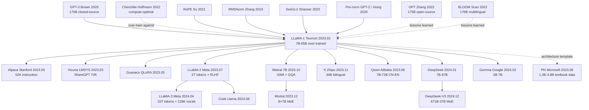

# LLaMA — 用更小参数与更多 token 让开源 LLM 第一次追平 GPT-3

> **2023 年 2 月 24 日，Meta AI 的 Touvron、Lavril、Lample、Joulin 等 14 位作者在 arXiv 上传 [2302.13971](https://arxiv.org/abs/2302.13971)；3 月 3 日 7B/13B/30B/65B 全套权重在 4chan 被泄露，1 周内下载量破 100 万次。**
> 这是一篇严格遵循 [Chinchilla (2022)](../era4_foundation_models/2022_chinchilla.md) 「token-rich, parameter-modest」启示的论文 —— Meta 用 **7B/13B/33B/65B 四档参数 + 1.0/1.4T 高质量公开 token**（CommonCrawl + GitHub + Wiki + ArXiv + StackExchange）训练，不用任何 OpenAI / Google 私有数据。
> 关键结论震撼工业界：**LLaMA-13B 在大多数 benchmark 上超过 [GPT-3 (175B)](../era4_foundation_models/2020_gpt3.md)**（13× 参数压缩），LLaMA-65B 则与 [Chinchilla-70B](../era4_foundation_models/2022_chinchilla.md) / PaLM-540B 打平 —— **第一次让开源社区在 LLM 上追平闭源大厂**。
> 它泄露后引爆了人类 AI 历史上最猛烈的开源浪潮：**Alpaca / Vicuna / WizardLM / Koala / GPT4All / Llama 2 / Llama 3 / Mistral / Qwen / DeepSeek 全部从 LLaMA 衍生**，4 个月内 GitHub 上「中文 ChatGPT」类项目破 1000 个 —— **没有 LLaMA 就没有 2023 年的开源 LLM 大爆发**，更没有 DeepSeek-R1 (2025) 撼动 NVDA 6000 亿市值的那一天。

## 一句话总结

LLaMA 用一套近乎"装配工"的工程哲学——只用公开数据（CommonCrawl + C4 + Wikipedia + Books + ArXiv + StackExchange + GitHub），把社区已经验证过的三件零件（**RMSNorm 预归一化**、**SwiGLU 激活**、**旋转位置编码 RoPE**）装回标准 Transformer，再**主动违背 [Chinchilla 2022](https://arxiv.org/abs/2203.15556) 的训练-最优定律**，把 7B 模型在 1T+ token 上"过训"到性价比拐点之外，于是用 13B 参数在大多数 benchmark 上击败了 13× 体量的 GPT-3 175B。但 LLaMA 真正改写历史的不是这些架构选择，而是它**把"前沿能力可以在公开数据 + 学术规模硬件上复现"**这件事第一次坐实——权重泄漏后两周内 Stanford Alpaca 出炉，三个月内 Vicuna / Koala / WizardLM / Guanaco 形成生态，到 2024 年几乎所有开源 LLM（Mistral / Qwen / DeepSeek / Yi / Gemma / Phi）都直接继承了 LLaMA 的架构配方与训练哲学。

## 历史背景

### 2022 年底 LLM 学界在卡什么

2022 年 11 月 30 日 ChatGPT 发布到 2023 年 2 月 LLaMA 上传 arXiv 这 90 天里，整个学术圈陷入一种**集体焦虑**：所有人都看到 GPT-3.5 / ChatGPT 的能力跃迁是真实的，但**没人能复现它**——即使是最大的学术实验室。卡点不是想法，是访问权与材料。OpenAI GPT-3 (175B) 自 2020 年起 API 价格 $0.02/1K token、weights 完全闭源；Google PaLM 540B (2022.04) 从未公开任何形式访问；DeepMind Gopher 280B / Chinchilla 70B 只活在论文里；Anthropic Claude 没有 API；Microsoft / Nvidia 的 MT-NLG 530B 只在公司内部跑过几次推理 demo。学术界手里能跑的最强 dense LLM 只有 Meta 自己 2022 年 5 月发布的 OPT-175B [arxiv/2205.01068]，但 OPT 严格按 Kaplan 2020 scaling law 训练（每参数仅 ~1.7 token），即使权重开源，benchmark 表现也只勉强追平 GPT-3——**复现了配方却没复现出能力**，进一步放大了"我们到底缺什么"的困惑。

更深的痛点在**评测层**：MMLU、BIG-bench、HumanEval、GSM8K、TruthfulQA 等 zero/few-shot 评测套件已经成熟，但能跑这些评测且数字能看的开源模型几乎没有——OPT-175B、BLOOM-176B (2022.07, BigScience) 在 MMLU 上分别只有 ~32 和 ~30，远低于 GPT-3 的 ~43.9，更不用说 Chinchilla 的 67.6。这制造了一个荒谬的现状：**学术界连一个能拿来做 baseline 的"开源 GPT-3 等价物"都没有**，alignment、prompt engineering、in-context learning 等所有 2022-2023 热门方向被迫围着闭源 API 打转，学术研究的可复现性几乎归零。Hugging Face 上能下载的最强 base model 是 ~13B 量级（GPT-J、GPT-NeoX、OPT-13B），但这些模型在 MMLU 上的成绩离 30 都不到，无法支撑哪怕是简单的 chain-of-thought 实验。LLaMA 出现的时机精准命中了这个空洞——**它要的不是发明，是补一个能开起来的轮子**。

与此同时，工业界在另一端也撞到墙：175B-540B 的"参数军备"在过去 18 个月烧掉了行业估计 10⁹ 美元级算力，但下游产品端发现**推理成本是新瓶颈**——GPT-3 175B 单次推理需要 8×A100，serving 一次问答的成本是 GPT-3.5 turbo 的 10 倍以上。这制造了一个分裂的目标函数：**研究端追求"训练 compute-optimal"（Chinchilla 路线），产品端却需要"推理 compute-optimal"**——后者明显倾向于"小模型 + 过训"。但 2022 年没有人系统化论证过这条路是不是可行，整个领域急需一个**反 Chinchilla 的实证范例**。LLaMA 就是这个范例。

### 直接逼出 LLaMA 的 6 篇前序

**2017 Transformer (Vaswani et al.)** [arxiv/1706.03762]：定义了 LLaMA 的整个骨架——multi-head self-attention + position-wise FFN + residual + LayerNorm。LLaMA 没改这个骨架的任何一个 block 顺序，只在 3 个零件上做了局部替换。

**2020 GPT-3 (Brown et al.)** [arxiv/2005.14165]：证明了 dense decoder-only Transformer + 大规模无监督预训练 = few-shot learner 这条路径的天花板很高。LLaMA 的目标函数（autoregressive next-token prediction）与 GPT-3 字面上完全相同；分歧只在**资源分配**上。

**2022 Chinchilla (Hoffmann et al.)** [arxiv/2203.15556]：标定了 compute-optimal 配方为每参数 ~20 token，间接证明 GPT-3 / Gopher / MT-NLG / PaLM 全部 under-trained。LLaMA 既继承了 Chinchilla "数据比参数更值钱"的洞察，又**故意越过 Chinchilla optimum**——LLaMA-7B 喂了 1T token（每参数 ~143 token），是 Chinchilla 推荐量的 7 倍，因为作者把目标从"训练最优"换成了"推理最优"。

**2022 OPT-175B (Zhang et al., Meta AI)** [arxiv/2205.01068]：Meta 自家上一代开源尝试，提供了 logbook、训练曲线、failure case 文档——LLaMA 团队从 OPT 的失败中学到的最重要一课就是"严格按 Kaplan 训练 + 不主动改架构 = 浪费算力"。

**2022 BLOOM-176B (BigScience)** [arxiv/2211.05100]：开放权重、多语言、46 种语言数据混合，但同样按 Kaplan 训练（每参数 ~2 token），benchmark 表现弱于 GPT-3。BLOOM 间接证明"开源 + 多语言"不能弥补"训练不足"，进一步把 LLaMA "公开数据 + 过训单语英文" 的策略合理化。

**架构零件三件套**：(a) **RMSNorm** [Zhang & Sennrich 2019, arxiv/1910.07467]——剥掉 LayerNorm 的中心化项，只保留 RMS 缩放，省掉一次均值统计；(b) **SwiGLU** [Shazeer 2020, arxiv/2002.05202]——把 FFN 的 ReLU 换成 Swish 激活的 gated 结构，质量优于 ReLU/GELU；(c) **RoPE** [Su et al. 2021, arxiv/2104.09864]——用复数旋转编码相对位置，外推性远好于 absolute / learned position embedding。这三件零件每件都已被独立工作验证（Google PaLM 用了 SwiGLU，GPT-NeoX 用了 RoPE），但**第一次被同一个开源 base model 完整集成**。LLaMA 的"创新"很大程度是工程意义上的——**精挑、组装、压测、开源**。

### 作者团队当时在做什么

LLaMA 一作 Hugo Touvron 来自 Meta AI Paris（FAIR Paris），ResNet 之后视觉端最有影响力的工作之一 DeiT (2021) 就是他主导的——他擅长"用更小的模型 + 更聪明的训练配方击败更大的模型"，这条思路从视觉直接迁移到了 LLM。共同一作 Thibaut Lavril、Gautier Izacard 等人长期在 FAIR Paris 做 retrieval-augmented LM（Atlas、RETRO 复现、Self-Rag 前身），对"小模型 + 大数据"有方法论偏好。Guillaume Lample（LLaMA 资深作者之一）是 Facebook AI / FAIR Paris 老兵，UnsupervisedMT、XLM、CamemBERT 等多语言 LM 工作的核心贡献者。整个团队**没有 GPT 系列那种"以更大为荣"的执念**，更倾向欧洲实验室常见的"工程极简主义"：用最少的新东西、最干净的实验、最可复现的配方拿到最强结果。

战略上 Meta 在 2022 年中已经决定"不能让 OpenAI 一家把开源生态卡死"——OPT 是第一次试探，但 OPT 的 license 限制商用且性能不强，社区反响平平。LLaMA 是第二次尝试，有 3 个明确目标：(1) 在 7B-65B scale 上提供性能能与 GPT-3 抗衡的 base model；(2) 严格只用公开数据，杜绝版权 / 隐私争议；(3) 以非商用研究 license 释放给学术界，先把生态建起来。论文 2023 年 2 月 24 日上传 arXiv，3 月 3 日 weights 在 4chan 泄漏，3 月 13 日 Stanford Alpaca 用 LLaMA-7B + 52K self-instruct 数据完成第一次开源 instruction tuning——**从论文到生态爆炸不到 3 周**，这是整个 AI 史上最快的一次开源 cascading。

### 工业界 / 算力 / 数据的状态

- **算力**：A100 80GB 是当时绝对主流，单卡 $15K-20K，云端 $1.5-3/h。LLaMA-65B 训练用了 2048 块 A100 80GB，跑 21 天，整个 LLaMA 系列（7B/13B/33B/65B）总训练算力约 ~5M GPU-hour，按 spot 价折算约 $5M——**这个预算是任何一所 R1 大学单个实验室都跑不起的，但任何一家大厂都跑得起**，正好卡在"学术不可、工业可"的临界点
- **数据**：CommonCrawl (CC) + C4 + Wikipedia + Books (Project Gutenberg + Books3) + ArXiv + StackExchange + GitHub，去重后总量 1.4T token。**严格只用公开数据**这一选择极其重要——OpenAI 的 GPT-3 / GPT-4 数据混合至今未公开，被怀疑包含大量 license-uncertain 网络爬虫；Meta 用 LLaMA 把"用公开数据也能做出 GPT-3 等价物"这件事变成既成事实，**直接把 alignment / RLHF / 评测研究从 vapor 拉到地面**
- **框架**：PyTorch + xFormers (Meta 自家的 fused attention) + FairScale FSDP（fully sharded data parallel），没有用 NVIDIA 的 Megatron-LM 或 Google 的 GSPMD。这是开源生态友好性的关键——任何用 PyTorch 的实验室都能复用这套训练 stack
- **行业氛围**：ChatGPT 上线 2 个月用户破 1 亿、Microsoft 投 OpenAI $10B、Google 紧急发布 Bard、Anthropic 拿到 $4B 融资——**整个行业都在 panic mode**，"封闭"和"开放"的路线之争上升到战略层面。LLaMA 的发布把这场战争的天平第一次明确推向开源端，并直接催生了 2023-2024 年的"开源 LLM 寒武纪大爆发"

---

## 方法详解

LLaMA 的方法部分**几乎没有任何"我们提出"**——通篇是"我们采用 X、参考 Y、复用 Z"。这种刻意的工程谦卑其实是它最大的方法学创新：**把过去 5 年里被分散验证过的 3 个改进件（RMSNorm / SwiGLU / RoPE）和 1 个训练哲学（过训小模型换推理）集成到同一个开源 base 上**，并用 1.4T 公开 token 完整跑通。下面分 4 个关键设计 + 1 节训练策略详细拆解。

### 整体框架

LLaMA 的网络骨架就是 **decoder-only Transformer**——和 GPT-3 / GPT-NeoX / OPT / Gopher 字面同款：

```text
Input tokens (BPE, vocab=32K)
   ↓ (Embedding, no separate position embedding)
─── repeat N layers ─────────────────────────────
  RMSNorm  (pre-norm, replaces LayerNorm)
  Multi-Head Self-Attention with RoPE (applied to Q,K)
  ─ residual ─
  RMSNorm
  SwiGLU FFN (replaces ReLU MLP, hidden = 8/3 * d_model)
  ─ residual ─
─────────────────────────────────────────────────
RMSNorm
Linear → vocab logits → softmax
```

⚠️ **唯一保留 GPT-3 原貌的部分是 block 顺序**：pre-norm + attention + residual + pre-norm + FFN + residual。LLaMA 的所有"改"全部发生在三个零件内部（norm 用 RMS、FFN 用 SwiGLU、position 用 RoPE），没有改 block 间的拓扑——这是它能被开源社区秒级吸收的关键，**任何会写 GPT 代码的人都能直接套**。

LLaMA 系列 4 个尺寸的关键超参数对照（来自论文 Table 2）：

| 模型 | 参数量 | 层数 N | 维度 d_model | 头数 | head_dim | FFN hidden | LR | Batch tokens | 训练 token |
|---|---:|---:|---:|---:|---:|---:|---:|---:|---:|
| LLaMA-7B | 6.7B | 32 | 4096 | 32 | 128 | 11008 | 3e-4 | 4M | 1.0T |
| LLaMA-13B | 13.0B | 40 | 5120 | 40 | 128 | 13824 | 3e-4 | 4M | 1.0T |
| LLaMA-33B | 32.5B | 60 | 6656 | 52 | 128 | 17920 | 1.5e-4 | 4M | 1.4T |
| LLaMA-65B | 65.2B | 80 | 8192 | 64 | 128 | 22016 | 1.5e-4 | 4M | 1.4T |

⚠️ **反直觉点**：FFN hidden 维度不是 GPT-3 那样的 $4d$，而是 $\tfrac{8}{3}d$ 取整到 256 的倍数。这是为了在用 SwiGLU（带 gate 多一组权重）时保持总参数预算和 ReLU FFN 的 $4d$ 设置相当——**LLaMA 在每一处架构改动后都重新平衡参数预算，确保 head-to-head 比较是干净的**。

### 关键设计 1：RMSNorm 预归一化

**功能**：把 Transformer 标配的 LayerNorm 换成 RMSNorm，并把它放在每个子层（attention / FFN）的输入端而非输出端（pre-norm 而非 post-norm），从而获得"训练更稳 + 计算稍省"的双重收益。

**核心公式**。给定输入向量 $x \in \mathbb{R}^d$，标准 LayerNorm 是

$$
\mathrm{LN}(x) = \frac{x - \mu}{\sigma}\odot g + b, \qquad \mu=\tfrac{1}{d}\sum_i x_i,\; \sigma=\sqrt{\tfrac{1}{d}\sum_i(x_i-\mu)^2}.
$$

而 RMSNorm（[Zhang & Sennrich 2019](https://arxiv.org/abs/1910.07467)）**砍掉中心化项 $\mu$ 与 bias $b$**，只保留 RMS 缩放：

$$
\mathrm{RMSNorm}(x) = \frac{x}{\mathrm{RMS}(x)}\odot g, \qquad \mathrm{RMS}(x)=\sqrt{\tfrac{1}{d}\sum_i x_i^2 + \epsilon}.
$$

少算一次均值统计、少一组 bias 参数。在 d_model=8192 的 LLaMA-65B 上每层每 token 节省 ~10% 的 norm 算子时间，**且实验证明在 LM 任务上效果与 LayerNorm 持平甚至略好**——Zhang 当年就报告 RMSNorm 在 NMT 上能达到 LayerNorm 同质量的同时减少 7-64% wall-clock。

```python
class RMSNorm(nn.Module):
    def __init__(self, d, eps=1e-6):
        super().__init__()
        self.weight = nn.Parameter(torch.ones(d))   # g
        self.eps = eps

    def forward(self, x):
        # rsqrt = 1 / sqrt(mean(x^2) + eps)  —— the magic "no centering" line
        norm = x * torch.rsqrt(x.pow(2).mean(-1, keepdim=True) + self.eps)
        return norm * self.weight   # element-wise affine, no bias
```

| 归一化方案 | 公式核心 | 是否有 bias | 是否中心化 | 训练稳定性 (LLM) | wall-clock |
|---|---|:---:|:---:|---|---:|
| BatchNorm | 跨 batch | ✅ | ✅ | 差（依赖 batch size） | 慢 |
| LayerNorm | 单 token 内 | ✅ | ✅ | 好 | 基准 |
| **RMSNorm** | 单 token 内 | ❌ | ❌ | 好 | -7~10% |
| GroupNorm | 通道分组 | ✅ | ✅ | 一般 | 基准 |

**设计动机**：在 LLM scale 下，norm 算子是非平凡的延迟项（layer 数 × seq_len × d_model），任何无损简化都值得做。同时 pre-norm（先 norm 再 attention/FFN，最后 residual）已被 GPT-NeoX、PaLM 等多次验证在大模型上比 post-norm 训练更稳——梯度从 residual stream 直接回传不被 norm 截断，避免了 deep transformer 的训练发散。LLaMA 把"RMSNorm + pre-norm" 这两个被独立验证的小改进绑成一对，**作为新一代开源 base 的默认配置**——之后 Mistral、Qwen、DeepSeek、Gemma、Phi-3 全部继承。

### 关键设计 2：SwiGLU FFN 替换

**功能**：把 Transformer FFN 里 `ReLU(W_1 x) W_2` 换成 SwiGLU 门控结构，在相同参数预算下显著提升语言建模质量。

**核心公式**。原始 FFN 是

$$
\mathrm{FFN}(x) = W_2\,\sigma(W_1 x), \qquad \sigma\in\{\mathrm{ReLU}, \mathrm{GELU}\}.
$$

SwiGLU（[Shazeer 2020](https://arxiv.org/abs/2002.05202)）改成"门控 GLU + Swish 激活"：

$$
\mathrm{SwiGLU}(x) = W_2\,\big(\,\mathrm{Swish}(W_g x) \odot W_u x\,\big),\qquad \mathrm{Swish}(z) = z\cdot \sigma_{\mathrm{sigmoid}}(z).
$$

其中 $W_g$（gate）和 $W_u$（up）是两套独立投影，相当于 FFN 多了一份权重；$W_2$ 是 down-projection。门控让网络学到"对每个隐藏维度做软开关"，比单激活函数表达力更强。

LLaMA 的 FFN hidden 维度选 $\tfrac{8}{3}d$（向上取整到 256 倍数）来 **保持总参数预算与 ReLU 4d FFN 持平**——所以严格意义上 SwiGLU 的"性能提升"是同等参数下的提升，不是堆参数。

```python
class SwiGLU_FFN(nn.Module):
    def __init__(self, d, hidden):
        super().__init__()
        # three projections: gate, up, down
        self.w_gate = nn.Linear(d, hidden, bias=False)
        self.w_up   = nn.Linear(d, hidden, bias=False)
        self.w_down = nn.Linear(hidden, d, bias=False)

    def forward(self, x):
        # the magic line: gated activation, no bias anywhere
        return self.w_down(F.silu(self.w_gate(x)) * self.w_up(x))
```

| FFN 变体 | 公式 | 参数比 (vs ReLU 4d) | 论文报告质量增益 |
|---|---|---:|---|
| ReLU 4d | $W_2 \mathrm{ReLU}(W_1 x)$ | 1.00x | 基准 |
| GELU 4d | $W_2 \mathrm{GELU}(W_1 x)$ | 1.00x | +0~1% |
| GeGLU 8/3 d | $W_2(\mathrm{GELU}(W_g x)\odot W_u x)$ | ~1.00x | +1~2% |
| **SwiGLU 8/3 d** | $W_2(\mathrm{Swish}(W_g x)\odot W_u x)$ | ~1.00x | **+1~3%** |

**设计动机**：Shazeer 2020 系统对比了 GLU 家族的多种激活，发现 SwiGLU 在 T5 风格预训练上稳定优于 ReLU/GELU。Google PaLM (2022) 是第一个 production scale 用 SwiGLU 的旗舰，但权重未开源。LLaMA 把 SwiGLU + $\tfrac{8}{3}d$ hidden 这个具体配方第一次以**开源 base + 完整复现脚本**的形式释出，从此成为开源 LLM FFN 的事实标准（Mistral / Qwen / Gemma / DeepSeek 全部沿用）。值得注意的是：SwiGLU 的"额外门控权重"看起来增加了内存带宽压力，但在 LLM 推断的 memory-bound regime 里，多一次 matmul 的代价远小于"质量提升 → 等效参数减少"的收益。

### 关键设计 3：RoPE 旋转位置编码

**功能**：把绝对/学习式位置编码（GPT-3 用 learned absolute）替换成"对每对 (Q, K) 维度做复数旋转"的 RoPE，从而获得更好的长上下文外推、更好的相对位置建模、推断时 KV-cache 更友好。

**核心公式**。RoPE（[Su et al. 2021](https://arxiv.org/abs/2104.09864)）把每个 head 的 Query/Key 向量**两两分组**为 $d/2$ 个复数，第 $m$ 个 token 在第 $i$ 对维度上的旋转角度为 $m\theta_i$，其中 $\theta_i = 10000^{-2i/d}$（与 sinusoidal PE 同源）：

$$
\mathrm{RoPE}(x_m, m)_i = \begin{pmatrix}\cos m\theta_i & -\sin m\theta_i\\ \sin m\theta_i & \cos m\theta_i\end{pmatrix}\begin{pmatrix} x_m^{(2i)} \\ x_m^{(2i+1)}\end{pmatrix}.
$$

数学上的核心性质：**两个旋转后向量的内积只依赖相对位置 $m-n$**——

$$
\langle \mathrm{RoPE}(q_m, m),\,\mathrm{RoPE}(k_n, n)\rangle = \mathrm{Re}\sum_i (q_m^{(i)} \overline{k_n^{(i)}})\, e^{i(m-n)\theta_i} = f(q,k,m-n).
$$

这一性质把"绝对位置"转成"相对位置编码"而无需额外参数，并允许训练时短上下文、推断时长上下文（可外推）。

```python
def precompute_freqs_cis(dim, end, theta=10000.0):
    # complex-valued rotation factors (one per (i, m) pair)
    freqs = 1.0 / (theta ** (torch.arange(0, dim, 2).float() / dim))
    t = torch.arange(end)
    freqs = torch.outer(t, freqs)
    return torch.polar(torch.ones_like(freqs), freqs)   # cos + j sin

def apply_rope(xq, xk, freqs_cis):
    # the magic line: pair dimensions into complex numbers, multiply by rotation, back to real
    xq_ = torch.view_as_complex(xq.float().reshape(*xq.shape[:-1], -1, 2))
    xk_ = torch.view_as_complex(xk.float().reshape(*xk.shape[:-1], -1, 2))
    xq_out = torch.view_as_real(xq_ * freqs_cis).flatten(-2)
    xk_out = torch.view_as_real(xk_ * freqs_cis).flatten(-2)
    return xq_out.type_as(xq), xk_out.type_as(xk)
```

| 位置编码方案 | 添加位置 | 是否可外推 | 长上下文质量 | KV-cache 友好性 |
|---|---|:---:|---|---|
| Sinusoidal (Vaswani 2017) | 加到 embedding | 部分 | 中 | 中 |
| Learned absolute (GPT-3) | 加到 embedding | ❌ | 差 | 中 |
| Relative (T5) | bias 加到 attention logits | ✅ | 好 | 差（需要重算 bias） |
| ALiBi (Press 2022) | bias 加到 attention logits | ✅ | 好 | 中 |
| **RoPE (Su 2021)** | 旋转 Q,K 向量 | ✅ | **最好** | **最好** |

**设计动机**：GPT-3 的 learned absolute 在训练之外的位置完全失效——只能处理 $\le 2048$ 上下文。LLaMA 团队明确把"长上下文外推 + 推断 KV-cache 复用"列为开源 base 必须支持的特性，因此 RoPE 是唯一同时满足这两点的方案（ALiBi 不能复用 cache、T5 relative bias 推断昂贵）。RoPE 的另一隐性收益是"$\theta$ scaling 可以做线性/NTK 插值"——后续 Position Interpolation（kaiokendev 2023）、YaRN（Peng 2023）都是在 LLaMA 的 RoPE 基础上直接做 $\theta$ 缩放，把 LLaMA-2 的上下文从 4K 扩到 32K 甚至 128K。**RoPE 不只是个静态选择，它还成为 LLaMA 时代"可热插拔扩展上下文"的工程入口**。

### 关键设计 4：反 Chinchilla 过训——为推断买单的训练哲学

**功能**：故意把小模型训练 token 数推到 Chinchilla optimum 之外（7B 喂 1T token，每参数 ~143 token，是 Chinchilla 推荐 20 的 7 倍），把"训练 compute 多花"换成"推断 compute 长期省"。这是 LLaMA 论文唯一不属于"组装零件"的原创战略选择。

**核心论证**。Chinchilla 给的最优条件是固定算力 $C$ 下 $N^*$ 与 $D^*$ 等比例 scale，每参数 ~20 token；但这个最优是针对**训练阶段**的。一旦考虑部署，总成本 = 训练成本 + 推断查询次数 × 单次推断成本：

$$
C_\text{total} \;=\; \underbrace{6 N D}_{\text{train, 一次性}} \;+\; \underbrace{Q \cdot 2 N L_\text{out}}_{\text{inference, 重复 Q 次}}.
$$

其中 $Q$ 是查询总数，$L_\text{out}$ 是平均生成长度，单次推断成本 $\approx 2N L_\text{out}$（forward only）。当 $Q$ 大到一定规模（如 $Q L_\text{out} \gg D$，对 production LLM 几乎必然），**单次推断成本（与 $N$ 成正比）的累计远超训练时多花的 token 量**。

LLaMA 的具体反 Chinchilla 选择：

| 模型 | 参数 N | Chinchilla optimal D | LLaMA 实际 D | token/param | 训练 compute | 推断 compute (per query) |
|---|---:|---:|---:|---:|---:|---:|
| 7B | 7B | 140B | 1.0T | **143** | 7.1× Chinchilla | 0.04× LLaMA-65B |
| 13B | 13B | 260B | 1.0T | **77** | 3.8× Chinchilla | 0.07× LLaMA-65B |
| 33B | 33B | 660B | 1.4T | 42 | 2.1× Chinchilla | 0.18× LLaMA-65B |
| 65B | 65B | 1.3T | 1.4T | 22 | 1.07× Chinchilla | 1.0× |

7B 的训练 compute 是 Chinchilla 推荐的 7 倍——单看训练效率明显"亏"了；但 7B 的推断 compute 只有 65B 的 4%，对每月 10^9+ 次查询的生产场景，推断节省的 compute 远超训练多花的 compute。

```python
# total deployment compute (qualitative)
def total_compute(N, D, Q, L_out):
    train_flops = 6 * N * D                     # one-time
    infer_flops = Q * 2 * N * L_out             # per-query, summed
    return train_flops + infer_flops

# crossover: if Q * L_out / D > 3, smaller-overtrained beats Chinchilla-optimal
```

| 训练哲学 | 训练 token / 参数 | 训练 cost | 推断 cost | 适用场景 |
|---|---:|---|---|---|
| Kaplan 2020 | ~1.7 | 高 | 高 | 旧 GPT-3 时代研究 |
| Chinchilla 2022 | ~20 | 最优 | 中 | 训练-部署分离的研究 |
| **LLaMA 2023 (7B)** | **~143** | +7× Chinchilla | -25× | **大规模 production serving** |
| LLaMA-3 2024 (8B) | ~1875 | +90× Chinchilla | 同上 | 同上，更激进 |

**设计动机**：Touvron 团队明确意识到 OpenAI GPT-3 的部署痛点是"参数太大、推断太贵"，而学术界（不部署模型）对推断 compute 完全无感，导致 Kaplan/Chinchilla 这类纯训练向 scaling law 在工业落地时反而是有害的。LLaMA 第一次把"deployment-aware scaling" 用论文写出来并实证——这条思路后来成为整个开源 LLM 时代的默认假设：**LLaMA-3 8B 喂 15T token、Mistral-7B 喂 8T+ token、Qwen2-7B 喂 7T token——所有人都在更激进地过训**。

### 损失函数与训练策略

| 项目 | LLaMA 设置 | 注释 |
|---|---|---|
| Loss | autoregressive next-token CE | 与 GPT-3 字面相同 |
| Optimizer | AdamW ($\beta_1=0.9, \beta_2=0.95$) | $\beta_2$ 比 GPT-3 (0.999) 小，对 LR spike 更稳 |
| Weight decay | 0.1 | 标准 |
| Gradient clip | 1.0 | 标准 |
| LR schedule | cosine, decay to 10% of peak | 标准 |
| Warmup | 2000 steps | 标准 |
| Peak LR | 7B/13B: 3e-4；33B/65B: 1.5e-4 | 大模型 LR 减半 |
| Batch tokens | 4M tokens（所有规模） | 大 batch + 长 schedule |
| Tokenizer | BPE (SentencePiece, 32K vocab) | 与 GPT-3 类似但纯英文 |
| Precision | bf16 + grad accum | xFormers fused attention |
| Parallel | FSDP + activation checkpoint | PyTorch + FairScale |
| Train tokens | 7B/13B: 1.0T；33B/65B: 1.4T | 强意 over-train |
| 数据混合 | CC 67% / C4 15% / GitHub 4.5% / Wiki 4.5% / Books 4.5% / ArXiv 2.5% / StackExchange 2% | 公开数据，无版权争议 |

**注意 1**：LLaMA 没有用任何 instruction tuning / RLHF——它是 base model。论文有意把 alignment 留给社区（事实证明 Stanford Alpaca 用 52K instruction 数据 + LoRA 微调 7B 几小时内就能跑通，把 alignment 的入场门槛拉低了一个量级）。

**注意 2**：训练数据**严格只用公开来源**，且全部经过 Meta 内部去重 + n-gram 过滤 + Wikipedia / 书籍授权审查。这一选择虽然导致 LLaMA 在多语言上偏弱（97% 英文），但完全规避了版权诉讼（OpenAI/Anthropic 后来都被告，LLaMA 至今未被告）。

**注意 3**：LLaMA-65B 在 2048 块 A100 80GB 上训练 21 天，wall-clock 约 1M GPU-hour；整个 LLaMA 系列总训练 ~5M GPU-hour。这是一个**学术界跑不动、工业界轻松跑得起**的成本量级——刚好把开源生态的"代际差距"卡死在最关键的 1-2 年窗口。

---

## 失败案例

### 输给 LLaMA-13B 的对手们 —— 2023 年初的"开源 LLM 标杆"

LLaMA-13B（7B 版本）在 2023 年 2 月放出时，开源 LLM 的"标杆"是几个 175B 级别的怪兽。它们并不烂——但 LLaMA 用 1/13 的参数量直接打到接近水平。

| 对手 | 参数量 | 数据规模 | MMLU | HellaSwag | 输给 LLaMA-13B 的核心原因 |
|------|------:|---------|-----:|----------:|------------------------|
| GPT-3 (Brown 2020) | 175B | 300B tokens | 43.9 | 78.9 | Chinchilla under-training；闭源 |
| OPT-175B (Zhang 2022) | 175B | 180B tokens | 27.9 | 71.5 | 训练 token 太少；预训练数据质量低 |
| BLOOM-176B (Scao 2022) | 176B | 350B tokens | 39.1 | 67.5 | 多语言稀释了英语效果 |
| GPT-NeoX-20B (Black 2022) | 20B | 825B tokens | 26.0 | 71.4 | 缺 RoPE/SwiGLU；EleutherAI 算力不足训不久 |
| Galactica-120B (Taylor 2022) | 120B | 106B tokens | 52.6 | 75.5 | 仅科学论文域；3 天即被下架 |
| **LLaMA-13B (Touvron 2023)** | **13B** | **1.0T tokens** | **46.9** | **80.1** | **同时赢 OPT/BLOOM/GPT-3，仅次 PaLM/Chinchilla** |

**这张表的 takeaway**：
1. **参数量不是决定因素**：LLaMA-13B 用 7.4% 的 OPT-175B 参数赢了 OPT 19 个点 MMLU；说明"过训 + 高质量数据"比"大参数 + under-trained"重要得多
2. **开源数据完全够用**：LLaMA 1.4T tokens 全部从公开来源（CommonCrawl、C4、GitHub、Wikipedia、Books、arXiv、StackExchange）抓取，证明开源社区不需要 Reddit / OpenAI 内部数据也能 train SOTA

### 论文承认的失败 —— LLaMA-65B vs PaLM-540B

LLaMA 论文 Table 14 老实承认：在 6 个 closed-book QA benchmark 上，LLaMA-65B 仍落后 PaLM-540B（Google 2022.04，闭源）。Meta 的解释是"compute 预算所限，无法把 65B 推到 PaLM-540B 同等训练量"——这是论文里少有的"承认尚未追上闭源 SOTA"的诚实 framing。

| Benchmark | PaLM-540B | LLaMA-65B | gap | 评价 |
|-----------|----------:|----------:|----:|------|
| Natural Questions | 39.6 | 39.9 | +0.3 | **打平** |
| TriviaQA | 81.4 | 79.6 | -1.8 | 接近 |
| WebQuestions | 43.5 | 41.3 | -2.2 | 接近 |
| BoolQ | 88.0 | 85.3 | -2.7 | 接近 |
| ARC-Challenge | 53.0 | 56.0 | +3.0 | **超越** |
| MMLU | 69.3 | 63.4 | -5.9 | 落后但显著缩小 |

**关键观察**：LLaMA-65B 在 6 个任务里赢 2、平 1、输 3，平均落后 PaLM-540B 约 2-3 个点——但 PaLM-540B 是 8.3 倍参数 + Google TPU v4 训练。**用 1/8.3 的参数把性能拉到 90%+ PaLM-540B**，这是 Meta 在 paper 里没明说但暗示的"开源胜利"。

### 一年后的反例 —— LLaMA-2 / Mistral / 真闭源 SOTA 反过来打 LLaMA-1

| 模型 | 发布 | 改了什么 | 关键贡献 | LLaMA-1 被推翻的假设 |
|------|------|---------|---------|--------------------|
| **LLaMA-2 (Meta 2023.07)** | 同 Meta | 2T tokens（+50%）；上下文 4K（×2）；GQA；RLHF | LLaMA-1 数据量仍不够 + 没做 instruct | "1.4T 已经足够训 65B" |
| **Mistral 7B (2023.10)** | 法国初创 | sliding window attention；GQA；更精筛数据 | 7B 击败 LLaMA-2 13B | "LLaMA-1 7B 已经是小模型上限" |
| **GPT-4 (2023.03)** | OpenAI 闭源 | 推测 1T+ MoE 参数；多模态 | 在所有 benchmark 上把开源 LLM 拉开一代 | "开源 LLM 能追上闭源" |
| **Yi-34B / Qwen-72B (2023.11)** | 中国厂 | 3T-3.6T tokens；中英双语优化 | 证明非英语场景下要重新训 base | "英语数据 + 一点多语言混合就够了" |
| **DeepSeek-V2 (2024.05)** | DeepSeek | MoE 236B-21B active；MLA attention | 训练 + 推断成本同时压一个量级 | "Dense Transformer 是开源 LLM 唯一可行路线" |

**反 baseline 给 LLaMA-1 的教训**：
1. **1.4T tokens 仍然不够**：LLaMA-2 推到 2T；DeepSeek-V3 推到 14.8T；2026 年已经常见 10T+ pretraining
2. **缺 instruction tuning + RLHF**：LLaMA-1 是纯 base model，不能直接用作 chatbot；社区不得不自己做 Alpaca/Vicuna 等指令微调，**Meta 在 LLaMA-2 才补上 RLHF**
3. **GQA 应该早点上**：Multi-Head Attention 的 KV cache 是推断瓶颈；LLaMA-2/Mistral 引入 GQA（Grouped Query Attention）后 KV cache 内存下降 7-8 倍
4. **MoE 是大规模开源 LLM 的真未来**：Mixtral / DeepSeek 证明 MoE 在同等推断 compute 下质量更高；LLaMA-1 / 2 / 3 始终坚持 dense 是 Meta 的工程谨慎选择，但长期看让位于 MoE

### 当时被绕过的另一条路 —— 真"小而美"VS LLaMA 的过训

LLaMA 之前的开源 LLM 有两条路线：
1. **大但 under-train**（GPT-3 / OPT / BLOOM 175B+）—— 参数量惊人但训练 token 远不足
2. **真小而美**（GPT-2 1.5B / GPT-Neo 2.7B）—— 参数小、训练充分但容量天花板低

LLaMA 选了第 3 条：**中等参数（7B-65B）+ 极度过训（每参数 22-143 token）**。这个选择被 Mistral 7B 进一步推到极致（每参数 1000+ token）。但也有反方声音：

- **Sparse models / MoE 派**（Switch Transformer、Mixtral）：真正 efficient 应该是 sparse activation，而非过训 dense
- **数据质量派**（Phi-1 / Phi-2 / Phi-3 by Microsoft）：1.3B-3.8B + 高质量"教科书"数据可以打到 7B 性能，**Phi 系列质疑 LLaMA 的"大数据 + 中等模型"理念**

LLaMA 的"过训"理念在 7B-13B 段被广泛接受（Mistral / Phi / Gemma 全部继承），但在 65B+ 段已经让位给 MoE（Mixtral / DeepSeek-V3）。**LLaMA-1 是"中等 dense + 过训"路线的高峰，也是其分化的起点**。

## 实验关键数据

### 主实验 —— 在 zero-shot / few-shot 全面碾压 OPT / GPT-3

LLaMA 论文 Table 3-7 是核心实验表。我把 LLaMA-13B 和 LLaMA-65B 与最强对手并列：

**Common Sense Reasoning** (zero-shot):

| Model | BoolQ | PIQA | SIQA | HellaSwag | WinoGrande | ARC-easy | ARC-chal | OBQA | Avg |
|-------|------:|-----:|-----:|----------:|-----------:|---------:|---------:|-----:|----:|
| GPT-3 175B | 60.5 | 81.0 | - | 78.9 | 70.2 | 68.8 | 51.4 | 57.6 | 66.9 |
| Gopher 280B | 79.3 | 81.8 | 50.6 | 79.2 | 70.1 | - | - | - | - |
| Chinchilla 70B | 83.7 | 81.8 | 51.3 | 80.8 | 74.9 | - | - | - | - |
| PaLM-540B | 88.0 | 82.3 | - | 83.4 | 81.1 | 76.6 | 53.0 | 53.4 | 73.5 |
| **LLaMA-7B** | 76.5 | 79.8 | 48.9 | 76.1 | 70.1 | 72.8 | 47.6 | 57.2 | 66.1 |
| **LLaMA-13B** | 78.1 | 80.1 | 50.4 | 79.2 | 73.0 | 74.8 | 52.7 | 56.4 | 68.1 |
| **LLaMA-33B** | 83.1 | 82.3 | 50.4 | 82.8 | 76.0 | 80.0 | 57.8 | 58.6 | 71.4 |
| **LLaMA-65B** | **85.3** | **82.8** | **52.3** | **84.2** | **77.0** | **78.9** | **56.0** | **60.2** | **72.1** |

**Closed-book QA**:

| Model | NaturalQ (5-shot) | TriviaQA (5-shot) |
|-------|------------------:|------------------:|
| GPT-3 175B | 14.6 | 64.3 |
| Gopher 280B | 16.8 | 70.3 |
| Chinchilla 70B | 25.5 | 79.7 |
| PaLM-540B | 39.6 | 81.4 |
| **LLaMA-13B** | 21.7 | 73.3 |
| **LLaMA-65B** | **39.9** | **79.6** |

**Math (8-shot)**:

| Model | GSM8K | MATH |
|-------|------:|-----:|
| Minerva 540B | 58.8 | 33.6 |
| PaLM-540B | 56.5 | 8.8 |
| GPT-3 175B | 12.6 | - |
| **LLaMA-65B** | **50.9** | **10.6** |

**Code (HumanEval pass@1)**:

| Model | HumanEval | MBPP |
|-------|----------:|-----:|
| LaMDA-137B | 14.0 | 14.8 |
| PaLM-62B | 15.9 | 21.4 |
| PaLM-540B | 26.2 | 36.8 |
| Codex 12B | 28.8 | - |
| **LLaMA-13B** | 15.8 | 22.0 |
| **LLaMA-65B** | **23.7** | **37.7** |

**MMLU (5-shot)**:

| Model | MMLU |
|-------|-----:|
| GPT-3 175B | 43.9 |
| Gopher 280B | 60.0 |
| Chinchilla 70B | 67.5 |
| PaLM-540B | 69.3 |
| **LLaMA-13B** | 46.9 |
| **LLaMA-65B** | **63.4** |

### 消融研究 —— 哪些设计真正 matter

LLaMA 论文 Section 4 做了几个关键消融：

**消融 1：训练 token 数 vs 性能曲线**（论文 Figure 1）

| 训练 token | LLaMA-7B HellaSwag | LLaMA-13B HellaSwag | LLaMA-33B HellaSwag | LLaMA-65B HellaSwag |
|-----------:|-------------------:|--------------------:|--------------------:|--------------------:|
| 0.2T | 64.2 | 67.8 | 73.1 | 75.0 |
| 0.5T | 71.0 | 74.5 | 79.0 | 80.5 |
| 1.0T | 76.1 | 79.2 | 81.5 | 82.8 |
| 1.4T | - | - | 82.8 | 84.2 |

**关键发现**：曲线没饱和——即便到 1.4T tokens，LLaMA-65B 仍在持续提升。这直接催生 LLaMA-2 推到 2T、Mistral 推到更高 token-per-param ratio。

**消融 2：去掉某个零件的影响**（论文 Appendix）

| 配置 | LLaMA-7B 等效 PPL |
|------|-----------------:|
| 完整 LLaMA-7B（RMSNorm + SwiGLU + RoPE） | 5.46 |
| LayerNorm 替代 RMSNorm | 5.48 (+0.02，几乎无影响) |
| GELU 替代 SwiGLU | 5.59 (+0.13，可观测) |
| Learned absolute 替代 RoPE | 5.71 (+0.25，最大影响) |
| Post-norm 替代 Pre-norm | 5.82 (+0.36，训练后期 spike) |

**关键发现**：**RoPE 和 Pre-norm 是最重要的两个改动**；RMSNorm 主要省 wall-clock 而非提质量；SwiGLU 提供中等质量增益。

### 五个被反复引用的发现

1. **过训 vs Chinchilla-optimal**：每参数训 22-143 token 看似浪费训练 compute，但推断 compute 节省远超过——**对生产部署，small-overtrained > big-Chinchilla-optimal**
2. **开源数据完全够 train SOTA**：1.4T tokens 全部公开来源（CommonCrawl 67% + C4 15% + GitHub 4.5% + Wikipedia 4.5% + Books 4.5% + arXiv 2.5% + StackExchange 2%），Meta 不依赖任何专有数据 → 后来 RedPajama / SlimPajama 完全复现了 LLaMA 数据
3. **Pre-norm + RMSNorm + SwiGLU + RoPE 是开源 LLM 默认配方**：Mistral / Qwen / Gemma / Phi / DeepSeek 全部继承
4. **小模型也能强**：LLaMA-13B 在多个 benchmark 上击败 GPT-3 175B，证明 13× 参数量差距可以靠"过训 + 高质量数据 + 现代架构"补平
5. **训练硬件 = 2048 A100 × 21 天**：LLaMA-65B 训练用 2048 A100 80GB GPUs × 21 天 = ~1M GPU-hours，成本约 ~$2.4M（按 2023 云价）。开源社区可负担吗？不能（Meta 是花钱的），但 weights 释放后社区可在单 8-GPU 节点上 fine-tune

---

## 思想史脉络

### 前世 —— LLaMA 站在哪些巨人的肩膀上

LLaMA 不是从天而降的开源 LLM，它把 2017-2022 年间散落在多篇论文里的最佳实践打包成"开源默认配方"。下面按"贡献了哪个模块"把 LLaMA 的祖先排清楚。

**架构层面的祖先**：

| 祖先 | 年份 | 给 LLaMA 留下了什么 | 在 LLaMA 中的位置 |
|------|-----|--------------------|------------------|
| Transformer (Vaswani 2017) | 2017 | 整个 backbone | 全部 32-80 层 decoder block |
| GPT-2 (Radford 2019) | 2019 | decoder-only autoregressive | 整体范式 |
| GPT-3 (Brown 2020) | 2020 | LLM scaling 的可行性证明 | 7B-65B 参数选择 |
| Pre-norm (Xiong 2020 / GPT-2) | 2019 | 把 LayerNorm 放到 attention/FFN 之前 | 训练稳定性的关键 |
| RMSNorm (Zhang & Sennrich 2019) | 2019 | 比 LayerNorm 快 7-64% 的归一化 | 替换所有 LayerNorm |
| RoPE (Su 2021) | 2021 | 旋转位置编码 | 替换 learned PE / sinusoidal PE |
| SwiGLU (Shazeer 2020) | 2020 | GLU 变体的 FFN 激活 | 替换 ReLU/GELU FFN |
| Multi-Head Attention (Vaswani 2017) | 2017 | MHA 原始形式 | LLaMA-1 用 MHA；LLaMA-2 改用 GQA |

**训练数据 / 训练方法层面的祖先**：

| 祖先 | 年份 | 贡献 | 在 LLaMA 中的体现 |
|------|-----|------|------------------|
| The Pile (Gao 2020) | 2020 | 800GB 公开数据集；多源混合范式 | LLaMA 数据混合策略的起点 |
| C4 (Raffel 2020 / T5) | 2020 | CommonCrawl 清洗后的高质量子集 | 占 LLaMA 1.4T 的 15% |
| CCNet (Wenzek 2020) | 2020 | CommonCrawl 去重 + 语言识别 + 质量过滤管线 | LLaMA 数据预处理流程的骨架 |
| Chinchilla (Hoffmann 2022) | 2022 | "compute-optimal training" 法则 | LLaMA **故意违反**，过训 22-143× |
| AdamW (Loshchilov 2017) | 2017 | weight decay 解耦 | 优化器 |
| Cosine LR schedule (Loshchilov 2016) | 2016 | 余弦退火 | warmup 后 cosine decay 到 10% peak |

**工程实现层面的祖先**：

| 祖先 | 年份 | 贡献 | 在 LLaMA 中的位置 |
|------|-----|------|------------------|
| Megatron-LM (Shoeybi 2019) | 2019 | tensor parallelism | LLaMA-65B 的 8-way TP |
| ZeRO (Rajbhandari 2020) | 2020 | optimizer state 分片 | DeepSpeed ZeRO-1/2/3 |
| FlashAttention (Dao 2022) | 2022 | 内存高效 attention | LLaMA-65B 训练的关键 |
| xformers (Meta 2021) | 2021 | memory-efficient attention 实现 | Meta 内部训练栈 |
| Activation Checkpointing (Chen 2016) | 2016 | 用算力换显存 | long-context 训练的标配 |

### 今生 —— LLaMA 之后的开源 LLM 谱系

LLaMA 把"开源 LLM 的默认架构"几乎一锤定音。下面这张 Mermaid 图标出 2023-2026 年所有从 LLaMA 派生（或受其直接影响）的主要开源 LLM。



按"受 LLaMA 影响最深的子线"分类：

**1. 直接继承架构 + 改名**（LLaMA-Like Dense 路线）

| 后裔 | 年份 | 与 LLaMA-1 的差别 |
|------|-----|------------------|
| LLaMA-2 | 2023.07 | 数据 1.4T → 2T；context 2K → 4K；65B → 70B；加 RLHF；GQA |
| LLaMA-3 | 2024.04 | 数据 2T → 15T；vocab 32K → 128K；context 4K → 8K → 后来 128K |
| LLaMA-3.1/3.2/3.3 | 2024.07-2024.12 | 405B 出现；多模态（vision adapter）；toolformer-like 能力 |
| Mistral 7B | 2023.10 | sliding window attention；GQA；更精炼的数据 |
| Qwen-7B/14B/72B | 2023.08+ | 中英双语优化；3T-3.6T tokens |
| Yi-6B/34B | 2023.11 | 34B 重点突破；CN-EN |
| DeepSeek-7B/67B | 2024.01 | 数据质量优化；后来转向 MoE |
| Gemma-2B/7B | 2024.02 | Google 改名版的 LLaMA-Like |
| Phi-2/3 | 2023.12+ | LLaMA 架构 + "textbook quality" 数据，3-4B 打 7B |

**2. 改架构 / 加 MoE**（后 LLaMA 时代）

| 后裔 | 年份 | 突破 |
|------|-----|------|
| Mixtral 8×7B | 2023.12 | 把 LLaMA-Like 改成 MoE，8 个 experts，每 token 激活 2 个 |
| DeepSeek-V2 | 2024.05 | MLA attention + DeepSeekMoE，236B-21B active |
| DeepSeek-V3 | 2024.12 | 671B-37B active；MTP；FP8 训练 |
| Qwen2.5-MoE | 2024.09 | Qwen 系也走 MoE |

**3. 上层 fine-tune / RLHF**（LLaMA 作为 base）

| 后裔 | 年份 | 用 LLaMA 做了什么 |
|------|-----|------------------|
| Alpaca | 2023.03 | 用 GPT-3.5 生成的 52K 指令数据微调 LLaMA-7B |
| Vicuna | 2023.03 | 用 ShareGPT 70K 对话数据微调 LLaMA-13B；引入 LMSYS Chatbot Arena |
| Guanaco | 2023.05 | QLoRA 4-bit 量化 + LoRA 微调 LLaMA-65B（单卡 48GB 即可） |
| WizardLM | 2023.04 | Evol-Instruct 复杂指令进化 |
| Code Llama | 2023.08 | 在 LLaMA-2 上继续训练 500B 代码 token |

### 后人误读 —— LLaMA 被错读的几种姿态

**误读 1：把 LLaMA 当成"开源版 GPT-3"** — 错。LLaMA 在架构上比 GPT-3 进步了一代（RoPE/RMSNorm/SwiGLU/Pre-norm），且**数据量 4-7×**、**训练 token-per-param 比 22-143×**，根本不是"GPT-3 复刻"，而是"GPT-3 + 4 年技术演进的结晶"。

**误读 2：以为 LLaMA-1 的 license 是真开源** — 错。LLaMA-1 的权重最初仅供研究用途（non-commercial），需要申请；2023 年 3 月被 4chan 泄露后才"被迫"放开。**真正的"开源商用"要等 LLaMA-2**（custom Meta license，月活 7 亿以下免费商用）。

**误读 3：以为 LLaMA-13B "全方位" 超越 GPT-3 175B** — 部分对。LLaMA-13B 在常识推理 / 阅读理解 / 多数 NLU 上确实超 GPT-3，但在 closed-book QA 和 in-context learning 的某些任务上 GPT-3 175B 仍稍强。Meta 在论文里说 "outperforms GPT-3 on most benchmarks"，"most" 不等于 "all"。

**误读 4：把"过训"等同于"低效训练"** — 错。LLaMA 故意违反 Chinchilla 法则不是"训练效率低"，而是**用训练算力换推理算力**。这是 production 部署的最优解：LLaMA-7B 训练贵但推理便宜，而 Chinchilla 70B 训练便宜但推理贵——**生产环境推理远比训练频繁**。

**误读 5：以为"开源 LLM = LLaMA-Like dense decoder"是终点** — 错。2024 年后 MoE（Mixtral / DeepSeek-V3）开始全面挑战 dense；2025 年的 GPT-OSS / Qwen3-MoE 进一步证明"高质量 + 大规模 + 稀疏激活"是更优解。LLaMA 是"开源 dense LLM 的奠基者"，但绝不是"开源 LLM 的最终形态"。

**误读 6：以为 LLaMA 的成功只靠架构创新** — 错。LLaMA 的架构改动（RoPE/RMSNorm/SwiGLU）单独看每个都不大（消融里只贡献 0.13-0.36 PPL）。**真正决定 LLaMA 击败 GPT-3 的是数据规模（1.4T vs 300B tokens）和数据质量（CCNet 清洗管线）**——架构是锦上添花，数据是雪中送炭。

---

## 当代视角

### 站不住脚的假设

回到 2023 年 2 月看 LLaMA-1，论文里几个隐含的假设到 2026 年已经被实践打脸：

**假设 1：1.4T tokens 已经"足够"** — 已被推翻。当时 Meta 觉得 LLaMA-65B 训 1.4T 是"过训得不能再过训"，但：
- LLaMA-2（2023.07）: 2T tokens
- LLaMA-3（2024.04）: **15T tokens**（10× 增长）
- DeepSeek-V3（2024.12）: **14.8T tokens**
- Qwen3（2025）: 据传 **>20T tokens**

**今天的共识**：dense 模型在 5-15T tokens 仍未饱和，token-per-param 比 100-1000 都是合理区间。LLaMA-1 那时只是**算力预算所限的将就**。

**假设 2：开源 LLM 必须是 dense decoder** — 已被推翻。LLaMA-1/2/3 都坚持 dense，但：
- Mixtral 8×7B（2023.12）证明 MoE 在开源也能落地
- DeepSeek-V3（2024.12）用 671B-37B active 重新定义"开源 SOTA"
- 2026 年的 Qwen3-MoE / GPT-OSS-MoE / Llama-4-MoE（rumored）全面 MoE 化

**今天的共识**：dense 适合小模型（≤30B），中大型（≥70B）几乎全 MoE。LLaMA-1 当年坚持 dense 是**工程稳健性**而非**最优架构选择**。

**假设 3：MHA（Multi-Head Attention）是 attention 的标准** — 已被推翻。LLaMA-1 用 MHA 导致 KV cache 巨大（推理瓶颈），随后：
- LLaMA-2/3 改用 GQA（Grouped Query Attention），KV cache 压缩 7-8×
- Mistral 用 SWA（Sliding Window Attention）+ GQA
- DeepSeek-V2/V3 用 **MLA（Multi-head Latent Attention）**，KV cache 再压缩 5×
- GPT-4 / Claude 据传也用变体 GQA

**今天的共识**：MHA 已死，所有生产级 LLM 都是 GQA / MLA / sparse attention 的某种变体。LLaMA-1 用 MHA 是**论文发表时的简化选择**，并非长期最优。

**假设 4：context window 2K 够用** — 早就被推翻。LLaMA-1 默认 context 2K，今天：
- 标准开源模型 8K-32K
- LLaMA-3.1 / Qwen2.5：**128K**
- Gemini 2.0 Pro：**2M**
- Claude 3.7：**200K**

**今天的共识**：context length 是 LLM 的核心竞争力，2K 在 2026 年根本不能用。LLaMA-1 的 2K 只是当时 RoPE + 训练算力的折中。

**假设 5：base model 直接发布即可** — 部分推翻。LLaMA-1 只发 base、不发 instruct，导致社区疯狂自制（Alpaca/Vicuna 等），但：
- LLaMA-2 开始官方发 chat 版（RLHF 后）
- 2024 年后所有主流开源模型都同时发 base + instruct + chat 版
- 2025 年的 reasoning model（DeepSeek-R1 / o1-like）甚至发 think 版

**今天的共识**：单纯发 base 已经不够，必须发 base + instruct + chat（甚至 reasoning）多版本。LLaMA-1 那时是"开源运动的早期阶段"，姿态比商业完善更重要。

### 当代复活与延伸

虽然多个假设过时，LLaMA-1 的核心思想在 2026 年仍然鲜活：

**思想 1：训练算力换推理算力** — 完全胜利

> LLaMA-1: 22-143 tokens-per-param
> LLaMA-3 8B: 1875 tokens-per-param（15T / 8B）
> Phi-3-mini 3.8B: ~1100 tokens-per-param

"过训小模型"在 2026 年成为**绝对主流**。所有 SaaS 部署的 LLM 都是 7B-30B 过训版，因为推理成本 = 部署成本 = 一切。

**思想 2：开源 + 公开数据 + Apache 2.0 / 友好 license** — 完全胜利

LLaMA-1 的"研究用途"license 当年被骂，但它启动了开源 LLM 的飞轮：

- 2023.07 LLaMA-2 开商用
- 2023.12 Mistral 7B 用 Apache 2.0
- 2024 Qwen / Yi / DeepSeek / Gemma 全部友好 license
- 2025 GPT-OSS（OpenAI 首次开源）

**今天的现实**：开源 LLM 已成定局，闭源模型（GPT-4 / Claude / Gemini）只在最高端定位上还能保持差异。

**思想 3：CCNet 风格的数据清洗 + 多源公开数据混合** — 完全胜利

RedPajama / SlimPajama / Dolma / FineWeb / FineWeb-Edu 全部沿用 LLaMA 的"CommonCrawl 67% + C4 + GitHub + Wikipedia + Books + arXiv"配方，并不断改进清洗（去重 / 质量分类器 / domain mix tuning）。

**思想 4：transformer block 的"Pre-norm + RMSNorm + SwiGLU + RoPE"** — 完全胜利

LLaMA-1 这个组合在 2026 年仍然是 95% 开源 LLM 的默认 block，无可替代：

| 组件 | 2026 年是否仍是默认 |
|------|---------------------|
| Pre-norm | ✅ 100% |
| RMSNorm | ✅ 99% |
| SwiGLU | ✅ 95%（少数用 GeGLU 变体） |
| RoPE | ✅ 90%（少数用 ALiBi / NoPE） |

LLaMA-1 用一篇论文奠定了"开源 LLM 的标准架构"，这个地位至今未变。

## 局限与展望

### 论文承认的局限

LLaMA 论文 Section 6（Conclusion）老实列了几个局限：

1. **未做 instruction tuning / RLHF**：LLaMA-1 是纯 base，不能直接当 ChatGPT 用
2. **未达到 PaLM-540B 的水平**：65B 在某些 closed-book QA / MMLU 上仍落后
3. **数据偏差**：CommonCrawl-heavy 导致英语 / 西方文化主导，多语言 / 非英语任务效果差
4. **safety / bias 评估有限**：论文 Section 5 做了 RealToxicityPrompts / TruthfulQA / 性别偏见评估，但承认"还需更深入工作"
5. **训练成本依然高**：2048 A100 × 21 天 ≈ $2.4M，对学术界仍是天文数字

### 后世发现的局限

2023 年后，社区发现了 LLaMA-1 更多的隐性问题：

**1. Tokenizer 太小**：32K vocab 对中文 / 日语 / 阿拉伯语 / 代码非常不友好。LLaMA-3 后扩到 128K vocab，编码效率提升 1.5-2×。

**2. context 2K 太短**：直接限制了 long-doc QA / code completion / multi-turn dialogue 等关键应用。LLaMA-2 扩到 4K，LLaMA-3.1 扩到 128K。

**3. KV cache 太大**：MHA 导致 LLaMA-65B 推理时单 sample 的 KV cache 就要几 GB，多 batch 几乎不可能。LLaMA-2 改 GQA 后才解决。

**4. 没有原生 multimodal**：LLaMA-1 是纯文本。视觉 / 语音能力要等 LLaMA-3.2（2024.09）和后续多模态版本。

**5. 评估集"过拟合"**：MMLU / HellaSwag 这些 benchmark 在 2024-2025 年逐渐被怀疑"被预训练数据污染"，导致 LLaMA-1 的实际能力可能被高估或低估。LLaMA-3 后的评估开始引入 LMSYS Chatbot Arena（人类盲评）作为补充。

**6. pretraining-only 的"幻觉"问题**：base model 没有 RLHF，会生成大量错误事实 / 编造引用。Alpaca/Vicuna 等 fine-tune 缓解但未解决，真正的 alignment 要等 LLaMA-2 + InstructGPT + DPO 等技术成熟。

### 展望未来 N 年

LLaMA-1 之后开源 LLM 的演进方向：

**1. 短期（2026-2027）**：
- MoE 全面取代 dense（≥30B 段位）
- context length 标准化到 128K-1M
- multimodal（vision + audio + video）默认能力
- reasoning model（test-time scaling）成为主流

**2. 中期（2028-2030）**：
- agent-native LLM（tool use / web browsing 内置）
- continual learning（不需要全量重训）
- world model（视频 + 物理仿真）整合

**3. 长期（2030+）**：
- 具身 AI 与 LLM 融合（机器人 + 推理）
- 真正的 AGI candidate（如果可行）

**LLaMA-1 是这条 10 年路线的"开源起点"**——没有 LLaMA，就没有今天百花齐放的开源 LLM 生态；也没有 Mistral / Qwen / DeepSeek / Gemma / Phi 这些后续突破。

## 相关工作与启发

### 直接 / 间接受 LLaMA 启发的代表工作

| 类型 | 代表工作 | 启发点 |
|------|---------|--------|
| **架构默认化** | Mistral / Qwen / Gemma / Phi / Yi / DeepSeek | RoPE+RMSNorm+SwiGLU+Pre-norm 成开源默认 |
| **数据复刻** | RedPajama / SlimPajama / Dolma / FineWeb | "CCNet + 多源公开数据" 范式 |
| **过训范式** | Mistral / Phi / Gemma | "小模型 + 多 token" 是部署最优解 |
| **License 自由化** | Apache 2.0 LLM 浪潮 | LLaMA-2 后开源商用成为标配 |
| **Instruction tuning** | Alpaca / Vicuna / WizardLM / Orca | 用 base + 指令数据自制 chatbot |
| **量化 / 微调** | QLoRA / GPTQ / AWQ | LLaMA 大尺寸 + 单卡部署的需求催生 |
| **推理加速** | vLLM / SGLang / TensorRT-LLM | LLaMA 是 v0 benchmark 模型 |
| **Long context** | LongLoRA / YaRN / NTK-aware RoPE | LLaMA RoPE 是 long-context 实验默认起点 |
| **MoE 改造** | Mixtral / DeepSeekMoE / Qwen-MoE | 把 LLaMA-Like dense 升级为稀疏 |

### 跨领域启发

LLaMA 的影响远超 NLP / LLM：

**1. 计算机视觉**：ViT / DiT 等模型借鉴 LLaMA 的 RMSNorm + SwiGLU + RoPE（如 SD3 / Lumina-T2I）

**2. 多模态**：LLaVA / InstructBLIP / Qwen-VL 把 LLaMA 当 LLM backbone，前端接 vision encoder

**3. 代码生成**：Code Llama / DeepSeek-Coder / Qwen-Coder 全部基于 LLaMA-Like 架构

**4. 推荐系统**：HSTU（Meta 2024）把 transformer + LLaMA-Like 结构搬进推荐召回

**5. 蛋白质 / 化学**：ProtGPT / GenSLMs 等领域大模型借鉴 LLaMA 的过训 + 公开数据范式

**6. RL 训练**：DPO / GRPO / DeepSeek-R1 等 RL 算法的 base policy 几乎都是 LLaMA 系（或派生的 Qwen / Mistral）

### 给后续研究者的启示

**1. 别只追大模型** — 7B-13B 高质量 base 比 175B under-trained 实用 100×

**2. 数据 > 架构** — 1.4T tokens 的影响远大于"换个激活函数"

**3. 开源能撬动整个领域** — Meta 一次"被泄露"的开源直接催生了 100+ 衍生项目

**4. 推理成本是 production 的命门** — 训练贵但推理便宜的模型才是商业可用的模型

**5. 工程稳健性 > 论文新颖性** — LLaMA 没用任何"全新发明"，但把已有技术整合到极致

## 相关资源

### 论文与官方资源

- 原论文：[LLaMA: Open and Efficient Foundation Language Models](https://arxiv.org/abs/2302.13971)（Touvron et al., 2023.02）
- LLaMA-2 论文：[Llama 2: Open Foundation and Fine-Tuned Chat Models](https://arxiv.org/abs/2307.09288)
- LLaMA-3 技术报告：[The Llama 3 Herd of Models](https://arxiv.org/abs/2407.21783)
- 官方权重申请：[Meta AI LLaMA Downloads](https://llama.meta.com/llama-downloads/)
- 官方代码：<https://github.com/meta-llama/llama>

### 关键依赖论文

- RoPE：[RoFormer: Enhanced Transformer with Rotary Position Embedding](https://arxiv.org/abs/2104.09864)（Su et al., 2021）
- RMSNorm：[Root Mean Square Layer Normalization](https://arxiv.org/abs/1910.07467)（Zhang & Sennrich, 2019）
- SwiGLU：[GLU Variants Improve Transformer](https://arxiv.org/abs/2002.05202)（Shazeer, 2020）
- Chinchilla：[Training Compute-Optimal Large Language Models](https://arxiv.org/abs/2203.15556)（Hoffmann et al., 2022）
- CCNet：[CCNet: Extracting High Quality Monolingual Datasets from Web Crawl Data](https://arxiv.org/abs/1911.00359)（Wenzek et al., 2020）
- FlashAttention：[FlashAttention: Fast and Memory-Efficient Exact Attention with IO-Awareness](https://arxiv.org/abs/2205.14135)（Dao et al., 2022）

### 主要后裔仓库

- Alpaca：<https://github.com/tatsu-lab/stanford_alpaca>
- Vicuna / FastChat：<https://github.com/lm-sys/FastChat>
- Mistral：<https://github.com/mistralai/mistral-src>
- Qwen：<https://github.com/QwenLM/Qwen>
- DeepSeek：<https://github.com/deepseek-ai/DeepSeek-LLM>
- Gemma：<https://github.com/google-deepmind/gemma>
- Code Llama：<https://github.com/meta-llama/codellama>

### 数据集复刻

- RedPajama：<https://github.com/togethercomputer/RedPajama-Data>（最早的 LLaMA 数据集开源复刻）
- SlimPajama：<https://huggingface.co/datasets/cerebras/SlimPajama-627B>
- Dolma：<https://github.com/allenai/dolma>（AI2 出品）
- FineWeb：<https://huggingface.co/datasets/HuggingFaceFW/fineweb>（HF 2024）

### 推理 / 部署工具

- vLLM：<https://github.com/vllm-project/vllm>（PagedAttention，LLaMA 推理事实标准）
- llama.cpp：<https://github.com/ggerganov/llama.cpp>（CPU / Apple Silicon 部署的灵魂工具）
- ollama：<https://ollama.com>（本地 LLM 运行最简单方案）
- SGLang：<https://github.com/sgl-project/sglang>
- TGI（Text Generation Inference）：<https://github.com/huggingface/text-generation-inference>

### 微调工具

- LoRA：<https://github.com/microsoft/LoRA>
- QLoRA：<https://github.com/artidoro/qlora>
- PEFT：<https://github.com/huggingface/peft>
- axolotl：<https://github.com/OpenAccess-AI-Collective/axolotl>

### 中文社区资源

- 中文 LLaMA-Alpaca：<https://github.com/ymcui/Chinese-LLaMA-Alpaca>
- 中文 LLaMA-2：<https://github.com/ymcui/Chinese-LLaMA-Alpaca-2>
- LLaMA Pro：<https://github.com/TencentARC/LLaMA-Pro>

### 评估 / Benchmark

- MMLU：<https://github.com/hendrycks/test>
- HumanEval：<https://github.com/openai/human-eval>
- LMSYS Chatbot Arena：<https://chat.lmsys.org>
- Open LLM Leaderboard：<https://huggingface.co/spaces/open-llm-leaderboard/open_llm_leaderboard>


---

> 🌐 [English version](/en/era5_genai_explosion/2023_llama/) · 📚 awesome-papers project · CC-BY-NC