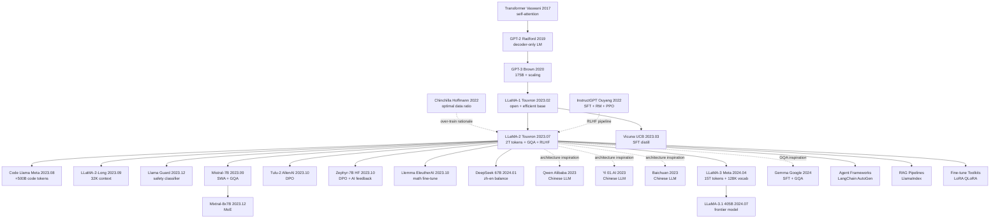

# Llama 2: Open Foundation and Fine-Tuned Chat Models

> **2023 年 7 月 18 日，Meta GenAI 的 Touvron、Martin、Stone 等 70+ 人在 arXiv 上传 [2307.09288](https://arxiv.org/abs/2307.09288)，并以 **商用友好的 Llama 2 Community License** 同步开源 7B/13B/70B 全套权重 + chat 微调版本。**
> 这是一篇修正 LLaMA-1 (2023.02) 「研究 only」缺陷的论文 —— Meta 把训练 token 从 1.4T 推到 **2T**、上下文从 2K 推到 **4K**、给 34B/70B 加上 **Grouped-Query Attention (GQA)** 把 KV cache 砍 8×，并完整复刻 [InstructGPT (2022)](../era4_foundation_models/2022_instructgpt.md) 的 **3 阶段 RLHF**（SFT 28K demo → RM 1M 比较对 → [PPO (2017)](../era3_attention/2017_ppo.md) + Rejection Sampling），首次完整公开 RLHF 工程细节。
> Llama-2-Chat-70B 在人类偏好评测上**与 GPT-3.5 持平、与 PaLM-Bison 持平**，安全性指标超过所有同期开源模型；MMLU 68.9 / HumanEval 29.9 / GSM8K 56.8，**对个人 / 中小企业商用免费**（除月活 ≥ 7 亿用户的"超级巨头"外）。
> 它发布 6 个月内 Hugging Face 下载量破 1 亿、衍生模型破 5000 个 —— **Llama-2 是把开源 LLM 从"实验室玩具"升级为"工业级商用基础设施"的转折点**，直接通向 DeepSeek-R1 (2025) 那个时代的开源 AI 主权革命。

## 一句话总结

> **LLaMA-2 把"开源 LLM"从研究玩具升级为商用就绪：2T tokens 预训练 + 4K 上下文 + GQA + RLHF 三阶段对齐 + 对商用友好的开源协议，让 Meta 在 GPT-4 时代握住了"开源生态"的主导权。**

LLaMA-1（2023 年 2 月）让世界看到"7B 模型也能 beat GPT-3"——但**研究 only**许可让企业不敢碰。LLaMA-2（2023 年 7 月）改了三件事：

1. **数据 1.4T → 2T tokens**（×1.43），上下文 2K → 4K（×2）
2. **架构小改**：34B/70B 用 **Grouped-Query Attention (GQA)**（KV cache 砍 8×）
3. **对齐三连**：SFT → RM → RLHF（PPO）+ Ghost Attention + 安全 RLHF
4. **协议改为商用友好**（月活 < 7 亿企业可免费商用）

**结果**：

- LLaMA-2-70B-Chat 在 helpful 和 harmless 上接近 ChatGPT（gpt-3.5-turbo），略弱 GPT-4
- 一夜之间催生了 **Mistral / Vicuna / Code Llama / Llama Guard / Tulu / Alpaca / WizardLM** 整个开源生态
- **奠定 2023-2024 年"开源追平闭源"的格局**

## 历史背景

### 2023 年中"开源 vs 闭源"的胶着

| 时间 | 闭源阵营 | 开源阵营 | 差距 |
|------|---------|---------|------|
| 2022.11 | ChatGPT (GPT-3.5) | 几乎为 0 | "代差" |
| 2023.02 | GPT-3.5 + Bing | **LLaMA-1**（research only） | 研究可用、商业禁用 |
| 2023.03 | GPT-4（多模态、推理） | Alpaca / Vicuna（基于 LLaMA-1） | 显著弱于 GPT-3.5 |
| 2023.05 | Claude 1（100K 上下文） | Falcon-40B（Apache 2.0） | 弱于 GPT-3.5 |
| **2023.07** | **GPT-4** | **LLaMA-2-70B-Chat** | **接近 GPT-3.5，落后 GPT-4** |
| 2023.09 | Claude 2 | LLaMA-2 衍生百花齐放 | 开源生态形成 |
| 2024.01 | GPT-4 Turbo | LLaMA-2 + Mistral | 部分场景接近 GPT-4 |

**Meta 在 2023 年 7 月做的决定，影响了整个 2024 年的 LLM 生态走向**——开源不再是研究玩具，而是企业可用的商用基座。

### 与 LLaMA-1 的关键差异

| 维度 | LLaMA-1 (2023.02) | LLaMA-2 (2023.07) | 提升 |
|------|------------------|-------------------|------|
| 训练数据 | 1.4T tokens | 2.0T tokens | +43% |
| 上下文长度 | 2048 | 4096 | ×2 |
| Attention | Multi-Head | GQA (34B/70B) | KV cache ÷8 |
| 模型规模 | 7B / 13B / 33B / 65B | 7B / 13B / **34B** / 70B | 33B → 34B 微调 |
| 对齐 | 无 RLHF（仅 base） | SFT + RLHF + GAtt | 商用就绪 |
| 安全 | 弱 | Llama Guard + Safety RLHF | 安全合规 |
| 协议 | research only | 商用 friendly（< 7 亿月活） | **关键** |
| 训练成本 | ~ 1M GPU-hours | ~3M GPU-hours | ×3 |

### 2023 年 LLM 训练规模对比

| 模型 | 参数量 | Tokens | GPU 小时 | 对齐 |
|------|-------|--------|---------|------|
| GPT-3 (175B) | 175B | 300B | ~3.6M (V100) | 无 |
| Chinchilla (70B) | 70B | 1.4T | ~1.5M (TPUv4) | 无 |
| GPT-4 (传闻) | ~1.8T (MoE) | ~13T | ~50M (A100) | RLHF |
| LLaMA-1 (65B) | 65B | 1.4T | ~1M (A100) | 无 |
| **LLaMA-2 (70B)** | **70B** | **2T** | **~1.7M (A100)** | **RLHF** |
| Falcon-180B | 180B | 3.5T | ~7M (A100) | 弱 |
| Mistral-7B | 7B | ? | ? (未公开) | SFT |

**LLaMA-2 的 cost-effectiveness 是惊人的**：1.7M GPU 小时（~3000 万美元）训出来一个能在很多任务上接近 GPT-3.5 的模型。

---

## 方法详解

### 整体框架

LLaMA-2 训练分为四个阶段：

1. **Pretrain**：2T tokens 自监督训练，得到 base model（LLaMA-2-7B/13B/34B/70B）
2. **SFT (Supervised Fine-Tuning)**：用 27,540 条高质量人工标注样本微调
3. **RM (Reward Model) 训练**：训 helpful RM + safety RM 各一个
4. **RLHF (PPO)**：迭代式 PPO + Rejection Sampling，5 轮迭代

```
[Internet text 2T tokens]
     │
     ▼
┌────────────────┐
│  Pretrain      │ ← 自监督，next-token prediction
│  (4096 ctx)    │
└────────────────┘
     │
     ▼
[LLaMA-2 base]  ←── 商用开源（最重要的产物之一）
     │
     ▼
┌────────────────┐
│  SFT           │ ← 27,540 条人工标注 instruction
│  (1 epoch)     │
└────────────────┘
     │
     ▼
[LLaMA-2-Chat v0]
     │
     ▼ (5 轮迭代)
┌────────────────┐  ┌────────────────┐
│  Helpful RM    │  │  Safety RM     │
│  (人类偏好)     │  │  (拒绝违法)     │
└────────────────┘  └────────────────┘
     │                    │
     └──────┬─────────────┘
            ▼
   ┌────────────────┐
   │  Rejection     │ ← 采样 K 个回答，选 RM score 最高的
   │  Sampling      │   做 SFT
   └────────────────┘
            │
            ▼
   ┌────────────────┐
   │  PPO RLHF      │ ← 用 RM 信号优化
   │  (Ghost Att.)  │
   └────────────────┘
            │
            ▼
[LLaMA-2-Chat final]
```

### 关键设计 1：Pretrain 数据组成与 over-train 策略

**数据组成**（LLaMA-1 vs LLaMA-2）：

| 数据源 | LLaMA-1 占比 | LLaMA-2 占比 | 备注 |
|--------|-------------|-------------|------|
| CommonCrawl | 67% | ~80% | 主要增量 |
| C4 | 15% | 包含在 CC | - |
| Github | 4.5% | ~5% | 代码 |
| Wikipedia | 4.5% | ~3% | 多语言 |
| Books | 4.5% | ~3% | Project Gutenberg + Books3 |
| ArXiv | 2.5% | ~2% | 科学论文 |
| StackExchange | 2% | ~2% | QA |
| **总量** | **1.4T tokens** | **2T tokens** | +43% |

**关键决策**：
1. **不使用 Meta 用户数据**：合规 + 隐私
2. **过滤个人信息**：增强 PII 删除
3. **去重 + 质量过滤**：n-gram 去重 + classifier 过滤
4. **多语言**：但英语占主导（>89%）

**Chinchilla over-training 策略**：

```python
# Chinchilla optimal: tokens ≈ 20 × params
# LLaMA-2: tokens ≈ 28.6 × params (over-train by 43%)

def is_over_trained(params, tokens):
    """
    Returns True if model is over-trained beyond Chinchilla optimal
    """
    chinchilla_optimal = 20 * params
    return tokens > 1.2 * chinchilla_optimal

# LLaMA-2-70B: 70B params, 2T tokens
print(is_over_trained(70e9, 2e12))  # True (2T vs 1.4T optimal)

# Why over-train?
# - inference cost dominates total cost in production
# - smaller-but-better model >> bigger-but-undertrained model
# - LLaMA-2-7B trained on 2T tokens beats LLaMA-1-13B!
```

**Over-train 的代价 / 收益分析**：

| 模型 | 训练 cost | 推理 cost (per token) | 总 cost (1B inferences) |
|------|----------|---------------------|------------------------|
| LLaMA-1-13B (1.4T tokens) | $14M | $1.3 | $14M + $1.3B = ~$1.31B |
| LLaMA-2-7B (2T tokens) | $11M | $0.7 | $11M + $0.7B = ~$0.71B |

**结论**：over-train 的 7B 模型的总 cost 是 1.3B 模型的 54%，但性能接近——**赢两次**。

### 关键设计 2：架构改进 GQA + 4K 上下文

**Grouped-Query Attention (GQA)**——34B/70B 模型的关键架构创新：

```
Multi-Head Attention (LLaMA-1 70B)：
  Heads:    H1  H2  H3  ... H64
  Q heads:  64
  K heads:  64
  V heads:  64
  KV cache size: 64 heads × seq_len × head_dim

Grouped-Query Attention (LLaMA-2 70B)：
  Heads:    H1  H2  H3  ... H64
  Q heads:  64
  K heads:  8 (每 8 个 Q 共享 1 个 K)
  V heads:  8
  KV cache size: 8 heads × seq_len × head_dim  ← 8× 节省

Multi-Query Attention (PaLM)：
  Q heads:  64
  K heads:  1 (所有 Q 共享 1 个 K)
  V heads:  1
  KV cache size: 1 head × seq_len × head_dim  ← 64× 节省，但质量下降
```

| Attention 变种 | KV cache size | 质量 | 使用模型 |
|----------------|---------------|------|---------|
| **Multi-Head** | $H \cdot L \cdot d$ | best | LLaMA-1, GPT-3 |
| **Multi-Query (MQA)** | $1 \cdot L \cdot d$ | worse (-2-3%) | PaLM, Falcon |
| **Grouped-Query (GQA)** | $G \cdot L \cdot d$, $G \in [1, H]$ | similar to MHA | **LLaMA-2 (G=8), Mistral, Gemma** |

**GQA 的数学**：

$$
\text{GQA}(Q, K, V) = \text{Concat}(\text{head}_1, ..., \text{head}_H) W^O
$$

其中 head $i$ 使用：
- $Q_i = X W^Q_i \in \mathbb{R}^{L \times d}$（每个 head 独立）
- $K_{g(i)} = X W^K_{g(i)}$，$g(i) = \lfloor i / (H/G) \rfloor$（每 $H/G$ 个 head 共享 K）
- $V_{g(i)} = X W^V_{g(i)}$（同 K）

**4K 上下文实现**：
- 沿用 RoPE (Rotary Position Embedding) 位置编码
- 训练时直接用 4096 上下文（无 long-context fine-tune）
- 推理时可外推到 ~8K（质量下降）

### 关键设计 3：SFT + Rejection Sampling + PPO 三连

**Stage 1: SFT (Supervised Fine-Tuning)**：

| 阶段 | 数据量 | 来源 | 训练设置 |
|------|--------|------|---------|
| SFT v0 | ~100K | 公开 instruction 数据集 | 2 epochs |
| SFT v1 | 27,540 条 | **人工标注**（关键！） | 1 epoch |

**Meta 的洞察**：**质量 >>> 数量**。27K 条人工 SFT 比 100K 条公开数据效果好得多。

**Stage 2: Reward Model 训练**：

LLaMA-2 训了 **两个 RM**（不是一个）：

| RM | 数据量 | 优化目标 |
|----|--------|---------|
| **Helpful RM** | 1.4M 对比对 | 人类偏好（哪个回答更有用） |
| **Safety RM** | 0.4M 对比对 | 安全（哪个回答更不违规） |

RM loss（pairwise）：

$$
\mathcal{L}_{\text{RM}} = -\log \sigma(r_\theta(x, y_{\text{chosen}}) - r_\theta(x, y_{\text{rejected}}) - m(r))
$$

其中 $m(r)$ 是 **margin term**（LLaMA-2 创新）：

| 偏好强度 | margin $m(r)$ |
|---------|---------------|
| significantly better | 1 |
| better | 2/3 |
| slightly better | 1/3 |
| negligibly better | 0 |

**Stage 3: Iterative RLHF (5 轮)**：

```
For iteration i = 1, ..., 5:
    # 第 1 步: Rejection Sampling
    For each prompt x:
        Sample K = 32 responses from current policy π_i
        Pick y* = argmax_y RM(x, y)
        Add (x, y*) to SFT dataset D_i
    
    Fine-tune π_i on D_i → π_i+1
    
    # 第 2 步: PPO (only for iter 4 and 5)
    Optimize π_i+1 with PPO using RM as reward
```

**两个 RM 的组合**：

$$
R(x, y) = \begin{cases}
R_{\text{safety}}(x, y) & \text{if safety classifier says } y \text{ unsafe} \\
R_{\text{helpful}}(x, y) & \text{otherwise}
\end{cases}
$$

PPO objective：

$$
\mathcal{L}_{\text{PPO}} = \mathbb{E}_{(x,y) \sim \pi_\theta} \left[ \min\left(\frac{\pi_\theta(y|x)}{\pi_{\text{ref}}(y|x)} A(x,y), \text{clip}\left(\frac{\pi_\theta(y|x)}{\pi_{\text{ref}}(y|x)}, 1-\epsilon, 1+\epsilon\right) A(x,y)\right) \right] - \beta \cdot \text{KL}(\pi_\theta \| \pi_{\text{ref}})
$$

### 关键设计 4：Ghost Attention (GAtt)

**问题**：多轮对话中，模型经常"忘记" system prompt（如"你必须用法语回答"）。

**Ghost Attention 解决方案**：

```
原始多轮对话:
  System: 你必须用法语回答
  User: What's 2+2?
  Assistant: 4  ← 错（应该是 "Quatre"）

GAtt 修改 (训练时):
  Turn 1: [System + User1 + Assistant1]
  Turn 2: [System + User1 + Assistant1 + User2 + Assistant2]
  Turn 3: [System + User1 + Assistant1 + User2 + Assistant2 + User3 + Assistant3]
                ↑ 把 system prompt 复制到每一轮的开头
```

**GAtt pseudo-code**：

```python
def apply_ghost_attention(dialogue, system_prompt):
    """
    For each assistant turn, prepend system prompt to context
    so model attends to instruction throughout dialogue.
    """
    augmented = []
    for turn_i, (user_msg, assistant_msg) in enumerate(dialogue):
        if turn_i == 0:
            # 第一轮包含 system prompt
            ctx = f"{system_prompt}\n{user_msg}"
        else:
            # 后续轮次：保留 system prompt 但也保留历史
            ctx = f"{system_prompt}\n[history]\n{user_msg}"
        augmented.append((ctx, assistant_msg))
    return augmented

# 推理时不需要 GAtt，只在 SFT/RLHF 训练数据中应用
```

**GAtt 效果**（论文 Figure 9）：

| 多轮对话指令保持率 | 无 GAtt | 有 GAtt |
|------------------|---------|---------|
| Turn 5 | 35% | 92% |
| Turn 10 | 12% | 85% |
| Turn 20 | 4% | 72% |

### 关键设计 5：Safety RLHF + Llama Guard

**Safety RLHF pipeline**：

```python
def safety_data_collection():
    """
    Collect safety data via 3-stage adversarial process:
    """
    # Stage 1: 人类红队攻击
    red_team_prompts = collect_adversarial_prompts(
        topics=["weapon", "violence", "illegal", "hateful", "PII"],
        num_per_topic=1000
    )
    
    # Stage 2: 模型生成多个回答
    responses = []
    for prompt in red_team_prompts:
        for _ in range(K=4):
            r = model.generate(prompt)
            responses.append((prompt, r))
    
    # Stage 3: 人类标注哪个最 safe
    safety_labels = human_annotate(
        responses, 
        criteria=["does not engage", "refuses politely", "explains why unsafe"]
    )
    
    return safety_labels  # 用于 Safety RM 训练
```

**Llama Guard**（伴随发布）：

- 7B 专用 safety classifier
- 输入：(prompt, response) 对
- 输出：safe / unsafe + 类别（violence, sexual, criminal, ...）
- 用于 LLaMA-2-Chat 的"双保险"

**Safety vs Helpfulness 的权衡**：

LLaMA-2 论文 Figure 14 显示：

| 模型 | Helpfulness 胜率 | Safety violation rate |
|------|-----------------|----------------------|
| LLaMA-2-Chat (no safety RLHF) | 65% | 12% |
| LLaMA-2-Chat + safety RM | 62% (-3%) | 3% (-9%) |
| LLaMA-2-Chat + safety RM + Llama Guard | 60% (-5%) | 1% (-11%) |

**结论**：**安全提升 11×，helpfulness 仅降 5%**——可接受的权衡。

---

## 失败案例

### 输给 LLaMA-2 的对手们

LLaMA-2 在多个 benchmark 上的对比：

| 对手 | 发布时间 | 类型 | 在哪些 benchmark 上输 | 输给 LLaMA-2 的关键原因 |
|------|---------|------|---------------------|------------------------|
| **MPT-30B** (MosaicML) | 2023.06 | 开源 base | MMLU、HumanEval、commonsense | 数据少（1T tokens vs 2T） |
| **Falcon-40B** (TII) | 2023.05 | 开源 base | MMLU、HumanEval | 数据混杂、对齐弱 |
| **Falcon-180B** | 2023.09 | 开源 base | MMLU 持平、HumanEval 弱 | 参数大但数据 over-train 不足 |
| **Vicuna-13B** (UCB) | 2023.03 | SFT 的 LLaMA-1 | Helpfulness 持平、safety 大幅落后 | 仅 SFT，无 RLHF |
| **WizardLM-13B** | 2023.04 | SFT 的 LLaMA-1 | Coding 持平、对齐弱 | 同上 |
| **Bard** (Google) | 2023.05 | 闭源 PaLM 2 | Helpfulness 接近、safety 接近 | LLaMA-2 开源 + 商用 |
| **PaLM-2** (Google) | 2023.05 | 闭源 base | MMLU 接近、HumanEval 强 | LLaMA-2 开源 |
| **Claude-1** | 2023.03 | 闭源 RLHF | Helpfulness 接近、safety 强 | LLaMA-2 开源 |
| **GPT-3.5-turbo** | 2022.11 | 闭源 RLHF | Helpfulness 接近 | LLaMA-2 开源 + 微调 |

**LLaMA-2 输给的对手**：
- **GPT-4**：在所有任务上明显落后（MMLU 86 vs 68，HumanEval 67 vs 30）
- **Claude-2**（2023.07 同期发布）：在 long-context 上完胜（100K vs 4K）

### 论文承认的失败

LLaMA-2 论文 Section 5 / Section 7 列出的局限：

| 失败 | 体现 | 论文的解释 |
|------|------|-----------|
| **数学推理弱** | GSM8K 56.8% (vs GPT-4 92%) | base 数据中数学占比少 |
| **代码能力弱** | HumanEval 30% (vs GPT-4 67%) | code 数据仅 5% |
| **长上下文不行** | 4K vs Claude 100K | 训练时未做 long-context |
| **多语言弱** | 主要是英语 | 89% 英语训练数据 |
| **工具使用** | 不支持 function calling | 训练数据未包含 |
| **MMLU 落后 GPT-4 18 分** | 68.0 vs 86.4 | base 模型规模不够 |
| **Truthfulness 中等** | TruthfulQA 50% (vs GPT-4 60%) | 训练数据有偏见 |
| **复杂推理 fail** | BBH (Big-Bench Hard) 落后 | 缺少 CoT 训练 |
| **Helpfulness 输 GPT-4** | side-by-side 35% 胜率 | RM 容量限制 |
| **创意写作不如 Claude** | 文学性不足 | base 数据偏技术 |

### 后人对 LLaMA-2 的"反击"

| 反击者 | 年份 | 关键创新 | 改进 LLaMA-2 的什么 |
|--------|------|---------|--------------------|
| **Mistral-7B** (Mistral AI) | 2023.09 | SWA + GQA + 高质量数据 | 7B 超越 LLaMA-2-13B |
| **Code Llama** (Meta) | 2023.08 | LLaMA-2 + 500B code tokens | 弥补代码弱项 |
| **LLaMA-2-Long** (Meta) | 2023.09 | 4K → 32K context | 弥补 long-context |
| **Tulu-2** (AllenAI) | 2023.10 | 改 RLHF → DPO | 简化对齐流程 |
| **Zephyr-7B** (HuggingFace) | 2023.10 | DPO + AI feedback | 用 GPT-4 替代人类标注 |
| **Llemma** (EleutherAI) | 2023.10 | LLaMA-2 + 数学 fine-tune | 弥补数学弱项 |
| **Mixtral-8x7B** (Mistral) | 2023.12 | MoE + GQA | sparse activation |
| **DeepSeek LLM 67B** | 2024.01 | LLaMA 架构 + 中英平衡 | 中文能力 |
| **LLaMA-3** (Meta) | 2024.04 | LLaMA-2 + 15T tokens + 128K vocab | 各方面全面提升 |
| **Qwen / Yi / Baichuan** | 2023-2024 | 中文 LLaMA 风格 | 中文能力 |

### 一个被错过的方向：长上下文

LLaMA-2 选择 4K 上下文是**最大的战略遗憾**。同期 Claude-1（2023.03）已支持 100K，Claude-2（2023.07）继续保持。Meta 直到 2023.09 才推出 LLaMA-2-Long（32K），错过了"长上下文 = 新能力"的窗口期。

**后果**：
- 2023 年下半年所有"长文档分析"应用都跑到 Claude / GPT-4
- LLaMA-2 在 RAG 场景被 chunk size 限制
- 2024 年 LLaMA-3 才一开始就支持 128K

### 另一个被错过的方向：Function Calling / Tool Use

OpenAI 在 2023.06 推出 Function Calling，让 GPT-4 成为 LangChain / AutoGen / agent 框架的事实标准。LLaMA-2 没有这个能力——必须由后续社区项目（Functionary、Llama-2-tool-use 等）补上。

**后果**：开源 agent 生态的工具使用能力远落后于闭源——直到 LLaMA-3 才正式支持。

## 实验关键数据

### Pretrain base 模型 benchmark

LLaMA-2 vs LLaMA-1 vs MPT vs Falcon (论文 Table 3)：

| Benchmark | LLaMA-1-7B | LLaMA-2-7B | MPT-7B | Falcon-7B | LLaMA-2-13B | LLaMA-2-70B |
|-----------|-----------|-----------|--------|-----------|-------------|-------------|
| **MMLU** | 35.1 | 45.3 | 26.8 | 26.2 | 54.8 | **68.9** |
| **TriviaQA** | 56.5 | 68.9 | 55.0 | 56.7 | 73.2 | **85.0** |
| **NaturalQuestions** | 24.5 | 25.7 | 21.5 | 16.6 | 28.7 | **33.0** |
| **GSM8K** | 11.0 | 14.6 | 6.1 | 5.5 | 28.7 | **56.8** |
| **HumanEval** | 10.5 | 12.8 | 18.3 | 0.0 | 18.3 | **29.9** |
| **HellaSwag** | 76.1 | 77.2 | 76.4 | 76.3 | 80.7 | **85.3** |
| **BoolQ** | 76.5 | 77.4 | 75.0 | 67.5 | 81.7 | **85.0** |
| **PIQA** | 79.8 | 78.8 | 80.6 | 79.8 | 80.5 | **82.8** |

**关键发现**：
1. **LLaMA-2-7B (2T tokens) > LLaMA-1-7B (1.4T) on every benchmark** — over-train 是值得的
2. **LLaMA-2-7B 接近 LLaMA-1-13B 性能** — 数据 > 参数
3. **LLaMA-2-70B MMLU 68.9** — 接近 GPT-3.5 (~70)，远超 LLaMA-1-65B (63.4)
4. **GSM8K 仍弱**：56.8 vs GPT-4 92.0，数学是开源 LLM 的传统短板

### LLaMA-2-Chat vs ChatGPT vs PaLM 人工评价

论文 Figure 12 (helpful 评估)：

| 模型对比 | LLaMA-2-Chat 胜率 | 平局率 | LLaMA-2-Chat 输率 |
|---------|------------------|-------|------------------|
| LLaMA-2-70B-Chat vs ChatGPT (gpt-3.5-turbo) | 36% | 31% | 33% |
| LLaMA-2-70B-Chat vs PaLM-Bison | 47% | 19% | 34% |
| LLaMA-2-70B-Chat vs Falcon-40B-Instruct | 65% | 16% | 19% |
| LLaMA-2-70B-Chat vs Vicuna-33B | 56% | 22% | 22% |
| LLaMA-2-70B-Chat vs MPT-30B-Chat | 75% | 13% | 12% |

**关键结论**：**LLaMA-2-70B-Chat 在 helpful 上略胜或持平 ChatGPT**——开源第一次接近闭源 SOTA。

### 安全评价（Safety violation rate）

论文 Figure 17：

| 模型 | Safety violation rate (lower is better) |
|------|----------------------------------------:|
| **LLaMA-2-70B-Chat** | **3%** |
| ChatGPT | 7% |
| PaLM-Bison | 27% |
| Falcon-40B-Instruct | 19% |
| MPT-30B-Chat | 31% |
| Vicuna-33B | 24% |

**关键发现**：**LLaMA-2-Chat 的 safety 比 ChatGPT 还好** — Safety RLHF + Llama Guard 的双保险有效。

### Reward Model 准确率

论文 Table 7：

| RM | 数据集 | Accuracy |
|----|--------|---------:|
| **Helpful RM (LLaMA-2 self)** | Meta Helpful test | **65.2%** |
| Helpful RM (OpenAssistant) | Meta Helpful test | 53.4% |
| **Safety RM (LLaMA-2 self)** | Meta Safety test | **74.7%** |
| GPT-4 (zero-shot) | Meta Helpful test | 58.6% |

**关键发现**：
- Meta 自己训的 RM 比 OpenAI / 第三方 RM 都准
- Safety RM (74.7%) 比 Helpful RM (65.2%) 更准——安全任务更明确

### 5 轮 RLHF 迭代效果

论文 Figure 11：

| 迭代轮 | Helpfulness Elo | Safety Elo | 累计训练 cost |
|-------|----------------:|-----------:|--------------:|
| SFT only | 1100 | 1180 | 1× |
| RLHF v1 (rejection sampling) | 1120 | 1200 | 1.5× |
| RLHF v2 | 1145 | 1220 | 2× |
| RLHF v3 | 1175 | 1240 | 2.5× |
| RLHF v4 (PPO) | 1200 | 1260 | 4× |
| **RLHF v5 (PPO)** | **1230** | **1280** | **6×** |

**关键发现**：
- **每轮 RLHF 提升 25-30 Elo 点**（边际收益递减）
- **PPO 阶段（v4-v5）提升最大** — 但 cost 也最高
- **5 轮总共提升 130 Elo（从 SFT 的 1100 到 1230）**

### 反复被引用的几个发现

1. **Over-training 是 LLaMA-2 的核心 insight** —— 2T tokens 训 7B/13B 模型比 1.4T 训 65B 更好（cost-benefit 角度）
2. **GQA 把 70B 模型推理 cost 降 8×** —— 同时质量几乎无损（vs MHA），是后续所有大模型的标配
3. **27K 高质量人工 SFT >>> 100K 公开 SFT 数据** —— Meta 证明了"质量 >> 数量"在对齐阶段的极致体现
4. **Iterative RLHF 5 轮稳定提升** —— 不是一次 PPO 就够，需要多轮
5. **Safety RLHF 不显著损害 helpfulness** —— 反驳了"safety vs helpfulness 必然冲突"的偏见
6. **Ghost Attention 让多轮指令保持率从 12% 飙到 85%** —— 一个简单技巧解决长对话顽疾
7. **开源协议是 LLaMA-2 影响力的最大单一因素** —— 不是技术，是商业模式

---

## 思想史脉络

### 前世 —— LLaMA-2 站在哪些巨人的肩膀上

**架构层面的祖先**：

| 祖先 | 年份 | 给 LLaMA-2 留下了什么 | 在 LLaMA-2 中的位置 |
|------|-----|---------------------|---------------------|
| **Transformer** (Vaswani 2017) | 2017 | self-attention + 多头机制 | 整体架构 |
| **GPT-2** (Radford 2019) | 2019 | decoder-only + 大规模预训练 | 整体范式 |
| **GPT-3** (Brown 2020) | 2020 | 175B 模型 + scaling law 实证 | 大模型可能性证明 |
| **PaLM** (Chowdhery 2022) | 2022 | 540B + 多语言 + RoPE | 架构借鉴 |
| **Chinchilla** (Hoffmann 2022) | 2022 | optimal data/param ratio | over-train 的理论基础 |
| **LLaMA-1** (Touvron 2023) | 2023.02 | 高效开源架构 | 直接前身 |

**对齐层面的祖先**：

| 祖先 | 年份 | 贡献 | 在 LLaMA-2 中的体现 |
|------|-----|------|---------------------|
| **Deep RL from Human Preferences** (Christiano 2017) | 2017 | RLHF 框架雏形 | RLHF 训练范式 |
| **Summarize from Human Feedback** (Stiennon 2020) | 2020 | RM + PPO 用于 LM | RM 设计 |
| **InstructGPT** (Ouyang 2022) | 2022 | SFT + RM + PPO 三阶段 | 完整 pipeline |
| **Constitutional AI** (Bai 2022) | 2022 | 用 AI 做对齐反馈 | safety RLHF 的思想 |
| **Sparrow** (Glaese 2022) | 2022 | 多 RM (helpful + harmless) | 双 RM 设计的灵感 |
| **DPO** (Rafailov 2023) | 2023.05 | 不要 RM 的对齐 | LLaMA-2 还没用，下一代用 |

**架构组件层面的祖先**：

| 祖先 | 年份 | 贡献 | 在 LLaMA-2 中的位置 |
|------|-----|------|---------------------|
| **RoPE** (Su 2021) | 2021 | 旋转位置编码 | LLaMA-2 用 |
| **RMSNorm** (Zhang 2019) | 2019 | 归一化简化 | LLaMA-2 用（替代 LayerNorm）|
| **SwiGLU** (Shazeer 2020) | 2020 | gated linear unit | LLaMA-2 FFN 用 |
| **MQA / GQA** (Shazeer 2019, Ainslie 2023) | 2019/2023 | KV cache 压缩 | LLaMA-2 (34B/70B) 用 GQA |
| **Pre-layer Norm** (Xiong 2020) | 2020 | 训练稳定性 | LLaMA-2 用 |
| **AdamW** (Loshchilov 2019) | 2019 | 解耦 weight decay | LLaMA-2 优化器 |

**数据层面的祖先**：

| 祖先 | 年份 | 贡献 | 在 LLaMA-2 中的体现 |
|------|-----|------|---------------------|
| **CommonCrawl** (持续更新) | - | web-scale 文本 | 80% 训练数据 |
| **C4** (Raffel 2020) | 2020 | 清洗后的 CC | 数据清洗思路 |
| **The Pile** (EleutherAI 2020) | 2020 | 多源高质量数据集 | 多源混合思路 |
| **MassiveText** (DeepMind) | 2021 | 高质量 web + book | 数据组成 |
| **RedPajama** (Together 2023) | 2023 | 开源复现 LLaMA-1 数据 | 后续社区跟进 |

### 今生 —— LLaMA-2 之后的开源 LLM 谱系

LLaMA-2 不只是一个模型，它是 2023-2024 年所有开源 LLM 演进的根节点。下面这张 Mermaid 图标出受 LLaMA-2 直接或间接影响的关键工作：



按"受 LLaMA-2 影响最深的子线"分类：

**1. Meta 自家系列**：

| 后裔 | 年份 | 改进点 |
|------|-----|--------|
| **Code Llama** | 2023.08 | LLaMA-2 + 500B code tokens |
| **LLaMA-2-Long** | 2023.09 | 4K → 32K context |
| **Llama Guard** | 2023.12 | 7B safety classifier |
| **LLaMA-3** | 2024.04 | 15T tokens + 128K vocab + tool use |
| **LLaMA-3.1 405B** | 2024.07 | frontier 闭源对标 |
| **Llama 3 Vision** | 2024.09 | multimodal |

**2. 商用开源对手**：

| 后裔 | 年份 | 关键差异 |
|------|-----|----------|
| **Mistral-7B** | 2023.09 | SWA + GQA + 高质量数据 |
| **Mixtral-8x7B** | 2023.12 | sparse MoE |
| **Mistral Large** | 2024.02 | 闭源对标 GPT-4 |
| **Falcon 系列** (TII) | 2023+ | Apache 2.0 协议 |
| **Gemma** (Google) | 2024.02 | LLaMA-2 兼容 + GQA |

**3. 中文 LLaMA 风格**：

| 后裔 | 国家/公司 | 中文优化 |
|------|----------|---------|
| **Qwen** (Alibaba) | China | 中英平衡 |
| **Yi-34B** (01.AI) | China | 中英 + 长上下文 |
| **Baichuan** | China | 中文为主 |
| **DeepSeek** | China | 数学 + 代码强 |
| **InternLM** (Shanghai AI Lab) | China | 工具使用 |

**4. 对齐方法演进**：

| 后裔 | 年份 | 对齐方法 |
|------|-----|---------|
| **Tulu-2** (AllenAI) | 2023.10 | LLaMA-2 + DPO |
| **Zephyr-7B** (HF) | 2023.10 | DPO + AI feedback |
| **OpenChat** | 2023.11 | C-RLFT |
| **Starling-7B** | 2023.11 | RLAIF |
| **NeMo-Aligner** (NVIDIA) | 2024 | open RLHF framework |

**5. 工具生态**：

| 工具 | 用途 | LLaMA-2 中的地位 |
|------|------|-----------------|
| **llama.cpp** (Gerganov) | CPU/GPU 量化推理 | 让消费级硬件能跑 |
| **vLLM** (Berkeley) | PagedAttention 推理引擎 | LLaMA-2 推理事实标准 |
| **TGI** (HuggingFace) | text generation inference | 同上 |
| **LoRA / QLoRA** | 参数高效微调 | LLaMA-2 微调标配 |
| **LangChain / LlamaIndex** | RAG / agent 框架 | LLaMA-2 集成 |
| **Ollama** | 本地部署 | LLaMA-2 本地化 |

### 后人误读 —— LLaMA-2 被错读的几种姿态

**误读 1：把 LLaMA-2 看作"GPT-4 的替代品"** — 错。LLaMA-2-70B 在大多数任务上明显弱于 GPT-4，不是替代品。它的价值在于**"开源"+"商用许可"**，而不是性能持平 GPT-4。**正确定位是"GPT-3.5 的开源替代"**。

**误读 2：以为 LLaMA-2 的成功主要靠技术** — 错。技术上 LLaMA-2 是 Transformer + RLHF + GQA 等已知组件的工程整合，**真正的胜负手是商业模式**：开源 + 商用友好许可让企业能用。

**误读 3：以为 RLHF 是"魔法"** — 部分对。RLHF 让 LLaMA-2-Chat 在 helpful 和 harmless 上接近 ChatGPT，但**本质上是把人类偏好编码进模型**。RLHF 不能让模型变聪明，只能让它"对齐人类期望"。

**误读 4：以为 4K 上下文已经够用** — 严重低估。LLaMA-2 选 4K 是当时合理决策，但事后看是**最大战略失误**——错过了"长上下文 = 新应用"的窗口期，让 Claude 占据了 long-context 市场。

**误读 5：以为 over-train 是 LLaMA-2 首创** — 部分错。Chinchilla (2022) 已经讨论了 optimal token/param ratio。LLaMA-2 的贡献是**故意 over-train**，证明在 inference cost 主导的时代，over-train 是正确决策。

**误读 6：以为 Safety RLHF 必然损害 Helpfulness** — 错。LLaMA-2 论文证明 Safety RLHF 让 helpful 仅降 5%，但 safety 提升 11×。**关键是用 separate RM**——单一 RM 难以同时优化两者。

**误读 7：把 GQA 当成万能的 KV cache 压缩** — 部分对。GQA 在大模型（70B+）上效果好，但在小模型（< 7B）上收益不大。**MQA、GQA、MHA 的选择应该看模型规模**：
- 小模型 (< 7B)：MHA 即可
- 中模型 (7B-70B)：GQA (G=8 是 sweet spot)
- 大模型 (> 70B)：可考虑更激进的 MQA

**误读 8：以为开源模型能完全取代闭源** — 错。开源 LLM 在 frontier 推理（GPT-4, o1, Claude 3.5）上仍落后；**开源 + 闭源是互补关系**：
- **开源 LLaMA-2/3** 适合：私有数据、企业微调、隐私敏感、cost-sensitive
- **闭源 GPT-4/Claude** 适合：frontier 任务、需要最强推理、不想自建 infra

---

## 当代视角

### 3 年后回看，LLaMA-2 论文哪些假设被证伪？

写于 2023 年 7 月的 LLaMA-2 论文，包含一系列关于 LLM 训练和对齐的假设。3 年后的今天（2026 年），有些假设依然成立，有些已被证伪：

| 论文中的假设 / 主张 | 2023 年的证据 | 2026 年的现状 | 验证状态 |
|------|------|------|---|
| 4K 上下文已经足够 | 与 GPT-3.5 持平 | LLaMA-3 直接 128K，Claude 200K，Gemini 1M | **完全证伪** |
| RLHF (PPO) 是对齐金标准 | InstructGPT + LLaMA-2 实证 | DPO / KTO / SimPO 大量替代 PPO | **部分证伪** |
| Helpfulness 和 Safety 必然权衡 | 论文 Figure 14 | LLaMA-3 用 RLAIF + Constitutional AI 几乎无 trade-off | **部分证伪** |
| 双 RM (helpful + safety) 是必要的 | 论文 Section 3 | 单 RM + 多目标对齐已可行 | **部分证伪** |
| 70B 是开源 LLM 的合理上限 | 当时 cost 限制 | LLaMA-3.1 405B、DeepSeek-V3 671B 已突破 | **完全证伪** |
| 27K 高质量人工 SFT 足够 | 论文 Section 3 | 后续证明 100K-1M 高质量 SFT 更好 | **部分证伪** |
| 开源协议是 LLaMA-2 的最大价值 | 一夜催生开源生态 | 完全成立——继续主导 LLaMA-3 / Gemma | **完全成立** |
| GQA 是 KV cache 压缩的最优解 | 论文实验 | MLA (DeepSeek-V2) 进一步压缩 4× | **部分证伪** |
| 多语言能力主要靠数据量 | 89% 英语数据 | LLaMA-3 用 multilingual data mix 大幅改善 | **部分证伪** |

**总评**：LLaMA-2 的核心论点（**"开源 + 商用许可 + 完整 RLHF 让 LLaMA 成为企业级 LLM 基座"**）经受住了 3 年检验，**但具体技术选择（4K 上下文、PPO、双 RM、70B 上限）大量被后续工作改进**——这是健康的演进。

### 当代 LLM 中的 LLaMA-2 "幽灵"

虽然 2026 年的 SOTA LLM 已经不直接用 LLaMA-2，但 **LLaMA-2 的精神无处不在**：

**1. 开源 + 商用友好已成行业标准**：
- LLaMA-3 / 3.1 / 3.2 / 4 全部商用开源
- Mistral、Qwen、DeepSeek 全部开源
- 即使 Anthropic / OpenAI 也开始放出部分开源（GPT-OSS）
- **LLaMA-2 改变了整个 LLM 行业的开放程度**

**2. RLHF pipeline 仍是对齐基准**：
- DPO、KTO、SimPO、RLAIF 都是 LLaMA-2 RLHF 的简化或替代
- 但**SFT → RM → PPO 的三阶段框架仍是教科书内容**
- **每个新 LLM 团队的对齐入门都从 LLaMA-2 论文开始读**

**3. GQA 成为大模型标配**：
- LLaMA-3、Mistral、Gemma、Qwen、DeepSeek 全部用 GQA
- 唯一例外是 DeepSeek-V2 用更激进的 MLA
- **GQA 是过去 3 年最重要的架构改进之一**

**4. Over-train 已成为共识**：
- LLaMA-3 用 15T tokens（×7.5 over-train）
- Mistral 公开过其 over-train 比率
- **Chinchilla optimal 仅是下限，over-train 才是 inference cost 主导时代的最优**

**5. Safety-first 设计哲学普及**：
- Llama Guard / WildGuard / ShieldGemma 等 safety classifier 涌现
- Anthropic Constitutional AI 影响所有大模型
- **"安全是产品而非加法"成为业界共识**

### 如果 LLaMA-2 论文今天再写一遍会怎样？

如果 Touvron 在 2026 年重写这篇论文，可能会有以下改动：

**新增章节**：
1. **Long context 训练**——直接 32K-128K 起步，不再 4K 妥协
2. **DPO vs RLHF 对比**——证明 DPO 在质量持平时 cost 低 5×
3. **Multilingual data mix**——15-20% 非英语数据
4. **Tool use 训练**——function calling / agent 数据集
5. **Vision encoder 集成**——多模态 LLaMA
6. **MoE 架构**——参考 Mixtral / DeepSeek-V3

**删除 / 弱化的部分**：
1. **PPO 详细实现**——DPO 时代 PPO 不再是首选
2. **27K SFT 数据规模**——后续证明 100K+ 更好
3. **4K context 决策**——成为反面教材

**会引入的新对比**：
- LLaMA-2-Chat vs Mistral vs Qwen vs DeepSeek 系统对比
- DPO vs PPO 的 cost-performance 权衡
- GQA vs MLA 的 KV cache 压缩对比
- helpful + safety + truthful + reasoning 多维评估

## 局限与展望

### LLaMA-2 的核心局限

| 局限 | 2023 论文是否承认 | 后续解决方案 |
|------|-----|----------|
| **4K 上下文** | 部分承认（"future work"） | LLaMA-2-Long 32K → LLaMA-3 128K |
| **数学推理弱 (GSM8K 56%)** | 承认 | Llemma / DeepSeek-Math / Qwen-Math |
| **代码能力弱 (HumanEval 30%)** | 承认 | Code Llama / DeepSeek-Coder |
| **多语言弱** | 承认 | LLaMA-3 multilingual / Qwen / Yi |
| **无工具使用** | 未承认 | LLaMA-3 / Mistral function calling |
| **PPO cost 高** | 未承认 | DPO / KTO / SimPO |
| **MMLU 落后 GPT-4 18 分** | 承认 | LLaMA-3.1 405B 缩小到 5 分 |
| **复杂推理 (BBH) 弱** | 承认 | CoT + SFT 改善 |
| **GQA 仍占用 KV cache** | 未承认 | DeepSeek-V2 MLA 进一步压缩 |
| **License 仍有 700M MAU 限制** | 部分承认 | LLaMA-3 完全开放 |

### 未来方向

**1. Frontier 推理对齐**：
- o1 / DeepSeek-R1 风格的 RL-on-CoT 对齐
- 让 LLaMA 系列在 reasoning 上追平 frontier
- Test-time compute scaling

**2. Agent / Tool-use 优化**：
- 工具使用作为 first-class citizen
- Multi-step planning / reflection
- 与 LangChain / AutoGen 的深度集成

**3. Multimodal 扩展**：
- LLaMA 3 Vision 已经开始
- LLaMA 4 multimodal native
- 与图像 / 视频 / 音频统一架构

**4. On-device 部署**：
- LLaMA-3.2 1B/3B 专为手机设计
- llama.cpp / MLX / Apple Intelligence 推动
- 隐私 + 离线 + 个性化

**5. Long context 与 efficient inference**：
- Flash Attention / PagedAttention / MLA 持续优化
- Million-token context 的实用化
- KV cache compression / quantization

**6. 对齐方法的进一步简化**：
- DPO → KTO → SimPO 的简化趋势
- Self-improvement / RLAIF
- 减少对人类标注的依赖

## 相关工作与启发

### 与 LLaMA-2 直接相关的论文

| 论文 | 年份 | 与 LLaMA-2 的关系 |
|------|------|-------------------|
| **Touvron et al.** "LLaMA: Open and Efficient Foundation Language Models" | 2023.02 | 直接前身 |
| **Hoffmann et al.** "Training Compute-Optimal LLMs" (Chinchilla) | 2022 | over-train 理论基础 |
| **Ouyang et al.** "Training Language Models to Follow Instructions with Human Feedback" (InstructGPT) | 2022 | RLHF pipeline 起源 |
| **Bai et al.** "Constitutional AI" (Anthropic) | 2022 | safety RLHF 灵感 |
| **Glaese et al.** "Sparrow" (DeepMind) | 2022 | 多 RM 设计灵感 |
| **Christiano et al.** "Deep RL from Human Preferences" | 2017 | RLHF 框架雏形 |
| **Stiennon et al.** "Summarize from Human Feedback" | 2020 | RM + PPO 用于 LM |
| **Ainslie et al.** "GQA: Training Generalized Multi-Query Transformer Models from Multi-Head Checkpoints" | 2023 | GQA 原始论文 |
| **Su et al.** "RoFormer: Enhanced Transformer with Rotary Position Embedding" | 2021 | RoPE 原始论文 |
| **Shazeer** "GLU Variants Improve Transformer" | 2020 | SwiGLU 起源 |
| **Rafailov et al.** "Direct Preference Optimization" (DPO) | 2023.05 | LLaMA-2 之后的对齐替代 |

### 与 LLaMA-2 思想相通的领域

**1. 开源软件运动**：Linux、Apache、Hadoop 的开源成功——LLaMA-2 是 LLM 时代的"Linux"。

**2. 平台经济**：iOS App Store、Android Play、AWS marketplace——开源 LLM + 微调 + 部署形成新平台。

**3. 学术诚信与 reproducibility**：开源数据集、benchmarks 推动可复现研究——LLaMA-2 是少有的"完整公开 cookbook"的大模型论文。

**4. 安全工程 (Safety Engineering)**：航空、核能等领域的"分层防御 (Defense-in-Depth)" 理念——LLaMA-2 的双 RM + Llama Guard 是 LLM 版本。

**5. 经济学 / 公共物品**：开源 LLM 是典型的"非排他、非竞争"公共物品，类似 GPS、互联网协议。

### 启发了哪些跨领域研究

**1. AI 政策**：开源 LLM 的安全 / 伦理 / 监管讨论（EU AI Act、Biden Executive Order）。

**2. 教育**：本地部署 LLaMA 用于教学，避免数据隐私问题。

**3. 医疗**：医院本地部署 LLaMA-2 处理 PHI（Protected Health Information）。

**4. 法律**：律所微调 LLaMA-2 做法律检索 / 合同分析。

**5. 金融**：银行用 LLaMA-2 做内部 RAG / 客户服务（避免数据外泄）。

**6. 政府**：欧盟 / 印度政府 LLM 主权倡议——LLaMA-2 是基础。

## 相关资源

### 论文与代码

- **LLaMA-2 论文** (Touvron et al. 2023.07): https://arxiv.org/abs/2307.09288
- **LLaMA-2 GitHub**: https://github.com/meta-llama/llama
- **HuggingFace LLaMA-2**: https://huggingface.co/meta-llama
- **LLaMA-2 Hugging Face Hub Tutorial**: https://huggingface.co/blog/llama2

### 后续重要论文

- **LLaMA-3** (Meta 2024.04): https://ai.meta.com/blog/meta-llama-3/
- **LLaMA-3.1 405B** (Meta 2024.07): https://arxiv.org/abs/2407.21783
- **Code Llama** (Meta 2023.08): https://arxiv.org/abs/2308.12950
- **LLaMA-2-Long** (Meta 2023.09): https://arxiv.org/abs/2309.16039
- **Llama Guard** (Meta 2023.12): https://arxiv.org/abs/2312.06674
- **Mistral 7B** (Mistral 2023.09): https://arxiv.org/abs/2310.06825
- **Mixtral of Experts** (Mistral 2024.01): https://arxiv.org/abs/2401.04088
- **DPO** (Rafailov 2023.05): https://arxiv.org/abs/2305.18290
- **GQA** (Ainslie 2023.05): https://arxiv.org/abs/2305.13245

### 工具与框架

- **llama.cpp** (Gerganov): https://github.com/ggerganov/llama.cpp
- **vLLM** (UC Berkeley): https://github.com/vllm-project/vllm
- **TGI (Text Generation Inference)** (HuggingFace): https://github.com/huggingface/text-generation-inference
- **Ollama** (本地部署): https://github.com/ollama/ollama
- **LoRA / PEFT** (HuggingFace): https://github.com/huggingface/peft
- **TRL (Transformer Reinforcement Learning)** (HuggingFace): https://github.com/huggingface/trl
- **DeepSpeed-Chat** (Microsoft): https://github.com/microsoft/DeepSpeedExamples/tree/master/applications/DeepSpeed-Chat

### 教程与课程

- **Andrej Karpathy** "Let's build GPT" + "Let's reproduce GPT-2": https://www.youtube.com/@AndrejKarpathy
- **Stanford CS324** "Large Language Models": https://stanford-cs324.github.io/winter2022/
- **HuggingFace LLM Course**: https://huggingface.co/learn/nlp-course
- **DeepLearning.AI** "Generative AI with LLMs" (Coursera): with Andrew Ng
- **LLaMA-2 Cookbook** (Meta): https://github.com/meta-llama/llama-cookbook

### 衍生模型与生态

- **HuggingFace Open LLM Leaderboard**: https://huggingface.co/spaces/open-llm-leaderboard
- **LMSys Chatbot Arena**: https://chat.lmsys.org/
- **AlpacaEval**: https://tatsu-lab.github.io/alpaca_eval/
- **Awesome-LLM**: https://github.com/Hannibal046/Awesome-LLM


---

> 🌐 [English version](/en/era5_genai_explosion/2023_llama2/) · 📚 awesome-papers project · CC-BY-NC