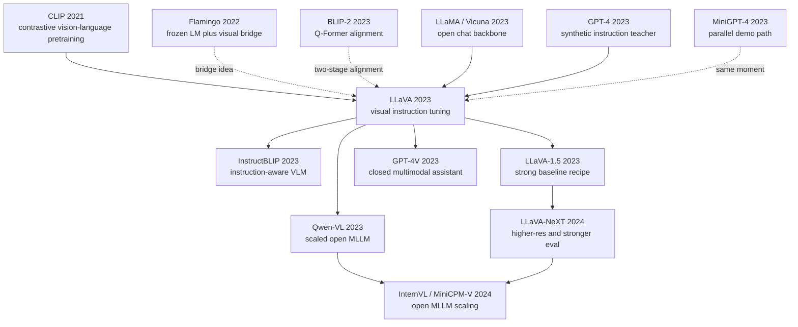

# LLaVA - 把 GPT-4 生成的视觉指令变成开源多模态助手

> **2023 年 4 月 17 日，Haotian Liu、Chunyuan Li、Qingyang Wu、Yong Jae Lee 四位作者把 [arXiv:2304.08485](https://arxiv.org/abs/2304.08485) 上传到 arXiv，标题很朴素：Visual Instruction Tuning。** 这篇 NeurIPS 2023 Oral 没有训练一个从头开始的视觉大模型，而是把 CLIP ViT-L/14 的图像 token 通过一个线性投影接到 Vicuna，再让 GPT-4 根据 COCO caption 与检测框合成 158K 条视觉指令数据。它真正打开的门是：在 GPT-4V 尚未公开、闭源多模态能力只能观看 demo 的 2023 年春天，开源社区第一次有了一个能自己跑、自己改、自己评测的多模态 ChatGPT 雏形。

## 一句话总结

Liu、Li、Wu、Lee 四位作者 2023 年在 NeurIPS Oral 发表的 LLaVA，把多模态助手问题改写成一个极简的视觉指令微调问题：冻结 CLIP ViT-L/14 和 Vicuna/LLaMA，只学习一个投影 $Z_v = W\,\mathrm{CLIP}(I)$，再用 GPT-4 根据 caption、检测框和图像上下文生成 conversation / detail description / complex reasoning 三类 158K 指令数据，用自回归损失 $\mathcal{L}=-\sum_t\log p(y_t\mid y_{<t}, Z_v, x)$ 对齐图像 token 与语言 token。它替代的不是某个单一模型，而是 2022 年前后的三类失败 baseline：caption/VQA 系统只能回答窄任务，Flamingo/BLIP-2 能连接视觉和语言却不开源或不够会聊天，MiniGPT-4 展示了聊天能力但指令规模和评测体系都太薄。LLaVA 的关键数字很直接：595K 图文对做预对齐，158K 视觉指令做微调，在多模态聊天评测中达到 GPT-4 约 85.1% 的相对分数，并在 ScienceQA 上与 GPT-4 协同达到 92.53%。它继承 LLaMA (2023) 的开源语言底座，也把后来的 InstructBLIP、Qwen-VL、LLaVA-1.5、LLaVA-NeXT、GPT-4V 时代开源 MLLM 评测文化串了起来；反直觉 lesson 是：2023 年多模态助手的第一道门槛不是更复杂的跨模态架构，而是把足够像“人会怎样问图像”的指令数据喂给一个已经很强的 LLM。

---

## 历史背景

### 2023 年春天，多模态能力还在玻璃后面

2023 年 3 月 GPT-4 技术报告发布时，最让研究者眼热的不是文本成绩，而是报告里那几页多模态例子：识别梗图、解释图表、读草图、从手写网站草图生成 HTML。问题是，GPT-4 的图像输入当时并没有开放给普通研究者；OpenAI 展示了能力，却没有给出权重、API 或可复现实验。对学术界来说，这等于把“多模态 ChatGPT”这个方向钉在了墙上，但玻璃门还没打开。

同一时间，语言模型一侧刚发生巨变。LLaMA 在 2023 年 2 月发布，3 月权重泄露，Vicuna、Alpaca 等指令微调模型迅速出现。开源社区第一次有了一个足够强、足够便宜、足够可改的对话底座。视觉侧也不缺材料：CLIP 已经证明图像和文本可以在同一语义空间中对齐，BLIP-2 证明冻结视觉编码器和冻结大语言模型之间可以用一个小模块打通。真正缺的是第三块拼图：**怎样让语言模型不仅“看见”图像，而且用人类对话的方式围绕图像回答问题、解释细节、推理关系。**

LLaVA 的历史位置就在这个缝隙里。它不是第一个把图像接到 LLM 的工作，也不是第一个视觉问答模型；它的关键是把“instruction tuning”这个 ChatGPT 之后最有效的语言模型驯化手段，第一次系统地迁移到视觉语言场景。换句话说，LLaVA 不是在问“图像特征怎样更好”，而是在问“如果 GPT-4 是一个老师，它能不能把看图说话这件事教给一个开源学生”。

### 直接前序：从 CLIP 到 BLIP-2，再到 Vicuna

LLaVA 站在三条线的交叉处。第一条线是 CLIP。Radford 等作者 2021 年证明，大规模图文对比学习可以产出一个强视觉编码器，图像不再只是 CNN 分类器的输入，而是可以映射到接近自然语言概念的表示空间。LLaVA 直接使用 CLIP ViT-L/14，把它当作“眼睛”，没有重新训练视觉 backbone。

第二条线是 Flamingo 与 BLIP-2。Flamingo 2022 年通过 Perceiver Resampler 和 cross-attention 把视觉 token 接入冻结语言模型，少样本视觉语言能力很强，但系统闭源、训练成本高、实现复杂。BLIP-2 2023 年用 Q-Former 在冻结图像编码器和冻结 LLM 中间做桥接，进一步降低训练成本。它们共同证明：**不必从头训练一个巨大多模态模型，只要找到合适的连接器，视觉和语言可以在冻结基础模型之间流动。**

第三条线是 LLaMA/Vicuna。LLaMA 给出开源 base，Vicuna 用 ShareGPT 对话数据把它变成更像 ChatGPT 的聊天模型。LLaVA 选 Vicuna 作为语言端，不是偶然：它已经学会了多轮对话、礼貌解释、指令遵循。这样视觉侧只需要把图像压成一串“语言模型能消化的软 token”，而不是重新教模型怎样说话。

### 作者团队与问题判断

Haotian Liu 与 Yong Jae Lee 来自 UW-Madison，长期关注视觉理解、开放词汇识别和具身/交互式视觉系统；Chunyuan Li 在 Microsoft Research 做视觉语言预训练与多模态基础模型；Qingyang Wu 参与了语言模型与视觉问答交叉方向。这个组合很关键：他们既理解 CLIP/BLIP 这类视觉语言预训练，也敏感于 ChatGPT 之后 instruction tuning 的产品冲击。

论文的判断非常冷静：如果目标是做一个可复现的多模态助手，那么 2023 年最稀缺的资源不是新 backbone，而是**高质量、对话式、视觉依赖的指令数据**。真实人工标注太慢，闭源 GPT-4V 不可用，普通 caption 又太浅；于是作者用 GPT-4 作为文本教师，把 COCO 图像的 captions 和 object boxes 转写成三类数据：多轮对话、详细描述、复杂推理。GPT-4 本身并没有看图，但它读到了图像的文字代理，因此能生成比普通模板更自然的问答。

这一步在当时有一点“借火”的味道：闭源模型掌握了强语言和推理能力，开源模型掌握了可改可跑的部署空间，LLaVA 用 GPT-4 生成的数据把两者接起来。它既承认闭源模型的能力优势，又把这种优势蒸馏成开源社区可以继续迭代的训练集和代码。

## 研究背景与动机

### 领域现状：视觉语言模型会看，但不太会聊

到 2023 年初，视觉语言模型已经能做很多单点任务。图像描述模型会生成 caption，VQA 模型会回答短问题，OCR/VQA 系统会读文字，CLIP 会做零样本分类，BLIP-2 能把图像接到 LLM 上。但这些能力常常被任务边界切碎：一个模型擅长一句 caption，另一个模型擅长选择题，第三个模型擅长检索。它们不像 ChatGPT 那样接受开放指令、追问上下文、解释原因、承认不确定性。

另一方面，ChatGPT 让所有人看到 instruction tuning 的威力：同一个 base LM，只要经过高质量对话和人类偏好数据，就会从“续写器”变成“助手”。LLaVA 的动机就是把这件事搬到视觉语言上：让模型的输入不再只是文本 instruction，而是“图像 + instruction”；让输出不再只是标签或短答案，而是自然语言助手式回答。

### 核心矛盾：视觉对齐容易，视觉指令难

把 CLIP 图像特征投到 LLM embedding 空间并不难，难的是让模型知道什么时候必须依赖图像、怎样引用视觉证据、怎样在多轮对话中保持同一张图的上下文。传统图文对训练可以学到“这张图大概是什么”，但学不到“用户问这个局部对象为什么奇怪时该如何解释”。这就是视觉 instruction tuning 的必要性。

LLaVA 的研究问题可以压缩成一句话：**能否用一个便宜的连接器 + GPT-4 合成视觉指令数据，把开源 LLM 变成可用的多模态助手？** 这个问题的答案如果是肯定的，后果很大：多模态助手研究就不再被 GPT-4V、Gemini 这类闭源系统锁住；任何实验室都可以复现、改数据、换 LLM、换视觉编码器、做评测。

### 目标：先做可复现的 ChatGPT-for-images

LLaVA 没有试图一次性解决所有多模态问题。它不追求视频，不追求高分辨率文档 OCR，不追求复杂 grounding，也不做端到端视觉 backbone 训练。它的目标更像一个最小可行系统：用现成的 CLIP 作为眼睛，用现成的 Vicuna 作为大脑，用一个线性层作为神经接口，再用 GPT-4 生成视觉指令作为训练环境。

这种取舍看似保守，实际很锋利。因为它把研究社区最难复现的部分全部避开了：不用私有图像数据，不用千卡训练，不用闭源模型推理时参与，只在数据生成阶段借用 GPT-4。最终发布的是代码、模型、数据配方和评测方式。这套配方足够简单，才会在 2023 年被快速复制成 MiniGPT-4、InstructBLIP、Qwen-VL、LLaVA-1.5 以及一长串开源 MLLM。

---

## 方法详解

LLaVA 的方法非常像一个“最小可用多模态助手”的工程答案：不重新训练视觉 encoder，不重新训练语言模型，不设计复杂 cross-attention 堆栈，只把图像特征投到语言模型的 embedding 空间，再用视觉指令数据让 LLM 学会把这些 token 当成对话上下文。它的简洁不是因为问题简单，而是因为 2023 年最有价值的实验是证明：**多模态助手能力可以由开源 LLM + 冻结视觉 encoder + 合成指令数据引导出来。**

### 整体架构

LLaVA 的网络由三块组成：CLIP ViT-L/14 视觉编码器、可训练线性投影层、Vicuna/LLaMA 语言模型。图像先被 CLIP 切成 patch token 并编码成视觉序列，投影层把视觉维度映射到 LLM embedding 维度，最后把这些视觉 token 插入到文本 prompt 前后，让语言模型按普通自回归方式生成答案。

```text
Image I
  -> CLIP ViT-L/14 visual encoder (frozen)
  -> visual patch features V
  -> linear projector W (trainable)
  -> visual tokens Z_v in LLM embedding space
  -> concatenate with instruction tokens x
  -> Vicuna/LLaMA decoder (mostly frozen in pre-alignment, tuned in instruction stage)
  -> assistant answer y
```

这张图看起来“太简单”，正是 LLaVA 的力量。相比 Flamingo 的 Perceiver Resampler + cross-attention，LLaVA 不在 LLM 内部插新模块；相比 BLIP-2 的 Q-Former，LLaVA 不额外训练一个查询 transformer；相比端到端多模态模型，它也不碰视觉 backbone。它把复杂度尽量压到一个矩阵 $W$ 和一套数据流程上。

| 模块 | 具体选择 | 是否训练 | 作用 |
|------|----------|----------|------|
| 视觉 encoder | CLIP ViT-L/14 | 冻结 | 提供强图文语义先验 |
| 连接器 | 线性投影 $W$ | 训练 | 把视觉特征映射到 LLM token 空间 |
| 语言模型 | Vicuna / LLaMA | 指令阶段微调 | 负责对话、推理、自然语言生成 |
| 数据教师 | GPT-4 | 不部署 | 合成视觉指令和回答 |

核心公式可以写成两步。视觉特征先被投影：

$$
Z_v = W \cdot f_{\mathrm{CLIP}}(I), \qquad Z_v \in \mathbb{R}^{n_v \times d_{\mathrm{LLM}}}.
$$

随后语言模型在图像 token 与文本 instruction 条件下做标准 next-token prediction：

$$
\mathcal{L} = -\sum_{t=1}^{T} \log p_\theta(y_t \mid y_{<t}, Z_v, x).
$$

### 关键设计 1：用 GPT-4 合成视觉指令，而不是人工穷举

LLaVA 最重要的贡献不是线性投影，而是数据生成范式。作者从 COCO 图像出发，拿到 caption 和 object boxes，把这些文本代理喂给 GPT-4，请它生成三类视觉指令：conversation（多轮日常问答）、detailed description（详细描述）、complex reasoning（需要关系推理的问题）。GPT-4 不直接看图，却能根据 caption 和检测框写出比模板更像人类的问题。

这解决了一个实际瓶颈：如果人工写 158K 条视觉对话，成本高、速度慢、覆盖面窄；如果用模板，语言太死，训练出来的模型会像 VQA 分类器。GPT-4 合成让数据同时有规模、多样性和对话风格。它也把闭源模型的语言能力转化成开源模型的训练材料。

| 数据类型 | 目标能力 | GPT-4 输入 | 训练信号 |
|----------|----------|------------|----------|
| Conversation | 多轮互动 | caption + boxes | 追问、确认、上下文保持 |
| Detailed description | 细粒度描述 | caption + boxes | 场景组织、属性展开 |
| Complex reasoning | 关系推理 | caption + boxes | 因果、空间关系、常识解释 |
| ScienceQA | 选择题推理 | 图像 + 问题 + 选项 | 学科知识与视觉证据结合 |

反直觉点在这里：LLaVA 的教师 GPT-4 在数据生成时并没有图像输入。它只看到文本化的图像代理。按直觉这会限制视觉细节，但从 instruction tuning 角度看，它已经足够教会学生“视觉问题应当怎样被问和怎样被回答”。真正的像素细节由 CLIP token 在训练时补上。

### 关键设计 2：两阶段训练把“对齐”和“会聊”拆开

LLaVA 使用两阶段训练。第一阶段是 feature alignment：用约 595K 个图文对，让投影层学会把 CLIP patch features 放到 LLM embedding 空间中。这个阶段更像翻译接口校准，目标是让视觉 token 不至于成为语言模型的噪声。第二阶段是 visual instruction tuning：用 158K GPT-4 生成的指令数据微调模型，让它学会根据图像回答开放问题。

这种拆分很重要。如果一开始就用复杂指令训练，模型可能同时在学“图像 token 是什么”和“对话格式是什么”，优化信号混在一起。先做 alignment，相当于把视觉特征接上线；再做 instruction tuning，才教它如何在聊天中使用这条线。

| 阶段 | 数据规模 | 更新参数 | 学到什么 |
|------|----------|----------|----------|
| Feature alignment | 约 595K 图文对 | 主要更新投影层 | 视觉 token 与语言 embedding 对齐 |
| Visual instruction tuning | 约 158K 指令 | 投影层 + LLM 微调 | 多轮问答、描述、推理 |

### 关键设计 3：线性投影的“够用主义”

在 LLaVA 之前，很多视觉语言系统倾向于设计复杂连接器：cross-attention、Q-Former、resampler、多层 MLP。LLaVA 的连接器只有一个线性层。这个选择不是说线性层永远最优，而是说明在 CLIP 和 Vicuna 都足够强的情况下，连接器的首要任务不是重新理解图像，而是把两个已经有语义结构的空间对齐。

从参数效率看，线性投影非常便宜；从工程复现看，它几乎没有隐藏超参；从社区扩散看，它让替换 LLM 或视觉 encoder 变得容易。后来的 LLaVA-1.5 会把连接器换成两层 MLP，并在数据和高分辨率上补强，但原始 LLaVA 的线性层证明了一个下界：即便最简单的 connector，也能产出可用的多模态助手。

| 连接方式 | 代表工作 | 优点 | 代价 |
|----------|----------|------|------|
| Cross-attention | Flamingo | 表达力强，少样本好 | 结构侵入、训练昂贵 |
| Q-Former | BLIP-2 | 压缩视觉 token，训练稳定 | 额外 transformer 与阶段设计 |
| Linear projector | LLaVA | 简单、便宜、易复现 | 细粒度 grounding 有上限 |
| MLP projector | LLaVA-1.5 | 更强非线性对齐 | 参数与调参略增 |

### 关键设计 4：评测不只看 VQA 分数，而看助手行为

LLaVA 引入或强化了一个评价视角：多模态模型不能只在 VQA/Caption 上得分，还要像助手一样回答开放问题。论文构造了基于 GPT-4 评价的 multimodal chat benchmark，把模型回答与 GPT-4 参考比较，得到相对分数；同时在 ScienceQA 上验证更传统的选择题推理能力。

这种评测后来有争议，因为 GPT-4 作为 judge 会带来偏好和可重复性问题。但在 2023 年，它很有现实意义：传统指标无法衡量“这个回答是否像一个有用助手”，人工评测又太慢。LLaVA 先用 GPT-4 judge 搭起了一个粗糙但可扩展的评测棚架，后续的 LLaVA-Bench、MME、MMBench、MMMU、HallusionBench 等才逐渐把这件事系统化。

```python
def train_llava(images, instructions, answers, clip, projector, llm):
    for image, instruction, answer in zip(images, instructions, answers):
        with torch.no_grad():
            visual_features = clip.encode_image(image)
        visual_tokens = projector(visual_features)
        prompt_tokens = llm.tokenize(instruction)
        inputs = concat_visual_and_text(visual_tokens, prompt_tokens)
        target_tokens = llm.tokenize(answer)
        loss = autoregressive_cross_entropy(llm(inputs, target_tokens), target_tokens)
        loss.backward()
        optimizer.step()
        optimizer.zero_grad()
```

这段伪代码刻意朴素：LLaVA 的秘诀不是某一行魔法算子，而是把 frozen vision、open LLM、synthetic instruction data 和 assistant-style evaluation 放到同一个闭环里。它让多模态系统第一次像 LLM instruction tuning 一样被社区快速迭代。

---

## 失败案例

LLaVA 的“失败案例”不是论文里某个被打败的单一算法，而是 2023 年前多模态系统的四种不完整路线。它们各自解决了问题的一部分，却没有同时满足“能看图、会对话、可复现、能开放评测”这四个条件。

### Caption / VQA 系统：答案对，但不像助手

传统 image captioning 和 VQA 系统能把图像转成一句描述，或对短问题给出一个词、一句话、一个选项。这类模型在 COCO Caption、VQAv2、OK-VQA 上有明确指标，但它们的交互形态很窄：用户必须问对格式，模型很少主动解释，也不擅长多轮追问。它们像视觉任务求解器，不像多模态助手。

这类 baseline 的失败是产品形态失败。ChatGPT 之后，用户期待的是“我可以指着图问任何事”，而不是“请把问题改写成 VQA 数据集的格式”。LLaVA 用视觉指令数据直接训练开放问答、描述和推理，把输出从短答案推向 assistant response。

### Flamingo / BLIP-2：连接成功，但离开源助手还有距离

Flamingo 证明了冻结 LLM 和视觉 encoder 可以通过跨注意力连接，few-shot 视觉语言能力很强。但它闭源，训练代价高，社区无法复现。BLIP-2 进一步降低训练成本，用 Q-Former 把图像压给 LLM，但它的主要评测仍偏 caption/VQA，不是 ChatGPT 式开放对话。

换句话说，这条线解决了“视觉怎样进入语言模型”，却没有完全解决“语言模型怎样被训练成视觉助手”。LLaVA 把连接器简化，并把重心挪到 visual instruction tuning，使系统更像 LLM 社区熟悉的指令微调流程。

### MiniGPT-4：demo 很强，但数据和评测太薄

MiniGPT-4 与 LLaVA 几乎同期出现，也把视觉 encoder 接到 Vicuna 上，展示了令人印象深刻的聊天 demo。问题在于，早期 MiniGPT-4 更多依赖小规模高质量对齐数据和演示案例，缺少 LLaVA 那样系统化的 158K 指令生成流程，也缺少围绕 GPT-4 judge 和 ScienceQA 的定量评测。

这不是说 MiniGPT-4 不重要；它证明了方向有戏。但 LLaVA 更像把 demo 变成了研究管线：数据怎么来、训练怎么分阶段、benchmark 怎么设、代码和模型怎么放出。后续社区更容易把 LLaVA 当 baseline，是因为它的实验接口更完整。

### 直接等待 GPT-4V：能力强，但研究不可控

2023 年春天最强的多模态能力显然在闭源模型里。直接用 GPT-4V 或等待商业 API，短期产品效果可能更好，但对学术研究没有解决核心问题：不能看权重，不能改数据，不能复现实验，不能系统性消融，也无法知道失败来自视觉 encoder、语言模型、对齐数据还是安全策略。

LLaVA 的价值恰恰在于把能力从“只能访问”变成“可以改造”。哪怕它的绝对能力不如闭源 GPT-4V，它也给研究者一块可以拆开的多模态助手主板。

| 失败路线 | 看图能力 | 对话能力 | 可复现性 | LLaVA 的修正 |
|----------|----------|----------|----------|--------------|
| Caption/VQA | 中等到强 | 弱，任务格式固定 | 高 | 用 instruction tuning 训练开放回答 |
| Flamingo/BLIP-2 | 强 | 中等，偏任务评测 | Flamingo 低，BLIP-2 中 | 简化连接器，转向助手式数据 |
| MiniGPT-4 | 中等到强 | 强 demo | 中 | 扩大和系统化视觉指令数据 |
| GPT-4V 等闭源系统 | 很强 | 很强 | 低 | 发布开源可消融 baseline |

## 实验关键数据

LLaVA 的实验不是靠一张巨大的 SOTA 表取胜，而是靠三组数字支撑论点：数据规模足够大、开放聊天评测能接近 GPT-4、传统 ScienceQA 上也能给出强结果。

### 数据规模与训练设置

论文使用约 595K 个图文对进行 feature alignment，再用 158K 条 GPT-4 生成视觉指令做 instruction tuning。这 158K 不是随便拼起来的问答，而是按 conversation、detailed description、complex reasoning 三类组织，覆盖“日常追问、细节描述、关系推理”三种助手行为。语言底座主要使用 Vicuna，视觉底座使用 CLIP ViT-L/14。

从工程角度看，这组数字的意义是“刚好够社区复现”。595K 和 158K 都不是互联网级大数据，但足以让模型跨过 demo 门槛；训练成本也远低于从头做一个多模态 foundation model。

| 项目 | 数字 | 作用 | 备注 |
|------|------|------|------|
| Feature alignment 数据 | 约 595K | 对齐 CLIP token 与 LLM embedding | 来自图文对 |
| 视觉指令数据 | 158K | 训练对话、描述、推理 | GPT-4 合成 |
| 数据类型 | 3 类 | conversation / description / reasoning | 覆盖助手行为 |
| 视觉 encoder | CLIP ViT-L/14 | 冻结视觉语义 | 降低训练成本 |
| 语言模型 | Vicuna/LLaMA | 对话与生成 | 继承开源 LLM 能力 |

### 多模态聊天与 GPT-4 相对评分

LLaVA 在作者构造的多模态 chat benchmark 上，用 GPT-4 作为评审，对比模型回答与 GPT-4 参考回答。论文报告 LLaVA 达到 GPT-4 约 85.1% 的相对分数。这个数在今天看需要谨慎，因为 GPT-4 judge 会有偏好，benchmark 规模也不算大；但在 2023 年，它给了社区一个明确锚点：开源模型不仅能回答固定 VQA，也能在开放视觉对话里接近闭源教师的回答风格。

更重要的是，这个评测让“多模态助手”从 demo 变成可比较对象。此后每个开源 MLLM 都要回答类似问题：你的回答是不是具体、有没有看图、是否胡说、能否解释原因。LLaVA 把这些问题推到了实验台上。

| 模型 / 设置 | 评测 | 报告结果 | 含义 |
|-------------|------|----------|------|
| GPT-4 参考 | multimodal chat | 100% 参照 | 闭源教师上界 |
| LLaVA | multimodal chat | 约 85.1% 相对分数 | 开源助手可接近教师风格 |
| LLaVA + GPT-4 | ScienceQA | 92.53% | 多模态模型与强 LLM 协同 |
| BLIP-2 / caption baselines | 开放聊天 | 弱于助手式回答 | 任务模型迁移不足 |
| 传统 VQA 模型 | ScienceQA / VQA | 依任务而强 | 缺少开放对话形态 |

### ScienceQA 与消融信息

ScienceQA 是 LLaVA 论文里最容易被引用的传统 benchmark。它要求模型把图像、问题、选项和学科知识结合起来。LLaVA 单独已经能给出强表现；当与 GPT-4 协同时，达到 92.53%，刷新当时 SOTA。这个结果说明 visual instruction tuning 不只是让回答更“会聊天”，也能转化为结构化视觉推理任务上的收益。

消融层面，论文强调了两件事：第一，feature alignment 不能省，否则视觉 token 很难被 LLM 正确消费；第二，GPT-4 合成的多类型指令比单一 caption 或模板更能提升助手式行为。也就是说，LLaVA 的成绩来自“连接器 + 数据 + 对话底座”的组合，而不是某个孤立模块。

| 消融 / 观察 | 影响 | 解释 | 后续影响 |
|-------------|------|------|----------|
| 去掉 feature alignment | 训练不稳，视觉条件弱 | LLM 未学会解释 CLIP token | 两阶段训练成为常规做法 |
| 只用 caption 式数据 | 回答短、缺少推理 | 缺少人类提问分布 | 指令多样性成为核心资产 |
| 使用 GPT-4 合成多类数据 | 开放问答更自然 | 教师提供对话格式和推理模板 | 合成数据成为 MLLM 标配 |
| ScienceQA + GPT-4 协同 | 达到 92.53% | 开源视觉模型补视觉，GPT-4 补强推理 | 预示模型组合和工具化路线 |

实验的一个隐藏 lesson 是：LLaVA 没有证明“158K 数据足以解决多模态”，而是证明“158K 高质量视觉指令足以让强 LLM 出现助手行为”。这一区别很重要，因为后来的 LLaVA-1.5、Qwen-VL、InternVL、MiniCPM-V 都会继续扩大数据、提高分辨率、强化 OCR 和 grounding。原始 LLaVA 是起跑线，不是终点线。

---

## 思想史脉络

### 前世：LLaVA 把三条线拧成一根绳

LLaVA 的前世不是单一论文，而是三条技术线在 2023 年春天相遇。第一条线是 CLIP 之后的视觉语言表征：图像可以被编码成接近语言概念的向量。第二条线是 Flamingo / BLIP-2 之后的冻结模型连接：视觉 encoder 和 LLM 不必一起从头训练，中间插一个桥就能传递信息。第三条线是 ChatGPT / Vicuna 之后的指令微调：会聊天的行为不是自然涌现的产品界面，而是可以通过数据格式训练出来的。

LLaVA 的思想贡献是把“instruction tuning”从纯文本迁移到图像条件下。此前视觉语言领域更关心 pretraining objective：contrastive loss、captioning loss、image-text matching、VQA classification。LLaVA 说：这些都重要，但如果你想要一个助手，就必须训练它面对人类指令。这个转向让多模态研究的语言从“任务分数”变成“助手行为”。

| 祖先 | 年份 | 留给 LLaVA 的东西 | LLaVA 的用法 |
|------|------|-------------------|--------------|
| CLIP | 2021 | 冻结视觉 encoder 与图文语义空间 | 直接使用 ViT-L/14 作为眼睛 |
| Flamingo | 2022 | 冻结视觉与语言模型可以桥接 | 保留“桥接”思想，舍弃复杂 cross-attention |
| BLIP-2 | 2023 | 两阶段视觉语言对齐 | 简化 Q-Former 为投影层 |
| LLaMA/Vicuna | 2023 | 开源对话语言底座 | 作为多模态助手的大脑 |
| GPT-4 | 2023 | 高质量指令生成能力 | 作为视觉指令数据教师 |

### 今生：开源 MLLM 的默认模板

LLaVA 之后，开源多模态大模型几乎都要回答三个继承问题：你的视觉 encoder 是什么，connector 是什么，instruction data 从哪里来。即使后续模型换成更强的 SigLIP、EVA-CLIP、InternViT，换成 MLP、Q-Former、resampler，或者扩展到 OCR、文档、视频，它们仍在 LLaVA 定义的坐标系里移动。

下面这张图用英文节点保持中英两版字符级一致，标出 LLaVA 在思想史上的输入和输出。



从 2023 年下半年开始，LLaVA-1.5 把原始配方补强成更稳定的 baseline：两层 MLP connector、更好的数据混合、更强的视觉问答和 OCR 覆盖。Qwen-VL、InternVL、MiniCPM-V 等模型则沿着规模、数据质量、高分辨率和中文/多语能力继续推进。闭源 GPT-4V 和 Gemini 把能力上界拉高，开源社区则用 LLaVA 风格 pipeline 去追赶。

| 后继 | 年份 | 继承了什么 | 改了什么 |
|------|------|------------|----------|
| InstructBLIP | 2023 | 指令感知的视觉语言训练 | 用 Q-Former 系统化多任务指令 |
| Qwen-VL | 2023 | 开源 MLLM 助手范式 | 更强双语、OCR、定位能力 |
| LLaVA-1.5 | 2023 | LLaVA 数据与训练框架 | MLP connector、数据混合、评测增强 |
| LLaVA-NeXT | 2024 | LLaVA baseline 生态 | 高分辨率与更强推理评测 |
| InternVL / MiniCPM-V | 2024 | 开源视觉指令微调范式 | 规模化视觉 encoder 与移动端部署 |

### 后人误读：LLaVA 不是“线性层奇迹”

**误读 1：LLaVA 的核心是一个线性 projector。** 线性层只是让故事可复现，真正的核心是视觉指令数据。没有 GPT-4 合成的 conversation / description / reasoning，线性层只能把 CLIP 特征送进 LLM，却不能教模型怎样当助手。

**误读 2：GPT-4 没看图，所以数据不可靠。** 这只说对了一半。GPT-4 不能生成像素级细节，确实会带来幻觉和遗漏；但它能生成高质量对话形式和推理模板，而像素证据在训练时由 CLIP token 提供。LLaVA 利用的是 GPT-4 的语言教师能力，不是视觉能力。

**误读 3：85.1% 相对 GPT-4 意味着 LLaVA 接近 GPT-4V。** 不是。这个分数来自特定 multimodal chat benchmark 和 GPT-4 judge，不能等同于全面能力。LLaVA 在 OCR、细粒度定位、复杂计数、抗幻觉方面都明显弱于后来的闭源多模态系统。

**误读 4：LLaVA 解决了多模态推理。** 更准确地说，它让多模态推理研究有了开源起点。真正困难的 grounding、长上下文、多图/视频、文档理解、工具调用与可靠评测，都在后续几年继续展开。

**误读 5：合成数据只是廉价替代人工数据。** LLaVA 更深的启发是，强模型可以把“交互格式”传给弱模型。合成数据不只是填充样本数，而是把闭源系统中的任务分解、对话礼仪和推理样式蒸馏到开源系统中。

---

## 当代视角

### 2023 年看：LLaVA 把多模态助手从 demo 变成 baseline

站在 2023 年看，LLaVA 最重要的意义是“可复现”。GPT-4V 的能力很强，但研究者看不到内部；MiniGPT-4 的 demo 很抓眼，但系统化评测不够；BLIP-2 技术扎实，但不像聊天助手。LLaVA 把这些元素压成一个可以下载、训练、替换部件的 baseline。它让多模态助手研究从展示视频进入实验表格。

这种可复现性带来的影响常常被低估。一个领域真正加速，不是因为某个模型最强，而是因为大家终于有了共同起点。LLaVA 之后，论文可以清楚地说“我们换了 connector”“我们换了数据”“我们换了评测”“我们减少 hallucination”。没有这个 baseline，很多改进会停留在互不兼容的 demo 里。

### 2024-2026 年看：原始 LLaVA 很快过时，但路线没有过时

从今天看，原始 LLaVA 的能力已经明显落后。它的分辨率低，OCR 弱，细粒度定位不稳，幻觉明显，对图表、文档、多图和视频几乎无能为力。LLaVA-1.5、LLaVA-NeXT、Qwen-VL、InternVL、MiniCPM-V、GPT-4V、Gemini、Claude 3 系列都在不同方向上超过了它。

但路线没有过时。主流 MLLM 仍然是“视觉 encoder + connector + LLM + 指令数据 + 偏好/评测”的组合，只是每个部件都变强了：视觉 encoder 更高分辨率，connector 更非线性，LLM 更大或更高质量，数据从 158K 扩到百万/千万级，评测从 GPT-4 judge 扩展到 OCR、grounding、幻觉、科学图表、长视频和 agent 任务。LLaVA 的位置类似早期 AlexNet：不是今天最好的模型，却定义了后来几年默认问题的问法。

### 哪些假设后来站不住

第一，线性 projector 足够长期使用这个假设站不住。它足以证明 feasibility，但在高分辨率、细粒度 grounding、OCR 和复杂布局任务上，简单投影很快显露瓶颈。后续模型普遍采用 MLP、Q-Former、resampler 或更复杂的视觉 token 压缩策略。

第二，用 GPT-4 作为 judge 足以评估助手质量这个假设也站不住。GPT-4 judge 容易偏好长答案、漂亮话和与自己风格相近的回答，也难以稳定评估视觉 grounding。后来的 MME、MMBench、MMMU、POPE、HallusionBench、TextVQA、DocVQA 等从不同角度补上了更硬的测试。

第三，caption + boxes 足以代表图像这个假设只适合早期合成。它能生成对话格式，却会遗漏计数、文字、空间关系、细小对象和真实视觉歧义。今天的高质量 MLLM 数据更依赖真实人工标注、OCR 文档、复杂图表、区域级标注、多图推理和模型自我修正。

| 当年假设 | 后来发生了什么 | 今天的判断 |
|----------|----------------|------------|
| 线性连接器足够 | LLaVA-1.5 等改用 MLP 或更强 connector | 可做 baseline，不是上限 |
| GPT-4 judge 足够 | 出现大量专门 MLLM benchmark | 可做辅助，不能做唯一评测 |
| 文本代理能生成视觉指令 | 细粒度和 OCR 场景暴露缺口 | 合成数据需要真实视觉证据校验 |
| 158K 指令足够 | 后续数据扩到百万/千万级 | 足够启动，不足以封顶 |

## 局限与展望

### 视觉 grounding 与幻觉

LLaVA 最大的局限是 grounding。模型经常生成看似合理但图像中不存在的细节，尤其在小物体、文字、计数、空间关系上容易出错。这不是简单调 prompt 能解决的问题，因为训练数据本身有 GPT-4 基于文本代理生成的成分，可能把语言先验误当视觉证据。

后续方向需要更强的区域级监督、可验证 OCR、视觉引用机制和不确定性表达。一个真正可靠的多模态助手不应只回答“看起来像什么”，还要能指出证据在哪里、哪些部分看不清、哪些推断只是猜测。

### 数据来源与版权/偏见

LLaVA 用 COCO、GPT-4 合成数据和开源 LLM 生态搭起系统，但这也带来数据偏见。COCO 偏日常场景，caption 和 detection boxes 的覆盖有限；GPT-4 生成文本带有自身风格和安全偏好；Vicuna 继承 ShareGPT 对话分布。模型学到的“好回答”很可能是 2023 年英文互联网对话风格，而不是跨语言、跨文化、跨专业场景的稳健助手行为。

未来的 MLLM 数据需要更透明的数据谱系、更强的多语覆盖、更多专业图像和更可审计的合成流程。尤其在医学、遥感、工业检测、法律文档等高风险场景，LLaVA 风格的轻量指令微调不能直接替代领域验证。

### 从单图聊天走向多模态 agent

原始 LLaVA 主要处理单张图加文本问题。今天的多模态系统正在走向多图比较、长视频理解、屏幕操作、网页代理、机器人感知和工具调用。这里需要的不只是更大模型，还需要记忆、规划、外部工具、可执行动作和安全约束。

LLaVA 的范式仍可延伸：把“视觉指令”扩展成“视觉-动作指令”“屏幕-工具指令”“视频-时间推理指令”。但当输出不再只是文本，而会影响现实操作时，评测和安全门槛会比 2023 年聊天 demo 高得多。

## 相关工作与启发

### 对研究者的启发

LLaVA 的第一条启发是：在 foundation model 时代，好的研究问题经常不是“从头提出一个大模块”，而是“把已经成熟的模块用正确数据接口接起来”。CLIP、Vicuna、GPT-4 都不是 LLaVA 发明的；但 visual instruction tuning 这个接口把它们组合成了新能力。

第二条启发是：数据格式本身就是算法。LLaVA 的 158K 指令不是普通训练集，而是一套行为规范：用户会怎样问图像、助手应怎样展开描述、什么时候需要推理、答案应该多长。后来的 MLLM 竞争很大程度上就是数据格式、数据质量和评测协议的竞争。

### 对工程系统的启发

从工程角度，LLaVA 展示了“先做可改 baseline，再做极限性能”的价值。它没有一开始追求最高分辨率、最大模型、最复杂连接器，而是先建立一个大家能跑的闭环。这个闭环让社区可以并行改进每个部件：换视觉 encoder、换 LLM、换 connector、换数据、换 benchmark。

这也是为什么 LLaVA 的代码仓库影响力远超论文里的原始模型能力。它给出的不是一个封闭产品，而是一块实验板。对后来的开源 MLLM 来说，谁能提供更干净的数据管线、更稳定的训练脚本、更透明的评测，谁就更容易成为社区默认基线。

## 相关资源

| 类型 | 资源 | 链接 | 说明 |
|------|------|------|------|
| 论文 | Visual Instruction Tuning | https://arxiv.org/abs/2304.08485 | LLaVA 原始论文 |
| 代码 | haotian-liu/LLaVA | https://github.com/haotian-liu/LLaVA | 官方代码、模型、数据说明 |
| 项目页 | LLaVA project | https://llava-vl.github.io/ | demo、模型与后续版本入口 |
| 后续 | LLaVA-1.5 | https://llava-vl.github.io/ | 更强 baseline 配方 |
| 相关 | BLIP-2 | https://arxiv.org/abs/2301.12597 | 直接前序：Q-Former 视觉语言对齐 |

如果只记住一个结论：LLaVA 的历史价值不是“它比 GPT-4V 强”，而是“它让多模态 ChatGPT 这件事从闭源展示变成了开源实验”。这一步一旦发生，后面的模型就可以在同一张桌子上比较、拆解和迭代。


---

> 🌐 [English version](/en/era5_genai_explosion/2023_llava/) · 📚 awesome-papers project · CC-BY-NC