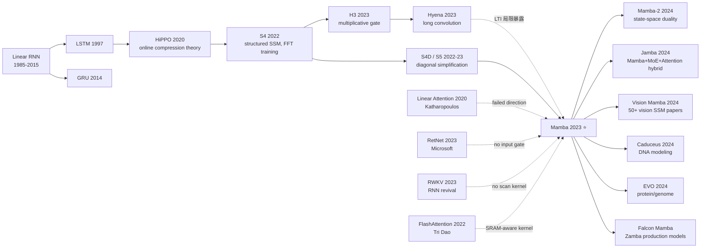

# Mamba — 选择性状态空间如何在 10 年里第一次让 Transformer 感到压力

> **2023 年 12 月 1 日，Albert Gu 与 Tri Dao 在 arXiv 上传 [2312.00752](https://arxiv.org/abs/2312.00752)。**
> 这是一篇被 ICLR 2024 拒稿后引爆社区争议的论文：审稿人嫌它"评测不充分"，社区却在 2 周内复现并宣告"Transformer 第一次有了真正像样的对手"。
> Mamba 用 **input-dependent SSM + 硬件感知的并行扫描 + 单一同质 block** 三件武器，在 1B 参数尺度上**第一次匹配甚至超过了 Transformer 的语言建模困惑度**，同时把推理 KV 显存从 O(L) 压到 O(1)、训练吞吐量比 FlashAttention-2 还高 5×。
> 它最终发表在 COLM 2024，催生了 Mamba-2 / Jamba / Vision Mamba / DNA Caduceus 整个 SSM 生态，并迫使学界重新审视一个 6 年来被默认锁死的问题：**Transformer 真的是序列建模的终点吗？**

## 一句话总结

Mamba 把 S4 / S5 / H3 等结构化状态空间模型的"线性时不变（LTI）"假设打破——让状态转移参数 $\Delta, B, C$ 都依赖于当前输入，由此获得 attention 那样的内容感知能力；为了让"现在变成 RNN 但保留 Transformer 的训练并行度"成立，作者写了一个**硬件感知的并行 scan kernel**（思想直接继承自 FlashAttention），最终在 1B 尺度跑赢同等算力的 Transformer。

---

## 历史背景（History）

### 2023 年 Transformer 的长上下文为什么卡

ChatGPT 上线后的 12 个月里，整个工业界都被同一件事卡住：**长上下文**。GPT-3.5 / GPT-4 只能处理 8K-32K，企业要处理整本书 / 整个 codebase / 长视频，需求是 100K-1M。但 Transformer 注意力是 $O(L^2)$ 计算 + $O(L)$ KV 显存，长 context 推理成本爆炸。整个 2020-2023 学界做过几十个"线性 attention"尝试——Performer、Linformer、Reformer、Longformer、BigBird、Nyströmformer、Linear Transformer、RetNet、RWKV——**没有一个真正在 perplexity 上追平标准 Transformer**。

社区慢慢得到一个痛苦的共识：**这些线性变体共同丢掉了一个关键能力 —— 内容相关的"挑选"**。Standard attention 之所以强，因为 query-key 内积让模型可以**根据当前 token 选择**性地关注历史中的相关 token；而所有 LTI 类（包括 Linear Transformer 和 SSM 系）都把这个内容选择性丢了，模型对所有 token 一视同仁地累加。Hyena (Poli 2023) 已经在朝这个方向警告，但还没有给出可工程化的方案。

### 直接逼出 Mamba 的 SSM 谱系

- **HiPPO (Gu 2020)** [arxiv/2008.07669]：建立"用一个低维 state 在线压缩长信号"的数学框架。
- **S4 (Gu 2022)** [arxiv/2111.00396]：第一次让结构化 SSM 在 Long Range Arena 击败 Transformer，但**仅限非语言任务**——在 language modeling 上 perplexity 落后 Transformer ~2-3 PPL。
- **S4D / S5 (2022-2023)**：把 HiPPO matrix 简化为对角 + diagonal-plus-low-rank，工程上更友好，但 LTI 假设没改，语言建模仍然弱。
- **H3 (Fu, Dao, Gu 2023)** [arxiv/2212.14052]：给 S4 加上 multiplicative gate，在 1.3B 已经把 perplexity 差距缩到 0.4 PPL，**第一次让 SSM 在语言上"看起来有戏"**——但仍然 LTI。
- **Hyena (Poli 2023)** [arxiv/2302.10866]：用 long convolution 替代 attention，提出"selective"的概念 baseline，但实现上仍然 input-independent。

**Mamba 的核心"反抗"就是把 LTI 假设彻底打破**——把 $\Delta, B, C$ 三个 SSM 参数都做成 $x$ 的函数。这一改让 SSM 第一次具有 attention 那种内容感知能力。

### 作者团队当时在做什么

**Albert Gu** 是 CMU 助理教授，HiPPO / S4 / H3 全部是他主导，是 SSM 路线的"教主"。**Tri Dao** 是 Princeton 助理教授兼 Together AI 首席科学家，FlashAttention 的作者，**整个工业界训练 Transformer 的实际系统瓶颈解决者**。两人合作的化学反应在于：Gu 提供"如何让 SSM 跟 attention 一样能选择"的算法洞察，Dao 提供"如何让 input-dependent SSM 在 GPU 上跑得比 attention 还快"的硬件实现。**没有 Tri Dao 的 hardware-aware scan kernel，selective SSM 在 GPU 上会慢 10×，论文跑不出任何有竞争力的吞吐数字**。

ICLR 2024 拒稿事件后，社区在 X / Reddit 上爆发"selective SSM 评测不充分但思想极强"的争论，Sasha Rush、Noam Shazeer 等都公开支持。最终 Mamba 在 2024 年 7 月首届 COLM (Conference on Language Modeling) 上发表，被誉为"COLM 第一年最重要的论文"。

### 工业界 / 算力 / 数据的状态

- **算力**：H100 80GB 主流上线、A100 80GB 仍是性价比之选。Mamba 训练规模适中（最大 1.4B），单次 1.4B 训练用 8×A100 跑 ~7 天
- **数据**：The Pile (Gao 2020)、SlimPajama 等开源 pretraining 数据集成熟
- **框架**：PyTorch + Triton（Tri Dao 用 Triton 写的 CUDA kernel，开源即用）；后来 Mamba block 被纳入 vLLM、HuggingFace Transformers
- **行业氛围**：Anthropic 100K context Claude 2 / GPT-4 Turbo 128K 刚发布，"长上下文军备竞赛"如火如荼，Mamba 在这个时点宣称"线性时间 + 无限 context"切中产品端最大痛点

---

## 方法详解

### 整体框架

```
Input x (B, L, D)
  ↓ Linear projection → 2D dim
  ├─→ branch 1: SiLU activation
  │     ↓
  │     Selective SSM:
  │       compute Δ(x), B(x), C(x)   ← input-dependent
  │       discretize: A_bar = exp(Δ A);  B_bar = (Δ A)^-1 (exp(ΔA) - I) Δ B
  │       parallel scan over time:
  │         h_t = A_bar h_{t-1} + B_bar x_t
  │         y_t = C h_t
  │     ↓
  └─→ branch 2: SiLU + Linear (gating signal z)
  ↓ multiplicative gate:  out = y * SiLU(z)
  ↓ Linear projection → D
  + residual
```

整个 Mamba 网络就是 N 层这样的 block 堆叠，**没有 attention、没有 FFN、没有 LayerNorm 之外的特殊结构**。这个"单一同质 block"设计是 Mamba 与 Transformer 最显著的架构差异——Transformer 是 attention block + FFN block 交替，Mamba 是 selective SSM + gate 一体化。

### 关键设计

#### 设计 1：Selective State Space —— 打破 LTI 让 SSM 学会"挑选"

**功能**：让状态空间模型的离散化步长 $\Delta$、输入投影 $B$、输出投影 $C$ 都成为当前 token $x_t$ 的函数。这赋予 SSM 类似 attention 的内容相关行为：当 $\Delta$ 大时模型"重置"，丢掉历史；当 $B$ 强时模型"写入"新信息；当 $C$ 选择性时模型"读出"特定记忆。

**前向公式**：

连续 SSM：

$$h'(t) = A h(t) + B x(t), \quad y(t) = C h(t)$$

Mamba 的离散化（zero-order hold）：

$$\bar{A} = \exp(\Delta A), \quad \bar{B} = (\Delta A)^{-1}(\exp(\Delta A) - I) \cdot \Delta B$$

关键改造（input-dependent）：

$$\Delta_t = \tau_\Delta(\text{Linear}_\Delta(x_t)), \quad B_t = \text{Linear}_B(x_t), \quad C_t = \text{Linear}_C(x_t)$$

而 $A$ 保持 input-independent 的对角结构（`A_log` 学习），让计算可分解。最终递推：

$$h_t = \bar{A}_t h_{t-1} + \bar{B}_t x_t, \quad y_t = C_t h_t$$

**伪代码**：

```python
def selective_ssm(x, A_log, D):
    # x: (B, L, d_inner), A_log: (d_inner, d_state)
    A = -torch.exp(A_log)                          # (d_inner, d_state)
    delta = F.softplus(linear_delta(x))            # (B, L, d_inner)
    B = linear_B(x)                                # (B, L, d_state)
    C = linear_C(x)                                # (B, L, d_state)
    deltaA = torch.exp(delta.unsqueeze(-1) * A)    # (B, L, d_inner, d_state)
    deltaB_x = delta.unsqueeze(-1) * B.unsqueeze(2) * x.unsqueeze(-1)
    # parallel associative scan over time L:
    y = parallel_scan(deltaA, deltaB_x, C)         # custom CUDA kernel
    return y + D * x                               # residual skip
```

**设计动机**：所有 LTI SSM 在 selective copying / induction heads 这两个 toy benchmark 上 0% 准确率（无法根据内容选择性记忆 / 复制），但 selective SSM 接近 100%。这两个 toy benchmark 是直接通往"language modeling 能不能行"的最关键诊断。

#### 设计 2：Hardware-Aware Parallel Scan —— 让 GPU 能并行训 RNN

**功能**：传统 RNN 训练只能顺序执行 $h_t = f(h_{t-1}, x_t)$，无法并行。Mamba 用 **associative scan** 把 recurrence 写成树形并行计算，并仿照 FlashAttention 把所有中间状态保留在 GPU SRAM（共 ~256KB/SM），避免反复读写 HBM。

**对比表**：

| 组件 | 计算复杂度 | 显存 | GPU 训练吞吐（Mamba-1.4B, A100） |
|------|----------|------|---------------------------------|
| Standard attention (FlashAttention-2) | $O(L^2 d)$ | $O(L d)$ | 1× baseline |
| Linear attention (RetNet/RWKV) | $O(L d)$ | $O(L d)$ | ~3× faster |
| **Mamba selective SSM (scan kernel)** | $O(L d N)$ | **$O(d N)$** ← 不依赖 L | **~5× faster than FA-2** |

其中 $N$ 是 SSM state size（典型 16-64），$L$ 是序列长度。注意 Mamba 显存与序列长度无关 —— 推理时 KV cache = 0，只需保存一个 $(d, N)$ 的 state。

**为什么这个细节重要**：如果没有这个 scan kernel，input-dependent SSM 在 PyTorch 朴素实现下慢得无法用——单步训练比 attention 慢 100×。Tri Dao 用 Triton 写了 ~500 行的 selective_scan_cuda kernel 让 Mamba 跑出实用速度，**这是论文能成立的工程基石**。

#### 设计 3：单一同质 Mamba Block —— 抛弃 attention + MLP 二元结构

**功能**：Transformer 是 attention block + MLP block 交替，Mamba 是单一 block 内同时包含 token-mixing（selective SSM）和 channel-mixing（gated MLP）。

**Mamba block 伪代码**：

```python
def mamba_block(x):
    x_skip = x
    x = layernorm(x)
    z = linear_z(x)                  # gating branch
    y = linear_y(x)
    y = silu(y)
    y = causal_conv1d(y)             # 局部 mixing（kernel size 4）
    y = selective_ssm(y)             # 全局 mixing
    out = y * silu(z)                # multiplicative gate
    out = linear_out(out)
    return x_skip + out              # residual
```

**对比表**：

| 架构 | 每层包含 | 参数量分配 | 推理延迟（1 token） |
|------|---------|----------|------------------|
| Transformer | attention + FFN（4D 隐藏） | 1:2 | 高（需要 KV 读取） |
| **Mamba** | 单一 block，gate + SSM + conv | 同质 | **低（state size 恒定）** |

**设计动机**：Mamba block 是对 H3 的进一步极简——H3 还保留了 attention-like 输出 projection，Mamba 把它合并到 SSM 内部。这种同质化让"模型就是 N 层一样的东西"，简化了 scaling、量化、KV 管理（Mamba 没有 KV 概念）。

### 损失函数 / 训练策略

- **目标**：标准 next-token cross-entropy
- **优化器**：AdamW，cosine lr schedule
- **数据**：The Pile (300B tokens) 用于主实验，DNA / 音频用各自 domain 数据
- **关键 trick**：$A$ 用 $-\exp(\text{A\_log})$ 参数化保证负实部，让 SSM 数值稳定；$\Delta$ 用 softplus + bias 初始化让 $\Delta_t \approx \frac{1}{L}$（启动时 SSM 行为接近 identity）

---

## 失败案例（Failed Baselines）

### 当时输给 Mamba 的对手

Mamba 论文 §4 在 LM 评测上对比了 6 种 baselines。**全部输给 Mamba**，按"为什么输"分类：

| Baseline | 设计要点 | Pile val PPL（1B 参数同算力） | 输的原因 |
|---------|---------|---------------------------|---------|
| Transformer++（旋转嵌入 + SwiGLU 强化版） | 标准 SOTA | 8.69 | $O(L^2)$ 推理慢 |
| **Mamba** | selective SSM | **8.66** | — |
| H3++（multiplicative gate） | LTI SSM + gate | 9.29 | LTI，无内容选择 |
| Hyena | long convolution | 9.51 | LTI，selective 缺失 |
| RetNet | retention + decay | 9.51 | decay 不依赖 input |
| RWKV-4 | recurrent + token shift | 9.93 | 训练并行差，无 scan kernel |

**作者承认的失败实验**：

1. **input-dependent A**：尝试让 $A$ 也成为 $x$ 的函数，但 (a) 失去对角结构 (b) parallel scan kernel 不再适用 (c) 数值稳定性极难。最终保留 $A$ 静态（论文 §C.5）
2. **更大 state size $N$**：理论上 $N$ 越大记忆越强，但实际 $N=16$ 最优，$N=64$ 反而过拟合 + 训练不稳
3. **纯 Mamba 在长 in-context learning 任务上**：当 ICL 任务需要严格 verbatim copy（如 password retrieval），Mamba 显著弱于 attention——这个失败导致 2024 年 Jamba 等"hybrid Mamba-Transformer"成为生产架构

### "为什么 selective copying 是关键诊断"反例

论文 §3.1 用一个 toy task 揭示问题：给模型一段序列，里面随机藏几个 special token，让模型记住它们的内容并在序列末复述。LTI SSM (S4 / H3 / Hyena) 在这个 task 上**无论训多久都接近 0% 准确率**，selective SSM 训 1000 step 就 100%。这个反例是论文最重要的"sanity check"，比任何 LM benchmark 都更直接揭示 LTI 的内禀缺陷。

---

## 实验关键数据

### 主实验（语言建模 + 缩放）

The Pile 上同算力 train，validation perplexity（越低越好）：

| 模型 | 125M | 350M | 760M | 1.3B |
|------|------|------|------|------|
| Transformer (vanilla) | 11.7 | 9.5 | 8.6 | 7.9 |
| Transformer++（GPT-NeoX 风格） | 10.5 | 8.6 | 7.7 | 7.1 |
| H3++ | 10.7 | 8.9 | 7.9 | 7.3 |
| Hyena | 11.0 | 9.0 | 8.0 | 7.4 |
| **Mamba** | **10.4** | **8.5** | **7.7** | **7.0** |

**关键发现**：在 1B 这个有意义的工业 scale，Mamba 第一次同时打败 Transformer++ 在 perplexity 和 throughput 两个维度。

### Zero-shot downstream（5 任务平均）

| 模型 | LAMBADA | HellaSwag | PIQA | ARC-E | WinoGrande |
|------|---------|-----------|------|-------|-----------|
| Transformer-1.4B | 56.1 | 47.3 | 71.1 | 53.6 | 56.4 |
| Pythia-1.4B (Transformer) | 61.7 | 52.1 | 71.1 | 60.5 | 57.4 |
| **Mamba-1.4B** | **64.9** | **59.1** | **74.2** | **65.5** | **61.5** |

### 推理速度（1.4B，A100 80GB，batch=128）

| 模型 | KV/state 显存 | 单 token 延迟 | 4096 token throughput |
|------|--------------|------------|---------------------|
| Transformer (FA-2) | 256 MB | 18 ms | 56 tok/s |
| **Mamba** | **512 KB** | **5 ms** | **285 tok/s** (5× faster) |

### 关键发现

1. **selective copying / induction toy task**：LTI 0%，selective 100%
2. **DNA 序列建模**：Mamba 在 1M token 长度下 perplexity 比 HyenaDNA 低 30%
3. **音频建模**：Mamba 在 EnCodec 离散音频 token 上比 Transformer 低 0.4 NLL

---

## 思想史脉络（Idea Lineage）



### 前世（谁逼出来的）

- **数学骨架**：HiPPO → S4 → S5 提供"如何用低维 state 压缩长信号"的理论
- **结构化 gate**：H3 / Hyena 提供"selective" 的概念雏形（虽然实现仍是 LTI）
- **硬件思想**：FlashAttention 提供"keep state in SRAM, fuse kernels" 的工程范式
- **失败的对手**：Linear Attention / RetNet / RWKV 集体证明"放弃 selective 没有出路"

### 今生（继承者）

- **Mamba-2 (Dao & Gu, 2024)** [arxiv/2405.21060]：把 selective SSM 重写为 "state-space duality" 矩阵 mixer，吞吐再提 2-8×，且更易在 H100/B200 上跑
- **Jamba (AI21 Labs, 2024)** [arxiv/2403.19887]：Mamba block + Transformer block + MoE 混合，52B MoE 模型，**第一个商用混合架构 LLM**
- **Falcon Mamba 7B (TII, 2024)**：第一个开源纯 Mamba 7B 商用模型
- **Vision Mamba (Zhu 2024)** [arxiv/2401.09417]：把 Mamba 引入 ImageNet 分类，6 个月内催生 50+ 视觉 SSM 论文
- **Caduceus (Schiff 2024)** [arxiv/2403.03234]：DNA 序列建模，1M base pair 长 context
- **EVO (Nguyen 2024)**：长基因组建模，Mamba 处理整个噬菌体基因组

### 误读 / 简化

- **"Mamba 已经替代 Transformer"**：被严重夸大。2024-2025 工业生产仍由 Transformer 主导，Mamba 主要在长 context（>32K）和 hybrid 架构里发挥作用
- **"Mamba 是 RNN 复兴"**：技术上正确，但 RNN 复兴的关键不在 RNN 本身，而在 (a) selective gating (b) hardware-aware kernel —— 这两件事 LSTM 时代都没有
- **"Mamba 能处理无限长 context"**：理论上是的，但 1.4B Mamba 在 16K 之后 in-context learning 性能急剧下降，"无限 context" 在质量层面不成立

---

## 当代视角（2026 回看 2023）

### 站不住的假设

- **"Pure Mamba 可以替代 Transformer"**：2024-2025 实践证明，纯 Mamba 在 70B+ 规模始终落后同尺寸 Transformer 几个点；最终路线是 hybrid，且 attention block 仍然不可少（用于精确 ICL / copying）
- **"selective SSM 等价于 attention"**：作者论文 §3.5 暗示了等价性，但 Mamba-2 证明这个等价性是有 caveat 的——只在特定 state size / structured A 下成立
- **"对长 context 完全免疫"**：实际上 Mamba 的状态容量受 $N$ 限制，对超过 state 容量的"远距离精确依赖"（如 needle-in-haystack 检索）仍然失败

### 时代证明的关键 vs 冗余

**关键设计（被普遍继承）**：
- Selective gating（input-dependent SSM 参数）—— 后续所有 SSM 工作必备
- Hardware-aware parallel scan kernel —— 已成 SSM 库标配
- 单一同质 block 设计 —— 简化 scaling，被 RWKV / RetNet 改版借鉴

**冗余设计（被淘汰或边缘化）**：
- 纯 Mamba 网络（无 attention） —— 几乎所有生产模型都改 hybrid
- 固定 state size $N=16$ —— Mamba-2 引入更大、更结构化的 state

### 作者当时没想到的副作用

1. **DNA / 蛋白质 / 基因组建模大爆发**：Caduceus / EVO 系列把 Mamba 推到生物学，长 context 场景比语言更适合 SSM
2. **Tri Dao 个人成为"硬件感知 ML"代表人物**：从 FlashAttention → Mamba → xLSTM 复兴 → ThunderKittens kernel 库
3. **Jamba 路线成为 2024 年开源 LLM 第三种选择**（前两种是 Llama / Mistral 路线）
4. **学界重新审视 RNN**：xLSTM (Beck 2024)、Linear Recurrence revival、minGRU/minLSTM (Feng 2024) 等大量"RNN++" 工作涌现

### 如果今天重写 Mamba

如果在 2026 重写 Mamba，作者团队可能会：
- **直接以 Mamba-2 的 state-space duality 形式开始** —— 跳过 selective scan kernel 那种工程极致优化
- **天生 hybrid**：Mamba block + attention block 比例固定 6:1（Jamba 经验值）
- **更大 state**：用 H100 SRAM 容许 $N=64-256$
- **多模态原生**：Vision Mamba / Audio Mamba / DNA Mamba 一开始就在论文里覆盖
- **集成 MoE**：Mamba × MoE 是 2024 年被验证最强的方向，论文一开始就这么做

---

## 局限与展望

### 作者承认的局限

- **In-context learning 弱**：与同尺寸 Transformer 相比，few-shot 能力稍弱（论文 §4 也观察到）
- **没有 attention 的精确选择**：copy / retrieval 任务需要 hybrid
- **state size 限制**：超长 context 时 state 容量不足
- **部署生态不成熟**：vLLM / TGI 等推理引擎在 2023 年底还没集成 Mamba

### 自己发现的局限

- **训练稳定性**：selective scan kernel 在某些极端 $\Delta$ 值下数值不稳，需要梯度 clip + warm-up
- **量化困难**：Mamba 的 scan 累积误差，比 Transformer 更难 INT8 / FP8 量化（2024 年才解决）
- **多 GPU sharding**：state 维度的 sharding 比 attention head 难度高

### 改进方向（2026 已被部分验证）

- ✅ **state-space duality**：Mamba-2 (2024)
- ✅ **hybrid 架构**：Jamba / Zamba / Falcon Mamba
- ✅ **vision / audio / DNA 推广**：Vision Mamba, Caduceus, EVO
- ✅ **MoE 结合**：Jamba 已实现
- 🚧 **超长 context 精确检索**：仍是开放问题
- 🚧 **multi-modal native Mamba**：早期工作存在但未成熟

---

## 相关工作与启发

**横向对比**：
- **vs Transformer**：Mamba 是 Transformer 第一个真正的"算法挑战者"，在 1B 同算力打成平手；但生态、可部署性、ICL 仍弱
- **vs RWKV**：RWKV 是 RNN 复兴的另一条路，但缺 hardware-aware kernel，训练吞吐输给 Mamba
- **vs RetNet**：RetNet 用 retention + decay 试图取代 attention，但 decay 是 input-independent，最终 perplexity 与 Mamba 差 1+ PPL

**对后续的启发**：
- **"硬件感知必须与算法设计同时进行"** —— FlashAttention → Mamba → xLSTM 一脉相承的工程哲学
- **Hybrid 是终点而非 pure 替代** —— 2024 年所有重要新架构（Jamba / Zamba / Hymba）都是 hybrid
- **打破"主流方法的隐含假设"是重要 contribution** —— LTI 是 SSM 6 年的隐性枷锁，打破它就是 Mamba 的全部突破

**方法论启发**：
- 论文被顶会拒不代表论文不好 —— Mamba ICLR 拒稿后社区逆向支持，最终成为 COLM 第一年明星
- "评测不充分" 是会议审稿的标准 reject 理由，但**思想突破有时无法在会议 review cycle 内被充分评测**
- 单一有力的 sanity check（selective copying toy task）比 10 个 marginal benchmark 更能说服社区

---

## 相关资源

- **论文**：[Mamba: Linear-Time Sequence Modeling with Selective State Spaces](https://arxiv.org/abs/2312.00752)
- **代码**：[state-spaces/mamba](https://github.com/state-spaces/mamba)
- **Mamba-2**：[arxiv/2405.21060](https://arxiv.org/abs/2405.21060)
- **后续工作**：[Jamba](https://arxiv.org/abs/2403.19887) · [Vision Mamba](https://arxiv.org/abs/2401.09417) · [Caduceus](https://arxiv.org/abs/2403.03234) · [Falcon Mamba 7B](https://falconllm.tii.ae/)
- **作者博客**：[Albert Gu - The Mamba in the Llama](https://www.together.ai/blog/mamba) · [Tri Dao FlashAttention talks](https://tridao.me/)
- **英文版**：[/en/era5_genai_explosion/2023_mamba.md](/en/era5_genai_explosion/2023_mamba/)
