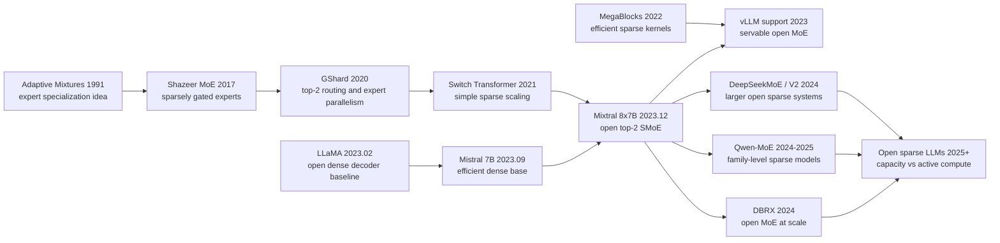

# Mixtral 8x7B — 把开源 LLM 带入稀疏专家时代

> **2023 年 12 月，Mistral AI 没有用一篇长论文预热，而是直接把 [Mixtral 8x7B](https://mistral.ai/news/mixtral-of-experts/) 权重和模型说明放到社区面前；正式论文 [arXiv:2401.04088](https://arxiv.org/abs/2401.04088) 在 2024 年 1 月补上细节。** 这篇工作的钩子很硬：它看起来有 47B 参数，但每个 token 只激活约 13B；它不是继续把开源模型做成更大的 dense LLaMA，而是把 2017 年以来一直偏工业内部的 sparse MoE 路线，第一次变成 Apache 2.0、可下载、可服务、能在榜单上正面挑战 Llama 2 70B 与 GPT-3.5 的开源默认选项。

## 一句话总结

Albert Q. Jiang、Alexandre Sablayrolles、Antoine Roux、Arthur Mensch 等 26 位作者在 2023 年底发布、2024 年 1 月写成技术报告的 Mixtral 8x7B，把 LLaMA 式 dense decoder 改成 sparse mixture-of-experts：每层不再只有一个 FFN，而是 8 个 SwiGLU experts，由 router 对每个 token 计算 $y=\sum_i \mathrm{Softmax}(\mathrm{Top2}(xW_g))_iE_i(x)$，只让 top-2 experts 参与计算。它替代的失败 baseline 是“想超过 Llama 2 70B 就必须付 70B dense active compute”：Mixtral 总参数约 47B、每 token active 约 13B，却在 MMLU 70.6、MBPP 60.7、GSM8K 74.4 等指标上对齐或超过 Llama 2 70B，并让 Instruct 版在 2023 年 12 月 LMSys Arena Elo 达到 1121，压过当时的 GPT-3.5 Turbo、Gemini Pro、Claude 2.1 与 Llama 2 70B Chat。它后来把 MoE 从 Google/GShard/Switch Transformer 这条工业内部路线带进开源 LLM 生态，连接到 DeepSeek-MoE、Qwen-MoE、DBRX 与 2025 年后的开放稀疏模型；隐藏 lesson 是：模型“容量”和“每 token 成本”可以分开扩展，但内存、路由负载和 serving kernel 会成为新的主战场。

---

## 历史背景

### 2023 年底：dense open model 的天花板

Mixtral 出现时，开源 LLM 刚经历一整年的 dense decoder 加速。2023 年 2 月 LLaMA 把 7B 到 65B 权重带到研究社区，随后 Alpaca、Vicuna、QLoRA、LLaMA 2、Mistral 7B、Zephyr、OpenChat 等模型把“开源底座 + 指令微调 + 偏好优化”跑成了标准流水线。问题也在年底变得清楚：如果下一步只是把 dense 模型从 7B、13B、34B 推到 70B，推理成本和显存占用会跟着线性上升，开源社区得到的是更好的模型，也是更难服务的模型。

Llama 2 70B 是 Mixtral 论文里最重要的标尺。它足够强，已经成为 2023 年开源聊天模型和评测表格的默认大模型 baseline；它也足够重，每个 token 都要走完整 70B active 参数。Mixtral 选择在这个标尺旁边提出一个不同问题：能不能让模型拥有接近 50B 的总容量，但每个 token 只付 13B 左右的 active compute？这不是简单压缩，而是条件计算：参数多不等于每步都用，容量与单 token 成本开始分离。

这个问题在 2023 年特别有张力，因为 Chinchilla 之后大家已经接受“算力预算要在参数量和数据量之间重新分配”，LLaMA 又证明中等规模 dense 模型在更多 token 上训练可以很强。Mixtral 则把第三个变量带回桌面：如果 active 参数固定，能否通过专家池增加容量、语言覆盖和代码/数学能力？它不是反对 dense scaling，而是在 dense scaling 的开源服务成本即将失控时，给出另一条曲线。

### Mistral AI 的位置：小团队、快发布、Apache 2.0

Mistral AI 在 2023 年的节奏很特别。9 月的 Mistral 7B 已经证明这个法国团队可以用相对小的模型打到 Llama 2 13B 附近甚至更强；12 月的 Mixtral 直接把“开源效率模型”的叙事推进到 70B 级别。更重要的是许可证：Mixtral base 和 Instruct 都以 Apache 2.0 发布，学术和商业都能用。对开源生态来说，这比单个 benchmark 更关键，因为它让企业和工具链可以放心把模型接进产品、服务和二次训练。

这篇论文的作者列表也很有信号。Albert Q. Jiang、Alexandre Sablayrolles、Antoine Roux、Arthur Mensch、Guillaume Lample、Thibaut Lavril 等 26 位作者来自 Mistral AI，其中多位与此前 LLaMA、Mistral 7B、开源模型基础设施有直接关系。Mixtral 不是学院式“提出一个新层”的论文，而是一个研究、训练、发布、serving kernel、社区集成同时推进的工业研究产物。论文里专门提到 vLLM 集成 MegaBlocks CUDA kernels、SkyPilot 部署端点，这说明 MoE 的难点不只在公式，而在能不能被普通开发者跑起来。

### 从 MoE 老思想到开源 LLM 默认选项

Mixture of Experts 本身并不新。1990 年代的 adaptive mixtures 已经有“不同专家处理不同输入区域”的想法；2017 年 Shazeer 的 sparsely-gated MoE 把它带入大规模神经网络；GShard 和 Switch Transformer 又把稀疏专家变成 Google 内部超大模型训练的核心工具。但这些系统长期给人的感觉是“很强、很大、很难复现”：路由会不平衡，专家并行需要复杂通信，serving 时显存仍要装下所有 experts，batch 太小时硬件利用率也不一定好。

Mixtral 的历史意义在于，它没有把 MoE 当作论文里的 trillion-parameter 展示，而是把一个中等规模、可下载、可商用、可由 vLLM 服务的 SMoE 放到开源社区中央。8 个 experts、top-2 routing、每层 FFN 替换为 experts，这些设计不追求最复杂；它们追求的是足够强、足够稳、足够容易进入现有 Transformer 推理栈。也正因为这样，Mixtral 成了许多后来开源 MoE 的实际参照点。

## 研究背景与动机

### 核心问题：如何把容量和每 token 成本拆开

Mixtral 的动机可以压成一句话：**让模型拥有更大的参数容量，但让每个 token 只走一小部分参数。** Dense Transformer 的 FFN 是参数大户；每层每个 token 都要经过同一套 FFN 权重。MoE 把这套 FFN 拆成多个 experts，再由 router 为不同 token 选择少数 experts。于是总参数量由 experts 数量控制，单 token 计算量由 top-k 控制。Mixtral 选择 8 个 experts、top-k=2，正是这个折中：capacity 增加，active compute 不爆炸。

这个动机背后还有两个工程条件。第一，router 必须简单到可以稳定训练和高效推理；Mixtral 使用线性门控 + Top2 + softmax，没有引入复杂控制器。第二，MoE 必须接入真实 serving。论文强调 MegaBlocks/vLLM，是因为稀疏激活如果没有 kernel 支持，只会把 FLOP 省成调度开销。Mixtral 的研究问题因此不是“MoE 是否理论上更省”，而是“MoE 能否在开放权重、开放工具链、常见 benchmark 和人类偏好评测上一起成立”。

### 为什么不是直接发布更大的 dense 模型

直接训练一个更大的 dense 模型当然也可能有效，但它会把开源生态推向更少人能用的方向。70B dense 模型的推理成本、KV cache、部署副本和延迟都会压在使用者身上；如果模型还要服务多语、代码、数学和聊天任务，成本会进一步放大。Mixtral 的路线承认：总参数量仍然要进入显存，不能假装免费；但在每 token 计算上，它给出了更低 active 参数的路径。

这也是 Mixtral 与量化、蒸馏、LoRA 的差别。量化降低每个参数的存储成本，蒸馏把能力压进更小 dense 模型，LoRA 让微调更便宜；Mixtral 改的是基础模型的计算拓扑。它让“哪个参数参与当前 token”变成模型内部的动态决定。对后来的 DeepSeek、Qwen-MoE、DBRX 和更大开放 sparse 模型来说，这个决定比单个 Mixtral 分数更重要：开源模型不必永远沿着 dense 参数量一条线爬坡。

---

## 方法详解

Mixtral 的方法可以理解为一次很克制的 Transformer 改造：attention、decoder-only 框架、hidden size、head 设计大体沿用 Mistral 7B 的高效路线，真正被替换的是每层的 feed-forward network。原来所有 token 经过同一套 FFN；Mixtral 把 FFN 拆成 8 套 SwiGLU experts，再让 router 为每个 token 选 2 套。这样，模型的“知识容量”接近 47B 参数，但当前 token 的“计算路径”只需要约 13B active 参数。

### 整体框架

Mixtral 是 decoder-only sparse mixture-of-experts。每一层先走 attention，再进入 MoE FFN；MoE 层内部有一个 gating network，它对当前 token hidden state $x$ 产生 8 个 expert logits，保留 top-2，做 softmax，然后把两个 expert 的输出加权相加。这个设计非常接近 GShard 的 top-2 路由，但 Mixtral 把所有 FFN sub-block 都替换为 MoE，而不是隔层替换。

| 参数 | Mixtral 8x7B 设置 | 直觉 | 对成本的影响 |
|---|---:|---|---|
| `dim` | 4096 | 与 Mistral 7B 同量级 hidden size | 保持 dense base 的表示宽度 |
| `n_layers` | 32 | 32 层 decoder | 深度不靠 MoE 膨胀 |
| `n_heads` | 32 | attention 仍是共享 dense 部分 | attention compute 不稀疏 |
| `n_kv_heads` | 8 | grouped-query attention | 降低 KV cache 与解码成本 |
| `hidden_dim` | 14336 | SwiGLU expert 的内部宽度 | FFN 是专家池主体 |
| `context_len` | 32768 | 32K dense context | 长上下文不靠滑窗近似 |
| `num_experts` | 8 | 每层 8 个 FFN experts | 增加总容量 |
| `top_k_experts` | 2 | 每 token 激活两个 experts | 控制 active compute |

这里最容易误解的一点是：MoE 并不让显存只付 13B。serving 时全部 experts 仍要在显存或分布式设备中可用，内存更接近 sparse parameter count。MoE 真正省的是每个 token 的 FFN 计算量；它用更复杂的路由与 kernel 调度，换取更高容量下的 active compute 控制。

### 关键设计 1：Top-2 Router

Mixtral router 是一个线性门控层。给定 token hidden state $x$，router 计算 $xW_g$ 得到 8 个 expert logits，只保留 top-2，其余位置设为 $-\infty$，再做 softmax。论文里的通用 MoE 形式是：

$$
\mathrm{MoE}(x)=\sum_{i=0}^{n-1}G(x)_i\cdot E_i(x).
$$

Mixtral 使用的具体形式是：

$$
G(x)=\mathrm{Softmax}(\mathrm{Top2}(xW_g)),\qquad y=\sum_{i=0}^{7}G(x)_i\cdot \mathrm{SwiGLU}_i(x).
$$

Top-2 比 top-1 贵一点，但给了两个好处。第一，两个 experts 的加权输出能缓和路由边界处的硬切换，训练更稳；第二，第二个 expert 给模型提供了一点组合能力，不至于把每个 token 都压进单一专家。它不像完全 dense FFN 那样每次用完所有参数，也不像 top-1 那样把路由做得过硬。

### 关键设计 2：每层 FFN 替换为 8 个 SwiGLU experts

Mixtral 的 expert 不是新的复杂模块，而是标准 Transformer FFN 位置上的 SwiGLU block。每个 expert 各有自己的 FFN 参数；attention、layer norm、embedding、router 等部分仍共享。这个选择保留了 Mistral 7B 的工程成熟度：模型主体仍像熟悉的 decoder，只是 FFN 路径从“一条大路”变成“8 条候选路”。

这种替换也解释了为什么 MoE 常常优先作用在 FFN 而不是 attention。FFN 参数量大、每 token 独立、无需跨 token 通信，很适合条件计算；attention 需要序列内交互，如果把 attention 也做专家化，路由和 KV cache 会复杂得多。Mixtral 的克制就在这里：它只稀疏化最值得稀疏化的部分。

```python
def mixtral_moe_layer(hidden_state, router_weight, experts, top_k=2):
    # hidden_state: [tokens, dim], experts: 8 independent SwiGLU FFNs
    logits = hidden_state @ router_weight
    chosen = topk_indices(logits, k=top_k)
    masked_logits = fill_with_neg_inf_except(logits, chosen)
    gate = softmax(masked_logits, axis=-1)

    output = zeros_like(hidden_state)
    for expert_id, expert in enumerate(experts):
        token_mask = gate[:, expert_id] > 0
        if any(token_mask):
            expert_out = expert(hidden_state[token_mask])
            output[token_mask] += gate[token_mask, expert_id, None] * expert_out
    return output
```

### 关键设计 3：47B 总参数与 13B active 参数

Mixtral 的传播标题常写成“8x7B”，但论文更精确的说法是：总参数约 47B，每 token active 参数约 13B。这里的差异来自共享部分和专家部分：8 个 experts 增加的是总容量；但每次只选 2 个 experts，所以 active compute 远小于总参数。论文用一句话总结了这个效果：每个 token 可以访问 47B 参数，但推理时只使用 13B active 参数。

$$
\text{active params} \approx \text{shared params} + \frac{k}{n}\cdot \text{expert params},\qquad k=2,\; n=8.
$$

这个公式只是直觉近似，不是精确参数账；真实模型还包含 attention、embedding、router 和所有层的共享结构。但它解释了 Mixtral 的核心经济学：总容量随 experts 增加，单 token 计算随 top-k 增加。只要 kernel 和 batch 能把路由开销吃掉，MoE 就能在同等 active compute 下提供更强模型。

### 关键设计 4：32K dense context 和多语预训练

Mixtral 并不只是在 Mistral 7B 上加专家。论文强调它用 32K token context 预训练，而且是 fully dense context：长上下文任务不是通过只看局部窗口来近似。实验中的 passkey retrieval 显示，模型能在 32K 窗口内从不同位置找回信息。对 2023 年底的开源模型来说，32K context 加上强代码、数学、多语能力，是它成为实用底座的重要原因。

多语预训练同样重要。论文说相比 Mistral 7B，Mixtral 显著提高了多语数据占比，并在法语、德语、西班牙语、意大利语上明显超过 Llama 2 70B。MoE 的额外容量在这里有自然解释：专家不一定按“语言”硬分工，但更大的条件容量给不同语法、词形和代码模式留下了空间。路由分析也提醒我们别过度拟人化 experts：论文没有观察到“某个 expert 专门负责生物或哲学”的清晰图案，更多是语法和位置局部性。

| 关键设计 | 解决的问题 | 代价 | 对后续生态的影响 |
|---|---|---|---|
| Top-2 router | 每 token 只激活少数 experts | 路由和负载均衡开销 | MoE 成为可服务的开放模型设计 |
| 8 个 SwiGLU experts | 增加 FFN 容量 | 所有 experts 仍占显存 | sparse 参数与 active 参数分离 |
| GQA + 32K context | 降低解码 KV 成本并支持长上下文 | attention 部分仍是 dense | 实用聊天、代码、检索上下文更强 |
| MegaBlocks/vLLM 集成 | 稀疏 FFN 高效执行 | 依赖专门 kernel | 开源 MoE 从论文走向 API serving |

---

## 失败案例

Mixtral 的贡献要从几个“看似自然但不够完整”的路线里看。2023 年并不缺强模型：Llama 2 70B 是强 dense baseline，Mistral 7B 已经很高效，Switch/GShard 证明 MoE 可以扩展，量化可以降低存储，vLLM 正在让开源服务变得现实。但这些路线各自缺一块：要么 active compute 太贵，要么 MoE 不够开源可复现，要么服务栈跟不上。Mixtral 的价值在于把 sparse MoE、开放权重、Apache 2.0 和真实 serving 需求放到同一个发布里。

### Baseline 1：继续扩大 dense open LLM

最直接的 baseline 是训练更大的 dense LLaMA-like 模型。这个方向质量可靠，工程简单，评测也容易解释：参数更多、数据更多，模型更强。但 dense 模型的每 token 成本会随参数量一起增长。Llama 2 70B 每次解码都要付 70B active 参数的计算账；如果开源生态的下一步永远是 dense 100B、dense 200B，那么模型会越来越像只能少数机构部署的基础设施。

Mixtral 没有否定 dense 模型，而是指出另一个 Pareto 点。它用约 13B active 参数在 MMLU、代码、数学、多语等任务上接近或超过 Llama 2 70B，这意味着“总容量”和“每 token active compute”不必绑定。这个失败 baseline 被替代的不是质量，而是成本结构。

### Baseline 2：只做小而强的 dense 模型

Mistral 7B 自身就是很强的 baseline。它说明训练配方、数据质量、GQA、滑窗/长上下文工程可以让 7B 级模型非常能打。但 7B dense 的容量毕竟有限，尤其在多语、代码、数学和更复杂指令上，单纯把 7B 打磨到极致会遇到上限。Mixtral 从 Mistral 7B 继承高效 decoder 结构，再把 FFN 容量扩成专家池，相当于承认“小 dense”是好底座，但不是最终形态。

这个 baseline 的失败是温和的：不是 Mistral 7B 不行，而是它解决的是效率，不是大容量。Mixtral 给出的方案是把效率底座保留下来，只在 FFN 里注入稀疏容量。

### Baseline 3：Google 式大规模 MoE 但不可下载

GShard、Switch Transformer、Pathways 风格系统早就证明 MoE 可以扩到巨大规模，但它们长期不等于开源社区可用模型。论文、内部基础设施、TPU 集群、复杂 expert parallelism 和未开放权重之间有很大距离。一个不可下载、不可商用、不可由 vLLM endpoint 跑起来的 MoE，对开源 LLM 社区更像远方示范，而不是日常工具。

Mixtral 的关键不是第一个 MoE，而是第一个被广泛当作“开源默认强模型”的 MoE。它把 MoE 的思想从工业系统文献移到 Hugging Face、vLLM、SkyPilot 和普通部署脚本里。这就是为什么它影响的是生态，而不只是架构论文列表。

### Baseline 4：只关注参数量宣传

“8x7B”这个名字容易制造误会：读者可能以为模型成本等于 7B，也可能以为能力应按 56B dense 模型理解。两者都不准确。Mixtral 的 serving memory 接近 47B total parameters，因为所有 experts 都要可用；active compute 接近 13B，因为每个 token 只走两个 experts。只讲一个数字都会误导工程判断。

论文的优点是把这个账说清楚：13B active 参数解释了速度和成本优势，47B sparse 参数解释了显存和部署要求。后来的开源 MoE 如果忽略这点，就会在实际服务中遇到“FLOP 省了但显存没省”“小 batch 不快”“专家负载不均衡”的问题。

| 失败路线 | 为什么当时自然 | 卡住的位置 | Mixtral 的处理 |
|---|---|---|---|
| 更大 dense LLM | 质量路径最稳 | 每 token active compute 线性上升 | 用 top-2 experts 控制 active 参数 |
| 小而强 dense 模型 | Mistral 7B 已证明有效 | 容量上限明显 | 保留底座，扩展 FFN 专家池 |
| 闭源/内部 MoE | GShard/Switch 已有成功经验 | 社区无法下载和服务 | Apache 2.0 开放权重 + vLLM 集成 |
| 只做 inference trick | 量化和 kernel 很热门 | 不改变模型容量拓扑 | 从架构层引入条件计算 |
| 只讲 8x7B 名字 | 传播简单 | 成本认知混乱 | 区分 47B total 与 13B active |

## 实验关键数据

### 与 Llama 2 70B 的直接比较

Mixtral 论文把所有 Llama baseline 用同一套 evaluation pipeline 重跑，这是实验部分的一个重要细节。表格显示，Mixtral 8x7B 只有 13B active 参数，却在大多数 benchmark 上达到或超过 Llama 2 70B。尤其是代码与数学：HumanEval 40.2 对 29.3，MBPP 60.7 对 49.8，MATH 28.4 对 13.8，GSM8K 74.4 对 69.6。MMLU 上 Mixtral 70.6 略高于 Llama 2 70B 的 69.9。

| 指标 | Llama 2 70B | Mixtral 8x7B | 读法 |
|---|---:|---:|---|
| Active parameters | 70B | 13B | Mixtral active compute 约为五分之一 |
| MMLU | 69.9% | 70.6% | 常识/学科综合略高 |
| HumanEval | 29.3% | 40.2% | 代码生成明显更强 |
| MBPP | 49.8% | 60.7% | Python 小题优势大 |
| MATH | 13.8% | 28.4% | 数学提升最醒目 |
| GSM8K | 69.6% | 74.4% | 小学数学推理更稳 |

### 与 GPT-3.5 的比较和聊天模型

论文还把 Mixtral 8x7B 与 GPT-3.5、Llama 2 70B 放到同一张表里。Mixtral 在 MMLU 70.6 高于 GPT-3.5 的 70.0；MBPP 60.7 高于 GPT-3.5 的 52.2；GSM8K 58.4 略高于 GPT-3.5 的 57.1。MT-Bench 上 Instruct 版为 8.30，几乎等于 GPT-3.5 Turbo 1106 的 8.32，并高于 Llama 2 70B Chat 的 6.86。

更有传播力的是 LMSys Arena：2023 年 12 月 22 日截图里，Mixtral 8x7B Instruct v0.1 Elo 为 1121，高于 Claude 2.1 的 1117、GPT-3.5 Turbo 最好版本 1117、Gemini Pro 1111 和 Llama 2 70B Chat 1077。这不是说 Mixtral 全面超过闭源前沿模型，而是说明一个 Apache 2.0 开源 MoE 已经能在真实聊天偏好榜上进入当时的强模型区间。

| 对比项 | Llama 2 70B / Chat | GPT-3.5 / Turbo | Mixtral 8x7B / Instruct |
|---|---:|---:|---:|
| MMLU | 69.9% | 70.0% | 70.6% |
| MBPP | 49.8% | 52.2% | 60.7% |
| GSM8K | 53.6% | 57.1% | 58.4% |
| MT-Bench | 6.86 | 8.32 | 8.30 |
| Arena Elo | 1077 | 1117 | 1121 |
| License / access | open weights | API | Apache 2.0 open weights |

### 多语、长上下文与路由分析

Mixtral 的多语结果很关键，因为 MoE 容量如果只提升英文 benchmark，历史意义会小很多。论文报告在法语、德语、西班牙语、意大利语的 ARC Challenge、HellaSwag、MMLU 上，Mixtral 全部超过 Llama 2 70B。例如法语 MMLU 70.9 对 64.3，德语 MMLU 71.5 对 64.2，西班牙语 MMLU 72.5 对 66.0，意大利语 MMLU 70.9 对 65.1。

| 语言 | Llama 2 70B MMLU | Mixtral 8x7B MMLU | 差异 |
|---|---:|---:|---:|
| French | 64.3% | 70.9% | +6.6 |
| German | 64.2% | 71.5% | +7.3 |
| Spanish | 66.0% | 72.5% | +6.5 |
| Italian | 65.1% | 70.9% | +5.8 |

长上下文方面，论文用 passkey retrieval 检查 32K context 中不同位置的信息找回，结果显示模型能在不同长度和位置上稳定检索。路由分析则给了一个反直觉结论：experts 没有明显按“数学、哲学、生物”等主题分工，更多呈现语法、token 类型和位置局部性，比如 Python 的 `self`、缩进 token、英文中的 Question 等会重复路由到相近 experts。这提醒我们：MoE 的专家不一定是人类可命名的学科专家，它们可能首先是计算图中的高效条件子空间。

---

## 思想史脉络

### 前世：MoE 从专家模型到条件计算

Mixtral 的前世不只是一篇论文，而是一条反复出现的思想线：神经网络不必对每个输入都调用同一组参数。1990 年代的 mixture model 把“专家”理解成处理不同输入区域的子模型；2017 年 Shazeer 的 sparsely-gated MoE 把这个想法放进神经网络层，让 gating network 对输入选择少数 experts；GShard 和 Switch Transformer 进一步证明，只要有足够好的并行系统和路由策略，条件计算可以把模型总参数推到 dense 模型难以承受的规模。

这条线的问题一直是工程摩擦。MoE 的数学形式很简单，真正难的是专家负载、跨设备通信、稀疏 kernel、训练稳定性和 serving 批处理。早期 MoE 在论文里很迷人，在普通开发者手上很难用。Mixtral 的前史因此不是“MoE 突然被发明”，而是“MoE 等到了开源 LLM 生态、vLLM、MegaBlocks、GPU serving 和社区评测同时成熟”。

### 今生：开源 LLM 从 dense 默认走向 sparse 选项

Mixtral 把 MoE 带入开源 LLM 的方式非常实际。它没有宣称每个 expert 都学会某门学科，也没有把模型做成难以下载的巨大系统；它选择 8 个 experts、top-2、32 层、GQA、32K context，把能力放在一个可以服务、可以微调、可以商用的权重发布里。它让社区第一次认真对待一个问题：开源强模型是否必须是 dense？

下面这张图用英文节点保持中英两版字符级一致，标出 Mixtral 在 MoE 与开源 LLM 思想史中的位置。



### 后人误读：experts 不是人类可读的部门

Mixtral 后最常见的误读，是把 experts 想象成“数学专家”“代码专家”“法语专家”。论文自己的 routing analysis 并不支持这种拟人化说法。它检查 The Pile 不同子域，发现专家分配在 arXiv、PubMed、PhilPapers 等主题间没有非常清晰的分工；更明显的是语法、token 类型和位置局部性，例如代码缩进、Python 的 `self`、英文 question pattern 会表现出相似路由。

这不是 MoE 失败，反而是一个健康提醒。神经网络里的 expert 是条件计算子空间，不一定对应人类命名的任务模块。它可能捕捉语法模式、tokenization 形状、层位置需求、训练分布频率，也可能在不同层承担不同功能。把它说成“模型内部有八个小专家各管一科”很容易传播，但会误导解释和调试。

### 留给后人的东西

Mixtral 留给后人的不是单一架构细节，而是一组工程默认。第一，开源 LLM 可以把 sparse activation 作为主线，而不只是 dense + 量化 + LoRA。第二，benchmark 传播必须同时报告 total parameters、active parameters、memory cost 和 serving 条件。第三，MoE 不是纯模型论文，必须和 kernel、batching、expert parallelism、路由负载一起设计。第四，许可证和可服务性会放大架构影响力；Apache 2.0 与 vLLM 支持让 Mixtral 比许多更早 MoE 更接近社区日常。

| 思想节点 | Mixtral 之前 | Mixtral 的变异 | 后续结果 |
|---|---|---|---|
| MoE scaling | 大多在内部超大系统 | 中等规模开放权重 MoE | 开源 sparse LLM 开始主流化 |
| Dense open LLM | LLaMA-like 是默认结构 | FFN 变成专家池 | DeepSeek/Qwen/DBRX 继续扩展 |
| Serving stack | MoE 需要复杂系统 | vLLM + MegaBlocks 进入发布叙事 | kernel 成为模型能力的一部分 |
| Evaluation | 只看总参数或榜单 | 同时看 active 参数和质量 | 成本-质量曲线成为核心指标 |
| Interpretability | 想象学科专家 | 观察到语法和局部性 | experts 更像条件子空间 |

---

## 当代视角

### 2023 年看：Mixtral 把开源 MoE 从可能性变成产品事实

站在 2023 年 12 月看，Mixtral 最重要的意义是“这东西真的能公开发、能商用、能在榜单上打”。在它之前，MoE 对许多开源开发者而言仍像内部系统技术：GShard、Switch Transformer 很有名，但权重、训练栈、服务栈都不在手边。Mixtral 把这个心理门槛打掉了。它让大家看到，一个开放权重模型可以在 13B active 参数下挑战 70B dense baseline，而且不是 toy demo，而是 base、instruct、license、vLLM integration 一起出现。

这也改变了开源模型讨论的语言。过去大家问“你的模型几 B？”Mixtral 之后必须继续问：“total parameters 是多少？active parameters 是多少？serving memory 是多少？batch size 多大时 MoE 才划算？专家是否均衡？”这些问题让模型比较从单一参数量，转向成本-质量曲线。

### 2024-2026 年看：Mixtral 不是最大 MoE，但定义了开放稀疏模型的入口

从今天看，Mixtral 8x7B 已经不是最强 MoE。DeepSeek-V2/V3、Qwen-MoE、DBRX、Mixtral 8x22B、GPT-OSS 风格开放稀疏模型都在更大专家池、更细粒度路由、更长上下文、更强训练数据和更完善服务系统上继续推进。Mixtral 的具体规模很快被超过，这是基础模型领域的常态。

但它的入口意义没有消失。很多后续 MoE 论文和模型卡默认读者已经理解 total vs active、top-k routing、expert parallelism、routing imbalance、kernel dependency 这些概念。Mixtral 正好承担了教育社区的角色：它不是 MoE 的起点，却是开源 LLM 社区第一次大规模学习 MoE 工程词汇的节点。

### 哪些假设后来站不住

第一个站不住的假设是“MoE 总是更快”。MoE 的 FLOP 账很好看，但真实延迟受 batch size、专家负载、内存带宽、all-to-all 通信、kernel fusion 影响。小 batch 低延迟服务里，路由和内存访问可能吃掉节省；大 batch 吞吐服务里，MoE 才更容易发挥 active compute 优势。

第二个站不住的假设是“experts 会自然学成人类学科”。路由分析和后续工作都显示，专家分工常常更像语法、token 形状、频率和层位置的函数。解释 MoE 时必须小心，不要把工程路由过度拟人化。

第三个站不住的假设是“开源 MoE 只要权重开放就够”。后续经验说明，MoE 的可用性高度依赖推理框架、量化支持、expert parallelism、调度策略、KV cache 管理和部署文档。开放权重只是入场券，开放服务栈才决定它能不能成为默认模型。

| 当年假设 | 后来发生了什么 | 今天的判断 |
|---|---|---|
| MoE 一定更快 | 小 batch 延迟常被调度/内存开销限制 | 吞吐场景更占优，低延迟要细调 |
| experts 对应学科模块 | 路由更常体现语法和局部性 | 不要拟人化解释 experts |
| 13B active 等于 13B 部署成本 | 所有 experts 仍要占显存 | active compute 与 serving memory 分开报 |
| 开放权重足够 | 框架和 kernel 决定可用性 | vLLM/TensorRT-LLM 等支持同样关键 |

## 局限与展望

### 内存仍按总参数付账

Mixtral 最大的工程局限是内存。每个 token 只走两个 experts，但服务端仍需要让全部 experts 可访问；单机部署时要装下 47B 参数，分布式部署时要处理 expert parallelism。对研究者来说，active 参数是性能-成本故事；对工程师来说，sparse 参数才是显存、加载时间、checkpoint 存储和副本成本故事。

未来 MoE 系统需要更系统地处理 expert offloading、专家缓存、分层 MoE、权重量化和服务调度。只要显存仍然跟 total parameters 绑定，MoE 就不是“免费大模型”，而是“用更多系统复杂度换更好的吞吐-质量曲线”。

### 负载均衡与路由稳定性

MoE 的第二个局限是路由。router 既要选对 experts，又要让专家负载尽量均衡；否则某些专家过热，某些专家闲置，分布式系统里还会出现通信瓶颈。Mixtral 论文没有把负载均衡作为主要创新点，但后续更大 MoE 必须面对这个问题。专家越多、模型越大、服务 batch 越复杂，负载均衡越接近系统瓶颈。

后续方向包括更细粒度专家、共享专家、路由正则、token dropping 改进、专家并行调度、动态容量和更强 kernel。真正成熟的 MoE 不只是“top-k routing”，而是训练稳定性和 serving 稳定性的共同设计。

### 评测仍难覆盖真实使用

Mixtral 在 MMLU、代码、数学、多语、MT-Bench、Arena Elo 上表现很强，但这些指标仍不能覆盖真实部署。企业使用会关心延迟分布、长上下文稳定性、函数调用、RAG、拒答行为、版权/隐私、安全策略和多轮一致性。MoE 还会引入额外变量：不同 batch、不同语言、不同 prompt 类型可能触发不同专家负载，导致延迟波动。

未来评测需要把模型质量与系统指标放在一起：每秒 token、P50/P95 延迟、显存占用、batch size、上下文长度、专家负载方差、量化后质量变化。Mixtral 已经打开了成本-质量比较，但后续需要更可复现的系统 benchmark。

## 相关工作与启发

### 对研究者的启发

Mixtral 的第一条启发是：老思想会在生态条件成熟时重新变成新范式。MoE 不是 2023 年的新发明，但开放权重、强 dense base、serving kernel、社区评测和商业许可证在同一年相遇，使它突然成为开源 LLM 的主线选项。研究者不应只问“这个 idea 是否新”，还要问“现在的工具链是否终于能让它发挥作用”。

第二条启发是：模型论文越来越像系统论文。Mixtral 的架构公式很短，但论文必须讨论 vLLM、MegaBlocks、batch、active parameters、sparse parameters、LMSys Arena 和 bias benchmark。基础模型的影响力来自模型、数据、训练、服务、许可证和社区传播的合力。

### 对工程系统的启发

从工程角度，Mixtral 教会社区不要只看 FLOP。MoE 的 FLOP 少不等于延迟低，active 参数少不等于显存小，benchmark 强不等于服务稳。一个真实系统要同时设计路由、kernel、quantization、batching、专家并行和 fallback 策略。对做推理框架的人来说，Mixtral 是开源 MoE 需求的压力测试；对做应用的人来说，它提醒你把模型选择写成成本曲线，而不是单点排名。

这也是为什么 Mixtral 的后续影响不只在 Mistral 模型族。DeepSeek、Qwen、Databricks、开源 serving 框架、云部署工具都在回答同一组问题：如何让 sparse activation 的收益大于系统复杂度？这个问题会继续陪伴更大规模的开放模型。

## 相关资源

| 类型 | 资源 | 链接 | 说明 |
|---|---|---|---|
| 论文 | Mixtral of Experts | https://arxiv.org/abs/2401.04088 | Mixtral 8x7B 技术报告 |
| 发布页 | Mistral AI Mixtral of Experts | https://mistral.ai/news/mixtral-of-experts/ | 官方发布、模型说明与链接 |
| 代码 | mistralai/mistral-src | https://github.com/mistralai/mistral-src | 官方推理与模型代码入口 |
| 模型 | Mixtral 8x7B Instruct | https://huggingface.co/mistralai/Mixtral-8x7B-Instruct-v0.1 | Hugging Face 权重与使用说明 |
| 前序 | GShard | https://arxiv.org/abs/2006.16668 | top-2 routing 与专家并行前史 |
| 前序 | Switch Transformer | https://arxiv.org/abs/2101.03961 | 简化 MoE scaling 的关键论文 |

如果只记住一个结论：Mixtral 的历史价值不是“8x7B 这个名字很聪明”，而是它让开源 LLM 社区真正开始用 active parameters、sparse parameters、routing 和 serving kernel 来思考模型能力。dense scaling 之后，开源模型终于有了一条可信的稀疏激活路线。


---

> 🌐 [English version](/en/era5_genai_explosion/2023_mixtral/) · 📚 awesome-papers project · CC-BY-NC