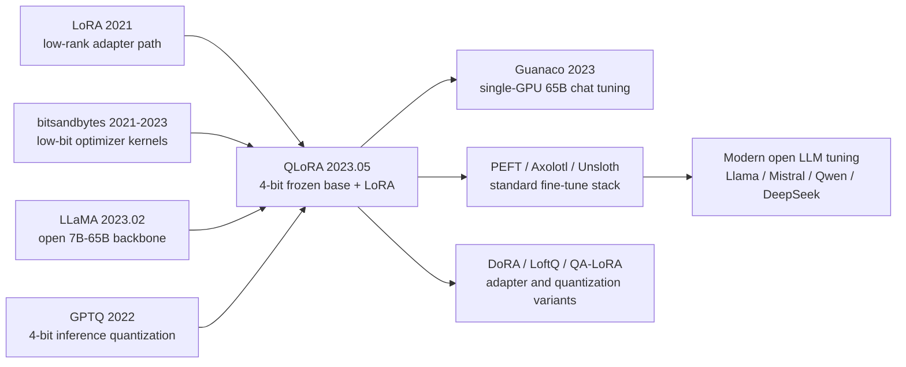

# QLoRA — 让 65B 大模型微调落到单张 48GB GPU 上

> **2023 年 5 月 23 日，Tim Dettmers、Artidoro Pagnoni、Ari Holtzman、Luke Zettlemoyer 四位作者把 [arXiv:2305.14314](https://arxiv.org/abs/2305.14314) 上传到网上，给 LLaMA 生态补上了最缺的一块工具：不是再训练一个更大的模型，而是把 65B 模型的指令微调塞进单张 48GB GPU。** QLoRA 的反直觉之处在于，它承认主干权重可以用 4-bit 冻住，只让 LoRA 小旁路学习；Guanaco-65B 只用 24 小时单卡微调，就在 Vicuna benchmark 上达到 ChatGPT 99.3% 的水平。这篇论文真正打开的不是某个 benchmark，而是 2023 年后“个人、实验室、小公司也能微调大模型”的闸门。

## 一句话总结

Dettmers、Pagnoni、Holtzman、Zettlemoyer 四位作者 2023 年发表在 NeurIPS Oral 的 QLoRA，把 [LoRA (2021)](../era4_foundation_models/2021_lora.md) 的低秩旁路和 LLaMA (2023) 的开源底座接到 4-bit 量化训练上：冻结的主干权重以 NF4 存储，前向时临时反量化，梯度只更新 $Y=X\,\mathrm{dequant}_{NF4}(W_q)+\frac{\alpha}{r}XBA$ 里的 LoRA 矩阵。它替代的是“65B 微调必须多卡 full fine-tuning 或至少 fp16 LoRA”的默认做法：fp16 65B 权重本身就约 130GB，Adam 全参微调会冲到数百 GB，而 QLoRA 通过 NF4、double quantization 和 paged optimizers 把 Guanaco-65B 压到单张 48GB GPU，24 小时训练后在 Vicuna benchmark 上达到 ChatGPT 99.3%。它后来成为 Hugging Face PEFT、Axolotl、Unsloth、各种 LLaMA/Mistral/Qwen/DeepSeek 微调配方的共同祖先；隐藏 lesson 是：大模型民主化不只靠开源权重，也靠把训练态、存储态、优化器峰值这三笔显存账分别算清。

---

## 历史背景

### 2023 年春天的显存墙

QLoRA 出现的窗口非常窄：2023 年 2 月 LLaMA 发布，3 月权重泄露，3 月中旬 Stanford Alpaca 用 52K 条 self-instruct 数据证明“开源底座 + 指令微调”能快速长出聊天能力，4 月 Vicuna 把这个路线推到社区中心。问题是，真正好用的底座不是 7B，而是 33B、65B；真正让模型像助手的是微调，不是下载权重。于是社区立刻撞上显存墙：一张消费卡可以加载 7B，可以勉强跑 13B，却完全无法训练 65B。

这堵墙不是算力墙，而是状态墙。全参 Adam 微调要保存 fp16 权重、梯度、fp32 optimizer moments 和 master weights，65B 模型会很快超过数百 GB；普通 LoRA 虽然只训练小矩阵，但 frozen backbone 仍以 fp16/bf16 常驻，65B 权重本身就约 130GB，还没有算激活和临时 buffer。换句话说，LoRA 解决了“要更新多少参数”，没有解决“被冻结的巨大参数如何放进显存”。

这也是 QLoRA 的历史定位：它不是发明一个新 adapter，而是把 adapter 路线最后一块显存账补齐。LLaMA 把大模型权重带给社区，LoRA 把可训练参数降到几千万级，QLoRA 把不可训练的大块权重也压到单卡可承受范围。三件事连在一起，才形成 2023 年开源 LLM 微调潮的完整闭环。

### 直接前序：LoRA、低比特量化、bitsandbytes

QLoRA 站在三条前序线上。第一条是 [LoRA](../era4_foundation_models/2021_lora.md)：冻结原始权重 $W_0$，只学习低秩增量 $BA$，训练态小、推理态可合并。LoRA 的限制也很清楚：它默认 $W_0$ 仍用 16-bit 存储，适合“训练参数少”，不等于“模型本体小”。

第二条是低比特量化。LLM.int8()、GPTQ、AWQ 等方法证明大模型权重可以用 8-bit、4-bit 存储并保持不错的推理质量，但大多数工作把量化当成 inference trick：权重被压缩是为了部署，不是为了反向传播。训练时最怕的不是输出能不能算，而是梯度、激活、临时反量化 buffer 是否会爆峰值。QLoRA 把问题改写成：能否让主干始终 frozen + 4-bit，只让梯度穿过反量化操作流向 LoRA？

第三条是 bitsandbytes。Tim Dettmers 在 8-bit optimizer、LLM.int8()、CUDA low-bit kernel 上已有多年积累；这使 QLoRA 不是一个纸面算法，而是一套能被 Hugging Face `transformers` 和 PEFT 调起来的工程路径。论文发布后不久，`load_in_4bit=True`、`bnb_4bit_quant_type='nf4'`、`bnb_4bit_use_double_quant=True` 变成微调脚本里的常见三行配置，这种 API 化速度是它影响力的一部分。

### 四位作者与 UW NLP 的位置

这篇论文的四位作者都在 University of Washington 语境里工作，但分工气质很不同。Dettmers 的长项是低精度训练和 bitsandbytes 工程；Pagnoni 参与把训练 recipe、数据和评测流水线整理成可复现代码；Holtzman 长期研究开放式生成、退化文本和评测错觉；Zettlemoyer 的 UW NLP 组则在 semantic parsing、retrieval、language model tooling 上积累很深。QLoRA 最有趣之处正来自这种组合：它既是一篇系统论文，也是一篇评测论文，还是一篇开源工具论文。

如果只看标题，QLoRA 像“把 LoRA 量化一下”。但作者团队真正做的是压力测试：他们不满足于在一个模型、一个数据集上报告 memory saving，而是 fine-tune 了 1000 多个模型，横跨 LLaMA 与 T5、7B 到 65B、8 个 instruction datasets，并用 Vicuna、MMLU、人类偏好、GPT-4 评价去交叉验证。这个规模让论文能回答一个更实用的问题：当社区真的开始批量训练聊天模型时，哪些变量重要，哪些变量只是噪声？

## 研究背景与动机

### 核心问题：能否只付 LoRA 的训练账，却不付 fp16 主干账

QLoRA 的动机可以压成一句话：**我们想保留 LoRA 的训练行为，同时摆脱 LoRA 对 16-bit 主干存储的依赖。** 这个目标有三个约束。第一，4-bit 表示必须足够贴近预训练权重的分布，否则 LoRA 只是在补量化误差，真正任务学习空间会被浪费。第二，反向传播必须穿过量化权重的反量化计算，但不能更新量化权重本身，否则优化问题会变得不稳定且显存重新膨胀。第三，训练长序列和大 batch 时 optimizer/gradient checkpointing 的瞬时峰值不能把平均显存优势冲掉。

这三个约束分别对应论文的三个关键设计：NF4 处理“权重怎么 4-bit 存得像正态分布”；double quantization 处理“每个 block 的 scale 常数也会占显存”；paged optimizers 处理“平均占用够低但峰值会突然爆”的训练现实。它们加在一起，才让“65B 单卡微调”从宣传语变成实际命令行。

---

## 方法详解

QLoRA 的方法部分可以理解为一次显存会计重写。传统 fine-tuning 把模型权重、梯度、optimizer state 全部视为训练态；LoRA 已经把“需要学习的参数”缩到低秩矩阵，但仍默认主干权重以 16-bit 常驻。QLoRA 的关键判断是：**主干权重只需要参与前向和反向的数值计算，不需要被 optimizer 更新，因此它可以用 4-bit 存储、按需反量化、再把梯度送进 LoRA 分支。**

### 整体框架

QLoRA 的训练图可以画成下面这个“冻结大块 + 可训练小旁路”的结构。注意主干权重从头到尾不接 optimizer，只有 LoRA 的 $A,B$ 矩阵更新。

```text
input tokens
   ↓
embedding / activations in bf16
   ↓
┌──────────────────────────────────────────────┐
│ Frozen pretrained linear layer               │
│   W_q: 4-bit NF4 storage                     │
│   scales: double-quantized constants         │
│   compute: dequantize to bf16 on the fly     │
└──────────────────────────────────────────────┘
             │
             ├── base path: X @ dequant(W_q)
             │
             └── trainable path: alpha/r * X @ A @ B
   ↓
loss and gradients flow only into LoRA parameters
```

QLoRA 不是单一 trick，而是四个层次同时省显存：权重存储从 16-bit 到 4-bit；scale 常数也被二次量化；optimizer 避开主干权重；瞬时峰值交给 paged optimizer。粗略显存账如下。

| 组件 | fp16 LoRA 65B | QLoRA 65B | 变化 | 直觉 |
|---|---:|---:|---:|---|
| Frozen backbone | ~130GB | ~32-35GB | 约 4 倍压缩 | 4-bit NF4 存储 |
| Trainable params | LoRA small | LoRA small | 基本不变 | 只训练 adapter |
| Optimizer states | LoRA only | LoRA only | 基本不变 | 主干无 Adam state |
| Peak spikes | 手工调 batch | paged optimizer | 降低 OOM 风险 | 峰值可分页 |

### 关键设计 1：NF4 正态浮点

普通 int4 的问题是 codebook 均匀，而预训练权重通常近似零均值正态分布：大多数值挤在 0 附近，尾部少量大值决定 outlier 行为。NF4（NormalFloat 4-bit）把 16 个离散值放在正态分布的分位点附近，使每个 bin 覆盖近似相同概率质量。

$$
q_i \approx \frac{1}{2}\left[\Phi^{-1}\left(\frac{i}{2^k+1}\right)+\Phi^{-1}\left(\frac{i+1}{2^k+1}\right)\right],\qquad k=4.
$$

这里 $\Phi^{-1}$ 是标准正态分布的反 CDF。实际实现会把 codebook 归一化到 $[-1,1]$，再用 block-wise scale 还原局部幅度。设计动机不是“4-bit 越低越好”，而是“如果只能给 16 个格子，就把格子放到权重最常出现的位置”。这比 FP4 或 INT4 更贴合 Transformer 权重分布，因此 LoRA 不必花太多容量去修复量化噪声。

### 关键设计 2：Double Quantization

block-wise 量化通常要为每个小 block 保存一个 scale 常数；当模型有 65B 参数时，这些常数本身也会变成可见的显存项。QLoRA 的 double quantization 把第一层量化常数再量化一次：权重用 NF4，scale 常数用更粗的低比特表示，额外只保留更高层的 scale。

论文报告 double quantization 平均每个参数再省约 0.37 bit。这个数字看起来小，但乘以 65B 就是约 3GB 级别的显存差异，正好是“训练能跑完”与“最后几个 batch OOM”的边界。它的思想很朴素：既然主权重可以按 block 压缩，描述 block 的元数据也不该默认享受 fp32 待遇。

### 关键设计 3：冻结 4-bit 主干，只让 LoRA 学习

QLoRA 的训练方程仍然是 LoRA，只是 $W_0$ 被替换成了 4-bit 存储的 $W_q$，计算时临时反量化到 bf16。梯度穿过反量化算子，但 optimizer 只接 LoRA 的 $A,B$。

$$
Y = X\,\mathrm{dequant}(W_q, c_q) + \frac{\alpha}{r}XBA,\qquad A\in\mathbb{R}^{d\times r},\; B\in\mathbb{R}^{r\times h}.
$$

这个设计保留了两个重要性质。第一，训练后的 adapter 可以像普通 LoRA 一样保存、分享、组合，不需要重新发布 65B 主干。第二，量化误差被固定在 base path 上，优化器不会追着离散权重跳动；任务适配主要发生在高精度 LoRA 分支中。

```python
def qlora_linear(x, packed_weight, quant_scales, lora_a, lora_b, alpha, rank):
    # Frozen path: storage is 4-bit NF4, computation is bf16.
    base_weight = dequantize_nf4(packed_weight, quant_scales).to(dtype="bf16")
    base_out = x @ base_weight

    # Trainable path: only LoRA parameters receive optimizer updates.
    adapter_out = (alpha / rank) * (x @ lora_a @ lora_b)
    return base_out + adapter_out
```

### 关键设计 4：Paged Optimizers 管理峰值

在平均显存足够低之后，训练仍可能因为瞬时峰值失败：长序列、gradient checkpointing、large batch accumulation 都会让某一步突然需要更多显存。QLoRA 的 paged optimizers 使用 NVIDIA Unified Memory，把 optimizer state 在 GPU 与 CPU 间分页迁移，目标不是让训练更快，而是让训练不在峰值处死掉。

这也是论文很工程的一面：如果只看静态公式，NF4 + LoRA 已经足够优雅；如果真的训练 65B，峰值管理才是生死线。Paged optimizer 牺牲一点吞吐，换来更平滑的显存曲线，让“单卡 48GB”不是只在 batch size 极小、序列极短时成立。

| 关键设计 | 解决的问题 | 代价 | 对后续生态的影响 |
|---|---|---|---|
| NF4 | 4-bit codebook 不贴合正态权重 | 需要专门 kernel | 成为 bitsandbytes 默认推荐 |
| Double quantization | scale 常数占用不可忽略 | 多一层反量化 | 让 65B 单卡边界更稳 |
| Frozen quantized base + LoRA | fp16 主干太大 | base 不直接学习 | PEFT 标准训练范式 |
| Paged optimizers | 长序列峰值 OOM | 可能降低吞吐 | 微调脚本更少手工调参 |

---

## 失败案例

QLoRA 的价值要从几个“差一点就够用”的 baseline 里看。2023 年的社区并不是没有工具：全参微调质量最好，LoRA 已经流行，GPTQ/INT4 能做推理压缩，Vicuna/Alpaca 也证明了指令数据有效。但这些方案各自缺一块：要么显存太大，要么不能训练，要么评测太乐观。QLoRA 的贡献在于把这些失败模式同时收住。

### Baseline 1：全参 16-bit / Adam 微调

全参微调是质量上最干净的 baseline，因为每个权重都可以适配下游任务。但在 65B 上它几乎是反民主化的：权重、梯度、Adam moments、master weights 和激活一起叠加，显存很快进入多机多卡范围。对大厂来说这是成本问题；对个人和多数实验室来说这是不可进入问题。QLoRA 没有证明全参微调“不好”，它证明很多 instruction tuning 任务并不值得为全参训练付这笔状态账。

### Baseline 2：普通 fp16 LoRA

普通 LoRA 是最接近 QLoRA 的 baseline。它已经把可训练参数降到很小，训练出的 adapter 也容易分享，但它保留了 fp16/bf16 主干。对于 7B/13B，这个问题可以靠更大显卡或多卡缓解；对 65B，主干权重本身约 130GB，LoRA 的低秩优势被 frozen weight storage 吃掉。QLoRA 的关键不是“LoRA 变得更低秩”，而是“LoRA 不再要求 16-bit 主干常驻”。

### Baseline 3：只为推理服务的 4-bit 量化

GPTQ、AWQ、INT4 inference 证明大模型可以低比特存储，但它们主要回答“压缩后能不能生成”，没有完整回答“压缩后能不能稳定反向传播”。训练需要可微路径、激活管理、optimizer 峰值管理和任务质量验证。QLoRA 把 4-bit 从推理后处理搬到 fine-tuning 流程里，并明确冻结量化主干，只训练 LoRA，避免把离散权重直接纳入优化器。

### Baseline 4：把聊天 benchmark 当成绝对真相

QLoRA 论文还有一个容易被忽略的失败案例：当时流行的 chatbot benchmark 并不可靠。Vicuna benchmark 给了 Guanaco 极高成绩，但作者同时做人类偏好与 GPT-4 评价，发现不同评测协议会改变模型排序；他们还做 lemon-picked analysis，展示 Guanaco 在事实性、拒答、安全边界和长程一致性上仍不等于 ChatGPT。这一点很重要：QLoRA 民主化的是训练能力，不是自动保证对齐质量。

| 失败路线 | 为什么当时自然 | 卡住的位置 | QLoRA 的处理 |
|---|---|---|---|
| Full fine-tuning | 质量最直接 | 65B 状态量过大 | 冻结主干，只训 LoRA |
| fp16 LoRA | PEFT 已成熟 | frozen backbone 仍约 130GB | 主干 NF4 4-bit 存储 |
| INT4/GPTQ inference | 推理压缩有效 | 训练路径不完整 | 反量化计算 + LoRA 梯度 |
| Prefix/adapters only | 参数更少 | 大模型聊天质量不足 | LoRA 插入所有线性层 |
| 单一 chatbot 评测 | 快速便宜 | 排序不稳定 | 人类 + GPT-4 + lemon-picked 分析 |

## 实验关键数据

### Guanaco：单卡 65B 的标志性结果

论文最抓人的数字是 Guanaco-65B：在单张 48GB GPU 上训练约 24 小时，Vicuna benchmark 达到 ChatGPT 99.3% 的相对表现，并超过此前公开模型。这个结果的历史意义不在于“Guanaco 比 ChatGPT 强”，论文也没有这么说；意义在于 65B 级别 instruction tuning 从多机资源门槛降到高端单卡门槛。对 2023 年的开源社区来说，这个门槛变化比小数点后的 benchmark 更关键。

作者还训练了 1000 多个模型，覆盖 8 个 instruction datasets、LLaMA/T5 两类模型、7B 到 65B 多个规模。这个设计让他们能观察数据质量、模型规模和 adapter 配置的交互：小而高质量的数据集常常比更大的混杂数据更有效；更大的 base model 仍然重要，但 fine-tuning recipe 是否稳定同样重要；MMLU 这类知识 benchmark 不会因为聊天微调自动大涨。

| 实验点 | 设置 | 关键数字 | 读法 |
|---|---|---:|---|
| 最大模型 | Guanaco-65B | 1x 48GB GPU | 65B 微调单卡化 |
| 训练时间 | Guanaco-65B | ~24 hours | 可被小团队复现 |
| Vicuna 相对表现 | Guanaco-65B vs ChatGPT | 99.3% | 开源聊天模型接近闭源体验 |
| 实验规模 | all sweeps | 1000+ models | 不是单点 demo |
| 数据覆盖 | instruction datasets | 8 datasets | 评估数据质量而非只看规模 |

### 评测反转：GPT-4、human preference 与 benchmark 不可信

QLoRA 的实验部分还有第二层价值：它公开承认 chatbot 评测处在早期混乱状态。GPT-4 评价便宜、可扩展，和人类评价在很多 pairwise 比较上有合理相关；但它不是地面真相。Vicuna benchmark 的 prompt 集合小，容易被风格、长度和模板影响；MMLU 更像知识与推理保留测试，不等于聊天偏好；人工评价成本高但能发现模型在拒答、事实性、跟随复杂指令上的细节差异。

因此 QLoRA 的结论比许多传播标题更谨慎：低比特微调可以在多数 instruction-following 场景保留 16-bit LoRA 的质量；Guanaco 可以达到非常强的聊天偏好表现；但“当前 chatbot benchmark 能精确测量聊天模型水平”这个假设站不住。这个评测自觉后来影响很大，因为 2023 年后开源模型经常被单个 leaderboard 数字推着走。

| 评测维度 | QLoRA 的做法 | 发现 | 后续启发 |
|---|---|---|---|
| Vicuna benchmark | GPT-4 judge | Guanaco-65B 达 ChatGPT 99.3% | 快速筛模型有用 |
| Human ratings | 人类 pairwise | 与 GPT-4 有一定一致性 | GPT-4 可做便宜 proxy |
| MMLU | 知识测试 | 指令微调不等于知识提升 | 区分能力与风格 |
| Lemon-picked failures | 手工挑失败样例 | Guanaco 仍会输给 ChatGPT | 保留安全与事实性分析 |

---

## 思想史脉络

QLoRA 在思想史上的位置不像 Transformer 或 diffusion 那样“改写模型形态”，而更像一次基础设施拼装：它把 LoRA 的低秩适配、bitsandbytes 的低比特 kernel、LLaMA 的开放底座、GPTQ 时代的 4-bit 信心拼成了一个训练配方。它的影响不是“所有人都引用一个新损失函数”，而是“所有人写微调脚本时默认可以选择 4-bit base + adapter”。



### 前世：PEFT 与量化原本是两条线

LoRA 之前的 adapter、prefix tuning、prompt tuning 已经证明“不是每次任务适配都要改全模型”。低比特量化也已经证明“不是每次部署都要保留 fp16 权重”。但这两条线长期分工明确：PEFT 管训练参数，quantization 管推理存储。QLoRA 的关键是把它们接成同一个训练图，让“低比特主干”不只是 inference artifact，而是 fine-tuning 时的真实存储形态。

### 今生：LLaMA 泄露后的缺口

LLaMA 权重泄露之后，开源社区拥有了强底座，却缺一个不需要集群的训练入口。Alpaca 和 Vicuna 给了数据与 demo，LoRA 给了 adapter 形式，但 33B/65B 的主干仍太大。QLoRA 正好把这个缺口补上：它不是在 open model 生态外部提出一套新范式，而是在最热的生态内部提供“大家明天就能用”的 recipe。

### 误读：QLoRA 不是“量化后随便训”

最常见误读是把 QLoRA 看成“4-bit 越低越省，所以把模型量化后直接微调”。论文实际更谨慎：权重用 NF4 是因为预训练权重近似正态；主干被冻结是为了避免优化离散权重；LoRA 保持较高精度是为了让任务学习发生在稳定分支；paged optimizer 是为了处理峰值而不是平均值。少掉任意一个条件，结果都可能退化成“能启动但不稳定”的训练脚本。

### 传给后人的东西

QLoRA 留下的不是单一模型 Guanaco，而是一套默认设置：`load_in_4bit`、NF4、double quant、LoRA on all linear layers、bf16 compute、paged AdamW。后续 DoRA、LoftQ、QA-LoRA、rsLoRA、Unsloth、Axolotl、PEFT recipes 都在不同位置扩展这套默认：有的改 adapter 参数化，有的先量化再初始化，有的优化 kernel，有的处理训练吞吐。共同前提是 QLoRA 坐实的那句话：**冻结低比特主干 + 高精度小旁路可以成为大模型微调的常态。**

| 思想节点 | QLoRA 之前 | QLoRA 的变异 | 后续结果 |
|---|---|---|---|
| PEFT | 少训练参数 | 主干也低比特存储 | 单卡大模型微调 |
| Quantization | 主要服务推理 | 进入训练回路 | 4-bit fine-tuning 标准化 |
| Evaluation | 单榜单传播 | 多协议交叉验证 | GPT-4 judge 成为常用 proxy |
| Tooling | 论文代码分散 | bitsandbytes + PEFT API | 微调 recipe 社区化 |
| Open LLMs | 只有权重 | 权重 + 可负担适配 | 个人化模型爆发 |

---

## 当代视角

从 2026 年回看，QLoRA 的地位已经从“一个省显存技巧”变成“大模型微调默认入口”。很多后来者会比 Guanaco 更强，很多 4-bit kernel 会比原始 bitsandbytes 更快，很多 adapter 变体会在特定任务上超过 LoRA；但这些都没有削弱 QLoRA。相反，它说明 QLoRA 把问题表述对了：大模型适配的核心瓶颈不是“有没有一个万能微调算法”，而是“如何让存储、计算、优化器和评测组成一个普通人能运行的闭环”。

### 站不住的假设

QLoRA 发布时，有几条隐含假设后来被部分推翻。第一，“NF4 几乎总是最佳 4-bit 表示”不再绝对；AWQ、GPTQ、AQLM、any4、FP4/FP8 混合格式和硬件友好的 quantization 都在不同场景里竞争。第二，“GPT-4-as-a-judge 足以替代人类评价”被证明只能作为 proxy；模型会过拟合评测风格，judge bias 和长度偏好会改变排序。第三，“LoRA 分支足以表达所有任务适配”也不总成立；数学、代码、工具调用、长上下文和多模态任务经常需要更细的层选择、更高 rank、DoRA 式重参数化，甚至部分全参训练。

| 2023 年可接受的假设 | 2026 年怎么看 | 为什么变化 | 实践后果 |
|---|---|---|---|
| NF4 是默认最优 | 仍强，但不是唯一 | 硬件与校准方法进步 | 需要按模型/硬件选格式 |
| GPT-4 judge 足够 | 只能做 proxy | judge bias 更清楚 | 保留人评和任务评测 |
| LoRA rank 小就够 | 任务相关 | 推理/代码/多模态更难 | rank、层和初始化要调 |
| 单卡可训就是民主化 | 只是第一步 | 数据、许可证、安全仍难 | 工具之外还要治理 |

### 如果今天重写

如果今天重写 QLoRA，论文很可能会更强调硬件协同和端到端吞吐。2023 版主要解决“能不能放下”；2026 版会同时问“能不能快、能不能稳定复现、能不能在 H100/MI300/consumer RTX/NPU 上都跑”。它也会把 evaluation 写得更严：不只报告 Vicuna/GPT-4 judge，而是加上 Arena 风格 pairwise、人类红队、代码/数学/多语言/安全分项，以及 adapter 合并后的推理效率。

方法上，今天的版本可能会把 LoRA 初始化与量化误差耦合起来，例如 LoftQ 那样先看量化残差再初始化 adapter；也可能比较 DoRA、rsLoRA、QA-LoRA、full-rank sparse adapters。换句话说，2023 版 QLoRA 证明“4-bit base + LoRA 能跑且质量不错”；今天的问题会变成“怎样在不同硬件和不同任务上自动选 adapter 与量化配置”。

### 真正留下来的东西

QLoRA 真正留下的是一种工程伦理：不要把“开源”停在权重下载层面。一个模型能被社会广泛使用，需要同时开源权重、训练 recipe、低比特 kernel、评测脚本、失败样例和模型输出。QLoRA 论文和 repo 在这点上非常完整：有代码，有 Guanaco adapter，有 GPT-4 与人类评价，有 known issues，也明确承认 4-bit inference 当时还慢。这种诚实的系统发布方式，比某个单独数字更值得继承。

## 局限与展望

### 量化不是免费午餐

4-bit 存储会引入误差，尤其在小模型、异常权重分布、长上下文外推和高精度推理任务上更明显。QLoRA 的策略是让 LoRA 适配任务，而不是消除所有量化误差；因此当任务需要修改大量底层知识或强化严格推理时，adapter 容量可能不够。未来更好的路线可能是混合精度：关键层保留更高 bit，普通层用 NF4/FP4，adapter 根据量化残差自适应分配 rank。

### 评测协议仍然脆弱

论文已经意识到 chatbot benchmark 不可信，但 2023 年后的生态仍然反复掉进单榜单陷阱。模型会学习更长回答、更自信语气、更像 judge 喜欢的格式，却未必更可靠。QLoRA 这类方法降低了训练门槛，也降低了制造“看起来很强”的模型的门槛；因此后续工作必须把事实性、安全性、拒答校准、数据污染和真实用户任务放进评测闭环。

### 工具链依赖和硬件假设

QLoRA 的成功高度依赖 bitsandbytes、CUDA kernel、Hugging Face transformers/PEFT 和 NVIDIA Unified Memory。这个现实优势也是局限：换硬件、换 runtime、换内存管理策略，体验可能完全不同。未来如果低比特训练成为硬件原生能力，QLoRA 的很多软件技巧会被编译器或芯片吸收；但它提出的分层显存账仍然会保留。

## 相关工作与启发

### 直接相关工作

LoRA 是最直接的理论与工程前序；bitsandbytes 和 LLM.int8() 是低比特工具前序；GPTQ/AWQ 是 4-bit 推理量化前序；LLaMA 是生态前序；Vicuna/Alpaca 是 instruction tuning 社区前序。后续工作里，LoftQ 试图把量化与 LoRA 初始化联合起来，DoRA 把权重方向和幅度解耦，QA-LoRA 研究 quantization-aware adapter，Unsloth/Axolotl 则把 QLoRA recipe 做成更快、更易复现的训练栈。

### 对研究者的启发

QLoRA 给研究者的最大启发是：系统论文可以通过“把账算清楚”产生范式影响。它没有声称一个全新的模型族，也没有发明复杂 loss；它只是逐项追问显存去了哪里、哪部分真的需要训练、哪部分只是临时峰值、评测数字是否可信。很多大模型研究问题都可以用这种方式重写：先把资源瓶颈拆清，再决定算法创新该落在哪一层。

## 相关资源

### 原始资源

- Paper: <https://arxiv.org/abs/2305.14314>
- Code: <https://github.com/artidoro/qlora>
- Guanaco adapters and datasets: <https://huggingface.co/timdettmers>
- bitsandbytes: <https://github.com/bitsandbytes-foundation/bitsandbytes>

### 延伸阅读

- LoRA: <https://arxiv.org/abs/2106.09685>
- LLaMA: <https://arxiv.org/abs/2302.13971>
- GPTQ: <https://arxiv.org/abs/2210.17323>
- Hugging Face PEFT: <https://github.com/huggingface/peft>


---

> 🌐 [English version](/en/era5_genai_explosion/2023_qlora/) · 📚 awesome-papers project · CC-BY-NC