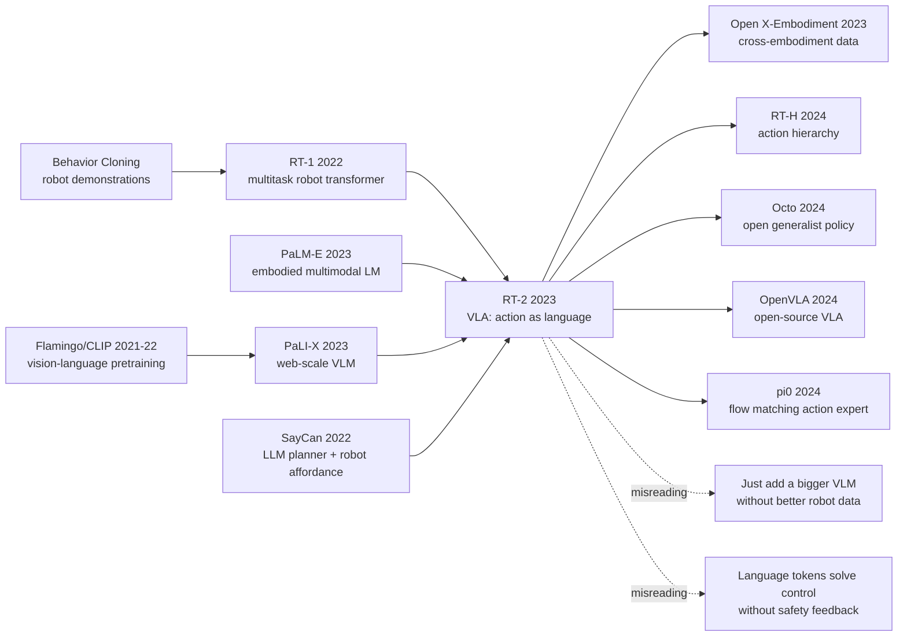

# RT-2：把网页知识迁移到机器人控制的视觉-语言-动作模型

> **2023 年 7 月 28 日，Google DeepMind 在 arXiv 上传 [2307.15818](https://arxiv.org/abs/2307.15818)，把一个看似粗暴的想法推到真实机器人上：既然 VLM 能把图像和文字都当 token 处理，为什么不能把机械臂动作也写成 token？** RT-2 的戏剧性不在“机器人会聊天”，而在 6,000+ 次真机评测里，网页预训练学到的数字、图标、类别和常识被直接转成抓取动作，让办公室厨房里的机器人第一次显出一点“我知道这是什么，也知道该怎么做”的味道。

## 一句话总结

Anthony Brohan、Noah Brown、Justice Carbajal、Yevgen Chebotar、Xi Chen 等 54 位作者 2023 年在 Google DeepMind 发布的 RT-2，把 [RT-1](https://robotics-transformer1.github.io/) 的多任务行为克隆和 PaLM-E / PaLI-X 的网页级视觉语言预训练接在一起：连续动作先被离散成 256 桶，再写成字符串 token，训练目标仍是自回归预测 $p(y_t|x_{\le t}, y_{<t})$，其中 $y_t$ 既可以是自然语言，也可以是机器人动作 token。它替代的不是某个单一控制器，而是“先用 VLM 做感知/规划、再把结果交给低层策略”的拼装路线；在 6,000+ 次真实机器人评测中，RT-2 保住已见任务性能，同时把未见场景成功率从 RT-1 的 32% 提到 62%，emergent skill 相比 RT-1/VC-1 类 baseline 超过 3x，Language-Table 仿真从 77% 左右推进到 90%。RT-2 之后，[Open X-Embodiment](https://robotics-transformer-x.github.io/)、RT-H、Octo、$\pi_0$ 等路线都在追问同一个反直觉 lesson：机器人泛化不一定先来自更多机器人数据，有时来自把动作挤进语言模型已经会处理的 token 空间。

---

## 历史背景

### 2022-2023 年的机器人学卡在哪里

RT-2 出现前，通用机器人研究长期被一个朴素但致命的事实卡住：机器人只能从自己做过的事情里学习。网页上有海量“苹果是什么”“数字 3 长什么样”“哪种物体像锤子”的知识，语言模型和视觉语言模型已经把这些知识吸进参数里；但机械臂真正要执行时，策略网络看到的是相机图像、夹爪状态、末端执行器位姿，以及一个需要连续闭环控制的动作空间。两边都叫“智能”，接口却完全不同。

2022 年的主流路线大致分成两派。一派是 RT-1、BC-Z、Gato 这类多任务行为克隆：把许多机器人演示堆起来，训练一个条件策略，优点是闭环动作稳定，缺点是长尾泛化仍然跟着机器人数据走。另一派是 SayCan、Inner Monologue、PaLM-SayCan 这类“语言模型规划 + 低层技能库”：让 LLM 负责把任务拆成步骤，再由单独的 affordance 或控制器执行，优点是能利用语言知识，缺点是世界状态和动作反馈被拆在两个系统里，视觉 grounding 和低层控制之间仍有缝隙。

RT-2 的历史位置就在这条裂缝上。它没有先发明一个新控制器，也没有把 VLM 当作外挂 captioner；它直接问：如果语言模型本来就是 next-token predictor，机器人动作能不能也变成 token？这个问题看起来像工程技巧，实际改变了“知识如何进入控制”的路径。知识不再必须通过显式规划器、语义标签或任务库转译，而是可以在同一个序列模型里与动作共同训练。

### RT-1 到 PaLM-E 的交叉点

RT-1 给 RT-2 留下了最重要的底座：真实办公室厨房里的多任务机器人数据。Google 团队用 13 台机器人在 17 个月里收集了大量拾取、移动、放置任务，证明 Transformer 可以从图像历史和语言命令直接预测离散化动作。RT-1 的强项是“见过的物体 + 见过的技能组合”；它能在已覆盖任务上稳定工作，但面对“把香蕉移到 2+1 的结果”“拿起灭绝动物”“选择能当锤子的东西”这种需要网页常识的命令，机器人演示数据里几乎没有可学习的信号。

另一边，PaLM-E 和 PaLI-X 正在把大模型推向多模态。PaLM-E 试图把 embodied observation 接入语言模型，证明图像、状态、文字可以在同一个 transformer 里交互；PaLI-X 则代表 Google 当时的大规模视觉语言预训练能力，擅长 VQA、caption、OCR 和开放类别识别。它们的问题也很明确：能回答问题，不等于能闭环控制机械臂。把 VLM 的语义能力变成可执行动作，需要一个不会破坏预训练接口的桥。

RT-2 的桥很窄：动作序列被写成普通字符串，和 VQA 答案一样参与训练。这个设计让 PaLM-E / PaLI-X 不需要换输出头，不需要把动作空间改造成额外模块，也不需要在推理时调用外部 planner。预训练模型原本会输出“energy drink”，现在也可以在同一 vocabulary 里输出“1 128 91 241 5 101 127 217”这样的动作 token 串。

### 为什么 Google DeepMind 能做 RT-2

RT-2 是一篇典型的“只有少数团队能做”的论文。它需要三件资源同时到位：第一，真实机器人长期采集数据，不只是仿真 benchmark；第二，足够大的 VLM backbone，例如 PaLM-E 12B 和 PaLI-X 55B；第三，能在真实机器人上做上千次盲测的实验基础设施。缺任何一个，论文都会退化成“在桌面任务上接一个 VLM”的 demo。

作者名单横跨 Google Robotics、DeepMind、Google Research、Stanford 和 UC Berkeley。Brian Ichter、Karol Hausman、Sergey Levine、Fei Xia、Ted Xiao、Chelsea Finn 等作者本来就在 RT-1、BC-Z、SayCan、机器人多任务学习这条线上连续工作；RT-2 不是突然跳出来的 GenAI 机器人论文，而是 Google 机器人路线在 ChatGPT 后的自然重写：把多任务演示数据放到 VLM 的 token 世界里，让网页知识第一次直接参与低层控制训练。

### 工业环境与研究气候

2023 年 7 月的时间点很重要。ChatGPT 已经让整个 AI 行业重新审视“基础模型 + 下游接口”这套范式，PaLM-E、GPT-4V、Flamingo、LLaVA 让视觉语言模型看起来正在成为通用感知层；但机器人仍然被“数据太贵、环境太慢、评测太难”困住。一个互联网模型可以在几小时内生成百万条文本样本，机械臂却要花几秒到几十秒做一次动作，还可能撞倒杯子、夹坏物体或需要人工复位。

因此 RT-2 的冲击不只是指标。它把一个研究判断摆到台面上：机器人不可能像网页文本那样收集万亿级 token，但可以把有限机器人动作对齐到已有网页 token 空间。换句话说，机器人泛化的第一桶金也许不是来自更大的机器人数据湖，而是来自已有 VLM 里已经学到的语义先验。

## 研究背景与动机

### 机器人数据不可能覆盖长尾

办公室厨房数据能覆盖“拿苹果”“移动可乐罐”“把海绵放到盘子上”，却很难覆盖“把东西放到德国国旗旁边”“选择最适合困倦的人喝的饮料”“拿一个能临时代替锤子的物体”。这些命令需要对象类别、符号、数字、世界知识和目标推理，而不是单纯视觉匹配。靠机器人演示把所有组合都采一遍，数据规模会指数爆炸。

RT-2 的动机是把这种长尾从“机器人必须亲自经历”改成“机器人能从 VLM 预训练继承”。VLM 在网页图文里见过恐龙、国家旗帜、能源饮料、图标和数字，它也见过“如果人累了，需要咖啡或能量饮料”这种常识关联。RT-2 要证明的不是 VLM 知道这些东西，而是这些知识能否穿过动作 token 接口，变成一个机械臂的闭环行为。

### VLM 预训练带来的新假设

这篇论文的核心假设可以写成一句话：如果机器人控制也能被建模成条件序列生成，那么网页视觉语言预训练就不必停在语义识别层，可以直接迁移到动作选择层。这个假设和传统机器人学习有明显冲突。传统方法倾向于把感知、规划、控制拆开；RT-2 则把“看图、读命令、想目标、输出动作”压进一个自回归模型。

这种压缩有风险。动作 token 化会损失连续控制精度，大模型推理延迟会影响闭环频率，语言式目标函数也不天然保证安全。但它带来的回报同样清楚：机器人任务第一次可以借用 VLM 的开放类别识别、OCR、符号理解和常识推理。RT-2 的研究动机，正是在这个风险和回报之间做一次真实机器人级别的压力测试。

---

## 方法详解

### 整体框架：把动作写成另一种语言

RT-2 的方法不像许多机器人论文那样从控制器结构讲起，而是从接口讲起。输入仍然是机器人相机图像、自然语言命令和过去动作历史；输出不再是一个单独的连续动作头，而是一段由 tokenizer 处理的字符串。字符串的第一个 token 表示继续或终止当前 episode，后面依次表示末端执行器的位置增量、旋转增量和夹爪开合。论文项目页给出的例子是“1 128 91 241 5 101 127 217”：它在模型眼里只是 token 序列，在机器人控制器眼里会被反 token 化成下一步动作。

这个设计让 RT-2 能直接复用 PaLM-E / PaLI-X 这类 VLM。训练时，batch 里既有网页视觉语言任务，例如 VQA、caption、OCR，也有机器人轨迹样本：图像 + 指令 + 动作字符串。推理时，模型看当前图像和命令，自回归生成动作 token，系统再把 token 解码回低层控制量并执行，下一帧继续循环。

$$
a_t = \operatorname{detok}\left(\arg\max_{y} p_\theta(y \mid o_{\le t}, \ell, y_{<t})\right)
$$

这里 $o_{\le t}$ 是到当前时刻的视觉观测，$\ell$ 是语言指令，$y$ 是模型输出 token。RT-2 的关键不在公式本身，而在 $y$ 的语义被扩展了：同一个 token 空间可以同时表示“the object is a banana”和“向左移动、旋转、闭合夹爪”。

### 关键设计 1：动作 token 化

动作 token 化是 RT-2 最小、也最有穿透力的设计。连续机器人动作先沿用 RT-1 的离散版本，每个维度被量化到有限桶，再转成普通文本 token。这样做牺牲了一部分控制分辨率，却换来一个巨大利益：VLM 的输出接口完全不用改。模型不需要额外 regression head，也不需要在语言模型外面挂一个控制 decoder。

| 动作字段 | 含义 | 为什么能 token 化 |
|---|---|---|
| episode flag | 继续或终止 | 二值决策天然离散 |
| delta position | 末端执行器位置增量 | 每轴量化到 256 桶 |
| delta rotation | 末端执行器旋转增量 | 每轴量化到 256 桶 |
| gripper | 夹爪开合 | 连续值离散成桶或端点 |

```python
def encode_action(action, bins=256):
    fields = [action.terminate]
    fields += quantize(action.delta_position, bins=bins)
    fields += quantize(action.delta_rotation, bins=bins)
    fields += quantize([action.gripper], bins=bins)
    return " ".join(str(token) for token in fields)


def policy_step(model, image, instruction, history):
    prompt = pack_multimodal_context(image, instruction, history)
    token_string = model.generate(prompt, stop_at_action_boundary=True)
    return decode_action(token_string)
```

设计动机很现实：机器人控制通常希望连续、平滑、低延迟；VLM 则擅长离散 token 预测。RT-2 没有强行让 VLM 学连续控制，而是把控制问题投影到 VLM 已经擅长的形式里。这个投影并不完美，却足以覆盖桌面操作任务，并把网页知识接入动作选择。

### 关键设计 2：co-fine-tuning 而不是只微调

如果只用机器人数据微调，模型很容易遗忘网页 VQA / caption 能力；如果只保留网页任务，模型又学不会低层动作。RT-2 使用 co-fine-tuning：训练时把机器人轨迹和原始视觉语言任务混在一起，让模型同时保持语义能力和动作能力。它本质上是在做一种多任务蒸馏：机器人数据教会模型“怎么动”，网页数据持续提醒模型“世界是什么”。

| 训练方式 | 保留网页知识 | 学到闭环控制 | 主要问题 |
|---|---|---|---|
| 从零训练 VLA | 弱 | 中等 | 数据量远不够，泛化差 |
| 只微调 VLM | 中等 | 中等 | 容易遗忘 VQA/OCR 语义 |
| 只用 RT-1 数据 | 弱 | 强 | 长尾命令无法泛化 |
| RT-2 co-fine-tuning | 强 | 强 | 成本高，依赖闭源 VLM 与真机数据 |

这个选择解释了 RT-2 为什么不是“把 RT-1 换成更大模型”这么简单。模型越大，预训练知识越丰富；但如果训练配方不保留这些知识，机器人微调会把很多能力冲掉。RT-2 论文和项目页都把“pretrained weights + co-fine-tuning + model size”列为泛化改进的核心因素。

### 关键设计 3：VLA 推理闭环

RT-2 的推理不是一次性输出完整计划，而是闭环控制。每一步模型看到当前相机图像和命令，生成一个短动作 token 串；机器人执行后，下一帧重新进入模型。这一点把 RT-2 和“先让 LLM 写计划，再让控制器执行”的路线分开。RT-2 的语义推理和动作输出在同一个网络里，视觉反馈每步都进入决策。

这种闭环也解释了为什么 RT-2 可以做一些看似符号化的任务，例如“move banana to the sum of two plus one”或“pick up the extinct animal”。模型不只是回答“2+1=3”或“dinosaur is extinct”，而是把这个中间知识绑定到当前图像里的具体物体与空间位置。成功条件同时要求 VLM 知道答案、视觉系统找到对象、控制策略把夹爪移动到正确位置。

### 训练目标与实现细节

RT-2 的训练目标仍是标准自回归 token loss，只是样本来源混合。机器人样本的 target 是动作字符串；网页视觉语言样本的 target 是自然语言答案。对模型而言，这两类 target 都是 token 序列；对系统而言，只有以动作边界结束的输出会被送去控制器。

这个“统一目标”带来两个后果。好处是工程极简：任何足够强的 VLM 都可能被转成 VLA，不必为动作单独设计复杂架构。坏处是控制质量被 tokenizer 和离散化上限约束，模型也不能天然理解物理安全。RT-2 因此更像一个范式证明：把动作塞进语言接口能把网页知识迁移到机器人控制，但它没有解决机器人学习的全部问题。

---

## 失败案例

### 失败 baseline 1：只用 RT-1 行为克隆

RT-1 是 RT-2 最直接的前身，也是最重要的失败 baseline。RT-1 已经证明多任务机器人 Transformer 能从真实演示里学到稳定的桌面操作；但它的知识边界基本等于机器人数据边界。见过的物体、见过的技能组合、相似环境里的新排列，RT-1 可以做得不错；一旦命令需要网页语义，模型就缺少支撑。

RT-2 对 RT-1 的替代不是“更大网络 + 更多机器人数据”，而是换掉知识来源。RT-1 主要从 13 台机器人 17 个月的演示里学习；RT-2 保留这部分控制经验，同时把 PaLM-E / PaLI-X 的网页视觉语言预训练接进来。结果是：已见任务性能没有明显牺牲，未见场景成功率从 RT-1 的 32% 提到 62%。这说明 baseline 输的不是低层动作稳定性，而是语义长尾。

| Baseline | 能力来源 | 输给 RT-2 的原因 |
|---|---|---|
| RT-1 | 机器人演示行为克隆 | 数据覆盖不到符号、数字、常识长尾 |
| VC-1 | 大规模视觉预训练 | 只有视觉表征，没有语言和动作 token 接口 |
| R3M | 视频/交互表示学习 | 表征能迁移，但不能直接生成语义动作 |
| MOO / VLM-as-detector | VLM 识别开放物体 | 识别和闭环控制分离，动作仍靠外部策略 |

### 失败 baseline 2：视觉预训练不是视觉语言预训练

VC-1 和 R3M 这类视觉预训练 baseline 很有代表性。它们说明“大规模视觉数据”确实能给机器人策略更好的表征，但 RT-2 要迁移的不是一般视觉特征，而是网页里的语义关系。比如“拿起灭绝动物”需要知道恐龙已经灭绝；“把香蕉移到 2+1 的结果”需要把算术、符号识别和空间动作接起来。纯视觉预训练可以帮助看到物体，却不一定知道这些物体在语言世界里的关系。

这也是 RT-2 使用 VLM 而不是 vision backbone 的原因。视觉预训练解决“看得清”，视觉语言预训练解决“看懂并能被语言条件化”。机器人控制需要两者同时存在：如果看不清，夹爪会落错位置；如果看不懂，命令里的常识和符号就无法决定目标。

### 失败 baseline 3：从零训练或只微调

论文和项目页都强调两个 ablation：预训练权重重要，co-fine-tuning 重要。从零训练的 VLA 没有足够机器人数据支撑，学不到网页常识；只把 VLM 拿来微调机器人动作，又可能把原本的 VQA、OCR 和开放类别能力冲掉。RT-2 的训练 recipe 选择看似保守，实际是为了避免这两个极端。

这个失败案例的 lesson 很直接：VLA 不是“把动作头接到大模型后面”就成立。动作 token 化提供接口，预训练提供语义，co-fine-tuning 防止遗忘，真实机器人数据提供闭环控制。四件事少一件，模型都可能只剩 demo，而不是可重复评测的机器人策略。

## 实验关键数据

### 真实机器人泛化评测

RT-2 的评测规模是它被写入经典论文清单的重要原因之一。项目和博客明确说明评测覆盖 6,000+ 次真实机器人 trials，而不是只展示几个视频。评测分为已见任务、未见物体/背景/环境，以及需要符号理解、推理、人类识别的 emergent skill。RT-2 的主张不是“所有任务都解决”，而是在保住原有 RT-1 能力的同时，把未见场景和语义泛化显著抬高。

| 评测项 | RT-1 / prior baseline | RT-2 结果 | 解释 |
|---|---|---|---|
| 已见 RT-1 任务 | RT-1 强 | RT-2 基本保持 | VLM 预训练没有冲掉低层技能 |
| 未见场景成功率 | 32% | 62% | 网页预训练显著改善 OOD 泛化 |
| emergent skills | RT-1 / VC-1 低 | 超过 3x 改进 | 数字、图标、类别、常识进入动作 |
| Language-Table 仿真 | LAVA 77% | 90% | 换 embodiment 后仍能迁移 |
| 真机 Language-Table | 训练物体有限 | 能处理新物体 | 说明不是纯仿真过拟合 |

### Language-Table 迁移

Language-Table 结果很适合检验 RT-2 是否只适用于 Google 的办公室厨房机械臂。模型在这个开源任务套件中达到 90% 仿真成功率，高于 BC-Z 的 72%、RT-1 的 74% 和 LAVA 的 77%。更重要的是，论文还把同一模型放到真实 Language-Table 环境里，看它处理训练集里没有的 ketchup bottle、banana 等物体。

这个结果的思想史意义大于单个数字：VLA 的“动作作为语言”接口不是只服务某个固定场景，它有机会跨 embodiment 迁移。但 RT-2 还没有真正解决跨机器人通用控制；Language-Table 是一个小而受控的验证，后来的 Open X-Embodiment / RT-X 才把这个问题推向多机器人数据混合。

### CoT 控制探针

RT-2 还做了一个非常 2023 年的实验：在数据里加入“Plan:”和“Action:”结构，让模型先输出自然语言计划，再输出动作 token。例子包括选择能当锤子的 rock，或给困倦的人选择 energy drink。这个实验没有把机器人变成可靠的长程规划器，但它证明同一个 VLA 可以在一个序列里交替生成语言推理和动作控制。

这个探针的重要性在于，它把 SayCan 式“LLM planner + policy”的两段式系统压进一个模型内部。计划不再只是外部文本，动作也不再只是外部控制器；两者共享上下文、视觉输入和参数。这个方向后来影响了很多 VLA 工作，但也留下明显问题：语言计划可能看起来合理，却不一定被物理世界验证；动作 token 可能执行失败，却没有内建的纠错或安全证明。

---

## 思想史脉络



### 前世

RT-2 的前世有两条线。一条是机器人多任务学习线：BC-Z 证明语言条件机器人策略可以泛化到新组合，RT-1 把真实机器人数据规模推到一个能训练 Transformer 的量级。另一条是视觉语言基础模型线：CLIP、Flamingo、PaLI、PaLM-E 证明网页图文预训练能形成开放类别识别、OCR、VQA 和常识关联。RT-2 的创新不是单独推进任何一条线，而是把两条线的接口合并。

SayCan 是中间节点。它已经把 LLM 知识引入机器人任务规划，但规划和低层控制仍是两个系统。RT-2 则把这个分界线往模型内部推：不是“语言模型告诉机器人做什么”，而是“语言模型风格的 VLM 自己输出动作 token”。因此 RT-2 是从 modular robot intelligence 到 tokenized embodied policy 的转折点。

### 今生

RT-2 之后，VLA 很快变成机器人基础模型的主流词汇。Open X-Embodiment / RT-X 试图补 RT-2 最大的短板：机器人数据太单一、embodiment 太少。Octo 和 OpenVLA 把 generalist policy 做成更开放的研究对象，让非 Google 团队也能训练和复现类似路线。RT-H、$\pi_0$、Diffusion Policy 系列则从另一个角度修正 RT-2：动作不一定非要像语言一样离散，连续动作专家、层级动作和扩散/flow matching 可能更适合精细控制。

这条继承链很有意思：后续工作几乎都接受了 RT-2 的大判断，即“语义预训练应该进入动作策略”；但它们不一定接受 RT-2 的具体接口，即“把所有动作都写成文本 token”。这正是经典论文的标志：它提出的问题比它的实现细节活得更久。

### 误读

第一种误读是“只要把 VLM 做大，机器人就会泛化”。RT-2 自己已经反驳了这个说法：没有 RT-1 机器人演示数据，模型不会凭网页知识学会夹爪如何闭合；没有 co-fine-tuning，网页知识又可能在机器人微调中丢失。VLM 是语义先验，不是物理经验的替代品。

第二种误读是“动作 token 化已经解决控制”。RT-2 的动作接口很巧，但它适用于相对低频、短程、桌面操作；对于接触丰富、高速运动、双臂协作或安全约束严格的场景，离散 token 和自回归延迟都会成为问题。RT-2 真正留下的是统一接口的想法，而不是“所有机器人动作都应该永远写成字符串”的教条。

---

## 当代视角

### 哪些假设站住了

从 2026 年回看，RT-2 最站得住的假设是：语义预训练确实应该进入机器人策略，而不只是作为外部 perception API。后续 VLA、OpenVLA、Octo、RT-X、$\pi_0$ 都在不同程度上继承了这个判断。机器人泛化不再只被描述为“采更多演示”，而是被描述为“如何把互联网语义、跨 embodiment 数据和低层动作统一训练”。

第二个站住的假设是接口重要。RT-2 的动作 token 化也许不是最终答案，但它证明了一个强接口可以让原本不兼容的数据源混合训练。网页 VQA、caption、OCR 与机器人 action trajectory 不再需要完全不同的模型头；它们可以被放进一个条件序列建模问题里。这种“把异构 supervision 统一成 token / sequence”的思想，已经扩散到 agent、工具使用、多模态 UI 自动化和机器人策略学习。

### 哪些假设站不住了

RT-2 最不稳的假设，是“离散语言 token 足以承载机器人动作”。后来的工作越来越清楚地看到，低层控制需要连续性、平滑性和可纠错性。动作 token 很适合把 VLM 转成第一代 VLA，却不一定适合高精度装配、柔性物体操作、双臂协作或长时程移动操作。今天的很多模型把语言模型作为语义主干，再用 diffusion / flow matching / action expert 生成连续控制，就是对 RT-2 的修正。

另一个站不住的假设是评测环境的代表性。办公室厨房和 Language-Table 都比真实家庭、工厂、医院简单得多。RT-2 的 6,000+ 次真机评测很难得，但它仍然集中在有限 embodiment、有限物体分布和短程任务上。它证明了“网页知识能迁移到控制”，没有证明“VLA 已经安全可靠地进入开放世界”。

### 如果今天重写 RT-2

如果今天重写 RT-2，我会保留“动作进入基础模型接口”的思想，但不一定把动作全部写成文本 token。更可能的架构是：VLM / VLA backbone 负责语义 grounding、目标选择和粗动作意图；一个连续 action expert 负责高频控制；两者通过共享 latent 或 action chunk 对齐，而不是每个控制维度都走文本 vocabulary。

训练上也会更依赖跨 embodiment 数据和离线-在线闭环。RT-2 的数据主要来自 RT-1 系统；今天会把 Open X-Embodiment、仿真、遥操作、人类视频和自监督交互混在一起，再用真实机器人在线校正失败模式。安全上则需要显式约束：动作 token 生成前后都应有碰撞检测、力控限制、失败恢复和人类可解释的中止条件。

## 局限与展望

### 具身数据与可复现性

RT-2 最大的局限不是论文没有开源代码，而是它依赖一整套外部团队很难复制的资产：RT-1 机器人数据、PaLM-E / PaLI-X backbone、真实机器人评测场地和大规模工程基础设施。没有这些资产，社区只能复现思想，不能严格复现实验。这也是为什么 OpenVLA、Octo、Open X-Embodiment 这些后续工作很重要：它们把 RT-2 的问题从“Google 内部系统”推进到更开放的研究平台。

展望上，VLA 的关键不只是模型更大，而是数据协议更清楚。不同机器人、不同相机、不同动作空间、不同任务语言如何对齐，仍然是比单个网络结构更难的问题。RT-2 把动作写成 token 是一种对齐方式，但未来可能需要更丰富的 action schema、物理单位标准、接触状态标注和失败日志。

### 可靠控制与安全闭环

RT-2 展示了语义泛化，却没有给出强安全保证。一个 VLA 可能知道“刀很锋利”，也可能因为视觉误判、动作离散误差或语言歧义而执行危险动作。自回归模型的置信度也不等价于物理安全。对于真实部署，VLA 需要和 safety shield、世界模型、力控反馈、异常检测、人类介入机制结合。

长期看，RT-2 的路线会把机器人安全问题变复杂。传统控制器的失败可以在状态空间和约束里分析；VLA 的失败还包括语义幻觉、指令误解、常识误用和数据偏见。未来的好系统不会只问“模型成功率多少”，还要问“失败是否可预测、可中止、可恢复”。

## 相关工作与启发

### 与 VLA 后续路线的关系

RT-2 之后的机器人基础模型大致走出三条路线。第一条是数据路线：Open X-Embodiment / RT-X 把许多机器人数据混在一起，试图用跨 embodiment 多样性换泛化。第二条是开源路线：OpenVLA、Octo 把 VLA 训练从闭源系统里拆出来，降低社区进入门槛。第三条是动作建模路线：RT-H、Diffusion Policy、$\pi_0$ 等方法重新思考动作表示，用层级、chunk、扩散或 flow matching 弥补文本 token 的控制短板。

RT-2 对这些路线的启发是：不要把“语义”和“控制”当成两个永远分开的模块。即使最终架构仍有 planner、policy、safety layer，训练信号也应该让语义目标和动作结果彼此看见。机器人不是只需要更好的感知，也不是只需要更好的控制；它需要一个能把“我知道什么”和“我能做什么”连接起来的学习接口。

### 给今天研究者的启发

第一，接口选择可能比模型小改更重要。RT-2 没有发明复杂新网络，却因为把动作塞进 token 空间，打开了网页知识迁移到控制的通道。第二，真实评测很贵但不可替代。没有 6,000+ 次真机 trials，RT-2 很容易被看成漂亮 demo；正是评测规模让它能进入思想史。

第三，不要把第一代成功误读成最终答案。RT-2 的动作 token 化是一个可用接口，不是物理控制的终局。今天更值得研究的是：如何在保持 VLM 语义迁移能力的同时，用更适合物理世界的连续动作模型、反馈控制和安全约束承接它。

## 相关资源

### 论文与项目

| 资源 | 链接 | 备注 |
|---|---|---|
| RT-2 paper | https://arxiv.org/abs/2307.15818 | 论文入口 |
| RT-2 project page | https://robotics-transformer2.github.io/ | 视频、图示、引用 |
| Google DeepMind blog | https://deepmind.google/discover/blog/rt-2-new-model-translates-vision-and-language-into-action/ | 官方解读与关键数字 |
| RT-1 project page | https://robotics-transformer1.github.io/ | 直接前身 |

### 延伸阅读

读 RT-2 最好的顺序是先看 RT-1，理解多任务机器人 Transformer 如何从真实演示学闭环控制；再看 SayCan，理解为什么 LLM planner 和低层 affordance 的分离有用但不彻底；然后读 PaLM-E / PaLI-X，理解 VLM backbone 的语义来源；最后读 Open X-Embodiment、OpenVLA、Octo 和 $\pi_0$，看社区如何修正 RT-2 的数据、开源和动作表示问题。

RT-2 最值得保留的不是某个具体数字，而是一个研究姿势：当两个领域的接口不兼容时，不一定先造一个复杂桥梁；有时把其中一边重新编码成另一边已经擅长的表示，就能打开一条新路。


---

> 🌐 [English version](/en/era5_genai_explosion/2023_rt2/) · 📚 awesome-papers project · CC-BY-NC