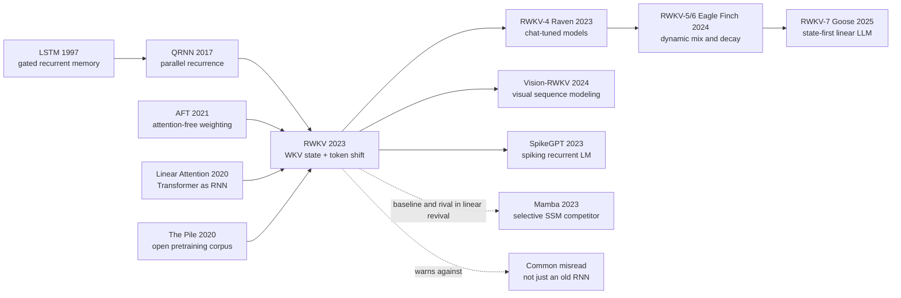

# RWKV - 把 RNN 重新带回 Transformer 时代的线性大模型

> **2023 年 5 月 22 日，Bo Peng、Eric Alcaide、Quentin Anthony 等 35 位作者把 [arXiv:2305.13048](https://arxiv.org/abs/2305.13048) 上传到网上，题目直接写着：RWKV: Reinventing RNNs for the Transformer Era。** 这篇论文的钩子不是“RNN 还没死”这句口号，而是一个更硬的系统命题：训练时像 Transformer 一样并行，推理时像 RNN 一样只带一个常数大小状态。RWKV 从 169M 一路训到 14B，在 The Pile 上跑完整个 330B token epoch，把“注意力之外的大模型”第一次推进到十亿到百亿参数的真实开源尺度。

## 一句话总结

Bo Peng、Eric Alcaide、Quentin Anthony 等 35 位作者 2023 年发布的 RWKV，把 [Transformer](../era3_attention/2017_transformer.md) 的并行训练野心和 RNN 的常数状态推理合到同一个 WKV 算子里：时间混合用 $a_t=e^{-w}\odot a_{t-1}+e^{k_t}\odot v_t,\; b_t=e^{-w}\odot b_{t-1}+e^{k_t}$ 维护分子/分母状态，再输出 $\sigma(r_t)\odot\frac{a_{t-1}+e^{u+k_t}\odot v_t}{b_{t-1}+e^{u+k_t}}$，因此训练时可用 CUDA kernel 做 time-parallel WKV，推理时只递推一个状态。它替代的失败 baseline 是两头卡住的 2023 序列建模格局：LSTM/GRU 省显存但训练串行，Reformer/Performer/Linear Transformer/AFT 等 efficient Transformer 没真正训到百亿级大模型，标准 Transformer 质量强但 KV cache 随上下文线性膨胀。RWKV 训练了 169M、430M、1.5B、3B、7B、14B 六个 Pile 模型，证明 dense RNN-like LLM 可以跟同等训练量 Transformer 做可比评测；它也为后来 Mamba（2023） 和线性序列模型复兴提供了一个重要先例。隐藏 lesson 是：Transformer 的统治并不是“RNN 思想失败”，而是“旧 RNN 没有同时解决并行训练、稳定梯度和大规模工程”三个问题。

---

## 历史背景

### 2023 年的瓶颈：Transformer 很强，但 KV cache 越来越贵

ChatGPT 爆发后的 2023 年，几乎所有人默认“大模型 = decoder-only Transformer”。这个默认很有道理：Transformer 能并行训练，能吃大数据，能在 GPT-3、PaLM、Chinchilla、LLaMA 上连续证明 scaling law。问题也越来越明显：推理时每生成一个 token，都要把所有层、所有头的 key/value 缓存在显存里；上下文长度从 2K、4K 往 32K、128K、1M 推时，KV cache 会线性增长，吞吐、显存和延迟同时变成产品瓶颈。

这时 RNN 看起来像一个被历史淘汰但又让工程师眼馋的旧方案。它天然 streaming，状态大小不随上下文长度增长；如果只看 autoregressive decoding，RNN 的计算路径比 Transformer 更像真实服务负载。可旧 RNN 的训练串行、长依赖难学、规模上不去。LSTM/GRU 解决了梯度问题的一部分，却没解决“大规模并行预训练”的问题。于是 2017 年之后，RNN 在主流 NLP 中几乎退出舞台，只留下语音、时间序列和边缘设备上的局部用途。

RWKV 的历史钩子就在这里：它不是简单说“RNN 比 Transformer 好”，而是问一个更窄也更难的问题：**能不能把 RNN 的状态式推理留下，同时把训练路径改造成接近 Transformer 的并行矩阵乘法**？如果答案是肯定的，长上下文和边缘部署就多了一条路线。

### 从 LSTM 到 AFT：复兴 RNN 的路线已经铺好

RWKV 的前序并不只有 RNN。第一条线当然是 LSTM、GRU、QRNN、SRU 这些 recurrent architecture：它们都试图让状态递推更稳定、更并行或更简单。QRNN 特别接近，因为它用卷积产生门控信号，再用 recurrent pooling 处理时间维度，已经在“并行局部计算 + 顺序状态更新”之间做过折中。

第二条线是 efficient Transformer。Reformer、Linformer、Performer、Linear Transformer、BigBird、Longformer、MEGA、AFT 等方法都在追问同一个问题：标准 attention 的 $O(T^2)$ 代价是否必须付？AFT 对 RWKV 特别重要，因为它把 query-key 点积替换成更简单的加权 key-value 聚合。RWKV 从 AFT 借来“attention-free weighted average”的形状，但进一步把位置权重限制成按相对距离指数衰减的通道向量，从而可以改写成递推状态。

第三条线是 open LLM 的训练基础设施。The Pile、GPT-NeoX、Pythia、OPT、BLOOM 让开源社区第一次能比较大模型训练曲线和 benchmark；没有这些数据与 baseline，RWKV 只能做“小模型上挺快”的架构实验，而不能声称自己接近 Transformer 时代的大模型。RWKV 选择在 The Pile 上训 169M 到 14B 六个模型，正是为了把自己放进同一张大模型评测桌。

### 一个社区项目如何写成论文

RWKV 很不像一篇标准学院派架构论文。Bo Peng 作为 BlinkDL 长期在 GitHub、Discord、EleutherAI 社区迭代模型，从 v1、v2、v3 到 v4，不断调公式、初始化、CUDA kernel 和训练脚本。论文的作者列表很长，贡献也很分散：有人做模型设计，有人训模型，有人做 scaling law，有人做 benchmark，有人做长上下文，有人做推理速度，有人做聊天实验。这种形态更像开源系统被整理成论文，而不是一篇论文催生开源系统。

这也解释了 RWKV 的写法有时不那么“精致”，但工程味很重。它关心的不只是一个漂亮公式，还包括小初始化、time decay 初始化、无 bias 线性层、custom CUDA kernel、token-shift、prompt 顺序、ChatRWKV runtime、手机和 Web 推理。它的野心不是在一个 toy benchmark 上赢 attention，而是建立一个能被社区持续训练、发布、聊天和部署的非 Transformer LLM 家族。

### 当时的算力、数据和开源氛围

RWKV 的主实验使用 The Pile，一个约 330B token 的训练 epoch；模型从 169M 到 14B，使用 bfloat16、Adam、指数衰减学习率、1024 context 预训练，再做更长 context 的继续训练。这个训练量在 2023 年已经足够认真：它不是 GPT-4 级别的闭源巨型训练，但已经远超“线性 attention 小模型 demo”的级别。

开源氛围同样关键。LLaMA 在 2023 年 2 月把开源权重时代点燃，大家突然开始关心“同样 7B/13B/30B 规模下，是否真的只有 Transformer 一条路”。RWKV 的 Apache-2.0 代码仓、Hugging Face 权重、ChatRWKV demo、社区 runtime 让它不仅是一篇 paper，也是一个可玩的架构候选。它没有推翻 Transformer，却让“attention-free LLM”从边缘想法进入主流讨论。

## 研究背景与动机

### 核心矛盾：训练要并行，推理要流式

RWKV 的问题可以压缩成一句话：**训练时我们想要 Transformer 的并行吞吐，推理时我们想要 RNN 的常数状态**。传统 RNN 有第二个性质，没有第一个；标准 Transformer 有第一个性质，没有第二个。RWKV 试图让时间混合的主要矩阵乘法和 token 投影并行执行，把真正递推的部分压成一个按通道更新的 WKV 状态。

这个目标带来两个约束。第一，时间权重不能依赖当前 query 与历史 key 的任意点积，否则每个 token 都要回看所有历史，无法保持常数状态。第二，模型又不能退化成无选择的滑动平均，否则会丢掉语言建模需要的内容选择能力。RWKV 的折中是用 $K,V,R,W$ 四类量：$K$ 表示写入强度，$V$ 表示写入内容，$R$ 控制当前 token 是否接收历史信息，$W$ 控制每个通道的时间衰减。

### 目标：把 attention 写成可递推的状态

RWKV 的核心目标不是“做一个更快 RNN”，而是把一种 attention-like 聚合写成可递推状态。并行训练时，WKV 可以看成沿时间维的加权聚合；顺序推理时，同一个公式可以维护分子、分母和数值稳定用的指数状态。这样一来，训练和推理使用同一个模型，只是执行方式不同：batch 训练走 time-parallel kernel，逐 token 生成走 recurrent update。

这也是论文标题里“Reinventing RNNs for the Transformer Era”的真正含义。它不是回到 1997 年 LSTM，而是把 RNN 重新包装进 2023 年的大模型工程条件：预训练语料、scaling law、CUDA kernel、开源 checkpoint、chat tuning、长上下文和多设备部署。

---

## 方法详解

### 整体架构

RWKV 的一个 block 由 time-mix 和 channel-mix 两个 residual sub-block 组成。time-mix 负责把历史 token 的信息写进一个按通道衰减的 WKV 状态；channel-mix 类似 gated FFN，负责通道维度的非线性变换。它看起来像 Transformer block 的替代物：有 LayerNorm、有残差、有投影矩阵、有 gated nonlinearity，但没有标准 multi-head self-attention，也没有随上下文增长的 KV cache。

| 模块 | 主要参数 | 功能 | 对应的 Transformer 直觉 |
|---|---|---|---|
| Token shift | $\mu_r,\mu_k,\mu_v$ | 混合当前 token 和前一 token | 给每层一点局部递归感 |
| Time-mix | $R,K,V,W,U$ | 写入、衰减、读出历史状态 | attention-like token mixing |
| Channel-mix | $R',K',V'$ | gated FFN 与 squared ReLU | FFN / MLP block |
| State tuple | $x,y,a,b,p$ | 常数大小推理状态 | 替代 growing KV cache |

核心思想是把“历史信息”存成分子/分母形式的指数加权平均。训练时可以把整段序列丢给 time-parallel kernel；推理时每个新 token 只更新状态。这样 RWKV 在服务端不像 Transformer 那样不断累积 KV tensor，而更像一个不断滚动的状态机。

### 关键设计 1：Token Shift - 给并行投影注入前一时刻

Token shift 是 RWKV 最朴素也最重要的局部机制。它不先用复杂 recurrence 生成 $R,K,V$，而是把当前输入 $x_t$ 和前一 token 的输入 $x_{t-1}$ 按通道混合，再过线性层。这样所有主要投影仍然是大矩阵乘法，训练时可并行；但每层一开始就知道“当前 token 与前一个 token 的差异”。

$$
r_t = W_r(\mu_r\odot x_t + (1-\mu_r)\odot x_{t-1}),\quad
k_t = W_k(\mu_k\odot x_t + (1-\mu_k)\odot x_{t-1}),\quad
v_t = W_v(\mu_v\odot x_t + (1-\mu_v)\odot x_{t-1}).
$$

这个设计有两个好处。第一，它避免了传统 RNN 那种每一步都依赖上一隐状态的大串行瓶颈；第二，它让模型在每层都能显式比较“新 token”和“上一 token”，对字符级、BPE 级语言建模里的局部模式很有用。RWKV repo 里长期强调 token-shift 对字符级英文、中文和 BPE 语言模型都有帮助。

### 关键设计 2：WKV 算子 - 把 attention-like 加权平均写成递推

RWKV 的核心是 WKV。直观地说，$K$ 决定某个 token 的信息有多值得写入，$V$ 是信息内容，$W$ 是每个通道的时间衰减，$U$ 给当前 token 一个额外 bonus，$R$ 决定当前 token 是否接收历史。论文中的并行形式可以理解为对历史 $k_i\odot v_i$ 做指数衰减加权平均：

$$
\operatorname{wkv}_t=
\frac{\sum_{i=1}^{t-1}e^{-(t-1-i)w+k_i}\odot v_i + e^{u+k_t}\odot v_t}
{\sum_{i=1}^{t-1}e^{-(t-1-i)w+k_i}+e^{u+k_t}}.
$$

关键在于这个式子可以写成 RNN cell：

$$
a_t=e^{-w}\odot a_{t-1}+e^{k_t}\odot v_t,\qquad
b_t=e^{-w}\odot b_{t-1}+e^{k_t},\qquad
o_t=W_o\bigl(\sigma(r_t)\odot\operatorname{wkv}_t\bigr).
$$

从复杂度看，标准 attention 的权重由 $q_t^\top k_i$ 决定，因此当前 token 会动态选择任意历史 token；RWKV 放弃这种任意 pairwise 选择，换成每个通道的衰减曲线与 key 强度。这是它的最大收益，也是最大限制：收益是常数状态和线性时间，限制是对精确回看历史细节不如 full attention。

### 关键设计 3：Receptance gate 与 Channel-mix - 不只是移动平均

如果只有 WKV 的指数平均，RWKV 会很像一个漂亮的可学习 EMA。真正让它接近大模型 block 的，是 receptance gate 和 channel-mix。Receptance $R$ 是一个 sigmoid 门，控制当前 token 从 WKV 历史中接收多少信息；channel-mix 则类似带门控的 FFN，对当前通道表示做非线性变换。

RWKV 的 channel-mix 使用 squared ReLU，形式上接近 Primer 里验证过的 efficient FFN：

$$
o'_t=\sigma(r'_t)\odot \left(W'_v\,\max(k'_t,0)^2\right).
$$

这让 RWKV 不只是“线性 attention 的递推版”。它仍然保留 Transformer 成功经验里的几个部件：LayerNorm、残差、门控、FFN-like channel mixing、精心初始化。论文和 repo 都反复强调初始化的重要性，例如 embedding 小初始化、time decay 曲线、部分矩阵零初始化，这些工程细节决定深层 RWKV 是否稳定。

### 关键设计 4：双执行模式 - time-parallel 训练与 time-sequential 推理

RWKV 的同一个模型可以用两种方式执行。训练时，所有 token 的线性投影和多数逐点操作完全并行；WKV 部分虽然沿时间有递推关系，但可以通过 custom CUDA kernel 在 batch/time/channel 维度上高效执行。推理时，模型只保存每层的若干状态向量，包括 time-mix 输入、channel-mix 输入、WKV 分子、WKV 分母和稳定指数。

| 模式 | 输入形态 | 状态开销 | 适用场景 | 关键收益 |
|---|---|---|---|---|
| Time-parallel | 整段序列 $(B,T,D)$ | 训练中间激活 | 预训练和微调 | 接近 Transformer 的吞吐 |
| Time-sequential | 单个新 token | 每层常数状态 | 自回归生成 | 无 growing KV cache |
| Extended context | 逐步 1024 -> 8192 | 状态大小不随长度变 | 长上下文继续训练 | 长序列 loss 下降 |

下面的伪代码抓住了推理模式的本质。真实实现会使用数值稳定的 $p_t$ 状态避免指数溢出，这里保留最直观的形式。

```python
def rwkv_step(x_t, state, params):
    prev_x, prev_y, a, b = state
    xk = params.mix_k * x_t + (1 - params.mix_k) * prev_x
    xv = params.mix_v * x_t + (1 - params.mix_v) * prev_x
    xr = params.mix_r * x_t + (1 - params.mix_r) * prev_x

    k = params.key(xk)
    v = params.value(xv)
    r = torch.sigmoid(params.receptance(xr))

    current_num = torch.exp(params.u + k) * v
    current_den = torch.exp(params.u + k)
    wkv = (a + current_num) / (b + current_den)
    y = params.output(r * wkv)

    next_a = torch.exp(-params.w) * a + torch.exp(k) * v
    next_b = torch.exp(-params.w) * b + torch.exp(k)
    return y, (x_t, y, next_a, next_b)
```

这段代码说明了 RWKV 最有价值的性质：生成下一 token 不需要读回所有历史 token 的 key/value，只需要状态。对低延迟、长上下文、CPU/移动端和 batch serving 来说，这个差异不是常数优化，而是系统形态差异。

### 训练目标与工程配方

RWKV 的训练目标仍然是标准 next-token cross-entropy，真正特殊的是工程配方：The Pile 一轮训练、指数学习率衰减、Adam、bf16、无 weight decay 的主设置、custom CUDA WKV kernel、逐步延长上下文。论文还用 scaling law 分析显示 RWKV loss 随 compute 呈近似 log-log 线性，Pareto optimal 点拟合 $r^2=0.994$，说明它不像许多旧 RNN 那样在尺度上明显脱轨。

这个方法的保守与激进同时存在。保守之处在于它没有换掉语言模型训练目标，也没有引入复杂监督；激进之处在于它把“attention 是大模型不可替代核心”这条默认假设改成可检验的工程问题：如果一个 recurrent WKV 状态能在 14B 规模上接近 Transformer，那下一代线性序列模型就不再是纸上谈兵。

---

## 失败案例

### 旧 RNN：省显存但训不大

RWKV 第一个要击败的 baseline 是传统 RNN 家族本身。LSTM、GRU、QRNN、SRU 都有一个诱人的性质：推理时状态大小固定，不需要保留完整历史。可它们在大模型时代输得很彻底，原因不是单个公式不够漂亮，而是训练路径不匹配 GPU 和大语料。隐藏状态的时间依赖让训练难以像 Transformer 那样把整段序列摊平做矩阵乘法，长依赖也容易被门控饱和、截断 BPTT 和梯度噪声削弱。

RWKV 的说服力恰恰来自“继承 RNN 的推理形态，但不继承旧 RNN 的训练形态”。它不是把 LSTM 放大到 14B，而是重新设计 time-mix，使大部分计算仍是并行投影，递推只出现在可 kernel 化的 WKV 状态上。

### Efficient Transformer：复杂度好看但大模型证据不足

第二类 baseline 是 2020-2023 年的 efficient Transformer。Linformer、Reformer、Performer、Longformer、BigBird、AFT、MEGA 等方法都降低了某些注意力成本，有的用低秩，有的用局部窗口，有的用 kernel feature，有的改成 attention-free 加权平均。但很多方法的问题是：小模型和长序列 benchmark 有亮点，却没有训练到 tens-of-billions dense LLM 并公开权重、代码和聊天模型。

RWKV 的论文反复强调这一点：很多“线性 attention”论文宣称复杂度更低，但没有拿出百亿参数级开源模型。RWKV 把尺度推进到 14B，让讨论从“理论复杂度是否线性”转成“能不能像 Transformer 一样形成可评测的大模型族”。

### 标准 Transformer：质量强，但推理状态越来越重

第三类 baseline 是 RWKV 真正要挑战的主流：OPT、Pythia、BLOOM 等标准 Transformer。它们质量稳定、训练工具成熟、评测丰富。RWKV 不是在所有任务上碾压它们，而是主张“在类似参数和训练 token 下，RWKV 已经足够接近，可以换来推理状态和长上下文上的结构性收益”。

这也是 RWKV 论文最容易被误读的地方。它不是证明 Transformer 失败，而是证明“非 Transformer 不一定失败”。在 2023 年，这已经是一个不小的结论：注意力之外的架构只要没有在大模型尺度上严重掉队，就会因为 KV cache、移动端、CPU、长上下文、隐私部署等系统问题重新获得价值。

### 论文自己暴露的失败信号

RWKV 的弱点也很清楚。第一，线性状态会把历史压缩进有限维向量，精确召回很远处的细节不如 full attention；论文限制章节也承认这种“single vector representation over many time steps”可能影响 minutiae recall。第二，prompt 顺序敏感更强，因为 RNN-like 模型不能像 Transformer 那样在生成时重新对前文任意位置分配注意力。第三，数学推理和复杂 chain-of-thought 仍明显弱，Appendix L 中 Raven 在 MathQA 上即使用 chain-of-thought prompt 也只有 5.43% accuracy。

| Baseline / failure | 当时为什么自然 | 卡住的位置 | RWKV 的处理 |
|---|---|---|---|
| LSTM / GRU | 常数状态、成熟 RNN | 训练串行、规模上不去 | WKV time-parallel kernel |
| QRNN / SRU | 更并行的 recurrence | 未形成 LLM 家族 | 扩到 Pile 14B 模型 |
| AFT / Linear Transformer | 线性复杂度 | 大模型证据不足 | 改写成可递推 WKV |
| Standard Transformer | 质量最稳 | KV cache 随上下文增长 | 常数状态推理 |
| RWKV 自身 | 状态压缩高效 | 精确回看和 prompt 顺序敏感 | 长上下文微调与 prompt 重排 |

## 实验关键数据

### 从 169M 到 14B：最大 dense RNN 级别的开源训练

RWKV 的第一组关键数据是模型规模。论文训练了六个 Pile 模型，全部跑一个约 330B token epoch。这个表的意义不是某个参数量本身，而是证明一个 RNN-like 架构可以按 Transformer 时代的密集模型配方训练到百亿级。

| 模型 | 层数 | 维度 | 参数量 | 每 token FLOPs |
|---|---:|---:|---:|---:|
| RWKV-169M | 12 | 768 | 169M | 2.613e8 |
| RWKV-430M | 24 | 1024 | 430M | 7.573e8 |
| RWKV-1.5B | 24 | 2048 | 1.515B | 2.823e9 |
| RWKV-3B | 32 | 2560 | 2.985B | 5.710e9 |
| RWKV-7B | 32 | 4096 | 7.393B | 1.437e10 |
| RWKV-14B | 40 | 5120 | 14.15B | 2.778e10 |

Scaling law 分析是这里的第二个重点。论文训练了 45 个不同参数/数据组合的 RWKV 模型，发现 loss 与 compute 的 Pareto 点可用近似 log-log 线性拟合，$r^2=0.994$；即使外推一个数量级也有 $r^2=0.875$。这等于向社区说明：RWKV 不只是一个省显存 trick，它至少在当时观察范围内能跟上大模型 scaling 的基本形状。

### NLP benchmark、长上下文和 LRA

在 NLP 评测上，RWKV 与 Pythia、OPT、BLOOM 等同等 FLOP/训练 token 的 Transformer 家族比较，覆盖 ARC、BoolQ、COPA、HeadQA、HellaSwag、LAMBADA、OpenBookQA、PIQA、ReCoRD、SciQ、Winogrande 等任务。论文没有给出“全任务碾压 Transformer”的故事，而是给出“平均表现接近、部分任务有竞争力”的故事。这种克制反而重要：RWKV 的价值来自性能与推理效率的组合，不是单点 SOTA。

长上下文实验更贴近 RWKV 的卖点。作者先用 1024 context 预训练，再把序列长度从 1024 微调到 2048，用 10B token；再到 4096，用 100B token；最后到 8192，再用 100B token。图 6 显示随着 context length 增加，Pile test loss 下降，说明 RWKV 并非只是假装有无限状态，而是能利用更长上下文继续改善语言建模。

| 实验轴 | 设置 | 关键发现 | 含义 |
|---|---|---|---|
| 零样本 NLP | 12 个常见任务 | 与同级 Transformer 平均可比 | 非注意力 LLM 可进入评测桌 |
| Scaling laws | 45 个训练点 | Pareto 拟合 $r^2=0.994$ | 规模化不明显脱轨 |
| Extended context | 1024 -> 8192 | Pile test loss 随 context 下降 | 状态能利用长上下文 |
| LRA | 1K-16K 长序列任务 | 多数任务仅次于 S4 或接近 | 长序列归纳偏置有效 |

### 推理速度、显存和 prompt 敏感性

推理实验比较 RWKV 与 BLOOM、OPT、GPT-Neo、Pythia 等模型在 CPU 和 A100 80GB 上的生成时间与额外内存。绝对数字随实现、精度和硬件变化，但曲线形状最关键：Transformer 生成越长，KV cache 和读写开销越明显；RWKV 只携带每层状态，额外显存不随上下文线性增长。

Appendix L 的 prompt 实验则揭示了另一面：RWKV 对信息顺序更敏感。RTE 任务中，把原本适配 ChatGPT 的 prompt 改成更适合 RWKV 的顺序后，F1 Macro 从 44.2% 提升到 74.8%；但 MathQA 即使使用 chain-of-thought prompt，Raven 也只有 5.43% accuracy。这个结果很有价值，因为它提醒用户：RNN-like LLM 不是 Transformer 的 drop-in 替换，prompt 和任务格式需要重想。

| 现象 | 数字 / 观察 | 读法 | 风险 |
|---|---|---|---|
| RTE prompt 重排 | 44.2 -> 74.8 F1 | 顺序对 RWKV 很关键 | 默认 GPT prompt 不一定适配 |
| MathQA | 5.43% with CoT | 数学推理弱 | 不适合直接替代强 Transformer |
| Sarcasm | Raven 可超过 ChatGPT 设置 | 某些分类任务有亮点 | 任务依赖大 |
| Inference curve | RWKV 线性累计时间 | 长生成更友好 | kernel 和实现质量决定体验 |

总结起来，RWKV 的实验不是“Transformer 输了”，而是“注意力之外的架构终于给出一个足够大、足够公开、足够可比较的证据”。这对 2023 年的架构研究非常关键。

---

## 思想史脉络



### 前世：旧 RNN、线性 attention 与开源训练基础设施

RWKV 的前世有三条线。第一条是 LSTM 以来的 gated recurrence：它证明“状态 + 门控”可以承载长序列信息，但在 Transformer 时代输给了训练并行性。第二条是 2020 年前后的 linear attention 和 AFT：它们把标准 attention 的 pairwise 交互简化成可线性计算的聚合，为“attention 可以写成 recurrence”铺路。第三条是 The Pile 与 Pythia/GPT-NeoX 这类开源训练基础设施：它们让一个新架构可以在同样语料和相似 benchmark 上与 Transformer 比较。

RWKV 的特殊之处在于，它不是单纯从理论复杂度出发，而是从开源模型构建出发。它把公式、CUDA kernel、权重、聊天 demo 和社区 runtime 一起推进。这让它在思想史上更像“工程化复兴 recurrent LLM 的第一个完整包”，而不是单点算法改进。

### 今生：线性序列模型复兴中的先行者

RWKV 之后的路线分成两支。一支是 RWKV 家族内部：Raven、RWKV-v5/v6、Eagle/Finch、RWKV-7 Goose，不断改进 time mix、dynamic decay、state tuning、长上下文和多模态应用。另一支是更宽的线性序列模型复兴：RetNet、Mamba、Hyena、SSM 家族都在回答类似问题，即如何用低于 full attention 的状态或卷积捕获长上下文。

RWKV 对后者的意义不一定是“直接祖先”，而是“可比较证据”。Mamba 论文把 RWKV-4 作为 baseline，说明 RWKV 已经进入新架构的标准对照组。一个架构能成为后续论文必须比较的对象，本身就是思想史地位。

### 误读 / 简化

最常见误读是“RWKV 就是旧 RNN 复活”。这不准确。旧 RNN 的核心问题是训练路径串行，RWKV 的核心正是把大部分训练计算改写成并行矩阵乘法与 WKV kernel。它保留的是 recurrent state，不是 1990 年代的训练方式。

第二个误读是“RWKV 已经证明 attention 不需要了”。也不准确。RWKV 证明 attention-free LLM 可以规模化到可比较程度，但 full attention 在精确检索、复杂 in-context learning、强推理和生态工具上仍然更成熟。RWKV 更像一条系统折中路线：当上下文、设备、显存和隐私比最强单点能力更重要时，它值得认真考虑。

第三个误读是“常数状态等于无限上下文”。状态大小不随长度增长，不代表模型保留全部历史细节。RWKV 的状态是压缩，压缩就有遗忘和选择。论文里 prompt 顺序敏感、MathQA 弱、minutiae recall 风险，都是这条代价的具体表现。

---

## 当代视角

### 到 2026 年仍然成立的判断

从 2026 年回看，RWKV 最持久的判断是：**推理状态本身是大模型架构的一等指标**。2023 年很多讨论仍围绕训练 loss 和 benchmark，RWKV 则把 KV cache、长生成、CPU/移动端、Web runtime 和流式状态推到台前。后来 Mamba、RetNet、Jamba、Hyena、linear attention、GQA/MLA 等路线都从不同角度证明：推理时“历史如何保存”不只是实现细节，而是架构竞争的一部分。

第二个仍成立的判断是开源系统必须能被运行。RWKV repo、ChatRWKV、Hugging Face 权重、RWKV.cpp/WebGPU/移动端 runtime 的存在，让它的影响超过一篇公式论文。一个 attention-free 架构如果只能在论文表格里存在，很难撼动 Transformer；但如果能在本地聊天、手机推理和社区模型里出现，就会持续吸引开发者。

### 后来被修正的假设

第一，“固定 time decay 足以长期对抗 attention”这个假设后来被削弱。RWKV-v6/v7 引入 dynamic mix / dynamic decay，Mamba 引入 input-dependent SSM 参数，说明内容相关选择性仍然关键。RWKV-v4 的固定衰减是证明路线可行的第一步，不是最终形态。

第二，“纯 recurrent state 能完全替代 KV cache”这个假设也被修正。现代强模型常常采用混合路线：Mamba 与 attention 混合、Jamba 用 MoE + Mamba + attention、Transformer 自己也用 GQA/MLA 压 KV cache。工程实践更像多目标折中，而不是单一架构通吃。

第三，“prompt 只是表面格式”这个假设对 RWKV 尤其站不住。Appendix L 的实验显示信息顺序会显著影响 RWKV 表现。对 recurrent 或 state-space 模型来说，prompt 不只是文本包装，而是状态写入顺序；这一点对后来的长上下文和 agent 设计也有启发。

### 如果今天重写 RWKV 论文

如果 2026 年重写 RWKV，论文很可能会把与 Mamba/RetNet/Hyena 的对比放到主线，而不只是 efficient Transformer 背景。它会更严格地评估 needle-in-a-haystack、passkey retrieval、long-context QA、code editing、tool use 和 multi-hop reasoning，因为这些任务最能区分“压缩状态”与“可寻址 KV memory”。

今天的版本也会更重视硬件和 kernel。原始论文已经有 custom CUDA，但 2026 年读者会问：在 H100、MI300、Apple Silicon、移动 NPU、WebGPU 上，RWKV 的吞吐、延迟、能耗、batch serving 表现如何？“没有 KV cache”只有在真实硬件路径上被兑现，才是完整优势。

## 局限与展望

### 状态压缩带来的记忆上限

RWKV 的最大结构性局限是有限状态压缩。Transformer 的 KV cache 虽然贵，但它把每个历史 token 的 key/value 明确保存下来；RWKV 则把历史不断压进分子、分母和状态向量。压缩带来常数内存，也带来不可避免的信息丢失。需要逐字复制、远距离精确检索、多证据回看和复杂 in-context learning 的任务，都会放大这个问题。

未来改进有几条路：扩大或分层状态，加入可选择的外部 memory，混合少量 attention 层，或者像 RWKV-v7 那样让状态具有更强的动态选择能力。真正的问题不是“要不要状态”，而是“状态是否可寻址、可解释、可更新、可组合”。

### 训练和评测仍落后于 Transformer 生态

Transformer 的最大优势之一是生态：训练框架、FlashAttention、GQA、MoE、量化、推理服务、benchmark、数据配方全部成熟。RWKV 虽然开源活跃，但许多工具需要专门适配；一旦离开官方 kernel 和推荐初始化，性能可能明显下降。一个新架构要赢，不只要公式好，还要有可复制的全栈配方。

评测也需要更新。原始论文的 zero-shot NLP 与 LRA 是合理起点，但不足以说服 2026 年读者。长上下文检索、代码仓库编辑、多轮 agent 任务、数学推理、语音/图像 token 建模、边缘端能耗，才是 RWKV 这类模型最应该证明自己的地方。

### 开源社区路线的机会

RWKV 最大机会仍在开源和边缘部署。它没有 growing KV cache，运行时状态可控，对 CPU、移动端、浏览器、WebGPU 和隐私本地部署天然友好。随着本地模型从“能聊天”走向“长期常驻助手”，一个状态小、可持续运行、可 state tuning 的模型会很有吸引力。

另一个机会是多模态序列。图像 patch、音频 token、事件流、传感器时间序列都可以看成序列；RWKV 的线性递推在这些场景里可能比 full attention 更合适。Vision-RWKV、Diffusion-RWKV、SpikeGPT 等后续项目都说明，RWKV 的影响不局限于文本。

## 相关工作与启发

### 对架构研究的启发

RWKV 给架构研究的第一条启发是：不要只比较训练复杂度，也要比较推理状态。Transformer 的 $O(T^2)$ 训练问题可以用 FlashAttention、chunking、GQA 等工程缓解，但推理时 KV cache 的增长仍然是长上下文服务的核心账单。RWKV 把这个账单写进架构本身。

第二条启发是：旧思想可以用新系统条件复活。RNN 的“状态”并没有错，错的是旧时代缺少足够稳定、并行、可扩展的实现。类似地，SSM、linear attention、卷积和外部 memory 都可能在新硬件与新训练规模下重新变成主线候选。

### 对工程系统的启发

从工程系统看，RWKV 是一个“公式 + kernel + checkpoint + runtime + community”同时推进的案例。论文之外的 ChatRWKV、RWKV.cpp、WebGPU demo、Hugging Face 模型、Discord 社区，让它能被使用者真实反馈。这种反馈再推动 v5/v6/v7。对新架构来说，社区闭环本身就是研究工具。

RWKV 也提醒大家：prompt 对 recurrent/state 模型不是表面交互，而是状态写入程序。把 premise 放前还是 hypothesis 放前，把问题放前还是材料放前，都会改变状态如何被写入。这一点对未来长上下文 agent 很重要，因为它把 prompt engineering 重新解释成 memory programming。

## 相关资源

### 原始资源与后续阅读

| 类型 | 资源 | 说明 |
|---|---|---|
| Paper | [arXiv:2305.13048](https://arxiv.org/abs/2305.13048) | RWKV v4 论文 |
| Code | [BlinkDL/RWKV-LM](https://github.com/BlinkDL/RWKV-LM) | 官方代码、训练脚本、模型历史 |
| Runtime | [ChatRWKV](https://github.com/BlinkDL/ChatRWKV) | 聊天与推理示例 |
| Successor | [RWKV-5/6 Eagle and Finch](https://arxiv.org/abs/2404.05892) | 后续动态混合与动态衰减 |
| Related | [Mamba](https://arxiv.org/abs/2312.00752) | 后续线性时间序列模型强对手 |

最推荐的阅读顺序是：先读论文第 3 节和 Appendix D，理解 WKV 如何写成 RNN cell；再读官方 repo 里 RWKV-v4 / v5 的最小推理实现；最后把 RWKV 与 Mamba、RetNet、Linear Transformer 放在一起读。这样能避免把它误读成“老 RNN 回潮”，而能看见它真正尝试的事情：把 recurrent state 重新接入大模型工程。


---

> 🌐 [English version](/en/era5_genai_explosion/2023_rwkv/) · 📚 awesome-papers project · CC-BY-NC