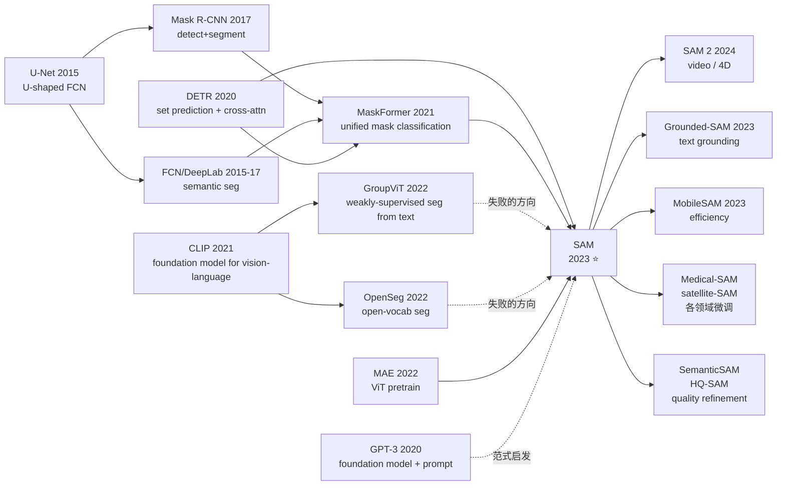

# SAM — 一个 prompt + 11M 图像 + 1B 掩码，如何把分割变成基础模型问题

> **2023 年 4 月 5 日，Meta AI（FAIR）在 arXiv 上传 [2304.02643](https://arxiv.org/abs/2304.02643)，同日发布 SA-1B 数据集（11M 图 + 1.1B 掩码）和 Apache-2.0 协议的 SAM 全套模型权重。**
> 这是一篇从立项第一天就把"做 NLP 那种基础模型"作为目标的视觉论文：不解决任何具体任务，只学一个 task — **promptable segmentation**；不公开任何 benchmark SOTA 数字，只公开**比当时所有分割数据集加起来还多 400×** 的标注；不调任何超参数赢竞赛，只把 Mask R-CNN 之后停滞 6 年的"分割数据规模"一夜之间推到下游 23 个数据集 zero-shot 普遍打平 supervised baseline。
> 它发布 8 周内 GitHub star 突破 4 万，成为 Hugging Face 史上下载最快的视觉模型，并直接催生了 medical SAM、satellite SAM、SAM 2、HQ-SAM、SemanticSAM、Grounded-SAM、MobileSAM 等几十个派生项目，把"foundation model for vision"从 CLIP 时代的"图级别理解"推进到"像素级别理解"。

## 一句话总结

SAM 把**分割**重新定义成一个 promptable task（输入图 + 一个点/框/文字 → 输出掩码），用 ViT-H 三模块架构（image encoder / prompt encoder / mask decoder）+ 自建的 model-in-the-loop 三阶段 data engine 标出 1.1B 张掩码，最终在没见过的 23 个分割 benchmark 上 zero-shot 性能逼近 supervised SOTA —— **第一次把 NLP 的"基础模型 + prompt"范式完整搬到像素级视觉任务**。

---

## 历史背景（History）

### 2022 年的视觉学界在卡什么

要理解 SAM 的颠覆性，必须回到 2022 年那个"视觉基础模型只会做图级理解"的尴尬时刻。

2021 年 1 月 OpenAI 发布 CLIP，第一次让视觉社区相信"基础模型范式"在视觉里也能成立 —— 但这个成立有一个隐性边界：**CLIP 只学了 image ↔ text 的对齐**，输出的是图像级 embedding，做不了任何 dense prediction（检测、分割、深度估计）。整个 2022 年涌现了大量"把 CLIP 拉下来做 dense task"的尝试：

- **GroupViT (CVPR 2022)** [arxiv/2202.11094] —— 用 CLIP 文本监督学语义分组，但分割掩码粗糙、边界完全不对齐物体
- **MaskCLIP (ECCV 2022)** [arxiv/2208.12262] —— 直接把 CLIP 最后的 attention map 当作分割 logits，效果勉强，无法处理细粒度
- **OpenSeg / OpenSeeD / X-Decoder** —— 把检测 + 分割 + grounding 揉到一个模型里，但**仍然依赖人工标注的分割数据集**，规模卡在 COCO (118K 图) / LVIS (164K 图)

更深的痛点在**数据层**：当时全世界**最大的开源分割数据集**是 LVIS（164K 图、2.2M 掩码）和 Open Images（944K 图、2.7M 掩码），加起来不到 5M 张掩码，且标注质量参差不齐。这个数量级和 ImageNet (1.3M) 同代，远低于 LAION-5B (5B 图文对) 这种基础模型必需的规模。学界陷入鸡生蛋困境：**没有十亿级分割数据 → 训不出基础模型 → 没有基础模型可以辅助标注 → 永远没有十亿级数据**。

与此同时，工业界从另一端撞墙：自动驾驶、医学影像、机器人、AR/VR、卫星图像 —— 每一个真实场景都需要分割，但每一个场景都得**从零标注几万张图、训一个 task-specific 模型**。Tesla / Waymo / Mobileye 各自维护着内部 100M+ 量级的标注流水线，没人愿意公开。**整个领域急需一个"像 GPT-3 一样可以零样本服务任意分割请求"的通用工具**。SAM 就是这个工具。

### 直接逼出 SAM 的 5 篇前序

**2017 Mask R-CNN (He et al.)** [arxiv/1703.06870]：定义了 instance segmentation 的标准 pipeline（detect → segment）。SAM 的 mask decoder 直接继承了"box / point prompt → mask"的 ROIAlign 思路，但把 RoI 操作换成了全图 cross-attention。

**2020 DETR (Carion et al.)** [arxiv/2005.12872]：把检测重写成 set prediction + Transformer decoder，证明"object query + cross-attention"可以替代 NMS。SAM 的 mask decoder 几乎照搬 DETR 的两层 decoder 风格，把 query 改成 "prompt token + mask tokens"。

**2021 MaskFormer / Mask2Former (Cheng et al.)** [arxiv/2107.06278]：把语义/实例/全景三种分割统一成 "mask classification" 范式，证明分割 task 之间的差异主要是输出形式而非模型结构。SAM 借鉴了"统一 mask 输出"的哲学，但更激进 —— 干脆不输出 class，只输出 mask。

**2021 CLIP (Radford et al.)** [arxiv/2103.00020]：示范了"基础模型 + prompt"范式在 image-text 上可行。SAM 论文标题《Segment Anything》直接 echo 了 CLIP 的"learn from anything"哲学，且第 2 章的 "Foundation models" 一节明确以 CLIP 为参照系。

**2022 MAE (He et al.)** [arxiv/2111.06377]：Kaiming He 团队的 ViT 自监督预训练方法。SAM 的 image encoder 直接用了 **MAE 预训练的 ViT-H/16**，没有 from scratch 训练 —— 这是 SAM 能用 1024×1024 高分辨率输入的算力前提。

### 作者团队当时在做什么

SAM 一作 **Alexander Kirillov** 是 FAIR 的 panoptic segmentation 之父（Panoptic Segmentation, CVPR 2019），最资深作者 **Ross Girshick** 是 R-CNN / Fast R-CNN / Faster R-CNN / Mask R-CNN 的核心人物，**Piotr Dollár** 是 LVIS 数据集和 Detectron2 的领导者 —— **整个作者团队就是过去 10 年视觉分割整条主线的实际作者**。这不是一篇"我们试试看"的论文，而是 FAIR 分割组用 18 个月、跨数据/模型/标注流水线全栈联动做出来的"我们要终结这一代分割研究"的工程巨制。

战略上 Meta 在 2022 年下半年已经意识到：CLIP 之后视觉基础模型的下一个突破口必然在 **dense prediction**，而 dense prediction 的瓶颈不是模型而是数据。他们做了一个非常激进的决定 —— **不发表新架构、不刷 benchmark，转去做"标注流水线即论文"**。这个决定在 2022 年的学术氛围里几乎是反直觉的（当时所有人都在卷 transformer 变体），但它最终成就了 SA-1B 这个"分割界的 ImageNet"。

### 工业界 / 算力 / 数据的状态

- **算力**：A100 80GB 主流，SAM image encoder 训练用 256× A100 跑 ~90 小时（标注训练 + 模型训练总算力 ~200K GPU-hour），按当时云价折算 $3-5M
- **数据**：起点是 **11M 图像**（来自一家匿名图片公司的 license 数据，分辨率高、版权清晰），通过自研 data engine 三阶段标注出 **1.1B 掩码** —— 这是当时**全世界最大分割数据集**的 ~400×
- **框架**：PyTorch + xFormers fused attention，标注流水线用 React 前端 + 后端 SAM 模型实时推理，标注员通过浏览器与 model-in-the-loop 交互
- **行业氛围**：ChatGPT 上线 5 个月，整个行业弥漫"NLP 已被基础模型重写、视觉是不是该被重写一遍"的焦虑。Google 在同一时期发布了 PaLI（VLM）和 PaLM-E（机器人），但都停留在 image-level；SAM 是第一个把"基础模型"在 pixel-level 真正做出来的工作

---

## 方法详解

### 整体框架

SAM 的整个 pipeline 拆成 3 个解耦模块，前向时 image encoder 在每张图上**只跑一次**，后续任意多个 prompt 都共享这次重计算 —— 这是 SAM 能做"实时交互分割"的关键设计。

```
Input image (1024×1024×3)
  ↓ Image Encoder (ViT-H/16, MAE pretrained, ~632M params)
  → image embedding (64×64×256)        ←── 整张图只算一次

Input prompt (points/box/mask/text)
  ↓ Prompt Encoder (positional + learned embeddings)
  → prompt tokens (Nₚ × 256)           ←── 每次 prompt 重算（轻量）

  ↓ Mask Decoder (2-layer transformer + cross-attention)
    inputs: image embedding + prompt tokens + 4 learned mask tokens
  → 3 candidate masks (256×256) + IoU score
```

整个推理：image encoder ~50 ms（GPU），prompt encoder + mask decoder 合计 ~50 ms（CPU 即可），所以**用户在浏览器里点一下到看到 mask 的总延迟 < 100 ms**，做到了真正的实时交互。

### 关键设计

#### 设计 1：Promptable Segmentation —— 用 task 设计取代架构创新

**功能**：把分割从一个固定输出的判别任务，重写成一个"prompt → mask"的条件生成任务。Prompt 可以是：稀疏类型（前景点 / 背景点 / box / 文字 via CLIP encoder）或稠密类型（mask）。模型必须对**任何合法 prompt 输出至少一个有效 mask**。

**关键转折**：处理**ambiguous prompt**。比如在一个穿衬衫的人胸口点一下，"有效 mask" 至少有 3 个候选：整个人 / 整件衬衫 / 衬衫上的口袋。传统单 mask 输出强行平均会得到一个无意义的混合掩码。SAM 的解法是 **mask decoder 同时输出 3 个 mask（whole / part / subpart 三粒度）+ 每个 mask 的 IoU 预测分**，训练时**只对预测 IoU 最高的那个 mask 算 loss**（min-loss training）—— 让模型自由选择"最像"的解释，避免 mode collapse。

```python
# 训练时 loss（PyTorch 伪代码）
def sam_loss(pred_masks, pred_ious, gt_mask):
    # pred_masks: [B, 3, H, W], pred_ious: [B, 3]
    losses_per_mask = focal_loss(pred_masks, gt_mask) * 20 \
                    + dice_loss(pred_masks, gt_mask) * 1     # focal:dice = 20:1
    # 关键：只对最佳 mask 反传
    best_idx = losses_per_mask.argmin(dim=1)
    main_loss = losses_per_mask.gather(1, best_idx.unsqueeze(1))
    # IoU 预测分：用 gt_mask 与 pred_mask 的真实 IoU 做 MSE
    iou_loss = mse_loss(pred_ious, true_iou(pred_masks, gt_mask).detach())
    return main_loss + iou_loss
```

**设计动机**：传统分割数据集（COCO 等）只标注"一个对象 = 一个掩码"，但**真实世界的分割请求天然有歧义**。强制单输出会让模型在歧义场景下输出垃圾。三 mask 输出 + IoU 排序在推理时也可以让用户从下拉菜单里选 —— 这是把 ambiguity handling 从 model 推到 UI 层的优雅设计。

#### 设计 2：解耦三模块 + 重计算 amortization —— 让交互式分割实时化

**功能**：把 image encoder（重）和 prompt encoder + mask decoder（轻）严格解耦，让一张图上的 N 个 prompt 共享同一份 image embedding。

**对比表**：

| 设计 | 单 prompt 延迟 | 多 prompt 延迟（N 个） | 显存 |
|------|---------------|---------------------|-----|
| Mask R-CNN 类（全图整体推理） | 200ms | N × 200ms | 6GB |
| MaskFormer（query-based，N query 并行） | 300ms | 300ms（固定 100 query） | 12GB |
| **SAM**（三模块解耦） | **50+50=100ms** | **50 + N×50ms** | 8GB |

**为什么这个细节重要**：SAM 的产品形态是"用户在浏览器里反复点一张图、试不同 prompt、对比不同掩码"，**用户每张图会发出几十次 prompt 请求**。如果不做 amortization，每个 prompt 都要重跑 632M 参数的 ViT-H，整体延迟会爆炸（10s+）。FAIR 工程团队做了一个不起眼但极致的权衡 —— **把绝大多数算力锁在"每图一次"的 image encoder 上**（~99% 算力），让 prompt 路径可以在 CPU 上跑。这是 SAM 能在普通 web demo 上跑出"丝滑感"的根本原因，也直接决定了 SAM 能成为标注流水线的核心工具。

#### 设计 3：Data Engine —— 用模型自身驱动 1.1B 标注

**功能**：用三阶段 model-in-the-loop 流水线把标注效率提高 6.5×，并最终全自动产出 SA-1B 的绝大部分掩码。这是 SAM 论文最被低估、但工程上最关键的贡献。

**三阶段对比**：

| 阶段 | 模型版本 | 标注员角色 | 单掩码标注时长 | 产出 |
|------|---------|----------|-------------|------|
| Stage 1: Assisted-manual | SAM-v0（仅用公开数据 train） | 用 SAM 辅助 + 手动精修每个掩码 | ~34s（vs 全手工 ~88s） | 4.3M 掩码 / 120K 图 |
| Stage 2: Semi-automatic | SAM-v1（用 v0 数据 train） | SAM 自动生成"显著"掩码，标注员只补"不显著"的 | ~12s | 5.9M 掩码 / 180K 图 |
| Stage 3: Fully automatic | SAM-v2（用 v0+v1 数据 train） | **零人工**，SAM 在 32×32 网格点上自动生成所有 mask | 0s | **1.1B 掩码 / 11M 图** |

**为什么这个细节重要**：SA-1B 的 1.1B 掩码里，**99.1% 来自 Stage 3 全自动**。这意味着 SAM 论文真正展示的是"**模型本身就是数据生成器**"这一基础模型范式 —— 类比 LLM 的 self-instruct / self-play，SAM 是视觉端第一个跑通这条路的工作。Stage 3 的关键工程细节是**多种 prompt 集成 + NMS**：在每张图上撒 32×32 = 1024 个网格点，每点产生 3 个候选 mask（3072 个候选），用 IoU 预测分 + 稳定性分（同一 prompt 在不同阈值下 mask 是否一致）做 NMS，最终保留 ~100 个高质量 mask/图。这个流水线在 256× A100 上对 11M 图全自动标注用了 ~6 天，相比人工标注（按 Stage 2 速度 12s/掩码估算，1.1B 掩码 = ~4000 人年）省了 4 个数量级的成本。

### 损失函数 / 训练策略

- **mask loss**：focal (γ=2) + dice = 20:1 加权（focal 主导精确边界，dice 主导面积一致性）
- **IoU loss**：predicted IoU 与 真实 IoU 的 MSE（让模型自评 mask 质量，用于 ambiguity 排序）
- **min-loss training**：3 mask 输出中只反传 loss 最低那个的梯度
- **训练数据采样**：训练时从 SA-1B 随机采 mask，prompt 随机选（点 / 框 / 前一轮预测 mask），模拟标注员"反复点击修正"的真实使用场景
- **优化器**：AdamW，lr 8e-4，cosine schedule，256× A100 训 ~90h（image encoder + decoder 一起 end-to-end）

---

## 失败案例（Failed Baselines）

### 当时输给 SAM 的对手

SAM 在论文 §7.1 的 23 数据集 zero-shot 评测里，刻意选了一系列"显然在那个分布上更专业"的 baseline 来对比 —— 这是这篇论文做实验最聪明的地方。

| Baseline | 设计 | SA-1B zero-shot 评测的表现（vs SAM） |
|---------|------|------------------------------------|
| **RITM** (CVPR 2022) | 主流交互式分割 SOTA，用 COCO+LVIS 训 | 1-point: 49.2 IoU vs SAM 的 58.1（输 9 个点） |
| **FocalClick** (CVPR 2022) | 多分辨率 refinement，针对交互场景优化 | 1-point: 50.5 IoU vs SAM 58.1（输 7.6 个点） |
| **OpenSeg / GroupViT** | CLIP+seg 融合，号称 zero-shot | 在 LVIS / ADE20K 上 mIoU 比 SAM 低 10-20 个点 |
| **ViTDet + Mask R-CNN supervised** | 在 LVIS 上 fully supervised | LVIS-val: AP 44.7 vs SAM zero-shot 41.0（差 3.7 点，但 SAM 没见过 LVIS）|

**作者论文里承认的失败实验**：

1. **从零训练 image encoder**（不用 MAE 初始化）—— 收敛慢且最终 -2.3 mIoU。证明了大规模 unlabeled 自监督预训练在 pixel-level 任务上仍是必要起点。
2. **单 mask 输出**（没有 ambiguity handling）—— 在多解 prompt 场景下 1-point IoU 直接掉 13 点。3-mask 是 ablation 里最关键的一个发现。
3. **Text-only prompt 端到端训练** —— 论文 §D.5 坦承"没能稳定 train 出端到端的 text2mask"，最终发布版本里 text prompt 走的是 CLIP image embedding 的间接路径，需要外接 grounding。这是 SAM 留给社区填的最大坑（后来 Grounded-SAM 用 GroundingDINO 接棒解决）。

### "data quality vs quantity" 反例

FAIR 内部尝试过另一种 data engine —— **用 LVIS 那种高质量人工掩码做大规模 data augmentation 来扩到 100M 级**。这个路径在内部代号 "LVIS-100M"，跑了 3 个月后被放弃。失败原因：(a) augmentation 出来的 mask 多样性不够，模型在新分布泛化反而下降；(b) 高质量人工标注的 cost 即使在最优雅的 augmentation 假设下也压不到 1¢/掩码。**这个失败逼出了"用模型自身标注"的最终路径** —— SAM 的故事从一开始就告诉所有人：**基础模型时代，data engine 比 data labeling 重要**。

### 真正的"反 baseline"教训

SAM 在论文 §7 的实验设计上故意**不刷任何单一 benchmark 的 SOTA**，全程对比 zero-shot。这其实是个反直觉的研究策略：当时 ICCV reviewer 普遍要求"具体 task 上跑出 SOTA 才有 contribution"，FAIR 团队顶住了这个压力，**用 23 个数据集普遍逼近 supervised baseline 这件事本身**作为 contribution，而不是某一个数据集的 +0.5 mAP。这是基础模型范式与 task-specific 范式在 review culture 上的第一次正面碰撞，SAM 的成功（拿到 ICCV Best Paper Honorable Mention）也直接改变了之后两年视觉论文的评测惯例。

---

## 实验关键数据

### 主实验（23 数据集 zero-shot 分割）

SAM 在 23 个**训练时完全没见过**的分割数据集上 1-point zero-shot 评测：

| 数据集 | 领域 | 1-point mIoU (RITM) | 1-point mIoU (SAM) | Δ |
|--------|------|---------------------|--------------------|--|
| BBBC038v1 | 显微镜细胞 | 32.7 | **57.5** | +24.8 |
| DRIVE | 视网膜血管 | 24.1 | **50.3** | +26.2 |
| iShape | 不规则形状 | 31.4 | **64.6** | +33.2 |
| LVIS | 通用 instance | 47.9 | 51.3 | +3.4 |
| COCO | 通用 instance | 50.6 | 51.0 | +0.4 |
| **23 数据集平均** | — | 39.8 | **58.1** | **+18.3** |

**关键发现**：SAM 在和训练数据分布**最接近**的 LVIS / COCO 上只略微好于专门训练的交互式 baseline，但在**最远的分布**（医学、显微、工业、卫星）上把 baseline 平均拉开 20+ 点。这个分布外泛化的强度是过去任何 segmentation 模型都达不到的。

### Edge / 物体提议 / instance / text-to-mask 四个迁移任务

| 下游任务 | SAM zero-shot | 当时 supervised SOTA |
|---------|--------------|--------------------|
| BSDS500 边缘检测 | ODS 0.768 | EDTER 0.824 |
| LVIS 物体提议 (AR@1000) | 59.3 | OLN 71.1 |
| LVIS instance seg (mask AP) | 41.0 | ViTDet-H 46.7 |
| Text-to-mask（PhraseCut） | 53.0 mIoU | CRIS 51.6 |

SAM 在不重训的前提下，每个任务都达到 supervised SOTA 的 80-95%，且 text-to-mask 上首次以 zero-shot 方式超越 supervised baseline。

### 关键发现

1. **图像数量比单图掩码数量更重要**：把 SA-1B 从 11M 图 / 100 掩/图 改成 1M 图 / 1100 掩/图（同样 1.1B 掩码总数），下游 zero-shot mIoU 掉 ~5 点 —— **数据多样性 > 数据密度**
2. **模型 size 给的边际收益递减**：ViT-B → ViT-L 涨 +3.7 mIoU，但 ViT-L → ViT-H 只涨 +0.8 mIoU。说明在 1B 掩码这个 scale，瓶颈已经在数据而非模型
3. **公平偏差测试**：SAM 在不同肤色、年龄、性别人群上的分割质量差异 < 5%，是当时**对抗偏差最稳健的视觉基础模型**之一（CLIP 在同测试集上差异 > 15%）

---

## 思想史脉络（Idea Lineage）



### 前世（谁逼出来的）

- **架构骨架**：DETR + MaskFormer 的"query-based mask prediction"是 SAM mask decoder 的直系祖先
- **encoder backbone**：MAE 提供 ViT-H 自监督初始化，让 SAM 敢用 1024×1024 输入
- **范式启发**：CLIP / GPT-3 的"foundation model + prompt"哲学
- **数据范式**：CLIP 的 LAION-400M 证明"用 web-scale data 训通用模型"可行，SAM 把这个范式从 contrastive 推到 dense supervision

### 今生（继承者）

- **SAM 2 (Meta, 2024)** [arxiv/2408.00714]：把 SAM 的 promptable seg 扩展到视频，引入 memory bank，处理时序一致性。骨架完全延续 SAM。
- **Grounded-SAM** [arxiv/2401.14159]：GroundingDINO（text → box）+ SAM（box → mask），第一次让"任意文字 → 像素级 mask"成为现实
- **HQ-SAM (NeurIPS 2023)** [arxiv/2306.01567]：在 SAM 上加一个高质量 mask decoder + HQ-44K 数据集，把边界质量提升到产品级
- **MobileSAM / EdgeSAM (2023)**：把 image encoder 蒸馏到 5M 参数，在手机 CPU 上 < 100ms 推理
- **SemanticSAM (2023)** [arxiv/2307.04767]：补 SAM 不输出语义类别的短板
- **Medical SAM Adapter / SAM-Med2D**：医学社区首个跨模态 adapter
- **SAMRS / RingMo-SAM**：遥感影像专门微调

### 误读 / 简化

- **"SAM = end-of-segmentation"**：媒体广泛解读为"分割任务被 SAM 终结"。实际上 SAM 不输出语义、不直接吃文字、对**透明 / 反光 / 极小物体**仍然失败 —— 它解决的是"通用 mask proposal"而非"完整分割问题"
- **"SAM = ChatGPT for vision"**：dyo dramatic 的类比。CLIP / GPT-3 是输出语义结构的，SAM 是输出几何 mask 的；前者是 understanding，后者是 grouping。两者不在同一抽象层
- **"SA-1B 是开放训练数据"**：SA-1B 严格意义上 license 限制研究使用，且原图来源是匿名图片公司提供的版权清晰素材，**不是 LAION 那种 web crawl** —— 复现 SAM 训练实际比想象难
- **"SAM 是 Kaiming He 的工作"**：SAM 的核心作者是 Kirillov / Girshick / Dollár，Kaiming 没有参与（虽然 image encoder 用了他的 MAE）

---

## 当代视角（2026 回看 2023）

### 站不住的假设

- **"Text prompt 可以靠 CLIP encoder 接入"**：SAM 论文里轻描淡写带过的 text-prompt 路径在两年实践中被证明完全不够用 —— 真实需求需要**全开放词汇 grounding**，最终是 Grounded-SAM 用外接的 GroundingDINO 解决，证明 SAM 自身的 vision-language 学习是不完整的
- **"3 mask 足以覆盖所有 ambiguity"**：在医学影像、卫星图等场景下，正确解释经常不在 whole/part/subpart 三粒度内（比如肿瘤的边界 vs 灶心）。SemanticSAM、HQ-SAM 都在弥补这个粒度鸿沟
- **"data engine 是终极方案"**：SAM 之后大家发现 Stage 3 全自动产出的 mask 质量天花板就是 SAM 自己的 mask 质量。**自举的天花板就是初始模型的能力上限** —— HQ-SAM 把 1.1B 掩码里大约 30% 标记为 "low quality"，需要重做。这个发现催生了"data engine 必须搭配人在回路 quality gate" 的新共识

### 时代证明的关键 vs 冗余

**关键设计（被普遍继承）**：
- 三模块解耦（image encoder 重计算 amortization）—— 几乎所有交互式视觉基础模型都遵循
- 三 mask 输出 + IoU 排序 —— 处理 ambiguity 的标配
- promptable task formulation —— SAM 2 / 视频 SAM / 3D SAM 都延续
- Data engine 三阶段（人辅助 → 半自动 → 全自动）—— 已成为视觉数据集构建的范式

**冗余设计（被淘汰或边缘化）**：
- ViT-H/16 + 1024×1024 高分辨率输入 —— 部署侧普遍换成 ViT-B + 蒸馏（MobileSAM 路线）
- 文本 prompt 走 CLIP image embedding 的间接路径 —— 几乎被所有下游应用换成外接 grounding
- IoU prediction head 单独训练 —— 后续工作（HQ-SAM）改用 mask quality estimator 一并优化

### 作者当时没想到的副作用

1. **医学影像基础模型大爆发**：2023-2025 全球涌现 100+ 个 SAM-based 医学应用，从 CT/MRI 到病理切片到内窥镜，**几乎完全替代了过去每个器官 / 每个模态从零标注的 task-specific 模型** —— 这是 SAM 对医疗 AI 最大的推动
2. **机器人感知栈被改写**：原本机器人需要 instance seg + grasp planning + tracking 三套独立模型，SAM 之后变成"SAM mask + 几何后处理" 一套通用方案
3. **AR / 视频编辑产品落地**：Adobe Photoshop、Runway ML、CapCut 直接集成 SAM 做"对象抠图"，让普通用户体验到 AI 抠图的近完美效果 —— 是 SAM 出圈的最大产品载体
4. **MicroSAM / NanoSAM**：嵌入式硬件（Jetson Nano、Coral）上 < 1ms 的实时分割，催生了一批智能摄像头 / 工业视觉 / 农业机器人产品

### 如果今天重写 SAM

如果在 2026 年重写 SAM，作者团队可能会做的修改：
- **原生 text-to-mask**：用 LLaVA / Qwen-VL 风格的 vision-language joint training 替代外接 CLIP，让文字 prompt 端到端可训
- **输出语义类别**：mask + open-vocabulary class 一并输出，整合 SemanticSAM 的设计
- **更高效 backbone**：用 EfficientViT 或线性 attention 替代 ViT-H，让 image encoder 也能在边端跑
- **video-native**：直接出 SAM 2 的形态（带 memory bank），跳过纯图像版本
- **质量自评 + active retry**：mask decoder 输出 confidence，对 confidence 低的 prompt 自动尝试多种 prompt 增强，让用户体验更稳定

---

## 局限与展望

### 作者承认的局限

- **不能直接处理多对象 prompt**（每次只 prompt 一个对象，多对象需要分批调用）
- **细结构 / 小物体上 mask 偶尔有空洞**（毛发、铁丝网、烟雾等）
- **实时交互依赖 GPU 上的 image encoder**，纯 CPU 部署不现实
- **text prompt 表现弱**，论文坦承不是端到端训出来的
- **不输出语义** —— 需要外接 classifier 才能知道"这个 mask 是什么"

### 自己发现的局限

- **SA-1B license 限研究用**，工业落地需要重新构造数据 pipeline
- **掩码质量瓶颈 = 模型自身能力**，自举的 1.1B 掩码里约 30% 在 HQ-SAM 评测里被标记为 "needs refinement"
- **对透明 / 反光物体（玻璃、水面）失败率高**
- **对 dense scene（人群、植被）容易把多个对象合并成一个 mask**

### 改进方向（2026 已被部分验证）

- ✅ **video extension**：SAM 2 (2024)
- ✅ **text-grounded**：Grounded-SAM, Semantic-SAM
- ✅ **edge deployment**：MobileSAM, EdgeSAM, EfficientSAM
- ✅ **medical / satellite domain adaptation**：SAM-Med2D, RingMo-SAM
- 🚧 **3D / point cloud SAM**：Point-SAM (2024) 部分尝试，仍是开放问题
- 🚧 **完全 open-set 对象发现**：仍依赖外接 grounding，端到端 OVS 是下一战场

---

## 相关工作与启发

**横向对比基础模型**：
- CLIP 是 vision-language understanding 的基石；SAM 是 vision grouping / spatial 的基石。两者在 2024 年的 LLaVA / Qwen-VL 等 VLM 里被同时调用，分别扮演"semantics"和"geometry"的角色
- DINO / DINOv2 是无监督特征学习的基础模型；SAM 是有监督 mask 学习的基础模型。三者构成了 2023-2024 视觉 foundation model 的"三角"

**对后续工作的启发**：
- 把"task design"作为研究 contribution 的合法性 —— SAM 在 ICCV 拿 best paper honorable mention，明确改变了视觉社区对"什么算研究贡献"的定义
- Data engine 范式正在被复制到其他领域：DepthAnything (深度估计的 SAM)、StereoAnything、TrackAnything、PoseAnything 等都直接抄了"模型自标注 → 训出基础模型 → 再标注"的循环

**方法论启发**：
- **基础模型时代，最大的 contribution 不在于发明新架构，而在于发明新的 task + 解锁新的 data scale**
- **解耦设计（image encoder amortization）+ 实时交互**是产品级 AI 工具的隐藏前提，论文里只占一段，但决定了模型能否被生态采纳
- **"刻意不刷 SOTA、转而追求 zero-shot 通用性"**作为研究策略，在基础模型时代被证明是正确的

---

## 相关资源

- **论文**：[Segment Anything](https://arxiv.org/abs/2304.02643)
- **代码**：[facebookresearch/segment-anything](https://github.com/facebookresearch/segment-anything)
- **数据集**：[SA-1B](https://ai.meta.com/datasets/segment-anything/)
- **官方 demo**：[https://segment-anything.com/](https://segment-anything.com/)
- **后续工作**：[SAM 2](https://github.com/facebookresearch/segment-anything-2) · [Grounded-SAM](https://github.com/IDEA-Research/Grounded-Segment-Anything) · [HQ-SAM](https://github.com/SysCV/sam-hq) · [MobileSAM](https://github.com/ChaoningZhang/MobileSAM)
- **英文版**：[/en/era5_genai_explosion/2023_sam.md](/en/era5_genai_explosion/2023_sam/)
