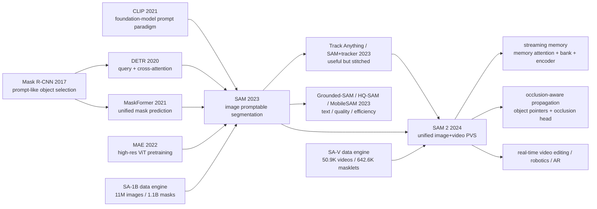

# SAM — 一个 prompt + 11M 图像 + 1B 掩码，如何把分割变成基础模型问题

> **2023 年 4 月，Meta 用 [Segment Anything](https://arxiv.org/abs/2304.02643) 把“给一个 prompt 就返回像素级边界”做成了视觉里的通用接口；仅仅一年多后，他们又在 [SAM 2](https://arxiv.org/abs/2408.00714) 与 [官方项目页](https://ai.meta.com/sam2/) 上亲手证明，真正难的从来不是把一张图抠干净，而是让同一个对象在整段视频里被持续记住、被纠错、被重新找回。**
> 如果说 SAM 最震撼的数字是 SA-1B 的 11M 图像与 1.1B 掩码，那么 SAM 2 的转折点就是把这条路线推进到时间维：统一 image/video promptable segmentation、引入 per-session streaming memory、用覆盖 47 个国家的 SA-V 把视频数据推到约 51K 视频与约 600K masklets。于是这条主线真正改变的，不只是分割精度，而是视觉系统对“交互”“记忆”“数据飞轮”三件事的组织方式。

## 一句话总结

SAM 这篇 ICCV 2023 代表作真正做成的事，不只是用 SA-1B 把 zero-shot 分割推到了 58.1 的 23 数据集平均 1-click mIoU，而是把分割重写成一个可复用接口：原版写成 $m=f_\theta(I,p)$，任何点、框或 mask prompt 都能直接换来一个有效边界；而 [SAM 2](https://arxiv.org/abs/2408.00714) 则把同一逻辑推进成 $m_t=f_\theta(I_t,p_t,\mathcal{M}_{<t})$，在不丢掉图像能力的前提下，补上 unified image/video promptable segmentation、per-session streaming memory、memory attention 与 memory bank/encoder、object pointers 加 occlusion head，以及靠 SA-V 数据飞轮支撑的跨帧纠错能力。于是它不只是赢过 RITM、FocalClick 这类单图交互基线，也进一步解释了为什么 “SAM + tracker” 会输给原生视频版：后者在视频里能以更好精度使用 3\times 更少交互，在图像上还比原始 SAM 快 6\times。

---

## 历史背景

### 2022 年的视觉基础模型卡在哪里

要理解 SAM 为什么会在 2023 年引爆视觉圈，最好先回到 2022 年那个有点尴尬的阶段。当时 [CLIP](/era4_foundation_models/2021_clip/) 已经证明“基础模型”这套叙事在视觉里成立，但它成立的位置仍然停在图像级语义：模型能判断这张图像和哪段文字匹配，却不能告诉你“杯子的边界在哪”“人的手和衣服该如何分开”“视频里这个被遮挡后又出现的物体是不是同一个目标”。换句话说，视觉基础模型已经学会了“认识这是什么”，却还不会“把它从像素里抠出来”。

那一年几条路线都在补这个空档。GroupViT、MaskCLIP、OpenSeg、X-Decoder 一类方法试图把 CLIP 的语义能力往 dense prediction 上压，但它们仍然高度依赖现成标注集，边界质量也远不够稳定。更根本的问题在数据层：当时公开世界里最大的分割数据集仍然是 LVIS、Open Images 这一量级，掩码总数只有几百万，与 LAION-5B 这种基础模型级别的互联网规模根本不是一回事。没有十亿级掩码，就很难训练出真正 class-agnostic、promptable 的分割模型；没有这样的模型，又不可能高效率地生产十亿级掩码。视觉分割因此卡在一个非常典型的基础模型前夜困境里。

### 直接逼出 SAM 的五条前序技术线

SAM 并不是“凭空冒出来的新架构”，它更像是把几条已经成熟但彼此分离的技术线第一次拧成了一条主线。

- Mask R-CNN 给出了“框定目标再预测掩码”的交互直觉，让点、框、已有 mask 都可以被理解成一种提示对象边界的 prompt。
- [DETR](/era4_foundation_models/2020_detr/) 证明了 object query 加 cross-attention 能替代传统 proposal/NMS 管线，给了 SAM 后来的 decoder 骨架。
- MaskFormer / Mask2Former 让社区接受“分割任务之间主要差异在输出协议，而不是一定要换一整套网络”的看法。
- [MAE](/era4_foundation_models/2022_dit/) 之外的自监督 ViT 预训练潮流，尤其 MAE 本身，给了高分辨率图像编码一个算力上可承受的起点。
- [GPT-3](/era4_foundation_models/2020_ddpm/) 与 [CLIP](/era4_foundation_models/2021_clip/) 带来的更深层启发，则是“先做一个足够通用的接口，再让 prompt 把任务具象化”。

所以 SAM 的关键不是它比前人多发明了多少层，而是它第一次把分割任务表述成了统一接口：给定图像 $I$ 和 prompt $p$，直接输出一个有效掩码 $m=f_\theta(I,p)$。这一步让分割从“为某个 benchmark 专门训练的任务头”变成了“任何下游系统都可以调用的像素级 API”。

### 作者团队与 Meta 的战略判断

SAM 的作者名单本身就说明了这篇论文的分量。Alexander Kirillov、Ross Girshick、Piotr Doll\u00e1r 这些名字，本来就横跨了过去十年分割、检测和大规模标注体系的主线。他们对问题的判断也非常 Meta：如果视觉基础模型下一步要成立，瓶颈不在“再做一个更花哨的 decoder”，而在“先把分割数据规模从百万级推到十亿级”。

这也是为什么 SAM 读起来不像一篇常规的架构论文。它当然有模型设计，但真正的主角其实是 SA-1B 及其背后的 data engine。Meta 没有把主要篇幅花在“某个新 token 如何提升 0.7 个点”，而是押注在另一件更反直觉的事上：只要把 promptable segmentation 做成一个足够通用、足够快、足够便于人机协作的接口，模型本身就能反过来生产下一轮数据。

## 研究背景与动机

### 为什么 “segment anything” 在图像上成立，却还不够

SAM 之所以一发布就被广泛集成，是因为它把图像分割变成了一种人人可调用的基础能力。用户点一下、框一下，模型就能返回一个像样的 mask；研究者不需要重新收集类别标签，就能在医学、遥感、机器人等新领域立刻做 zero-shot 试验。到这里，SAM 解决的是“单张图像里的开放世界分割接口”问题。

但真正的现实世界感知并不是静止的。视频编辑想要的是“这件衣服在 200 帧里都能被一致抠出来”；机器人想要的是“这个被手挡住后又出现的杯子仍然被看作同一个目标”；AR/VR 想要的是“分割不仅准，而且连续、可修正、可实时”。原版 SAM 在这些需求前面会暴露出一个本质限制：它没有跨帧记忆，每一帧都像第一次见到这个对象。于是 2023 年大量工程系统只能采用“SAM 做单帧分割 + tracker 做跨帧传播”的拼接式方案。它能工作，但交互体验非常脆弱，一旦跟丢，往往得重新在新帧上从头点一轮。

### 从 SA-1B 到 SA-V：任务定义为什么必须升级

这正是 SAM 2 出现时最重要的背景。Meta 在 [SAM 2 论文](https://arxiv.org/abs/2408.00714) 和 [官方项目页](https://ai.meta.com/sam2/) 上讲得很直接：图像版 SAM 解决了静态 promptable segmentation，但一个通用视觉分割系统如果想真的“anything”，就必须同时覆盖 images 和 videos。于是任务本身被升级为 Promptable Visual Segmentation，形式从 $m=f_\theta(I,p)$ 变成 $m_t=f_\theta(I_t,p_t,\mathcal{M}_{<t})$，其中 $\mathcal{M}_{<t}$ 是本次交互 session 内所有历史 prompt、预测和记忆状态。

这个升级不是给 SAM 贴一个“视频版”标签那么简单。它等于把原先只在图像里成立的 prompt 接口，延伸成一个可跨帧传播、可随时纠错、还能在图像上退化回空记忆状态的统一协议。换句话说，SAM 证明了“anything”可以先在静态图像上成立；SAM 2 则证明，如果没有 per-session streaming memory、没有围绕视频构造的新 data engine、没有更大规模的 SA-V 数据集，那么“anything”在视频里只是一个产品幻觉，不是模型能力。

---

## 方法详解

### SAM 的基线架构：先把分割改写成统一接口

SAM 的第一性原理非常简单：不要一开始就问“这是猫还是狗”“这是实例分割还是语义分割”，而是先把问题写成“给我一个 prompt，我返回一个有效边界”。于是整个模型可以被理解为

$$
m = f_\theta(I, p)
$$

其中图像 $I$ 先经过一次重计算的 image encoder，prompt $p$ 再经过一个轻量 prompt encoder，最后由 mask decoder 把两者融合成候选掩码。这套写法的威力不在公式本身，而在它把所有交互形式都压成同一接口：点、框、已有 mask，甚至未来可能的文本，都只是不同的 prompt token。

| 模块 | SAM 中做什么 | 为什么重要 |
|---|---|---|
| Image encoder | 把 1024\times1024 图像编码成可复用特征 | 整张图只算一次，后续交互不必重复跑大模型 |
| Prompt encoder | 把点、框、mask 等提示转成 token | 把“分割哪个目标”从类别标签改成显式交互 |
| Mask decoder | 在图像特征和 prompt 之间做双向注意力，输出多个候选 mask | 允许模型返回“有效解释”，而不是死盯单一答案 |

```python
def segment_anything(image_embedding, prompt_tokens, memory_state=None):
    conditioned = image_embedding if memory_state is None else memory_attention(image_embedding, memory_state)
    masks, iou_scores, object_pointer, occlusion_score = mask_decoder(conditioned, prompt_tokens)
    next_memory = None if memory_state is None else memory_encoder(conditioned, masks, object_pointer, occlusion_score)
    return masks, iou_scores, next_memory
```

#### 设计 1：promptable segmentation 把“任务头”变成“像素级 API”

SAM 真正改写的是任务表述。过去的分割系统大多隐含一个前提：你先知道自己在做哪种分割，再去为那个任务设计监督、类别空间和推理协议。SAM 则把这件事反过来，先只要求模型输出一个“边界明确、在 prompt 语义下成立的有效 mask”。这让它天然支持 class-agnostic 的开放世界场景，也让下游系统不再需要事先决定类别词表。

#### 设计 2：一次图像编码，多次交互复用

SAM 产品体验之所以能成立，靠的不是论文里最吸睛的 SA-1B 数字，而是一个朴素却决定性的工程判断：最贵的图像编码只做一次。后续用户连续点击、框选、修正时，只重跑 prompt encoder 和 decoder。这个 amortization 设计让交互式分割第一次有了“像在 PS 里抠图一样顺手”的延迟。

#### 设计 3：多候选 mask + IoU 预测，专门处理歧义

单击一个自行车轮胎，合理答案可能是轮胎、整辆车，或者被遮挡后只剩一部分的对象局部。SAM 不强迫模型只输出一个答案，而是预测多个 candidate masks，再用 IoU head 排序。这一步很关键，因为它承认真实交互里的 prompt 常常有歧义，而不是假装监督数据里总有唯一真值。

### SAM 2 如何把图像版 SAM 推到视频：把记忆塞进同一个接口

SAM 2 最值得注意的地方，是它并没有推翻 SAM 的 promptable 接口，而是给这个接口加上了 session memory。论文把图像视作单帧视频，因此统一后的任务可写成

$$
m_t = f_\theta(I_t, p_t, \mathcal{M}_{<t})
$$

这里的 $\mathcal{M}_{<t}$ 不是抽象口号，而是一次交互 session 里真正存下来的历史状态：过去帧的空间记忆、被 prompt 过的关键帧、前几帧 decoder 产出的 object pointers，以及物体当前是否可见的 occlusion 线索。这样一来，SAM 2 在图像上退化为“空记忆的 SAM”，在视频上则自然升级为一个能跨帧传播的统一模型。

#### 设计 4：unified image/video promptable segmentation

根据 [SAM 2 论文](https://arxiv.org/abs/2408.00714) 与 [官方页](https://ai.meta.com/sam2/)，SAM 2 的目标不是另外做一个 video tracker，而是把 image segmentation、interactive video segmentation、semi-supervised VOS 都放到同一个 Promptable Visual Segmentation 协议里。用户可以在任意一帧上给点、框或 mask，模型要立刻在当前帧返回结果，并把这个对象传播成一条跨时间的 masklet。原来“图像 SAM + 独立 tracker”的两段式链路，在这里被压成一个模型内部的统一状态机。

#### 设计 5：per-session streaming memory = memory attention + memory bank + memory encoder

SAM 2 解决视频问题的核心不是更大的 backbone，而是流式记忆。它逐帧处理视频，每来一帧先用 image encoder 产出无条件特征，再用 memory attention 让当前帧去 cross-attend 历史 memories 与 object pointers。论文明确说 memory attention 默认堆 4 层 transformer blocks，自注意力之后再对 memory bank 做 cross-attention；这一步让模型不必每次都“从零理解”当前帧，而是带着关于目标外观、局部结构和历史交互的上下文前进。

接着，memory encoder 会把当前帧的预测 mask 下采样，并与原始 frame embedding 融合，形成可写回 memory bank 的空间记忆。memory bank 本身则是两个 FIFO 队列：一个保存最近若干未显式提示帧的 spatial memories，另一个保存曾经被 prompt 过的关键帧记忆。额外还会保留 object pointer 向量，作为比空间特征更轻量的目标身份摘要。这个组合解释了为什么 [Meta 官方页](https://ai.meta.com/sam2/) 会把它描述成 “per-session memory module”：记忆不是全局参数微调，而是属于当前这段交互会话的动态状态。

#### 设计 6：object pointers + occlusion head，让“遮挡后再出现”变成模型内部能力

用户特别容易低估的一点是，视频分割里最难的不是把第一帧抠准，而是目标在被挡住、缩小、变形、再出现之后还能否被认回。SAM 2 为此没有发明一个外部 tracker，而是在 decoder 里引入了 object pointer token，并配了一个 occlusion prediction head。论文 Appendix D 写得很具体：object pointer 来自当前输出 mask 对应的 token，会与空间记忆一起进入 memory bank；同时额外的 occlusion token 预测目标在当前帧是否可见，若判为不可见，则会向记忆特征注入 learned occlusion embedding。

这意味着 SAM 2 处理遮挡的方式并不是“目标消失时暂停系统”，而是继续保留它的指针身份与遮挡标记，让后续帧的 memory attention 仍然能围绕同一目标做条件推理。用户在新帧补一个点击时，模型恢复的不是“重新分一遍这个形状”，而是“把这次修正接到同一个会话身份上继续传播”。这正是 [SAM 2 论文](https://arxiv.org/abs/2408.00714) 所说“单次点击就能恢复对象，而不必像 SAM+tracker 那样从头重启”的本质。

#### 设计 7：video data engine + SA-V，把图像时代的数据飞轮推到时间维

如果说 SAM 的灵魂在 SA-1B，SAM 2 的灵魂就在 SA-V。官方项目页给出的口径是“约 51K 视频、约 600K masklets、覆盖 47 个国家”，论文正式数字则是 50.9K videos、642.6K masklets、35.5M masks，其中 190.9K 为人工 masklets、451.7K 为自动生成并经人工验证的 masklets。更关键的是，SAM 2 沿用了和 SAM 同样的 model-in-the-loop 哲学，但把它改造成了视频原生版本。

Phase 1 仍然近似逐帧人工修正，平均 37.8 秒/帧；Phase 2 加入只能接受 mask prompt 的 SAM 2 Mask，把时间降到 7.4 秒/帧；Phase 3 换成完整 SAM 2 后，标注员只需要偶尔在错误帧上补点击，时间进一步降到 4.5 秒/帧，整体相对 Phase 1 快了 8.4 倍。这里真正厉害的不是“多快了一点”，而是视频 data engine 和 streaming memory 互相增益：模型因为有记忆，才值得把交互设计成跨帧纠错；数据因为允许跨帧纠错，才不断喂给模型真正困难的遮挡、消失、再出现案例。

所以从思想上看，SAM 2 不是给 SAM 外挂一个视频补丁，而是把原论文最核心的两件事同步推广到了时间维：一是 promptable interface，二是 data engine flywheel。

---

## 失败案例

### 2023 年输给 SAM 的图像侧基线

先看原版 SAM 在 2023 年打赢了谁。论文里最有说服力的并不是某一个 benchmark 上多了几点，而是它在 23 个训练时没见过的数据集上，把交互式 zero-shot 分割这件事整体拉到了可用区间。RITM、FocalClick 这类当时的交互式分割强基线，在接近 COCO/LVIS 分布时还能和 SAM 咬住，但一到医学、显微、工业、遥感等分布外场景，优势迅速反转。SAM 因此第一次证明：promptable segmentation 不必靠类别词表，单靠大规模 class-agnostic mask 学习也能形成迁移能力。

| 基线 | 它当时擅长什么 | 与 SAM 的差距 |
|---|---|---|
| RITM | 交互式点击修正，靠 COCO/LVIS 等数据做强监督 | 在 23 数据集平均 1-click mIoU 上明显落后，尤其 OOD 场景差距大 |
| FocalClick | 多分辨率 refinement，追求单图交互精度 | 单图内能修边界，但没有 SA-1B 级通用性 |
| OpenSeg / GroupViT 一类 | 想用 CLIP 语义做 zero-shot 分割 | 语义有余、边界不足，无法稳定输出 pixel-accurate mask |

### SAM 原版在视频上暴露的三处缺口

但如果把视角移到视频，原版 SAM 立刻从“终局模型”变回“一个关键部件”。它至少有三处缺口。

第一，它没有 session memory。对 SAM 来说，第 37 帧和第 1 帧没有本质区别，模型不会记得“这个对象刚才长什么样”“前几帧用户已经点过哪里”“当前帧里这个局部其实属于同一目标”。第二，它无法优雅处理遮挡后再出现。用户在单图上点一次，SAM 能返回一个有效 mask；可一旦物体在视频中短暂消失，SAM 没有内部机制告诉自己该如何把前后两段对象身份连起来。第三，原版数据引擎也是静态图像原生的，它没有见过大量“同一目标跨帧传播、局部丢失、需要在中间帧纠错”的视频交互样本。

这三处缺口决定了 2023 年最流行的工程解法其实不是“直接用 SAM 做视频”，而是“把 SAM 接在 tracker 前面或后面”。这类系统能跑出 demo，但一旦 tracker 走偏，用户补一个点，系统常常要在当前帧重新构造 mask，再从那个点重新传播。交互成本因此不是线性下降，而是不断重启。

### 为什么 “SAM + tracker” 不是 SAM 2

SAM 2 论文在实验里专门把自己和两类强拼接基线比：SAM+XMem++ 与 SAM+Cutie。这个对比很重要，因为它回答了一个常见误解：既然 SAM 已经能分单帧，为什么不直接外接最强 tracker？答案是，外接方案缺的不是一个更强的传播器，而是一个统一的、可纠错的会话记忆。

XMem++ 或 Cutie 的强项是 VOS 传播；SAM 的强项是单帧 promptable segmentation。把两者串起来当然能工作，但中间的“对象身份”“被 prompt 过的关键帧”“错误修正应如何影响后续帧”都不是同一个模型里的原生状态。因此用户一旦在后续帧补点击，系统需要把已有轨迹重新翻译回 SAM 能理解的掩码或点击，再让 tracker 重新起跑。SAM 2 则把这段翻译损耗塞回模型内部，用 memory bank、object pointers 和 occlusion-aware 记忆传播直接消化掉。

## 实验关键数据

### 图像：SAM 先把 zero-shot 分割做成基础能力

原版 SAM 的代表性数字仍然成立。它在 23 个 zero-shot 图像分割数据集上的 1-click 平均 mIoU 做到了 58.1，把 promptable segmentation 从“可演示”推进到“可迁移”。更重要的是，它在视频来源图像、医学图像、显微图像这些与 SA-1B 分布差异很大的场景上仍然有相当稳健的表现，这才让后续社区愿意把它当成通用像素接口来复用。

| 模型 | 训练数据 | SA-23 1-click mIoU | 速度 |
|---|---|---|---|
| SAM (ViT-H) | SA-1B | 58.1 | 21.7 FPS |
| SAM 2 (Hiera-B+) | SA-1B | 58.9 | 130.1 FPS |
| SAM 2 (Hiera-B+) | SA-1B + SA-V + video mix | 61.9 | 130.1 FPS |

这张表里最值得盯住的并不是 58.1 到 58.9 这 0.8 个点，而是速度从 21.7 FPS 到 130.1 FPS，正好接近 [SAM 2 论文](https://arxiv.org/abs/2408.00714) 摘要里那句“图像上比 SAM 快 6\times”。也就是说，SAM 2 不是牺牲图像能力换视频能力；它在图像上反而更快、更准，并且因为统一训练了视频数据，对视频分布导出的图像样本还有额外增益。

### 视频：SAM 2 把交互次数压到原来的三分之一

SAM 2 的核心结果是视频交互体验的跃迁。论文在 9 个 dense zero-shot 视频数据集上，比较了交互式 Promptable Visual Segmentation 场景里的 SAM+XMem++、SAM+Cutie 和 SAM 2。结论很直接：SAM 2 在 offline/online 两种评价协议下都整体领先，而且“在更好精度下使用超过 3\times 更少的交互”。这不是一句营销口号，而是由具体标注时间假设推出来的结果：用户不必在新帧上重建整个对象，只需要在失败帧上补少量点，memory 就能把修正带回同一会话轨迹。

| 视频设置 | SAM + XMem++ | SAM + Cutie | SAM 2 |
|---|---|---|---|
| 17 数据集 1-click | 56.9 | 56.7 | 64.7 |
| 17 数据集 3-click | 68.4 | 70.1 | 75.3 |
| 17 数据集 5-click | 70.6 | 72.2 | 77.6 |
| 17 数据集 bounding box | 67.6 | 69.4 | 74.4 |
| 17 数据集 gt mask | 72.7 | 74.1 | 79.3 |

这些平均值说明，SAM 2 连在传统半监督 VOS 协议里都能稳压专门为 VOS 设计的方法；而在它最想解决的交互式场景里，优势会因为记忆与纠错机制进一步放大。

### 数据：SA-V 怎样把视频分割规模推到新量级

SAM 原版的飞轮靠 SA-1B；SAM 2 把飞轮搬到了视频。官方项目页给出的简洁版数字是“约 51K 视频、约 600K masklets、47 个国家”，而论文精确版给出 50.9K 视频、642.6K masklets、35.5M masks，并明确强调这比已有公开视频分割数据集的 mask 数量高出 53 倍。更关键的是，Meta 没把这些数据当成静态财产，而是把它们组织成三阶段 data engine。

| 阶段 | 标注模式 | 平均时间/帧 | 关键意义 |
|---|---|---|---|
| Phase 1 | SAM 逐帧辅助 + 手工修正 | 37.8 s | 高质量参考，但极慢 |
| Phase 2 | SAM + SAM 2 Mask 传播 | 7.4 s | 把时间维引入标注流程 |
| Phase 3 | 完整 SAM 2 + 偶发 refinement clicks | 4.5 s | 相比 Phase 1 提速 8.4\times，真正形成视频飞轮 |

如果只记一个实验事实，那应该是这个：SAM 让“分割任何图像中的目标”成为了基础模型问题，SAM 2 则让“在视频里持续分割和纠正任何目标”第一次在数据、模型、交互三层同时闭环。

---

## 思想史脉络


```mermaid
graph LR
    A[Mask R-CNN 2017<br/>prompt-like object selection] --> B[DETR 2020<br/>query + cross-attention]
    A --> C[MaskFormer 2021<br/>unified mask prediction]
    D[CLIP 2021<br/>foundation-model prompt paradigm] --> E[SAM 2023<br/>image promptable segmentation]
    B --> E
    C --> E
    F[MAE 2022<br/>high-res ViT pretraining] --> E
    G[SA-1B data engine<br/>11M images / 1.1B masks] --> E
    E --> H[Track Anything / SAM+tracker 2023<br/>useful but stitched]
    E --> I[Grounded-SAM / HQ-SAM / MobileSAM 2023<br/>text / quality / efficiency]
    H --> J[SAM 2 2024<br/>unified image+video PVS]
    E --> J
    K[SA-V data engine<br/>50.9K videos / 642.6K masklets] --> J
    J --> L[streaming memory<br/>memory attention + bank + encoder]
    J --> M[occlusion-aware propagation<br/>object pointers + occlusion head]
    J --> N[real-time video editing / robotics / AR]
```

### 前世：SAM 借来的不是单一架构，而是一整套范式债务

如果只看网络结构，SAM 当然继承了 DETR、MaskFormer、ViT 预训练这些既有元素；但从思想史角度看，它借来的最大“债”其实有两笔。第一笔来自 [CLIP](/era4_foundation_models/2021_clip/) 与大语言模型时代的 prompt 范式：先做通用接口，再让输入提示实例化目标。第二笔来自 ImageNet 之后所有成功基础模型共同遵守的规模律直觉：要把一个任务做成基础能力，就必须先让数据规模跨数量级扩张。SAM 因而不是“分割版 DETR”，而是“把 prompt 接口 + 数据飞轮首次落到像素级视觉”。

### 今生：SAM 2 不是支线续作，而是 SAM 主线的时间维补全

很多人会把 SAM 2 理解成“原版成功之后顺手出的视频续作”，这其实低估了它与原版的关系。更准确的说法是：SAM 解决了空间维上的 promptable segmentation，SAM 2 则补上了时间维上的会话记忆、遮挡恢复和数据采集机制。它没有抛弃原版接口，而是证明原版逻辑只有继续推进到视频，才算真正接近“segment anything”。

这也是为什么 lineage 图里最关键的边，不是从 SAM 指向某个更大 backbone，而是从 SAM 指向 SA-V 和 streaming memory。SAM 之后视觉社区当然做出了 HQ-SAM、Grounded-SAM、MobileSAM 等许多重要分支，但对“主线该往哪走”这个问题，Meta 自己给出的答案非常清楚：真正的下一步不是再修一遍边界，而是把图像里成立的 promptable interface 推进为 image/video 统一协议。

### 误读：真正被看反的三件事

- 第一，很多人把 SAM 看成“一个突然横空出世的模型”，其实它更像是一个把多条技术线和工程线汇总成统一产品接口的节点。
- 第二，很多人把 SAM 2 看成“外接 tracker 的更强版本”，但论文最关键的贡献恰恰是拒绝继续拼接，而把记忆、纠错和传播统一进一个会话模型里。
- 第三，很多人把 SA-1B 和 SA-V 当作附属数据资源，仿佛模型才是主角；事实上从 SAM 到 SAM 2，真正持续被复制的，是“模型在环 data engine 先造能力、再反哺数据”的方法论。

---

## 当代视角

### 2026 回看：SAM 的真正遗产已经从“模型”变成“接口 + 飞轮”

到 2026 年再回看，SAM 最深的影响已经不再是“它曾经在 2023 年把某个分割分数推高了多少”，而是它把视觉社区的注意力从 task-specific architecture 迁到了 task design、data engine 和 interaction protocol。今天大家提起 SAM，很少只是在说那套 ViT-H + prompt encoder + mask decoder 组合；更多是在说一种工作方式：先把任务压成通用接口，再围绕这个接口设计数据飞轮与产品交互。

SAM 2 则把这件事说得更明白。它告诉大家，真正可落地的通用分割系统不能只在静态图像上成立，而必须把 image 与 video 放进同一协议里。也正因为如此，SAM 与 SAM 2 应该被一起理解：前者完成了“像素级 prompt 接口”的奠基，后者完成了“带记忆的时序交互接口”的定型。

### 站不住的假设

- “只要单帧 zero-shot 很强，视频里外接 tracker 就够了。” SAM 2 的结果基本已经否定了这件事。跨帧纠错、对象再识别、会话状态一致性都不是 tracker 外挂可以优雅弥补的。
- “图像和视频应该是两套模型，两套评测，两套产品接口。” SAM 2 把图像看作单帧视频，这个统一视角反而让接口更简单。
- “数据只要够大，记忆机制可以后补。” SAM 的经验和 SAM 2 的经验刚好相反：数据飞轮和交互协议必须一起设计，否则模型学不到真正困难的错误恢复行为。

### 如果今天从头重写

如果把 2026 年的视角带回去，SAM/SAM 2 主线大概率会进一步往三个方向收敛。第一，文本 grounding 不会再作为外挂能力存在，而会与分割接口原生耦合；第二，memory 机制会从“存目标历史”继续扩展到“存对象间关系和场景约束”；第三，data engine 会更主动地围绕失败案例采样，而不只是放大现有数据规模。换句话说，后续系统不会推翻 SAM 的 promptable formulation，只会把它做得更语义化、更关系化、更 failure-driven。

## 局限与展望

### SAM 原版的边界

原版 SAM 的边界如今已经很清楚：没有时序记忆、没有原生文本 grounding、不输出语义类别、对极细结构和密集遮挡场景不稳定。它在图像上是极强的基础接口，但并不等于“完整视觉理解系统”。

### SAM 2 仍未解决的边界

[SAM 2 论文](https://arxiv.org/abs/2408.00714) 也并没有把问题全部关掉。论文承认它在长时间遮挡、镜头切换、极细目标、拥挤场景里仍会混淆对象；多对象场景虽然支持共享每帧图像特征，但对象级记忆仍然基本独立，没有真正的 inter-object communication。换句话说，SAM 2 解决了“有记忆地 segment anything”，但还没有解决“在复杂场景结构中 jointly reason about everything”。

## 相关工作与启发

### 对视觉基础模型研究范式的启发

SAM 与 SAM 2 一起改变的，不只是分割，而是视觉论文的贡献定义。它们把“设计一个可迁移的任务协议”“构建一个模型在环的数据飞轮”“让推理延迟足以支撑真实交互”这三件过去常被当作工程细节的事，抬成了核心研究贡献。此后视觉社区里大量 Anything 系列方法，本质上都在复制这个范式，而不只是复制某个 decoder。

### 对产品和数据工作的启发

从产品视角看，SAM 教会大家一个简单但经常被忽略的事实：再强的模型，如果每次交互都要重跑最重计算，就很难进入真实工作流。SAM 用一次图像编码解决了这件事，SAM 2 用 streaming memory 把它推进到视频。对应到数据工作，真正重要的也不是“采更多数据”这么泛，而是把用户纠错过程本身变成监督信号。Phase 3 的 SA-V 标注流程之所以关键，就在于它采到的是“模型最容易失败且人类最愿意修正”的片段。

## 相关资源

- 论文：[Segment Anything](https://arxiv.org/abs/2304.02643)
- 代码：[facebookresearch/segment-anything](https://github.com/facebookresearch/segment-anything)
- 数据集：[SA-1B](https://ai.meta.com/datasets/segment-anything/)
- SAM 2 论文：[SAM 2: Segment Anything in Images and Videos](https://arxiv.org/abs/2408.00714)
- SAM 2 官方页：[Introducing Meta Segment Anything Model 2](https://ai.meta.com/sam2/)
- SAM 2 官方仓库：[facebookresearch/segment-anything-2](https://github.com/facebookresearch/segment-anything-2)
- SA-V 数据集：[SA-V Dataset](https://ai.meta.com/datasets/segment-anything-video/)


---

> 🌐 [English version](/en/era5_genai_explosion/2023_sam/) · 📚 awesome-papers project · CC-BY-NC