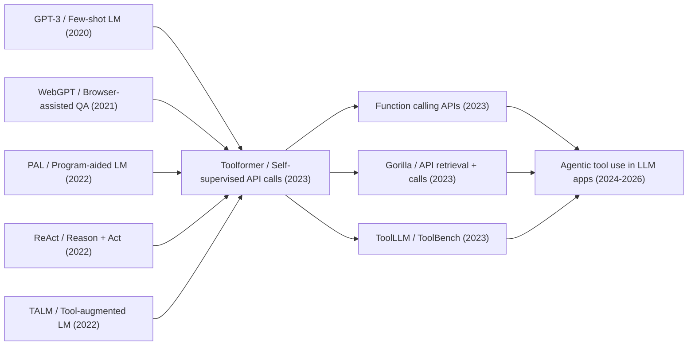

# Toolformer - 让语言模型自学何时调用工具

> **2023 年 2 月 9 日，Timo Schick、Jane Dwivedi-Yu、Roberto Dessì、Roberta Raileanu 等 8 位作者把 [arXiv:2302.04761](https://arxiv.org/abs/2302.04761) 上传到 arXiv，题目像一句挑衅：语言模型可以教会自己使用工具。** 当时 ChatGPT 刚把“会聊天”变成公共想象，GPT-3/PaLM 仍会算错小学算术、忘记今天日期、编造事实；Toolformer 的反直觉处在于，它没有给模型写一套 agent 规则，也没有请人标注大规模工具轨迹，而是让 GPT-J 在普通网页文本里自己尝试插入 API 调用，再用未来 token 的 loss 判断这次调用是否真的有用。后来的 function calling、插件、tool learning benchmark 和 agent 框架，都能在这篇 6 页短论文里看到早期骨架。

## 一句话总结

Schick、Dwivedi-Yu、Dessì、Raileanu 等 8 位作者 2023 年在 arXiv 发布的 Toolformer，把“语言模型使用工具”从人工写 prompt 或人工标注轨迹，改写成一个自监督数据生成问题：对普通语料中的位置计算 $p_i=p_M(\langle API\rangle\mid P(x),x_{1:i-1})$，采样候选调用，执行 QA、Wikipedia Search、Calculator、Machine Translation、Calendar 五类 API，再保留满足 $L_i^- - L_i^+ \ge \tau_f$ 的调用，最后用插入了 API 结果的语料微调 GPT-J 6.7B。它替代的失败 baseline 是三类：只靠 scaling 的 GPT-J/GPT-3 在算术、事实和日期上仍弱；WebGPT、PAL、ReAct 这类路线有效但依赖人工监督或任务专用 prompt；检索增强模型常把外部信息当固定输入，而不是让模型自己决定何时询问。关键数字很锋利：Toolformer 在 LAMA T-REx 从 GPT-J 的 31.9 提到 53.5，在 ASDiv/SVAMP/MAWPS 达到 40.4/29.4/44.0，明显超过 GPT-3 的 14.0/10.0/19.8；但在开放 QA 上仍落后 GPT-3，暴露出单步工具和弱交互的上限。它继承 Chain-of-Thought (2022) 之后“让模型显式外化中间过程”的潮流，也预告了 LLaMA (2023) 之后开源 agent 生态的默认接口；隐藏 lesson 是：工具能力不是模型越大自然长出来的一个开关，而是一种需要数据格式、执行反馈和调用成本共同塑形的行为。

---

## 历史背景

### ChatGPT 刚出现，模型已经会说话，但还不会查东西

Toolformer 出现在一个很微妙的时间点。2022 年 11 月 ChatGPT 发布后，研究社区和大众第一次同时感到：大语言模型不再只是补全文本的统计机器，而像一个可以对话、解释、改写、写代码的通用助手。可只要把问题从“说得像不像”改成“算得准不准”“事实新不新”“今天是哪一天”，这些模型立刻露出硬伤。GPT-3、PaLM、GPT-J 这类模型在开放文本上很强，却会把简单乘除算错，把已经过期的知识说得像刚发生，把时间相关问题当成静态常识。

这不是 2023 年才发现的问题。检索增强语言模型、浏览器辅助问答、计算器辅助推理、程序执行、知识库问答都已经在各自场景里证明：模型不必把所有能力都装进参数里，外部系统可以补上事实、计算和实时状态。但这些方案往往有两个限制：要么工具由系统设计者固定接入，模型只是被动接收检索结果；要么工具使用依赖人工写的轨迹或任务专用 few-shot prompt。换句话说，模型“用上了工具”，但还没有真正学会“什么时候该自己发起一次工具调用”。

Toolformer 把问题换了个角度：既然语言模型已经会根据少量示例模仿格式，能不能让它在普通语料里自己尝试插入 API 调用，再用自己的语言建模 loss 判断这些调用是否有用？这个判断非常有 2023 年早春的气味：ChatGPT 证明模型能跟人协作，Self-Instruct/Unnatural Instructions 证明模型能生成训练数据，ReAct/PAL 证明外部动作能补上推理短板；Toolformer 则问，能不能把这些线索压成一个不依赖人工轨迹的自监督训练循环。

### 直接前序：从检索增强到显式行动

Toolformer 的前史至少有三条线。第一条是 retrieval-augmented LM。REALM、RETRO、Atlas 这类系统把外部文本接入语言模型，让模型在回答事实问题时不只依赖参数记忆。它们解决了“知识从哪里来”，但没有完全解决“什么时候值得去问”。许多系统默认每个样本都检索，或者把检索模块焊进架构，外部信息像隐藏层的一部分，而不是模型可解释输出的一部分。

第二条是 browser / tool assisted QA。WebGPT、LaMDA、BlenderBot 3、Internet-augmented dialogue 等工作让模型使用搜索、浏览器或外部知识源，并通过人工示范、偏好反馈或部署数据训练更可靠的回答。这条线非常接近后来的产品形态，但监督成本高，且工具行为多由人类轨迹定义。Toolformer 的反问是：人觉得有用的工具步骤，未必就是模型最需要的步骤；能否让模型用预测损失来筛出它自己真正受益的调用？

第三条是 reasoning-action 显式化。PAL 让模型写程序并执行，ReAct 把 reasoning trace 与 action trace 交织起来，STaR 把推理过程自举成训练数据。这些工作共同说明：中间过程如果能被文本化，就能进入语言模型的学习接口。Toolformer 接过这个接口，但把任务级 prompt 改成 corpus-level finetuning，把“这道题怎么调用工具”改成“普通网页文本中哪些位置值得插入一次 API”。

### 作者团队与 Meta AI 的问题意识

论文作者来自 Meta AI Research 和 Universitat Pompeu Fabra。Timo Schick 此前做过 PET、LM-BFF、数据生成和 instruction bootstrapping；Jane Dwivedi-Yu、Maria Lomeli、Luke Zettlemoyer、Nicola Cancedda、Thomas Scialom 等作者也处在 retrieval-augmented LM、多语言模型和开放工具系统的交叉处。这个团队对两个事实很敏感：一方面，大模型越来越像通用接口；另一方面，Meta 当时并没有 OpenAI 那样的闭源 ChatGPT 产品优势，更需要一条可复现、可扩展、能被研究社区继续拆解的路线。

因此 Toolformer 的野心不是“做一个完整 agent”。它没有长期记忆，没有多步规划，没有浏览器状态，也没有 JSON schema。它只问一个更基础的问题：如果工具调用本身能被写成文本，语言模型能否在训练语料中学会这些文本片段的分布，并在推理时自己生成 `<API>...→result...</API>` 这样的结构？这一步看似朴素，却把后来 function calling 的核心接口提前摆出来了：模型输出不只是自然语言，还可以是可执行动作的请求。

## 研究背景与动机

### 领域现状：参数记忆和外部工具各有盲区

到 2023 年初，语言模型的强项和弱项已经非常清楚。它们擅长风格迁移、开放写作、概念解释、代码草稿和少样本归纳；但在四类任务上经常输给小得多的系统：精确算术、事实查询、低资源语言理解、时间状态判断。计算器不懂语言但会算，搜索引擎不会推理但能查，日历 API 不会聊天但知道今天日期，翻译系统不懂用户长意图但能稳定处理短句。问题不是工具是否有用，而是语言模型如何把这些工具纳入自己的生成过程。

传统方案要么把外部模块设计成专门管线，要么在 prompt 里告诉模型“这道题请用工具”。这会让系统很难泛化到开放场景：真实用户不会预先告诉模型应该调用哪个 API，普通网页文本也不会标注“这里请查百科”“这里请算一下”。Toolformer 的动机正是补上这个缺口：让模型在通用语言建模数据中学习工具使用，而不是只在某个下游任务里学习一套应试动作。

### 核心矛盾：工具调用是动作，却必须以文本方式学习

语言模型的训练目标是预测下一个 token，工具调用却是对外部世界的一次动作：它有函数名、参数、执行结果、等待时间、费用和错误。Toolformer 的关键简化是把动作线性化成文本。调用 `Calculator(27 + 4 * 2)` 和返回 `35` 可以像一句插入语一样放进原文；调用 `WikiSearch(Fishing Reel Types)` 的结果也可以作为后续 token 的前缀。只要这种线性化能让未来 token 更容易预测，模型就有学习信号。

这就把工具学习转成了一个语言建模问题。模型先用 few-shot prompt 生成候选 API 调用，外部系统执行这些调用，再用“给出调用结果后是否降低未来 token loss”来筛选。这个 loss-based filter 很重要：它不问调用看起来是否聪明，也不问人类是否喜欢，只问结果有没有帮助模型预测接下来的文本。工具使用因此不再是额外奖励函数，而是语言建模目标内部可度量的一部分。

### 目标：让 GPT-J 变成会主动求助的基础模型

Toolformer 选择 GPT-J 6.7B 作为底座，这一点有历史意义。它不是最大的模型，也不是闭源 API，而是研究者能理解的开源量级。论文想证明的不是“175B 参数模型配上搜索当然更强”，而是一个中等规模 LM 只要学会在合适时机调用工具，就能在某些任务上超过大得多的纯参数模型。

这个目标也解释了论文的实验设计。作者没有只评一个炫目的 demo，而是把五种工具分别映射到五类弱点：QA 和 Wikipedia search 对应事实知识，calculator 对应数学，machine translation 对应跨语言理解，calendar 对应时间意识。最后再检查语言建模 perplexity，确保模型没有因为学工具而忘记普通文本生成。Toolformer 的核心承诺是：工具调用应该增强模型，而不是把通用 LM 变成一个只会跑 API 的窄任务系统。

---

## 方法详解

Toolformer 的方法可以概括成一句话：把“调用工具”写成语言模型能预测的 token 序列，再用语言模型自己的预测损失筛掉没用的调用。它没有训练一个独立的 planner，也没有引入强化学习环境；整个系统仍然是标准语言建模，只是训练语料被插入了 `<API>...→result...</API>` 片段。这个选择决定了它的优雅，也决定了它的上限。

### 整体框架：把 API 调用线性化成文本

论文设定一个语言模型 $M$ 和一组工具 API。每个调用由工具名和输入组成，例如 `Calculator(27 + 4 * 2)` 或 `WikiSearch(Fishing Reel Types)`。为了让普通自回归 LM 学会它们，Toolformer 把调用和结果都线性化：没有结果时是一段可生成文本，有结果时是一段可作为上下文的文本。论文用两个函数表示这件事。

$$
e(c)=\langle API\rangle a_c(i_c)\langle/API\rangle,\qquad e(c,r)=\langle API\rangle a_c(i_c)\to r\langle/API\rangle.
$$

这里 $a_c$ 是 API 名，$i_c$ 是输入参数，$r$ 是外部系统返回的结果。这个表示法很关键：工具调用不再是模型外部不可见的工程事件，而是训练数据里可预测、可复制、可解释的一串 token。推理时，模型一旦生成 `→`，系统就暂停解码、执行对应 API、把结果插回上下文，再继续生成。

Toolformer 实验了五类工具，分别覆盖语言模型最常见的五种短板。

| 工具 | 实现 | 解决的弱点 | 典型调用 |
|---|---|---|---|
| Question Answering | Atlas QA model | 事实问答 | `QA(Where was X founded?)` |
| Wikipedia Search | BM25 over KILT Wikipedia | 开放检索 | `WikiSearch(Fishing Reel Types)` |
| Calculator | Python script | 精确算术 | `Calculator(735 / 499)` |
| Machine Translation | NLLB 600M + fastText | 非英语短语理解 | `MT(sûreté nucléaire)` |
| Calendar | Date API | 当前日期与时间状态 | `Calendar()` |

### 关键设计 1：少量示例只用来采样候选调用

Toolformer 并不是从零发明 API 调用格式。对每个工具，作者手写一个很短的 prompt $P(x)$，展示几条例子，让 LM 学会在文本中插入类似 `[QA(question)]` 或 `[Calculator(expression)]` 的调用。然后模型在普通语料 $x_1,\ldots,x_n$ 的各个位置上估计“此处开始一个 API 调用”的概率。

$$
p_i=p_M(\langle API\rangle\mid P(x),x_{1:i-1}),\qquad I=\{i\mid p_i>\tau_s\}.
$$

如果候选位置太多，只保留概率最高的 $k$ 个；对每个位置再采样至多 $m$ 个候选 API 调用。默认设置里，论文使用 $\tau_s=0.05$、$k=5$、$m=5$；对于 calculator 和 machine translation，因为有用样本更稀疏，作者用启发式先筛出更可能有用的 CCNet 段落，并放宽采样阈值。

这个设计的微妙处在于：few-shot prompt 只负责“产生候选”，不负责决定真伪。模型可以乱试，甚至产生很多看起来不靠谱的调用；真正的监督信号来自下一步的执行与过滤。这样少量人工示例被限制在格式引导层面，而不是变成大规模工具轨迹标注。

### 关键设计 2：用未来 token loss 过滤调用

候选调用生成后，Toolformer 会真的执行它们：QA tool 返回答案，search 返回 Wikipedia snippets，calculator 返回两位小数结果，translation tool 返回英文，calendar 返回日期。随后系统比较三种情况：不调用 API、只给出 API 输入但不给结果、给出 API 输入和结果。直觉很简单：一个调用真正有用，应该是因为返回值帮助模型预测后面的文本，而不是因为调用字符串本身提供了格式提示。

论文定义从位置 $i$ 开始的加权交叉熵损失：

$$
L_i(z)=-\sum_{j=i}^{n} w_{j-i}\log p_M(x_j\mid z,x_{1:j-1}),\qquad L_i^+=L_i(e(c_i,r_i)),\quad L_i^-=\min(L_i(\epsilon),L_i(e(c_i,\epsilon))).
$$

只有当 $L_i^- - L_i^+\ge\tau_f$ 时，调用才会被保留。这里的 $w_t$ 会随距离衰减，强调 API 结果应该在附近 token 上马上有帮助，而不是凭远处偶然相关性通过筛选。这个过滤器是 Toolformer 的核心：它把“工具是否有用”转成模型自己可度量的 prediction gain。

反直觉点是，过滤并不要求人类判断调用是否语义合理。论文表 10 里有一些低分调用明显无关，也有一些高分调用非常自然。保留少量噪声并不一定坏，因为模型在 finetuning 时也会看到“不是每次调用都该盲信结果”的分布。Toolformer 学到的不是完美工具轨迹，而是一种从嘈杂自举数据中抽出的调用倾向。

### 关键设计 3：微调语料仍然是原始 CCNet，只是插入了工具片段

过滤完成后，所有保留下来的 API 调用会被插回原始文本，形成增强语料 $C^*$。这一步常被低估。Toolformer 没有把训练集换成一堆人工任务，也没有只微调在 math/QA benchmark 上；它仍然使用 CCNet 的普通网页文本，只是其中一部分位置多了工具调用和返回结果。这样做的目的，是尽量保持语言模型的通用性。

论文用 GPT-J 6.7B 作为底座，使用 batch size 128、learning rate $1\times10^{-5}$、最多 25K examples per API、sequence length 1024，并在 8 张 A100 40GB 上训练。更重要的是，它设置了一个对照组：GPT-J + CC 只在同一份 CCNet 子集上继续训练，不插入 API。若 Toolformer 的提升只是来自额外 CCNet finetuning，这个对照组也应该提升；实验表明，大部分关键任务提升来自 API 调用本身。

```python
def build_toolformer_corpus(plain_documents, language_model, api_tools, prompt_bank):
    augmented_documents = []
    for plain_document in plain_documents:
        accepted_spans = []
        for api_name, api_tool in api_tools.items():
            candidate_positions = sample_call_positions(
                document=plain_document,
                model=language_model,
                prompt=prompt_bank[api_name],
                start_threshold=api_tool.start_threshold,
            )
            for position in candidate_positions:
                candidate_calls = sample_api_calls(
                    document=plain_document,
                    model=language_model,
                    api_name=api_name,
                    position=position,
                )
                for candidate_call in candidate_calls:
                    api_result = api_tool.execute(candidate_call.arguments)
                    gain = future_token_loss_gain(
                        model=language_model,
                        document=plain_document,
                        position=position,
                        call=candidate_call,
                        result=api_result,
                    )
                    if gain >= api_tool.filter_threshold:
                        accepted_spans.append((position, candidate_call, api_result))
        augmented_documents.append(insert_api_spans(plain_document, accepted_spans))
    return augmented_documents
```

这段伪代码展示了 Toolformer 的真正循环：生成候选、执行工具、用 loss 过滤、插回语料、继续语言建模。它不是“给模型接一个计算器”这么简单，而是把工具调用变成训练数据中的可学习结构。

### 关键设计 4：推理时只允许模型发起有限调用

推理阶段，Toolformer 正常自回归解码，直到模型生成一个 API 调用并产生 `→`。系统此时停止生成，执行 API，把结果和结束 token 插入上下文，再让模型继续。为了让模型更愿意调用工具，论文没有只在 `<API>` 是 top-1 token 时才触发，而是使用 $k=10$ 的 modified decoding：只要 `<API>` 出现在 top-k 候选中，就允许它开始调用。

这带来一个工程折中。$k$ 太小，模型过于保守，很多该查的地方不查；$k$ 太大，模型可能过度调用。论文表 9 显示，在 T-REx 上从 $k=1$ 到 $k=10$，API 调用比例从 40.3% 提到 98.1%，总体分数从 47.8 提到 53.5；在 WebQS 上，从 8.5% 提到 100.0%，分数从 19.3 提到 26.3。作者还限制每个输入最多一次 API 调用，防止模型陷入不断调用的循环。

| 关键设计 | 解决的问题 | 代价 | 后续影响 |
|---|---|---|---|
| API 文本线性化 | 让工具动作进入 LM 训练目标 | 函数 schema 不严格 | 后来 function calling 的雏形 |
| 候选采样 | 少量示例生成大规模候选轨迹 | 会产生大量噪声 | 与 self-instruct 数据生成同构 |
| Loss-based filtering | 不需要人工判断调用质量 | 只优化短期预测收益 | 影响后来的自监督工具学习 |
| 受限推理调用 | 防止无限 tool loop | 不能多步链式规划 | 暴露出 agent 化扩展空间 |

因此，Toolformer 的方法价值不在于某个复杂模型结构，而在于它找到了一条最短路径：只要把外部动作写成 token，并用执行结果是否降低 loss 来筛选，普通 LM 训练管线就能学到初级工具使用行为。

---

## 失败案例

Toolformer 的失败 baseline 不是某个单一模型，而是 2023 年之前三种不完整答案：只靠参数规模、只靠人工轨迹、只靠固定检索。它们都能补上语言模型的一部分弱点，却没有同时满足“通用 LM、自主决定、少人工监督、工具结果可执行”这几个条件。

### 只靠 scaling：会说得更像，但不会自动变成计算器和日历

GPT-3 和 PaLM 之后，很多人自然会相信更大的模型会逐渐“长出”事实查询、算术和时间意识。Toolformer 直接挑战了这个假设。论文中 GPT-3 175B 在许多自然语言任务上强于 GPT-J 6.7B，但在 math word problem 上仍然很弱：ASDiv/SVAMP/MAWPS 只有 14.0/10.0/19.8，而 Toolformer 用同一个 GPT-J 底座加 calculator 后达到 40.4/29.4/44.0。这个对比说明，精确计算不是靠更多文本模式就能稳定解决的。

事实查询也类似。纯参数模型记住了训练时的世界，但不知道自己什么时候该查证；它会把模糊记忆包装成流畅答案。Toolformer 在 LAMA 上通过 QA tool 明显超过 GPT-3，尤其 T-REx 从 GPT-3 的 39.8 提到 53.5。这里的 lesson 不是“小模型永远能胜过大模型”，而是某些能力更适合交给外部系统，语言模型应该学习调用边界。

### 人工监督工具系统：有效，但成本和泛化方式不对

WebGPT、Internet-augmented dialogue、LaMDA/BlenderBot 相关系统证明了浏览器和搜索可以让回答更可靠，但它们通常依赖人工示范、偏好数据或部署反馈。PAL 和 ReAct 则展示了程序执行、搜索动作、reasoning trace 的威力，但 prompt 往往围绕某类任务设计，用户或系统需要预先告诉模型该以怎样的格式行动。

这些方法不是失败作品；相反，它们是 Toolformer 的直接前序。它们的问题在于：一旦换到没有人工轨迹、没有任务专用 prompt 的普通文本环境，模型不一定知道哪里该调用工具。Toolformer 的贡献是把“工具轨迹从哪里来”这个问题自监督化。少量示例负责启动格式，真正的数据规模来自模型自己在 CCNet 上生成、执行、过滤。

### 固定检索增强：信息来了，但选择权不在模型输出里

retrieval-augmented LM 的常见做法，是把检索结果作为额外上下文或隐藏组件提供给模型。这样做在知识密集任务上有效，但它不要求模型显式决定是否需要外部信息，也不要求模型选择工具类型、参数和返回值如何进入后续生成。外部模块像一条被系统固定打开的管道。

Toolformer 选择了更文本化也更可解释的接口：模型必须生成调用字符串，系统执行它，结果被插回上下文。这让工具调用成为输出行为，而不是架构细节。它也让错误更容易观察：模型可能不调用、调用错工具、传错参数、过度调用，或者拿到结果后不会用。后来的 agent 评测之所以能逐项拆这些错误，很大程度上继承了这种显式接口。

| 失败路线 | 当时能解决什么 | 关键缺口 | Toolformer 的修正 |
|---|---|---|---|
| Scaling-only LM | 流畅生成、少样本泛化 | 算术、实时事实、日期仍不稳 | 把精确能力交给外部 API |
| Human-supervised tool use | 浏览器/搜索行为可靠 | 轨迹昂贵，依赖人工偏好 | 用 loss 过滤自生成调用 |
| Task-specific prompting | PAL/ReAct 在特定任务强 | 需要预先知道工具格式和任务 | 在通用语料上训练调用分布 |
| Always-on retrieval | 知识密集问答更强 | 模型不显式决定何时查询 | 让调用成为可生成 token |

## 实验关键数据

Toolformer 的实验价值在于，它没有只展示一两个漂亮例子，而是围绕五类工具分别验证：模型是否真的会调用对应 API，调用后是否提升下游任务，普通语言建模能力是否被破坏，以及工具使用能力是否随模型规模出现。

### 增强语料：有用工具调用其实很稀疏

论文使用 CCNet 子集作为原始语料 $C$，用 GPT-J 生成候选 API 调用，再按 loss gain 过滤。表 2 的一个重要信息是：不同工具能留下来的有用样本密度差异很大。Wikipedia Search 和 Calendar 容易留下较多调用；Calculator 和 Machine Translation 即使用启发式预筛，也只留下很少的高置信样本。这解释了为什么 Toolformer 需要大量普通文本来挖少量有用工具行为。

| 工具 | 宽松过滤样本数 | 中等过滤样本数 | 严格过滤样本数 | 直觉 |
|---|---:|---:|---:|---|
| Question Answering | 51,987 | 18,526 | 5,135 | 事实空缺较常见 |
| Wikipedia Search | 207,241 | 60,974 | 13,944 | 检索片段覆盖面大 |
| Calculator | 3,680 | 994 | 138 | 可验证算术片段稀少 |
| Calendar | 61,811 | 20,587 | 3,007 | 时间表达可从 URL/文本挖出 |
| Machine Translation | 3,156 | 1,034 | 229 | 混合语言上下文较少 |

训练设置也很朴素：每个 API 最多 25K examples，max sequence length 1024，effective batch size 128，learning rate $1\times10^{-5}$，8 张 A100 40GB，DeepSpeed ZeRO-3，最多 2K steps。这里没有复杂 RL，也没有人工在线反馈；实验真正测试的是 loss-filtered corpus augmentation 是否足够。

### 零样本任务：工具在不同弱点上给出不同收益

在 LAMA 上，Toolformer 主要调用 QA tool，三个子集都超过 GPT-J、GPT-J + CC、Toolformer disabled、OPT 66B 和 GPT-3 175B。论文特别指出，在 LAMA 中工具调用率接近 98.1%，说明模型不是偶然从微调中记住答案，而是真的学会了在事实空缺处求助。

数学任务的结果更直接。Toolformer 在 ASDiv、SVAMP、MAWPS 上分别达到 40.4、29.4、44.0；GPT-3 只有 14.0、10.0、19.8。允许 API 调用后性能翻倍以上，且 97.9% 的样本调用 calculator。这里 Toolformer 的优势最像“语言模型做路由，专用工具做精确计算”。

开放 QA 的结果则更诚实：Toolformer 在 WebQS/NQ/TriviaQA 上达到 26.3/17.7/48.8，超过同规模 GPT-J baseline，但落后 GPT-3 的 29.0/22.6/65.9。论文解释说，BM25 search 太简单，而且 Toolformer 不能交互式浏览、改写 query 或多次检索。这正是后来 agent 框架要补的缺口。

| 任务 | 关键数字 | 调用行为 | 结论 |
|---|---|---|---|
| LAMA SQuAD/Google-RE/T-REx | Toolformer 33.8/11.5/53.5 vs GPT-3 26.8/7.0/39.8 | 主要用 QA tool | 事实填空明显受益 |
| Math ASDiv/SVAMP/MAWPS | Toolformer 40.4/29.4/44.0 vs GPT-3 14.0/10.0/19.8 | 97.9% 调用 calculator | 精确计算收益最大 |
| QA WebQS/NQ/TriviaQA | Toolformer 26.3/17.7/48.8 vs GPT-3 29.0/22.6/65.9 | 99.3% 用 Wikipedia Search | 超过同规模，未超过 GPT-3 |
| MLQA multilingual | 西/德/越/中等语言有提升，Hindi 很弱 | MT 调用率 7.3%-94.9% | 翻译有用但不稳定 |
| TempLAMA / Dateset | Toolformer 16.3/27.3 vs GPT-3 15.5/0.8 | Dateset 54.8% 用 Calendar | 时间工具对日期模板有效 |
| Language modeling | WikiText/CCNet perplexity 不高于 GPT-J + CC | disabled 时评估 | 学工具不牺牲通用 LM |

### Scaling 观察：小模型不一定会用工具

论文还在 GPT-2 family 上做了 scaling 分析：124M、355M、775M、1.6B，再加 GPT-J 6.7B。结果显示，工具使用能力不是最小模型一接 API 就出现；大约到 775M 参数附近，模型才明显学会从 QA、calculator、search 中获益。更小模型即便看到工具格式，也常常不知道何时调用、怎样组织参数、如何用返回结果完成文本。

这个结果后来很有启发。它说明 tool use 既不是纯工程接口，也不是纯 emergent magic。模型需要足够的语言能力来理解上下文、构造参数、判断工具结果与后续文本的关系；但一旦跨过这个门槛，外部工具又能让中等模型在特定维度上超过更大的纯参数模型。Toolformer 的实验结论因此有两面：工具能弥补模型缺陷，但工具学习本身也需要一个足够强的模型底座。

---

## 思想史脉络

### 前世：从“模型知道什么”到“模型能向谁求助”

Toolformer 之前，语言模型社区主要沿两条方向处理知识和推理短板。第一条方向是让模型本身更大、更会 few-shot、更能从 prompt 中归纳任务。GPT-3 是这条线的代表，它把“语言模型是一种通用任务接口”的想法推到台前。第二条方向是给模型外部资源：检索器、浏览器、程序解释器、计算器、知识库。WebGPT、PAL、ReAct、TALM 都在不同位置证明外部动作能补上参数模型的弱点。

这两条线在 Toolformer 这里交汇。它既承认 LM 本身已经足够会模仿格式，能从少量例子生成候选工具调用；又承认 LM 不能只靠参数解决所有问题，需要向外部 API 求助。它的关键不是“工具存在”，而是“模型如何把求助这件事变成自己会生成的文本行为”。

### 今生：自监督 API 调用作为语言建模数据

Toolformer 的思想核心可以写成一句话：工具调用不必从人工专家轨迹中学习，也不必只在下游任务 prompt 中出现；它可以在普通语料里通过自监督方式被挖出来。这个思想让工具使用从应用层回到预训练/微调层。模型不是在解某一道题时临时被告知要用工具，而是在继续语言建模时反复看到“这里插入一个 API 调用会让后文更可预测”。

这种数据观很重要。它把 API 调用从一种系统工程选择，变成一种可学习的 corpus annotation。后来的 tool learning 数据集、function calling 微调、schema-guided decoding、agent trace distillation，本质上都在继续回答同一个问题：哪些外部动作应该被写进模型的训练分布，怎样让模型既会发起动作，又不会把动作当成噪声或装饰？

### 后世：从单步 API 到 agent 工具生态

Toolformer 很快被后续工作扩展。Gorilla 把问题推向大规模 API 文档检索和调用；ToolLLM/ToolBench 构造了多工具、多步骤 instruction 数据和 benchmark；OpenAI function calling、ChatGPT plugins、Claude tool use、Gemini function calling 等产品接口把工具调用规范化成 JSON schema、函数签名、参数验证和执行沙箱；HuggingGPT、Voyager、AutoGPT 类系统把单次 API 调用扩展成多步任务规划。

有意思的是，Toolformer 的很多局限也变成了后续研究议程。它只允许每个输入最多一次 API 调用，所以不能做 tool chaining；它不能浏览多个搜索结果，所以开放 QA 仍落后 GPT-3；它没有显式成本模型，所以不知道什么时候不该调用昂贵工具；它没有安全边界，所以无法处理真实执行环境的权限和风险。后续 agent 系统看起来更复杂，但很多复杂性其实是在补这几个缺口。

### 常见误读：Toolformer 不是完整 agent，也不是 function calling 标准

第一个误读是把 Toolformer 当成现代 agent 的完整雏形。它确实有“模型输出动作、系统执行动作、结果回到上下文”的循环，但没有长期状态、任务分解、反思、错误恢复和多步规划。它更像 agent 工具调用层的一个自监督训练原型，而不是完整执行系统。

第二个误读是把它看成今天 function calling 的直接工程规格。Toolformer 的 API 格式是自由文本，参数没有 schema 校验，执行结果也没有结构化安全层。今天的函数调用接口更重视 JSON、类型、权限、重试和日志。Toolformer 的贡献在更深一层：它证明了语言模型可以从训练数据中学会“何时发起调用”这个行为，而不只是被外部 orchestrator 强制调用。

### 谱系图



| 节点 | 年份 | 与 Toolformer 的关系 |
|---|---:|---|
| GPT-3 | 2020 | 提供 few-shot / in-context 生成候选格式的前提 |
| WebGPT | 2021 | 展示浏览器辅助问答，但依赖人工反馈 |
| PAL | 2022 | 把程序执行作为推理外部工具 |
| ReAct | 2022 | 把 reasoning 和 action 写进同一条轨迹 |
| TALM | 2022 | 最接近的 loss-based 工具学习前序 |
| Toolformer | 2023 | 把 API 调用变成自监督语料增强 |
| Gorilla / ToolLLM | 2023 | 扩展到大规模 API 检索、监督工具数据和 benchmark |

如果把思想史压成一条线，Toolformer 的位置就是：从“模型能不能生成正确答案”，转向“模型能不能知道自己什么时候不该独自生成答案”。这一步听起来像工程细节，实际改变了语言模型和外部世界的接口边界。

---

## 当代视角

### 2023 年看：Toolformer 给“工具调用”一个可训练定义

站在 2023 年看，Toolformer 最重要的意义是把 tool use 从 prompt engineering 提升成训练数据问题。此前很多系统已经能用搜索、浏览器或程序，但工具行为常常藏在 prompt、人工轨迹或系统管线里。Toolformer 说：不妨让模型自己在语料里尝试插入调用，再用执行结果是否降低 loss 来筛选。这个定义简单到能被复现，也足够一般，能覆盖 QA、search、calculator、translation、calendar 五类工具。

它的另一个贡献是把“会不会用工具”从能力展示变成可拆实验。模型可以被拆成几个错误环节：是否想到调用、是否选对工具、参数是否合理、返回结果是否有帮助、模型是否会把结果融入后续文本。今天 agent benchmark 里常见的 tool selection、argument generation、execution feedback、state update，其实都能在 Toolformer 的实验设计里找到早期影子。

### 2024-2026 年看：原始方法过时，问题定义没有过时

从今天看，原始 Toolformer 已经很朴素。自由文本 API 缺少 schema，单步调用不能规划，多工具不能组合，BM25 search 太弱，calendar 只能返回当前日期，calculator 只支持四则运算，安全和权限几乎没有讨论。现代 function calling 模型通常要处理 JSON schema、工具权限、失败重试、并发调用、结构化日志、工具选择路由和执行沙箱。

但问题定义没有过时。2026 年的 agent 系统仍然在问 Toolformer 提出的同一个问题：语言模型什么时候应该停止编答案，转而发起可执行请求？区别只是今天的接口更严格、工具更多、反馈更长、错误代价更高。Toolformer 像一张早期草图，线条很粗，但已经把“模型输出可以是动作”这件事画出来了。

### 哪些假设后来站不住

第一，单步工具调用足够这个假设站不住。真实任务常常需要先搜索、再读网页、再计算、再写答案；Toolformer 的训练数据中各工具独立生成，几乎没有 chain-of-tools，所以无法学会把一个工具的输出作为另一个工具的输入。

第二，自由文本 API 格式足够这个假设站不住。生产系统需要参数类型、必填字段、权限控制、错误码、重试策略和审计日志。今天的 function calling 倾向于 JSON schema，不是因为 JSON 更优雅，而是因为执行环境需要边界。

第三，用短期 loss gain 代表工具价值这个假设也不够。某次调用可能短期不降低 token loss，却能避免高风险错误；也可能降低 loss，但调用昂贵、泄露隐私或引入不可信信息。工具价值必须同时考虑准确率、成本、延迟、安全和可验证性。

| 当年假设 | 后来发生了什么 | 今天的判断 |
|---|---|---|
| 单步调用足够 | agent 任务需要搜索、计算、写入、回滚等多步动作 | 适合证明 feasibility，不足以完成复杂任务 |
| 自由文本 API 足够 | function calling 转向 JSON schema 与类型校验 | 文本格式可学习，执行格式要结构化 |
| loss gain 就是工具价值 | 出现成本、安全、隐私、可靠性约束 | 需要多目标决策而非单一 perplexity |
| 工具越多越好 | 工具过多会带来选择错误和攻击面 | 需要路由、权限和最小必要调用 |

## 局限与展望

### 工具链、交互和成本

Toolformer 自己在 limitations 里已经很诚实：它不能链式调用工具，不能交互式浏览搜索结果，也没有把工具调用成本纳入决策。TempLAMA 的例子很典型：理想策略可能是先查当前日期，再带着日期问 QA tool；但训练数据中各工具独立生成，推理时也最多一次调用，所以模型没有机会学到这种组合。

未来方向自然是 tool planning。模型需要把工具调用看成一个状态机：每次调用改变可用信息和成本预算，下一步动作依赖前一步结果。现代 agent 框架、workflow engine 和 tool-use RL 正在补这部分，但也带来新问题：越多步，越难评估；越可执行，越需要权限控制。

### 从工具调用走向代理安全

Toolformer 讨论的是“工具是否帮助预测 token”，不是“工具是否应该被允许执行”。在真实系统中，工具可能读文件、发邮件、下单、写数据库、调用付费 API 或访问私人信息。一个模型即使能正确构造参数，也可能因为提示注入、错误上下文或过度自信而执行危险动作。

因此 Toolformer 之后的安全问题不只是 hallucination，而是 action safety。工具调用需要 sandbox、approval、least privilege、audit log、rollback、uncertainty calibration 和对工具输出的验证。一个有用的现代 agent 不应只学会“何时调用”，还要学会“何时请求确认、何时拒绝、何时只读不写”。

## 相关工作与启发

### 对研究者的启发

Toolformer 的第一条启发是：数据生成方式本身可以定义新能力。论文没有发明新的 Transformer，也没有引入复杂 RL；它通过“采样-执行-过滤-微调”的数据管线，把工具使用变成模型可学习的行为。这种思路后来在 self-instruct、synthetic preference data、agent trajectory distillation 中反复出现。

第二条启发是：失败的 API 调用也有研究价值。Toolformer 能被分析，是因为调用是显式 token。研究者可以看到模型什么时候调用错工具、什么时候查不到、什么时候拿到结果还答错。相比把检索或工具藏在黑盒系统里，显式调用给调试和 benchmark 提供了抓手。

### 对工程系统的启发

工程上，Toolformer 提醒我们不要把“接入工具”和“学会使用工具”混为一谈。接入一个计算器很容易，让模型稳定知道何时计算、怎样写表达式、怎样处理返回值、何时不该计算，才是系统质量的核心。今天很多 function calling bug 仍然发生在这些边界上。

另一个工程 lesson 是：训练目标必须和执行环境对齐。Toolformer 用 loss gain 筛选调用，在离线语料上非常自然；但真实产品需要考虑延迟、费用、失败率、权限、用户意图和可解释性。如果直接把离线工具轨迹蒸馏到线上 agent，而没有执行策略和安全层，模型可能会把“能调用”误解成“应该调用”。

## 相关资源

### 资源索引

| 类型 | 资源 | 链接 | 说明 |
|---|---|---|---|
| 论文 | Toolformer | https://arxiv.org/abs/2302.04761 | 原始 arXiv 论文 |
| HTML | ar5iv rendering | https://ar5iv.labs.arxiv.org/html/2302.04761 | 便于检索公式和表格 |
| 前序 | ReAct | https://arxiv.org/abs/2210.03629 | reasoning/action 轨迹 |
| 前序 | PAL | https://arxiv.org/abs/2211.10435 | 程序辅助推理 |
| 后续 | Gorilla / ToolLLM | https://arxiv.org/abs/2305.15334 | 大规模 API 调用与工具 benchmark |

如果只记住一个结论：Toolformer 的历史价值不是它做出了最强 agent，而是它把“何时求助外部工具”变成了语言模型训练数据中的显式变量。现代 agent 系统比它复杂得多，但仍然在沿着这条变量继续扩展。


---

> 🌐 [English version](/en/era5_genai_explosion/2023_toolformer/) · 📚 awesome-papers project · CC-BY-NC