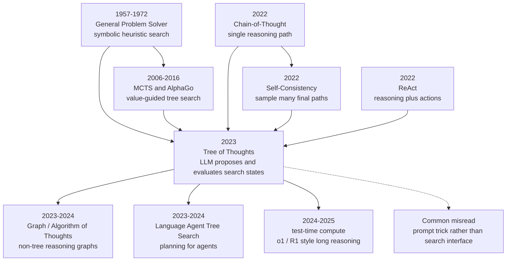

# Tree of Thoughts — 让大语言模型从一次性作答走向搜索式思考

> **2023 年 5 月，Princeton University 与 Google DeepMind 的 Shunyu Yao、Dian Yu、Jeffrey Zhao 等 7 位作者上传 [arXiv:2305.10601](https://arxiv.org/abs/2305.10601)，把大语言模型的“思考”从一条 Chain-of-Thought 改写成一棵可回溯、可剪枝、可投票的搜索树。** 最醒目的数字不是模型参数，而是 Game of 24：同样用 GPT-4，普通 CoT 在论文设置里只解出约 4%，ToT 通过生成候选 thought、评价中间状态、保留高价值分支，把成功率推到 74%。这篇论文没有训练一个新模型，却给 2023 年之后的 agent、test-time compute、o1/R1 式长推理提供了一个极简接口：当模型一次想不清楚时，不要只让它“多想一步”，而是让它保留多个未来。

## 一句话总结

Yao、Yu、Zhao、Shafran、Griffiths、Cao、Narasimhan 2023 年发表在 NeurIPS 的 ToT，把 [Chain-of-Thought（2022）](../era4_foundation_models/2022_cot.md) 的单条推理轨迹改造成显式搜索：语言模型不再直接输出答案 $y \sim p_\theta(y\mid x)$，而是在状态 $s_t=(x,z_{1:t})$ 上生成候选 thought、估计 $V(s_t)$ 或投票比较多个状态，再用 BFS/DFS 选择分支，近似求解 $\arg\max_y \mathbb{E}[u(y,x)]$。它替代的失败 baseline 很朴素也很致命：直接输入输出、单条 CoT、self-consistency 都只能在“已经走错的第一步”后继续采样；在 Game of 24 上，GPT-4 CoT 约 4% 成功，ToT 原论文 run 达到 74%。后续 agent 规划、Graph of Thoughts、Language Agent Tree Search、DeepSeek-R1（2025） 式 test-time compute 都继承了同一件事：推理能力不只来自模型权重，也来自推理时愿意花多少搜索预算。

---

## 历史背景

### 2022 年推理从“输出答案”变成“展示中间过程”

2022 年之前，prompting 的主流接口仍然像一个黑箱函数：给模型输入 $x$，希望它直接吐出答案 $y$。GPT-3 已经展示了 few-shot learning，但在算术、多步符号推理、常识组合题上，模型经常把第一步想错以后一路写到看似流畅的错误结论。2022 年 1 月的 Chain-of-Thought prompting 改变了这个接口：Wei、Wang、Schuurmans 等作者发现，在 few-shot 示例里写出中间推理句，PaLM / LaMDA / GPT-3 这类大模型会显著提升 GSM8K、MultiArith、CommonsenseQA 等任务表现。对研究社区来说，这个结果的冲击不在“prompt 多写几句话”，而在于它把语言模型的中间计算暴露成可被观察、可被干预的文本对象。

但 CoT 的结构仍然是一条路。模型从第一个 thought 开始就被自己的早期选择锁住：第一步选错运算、错读题意、漏掉约束，后面生成得再长也只是沿着错误状态继续。Self-consistency 在 2022 年下半年给了一个直接补丁：不要只采样一条 CoT，而是采样多条，再用多数投票选答案。这个补丁对闭式答案很有效，却仍然把“搜索”推迟到最后一刻。它比较的是完整轨迹的 final answer，而不是在中间状态发现某条分支已经没有未来。ToT 需要解决的正是这个缝隙：LLM 已经能生成可读的中间步骤，也能粗略评价方案好坏，为什么不把这两种能力接到经典搜索算法里？

### ToT 前夜的四条线索

第一条线索来自认知科学与早期 AI。Newell 与 Simon 的 General Problem Solver 早在 1957-1972 年就把问题求解写成“状态 - 操作 - 目标”的搜索过程；A*、beam search、minimax、Monte Carlo Tree Search 都是在这个框架里寻找更好的展开策略。第二条线索来自深度强化学习，尤其是 AlphaGo 与 AlphaZero：神经网络负责给状态估值和提出候选动作，树搜索负责把局部评分组织成全局决策。ToT 与 AlphaGo 的任务不同，却继承了同一个分工：模型不是一次性给终局答案，而是在搜索中扮演 generator 与 evaluator。

第三条线索来自 2022 年的 LLM prompting。CoT 证明了“文本 thought”可以作为推理中间层；self-consistency 证明了多条 reasoning path 能降低单次采样噪声；least-to-most prompting 把复杂问题拆成子问题；Program-of-Thoughts / PAL 把部分推理交给代码执行；ReAct 则把 reasoning 与 environment action 交替起来。第四条线索来自 agent 社区的实际焦虑：在 WebShop、ALFWorld、HotpotQA 等交互任务里，模型已经会计划、调用工具、读回反馈，但缺少一种统一方法描述“何时扩展候选、何时回溯、何时停止”。ToT 把这些线索压缩成一个很小的抽象：thought 是搜索树上的边或节点，LLM 既能 propose，也能 evaluate。

### 作者团队与论文时间点

这篇论文的作者分布很有意思。Shunyu Yao、Jeffrey Zhao、Thomas L. Griffiths、Karthik Narasimhan 在 Princeton，Dian Yu、Izhak Shafran、Yuan Cao 在 Google DeepMind；团队横跨 NLP、认知科学、强化学习与交互式 agent。Yao 与 Narasimhan 2022 年已经做了 ReAct，这让 ToT 不是凭空出现的“prompt 技巧”，而是从交互式决策问题里自然长出来的下一步：如果 ReAct 让模型边想边做，ToT 则让模型在做之前保留多条想法。

时间点也关键。2023 年 3 月 GPT-4 发布，学界第一次看到一个闭源模型在复杂推理上明显跨过阈值；同年 5 月 ToT 上传 arXiv，刚好处在 ChatGPT 热潮与 agent 热潮的交界处。那时很多工作在争论“能力是不是只来自更大模型”，ToT 给出了另一个答案：不训练新权重，也能通过推理时算法显著改变行为。这个回答不如 scaling law 壮观，但对开发者更直接，因为它把改进入口从训练集和 GPU 集群，移到了推理 wrapper、prompt、搜索预算和任务分解。

### 为什么这篇论文在 2023 年被需要

ToT 之前，LLM 推理论文常常默认一个隐含前提：模型每次生成的中间步骤都应该被继续相信。CoT prompt 让模型“写出理由”，self-consistency 让模型“多写几份理由”，但很少有机制在半路说“这条路已经不值得继续”。这在 Game of 24 里尤其明显：如果第一步把四个数合成了一个不可能抵达 24 的中间集合，后面三步再流畅也救不回来；在 crossword 里，如果某个 clue 的候选词与已有字母冲突，继续补其他格子只是扩大错误；在创意写作里，如果开头同时违背多个约束，后文再润色也难满足全局目标。

ToT 的历史意义在于它把“推理时计算”从一个模糊愿望变成了可枚举的接口。你可以调 thought granularity，可以选择 sample 或 propose，可以用 value prompt 或 vote prompt，可以设定 beam width、depth、DFS/BFS、early stop。换句话说，ToT 让 prompt engineering 靠近 classical AI 的算法语言。这也是它后来被反复引用的原因：它既不是新的 Transformer 架构，也不是新的 RLHF 方法，却给 test-time compute 的讨论提供了最早一批清晰旋钮。

## 研究背景与动机

### 被单路径 CoT 卡住的问题

单路径 CoT 的失败不是“模型不会说理”，而是“模型没有保存备选未来”。在许多组合问题里，正确性取决于早期离散选择：Game of 24 要选择哪两个数先合并，crossword 要选择哪个 clue 的候选词，写作任务要选择哪条叙事骨架。语言模型的 token 级采样天然会制造多个可能未来，但标准 prompting 只把其中一条展开到底。即使 self-consistency 采样多条，它也没有在中途共享信息、剪掉劣质分支或集中预算在高潜力状态上。

论文的动机因此不是让模型“更聪明地写解释”，而是把解释当成搜索对象。一个 thought 可以是一步算术变换、一段写作计划、一个 crossword 候选填法；一个 state 可以由题目与已经生成的 thoughts 组成；一个 evaluator 可以是模型自评、模型投票、规则检查或外部程序。这样的抽象足够宽，能覆盖符号题、文本生成和约束满足；同时又足够窄，能写成几十行 BFS/DFS 代码。

### ToT 的问题重写

ToT 把 LLM 推理重写成三个问题。第一，如何生成候选 thought：让模型独立 sample 多个完整片段，还是在当前状态下 propose 下一批合法动作？第二，如何评价中间状态：让模型给每个状态打 value，还是让模型在多个状态之间 vote？第三，如何选择搜索策略：用 BFS 保留同一深度的 top-$b$ 状态，还是用 DFS 在有强约束的任务里回溯？这三个问题合起来，把“prompt 怎么写”变成“搜索问题怎么建模”。

这个重写很重要，因为它解释了 ToT 为什么不是万能 prompt。它对“可分解、有中间状态、能粗略评价部分解”的任务最有效；对开放聊天、事实问答、一步即可解决的分类题，树搜索可能只是昂贵的装饰。论文的真正动机不是让所有任务都长出树，而是提醒研究者：当任务本身有树结构时，LLM 的文本 thought 可以成为搜索算法的节点语言。

---

## 方法详解

### 整体框架

Tree of Thoughts 的方法可以用一句话概括：把语言模型从“答案生成器”提升为“搜索算子”。在标准 prompting 里，模型直接从输入 $x$ 采样完整输出 $y$；在 CoT 里，输出被写成一条中间推理链 $z_{1:T}$；在 ToT 里，系统维护多个部分状态，每个状态由原题与已生成 thought 组成，然后循环执行生成、评价、选择、展开。

论文把这个过程写成更一般的问题求解框架。给定问题 $x$，最终答案 $y$ 的效用为 $u(x,y)$，标准 prompting 近似采样的是：

$$
y \sim p_\theta(y \mid x)
$$

CoT 把 $y$ 拆成一条隐式轨迹 $z_{1:T}$，但仍然只保留单一路径。ToT 则在深度 $t$ 的状态集合 $S_t$ 上搜索：

$$
s_t=(x,z_{1:t}),\qquad z_{t+1}\sim G_\theta(s_t),\qquad \hat{v}_t=V_\theta(s_t)
$$

其中 $G_\theta$ 是 thought generator，$V_\theta$ 是 state evaluator，search controller 负责从候选状态里选出下一轮要扩展的子集。最终目标不再是“第一条看起来像答案的文本”，而是用有限推理预算近似寻找：

$$
y^* \approx \arg\max_y \mathbb{E}[u(x,y) \mid \text{generated thoughts, evaluator, search budget}]
$$

| 范式 | 中间表示 | 分支数 | 何时评价 | 典型失败点 |
|---|---|---:|---|---|
| Input-Output | 无 | 1 | 只看最终答案 | 一步错即全错 |
| Chain-of-Thought | 单条 thought 链 | 1 | 通常不评价中间状态 | 早期错误被锁定 |
| Self-Consistency | 多条完整 CoT | 多条终局 | 最后投票 | 浪费预算在坏分支 |
| Tree of Thoughts | 可搜索 thought 树 | 多个中间状态 | 每一层或每个节点 | 依赖 evaluator 质量 |
| Tool / Agent Search | thought + action + observation | 多个交互状态 | 规则、环境、模型混合 | 成本与状态爆炸 |

这个表说明 ToT 的核心不是“写更长 reasoning”，而是把 reasoning 分配给一个显式 controller。controller 可以很简单，论文主要用 BFS 和 DFS；也可以在后续工作里换成 MCTS、A*、learned policy 或 verifier-guided search。

### 关键设计 1：thought 粒度

ToT 的第一个设计问题是：什么算一个 thought？论文没有把 thought 固定成 token、句子或完整答案，而是让任务决定粒度。Game of 24 里，一个 thought 是“一步算术操作后剩下哪些数”；创意写作里，一个 thought 是一段可扩展的写作计划；mini crossword 里，一个 thought 是某个 clue 的候选词或一组局部填法。这个选择看似朴素，实际很关键，因为搜索树的宽度和深度都由 thought 粒度控制。

如果 thought 太小，树会接近 token search，分支巨大且 evaluator 很难判断；如果 thought 太大，系统退化成 self-consistency，只能在完整答案后比较。ToT 的经验原则是让 thought 成为“人类也愿意停下来检查的中间单元”：它应该足够短，可以被生成多份；足够语义完整，可以被评价；足够可组合，可以继续展开。

| 任务 | thought 粒度 | 状态形式 | 合法性信号 | 为什么适合 ToT |
|---|---|---|---|---|
| Game of 24 | 一步算术变换 | 剩余数字集合 + 计算式 | 是否还可能到 24 | 早期错误可剪枝 |
| Creative Writing | 下一段计划或候选段落 | 已选计划 + 约束 | 连贯性与约束满足 | 可比较多个叙事路线 |
| Mini Crosswords | clue 的候选填法 | 网格字母 + 未解 clue | 字母冲突与 clue 匹配 | 天然需要回溯 |
| Math Proof Sketch | lemma 或推导步 | 已证明子目标 | 是否推进目标 | 可接 theorem prover |

这里有一个容易被低估的点：ToT 没有声称 LLM 的 value 判断总是可靠。它只要求 evaluator 比随机选择好 enough，并且 search controller 能通过多次生成、投票、规则过滤降低单次误判的影响。这与 AlphaGo 里 value network 不必完美、只要能指导 MCTS 类似。

### 关键设计 2：生成候选 thought

论文提供两种生成模式。`sample` 适合开放生成任务：让模型从同一状态独立采样多个候选 thought，例如创意写作中生成多个下一段方向。`propose` 适合状态空间有明确动作的任务：让模型一次列出若干可选下一步，例如 Game of 24 中列出可能的算术操作。两者差别在于候选之间是否需要强约束去重，以及 prompt 是否更像“自由续写”还是“枚举动作”。

生成器的抽象可以写成：

$$
\mathcal{Z}_{t+1}(s_t)=\{z_{t+1}^{(1)},\ldots,z_{t+1}^{(k)}\},\qquad s_{t+1}^{(i)}=(s_t,z_{t+1}^{(i)})
$$

其中 $k$ 是每个状态生成的候选数。系统真正搜索的是所有 $s_{t+1}^{(i)}$，而不是只把概率最高的 token 接上去。这样一来，temperature 从“制造随机输出”的参数，变成了“探索更多分支”的参数。

```python
def tree_of_thoughts(problem, max_depth, beam_size):
    frontier = [State(problem=problem, thoughts=[])]
    for depth in range(max_depth):
        candidates = []
        for state in frontier:
            thoughts = llm_generate_thoughts(state, mode="sample_or_propose")
            for thought in thoughts:
                child = state.extend(thought)
                child.value = llm_or_rule_evaluate(child)
                candidates.append(child)
        frontier = select_top_states(candidates, k=beam_size)
        if any(state.is_terminal_and_valid() for state in frontier):
            return best_terminal_state(frontier)
    return best_state(frontier)
```

这段伪代码有意把 LLM 调用限制在两个位置：generate 和 evaluate。除此之外，树的维护、状态去重、合法性检查、宽度控制都可以由普通程序完成。这也是 ToT 官方代码仓能很快被复现和改写的原因。

### 关键设计 3：评价中间状态

ToT 的 evaluator 有两种主要实现。`value` prompt 让模型独立判断一个状态的前景，例如 Game of 24 里回答 sure / likely / impossible，并把这些标签映射成分数。`vote` prompt 让模型在多个候选状态之间比较，适合创意写作这种绝对打分不稳定、相对偏好更自然的任务。两者都把 LLM 当作 approximate heuristic，而不是数学证明器。

| 评价模式 | 输入 | 输出 | 适合任务 | 风险 |
|---|---|---|---|---|
| Value | 单个状态 | 标量或等级 | Game of 24、程序搜索 | 过度自信、校准差 |
| Vote | 多个状态 | 排名或赢家 | 写作、摘要、开放生成 | 位置偏置、审美漂移 |
| Rule Check | 状态 + 规则 | true/false | crossword、算术合法性 | 只能查形式约束 |
| External Verifier | 状态 + 工具 | 证据或分数 | 代码、数学、检索 | 工具成本与接口复杂 |

论文最有洞察的地方，是把 evaluator 的不完美视作搜索系统的一部分，而不是系统失败的理由。在 Game of 24 中，模型不需要证明某个中间状态一定能到 24，只要能大致区分 promising / impossible；在写作中，模型不需要给出绝对文学评分，只要能在多个候选计划中选出更一致的一支。搜索通过保留 top-$b$ 而不是 top-1，为 evaluator 的误差留下缓冲。

### 关键设计 4：搜索策略与预算

ToT 论文主要展示了两类搜索。BFS 用在 Game of 24 与创意写作：每一层生成候选、评价、保留 top-$b$，再进入下一层。DFS 用在 mini crosswords：因为 crossword 有强约束和明显的 dead end，深度优先回溯更自然。两者都不是算法创新；创新在于让 LLM 的自然语言 thought 能接入这些老算法。

搜索预算可以粗略写成：

$$
\text{LLM calls} \approx \sum_{t=0}^{T-1} |S_t|\cdot (C_{gen}+k\cdot C_{eval})
$$

其中 $|S_t|$ 是第 $t$ 层保留的状态数，$k$ 是每个状态生成的候选 thought 数。这个公式解释了 ToT 的主要代价：它把训练时成本换成推理时成本。对于 Game of 24 这样的短任务，这个交换很划算；对于长对话或大规模服务，若没有缓存、轻量 evaluator 或 early stopping，成本会很快变成瓶颈。

| 搜索策略 | 保留状态 | 展开顺序 | 优点 | 代价 |
|---|---:|---|---|---|
| BFS / Beam | 每层 top-$b$ | 按深度同步推进 | 易并行、适合固定步数 | 宽度带来多次 LLM 调用 |
| DFS | 当前分支 + 回溯栈 | 先走到底再回退 | 适合强约束谜题 | 易被错误 value 牵引 |
| MCTS | 访问统计 + value | 探索/利用平衡 | 适合长 horizon | 实现和调用成本更高 |
| Verifier-guided Search | 通过验证器过滤 | 动态 | 可降低幻觉 | 依赖外部工具质量 |

### 关键设计 5：为什么它是框架而不是单个 prompt

ToT 最容易被误读成“把 prompt 写成树状”。这个理解太窄。论文真正给出的，是一个由任务接口、生成器、评价器和搜索器组成的框架。prompt 只是其中两个函数的实现方式；搜索状态如何表示、候选如何去重、合法性如何检查、预算如何分配，都是同等重要的工程选择。

这也解释了为什么 ToT 在 2023 年迅速外溢到 agent 领域。Agent 本来就有状态、动作、观察、回报，只是动作和观察常常由自然语言表示。ToT 证明 LLM 可以承担启发式搜索里的两个关键角色：提出可能动作，评价局部状态。后来的 LATS、Graph of Thoughts、MCTS-for-LLM、reflection-based agents 都是在这个接口上做扩展：有的把树变成图，有的把 evaluator 换成 learned verifier，有的把 thought 换成 tool call，有的把 value estimate 替换成环境回报。

---

## 失败案例

### Baseline 1：Input-Output prompting

IO prompting 是最朴素的 baseline：给 GPT-4 题目和少量示例，让它直接输出答案。它的失败说明了一个基本事实：模型的 next-token 解码很擅长写出“看起来合理”的终局文本，却不擅长在组合空间里主动保留未尝试的选择。Game of 24 中 IO 只有 7.3% 成功率；这不是因为 GPT-4 不懂加减乘除，而是因为它没有机制系统探索四个数的组合顺序。它选了一条早期路径，就把其他路径全部丢掉。

在 mini crosswords 中，IO 更弱。5x5 网格有 10 个 clue，每个词同时受横纵两个方向约束。一次性输出整张棋盘，等于要求模型同时满足所有 lexical clue 与字母交叉约束。IO 的 letter-level 还可能看起来不低，因为局部字母猜中并不难；但 word-level 与 game-level 暴露出真正问题：没有回溯，就无法修正前面填错的词。

### Baseline 2：Chain-of-Thought prompting

CoT 本来应该帮助推理，但在 Game of 24 上反而从 IO 的 7.3% 降到 4.0%。这不是 CoT 失效的普遍结论，而是这个任务专门放大了单路径推理的弱点。CoT 示例要求模型写出三步中间算式；一旦第一步把两个数合错，剩余数字集合可能已经无解。论文的 error analysis 显示，大约 60% 的 CoT 样本在第一步后就已经失败。后面的文字越流畅，越容易掩盖这个早期锁死。

CoT 在创意写作上有帮助，因为先写 plan 再写 passage 能改善全局结构，GPT-4 平均评分从 IO 的 6.19 提到 6.93。但这仍是一条 plan。若第一版 plan 平庸或与四个结尾句的情绪走向冲突，后面生成只能局部修补。ToT 的 vote step 不是让模型解释 plan，而是让模型比较多个 plan 并选择一个更有希望的全局骨架。

### Baseline 3：Self-Consistency 与 best-of-k

Self-consistency 把 CoT 的单路径扩展成多条完整路径，再对最终答案投票。Game of 24 中 CoT-SC(k=100) 只有 9.0%，比普通 CoT 好，但远低于 ToT(b=5) 的 74%。best-of-100 CoT 如果用 oracle 在 100 个样本里挑正确答案，可到 49%，仍然输给 ToT。这说明问题不只是采样数量，而是采样预算用在了哪里：self-consistency 把预算花在完整坏轨迹上，ToT 把预算花在早期分支选择和剪枝上。

对开放生成任务，self-consistency 也没有天然投票对象。创意写作没有唯一答案，不能靠 majority answer；crossword 虽然有唯一棋盘，但中间每个 clue 的局部选择更需要回溯。ToT 的 step-wise vote/value 正好填补这个空缺：它不是等到最后才问“哪个答案最多”，而是在中途反复问“哪个状态更值得继续”。

### Baseline 4：Refine、贪心搜索与去掉回溯

论文还比较了 iterative refine 和 ablation。写作任务里 refine 很强：IO + refine 从 6.19 提到 7.67，ToT + refine 到 7.91。这说明 ToT 不是唯一的 deliberate inference 形式，refine 也可以被视作从旧 thought 生成新 thought 的方式。但 refine 的短板是它通常沿着一个当前答案做局部修改，缺少并行探索多个早期计划的能力。

Mini crosswords 的 ablation 更能体现回溯价值。完整 ToT 达到 word-level 60%，解决 4/20 个 game；去掉 pruning 后 letter 与 word 表现下降，但有些被错误剪掉的分支反而可能包含正确解；去掉 backtracking 后 word-level 只有 20%。这组结果暴露了 evaluator 的双刃剑：它能让搜索可行，也会因为 GPT-4 不认识冷僻 crossword 词而误剪正确分支。

| Baseline | 失败机制 | 论文里的暴露任务 | 关键数字 | ToT 的对应修复 |
|---|---|---|---|---|
| IO | 一次性承诺答案 | Game of 24 | 7.3% success | 显式展开中间状态 |
| CoT | 单路径早期锁死 | Game of 24 | 4.0% success | 多分支保留与评价 |
| CoT-SC | 只在终局投票 | Game of 24 | 9.0% success | 逐层剪枝 |
| Best-of-100 CoT | 预算花在完整坏轨迹 | Game of 24 | 49% oracle success | 预算前移到分支选择 |
| No-backtrack DFS | 不能撤销错误 clue | Mini Crosswords | 20% word-level | DFS 回溯 |

## 实验关键数据

### Game of 24：离散搜索暴露第一步错误

Game of 24 是 ToT 最有名的结果。论文选用 4nums.com 中按人类解题时间排序的较难题目，测试索引 901-1000 的 100 个 game；成功标准是输出合法等式，等于 24，并且每个输入数字恰好使用一次。ToT 把 thought 分成 3 步算术，每一步 propose 候选操作，用 value prompt 评价 sure / maybe / impossible，并用 BFS 保留宽度 $b$ 个状态。

| 方法 | 搜索/采样设置 | 成功率 | 说明 |
|---|---|---:|---|
| IO prompt | 5-shot, 平均采样 | 7.3% | 直接输出等式 |
| CoT prompt | 3 个中间算式 | 4.0% | 第一步容易锁死 |
| CoT-SC | 100 条 CoT 投票 | 9.0% | 终局投票帮助有限 |
| ToT | BFS, b=1 | 45% | 即使贪心保留也大幅提升 |
| ToT | BFS, b=5 | 74% | 原论文主结果 |
| IO + Refine | 最多 10 轮 | 27% | 需要正确性反馈 |
| IO best-of-100 | oracle 选正确 | 33% | 纯采样不够 |
| CoT best-of-100 | oracle 选正确 | 49% | 仍低于 ToT b=5 |

官方代码仓 README 还说明，发布仓中的复现实验轨迹在同一任务上得到 69%，低于论文 74%，原因是 GPT 解码存在随机性。这个差异反而提醒读者：ToT 是推理过程框架，不是确定性算法；报告数字要看 prompt、模型版本、temperature 与 evaluator 采样次数。

### Creative Writing：规划改善全局连贯性

创意写作任务要求给定 4 个随机句子，写出 4 段连贯短文，并让每段分别以指定句子结尾。这个任务没有唯一答案，所以论文用两种评估：GPT-4 zero-shot 给 1-10 连贯性分数，以及作者子集做盲评 pairwise comparison。ToT 的 depth 只有 2：先采样 5 个 plan，vote 选最好的 plan；再基于 plan 采样 5 篇 passage，vote 选最终输出。

| 方法 | GPT-4 连贯性均分 | 人类更偏好 ToT/CoT 对比 | 关键设置 | 解读 |
|---|---:|---|---|---|
| IO | 6.19 | n/a | 直接写 passage | 约束能满足，结构较弱 |
| CoT | 6.93 | CoT 胜 21/100 | 先写 plan | 单计划有帮助 |
| ToT | 7.56 | ToT 胜 41/100 | 5 plans + vote | 比较多个计划更稳 |
| Tie | n/a | 38/100 | 盲评相近 | 开放任务差异有限 |
| IO + Refine | 7.67 | n/a | 最多 5 次 refine | 局部改写很强 |
| ToT + Refine | 7.91 | n/a | search 后再 refine | 两类 deliberate inference 可叠加 |

这组实验的意义不是“ToT 会写小说”，而是说明它可以处理没有可执行验证器的开放目标。评价器在这里不是打分器，而是相对偏好器：让模型比较哪一个计划更可能满足四段结尾约束与整体连贯性。

### Mini Crosswords：回溯才是重点

Mini crosswords 是 5x5 网格、5 个横向 clue、5 个纵向 clue。论文从 GooBix 抓取 156 个 game，选 20 个测试，5 个作为 prompt 示例。评价分三层：25 个字母的 letter-level accuracy、10 个词的 word-level accuracy、整局 game solved。ToT 用 DFS：每个状态 propose 候选 clue 填法，根据剩余 clue 是否可能填入来评价；若任一 clue 被判断 impossible，则剪枝并回溯。

| 方法 | Letter-level | Word-level | Games solved | 说明 |
|---|---:|---:|---:|---|
| IO | 38.7 | 14 | 0 | 一次性填网格 |
| CoT | 40.6 | 15.6 | 1 | 顺序填词但缺回溯 |
| ToT | 78 | 60 | 20 | 完整 DFS + prune |
| ToT + best state | 82.4 | 67.5 | 35 | oracle 选搜索中最好状态 |
| ToT - prune | 65.4 | 41.5 | 5 | 少剪枝导致搜索发散 |
| ToT - backtrack | 54.6 | 20 | 5 | 类似贪心，撤不回错误 |

注意表中 Games solved 是百分比形式，20 对应 4/20，35 对应 7/20。这个实验最重要的不是绝对分数，而是 ablation：去掉 backtracking 后几乎回到贪心填词；使用 oracle best state 又显示 evaluator 和最终输出启发式仍有改进空间。

### 成本与可复现性

ToT 的代价很实在。论文 Appendix B.3 给出 Game of 24 的 token 与美元成本：ToT 单题约 5.5k completion tokens / 1.4k prompt tokens，约 $0.74；CoT best-of-100 约 6.7k completion tokens / 2.2k prompt tokens，约 $0.47，但成功率只有 49%。创意写作中 ToT 约 $0.32/题，约为 IO/CoT 的 5 倍。论文主实验加起来约 $106，crosswords DFS 也在 $100 量级。

| 设置 | Prompt / completion tokens | 估计成本 | 结果 | 备注 |
|---|---|---:|---|---|
| IO best-of-100 | 1.0k / 1.8k | $0.13 | 33% | Game of 24 |
| CoT best-of-100 | 2.2k / 6.7k | $0.47 | 49% | Game of 24 |
| ToT | 1.4k / 5.5k | $0.74 | 74% | Game of 24 |
| Creative IO | 0.4k / 0.9k | $0.06 | 6.19 | GPT-4 score |
| Creative ToT | 2.9k / 4.0k | $0.32 | 7.56 | GPT-4 score |

这也是 ToT 留给后续工作的核心张力：它把能力提升转移到推理时计算，但推理时计算要付钱、付延迟、付 evaluator 偏差。后来的 test-time compute、verifier-guided search、reasoning model、agent planner，本质上都在重新分配这笔预算。

---

## 思想史脉络

### 前世：搜索与语言长期分居

ToT 的前世不是 prompt engineering，而是 heuristic search。1950 年代末 Newell、Shaw、Simon 的 General Problem Solver 把问题求解描述成在组合空间里搜索 partial solution；1968 年 A* 把启发式函数带进最短路径；1990-2000 年代的 game AI 把 minimax、alpha-beta、MCTS 发展成熟；2016 年 AlphaGo 把神经网络 value/policy 与 MCTS 结合，证明“学习到的启发式 + 树搜索”可以击败人类专家。

语言模型这边的故事却长期相反。GPT 系列把推理折叠进 token-level left-to-right decoding：每个 token 都是局部条件概率选择，整个输出看起来像一条不可回头的河。CoT 让这条河显露出中间步骤，self-consistency 让系统并行采样多条河，但二者都没有把“中间状态可评价、可剪枝、可回溯”这件事制度化。ToT 的历史定位正在这里：它把古典 AI 的搜索语言重新接回现代 LLM。



### 今生：ToT 把 thought 变成搜索节点

ToT 的贡献不是发明树搜索，也不是发明自我评价，而是给二者之间搭了一层语言接口。传统搜索需要手写 action space 和 heuristic；LLM prompting 可以生成自然语言 reasoning，却缺少系统控制。ToT 说：让 thought 本身成为 action，让部分文本成为 state，让 LLM 自评成为 heuristic。这个接口小到可以用 BFS/DFS 实现，大到可以容纳 agent、工具调用、程序验证和外部环境反馈。

这个接口解释了它为什么会在 2023 年被快速吸收。Graph of Thoughts 把树扩展成图，允许多个 thought 合并或互相引用；Algorithm of Thoughts 把搜索过程写进 prompt，让模型模拟算法步骤；Language Agent Tree Search 把 action/observation 加进树，把 ToT 变成 agent planner；MCTS-for-LLM 系列工作把 visit count、UCT、rollout 等机制接回来。它们的共同点不是都照抄 ToT prompt，而是都接受了同一个基本观点：LLM 推理可以被外部 search controller 组织。

### 误读：它不是“更复杂的 CoT 模板”

ToT 最常见的误读，是把它当成“让模型列几个思路再选一个”的 prompt 模板。这种用法当然有时有效，但会丢掉论文最重要的四个自由度：thought decomposition、candidate generation、state evaluation、search algorithm。如果没有状态表示、没有中间剪枝、没有回溯或宽度控制，那么所谓 ToT 只是多样采样的包装。

另一个误读是把 ToT 当作通用增强器。论文自己其实很克制：它强调 ToT 更适合需要 exploration、strategic lookahead、初始决策影响很大的任务；对 GPT-4 已经擅长的 GSM8K / StrategyQA，Appendix 里的零样本 ToT 提升很小。这个边界很重要，因为它把 ToT 从“万能魔法 prompt”拉回“任务结构匹配的搜索框架”。

### 传下去的三条思想线

第一条线是 test-time compute。ToT 明确展示了同一个模型、同一批权重，在推理时多花结构化计算可以显著提高表现。2024-2025 年 o1、DeepSeek-R1、verifier-guided decoding、best-of-N with reward model 都在不同层面延续这个观点，只是 thought 不一定显式写给用户看。

第二条线是 language agent planning。ReAct 让模型在环境里交替 reason/action，ToT 让模型在行动前比较多个 partial plan；两者结合后，就得到很多 agent tree search 系统。第三条线是可解释性与可控性。ToT 的搜索树虽然不等于真实神经计算，但它给开发者一个可审计对象：哪些分支被生成，为什么被评价为 likely/impossible，哪个状态被剪掉。对安全与可靠性来说，这种外部化 trace 比一条最终答案更容易检查。

| 思想线 | ToT 之前 | ToT 的转折 | 后续扩展 | 留下的问题 |
|---|---|---|---|---|
| Prompted reasoning | 单条 CoT | 多分支 thought state | Graph/Algorithm of Thoughts | 如何避免形式主义 |
| Classical search | 手写 heuristic | LLM 充当 heuristic | MCTS / LATS | evaluator 是否可信 |
| Agent planning | reason/action 交替 | 行动前搜索 plan | tool-use tree search | 状态空间爆炸 |
| Test-time compute | best-of-N 采样 | 结构化预算分配 | o1/R1-style reasoning | 成本与延迟 |

---

## 当代视角

### 站住了什么

从 2026 年回看，ToT 站得最稳的判断是：推理能力不只在参数里，也在推理时过程里。2023 年这句话还像一个 prompt engineering 观察；到 2024-2025 年，test-time compute 已经变成推理模型的核心工程维度。无论是 verifier-guided best-of-N、agent planner、tool-use search，还是 o1 / DeepSeek-R1 这类把长推理过程内化到模型行为中的系统，都在实践同一个思想：生成一个答案之前，系统应该允许自己探索、比较、修正。

第二个站住的是 modularity。ToT 把 base LM、thought decomposition、generator、evaluator、search algorithm 拆开，使开发者可以替换任一部件。今天的工程系统通常不会原样使用论文里的 BFS prompt，但会保留这种拆法：用小模型生成候选，用大模型或 verifier 评价，用规则检查合法性，用缓存和 early stop 控制成本。ToT 的 API 比具体 prompt 更长寿。

### 站不住的假设

第一，论文里“LLM 自评足够好”的乐观假设需要收紧。Game of 24 中 evaluator 尚可，因为中间状态简单；crossword 已经暴露出误剪问题；在真实代码、医学、法律或长程 agent 任务里，模型自评常常与真实正确性脱钩。2024 年之后的很多系统都把 self-evaluation 换成外部 verifier、unit test、symbolic checker、retrieval evidence 或 reward model，这说明 ToT 的 evaluator 概念保留下来，但“只让同一个 LLM 自己评价自己”并不总可靠。

第二，论文的任务规模偏小。Game of 24 只有三步，creative writing 只有两层，mini crossword 限制在 100 步 DFS。真实 agent 任务会遇到状态别名、长上下文污染、工具失败、环境不可逆、目标漂移。第三，ToT 默认 thought 是可读自然语言，但后来的 reasoning model 不一定把全部 search trace 展示出来；很多有效思考可能发生在隐藏 scratchpad、latent plan 或 verifier loop 中。

### 如果今天重写

如果今天重写 ToT，方法部分可能会更像“test-time search stack”。generator 可以分层：cheap model 提供宽探索，strong model 做深推理；evaluator 可以混合规则、程序、retrieval、reward model 和 LLM judge；search 可以从 BFS/DFS 扩展到 MCTS、A*、branch-and-bound、portfolio search；状态管理会显式处理去重、缓存、反事实回滚和 trace compression。论文也会更认真地报告 latency、美元成本、token budget、API version 与随机性。

它还可能加入训练环节。原版 ToT 不训练模型，但 2024-2025 年的推理模型显示，模型可以被训练成更好的 thought generator 和 verifier user。也就是说，ToT 的外部搜索框架可以反过来生成训练数据：哪些分支被剪掉、哪些中间状态后来被证明有用、哪些 value 判断误导了搜索，都可以变成监督或 RL 信号。

| 当代问题 | 2023 ToT 的答案 | 2026 视角 | 可能升级 |
|---|---|---|---|
| 推理能力来自哪里 | 推理时搜索能补权重 | test-time compute 成为核心变量 | 显式 budget policy |
| 谁来评价状态 | LLM 自评 / 投票 | 自评常不可靠 | verifier + tool + reward model |
| 搜索怎么控成本 | 调 beam、vote 次数 | 延迟是产品瓶颈 | cache、early stop、小大模型协同 |
| trace 是否要展示 | thought 可读 | 可读不等于忠实 | 审计 trace + 隐式 reasoning 分离 |

## 局限与展望

### evaluator 是瓶颈

ToT 的效果高度依赖 evaluator。一个糟糕 evaluator 会把搜索系统变成自信的错误放大器：它不仅会选错，还会系统性剪掉正确分支。论文的 crossword ablation 已经展示了这一点，后续更复杂任务会更严重。展望上，最稳妥的方向是 heterogeneous evaluation：可执行任务交给 unit test 或程序验证，事实任务交给检索证据，开放文本任务用多 judge 与人类偏好校准，安全敏感任务加入 policy checker。

另一个 evaluator 问题是 calibration。LLM 很容易把“看起来像答案”的状态评为 promising，却低估那些暂时丑陋但可达终局的状态。未来系统需要的不只是 value prompt，而是能估计不确定性、能发现未知、能触发更多探索的 evaluator。这也是 MCTS、Bayesian search、uncertainty-aware verifier 进入 LLM reasoning 的原因。

### 成本和延迟

ToT 的成本不是附带问题，而是方法的一部分。每扩一层、每保留一个 branch、每做一次 vote，都会增加 token、美元和延迟。Game of 24 的 $0.74/题在论文时代可以接受，但在大规模产品里不可直接复制。更麻烦的是，搜索成本随任务 horizon 和 branching factor 非线性增长；没有 early stop 与 state cache，复杂 agent 任务很容易爆炸。

未来的方向包括三类。第一，adaptive budget：只在模型不确定或任务结构需要时开树。第二，model routing：便宜模型做宽生成，昂贵模型做关键评价。第三，state compression：把长 trace 压成可评价摘要，避免上下文窗口被无效分支占满。ToT 给出了成本 - 性能旋钮，但还没有给出自动调参器。

### 任务覆盖与真实性

ToT 的三个任务设计得聪明，却也偏 toy。Game of 24 与 crossword 都有明确检查规则；creative writing 虽开放，但长度短、约束人工构造。真实世界任务更脏：信息缺失、目标变化、工具报错、用户偏好含混、搜索动作可能不可逆。ToT 的框架能迁移到这些任务，但不能保证原论文中的简单 prompt evaluator 仍然有效。

一个更现实的评测集应该包含长 horizon、多工具、可逆与不可逆动作混合、部分可观察状态、外部事实验证，以及明确的成本约束。换句话说，ToT 的后继不应只报告“准确率提升”，还应报告每个成功案例花了多少搜索、失败来自 generator 还是 evaluator、剪枝是否误杀了正确分支。

## 相关工作与启发

### 与 CoT、self-consistency、refine 的关系

ToT 可以看作一族 prompting 方法的上位框架。IO 是深度 0 或宽度 1 的树；CoT 是宽度 1、深度 T 的树；self-consistency 是最后一层才比较的多条路径；refine 是从一个旧状态生成一个修正状态；ToT 则允许每一层生成多个 thought 并评价。这个视角很有用，因为它把许多看似不同的 prompt 技巧统一成“搜索树退化形态”。

但统一不等于替代。CoT 在很多任务上便宜、简单、足够好；self-consistency 对闭式答案仍是强 baseline；refine 对写作和代码修复非常实用。ToT 的启发是：先判断任务是否需要中间状态搜索，再决定是否值得付出搜索成本。

### 与 ReAct、RAP、LATS 的关系

ReAct 与 ToT 是同一作者谱系里的两块拼图。ReAct 关注 reasoning/action/observation 的交替，让模型在环境里动起来；ToT 关注行动前的多分支 deliberation，让模型在内部比较计划。RAP（Reasoning with Language Model is Planning with World Model）与 ToT 同期出现，更明确使用 MCTS，把 LLM 看成 world model；LATS 则把树搜索搬到 agent 任务里，用环境反馈更新分支。

这些工作共同把 LLM 从“文本续写器”推向“可规划的控制器”。区别在于 state 的来源：ToT 的 state 多数是文本 thought；ReAct 的 state 混入 observation；RAP/LATS 更像 model-based planning。工程上，三者经常会合流：一个 agent 可能先 ToT 规划，再 ReAct 执行，失败后用 verifier 或 reflection 回到树上重搜。

### 给今天系统设计的三条启发

第一，不要把“让模型多想”当成单一按钮。多想可以是多采样、树搜索、反思、验证、工具调用、长 scratchpad 或 RL-trained reasoning，不同任务需要不同形式。第二，评价器比生成器更容易成为隐藏风险。一个生成器错了，系统可能还有备选；一个 evaluator 系统性偏了，整个搜索会朝错误方向加速。第三，显式 trace 既是能力工具，也是治理工具。开发者能检查搜索树，才有机会知道失败发生在哪一层。

| 相关方向 | 代表工作 | 与 ToT 的关系 | 实践启发 |
|---|---|---|---|
| CoT / CoT-SC | Wei 2022, Wang 2022 | ToT 的退化形态 | 单路径足够时别开树 |
| ReAct | Yao 2022 | thought 与 action 交替 | 搜索和执行可分层 |
| RAP / LATS | Hao 2023, Zhou-style agent search | 规划式 tree search | 环境反馈可做 value |
| Self-Refine / Reflexion | Madaan 2023, Shinn 2023 | 从旧状态生成改进 thought | 适合开放生成与代码 |
| Verifier-guided reasoning | unit tests, reward models | 替换 LLM 自评 | 降低误剪和幻觉 |

## 相关资源

### Paper、代码与 prompt

最重要的资源是论文与官方实现。论文页面是 [arXiv:2305.10601](https://arxiv.org/abs/2305.10601)，官方代码在 [princeton-nlp/tree-of-thought-llm](https://github.com/princeton-nlp/tree-of-thought-llm)。代码仓包含 `src/tot` 包、Game of 24 / creative writing / crossword 的 prompts、实验脚本与 trajectories；README 还记录了 Game of 24 复现实验 69% 与原论文 74% 的差异。

| 资源 | 链接 | 用途 | 备注 |
|---|---|---|---|
| Paper | https://arxiv.org/abs/2305.10601 | 方法与实验原文 | NeurIPS 2023 |
| Code | https://github.com/princeton-nlp/tree-of-thought-llm | 官方实现 | MIT license, 5.9k stars |
| Prompts | repo `src/tot/prompts` | 复现实验 prompt | 任务特定 |
| Logs | repo `logs/` | 查看搜索轨迹 | 有随机性说明 |
| PyPI | `tree-of-thoughts-llm` | 快速安装 | 适合教学实验 |

### 阅读路径

建议先读论文 Introduction 与 Section 3，理解 ToT 的四个问题：thought decomposition、generation、evaluation、search。然后读 Game of 24，因为它最清楚地展示“第一步错误为什么需要剪枝”。再读 Mini Crosswords，它展示 evaluator 的不完美与 backtracking 的必要性。最后读 Appendix B.3 的成本分析，这会让人对 ToT 的工程边界更清醒。

如果要接着读后续工作，可以沿三条线走：CoT/self-consistency/refine 线，理解 prompting 如何从单路径走向多路径；ReAct/RAP/LATS 线，理解 agent planning 如何接入环境；verifier/test-time compute 线，理解 2024-2025 年的推理系统如何把 ToT 的外部搜索思想内化或规模化。

### 复现实验注意事项

复现 ToT 时最容易忽略三件事。第一，模型版本会改变结果；GPT-4 的不同 API snapshot、temperature、采样次数都会影响 success rate。第二，prompt 与状态解析是任务核心，不是实验杂项；Game of 24 里剩余数字提取、crossword 里字母约束翻译，都会影响搜索树。第三，必须记录失败轨迹，只记录最终准确率会掩盖 evaluator 误剪、generator 重复、分支爆炸等真正问题。

对新任务，最小可行步骤是：定义 thought 粒度，写 state serializer，设计 generator prompt，设计 evaluator 或规则检查，选 BFS/DFS/MCTS 中最简单能工作的策略，先在 20-50 个样例上手查轨迹，再扩大实验。ToT 的价值不在于模板，而在于迫使你把“模型到底在搜索什么”说清楚。


---

> 🌐 [English version](/en/era5_genai_explosion/2023_tot/) · 📚 awesome-papers project · CC-BY-NC