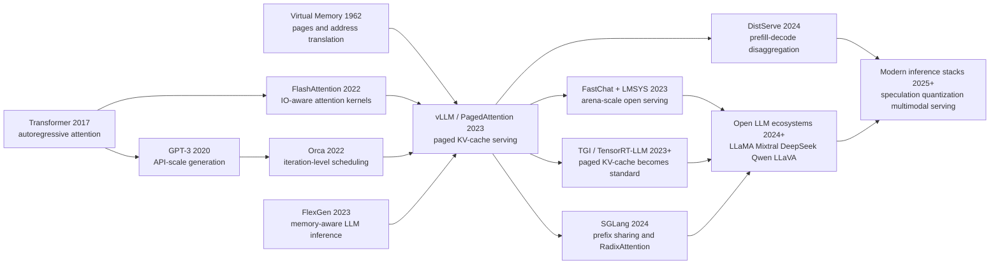

# vLLM / PagedAttention — 把 LLM 服务的瓶颈从显存碎片里救出来

> **2023 年 10 月，SOSP 2023 收下的 [vLLM / PagedAttention](https://arxiv.org/abs/2309.06180) 不是又一个更大的模型，而是一篇把 GPU 显存当作操作系统内存来重新想象的系统论文。** 它的反直觉点在于：LLM 服务的吞吐瓶颈不只来自矩阵乘法，也来自 KV cache 被连续大块预留后产生的碎片和重复拷贝。Woosuk Kwon、Zhuohan Li、Siyuan Zhuang、Ying Sheng、Lianmin Zheng、Cody Hao Yu、Joseph E. Gonzalez、Hao Zhang、Ion Stoica 九位作者把“分页、块表、引用计数、写时复制”这些老 OS 词汇搬进 Transformer 解码，让同一个模型在不改权重、不改输出质量的情况下多服务数倍请求；后来的开源 LLM 推理栈几乎都要回答它留下的问题：你的 KV cache 到底怎么管？

## 一句话总结

Woosuk Kwon、Zhuohan Li、Siyuan Zhuang、Ying Sheng、Lianmin Zheng、Cody Hao Yu、Joseph E. Gonzalez、Hao Zhang、Ion Stoica 九位作者在 2023 年 SOSP 发表的 vLLM，把 Transformer 解码时最不显眼也最昂贵的状态 KV cache 重新定义成“分页内存”：把每条序列的 key/value 张量切成固定 token 数的 KV blocks，用 block table 把逻辑块映射到不连续的物理块，并让 attention 直接按 $o_i=\sum_j V_j A_{ij}^{\top}$ 从这些块中读取。它替代的失败 baseline 不是某个模型，而是 HuggingFace/FasterTransformer/Orca 式“连续张量 + 预留最大长度”的服务默认：OPT-13B 单 token KV cache 约 800KB，2048 token 请求可到 1.6GB，而旧系统实验中只有 20.4%-38.2% KV 显存真正存了 token 状态。PagedAttention 通过按需分配、最后一块内碎片上界、block-level sharing 和 copy-on-write，把论文内吞吐相对 Orca/FasterTransformer 提高 2-4 倍，博客里相对 HF/TGI 最高到 24 倍/3.5 倍。它后来成为 LLaMA、Mixtral、DeepSeek、Qwen、LLaVA 等开放模型服务的底层常识；隐藏 lesson 是：基础模型时代的“算法突破”有时不是换一个网络，而是给已有网络补上一层正确的系统抽象。

---

## 历史背景

### 2023 年春天：LLM 服务从 demo 变成账单

vLLM 出现的时间点很重要。2022 年底 ChatGPT 把对话式 LLM 推到公众面前，2023 年上半年开源社区又迅速有了 LLaMA、Alpaca、Vicuna、FastChat、Chatbot Arena。模型从“研究者下载权重试一试”变成“很多人同时在线请求”的服务。对一个大学实验室或小团队来说，问题不再只是能不能跑通一次生成，而是能不能在有限 GPU 上承受真实流量。

这类服务的成本结构与传统 Web 服务完全不同。用户每发来一个 prompt，系统要先做 prefill，再一个 token 一个 token 地 decode；每一步都要读模型权重、读历史 token 的 key/value 状态、写入新 token 的状态。Reuters 在 2023 年初报道过一个当时被反复引用的估计：一次 LLM 请求的成本可能是传统关键词查询的 10 倍。这个数字未必适合所有模型和部署，但它准确抓住了行业焦虑：LLM API 如果不能提高吞吐，就很难变成可持续的基础设施。

在 vLLM 之前，大家已经知道 batching 很关键。Orca 的 iteration-level scheduling 证明，不必让一个 batch 里的所有请求等到同一长度才继续；每个 decode iteration 后可以移除完成请求、加入新请求。FasterTransformer、DeepSpeed Inference、FlashAttention 等工作也把 kernel 和矩阵计算推得很快。可是 2023 年的开源服务仍然卡在一个更朴素的问题上：如果显存里装不下足够多请求，再聪明的 batching 也没有请求可批。

### KV cache 为什么突然成了主角

Transformer 解码需要缓存每个历史 token 的 key 和 value。这个 KV cache 看起来只是中间状态，却会快速变成显存主角。论文给了一个很好记的数字：OPT-13B 的单个 token KV cache 大约 800KB，计算式是 $2 \times 5120 \times 40 \times 2$ bytes；如果请求长度上限是 2048 token，单条请求的 KV cache 最多可到约 1.6GB。对 A100-40GB 上的 13B 模型来说，权重约占 65% 显存，动态 KV cache 接近 30%。权重是静态的，activation 很短命，真正决定能塞进多少并发请求的，是这个动态增长的 cache。

旧系统的问题不只是 KV cache 大，而是它被当成普通连续 tensor 来管理。为了给未知长度的输出预留空间，系统往往按最大长度预分配一整段连续显存。实际输出可能很短，内部碎片就出现了；不同请求预留大小不同，外部碎片也出现了；即使未来 token 最终会用到一些槽位，它们在整个请求生命周期里被提前占住，别的请求也不能用。vLLM 论文把这三类浪费讲得很清楚：reserved slots、internal fragmentation、external fragmentation。

这个观察让论文有了系统论文的味道。它不是说“attention kernel 还可以再快一点”，而是说“attention 的状态布局错了”。论文剖析旧系统后发现，在实验里，已有服务系统只有 20.4%-38.2% 的 KV-cache 显存真正存放了 token 状态。换句话说，显存不是完全不够，而是被连续分配、最大长度预留和无法共享的设计吃掉了。

### Berkeley/LMSYS 的系统土壤

vLLM 也不是凭空来的。作者团队来自 UC Berkeley、Stanford、UC San Diego 和独立研究者，其中多位同时参与过 Alpa、AlpaServe、FlexGen、Vicuna、FastChat、Chatbot Arena 等项目。这个背景解释了论文为什么既懂模型服务的压力，也懂系统抽象的价值。它不是从模型结构出发问“能不能更强”，而是从真实服务出发问“为什么同样一张卡没有服务更多人”。

LMSYS 的早期经历给了 vLLM 一个非常具体的试验场。Vicuna 和 Chatbot Arena 需要在有限学术 GPU 上服务大量用户，最初的 HuggingFace backend 很快成为瓶颈。vLLM 博客提到，FastChat-vLLM 集成后能支撑最多 5 倍流量，并把相关服务 GPU 数量减半；内部早期 micro-benchmark 甚至看到相对初始 HF backend 最高 30 倍吞吐提升。论文里的 SOSP 版本更克制，报告相对 FasterTransformer 和 Orca 的 2-4 倍吞吐提升，但两者说的是同一个事实：LLM 服务已经到了必须认真管理动态状态的阶段。

这也是 vLLM 的历史定位。它不是训练新模型，也不是提出新 benchmark；它把操作系统课本里的分页、地址翻译、引用计数和写时复制放进 LLM serving。2023 年之后，开源模型的传播不再只由权重开放决定，还由推理引擎决定。LLaMA、Vicuna、Mistral、Mixtral、DeepSeek、Qwen、LLaVA 能被社区大量使用，背后都需要这样的 serving substrate。

## 研究背景与动机

### 核心问题：显存够不够，不只是权重大小

vLLM 的核心问题可以压成一句话：**在模型权重已经占据大部分 GPU 显存时，怎样让动态 KV cache 不再浪费剩下的空间？** LLM serving 的吞吐往往不是由单个请求的最快速度决定，而是由系统在可接受延迟下能并发多少请求决定。并发请求越多，权重读取越能被摊薄，GPU 利用率越高；但并发请求越多，KV cache 也越大。如果 KV cache 按最大长度连续预留，batch size 很快被显存上限卡住。

这个问题与普通 DNN serving 不同。传统图像模型的 tensor shape 大多固定，memory planner 可以提前安排；LLM 输出长度未知，用户 prompt 长度差异很大，decode 阶段每一步都会让 cache 增长。它也与训练时的 activation checkpointing 不同。训练可以在前后向图上做静态优化，而在线服务要面对请求到达、完成、被抢占、被恢复、并行采样、beam search 和共享 prefix。KV cache 既是模型计算的一部分，也是服务系统里的动态资源。

因此，vLLM 的动机不是“让模型更聪明”，而是“让相同模型在相同 GPU 上服务更多请求”。这也是为什么论文反复强调不影响模型准确性：PagedAttention 改变的是 key/value 张量的物理存储和读取方式，不改变注意力数学、不改变权重、不改变采样分布。它追求的是系统层的等价变换。

### 设计动机：把连续张量变成可分页对象

如果把 KV cache 继续看成一个连续 tensor，系统就会被最大长度预留锁死。vLLM 的动机是换一个抽象：逻辑上，序列的 token 仍然连续；物理上，KV cache 可以被切成固定大小的块，分散存放。块表负责把逻辑位置翻译到物理块，attention kernel 根据块表读取 key/value。这样一来，系统不必提前为未来 token 预留整段空间，只在新 token 需要时分配新块。

这个动机直接借用了 OS virtual memory。进程看到连续地址空间，操作系统把逻辑页映射到物理页；多个进程可以共享同一物理页，写入时再 copy-on-write。vLLM 把请求看成进程，把 token 看成 byte，把 KV block 看成 page。类比并不只是修辞，因为它带来真实能力：按需分配降低 reserved waste，固定块消除外部碎片，最后一块限制内部碎片，引用计数和写时复制支持 parallel sampling、beam search 和 shared prefix。

这就是 PagedAttention 的根本价值。它给 LLM serving 增加了一层内存间接寻址，让调度器、block manager 和 CUDA kernel 可以合作，而不是让模型执行被连续 tensor 布局绑住。后来的 serving 系统继续扩展 chunked prefill、prefix cache、speculative decoding、disaggregated prefill/decode、multi-LoRA、MoE serving，但许多扩展都站在同一个前提上：KV cache 是可管理、可共享、可调度的资源，不是一块不可切的连续数组。

---

## 方法详解

### 整体框架

vLLM 的方法可以分成两层：底层是 PagedAttention，让 attention kernel 能从不连续的 KV blocks 里读取历史 key/value；上层是 vLLM serving engine，用 scheduler、block manager、CUDA kernels 和分布式执行把这个新布局变成真实吞吐。论文的精妙之处在于两层必须一起看。如果只有 block manager，没有能读 block table 的 attention kernel，非连续存储就无法计算；如果只有 kernel，没有调度和引用计数，系统仍然不能处理并行采样、beam search、抢占和共享 prefix。

传统 autoregressive 生成可以写成：

$$
P(x_1,\ldots,x_n)=\prod_{i=1}^{n}P(x_i\mid x_1,\ldots,x_{i-1}).
$$

每生成一个新 token，模型只需要计算这个新位置的 query/key/value，但 attention 仍然要读之前所有位置的 key/value。于是 KV cache 成了一个随序列增长而增长的状态数组。旧系统把这个数组当成连续 tensor；vLLM 把它拆成固定大小块，并用 block table 维护逻辑序列与物理显存之间的映射。

| 组件 | vLLM 里的角色 | 为什么必须存在 |
|---|---|---|
| PagedAttention kernel | 按 block table 读取非连续 KV blocks | 让分页布局仍能执行 attention |
| KV block manager | 分配、释放、引用计数和 copy-on-write | 把动态 KV cache 变成可管理资源 |
| Scheduler | 选择每个 iteration 运行哪些 sequence groups | 在显存块不足时做公平调度和抢占 |
| CUDA kernels | fused reshape/write、block read attention、block copy | 抵消间接寻址和小块复制开销 |
| Distributed workers | 用同一 block table 执行 tensor parallel shards | 让大模型跨 GPU 时仍共享内存视图 |

### 关键设计 1：PagedAttention 的块式注意力

普通 attention 对第 $i$ 个 token 的计算可以写成：

$$
a_{ij}=\frac{\exp(q_i^\top k_j/\sqrt{d})}{\sum_{t=1}^{i}\exp(q_i^\top k_t/\sqrt{d})},\qquad
o_i=\sum_{j=1}^{i}a_{ij}v_j.
$$

PagedAttention 不改这个数学定义，它只改变 key/value 的存储与读取方式。设 block size 为 $B$，第 $j$ 个 KV block 包含一段连续逻辑 token 的 key/value：$K_j=(k_{(j-1)B+1},\ldots,k_{jB})$，$V_j=(v_{(j-1)B+1},\ldots,v_{jB})$。attention 可以按 block 读取：

$$
A_{ij}=\mathrm{softmax}_{\le i}(q_i^\top K_j/\sqrt{d}),\qquad
o_i=\sum_{j=1}^{\lceil i/B\rceil}V_jA_{ij}^{\top}.
$$

这条公式的含义是：逻辑上仍然对所有历史 token 做 attention；物理上，kernel 一块一块读取，并不要求这些块在显存中相邻。Block table 给出每个 logical block 对应的 physical block id，kernel 根据这个 id 做 gather。这样，vLLM 得到了 OS paging 最重要的自由度：逻辑连续不等于物理连续。

### 关键设计 2：Block table 与按需分配

block table 是 vLLM 的页表。每个 sequence group 有自己的逻辑块序列；每个逻辑块记录 physical block id、已填 token 数以及是否共享。prefill 阶段根据 prompt 长度分配足够 blocks；decode 阶段每生成一个 token，就把它的 KV 写入最后一个 block。如果最后一个 block 满了，block manager 再分配一个新 physical block，并把映射写入 table。

这个设计把最坏浪费限制在最后一个未填满 block。若 block size 为 $B$，单 token KV 大小为 $s_{kv}$，那么单序列因块内未填满造成的浪费满足：

$$
0\le w_{\text{tail}} < B\cdot s_{kv}.
$$

这与旧系统按最大长度预留形成鲜明对比。旧系统可能为 2048 token 上限预留整段 KV cache，即使输出只有几十 token；vLLM 只为已经出现的 token 和最后一个 block 分配空间。论文消融显示 block size 太小会降低 GPU 并行读写效率，太大又会增加内部碎片；实践中 default block size 16 在 ShareGPT 和 Alpaca 类型工作负载上取得了较好折中。

### 关键设计 3：共享、引用计数与写时复制

PagedAttention 真正超出“碎片优化”的地方，是它自然支持共享。Parallel sampling 里，一个 prompt 生成多个候选输出；prompt 部分的 KV cache 完全一样。Beam search 里，多个 beam 候选共享前缀，随后在某个 token 分叉。Shared prefix 场景下，系统提示词或 few-shot 示例可以被很多请求复用。连续 tensor 布局很难表达这些共享关系，只能复制大段 KV cache；block table 则可以让多个 logical blocks 指向同一个 physical block。

为保证写入安全，vLLM 给 physical block 维护 reference count。当一个共享 block 需要被某个 sequence 写入时，如果引用计数大于 1，系统分配新 block，把旧 block 内容复制过去，再让当前 sequence 写新 block；如果引用计数为 1，就可以原地写。这正是 OS 里的 copy-on-write，只是对象从内存页变成了 KV block。

共享后的物理块数量可以用一个直觉式公式表示：

$$
N_{\text{physical}}\approx \sum_{r}\left\lceil\frac{L_r}{B}\right\rceil - N_{\text{shared blocks}}.
$$

这个公式不是精确调度模型，但它说明为什么 beam search 和 parallel sampling 受益更大：分支越多、共享前缀越长，可扣掉的 shared blocks 越多。论文报告，在 Alpaca 上 parallel sampling 节省 6.1%-9.8% KV blocks，beam search 节省 37.6%-55.2%；在 ShareGPT 上，两者分别达到 16.2%-30.5% 和 44.3%-66.3%。

```python
def append_token(sequence, token_kv, block_manager):
    block = sequence.logical_blocks[-1]
    physical = block.physical_block

    if block.is_full():
        physical = block_manager.allocate()
        sequence.logical_blocks.append(LogicalBlock(physical))

    elif physical.ref_count > 1:
        new_physical = block_manager.allocate()
        block_manager.copy_block(src=physical, dst=new_physical)
        physical.ref_count -= 1
        block.physical_block = new_physical
        physical = new_physical

    physical.write_next(token_kv)
    block.filled += 1
```

### 关键设计 4：调度、抢占与分布式执行

vLLM 的 scheduler 采用 FCFS 策略，并把有共享关系的多条 sequence 作为 sequence group gang-schedule。这样做是为了避免 beam search 或 parallel sampling 中某些候选还在运行、另一些候选被单独抢占，导致共享块语义复杂化。当显存 physical blocks 不够时，vLLM 会抢占后到的请求，并在 swapping 与 recomputation 之间选择恢复方式。论文指出，LLM 服务有一个特殊事实：一个 sequence 的所有 blocks 通常会一起被访问，所以抢占可以 all-or-nothing；恢复也可以把 prompt 和已生成 token 拼接起来重新做一次 prefill，而不是逐 token decode。

分布式执行里，vLLM 支持 Megatron-LM 风格 tensor parallel。每个 GPU worker 只保存自己负责 attention heads 的 KV cache shard，但它们共享同一套逻辑到物理 block 映射。每个 iteration 开始时，scheduler 广播 input tokens 和 block table；各 worker 根据相同 physical block ids 读取自己的 KV shard，并通过 all-reduce 同步中间结果。关键点是：内存管理逻辑集中在 scheduler/block manager，而不是让每个 worker 各自猜测 cache 布局。

| 设计点 | 解决的问题 | 代价 | 论文里的处理 |
|---|---|---|---|
| 非连续 KV blocks | 连续预留导致碎片和 reserved waste | attention 需要额外间接寻址 | PagedAttention kernel 直接读 block table |
| 按需分配 | 输出长度未知、最大长度预留浪费 | 最后一块仍有小碎片 | default block size 16 控制折中 |
| Block sharing | parallel sampling/beam search 重复 KV | 需要引用计数与 COW | physical block ref count + fused block copy |
| FCFS + preemption | 请求超载时显存块不足 | swap/recompute 有恢复开销 | all-or-nothing sequence-group 抢占 |
| 分布式 block table | 大模型跨 GPU 时 cache shard 分散 | 控制消息要广播 | scheduler 统一发送 block table |

### 关键设计 5：Kernel 级优化让抽象不只停在纸面

分页通常会带来间接寻址开销，GPU 上小块随机访问尤其危险。vLLM 因此做了三类 kernel 优化。第一，fused reshape and block write：每层新产生的 key/value 需要 reshape 成适合 block read 的布局并写入目标位置，vLLM 把这些动作融合，减少 kernel launch。第二，fusing block read and attention：PagedAttention kernel 在 attention 计算中直接按 block table 读取 KV blocks，并让 warp 级线程协同读取一个 block。第三，fused block copy：copy-on-write 可能触发许多小块复制，vLLM 用一个 kernel 批量处理多个 block copy，而不是反复调用 `cudaMemcpyAsync`。

这里有一个很重要的取舍：PagedAttention 的 attention kernel 延迟在 microbenchmark 中比高度优化的 FasterTransformer attention 高 20%-26%，因为它要读 block table、处理分支和变长序列。但端到端服务吞吐仍然显著更高，因为系统能塞进更多并发请求，GPU 利用率更好。vLLM 的方法论就是这条 trade-off：允许单个 operator 稍慢，只要系统层的 batch size、共享和内存利用率让整体吞吐更高。

---

## 失败案例

vLLM 的贡献不是“发明了 batching”，也不是“写了一个更快的 attention kernel”。它真正击中的失败路线，是 2023 年之前很多服务系统默认接受的内存模型：把 KV cache 当成普通连续 tensor，把最大输出长度当成必须提前预留的空间，把并行采样和 beam search 的共享前缀当成多份独立状态。论文好看的地方在于，它没有用一个单点 benchmark 证明自己，而是把这些 baseline 为什么自然、为什么失败、为什么 PagedAttention 能替代讲清楚。

### Baseline 1：连续 KV 张量 + 最大长度预留

最直接的失败 baseline，是把每条请求的 KV cache 存成一段连续显存，并按最大序列长度预留。这个做法非常自然，因为深度学习框架喜欢连续 tensor，CUDA kernel 也更容易写；如果输出长度已知且所有请求差不多长，它甚至可以很简单。但 LLM 服务偏偏相反：prompt 长度差异大，输出长度未知，请求不断到达和结束。

于是连续预留产生三类浪费。reserved slots 是未来 token 可能会用但现在被提前占住的槽位；internal fragmentation 是最大长度和实际长度之间的差；external fragmentation 是显存分配器留下的小洞。vLLM 论文的 Figure 2 给出关键数字：旧系统实验中只有 20.4%-38.2% 的 KV cache 显存真正用来存 token 状态。这个 baseline 失败的原因不是实现粗糙，而是抽象错了。

### Baseline 2：只靠 iteration-level scheduling

Orca 是 vLLM 最重要的系统 baseline。它的 iteration-level scheduling 解决了传统 request-level batching 的大问题：不必等一整个请求生成结束再更新 batch，而是每个 iteration 都能移除完成请求、加入新请求。这个思想非常正确，vLLM 也不是反对它。问题是 Orca 式调度仍然需要底层显存装得下请求；如果 KV cache 内存被连续预留和碎片浪费掉，调度器想加入新请求也没有空间。

论文把 Orca 做成三个版本：Orca (Oracle) 假设提前知道真实输出长度，是不可实现的上界；Orca (Pow2) 最多预留 2 倍；Orca (Max) 总是按最大长度预留。这个设置很有说服力，因为 vLLM 不只是打败一个糟糕实现，而是在许多场景中超过了带 oracle 信息的 Orca。它说明 memory management 与 scheduling 是互补关系：iteration-level scheduling 提高调度粒度，PagedAttention 提高可调度请求数量。

### Baseline 3：只优化 attention kernel 或低延迟引擎

FasterTransformer 代表另一条自然路线：把 transformer inference kernel 做到低延迟、高优化。这个路线对单请求或小 batch 很有价值，但它不自动解决在线服务的吞吐问题。LLM decode 常常 memory-bound；如果系统不能把足够多请求放入 batch，GPU 的计算能力仍然会被低利用率吞掉。

vLLM 在 microbenchmark 中承认自己的 PagedAttention kernel 比 FasterTransformer attention 慢 20%-26%。这是论文最诚实也最有启发的地方：单 operator 更快不等于服务系统更快。PagedAttention 增加了间接寻址，但释放了 batch size 和共享机会。系统论文看的是端到端吞吐和延迟曲线，而不是 kernel 单点速度。

### Baseline 4：把复杂解码当成多份独立请求

parallel sampling、beam search、shared prefix 在 LLM API 中非常常见。代码补全会要求同一 prompt 生成多个候选；翻译和搜索会用 beam；聊天系统会反复带着相同 system prompt 或示例。连续 tensor 布局通常把这些分支当成独立序列，导致 prompt KV cache 被复制多份，beam 分叉时还要搬运大块状态。

PagedAttention 的 block table 让共享变成一条自然操作：多个 logical blocks 指向同一个 physical block。真正发生写入时，copy-on-write 只复制最后相关的 block，而不是复制整段历史。这个 baseline 的失败点在于，它没有给“相同前缀”一个一等公民的表示；vLLM 则把前缀共享降到 block manager 层，让上层解码算法只需要 fork、append、free 三个动作。

| 失败路线 | 当时为什么合理 | 失败位置 | vLLM 的替代 |
|---|---|---|---|
| 连续 KV tensor | 框架和 kernel 都偏好连续内存 | 最大长度预留和碎片浪费显存 | 固定 KV blocks + block table |
| 只做 iteration-level scheduling | Orca 已证明细粒度调度有效 | 调度器受限于可用 KV 显存 | 内存利用率提升后能批更多请求 |
| 只追求 kernel 低延迟 | FasterTransformer 单算子很快 | 小 batch 下服务吞吐仍低 | 以轻微 kernel 开销换更大 batch |
| 复杂解码独立存储 | 实现简单、语义清楚 | 共享前缀被重复复制 | 引用计数 + copy-on-write |
| 只做 compaction | 看似能解决碎片 | 大 KV cache 搬移太贵 | 不连续物理布局避免频繁压缩 |

## 实验关键数据

### 基本采样：与 Orca/FasterTransformer 的吞吐差距

论文的主要实验使用 OPT-13B、OPT-66B、OPT-175B 和 LLaMA-13B，在 Google Cloud A2 的 A100 GPU 上评估；工作负载来自 ShareGPT 和 Alpaca 的输入/输出长度分布，并用 Poisson 到达过程合成请求。关键指标是 normalized latency，也就是每个请求端到端延迟除以输出 token 数。系统能在更高请求率下保持相似 normalized latency，就说明吞吐更强。

在 ShareGPT 基本采样上，vLLM 相对 Orca (Oracle) 能维持 1.7 倍到 2.7 倍更高请求率，相对 Orca (Max) 是 2.7 倍到 8 倍；相对 FasterTransformer，最高能到 22 倍。论文给出的解释很直接：vLLM 能把更多请求同时放进显存。例如 OPT-13B 场景中，vLLM 同时处理的请求数是 Orca (Oracle) 的 2.2 倍，是 Orca (Max) 的 4.3 倍。

| 场景 | vLLM 相对 baseline 的结果 | 读法 |
|---|---:|---|
| ShareGPT basic sampling vs Orca (Oracle) | 1.7x-2.7x higher request rate | 即使 baseline 知道真实输出长度，vLLM 仍更能装请求 |
| ShareGPT basic sampling vs Orca (Max) | 2.7x-8x higher request rate | 最大长度预留在长对话分布上代价很高 |
| ShareGPT basic sampling vs FasterTransformer | up to 22x higher request rate | 低延迟 kernel 缺少 fine-grained scheduling 和分页内存 |
| OPT-13B concurrent requests vs Orca (Oracle) | 2.2x more batched requests | 吞吐提升来自更大有效 batch |
| OPT-13B concurrent requests vs Orca (Max) | 4.3x more batched requests | 减少预留和碎片直接扩大 batch |

### 并行采样、beam search 与 prefix sharing

复杂解码是 PagedAttention 最容易显示优势的地方。parallel sampling 里，同一 prompt 的多个输出共享 prompt KV cache；beam search 里，候选序列共享更长的前缀，而且共享关系会随着 beam 更新动态变化。论文在 OPT-13B + Alpaca 上看到，vLLM 相对 Orca (Oracle) 的提升从 basic sampling 的 1.3 倍，上升到 beam width 6 时的 2.3 倍。

内存节省数字更直观。Alpaca 上 parallel sampling 通过共享 KV blocks 节省 6.1%-9.8% 内存，beam search 节省 37.6%-55.2%；ShareGPT 的 prompt 更长、输出更长，节省也更大，parallel sampling 为 16.2%-30.5%，beam search 为 44.3%-66.3%。shared prefix 实验同样明显：WMT16 英德翻译任务里，共享 one-shot prefix 时 vLLM 比 Orca (Oracle) 吞吐高 1.67 倍，共享 five-shot prefix 时高 3.58 倍。

| 解码场景 | 数据集/任务 | 关键数字 | 含义 |
|---|---|---:|---|
| Parallel sampling memory saving | Alpaca | 6.1%-9.8% | prompt 较短时也能减少重复 KV |
| Beam search memory saving | Alpaca | 37.6%-55.2% | beam 分支共享大量历史 blocks |
| Parallel sampling memory saving | ShareGPT | 16.2%-30.5% | 长 prompt 放大共享收益 |
| Beam search memory saving | ShareGPT | 44.3%-66.3% | 长对话 + beam 的共享空间最大 |
| Shared one-shot prefix | WMT16 En-De | 1.67x throughput | prefix blocks 可跨请求复用 |
| Shared five-shot prefix | WMT16 En-De | 3.58x throughput | few-shot 越长，共享越值钱 |

### Memory waste、block size 与抢占消融

vLLM 最重要的消融不是某个模型质量指标，而是 memory waste 和 block size。论文 Figure 2 显示，旧系统有效使用 KV-cache 显存的比例只有 20.4%-38.2%；vLLM 的浪费接近最后一个 block 的理论上界。博客用更面向用户的说法总结为：旧系统会浪费 60%-80% 显存，而 PagedAttention 实践中浪费低于 4%。这两个表述关注的实验口径不同，但指向同一个结论：显存碎片不是边角问题，而是吞吐瓶颈。

block size 消融解释了为什么默认值不是越小越好。小 block 减少尾部碎片，但让 kernel 难以充分利用 GPU 并行读写；大 block 读写效率更高，却增加内部碎片并降低共享概率。论文发现 ShareGPT 上 16 到 128 都有较好表现，Alpaca 上 16 和 32 更稳，过大的 block 会因为序列短而退化。因此 vLLM 默认选 16，是一个系统折中，而不是数学常数。

抢占恢复也有类似取舍。swapping 把 KV blocks 搬到 CPU RAM，适合较大 block；recomputation 重新计算 KV cache，小 block 时往往更划算，因为许多小块的 PCIe 传输会很低效。论文结论是，中等 block size 16 到 64 下两者端到端表现接近。这部分实验提醒读者：PagedAttention 给了系统自由度，但具体策略仍要看硬件带宽、模型大小和工作负载。

### 论文外实战：FastChat、TGI 与开源生态

SOSP 论文为了严谨，主要比较 FasterTransformer 和 Orca；vLLM 博客则展示了更贴近开发者的对比：在 LLaMA-7B/A10G 和 LLaMA-13B/A100-40GB 上，vLLM 相对 HuggingFace Transformers 达到 14 倍到 24 倍吞吐提升，相对 HuggingFace TGI 达到 2.2 倍到 2.5 倍；当每个请求要 3 个 parallel completions 时，相对 HF 是 8.5 倍到 15 倍，相对 TGI 是 3.3 倍到 3.5 倍。

这组数字后来在开源生态里非常有传播力，因为它不是“论文里打败模拟 baseline”，而是“你今天用的推理库可以少花很多卡”。Chatbot Arena 的案例也让 vLLM 不是纯 benchmark：FastChat-vLLM 在 2023 年 4-5 月处理了大量 Vicuna/Koala/LLaMA 请求，平均每天约 30K 请求、峰值 60K，并帮助 LMSYS 在有限 GPU 下继续运营。vLLM 的实验价值因此有两层：论文证明 PagedAttention 的系统机制，真实部署证明它能承受社区流量。

| 来源 | 对比对象 | 最高或区间结果 | 使用时应注意 |
|---|---|---:|---|
| SOSP paper | Orca / FasterTransformer | 2x-4x throughput | 论文主张，延迟水平相近 |
| SOSP paper | FasterTransformer on ShareGPT | up to 22x request rate | 受 scheduling 和 memory 双重影响 |
| vLLM blog | HuggingFace Transformers | up to 24x throughput | 面向开发者的单机对比 |
| vLLM blog | HuggingFace TGI | up to 3.5x throughput | 早期 TGI 版本背景 |
| LMSYS deployment | initial HF backend | up to 30x internal micro-benchmark | 内部早期 benchmark，不等同论文主张 |
| LMSYS operations | FastChat-vLLM serving | 50% fewer GPUs for related traffic | 真实服务案例，受 workload 影响 |

---

## 思想史脉络

### 前世：OS 分页、Transformer 解码与服务系统

vLLM 的前世看起来来自三个世界。第一个世界是操作系统。1960 年代的 virtual memory 和 paging 解决的是“程序想要连续地址空间，但物理内存不必连续”的问题；页表、引用计数、写时复制、换出换入，都是为了在有限内存里给多个进程制造一个更好用的抽象。vLLM 不是简单借用比喻，而是真把这些机制改写成 KV cache 管理策略。

第二个世界是 Transformer 解码。Transformer 让 attention 成为主干，GPT-3 和 ChatGPT 让 autoregressive generation 变成线上 API。但随着模型和用户流量变大，解码阶段的瓶颈逐渐从“能不能算 attention”转向“能不能把足够多请求的历史状态放进显存”。这个转向不是一夜发生的；它随着 LLaMA/Vicuna/Chatbot Arena 的真实流量在 2023 年突然变得可见。

第三个世界是模型服务系统。Clipper、TensorFlow Serving、Clockwork、InferLine、AlpaServe 等系统处理过 batching、placement、latency SLO、model parallelism；Orca 又把 generative transformer 的 iteration-level scheduling 讲清楚；FlashAttention 则证明 attention 的 IO 模型本身值得重写。vLLM 在这些线之间找到了一个空位：不是只调度，不是只优化 kernel，而是把动态 token state 的内存抽象换掉。

### 今生：KV cache 变成一等资源

vLLM 之后，KV cache 不再只是代码里一个临时 tensor。它变成了 serving 系统要显式建模、显式调度、显式共享的资源。这个变化很像数据库系统把 buffer pool 当作核心组件，或操作系统把页表当作核心接口。LLM 服务的许多后续问题都可以重新表述为 KV cache 问题：长上下文怎么压缩？prefix cache 怎么命中？speculative decoding 的 draft tokens 要不要写 cache？prefill 和 decode 要不要分离到不同机器？MoE 模型和多模态模型的 KV 内存如何调度？

下面这张图用英文节点保持中英两版字符级一致，标出 vLLM 在操作系统、Transformer、serving 系统和开源模型生态之间的位置。



### 后人误读：PagedAttention 不是“更快的 FlashAttention”

vLLM 最常见的误读，是把 PagedAttention 当成另一个 attention acceleration kernel，和 FlashAttention 放在同一个小格子里。两者确实都改 attention 的实现，也都关心内存访问，但问题不同。FlashAttention 主要优化 attention 计算本身的 IO，尤其在训练和长序列 attention 中减少 HBM 读写；PagedAttention 主要优化在线 serving 中历史 KV cache 的动态分配、碎片、共享和调度。前者让一次 attention 更高效，后者让服务系统能批更多、共享更多、浪费更少。

第二个误读是“PagedAttention 让 KV cache 免费”。它没有。KV cache 仍然会随上下文长度、层数、head 数、hidden size 和并发请求增长；长上下文模型甚至让 KV cache 更接近显存主角。vLLM 改的是布局和可共享性，不是信息论下限。128K context、multimodal token、long-running agent、large batch decode 仍然需要新的压缩、量化、offload 和调度策略。

第三个误读是“vLLM 只是一个 2023 年单点优化”。实际上，vLLM 很快变成一个推理平台：continuous batching、chunked prefill、prefix caching、speculative decoding、OpenAI-compatible API、多硬件 backend、MoE 和多模态模型支持都被放到同一个生态里。PagedAttention 是起点，但它真正留下的是“LLM inference engine 应该像数据库或 OS 一样管理状态”的工程观。

### 留给后人的东西

vLLM 留给后人的第一件东西，是一个被复用的抽象：logical sequence blocks 到 physical KV blocks 的映射。很多后续系统即使用不同名字，也在做同类事情。TensorRT-LLM、TGI、SGLang、LMCache、DistServe、DeepSpeed-FastGen、各种 prefix cache 和 chunked prefill 方案，都在围绕 KV cache 的分配、共享、搬移和生命周期做文章。

第二件东西，是一条评价 serving 系统的标准线。论文迫使大家同时报告吞吐、延迟、request rate、batch size、显存利用率、工作负载长度分布和解码算法，而不是只说“kernel 更快”。这影响了后来的系统论文写法：如果一个 LLM serving paper 不讲 KV cache，它就很难说清楚自己在解决真实瓶颈。

第三件东西，是开源生态的默认基础设施。2023 年以后，模型发布不再只是权重和 model card；能不能在 vLLM/TGI/TensorRT-LLM/SGLang 里跑，能不能支持 streaming、parallel sampling、LoRA、MoE、multimodal、long context，开始决定模型被使用的速度。vLLM 把“服务可用性”变成了模型影响力的一部分。

| 思想节点 | vLLM 之前 | vLLM 的变异 | 后续结果 |
|---|---|---|---|
| 虚拟内存 | 管理进程地址空间 | 管理序列 KV blocks | block table 成为 serving 抽象 |
| Attention kernel | 优化单次计算 IO | 支持非连续 KV 读取 | kernel 与 memory manager 共同设计 |
| Batching | 关注调度粒度 | 关注显存能装多少请求 | memory utilization 进入吞吐公式 |
| Decoding algorithms | 分支状态常被复制 | prefix/beam 共享一等化 | parallel sampling 和 beam search 更实用 |
| Open LLM deployment | 权重开放是主信号 | 推理引擎成为生态入口 | serving stack 放大模型影响力 |

---

## 当代视角

### 2023 年看：vLLM 把 OS 思维带进模型服务

站在 2023 年看，vLLM 最醒目的地方不是某个复杂公式，而是它把一个很老的系统思想放到了最热的新工作负载上。LLM 社区那时的注意力大多在模型权重、指令微调、RLHF、benchmark 和开源许可证上；vLLM 提醒大家，模型真正被使用时，服务系统同样决定能力能不能落地。一个 13B 或 70B 模型在论文表格里很强，不代表它能在有限 GPU 上稳定服务几万人。

PagedAttention 的成功也说明，基础模型时代的创新不总是“改网络结构”。有时真正的突破，是把一个被忽视的状态变量重新抽象出来。KV cache 在论文里不是新对象，Transformer 解码一直都有；但 vLLM 把它从 implementation detail 提升为系统资源。这个视角一旦成立，很多后续优化自然出现：prefix sharing、chunked prefill、continuous batching、speculative decoding、KV cache quantization、disaggregated serving 都变得更容易组织。

### 2024-2026 年看：它成了推理栈而不只是一篇论文

从今天看，vLLM 已经不只是 PagedAttention 的实现，而是开源 LLM 推理生态的核心项目之一。它支持大量 Hugging Face 模型、OpenAI-compatible API、streaming、LoRA、MoE、多模态、多硬件后端、prefix caching、chunked prefill、speculative decoding 和各种量化格式。GitHub 上的 star、fork、contributors 和下游依赖数都说明，它已经变成基础设施，而不是只供复现实验的研究代码。

这也让论文的影响方式和普通模型论文不同。模型论文常常被后继模型替代；系统论文如果抽象对了，会在很多后继模型下面继续工作。LLaMA 之后有 LLaMA 2/3/4，Mixtral 之后有更多 MoE，DeepSeek 和 Qwen 又继续刷新能力，但它们都需要一个能处理动态 KV cache 的服务层。vLLM 的生命力就在这里：模型会换，serving abstraction 会留下。

### 哪些假设后来站不住

第一个站不住的假设是“paged KV cache 解决了显存问题”。它解决的是浪费和共享，不是 KV cache 的根本增长。长上下文和多模态输入会让 KV cache 更大；128K、1M context 或长时间 agent 场景里，分页只能让显存利用更接近最优，不能让状态消失。

第二个站不住的假设是“吞吐提升可以只看平均值”。真实服务要关心 P50/P95/P99 latency、prefill/decode interference、队列稳定性、抢占恢复、cache hit rate、不同 prompt 长度分布和多租户隔离。vLLM 让吞吐大幅提升，但也把系统调度问题推到更细粒度。

第三个站不住的假设是“一个通用 backend 可以无痛支持所有新模型”。MoE、speculative decoding、多模态、structured output、tool calling、reasoning parser、long context、KV quantization 都会给 block manager 和 scheduler 增加新约束。vLLM 能持续流行，正是因为它不断把这些约束吸进系统；这也说明 PagedAttention 本身只是起点。

| 当年假设 | 后来发生了什么 | 今天的判断 |
|---|---|---|
| 分页让 KV cache 不再是问题 | 长上下文和多模态继续放大 KV memory | 分页提高利用率，但不能替代压缩/量化/offload |
| 平均吞吐足够说明服务质量 | P95/P99、队列和 prefill/decode 干扰很关键 | goodput 和尾延迟需要一起报告 |
| 单个 attention kernel 决定性能 | scheduler、block manager、network、hardware backend 都重要 | inference engine 是多层系统 |
| 开源权重自然会被使用 | 没有成熟 serving path 的模型很难进入产品 | 模型发布要同时考虑推理栈 |

## 局限与展望

### 分页不消灭 KV cache 的基本成本

PagedAttention 的最大局限，是它优化显存利用率，但不改变 KV cache 随上下文长度线性增长的事实。对于标准 full-attention decoder，token 越多，需要保留的 key/value 越多；模型层数、head 数、hidden size 越大，单 token cache 越贵。vLLM 可以把碎片降到很低，可以共享重复前缀，但不能免费存储无限历史。

未来路线需要与 PagedAttention 互补。KV cache quantization 可以降低每 token bytes；sliding/window attention、state-space/hybrid 模型和 retrieval memory 可以减少需要保留的历史；CPU/NVMe offload 和 disaggregated serving 可以扩展存储层级；prefix cache 和 semantic cache 可以提高复用率。vLLM 的作用更像一个基础内存管理层，而不是所有长上下文问题的终点。

### 复杂系统带来新的调度和可观测性问题

一旦 KV cache 被分页、共享、抢占和恢复，系统就需要新的可观测性。开发者不仅要知道 GPU utilization，还要知道 physical block occupancy、tail waste、reference count 分布、prefix cache hit rate、preemption count、swap/recompute overhead、不同租户的块占用、不同模型的 cache 压力。否则吞吐下降时，很难判断是模型太大、prompt 太长、block size 不合适，还是 scheduler 策略出了问题。

调度也会更复杂。prefill 是大矩阵计算，decode 是持续的小步 memory-bound 计算；把两者混在同一 GPU 上可能互相干扰。后来的 DistServe、chunked prefill、disaggregated prefill/decode 都是在回答这个问题。vLLM 打开了状态管理的大门，但也让服务系统必须更像数据库和 OS：调度、隔离、恢复、监控都要成为一等功能。

### 评测仍难覆盖真实服务

vLLM 的论文实验已经比许多系统论文更细，但真实服务的工作负载仍然更复杂。ShareGPT 和 Alpaca 长度分布可以近似聊天和指令请求，却不能完全覆盖 RAG、agent 工具调用、长文档 QA、多轮对话、代码仓库上下文、多模态输入、企业 batch job 和付费 API 的混合流量。不同 workload 下，最优 block size、抢占策略、cache sharing 效益和尾延迟都可能变化。

未来评测需要把模型质量、服务吞吐和用户体验放在同一个表里：tokens/s、request/s、time-to-first-token、inter-token latency、P95/P99、GPU memory、KV block waste、cache hit rate、cost per 1M tokens、不同上下文长度和不同 decoding method 的结果。vLLM 已经证明 KV-cache memory 是核心变量；后续基准要把它量化得更透明。

## 相关工作与启发

### 对研究者的启发

vLLM 给研究者的第一条启发，是“旧抽象在新工作负载里可能重新变成突破”。Paging、copy-on-write 和 reference counting 都不是新技术；新的是它们遇到了动态、昂贵、可共享的 KV cache。很多基础模型系统问题也可能有类似答案：不一定要发明全新理论，可能只需要把一个成熟系统抽象放到正确层级。

第二条启发是，模型和系统边界正在变薄。过去模型论文可以只关心 accuracy，系统论文可以只关心 throughput；LLM 时代两者越来越难分开。一个长上下文模型如果没有可承受的 KV cache 策略，能力很难被用户体验到；一个 MoE 模型如果没有 expert parallelism 和 serving kernel，active parameter 优势也可能落空。vLLM 是这种融合的早期标志。

### 对工程系统的启发

对工程师来说，vLLM 最重要的 lesson 是：不要只看模型参数和单算子延迟，要看动态状态生命周期。KV cache 从创建、共享、增长、分叉、抢占、恢复到释放，每一步都影响吞吐和成本。把这些状态显式建模，往往比继续微调一个 kernel 更有回报。

第二个 lesson 是接口设计会放大研究影响。vLLM 不只是论文里的 algorithm；它提供了 Python API、OpenAI-compatible server、Hugging Face 模型支持和易用安装路径。正因为研究抽象被包装成开发者能直接用的工具，它才进入 FastChat、Arena、开源模型榜单和企业服务栈。系统论文如果想改变生态，代码、文档和接口不是附属品，而是影响力本身。

## 相关资源

| 类型 | 资源 | 链接 | 说明 |
|---|---|---|---|
| 论文 | Efficient Memory Management for Large Language Model Serving with PagedAttention | https://arxiv.org/abs/2309.06180 | SOSP 2023 论文与 arXiv 版本 |
| 代码 | vllm-project/vllm | https://github.com/vllm-project/vllm | vLLM 开源推理与服务引擎 |
| 博客 | vLLM: Easy, Fast, and Cheap LLM Serving with PagedAttention | https://vllm.ai/blog/vllm | 2023 年 6 月发布博文，含 HF/TGI 与 LMSYS 案例 |
| 前序 | Orca | https://www.usenix.org/conference/osdi22/presentation/yu | iteration-level scheduling 关键 baseline |
| 前序 | FlashAttention | https://arxiv.org/abs/2205.14135 | attention IO 优化的重要前史 |
| 前序 | FlexGen | https://arxiv.org/abs/2303.06865 | 有限 GPU 显存下的 LLM inference |
| 后续 | SGLang | https://github.com/sgl-project/sglang | prefix sharing / RadixAttention 代表性后续系统 |
| 后续 | TensorRT-LLM | https://github.com/NVIDIA/TensorRT-LLM | 工业推理栈中的 paged KV-cache 方向 |

如果只记住一个结论：vLLM 的历史价值不是“把 attention kernel 写快了一点”，而是把 KV cache 从连续 tensor 变成了可分页、可共享、可调度的系统资源。基础模型越大、上下文越长、服务越复杂，这个抽象越像 LLM 推理栈的地基。


---

> 🌐 [English version](/en/era5_genai_explosion/2023_vllm/) · 📚 awesome-papers project · CC-BY-NC