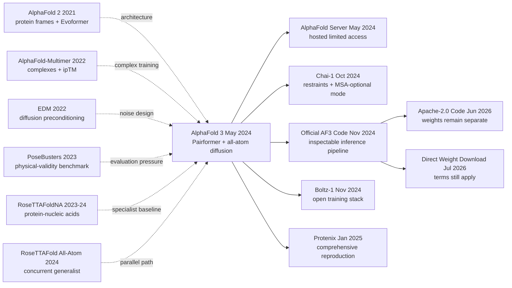

# AlphaFold 3 — 用全原子扩散统一预测生物分子复合物

> 2024 年 5 月 8 日，[AlphaFold 3 的 Nature 论文](https://doi.org/10.1038/s41586-024-07487-w) 把蛋白质、DNA、RNA、配体、离子和修饰第一次塞进同一套全原子扩散系统：blind PoseBusters V1 的 ligand pose 成功率达到 76.4%，高于拿到 holo 结构的 Vina 52.3%。但这篇论文最值得记住的不是“结构问题已经解决”，而是它把代价也写在同一页上：手性感知排序后仍有 4.4% 违规，多次采样不构成动力学 ensemble，论文上线时只有伪代码和受限 server。官方 inference code 到 2024 年 11 月才发布，2026 年代码改用 Apache-2.0、权重改为直接下载，训练管线与权重条款仍是另一回事。AF3 同时是一场表示革命，也是一堂关于 benchmark、访问权和结构预测边界的公开课。

## 一句话总结

Josh Abramson、Jonas Adler、Jack Dunger 等 48 位作者 2024 年发表于 *Nature* 的 AlphaFold 3，沿用 [AlphaFold 2](../era4_foundation_models/2021_alphafold2.md) 的 single/pair 思路，以混合粒度 token 表示残基、配体与修饰，再用非等变 diffusion 联合生成复合物坐标。它默认从 5 seeds × 5 samples 中按 $s=0.8\,\mathrm{ipTM}+0.2\,\mathrm{pTM}+0.5\,f_{\mathrm{disorder}}-100\,\mathbb{1}_{\mathrm{clash}}$ 选择结果；blind PoseBusters V1 成功率为 76.4%，高于 Vina 52.3%。但 docking 对手常拿到 holo receptor 或 pocket，抗体 62.9% 又来自双方各排序 1,000 seeds，不能把柱高当成同输入、同算力的单次前向对决。

它留下“统一条件表示 + 全原子生成 + 置信度选择”的范式，并催生 [Chai-1](https://doi.org/10.1101/2024.10.10.615955) 与 [Boltz-1](https://doi.org/10.1101/2024.11.19.624167) 的条件控制和开放复现。反直觉之处在于，扩大化学覆盖靠的是拆掉 AF2 的硬编码 frame 与部分 stereochemical constraints，这也留下排序后仍有 4.4% chirality violations、无序区 hallucination 和整链碰撞；diffusion samples 不是溶液 ensemble，retrospective pose 更不是 affinity 或药物发现成功。

---

## 历史背景

### 2021 到 2024：AlphaFold 2 已经解决了什么

2021 年 7 月，[AlphaFold 2](https://doi.org/10.1038/s41586-021-03819-2) 把单条蛋白质序列到静态三维结构的预测精度推到许多目标上可与实验结构竞争。它的关键对象仍然很明确：以氨基酸残基为基本单位，用 MSA 与模板构造 single/pair 表示，再由针对蛋白质设计的刚体 frame、侧链扭转角和 Invariant Point Attention 生成坐标。这个系统改变了蛋白单体建模，却没有把细胞里的“分子相互作用”一并解决。

真正的生物功能往往发生在复合物里。蛋白质会和另一条蛋白质、DNA、RNA、小分子、金属离子或糖链共同形成结构；磷酸化、甲基化等修饰又会改变局部几何与界面。2022 年的 [AlphaFold-Multimer](https://doi.org/10.1101/2021.10.04.463034) 把 AF2 扩展到蛋白质多聚体，但输入和输出仍以蛋白残基为中心。它既不是小分子 docking 工具，也不能自然表示核苷酸、离子和任意 Chemical Components Dictionary 条目。AF3 的起点因此不是“再把单体 LDDT 提高几个点”，而是把问题边界从 protein structure 扩成 biomolecular complex structure。

这一区分很重要。AF2 预测的是 PDB 中常见的静态构象近似，不给折叠路径、动力学、结合自由能或药效。AF3 即使换成生成式扩散，论文也明确说随机种子和 diffusion samples 不会构成溶液态构象 ensemble。两代模型都应被理解为结构假设生成器，而不是把生物物理实验替换掉的模拟器。

### 专用工具各管一段的年代

AF3 出现前，复合物建模被拆成多个互不兼容的工具栈。蛋白-蛋白界面由 AlphaFold-Multimer、模板 docking 或传统采样方法处理；蛋白-核酸与 RNA 结构有 [RoseTTAFoldNA](https://doi.org/10.1038/s41592-023-02086-5)；小分子姿态则依赖 Vina、Gold、[DiffDock](https://arxiv.org/abs/2210.01776) 等 docking 系统。它们面对的输入条件也不相同：Vina、Gold 一类方法通常拿到实验 holo 蛋白或真实 pocket，真正的 blind predictor 只有序列与 ligand SMILES。把这些结果并排时，必须先问“模型看见了什么”，不能只看一根柱子的高度。

这种分工有两个代价。第一，同一个复合物里若同时有蛋白、DNA、配体和离子，研究者不得不先预测各组件，再决定先 dock 哪一对，误差会沿管线传播。第二，每种工具把化学知识写进不同的手工表示：蛋白用残基 frame，核酸用另一组扭转角，小分子用可旋转键和搜索盒。2024 年同期发表的 [RoseTTAFold All-Atom](https://doi.org/10.1126/science.adl2528) 也在尝试通用全原子建模，说明“取消分子类型之间的人为边界”不是 AF3 团队独有的判断，而是当时领域共同抵达的问题。

### 直接逼出 AF3 的五条前序

1. **AlphaFold 2（2021）** [ref1]：Evoformer 证明 MSA 表示与 pair 表示可以共同提炼共进化和几何关系，pLDDT/PAE 又让预测附带可用的置信度。AF3 保留 pair-first 的主干思想，却必须拆掉只适用于蛋白质的 frame 与侧链参数化。
2. **AlphaFold-Multimer（2022）** [ref2]：它把链标识、paired/unpaired MSA、跨链 ipTM 和同序列链置换带进复合物预测。AF3 直接继承这些工程问题，并用 AF-Multimer v2.3 的预测做无序区域 cross-distillation。
3. **EDM（2022）** [ref3]：[Karras、Aittala、Aila 与 Laine](https://arxiv.org/abs/2206.00364) 系统化了 diffusion 的预条件、噪声分布与采样日程。AF3 Supplementary Methods 明确说其 diffusion training 大体沿用该工作，而不是从图像扩散的流行印象临时拼接公式。
4. **RoseTTAFoldNA（2024）** [ref4]：它证明蛋白-核酸复合物可以由统一神经网络处理，同时也暴露了任务专用系统在分子组合与规模上的边界。AF3 用相同 MSA 运行该 baseline，并限制到其支持的少于 1,000 个残基/核苷酸的目标再比较。
5. **PoseBusters（2024）** [ref6]：这项 benchmark 不只看 ligand RMSD，还检查手性、键长、碰撞等物理有效性。它迫使 AF3 的小分子结果不能只用“更准”概括，也留下了论文承认的 4.4% 手性错误。

这五条线分别提供了主干、复合物工程、扩散数学、核酸 baseline 和小分子验收标准。AF3 的新意不在于单独发明其中任何一个词，而在于把它们装进一套可同时处理多种分子的训练与推理系统。

### 团队、数据与算力的现实条件

Josh Abramson、Jonas Adler、Jack Dunger 等 48 位作者来自 Google DeepMind、Isomorphic Labs，并包括 Stanford 与 Princeton 的合作者。作者贡献声明显示，DeepMind 与 Isomorphic Labs 不只是“研究方与应用方”的松散合作：两边人员共同参与架构、训练、评测与写作。论文也披露了相关专利申请与多数作者的商业利益。因此，药物相关示例是项目动机的一部分，但实验章节证明的是 retrospective structure prediction，不是候选药物进入临床或发现成功。

AF3 能统一分子类型，靠的不只是模型。训练输入来自截至 2021-09-30 发布的 PDB 结构、蛋白与 RNA 序列库、Chemical Components Dictionary、约 4,100 万个 AF2 蛋白单体蒸馏结构，以及 AF3 生成的 RNA 和转录因子正负样本。Supplementary Table 6 记录了初训与三轮微调：crop 从 384 增到 640、768、768 tokens，约处理 2,000 万、150 万、150 万、180 万个样本；四阶段分别约用 256 张 A100 训练 10、3、5、2 天。这个规模说明论文的架构可以描述得很清楚，却不等于学术实验室当时能从头复现训练。

论文为避免时间泄漏，把常规模型结构数据截在 2021-09-30；Recent PDB 测试集取 2022-05-01 到 2023-01-12 发布的 8,856 个复合物。PoseBusters 更严格，另训一套 2019-09-30 cutoff 模型，并限制训练结构、推理模板与 ligand reference positions 都不晚于该日期。这样的切分不能排除所有序列或化学相似性，却比“测试 PDB 编号没出现在训练集”更严谨。

### 代码与权重开放不是同一天发生的

2024 年 5 月 8 日论文上线时，Nature 的 Code availability 原文是：“Pseudocode describing the algorithms is available in the Supplementary Information. Code is not provided.” 同日开放的是非商业 AlphaFold Server，而且服务器允许的配体与共价修饰比完整系统少。也就是说，论文发布时研究者能读到 31 个 Supplementary Algorithms，却拿不到官方本地推理代码，更拿不到训练管线。

2024 年 11 月 11 日，Google DeepMind 发布官方 GitHub 仓库和 v3.0.0。本地推理代码终于可检查，但当时采用 CC BY-NC-SA 4.0；权重仍需填表申请，由 Google DeepMind 自行决定是否授予，并称通常在 2–3 个工作日内回复。2026 年 6 月 9 日，v3.0.3 才把**代码**改为 Apache-2.0，官方 commit 特别注明权重条款不变。2026 年 7 月 23 日，README 又把申请表改成直接下载 `af3.bin.zst`。直接下载降低了访问摩擦，却没有把权重变成 Apache 资产：非商业与禁止用途条款仍单独约束模型参数和输出。

因此，“AF3 没有开源”和“AF3 已完全开放”在不同日期都只说对了一半。准确表述应当带时间戳，并区分论文伪代码、推理源码、训练代码、模型权重、服务器和输出条款六个对象。

---

## 研究背景与动机

### 从蛋白残基 frame 转向任意化学图

AF2 的输出空间把每个氨基酸绑定到局部刚体 frame，再用主链原子与侧链 χ 角恢复全原子坐标。这是很强的蛋白质先验：模型天然不会随便拉断肽键，旋转和平移也由 IPA/FAPE 的几何设计处理。但它对配体并不自然。一个药物分子没有统一的“主链残基”，一个金属离子甚至凑不出三个 frame atoms；修饰残基和糖链又可能跨 polymer-ligand bond。

AF3 选择更激进的重写：所有重原子都有独立全局坐标。标准氨基酸与标准核苷酸仍各压成一个 token；配体、离子及修饰残基则每个重原子一个 token。RDKit 参考构象提供元素、形式电荷、原子名、局部相对位置与键特征，但最终坐标不被刚体或扭转角硬编码。这样同一 diffusion head 才能处理蛋白、DNA、RNA、小分子、离子、糖基化和其他修饰。代价也同样清楚：化学有效性更多要由数据学出来，手性错误和原子碰撞不再被参数化先验彻底排除。

### 一个模型要同时完成的三层任务

第一层是**信息整合**。蛋白和 RNA 可以有 MSA，DNA 或小分子往往没有可比的跨实体共进化信号；蛋白模板又严格是单链模板。模型必须让有 MSA 的链受益，同时不把“没有 MSA”误当成“没有结构”。AF3 用 4-block MSA Module 把序列族信息写进 pair representation，再由 48-block Pairformer 处理 token pair 与单 token 表示，避免把完整 MSA 张量一路带到底。

第二层是**尺度跨越**。一个配体的手性中心是亚埃尺度问题，两个蛋白域的相对位置可能跨数十埃。扩散训练在小噪声下强调局部键几何，在大噪声下学习整体装配；atom-token-atom 的两层表示让局部原子注意力和全局 token attention 分工。论文最反直觉的判断是：核心 structure head 不使用旋转等变网络，仅靠随机旋转/平移增强和坐标去噪来学几何。

第三层是**选择而非只生成**。标准评测不是取第一次随机输出，而是每个目标运行 5 个 model seeds、每个 seed 采 5 个 diffusion samples，再以 pTM、ipTM、pLDDT、PAE/PDE、碰撞和无序启发项选一个结构。抗体-抗原实验甚至为 AF3 与 AF-Multimer 都排序 1,000 seeds。AF3 的能力因此是“生成候选 + 估计误差 + 排序”的组合，不能把 top-ranked 结果归功于 diffusion head 单独一项。

### 如何定义公平的“统一预测”

统一模型不意味着所有任务共用一个指标。蛋白-蛋白用 DockQ，蛋白-核酸用 interface LDDT，单链用 LDDT，小分子和共价修饰用 pocket-aligned heavy-atom RMSD 是否低于 2 Å。论文还按序列相似性或 ligand identity 聚类后加权，防止同一家族重复条目支配均值。对 PoseBusters，必须注明某些传统 docking baseline 得到真实 holo receptor 或 pocket；AF3 的 blind 结果没有这些输入。对 CASP15 RNA，也必须保留 AF3 没超过有人类专家介入的 AIchemy_RNA2 这一例外。

最后，结构正确不是功能正确。AF3 论文没有训练或报告 binding affinity，没有做 prospective hit discovery，也没有证明生成结构能替代 assay、晶体学、cryo-EM 或分子动力学。最稳妥的研究问题是：**在给定分子组成、序列、参考化学和可选 MSA/模板时，一套网络能否产出并排序接近已解析 PDB 结构的静态复合物候选？** 论文对这个问题给出了强有力的肯定答案；更远的药物发现结论仍需要另外的实验链条。

---

## 方法详解

### 整体框架：大部分算力做条件编码，较便宜的扩散头反复去噪

AF3 不是把 AF2 的 Structure Module 换成一个独立 diffusion model 就结束。它先把序列、MSA、模板、参考化学和显式键编码成 token-level single/pair 条件，再让一个计算量较低的全原子去噪器反复调用这些条件。Supplementary Methods 对这点说得很直接：与许多扩散模型不同，AF3 的大部分计算发生在 conditioning trunk，而不是每一步去噪网络里。

```text
Protein / DNA / RNA sequences + ligand CCD/SMILES + modifications + bonds
        |
        +--> genetic search (protein + RNA) and protein-only template search
        +--> RDKit/CCD reference conformers and atom metadata
        |
        v
Input embedder: AtomAttentionEncoder (3 blocks)
        | single_init [N_token, 384]
        + pair_init   [N_token, N_token, 128]
        v
Recycling trunk (Algorithm 1 default: 4 cycles)
        TemplateEmbedder (2 blocks)
        -> MSA Module (4 blocks)
        -> Pairformer (48 blocks)
        |
        +---------------------> confidence/distogram heads
        v
SampleDiffusion (200 noise levels)
        Atom encoder -> token transformer (24 blocks) -> atom decoder
        v
All-heavy-atom coordinates -> pLDDT / PAE / PDE / pTM / ipTM -> ranked samples
```

主干维护的两种状态是：每个 token 的 single 表示，以及每对 token 的 pair 表示。

$$
s \in \mathbb{R}^{N_{\mathrm{token}}\times 384},\qquad
z \in \mathbb{R}^{N_{\mathrm{token}}\times N_{\mathrm{token}}\times 128}
$$

| 模块 | 论文配置 | 直接职责 |
|---|---:|---|
| Input AtomAttentionEncoder | 3 blocks, 4 heads | 把参考构象与原子属性聚合到 token |
| TemplateEmbedder | 每模板 2-block Pairformer | 只编码单条蛋白链模板，最多 4 个 |
| MSA Module | 4 blocks, MSA 最多 16,384 rows | 把蛋白/RNA 序列族信息写入 pair |
| Pairformer | 48 blocks, single 384, pair 128 | 主干的 token/pair 条件推理 |
| Recycling | Algorithm 1 默认 4 cycles | 用上一轮 single/pair 精化下一轮 |
| Diffusion Transformer | 24 blocks, 16 heads, width 768 | 在 token 层做全局去噪推理 |
| AtomAttentionDecoder | 3 blocks, 4 heads | 把 token 更新广播回每个重原子 |
| ConfidenceHead | 4-block Pairformer | 预测 pLDDT、PAE、PDE 与 resolved 状态 |

这里最容易混淆的是 recycle 与 diffusion iteration。Recycle 重新运行昂贵的条件主干；200 个 diffusion noise levels 则重复调用较便宜的 diffusion module。Supplementary Table 8 的耗时使用 10 次 trunk recycle，因此不能把 Algorithm 1 的默认 4 次、论文计时配置 10 次和 200 次去噪写成同一个循环。

### 关键设计 1：混合粒度 tokenization 与 sequence-local atom attention

**功能**：让规则聚合物和任意化学组分进入同一网络，同时保留局部原子几何。标准残基压成一个 token 才能让 pair tensor 的二次方开销可控；配体和修饰残基按重原子拆 token，才不会把陌生化学结构硬塞进 20 种氨基酸模板。

| 实体 | Token 规则 | Token 中心 | 额外条件 |
|---|---|---|---|
| 标准氨基酸 | 每个残基 1 token | Cα | residue type、MSA、可选模板 |
| 标准 DNA/RNA 核苷酸 | 每个核苷酸 1 token | C1′ | nucleotide type、RNA 可有 MSA |
| 修饰氨基酸/核苷酸 | 每个重原子 1 token | 该原子 | CCD/RDKit 构象、元素、电荷、键 |
| 非共价/共价配体与糖 | 每个重原子 1 token | 该原子 | CCD code 或 SMILES、显式键 |
| 离子 | 单原子 1 token | 该原子 | 元素、电荷；无有效三原子 frame 时 PAE mask |

参考构象不是把答案偷偷给模型。训练时 ref_pos 会整体随机旋转和平移；它描述分子内部的初始化学关系，不能给出配体在蛋白 pocket 中的真实 pose。AtomAttentionEncoder 先把每个原子的元素、形式电荷、atom name、reference position 编入 atom single state，并只在属于同一 reference conformer 时加入相对位置和 inverse-squared-distance 特征：

$$
p_{lm}=W_d(\vec r^{\,ref}_l-\vec r^{\,ref}_m)\,v_{lm}
+W_{d^{-2}}\!\left(\frac{1}{1+\|\vec r^{\,ref}_l-\vec r^{\,ref}_m\|^2}\right)v_{lm}
+W_v v_{lm}
$$

其中 v_lm 表示两原子是否来自同一 reference space。原子注意力不是全局 N_atom × N_atom：每 32 个 query atoms 只看序列邻域内 128 个 keys，再把原子激活平均聚合到 token。解码时反向广播 token state，并通过同样的局部注意力预测每个原子的坐标更新。

```python
def tokenize(entity):
    if entity.kind == "standard_amino_acid":
        return [Token(entity.atoms, center="CA")]
    if entity.kind in {"standard_dna", "standard_rna"}:
        return [Token(entity.atoms, center="C1'")]
    # Modified residues, ligands, glycans, and ions use one heavy atom per token.
    return [Token([atom], center=atom.name) for atom in entity.heavy_atoms]

def local_atom_attention(atom_states, pair_bias):
    for query_block in windows(atom_states, size=32):
        key_block = sequence_neighbors(query_block, size=128)
        query_block += attention(query_block, key_block, pair_bias)
    return atom_states
```

**对比与取舍**：全原子 tokenization 对所有原子做全局 pair attention，会让大蛋白的内存按原子数平方爆炸；所有实体都压成 residue token，又会丢失任意配体的内部拓扑。AF3 用“聚合物粗 token + 非标准化学细 token + 局部 atom attention”夹在两者之间。作者也明确承认 sequence-local restriction 是次优近似，只是为控制内存和计算必须接受。

**设计动机**：统一不是取消化学，而是把化学从输出参数化移到输入条件与数据中。显式 token_bonds 告诉网络 polymer-ligand 与 ligand-ligand 的连接，reference conformer 给局部几何，diffusion 再决定整个复合物中的最终坐标。这样新增一个 CCD 组分不需要再为它手写一套 torsion tree，但模型也失去了 AF2 frame 对合法几何的硬保证。

### 关键设计 2：MSA Module 把信息压入 pair，Pairformer 不再携带完整 MSA

**功能**：保留 AF2 最有效的三角几何推理，同时削减完整 MSA tensor 在 48 层主干中的时间和内存。AF3 仍会为蛋白和 RNA 做 genetic search，但每个 recycle 重新抽取 MSA 子集，只用 4 个 MSA blocks 把信息汇入 pair representation，之后丢掉 MSA state。

MSA Module 仍有 outer product mean、triangle multiplication、triangle attention 与 transition。进入 Pairformer 后，pair state 只通过三角算子自更新：

$$
z_{ij}\leftarrow z_{ij}
+\operatorname{TriMul}_{out}(z)_{ij}
+\operatorname{TriMul}_{in}(z)_{ij}
+\operatorname{TriAttn}_{start}(z)_{ij}
+\operatorname{TriAttn}_{end}(z)_{ij}
+\operatorname{Transition}(z_{ij})
$$

single state 随后做带 pair bias 的 16-head attention：

$$
A^{h}_{ij}=\operatorname{softmax}_{j}\!\left(
\frac{(W_q^h s_i)^\top(W_k^h s_j)}{\sqrt d}+W_b^h z_{ij}
\right),\qquad
s_i\leftarrow s_i+W_o\!\left(\bigoplus_h\sum_j A^h_{ij}W_v^h s_j\right)
$$

关键是信息方向：pair bias 控制 single attention，但 single 不通过 outer product 写回 pair。Pairformer 没有 MSA column attention，也没有 core outer-product mean；后者只留在前面的 MSA Module。把“MSA 被移除”写成 AF3 不用 MSA是错误的，把 Pairformer 写成改名 Evoformer 也同样错误。

```python
def pairformer(single, pair, blocks=48):
    for _ in range(blocks):
        pair += dropout_row(triangle_multiply_outgoing(pair), rate=0.25)
        pair += dropout_row(triangle_multiply_incoming(pair), rate=0.25)
        pair += dropout_row(triangle_attention_start(pair), rate=0.25)
        pair += dropout_col(triangle_attention_end(pair), rate=0.25)
        pair += swiglu_transition(pair)
        single += attention_with_pair_bias(single, pair, heads=16)
        single += swiglu_transition(single)
        # Deliberately no single -> pair outer-product update here.
    return single, pair
```

| 设计面 | AF2 Evoformer | AF3 MSA Module + Pairformer |
|---|---|---|
| 主干携带状态 | MSA tensor + pair | single token state + pair |
| MSA 深处理 | 贯穿 48 blocks | 先经 4 blocks 压入 pair |
| Column attention | 有 | Pairformer 中没有 |
| Single/MSA → pair | outer product mean 持续回写 | Pairformer 中不回写 |
| Pair → single | row attention pair bias | single attention pair bias |
| Transition | ReLU MLP | SwiGLU |
| 几何算子 | triangle multiplication + attention | 基本保留，48 blocks |

**反直觉点**：AF3 想处理更多分子，却把主干里的信息通道做得更少。它押注 pair representation 足以成为统一接口：MSA、模板、键与相对位置都先写进 pair，再由 pair 约束 single 和 diffusion。这不是认为进化信息不重要，而是认为“把每一条 MSA row 留到网络末端”不是利用进化信息的必要条件。

### 关键设计 3：非等变的全原子扩散坐标生成

**功能**：用同一坐标生成器覆盖蛋白主链、侧链、核酸、配体、离子和修饰，不再为每种分子定义 frame、torsion 与 reconstruction rule。训练时对真实重原子坐标加高斯噪声，网络在 trunk 条件下预测去噪坐标：

$$
\vec x_t=\vec x_0+t\vec\epsilon,\qquad \vec\epsilon\sim\mathcal N(\vec 0,I)
$$

训练噪声与推理日程沿 EDM 思路设置：

$$
t_{train}=\sigma_{data}\exp(-1.2+1.5\mathcal N(0,1)),\quad
t(u)=\sigma_{data}\left(s_{max}^{1/\rho}+u(s_{min}^{1/\rho}-s_{max}^{1/\rho})\right)^\rho
$$

其中 sigma_data=16，s_max=160，s_min=4×10^-4，rho=7；u 在 0 到 1 上按 1/200 步长取值。每步先居中并施加随机旋转/平移，再按 Algorithm 18 的 churn 加噪，调用 denoiser，并用 scale eta=1.5 更新。模型不是通过 SE(3)-equivariant layer 保证坐标变换规律，而是靠 augmentation 学会忽略任意世界坐标系。

DiffusionModule 先把 noisy positions 缩放到近似单位方差，经 3-block atom encoder 聚合为 token；再用 24-block、16-head、width 768 的全局 token transformer；最后经 3-block atom decoder 回到原子。输出采用 EDM-style skip/output preconditioning：

$$
\vec x_{out}=
\frac{\sigma_{data}^2}{\sigma_{data}^2+t^2}\vec x_{noisy}
+\frac{\sigma_{data}t}{\sqrt{\sigma_{data}^2+t^2}}\,r_{update}
$$

训练先把 ground truth 用 weighted rigid alignment 对齐到当前去噪结果，再算原子 MSE：

$$
L_{MSE}=\frac{1}{3}\operatorname{mean}_l
w_l\left\|\vec x_l-\vec x^{\,GT\text{-}aligned}_l\right\|_2^2,
\qquad
w_l=1+5\mathbf 1_{DNA}+5\mathbf 1_{RNA}+10\mathbf 1_{ligand}
$$

最终 diffusion loss 叠加 bonded ligand/glycan bond loss 与 smooth-LDDT：

$$
L_{diff}=\frac{t^2+\sigma_{data}^2}{(t\sigma_{data})^2}
\left(L_{MSE}+\alpha_{bond}L_{bond}\right)+L_{smooth\text{-}LDDT}
$$

```python
def sample_diffusion(conditioning, noise_levels):
    coords = noise_levels[0] * torch.randn(conditioning.num_atoms, 3)
    for previous_t, current_t in adjacent_pairs(noise_levels):
        coords = random_center_rotate_translate(coords)
        noisy, effective_t = add_churn_noise(coords, previous_t)
        denoised = diffusion_module(noisy, effective_t, conditioning)
        derivative = (noisy - denoised) / effective_t
        coords = noisy + 1.5 * (current_t - effective_t) * derivative
    return coords
```

| 选择 | AF2 Structure Module | AF3 Diffusion Module |
|---|---|---|
| 坐标表示 | residue frame + side-chain torsions | 每个重原子的全局坐标 |
| 几何归纳偏置 | IPA/FAPE，显式 frame invariance | 很弱；单层坐标投影 + augmentation |
| 输出性质 | 确定式结构回归 | 随机生成多个静态候选 |
| 化学约束 | residue 参数化 + violation losses | 多尺度去噪；微调时有跨组分 bond loss |
| 主要复杂度 | protein-specific reconstruction | 任意分子统一，但可能手性错/碰撞 |
| 每次调用规模 | Structure Module | token attention 二次，低于主干三角算子的三次规模 |

**设计动机**：大噪声让网络决定域与链怎样装配，小噪声让它修正局部键几何；同一目标因此覆盖多个空间尺度。最反直觉之处是 AF3 主动放弃当时几何深度学习偏爱的等变性。作者的依据来自 AF2 消融：大幅简化 Structure Module 只造成有限精度损失，而蛋白 frame 对任意化学图造成巨大特殊处理成本。

这个自由并非免费。AF3 训练除 bonded ligand/glycan bond loss 外不使用 violation 或 clash loss；4.4% PoseBusters 手性违规和大型复合物 chain overlap 正是这种取舍的可见代价。更不能把 diffusion samples 当成动力学轨迹：论文明确观察到 apo/holo cereblon 都被预测成 closed state，随机性没有覆盖真实构象分布。

### 关键设计 4：用 mini-rollout 训练置信度，再用任务相关分数排序

**功能**：diffusion 单步训练看不到完整生成结果，不能像 AF2 那样直接在 Structure Module 输出上训练误差头。AF3 在训练时做一个 20-step mini-rollout，停止梯度，用生成坐标解决同序列链与 ligand atom symmetry 的 ground-truth assignment，再产生 confidence targets。ConfidenceHead 读取 trunk single/pair 与预测坐标，额外跑 4-block Pairformer。

| 输出 | 粒度/离散化 | 含义与边界 |
|---|---|---|
| pLDDT | 每原子，50 bins | 只比较该原子到 polymer representative atoms 的局部距离；不验证 ligand 内部手性 |
| PAE | token pair，64 bins，0–32 Å | 在 token i 的 frame 对齐后，token j 的预期位置误差 |
| PDE | token pair，64 bins，0–32 Å | 预测与真实 pair distance 的绝对误差 |
| pTM | 全体或单链 | 从 PAE 分布估计整体 fold 的 TM-like confidence |
| ipTM | 全体或 chain pair | 从跨链 PAE 估计 interface confidence |
| resolved | 每原子二分类 | 预测该原子是否在实验结构中 resolved |
| distogram | token pair，64 bins | 联系概率与几何分布，也参与验证阶段的 global PDE 聚合 |

全复合物默认排序公式是：

$$
R_{global}=0.8\,ipTM+0.2\,pTM+0.5\,disorder-100\,\mathbf 1_{has\_clash}
$$

has_clash 在任意两条 polymer chains 间碰撞原子数超过 100，或超过较小链原子数的 50% 时触发；碰撞阈值是 1.1 Å。接口、单链和修饰残基不一定用这个全局分数：接口按 chain-pair ipTM aggregate，单链按 chain pTM，修饰按该残基平均 pLDDT。官方 output docs 因而提醒 ranking_score 只用于样本排序，不是能量、亲和力或绝对正确概率。

```python
def global_ranking_score(ptm, iptm, fraction_disordered, has_clash):
    return (
        0.8 * iptm
        + 0.2 * ptm
        + 0.5 * fraction_disordered
        - 100.0 * float(has_clash)
    )

def choose_sample(samples, task):
    metric = {
        "whole_complex": "global_ranking_score",
        "single_chain": "chain_ptm",
        "interface": "chain_pair_iptm",
        "modified_residue": "mean_residue_plddt",
    }[task]
    return max(samples, key=lambda sample: sample.confidence[metric])
```

**设计动机**：生成能力与选择能力必须配套。标准实验从 25 个候选中选 top-ranked；抗体-抗原甚至从 1,000 seeds 中选，且曲线仍在上升。置信度头让更多采样可转化为更高 top-1 accuracy，但也意味着“模型性能”包含 sampling budget。若只报告最优结构而不报告 seeds、samples 与 ranking rule，结果不可比较。

### 损失函数、四阶段训练与推理配方

总损失把 confidence、diffusion 与 distogram 合并；PAE 权重只在最后一轮微调打开：

$$
L=10^{-4}(L_{pLDDT}+L_{PDE}+L_{resolved}+\alpha_{PAE}L_{PAE})
+4L_{diff}+3\times10^{-2}L_{distogram}
$$

| 阶段 | Crop tokens | Diffusion batch / trunk sample | 训练样本 | 256 A100 时间 | 关键变化 |
|---|---:|---:|---:|---:|---|
| Initial | 384 | 48 | 约 20M | 约 10 天 | 随机初始化；structure + distogram |
| Fine-tune 1 | 640 | 32 | 约 1.5M | 约 3 天 | bond loss 开启；调整 disorder distillation |
| Fine-tune 2 | 768 | 32 | 约 1.5M | 约 5 天 | 加入 transcription-factor 正负蒸馏 |
| Fine-tune 3 | 768 | 32 | 约 1.8M | 约 2 天 | 关闭 structure/distogram，训练 PAE；max chains 50 |

| 配方项 | 论文设置 | 解释 |
|---|---|---|
| Trunk batch | 256 | 每个 optimizer step 的独立复合物样本数 |
| Diffusion replicas | 初训 256×48；微调 256×32 | trunk 只算一次，旋转/平移/噪声复制并行训练便宜的 head |
| Optimizer | Adam, beta1 0.9, beta2 0.95, epsilon 1e-8 | 与 AF2 配方不同，不应写成默认 beta2 0.999 |
| Learning rate | 1.8e-3；1,000-step warmup；每 50k steps ×0.95 | Supplementary Methods 5.4 |
| Gradient clipping | global norm > 10 时裁剪 | 稳定多任务训练 |
| EMA inference | decay 0.999 | 推理使用滑动平均参数 |
| Standard sampling | 5 seeds × 5 samples = 25 | 论文默认报告 top confidence sample |
| Paper timing | 10 recycles, 16×A100；1,024 tokens 22 s，5,120 tokens 347 s | 仅 GPU wall time，不含 MSA、编译与后处理 |

数据配方也解释了模型的边界。Weighted PDB 负责真实复合物；AF2 的约 4,100 万 MGnify 单体提供蛋白结构覆盖；AF-Multimer v2.3 的无序预测教 AF3 不要把低置信区卷成紧凑结构；AF3 自己蒸馏 RNA 与转录因子-DNA 正负样本。这里有真正的 cross-distillation，也有 self-distillation，但不能笼统写成“AF3 全靠 PDB 训练”。

最后一个隐性优势是计算拆分：trunk 条件可以在多个 diffusion replicas 之间共享，使初训每步产生 12,288 个去噪样本。隐性代价则是复现面不完整：2024 年 11 月开放的是 inference pipeline 与参数，不是构造这些蒸馏集和从头训练模型的全部内部系统。

---

## 失败案例

### 当时输给统一框架的专用对手

AF3 的论文把多个任务放在同一张图里，但“对手输在哪里”不能只用一条 SOTA 叙事解释。它至少面对四类强 baseline，而且每类暴露的是不同的系统边界。

- **Vina / Gold 等传统 docking**：它们在 PoseBusters 通常得到实验 holo 蛋白结构或 pocket residues，再搜索配体姿态。Vina 在 V1 上达到 52.3% 的 pocket-aligned RMSD < 2 Å，AF3 在不知道 pocket 的 blind setting 下是 76.4%。传统 docking 输在 receptor structure 与搜索空间必须先给定，也输在“先有蛋白再 dock 配体”的两阶段误差；但它们并非同输入条件下的纯模型对决。
- **DiffDock 与其他 learned docking**：[DiffDock](https://arxiv.org/abs/2210.01776) 在 PoseBusters V1 为 37.9%。它的 diffusion 只负责把 ligand 放进已经给定的 receptor，不预测整个蛋白-配体复合体。AF3 把 receptor conformation 与 ligand pose 放在同一个 all-atom output 中，赢的是问题定义与联合建模，不只是换了更大的 denoiser。
- **RoseTTAFoldNA**：在受其规模限制的同一 MSA、少于 1,000 个残基/核苷酸目标上，protein-RNA iLDDT 为 19.0，而 AF3 为 39.4；protein-dsDNA 是 28.3 对 64.8。专用核酸系统保留了更强任务假设，却没有从 AF3 的大规模 protein distillation、统一 pair trunk 和全原子训练分布中获益。
- **AlphaFold-Multimer v2.3**：低同源 recent-PDB 蛋白-蛋白接口成功率从 67.5% 提到 76.6%，抗体-抗原从 29.6% 到 62.9%。AF-Multimer 的 residue-frame output 与蛋白专用训练在一般 multimer 上已经很强，但没有 ligand、nucleic acid 和 modification 的统一监督，也不能用生成式坐标头探索多个候选。
- **RoseTTAFold All-Atom**：这项并行工作证明 generalist 路线并非只有一种实现。其 PoseBusters V1 成功率为 42.0%，低于 AF3 76.4%；不过它还包含 experimentally validated design 任务，而 AF3 论文没有。把 RFAA 简化成“失败 AF3 复现”既不符合时间线，也抹掉了两篇论文评测目标的差别。

还有一个容易被宣传语藏起来的对手：带真实 pocket 条件的 Uni-Mol Docking V2 在 PoseBusters V1 是 77.6%，略高于 blind AF3 的 76.4%。AF3 加 pocket feature 后可到 90.2%，但那是另行 fine-tune 的模型。正确结论不是 AF3 无条件击败每种 docking，而是它在不拿 ground-truth pocket 的条件下达到或超过多数拿到额外结构信息的系统。

### 论文自己承认的失败输出

**手性没有被全原子 diffusion 自动学稳。** PoseBusters 排序已经把有 chirality error 的候选分数除以 100，最后仍有 4.4% 预测违反手性。论文 Figure 5b 给出具体反例 7CTM：输入参考化学是 beta-D-glucuronic acid，模型却生成 alpha 异构体。pLDDT 只评估原子到 polymer 的局部距离，不检查 ligand 内部手性，因此“高 interface confidence”与“化学完全合法”不是同一件事。

**碰撞惩罚只能筛掉一部分几何灾难。** 全局排序对 has_clash 直接减 100，但论文仍观察到原子重叠、同源多聚体整条链重合，以及 7PEU 中 DNA 自重叠。剩余碰撞几乎都集中在同时超过 100 个 nucleotides、总计超过 2,000 residues 的 protein-nucleic-acid complexes。这不是渲染瑕疵，而是非等变、无 violation/clash training loss 的自由坐标输出所付出的代价。

**无序区会被生成模型“补成看起来像结构的东西”。** AF2 常把低置信无序区拉成长带，AF3 diffusion 更容易生成紧凑但虚假的 secondary structure。团队用 AF-Multimer v2.3 预测做 cross-distillation，并在排序中给 solvent-accessible disorder 一个很小正权重；Figure 5d 仍把 nuclear pore 的 1,854 个 unresolved residues 作为限制示例。低 pLDDT 能发出警告，却不能阻止 hallucination 进入坐标文件。

**局部 atom attention 是明说的次优近似。** 每 32 个 query atoms 只看附近 128 个 keys，使模型能处理大体系，但远距离原子不能在 atom layer 直接沟通，必须依赖粗粒度 token pair。对跨越长链的共价关系、复杂金属配位或巨大核酸装配，这个近似可能成为信息瓶颈。

### 不是多抽几个 diffusion samples 就能修好的反例

抗体-抗原最清楚地显示了 sampling budget 的边界。标准实验是 5 seeds × 5 diffusion samples；抗体比较却为 AF3 与 AF-Multimer 都排序 1,000 seeds。AF3 从 5 墫到 1,000 seeds 时正确率和 very-high-accuracy 比例仍显著上升。作者另做观察：每个 seed 只取 1 个而不是 5 个 diffusion samples，结果变化不大。真正需要的是更多 trunk/model seeds，而不是只在同一条件下多去噪几次；计算成本因此不能从 headline 62.9% 中删掉。

构象状态则揭示更根本的问题。Cereblon 在 apo 时有 open 结构，在 ligand-bound 时有 closed 结构；AF3 对 apo 与 holo 输入都只生成 closed state，10 个叠加样本也没覆盖 open state。扩散的随机性表示模型的预测不确定性与多峰候选，不等于溶液中的热力学分布。论文明确说 multiple seeds 不会近似 solution ensemble。

CASP15 RNA 是结果表里的必要反例。共同八目标上 AF3 RNA LDDT 为 47.3，超过 RoseTTAFold2NA 的 35.5；主文还说它在相应共同子集上超过 AI-only 的 AIchemy_RNA。但有人类专家介入的 AIchemy_RNA2 是 54.5，RNApolis 是 50.5。AF3 在“纯自动系统”层面很强，却没有抹掉专家建模在小样本 RNA 难题上的价值。

### 真正的反 baseline 教训

AF3 的工程哲学不是“通用模型天然打败专用模型”，而是**共同表示能让稀疏任务借到密集任务的数据与归纳偏置**。小分子、修饰与核酸结构数据远少于蛋白单体；统一 pair trunk 和 all-atom head 让它们共享约 4,100 万 AF2 蒸馏蛋白带来的几何知识。与此同时，PDB 重加权、interface clustering、DNA 正负蒸馏、配体原子上权重和任务特定 ranking 都是精细的专用工程。统一来自共享骨架，不来自取消任务差异。

另一个教训是：**生成器、置信度头和采样预算构成一个系统**。如果只保留 diffusion module，AF3 不知道 25 个候选哪个可信；如果只报告 top-ranked，不报告 seed 数与排序惩罚，性能又不可复核。AF3 胜过许多 baseline 的原因，是它同时改变了输出空间、训练数据、条件主干、生成方式和候选选择。把所有收益归给“用了 diffusion”会重复一项常见失败：用最显眼的模块替代完整因果链。

---

## 实验关键数据

### 主实验：不同任务必须保留各自指标

下表全部来自论文官方 Extended Data Table 1。均值按论文的 cluster weighting 或目标统计，不能把不同指标横向当成同一百分制。

| 任务 | 指标 | AF3 | 主要 baseline | 评测条件 |
|---|---|---:|---:|---|
| PoseBusters V1 | RMSD < 2 Å 成功率 | **76.4%** (N=428) | Vina 52.3%; RFAA 42.0%; DiffDock 37.9% | AF3 2019 cutoff，blind；多数 docking 有 holo/pocket |
| PoseBusters V2 | RMSD < 2 Å 成功率 | **80.5%** (N=308) | Vina 59.7%; DiffDock 38.0% | 去除 crystal-contact 偏差后的版本 |
| Protein-RNA | mean iLDDT | **39.4** (N=25) | RoseTTAFold2NA 19.0 | <1,000 residues/nucleotides，同 MSA |
| Protein-dsDNA | mean iLDDT | **64.8** (N=38) | RoseTTAFold2NA 28.3 | <1,000 residues/nucleotides，同 MSA |
| CASP15 RNA | mean RNA LDDT | 47.3 (N=8) | AIchemy_RNA2 + human 54.5; RF2NA 35.5 | AF3 未超过最佳 expert-assisted entry |
| Bonded ligands | RMSD < 2 Å 成功率 | **78.5%** (N=66) | 表中无同条件 baseline | 未做一般 low-homology 过滤 |
| Protein-protein | DockQ > 0.23 成功率 | **76.6%** (N=1,064) | AF-Multimer 67.5% | low-homology recent PDB |
| Antibody-antigen | DockQ > 0.23 成功率 | **62.9%** (N=65 clusters) | AF-Multimer 29.6% | 两者都排序 1,000 seeds |
| Protein monomer | mean LDDT | **86.9** (N=338) | AF-Multimer 85.5 | 提升只有 1.4 LDDT |

最强 headline 是 protein-dsDNA 64.8 对 28.3，以及抗体 62.9% 对 29.6%；最需要降温的是 monomer：86.9 对 85.5 是真实但不大的增益。AF3 的历史位置主要来自复合物覆盖与统一性，不是让 AF2 的蛋白单体能力再次发生 CASP14 式跃迁。

### 数据隔离、输入权限与计算预算

| 检查问题 | 论文控制 | 仍需保留的解释 |
|---|---|---|
| 常规结构是否晚于训练 cutoff | 训练结构不晚于 2021-09-30；测试为 2022-05-01 至 2023-01-12 | 相似序列、相似配体和相同单链仍可能存在，论文另做聚类/同源过滤 |
| PoseBusters 是否泄漏 2021+ 结构 | 单独训练 2019-09-30 cutoff 模型，模板与 ref_pos 同步截断 | 这是与常规模型架构相同但权重不同的专门模型 |
| Docking baseline 输入是否相同 | 论文把 sequence-only、pocket-known、holo-known 分组 | Vina/Gold 的绝对值不能解释成纯架构输赢 |
| 默认 top-1 如何产生 | 5 seeds × 5 diffusion samples，按任务相关 confidence 选 1 个 | 不是单次 forward accuracy |
| 抗体 headline 的预算 | AF3 与 AF-Multimer 都排序 1,000 seeds | 62.9% 不代表默认 5-seed 成本 |
| 多分子指标是否同口径 | DockQ、iLDDT、LDDT、pocket RMSD 分开 | 不可把 76.6 DockQ success 与 64.8 iLDDT 直接相减 |
| 大模型推理耗时 | 16×A100、10 recycles：1,024 tokens 22 s；5,120 tokens 347 s | 不含 MSA、data pipeline、编译与后处理 |

论文还提供了两个有画面的 sanity check。7TQL 含 7,663 个 residues、43 条 chains，full-complex LDDT 87.7、GDT 86.9；它证明大体系可以成功，却不是整体大体系成功率。磷酸化案例 7Z1K 中，显式建模 phosphorylation 时 pocket-aligned Cα RMSD 为 2.104 Å，不建模时为 10.261 Å；7US1 则是 0.424 Å 对 9.706 Å。这些个案说明 modification input 会改变预测，但不能替代整组统计。

### 关键发现

- **Blind ligand pose 是最清楚的系统级进步**：AF3 V1 76.4% 对 Vina 52.3%，而 AF3 没拿真实 pocket；但 pocket-specified Uni-Mol Docking V2 的 77.6% 说明“所有输入条件下都碾压 docking”不成立。
- **核酸收益集中在 interface**：protein-RNA 与 protein-dsDNA iLDDT 约翻倍，支持 pair trunk 跨分子迁移；CASP15 RNA 单体仍落后专家辅助方法，说明统一训练不等于每个窄任务都封顶。
- **抗体性能是 inference scaling 结果的一部分**：1,000 seeds 仍在涨，而同 seed 增加 diffusion samples 收益很小；探索不同 trunk trajectories 比重复局部去噪更关键。
- **全原子自由度同时带来覆盖与错误**：模型能处理离子、糖基化和修饰，却仍有 4.4% 手性违规与大型 protein-nucleic complexes 的 chain overlap。
- **置信度有用但不是化学证明**：ipTM/PAE 能筛 interface，pLDDT 能标低置信无序区；它们不保证正确 stereochemistry、正确动力学状态或 binding affinity。
- **论文证明的是 retrospective geometry**：没有 prospective assay、hit rate、临床结局或 affinity benchmark；“有助于药物设计”是合理动机，“已经发现药物”不是这组实验的结论。

---

## 思想史脉络

### 关系图



这张图刻意把“思想前序”“同期路线”“服务部署”和“复现回应”分开。RoseTTAFold All-Atom 比 AF3 论文早约三周正式发表，是并行 generalist，不是 AF3 后继；Chai-1 则出现在 Nature 论文之后、官方 AF3 源码之前，能依据的是论文和 Supplementary Algorithms，而不是复制十一月才公开的实现。图中虚线只表示被论文明确引用、用作 baseline 或构成问题压力，并不声称每项工作向 AF3 提供了可追踪的代码。

### 前世：从蛋白质 frame 到统一原子坐标

**2021 — AlphaFold 2。** [Jumper 等 34 位作者](https://doi.org/10.1038/s41586-021-03819-2) 把 protein sequence、MSA 与模板汇入 Evoformer，再用 Invariant Point Attention、residue frames 和 side-chain torsions 输出蛋白坐标。AF3 保留 single/pair representation、三角更新、recycling、pLDDT 与 PAE，却否定了“输出必须围绕蛋白残基 frame 组织”这一边界。AF2 是架构母体，也是 AF3 最主动推翻的 baseline。

**2022 — AlphaFold-Multimer。** [Evans 等作者](https://doi.org/10.1101/2021.10.04.463034) 把 AF2 扩到多条蛋白链，引入跨链 MSA 配对、同序列链的 permutation handling 与 ipTM。AF3 的 chain/entity/sym identifiers、复杂物 ground-truth assignment 和 interface ranking 都沿这条线继续。更特别的是，AF-Multimer v2.3 不只是被击败的 baseline：它的无序区预测还成为 AF3 cross-distillation 的教师，用来压制 diffusion hallucination。

**2022 — EDM。** [Karras、Aittala、Aila 与 Laine](https://arxiv.org/abs/2206.00364) 把 diffusion 的噪声参数化、preconditioning 和采样日程拆成可比较设计。AF3 Supplementary Methods 明确说 diffusion training “largely follows” EDM，并采用 log-normal training noise 与 power-law inference schedule。这里的继承是数学与优化配方，不是“图像生成模型直接移植到蛋白质”。

**2023–2024 — RoseTTAFoldNA 与 PoseBusters。** [RoseTTAFoldNA](https://doi.org/10.1038/s41592-023-02086-5) 把神经结构预测扩到 protein-DNA、protein-RNA 和核酸单体，给 AF3 提供可运行的 specialist baseline。[PoseBusters](https://doi.org/10.1039/D3SC04185A) 则把 ligand RMSD 与物理有效性放在同一验收面：一个 pose 可以位置接近却手性错误、键几何异常或原子碰撞。AF3 的 4.4% chirality failure 正说明 benchmark 不只是为新模型衬托的旧尺子。

**2024 — RoseTTAFold All-Atom。** [Krishna 等作者](https://doi.org/10.1126/science.adl2528) 同样采用 residue/atom 混合表示，覆盖蛋白、核酸、小分子、金属和共价修饰，并把 all-atom denoising 用于建模与设计。它在 2024-04-19 正式发表，AF3 在 2024-05-08 上线；两者证明领域共同从 protein-only 转向 general biomolecular modelling。把这条并行线画进“前世”，是为了避免胜者叙事把同期竞争者改写成追随者。

### 今生：访问、复现与条件控制成为主线

**直接架构后继。** [Chai-1](https://doi.org/10.1101/2024.10.10.615955) 在 2024-10-11 公开，延续多分子预测并加入可选实验 restraints 与无需 MSA 的模式；它的时间早于官方 AF3 GitHub，因此应理解为对公开论文范式的独立发展。2024-11-20 的 [Boltz-1](https://doi.org/10.1101/2024.11.19.624167) 明确把 AF3-level biomolecular interaction modelling 做成开放训练与推理栈，并发布代码、权重、数据和 benchmark。2025-01-11 的 [Protenix](https://doi.org/10.1101/2025.01.08.631967) 则自称 comprehensive AlphaFold3 reproduction，重新跑 PoseBusters V2、low-homology PDB 与 CASP15 RNA，并讨论 memorization 风险。

这些后继各自论文中的性能声明仍需按其数据 cutoff、sampling budget 与输入条件单独审计。它们能证明一件较窄但重要的事：AF3 Supplementary Algorithms 和后来开放的 inference code 足以催生多个独立实现。它们不能自动证明 Google 内部训练数据构造被逐比特复现，也不能把某个 benchmark 的相近分数升级成“全任务完全等价”。

**部署与访问后继。** AlphaFold Server 在论文同日把受限分子集合的 AF3 能力做成非商业服务；2024-11-11 官方仓库开放本地 inference pipeline；2026-06-09 代码改成 Apache-2.0；2026-07-23 权重从申请制改为直接下载。这个支线改变的是谁能检查、运行和集成模型，不是 2024 Nature 结果本身。尤其要区分 source-code license 与 weights/output terms：后两者没有因为代码改用 Apache 就自动消失。

**跨任务渗透。** 最清楚的传播不是把 AF3 模块搬去另一个学科，而是结构生物学内部的任务边界被重新组织。后继系统不再把 monomer folding、multimer assembly、nucleic-acid modelling 与 ligand docking 当成四套互斥产品，而是在共同 token/pair/all-atom 表示上增加 restraints、single-sequence mode、steering 或更开放的数据管线。到 2026 年，可靠的“跨学科外溢”证据仍不足以单列；宁可保留这个空位，也不把“可能用于药物发现”写成已经完成的临床影响。

### 误读与简化

**误读一：AF3 只是“把 AF2 的 IPA 换成 diffusion”。** 真正的变化还包括混合粒度 tokenization、sequence-local atom encoder/decoder、MSA 信息先压入 pair、single 不再回写 pair、mini-rollout confidence training、任务特定 ranking，以及新的 RNA/DNA/无序蒸馏集。若只换 output head，任意化学图的输入、同分子对称性和候选选择都没有解决。

**误读二：扩散意味着 AF3 学到了分子动力学。** 论文直接否定这一点。不同 seeds 与 diffusion samples 生成的是模型候选，不是温度、溶剂和时间演化下的 Boltzmann ensemble；apo cereblon 的 open state 被系统漏掉就是反例。AF3 预测静态结构分布的某个偏置视图，不预测 folding pathway、kinetics 或 binding free energy。

**误读三：一个统一模型在每个类别都击败专家。** Extended Data Table 1 的唯一明确例外是 CASP15 RNA：AF3 超过自动系统的相应共同子集与 RoseTTAFold2NA，却低于有人类输入的 AIchemy_RNA2。PoseBusters 中，pocket-specified Uni-Mol Docking V2 也略高于 blind AF3。统一性减少工具分裂，不是免除输入条件与窄任务专家优势。

**误读四：2024 年论文一发表就“完整开源”。** 当时 Nature 明写 code is not provided，只有伪代码和受限 server。十一月才有 inference code，且训练管线没有随论文完整开放；权重先申请、后直接下载，始终受单独条款约束。可复现性是随时间改善的光谱，不是一个布尔字段。

**误读五：高 ligand pose 成功率等于发现药物。** PoseBusters 回答的是已知复合物上的几何重建，成功阈值是 pocket-aligned RMSD < 2 Å。它不测亲和力、选择性、ADME、毒性、细胞活性或临床获益。结构候选可以缩短假设生成，但论文没有给出 prospective hit rate，不能越过实验链条代写结论。

---

## 当代视角

### 站不住的假设

两年后回看，最需要修正的并不是 AF3 论文实际写下的限定，而是标题和结果图容易让人顺手补上的四层推论。论文已经给出不少反例；2024 至 2026 年的开放实现与官方文档又让这些边界变得更清楚。

| 2024 年容易带走的推论 | 为什么到 2026 年站不住 | 一手证据 |
|---|---|---|
| 统一的全原子生成器会自动学会合法化学 | PoseBusters 已使用手性感知排序，最终仍有 **4.4%** ligand chirality violations；碰撞惩罚也没有消除 atom/chain overlap | [Nature 主文的 Model limitations](https://doi.org/10.1038/s41586-024-07487-w) 与官方 [output 文档](https://github.com/google-deepmind/alphafold3/blob/main/docs/output.md) |
| diffusion 的多个样本就是分子可能构象 | 论文明确说 seeds 与 diffusion samples **不近似溶液态 ensemble**；apo cereblon 的 open state 在输入有无 ligand 时都被漏掉 | [Nature 主文](https://doi.org/10.1038/s41586-024-07487-w) Figure 5 与 Model limitations |
| 训练截止日晚于测试集即可等同于彻底的 out-of-distribution 泛化 | 2021-09-30 cutoff 排除了更晚发布的结构，却不自动排除相似序列、训练集中出现过的单链或相似化学实体；论文只在指定结果上使用 low-homology filters，ligand 与 polymer 的聚类口径也不同 | [Supplementary Methods 5.8、6.1–6.4](https://static-content.springer.com/esm/art%3A10.1038%2Fs41586-024-07487-w/MediaObjects/41586_2024_7487_MOESM1_ESM.pdf) |
| 更准的 retrospective pose 就已经证明药物发现提速 | PoseBusters 的成功定义是已知复合物上 pocket-aligned RMSD < 2 Å；论文没有 affinity、selectivity、ADME、毒性、prospective hit rate 或临床终点 | [Nature 主文与 Extended Data Table 1](https://doi.org/10.1038/s41586-024-07487-w)；官方仓库也注明仅供 theoretical modelling，未验证用于临床 |

第三条尤其容易被 hindsight bias 掩盖。看到 AF3 在 2024 年之后催生 Chai-1、Boltz-1 与 Protenix，人们很容易反推“论文时已经证明了跨化学空间的完全泛化”。实际证据更窄：Recent PDB 集有时间隔离，部分结果又加同源过滤和 cluster weighting；PoseBusters 另训 2019-09-30 cutoff 模型，并同步截断 templates 与 ligand reference positions。这是认真控制泄漏，不是对所有结构相似性和训练重叠的数学清零。

### 时代证明的关键 vs 冗余

| 判断 | 2026 年仍然关键的部分 | 已显得可替换或容易误导的部分 |
|---|---|---|
| 表示 | residue/atom 混合 tokenization，让蛋白、核酸、配体、离子和修饰共享 single/pair 空间 | “统一”不等于所有实体共享同一输入信息、损失权重或评测指标 |
| 生成 | 直接在所有重原子坐标上去噪，摆脱 protein-only rigid frames | 200-step schedule、固定采样数与具体 ranking 权重是实现选择，不是统一建模的定义 |
| 主干 | MSA 先压入 pair，再用 Pairformer 做跨实体条件推理 | 完整 MSA 必须贯穿主干这一旧假设已被 AF3 自己拆掉；[Chai-1](https://doi.org/10.1101/2024.10.10.615955) 又展示了 MSA-optional 路径 |
| 系统 | 生成、置信度估计、碰撞/无序启发项与任务相关排序必须一起评估 | 把 top-ranked 结果称为“单次模型精度”，会隐去默认 25 个候选和抗体任务的 1,000-seed 预算 |
| 开放性 | 可检查的 inference code 让输入、输出和排序语义能够复核 | “代码开放”不能代替训练 pipeline、训练 corpus manifest 或权重许可；这些对象的开放时间和条款不同 |

真正穿过两年复现潮而没有改变的，是**共同条件空间 + 全原子坐标生成 + 显式置信度选择**这三件事的组合。[Boltz-1](https://doi.org/10.1101/2024.11.19.624167) 与 [Protenix](https://doi.org/10.1101/2025.01.08.631967) 能够围绕相同范式建立独立系统，说明 AF3 的核心抽象有迁移性；它们的论文并不能反过来证明 Google 内部的数据构造、训练轨迹或每个 benchmark 数字已逐项复现。

### 作者当时没想到的副作用

1. **开放程度本身变成了科学变量。** 2024-05-08 论文只有 31 个 Supplementary Algorithms 与受限 server；2024-11-11 才有官方 inference code；2026-06-09 代码改为 Apache-2.0；2026-07-23 权重改成直接下载，但仍受独立非商业条款约束。后续比较不得把四个时间点压成一个“开源/不开源”标签。
2. **复现竞赛把问题从架构推向数据审计。** Chai-1 在官方源码发布前已公开，Boltz-1 强调开放训练栈，Protenix 把自己定位为 comprehensive reproduction。共同结构逐渐可复现后，真正难核对的差异转向训练样本构造、重叠过滤、MSA 数据库版本、seed budget 与 ranking protocol。
3. **置信度输出既提升可用性，也制造了新的过度解释。** 官方公式 $s=0.8\,\mathrm{ipTM}+0.2\,\mathrm{pTM}+0.5\,f_{\mathrm{disorder}}-100\,\mathbb{1}_{\mathrm{clash}}$ 明说只用于候选排序。它不是物理能量、结合亲和力或临床可信度；把 score 当成这些量，会把实用工程启发式包装成不存在的生物物理标尺。

### 如果今天重写

- 把每个 headline 数字旁的 **cutoff、输入权限、候选数和排名规则**放进主表，而不是让读者到 Methods 才发现 PoseBusters 用 2019 模型、抗体结果排序 1,000 seeds。
- 同时报告 exact-time split、polymer homology、ligand identity/scaffold 与 interface novelty，公开可机器读取的 train/test overlap audit；不能只用“PDB 发布时间晚于 cutoff”概括泛化。
- 把 ligand RMSD 与 chirality、bond geometry、clash、state coverage 分栏报告，并给出排名前后失败率。pLDDT/ipTM 高不应替代内部化学检查。
- 增加 apo/holo、替代构象和实验约束评测；明确 diffusion samples 是静态候选，若讨论 ensemble，必须与 NMR、cryo-EM、MD 或其他实验/物理分布另行对照。
- 加入真正 prospective 的湿实验闭环，分别测 pose、affinity、hit enrichment 与 downstream assay；在此之前只写“为药物发现提供结构假设”，不写“发现了药物”。
- 发布训练代码、版本化数据清单和评测容器，或逐项标出无法公开的组件；源码、权重、训练数据、server 与输出条款分别记录。

即使这样重写，核心仍不会变：用 token/pair 条件表示统一描述复合物，再让全原子生成器提出坐标候选，并由与任务对应的置信度选择结果。不会变的原因不是 diffusion 这个标签流行，而是它第一次让任意化学图的表示、联合坐标生成和跨实体误差估计在同一个可训练系统里闭合。

## 局限与展望

### 作者承认的局限

| 局限 | 论文给出的直接观察 | 不能越过的解释边界 |
|---|---|---|
| Stereochemistry | chirality-aware ranking 后仍有 **4.4%** 手性违规 | interface 准或 pLDDT 高不保证 ligand 内部化学正确 |
| Clashes | 惩罚后仍有原子甚至整链重叠；残留主要见于 >100 nucleotides 且总计 >2,000 residues 的 protein–nucleic complexes | ranking 能降频，不能从表示上禁止碰撞 |
| Hallucinated order | diffusion 会把无序区补成虚假紧致结构；AF-Multimer distillation 与 disorder term 只能缓解 | 低置信度是警报，不是自动删除错误坐标 |
| Dynamics and states | seeds/samples 不是 solution ensemble；apo cereblon 的 open state 被系统漏掉 | AF3 不给热力学权重、动力学路径或结合自由能 |
| Sampling cost | 抗体–抗原到 1,000 seeds 仍继续改善，增加同 seed 的 diffusion samples 收益却小 | 62.9% headline 不能解释成默认五 seed 的成本 |

### 站在 2026 年发现的局限

第一，**数据隔离强，但不均匀**。Recent PDB 的时间窗、40% polymer identity filter 与 cluster weighting 是有效控制；然而不是所有表格行都采用 low-homology subset，共价 ligand/glycan 结果也没有一般化的低同源过滤。配体按 CCD identity 或与 polymer cluster 联合聚类，不能等同于 scaffold split。因而“测试结构未在训练截止日前发布”应解释为必要条件，不是 novel chemistry 的充分条件。

第二，**不同任务的输入和选择预算仍不完全可比**。Blind AF3 不知道真实 pocket，这是它相对许多 docking baseline 的优势；但 Vina/Gold、pocket-conditioned Uni-Mol、同 MSA 的 RoseTTAFold2NA 与 1,000-seed 抗体实验分别处在不同协议。统一模型可以共用表示，统一柱状图却不能消除协议差异。

第三，**可复现范围止于公开资产**。当前官方仓库提供推理所需代码，2026 年代码已是 Apache-2.0，权重可直接下载；完整训练 pipeline 和 Google 内部训练数据构造并未因此公开，权重/输出仍有单独条款。服务器与本地版甚至可能因 sharded genetic search 的 `domE` 设置产生不同 MSA，官方 [known issues](https://github.com/google-deepmind/alphafold3/blob/main/docs/known_issues.md) 已给出具体说明。

第四，**药物发现仍缺中间因果链**。一个 retrospective pose 可以帮助提出结合模式，却不直接回答分子是否结合、是否有选择性、能否进入细胞或是否安全。AF3 的价值可以很大，但这篇论文没有 prospective wet-lab 对照，不能用后来产业叙事补写原始实验。

### 已被后续工作验证的改进方向

- **开放复现与训练审计**：[Boltz-1](https://doi.org/10.1101/2024.11.19.624167) 发布开放训练/推理资产，[Protenix](https://doi.org/10.1101/2025.01.08.631967) 重跑 AF3 风格的多类 benchmark，并把 memorization/overlap 风险带入讨论。它们验证“独立训练栈可以实现这条路线”，不保证所有任务与 AF3 等价。
- **外部条件与低 MSA 模式**：[Chai-1](https://doi.org/10.1101/2024.10.10.615955) 加入实验 restraints 与 MSA-optional operation，说明统一 all-atom 模型可以接受比序列、模板和参考化学更丰富的条件，而无需改回任务专用工具链。
- **把化学检查放到模型输出之后**：官方 inference repository 公开 `compare_chirality`、clash flag 与完整 per-sample outputs，使用户可以保留所有候选并在任务端重排。下一步应把这些检查从事后筛选推进到约束生成或可验证解码。
- **把多状态作为条件问题，而非盲目加样本**：论文自己指出更多 diffusion samples 不能修好 cereblon，也不能替代 antibody 所需的更多 model seeds。更有希望的方向是显式状态条件、实验约束、MSA resampling 与物理采样的组合，并用真实 ensemble 评测。

## 相关工作与启发

| 对比 | 对方解决什么 | AF3 的区别与得失 | 工程教训 |
|---|---|---|---|
| **vs AlphaFold 2** | [AF2](../era4_foundation_models/2021_alphafold2.md) 用 protein frames、IPA/FAPE 高精度预测蛋白 | AF3 用任意重原子坐标换来多分子覆盖，也失去部分硬编码 stereochemistry | **教训：**删先验会扩大任务边界，也必须补上新的验证器 |
| **vs DiffDock** | [DiffDock](https://arxiv.org/abs/2210.01776) 在给定 receptor 上生成 ligand pose | AF3 联合预测 receptor 与 ligand，适合 blind setting，但计算与数据依赖更大 | **教训：**先比较输入权限，再比较模型分数 |
| **vs RoseTTAFold All-Atom** | [RFAA](https://doi.org/10.1126/science.adl2528) 是同期 generalist，并覆盖 modelling 与 design | AF3 在 PoseBusters 的 retrospective pose 更强；RFAA 论文另有实验验证设计，二者目标不完全相同 | **教训：**并行路线不能按发布日期之后的胜者叙事改写成复现关系 |
| **vs Chai-1** | [Chai-1](https://doi.org/10.1101/2024.10.10.615955) 增加 restraints 与 MSA-optional inference | AF3 原论文的条件接口更窄，但官方实现与 benchmark 定义更直接对应 Nature 结果 | **教训：**统一 backbone 的价值在于能继续增加条件，而非把条件全部删除 |
| **vs Boltz-1 / Protenix** | [Boltz-1](https://doi.org/10.1101/2024.11.19.624167) 与 [Protenix](https://doi.org/10.1101/2025.01.08.631967) 追求开放训练和独立复现 | AF3 是原始参考系统，后两者提高可审计性；相近 benchmark 仍受 cutoff、数据与采样预算影响 | **教训：**复现应交付数据谱系和协议，不只交付一组相近数字 |

## 相关资源

- 📄 **论文**：[Nature 630, 493–500，DOI 10.1038/s41586-024-07487-w](https://doi.org/10.1038/s41586-024-07487-w)
- 📎 **补充材料**：[Supplementary Information（算法 1–31、训练与评测细节）](https://static-content.springer.com/esm/art%3A10.1038%2Fs41586-024-07487-w/MediaObjects/41586_2024_7487_MOESM1_ESM.pdf)
- 💻 **官方推理代码**：[google-deepmind/alphafold3](https://github.com/google-deepmind/alphafold3)
- 🧭 **官方运行文档**：[输出、置信度与排序](https://github.com/google-deepmind/alphafold3/blob/main/docs/output.md) · [Known Issues](https://github.com/google-deepmind/alphafold3/blob/main/docs/known_issues.md) · [权重条款](https://github.com/google-deepmind/alphafold3/blob/main/WEIGHTS_TERMS_OF_USE.md)
- 🌐 **托管服务**：[AlphaFold Server](https://alphafoldserver.com/)（非商业使用，支持范围与本地版不完全相同）
- 📚 **前序必读**：[AlphaFold 2](https://doi.org/10.1038/s41586-021-03819-2) · [EDM](https://arxiv.org/abs/2206.00364) · [PoseBusters](https://doi.org/10.1039/D3SC04185A)
- 🔬 **后续必读**：[Chai-1](https://doi.org/10.1101/2024.10.10.615955) · [Boltz-1](https://doi.org/10.1101/2024.11.19.624167) · [Protenix](https://doi.org/10.1101/2025.01.08.631967)
- 📖 **站内延伸**：[AlphaFold 2 深度解读](../era4_foundation_models/2021_alphafold2.md)；当前未找到可核验的 paper_notes 简版条目，因此不放置失效占位链接
- 🌐 **跨语言版本**：[English version](/en/era5_genai_explosion/2024_alphafold3/)


---

> 🌐 [English version](/en/era5_genai_explosion/2024_alphafold3/) · 📚 awesome-papers project · CC-BY-NC