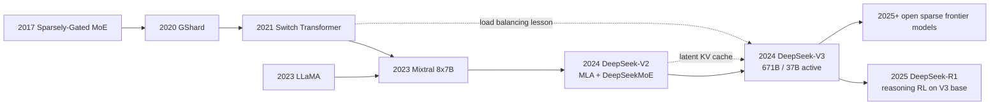

# DeepSeek-V2 / V3 - MLA 与 MoE 如何把开源模型推到前沿

> **2024 年 5 月，DeepSeek-AI 先用 [DeepSeek-V2（arXiv:2405.04434）](https://arxiv.org/abs/2405.04434) 把 236B MoE 做到每 token 只激活 21B；12 月又在 [DeepSeek-V3（arXiv:2412.19437）](https://arxiv.org/abs/2412.19437) 里把规模推到 671B / 37B active。** 这篇笔记的钩子不只是“开源模型又变强了”，而是 DeepSeek 把三个原本分散的问题绑成一套系统答案：MLA 把 KV cache 压进 latent bottleneck，DeepSeekMoE 把容量和 active compute 拆开，FP8 + 通信重叠把 14.8T token 预训练压到 2.788M H800 GPU hours。它让 2024 年的开放模型第一次不只在 license 上开放，也在成本曲线上逼近前沿闭源模型。

## 一句话总结

DeepSeek-AI 团队在 2024 年连续发布 DeepSeek-V2 与 DeepSeek-V3，核心不是“把模型做大”，而是把开放 LLM 的三个成本瓶颈同时改写：V2 用 Multi-head Latent Attention 把传统 MHA/GQA 的 KV cache 存储从显式 key/value 头压成 latent 向量，直观形式可写成 $c_t^{KV}=x_tW^{DKV},\;k_{t,h}=c_t^{KV}W_h^{UK},\;v_{t,h}=c_t^{KV}W_h^{UV}$；同时用 DeepSeekMoE 的细粒度 experts + shared experts，让 236B 总参数每 token 只激活 21B。V3 沿着这条路线扩到 671B 总参数、37B active、128K context 和 14.8T tokens，再加入 auxiliary-loss-free load balancing、multi-token prediction 与 FP8 混合精度训练，完整训练只报告 2.788M H800 GPU hours。

它替代的失败 baseline 是 2023 年开放模型的默认想象：要么像 LLaMA / Llama 3 那样继续扩大 dense decoder，付完整 active compute；要么像 Mixtral 那样证明 MoE 可开源，但还没解决 KV cache、极大规模训练稳定性和跨节点通信。DeepSeek-V3 后来直接成为 DeepSeek-R1 的 base，说明它的历史作用不是单个榜单分数，而是给开放推理、低成本 API、MoE serving 和国产 H800 约束下的 frontier-adjacent 训练提供了一套可复制的系统坐标。隐藏 lesson 是：2024 年后的“开源前沿模型”不再只是权重发布，而是 attention memory、稀疏路由、数值精度、通信拓扑和后训练共同决定的工程曲线。

---

## 历史背景

### 2024 年春天：开放模型的账开始算不过来

DeepSeek-V2 出现时，开放 LLM 已经经历了 2023 年的第一轮爆发。LLaMA 让研究者第一次大规模拿到足够强的基础模型，Mixtral 证明 sparse MoE 可以用开放权重形式挑战 70B dense baseline，vLLM 把 KV cache 管理变成真实服务吞吐问题。但这些进展拼在一起后，反而暴露出一个新矛盾：开放模型不缺“能跑”的权重，缺的是一条能同时控制训练成本、推理显存、长上下文和服务吞吐的路线。

Dense decoder 的成本结构很诚实，也很残酷。参数越多，每个 token 激活的矩阵乘法越多；上下文越长，KV cache 越大；如果要把模型服务成 API，权重副本、KV cache、batching、延迟和显存碎片会一起把成本推高。Llama 2 70B 和后来的 Llama 3 405B 都证明 dense scaling 依然强，但也让开源社区看清一件事：如果每一次质量提升都要求完整 active compute，开放模型很快会变成少数机构才能部署的基础设施。

MoE 给了另一条线索。Mixtral 8x7B 已经把 total parameters 与 active parameters 分开，但它的规模还在“可解释给社区”的区间：47B total、13B active、8 个 experts、top-2 routing。DeepSeek 要回答的是更工业的问题：如果把 MoE 推到 200B、600B 级别，attention KV cache、专家路由、通信重叠、精度格式和训练稳定性是否还能一起成立？V2 与 V3 的历史位置正是在这里。

### DeepSeek 的位置：从 67B dense 到 V2/V3 MoE

DeepSeek-AI 在 2024 年初已经有 DeepSeek LLM 7B/67B 等 dense 模型，路线相对传统：高质量数据、decoder-only Transformer、开源权重、面向中英和代码能力优化。V2 不是在这个 dense 模型上简单加参数，而是一次明确转向：236B total parameters、21B active parameters、128K context、8.1T tokens，并在摘要里直接把经济性作为论文标题的一部分。

这一转向背后有两个直接动机。第一，长上下文和高吞吐推理把 KV cache 从“实现细节”推成主要成本项。GQA 已经比 MHA 省，但对于 128K context 和大批量服务仍然不够。第二，MoE 如果只省 FFN FLOPs，却因为路由不稳、专家负载不均或跨节点通信拖垮训练，就不能成为真正的 frontier 路线。DeepSeek 的答案是把 attention、MoE 和系统训练一起设计：MLA 负责 memory，DeepSeekMoE 负责 capacity，训练框架负责把稀疏专家真正跑起来。

V3 则像一次压力测试。它不是把 V2 的数字放大一点，而是把整个系统推到 671B total、37B active、14.8T tokens、128K context，并公开强调两件工程事实：完整训练只需要 2.788M H800 GPU hours，且没有不可恢复的 loss spike 或 rollback。对 2024 年底的开放模型来说，这比单个 benchmark 更刺眼，因为它把“能力”和“可负担训练”放进同一张表。

### 与 Llama 3 和 Mixtral 的错位竞争

DeepSeek-V3 与 Llama 3 的对比非常有代表性。Meta 选择 dense Transformer，是为了在 15.6T tokens、405B 参数、128K context 和开放权重发布之间降低架构复杂度；DeepSeek 选择 MoE，是为了在类似的 token-rich 训练时代继续压低 active compute。两者不是谁“更正确”的简单关系，而是两种工程哲学：Llama 3 把复杂度主要放在数据、后训练和基础设施，DeepSeek-V3 把复杂度前移到 attention memory、专家路由和数值精度。

与 Mixtral 的关系也不是简单继承。Mixtral 让开源社区学会问 total 与 active 的区别；DeepSeek-V2/V3 继续追问：当 experts 数量更多、粒度更细、上下文更长、训练集更大时，MoE 还会不会是好交易？V2 给出的答案是 42.5% training cost saving、93.3% KV-cache reduction 和 5.76x maximum generation throughput；V3 给出的答案是 14.8T token 预训练和 FP8 大规模验证。

这就是 DeepSeek-V2/V3 在思想史上的坐标。它不是“第一个 MoE”，也不是“第一个开源强模型”，而是把开放 MoE 从模型发布推进到完整系统工程的节点。它让后来讨论 Qwen-MoE、DBRX、DeepSeek-R1、SGLang/vLLM 支持时，有了一套共同词汇：MLA、active parameters、shared experts、auxiliary-loss-free balancing、MTP、FP8、communication overlap。

## 研究背景与动机

### 核心问题：怎样同时压低 KV cache、active compute 和训练通信

DeepSeek-V2/V3 的动机可以压成一句话：**在模型质量继续逼近前沿的同时，不让每个 token、每个上下文窗口、每次训练 step 都按 dense frontier 模型付账。** 这句话里有三张账。第一张是 attention memory：长上下文服务时，KV cache 会随着 batch size 和 context length 增长，GQA 只能部分缓解。第二张是 FFN compute：dense 模型每层每 token 都走完整 FFN，参数容量和 active compute 绑定。第三张是分布式训练通信：MoE 一旦跨节点，专家 dispatch、combine、all-to-all 和精度格式都会决定实际效率。

MLA 解决第一张账，DeepSeekMoE 解决第二张账，V3 的 FP8 与通信重叠解决第三张账。论文最值得注意的地方，是这些设计不是互相独立的 trick。MLA 降低 KV cache 后，长上下文和高吞吐服务才更现实；MoE 降低 active FFN compute 后，671B total parameters 才有意义；FP8 和通信重叠让稀疏专家训练不被跨节点通信吃掉收益。V3 的方法论因此更像系统 co-design，而不是单点架构创新。

### 为什么不是只做一个更大的 dense 模型

只做更大的 dense 模型当然也能变强，但会把开放模型带向很窄的使用面。训练时，dense 671B 的每个 step 都要付完整参数计算；推理时，每个 token 都要穿过完整 FFN；服务时，KV cache 又会随着上下文和并发增长。对闭源 API 公司来说，这些成本可以被大规模业务摊薄；对开放模型生态来说，成本曲线决定了模型能否被大学实验室、中小公司、私有部署和本地推理框架真正使用。

DeepSeek 的路线承认一个更现实的目标：开放模型不一定要在每个技术选择上最简单，但必须在成本结构上可服务。MoE 牺牲了实现简单性，换来 active compute 与总容量分离；MLA 牺牲了注意力实现的直观性，换来 KV cache 压缩；FP8 牺牲了 BF16 的保守稳定，换来更低带宽与更高吞吐。V2/V3 的动机不是追求漂亮架构，而是让“671B 级开放模型”不只停留在模型卡上。

---

## 方法详解

DeepSeek-V2/V3 的方法不是一个单独模块，而是一组互相咬合的系统设计。读 V3 时最容易被 671B 这个数字吸走注意力，但真正的技术主线是：attention 层用 MLA 降低长上下文状态成本，FFN 层用 DeepSeekMoE 分离 total capacity 与 active compute，路由层用无辅助损失的负载均衡避免 MoE 正则损伤主任务，训练层用 MTP、FP8 和通信重叠把大规模预训练变成可执行工程。

### 整体框架

V2 可以看作这条路线的原型验证：236B total parameters、21B active parameters、128K context，在 8.1T tokens 上预训练。V3 则是把同一套核心思想推到 frontier-adjacent 规模：671B total parameters、37B active parameters、128K context、14.8T tokens。二者的共同点不是“都很大”，而是每个主要成本项都有对应压缩机制。

| 层次 | DeepSeek-V2 | DeepSeek-V3 | 解决的成本项 |
|---|---:|---:|---|
| 总参数 | 236B | 671B | 知识容量与任务覆盖 |
| 每 token 激活参数 | 21B | 37B | FFN active compute |
| 上下文长度 | 128K | 128K | 长上下文服务能力 |
| 预训练 token | 8.1T | 14.8T | token-rich scaling |

这张表也说明 DeepSeek 的核心取舍：不是把每个数字都压到最低，而是把每类成本压到可服务区间。671B total 仍然很重，部署时仍要面对权重内存；但 37B active 让每 token FFN 计算远低于 dense 671B。128K context 仍然需要认真管理 KV cache；但 MLA 让这个 cache 不再按传统 MHA/GQA 的头数线性膨胀。

### 关键设计 1：MLA 把 KV cache 变成 latent state

Multi-head Latent Attention 的功能很直接：**不要在 KV cache 里保存每个 attention head 的完整 key/value，而是保存一个压缩 latent，再在计算时上投影回各个 head。** 传统 MHA/GQA 的 cache 保存 $k_{t,h}$ 和 $v_{t,h}$；MLA 保存更小的 $c_t^{KV}$，并把 head-specific key/value 视为它的函数。

$$
c_t^{KV}=x_tW^{DKV},\qquad k_{t,h}=c_t^{KV}W_h^{UK},\qquad v_{t,h}=c_t^{KV}W_h^{UV}.
$$

如果把传统 cache 的主成本写成 $O(S\cdot H_{kv}\cdot d_h)$，MLA 的存储更接近 $O(S\cdot d_c)$，其中 $S$ 是序列长度，$H_{kv}$ 是 KV head 数，$d_h$ 是 head dimension，$d_c$ 是 latent dimension。DeepSeek-V2 摘要里的 93.3% KV-cache reduction，正是这个设计在长上下文下的结果。

$$
\text{KV cache}_{\text{MHA/GQA}}\propto S\cdot H_{kv}\cdot d_h,\qquad
\text{KV cache}_{\text{MLA}}\propto S\cdot d_c.
$$

设计动机不是“换一种 attention 名字”，而是服务成本。长上下文模型最痛的状态不是权重，而是每个请求不断增长的 KV cache。MLA 相当于把 KV cache 从显式 per-head 张量变成可重构的 latent memory，这与 vLLM 的 PagedAttention 形成互补：vLLM 管物理布局，MLA 降低每个 token 的状态体积。

### 关键设计 2：DeepSeekMoE 用细粒度专家和共享专家拆开容量

DeepSeekMoE 解决 FFN active compute。普通 dense Transformer 的每个 token 都经过同一套 FFN；MoE 把 FFN 拆成多个 experts，再让 router 只选一部分。DeepSeek 的特别之处在于两点：更细粒度的 routed experts，以及 shared experts。前者让路由选择更灵活，后者给所有 token 保留一个稳定公共通道，避免每个 token 都被迫只依赖稀疏路径。

$$
y = \sum_{e\in \mathcal{S}} E_e(x) + \sum_{e\in \mathrm{TopK}(g(x))} \alpha_e E_e(x),\qquad
\alpha_e = \frac{g_e(x)}{\sum_{j\in \mathrm{TopK}} g_j(x)}.
$$

这个公式的直觉是：shared experts 学常见能力，routed experts 学条件容量。与 Mixtral 的 8 experts top-2 相比，DeepSeekMoE 更强调细粒度 expert specialization。细粒度的好处是可以在相近 active compute 下提供更多组合；代价是路由、负载均衡和通信调度更复杂。

```python
def deepseek_moe_ffn(hidden, router, shared_experts, routed_experts, top_k):
    shared = sum(expert(hidden) for expert in shared_experts)
    scores = router(hidden)                       # token-to-expert scores
    chosen = topk(scores, k=top_k)                # routed experts only
    weights = normalize(scores[chosen])

    routed = 0
    for expert_id, weight in zip(chosen, weights):
        routed = routed + weight * routed_experts[expert_id](hidden)
    return shared + routed
```

设计动机是把“容量”和“每 token 成本”拆开。V3 的 671B total parameters 提供更大的知识和任务容量，但每 token 只激活 37B 参数。换句话说，模型像一个很大的专家库，而不是每一步都打开整座仓库。

### 关键设计 3：无辅助损失负载均衡

MoE 训练常见问题是负载不均：router 可能把过多 token 发给少数 experts，导致这些 experts 拥塞、其他 experts 闲置。传统做法是在训练目标里加 auxiliary load-balancing loss，但这个 loss 会与语言建模目标竞争；模型有时为了均衡而牺牲 token routing 的自然选择。

DeepSeek-V3 的做法是 auxiliary-loss-free load balancing。直觉上，它给专家维护一个动态 bias，路由选择时用 $s_e(x)+b_e$ 影响哪些 experts 被选中，但最终专家输出权重仍主要由原始 affinity score 决定。负载过高的专家降低 bias，负载过低的专家提高 bias，让均衡压力作用在路由选择边界，而不是直接塞进主损失。

| 路由方案 | 均衡机制 | 对主任务的影响 | DeepSeek-V3 的取舍 |
|---|---|---|---|
| 无均衡 | router 自由选择 | 容易专家拥塞 | 不适合大规模 MoE |
| 辅助损失 | loss 里惩罚不均衡 | 可能损伤语言建模 | 作为旧 baseline |
| token dropping | 超容量 token 丢弃或重路由 | 训练信号不稳定 | 大模型上风险高 |
| 动态 bias | 路由边界自调节 | 避免直接污染主损失 | V3 主方案 |

这个设计的隐藏动机是稳定性。V3 报告没有不可恢复 loss spike 或 rollback，不应只归功于一个模块；但无辅助损失路由减少了 MoE 训练中“均衡目标”和“语言目标”相互拉扯的机会，是稳定训练的重要组成部分。

### 关键设计 4：MTP、FP8 与通信重叠把大模型训练变成系统问题

V3 还加入 Multi-Token Prediction。普通 next-token prediction 只预测下一个 token；MTP 让模型同时预测未来多个 token，增加训练信号密度，也为 speculative decoding 提供可复用模块。简化写法是对未来 $D$ 个 offset 的交叉熵取平均：

$$
\mathcal{L}_{\text{MTP}}=\frac{1}{D}\sum_{d=1}^{D}\left[-\log p_\theta(x_{t+d}\mid x_{\le t})\right].
$$

FP8 则是 V3 的系统突破。大模型训练常用 BF16/FP16 保守地换稳定性，但 MoE 跨节点训练同时受计算、内存带宽和网络通信约束。V3 把大量矩阵乘法和通信相关张量放到 FP8 混合精度框架里，再用算法、框架、硬件 co-design 做近乎完整的计算-通信重叠。这样，MoE 节省下来的 active compute 不会被 all-to-all 通信吃掉太多。

| 设计 | 直接目标 | 风险 | 为什么在 V3 中关键 |
|---|---|---|---|
| MTP | 增加未来 token 监督并支持推理加速 | 训练目标更复杂 | 提升 base model 与 speculative decoding 潜力 |
| FP8 training | 降低带宽和显存压力 | 数值稳定性风险 | 让 671B MoE 训练成本可控 |
| 通信重叠 | 隐藏 MoE all-to-all 开销 | 依赖框架和硬件调度 | 保留 sparse compute 收益 |
| H800 优化 | 适配受限硬件环境 | 工程专用性增强 | 让 2.788M GPU hours 有现实意义 |

把这些设计放在一起，DeepSeek-V3 的方法论就很清楚：基础模型时代的架构创新已经不能只写在模型图里。attention memory、routing objective、precision format、parallel training 和 serving framework 必须一起设计，否则任何单点收益都会在另一个系统瓶颈处消失。

---

## 失败案例

DeepSeek-V2/V3 的贡献要从几条“看起来合理”的失败路线里看。2024 年并不缺强模型，也不缺 MoE 论文；真正难的是把长上下文、稀疏专家、训练稳定性、开源权重和可服务成本同时放进一个系统。V2/V3 不是证明某个 baseline 完全无效，而是证明这些 baseline 单独拿出来都少了一块。

### Baseline 1：继续扩大 dense decoder

最自然的 baseline 是沿着 Llama 3 式 dense scaling 继续走。dense decoder 的优点很明确：架构简单、训练行为可预测、服务框架成熟、每个 token 的路径一致。缺点也同样明确：总参数就是 active 参数，参数越大，每 token 推理越贵。对 405B 或更大模型来说，训练和服务成本都会迅速进入少数机构可承担的区间。

DeepSeek 的反驳不是 dense 不强，而是 dense 的成本曲线不适合开放生态的下一步。V3 用 671B total / 37B active 说明：可以让模型有大容量，但不必让每个 token 付完整容量的计算账。这个 baseline 被替代的是成本结构，不是 dense Transformer 的基本有效性。

### Baseline 2：只做普通 top-k MoE

第二条 baseline 是把 FFN 换成普通 top-k MoE，以为 total/active 拆开就够。Mixtral 已经证明这条路能跑通，但当规模放大到 V2/V3，普通 MoE 会遇到更尖锐的问题：专家粒度是否足够细，常见能力是否被稀疏路由切碎，专家负载是否均衡，跨节点 dispatch/combine 是否吞掉收益。

DeepSeekMoE 的 shared experts 和 fine-grained routed experts 正是在修这个问题。shared experts 给所有 token 一条公共能力通道，routed experts 再提供条件容量。这样做比简单 8-expert top-2 更复杂，但更适合 236B/671B 级别的专家池。

### Baseline 3：只靠 GQA 压缩 KV cache

GQA 是 Llama 2、Llama 3 等 dense 模型的重要优化，它通过减少 KV heads 降低 cache 和解码成本。但对于 128K context、高并发服务和 MoE 大模型，GQA 仍然保存显式 key/value 头，cache 会继续随序列长度和 batch size 增长。长上下文真正商业化时，KV cache 不是小修小补的问题。

MLA 的失败-baseline 意义就在这里。它不满足于“少几个 KV heads”，而是把 cache 存储对象换成 latent state。DeepSeek-V2 摘要中 93.3% KV-cache reduction 和 5.76x maximum generation throughput，说明 attention memory 本身必须被重新设计，而不是只靠已有 GQA 配方延长生命。

### Baseline 4：用辅助损失、BF16 和常规通信硬撑大 MoE

大 MoE 还有一条工程 baseline：保留传统 auxiliary loss 做负载均衡，用 BF16/FP16 保守训练，再让通用分布式框架处理通信。这个路线实现上更稳妥，但很可能把 MoE 的收益交给系统开销。辅助损失会污染语言建模目标，BF16 提高带宽压力，all-to-all 通信会在跨节点专家并行里暴露出来。

V3 的方法把这条 baseline 拆开：无辅助损失负载均衡减少目标冲突，FP8 降低带宽与显存压力，计算-通信重叠尽量隐藏专家并行的通信成本。论文强调没有不可恢复 loss spike 或 rollback，本质上是在回应“这么大的 MoE 会不会训练到一半炸掉”这个疑问。

| 失败路线 | 当时为什么自然 | 卡住的位置 | V2/V3 的处理 |
|---|---|---|---|
| 更大 dense decoder | 简单稳定，评测可解释 | active compute 随总参数线性增长 | 671B total / 37B active MoE |
| 普通 top-k MoE | Mixtral 已经证明可行 | 专家粒度、共享能力、负载均衡不足 | DeepSeekMoE 细粒度 + shared experts |
| 只靠 GQA | Llama 系模型使用成熟 | 128K context 下 KV cache 仍重 | MLA latent KV cache |
| 常规 MoE 训练系统 | 工程路径保守 | 辅助损失、BF16、通信开销吞收益 | bias balancing + FP8 + overlap |

## 实验关键数据

### DeepSeek-V2：先证明经济性

V2 的实验故事不是“某个 benchmark 涨了几分”，而是用一组成本数字证明新架构值得继续扩。与 DeepSeek 67B 相比，V2 的摘要报告训练成本节省 42.5%，KV cache 减少 93.3%，maximum generation throughput 提升到 5.76 倍；同时模型规模是 236B total / 21B active，并保持 128K context。这个组合比单个准确率更重要，因为它说明 MoE 与 MLA 的收益不是互相抵消。

| 指标 | DeepSeek-V2 数字 | 读法 |
|---|---:|---|
| 总参数 | 236B | 模型容量超过 DeepSeek 67B dense |
| 每 token 激活参数 | 21B | 推理计算远低于 total parameters |
| 预训练 token | 8.1T | token-rich 训练而非小样本展示 |
| KV cache reduction | 93.3% | MLA 直接击中长上下文成本 |
| 最大生成吞吐 | 5.76x | 架构收益能转化到 serving |

这组数字让 V2 成为 V3 的必要前置。如果没有 V2 的经济性验证，V3 的 671B MoE 很容易被看作“又一个大模型报告”；有了 V2，V3 更像是把已验证的成本曲线继续外推。

### DeepSeek-V3 Base：开放 MoE 进入强基座区间

V3 Base 的官方表格把它与 DeepSeek-V2.5、Qwen2.5-72B、Llama-3.1-405B 等模型同表比较。最有信号的是它用 37B active parameters 在多项基座评测上接近或超过 dense 405B 与强 72B 模型。例如，MMLU 87.1、MMLU-Pro 64.4、DROP 89.0、HumanEval 65.2、MATH 61.6、C-Eval 90.1。

| Benchmark | Qwen2.5-72B | Llama-3.1-405B | DeepSeek-V3 Base | 读法 |
|---|---:|---:|---:|---|
| MMLU | 85.0 | 84.4 | 87.1 | 37B active 进入 400B dense 区间 |
| MMLU-Pro | 58.3 | 52.8 | 64.4 | 难题聚合更强 |
| DROP | 80.6 | 86.0 | 89.0 | 阅读与数值推理强 |
| HumanEval | 53.0 | 54.9 | 65.2 | 代码能力明显领先 |
| MATH | 54.4 | 49.0 | 61.6 | 数学基础能力突出 |
| C-Eval | 89.2 | 72.5 | 90.1 | 中文知识与考试能力强 |

这里需要小心解读。V3 Base 不是所有任务都压过所有模型，也不是靠 37B active 就等价于 37B dense。它的意义是：在 MoE、MLA、数据和训练系统共同作用下，开放 MoE 可以进入以前主要由更大 dense 模型占据的基座能力区间。

### DeepSeek-V3 Chat：与闭源前沿同表比较

Chat 模型的数字更像产品信号。官方 README 把 DeepSeek-V3 与 Claude 3.5 Sonnet、GPT-4o、OpenAI o1-1217、Llama-3.1-405B 等同表比较。V3 在 DROP 91.6、LiveCodeBench pass@1 37.6、Codeforces percentile 51.6、MATH-500 90.2、Aider-Polyglot 49.6、AlpacaEval 2.0 length-controlled win rate 85.5 等指标上非常强。

| Benchmark | GPT-4o-0513 | Claude 3.5 Sonnet | OpenAI o1-1217 | DeepSeek-V3 | 读法 |
|---|---:|---:|---:|---:|---|
| MMLU | 88.3 | 88.6 | 87.2 | 88.5 | 与闭源通用能力同带宽 |
| DROP | 88.3 | 88.7 | 83.7 | 91.6 | 阅读/推理表格强项 |
| GPQA-Diamond | 65.0 | 51.1 | 49.9 | 59.1 | 接近前沿但未全面压过 o1 |
| LiveCodeBench | 32.8 | 30.1 | 34.2 | 37.6 | 代码竞赛式任务很强 |
| MATH-500 | 78.3 | 73.8 | 74.6 | 90.2 | 数学后训练收益明显 |
| AlpacaEval 2.0 LC | 80.4 | 85.2 | 52.0 | 85.5 | 开放式对话竞争力强 |

这些结果的历史意义，在于它们把“开放模型能不能接近闭源前沿”这个问题从信仰争论变成工程表格。DeepSeek-V3 不是每项都赢，但已经足以让闭源/开源比较从“能力代差”变成“成本、部署权、数据边界和任务偏好”的综合选择。

### 训练成本与稳定性：V3 真正刺眼的数字

V3 论文最有传播力的数字之一是 2.788M H800 GPU hours。官方说明中，预训练 14.8T tokens 约 2.664M H800 GPU hours，后续训练阶段约 0.1M，合计 2.788M。更重要的是，论文强调整个训练过程中没有不可恢复 loss spike，也没有 rollback。对 671B MoE 来说，这等于给出一张稳定性证明。

| 项目 | 数字 | 为什么重要 |
|---|---:|---|
| 预训练 tokens | 14.8T | 与 Llama 3 同属 10T+ token-rich 时代 |
| 预训练成本 | 2.664M H800 GPU hours | 671B MoE 的训练成本被压到可讨论区间 |
| 全流程成本 | 2.788M H800 GPU hours | 包含后续 SFT/RL 等阶段 |
| 训练稳定性 | no rollback | 大 MoE + FP8 可稳定训练的关键信号 |

这个数字不能被误读成“任何团队都能轻松复现 V3”。2.788M H800 GPU hours 仍然巨大，背后还有数据、框架、硬件集群和工程团队。但它改变了参照系：frontier-adjacent 能力不再只能用不可见的闭源预算叙事解释，开放模型也开始公开自己的系统账本。

---

## 思想史脉络

### 前世：MoE 与 attention memory 是两条分开的线

DeepSeek-V2/V3 的思想史有两条前史。第一条是 sparse MoE。Shazeer 2017 年的 sparsely-gated MoE 把“只激活部分专家”带入大规模神经网络；GShard 把 top-2 routing 与自动分片放进巨型翻译模型；Switch Transformer 用 top-1 routing 简化 MoE 扩展，并让负载均衡 loss 成为后来讨论 MoE 时绕不开的设计点。直到 Mixtral，开源社区才真正把 MoE 当作日常可下载模型，而不只是 Google 内部系统论文。

第二条是 attention memory。Transformer 早期讨论的主要是 attention 表达力和并行性，后来长上下文与服务化把 KV cache 推到台前。MHA 保存所有 head 的 key/value，GQA/MQA 减少 KV heads，vLLM 处理物理内存碎片和共享。DeepSeek 的 MLA 则沿着另一个方向动刀：不是只改变 cache 管理方式，而是改变 cache 里到底存什么。

### 今生：DeepSeek 把稀疏容量和 latent cache 接起来

V2 的关键思想，是把这两条线合在一起。如果只做 MoE，模型可能 FFN compute 便宜，但 128K context 下 KV cache 仍旧昂贵；如果只做 MLA，attention memory 省了，但总容量仍然受 dense active compute 限制。DeepSeek-V2 把 MLA 与 DeepSeekMoE 组合，第一次把“长上下文服务成本”和“大容量参数成本”一起压。

V3 继续把这个组合变成训练系统。auxiliary-loss-free load balancing 是对 Switch/GShard 以来 MoE 正则的再思考；FP8 training 是对大模型数值格式的更激进选择；MTP 则把 base model 训练和后续 speculative decoding 连接起来。V3 因此不像单篇 architecture paper，更像一份“MoE frontier system”说明书。



| 思想节点 | 年份 | DeepSeek-V2/V3 继承了什么 | 它改写了什么 |
|---|---:|---|---|
| Sparsely-Gated MoE | 2017 | 条件计算与 learned routing | 从研究层扩到开放 LLM 系统 |
| GShard / Switch | 2020-2021 | top-k routing、专家并行、均衡问题 | V3 尝试摆脱 auxiliary loss 伤主任务 |
| LLaMA | 2023 | 开放权重、token-rich 训练、decoder 生态 | 不再把 dense decoder 当最终形态 |
| Mixtral | 2023 | total/active 参数分离的开源示范 | 推到 236B/671B 与 128K context |
| vLLM / serving 系统 | 2023 | KV cache 是系统瓶颈 | MLA 从模型结构侧压缩 cache |

### 后人误读：不要把 V3 读成“便宜 GPT-4”

第一种误读，是把 DeepSeek-V3 简化成“便宜版 GPT-4”。这会漏掉它真正的价值。V3 的关键不是声称全面超过某个闭源模型，而是公开展示了一个开放 MoE 如何在受限硬件、长上下文、FP8、通信重叠和后训练上组织起来。它的贡献是成本曲线和系统透明度，不只是聊天体验。

第二种误读，是把 37B active 当成 37B 模型。MoE 的 active compute 低，不等于部署只需要 37B 权重。所有 experts 仍然构成 671B total parameters，服务框架必须处理权重内存、expert parallelism、batching 和路由负载。active parameters 解释计算账，total parameters 解释内存账，二者不能混用。

第三种误读，是以为 MLA 只是另一种 GQA。GQA 减少 KV heads，MLA 改变 KV cache 表示；它们都服务于推理内存，但抽象层不同。把 MLA 看成“更激进的 KV cache 表示学习”更准确。

### 留给后人的东西

DeepSeek-V2/V3 留给后人的第一件东西，是开放模型比较的新指标语言。2023 年大家主要问参数量、数据量和 license；V3 之后，讨论一个开放大模型必须继续问 active parameters、KV-cache footprint、precision format、communication overlap、training GPU hours 和 inference framework support。模型不再只是权重文件，而是一条端到端成本曲线。

第二件东西，是给 DeepSeek-R1 留下了足够强也足够经济的 base。R1 的社会影响更大，但 R1 之所以能把 open reasoning 推到 o1 附近，离不开 V3-Base 这个 671B MoE 底座。V3 是“让推理 RL 有地基”的论文；R1 是“在地基上爆炸”的论文。把两者分开读，才能看清 DeepSeek 2024-2025 的连续性。

第三件东西，是证明受限硬件环境也可以逼出系统创新。H800 不是理想化无限算力，DeepSeek 的路线反而因此更强调效率。MLA、MoE、FP8、overlap 这些设计都在回答同一个约束：如果不能靠无限 GPU 粗暴堆，能否用架构和系统共同把成本曲线压下来？这会继续影响后来的开放模型训练。

---

## 当代视角

### 2024 年看：V3 把开放 MoE 从模型技巧变成训练系统

站在 2024 年 12 月看，DeepSeek-V3 最重要的意义是把“开源 MoE 很强”变成“开放 MoE 可以被训练、后训练、服务、对齐并同表比较”。Mixtral 已经打开了 MoE 的社区入口，但 V3 让这个入口通向更接近前沿模型的规模。671B total / 37B active、14.8T tokens、128K context、FP8、MTP、无 rollback，这些数字组合起来传达的是系统成熟度。

这也改变了开放模型的叙事。2023 年大家还常把开源模型理解为闭源模型的低成本替代品；V3 之后，开放模型开始拥有自己的技术路线：不是复制 GPT-4 的 dense 黑箱，而是用 MoE、MLA 和训练系统优化走出不同成本曲线。它让“开放模型能不能进入前沿能力讨论”变成一个具体的工程问题。

### 2025-2026 年看：R1 把 V3 的地基暴露给公众

从 2025 年后看，DeepSeek-R1 抢走了更多公众注意力，但它也反过来证明了 V3 的地基价值。R1 的纯 RL 推理、GRPO、rule-based reward 和蒸馏故事能引爆，是因为它站在一个足够强的 V3-Base 上。没有 V3 的 671B MoE、强数学/代码 base 和可服务推理栈，R1 很难成为同样的社会事件。

这让 V3 的历史位置更像“基础设施论文”。它不像 R1 那样用推理涌现制造戏剧性，也不像 LLaMA 泄露那样改变社区传播方式；它改变的是底层成本结构。未来回看 2024-2025 的 DeepSeek 线，很可能会把 V3 看成“开放前沿推理”的训练底座，把 R1 看成这个底座上的后训练突破。

### 哪些假设后来站不住

第一个站不住的假设是“open frontier 只能靠 dense scaling”。Llama 3 证明 dense 仍然强，DeepSeek-V3 则证明 MoE 可以在开放场景下进入同一讨论空间。dense 与 MoE 后来更像两条可选工程曲线，而不是单一路线胜利。

第二个站不住的假设是“active parameters 就是模型大小”。V3 让社区更认真地区分 compute、memory 和 serving。37B active 解释每 token 计算，671B total 解释权重内存和部署复杂度；低 active compute 不自动意味着低部署门槛。

第三个站不住的假设是“FP8 只适合小心翼翼的推理量化”。V3 把 FP8 训练推到极大规模，并公开强调稳定性。今天看，低精度训练不只是省显存，而是模型、框架、硬件和通信共同设计的结果。

| 当年假设 | 后来发生了什么 | 今天的判断 |
|---|---|---|
| 前沿开放模型应继续 dense scaling | V3/R1 证明 MoE 可以成为前沿基座 | dense 与 MoE 是两条成本曲线 |
| active 参数可当作模型大小 | serving 仍要处理 total parameters | 必须同时报告 active 与 total |
| KV cache 只需系统层优化 | MLA 从架构侧压缩 cache | 模型结构和 serving 系统要配合 |
| BF16 是大训练唯一稳妥选择 | V3 展示 FP8 大规模训练稳定性 | 低精度训练进入系统 co-design |

### 如果今天重写 DeepSeek-V3 这条路线

如果今天重写 V3，第一处会更深入地公开 serving 侧细节。论文已经给了训练效率和模型评测，但社区更想知道不同 batch size、不同上下文长度、不同 expert parallelism 布局下的 P50/P95 延迟、KV cache footprint、吞吐和成本曲线。对 MoE 来说，质量表格之外的系统 benchmark 与模型分数一样重要。

第二处会更系统地公开路由分析。哪些 experts 负责语言、代码、数学、格式、长上下文位置，哪些只是 token 频率和语法模式的结果？DeepSeekMoE 的 shared experts 与 fine-grained routed experts 很有思想史价值，但读者仍然需要更多可解释实验来避免把 experts 拟人化。

第三处会把 V3 与 R1 放进同一篇更完整的训练叙事：base model 的哪些能力最有利于后续 RL 推理？MLA/MoE 对 long CoT serving 有什么特殊收益？V3 今天最值得重写的不是架构公式，而是它如何成为 R1 的地基。

## 局限与展望

### 权重内存仍按 total parameters 付账

V3 的最大工程局限仍然是权重内存。37B active parameters 让每 token 计算账更漂亮，但 671B total parameters 仍然要存、要加载、要切分、要服务。单机部署几乎不现实，多机部署需要 expert parallelism、tensor parallelism、pipeline parallelism、KV cache 管理和高带宽互联共同配合。

这意味着 DeepSeek-V3 不是“普通开发者本地运行的 37B 模型”，而是“以 37B active compute 提供 671B 容量的分布式模型”。这条区别必须写清，否则 MoE 的成本优势很容易被误读。

### 路由与负载仍是长期问题

无辅助损失负载均衡很聪明，但 MoE 路由不是一次性解决的问题。专家负载会随数据分布、语言、prompt 类型、batch 形状和后训练变化；服务端也会看到不同请求触发不同专家路径，造成延迟波动。V3 证明了大规模稳定训练可行，不等于所有部署场景都自动稳定。

未来方向包括更细粒度的在线路由监控、专家热度预测、expert cache、动态容量、serving-aware routing、MoE-specific quantization 和更强的跨节点调度。真正成熟的 MoE 系统要同时优化训练 loss、专家负载和线上延迟分布。

### 评测还难覆盖真实前沿能力

V3 的评测非常强，但基础模型时代的 benchmark 仍然有限。MMLU、MATH、HumanEval、LiveCodeBench、AlpacaEval 能说明很多问题，却不能完整覆盖长任务代理、工具调用、企业 RAG、复杂代码仓库修改、多轮安全边界、事实性与模型校准。更麻烦的是，MoE 的真实性能还受 serving framework 和硬件布局影响。

后续评测应把模型质量、成本和系统行为放在同一张表：单位美元 token、P95 延迟、长上下文有效吞吐、专家负载方差、FP8/BF16 质量差、KV cache footprint、RAG/agent 场景稳定性。V3 打开了公开成本账本，但还没有把所有使用场景的账本都打开。

## 相关工作与启发

### 对研究者的启发

V3 给研究者的第一条启发是：基础模型架构已经进入系统共同设计阶段。单独提出一个更好的 router、一个更好的 attention 变体或一个更低精度格式都不够；它们必须在训练、推理、通信、数据和后训练里闭环验证。DeepSeek-V3 的价值正是在于把 MLA、MoE、routing、FP8、MTP 放进同一个工程叙事。

第二条启发是：开放模型的影响力可以来自成本曲线，而不只是 license。权重开放当然重要，但如果模型训练成本、推理成本和服务栈不公开，外部生态仍然很难学习。V3 公开自己的 H800 GPU hours 和系统设计，让研究者有机会讨论“如何用有限硬件逼近前沿”。

### 对工程系统的启发

对工程系统来说，V3 的教训是不要只看 benchmark。MoE 模型的真实部署要同时设计 expert parallelism、router batching、KV cache、FP8 kernels、all-to-all overlap、fallback 策略和监控。一个模型在表格里很强，不代表它在你的 batch size、你的网络拓扑、你的延迟 SLO 下划算。

这也是为什么 SGLang、vLLM、LMDeploy、TensorRT-LLM、LightLLM 等框架对 DeepSeek-V3 的适配很重要。V3 的影响力不只来自论文，还来自它迫使开源推理框架回答一个新问题：如何把 671B total / 37B active / FP8 / MLA 的模型服务成真实 API？

## 相关资源

| 类型 | 资源 | 链接 | 说明 |
|---|---|---|---|
| 论文 | DeepSeek-V3 Technical Report | https://arxiv.org/abs/2412.19437 | V3 主技术报告 |
| 前序论文 | DeepSeek-V2 | https://arxiv.org/abs/2405.04434 | MLA 与 DeepSeekMoE 的直接验证 |
| 代码/模型 | DeepSeek-V3 GitHub | https://github.com/deepseek-ai/DeepSeek-V3 | 官方权重、推理说明与链接 |
| 相关论文 | DeepSeekMoE | https://arxiv.org/abs/2401.06066 | 细粒度专家与共享专家前序 |
| 后续论文 | DeepSeek-R1 | https://arxiv.org/abs/2501.12948 | V3-Base 上的推理 RL |
| 系统 | vLLM DeepSeek-V3 support | https://github.com/vllm-project/vllm | 开源推理框架适配入口 |
| 系统 | SGLang DeepSeek support | https://github.com/sgl-project/sglang | MLA/FP8/并行推理优化入口 |

如果只记住一个结论：DeepSeek-V2/V3 的历史价值不是“671B 这个数字很大”，而是它把开放大模型的竞争维度从参数量扩展到 KV cache、active compute、专家路由、低精度训练和通信拓扑。开放前沿模型从此不只是权重问题，而是完整系统账本问题。


---

> 🌐 [English version](/en/era5_genai_explosion/2024_deepseek_v3/) · 📚 awesome-papers project · CC-BY-NC