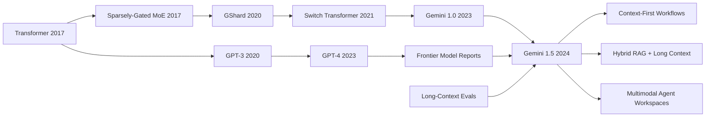

# Gemini 1.5 - 百万 token 上下文的多模态长程理解

> **2024 年 2 月 15 日，Google 把 Gemini 1.5 Pro 的 100 万 token 上下文放进开发者预览；3 月 8 日，Gemini Team 又把 [arXiv:2403.05530](https://arxiv.org/abs/2403.05530) 写成一份长上下文宣言。** 这篇报告最抓人的地方，不是“窗口更大”这句产品口号，而是它让模型一次读进 402 页阿波罗 11 号转录、44 分钟无声电影、10 万行代码、11 小时音频，并在 research setting 里把 needle-in-a-haystack 检索推到 1000 万 token 仍接近满分。Gemini 1.5 逼大家重新问一个问题：当上下文窗口从几页纸变成一座资料馆，模型到底是在“记住更多”，还是开始拥有一种新的工作方式？

## 一句话总结

Gemini Team Google 在 2024 年发布的 Gemini 1.5 报告，把 GPT-4 之后的 frontier model 竞争从“单轮 benchmark 更高”推进到“整个资料库能不能直接塞进上下文”：Gemini 1.5 Pro 用稀疏 Mixture-of-Experts 路线把每个 token 的有效计算写成近似 $C_\text{active}=\sum_{e\in\mathrm{TopK}(r(x))} C_e$，再把文本、代码、视频和音频统一放进百万级上下文里做检索与推理。它替代的失败 baseline 不是某个排行榜第二名，而是 GPT-4 Turbo 128k、Claude 3.0 200k 时代对“长文档只能靠 RAG 切片”的默认想象：Gemini 1.5 Pro 标准窗口为 128k，私有预览到 1M，research setting 测到 10M，并在长上下文 retrieval 上报告超过 99% 的 near-perfect recall；它还能用 Kalamang 语法书做 many-shot in-context learning，达到接近同样学习材料的人类水平。反直觉 lesson 是，大窗口没有消灭检索、摘要和记忆系统，反而让这些系统必须重新分工；Gemini 1.5 的历史地位在于，它把长上下文从“prompt 工程技巧”升级成了 Sora 式闭源技术报告之外另一个 2024 年核心方向：模型不只回答问题，还要把整段工作现场带进一次推理循环。

---

## 历史背景

### 2024 年之前长上下文的尴尬

Gemini 1.5 出现前，长上下文一直是大模型领域里最容易被高估、也最容易被低估的能力。被高估，是因为很多发布稿把 context window 写成一个线性越大越好的数字，好像 32k、128k、200k 只是内存条升级；被低估，是因为真正能稳定读长材料、在中间位置找证据、跨文档对照、再把证据用于推理的系统非常少。用户在产品里早已暴露了需求：想让模型读完整代码仓、长会议纪要、法律卷宗、研究论文包、视频字幕和音频转录，而不是不断复制几段摘要再祈祷模型不丢线索。

2023 年之前，主流解决方案大多绕开“直接放进上下文”这个问题。RAG 把文档切块、向量化、召回，再把少量片段塞回 prompt；summary memory 把对话滚动压缩；agent 框架把中间结果写到外部文件或数据库。这些方法很实用，但也带来信息瓶颈：切块可能把跨段线索拆散，召回模型可能漏掉关键证据，摘要会提前决定什么重要，外部记忆又需要额外的索引与一致性维护。长上下文模型真正诱人的地方，是它似乎可以把一部分检索和压缩提前移回模型内部：先把全量材料摆在桌面上，再让模型自己找关联。

但早期长上下文也有尴尬。很多模型可以“接受”很长输入，却不一定“使用”很长输入。Needle-in-a-haystack 这类测试很快流行起来，正是因为用户发现模型经常对开头和结尾敏感，对中间位置迟钝；上下文变长后，注意力成本、位置外推、训练数据长度分布、推理延迟和价格都会一起冒出来。Gemini 1.5 的历史切入点就在这里：它不是第一个宣称长窗口的模型，却是第一个把百万级上下文、多模态输入、MoE 效率和一组长上下文评测同时放到 frontier model 报告中心的系统之一。

### Gemini 从 1.0 到 1.5

Google 在 2023 年底发布 Gemini 1.0 时，主叙事是“原生多模态”：文本、图像、音频、视频和代码不再只是语言模型外挂工具，而是同一个模型家族要覆盖的输入世界。Gemini 1.0 Ultra 被定位为 Google 当时最强模型，Gemini 1.0 Pro 面向更广泛产品使用，Gemini Nano 则服务端侧场景。这让 Gemini 与 GPT-4 的竞争不只是语言 benchmark，而是 Google 是否能把搜索、YouTube、Android、Workspace、Cloud 和 DeepMind 的基础研究统一到一个模型栈里。

Gemini 1.5 的发布语境很微妙。2024 年 2 月 15 日，Gemini 1.0 Ultra 刚进入 Gemini Advanced 和开发者 API 不久，Google 就宣布下一代 Gemini 1.5 Pro。它被描述为中等规模的多模态模型，却能在很多维度达到接近 1.0 Ultra 的质量，同时更高效地训练和服务。这里的关键词不是“更大”，而是“更有效”。Google 明确把 Mixture-of-Experts 写进公开叙事：不是每个输入 token 都激活整个网络，而是由路由机制选择相关专家路径，让计算更多花在被需要的子网络上。

随后 arXiv 报告把故事扩展成模型家族。早期外界关注的是 Gemini 1.5 Pro 的百万 token preview；后续修订还把 Gemini 1.5 Flash 纳入同一报告，强调轻量版本在效率和质量之间的折中。这一点很重要，因为它说明 Gemini 1.5 不是单个炫技模型，而是一条产品化路线：Pro 证明长上下文和强能力，Flash 证明长上下文能力也要进入高吞吐、低成本调用场景。百万 token 如果只能偶尔跑 demo，不会改变开发者生态；只有当它变成可定价、可服务、可组合的 API 能力，才会迫使软件架构改变。

### 为什么“百万上下文”不是普通参数升级

参数量升级通常改变模型内部知识和能力上限；上下文升级改变的是模型与外部世界的接口。GPT-3 到 GPT-4 的跃迁让人看到更强的推理、代码和考试能力；Gemini 1.5 的百万上下文让人看到另一种跃迁：用户不必先把世界压成几段 prompt，而可以把更多原始材料直接交给模型。Google 公布的例子非常刻意：402 页 Apollo 11 号任务转录、44 分钟 Buster Keaton 无声电影、超过 100,000 行代码、11 小时音频、70 万词文本。这些都不是传统聊天 prompt，而是工作现场本身。

这个变化会影响软件系统分层。短上下文时代，外部检索负责找材料，prompt 负责承载少量证据，模型负责综合回答。百万上下文时代，边界开始松动：检索可以召回更粗粒度的文档包，模型可以在上下文内部做二次定位，用户可以把代码仓和 issue 一起放进来，视频和音频也能作为原始证据进入问题。它不是让 RAG 消失，而是让 RAG 从“每次只塞几个 chunk”转向“选择哪一批完整材料进入长上下文”。

这也是 Gemini 1.5 报告被列入 awesome-papers 的原因。它不是因为公开了一个可复现的长上下文 recipe；报告同样保留了大量架构和训练细节。它的重要性在于把长上下文从边缘功能升级为 frontier model 的主指标，迫使后来模型报告回答几个新问题：窗口能到多长？中间位置能不能稳定使用？多模态材料能不能混在一起？长上下文会不会只会检索不会推理？成本、延迟、安全和隐私怎么处理？这些问题在 2024 年之后成为模型产品和研究评测的共同语言。

## 研究背景与动机

### 从检索增强到直接放进上下文

Gemini 1.5 的直接动机，可以理解为对 RAG-first 范式的一次压力测试。RAG 很强，但它把“哪些材料重要”这个判断提前交给检索器。对于事实问答和企业知识库，这通常足够；对于长代码修改、法律证据链、电影情节细节、科研综述和多轮策略分析，关键线索可能分散在很多位置，甚至只有在读完整材料后才知道哪段重要。长上下文模型试图把更多判断推迟到模型推理阶段，让模型在全局视野下决定证据权重。

这并不意味着“把所有东西都塞进去”总是最佳策略。百万 token 上下文会带来显著延迟、成本和注意力稀释；用户也不希望模型在无关材料里迷路。Gemini 1.5 的动机更准确地说，是建立一个新的可选层：当任务确实需要全局证据时，模型不再被窗口硬卡住。开发者可以在精细 RAG、粗粒度检索、长上下文阅读和外部工具之间重新组合，而不是被迫把每个任务都切成 4k 或 16k 片段。

### Google 要证明的三件事

第一，Google 要证明长上下文不是牺牲通用能力换来的单点特技。发布材料反复强调 Gemini 1.5 Pro 在一组文本、代码、图像、音频和视频评测上超过 Gemini 1.0 Pro 的大多数开发 benchmark，并且大体接近 1.0 Ultra。这个叙事很关键：如果一个模型只是窗口巨大但短任务退化，开发者只会把它当作专用文件阅读器；Gemini 1.5 要证明长上下文可以嵌入主力助手模型。

第二，Google 要证明百万上下文可以跨模态工作，而不只是长文本。视频、音频、代码、文档在 token 化后都进入同一个问题界面，这延续了 Gemini 1.0 的原生多模态路线。长上下文在多模态上更有震撼力，因为视频和音频天然比文字更占上下文预算；能放进一小时视频或 11 小时音频，意味着模型可以在原始时间序列中寻找证据，而不是只读人类提前做好的 transcript 摘要。

第三，Google 要证明长上下文会产生新的 in-context learning 形态。Kalamang 实验正是为这个目的服务：给模型一本语法书和词汇材料，让它在不更新参数的情况下学习一种低资源语言的翻译规则。这不是普通 NIAH 检索，而是把上下文当成临时教材。它暗示了一个更大的方向：未来模型可能在一次会话里读完项目文档、API 规范、团队约定和历史决策，然后像临时加入团队的成员一样工作。Gemini 1.5 并没有彻底实现这个愿景，但它把这个愿景放到了可评测的桌面上。

---

## 方法详解

Gemini 1.5 的方法详解必须从边界开始。报告公开了几个高层事实：Gemini 1.5 是多模态模型家族，使用 Mixture-of-Experts 路线提高训练和服务效率，能够处理百万级上下文，覆盖文本、代码、图像、音频和视频，并通过长上下文 retrieval、长文档问答、长视频问答、长音频识别、Kalamang 翻译和专业工作流实验展示能力。报告没有公开足以复现模型的完整架构、参数量、专家数量、路由损失、训练数据配比、位置编码细节、推理优化和安全栈。因此，本节不是复刻 Google 内部 recipe，而是把公开事实组织成可解释的系统图。

### 公开事实与不可公开部分

Gemini 1.5 的技术文本延续了 GPT-4 之后的 frontier model report 体裁：它告诉读者系统能做什么、怎么评估、为什么重要，但不会给出完整训练手册。我们能确认 MoE、长上下文、多模态、效率和安全评测；我们不能假装知道 expert 数、routing 策略、context extension 的具体训练阶段或缓存工程。这种边界很重要，因为长上下文模型最容易被过度神话：只要报告说 1M 或 10M token，读者就会下意识把它想成“无限记忆”。实际上，百万上下文需要位置泛化、数据课程、注意力工程、KV cache 管理、延迟控制和评测协议共同支撑。

| 层级 | 公开事实 | 可合理解释 | 不应假装知道 |
|---|---|---|---|
| 架构 | Gemini 1.5 使用 MoE，提高训练和服务效率 | 稀疏激活让总参数规模与单 token 计算解耦 | 专家数量、Top-k 路由、负载均衡损失 |
| 上下文 | 标准 128k，预览 1M，研究测试到 10M | 位置表示、训练长度课程和推理工程共同作用 | 具体 RoPE/attention 变体、缓存压缩策略 |
| 多模态 | 文本、代码、视频、音频、图像进入同一模型家族 | 模态 token 化后在统一上下文中被条件化 | 每个模态 tokenizer / encoder 细节 |
| 评测 | NIAH、长文档 QA、长视频 QA、ASR、Kalamang | 从检索到推理再到临时学习的评测阶梯 | 内部 prompt、采样和失败样本全集 |
| 产品 | AI Studio / Vertex AI preview，Flash 走效率路线 | 长上下文必须被服务化才有生态影响 | 完整定价、调度、隐私和安全实现 |

### 整体框架：稀疏 MoE + 原生多模态 + 长上下文

把公开信息压缩成系统框架，可以把 Gemini 1.5 看成三条线的交汇。第一条线是稀疏专家计算：模型拥有多个 expert 子网络，但每个 token 只激活其中一小部分，从而在总容量和单步计算之间做条件化折中。第二条线是原生多模态：文本、代码、视频、音频和图像被转成模型可处理的 token 或 embedding，在同一上下文窗口中作为证据。第三条线是长上下文训练与推理：模型不仅能装下长输入，还要在长输入中稳定定位、比较和综合。

可以用一个抽象目标描述这种系统行为。给定混合模态输入 $X=(x_1,\ldots,x_n)$，模型通过路由函数 $r$ 为每个 token 选择专家集合，再在长上下文条件下预测输出：

$$
p_\theta(y_t\mid y_{<t}, X)=\mathrm{LM}\left(y_{<t}, \sum_{e\in \mathrm{TopK}(r(x_i))} g_e(x_i), \mathrm{pos}(i)\right).
$$

这里的公式不是 Google 的内部实现，而是概念化表达：长上下文能力不是单一参数，而是由专家路由、模态编码、位置表示和语言生成共同形成。Gemini 1.5 的公开贡献在于证明这套组合可以进入真实产品预览，并在百万级上下文上保持可用质量。

| 组件 | 功能 | 对长上下文的贡献 | 主要风险 |
|---|---|---|---|
| MoE 路由 | 每个 token 选择相关专家 | 降低有效计算，支撑更大容量 | 路由不均衡、专家塌缩 |
| 多模态编码 | 把视频、音频、图像变成可用上下文 | 让原始证据进入同一问题 | 模态压缩会丢细节 |
| 位置建模 | 让 token 在百万长度中保持可区分 | 减少中间位置遗忘 | 外推失败、位置偏置 |
| 长上下文评测 | 检查 retrieval 与 reasoning | 防止“能装下但用不上” | benchmark 被单一化 |
| 服务系统 | 控制延迟、成本和安全 | 让能力从 demo 变 API | 价格和隐私压力 |

### 关键设计 1：MoE 把计算预算换成路由问题

Gemini 1.5 的官方叙事明确说它基于 Transformer 和 MoE 研究。MoE 的基本思想并不神秘：传统 dense Transformer 对每个 token 激活同一套前馈网络；MoE 则准备多个专家网络，由路由器根据 token 表示选择少数几个专家。这样，总参数容量可以很大，但每个 token 的活跃计算只覆盖少量专家。

$$
h'_i = \sum_{e\in \mathrm{TopK}(r(h_i))} \alpha_{i,e}\,E_e(h_i), \qquad \sum_e \alpha_{i,e}=1.
$$

这对 Gemini 1.5 的意义在于效率。长上下文会把 token 数放大一个到两个数量级，如果模型仍然在每个 token 上激活全部参数，服务成本会迅速失控。MoE 不会让百万上下文免费，但它提供了一个可扩展方向：把模型容量放在专家集合里，把每个 token 的实际计算控制在有限路径上。Google 在博客中把 Gemini 1.5 Pro 描述为接近 1.0 Ultra 质量但用更少 compute，这正是 MoE 叙事要支撑的结论。

| Dense Transformer | MoE Transformer | 对 Gemini 1.5 的含义 | 代价 |
|---|---|---|---|
| 每个 token 激活全部 FFN | 每个 token 激活少数专家 | 容量和计算部分解耦 | 路由器要学会分配 |
| 训练负载相对均匀 | 专家负载可能倾斜 | 需要负载均衡策略 | 工程复杂度上升 |
| 推理路径简单 | 推理路径依赖路由 | 可以服务多样输入 | batching 更难 |
| 易解释为单模型 | 更像专家集合 | 适合多模态/多任务 | 失败时更难诊断 |

MoE 的反直觉点是，它把“扩大模型”变成了“学会选择”。如果路由器做得不好，专家可能闲置或过载；如果长上下文中大量无关 token 激活错误专家，计算仍会浪费。Gemini 1.5 报告没有公开这些内部细节，所以 deep note 不能把 MoE 写成魔法，只能把它视为百万上下文可服务化的必要工程线索。

### 关键设计 2：百万 token 位置建模和长程检索

长上下文的难点首先不是“内存够不够”，而是“位置还靠不靠谱”。在 1M token 中，模型必须区分证据位于开头、中间还是结尾，必须把远距离线索绑定到同一个问题，还要避免对相邻噪声过拟合。抽象地说，长上下文模型要在长度 $N$ 上保持查询 $q$ 与证据 $x_i$ 的可访问性：

$$
\mathrm{score}(q, x_i)=\mathrm{Attn}(Q(q), K(x_i), \mathrm{pos}(i)), \qquad i\in[1,N].
$$

当 $N$ 从 32k 变成 1M，位置函数、attention 近似、训练长度分布和 KV cache 都可能成为瓶颈。Gemini 1.5 报告没有披露具体位置编码，但它用 NIAH、长文档 QA、长视频 QA 和长音频任务证明模型至少在一组设计好的场景中能稳定使用远距离证据。尤其是 arXiv 摘要提到 up to at least 10M tokens 仍有超过 99% 的 retrieval，这把长上下文评测从“能不能塞进去”推进到“能不能在极长输入中找回来”。

| 长上下文问题 | 短窗口里不明显的原因 | 百万窗口里的表现 | Gemini 1.5 的应对证据 |
|---|---|---|---|
| 中间位置遗忘 | 4k/8k 输入证据少 | 中间 needle 更容易被忽略 | NIAH 覆盖不同位置 |
| 跨段绑定 | 文档少时线索近 | 线索分散在数十万 token | 长文档/代码例子 |
| 多模态长度膨胀 | 文字 token 较省 | 视频/音频快速吃掉预算 | 1 小时视频、11 小时音频 |
| 延迟和成本 | 窗口短时可忽略 | 输入越长响应越慢 | preview 阶段强调优化 |

NIAH 不是完整推理测试。模型可以找到一根针，不代表能理解整个草堆。但在 2024 年，它是必要门槛：如果模型连中间位置的显式事实都找不回，就没有资格讨论长文档综合。Gemini 1.5 的关键，是把这个门槛推到百万甚至千万 token，并把它与多模态任务放在同一报告里。

### 关键设计 3：多模态上下文统一为可推理证据

Gemini 1.5 继承 Gemini 1.0 的原生多模态目标。长上下文让这个目标更具体：一个模型不只是看一张图或听一小段音频，而是把长视频、长音频、代码仓和文档一起作为证据。概念上，可以把不同模态映射到共同上下文序列：

$$
X = [\phi_\text{text}(d), \phi_\text{code}(c), \phi_\text{video}(v), \phi_\text{audio}(a), \phi_\text{image}(m)].
$$

其中每个 $\phi$ 都是模态特定的编码/分词过程，最终交给统一模型做条件生成。报告没有公开这些编码器细节，但示例说明了为什么它重要。给 44 分钟无声电影并用线描物体作为提示，模型需要跨视觉时间线定位场景；给 11 小时音频，模型需要在长时间跨度内保持 ASR 和问答能力；给 100,000 行代码，模型需要跨文件理解调用关系，而不是只读一个函数。

| 模态 | 长上下文带来的新任务 | 旧方法的典型限制 | Gemini 1.5 的历史信号 |
|---|---|---|---|
| 文档 | 多文档对照、长报告问答 | 先摘要再回答会丢证据 | 402 页 transcript 示例 |
| 代码 | 跨文件修改、架构解释 | 只检索局部函数 | 100k+ 行代码示例 |
| 视频 | 长片段情节定位 | 只看短 clip 或 transcript | 44 分钟电影示例 |
| 音频 | 长会议/播客/录音问答 | 先切段 ASR 再拼接 | 11 小时音频能力 |
| 图像 | 与文本/视频共同推理 | 单图 VQA 孤立 | 多模态 prompt 混合 |

这也是 Gemini 1.5 与普通“长文本模型”的区别。长上下文如果只服务文档阅读，影响仍然很大；但当视频、音频和代码都能进入同一上下文，模型开始像一个统一证据处理器。它不只是语言模型窗口变长，而是 multimodal workspace 变大。

### 关键设计 4：长上下文 in-context learning

Kalamang 实验是 Gemini 1.5 报告最有思想味道的部分。给模型一本关于 Kalamang 的语法书和词汇资料，再要求它把英语翻译成这种低资源语言，模型在不更新参数的情况下达到接近使用同样材料学习的人类水平。这个实验不只是展示“能读很长”，而是展示“能把长材料变成临时技能”。

可以把它写成上下文条件下的任务学习：

$$
y = f_\theta(x_\text{query}\mid D_\text{manual}, D_\text{examples}, I_\text{task}),
$$

其中 $D_\text{manual}$ 是语法书，$D_\text{examples}$ 是词汇和例句，$I_\text{task}$ 是翻译指令。模型参数没有变化，变化的是上下文中包含的临时知识。GPT-3 的 few-shot learning 用几个例子教任务格式；Gemini 1.5 的 many-shot / long-context learning 则可能用整本教材教临时领域。

| 学习形态 | 上下文内容 | 参数是否更新 | 典型例子 | 限制 |
|---|---|---|---|---|
| zero-shot | 只有任务指令 | 否 | “翻译这句话” | 依赖预训练知识 |
| few-shot | 少量示例 | 否 | GPT-3 prompt examples | 难覆盖复杂规则 |
| many-shot | 大量示例 | 否 | 长上下文分类/翻译 | 受窗口和检索限制 |
| manual-in-context | 规则书 + 例子 | 否 | Kalamang grammar manual | 理解深度不稳定 |
| fine-tuning | 训练数据 | 是 | 专用翻译模型 | 成本高、更新慢 |

这个设计点的潜在影响很大。如果模型能在一次上下文里学习团队 API、实验协议、法律条款或冷门语言规则，那么“训练模型”和“提示模型”的边界会变得更细。Gemini 1.5 没有证明长上下文学习可以替代 fine-tuning，但它让这种中间层变得可信：不改参数，只改上下文，也能临时获得复杂能力。

### 伪代码：把长上下文作为一级产品能力

下面的伪代码不是 Google 的实现，而是 Gemini 1.5 报告所体现的产品和评测流程。关键差异在于，系统不再默认把输入压缩成少数 chunk，而是根据任务选择长上下文、检索、压缩和工具的组合。

```python
def answer_with_long_context(request, materials, model, retriever, policy):
    budget = policy.context_budget(request)

    if materials.token_count <= budget and policy.requires_global_evidence(request):
        context = materials.pack_preserving_structure()
    else:
        bundles = retriever.retrieve_coarse_bundles(request, materials)
        context = policy.pack_with_summaries_and_sources(bundles, budget)

    response = model.generate(
        prompt=request,
        context=context,
        modalities=materials.modalities,
        safety_policy=policy.safety_rules,
    )

    return response.with_citations_or_offsets(context)
```

| 设计选择 | 短上下文系统 | Gemini 1.5 式系统 | 仍然需要判断的事 |
|---|---|---|---|
| 材料选择 | 检索少量 chunk | 可放入完整文档包 | 哪些材料值得占窗口 |
| 证据定位 | 由 retriever 完成 | retriever + 模型内部定位 | 如何给出可审计引用 |
| 多模态处理 | 常先转文字摘要 | 原始模态可进上下文 | 压缩是否保留关键证据 |
| 交互方式 | 多轮补充材料 | 一轮给大工作区 | 用户如何控制关注范围 |
| 成本控制 | token 少但召回不稳 | token 多但延迟高 | 何时切回 RAG 或工具 |

方法 lesson 可以浓缩成一句：Gemini 1.5 不只是把窗口放大，而是把上下文窗口变成模型产品的一级资源。长上下文、MoE、多模态和服务效率互相牵制；任何一个环节失灵，百万 token 都会退化成昂贵的粘贴板。真正的贡献是把这些环节放到同一份公开报告里，让后来的模型无法再把长上下文当成附录。

---

## 失败案例

Gemini 1.5 的失败案例不是传统 ablation 表里的“去掉模块 A，分数下降 B”。报告没有公开足够细节来做这种对照。更合适的读法是：它让几类 2024 年前看似合理的系统假设变得不够用了。短窗口加 RAG、只看短 benchmark、把长上下文等同于检索、把多模态理解拆成若干外部工具，这些 baseline 并非彻底错误；它们只是无法完整解释 Gemini 1.5 所展示的工作方式。

### Baseline 1：128k / 200k 窗口的实用天花板

GPT-4 Turbo 的 128k 和 Claude 系列的 200k 曾经已经很大。对大多数聊天、代码片段、论文问答和企业文档，十几万 token 足够让用户感到“终于不用切太碎”。但 Gemini 1.5 把竞争标尺直接推到 1M preview，并在研究设置中讨论 10M token。这个跃迁不是简单多装几篇文章，而是让整本书、整段视频、长音频和大型代码材料可以被当作一个输入对象。

这个 baseline 的失败在于，它把“长上下文”理解成短窗口的线性延伸。128k 到 1M 后，任务类型会改变：从“读完一份报告”变成“比较一批报告”，从“理解一个文件”变成“扫过一个代码仓”，从“看一段视频摘要”变成“在完整视频中定位事件”。旧窗口不是没用，而是不再代表 frontier long context 的上限。

### Baseline 2：RAG 拼接无法替代端到端上下文

RAG 是长文档问答的主力 baseline。它把文档切成 chunk，用 embedding 或关键词召回相关片段，再让模型回答。这条路线在事实问答里很有效，但它天然依赖召回器先猜中“相关”。当问题需要跨章节对比、在视频时间线上找细节、理解代码库里相距很远的调用关系，或者从一本语法书中归纳语言规则时，相关性可能不是局部 chunk 能独立判断的。

Gemini 1.5 并没有证明 RAG 过时。它证明的是，RAG 不应该是唯一入口。百万上下文允许系统把更多原始材料交给模型，让模型在上下文内部做第二阶段定位和综合。失败的不是检索本身，而是“只要检索 top-k chunk 就足够”的默认想象。后来的现实路线也更像混合系统：先用检索筛选材料范围，再用长上下文承载更完整的证据包。

### Baseline 3：只看短 benchmark 的模型报告

短 benchmark 对模型开发仍然重要：MMLU、GSM8K、HumanEval、MATH 和多模态 VQA 能快速给出能力轮廓。但它们无法检查模型是否能使用 50 万 token 处的证据，无法判断模型在 44 分钟视频中是否找得到一个短暂场景，也无法说明模型能不能读一本语法书后临时学会翻译规则。Gemini 1.5 把这些长上下文任务放进报告中心，等于宣告旧 benchmark 组合不完整。

这个 baseline 的失败影响很深。2024 年之后，模型报告如果只给短任务分数，会让读者怀疑它是否缺少长程能力；如果只给 NIAH，又会让读者怀疑它是否只会机械检索。因此长上下文评测开始分层：显式 retrieval、跨段 reasoning、长输入鲁棒性、多模态时间定位、many-shot learning、真实工作流效率。Gemini 1.5 不一定把每层都评测完美，但它迫使评测议程扩展。

### Baseline 4：长上下文 = 记忆扩容的误读

最常见的误读是把百万上下文当成“模型记忆变大”。上下文不是参数记忆，它是临时工作台。输入窗口越大，模型越能引用当前材料，但这不意味着它永久学会了材料，也不意味着它能自动忽略噪声、自动验证来源或自动形成正确计划。Kalamang 实验尤其容易被误读：模型能从一本语法书里临时学会部分翻译规则，并不等于它像语言学家一样掌握了语言。

这个 baseline 失败的地方在于，它低估了上下文作为工作台的价值，也高估了上下文作为长期记忆的稳定性。真正有用的系统会把长上下文与检索、引用、摘要、缓存、用户控制和外部工具结合起来。Gemini 1.5 的 long context 是新的能力层，不是把所有记忆系统一键删除的魔法。

| 失败 baseline | Gemini 1.5 如何击穿 | 关键证据 | 后续影响 |
|---|---|---|---|
| 128k/200k 已足够 | 把产品预览推到 1M，研究测试到 10M | 1M preview、10M retrieval stress test | 模型竞争开始宣传百万级窗口 |
| RAG top-k chunk 足够 | 完整材料可进入上下文内部再定位 | 文档、视频、代码、音频示例 | 混合 RAG + long context 成为主流 |
| 短 benchmark 足够 | 长上下文任务成为报告中心 | NIAH、长文档/视频/ASR、Kalamang | 长程评测成为独立类别 |
| 大窗口等于永久记忆 | 上下文只是临时工作台 | Kalamang 不更新参数 | 需要引用、缓存和外部记忆系统 |

## 实验关键数据

### 长上下文检索：NIAH 从演示变成压力测试

Gemini 1.5 报告最直接的数字，是长上下文 retrieval。Google 在发布材料中说，Gemini 1.5 Pro 在 1M token 的 NIAH 测试中 99% 时间找到了嵌入文本；arXiv 摘要进一步把 near-perfect retrieval 写到 up to at least 10M tokens，并给出超过 99% 的表述。这个数字之所以有传播力，是因为它抓住了长上下文最基本的恐惧：模型会不会把中间材料完全忘掉。

| 评测/场景 | 报告中的公开数字 | 读法 | 注意事项 |
|---|---:|---|---|
| 标准上下文 | 128k tokens | 面向普通可用性的默认窗口 | 不等于所有用户都用 1M |
| 私有预览 | 1M tokens | 2024 年初最醒目的产品能力 | 早期延迟和成本较高 |
| 研究测试 | up to 10M tokens | 展示位置和 retrieval 外推 | 不是常规公开服务保证 |
| NIAH recall | >99% / 约 99% | 长输入中显式事实可找回 | 不等于复杂推理满分 |
| 输入样例 | 700k+ words | 长文本可整批输入 | 仍需结构化 prompt |

NIAH 的局限必须同时写清楚。它测的是显式针的位置检索，不是全局理解。一个模型可能找到“某句被埋在哪里”，却无法判断两份长报告的因果矛盾，也可能在答案中引用错误上下文。Gemini 1.5 的成绩是必要条件，不是充分条件。它告诉我们模型可以在极长上下文中保留定位能力，但后续任务还需要问：找到了之后，能不能用对？

### 多模态长上下文：视频、音频、代码放进同一个问题

Gemini 1.5 的实验数据最有辨识度的地方，是长上下文不只服务文本。Google 给出的例子包括 1 小时视频、11 小时音频、30,000 行以上代码、100,000 行代码演示、402 页 Apollo 11 转录和 44 分钟无声电影。这些例子不是统一 benchmark 数字，却非常重要：它们定义了开发者会拿长上下文做什么。

| 材料类型 | 公开示例 | 要求模型做什么 | 为什么不是普通短 prompt |
|---|---|---|---|
| 文档 | 402 页 Apollo 11 任务转录 | 跨页定位事件和细节 | 证据分散在长材料中 |
| 视频 | 44 分钟 Buster Keaton 无声电影 | 根据线描参考定位场景 | 需要视觉时间线理解 |
| 代码 | 100,000+ 行代码 | 解释、修改和跨文件推理 | 调用关系跨越大量文件 |
| 音频 | 11 小时 audio | 长程 ASR 和问答 | 时间跨度远超短 clip |
| 文本 | 700,000+ words | 大规模阅读与综合 | 摘要会提前丢失证据 |

这些例子也暴露了评价难题。演示可以说明“能做到”，但不能说明平均成功率、失败模式、成本和安全边界。对于真正的产品用户来说，模型是否能在 100k 行代码里稳定给出正确 patch，是否能在 11 小时音频里准确引用时间戳，是否能在长视频里区分相似场景，仍需要更系统的评测。Gemini 1.5 的贡献，是把这些问题从 demo 变成了大家会追问的 benchmark 方向。

### 能力保持：接近或超过 Gemini 1.0 Ultra

Google 发布材料强调，Gemini 1.5 Pro 在用于开发 LLM 的综合文本、代码、图像、音频和视频评测中，超过 Gemini 1.0 Pro 的 87% benchmark；与 Gemini 1.0 Ultra 相比，整体表现大体相近。这个数字不如 NIAH 那样戏剧化，但对方法意义更大。它说明长上下文没有被定位为牺牲通用能力的特化模型，而是主力模型能力的一部分。

| 对比对象 | Gemini 1.5 Pro 的公开定位 | 含义 | 仍需谨慎之处 |
|---|---|---|---|
| Gemini 1.0 Pro | 超过 87% 开发 benchmark | 新一代 Pro 是全面升级 | benchmark 集合未完全公开 |
| Gemini 1.0 Ultra | 大体相近质量 | 中等规模/高效模型接近上代旗舰 | “相近”不是每项都胜出 |
| GPT-4 Turbo / Claude 3.0 | 上下文窗口更长 | 竞争焦点转向长上下文 | 横向 benchmark 协议不同 |
| Gemini 1.5 Flash | 更轻量效率版本 | 能力家族向低成本扩展 | Flash 与 Pro 权衡不同 |

这组结果也解释了 MoE 为什么被放在公开叙事中。长上下文会消耗大量 token 预算，如果模型短任务质量下降或服务成本过高，开发者不会愿意长期使用。Gemini 1.5 的工业目标是同时保留能力、扩展上下文、控制成本。报告没有公布所有工程细节，但它把这个三角关系讲得非常清楚。

### Kalamang：从一本语法书学会低资源翻译

Kalamang 实验是 Gemini 1.5 报告里最能说明“长上下文不只是检索”的部分。Kalamang 是一种使用者少于 200 的语言；模型被给定语法手册和相关材料，然后执行从英语到 Kalamang 的翻译。报告摘要说，模型达到与使用相同材料学习的人类相近的水平。这个实验之所以重要，是因为它让上下文承担了临时训练集的功能。

| 实验元素 | 具体设置 | 它测什么 | 为什么重要 |
|---|---|---|---|
| 低资源语言 | Kalamang，少于 200 位使用者 | 预训练知识很有限 | 排除“模型早就背过”的解释 |
| 输入材料 | 语法手册和词汇/例句 | 能否从长材料抽规则 | 不是简单找一句答案 |
| 学习方式 | 不更新参数 | in-context learning | 与 fine-tuning 区分开 |
| 输出任务 | 英语到 Kalamang 翻译 | 规则应用和泛化 | 检索 + 推理 +生成共同参与 |
| 对照 | 人类使用同样材料学习 | 给出可理解参照 | 仍需看评分协议细节 |

这个结果不能被浪漫化成“模型读完一本书就掌握一门语言”。低资源翻译很难，评分也复杂；上下文学习可能对材料格式、提示方式和测试分布非常敏感。但它提出了一个有力问题：如果模型可以在一次上下文中临时获得领域规则，那么未来很多任务也许不需要立刻 fine-tune，而是把规范、示例和约束放进长上下文，让模型在工作时学习。这个问题，就是 Gemini 1.5 留给后续研究最有生命力的部分。

---

## 思想史脉络

Gemini 1.5 位于两条思想线的交叉处。一条线来自 Transformer、稀疏专家和 Google 长期的条件计算研究：模型越来越大，但每个 token 的计算不能无限增长。另一条线来自 GPT-3、GPT-4、Claude 和 RAG 系统：模型越来越会把上下文当成临时程序、数据库和工作记忆。Gemini 1.5 的特别之处，是把这两条线接到同一个公开故事里：用更高效的模型家族承载更大的多模态工作区。

### 前世：稀疏专家和长上下文的两条线

MoE 线索可以追到 2017 年的 Sparsely-Gated Mixture-of-Experts。它提出了一个后来反复出现的工程梦想：参数容量可以很大，但每次计算只激活一部分。Google 后续的 GShard、Switch Transformer 等工作把这个梦想带到更大规模的序列建模中。Gemini 1.5 在公开叙事中继承的正是这条线：不是把所有问题都交给 dense scaling，而是用 routing 和专家路径换取效率。

长上下文线索则从另一边逼近。Transformer 自注意力本来就允许任意 token 互看，但实际模型长期受训练长度、注意力成本和产品延迟限制。GPT-3 展示了 in-context learning，却在窗口长度上很短；GPT-4 把多模态和能力报告变成行业模板，但公开版本仍没有百万上下文；Claude 系列把 100k/200k 长窗口推向产品；RAG 生态则证明，用户真正想要的是让模型使用外部材料。Gemini 1.5 把这些需求合并成一个更激进的提案：直接把资料馆搬进上下文。

### 今生：百万上下文改变模型使用方式

Gemini 1.5 报告最有思想史意义的地方，不是一个单独数字，而是“上下文成为工作区”这个转向。短上下文时代，prompt 更像给模型的一张便签；百万上下文时代，prompt 可以变成一份卷宗、一个代码仓、一段完整视频、一套课程材料。模型的角色也从“根据少量提示补全答案”变成“在临时工作区里阅读、定位、归纳和行动”。

这会改变应用架构。过去的应用把模型放在检索器之后：检索器找材料，模型读材料。Gemini 1.5 之后，模型可以放在更靠前的位置参与材料选择和内部定位。过去的 agent 需要频繁写外部 memory；长上下文让一部分中间状态可以直接保留在同一会话。过去的多模态模型常常处理短 clip 或单图；Gemini 1.5 把视频和音频放进长上下文，让 multimodal reasoning 有了更长的时间轴。

### 引用图：从 Transformer 到 context-first 工作流



这张图里最重要的节点不是 Gemini 1.5 自己，而是它之后的三条分叉。Context-first workflows 表示开发者开始把完整材料放进一次模型调用，而不是只把答案所需片段切出来。Hybrid RAG + Long Context 表示检索没有消失，而是从精确 chunk selection 转向粗粒度材料组织。Multimodal Agent Workspaces 表示模型不只读文本，还读视频、音频、代码和图像构成的工作场景。

### 误读：大窗口不是自动推理

Gemini 1.5 最常见的误读，是把大窗口等同于强推理。事实上，检索、压缩、比较、计划和验证是不同能力。NIAH 成绩高，说明模型能在长输入中找显式证据；Kalamang 成绩好，说明模型能从材料中抽取一部分规则；但这些都不保证模型在复杂任务中自动形成正确因果图。长上下文甚至可能让模型更容易被噪声、冲突材料和恶意 prompt 污染。

另一个误读，是以为长上下文会消灭所有外部 memory。实际情况更像相反：窗口越大，越需要材料管理。用户要决定哪些材料进入窗口，系统要标注来源和时间，模型要能引用位置，敏感数据要被隔离，重复调用要缓存。百万上下文本身不是知识库，它是一个昂贵而强大的临时工作台。好的应用会让这个工作台和长期存储、检索器、工具执行器协同，而不是把所有资料无脑塞进去。

### 影响：从 RAG-first 到 context-first 的混合路线

Gemini 1.5 之后，长上下文成了模型发布的硬指标之一。Claude、GPT、Gemini、Llama、Qwen、Mistral 和 DeepSeek 系列都以不同方式扩展窗口、改进位置外推或提供长上下文版本。与此同时，开发者并没有放弃 RAG。相反，RAG 被重新解释为 long-context packing 的前置步骤：先确定项目、时间段、文档集合或代码模块，再把更完整的材料放进模型。

这个影响也延伸到评测。旧的长上下文测试喜欢藏一根针；新的测试开始关注多针、多跳、矛盾证据、时间顺序、长视频事件定位、长代码修改和真实工作流节省时间。Gemini 1.5 报告不是这些评测的终点，但它让“长上下文是否真的被使用”变成每个 frontier model 都必须回答的问题。它的思想史位置，正是在这里：把上下文窗口从工程参数变成了研究对象和产品战略。

---

## 当代视角

### 2026 年回看：它留下了什么

从 2026 年回看 Gemini 1.5，最持久的遗产不是“1M token”这个数字本身，而是它让长上下文成为模型产品的默认竞争维度。今天用户会自然地问：这个模型能读多长？能不能读完整代码仓？能不能保持中间证据？能不能在视频、音频和文档之间交叉引用？这些问题在 Gemini 1.5 之前不是没有人问，但它们还没有被系统地放在主流 frontier model 报告中心。

它还改变了开发者对 RAG 的想象。早期 RAG 像是短窗口模型的拐杖；Gemini 1.5 之后，RAG 更像长上下文系统的材料编排层。检索器不只是找答案片段，而是决定哪些文件、章节、时间段、视频片段或代码模块值得占用昂贵窗口。模型在窗口内部继续做定位和综合。这种分工让“长上下文 vs RAG”的二选一争论变得过时，真正的问题变成“如何把长期存储、检索、上下文和工具组织成可审计工作流”。

Gemini 1.5 也让 many-shot in-context learning 重新变得有趣。GPT-3 时代的 few-shot learning 让人惊讶，后来 RLHF 和工具使用吸走了很多注意力；Kalamang 实验提醒大家，当窗口足够大，prompt 不只是几个例子，而可以是一整套教材、规范或任务说明。今天很多 agent 和 coding workflow 都在沿着这个方向走：把 repository conventions、API docs、design notes、test logs 和用户偏好放进一个长工作区，让模型临时变成“懂这个项目”的助手。

### 今天仍站得住的判断

第一，长上下文是基础模型能力，而不只是产品包装。模型如果不能稳定使用中间证据，大窗口就没有意义；但一旦能稳定使用，它会改变任务边界。Gemini 1.5 把这一点讲得非常清楚：context window 是用户与模型之间的带宽。

第二，多模态长上下文会比纯文本更重要。视频、音频和代码天然比普通文本更占预算，也更难提前摘要。一个能处理一小时视频和长代码库的模型，会打开教育、法律、医学、影视、软件工程和科学研究中的新工作流。Gemini 1.5 把这些方向放进同一报告，说明 Google 理解上下文不只是文字长度。

第三，效率架构会和上下文长度绑在一起。百万 token 意味着服务成本和延迟压力巨大；MoE、缓存、批处理、压缩和模型分层都不是附属优化，而是长上下文能否普及的核心条件。Gemini 1.5 Pro 与 Flash 的家族叙事，正好预示了后来模型产品常见的 Pro / Flash / Mini / Lite 分层。

### 今天站不住的假设

第一，NIAH 高分足以证明长上下文理解。这一假设已经站不住。今天更关心多证据、多跳、矛盾材料、时间顺序、引用精度和最终任务成功率。Gemini 1.5 的 NIAH 成绩仍然重要，但它只是一道门槛，不是终点。

第二，窗口越大就越少需要系统设计。这也站不住。窗口越大，材料选择、隐私边界、引用、缓存和用户控制越复杂。一个 1M token prompt 可能包含敏感合同、代码密钥、未发布论文和用户个人数据；把它们放进模型之前，系统要知道哪些能共享、哪些要脱敏、哪些要留在本地。

第三，长上下文会自然替代 fine-tuning。Kalamang 展示了上下文学习的潜力，但很多专业任务仍需要参数更新、检索索引、工具执行、验证器和人类审查。上下文学习更像一个灵活中间层：比 few-shot prompt 强，比 fine-tuning 快，但不保证稳定到能替代所有训练。

## 局限与展望

### 技术局限

Gemini 1.5 最大的技术局限，是公开报告不足以让外部研究者复现关键能力。MoE 架构、长上下文训练课程、位置编码、模态编码、数据过滤和推理优化都没有完整披露。对于 awesome-papers 来说，这不是道德指责，而是阅读事实：这篇报告更像能力证据包，而不是开放 recipe。

第二个局限是评测还不够覆盖真实长程推理。NIAH、长文档 QA、长视频 QA 和 Kalamang 都有价值，但真实任务往往要求模型在长材料中做计划、修改、验证和反复回看。一个模型能找到某句话，不代表能正确完成跨文件重构；能定位电影场景，不代表能理解角色动机；能读语法书翻译句子，不代表能稳定处理开放文本。

第三个局限是服务成本和交互体验。百万 token 输入会带来延迟、价格、上传时间、权限管理和响应可解释性问题。Google 在发布时也提醒 1M preview 可能更慢，后续需要优化。长上下文能力只有和良好的 UI、引用、增量缓存、进度反馈和安全策略结合，才会成为日常工具。

### 评测局限

Gemini 1.5 报告中的许多结果来自 Google 内部或特定协议，外部读者很难完全复现。87% benchmark 胜率没有给出完整 benchmark 列表；professional time savings 涉及任务设置和参与者差异；Kalamang 对照也需要细看评分标准。对于 frontier model 报告，这种局限很常见，但它提醒我们：越是闭源系统，越要区分公开演示、内部评测和独立第三方验证。

长上下文评测还面临污染和任务设计问题。如果 needle 形式太简单，模型可能学会模板；如果任务太主观，又难以比较模型。未来更有价值的评测，应该要求模型给出可审计引用、处理冲突证据、跨模态对齐时间戳、在长代码库中提交可运行 patch，并在多轮过程中保持材料一致性。

### 如果今天重写

如果 2026 年重新写 Gemini 1.5 报告，我会希望它多给三类内容。第一，是更透明的长上下文失败样本：模型在哪些位置、哪些模态、哪些冲突证据下会失效。第二，是独立可复现的 evaluation harness：不必公开模型权重，也可以公开任务构造、评分脚本和脱敏样例。第三，是系统层指标：1M prompt 的延迟、成本、缓存命中、引用准确率、隐私处理和用户纠错流程。

我也会希望报告更明确地区分“检索成功”和“推理成功”。比如在同一个长文档包里设置多个相互矛盾的证据，要求模型判断哪个证据更新时间更晚；在代码库里要求模型改动多个文件并跑测试；在长视频里要求模型给出时间戳和视觉证据。这样能避免 long context 讨论只停留在“窗口多大”。

## 相关工作与启发

### 直接继承

Gemini 1.5 直接继承 Transformer、Sparsely-Gated MoE、GShard、Switch Transformer、GPT-3 in-context learning、GPT-4 frontier model report、Claude 长上下文产品和 Gemini 1.0 原生多模态路线。它不是某个单点模块的突然发明，而是 Google 把自己多年来在多模态、稀疏计算、TPU 基础设施和产品生态中的积累合并到一个长上下文模型家族里。

它也继承了 RAG 生态暴露的用户需求。企业、研究者和开发者并不满足于模型回答百科问题；他们想让模型读自己的材料、遵守自己的约束、理解自己的项目。Gemini 1.5 把这个需求用最直接的方式推到模型层：既然用户想给模型一整座资料馆，就让模型至少能打开资料馆的大门。

### 给后来论文的启发

对后来的模型论文，Gemini 1.5 的启发是：长上下文必须被系统评测，不应只作为 tokenizer 配置或位置编码技巧出现。报告需要同时回答窗口长度、检索可靠性、推理质量、多模态覆盖、成本和安全。只报“支持 1M token”已经不够；读者会继续问：中间位置如何？跨文档如何？冲突证据如何？引用如何？

对应用研究，Gemini 1.5 的启发是：上下文窗口可以被设计成用户体验，而不是后台参数。好的长上下文产品会显示材料范围、引用来源、模型关注点、上传状态和隐私边界；会允许用户固定某些证据、排除某些材料、要求模型只根据给定 corpus 回答。长上下文越强，产品越不能把 prompt 当成黑箱文本框。

## 相关资源

### 论文与官方材料

- arXiv: [Gemini 1.5: Unlocking multimodal understanding across millions of tokens of context](https://arxiv.org/abs/2403.05530)
- Google announcement: [Our next-generation model: Gemini 1.5](https://blog.google/technology/ai/google-gemini-next-generation-model-february-2024/)
- Gemini 1.0 report: [Gemini: A Family of Highly Capable Multimodal Models](https://arxiv.org/abs/2312.11805)
- MoE lineage: [Outrageously Large Neural Networks: The Sparsely-Gated Mixture-of-Experts Layer](https://arxiv.org/abs/1701.06538)
- Switch Transformer: [Scaling to Trillion Parameter Models with Simple and Efficient Sparsity](https://arxiv.org/abs/2101.03961)

### 推荐阅读路径

读 Gemini 1.5 最好的顺序，是先读 Google 2024 年 2 月发布稿，理解它为什么在产品层强调 1M preview、1 小时视频和 100k 行代码；再读 arXiv 摘要和技术报告，区分 Gemini 1.5 Pro、Flash、长上下文评测和 Kalamang 实验；然后回头读 MoE 与 Switch Transformer，理解效率叙事；最后和 GPT-4、Claude、Llama 3 long-context variants、RAG 系统一起看，思考长上下文到底应该承担哪些任务，哪些任务仍该交给检索、工具和长期记忆。


---

> 🌐 [English version](/en/era5_genai_explosion/2024_gemini15/) · 📚 awesome-papers project · CC-BY-NC