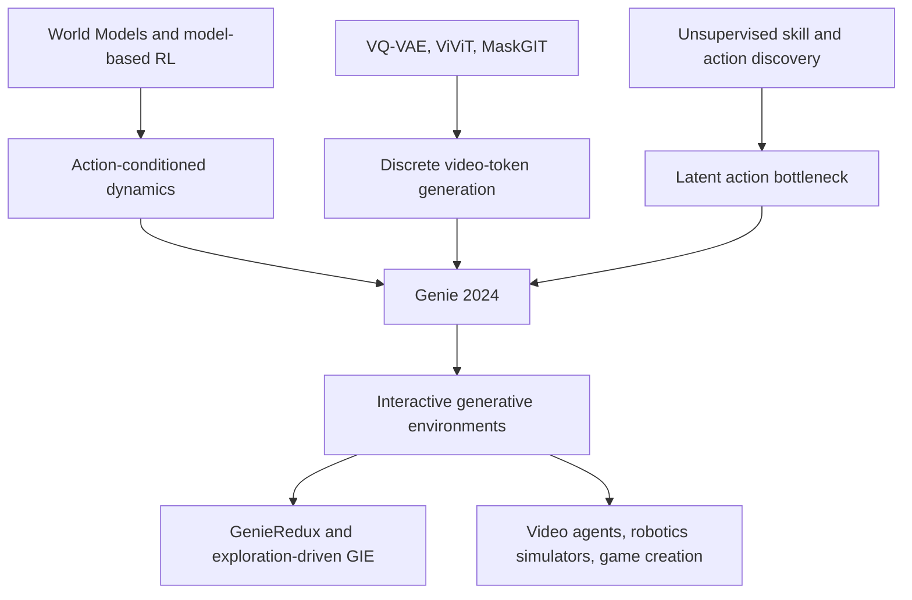

# Genie: 生成式交互环境

> **2024 年 2 月 23 日，Google DeepMind 把 [Genie](https://arxiv.org/abs/2402.15391) 放到 arXiv 上：不是再生成一段视频，而是让一张草图、照片或文本生成图变成可按键探索的 2D 世界。** 最反直觉的地方在于，Genie 没有用动作标签训练，却从 3 万小时过滤后的互联网平台游戏视频里学出 8 个离散 latent action；11B 参数模型把“看视频”变成了“生成一个能被人操作的环境”。它没有证明通用世界模型已经到来，却把一个问题摆到台面上：如果视频本身就藏着控制信号，未来的智能体是否能从海量旁观数据里得到自己的训练场？

## 一句话总结

Jake Bruce、Michael Dennis、Ashley Edwards、Jack Parker-Holder、Yuge Shi 等 25 位作者在 ICML 2024 发表的 Genie，把视频生成、离散表示学习和世界模型合在一起：先用 ST-ViViT VQ-VAE 把视频 $x_{1:T}$ 压成离散 token $z_{1:T}$，再用 latent action model 从相邻帧反推出 $a_t \in \{0,\dots,7\}$，最后用 MaskGIT 风格 dynamics 学习 $p(z_{t+1}\mid z_{\le t}, a_t)$，于是用户在推理时可以直接输入 latent action，逐帧推进一个生成出来的环境。它替代的失败 baseline 不是某个榜单第二名，而是三条旧路线：世界模型必须依赖真实动作标签，视频生成只能一次性吐出不可控 clip，互联网视频太脏所以只能当预训练素材。Genie 用 6.8M 个过滤后 16 秒 clip（约 3 万小时）训练 10.7B 参数模型，说明这三条假设都不再稳。

这篇论文和同年的 [Sora](2024_sora.md) 都把视频 generation 推向 world simulation，但 Genie 的钩子更像“生成一个可按键的环境”而不是“生成一分钟电影”。反直觉 lesson 是：控制未必来自人工标注动作，也可以来自一个受限的离散瓶颈；只要 decoder 只能靠历史帧和 $a_t$ 重建未来帧，$a_t$ 就被迫吸收“角色向左、向右、跳跃、停顿”这类可操作变化。后来的 GenieRedux、GameNGen、Oasis 和 Genie 2 都在追这条线：把视觉生成从展示样片推进到可交互、可探索、可训练智能体的模拟器。

---

## 历史背景

### 从“会动的图像”到“能操作的世界”

Genie 出现时，视频生成已经被扩散模型、tokenizer 和 Transformer 推到一个很热闹的位置。Imagen Video、Phenaki、VideoPoet、Lumiere 这些系统能生成更长、更清晰、语义更稳定的短片，但读者面对它们时仍然是观众：输入 prompt，等待模型吐出一段 clip，然后结束。交互不在生成过程里，用户无法像玩游戏那样每一步改变接下来的状态。

Genie 的历史坐标就在这里。它问的不是“能不能生成更漂亮的视频”，而是“能不能从视频中学到一个可操作的环境”。这一步看似小，实际把问题从 media generation 推到了 world model。视频模型需要预测像素或 token，交互式世界模型还要回答另一个问题：如果此刻按下某个动作，下一帧会怎样变？

| 方向 | 训练信号 | 输出形态 | Genie 前的主要缺口 |
|---|---|---|---|
| 文本到视频 | caption + video | 一段固定视频 | 用户不能逐步干预 |
| 经典世界模型 | observation + action | 可供 agent rollout 的状态 | 需要环境动作标签 |
| 游戏神经模拟器 | 特定游戏轨迹 | 单一环境模拟 | 泛化到新视觉世界困难 |
| Genie | 只有视频 | 可逐帧控制的生成环境 | 控制空间必须自己学出来 |

### 动作标签是旧世界模型的瓶颈

Ha 和 Schmidhuber 的 World Models、Dreamer 系列、MuZero、IRIS、TransDreamer 等工作都说明，学一个环境模型对智能体很有价值。但这些方法默认训练数据里有动作：agent 在环境中执行 $a_t$，观察 $o_{t+1}$，模型学习 $p(o_{t+1}\mid o_{\le t}, a_t)$。这个设定在 Atari、MuJoCo、Procgen 里自然成立，在互联网视频里却几乎不可用。YouTube 上有海量游戏和机器人视频，但不会附带每一帧的手柄输入、键盘动作或机器人控制量。

因此，旧世界模型有一个现实瓶颈：能互动的数据少，不能互动的视频多。只靠模拟器采集动作轨迹，世界模型容易被困在少数环境；只用互联网视频，模型又缺动作条件，学出来只能像视频生成器。Genie 的核心野心，是把这两边接起来：从无标签视频里自动抽出一个离散动作接口。

### DeepMind 的长期线索：从 Gato、RT-1 到开放式智能体

Genie 也延续了 DeepMind 早期关于 generalist agents 的路线。Gato 把多任务、多模态、多环境数据统一成 token 序列；RT-1 把机器人观测和动作变成大规模行为克隆问题；Open-Ended Learning 则强调智能体需要越来越多样的环境。问题是，环境本身很贵。真实机器人数据慢，人工游戏演示有限，手写模拟器覆盖不了开放世界的长尾。

Genie 把“环境生产”本身交给生成模型。它不是先拿到一个真实游戏引擎再训练 agent，而是试图从公开视频里学出“像平台游戏一样可操作”的动态系统。这解释了为什么论文会把 Genie 称为 foundation world model：foundation 的意思不是它已经通吃所有物理世界，而是它把生成模型的规模化训练逻辑带到了交互环境这件事上。

### Genie 真正反直觉的地方

最反直觉的地方不是 11B 参数，而是 8 个动作。直觉上，无标签视频只告诉我们“画面从 A 变成 B”，没有告诉我们“玩家做了什么”。Genie 让 latent action model 通过 VQ 瓶颈把变化压成少数离散 code，再让 dynamics model 依赖这些 code 预测未来帧。这个瓶颈很硬：如果 code 不携带动作意义，未来帧重建就会变差；如果 code 太多，人和 agent 又很难把它当控制器。

所以 Genie 的历史意义可以概括成一句话：它把“视频里是否藏着可操作控制信号”从哲学猜想变成了可训练系统。它的样片、Robotics 检查和 CoinRun 行为克隆实验都还不等于通用智能体训练场，但已经足以让后来的研究认真追问：视觉生成模型能否从被动观看世界，走向主动模拟世界？

---

## 方法详解

### 整体框架：三段式的生成式交互环境

Genie 的架构可以看成三段式：video tokenizer 把帧压成离散 token，latent action model 从相邻帧中发现离散动作，dynamics model 在历史 token 和动作条件下预测下一帧 token。它不像传统 text-to-video 模型那样一次生成完整视频，而是把每一步都暴露成可控制接口。推理时，用户给一张初始图 $x_1$，选择一个 latent action code，模型生成 $x_2$；再选择下一个 code，模型继续生成 $x_3$。

| 组件 | 输入 | 输出 | 训练信号 | 推理时角色 |
|---|---|---|---|---|
| ST-transformer backbone | 时空 token | 隐表示 | 自注意力建模 | 被三大模块复用 |
| Video tokenizer | $x_{1:T}$ | $z_{1:T}$ | VQ-VAE 重建 | 把图像/视频转成离散 token |
| Latent action model | $x_{1:t}, x_{t+1}$ | $a_t$ | VQ 瓶颈 + 下一帧重建 | 只保留 codebook，用户替代模型给动作 |
| Dynamics model | $z_{\le t}, a_{<t}$ | $z_{t+1}$ | 交叉熵预测 token | 逐帧 rollout 环境 |
| Decoder | $\hat z_t$ | $\hat x_t$ | tokenizer 重建 | 把 token 还原成画面 |

这个设计最重要的边界是：Genie 不是一个公开可完全复现的 11B 配方。论文给了架构、数据规模、关键超参和消融，但没有发布训练数据与完整代码。因此本节讲的是论文明确披露的系统结构，而不是试图复刻 DeepMind 内部工程。

### 关键设计 1：ST-transformer 把视频拆成空间注意力与时间注意力

Genie 三个模块都复用 spatiotemporal transformer。普通 Transformer 若让所有 $T\times H\times W$ token 两两 attention，成本会随时空 token 数平方增长。Genie 把一层拆成两个部分：空间层在单帧内部看 $1\times H\times W$ token，时间层在同一空间位置上看 $T\times 1\times 1$ token，并在时间层使用 causal mask。这样，主成本随帧数近似线性增长，更适合长 rollout。

$$
\mathrm{STBlock}(h)=\mathrm{FFN}(\mathrm{TempAttn}(\mathrm{SpatialAttn}(h))).
$$

论文还提到一个工程取舍：ST block 只在空间和时间 attention 后放一个 FFN，而不是空间 attention 后也放一层 FFN。这个看似小的改动把参数和算力留给更有用的部分，帮助放大 dynamics model。

### 关键设计 2：Video tokenizer 用 ST-ViViT 保留时间信息

tokenizer 的任务是把视频 $x_{1:T}\in\mathbb{R}^{T\times H\times W\times C}$ 压成离散 token $z_{1:T}\in\mathbb{I}^{T\times D}$。这一步既是压缩，也是建模接口：后面的 dynamics 不直接预测像素，而是预测 token。Genie 的 tokenizer 是带 ST-transformer 的 VQ-VAE，codebook 有 1024 个 video token，patch size 为 4，latent dimension 为 32。

$$
z_{1:T}=Q(E_\phi(x_{1:T})), \qquad \hat{x}_{1:T}=D_\psi(z_{1:T}).
$$

为什么不用纯 spatial tokenizer？因为交互环境需要时间连续性。只按单帧压缩会把运动线索推给 dynamics model；ST-ViViT 则让每个 $z_t$ 能带着过去帧的信息。论文的 tokenizer 消融很直接：ST-ViViT 的 FVD 为 81.4，优于 spatial ViT 的 114.5 和 C-ViViT 的 272.7，同时内存只需 0.9GB，低于 C-ViViT 的 1.6GB。

| Tokenizer | 参数 | 内存 | FVD↓ | $\Delta_t$PSNR↑ |
|---|---:|---:|---:|---:|
| ViT | 230M | 0.3GB | 114.5 | 1.39 |
| C-ViViT | 225M | 1.6GB | 272.7 | 1.37 |
| ST-ViViT | 205M | 0.9GB | 81.4 | 1.66 |

### 关键设计 3：Latent action model 用离散瓶颈逼出“按钮”

latent action model 的训练目标很巧：给它历史帧 $x_{1:t}$ 和下一帧 $x_{t+1}$，让 encoder 输出连续 latent action，再通过 VQ codebook 压成少数离散动作。decoder 只能看到历史帧和这个动作，必须重建 $x_{t+1}$。因此，如果 $a_t$ 不包含“导致变化的因素”，重建就会失败。

$$
\mathcal{L}_{LAM}=\|x_{t+1}-\hat{x}_{t+1}(x_{1:t}, a_t)\| + \mathcal{L}_{VQ}, \qquad a_t\in\{0,\ldots,7\}.
$$

8 个动作不是随便选的。论文说增加 code 数会提升表达力，但会牺牲人和 agent 的可玩性。小 codebook 逼模型把视觉变化聚合成少数可理解的按钮：向左、向右、跳跃、停顿，或者在 Robotics 里表现为 down、up、left 等稳定语义。推理时，LAM 的 encoder/decoder 大体被丢掉，只保留 VQ codebook；用户或策略输入 code，替代原本从视频里推断的动作。

### 关键设计 4：Dynamics model 用 MaskGIT 逐帧预测未来 token

dynamics model 是 decoder-only MaskGIT transformer。训练时，它接收过去 video token 和 stop-gradient latent action embedding，预测下一帧 token。论文中特别强调：动作不是简单拼到对应帧上，而是作为 additive embedding 注入，这对可控性有帮助。

$$
\mathcal{L}_{dyn}= -\sum_{t=2}^{T}\log p_\theta(z_t\mid z_{<t}, a_{<t}).
$$

最终 Genie 的 dynamics model 有 10.1B 参数，batch size 512，训练 125k steps，使用 256 TPUv5p；与 tokenizer 和 action model 合计约 10.7B 参数，论文与传播中通常称为 11B。它不是单次生成 $T$ 帧，而是逐步 rollout：采样下一帧 token，decode 成图像，再把这个结果作为下一步历史。

### 关键设计 5：数据过滤比“越多越好”更关键

原始 Platformers 语料来自公开互联网视频：按 2D platformer 关键词筛出 55M 个 16 秒 clip，10 FPS，160x90，总计约 244k 小时。但原始视频中有菜单、主播脸、低质量录屏和非游戏内容。团队手标 10k 个视频，用 11M 参数 ResNet18 训练质量分类器，最终保留 6.8M 个 clip，约 3 万小时。

| 数据版本 | 规模 | 模型参数 | FVD↓ | 结论 |
|---|---:|---:|---:|---|
| 原始数据 | 55M clips | 580M | 61.4 | 数量大但噪声多 |
| 过滤数据 | 6.8M clips | 580M | 54.8 | 质量更高，生成更稳 |
| 最终主模型 | 6.8M clips | 10.7B | 定性为主 | 用规模换泛化与可玩性 |

这组数字值得放进方法章节，因为它解释了 Genie 为什么不是“直接喂全网视频”。世界模型不是只要覆盖率，还需要画面中持续出现可学习的交互动态。

### 伪代码：Genie 的训练与交互流程

下面的伪代码只表达论文公开结构，不代表 DeepMind 内部实现。关键点是：tokenizer 先训；LAM 与 dynamics 再联合训练；推理时 LAM 让位于用户动作。

```python
def train_genie(videos, tokenizer, latent_action_model, dynamics_model):
    tokenizer.train_vqvae(videos)

    for frames in videos:
        video_tokens = tokenizer.encode(frames)
        latent_actions = latent_action_model.infer_actions_from_pixels(frames)
        predicted_tokens = dynamics_model(video_tokens[:-1], latent_actions[:-1])
        loss = cross_entropy(predicted_tokens, video_tokens[1:])
        loss.backward()


def play_genie(prompt_image, action_codes, tokenizer, action_codebook, dynamics_model):
    tokens = [tokenizer.encode(prompt_image)]
    frames = [prompt_image]
    for code in action_codes:
        action = action_codebook[code]
        next_tokens = dynamics_model.sample_next(tokens, action, maskgit_steps=25)
        tokens.append(next_tokens)
        frames.append(tokenizer.decode(next_tokens))
    return frames
```

这个流程就是 Genie 的方法贡献：把“从视频中学习 dynamics”和“让人可操作”放到同一个离散接口里。它的优雅之处在于没有额外要求动作标签；它的脆弱之处也在这里，因为所有控制语义都被压进一个小 codebook，无法保证跨 domain 总能对齐到人类熟悉的动作。

---

## 失败案例

### 为什么 Genie 的 baseline 不是传统排行榜第二名

Genie 的失败案例不能只看一个 FVD 数字。论文真正挑战的是一组旧假设：动作标签是世界模型的前提，视频生成只能做不可交互样片，互联网视频太脏不能支撑控制学习，以及 tokenizer 之后的 latent action 足以表达动作。Genie 的实验不完美，但它把这些假设逐个压了一遍。

| 被挑战的路线 | 典型做法 | Genie 的反例 | 仍然没解决的部分 |
|---|---|---|---|
| 带动作世界模型 | 从模拟器采集 $(o_t,a_t,o_{t+1})$ | 从无动作视频学 8-code latent action | code 语义不保证跨域稳定 |
| 不可控视频生成 | prompt 生成完整 clip | 用户逐帧输入 action code | 画质和长期一致性仍有限 |
| 全量互联网视频 | 直接扩大数据量 | 质量过滤后 FVD 更好 | 过滤器可能带来偏置 |
| token-input LAM | 从 video token 推断动作 | pixel-input LAM 可控性更强 | 像素输入更贵 |

### 失败路线 1：世界模型必须依赖真实动作标签

传统世界模型在 Atari、Procgen、MuJoCo 中很自然，因为环境直接给动作。真实互联网视频没有这个条件。Genie 的 latent action model 是对这条路线的替代：它把“帧间变化”压进一个离散 code，再让 dynamics model 使用这个 code 预测未来。若 code 没有动作含义，模型无法稳定 rollout；若 code 有含义，就可以变成控制器。

这条路线最有力的实验不是样片，而是 CoinRun 行为克隆。论文用冻结的 LAM 给未见 RL 环境的专家视频打 latent action 标签，再用少量真实动作样本把 latent action 映射回环境动作。主文说，给 200 个 action-labeled expert samples 后，LAM-based policy 能达到 oracle behavioral cloning 的同等得分。这不是证明 Genie 能训练任意 agent，而是说明 latent action 不是完全随意的视觉聚类。

### 失败路线 2：视频生成只能“一次性播放”

Genie 之前的 text-to-video 系统把用户放在生成过程之外。模型输出视频后，用户不能在第 3 帧按“跳跃”，也不能改变第 8 帧的方向。Genie 把视频生成拆成循环：tokenize 当前状态，输入 action code，MaskGIT dynamics 采样下一帧 token，decode 后继续。

这个替代并不免费。逐帧 autoregressive rollout 会累积错误，长期一致性受限，且 2D platformer 是比开放 3D 世界更简单的 domain。但概念上的失败 baseline 已经被替换了：一个视觉生成模型可以被设计成 environment，而不是 clip renderer。

### 失败路线 3：互联网视频越多越好

Genie 的数据实验很提醒人。原始 Platformers pool 有 55M 个 clip、约 244k 小时；过滤后只剩 6.8M 个 clip、约 3 万小时。但同样 580M 参数模型上，过滤数据 FVD 从 61.4 改到 54.8。也就是说，对交互动态来说，“清楚的 gameplay”比盲目扩大规模更重要。

| 数据策略 | 规模 | FVD↓ | 失败原因或收益 |
|---|---:|---:|---|
| 原始 pool | 55M clips | 61.4 | 菜单、主播脸、坏录屏稀释 dynamics |
| 过滤后 corpus | 6.8M clips | 54.8 | 清晰 gameplay 提高可学习性 |
| 人工动作标注 | 不适用 | 不适用 | 成本太高，无法覆盖互联网规模 |

这一点也是 Genie 相比很多“scale 一切”的故事更克制的地方。它承认视频数据需要筛选，否则模型学到的不是世界动态，而是 UI、剪辑、遮挡和录屏噪声。

### 失败路线 4：从 token 推断动作就够了

一个自然替代方案是：既然 tokenizer 已经把视频压成 token，LAM 直接看 token 不就行了？论文做了这个 ablation。token-input model 在 Platformers 上 FVD 略低，但可控性更差；在 Robotics 上 FVD 和可控性都输给 pixel-input LAM。这说明 tokenizer 压缩虽然对 dynamics 有用，却可能丢掉微小运动线索。

| LAM 输入 | 数据集 | 参数 | FVD↓ | $\Delta_t$PSNR↑ |
|---|---|---:|---:|---:|
| token-input | Platformers | 2.3B | 38.8 | 1.33 |
| pixel-input | Platformers | 2.5B | 40.1 | 1.91 |
| token-input | Robotics | 1B | 257.8 | 1.65 |
| pixel-input | Robotics | 1B | 136.4 | 2.07 |

这个失败案例很重要，因为它告诉后续工作：动作发现不只是压缩后的视觉预测问题。控制信号往往藏在细粒度运动、接触、方向和时序变化中，过早离散化会把这些线索磨平。

### 仍然失败的地方：Genie 不是通用物理引擎

Genie 自己也留下了清晰边界。主模型集中在 2D platformer，分辨率低于现代视频生成模型，样片有漂移，长期 rollout 可能退化，latent action code 的语义需要玩家自己摸索。Robotics 模型证明方法不只适用于游戏，但它仍是 action-free 视频上的定性检查，不是可部署机器人模拟器。

所以 Genie 的最佳读法不是“DeepMind 已经造出通用世界模型”，而是“动作标签这个瓶颈可以被无监督 latent action 部分绕开”。这已经足够重要，但还没有把物理、3D、长期记忆、奖励、任务目标和安全可控性一起解决。

---

## 思想史脉络

### 前世：从“可预测世界”到“可操作世界”

Genie 不是凭空出现的。它站在三条脉络的交点上：第一条是 model-based RL 和 world models，关心“能不能预测环境下一步”；第二条是离散视觉 token 和生成式视频模型，关心“能不能用 token 建模高维视觉”；第三条是无监督技能/动作发现，关心“没有外部动作标签时，模型能不能自己发现控制变量”。Genie 的新意，是把这三条线放进同一个大模型系统。



World Models、Dreamer、PlaNet 一类方法早就证明了 learned dynamics 对 RL 有价值，但它们大多依赖环境动作，并且训练在模拟器或明确任务里。VQ-VAE、VideoGPT、MaskGIT、Phenaki、VideoPoet 则证明了离散 token 可以承载图像和视频生成，但大多把视频视为输出物，而不是可持续交互的环境。Genie 把“动作条件 dynamics”从环境动作里解放出来，把“视频生成”从一次性 clip 里解放出来。

### 今生：Sora 时代里的另一种世界模型宣言

2024 年初，公众对 world model 的想象被 Sora 这类高保真视频系统点燃。Sora 的强项是视觉真实感和开放世界短片；Genie 的强项是交互接口和 action-free training。两者都被解读为“world model”，但含义并不相同：Sora 更像从语言到视觉轨迹的生成器，Genie 更像从图像状态和动作 code 到下一状态的环境。

| 方向 | 代表问题 | 输入输出 | 控制粒度 | Genie 的位置 |
|---|---|---|---|---|
| 文本到视频 | 怎样生成逼真片段 | prompt → clip | 片段级 | 借用视觉生成能力，但目标不同 |
| 动作条件世界模型 | 怎样预测环境转移 | state, action → next state | 帧级/步级 | 核心目标 |
| 无监督动作发现 | 怎样从视频找控制变量 | frames → latent actions | 离散 code | 关键桥梁 |
| 机器人仿真 | 怎样从观测中学可执行 dynamics | observation → future observation | 任务/接触级 | 初步展示，未成熟 |

因此 Genie 的历史意义不在于它比 Sora 更好看，而在于它把“世界模型”这个词拉回了交互。一个模型是否理解世界，不只看它能不能渲染一个漂亮未来，也看它能不能在用户行动后改变未来。

### 被误读的一点：11B 不是最重要的数字

Genie 很容易被写成“DeepMind 训练了 11B 游戏世界模型”。这个说法没错，但会遮住真正关键的接口设计。若没有 latent action，11B dynamics 只是一个视频模型；若没有 ST-ViViT tokenizer，latent action 很难接到高维像素；若没有逐帧 rollout，用户只能看样片。11B 是放大器，不是定义本身。

另一个误读是把 latent actions 当成真实动作标签。论文没有说 8 个 code 永远等于“左、右、跳、停”。它说的是：在数据分布内，这些 code 能被 dynamics model 使用，并在若干 qualitative 和 behavioral-cloning 实验里表现出可解释控制。这个区别很重要，因为后续系统若把 latent action 当作稳定 API，就必须额外做校准、对齐和安全约束。

### 后续：从 Genie 到可探索的生成环境

Genie 之后，相关工作很自然地朝两边走。一边是更强的生成式交互环境，比如改进 tokenizer、采样和 exploration；另一边是把 learned environments 接到 agent 训练、机器人仿真、游戏编辑器和具身任务里。论文笔记系统里已经能看到类似方向，例如 Exploration-Driven Generative Interactive Environments 这类工作，关心模型不只是“能玩”，还要能支撑探索和策略学习。

Genie 在思想史里像一枚楔子：它没有把世界模型问题封口，却把问题重新定义了。过去的问题是“给动作标签，预测下一状态”；Genie 把它改写成“没有动作标签，先发明一个可用的动作空间，再预测下一状态”。这一步很小心，也很大胆。

---

## 当代视角

### 今天看 Genie：它更像接口论文，而不只是模型论文

从 2026 年回看，Genie 最值得保留的不是某个 FVD，也不是 11B 参数本身，而是接口定义：把无动作视频转成可交互环境。这个接口后来会连接很多问题：游戏原型生成、机器人离线数据利用、视频 agent 的自监督预训练、具身 AI 的模拟器扩展，以及“模型能不能自己产生练习场”。

Genie 的论文语气其实很克制。它没有宣称完全理解物理，也没有宣称能替代游戏引擎。它展示的是一个可能性证明：只要能从视频中发现有限动作空间，生成模型就不必停留在被观看的状态；它可以开始被操作。

### 哪些假设站不住了

第一，动作空间小不等于语义简单。8 个 code 在 platformer 里足够形成可玩接口，但开放世界、3D 操作、机器人接触和多物体交互需要层级动作、连续控制和任务条件。若把 Genie 的 8-code 设计直接推广，会很快碰到表达瓶颈。

第二，视频动态不等于物理规律。Genie 学到的是数据分布内的视觉转移，不是守恒、接触、质量和因果机制的显式模型。它可以生成看似合理的 parallax，也可以在长期 rollout 中漂移。这不削弱论文贡献，却提醒我们不要把视觉 plausibility 当成可验证仿真。

第三，无监督动作发现不自动等于人类可控性。latent action 在 qualitative examples 中可解释，但不同 prompt、domain、风格和尺度下可能重排语义。若要把这类模型用于 agent 训练或用户工具，需要额外学习 action naming、action grounding、uncertainty 和 reset 机制。

| 2024 年的隐含乐观 | 2026 年更谨慎的看法 | 可能补法 |
|---|---|---|
| 少数 latent codes 足以交互 | 复杂环境需要层级/连续动作 | 离散-连续混合 action space |
| 视频预测可近似模拟器 | 视觉合理不等于物理可靠 | 引入物理约束、3D 表示、可检验 rollout |
| 无动作视频能替代交互数据 | 离线视频缺少反事实覆盖 | 主动探索与环境交互补数据 |
| 大模型会自动稳住长期 rollout | 错误仍会累积 | 记忆、规划、校正器和 reset policy |

### 如果今天重写 Genie

如果今天重写 Genie，我会保留“从无动作视频中发明控制接口”这条主线，但会改三处。第一，把 latent action 做成层级结构：低层 code 控制局部运动，高层 option 控制意图或技能。第二，让 tokenizer 显式分离 object、camera、agent 和 background，减少单一 token stream 把一切揉在一起的问题。第三，把 uncertainty 暴露给 agent：模型不确定时应该知道自己不确定，而不是继续自信 rollout。

在工程上，新版 Genie 也可能不再只靠 platformer 训练。它会混合合成环境、游戏录屏、机器人视频、3D scene 和带交互日志的数据；会用更强的视频扩散/自回归混合生成器；会把 reward model、language instruction 和 tool API 接到同一个可操作世界里。但这些增强都不应该抹掉 Genie 的原始锋芒：动作标签不是唯一入口。

### 对后续研究者的启发

Genie 留下的好问题比答案更多。一个 generative environment 的评估不能只看 FVD，必须评估可控性、可重复性、长期任务成功率、latent action 语义稳定性，以及 agent 在其中训练后能否迁移到真实环境。论文的 $\Delta_t$PSNR 是一个早期尝试，但还远远不够。

另一个启发是数据治理。Genie 用 10 小时左右的人类标注训练过滤器，从 55M clips 中挑出 6.8M。这说明大型自监督系统并不等于“无人工”。人类仍然在定义什么是可学习的交互片段、什么噪声应该被排除、什么 domain 值得被建模。

### 一句话留给未来

Genie 的意义不在于它已经生成了一个完整世界，而在于它把视频生成的按钮交还给了用户。它让“模型看见世界”迈向“模型允许你在世界里做事”。这一步还粗糙，但方向非常清楚：下一代 world model 的核心不是更长的视频，而是更可靠的行动后果。


---

> 🌐 [English version](/en/era5_genai_explosion/2024_genie/) · 📚 awesome-papers project · CC-BY-NC