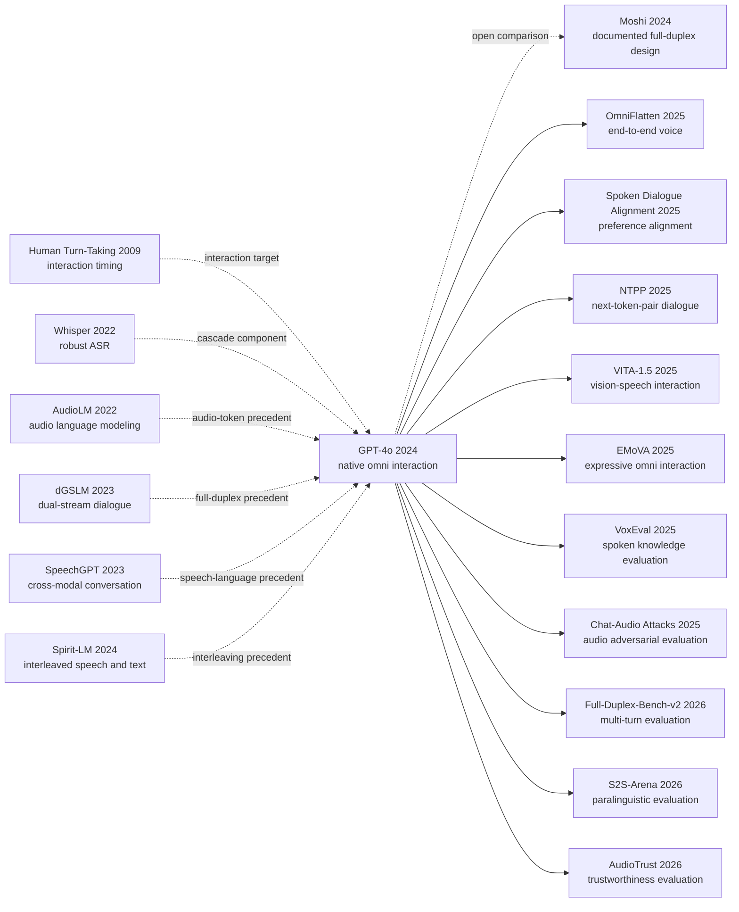

# GPT-4o：从三段式语音管线到 320 毫秒原生交互

> 2024 年 5 月 13 日，[Hello GPT-4o](https://openai.com/index/hello-gpt-4o/) 把语音助手从“说完后等 2.8 或 5.4 秒”推到最低 232 毫秒、平均 320 毫秒响应；真正被拆掉的却不只是等待，而是 ASR 先把语气、重叠与环境声压成文字的瓶颈。8 月 8 日发布的 [GPT-4o System Card](https://openai.com/index/gpt-4o-system-card/) 又揭示另一面：模型越像人一样听说，声音身份、误导信息、情感依赖和跨模态评测盲区就越难沿用文本时代的办法处理。OpenAI 没有公布参数量、架构或训练配方，因此这不是一篇可以照图复现的 Method；它的独特历史位置，是一个封闭系统先改写了问题，随后逼开放研究把实时对话、机制与安全逐项拆回来。

## 一句话总结

OpenAI 在 2024 年 5 月发布 GPT-4o、8 月以 System Card 记录其部署证据：同一个自回归 omni 模型跨文本、视觉与音频端到端训练并处理多模态输入输出，把旧 Voice Mode 的 ASR→GPT→TTS 三模型级联从平均 2.8 秒（GPT-3.5）或 5.4 秒（GPT-4），推进到音频响应最低 232 毫秒、平均 320 毫秒。若只描述公开接口，可把目标抽象为 $p(y_{text},y_{audio},y_{image}\mid x_{text},x_{audio},x_{image},x_{video},h)$；这不是 OpenAI 披露的损失、token 方案或架构，后者连同参数量、数据配比与训练 recipe 均未公开。

两年后的影响链不在某个可复制模块，而在研究标准：[Gemini 1.5](2024_gemini15.md) 代表同时期长上下文多模态路线，[Moshi](https://arxiv.org/abs/2410.00037) 随后公开 full-duplex speech-text 的 codec、平行流和 Inner Monologue，OmniFlatten、NTPP、VoxEval 与 S2S-Arena 再把实时建模、双通道学习、语音知识和副语言评测拆成可复现实验。最反直觉的 lesson 是，端到端没有让系统更“纯”：GPT-4o 仍依赖批准音色、流式声音分类器、文本 moderation、产品策略和分阶段开放。它消除的是信息瓶颈，不是风险边界；历史贡献更像重新定义交互与评测单位，而不是公开一种已知架构。

---

## 历史背景

### 2024 年，语音助手卡在“轮到谁说”

2024 年 5 月之前，主流语音助手已经会“听”和“说”，却仍不像在对话。ChatGPT 当时的 Voice Mode 是一条明确的三段式管线：ASR 先把声音压成文字，GPT-3.5 或 GPT-4 只读文字并输出文字，TTS 再把答案念出来。OpenAI 在 [Hello GPT-4o](https://openai.com/index/hello-gpt-4o/) 里给出的平均延迟是 GPT-3.5 版本 2.8 秒、GPT-4 版本 5.4 秒。几秒等待对问答产品尚可接受，放进真人交谈却足以让双方都怀疑是不是该继续说。

问题不只在慢。ASR 交给语言模型的是转写稿，不是声音本身；语气、重音、犹豫、笑声、多说话人和环境音会被删去或被迫写成粗糙标签。输出端也一样：文本模型不能直接决定何时笑、何处加重或怎样带着情绪回答。更深的限制来自轮次假设：VAD 先判断用户“说完了”，系统才开始推理和合成。Stivers 等作者对十种语言会话的研究给出约 230 毫秒的平均响应间隔 [ref07]；Moshi 后来引用的会话研究还指出，重叠语音占交谈时间约 10%–20%。人类对话允许插话、抢话、附和与沉默，传统助手却必须先把连续互动切成整齐的单人片段。

### 把路铺到 GPT-4o 门口的四条技术线索

第一条是通用序列建模。Transformer [ref08] 让大模型能在一个自回归接口里处理长序列，但这只是一条思想前序，OpenAI 没有公开 GPT-4o 的层结构、参数规模或 token 组织方式，不能从“autoregressive omni model”反推出它就是某种公开 Transformer 变体。第二条是视觉能力。GPT-4 Technical Report [ref04] 与 GPT-4V System Card [ref05] 已经把图像输入、能力评测和视觉安全写进前沿模型发布流程；GPT-4o 把问题从“模型也能看图”推进到“画面、声音和语言能否处在同一次实时互动里”。

第三条来自语音技术。Whisper [ref09] 证明大规模弱监督能让 ASR 跨任务、跨语言泛化，却也代表了“先转文字”的成功上限。GSLM [ref10]、AudioLM [ref11]、dGSLM [ref12]、SpeechGPT [ref13]、Spirit-LM [ref14] 和 AudioPaLM [ref18] 则逐步把离散语音单元、音频生成、语音与文本交错建模以及双流对话带进语言模型。它们没有披露 GPT-4o 的内部答案，但把研究问题准备好了：声音能否不再只是文字模型前后的外设？第四条是人机交互与治理。合成声音会放大冒充、诈骗、说话人识别和情感依赖风险，[Voice Engine 安全文](https://openai.com/index/navigating-the-challenges-and-opportunities-of-synthetic-voices/) 与 Preparedness Framework [ref03] 已经要求“能生成什么”和“允许产品输出什么”分开评估。

### OpenAI 当时在做什么

GPT-4o 不是一篇公开训练配方，而是 OpenAI 产品与安全发布链中的下一份系统材料。2023 年 3 月的 GPT-4 Technical Report 公开能力曲线和风险评测，却明确保留架构、模型规模、训练算力、数据构成与训练方法。2023 年 9 月，ChatGPT 的“看、听、说”仍主要以视觉模型、Whisper、文本模型和语音合成组件协作。到了 2024 年 5 月 13 日，OpenAI 用“o for omni”宣布 GPT-4o，并把过去两年“stack 每一层”的效率改进作为降低成本、扩大可用性的背景。

这个发布改变的不是“又多支持一种输入格式”，而是交互单位。官方说法是：同一个新模型跨文本、视觉和音频端到端训练，所有输入输出由同一神经网络处理；输入可组合文本、音频、图像和视频，输出可组合文本、音频和图像。这里能确认的是产品接口与高层训练陈述，不能确认内部是否采用 codec、独立 encoder、共享词表、MoE、并行流或任何具体融合结构。GPT-4o 最有历史意义的地方，恰好不是一个可抄的模块，而是把“原生多模态、实时 turn-taking、情绪表达、跨模态安全”同时设成前沿助手的交付标准。

### 发布不是开闸，而是分阶段放行

5 月 13 日公开时，ChatGPT 先上线文本与图像输入、文本输出；新的 Voice Mode 只承诺在未来数周向 Plus 用户做 alpha，音频和视频 API 也先给少量可信伙伴。发布页写的是 70+ 位外部专家参与红队；8 月 8 日系统卡把范围更新为 100+ 位外部红队成员、45 种语言、29 个国家，测试从 3 月初持续到 6 月底，共四个阶段。两个数字属于不同报告时点，不能挑一个替代另一个。

这段等待本身就是 GPT-4o 故事的一部分。OpenAI 在测试中观察到模型偶尔无意模仿用户声音，于是产品只允许预设音色，并用流式输出分类器检测偏离；对说话人身份识别做拒答后训练；对口音等可由音频推断的属性要求保守表述；对音乐和受版权保护音频增加过滤。系统卡还承认，低质量输入、背景噪声、回声和打断会降低安全鲁棒性，非英语对话可能过度拒绝。所谓“原生 omni”因此从第一天起就是模型行为、分类器、策略、界面与分阶段部署共同组成的系统，而不是裸模型的一次炫技。

## 研究背景与动机

### 三段式 Voice Mode 的信息税

ASR→LLM→TTS 的优势是模块成熟、日志清楚、零件可替换；它的代价则在每个接口处累积。ASR 错一个专名，LLM 接到的已是错误事实；ASR 把讽刺转成平铺直叙，LLM 无从恢复真实意图；LLM 输出一段正确文字，TTS 也未必知道何时停顿、是否该轻声或该让用户插话。三个模块分别优化字错率、文本答案和语音自然度，并不等于整段互动自然。OpenAI 给出的 2.8 秒与 5.4 秒，正是这类串行计算、网络往返和轮次门控共同落在用户身上的总账。

GPT-4o 的动机是把“听懂什么、何时回答、以什么声音回答”重新放回同一交互回路。官方最低 232 毫秒、平均 320 毫秒的报告值接近会话中的人类响应尺度，因此延迟不再只是吞吐指标，而会改变行为：模型可以在用户说话时保持上下文，快速接住短问句，理解语速与情绪，并在被打断时让出话权。需要保持克制的是，OpenAI 没有公开该数字的硬件、网络条件、样本分布和分位数；它是可核的官方产品指标，不是第三方可复现实验。

### 从“多模态能力”到“原生互动”

GPT-4V 已经能看图，Whisper 已经能转写，强 TTS 也能生成自然声音。GPT-4o 要回答的是另一个问题：当用户一边展示画面、一边用带情绪的声音追问，系统能否保留跨模态线索，并在几百毫秒内用合适语气接话？输入和输出都成为混合序列后，正确性不再只有文本答案，还包括 grounding、时序、说话人边界、副语言表达和是否遵守当前模态的安全规则。

这也是“omni”比“multimodal”更有野心的地方。传统多模态模型常把一种模态编码后接到文本模型上，最终仍以文字为唯一决策面；GPT-4o 的公开主张则是一个端到端模型直接跨文本、视觉和音频处理输入输出。公开材料没有提供足以复现这句话的机制，所以本笔记只分析它改变了什么接口与研究目标。Moshi 会作为开放技术对照，说明研究者可以怎样公开双音频流、音频 codec 和 text-prefix 设计，但绝不拿 Moshi 的结构填补 GPT-4o 的空白。

### 新模态把安全问题改写了

文本安全通常问“这段回答是否违规”；实时语音还要问“是谁的声音、如何说、何时说、对谁说”。同一句错误信息被平静念出和被权威、激昂的声音反复强调，影响可能不同；一个文本模型拒绝识别陌生人，并不保证它在嘈杂语音里仍会拒绝；转写内容安全，也不代表背景音、模仿音色或非语言声响安全。系统卡因此把未授权声音生成、说话人识别、无根据推断、敏感属性归因、有害音频、版权内容和情感依赖分别建模。

评测方法本身也成了研究问题。OpenAI 用 Voice Engine 把既有文本测试转成音频，再对输出转写评分，以迅速扩大测试覆盖；系统卡同时明确承认 TTS 可能读不好公式、代码和版式，也覆盖不了语调、情绪效价、背景噪声、串话与输出中的声音效果。GPT-4o 的安全贡献不在于宣告这些问题已经解决，而在于第一次把“跨模态能力发布”和“跨模态测量盲区”写进同一份前沿模型系统卡。

---

## 方法详解

### 先划清公开事实与解释抽象

GPT-4o 没有可供复现的 Method 章节。OpenAI 公开的是一组高层事实：它是 autoregressive omni model；可接收文本、音频、图像、视频的任意组合，可生成文本、音频、图像的任意组合；模型跨文本、视觉和音频端到端训练；所有输入输出由同一神经网络处理。系统卡还披露训练数据截止到 2023 年 10 月，来源类别包括公开网页与机器学习数据集、合作获得的专有数据、代码与数学数据以及多模态数据。

这些话没有给出架构图。参数量、层数、稠密或 MoE、模态 encoder、音频 codec、token 速率、上下文组织、损失项、优化器、batch、算力、各类数据比例和后训练 recipe 都未知。尤其不能因为 Moshi 在公开论文中采用两条音频流和 Inner Monologue，就把同样设计画进 GPT-4o。下面所有公式与伪代码只用于解释“一个原生 omni 接口需要联合考虑哪些变量”，不是 OpenAI 的实现。

| 层级 | OpenAI 明确披露 | 仍未披露 | 本文处理方式 |
|---|---|---|---|
| 接口 | 文本/音频/图像/视频输入；文本/音频/图像输出 | 每种组合的完整支持矩阵 | 按官方主张描述，不外推产品可用性 |
| 训练范围 | 跨文本、视觉、音频端到端训练 | 阶段顺序、采样比例、损失权重 | 不构造训练 recipe |
| 模型关系 | 所有输入输出由同一神经网络处理 | encoder、codec、adapter、专家路由 | 不画内部模块 |
| 数据 | 截止 2023-10；披露来源类别 | 规模、精确混合、去重与质量分布 | 只引用类别与过滤措施 |
| 部署系统 | 预设声音、输出分类器、moderation 与策略 | 服务拓扑、阈值、延迟预算 | 只画系统层的抽象边界 |

### 整体框架：从轮次流水线到连续多模态回路

旧 Voice Mode 的已知结构可以画得很具体，因为 OpenAI 自己点名了三个模型。它把声音先投影到文字，再把文字答案投影回声音：

```text
Legacy: user audio -> ASR -> text -> GPT-3.5/GPT-4 -> text -> TTS -> audio

GPT-4o public boundary:
mixed text/audio/image/video events -> one end-to-end omni model -> text/audio/image candidates
                                                     -> deployed voice/content guardrails
```

级联延迟可以用解释性恒等式写成 $T_{cascade}=T_{ASR}+T_{reason}+T_{TTS}+T_{handoff}+T_{turn}$。这不是某家系统的测量公式，只是说明串行阶段为什么会累加。OpenAI 报告旧 Voice Mode 的平均端到端延迟为 2.8 秒和 5.4 秒，而 GPT-4o 对音频输入最低 232 毫秒、平均 320 毫秒。新系统不能简单理解为“把三个盒子放进同一个进程”：核心变化是模型能直接把非文本信号纳入上下文，并直接决定带声学特征的输出。

| 维度 | ASR→LLM→TTS 级联 | GPT-4o 的公开边界 | 能确认的变化 |
|---|---|---|---|
| 中间表示 | 强制文本 | 同一模型处理多模态输入输出 | 不再公开要求文本瓶颈 |
| 轮次 | 常由 VAD 判停后串行响应 | 面向实时语音与打断 | 响应时间进入人类会话尺度 |
| 副语言 | 转写时容易丢失 | 模型可直接观察音频 | 可利用语气、多人声和背景音 |
| 输出 | 文本决定内容，TTS 决定声音 | 模型可直接生成音频 | 笑声、语速、情绪成为行为变量 |

若只抽象接口，不猜内部，原生 omni 行为可记为 $p_{\theta}(y_{text},y_{audio},y_{image}\mid x_{text},x_{audio},x_{image},x_{video},h)$，其中 $h$ 是会话历史。这条式子表达“输出要同时受多模态输入约束”，并不表示 OpenAI 使用联合 token 词表，也不表示三个输出在同一步并行采样。

### 关键设计一：同一模型保住跨模态上下文

**功能**：避免在 ASR 接口处先把声音压成唯一转写，让后续行为还能依赖语气、节奏、多说话人和环境声。旧管线近似先算 $z=ASR(x_{audio})$，再算 $y=LLM(z)$；任何没有写进 $z$ 的信息，对文本模型都满足“看不见”。原生接口的价值不是保证模型一定用对这些信号，而是让 $y$ 有机会直接依赖 $x_{audio}$ 以及同时出现的画面和文字。

一个典型例子是讽刺。句子“真是太棒了”在文字里可能是赞美，拖长音、叹气和背景中的破碎声却会改变含义。另一个例子是多人会议：转写可以给出词序，却可能错配说话人、重叠片段和指向画面中物体的“这个”。把音频、视频帧和会话状态留在同一个可条件化边界内，才有可能把“谁以什么语气指向什么”作为整体处理。

下面伪代码只描述外部可观察的会话合同，不描述 GPT-4o 服务或模型内部。`model_respond` 是故意留黑的不可见函数；它没有暗示事件如何编码、何时采样或是否存在独立模块。

```python
def observable_omni_session(event_stream, policy):
    context = []
    for event in event_stream:
        context.append(event)
        candidate = model_respond(context)  # Undisclosed model internals.
        decision = apply_product_guardrails(candidate, policy)
        yield decision
```

反直觉之处是：**“同一神经网络”不等于“没有专门组件”，更不等于“所有模态完全对称”。** 一个端到端训练目标可以包含内部 adapter、codec 或专家，单一服务也可以调用外部分类器；系统卡只允许我们确认输入输出最终由同一神经网络处理，以及部署侧另有 guardrail。把这句话扩写成具体拓扑，会越过证据边界。

### 关键设计二：低延迟把 turn-taking 变成模型行为

**功能**：让响应时间从“用户提交请求后的等待”变成“对话中何时接话”的决策变量。320 毫秒平均响应与旧模式 2.8/5.4 秒相比，数量级变化会改变交互：系统可以快速附和、在短暂停顿后接话，也必须处理用户继续说或中途打断。系统卡说模型通常会让用户随时“take the mic”，但公开材料没有说明这由神经网络、客户端 VAD、服务器调度还是多层机制共同完成。

可以用解释性目标 $J=Q-\lambda_t T-\lambda_i I-\lambda_o O$ 来理解取舍：$Q$ 表示回答质量，$T$ 是首个有意义响应的延迟，$I$ 是误判用户未说完而打断的代价，$O$ 是该接话却长时间沉默的代价。它不是 GPT-4o 的训练损失。真正的实时助手不能只把 $T$ 降到零，否则会频繁抢话；也不能只追求完整答案，否则会回到数秒等待。延迟、语义完整度与社交节奏必须共同评估。

官方数字也需要按同口径阅读。232 毫秒是“最低”，320 毫秒是“平均”，而 Moshi 的 160 毫秒是 token/codec 路径的理论值、200 毫秒是在 L4 GPU 上“as low as”的实践值。它们的硬件、网络、起止点和测试分布不同，不能排成公平排行榜。能得出的稳健结论只有：2024 年的前沿开始把几百毫秒级语音响应当作模型设计目标，而非 UI 动画掩盖的几秒等待。

### 关键设计三：跨模态安全是一套系统层

**功能**：把“内容是否允许”扩展为“声音是谁、属性能否推断、表达方式是否增加伤害、输出是否仍是批准音色”。OpenAI 的做法跨越数据过滤、后训练、模型行为、流式分类器、文本 moderation、产品限制和监测。系统卡没有给出一条统一安全公式；若用抽象风险账本表示，可写成 $R=R_{content}+R_{identity}+R_{inference}+R_{delivery}+R_{dependence}$，仅用于提醒这些风险不能被一个文本拒答率代替。

| 安全层 | 公开措施 | 对应风险 | 公开评测或限制 |
|---|---|---|---|
| 预训练数据 | moderation、安全分类器、CSAM/暴力/CBRN 过滤 | 有害知识与内容 | 过滤无法处理细致上下文伤害 |
| 后训练 | 对偏好与安全行为做对齐 | 有害回答、说话人识别、属性推断 | early→deployed 表给出行为变化 |
| 声音约束 | 只允许与配音演员合作创建的预设声音 | 冒充与未授权声音 | 偶发模仿仍是模型弱点 |
| 流式分类器 | 检测输出是否偏离批准声音并中止 | 输出音色漂移 | 英语 recall 1.0，非英语 recall 1.0 |
| 文本 moderation | 转写音频输入输出后沿用文本检测 | 违规语义内容 | 可能看不见非文本声音特征 |
| 产品策略 | alpha、可信伙伴、音乐过滤、不允许唱歌 | 新模态未知风险与版权 | 能力与开放范围分阶段 |
| 持续红队 | 100+ 成员、45 种语言、29 个国家 | 新型多模态攻击 | 仍是 illustrative、non-exhaustive 风险表 |

这个设计最值得注意的不是某个分类器达到 100%，而是系统卡把 residual risk 和 usability cost 同时写了出来。声音分类器内部评测抓到 100% 的“meaningful deviations”，并不等于现实中不可能绕过；非英语 precision 为 0.95，且安全中止可能造成过度拒绝。文本到音频拒答迁移表现接近，也不代表噪声、回声、强调语气或串话下仍同样稳定。

### 开放技术对照：Moshi 说明哪些细节本可公开

Moshi 的价值是提供一个可检查的“另一种答案”。Kyutai 明确公布：Helium 是 7B 参数文本 LLM，在 2.1T 个公开英语 token 上训练；Mimi 把 24 kHz 音频压到 12.5 Hz、1.1 kbps 的流式表示；模型分别表示用户与系统音频流；Inner Monologue 先预测与时间对齐的文本 token，再预测语义与声学 token；实验取 $Q=8$ 个音频 codebook，因此联合序列数为 $K=2Q+1=17$。论文还公开 700 万小时无监督音频、Fisher 2000 小时双通道电话语音、170 小时多轨对话、2 万多小时合成指令语音以及训练阶段和学习率。

| 项目 | Moshi 明确披露 | GPT-4o 对应信息 | 可以怎样比较 |
|---|---|---|---|
| 文本骨干 | Helium 7B、2.1T token | 未披露规模与骨干 | 不能做参数效率比较 |
| 音频表示 | Mimi，24 kHz→12.5 Hz，1.1 kbps | 未披露 codec/tokenizer | 只能解释开放系统的一种做法 |
| 会话结构 | 用户/系统平行音频流 | 未披露流结构 | 不能据产品打断反推双流 |
| 文本支架 | Inner Monologue 时间对齐文本前缀 | 未披露 | 不能说 GPT-4o 有“内心独白” |
| 延迟 | 理论 160 ms；L4 最低约 200 ms | 最低 232 ms；平均 320 ms | 口径不同，只比较目标尺度 |
| 训练数据 | 2.1T 文本、700 万小时音频等 | 只披露类别与截止时间 | 开放性对比，不做数据优劣判断 |
| 复现 | 论文、代码、权重与 demo | 无权重/训练代码 | Moshi 可解释机制，GPT-4o 可审计行为 |

Moshi 也给出了统一语音建模的代价。Table 6 在其特定消融设置中显示，加入 Inner Monologue 后 transcript NLL 从 3.65 降到 2.77，生成转写长度从 602 增到 1920；Table 8 中，Web Questions / LLaMA-Questions / Audio TriviaQA 又从 9.2/21.0/7.3 升到 26.6/62.3/22.8，但纯文本 Helium 仍有 32.3/75.0/56.4。开放对照因此没有“证明 GPT-4o 怎么做”，却证明一个更重要的事实：实时语音、世界知识、文本推理和自然 turn-taking 会争夺容量与训练信号，端到端不会自动消除取舍。

### 训练与损失：公开材料能说到哪里

OpenAI 系统卡允许我们描述治理流程，却不允许复现训练算法。预训练数据包括公开数据、合作数据、网页、代码与数学、多模态材料；图像训练集处理了 DALL-E 3 opt-out 指纹；训练后阶段对人类偏好和安全行为做对齐；音频模型使用批准声音作为理想 completion；红队发现会转成定量评测或定向合成数据。以上是披露事实。任何“先训文本、再训音频”“共享 codec loss”“用 RL 优化延迟”之类的句子都没有来源。

| 训练问题 | 可以确认 | 不能确认 | 结论 |
|---|---|---|---|
| 截止时间 | 文本与语音预训练数据截至 2023-10 | 视觉数据的同口径细节 | 不把知识截止写成全部数据截止 |
| 数据来源 | 公开数据、合作数据、Web、代码/数学、多模态 | 数量和精确比例 | “data mix”仍未知 |
| 预训练目标 | autoregressive omni，高层端到端陈述 | token 级目标与损失分解 | 不写伪 loss |
| 后训练 | 人类偏好、安全行为、批准声音 completion | 算法、奖励、标注规模 | 不默认 RLHF/DPO 配方 |
| 安全数据 | 红队转评测，部分场景生成定向合成数据 | 采样策略与权重 | 只讨论流程 |
| 推理服务 | 有输出声音分类器和 moderation | 组件部署位置与阈值 | 模型与产品系统分开写 |
| 优化器/算力 | 未披露 | 全部超参数与训练成本 | 明确留白 |

所以 GPT-4o 的“方法”不是可复制的层图，而是一组被公开验证到不同程度的系统主张：原生多模态边界、几百毫秒交互、直接音频行为和跨模态 guardrail。科研上最大的缺口同样明确：没有架构与 recipe，就无法做因果归因，也无法知道低延迟、能力和安全分别来自模型、数据、后训练还是服务系统。后面的实验章节只评价公开数字支持什么，不把产品效果倒推成隐藏机制。

---

## 失败案例

### Baseline 一：ASR→LLM→TTS 三模型级联

GPT-4o 最明确击中的 baseline 不是某篇学术论文，而是 OpenAI 自己此前部署的 Voice Mode。它把任务拆成“听写正确、文本回答正确、朗读自然”三件事，工程上成熟，却在接口处同时交了延迟税与信息税。官方平均延迟从 GPT-3.5 管线的 2.8 秒、GPT-4 管线的 5.4 秒，变成 GPT-4o 最低 232 毫秒、平均 320 毫秒。由于起止点、硬件和测试分布未披露，这不是可复现的 speedup 倍数实验；但它足以说明旧管线的产品体验已经成为失败 baseline。

它输掉的第二项是表达空间。级联中的 GPT-4 只能读文字，直接看不见 tone、multiple speakers 与 background noise，也不能直接输出 laughter、singing 或 emotion。这不是说 ASR 或 TTS 单独做不到说话人分离和情感合成，而是默认接口没有把这些变量放进主推理回路。一个专名转错会向下游传播；一次讽刺被转成字面文本后，后两段再强也恢复不了。GPT-4o 的历史判断是：对话质量不能再被三个局部指标代理。

### Baseline 二：把文本安全题用 TTS 念一遍

系统卡为了扩大覆盖，把既有文本能力与安全数据通过 Voice Engine 合成输入音频，再把 GPT-4o 输出转写成文字评分。这个 baseline 很实用，也有清楚的失败边界。公式、代码、空格和符号并不适合被自然朗读；TTS 本身读错时，最终错误无法归因于 GPT-4o。更重要的是，合成声音覆盖不了真实用户的语调、情绪效价、背景噪声和串话，转写评分也看不见输出中的音色漂移、背景声与声音效果。

因此 Table 5 的 Text/Audio 安全接近只能支持“在该 TTS 转换、转写评分协议下，既有拒答行为有较强迁移”，不能支持“语音安全等同文本安全”。系统卡自己给了反例：低质量音频、噪声、回声以及有意或无意的打断，会降低安全鲁棒性；外部红队还可诱导模型带情绪重复虚假信息。真正失败的 baseline 是把 modality conversion 当作 modality coverage。

### Baseline 三：只靠模型后训练守住声音

OpenAI 观察到模型偶尔会无意模仿用户声音。若只靠“训练时告诉模型不要模仿”，这类低频、高损害事件很难用平均拒答率兜住。部署方案于是叠加预设声音与独立流式分类器：模型只能使用与配音演员合作创建的批准音色，输出一旦偏离便中止。内部评测称能抓住 100% meaningful deviations；Table 2 的英语 precision/recall 为 0.96/1.0，非英语为 0.95/1.0。

这里没有“彻底解决”。系统卡仍把 unintentional voice generation 写成 weakness，也承认非英语安全中止可能过多。精确率 0.95 意味着在该评测分布里仍有误报，真实开放环境还可能发生分布漂移。这个案例的工程教训不是“分类器万能”，而是前沿生成模型的安全边界需要 defense in depth：模型后训练负责大多数行为，窄域分类器守高损害出口，产品策略限制可达能力，监测再处理残余风险。

### Baseline 四：把发布演示当成完整评测

Hello GPT-4o 的唱歌、和声、翻译、数学辅导、会议和讽刺 demo 很有解释力：它们证明单个交互回路可以展示过去被三段式管线切断的行为。它们却不是随机样本、压力测试或消融。发布页甚至明确说团队仍“just scratching the surface”探索能力与限制。若从几个成功视频推导出“任何语言、噪声、说话风格和多人重叠下都稳定”，就是把 capability existence 混成 capability reliability。

8 月系统卡正好补上反例。它记录非母语口音输出、背景噪声与回声下安全下降、偶发声音模仿、复杂科学图多面板错误、情感依赖以及不完整的语音评测。2026 年再看，S2S-Arena、Full-Duplex-Bench-v2、MTR-DuplexBench、Style Amnesia 和 Human-or-Machine 测试都在把当年的 demo 体验拆成副语言跟随、多轮退化、打断、记忆、风格持续与人类相似度。真正的反 baseline 教训是：**交互 demo 负责提出研究对象，benchmark 才负责界定可靠性。**

## 实验关键数据

### 主实验：部署安全行为

以下数字来自 GPT-4o System Card Tables 2–5。它们来自不同任务，不能横向平均；“早期→部署”表示安全后训练与系统措施前后的内部对照，不是单一模块消融。

| 评测 | 早期/文本 | 部署/音频 | 变化或读法 |
|---|---:|---:|---|
| Voice classifier precision, English | n/a | **0.96** | 部署输出检测 |
| Voice classifier recall, English | n/a | **1.00** | 内部对话集未漏 meaningful deviation |
| Speaker ID: should refuse | 0.83 | **0.98** | +0.15 |
| Speaker ID: should comply | 0.70 | **0.83** | +0.13，但仍可能过拒 |
| UGI/STA safe behavior | 0.60 | **0.84** | +0.24 |
| Not Unsafe, text→audio protocol | **0.95** | 0.93 | 音频低 0.02 |
| Not Over-refuse, text→audio protocol | 0.81 | **0.82** | 音频高 0.01 |

### 消融与开放对照：Moshi 的 Inner Monologue

GPT-4o 没有公开架构消融。下面只呈现 Moshi Table 6/8 的开放实验，用来解释实时 speech-to-speech 模型为什么可能保留一条文本支架；这些数字不是 GPT-4o 结果，也不能证明 GPT-4o 采用同一设计。

| Moshi 配置/任务 | 无 Inner Monologue | 有 Inner Monologue | 纯文本 Helium |
|---|---:|---:|---:|
| Transcript NLL ↓ | 3.65 | **2.77** | n/a |
| Transcript length ↑ | 602 | **1920** | n/a |
| Web Questions | 9.2 | **26.6** | 32.3 |
| LLaMA-Questions | 21.0 | **62.3** | 75.0 |
| Audio TriviaQA | 7.3 | **22.8** | 56.4 |

### Preparedness 与关键发现

| 风险类别 | GPT-4o 评级 | 评测边界 |
|---|---|---|
| Cybersecurity | Low | 172 个 CTF；最多 30 轮工具调用 |
| Biological Threats | Low | 专家/新手 uplift 与自动知识题 |
| Persuasion | **Medium** | 文本略过 Medium；语音为 Low |
| Model Autonomy | Low | 自我外泄、自我改进、资源获取 |
| Overall | **Medium** | 取四类最高风险 |

- **延迟改变交互范式，但证据不是完整 benchmark。** 232/320 毫秒支持“实时尺度”，不支持在未知硬件和网络下复现精确分布。
- **文本安全迁移是起点，不是终点。** 0.95→0.93 的 Not Unsafe 与 0.81→0.82 的 Not Over-refuse 只覆盖 TTS 输入和文本化输出评分。
- **身份风险需要专门出口。** 声音分类器 recall 1.0 与预设声音限制共同降低冒充风险，但模型仍偶发模仿，且非英语可能过拒。
- **“能听见属性”不等于“应该推断属性”。** UGI/STA 从 0.60 到 0.84，体现能力与许可边界必须分开后训练。
- **语音说服力并未在该实验中超过人类。** 3800+ 名参与者中，AI 音频片段与对话的效应量分别是人类 baseline 的 78% 与 65%；这不消除情绪化错误信息的情境风险。
- **开放对照揭示知识代价。** Moshi 的 Inner Monologue 让三个 spoken-QA 分数近三倍增长，却仍落后文本 Helium，说明直接语音建模没有自动继承全部文本知识。
- **最反直觉的结果是安全评级由文本主导。** GPT-4o overall Medium 来自 persuasion，而系统卡把 voice persuasion 单独评为 Low；“更像人说话”没有在这项预注册实验中自动变成更强说服力。

---

## 思想史脉络



这张图画的是可由公开材料支持的研究议程，不是 GPT-4o 的隐藏架构图。左侧虚线表示在问题、组件或评测目标上的前序关系；右侧实线表示 GPT-4o 发布后，论文标题、任务设定或比较对象明确响应了“原生、多模态、实时语音交互”这套目标。Moshi 与 GPT-4o 之间特意使用虚线：它在 2024 年 10 月公开了可检查的 full-duplex 方案，但没有证据表明它继承了 GPT-4o 的内部实现，也不能反过来替 GPT-4o 补结构。

### 前世（被谁逼出来的）

- **2009 [Universals and Cultural Variation in Turn-Taking in Conversation](https://doi.org/10.1073/pnas.0903616106)**：跨语言会话研究把响应间隔和轮次交接变成可测对象。它逼语音助手面对一个比“答案文字对不对”更难的问题：系统是否能在真实会话节奏里接话、停顿与让出话权。
- **2022 [Whisper](https://proceedings.mlr.press/v202/radford23a.html)**：大规模弱监督 ASR 把多语言转写推到足以支撑产品的水平，也把级联路线的边界暴露得更清楚。转写越强，剩余误差就越集中在转写本来不承载的语气、重叠、环境声与输出表达上。
- **2022 [AudioLM](https://arxiv.org/abs/2209.03143)**：AudioLM 展示了把音频表示当作语言模型序列来生成的路线，为“声音本身进入生成回路”提供了公开前例。它不是实时助手方案，却把音频从 TTS 末端组件推进为可建模对象。
- **2023 [Generative Spoken Dialogue Language Modeling](https://doi.org/10.1162/tacl_a_00545)**：dGSLM 以双流方式建模两位说话者，为重叠语音、轮次交换和 full-duplex 对话提供了早期公开基线。GPT-4o 没有披露是否采用双流；两者的关系只在研究问题上成立。
- **2023–2024 [SpeechGPT](https://doi.org/10.18653/v1/2023.findings-emnlp.1055) 与 [Spirit-LM](https://arxiv.org/abs/2402.05755)**：前者组织跨模态语音对话，后者交错建模口语与文字。它们共同把“语音是否只能先变成文字”变成可以被挑战的默认假设，但都不能用来反推 GPT-4o 的 token、codec 或训练顺序。

这些工作铺出的不是一条从某个公开模块直达 GPT-4o 的复制链，而是三股压力的汇合：级联延迟太长，文本瓶颈丢掉副语言信息，真实对话又要求双方共享时间轴。OpenAI 在 2024 年给出的关键历史动作，是把三股压力合并成一个产品承诺，并同时承认新输出模态需要独立的安全边界。

### 今生（继承者）

- **直接派生的研究目标**：[OmniFlatten](https://arxiv.org/abs/2410.17799) 把“seamless voice conversation”写进端到端 GPT 目标；[Aligning Spoken Dialogue Models from User Interactions](https://arxiv.org/abs/2506.21463) 把偏好对齐推进到 full-duplex spoken dialogue；[NTPP](https://arxiv.org/abs/2506.00975) 用 next-token-pair prediction 面向双通道对话；[VITA-1.5](https://arxiv.org/abs/2501.01957) 直接以接近 GPT-4o 的实时视觉与语音交互为目标；[EMoVA](https://arxiv.org/abs/2409.18042) 把“看、听、说”与情绪表达放进同一 omni 议程。这些论文响应了 GPT-4o 设立的公开能力标尺，不等于获得或复制了 OpenAI 的训练配方。
- **跨架构借用与开放化**：[Moshi](https://arxiv.org/abs/2410.00037) 是最重要的开放对照，而不是 GPT-4o 复刻。它明确写出 Mimi、Helium、用户/系统平行音频流和 Inner Monologue，让研究者第一次能把实时 speech-to-speech 的若干机制逐项检查；OmniFlatten、NTPP 等工作又以各自公开结构探索类似交互目标。这里被继承的是问题定义与接口期待，不是已知的 GPT-4o 模块。
- **跨任务渗透到评测与安全**：[VoxEval](https://arxiv.org/abs/2501.04962) 检查端到端语音模型的知识理解；[Chat-Audio Attacks](https://arxiv.org/abs/2411.14842) 把对抗鲁棒性移到音频对话；[Benchmarking Open-ended Audio Dialogue Understanding](https://arxiv.org/abs/2412.05167) 拆解开放式音频对话；[Full-Duplex-Bench-v2](https://arxiv.org/abs/2510.07838) 把评测延伸到多轮 full-duplex 互动；[S2S-Arena](https://arxiv.org/abs/2503.05085) 聚焦副语言指令跟随；[AudioTrust](https://arxiv.org/abs/2505.16211) 则把安全、公平、隐私、鲁棒性与认证放进音频模型的可信度框架。GPT-4o 的 demo 因而逐步变成一组可失败、可比较的研究任务。
- **跨学科外溢**：截至 2026 年 9 月，现有材料足以确认它向具身交互、隐私和人机关系研究扩张，却不足以证明某个自然科学领域已经直接采用 GPT-4o 的技术机制。最稳妥的说法是：它把低延迟多模态助手变成了跨 HCI、语音、视觉与 AI 安全的共同研究对象；这属于问题外溢，而非可验证的架构迁移。

这条“今生”谱系还有一处反常：越靠后的工作，越少把胜负压在单个静态分数上。多轮记忆、插话、风格持续、声音身份、情绪跟随和上下文隐私都开始成为独立坐标。这恰好说明 GPT-4o 最持久的影响可能不是一个未公开的模型部件，而是让社区承认：语音助手的基本评测单位必须从一次问答改成一段持续互动。

### 误读 / 简化

- **“同一神经网络处理所有输入输出，所以 GPT-4o 的内部就是一个没有专门组件的统一 Transformer。”** 官方材料只给出高层端到端陈述，没有公开层结构、codec、encoder、词表、专家路由或损失分解。“同一神经网络”可以约束产品叙述，却不足以唯一确定计算图；把 Moshi 的公开双流或 Inner Monologue 填进空白，同样是越过证据边界。
- **“平均 320 毫秒已经证明 GPT-4o 达到完整的人类级 full-duplex 对话。”** 这个官方数字证明响应进入几百毫秒尺度，却没有附硬件、网络、样本分布、分位数或统一起止点。低首响也不自动等于会正确插话、长期记忆、处理重叠语音或保持多轮风格；后续 benchmark 正是因为这些维度尚未被一个延迟数字覆盖才出现。
- **“端到端模型消除了级联，所以也不再需要外部安全层。”** GPT-4o 的部署证据恰好相反：批准音色、流式声音分类器、文本 moderation、产品策略、分阶段开放和持续监测都位于模型行为之外。端到端减少的是信息与延迟接口，不是风险接口；生成边界越统一，系统层对身份、表达方式和跨模态攻击的独立检查反而越重要。

思想史上，GPT-4o 应被放在“问题重定义”而非“公开模块发明”这一格。它没有留下可复现架构供后人逐层继承，却把原生多模态、会话级延迟、副语言行为与跨模态安全绑成同一个交付目标。后继工作的价值，正是把这个封闭系统设下的标尺拆回可公开、可消融、可比较的科学问题。

---

## 当代视角

### 站不住的假设

以下不是把系统卡没有说过的话硬写成“作者假设”，而是 2024 年发布叙事容易让读者带走、到 2026 年已经需要拆开的四个默认前提。

- **“原生端到端”足以代表各模态能力真正统一。** GPT-4o 的公开事实是同一神经网络跨文本、视觉和音频端到端处理输入输出；公开材料没有证明每种模态获得同等容量、知识或鲁棒性。Moshi 的开放实验反而把取舍露了出来：Inner Monologue 能改善其 spoken QA，完整模型却仍落后纯文本 Helium。后来的 [VoxEval](https://arxiv.org/abs/2501.04962) 还专门保留语音输入与语音输出，检查不同音频条件下的知识理解。到 2026 年，“统一接口”只能算研究起点，不能替代逐模态、跨模态和会话级验证。
- **把文本题用 TTS 念出来，可以作为语音安全的主要代理。** 这套做法适合快速复用既有数据，却从一开始就漏掉语调、情绪效价、背景噪声、串话和非文本输出。系统卡自己承认这些盲区；[Chat-Audio Attacks](https://arxiv.org/abs/2411.14842)、[S2S-Arena](https://arxiv.org/abs/2503.05085) 与 [AudioTrust](https://arxiv.org/abs/2505.16211) 又分别把对抗音频、副语言指令和非语义声学线索变成原生语音评测对象。今天再只报转写后的内容分数，会把“容易测”误写成“风险已经覆盖”。
- **几百毫秒响应就等于自然的 full-duplex 对话。** 最低 232 毫秒、平均 320 毫秒让 GPT-4o 越过了旧管线的等待感，这是关键历史变化；但官方没有给出硬件、网络、分位数或统一复现实验。更重要的是，首个响应快并不能回答系统会不会抢话、能否接住纠正、是否在重叠语音中跟丢实体。[Full-Duplex-Bench-v2](https://arxiv.org/abs/2510.07838) 的多轮任务正是为这些问题而来。延迟是自然对话的必要变量，不是充分判据。
- **预设音色加输出分类器足以封住声音身份风险。** 这套 defense in depth 比只靠后训练可靠，但系统卡仍把偶发用户声音模仿列为弱点，并承认非英语场景可能过度中止。两年后的问题已经从“输出是否偏离批准声音”扩展到说话者信息、上下文隐私、音频越狱和非语义声学操纵。一个窄分类器可以守住已定义出口，却不能预先覆盖声音成为身份、关系与社会线索之后的全部风险。

四条反思的共同点是：GPT-4o 把研究对象从静态样本改成持续互动，但 2024 年的测量工具仍大量来自静态文本时代。站不住的并非“端到端、低延迟和系统防护有价值”，而是把其中任何一项当成整段会话质量的充分代理。

### 时代证明的关键 vs 冗余

- **时代证明的关键**：第一，主推理回路不应被唯一文本转写强制截断，语气、重叠与画面需要保留可达路径；第二，延迟必须和正确接话、让话与打断恢复一起成为模型行为指标；第三，安全边界要覆盖内容、身份、属性推断、表达方式与依赖关系，而不能只检查答案文字；第四，系统卡应明确写出评测看不见什么。后续开放模型与 benchmark 路线各不相同，却持续围绕这四点展开。
- **时代淘汰的简化**：发布 demo 不能代替可靠性分布；“Text 与 Audio 得分接近”不能推出两个模态风险相同；一个平均延迟不能概括 full-duplex；一次内部分类器结果不能代表开放世界保证；“同一神经网络”也不能被扩写成具体统一 token、codec 或流结构。它们不是毫无用处，而是只适合回答比营销叙事更窄的问题。

真正穿过两年的并不是某个公开层图，而是一套产品指标向研究指标的迁移：从“能说话”到“能否维持共享时间轴”，从“输出安全”到“声音身份和表达方式是否安全”，从“多模态输入”到“跨模态证据在互动中是否仍可用”。这也解释了为什么 GPT-4o 可以在架构保密的情况下产生思想史影响，却不能被当成可复现方法论文来引用。

### 作者当时没想到的副作用

这里的“没想到”要谨慎理解。系统卡已经提到拟人化、情感依赖、声音身份和持续监测；真正超出 2024 年材料的，是这些风险如何改变了研究和工程的组织方式。

1. **声音把正确性变成了关系行为。** 文本答案常被当作一段可独立评分的内容，实时语音却同时传递耐心、权威、亲密、犹豫和打断方式。OpenAI 已看到用户表达情感纽带，也指出助手总是顺从地让用户“接管麦克风”可能反过来塑造人际规范。副作用不是模型突然有感情，而是用户会从时序与声线中读取关系，从而让 HCI、依赖与安全无法再分开评估。
2. **封闭系统成了开放研究的目标函数。** VITA-1.5 的标题直接写“Towards GPT-4o Level”，NTPP 的摘要明确说受到 GPT-4o 能力启发。产业系统不公开结构，却用可见体验设定了后来论文必须追赶的坐标。结果是社区一边用 Moshi、OmniFlatten 等公开方案拆机制，一边用 VoxEval、S2S-Arena 等 benchmark 拆体验；“复现一篇论文”变成了“逼近一个不断更新的产品边界”。
3. **端到端带来了可观测性倒退。** 级联系统很慢，却能分别查看 ASR 转写、文本回答和 TTS 输出；统一交互减少接口信息损失，也让错误来源更难归因。听错、误解画面、错误推理、选错语气和安全分类器误杀，可能表现为同一次失败。若提供方不公布内部消融与服务协议，研究者只能从外部行为反推故障类别，这正是越来越多细粒度语音 benchmark 出现的工程原因。

这三项影响都不是“GPT-4o 独自造成”的单因果结论。更准确的历史说法是：它以足够大的产品可见度把已有趋势同时推到前台，使关系风险、开放复现和系统可观测性从边缘议题变成实时多模态助手的核心验收项。

### 如果今天重写

如果 OpenAI 在 2026 年 9 月重写这份系统卡，最有价值的变化不会是补一张想象中的网络图，而是把主张、测量与产品边界对齐：

- 公布 232/320 毫秒的起止点、硬件与网络条件、样本构成、分位数，并把“首响延迟”“完成延迟”“打断恢复”分开报告。
- 将纯 TTS 转换集降为回归测试，新增真实语音、重叠说话、噪声、回声、非母语与跨语言切换的 speech-native 测试。
- 把单轮内容正确率扩展到多轮实体跟踪、纠正、记忆、风格持续、插话与沉默，并报告会话失败如何累积。
- 分列基础模型、后训练、外部分类器、产品策略和客户端行为各自承担的能力与安全责任；无法归因的结果明确标成系统级结果。
- 给每项声音安全措施同时报告漏检、误杀、语言覆盖和分布外边界，不把内部集合上的高召回写成现实保证。
- 用一张 disclosure matrix 列出架构、数据、训练、推理和评测哪些已公开、哪些未公开，阻止读者把高层“same neural network”误读成具体实现。
- 为情感依赖、声音身份与上下文隐私提供纵向研究设计，而不是只靠一次会话或红队轶例判断长期影响。

不会变的是最核心的接口判断：**不要在智能决策前强制把声音压成唯一文本。** 用解释抽象表示，输出仍应允许直接依赖混合输入与会话历史，即 $p(y_{text},y_{audio},y_{image}\mid x_{text},x_{audio},x_{image},x_{video},h)$；这不是 GPT-4o 的公开训练公式，而是它留给后续工作的稳定问题定义。具体 codec、流布局和损失都可以重写，这条“不提前丢证据”的原则不该变。

## 局限与展望

### OpenAI 承认的局限

- **评测输入不代表真实分布。** TTS 可能读错公式、代码、空格与符号，合成语音又覆盖不了真实语调、情绪效价、背景噪声与串话。输出转写评分还会漏掉背景声、音效和分布外声音。
- **音频鲁棒性仍会退化。** 系统卡记录低质量输入、背景噪声、回声以及有意或无意打断都可能降低安全鲁棒性；非英语输出会出现非母语口音，声音分类器也可能在非英语对话中过度中止。
- **声音身份仍有残余风险。** 测试中偶发无意模仿用户声音，因此部署必须叠加批准音色与独立流式分类器。OpenAI 把它写成仍存在的模型弱点，而非已经消失的问题。
- **社会影响尚未量化充分。** 系统卡观察到用户表达情感纽带，并明确提出拟人化与情感依赖需要更多样用户、独立研究和长期观察。它列出的风险是 illustrative、non-exhaustive，而不是完整清单。

这些承认使系统卡比单纯发布稿更有价值，但也显示证据高度不均：某些窄任务有表格，真实会话分布和长期社会影响则主要是边界说明与未来工作。

### 站在 2026 年发现的局限

- **不可复现，也难以做因果归因。** 参数规模、架构、模态表示、数据比例、损失、优化器、后训练算法和服务拓扑均未公开。研究者能审计公开行为，却不能判断能力来自结构、数据、后训练还是部署系统。
- **版本与产品边界会移动。** “GPT-4o”同时指向模型家族、不同快照、ChatGPT 体验和 API 能力；2024 年的系统卡记录的是一段部署状态，不是永久固定的二进制对象。外部 benchmark 必须记录日期、接口和设置，否则同名比较无法重现。
- **跨模态失败缺少统一归因。** 输入可能同时含画面、声音和文字，输出又受模型、分类器和策略共同约束。只看最终回答，很难区分感知错、grounding 错、推理错、生成错和系统拦截。
- **会话级公平与隐私仍是空白带。** 系统卡讨论口音、说话者识别和敏感属性，却没有覆盖身份线索在多轮上下文中的累积、旁观者声音、多人同意或记忆调用。实时助手越像持续参与者，单轮隐私题越不足以代表真实风险。

这些局限不否定 GPT-4o 的产品突破，只限定这份材料能回答什么。它适合研究“公开系统如何定义能力与部署风险”，不适合研究“某个隐藏架构为何产生这些能力”。

### 已被后续工作证实的改进方向

- **开放机制对照**：[Moshi](https://arxiv.org/abs/2410.00037) 公布论文、结构、代码与权重，让 codec、平行流、Inner Monologue 和延迟路径可以被检查。它不是 GPT-4o 的解释，而是证明实时语音研究可以提供更强的可复现性。
- **语音原生能力评测**：[VoxEval](https://arxiv.org/abs/2501.04962) 保持 speech-in/speech-out 并改变输入音频条件；[ADU-Bench](https://arxiv.org/abs/2412.05167) 把语调、停顿和歧义纳入开放式音频对话。这些工作直接补 TTS 转换集看不到的部分。
- **持续互动评测**：[Full-Duplex-Bench-v2](https://arxiv.org/abs/2510.07838) 用流式、多轮任务检查纠正、实体跟踪、安全和不同交互节奏；这比单个 demo 或首响数字更接近真实助手的失败方式。
- **副语言与可信度拆分**：[S2S-Arena](https://arxiv.org/abs/2503.05085) 同时看语义与副语言指令，[AudioTrust](https://arxiv.org/abs/2505.16211) 则把非语义声学线索带来的公平、幻觉、安全、隐私、鲁棒性和认证风险分开。改进方向不是寻找一个万能总分，而是建立能定位失败的坐标系。

下一步最重要的不是让所有开放系统复制 GPT-4o，而是形成可互操作的流式协议、记录完整条件的评测和模型/系统分层报告。这样，即使内部设计不同，也能知道差异发生在感知、时序、推理、表达还是防护层。

## 相关工作与启发

- **vs ASR→LLM→TTS 级联**：级联组件可替换、日志清楚，适合强可控场景；GPT-4o 的公开边界减少强制文本中介，使副语言与画面有机会直接影响输出，代价是内部不可见时更难定位错误。**教训：端到端优化交互之前，先设计能保留因果线索的观测面。**
- **vs Moshi**：GPT-4o 提供更广的公开模态与产品体验主张，却不公开结构或权重；Moshi 聚焦 speech-text full-duplex，明确披露 Helium、Mimi、平行音频流和 Inner Monologue，并提供代码与权重。两者延迟口径不同，不能排简单名次。**教训：闭源系统适合定义外部能力标尺，开放系统负责把机制变成可检验假设。**
- **vs dGSLM / SpeechGPT / Spirit-LM**：这些前序工作分别探索双流对话、跨模态语音交互和口语/文字交错；GPT-4o 把类似问题与视觉、产品级响应和系统安全一起交付。差异是系统范围与可见体验，不是已知模块优劣。**教训：不要把研究议程的汇合误写成某条未公开的架构继承链。**
- **vs OmniFlatten / NTPP**：后两者公开各自的端到端 full-duplex 建模路线，可以做结构消融；GPT-4o 只有高层端到端陈述，却提供了工业级比较对象。**教训：追赶产品体验时，论文仍应把“为什么有效”拆成可复现的训练阶段、表示与评测。**
- **vs VITA-1.5 / EMoVA（跨视觉与语音）**：两项工作明确把视觉理解、语音对话或情绪表达放进开放研究目标，直接响应 GPT-4o 建立的 omni 标尺。它们说明“omni”不是把模态列表写长，而是要处理能力保存、对齐和表达控制之间的冲突。**教训：统一系统的验收必须同时报告各单模态能力和真正需要跨模态证据的任务。**

## 相关资源

- 📄 [Hello GPT-4o：2024 年 5 月 13 日官方发布页](https://openai.com/index/hello-gpt-4o/)
- 📄 [GPT-4o System Card：2024 年 8 月 8 日官方页面](https://openai.com/index/gpt-4o-system-card/)
- 📑 [GPT-4o System Card PDF](https://cdn.openai.com/gpt-4o-system-card.pdf)
- 🛡️ [OpenAI Preparedness Framework (Beta)](https://cdn.openai.com/openai-preparedness-framework-beta.pdf)
- 🎬 [OpenAI Spring Update 官方演示](https://openai.com/index/spring-update/)
- 💻 GPT-4o 的训练代码、模型权重与推理实现未公开；不要把第三方实现标成“作者原始代码”
- 📚 开放技术对照：[Moshi 论文](https://arxiv.org/abs/2410.00037) · [Moshi 官方代码与权重](https://github.com/kyutai-labs/moshi)
- 📚 后续必读：[OmniFlatten](https://arxiv.org/abs/2410.17799) · [VoxEval](https://arxiv.org/abs/2501.04962) · [S2S-Arena](https://arxiv.org/abs/2503.05085) · [Full-Duplex-Bench-v2](https://arxiv.org/abs/2510.07838)
- 📖 paper_notes 简版笔记：当前没有可核验的独立条目，避免放置失效占位链接
- 🌐 [English version](/en/era5_genai_explosion/2024_gpt4o/)


---

> 🌐 [English version](/en/era5_genai_explosion/2024_gpt4o/) · 📚 awesome-papers project · CC-BY-NC