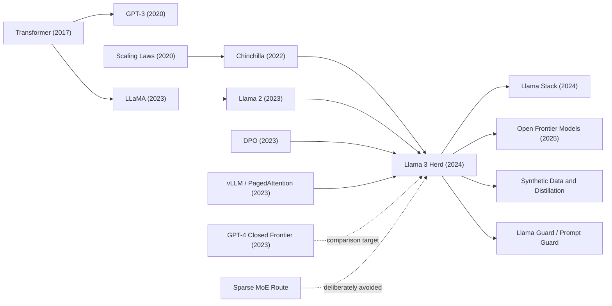

# Llama 3 Herd - 开放权重前沿模型的工程化路线图

> 2024 年 7 月，Meta 把一篇 92 页的技术报告和一组开放权重模型一起推到台前：[arXiv:2407.21783](https://arxiv.org/abs/2407.21783)。Llama 3 最反直觉的地方，不是 405B 参数本身，而是它拒绝把前沿能力包装成单个神秘 API：15.6T token、128K context、16K H100、SFT/RS/DPO、Llama Guard 3、FP8 推理和未发布的视觉/语音 adapter 被写成一套可讨论的工程系统。它让开放模型第一次有底气问：前沿能力是不是只能由闭源接口垄断？

## 一句话总结

Meta AI 的 Llama Team 在 2024 年发布的《The Llama 3 Herd of Models》不是单纯的“又一个大模型报告”，而是把开放权重前沿模型拆成数据、规模、后训练、安全、推理和生态六个可工程化层次：核心语言模型仍是 dense decoder-only Transformer，训练目标还是 $\mathcal{L}=-\sum_t \log p_\theta(x_t\mid x_{<t})$，但旗舰 405B 在 15.6T text tokens、约 $3.8\times10^{25}$ FLOPs、128K context 和 16K H100 级训练基础设施上，把开放模型推到 GPT-4 一线附近。它替代的失败 baseline 不是某个单一模型，而是“开放权重只能做小而便宜的追赶者”这一行业默认判断：论文表 2 中 Llama 3 405B 在 MMLU 5-shot 达到 87.3，超过 GPT-4(0125) 的 85.1，但仍低于 GPT-4o 的 89.1 和 Claude 3.5 Sonnet 的 89.9。

它承接 [Llama 1（2023）](2023_llama.md) 的开放权重震动和 Llama 2 的 chat/safety recipe，却反过来影响了后续 Qwen、DeepSeek、Mistral、Llama Stack、synthetic data distillation 和开放安全组件生态。隐藏 lesson 是：Llama 3 的“开放”并不等于完整开源复现，它更像一种工业边界的重画。Meta 公开权重、评测、很多训练细节和安全组件，却没有公开完整数据与训练代码；这让它既成为开放模型史上的关键节点，也提醒后来者不要把“可下载权重”误读成“科学上完全可复验”。

---

## 历史背景

### 从 Llama 泄露到开放权重竞赛

Llama 3 的历史背景要从 2023 年 2 月的 LLaMA 说起。Meta 最初把 LLaMA 定位为研究访问模型，参数规模从 7B 到 65B，训练目标很朴素：用更高质量的数据和更长训练，让较小模型在推理预算内更强。真正改变局面的不是论文里的任何单个 benchmark，而是权重很快在外部流传开来。研究者、个人开发者和小公司第一次可以在自己的机器或租来的 GPU 上改造一个足够强的 foundation model。LoRA、QLoRA、Alpaca、Vicuna、llama.cpp、GGUF、vLLM 等工具链顺着这个入口长出来，开放模型生态从“下载论文代码”变成“下载权重、微调、量化、部署、服务”。

Llama 2 在 2023 年 7 月进一步把这条路线制度化。它公开 pretrained 和 chat 模型，给出更系统的安全评测和商业许可，让“开放权重模型可以被产品使用”变成现实。与此同时，闭源 API 仍掌握能力上限。GPT-4 在 2023 年已经把推理、编码、工具使用和多模态能力推到新层级，Claude 和 Gemini 也在快速追赶。开放社区可以在 7B、13B、34B、70B 等尺寸上快速迭代，但很少有人相信开放权重会在短期内接近最强闭源模型。

### 2024 年的闭源压力

2024 年上半年，前沿模型竞争的节奏明显变快。GPT-4o 把多模态交互和低延迟体验推向大众，Claude 3.5 Sonnet 在编码、推理和写作上给出很强的实用体验，Google Gemini 继续押注长上下文和多模态。对开发者来说，最强能力仍主要通过 API 获得；对企业和研究机构来说，成本、数据边界、可控部署和可审计性变得越来越重要。开放模型的吸引力不是“免费”，而是控制权：能在本地或私有云部署，能微调，能蒸馏，能接入自己的安全策略，能避免把敏感数据交给外部服务。

在这个语境下，Llama 3.1 405B 的意义非常明确。它不是第一个开放权重大模型，也不是第一个 100B 以上模型；它重要在于 Meta 试图把开放权重推到 frontier-adjacent 能力层。论文声称，405B 在多项任务上接近 GPT-4、GPT-4o 和 Claude 3.5 Sonnet，并公开 pretrained 与 post-trained 版本。这个动作把开放模型的目标线从“接近 GPT-3.5 或某个中等闭源模型”抬到了“直接和旗舰闭源模型同表比较”。

| 时间 | 事件 | 对 Llama 3 的压力 |
|---|---|---|
| 2023-02 | LLaMA 发布并引爆开放权重生态 | 证明开放权重可以产生巨大外部创新 |
| 2023-03 | GPT-4 发布 | 闭源模型重新定义能力上限 |
| 2023-07 | Llama 2 发布 | 开放权重进入商业可用阶段 |
| 2024-05 | GPT-4o 发布 | 多模态和低延迟体验成为新标准 |
| 2024-07 | Llama 3.1 / 405B 发布 | 开放权重开始正面挑战前沿闭源模型 |

### Meta 的反直觉选择：dense 而不是 MoE

2024 年的另一个背景，是 sparse mixture-of-experts 的诱惑。MoE 允许模型有巨大的总参数量，但每个 token 只激活一部分专家，从而降低推理计算。Mixtral 已经证明 MoE 可以在开放模型里很有竞争力，后来的 DeepSeek 系列也会把 MoE 路线推得更远。按直觉，Meta 如果想训练 405B 级模型，似乎应该优先选择 MoE。

Llama 3 反而选择 dense Transformer。论文给出的理由不是“dense 一定更先进”，而是管理复杂度。Meta 要同时处理 15.6T tokens、16K H100、128K context、后训练、安全、工具使用、多语言、推理量化和开放发布。此时 MoE 会引入路由、负载均衡、专家并行、推理服务和训练稳定性的额外复杂度。Llama 3 的工程哲学是：在最核心的语言模型上尽量保持架构简单，把复杂度放到数据、后训练、基础设施和系统组件中管理。

这个选择让 Llama 3 更像一份工程宣言：前沿能力不一定来自最花哨的结构，也可以来自高质量数据、可预测 scaling、稳定训练和反复后训练。论文反复强调“data, scale, managing complexity”三件事，正是为了把读者注意力从单点 architecture novelty 转到完整生产系统。

### 论文真正想证明什么

《The Llama 3 Herd of Models》真正想证明的第一件事，是开放权重模型可以进入前沿模型讨论。论文表 2 把 Llama 3 8B、70B、405B 与 Gemma、Mistral、Mixtral、GPT-3.5、Nemotron、GPT-4、GPT-4o、Claude 3.5 Sonnet 放在一起比较。这个表格的政治性和技术性同样强：它告诉开发者，开放模型不再只是闭源模型的低成本替代品，而是可以在若干任务上同台竞争。

第二件事，是前沿模型应被理解为系统，而不是裸权重。Llama 3 的论文覆盖预训练数据、模型架构、scaling law、4D parallelism、训练中断、后训练数据、DPO、工具使用、安全、Llama Guard 3、FP8 推理和多模态 adapter。它比很多闭源技术报告更愿意写工程细节，但又没有达到完整复现的开放程度。这种中间状态本身就是 2024 年 AI 产业的标志：开放权重越来越强，完整训练 recipe 仍然掌握在少数超大实验室手里。

## 研究背景与动机

### 三个杠杆：数据、规模、复杂度

Llama 3 的动机可以压缩成三个杠杆。数据是第一个。Llama 2 使用约 1.8T tokens，Llama 3 405B 使用 15.6T text tokens，且数据 mix 被拆成 general knowledge、math/reasoning、code 和 multilingual。论文强调的不只是数量，还包括清洗、去重、PII 和成人内容过滤、模型质量分类器、code/math 专用抽取、多语言质量排序，以及训练中动态调整数据比例。

规模是第二个。405B 的选择来自 scaling law 外推，而不是简单追求更大。论文在小规模 FLOPs 上训练多个模型，拟合 compute-optimal token 数与预算的关系，并进一步预测下游任务表现。最终 405B 被描述为接近预算下 compute-optimal 的尺寸，而 8B 和 70B 则故意训练得比 compute-optimal 更久，因为它们的核心约束是推理成本。

复杂度管理是第三个。Llama 3 不把所有问题都交给复杂架构，而是把系统分层：dense backbone 负责稳定可扩展，数据管线负责知识与质量，4D parallelism 负责训练可行性，SFT/RS/DPO 负责可用性，Llama Guard 和 Prompt Guard 负责系统安全，FP8 和 pipeline inference 负责部署成本。这种动机比“提出新模型结构”更工业，也更符合 2024 年前沿模型的真实生产方式。

### 为什么叫 herd

论文标题里的 herd 很有意思。它不是“一个 Llama 3 模型”，而是一群模型：8B、70B、405B，pretrained 与 instruct，4 月发布的 Llama 3 与 7 月发布的 Llama 3.1，短上下文与 128K 长上下文，基础语言模型与安全分类器，外加仍未广泛发布的图像、视频和语音能力实验。这个命名说明 Meta 想讲的不是单点 SOTA，而是模型族。

模型族思维解决了一个现实矛盾：405B 能力强，但推理成本高；8B 和 70B 更容易部署，但需要从旗舰模型和后训练流程中获得质量提升。Llama 3 把 405B 同时当作旗舰产品、数据生成器、蒸馏源、对齐参照和生态锚点。后来的开放模型生态也沿着这个逻辑走：大模型负责探索能力边界，小模型负责铺开应用，安全和工具组件让模型进入真实系统。

### 开放发布也是方法的一部分

Llama 3 的研究动机还包含一个非纯技术目标：证明开放发布可以加速创新。Meta 在博客和论文中反复强调，开放权重让开发者可以定制、微调、蒸馏、部署到私有环境，并围绕安全组件建立自己的治理策略。这和闭源 API 的商业逻辑相反：闭源模型给出强能力和统一服务，开放模型给出可控性和可改造性。

但这个开放是有边界的。Llama 3 的 GitHub 仓库提供权重下载入口、推理示例、模型卡和使用政策，不提供完整预训练代码和数据。论文公开大量训练和评测细节，却不会让外部团队按步骤复现 405B。它的动机更像“开放权重 frontier system”，而不是“完全开放科学实验”。理解这个边界，才能准确评价它的历史位置。

---

## 方法详解

### 总体框架：预训练、长上下文、后训练、发布

Llama 3 的方法没有靠一个醒目的新模块取胜。它的核心是把一个稳定的 dense decoder-only Transformer 放进完整工业流水线：先在约 15.6T text tokens 上做 next-token pretraining，再用长上下文继续预训练把 context window 从 8K 推到 128K，接着通过多轮 SFT、rejection sampling 和 DPO 做 post-training，最后用 Llama Guard 3、Prompt Guard、Code Shield、FP8 inference 和 Llama Stack 把模型变成可发布系统。

预训练目标本身很普通：给定 token 序列 $x_1,\dots,x_T$，最大化自回归似然，或等价地最小化交叉熵损失。

$$
\mathcal{L}_{\text{pretrain}}(\theta)=-\sum_{t=1}^{T}\log p_\theta(x_t\mid x_{<t}).
$$

论文真正的方法点在于“普通目标如何被扩展到 405B、15.6T tokens 和 128K context”。这需要数据质量、scaling law、训练基础设施、后训练策略和安全系统共同工作。把 Llama 3 读成“某个大 Transformer”会漏掉一半内容；把它读成“从训练到发布的工程 recipe”，才接近论文原意。

| 阶段 | 输入 | 输出 | 关键设计 |
|---|---|---|---|
| 数据构建 | Web、code、math、multilingual text | 15.6T 级 token 语料 | 清洗、去重、质量分类器、data mix |
| 初始预训练 | 8K context token stream | 405B pretrained LM | dense Transformer、GQA、RoPE theta 500000 |
| 长上下文预训练 | 逐步拉长的序列 | 128K context LM | context parallelism、needle test、800B tokens |
| 后训练 | human/synthetic SFT、preference data | instruct 模型 | SFT、RS、DPO、model averaging、六轮迭代 |
| 系统发布 | 权重、安全分类器、推理栈 | 可部署模型族 | Llama Guard 3、Prompt Guard、FP8、Llama Stack |

### 关键设计 1：用 dense Transformer 管住复杂度

Llama 3 沿用标准 dense Transformer，并只做少量关键修改。405B 模型有 126 层、hidden dimension 16384、FFN dimension 53248、128 个 attention heads、8 个 key/value heads、SwiGLU 激活、128K vocabulary 和 RoPE positional embedding。它采用 grouped query attention，让多个 query heads 共享较少的 key/value heads，从而降低 KV cache 和 decoding 成本。

如果 $H_q$ 是 query head 数，$H_{kv}$ 是 key/value head 数，序列长度为 $S$，每个 head 维度为 $d$，那么 decoding 时 KV cache 的规模近似随 $S\cdot H_{kv}\cdot d$ 增长，而不是随 $S\cdot H_q\cdot d$ 增长。Llama 3 405B 使用 $H_q=128$、$H_{kv}=8$，这对长上下文推理尤其重要。

| 模型 | Layers | Hidden dim | Attention heads | KV heads | 训练定位 |
|---|---|---|---|---|---|
| Llama 3 8B | 32 | 4096 | 32 | 8 | 可本地和低成本服务 |
| Llama 3 70B | 80 | 8192 | 64 | 8 | 强能力与可部署性的平衡 |
| Llama 3 405B | 126 | 16384 | 128 | 8 | 开放权重旗舰模型 |

这不是一份 architecture novelty 论文。Meta 的判断是：当训练规模、数据和部署系统都已经非常复杂时，主干结构越稳定越好。MoE 可能带来更好的训练/推理 FLOPs 比，但也会带来路由、负载均衡和服务复杂度。Llama 3 把创新预算主要花在数据、训练基础设施、后训练和系统发布上。

### 关键设计 2：数据 mix 与 scaling laws

Llama 3 的数据方法分两层。第一层是清洗与过滤：HTML 解析、URL/document/line 去重、PII 和安全过滤、adult domain 过滤、重复 n-gram 过滤、fastText 和 DistilRoBERTa 质量分类器、code/math 专用抽取、多语言 language identification 和质量排序。第二层是 data mix：论文给出的最终 mix 约为 50% general knowledge、25% math/reasoning、17% code、8% multilingual，并在训练中继续调整，比如提高非英文比例、upsample math 数据、加入更新的 Web 数据、下采样低质量子集。

模型规模选择则来自 scaling law。论文用不同 FLOPs 预算训练 40M 到 16B 的模型，拟合 compute-optimal token 数与预算 $C$ 的关系：

$$
N^*(C)=A C^{\alpha}, \qquad (\alpha, A)=(0.53, 0.29).
$$

外推到 $3.8\times10^{25}$ FLOPs 后，预测接近 402B 参数和 16.55T tokens；实际训练选择 405B 和 15.6T tokens。这个数字不应被读成神秘玄学，而是“在已有预算下，模型大小和 token 数的折中点”。更有趣的是，8B 和 70B 被训练得比 compute-optimal 更久，因为实际部署时，推理成本比训练成本更能决定使用范围。

### 关键设计 3：4D 并行与长上下文

405B dense 模型的训练难点不只是参数多，还在于同步训练的脆弱性。Llama 3 使用 4D parallelism：tensor parallelism 切分矩阵，pipeline parallelism 按层切分模型，context parallelism 按序列维切分长上下文，FSDP/data parallelism 切分 optimizer states 和 gradients。论文把并行维度排序为 [TP, CP, PP, DP]，让通信最密集的维度尽量落在低延迟网络里。

| 并行维度 | 切分对象 | 解决的问题 | Llama 3 中的作用 |
|---|---|---|---|
| TP | 权重矩阵内部 | 单层矩阵太大 | 提高每层计算可行性 |
| CP | sequence dimension | 128K context 内存压力 | 支持长上下文训练 |
| PP | layer stages | 126 层纵向切分 | 让模型跨多组 GPU 放下 |
| DP/FSDP | optimizer/gradients/data | 大规模同步训练 | 扩展到 8K/16K GPU |

长上下文不是一开始就训练到 128K。Llama 3 先用 8K 做初始预训练，再在最后阶段分六步逐渐增加 context length，直到 128K；这一阶段约使用 800B tokens。适应是否成功不只看 loss，还看短上下文 benchmark 是否恢复、needle-in-a-haystack 是否能在对应长度上完美检索。这个流程体现了一个重要工程原则：长上下文训练不是简单把 RoPE 参数改大，而是要在 compute、短上下文能力和检索能力之间持续校验。

### 关键设计 4：SFT、拒绝采样与 DPO

Llama 3 的 post-training 采用六轮迭代。每轮大体包含 reward modeling、supervised finetuning、rejection sampling、DPO 和 model averaging。SFT 数据来自人类标注 prompt、拒绝采样选出的模型回复、synthetic data 和少量人工精选数据。偏好数据则让标注者在多轮对话中比较回复，有时还要求编辑 chosen response，形成 edited > chosen > rejected 的排序。

DPO 的核心目标可以写成：

$$
\mathcal{L}_{\text{DPO}}=-\mathbb{E}_{(x,y_w,y_l)}\log \sigma\left(\beta\left[\log\frac{\pi_\theta(y_w\mid x)}{\pi_{\text{ref}}(y_w\mid x)}-\log\frac{\pi_\theta(y_l\mid x)}{\pi_{\text{ref}}(y_l\mid x)}\right]\right).
$$

论文还做了两个重要修改：一是 mask formatting tokens，避免 header 和 termination token 在 DPO 中造成尾部重复或突然终止；二是加 NLL regularization，保持 chosen responses 的生成概率。Llama 3 团队也试过 PPO，但发现 DPO 在大模型上算力更低、表现更好，尤其在 IFEval 这类 instruction-following benchmark 上。

### 关键设计 5：安全和多模态 adapter

Llama 3 的安全方法分成模型级和系统级。模型级安全通过 pretraining filtering、safety SFT、safety DPO、adversarial/borderline prompts、red teaming 和 internal benchmarks 来控制 violation rate 与 false refusal rate。系统级安全则发布 Llama Guard 3、Prompt Guard 和 Code Shield。Llama Guard 3 是基于 Llama 3 8B 微调的安全分类器，支持英语、多语言文本和 tool-use 场景；Prompt Guard 关注 direct jailbreak 和 indirect prompt injection；Code Shield 用静态分析检测不安全代码。

多模态部分更像实验章节。论文使用 compositional approach：文本 LM 不做端到端多模态预训练，而是接入图像 encoder、cross-attention adapter、video temporal aggregator 和 speech adapter。图像 adapter 在约 6B image-text pairs 上训练，405B 的 cross-attention layers 约有 100B 参数；video adapter 处理最多 64 帧，但这些多模态模型仍未广泛发布。这个设计说明 Llama 3 的主线是语言模型系统，多模态是“在保持文本能力不受损的前提下接入能力”。

### Python 伪代码：Llama 3 式训练流水线

下面的伪代码不是 Meta 内部实现，而是按论文公开信息抽象出的结构。它展示 Llama 3 为什么不是单次 pretraining，而是一组持续循环的数据、训练、对齐和发布步骤：

```python
def build_llama3_herd(raw_corpus, model_sizes, safety_policy, tool_specs):
    clean_tokens = curate_pretraining_data(
        raw_corpus,
        filters=["pii", "adult_domains", "dedup", "quality", "code_math", "multilingual"],
    )
    data_mix = choose_mix(clean_tokens, target={"general": 0.50, "reasoning": 0.25, "code": 0.17, "multilingual": 0.08})

    pretrained = {}
    for size in model_sizes:
        model = DenseDecoderTransformer(size=size, gqa_kv_heads=8, vocab_size=128000, rope_theta=500000)
        model = pretrain_next_token(model, data_mix, context_length=8192)
        model = continue_pretrain_long_context(model, stages=[16000, 32000, 64000, 128000])
        pretrained[size] = anneal_and_average(model)

    herd = {}
    for size, base_model in pretrained.items():
        policy = base_model
        for round_id in range(6):
            prompts = collect_human_and_synthetic_prompts(policy, tool_specs)
            candidates = sample_many(policy, prompts, k_range=(10, 30))
            chosen = reward_model_select(candidates)
            policy = supervised_finetune(policy, chosen)
            preferences = collect_or_generate_preferences(policy, safety_policy)
            policy = direct_preference_optimize(policy, preferences, mask_format_tokens=True, nll_weight=0.2)
        herd[size] = average_compatible_checkpoints(policy)

    guards = train_system_guards(herd["8B"], safety_policy, tool_specs)
    return package_for_release(herd, guards, inference_optimizations=["fp8", "pipeline_parallel"])
```

这段流程的核心不是某个函数名，而是闭环：数据质量提升模型，强模型生成更好 SFT 和 synthetic data，后训练让模型更适合用户、工具和安全策略，旗舰模型再反哺小模型和生态组件。Llama 3 的方法贡献，正是在开放权重语境下把这个闭环展示出来。

---

## 失败案例

### 失败路线 1：只靠小模型开放

Llama 3 之前，开放权重模型最成功的路线往往是“小模型足够好”。7B、13B、34B、70B 模型在成本、可微调性和本地部署上有巨大优势，但它们很难正面挑战 GPT-4 级模型。这个 baseline 的问题不是没有价值，而是能力上限被默认压低：开放模型被当作便宜替代品，而不是能力前沿的一部分。

Llama 3 的 405B 直接挑战了这个定位。它把开放权重推到接近闭源旗舰的对比表中，让 8B 和 70B 不再只是孤立小模型，而是由 405B、合成数据、后训练循环和生态组件反哺的模型族。换句话说，失败 baseline 是“开放模型只能靠小而快取胜”。Llama 3 的反证是：开放路线也需要一个昂贵的旗舰锚点。

### 失败路线 2：MoE 与稀疏路由不是免费午餐

2024 年的另一个强 baseline 是 sparse MoE。它看起来很适合开放模型：总参数量大、每 token 激活少、推理成本有潜在优势。Mixtral 已经给出了很强信号，后续 DeepSeek 也会证明 MoE 的威力。但 Llama 3 没有走这条路，原因是工程风险。对于一个要公开发布、长上下文、支持工具、安全组件和多模态 adapter 的系统，MoE 会把训练稳定性、并行策略和服务栈复杂度推高。

这并不说明 MoE 是失败技术，而是说明“在所有约束下 MoE 一定更优”这个 baseline 不成立。Llama 3 的 dense 选择更像控制变量：先证明数据、规模和后训练可以把开放权重推到前沿附近，再让生态比较 dense 和 MoE 的长期路线。后来的模型竞争也证明，两条路线都能成立，关键在于训练稳定性、推理成本和开放生态的综合权衡。

### 失败路线 3：PPO 式复杂强化学习

InstructGPT 之后，很多人自然会把 RLHF 等同于 PPO。PPO 能优化偏好目标，但在超大模型上代价高、稳定性差、工程链条长。Llama 3 团队试过 PPO，却报告 DPO 在大规模模型上需要更少计算，并且在 instruction-following benchmark 上表现更好。这里的失败 baseline 是“越复杂的强化学习越接近人类偏好”。

Llama 3 的路线更保守：SFT、rejection sampling、DPO、format token masking、NLL regularization、model averaging 和六轮迭代。它没有试图用一个万能 RL 算法解决所有对齐问题，而是把数据质量、偏好分布、synthetic data、人工编辑和安全边界一起调。这个失败案例提醒后来者：对齐系统的瓶颈常常不是算法名，而是数据分布和训练稳定性。

### 失败路线 4：把安全当发布后的补丁

开放权重模型一旦发布，权重无法像 API 服务那样完全由模型提供方控制。因此，“先发布模型，再用产品策略补安全”的 baseline 对开放模型尤其危险。Llama 3 把安全放进训练和系统层：pretraining 过滤、safety SFT、safety DPO、adversarial/borderline benchmarks、red teaming、Llama Guard 3、Prompt Guard、Code Shield，以及 VR/FRR 的权衡评估。

这条路线也没有完美解决安全。论文承认，测试不可能穷尽所有风险，多语言、长上下文、工具使用和熟练攻击者仍会带来残余问题。但它至少让安全成为模型族的一部分，而不是 README 里的免责声明。对开放模型来说，安全工具和治理接口本身就是发布内容。

| 失败 baseline | 当时为什么有吸引力 | Llama 3 的反证 | 遗留问题 |
|---|---|---|---|
| 只做小开放模型 | 成本低、微调快、部署方便 | 405B 证明开放路线也需要旗舰模型 | 旗舰训练仍高度集中 |
| 直接押 MoE | 激活参数少、推理看似便宜 | dense 更稳定、更易管理复杂度 | MoE 后续仍可能胜出 |
| PPO 主导 RLHF | InstructGPT 路线影响大 | DPO 更便宜且更稳定 | 偏好数据仍昂贵 |
| 发布后再补安全 | 产品迭代方便 | 安全必须进入训练和系统组件 | 开放权重仍难完全控制 |

## 实验关键数据

### 模型规模与训练基础设施

Llama 3 405B 的规模数据很具体：405B trainable parameters，15.6T text tokens，约 $3.8\times10^{25}$ training FLOPs，初始 8K context，随后用约 800B tokens 做长上下文 continued pretraining 到 128K。训练基础设施最高使用 16K H100 GPUs；论文还描述了 24K GPU RoCE cluster、400Gbps interconnect、240PB Tectonic storage、2TB/s sustained throughput、7TB/s peak throughput、以及 [TP, CP, PP, DP] 的 4D parallelism。

训练可靠性数据同样重要。论文在 54 天 snapshot 中记录 466 次 job interruptions，其中 419 次为 unexpected interruptions，约 78% 与确认或疑似硬件问题有关；GPU 相关问题占 unexpected issues 的最大部分。尽管如此，系统仍达到超过 90% effective training time。这些数字让 Llama 3 的实验不只是 benchmark，而是一次超大规模同步训练工程实验。

### Benchmark 上的能力轮廓

最常被引用的是表 2。Llama 3 405B 在 MMLU 5-shot 得到 87.3，高于 GPT-4(0125) 的 85.1，低于 GPT-4o 的 89.1 和 Claude 3.5 Sonnet 的 89.9；在 MGSM 多语言数学上达到 91.6，与 Claude 3.5 Sonnet 持平并超过 GPT-4o 的 90.5；在 multilingual MMLU 上达到 83.2，低于 GPT-4o 的 85.5。论文还报告 8B 和 70B 在同尺寸开放模型中很强，说明 Llama 3 不是只靠 405B 讲故事。

| 维度 | Llama 3 关键结果 | 对照对象 | 读法 |
|---|---|---|---|
| 训练规模 | 405B / 15.6T tokens / $3.8\times10^{25}$ FLOPs | Llama 2 约 1.8T tokens | 开放权重进入 frontier-scale 训练 |
| 架构 | 126 layers / hidden 16384 / 128 heads / 8 KV heads | Llama 2 dense family | 架构保守，规模和数据激进 |
| MMLU 5-shot | 87.3 | GPT-4 85.1 / GPT-4o 89.1 | 接近闭源旗舰，但不是全面领先 |
| MGSM | 91.6 | GPT-4o 90.5 / Claude 3.5 91.6 | 多语言数学达到前沿水平 |
| Long context | 128K context，needle retrieval 100% | 8K 初始预训练 | 长上下文靠 staged adaptation |
| Human eval | 对 GPT-4(0125) 大体持平 | GPT-4o / Claude 3.5 mixed | 真实体验依赖 tone、verbosity、任务类型 |
| Safety tools | Llama Guard 3 平均降低 violations 约 65% | base 405B | 安全提升伴随 false refusals 增加 |
| Inference | FP8 prefill throughput 最多提升约 50% | BF16 pipeline inference | 部署成本是论文重点之一 |

### 安全、长上下文与推理效率

安全评测里，Llama Guard 3 是最清楚的系统级结果。论文报告它在 benchmarks 上平均降低约 65% violations，但也提高 false refusal rate。英文场景中 full Llama Guard 对 violation rate 的相对降低为 86%，同时 false refusal rate 相对增加 102%。这不是一个“安全越多越好”的简单故事，而是 VR 和 FRR 的 Pareto tradeoff。Llama 3 把这个权衡显式写出来，是比单独给一个 safety score 更有用的实验披露。

长上下文结果的关键不是只说 128K，而是 staged training 后在 needle-in-a-haystack 上达到 100% retrieval，并在 Multi-needle 任务上接近完美。推理效率方面，405B BF16 无法放进单机 8 张 H100，需要 16 GPUs / 2 machines；FP8 quantization 则对 FFN 中大部分矩阵乘法做低精度处理，不量化 self-attention，并通过 row-wise scaling、跳过首尾层和 dynamic scaling cap 来避免 corrupted responses。论文用 100000 条 FP8/BF16 responses 的 reward distribution 来比较质量变化，这比只看标准 benchmark 更敏感。

### 多模态实验的边界

Llama 3 论文最后还报告图像、视频、语音能力实验，但这些不是广泛发布的主产品。图像模型使用 ViT-H/14 encoder、cross-attention adapter 和语言模型组合；405B 的 image adapter cross-attention layers 约 100B 参数，在约 6B image-text pairs 上训练。视频模型在图像 adapter 上加 temporal aggregator 和 video cross-attention，最多处理 64 frames。结果上，Llama 3-V 405B 在 MMMU val CoT 得到 64.5，超过 GPT-4V 的 56.4，但低于 GPT-4o 的 69.1 和 Claude 3.5 Sonnet 的 68.3；视频 8B/70B 在 PerceptionTest、TVQA、NExT-QA、ActivityNet-QA 上有竞争力。

这里的边界必须讲清楚：多模态模型仍在开发中，未作为 Llama 3 主线广泛发布。它们的重要性在于展示一种 compositional strategy：不重训完整多模态基础模型，而是在保持 text LM 的前提下接入 adapter。这条路线后来会影响很多“语言模型 + modality adapter”的工程实践，但不能把它误读成 Llama 3 已经完整发布了 GPT-4o 式多模态系统。

---

## 思想史脉络

### Mermaid 引用图



### 前世：开放模型、scaling law 与对齐

Llama 3 的前世有三条线。第一条是 Transformer 到 GPT-3 的规模化语言模型路线：统一的 token 接口、next-token prediction、decoder-only 架构和 few-shot 能力，构成了所有后续 LLM 的基本语法。第二条是 scaling law 与 Chinchilla 的预算分配路线：模型大小、token 数和训练 FLOPs 不再只是经验选择，而是可以通过小规模实验外推。Llama 3 明确使用 IsoFLOPs 和下游任务预测，把 405B/15.6T 的选择写成预算约束下的工程决策。

第三条是开放权重和对齐路线。LLaMA 让研究社区看到开放权重模型可以迅速形成生态，Llama 2 把 chat fine-tuning、安全评测和商业可用许可推到更现实的位置。DPO、拒绝采样、reward model、system prompt、tool-use annotation 则把后训练从“让模型会聊天”扩展成“把能力、风格、安全和工具协议一起调出来”。Llama 3 不是这些路线的发明者，它的贡献在于把这些路线组合到 frontier scale，并把组合方式写得足够具体。

| 前序节点 | 给 Llama 3 的遗产 | Llama 3 的改写 |
|---|---|---|
| Transformer / GPT-3 | dense decoder-only scaling | 在开放权重语境下训练到 405B |
| Scaling laws / Chinchilla | compute-token tradeoff | 用下游任务预测辅助定模型规模 |
| LLaMA / Llama 2 | 开放权重、chat、安全路线 | 从研究模型扩展到模型族和系统栈 |
| DPO / InstructGPT | preference alignment | 用更简单稳定的 DPO 替代重型 RL 主线 |
| vLLM / PagedAttention | 高吞吐采样和服务 | 进入拒绝采样与生态部署流程 |

### 今生：从模型到生态系统

Llama 3 的“今生”不是单个 checkpoint，而是 herd。8B、70B、405B 对应不同部署预算；pretrained、instruct、long-context、tool-use 和 safety components 对应不同使用场景；GitHub、Hugging Face、云厂商、vLLM、Llama Stack 对应不同生态入口。论文把这件事讲得很清楚：现代 foundation model 不只是预训练权重，还包括后训练数据、评测协议、安全分类器、推理优化、tool interface 和开发者工作流。

这也是它和 GPT-4 Technical Report 最大的思想差异。GPT-4 把能力展示和风险披露放在闭源 API 的边界内；Llama 3 则试图证明，开放权重也可以承载接近前沿的能力和负责发布的组件。它当然没有把所有东西都公开，但它把许多以前被当作内部工程细节的内容写进论文：数据 mix、4D parallelism、故障统计、FP8 quantization、post-training 数据比例、Llama Guard 3 的 VR/FRR 权衡。这些信息改变了后来开放模型报告的写法。

### 误读：Llama 3 不是“开源 GPT-4”

最常见的误读，是把 Llama 3 称为“开源 GPT-4”。这句话同时高估和低估了它。高估在于：Llama 3 并没有公开完整训练数据、训练代码、训练日志和复现实验，许可证也不是 OSI 意义上的开源许可证；从科学复验角度看，它仍是边界很清楚的工业发布。低估在于：它不只是模仿 GPT-4 的能力榜单，而是把开放权重、系统安全、生态工具和模型族策略合成了一种不同的产业路线。

另一个误读，是把 405B 看成唯一主角。事实上，论文反复强调 smaller models trained longer than compute-optimal，因为很多应用的约束是 inference budget，而不是训练预算。8B 和 70B 的意义在于把 405B 的能力、数据和后训练经验蒸馏到更可部署的尺度上。Llama 3 影响后世的，不只是“有一个很大的开放模型”，更是“开放模型家族可以靠旗舰模型、合成数据和后训练循环共同进化”。

---

## 当代视角

### 2026 年回看：它改变了什么

从 2026 年回看，Llama 3 改变了开放模型的心理边界。Llama 1 证明权重开放会产生生态爆炸，Llama 2 证明开放权重可以商业可用，Llama 3 则证明开放权重可以接近前沿能力并成为企业基础设施选项。它让“open-weight frontier model”成为一个严肃类别，而不只是宣传语。

第二个变化是模型报告的写法。Llama 3 把 infrastructure、data mix、training interruptions、post-training composition、safety tool tradeoffs 和 inference quantization 写进同一篇论文。后来的开放模型报告很难只报 MMLU 和 HumanEval 了事；读者会期待知道数据、长上下文、工具使用、安全、推理成本和生态接口。Llama 3 把“模型能力”扩展成“模型系统能力”。

第三个变化是 synthetic data 和 distillation 的地位。405B 不只是给终端用户直接调用，也能生成训练数据、当作 judge、帮助 8B/70B 后训练、让开发者蒸馏私有小模型。Meta 在博客中强调 405B 会开启 synthetic data generation 和 model distillation workflow，这在之后的开放模型竞争中变成常规打法。

### 今天仍站得住的判断

Llama 3 最站得住的判断，是“复杂系统优先于新奇结构”。dense Transformer、GQA、RoPE、SwiGLU 都不是惊人新发明，但配合 15.6T tokens、强数据管线、4D parallelism、稳定后训练和系统安全，仍然能把开放模型推到强竞争位置。对很多团队来说，这比盲目追逐最新架构更有启发：基础设施和数据往往比局部结构更决定上限。

第二个仍站得住的判断，是模型族比单模型更重要。8B、70B、405B 的分工让能力探索、部署成本、生态适配和蒸馏路线同时存在。到 2026 年，这已经成为开放模型的常态：旗舰模型负责产生能力和数据，小模型负责端侧、私有化和低成本服务，安全/工具/推理组件负责进入真实应用。

| 判断 | 2024 年依据 | 2026 年状态 | 为什么仍重要 |
|---|---|---|---|
| Dense backbone 仍可竞争 | 405B 接近闭源旗舰 | dense 与 MoE 双路线并存 | 稳定性和可服务性仍有价值 |
| 数据 mix 是核心方法 | 50/25/17/8 mix 与动态调整 | 开放模型更重视数据报告 | 训练数据决定能力轮廓 |
| 后训练是能力生产 | 六轮 SFT/RS/DPO | synthetic + preference loops 成为常规 | 用户体验主要来自后训练 |
| 安全是系统组件 | Llama Guard 3 / Prompt Guard | guard 模型和 policy layer 标配化 | 开放权重需要可配置治理 |
| 小模型依赖旗舰反哺 | 405B 改善小模型 post-training | distillation 和 synthetic data 普及 | 部署经济性依赖模型族 |

### 今天站不住的假设

最站不住的假设，是“开放权重接近闭源前沿后，能力差距会自然消失”。Llama 3 确实缩小了差距，但闭源实验室仍在多模态、agentic workflow、长上下文服务、tool reliability 和产品体验上快速迭代。开放权重给了控制权，却不自动给出最好的数据、最好的 post-training、最好的部署平台或最完整的安全责任链。

第二个站不住的假设，是“权重开放等于完整开源”。到 2026 年，这个区分更清楚了：weights、model card、eval details、inference code、license、data pipeline、pretraining code、training logs、safety protocol 是不同层级。Llama 3 在开放权重和工程披露上非常重要，但仍不是完整可复现科学实验。后来评价开放模型时，必须明确自己说的是哪一种开放。

## 局限与展望

### 技术局限

Llama 3 的主要技术局限，首先是成本。405B 即使开放权重，也不是普通团队轻松训练或服务的模型。BF16 inference 需要 16 GPUs / 2 machines，FP8 虽然降低成本，但仍需要高端 H100 生态和复杂 serving stack。开放权重降低了访问壁垒，却没有消除 frontier scale 的硬件壁垒。

第二个局限是 evaluation saturation 和 contamination。论文做了 contamination analysis，但也承认 MBPP、HumanEval、MMLU、MMLU-Pro 等 benchmark 用 8-gram overlap 很难给出干净估计。当前很多 benchmark 已经接近饱和，模型报告越来越依赖 human eval 和内部 benchmark，而这些又更难被外部复验。Llama 3 的强 benchmark 结果可信度高，但仍不能替代长期真实任务评估。

### 开放与治理局限

Llama 3 的开放边界需要被反复强调。它公开权重和很多细节，但没有公开完整数据、训练代码和训练日志；许可证允许广泛使用，却不是 OSI open source。对研究者来说，这意味着它能被分析、微调和部署，却不能被完整复现实验验证。对企业来说，这意味着更强控制权，也意味着使用方要承担更多合规、安全和部署责任。

治理上，Llama Guard 3、Prompt Guard 和 Code Shield 是重要进步，但它们无法保证所有下游部署安全。不同应用有不同风险阈值，false refusal 与 violation 的权衡也不会有统一答案。开放模型的未来治理需要更细粒度 policy configuration、第三方 safety audit、deployment logging、red-team benchmark sharing 和模型供应链透明度。

### 如果今天重写

如果今天重写 Llama 3 论文，我会希望看到四类补充。第一，更多关于数据来源分布、过滤影响和版权/隐私治理的可审计信息。第二，更系统的 downstream deployment cost：不同量化、batch、context length、hardware 下的 throughput/latency/quality 曲线。第三，公开 human eval prompt taxonomy 和更多外部可复验评测，减少内部 benchmark 的不透明性。第四，给出 405B 如何反哺 8B/70B 的更量化分析，例如 synthetic data、distillation 和 rejection sampling 各自带来的增益。

展望上，Llama 3 的真正遗产不是 405B 这个数字，而是开放模型系统化。未来关键问题会是：开放权重模型能否在多模态、工具可靠性、长上下文记忆、可验证推理和安全治理上继续逼近闭源系统；能否让更多组织以可负担成本使用旗舰能力；能否把“可下载权重”推进到“可审计、可复验、可治理”的更高层级。

## 相关工作与启发

### 直接继承

Llama 3 直接继承 Transformer、GPT-3、scaling laws、Chinchilla、LLaMA、Llama 2、DPO、vLLM 和 Flamingo 式 adapter。Transformer 给它主干，GPT-3 给它 frontier scaling 叙事，Chinchilla 给它 compute/data tradeoff，LLaMA 和 Llama 2 给它开放权重与安全路线，DPO 给它稳定偏好优化，vLLM/PagedAttention 给它高吞吐采样和服务启发，Flamingo 给它跨模态 adapter 的思想。

它的后继则包括三类。第一类是开放模型家族：Qwen、DeepSeek、Mistral、Gemma、Llama 3.2/3.3 等继续推进开放能力。第二类是系统栈：Llama Stack、guard models、tool APIs、RAG、function calling、agent frameworks。第三类是数据循环：synthetic SFT、model-as-judge、distillation、self-correction、execution feedback 和 long-context synthetic tasks。

### 给后来论文的启发

Llama 3 给后来论文最大的启发，是不要只报告模型大小和榜单。真正有价值的开放模型论文需要回答：数据怎么来，如何去重和过滤，为什么选择这个模型规模，长上下文怎么训练，后训练数据如何组成，安全如何评估，推理成本怎么控制，开放组件如何被下游使用。Llama 3 不完美，但它把这些问题放到了同一个叙述里。

第二个启发是，开放模型的竞争不是单点 SOTA，而是生态速度。权重、文档、模型卡、推理实现、量化、云平台、fine-tuning recipe、safety guard 和社区工具一起决定影响力。后来很多模型即使单项 benchmark 不完全领先，也能靠生态、成本和可控性赢得开发者。Llama 3 把这件事说得很清楚：前沿模型的最终单位不是 checkpoint，而是可被他人建设其上的系统。

## 相关资源

### 论文与官方材料

| 资源 | 链接 | 用途 |
|---|---|---|
| Llama 3 paper | https://arxiv.org/abs/2407.21783 | 原始论文与版本记录 |
| Meta publication page | https://ai.meta.com/research/publications/the-llama-3-herd-of-models/ | 官方论文页 |
| Llama 3.1 blog | https://ai.meta.com/blog/meta-llama-3-1/ | 发布语境和生态说明 |
| Llama 3 GitHub | https://github.com/meta-llama/llama3 | 权重获取入口、示例和模型卡 |
| Llama models repo | https://github.com/meta-llama/llama-models | 后续模型与工具入口 |
| Llama website | https://www.llama.com/ | 下载、文档和生态资源 |

### 推荐阅读路径

如果想理解技术路线，先读 LLaMA 和 Llama 2，再读 Chinchilla、DPO、vLLM，最后读 Llama 3；这样能看出 dense backbone、token budget、post-training 和 serving stack 如何合到一起。如果想理解开放模型史，先读 LLaMA 泄露后的生态材料，再读 Mistral/Mixtral、Qwen、DeepSeek、Gemma 和 Llama 3；这样能看出开放权重如何从研究工具变成产业基础设施。

最值得继续追的问题，是开放模型的下一层开放：不只是权重下载，而是可审计数据治理、可复验评测、可配置 safety layer、可负担推理、可验证 agent 行为和跨组织协作的训练透明度。Llama 3 把门推开了一大段，但门后仍有很多工程、治理和科学问题没有解决。


---

> 🌐 [English version](/en/era5_genai_explosion/2024_llama3/) · 📚 awesome-papers project · CC-BY-NC