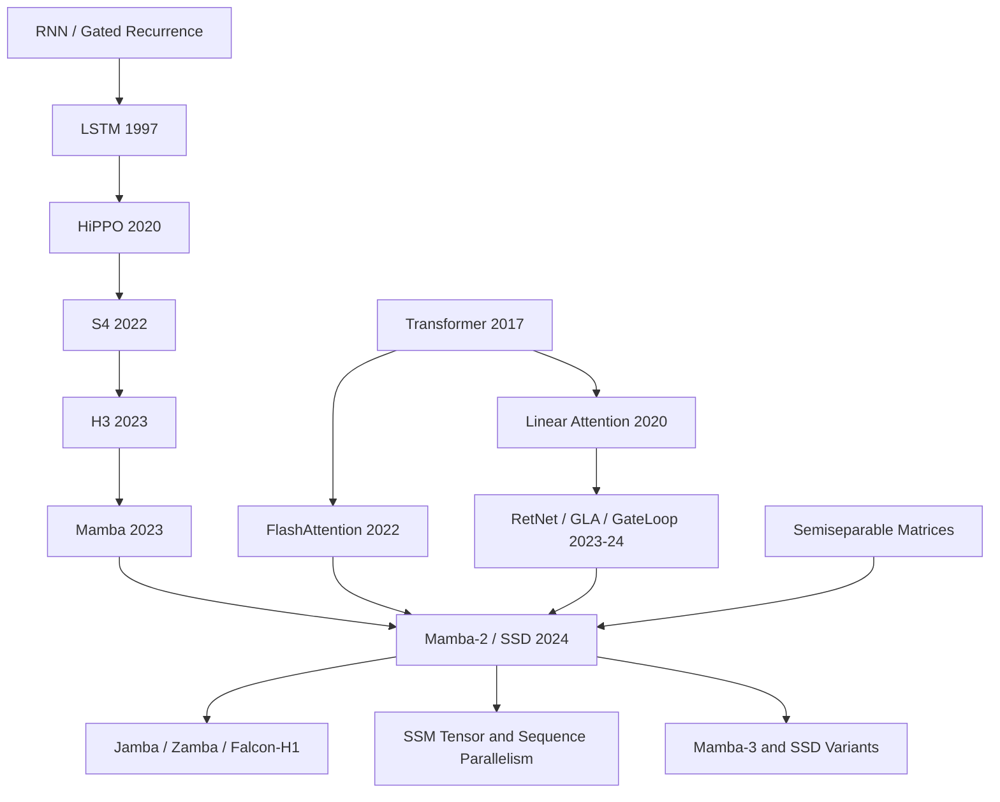

# Mamba-2 - Transformer 与 SSM 原来共享同一套代数

> **2024 年 5 月 31 日，Tri Dao 与 Albert Gu 上传 [arXiv:2405.21060](https://arxiv.org/abs/2405.21060)，随后发表于 ICML 2024。** 这篇 Mamba-2 论文最有戏剧性的地方，不是又做了一个线性时间模型，而是把两个长期像竞争阵营的对象放到同一张代数桌上：SSM 的递推、attention 的矩阵乘法、半可分矩阵和 GPU 友好的 block 算法，原来可以互相翻译。它没有宣布 Transformer 过时；相反，它告诉读者，真正该追问的是：当 attention 的工程红利能被 SSM 继承时，长上下文模型的默认构件还必须只有 KV cache 吗？

## 一句话总结

Tri Dao 与 Albert Gu 2024 年发表于 ICML 的 Mamba-2 论文，把 Mamba 之后的选择性 SSM 从“一个很快的递推层”提升成一套叫 structured state space duality 的共同语言：SSM 的矩阵形式可以写成 $M_{ji}=L_{ji}(C_j^\top B_i)$，其中 $L$ 是半可分结构；而某些 structured masked attention 也拥有同一个线性递推形态。被替代的失败 baseline 不是单个模型，而是三类假设：Mamba-1 的 fused scan 在 state size 变大时线性变慢，线性 attention 只证明了 recurrence 却没有给 SSM 一套系统化矩阵算法，纯 Transformer++ 在长序列上仍付出 $O(T^2)$ attention 与 $O(T)$ KV cache。Mamba-2 的 SSD algorithm 把对角块用 attention 式矩阵乘法算、离对角块用低秩状态传递算，使核心层比 Mamba selective scan 快 2-8 倍，并在论文报告中于 16K 序列达到相对 FlashAttention-2 约 6 倍速度；2.7B 模型在 Pile 300B token 训练后给出 6.09 PPL 和 60.2 zero-shot 平均分。最反直觉的 lesson 是：Mamba-2 并没有“杀死 attention”，反而证明 attention 与 SSM 的边界可以被代数重写；后来的 hybrid Mamba-attention 路线正是从这个缺口长出来的。

---

## 历史背景

### 2024 年，Transformer 的胜利已经变成成本问题

到 2024 年春天，Transformer 已经不是“是否能工作”的问题，而是“工作得太贵”的问题。GPT-4、Claude、Gemini、LLaMA 3 让工业界接受了一个事实：只要数据、算力、工程和后训练足够强，标准 attention 仍然是语言模型最稳的默认构件。但同一时期，长上下文需求也在迅速膨胀。企业希望把整本书、完整代码仓、长会话历史甚至视频转写放进模型；研究界则在 100K、1M token 上测试 needle-in-a-haystack、retrieval、multi-hop reasoning。attention 的 $O(T^2)$ 训练成本与 $O(T)$ KV cache 在这个场景下不再只是理论缺点，而是直接影响部署成本、batch size 和延迟的工程瓶颈。

这也是 Mamba 系列能在 2023-2024 年突然变得重要的背景。Mamba（2023） 已经证明，选择性状态空间模型不只是 long-range benchmark 上的另类技巧，而可以在语言建模里逼近甚至超过同规模 Transformer；它把输入相关的 $\Delta, B, C$ 引入 SSM，让 RNN 式状态第一次具备 attention 那种按内容写入和读出的能力。但 Mamba-1 仍然有一个不舒服的限制：核心 selective scan 很快，却不像 FlashAttention 那样天然由大矩阵乘法主导；当 state size $N$ 增大，scan 的速度会线性变慢。换句话说，Mamba-1 打开了 SSM 的门，但还没有把 Transformer 十年积累的系统优化红利完整搬过来。

### 线性 attention 与 SSM 的两条线终于相遇

Mamba-2 的标题“Transformers are SSMs”听起来像一句挑衅，实际更像一次和解。线性 attention 早在 2020 年的 “Transformers are RNNs” 就指出，去掉 softmax 或用核特征映射后，causal attention 可以写成递推形式；SSM 传统则从 HiPPO、S4、H3 到 Mamba 一直在问另一个问题：能否用有限状态在线压缩整个历史，并且保留足够的语言建模能力。两条线长期像是在不同社区里各自推进：attention 社区从矩阵乘法、KV cache、FlashAttention 出发，SSM 社区从连续时间系统、卷积核、scan 和状态展开出发。

Dao 与 Gu 的关键观察是：如果把 SSM 写成沿序列维度的矩阵乘法，它对应的矩阵不是任意矩阵，而是半可分矩阵；如果把某些 structured masked attention 写成矩阵乘法，它也会落到类似的结构里。于是，“递推”和“attention-like matrix product”不再是两个模型家族，而是同一个结构对象的两种计算顺序。这一步的历史意义在于，它把过去几年很多孤立经验统一起来：RetNet 的 decay、GLA 的门控、GateLoop 的 surrogate attention、Mamba 的 selective scan，都可以被看成在同一个矩阵结构空间里选择不同约束。

### 作者组合本身就是论文的答案

Tri Dao 与 Albert Gu 是这篇论文最自然也最关键的两位作者。Gu 的路线从 HiPPO、S4、H3 到 Mamba，一直围绕“如何让状态空间模型成为深度学习里的通用序列层”；Dao 的路线从 FlashAttention 到 FlashAttention-2，则专注于“如何把理论上的 attention 变成现代 GPU 上真正快的 kernel”。Mamba-2 正好需要这两种能力同时到场：既要理解 SSM 与 structured matrix 的数学结构，又要知道 H100/A100 上什么样的计算会真的吃满 tensor cores。

这也是为什么 Mamba-2 不是简单把 Mamba-1 的 state size 调大。论文先把模型重新解释为 state space dual layer，再用 block decomposition 把序列矩阵切成小块：块内用 attention 式矩阵乘法，块间用低秩状态传递。这个算法选择几乎是两位作者研究谱系的交点：Gu 给出状态空间与半可分矩阵的语言，Dao 把它变成类似 FlashAttention 的硬件友好计算。

### 工业界正在寻找“不是纯 Transformer，但也不是玩具”的替代品

2024 年的工业路线并没有真的抛弃 Transformer。Jamba、Zamba、Griffin、RecurrentGemma、Falcon-H1 等模型更像是在尝试混合：用 Mamba / SSM 层压低长序列成本，用少量 attention 层保留精确检索和 in-context learning 的强项。Mamba-2 的价值恰好在这里：它没有要求所有人相信纯 SSM 会统治世界，而是给 hybrid 设计一个更清楚的构件。这个构件有固定 state、较大的 state expansion、更接近 attention 的 head 语言，并且能利用矩阵乘法单元。

所以 Mamba-2 的历史位置不是“Transformer 终结者”，而是“把 Transformer 与 SSM 的边界变成可移动的工程边界”。在这之前，讨论往往是二选一：要么接受标准 attention 的质量和成本，要么接受线性模型的效率和质量风险。Mamba-2 之后，问题变成：哪些层需要 softmax attention 的完整历史缓存，哪些层只需要可学习压缩状态，哪些系统优化可以在两边复用？这正是 2024-2025 年长上下文模型真正关心的问题。

## 研究背景与动机

### Mamba-1 的胜利留下了一个系统债

Mamba-1 已经说明 selective SSM 的内容选择能力很重要，但它的 scan kernel 仍然是一个专门为 Mamba 写出的路径。对于小 state size，例如 $N=16$，这条路径足够快；一旦希望 state size 变成 64、128 或 256，以便在 MQAR 这类关联记忆任务中保存更多键值对，scan 的线性变慢就会暴露。Mamba-2 不是从“再发明一种模型层”出发，而是从一个更具体的问题出发：能否让 SSM 保持线性序列复杂度，同时把主要计算改写成现代加速器最擅长的 batched matrix multiplication？

这也是“Transformers are SSMs”这个标题背后的工程动机。如果 Transformer 的强项不仅是表达能力，还有一整套高效矩阵乘法、并行训练、tensor parallel、sequence parallel 的系统生态，那么 SSM 想成为 foundation model 的一等公民，就不能只在渐进复杂度上赢；它还必须接住这些系统能力。

### Mamba-2 想回答的三个问题

第一个问题是理论语言：SSM、linear attention、structured masked attention 是否能放在同一套公式里？论文的回答是 structured state space duality。SSM 的矩阵形式可以写成半可分结构，attention-like 的二次形式也可以落到带结构 mask 的矩阵乘法，两者在 SSD 这个交点相遇。

第二个问题是算法形态：是否存在一种计算方式，既不像纯 recurrent scan 那样难以充分利用矩阵乘法，也不像纯 attention 那样付出 $O(T^2)$ 的序列成本？论文的回答是 SSD algorithm：对角块用二次形式、离对角块用低秩因子和 chunk-level recurrence。

第三个问题是模型价值：把这个层放进语言模型后，是否真的优于 Mamba-1 和 Transformer++？论文报告显示，Mamba-2 在 Chinchilla 风格缩放曲线上 Pareto dominate Mamba 与 Transformer++；2.7B 模型在 Pile 300B token 训练后达到 6.09 validation PPL 与 60.2 zero-shot 平均分，并优于同数据同 tokenizer 的 Pythia-2.8B，甚至对比 Pythia-6.9B 也有竞争力。

### 这篇论文真正的赌注

Mamba-2 的赌注不是“softmax attention 已经过时”。论文在 related work 里明确指出，SSD 并不泛化标准 softmax attention；它只覆盖能用有限特征映射和结构 mask 表达的 attention 变体。真正的赌注是更细的：大部分序列建模层可能并不需要完整保存所有历史 token；如果模型能用可控的 state expansion $N$ 压缩历史，并且这个压缩过程足够内容相关、足够硬件友好，那么大量层可以从 KV cache 经济学里解放出来。

这个赌注后来也被 hybrid 路线部分验证。纯 SSM 在逐字复制、极端 retrieval、某些 in-context learning 任务上仍然吃亏，但把少量 attention 层与大量 Mamba / Mamba-2 层混合，可以在质量和成本之间取得更实用的折中。Mamba-2 因此更像一块新地基：它不替代所有 attention，却让“attention 放在哪里”第一次成为一个可以系统优化的问题。

---

## 方法详解

### 整体框架：把 SSM 写成矩阵，再选择最合适的计算顺序

Mamba-2 的核心不是一个单独 trick，而是一套从表示到算法再到 block 设计的链条。第一步，把选择性 SSM 写成沿序列维度的矩阵变换 $Y=MX$；第二步，证明这个 $M$ 具有半可分结构，条目可以概括为 $M_{ji}=L_{ji}(C_j^\top B_i)$，其中 $L$ 由输入相关的衰减因子累乘形成；第三步，在这个矩阵上选择一种比纯 scan 或纯 attention 更适合 GPU 的乘法算法；第四步，把得到的 SSD layer 放进一个更 tensor-parallel-friendly 的 Mamba-2 block。

这条链条很重要，因为它解释了为什么 Mamba-2 不只是 Mamba-1 的工程加速。Mamba-1 的 selective scan 把模型看成递推；标准 attention 把模型看成矩阵乘法；Mamba-2 则说：二者都只是同一个结构矩阵的不同算法。于是模型设计从“RNN 还是 attention”变成“这个结构矩阵的哪一部分应该用 matmul，哪一部分应该用 state passing”。

| 视角 | 公式/对象 | 计算方式 | Mamba-2 的用法 |
|---|---|---|---|
| Recurrent SSM | $h_t=A_t h_{t-1}+B_t x_t$ | 线性 scan | 负责跨 chunk 的状态传递 |
| Dual attention form | $(L\circ QK^\top)V$ | 二次矩阵乘法 | 负责 chunk 内计算 |
| Matrix mixer | $Y=MX$ | 结构矩阵乘法 | 统一两种视角 |
| SSD algorithm | 半可分 block decomposition | matmul + short scan | 同时要线性复杂度和硬件效率 |

### 关键设计 1：Structured State Space Duality

SSD 先把选择性 SSM 缩到一个更硬件友好的子类。和 Mamba-1 相比，Mamba-2 的 SSD layer 做了两个小但关键的限制：第一，$A_t$ 从一般对角矩阵进一步简化为 scalar times identity，每个时间步的衰减可以看成一个标量；第二，把 head dimension $P$ 从 Mamba-1 近似的 $P=1$ 提高到 64 或 128，和现代 Transformer 的 head 维度对齐。这会稍微牺牲 $A_t$ 的表达自由度，但换来更像 attention 的二次形式和更好的矩阵乘法路径。

SSD 的 dual form 可以写成 $(L\circ QK^\top)V$。它与 softmax attention 的差别有两点：不使用 softmax；额外乘上一个输入相关的一半可分 mask $L$。这个 $L$ 的元素来自 $a_i$ 的累乘，控制位置 $i$ 到 $j$ 之间信息保留多少。换句话说，Mamba-2 没有复刻标准 attention 的“把所有历史 token 留在 KV cache 里”，而是用一个可学习的相对位置/遗忘 mask 来压缩历史。

这也是标题里“Transformers are SSMs”的精确含义：不是说完整 softmax Transformer 等价于 SSM，而是说一大类去 softmax、带结构 mask 的 attention 与一类选择性 SSM 在同一个代数对象上相遇。论文自己也强调，SSD 不泛化标准 softmax attention；它泛化的是可用有限特征映射和结构矩阵表示的 attention-like 机制。

### 关键设计 2：SSD Algorithm，用块内 attention 和块间 state passing 拼起来

如果直接用 recurrent form，序列复杂度是线性的，但很多操作不够像大矩阵乘法；如果直接物化 $M$ 做矩阵乘法，GPU 很舒服，但复杂度回到二次。SSD algorithm 的思路是把 $T\times T$ 的半可分矩阵按 chunk length $Q$ 切成块。对角块代表同一个 chunk 内的相互作用，长度小，可以用 attention 式二次矩阵乘法高效算；离对角块由于半可分结构是低秩的，可以拆成右因子、中心衰减、左因子，用更短的 chunk-level recurrence 传递状态。

论文里的简化伪代码非常像一个“结构矩阵乘法教程”。下面是保留核心顺序的版本：

```python
def ssd_layer(X, A, B, C, block_len=64):
    # X: value-like input, A: decay gates, B/C: key/query-like SSM factors
    X, A, B, C = chunk(X, A, B, C, length=block_len)
    A_cumsum = cumsum(A, dim="within_chunk")

    # 1. Diagonal blocks: compute interactions inside each chunk.
    L = exp(segment_sum(A))
    Y_diag = einsum("C, B, L, X -> Y", C, B, L, X)

    # 2. Right factors: summarize each chunk into a recurrent state.
    states = einsum("B, decay, X -> h_chunk", B, A_cumsum, X)

    # 3. Center factors: pass states between chunks with a short scan.
    states = chunk_scan(states, A_cumsum[:, :, -1])

    # 4. Left factors: convert incoming chunk states back to outputs.
    Y_off = einsum("C, states, decay -> Y", C, states, A_cumsum)
    return unchunk(Y_diag + Y_off)
```

如果设 $N=P=Q$，总训练 FLOPs 是 $O(TN^2)$，推理状态显存是 $O(N^2)$，主要工作由 $(N,N)$ 级别的 batched matmul 组成。相比之下，标准 attention 的训练 FLOPs 是 $O(T^2N)$，而朴素线性 SSM 虽然也是 $O(TN^2)$，但难以同样充分使用矩阵乘法单元。Mamba-2 的算法贡献正在这里：它没有改变线性模型压缩历史的本质，却把计算形态改得更像现代 Transformer kernel。

### 关键设计 3：Mamba-2 Block，把参数投影改成并行生成

Mamba-1 的 block 是 SSM-centric：先把输入投影成 SSM 输入 $X$，再由 $X$ 产生 $A,B,C$ 等参数。Mamba-2 改成 SSD-centric：SSD layer 被看成 $A,X,B,C\mapsto Y$，所以这些分支可以在 block 开头一次性并行投影出来。这一点看似架构小修，实际影响 tensor parallel 很大。它让 Mamba-2 更接近 Transformer 里 $Q,K,V$ 同时生成的模式，也把每个 block 的同步点减少到更适合 Megatron-style sharding 的形式。

此外，Mamba-2 在输出投影前加入额外 normalization，类似 NormFormer 在 attention/MLP 末端补 norm 的思路。原因也很朴素：更大模型里乘性门控、state expansion 和输入相关衰减会带来训练不稳定；额外 norm 能让输出投影前的尺度更可控。最后，Mamba-2 使用 multi-input SSM / multi-value attention 头模式：$X$ 有多个 head，而 $B,C$ 在这些输入通道之间共享。这保留了 Mamba 原本的 SSM 归纳偏置，也比直接照搬 multi-head attention 的模式更适合该层。

| 设计轴 | Mamba-1 | Mamba-2 | 动机 |
|---|---|---|---|
| 参数生成 | 由 SSM input 串行派生 $A,B,C$ | 开头并行生成 $A,X,B,C$ | 更适合 tensor parallel |
| 核心算法 | selective scan | SSD block decomposition | 让主要计算走 matmul |
| state size | 常见 $N=16$ | 常见 $N=64/128$，可更大 | 提高关联记忆容量 |
| normalization | 较少额外 norm | 输出投影前额外 norm | 稳定大模型训练 |

### 关键设计 4：从 attention 借词汇，但不照搬 softmax

Mamba-2 最有启发的地方，是它开始让 SSM 使用 attention 的词汇：head dimension $P$ 类似 value head，state size $N$ 类似 key/query head 维度，multi-query / grouped-query 的想法也能迁移成 multi-contract、multi-expand、multi-input SSM 模式。这样做的收益不只是类比好懂，而是让已有 Transformer 工程经验有落脚点。例如，sequence parallel 可以被解释成把序列按 chunk 分给不同设备，每个设备计算本段 state，再把 recurrent state 传给下一个设备；variable sequence length 也可以不用 padding 地处理，因为状态传递天然知道每段边界。

但论文也没有把 attention 的所有东西搬进来。作者尝试了线性 attention 文献里的 kernel feature map、denominator normalization、Based / ReBased 风格的二次特征映射等变体，最后默认仍选择 Swish / SiLU 类特征映射和 Mamba 风格的 head pattern。这里的负结果很重要：Mamba-2 的成功不是“SSM 终于变成 attention”，而是“SSM 吸收 attention 的系统语言后，仍保留自己压缩状态和选择性递推的核心”。

---

## 失败案例

### Baseline 1：Mamba-1 的 selective scan 不是无限可扩展

Mamba-1 是 Mamba-2 的直接前身，也是最重要的 baseline。它的问题不是质量差，而是核心 scan 算法在 state size 增大时变得不够理想。语言建模和 MQAR 这类多键值关联记忆任务都提示：更大的 state size 可以保存更多信息；但 Mamba-1 的优化 selective scan 会随 $N$ 增大明显变慢。论文 Figure 5 右图强调，在 4K 序列长度下，Mamba optimized scan 随 state expansion 基本线性变慢，而 SSD 能在更大的 state expansion 下保持较小 slowdown。

这让 Mamba-1 在 2024 年的位置有点尴尬：它证明了 selective SSM 是正确方向，却没有给“大 state + 大模型 + 多 GPU”一个足够自然的系统答案。Mamba-2 的 SSD algorithm 正是针对这个失败点：把长 scan 缩短成 chunk-level scan，把更多计算转成矩阵乘法，使 $N=64$ 甚至更大的设置变得可用。

### Baseline 2：线性 attention 有递推形式，但缺少 SSM 级别的状态结构

线性 attention 早就知道可以把 causal attention 写成递推，但很多方法只是在 softmax attention 的核近似上做文章。Performer、Linear Transformer、Based、ReBased 等路线通常会问：如何近似 $\exp(QK^\top)$ 或怎样选择 feature map $\psi$？这个问题很重要，却没有自动给出一个适合 SSM state expansion、chunk recurrence、multi-input head pattern 的系统化模型。

Mamba-2 对这些 baseline 的态度不是简单否定，而是吸收后再筛选。论文尝试把 kernel feature map、normalization denominator、Based / ReBased 的二次特征等带入 SSD，最后并未把它们作为默认配置。失败原因可以概括为：attention-centric 的线性化方法保留了太多“我要近似 softmax attention”的目标，而 Mamba-2 真正需要的是“我要用有限状态压缩历史，并让这个有限状态足够大、足够快、足够稳定”。

### Baseline 3：纯 Transformer++ 质量稳，但长序列经济学没有变

Transformer++ 是论文里最强的现代 Transformer recipe baseline，包含 RoPE、SwiGLU、RMSNorm、无 bias、高学习率等 LLaMA/PaLM 风格设置。它的优势是成熟：训练稳定、ICL 强、生态完整、系统 kernel 丰富。Mamba-2 没有装作这个 baseline 很弱；相反，论文把它作为 scaling curve 上必须正面比较的对象。

问题在于，Transformer++ 的基本经济学没有改变。训练 attention 仍然有 $O(T^2)$ 序列项，推理仍然需要随上下文长度增长的 KV cache。FlashAttention-2 可以把常数压得很低，却不能把状态大小从 $T$ 变成可控的 $N$。Mamba-2 的速度实验给出更清楚的对比：SSD 在 2K 序列附近与 FlashAttention-2 交叉，在 16K 序列上论文报告约 6 倍速度优势。这不是说 Transformer++ 没用，而是说当目标是长上下文吞吐和状态内存时，它输在问题定义上。

### Baseline 4：纯 SSM 仍不等于完整 attention

Mamba-2 也诚实暴露了自己的边界。论文 related work 明确说明，SSD 不泛化标准 softmax attention；相比完整 attention，它用可控 state expansion $N$ 压缩历史，而 attention 的 KV cache 保留整个长度 $T$ 的历史。当任务需要逐字复制、精确 retrieval、复杂 in-context lookup 时，这种压缩会成为风险。MQAR 实验显示 Mamba-2 明显强于 Mamba-1，甚至在某些设置中优于 vanilla attention，但论文也承认更多问题仍待理解。

这解释了为什么 2024 年之后很多生产架构走向 hybrid。Jamba 显示，少量 attention 层和大量 Mamba 层组合能取得很强语言建模效果；Falcon-H1、Zamba 等后续系统也采用类似思路。Mamba-2 的失败案例不是“它没有彻底替代 attention”，而是“它让我们终于能精确讨论哪些能力必须靠 attention，哪些能力可以靠 compressed state”。

## 实验关键数据

### 速度与状态大小：SSD 的核心胜利

论文最抓人的系统数字集中在 SSD layer benchmark。专门实现的 SSD 比 Mamba optimized selective scan 快 2-8 倍；在序列长度约 2K 时超过 FlashAttention-2，并在 16K 序列上报告约 6 倍速度优势。更重要的是，它允许比 Mamba-1 大 8 倍甚至更高的 recurrent state size，而 slowdown 很小。这直接对应方法章节的核心主张：SSD 不是只在复杂度表上好看，它真的把计算搬到了 GPU 喜欢的形状。

| 对比项 | Mamba-1 selective scan | FlashAttention-2 | Mamba-2 SSD |
|---|---:|---:|---:|
| 序列复杂度 | $O(TN^2)$ | $O(T^2N)$ | $O(TN^2)$ |
| 推理状态 | $O(N^2)$ | $O(TN)$ KV cache | $O(N^2)$ |
| 主导计算 | scan / elementwise | matrix multiplication | matrix multiplication + short scan |
| 论文报告速度 | baseline | 2K 前较强 | scan 的 2-8 倍，16K 对 FA-2 约 6 倍 |

### 语言建模：不是只快，也能上 scale

在 Pile 300B token 训练设置下，Mamba-2 在各个模型大小上都优于 Mamba，并且通常能匹配两倍参数的 Pythia。最常被引用的一行是 2.7B 模型：Pile validation PPL 6.09，LAMBADA PPL 4.10，LAMBADA acc 69.7，HellaSwag 66.6，PIQA 76.4，Arc-C 36.4，WinoGrande 64.0，OpenBookQA 38.8，zero-shot 平均 60.2。论文还指出，Mamba-2-2.7B 优于 Mamba-2.8B、Pythia-2.8B，甚至超过同数据训练的 Pythia-6.9B。

| 模型 | Pile PPL | HellaSwag | PIQA | WinoGrande | Average |
|---|---:|---:|---:|---:|---:|
| Pythia-2.8B | 6.73 | 59.3 | 74.0 | 59.7 | 55.7 |
| Mamba-2.8B | 6.22 | 66.1 | 75.2 | 63.5 | 59.9 |
| Mamba-2-2.7B | 6.09 | 66.6 | 76.4 | 64.0 | 60.2 |
| Pythia-6.9B | 6.51 | 63.9 | 76.3 | 61.1 | 58.7 |

### 关联记忆：state size 不是装饰参数

MQAR 是 Mamba-2 用来测试“有限状态能否记住多个键值关联”的合成任务。它比 Mamba-1 的 selective copying 和 induction heads 更难，因为模型要保存多个 key-value pair，并在后面根据 query 找回对应 value。论文报告显示，Mamba-1 在更难设置下吃力，而 Mamba-2 在控制 state size 的情况下也明显更好；当 state size 从 $N=16$ 增到 $N=64$、$N=256$，表现持续提升。这说明 state expansion 不是参数表上的装饰，而是 compressed-state 模型处理 lookup 类任务的核心容量。

这个结果也让 Mamba-2 的算法选择更有说服力。如果更大 state size 没用，那么 SSD 允许大 $N$ 的意义会小很多；如果更大 $N$ 有用但计算太慢，那么 Mamba-1 的 scan 会卡住。MQAR 正好把这两个条件连起来：模型确实需要更大 state，SSD 也确实让更大 state 变得可训练。

---

## 思想史脉络

### 前世：从在线压缩到结构矩阵

Mamba-2 的祖先不是单线的。第一条线是 RNN / gated recurrence：LSTM、GRU、SRU、RWKV 都在尝试用有限状态承载长期信息，只是它们通常缺少 SSM 那种大 state expansion。第二条线是结构化 SSM：HiPPO 给出在线压缩长信号的数学框架，S4 把它变成可训练的长序列层，H3 和 Mamba 逐步加入门控与选择性，让语言建模终于可行。第三条线是 attention 系统工程：Transformer 证明了矩阵乘法式 token mixing 的上限，FlashAttention 证明了“算法等价不够，I/O 和 kernel 形态决定能否成为工业默认”。

Mamba-2 的特别之处，是它没有简单站在其中一条线里。它把 SSM 的状态压缩、linear attention 的递推双重性、FlashAttention 的硬件意识和半可分矩阵的数值线代语言接到一起。也因此，它像一篇“中介论文”：它不只给后人一个模型，还给后人一种翻译方式，让注意力模型、RNN、SSM、structured matrix mixer 可以互相解释。



### 今生：Mamba-2 把“混合架构”变得更有原则

Mamba-2 之后，混合 Mamba-attention 架构不再只是经验拼装。过去的 hybrid 很容易变成“堆几层 attention，再堆几层 RNN，调参看结果”。SSD 提供了更原则化的语言：attention 的完整历史缓存与 SSM 的有限压缩状态是同一个序列矩阵问题的两种状态表示；multi-query attention、grouped-query attention 可以迁移成 multi-input / grouped-input SSM；sequence parallel 可以被解释成 chunk 状态传递。这样一来，混合模型可以更清楚地讨论层的角色：哪些层负责精确 retrieval，哪些层负责长距离压缩，哪些层负责局部或中程 mixing。

Jamba、Zamba、Falcon-H1 这类后续模型没有都复现 Mamba-2 的全部细节，但它们继承了这篇论文提供的问题意识：纯 attention 成本太高，纯 recurrence 质量风险太大，真正有用的是能够在系统层面组合二者。Mamba-2 的影响因此不只在“是否使用 SSD layer”，也在“如何描述和评估 SSM-attention tradeoff”。

### 误读：标题不是在宣布 Transformer 已死

最常见的误读是把标题读成“Transformer 已经过时”。论文实际更克制。它说的是 structured state space duality：某些 SSM 与某些 structured masked attention 有共同代数形式；标准 softmax attention 并不被 SSD 泛化。softmax 带来的归一化、稀疏选择、attention sink、复制能力和完整 KV cache 仍然有独立价值。Mamba-2 没有否定这些能力，只是说明其中一部分可以由有限状态和结构 mask 来近似或替代。

第二个误读是把 Mamba-2 当成纯理论论文。其实它的理论目标非常工程化：一旦把 SSM 看成半可分矩阵，就能设计 block decomposition algorithm，让主计算走矩阵乘法。这种理论不是为了漂亮等价，而是为了改变 kernel shape。第三个误读是把 state size 看成普通超参。MQAR 和速度实验共同说明，state size 决定 compressed model 的记忆容量，而 SSD 决定这个容量能不能在现代 GPU 上负担得起。

---

## 当代视角

### 站不住的假设：线性时间本身足以赢

2026 年回看，Mamba-2 最值得保留的 lesson 不是“线性时间模型一定会取代 attention”。过去几年已经反复说明，单靠 $O(T)$ 复杂度不够。很多线性 attention、长卷积、稀疏 attention、RNN 变体都曾经在复杂度表上漂亮，却在语言建模质量、ICL、复制任务或系统实现上失败。Mamba-2 的真正突破是把三件事同时对齐：内容相关的选择性、足够大的可控状态、硬件友好的矩阵乘法。

因此，一个站不住的假设是“只要序列复杂度低，就能成为长上下文默认层”。长上下文模型真正需要的是可检索、可压缩、可并行、可部署的组合。Mamba-2 在压缩和并行上很强，但对精确 retrieval 的全部问题没有一劳永逸的答案。这也是后来的 hybrid 路线更现实的原因：attention 处理需要原文级访问的层，SSM 处理大量可压缩历史，二者共享系统优化语言。

### 如果今天重写：会更早把 hybrid 和 retrieval 纳入主实验

如果今天重写 Mamba-2，最可能加强的不是 SSD 理论，而是实验矩阵。论文已经包含 MQAR 和语言建模，但 2024-2026 年的长上下文评测已经更强调真实 retrieval、multi-hop QA、code repository reasoning、长文档一致性和 tool-use trace。新版论文大概会把纯 Mamba-2、不同 attention 插层比例、sliding/local attention、retrieval-augmented memory 放在同一个 scaling study 里，直接回答“多少 attention 层足够”。

第二个会被加强的是 inference 经济学。Mamba-2 已经讨论 tensor parallel、sequence parallel、variable sequence length，但今天的读者会更关心服务端指标：prefill throughput、decode latency、batching、state cache 布局、量化后状态误差、和 speculative decoding / paged KV 系统的兼容性。换句话说，今天的 Mamba-2 可能会更像一篇 architecture + systems + serving paper，而不仅是 architecture + algorithm paper。

### 仍然成立的经验：代数统一能创造工程路线

Mamba-2 最经得起时间检验的部分，是“代数统一不是为了好看，而是为了打开实现空间”。FlashAttention 的经验是：重新排列等价计算，可以把 attention 从显存带宽瓶颈变成 SRAM 友好的 kernel。Mamba-2 的经验是类似的：重新把 SSM 看成半可分矩阵，可以把 scan-heavy 层变成 matmul-heavy 层。这个思想后来会继续出现在高效模型里：先找共同结构，再从结构里选择最适合硬件的计算顺序。

这对研究者有一个很实际的启发。不要只问“这个新层的复杂度是多少”，还要问“它的主导操作是什么，能不能被 tensor cores 吃掉，能不能被并行切分，能不能在 serving 时保持状态紧凑”。Mamba-2 把这些问题提前放进模型设计，而不是留给后来的 kernel 工程师补救。

## 局限与展望

### 局限：SSD 的表达边界与评测边界都还清楚存在

第一，SSD 不覆盖标准 softmax attention。softmax 的归一化、非线性竞争和保留完整历史的能力，不能简单由有限 state 替代。第二，Mamba-2 的主实验最大到 2.7B/300B tokens，已经足够说明趋势，但距离今天几十 B、上万亿 token、复杂后训练的模型仍有尺度差距。第三，MQAR 虽然比 selective copying 更难，但仍然是合成任务；真实长上下文任务会把 retrieval、reasoning、噪声鲁棒性和指令跟随交织在一起。

第四，状态压缩的可解释性仍然不足。Transformer 的 attention map 虽然常被误用，但至少给了一个可视化入口；SSM state 的信息如何编码、何时遗忘、是否形成类似 induction head 的机制，还需要更好的 probing 和 mechanistic interpretability 工具。论文 related work 提到 attention sinks 是否存在于 Mamba 模型中，这个问题到今天仍然很值得继续做。

### 展望：下一步不是纯 SSM，而是可编排的状态层

更可能的未来不是“所有层都换成 Mamba-2”，而是状态层成为模型架构里的可编排资源。某些层保存短期精确信息，某些层压缩长程语义，某些层调用外部检索，某些层保留 full attention 以处理复制与对齐。Mamba-2 的贡献是让 SSM 层足够快、足够大、足够像 Transformer 系统构件，从而可以被纳入这种编排。

另一个方向是把 SSD 推到非因果和多模态任务。视觉、音频、视频、基因序列都天然有长序列或高分辨率结构，但它们对“完整历史缓存”的需求不同。半可分矩阵和 structured masked attention 的语言可能帮助设计更适合 bidirectional、2D/3D、streaming 或 event-based 数据的状态层。Mamba-2 给出的不是最终答案，而是一把结构钥匙。

## 相关工作与启发

### 与 Mamba、RetNet、GLA、GateLoop、Jamba 的关系

Mamba-1 给出 selective SSM 和硬件感知 scan，是 Mamba-2 的直接父辈。RetNet、GLA、GateLoop 等并行工作从 attention 或 gated linear recurrence 方向走向相似区域：都有 decay、chunkwise、dual recurrent/parallel forms。Mamba-2 的不同点在于，它把这些现象组织成 structured state space duality，并选择 Mamba 风格的 multi-input SSM 头模式，而不是完全沿用 attention-centric 的 MHA/MQA 直觉。

Jamba 和后续 hybrid 模型则更像 Mamba-2 的现实应用注脚。它们不一定证明“纯 Mamba-2 最好”，却证明“SSM 与 attention 的组合值得系统设计”。Mamba-2 让这种组合有了更坚实的算法构件，也让后续模型可以更具体地讨论 state size、attention frequency、sequence parallel 和 serving cache。

### 对系统研究的启发

Mamba-2 也是一篇系统研究范式论文。它提醒我们，模型结构的命运常常由 kernel shape 决定。Mamba-1 有好的渐进复杂度和不错的质量，但 scan-heavy；Mamba-2 把同一个数学对象重新分块，让矩阵乘法成为主角。这个思路适用于很多方向：高效 attention、MoE routing、视频生成、长音频模型、科学序列模型，都可能从“先找结构矩阵，再设计硬件友好乘法”中受益。

更具体地说，Mamba-2 提供了一种写论文的范式：先证明两个看似不同的模型族共享结构；再用这个结构设计一个新算法；最后把算法的系统收益和模型质量放在同一张 scaling 图里验证。这样的论文不只回答“模型能不能跑”，也回答“为什么这个模型现在能成为基础设施”。

## 相关资源

### 论文与代码

- 论文：Tri Dao and Albert Gu, [Transformers are SSMs: Generalized Models and Efficient Algorithms Through Structured State Space Duality](https://arxiv.org/abs/2405.21060), ICML 2024.
- PMLR 页面：https://proceedings.mlr.press/v235/dao24a.html
- 官方代码：https://github.com/state-spaces/mamba
- 直接前作：Mamba - Linear-Time Sequence Modeling with Selective State Spaces
- 关联阅读：FlashAttention / FlashAttention-2、S4、H3、RetNet、GLA、GateLoop、Jamba。


---

> 🌐 [English version](/en/era5_genai_explosion/2024_mamba2/) · 📚 awesome-papers project · CC-BY-NC