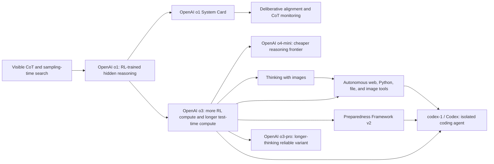

# OpenAI o1 -> o3/o4-mini - 推理模型从 test-time compute 走向 agent

> **2024 年 9 月 12 日，OpenAI 发布 [Learning to Reason with LLMs](https://openai.com/index/learning-to-reason-with-llms/)，把“回答前先想一会儿”从 prompt 技巧改写成模型族定位；12 月 5 日又发布 [OpenAI o1 System Card](https://openai.com/index/openai-o1-system-card/)，把能力、风险和部署边界放在同一张账本里。** o1 的震动不在于公开了某个可复现算法，恰恰相反：OpenAI 没有披露完整训练配方，却公开展示了训练时计算、测试时计算和强化学习推理能力的共同扩展。AIME、Codeforces、GPQA、MMMU 与越狱评测一起说明，推理模型不是“更会聊天的 GPT-4o”，而是一个新的产品和安全范式：模型先在隐藏思维链里推演，再把可见答案交给用户。

## 一句话总结

OpenAI 从 2024 年的 o1 到 2025 年的 o3、o4-mini、o3-pro 与 codex-1，公开定义了一条完整的推理模型家族：o1 先把 hidden CoT、training-time compute 和 test-time compute 绑定成新范式，可以用 $p(y,a_{1:T}\mid x,v,f)=\sum_z p_\theta(y,a_{1:T}\mid x,v,f,z)p_\theta(z\mid x,v,f)$ 这种抽象来理解其中的隐藏推理轨迹与动作策略；随后 o3 把大规模强化学习和测试时思考继续放大一个数量级，o4-mini 把同类能力推到更好的成本效率前沿，o3-pro 把“想更久换更稳”做成明确 SKU，而 codex-1 则把 o3 派生为会在隔离容器里读写文件、运行测试并给出证据的软件工程 agent，这条分离的快答/深思路线最终又汇入 [GPT-5](2025_gpt5.md) 的自动路由系统。能力侧，o1 在 AIME 2024 pass@1 为 74.4%，而官方又报告了 **允许调用 Python** 时 o4-mini 在 AIME 2025 上的 99.5% pass@1 与 o3 的 98.4% pass@1，但这些 tool-conditioned 分数不能与无工具结果直接混比；安全侧，o1 用 deliberative alignment 与 CoT monitor 首次把推理过程纳入系统卡，o3/o4-mini 则成为 Preparedness Framework v2 下的首个发布版本，并把 reasoning monitor、系统级 mitigations 与容器边界一起推到前台。它真正改变的，不只是模型会不会想，而是模型会不会在边界内自己搜、自己算、自己看、自己改、自己测。

---

## 历史背景

### 从 CoT prompting 到推理模型

o1 的历史起点不是 2024 年突然出现的“聪明模型”，而是 2022 年之后 LLM 社区对 chain-of-thought 的集体重新认识。Chain-of-Thought Prompting 证明，只要让模型显式写出中间步骤，数学和符号推理任务会明显变好；随后 Self-Consistency、Tree-of-Thoughts、程序辅助推理、工具调用和 verifier reranking 都在同一个方向上加码：不要直接给答案，而是在答案之前展开搜索、分解和检查。

但是这些方法大多把推理当作推理时技巧。用户写“Let's think step by step”，研究者采样多条 reasoning path，再用投票或评分器选答案。模型本身没有被公开训练成“把内部计算系统性花在难题上”的产品。GPT-4o 时代的主流交互仍然是快速回答，必要时由 prompt 激发更长的解释。o1 的关键转折，是 OpenAI 把“先思考”变成模型族的训练目标和产品形态：模型在隐藏 chain-of-thought 中推演，用户看到的是整理后的答案或摘要。

| 阶段 | 代表事件 | 推理接口 | 局限 |
|---|---|---|---|
| 2022 | Chain-of-Thought Prompting | 用户显式要求分步思考 | 依赖 prompt，稳定性有限 |
| 2022-2023 | Self-Consistency / verifier reranking | 多样本采样与投票 | 计算外置，训练目标未必匹配 |
| 2023 | GPT-4 Technical Report | 强能力但闭源 recipe | 推理机制和训练细节不透明 |
| 2024 | OpenAI o1 | RL 训练出的隐藏 CoT + test-time compute | 公开材料仍不可复现 |

### 2024 年 9 月：把“想得久”变成能力曲线

OpenAI 在 2024 年 9 月 12 日发布 o1-preview 与《Learning to Reason with LLMs》时，真正抓住外界注意力的不是单个榜单，而是两张扩展曲线：o1 的表现随强化学习训练计算增加而提升，也随测试时思考计算增加而提升。此前 LLM scaling 的默认叙事是预训练算力、参数和数据；o1 把另一个轴推到台前：同一道题可以分配更多内部推理预算，模型在给出答案前尝试策略、发现错误、修正路径。

这解释了为什么 o1 的发布语气不像普通模型升级。OpenAI 不只是说“新模型更强”，而是说“我们训练了一个会利用 chain-of-thought 进行富有成效思考的模型”。AIME 2024、Codeforces、GPQA Diamond 和 MMMU 这些任务共同指向同一类能力：题目不能只靠常识补全，需要多步搜索、约束跟踪、数学变形、代码调试或科学知识组合。o1 在这些地方相对 GPT-4o 的跃迁，说明推理预算本身变成了一种可扩展资源。

### 2024 年 12 月：系统卡让能力和风险同桌

12 月 5 日的 OpenAI o1 System Card 把 o1 的另一面补上：推理能力不仅提高数学、代码和科学表现，也改变安全评估的形状。系统卡开篇明确说，o1 系列通过大规模强化学习学习使用 chain-of-thought；这种能力给安全和稳健性带来新机会，也可能提高风险。报告同时评估 disallowed content、jailbreak、hallucination、bias、instruction hierarchy、CoT deception monitoring、external red teaming、Preparedness Framework、CBRN、persuasion、model autonomy 与 multilingual performance。

这份系统卡的历史价值在于，它把“能力发布”和“治理文本”绑在一起。o1 不是只在榜单上打败 GPT-4o 的模型，也不是只给 ChatGPT 用户一个慢一点的高级选项；它要求开发者、红队、监管者和研究者一起面对一个新问题：如果模型能在隐藏推理轨迹里计划、验证和修正，那么安全方法是否也必须进入这个推理过程？OpenAI 的回答是 deliberative alignment、instruction hierarchy、CoT 摘要与 CoT 监测，但它也承认 faithful CoT 仍是开放问题。

## 研究背景与动机

### 动机：把计算花在答案前

o1 背后的动机可以概括为一句话：让模型在输出前消耗更多有用计算，而不是把所有能力都压进一次快速前向回答。普通聊天模型往往像快速反射系统：读 prompt，直接生成答案，最多在可见文本里解释。推理模型则更像考试时打草稿：先在内部空间尝试路线，遇到矛盾就回退，必要时重写思路，然后输出最终答案。OpenAI 把这种能力与强化学习绑定起来，意味着训练目标不只是“答案像人类偏好”，还包括“推理过程能提高最终正确性”。

这与传统 RLHF 有细微但重要的差别。RLHF 通常优化回答的偏好、帮助性和安全性；o1 的公开叙事强调模型学习“refine their thinking process, try different strategies, and recognize their mistakes”。换言之，优化对象从可见回答扩展到回答前的内部认知过程。公开材料没有说明 reward 如何构造，但动机已经足够清晰：如果困难任务需要搜索，那么训练就应该奖励会搜索的模型。

### 披露边界：这不是可复现论文

理解 o1 时必须把历史影响和复现价值分开。o1 是一个改变方向的技术报告和系统卡，不是一篇开放算法论文。OpenAI 没有公开模型规模、完整数据组成、RL 算法、reward 设计、采样策略、优化器、训练轮数、CoT 格式或系统提示。官方图表说明扩展趋势，官方表格说明 benchmark 和 safety eval 结果，但不能让外部团队从文本直接训练一个 o1。

这并不削弱它的历史地位，反而说明 2024 年 frontier AI 的一个现实：最重要的研究对象越来越多以闭源系统卡、产品发布和定性/定量混合评估出现。o1 的读法因此要双轨并行。一方面，它公开展示了 test-time compute 与 RL-for-reasoning 的强信号；另一方面，任何细节化 recipe 都必须被标注为解释或猜测，不能写成 OpenAI 已披露事实。

---

## 方法详解

这篇母篇如果只写 o1 的“隐藏 CoT + test-time compute”，现在已经不够了。到 2025 年，官方材料已经把同一路线扩展成一个更完整的系统：o3 展示持续的 RL scaling，o4-mini 展示更低成本的推理前沿，o3/o4-mini 展示 tool-native reasoning 与 thinking with images，而 Codex 增补系统卡又把这套能力落进隔离容器里的软件工程 agent。方法详解因此不能再只解释“模型先想再答”，而要解释“模型如何在思考过程中调配预算、工具、视觉输入和安全约束”。

### 公开事实与结构化解释的边界

仍然要先把边界划清。OpenAI 公开了产品行为、部分评测、系统卡和容器边界，但没有公开完整训练 recipe。下面这张表把能说与不能说的层级拆开：

| 层级 | 公开事实 | 结构化解释 | 不应假装知道 |
|---|---|---|---|
| RL scaling | o1 与 o3 都随训练计算和测试时计算增加而提升 | 推理预算是独立 scaling 轴 | 具体 reward、优化器、采样细节 |
| 隐藏推理 | 模型先在隐藏 CoT 中思考，再给用户答案或摘要 | 隐变量 $z$ 承载搜索、验证和修正 | 原始 CoT 文本与忠实性 |
| 工具策略 | o3/o4-mini 被训练成会决定何时使用工具 | 动作策略与语言策略联合优化 | 工具路由器实现与训练数据 |
| 视觉推理 | 图像可直接进入思维链，并在推理中被旋转、缩放、转换 | 视觉状态成为 reasoning state 的一部分 | 具体视觉编码与内部接口 |
| Agent runtime | codex-1 在独立容器中读写文件、跑测试、给出证据 | 推理模型开始承担可执行工作流 | 完整 orchestration stack 与 internal policies |

### 整体框架：隐藏推理轨迹、动作策略与多模态状态一起工作

如果只用 o1 时代的写法，reasoner 可以被概括成“问题 $x$ 进入隐藏轨迹 $z$，再产出答案 $y$”。到了 o3/o4-mini 与 Codex，这个框架需要再多两类变量：一类是视觉与文件状态，例如图像 $v$、文件上下文 $f$；另一类是工具动作序列 $a_{1:T}$。一个方便理解但并非 OpenAI 官方公式的抽象写法是：

$$
p(y,a_{1:T}\mid x,v,f)=\sum_z p_\theta(y,a_{1:T}\mid x,v,f,z)\,p_\theta(z\mid x,v,f).
$$

这里的重点不是公式本身，而是接口变化。o1 时代，最核心的问题是“是否给模型更多思考时间”；到 o3/o4-mini，问题变成“是否让模型在思考过程中主动搜索网页、调用 Python、查看文件、处理图像，再把这些结果并回隐藏轨迹里”；到 codex-1，则进一步变成“是否允许模型在受限环境里直接改文件并运行验证命令”。这说明 reasoning model 的运行时已经从单纯生成文本，扩展到管理一小段任务执行过程。

| 组件 | 输入 | 输出 | 公开材料中的作用 |
|---|---|---|---|
| Reasoning policy | 文本问题、图像、文件上下文 | 隐藏 CoT | 负责分解问题、搜索路线、修正错误 |
| Tool policy | 隐藏 CoT 与可用工具 | 动作序列 | 决定何时搜索、何时写 Python、何时读文件 |
| Multimodal state | 图像、图表、草图 | 视觉中间表示 | 让图像直接参与推理 |
| Answer head | 推理结果与工具返回值 | 用户可见答案 | 组织最终解释或结论 |
| Safety monitor | 请求、轨迹、动作上下文 | 拒绝、升级或拦截 | 把 deliberative alignment 与系统级缓解接进运行时 |

### 关键设计 1：RL scaling 把推理预算变成真正可扩展的轴

o1 公开了“训练时计算 + 测试时计算”两条曲线，o3 则把这条观察往前推进。官方明确说，在开发 o3 的过程中，他们观察到大规模强化学习仍然保持“计算量增加，性能持续提升”的趋势，并且把训练计算量和推理时思考都提高了一个数量级。更重要的是，官方同时声称，在 ChatGPT 中保持与 o1 相同的延迟和成本时，o3 依然能给出更高性能；若允许更长时间思考，性能还会继续提升。

这意味着推理预算不再只是“延迟副作用”，而是系统必须认真调度的第一等资源。一个用于理解的目标函数仍然可以写成：

$$
\max_\theta\;\mathbb{E}[R(x,z,a,y)]
\quad\text{subject to}\quad
\mathrm{compute}(z,a)\le B(x),
$$

其中 $B(x)$ 不是官方变量，但它提醒我们：一部分能力来自参数，一部分能力来自为这次任务分配多少内部搜索与外部调用预算。o4-mini 的历史意义也正在这里。它不是削弱版 reasoner，而是把同类推理行为放到更低成本、更高吞吐的前沿上。

| 版本 | 公开 scaling 信号 | 产品含义 | 代价 |
|---|---|---|---|
| o1 | 训练时与测试时计算同时带来收益 | 把慢思考变成能力来源 | 延迟和成本上升 |
| o3 | RL scaling 再提高一个数量级 | 同成本下更强，长思考下更强 | 系统调度更复杂 |
| o4-mini | 以更小体量追求高性价比推理 | reasoner 进入高吞吐场景 | 单次最强性能未必最高 |

### 关键设计 2：模型学会决定何时用 web、Python、file、image 工具

o3/o4-mini 最重要的新结构，不是“支持工具”本身，而是官方明确强调它们被训练成会决定何时使用工具。也就是说，工具不再只是用户显式发起的外挂，而是 reasoning policy 内部的一部分。官方例子里，模型可以为了回答电力需求问题先搜索公开数据，再写 Python 建模，再生成图表，再给出解释；若信息不够，它可以继续搜索并调整策略。

这里的转折非常关键。传统 tool calling 往往像 deterministic workflow：先检索，再执行，再返回。o3/o4-mini 的官方叙事则更接近 policy-controlled loop：推理发现缺口，动作去补证据，证据反过来改变后续推理。这也是为什么用户请求里强调 web、Python、file、image 四类工具要写进去，因为官方已经把它们当作同一类 reasoner 的组成部分，而不是四个散落特性。

| 工具族 | 官方描述 | 在推理中的角色 |
|---|---|---|
| Web search | 搜索最新信息，可多次重试 | 补充模型参数外知识 |
| Python | 编写代码、建模、计算、画图 | 执行可验证中间计算 |
| File analysis | 分析上传文件和数据 | 让局部工作上下文进入推理 |
| Image reasoning / generation | 深度推理视觉输入并可生成图像 | 支持跨模态问题求解 |

### 关键设计 3：thinking with images 把视觉输入从附件变成推理状态

官方把 o3/o4-mini 的一个里程碑能力直接命名为 “thinking with images”。这句话的分量在于，图像不只是被“看见”，而是被“放进思维链”。用户上传白板照片、教材图表或手绘草图之后，模型不只是描述图中内容，还可以在推理过程中旋转、缩放和转换图像，以继续完成后续判断。对于此前难做的视觉数学、图表解释和复杂图形推断，这种接口比单次 caption 或 OCR 更接近真正的问题求解。

从系统视角看，这等于把视觉感知接进了 hidden CoT 所在的状态空间。o1 证明“内部思考值得扩展”；o3/o4-mini 进一步证明“内部思考可以直接消费视觉证据并驱动工具操作”。reasoning model 到这里才真正从长文本推理，走向跨模态、跨工具的任务求解器。

### 关键设计 4：从 o3 到 codex-1 的 agent runtime specialization

如果说 o3/o4-mini 让 reasoner 学会调工具，那么 codex-1 则展示了 reasoner 如何被专门化为 agent。官方增补系统卡明确写道，codex-1 是“基于 OpenAI o3 优化的软件工程版本”，用强化学习在真实世界编码任务上训练，以更贴近人类风格和 PR 偏好地写代码、遵守指令，并反复运行测试直到通过。每个 agent 都运行在独立的云容器里，初始化完成后断网；在这个边界内，它可以读写文件、执行 tests、linters 和 type checkers，并通过终端日志与文件引用给用户可验证证据。

这一步很重要，因为它把 o1 的历史主线补完了。o1 定义“回答前先想”的模型，o3/o4-mini 定义“思考时会调工具”的模型，codex-1 则定义“思考后会在受限环境里执行和自证”的模型。Preparedness Framework v2、系统级缓解和 CoT 监控之所以必须被强调，也正是因为 agent runtime 比单轮文本问答更接近真实世界操作。

| 版本 | 核心能力 | 工具边界 | 公开安全边界 |
|---|---|---|---|
| o1 | 隐藏推理与 test-time compute | 主要强调推理本身 | o1 System Card 与 CoT 监控 |
| o3 / o4-mini | 多模态推理 + 自主工具使用 | Web、Python、文件、图像等完整工具 | Preparedness Framework v2 + 系统级缓解 |
| codex-1 | 软件工程 agent | 隔离云容器内读写文件与运行验证命令 | setup 后断网，可验证日志与文件引用 |

### 概念伪代码：不是 OpenAI 内部实现

下面的伪代码只表达官方材料暗示的系统结构，不能当作训练或部署配方：

```python
def answer_with_reasoning_family(request, images, files, tools, policy, safety_monitor):
    hidden_trace = policy.think(request, images=images, files=files)
    tool_plan = policy.plan_tools(hidden_trace, tools)

    evidence = []
    for action in tool_plan:
        result = tools.run(action)
        evidence.append(result)
        hidden_trace = policy.revise(hidden_trace, result)
        if safety_monitor.should_block(request, hidden_trace, action, result):
            return policy.safe_response(request, hidden_trace)

    return policy.final_answer(request, hidden_trace, evidence)
```

这段伪代码最想表达的，不是 OpenAI 的实现细节，而是范式变化。o 系列已经不是“一个更慢的聊天模型”，而是把内部推理、视觉状态、工具动作和安全门控绑在一起的统一运行时。真正不可见的细节仍然很多，但公开事实已经足够说明从 o1 到 o3/o4-mini，再到 codex-1，这条路线在不断把推理模型往 agent 方向推进。

---

## 失败案例

### Baseline 1：快速回答但不主动调工具的模型

o1 对 GPT-4o 式快速回答模型的超越，到了 o3/o4-mini 阶段变得更清楚。早期 baseline 的问题，不只是“没有足够长的思维链”，而是它默认把世界当成一个一次性回答问题：先生成一个看似合理的结论，再在可见文本里补解释。对 AIME、Codeforces、GPQA 这类题目，这种模式经常输在过早收敛；对需要最新信息、图表理解或局部计算的真实任务，这种模式还会输在根本没有去主动拿证据。

o3/o4-mini 的官方描述实际上把这个 baseline 判了死刑。模型不再只是回答得更久，而是会在思考时搜索网页、写 Python、分析文件、操作图像。也就是说，baseline 失败的不只是推理长度，而是把推理和取证拆开处理的整个交互假设。

### Baseline 2：Prompt-only CoT 与固定工具流水线

第二类失败 baseline 是“工具可以接上去，但策略仍在模型外”。prompt-only CoT、verifier、固定函数链和人工编排工作流都能帮助模型做更难的题，但它们往往把关键决策留在外层：什么时候搜网页、搜几次、要不要写代码、要不要再看图，通常由用户或开发者预先决定。这样做可以在局部 benchmark 上堆出好成绩，却很难形成稳定、通用的产品体验。

官方对 o3/o4-mini 的强调恰恰相反。OpenAI 明说，这两个模型不仅学会如何使用工具，还学会判断何时使用工具。这个差异非常关键。reasoner 一旦能自己决定“现在该搜、该算、该看文件、该转图”，工具就不再是静态外挂，而成为隐藏推理轨迹的一部分。

### Baseline 3：把安全或 coding copilot 只当输出后过滤层

第三类失败 baseline 在 2025 年更加明显：无论是安全系统，还是编码助手，如果只把模型看成“先输出，再在外面过滤一下”，都会越来越吃力。对 o3/o4-mini，系统卡已经说明完整工具功能会显著放大模型与现实世界的接触面，所以光看最终回答不够；还要看模型在过程里如何调用工具、如何解释政策、如何被系统级 mitigations 约束。对 Codex，这个问题更具体了。如果 coding assistant 只能给你代码片段，却不能在隔离环境中自己跑测试、修补、再验证，那么它离真正的软件工程 agent 仍差一大截。

Codex addendum 给出的替代方案非常明确：每个 agent 在独立云容器中运行，setup 后断网，可以读写文件、执行 tests、linters 与 type checkers，并通过日志与文件引用自证。换句话说，baseline 失败的不只是代码质量，而是没有把执行边界、验证循环和证据链做成系统的一部分。

### What did not fail：不是 CoT 失效，而是“文本即全部行为”的假设失效

严格说，从 o1 到 o3/o4-mini 再到 Codex，并没有证明 chain-of-thought prompting、普通聊天模型或外部工具流水线毫无价值。真正失效的是一个更深的假设：可见答案就代表模型全部行为。官方系统卡和增补材料反复提醒我们，决定能力与风险的，越来越多是隐藏推理、动作选择、视觉处理、容器边界和系统级缓解，而不是最终那几段文字。

| Baseline | 失败位置 | o 系列替代方案 | 仍未解决 |
|---|---|---|---|
| 快速回答模型 | 难题上过早收敛，也不会主动取证 | 隐藏推理 + test-time compute + 工具调用 | 成本、延迟与透明度 |
| Prompt-only CoT / 固定函数链 | 推理与动作策略仍在模型外 | 模型学会决定何时调用工具 | 具体训练 recipe 未公开 |
| 输出后过滤安全栈 | 看不到过程中的取证、规划与越权风险 | deliberative alignment + monitor + 系统级缓解 | CoT 忠实性仍未解决 |
| 只写代码不执行的 copilot | 没有验证循环与运行边界 | codex-1 在隔离容器中改文件并跑测试 | 多步 agent 失误仍需约束 |

## 实验关键数据

### Capability、tool use 与 cost-efficiency

这一组数据必须拆开看，因为它们衡量的不是同一件事。o1 的标志性数字主要来自“不给工具，靠内部推理做难题”；o3/o4-mini 的一些新高分则来自“允许调用 Python 等工具后，模型在 reasoning loop 里把外部计算纳入过程”。因此，最重要的不是谁的数字更大，而是要看这些数字对应的运行条件。

| 指标 | 官方数值 | 条件 | 应读成什么 |
|---|---|---|---|
| o1 AIME 2024 pass@1 | 74.4% | 无外部工具，reasoning model 设定 | o1 把 test-time compute 变成公共信号 |
| o1 AIME 2024 cons@64 | 83.3% | 多次采样共识 | 训练好的 reasoner 仍能吃到更多推理预算 |
| o3 AIME 2025 pass@1 | 98.4% | **允许调用 Python** | 是 tool-conditioned 成绩，不能与无工具分数混比 |
| o3 AIME 2025 consensus@8 | 100% | **允许调用 Python** | 说明 reasoner 会把外部计算纳入搜索 |
| o4-mini AIME 2025 pass@1 | 99.5% | **允许调用 Python** | 体现高性价比 reasoner 的工具效率 |
| o4-mini AIME 2025 consensus@8 | 100% | **允许调用 Python** | 更强调效率与吞吐，而不只是峰值智商 |
| o3 相对 o1 的前沿 | 官方称同延迟同成本下更强 | ChatGPT 产品条件 | RL scaling 不只涨能力，也在改成本效率边界 |
| o4-mini 相对 o3-mini 的前沿 | 官方称更智能且更便宜 | 大多数实际应用场景 | o 系列开始出现清晰的 SKU 分层 |

这里必须明确写一句警告：o4-mini 99.5% pass@1 和 o3 98.4% pass@1 这两个 AIME 2025 数字，官方自己就提醒不应与不能调用工具的模型结果直接比较。它们展示的是“reasoner + Python”这一运行方式的上限，不是纯裸模型的同口径替代分数。

### Safety、Preparedness Framework v2 与 CoT monitor

安全侧的关键变化，同样不是“分数继续涨”这么简单，而是治理框架本身变了。o1 的系统卡还在旧版 Preparedness 语境下讨论 Cybersecurity、CBRN、Persuasion 与 Model Autonomy；o3/o4-mini 系统卡则明确写出，这是 Preparedness Framework v2 下的首个上线版本，并把重点跟踪类别改成 bio and chemistry、cybersecurity 与 AI self-improvement。与此同时，由于模型拥有完整工具功能，官方更强调系统级 mitigations，而不只是一层拒绝模板。

| 评估面 | 官方表述 | 这意味着什么 |
|---|---|---|
| o1 Preparedness | Cybersecurity Low, CBRN Medium, Persuasion Medium, Model Autonomy Low | 推理能力首次把部分风险顶到更高评估带 |
| o3/o4-mini Preparedness v2 | 首个 PF v2 发布版本，三个 tracked categories 均未达到 High | 工具更强，但官方认为上线前缓解后仍低于高风险阈值 |
| 安全训练数据 | o3/o4-mini 重构了拒绝数据并加入系统级缓解 | 模型安全不再只靠文本拒绝 |
| CoT / reasoning monitor | 在生物风险人工红队中，monitor 成功标记约 99% 对话 | 过程监测开始从实验走向部署部件 |
| Codex 容器边界 | setup 后断网，在隔离容器中执行 | agent 风险控制越来越依赖运行边界而非单条回答 |

### What numbers reveal

这些数字合在一起，说明了三件事。第一，o1 公开定义了 reasoner，o3/o4-mini 公开定义了 tool-native reasoner，所以 benchmark 读法也必须从“谁更会答题”变成“在什么运行条件下完成任务”。第二，成本效率曲线已经成为官方发布的一部分。o3 被宣传为在与 o1 相同延迟和成本下更强，o4-mini 则被宣传为在更低成本上给出更高吞吐推理，这说明 SKU 设计本身已经进入研究主线。第三，安全评估的重心正在从“输出是否违规”转向“过程是否受控”。Preparedness Framework v2、CoT monitor 和 Codex 容器边界，本质上都在回答同一个问题：当推理模型开始主动搜、算、看、改、测时，系统如何知道它仍在受限轨道内运行。

---

## 思想史脉络

### 前世：提示词让推理显形

在 o1 之前，LLM 世界已经知道中间步骤有用，但它们大多是“被看见的推理”，而不是“被训练成默认存在的推理”。这就是思想史上的前世差别。prompt、采样、投票和 verifier 证明了搜索式求解有价值，却没有定义一种新的模型族。到 2024 年，真正待回答的问题已经不再是“多想几步有没有用”，而是“这件事应不应该成为模型本身的训练目标和产品身份”。

o1 的历史位置由此成立。它不是 chain-of-thought 的发明者，而是把 chain-of-thought 从外部技巧改写成模型内生能力的分水岭。

### 今生：o1 定义 reasoner，o3/o4-mini 定义 full-tool reasoner

如果说 o1 把 reasoner 公开命名，那么 o3/o4-mini 则把这个名词补全。2024 年的关键词还是 hidden CoT、test-time compute、deliberative alignment；到 2025 年，官方把关键词扩成 RL scaling、autonomous tool use、thinking with images、cost-efficiency frontier 与 Preparedness Framework v2。也就是说，reasoning model 不再只是“多想一会儿”的文本模型，而是能在思考时搜网页、写 Python、看文件、转图像，并在更复杂的安全框架下运行的系统。

这一步对思想史很重要，因为它把 o1 的单点震动变成了产品谱系。用户不再只是在模型选择器里看到一个“慢一点但更准”的选项，而是在同一族内看到更强的 o3、更便宜的 o4-mini，以及更强调可靠性的 o3-pro。reasoner 从抽象能力，变成了一条可以被切 SKU、切成本和切场景的产品线。

### 后继：o3-pro 与 codex-1 把长思考推进到可靠执行

2025 年 6 月 10 日的 o3-pro 更新和 5 月 16 日的 Codex 增补系统卡，可以视为同一条后继线的两个分叉。o3-pro 代表“把思考拉长，以可靠性换速度”；Codex 代表“把思考落地到受限执行环境，以验证循环换纯文本回答”。前者延续了 o1-pro 的想法，说明 reasoner 家族内部已经把“想得更久”做成一个明确 SKU；后者则说明 frontier reasoner 不再满足于给建议，而是开始承担读文件、改文件、跑测试和提交证据的 agent 职责。

这也让 o1 的历史意义更清楚。它真正开启的不是一篇技术报告，而是一套连续问题：多给计算会怎样，多给工具会怎样，多给视觉会怎样，多给执行权限又会怎样。o3-pro 和 codex-1 只是把这些问题继续往前推。

### 常见误读

| 误读 | 为什么诱人 | 更准确的读法 |
|---|---|---|
| o3/o4-mini 只是 o1 的更高分版本 | 排行榜确实更高 | 它们加入了工具策略、视觉推理和成本效率分层 |
| 99.5% / 98.4% 说明纯模型已经接近满分 | 数字本身极具冲击力 | 这些是 **允许 Python** 的 tool-conditioned 成绩 |
| Codex 只是换壳 coding model | 用户看到的仍是写代码 | 官方强调的是隔离容器、断网、测试循环和证据链 |
| Preparedness v2 只是换术语 | 名称更新看起来像流程化动作 | 实际上反映了 agentic tool use 时代的治理边界在变化 |

### 引用图


```mermaid
graph LR
    A[Visible CoT and sampling-time search] --> B[OpenAI o1: RL-trained hidden reasoning]
    B --> C[OpenAI o1 System Card]
    B --> D[OpenAI o3: more RL compute and longer test-time compute]
    D --> E[OpenAI o4-mini: cheaper reasoning frontier]
    D --> F[Thinking with images]
    D --> G[Autonomous web, Python, file, and image tools]
    C --> H[Deliberative alignment and CoT monitoring]
    D --> I[Preparedness Framework v2]
    D --> J[OpenAI o3-pro: longer-thinking reliable variant]
    D --> K[codex-1 / Codex: isolated coding agent]
    G --> K
    F --> G
    I --> K
```

这张图最关键的，不是从 o1 到 o3 的能力边，而是从 o3 到 Codex 的执行边。它说明 reasoning model 的思想史已经不再停留在“是否会想”，而是推进到“会想的模型是否该被允许搜、看、改、测，以及如何在边界内做这些事”。

---

## 当代视角

### 2026 年回看：o1 的真正遗产是一条家族，不是单个分数

到 2026 年回看，o1 最重要的遗产已经不只是“它把推理模型这个词立起来了”，而是它成功长成了一条家族。o1 定义了 test-time compute 与 hidden reasoning 的公共语言；o3 证明这条线还能继续吃 RL scaling；o4-mini 证明它还能压到更好的成本效率前沿；o3-pro 证明“更久思考换更稳答案”本身就是独立产品价值；codex-1 则证明这种 reasoner 可以进入隔离执行环境，真正读写文件并跑测试。

这组演化把行业预期彻底改掉了。过去用户谈模型能力，更多是在问“知识更全没有”；现在还会问“它会不会自己搜、会不会自己算、会不会自己验证、出了容器边界没有”。推理模型已经从回答系统，转向任务系统。

### 哪些假设站不住了

| 旧假设 | 为什么站不住了 | 新现实 |
|---|---|---|
| 更大预训练永远是唯一主轴 | o1 到 o3 反复强调 RL scaling 与 test-time compute | 推理预算已经成为独立能力轴 |
| 工具调用只是外挂功能 | o3/o4-mini 明说模型学会何时用工具 | 工具策略已经进入模型身份 |
| 视觉输入只是感知，不是推理 | thinking with images 让图像进入 CoT | 多模态状态直接参与求解 |
| coding assistant 只要会生成 patch | Codex 把测试循环、日志证据和容器边界变成核心 | 软件工程 agent 比代码补全更接近真实目标 |

### 推理模型如何变成 agent runtime

如果只看 2024 年，o1 更像“会在说话前认真想”的模型；如果看到 2025 年中，o 系列已经接近一种 agent runtime。这个 runtime 有四个层面。第一层是内部预算，决定愿意想多久。第二层是工具预算，决定愿意搜几次、算几次、看几个文件。第三层是环境预算，决定是否允许它真正进入容器读写代码并执行命令。第四层是治理预算，决定 monitor、Preparedness 与系统级 mitigations 能把哪些动作拦在边界内。

这也是为什么 Codex addendum 在思想史里很重要。它不是给 o3 加一个“会写代码”的 marketing 贴纸，而是把 reasoning model 的抽象能力落进了受限执行环境，要求它给出可验证证据。到了这一步，reasoning 不再只是 cognitive capability，而是 workflow capability。

## 局限与展望

### 局限 1：官方公开的是系统行为，不是训练 recipe

即使把 o3/o4-mini/Codex 都补进来，这条技术线的最大局限仍然是不可复现。官方公开的是行为曲线、产品能力、系统卡与安全门槛，而不是完整训练配方。研究者能看到“它会怎样”，却看不到“它究竟怎样被做出来”。这使它非常适合写进思想史，却仍然不适合作为一篇能被外界复现实验的开放论文来读。

### 局限 2：tool-conditioned benchmark 不能被乱横比

2025 年最容易被误读的地方，就是把 o3/o4-mini 的 tool-conditioned 高分直接拿去和 o1 或其他无工具模型横比。官方已经明确提醒过，允许 Python 时得到的 AIME 2025 成绩不应与无法调用工具的模型表现直接比较。这不是小脚注，而是方法论红线。因为一旦工具进入 loop，测到的就是“模型 + 外部计算环境”的联合系统，而不再是裸模型本体。

| 局限 | 为什么重要 | 可能方向 |
|---|---|---|
| recipe 仍不公开 | 外部很难验证能力来源 | 更多 system card 细化与公开 replication proxy |
| tool-conditioned 分数口径不同 | 容易制造虚假的横向比较 | 把运行条件写成 benchmark 元数据 |
| monitor 依赖过程忠实性 | 监测有效性未必稳固 | 继续做 CoT faithfulness 与 anti-scheming 评测 |
| agent 运行边界越来越关键 | 风险开始取决于容器、权限和日志策略 | 把 runtime governance 当成一等研究对象 |

### 展望：reasoning budget、tool budget 与 sandbox budget 会合流

o1 之后，大家先学会把 reasoning budget 当资源；o3/o4-mini 又让 tool budget 进入同一个调度器；Codex 则把 sandbox budget 也放了进来。未来的系统不会只问“该用哪个模型”，而会同时问“该给它多长思考、多大工具权限、多深执行权限，以及需要多强 monitor”。这是一条非常明确的方向：推理模型正在从参数化智能，变成受预算和边界约束的系统智能。

## 相关工作与启发

### 给研究者和开发者的启发

对研究者，这条官方演化线最重要的启发是：benchmark 结果必须连同运行条件一起报告，尤其是是否允许浏览、Python、文件或图像工具。对开发者，它提醒不要把 reasoner 当作慢一点的普通聊天模型，而要把它当作会调度证据、计算和验证的工作流部件。对安全团队，它提醒真正重要的已经不仅是拒绝率，而是过程控制、权限边界和证据链。

## 相关资源

### 官方材料与后续阅读

| 资源 | 链接 | 读法 |
|---|---|---|
| Learning to Reason with LLMs | https://openai.com/index/learning-to-reason-with-llms/ | 看 o1 如何把 test-time compute 与 RL reasoning 公共化 |
| OpenAI o1 System Card | https://openai.com/index/openai-o1-system-card/ | 看 o1 如何把推理与安全治理绑在一起 |
| Introducing OpenAI o3 and o4-mini | https://openai.com/index/introducing-o3-and-o4-mini/ | 看 RL scaling、thinking with images、tool use 与成本效率前沿 |
| OpenAI o3 and o4-mini System Card | https://openai.com/index/o3-o4-mini-system-card/ | 看 PF v2、完整工具功能与系统级 mitigations |
| Deployment Safety: o3 | https://deploymentsafety.openai.com/o3 | 看系统卡正文与部署安全语境 |
| Addendum to OpenAI o3 and o4-mini system card: Codex | https://openai.com/index/o3-o4-mini-codex-system-card-addendum/ | 看 codex-1 如何在隔离容器中读写文件、跑测试并给证据 |

今天再把 o1 放进经典论文列表时，更准确的说法已经不是“这是第一篇推理模型技术报告”，而是“这是一条后来扩成 o3/o4-mini/o3-pro/Codex 家族的公开起点”。它的重要性不只在能力，也在它逼着整个行业一起重写了关于预算、工具、容器和治理的语言。


---

> 🌐 [English version](/en/era5_genai_explosion/2024_o1/) · 📚 awesome-papers project · CC-BY-NC