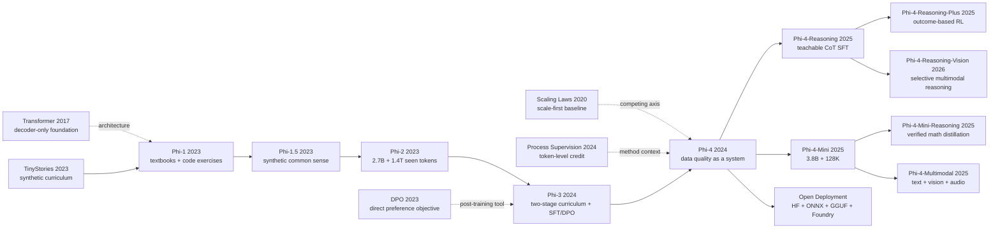

# Phi-4：把数据质量变成小模型推理能力的训练系统

> **2024 年 12 月 12 日，Microsoft Research 把 [Phi-4 Technical Report](https://arxiv.org/abs/2412.08905) 放上 arXiv，也把一个 14B、几乎不改 Phi-3 主干的 dense decoder-only Transformer，写成了一篇关于“数据怎么被编译成推理能力”的报告。** 这篇论文最抓人的地方，不是又多了多少参数，而是它把 9.8T training tokens、50 类 synthetic datasets、4K 到 16K 的 midtraining，以及带 Pivotal Token Search 的两轮偏好优化，压进同一个小模型系统里；结果是 Phi-4 在表中的 GPQA 拿到 56.1、MATH 拿到 80.4，连教师 GPT-4o 在这两项上的 50.6 和 74.6 都被超过。它真正逼人重想的问题是：当架构几乎不动时，模型能力到底是靠“更大”，还是靠把 seed、生成、验证和配比组织成一条更会教的训练流水线？

## 一句话总结

Microsoft Research 27 位作者在 2024 年发布的 [Phi-4 Technical Report](https://arxiv.org/abs/2412.08905)，把一个几乎不改主干的 14B decoder-only Transformer，做成了一套“数据质量优先”的训练系统：预训练目标仍是标准 next-token prediction，$\mathcal{L}_{\text{NTP}}(\theta)=-\sum_t \log p_\theta(x_t\mid x_{<t})$，但训练信号被重新组织成 50 类 synthetic data、过滤后的网页与代码、4K 到 16K 的 midtraining，以及 SFT 加两轮 DPO。对应地，Phi-4 在报告表格里把 GPQA 做到 **56.1**、MATH 做到 **80.4**、HumanEval 做到 **82.6**，相对同为 14B 的 Phi-3 分别从 **31.2 / 44.6 / 67.8** 明显抬升，并在 GPQA 与 MATH 上超过表中的 GPT-4o **50.6 / 74.6**。

反直觉之处是，这篇报告击败的失败 baseline 不是“参数不够大”，而是“把更多原始网页直接喂进去就够了”。报告自己的消融同时显示，纯 synthetic 路线虽然能把 HumanEval 相对 Phi-3 拉高 **12.1**、把 MATH 拉高 **4.9**，却会让 TriviaQA 掉 **14.8**，说明高质量课程能把 14B 容量更集中地花在数学、代码和 STEM 推理上，却不能凭空补齐长尾事实。Phi-4 的历史意义因此不是宣布小模型已经全面取代大模型，而是把 seed 选择、生成、验证、配比和 preference pair 设计，抬成与参数规模同等关键的训练变量。

---

## 历史背景

### 2024 年的小模型路线卡在什么地方

2024 年 12 月的语言模型竞赛，表面上仍由规模支配。Llama 3.1 把开放权重 dense 模型推到 405B，Qwen 2.5 同时铺开 14B 与 72B，GPT-4o、Claude 3.5 Sonnet 和 Gemini 1.5 则把闭源 API 的能力、上下文和产品体验继续往前推。若只沿着这条坐标轴看，14B 似乎只能是一个部署方便、能力打折的次级规格：它装不下 70B 或 400B 模型同等规模的事实知识，训练预算也通常更小。

微软的 Phi 路线从一开始就在质疑这个单坐标系，但它并没有否定 scaling law。Phi-1 的问题是：如果训练样本像教材，而不是像未经整理的仓库与论坛转储，同样的参数能否学到更密集的可迁移技能？Phi-1.5 把问题从 Python 扩到常识推理；Phi-2 同时扩大模型与重复训练 token；Phi-3 则把合成数据、强过滤网页、两阶段课程和 SFT/DPO 组合成可部署的模型族。到 Phi-4，问题变成：**当架构几乎不动、参数仍是 Phi-3-medium 的 14B 时，数据生成、数据混合、课程和后训练能把推理能力推多远？**

这个问题比“小模型能否打败大模型”严格得多。Phi-4 在 GPQA 和 MATH 上超过报告同表中的 GPT-4o，却在 SimpleQA、IFEval、DROP 以及多项长上下文任务上明显落后；它的价值不在于宣布规模无效，而在于证明固定参数预算下仍有一条尚未吃尽的“监督信号质量”轴。报告自己把边界写得很清楚：模型仍受事实容量约束，严格指令遵循较弱，甚至会把 9.9 和 9.11 比错。

### 从“教材”到训练系统：Phi-1、1.5、2、3 的连续实验

Phi-1 在 2023 年 6 月给出了这条路线最干净的原型。它只有 1.3B 参数，预训练语料由约 6B token 的高教育价值代码与不足 1B token 的 GPT-3.5 合成教材组成，再用不足 180M token 的 CodeExercises 微调；8 张 A100 训练不到 4 天后，HumanEval pass@1 为 50.6%，MBPP 为 55.5%。更重要的是，论文没有只报榜单：未过滤代码训练的 350M 模型在约 200B 已见 token 后 HumanEval 饱和于 12.19%，过滤后 36K steps 达到 17.68%，再加合成教材到 20.12%。这组消融把“质量”从口号变成了可观察变量。

Phi-1.5 在 2023 年 9 月沿用同一 1.3B 架构，把约 20B token 的合成教材扩到常识、科学、日常活动和 theory of mind。它的可用数据集约 30B token，实际训练 150B token，其中 80% 采自新合成数据、20% 采自 Phi-1 数据。Phi-2 在同年 12 月增至 2.7B，数据集约 250B token，经过多轮训练累计看过 1.4T token；微软同时坦率承认公共 benchmark 可能泄漏进训练语料，不能把聚合榜单当成最终裁决。

Phi-3 在 2024 年 4 月完成了从研究原型到部署模型的跨越。3.8B 的 Phi-3-mini 在 3.3T token 上训练，4-bit 后约占 1.8GB，可在 iPhone 14 的 A16 Bionic 上离线生成超过 12 token/s；7B 与 14B 版本训练 4.8T token。其课程已经是明确的两阶段：第一阶段以强过滤网页教知识与语言，第二阶段混入更强过滤网页和合成数据教推理与专项技能；随后再做 SFT 和 DPO。Phi-4 继承的是这套系统，而不只是“Textbooks”这个标题。

| 模型 | 参数量 | 报告中的数据 / 已见 token | 主要课程变化 | 上下文 / 对齐状态 |
|---|---:|---:|---|---|
| Phi-1 | 1.3B | <7B unique；预训练略高于 50B seen | 过滤代码 + 合成教材 + 练习微调 | 2K；代码专项微调 |
| Phi-1.5 | 1.3B | 30B dataset；150B seen | 合成教材扩到常识与世界知识 | 2K；未做 instruction tuning / RLHF |
| Phi-2 | 2.7B | 250B dataset；1.4T seen | 合成 NLP/代码 + 教育价值过滤网页 | 2K；base model，未做 RLHF |
| Phi-3-medium | 14B | 4.8T seen | 两阶段网页→推理混合课程 | 4K；SFT + DPO |
| Phi-4 | 14B | 9.8T（报告约 10T） | 50 类合成管线 + 配比搜索 + 16K midtraining | 16K；SFT + 两轮 DPO |

### 团队当时在做什么

Phi-4 报告由 Marah Abdin、Jyoti Aneja、Harkirat Behl、Sébastien Bubeck、Ronen Eldan、Suriya Gunasekar 等 27 位作者完成，署名单位是 Microsoft Research。团队核心成员从 TinyStories、Phi-1 开始连续追问同一个问题：next-token prediction 到底缺模型容量，还是缺一种更适合线性学习的教材？这种连续性解释了 Phi-4 为何把大部分篇幅留给数据。它的 14B dense decoder 仍紧贴 Phi-3-medium；真正扩张的是 seed 选择、生成工作流、执行验证、数据混合实验、长上下文 midtraining 和 preference pair 构造。

团队的经验也在逐代修正早期叙事。Phi-1 把合成教材看作从噪声代码中抽出教学信号的办法；Phi-1.5 几乎只靠合成文本扩域；Phi-2 又引入更多过滤网页；Phi-3 明确把知识阶段与推理阶段分开；Phi-4 最终通过纯合成消融确认：推理和代码会上升，但 TriviaQA 相对 Phi-3-medium 下降 14.8 分，幻觉也增加。换句话说，Phi 系列并不是越来越相信“有机数据无用”，而是越来越精确地给有机数据分工：提供事实覆盖、可靠 seed 和长尾知识；合成流程负责把这些材料重排成容易学习的课程。

后训练同样从常规配方变成研究对象。Phi-3 已有 SFT 和 DPO；Phi-4 在第一轮 DPO 中加入 Pivotal Token Search（PTS），寻找会显著改变后续成功概率的单个 token，第二轮再用 GPT-4o 评审完整回答。团队由此把“数据质量”从预训练一路延伸到 preference data：不仅问哪段文本值得学，还问一条推理轨迹的哪一个分叉最值得给梯度。

### 算力、开放模型与部署语境

Phi-4 的“小”是相对前沿大模型而言，不是手机模型意义上的小。官方模型卡记录的是 1,920 张 H100-80G、21 天训练、9.8T token；按卡片给出的硬件持续时间粗算，训练占用约 967,680 H100-GPU hours，但报告没有把这个乘法结果当作经审计的总计算成本，也没有公开完整能耗或训练费用，因此不能把估算写成官方成本。14B BF16 权重本身约需 28GB，实际推理还要留 KV cache 和运行时空间；它比 70B/405B 更容易私有部署，却不等于任意手机都能原样运行。

部署意义来自另一个组合：16K 上下文、MIT 许可证、Hugging Face 权重、标准 `transformers` 接口，以及微软 PhiCookBook 给出的 Microsoft Foundry、GitHub Models、ONNX Runtime、llama.cpp、MLX 和本地 .NET 路径。与只开放 API 的模型相比，这让研究者可以量化、微调、离线运行或把模型放进受数据边界约束的系统。与 Phi-3-mini 的“手机上跑”不同，Phi-4 更适合工作站、单机多卡或云端低延迟推理。

这也解释了论文为何专门把 QwQ-32B-Preview 排除在同一成本级比较之外。报告称 QwQ 在新鲜 AMC-10/12 测试上平均 124.5 分，但生成 token 是 Phi-4 的 4 倍、参数量超过两倍，因此推理成本高一个数量级。这个比较不是说长 chain-of-thought 无效，而是把 latency 与 token budget 重新放回“推理能力”定义中：模型能答对多少，与它为每道题花多少计算，应当一起报告。

## 研究背景与动机

### 数据质量不是一个标量

“高质量数据”很容易沦为不可证伪的万能解释。Phi-4 的研究价值在于把它拆成不同操作：先从网页、书籍、论文、论坛、代码和 Q&A 中找 seed；再把 seed 改写成练习、讨论、问答、代码指令或 fill-in-the-middle 任务；用多代理生成、自我批评与修订、majority voting、执行测试和科学约束做验证；最后通过短程 1T-token、7B 代理实验搜索最终配比。质量在这里不是一个 classifier 分数，而是**覆盖、难度、正确性、推理链可学习性、输出格式贴近推理时分布**的联合约束。

这种设计直接针对 next-token prediction 的教学错配。人写教材时会回头改段落、提前给结论、略去心算步骤；模型训练却必须从左到右预测。报告把合成轨迹称为一种 “spoonfeeding”：每一步都由前缀自然引出，让正确推理链在 token 层面变得可学习。它不是简单让 GPT-4o 把答案说一遍，而是把知识重新编排成有梯度的课程。

### 为什么不能只用合成数据

Phi-4 的动机并非消灭网页，而是解决网页的两种低效。第一种是教学低效：高价值逻辑埋在广告、样板代码、跨页依赖和非线性叙述里。第二种是交互分布错配：论坛中的事实与聊天回答的形式相差很大，模型即使“见过”事实，也未必能在助手对话中顺利取出。Web rewrites 保留事实 seed，改变表达与任务形式；更自由的 synthetic 数据则覆盖推理技能、难度阶梯和多种解题路径。

但有机数据承担合成数据不能替代的角色。报告明确说，自然 Q&A 问题比纯合成问题更有效；纯合成 13B 消融虽然在 MATH、HumanEval、MBPP 上涨分，却在 TriviaQA 上掉 14.8 分并更易幻觉。最终配比因此保留 15% 原始过滤网页、15% web rewrites、20% 代码和 10% acquired sources。这里的核心不是“synthetic versus real”二选一，而是一个循环：有机材料给世界覆盖与可靠 seed，合成流程把它变成课程，评测反馈再决定下一轮 seed 和配比。

### 超越蒸馏，还是更聪明的蒸馏

Phi-4 摘要最有野心的判断，是它在 GPQA 与 MATH 上超过教师 GPT-4o，因此其方法“go beyond distillation”。这句话应当窄读。学生在特定 benchmark 上超过教师，说明多源 seed、验证、重写、重复训练、课程和后训练可以把教师生成中的有效信号重组并放大；它不能证明 Phi-4 已摆脱教师模型，也不能推出通用能力超过 GPT-4o。事实上，GPT-4o 同时参与合成数据、SFT response selection、judge-guided DPO 和某些生成式评测。

因此，这篇报告真正要回答的是：**能否把强模型从最终产品改造成数据编译器，让较小模型在明确技能上获得更高的单位参数能力？** Phi-4 给出的答案是肯定但有条件：对数学、STEM QA 和代码，课程化合成数据与 token-level preference data 很有效；对事实长尾、严格格式、多轮对话、非英语和长上下文，14B 容量与训练分布仍然留下清楚的缺口。这种有边界的结论，远比“14B 击败 405B”更接近报告本身。

---

## 方法详解

Phi-4 最容易被讲错的地方，是把方法压缩成“用 GPT-4o 造更多数学题”。报告真正描述的是一条数据与训练系统：有机材料先提供知识 seed，生成器把 seed 编译成线性可学的教材、练习与推理轨迹，验证器过滤错误和无效难度，配比实验决定每种 token 被重复多少次，midtraining 再把 4K 模型迁到 16K，最后用 SFT、PTS-DPO、完整回答 DPO 和拒答数据塑造助手行为。架构只做小改，监督信号的生产与调度才是主方法。

### 整体框架：架构近乎不动，训练数据不断重写

Phi-4 是 14B dense decoder-only Transformer。主报告明确说它紧贴 Phi-3-medium：预训练时默认 4,096 context，使用 tiktoken、100,352 padded vocabulary 和完整 4K attention，不再沿用 Phi-3-medium 的 2K sliding window；midtraining 后扩到 16,384。官方仓库的 `config.json` 进一步给出 40 层、hidden size 5,120、intermediate size 17,920、40 个 query heads、10 个 KV heads、RoPE theta 250,000。也就是说，Phi-4 并没有靠 MoE、新 attention 或更深网络解释主要涨分。

| 组件 | 官方值 | 方法上的含义 |
|---|---:|---|
| 参数 | 14B | 与 Phi-3-medium 同一量级，便于隔离数据/课程改进 |
| 主干 | dense decoder-only Transformer | 没有 MoE 路由变量 |
| 层数 / hidden | 40 / 5,120 | 官方 released config |
| MLP intermediate | 17,920 | SiLU gated MLP 配置 |
| query / KV heads | 40 / 10 | GQA，每 4 个 query 共享一组 KV |
| vocabulary | 100,352 | tiktoken padded vocabulary |
| context | 4K pretraining → 16K midtraining | 长上下文通过单独阶段获得 |
| attention | full attention | 4K 阶段不使用 Phi-3-medium 的 2K sliding window |
| RoPE theta | 250,000 | 16K midtraining 的位置编码设置 |

整条训练路径可以画成下面这条“数据编译链”。注意，`organic sources` 同时进入两条支路：一条经强过滤后直接训练，另一条只当 seed，经重写与验证后成为更适合 next-token prediction 的样本。

```text
organic sources (web / books / papers / code / Q&A)
        |                         |
        | quality filtering       | seed curation
        v                         v
filtered organic data      synthetic generation (50 broad types)
        |                  rewrite / exercise / dialogue / reversal
        |                         |
        |                         v
        |                  critique / revise / vote / execute
        |                         |
        +-----------+-------------+
                    v
        mixture search at short horizon (1T, mostly 7B proxies)
                    v
        4K pretraining (~9.8T tokens)
                    v
        16K midtraining (250B tokens; 30% new long data)
                    v
        SFT (~8B tokens) -> PTS-DPO -> judge-guided DPO
```

所有阶段仍建立在标准自回归目标上。若序列为 $x_{1:T}$，预训练最基本的目标就是让每一个当前位置预测后继 token：

$$
\mathcal{L}_{\text{NTP}}(\theta)=-\sum_{t=1}^{T}\log p_\theta(x_t\mid x_{<t}).
$$

Phi-4 的赌注不是换掉这个目标，而是改变 $x_{1:T}$ 的结构：让需要的前提、推导和答案按可预测的顺序出现，让每个梯度更像一小步教学，而不是要求模型从网页碎片里自行恢复隐去的推理过程。

### 关键设计 1：把有机 seed 编译成教材、练习与可验证轨迹

报告称团队建立了 50 个 broad types 的合成数据集，总计约 400B unweighted tokens。这个 400B 是生成数据类型的总体体量，不是最终训练中“只出现一次的 unique synthetic token”；Table 5 对 final mixture 另报约 290B unique synthetic tokens、13.8 epochs。把两个数字混为一谈，会误判数据重复策略。

生成从 seed curation 开始。网页、书籍、科学论文与代码片段先经过质量筛选，优先保留复杂度、推理深度和教育价值。对网页与代码，第一阶段挑出有教学潜力的页面，第二阶段再切 passage，并分别给事实含量与推理含量评分。Q&A seed 使用一种很实用的难度筛法：对同一问题生成 $K$ 个独立答案；若全部一致，问题太容易，若答案完全分裂，问题可能太难或含糊；只保留中间区域。用本文逻辑写成简化判据，就是答案计数 $c(y)$ 满足 $1<\max_y c(y)<K$，但这只是对报告规则的记号化，不是论文另提的损失函数。

| 阶段 | 输入 | 处理 | 留下什么 |
|---|---|---|---|
| Seed curation | web、书、论文、代码、Q&A | 按教育价值、复杂度、推理深度筛选 | 高信息密度材料 |
| Difficulty filtering | 一个问题的多次独立回答 | 去掉全一致与全不一致问题 | 可学但不平庸的题目 |
| Rewrite and augment | passage / snippet | 改写为练习、讨论、结构化推理 | 更贴近模型输出的文本 |
| Self-revision | 初始生成 | 生成器自评、按 rubric 批评并重写 | 难度与正确性更高的版本 |
| Instruction reversal | 已有 code / output | 反向生成任务说明，再把 instruction 放前 | instruction-output pair |
| Validation | code、数学、科学样本 | 执行测试、grounding 与一致性检查 | 可验证轨迹 |
| Agent trajectories | AgentKit 交互 | 重写规划、反思、纠错过程 | 长时程 reasoning data |

“合成教材”因此不是一种固定文体。Phi-4 的附录展示了至少四类操作：从科学文本抽取 deduction chain 并改写成问答；通过 critique-revision 循环增加干扰项与外部知识要求；把代码删去关键中段，要求模型用上下文与 rejection sampling 补全；把 AgentKit 的长轨迹重写成规划、反思和动作。对 code instruction reversal，只有原代码与再生成代码保持高 fidelity 的 pair 才保留。

下面的伪代码只复述报告管线的控制逻辑，不假装给出微软未公开的 prompts、阈值或教师配置：

```python
def build_training_examples(organic_items, generators, validators):
    examples = []
    for item in organic_items:
        seed = score_and_filter(item)              # educational and reasoning value
        if seed is None:
            continue

        candidates = []
        for generator in generators:
            draft = generator.transform(seed)      # exercise, dialogue, QA, reversal
            revised = generator.critique_and_revise(draft)
            candidates.append(revised)

        for candidate in candidates:
            if all(check(candidate) for check in validators):
                examples.append(candidate)         # retain only validated generations
    return deduplicate(examples)
```

这条管线的反直觉点是：教师的“答案能力”不是唯一资产，**把原材料变成什么学习顺序**同样重要。报告举的例子是人类数学解答可能先写结论，再补推导；人可以依靠回看和编辑理解，next-token learner 却被迫在没有中间步骤时直接猜结论。合成轨迹把非线性写作改造成线性课程，提升的是可学性，不只是文本表面流畅度。

### 关键设计 2：用配比与重复次数构造 curriculum，而不是只追求 unique tokens

Phi-4 的 final pretraining mixture 不是一个“纯合成”语料库。报告把 15% 分给过滤网页、15% 分给 web rewrites、40% 分给 synthetic、20% 分给代码、10% 分给 acquired sources。脚注明确说 web rewrites 是 synthetic 的子类，且 code 同时混有 raw 与 synthetic code；因此可以说合成路径占主体，却不能捏造一个报告未给出的精确“总合成百分比”。

| 数据簇 | 训练占比 | unique token | epochs | 主要作用 |
|---|---:|---:|---:|---|
| Web | 15% | 1.3T | 1.2 | 长尾知识与自然语言覆盖 |
| Web rewrites | 15% | 290B | 5.2 | 保留事实 seed，改成可学表达 |
| Synthetic | 40% | 290B | 13.8 | 教材、练习、推理与交互轨迹 |
| Code data | 20% | 820B | 2.4 | raw + synthetic code，执行能力 |
| Acquired sources | 10% | 580B | 1.7 | 学术材料、licensed books 等 |

配比不是凭感觉拍定。团队先在 1T-token 短 horizon 上比较多种 mixture，并利用 7B 与 14B 在相隔较大的配比之间具有高 rank correlation，把大部分搜索放到 7B proxy，再转移到 14B。若把每个数据簇记为 $D_k$、采样权重为 $w_k$，它优化的是一个受预算约束的混合风险，而不是单独最大化某个簇：

$$
\min_{w_1,\ldots,w_K}\;\sum_j \alpha_j\,\mathcal{E}_j(\theta(w))
\quad\text{s.t.}\quad w_k\ge 0,\;\sum_k w_k=1,\;N_k=w_kN.
$$

这里 $\mathcal{E}_j$ 可理解为不同能力评测误差，$N_k$ 是给数据簇 $k$ 的训练 token 预算；论文并未以这个公式定义算法，它只是把 Table 4 的多目标配比搜索写成可读形式。真实结果说明目标彼此冲突：更偏 synthetic 的 S 行平均比 final mixture 高 0.8，却让 HumanEval 掉 6.1、TriviaQA 掉 3.0；加入更多网页的 S+W 行让 TriviaQA涨 6.9，却让 HumanEval 掉 4.3。

| 1T-token 配比消融 | MMLU | MATH | HumanEval | TriviaQA | 平均（相对 final） |
|---|---:|---:|---:|---:|---:|
| Uniform | -3.3 | -5.4 | -1.2 | +3.3 | -2.2 |
| S | +3.3 | +4.0 | -6.1 | -3.0 | +0.8 |
| S + WR | +0.6 | +1.2 | -1.2 | -3.7 | +0.4 |
| S + W | -0.6 | -0.7 | -4.3 | +6.9 | 0.0 |

团队最终没有选平均分最高的 synthetic-heavy 行，而是保留知识密集网页和 targeted acquisitions，让能力轮廓更平衡。另一个关键消融更直接：13B 纯 synthetic 模型相对 Phi-3-medium 在 HumanEval 上 +12.1、MATH +4.9，却在 TriviaQA 上 -14.8，并增加事实幻觉。**更多高质量合成 token 不是新 scaling law 的免费午餐；它提高某类监督密度，也压缩了模型接触世界事实分布的带宽。**

### 关键设计 3：把 4K 模型迁到 16K，而不是从头支付长序列成本

预训练主体在 4K full attention 上完成。之后的 midtraining 才把 context 扩到 16K，总计 250B token，peak learning rate 降为预训练的十分之一，RoPE base frequency 提高到 250K。数据方面，团队比较“天然长文档”与把短样本人工拼满的方案，发现前者对长上下文任务更有效；于是从 academic、books 和 code 中筛出超过 8K 的材料、上采样 16K+ 子集，同时生成长度超过 4K 的新合成数据。

| Midtraining 组件 | 设置 | 为什么这样做 |
|---|---:|---|
| 总 token | 250B | 用短阶段迁移，不重跑约 10T 预训练 |
| 新长上下文数据 | 30% | 提供真实跨段依赖与新合成长任务 |
| pretraining recall tokens | 70% | 防止短上下文与既有能力遗忘 |
| context | 4K → 16K | 扩展 released model 的窗口 |
| peak LR | 预训练的 0.1× | 降低上下文迁移对已有权重的扰动 |
| RoPE theta | 250,000 | 调整位置频率以容纳更长距离 |

这个阶段值得注意的不是“16K”本身，而是结果没有单向上涨。HELMET 的 Phi-4 行从 8K 到 16K 时，ICL 由 68.0 升到 77.0、QA 从 26.7 升到 36.0、summarization 从 38.3 升到 40.5；但 RAG 从 58.1 降到 57.1，rerank 从 65.3 降到 54.4。报告也没有宣称 16K 等于稳健的长文推理。midtraining 解决“窗口可用”和部分长依赖任务，不自动解决检索、排序与事实整合。

### 关键设计 4：SFT、Pivotal Token Search 与两轮 DPO

预训练模型先用约 8B token 做 SFT，learning rate 为 $10^{-6}$，数据覆盖数学、代码、推理、对话、模型身份、安全和 40 种语言，统一采用 ChatML。SFT 的 prompts 来自公开与合成数据；对每个 prompt 生成多个回答，再由 LLM-based evaluation 选择最好者。随后进行两轮 DPO：第一轮针对 pivotal token，第二轮比较完整回答。

| 阶段 | 数据规模 | 偏好 / 监督来源 | 主要目标 |
|---|---:|---|---|
| SFT | 约 8B tokens | 多回答生成 + LLM 选择 | ChatML、数学、代码、推理、对话、安全 |
| PTS-DPO | 250,297 pairs（Table 7 合计） | ground-truth oracle + rollout success | 把梯度集中到关键分叉 token |
| Judge-guided DPO | 约 850K；Table 8 列项合计 841,842 | GPT-4o 比较 GPT-4o/GPT-4t/Phi-4 回答 | accuracy、style、detail 与通用偏好 |
| Safety / hallucination mix | 每轮 DPO 的 1%-5% | 拒答、helpful/harmless 与 RAI 数据 | 降低编造与有害输出 |

标准 DPO 对 preferred response $y_w$ 和 rejected response $y_l$ 提高相对 reference policy 的 log-ratio 差：

$$
\mathcal{L}_{\mathrm{DPO}}=-\mathbb{E}\log\sigma\!\left(\beta\left[\log\frac{\pi_\theta(y_w\mid x)}{\pi_{\mathrm{ref}}(y_w\mid x)}-\log\frac{\pi_\theta(y_l\mid x)}{\pi_{\mathrm{ref}}(y_l\mid x)}\right]\right).
$$

完整回答 DPO 的问题是 credit assignment。一个最终答对的长解答里可能夹着脆弱 token，整段都标 positive 会奖励它；一个最终答错的解答可能前面大部分正确，整段 negative 又会惩罚好步骤。PTS 对回答 token 序列 $T=(t_1,\dots,t_n)$ 的每个前缀估计后续成功率 $p_i=p(\mathrm{success}\mid Q,t_{\le i})$，寻找 $|p_i-p_{i-1}|\ge p_{\mathrm{gap}}$ 的位置，再固定相同 prefix，只比较会把成功率推高或压低的单 token。

$$
\Delta_i=p(\mathrm{success}\mid Q,t_{\le i})-p(\mathrm{success}\mid Q,t_{<i}),
\qquad |\Delta_i|\ge p_{\mathrm{gap}}.
$$

报告的算法用递归 subdivision 降低搜索成本，按 token 累积 log-probability 的中点切分区间；每次成功率估计都需要从 prefix 继续采样并交给 oracle 判定。它不保证找到所有 pivotal tokens，但若成功率沿解答接近单调，就能找全；为提高样本效率，目标问题只取 base success probability 在 $[0.2,0.8]$ 的区间。

```python
def pivotal_token_pairs(question, full_tokens, oracle, gap=0.2):
    cache = {}

    def success_rate(prefix):
        key = tuple(prefix)
        if key not in cache:
            continuations = sample_completions(question, prefix)
            cache[key] = mean(oracle(question, item) for item in continuations)
        return cache[key]

    for prefix, token in recursively_subdivide(full_tokens, success_rate, gap):
        before = success_rate(prefix)
        after = success_rate(prefix + [token])
        if abs(after - before) >= gap:
            accepted, rejected = find_single_token_alternatives(
                question, prefix, oracle
            )
            yield question + prefix, accepted, rejected
```

Table 7 的 PTS 数据包括 132,859 个 generic multiple-choice Q&A、76,552 个 math、16,080 个 Python、21,806 个 C++/Go/Java/JavaScript/Rust，以及 3,000 个 unknown + safety pairs。第二轮用 GPT-4o、GPT-4t 与 Phi-4 各自产生回答，再由 GPT-4o 按 accuracy、style、detail 打分。两者互补：Table 9 显示 PTS 对 GPQA/MATH 更有帮助，judge-guided DPO 对本身由 GPT-4 judge 的 ArenaHard 更强。

幻觉缓解也是 preference design，而不是给模型追加一个“事实模块”。团队从 TriviaQA seed 出发，估计 base Phi-4 对每题的成功率；容易题配正确答案，难题配拒答，再生成看似真实但不可回答的 bogus question。DPO 中对偶是 `correct > refusal` 或 `refusal > wrong`，且这类 DPO 只使用回答开头 5 个 token。结果会故意降低 SimpleQA F1，因为模型少猜也少蒙对；报告认为“3% correct、3% wrong、94% refusal”可能比“6% correct、94% wrong”更适合用户。这是少见的主动牺牲榜单换行为的例子。

### 训练目标、配方与复现边界

| 阶段 / 项目 | 官方披露 | 可复现边界 |
|---|---|---|
| Pretraining tokens | 模型卡 9.8T；报告约 10T | 两者是精确值与四舍五入表述 |
| Peak LR / schedule | 0.0003；linear warm-up and decay | 未公开完整逐步 schedule |
| Weight decay | 0.1 | 已披露 |
| Global batch | 5,760 | 已披露 |
| Hardware / time | 1,920 H100-80G / 21 days | 未披露完整利用率、能耗与成本 |
| Midtraining | 250B；LR 0.1×；30/70 mixture | 未公开每个长数据源明细 |
| SFT | 约 8B；LR $10^{-6}$；40 languages | 未公开 prompts 与全部筛选器 |
| DPO | PTS 一轮 + judge-guided 一轮 | PTS 伪代码公开，生产 oracle/rollout 配置不完整 |

因此，Phi-4 是“机制披露较丰富、语料复现不充分”的技术报告。外部可以复现 released architecture、ChatML 接口、基础 DPO 公式和 PTS 思路，也能核对主要配比与 benchmark；却无法重建 50 类生成器、具体 seed corpus、licensed books、私有数据、教师 prompts、过滤阈值或所有内部 judge rubric。官方 2025 data summary 只确认公开资料、商业授权数据、合成数据及其他类别，并未给出书目或逐站清单。严谨的复现结论应是：报告解释了**为什么这条训练系统可能工作**，没有提供一份可逐 token 重建 Phi-4 的 recipe。

---

## 失败案例

Phi-4 的报告很少把实验写成“每个新模块都赢”。相反，它留下了几条很有价值的失败路线：同样 14B 只沿用旧数据配方不够；纯合成会丢事实；平均分更高的 synthetic-heavy 配比未必是更好的通用模型；只比较整段答案会把偏好梯度摊薄；把 context 拉长也不会让所有长文任务一起上升。这些负结果共同限定了“数据质量”的含义。

### Baseline 1：同样的 14B 架构，继续沿用 Phi-3 配方

最干净的 baseline 不是 405B Llama，而是 Phi-3-medium：它同样是 14B，Phi-4 架构也“closely follows”它。若参数量本身已经决定能力，保持这一量级、只延长训练就不该出现大幅能力重排。Table 1 却显示，Phi-4 相对 Phi-3-medium 的 GPQA 从 31.2 升到 56.1，MATH 从 44.6 升到 80.4，HumanEval 从 67.8 升到 82.6，MMLU-Pro 从 51.3 升到 70.4。这个 baseline 输掉的不是 Transformer 结构，而是监督分布。

但“架构相同”也不能被偷换成“只有数据不同”。Phi-4 训练 token 从 Phi-3-medium 的 4.8T 增到模型卡所记 9.8T，tokenizer、4K full attention、16K midtraining 和后训练方案也变化。正确结论是：架构创新并非主要解释，数据、更多 token、课程与 post-training 共同解释结果；报告没有提供一个把四者完全正交拆开的 14B full-run 消融。

这也是对 scaling-only 叙事最有分寸的反例。参数不变时能力仍可大涨，说明“只数参数”遗漏了训练信号；但 token 数几乎翻倍，说明 Phi-4 并没有凭空绕过计算。它把一部分 scale 从参数挪到了数据生成、筛选、重复训练和评审计算中。

### Baseline 2：既然 synthetic 对推理强，就把网页全部删掉

报告真的训练了一个 13B 纯 synthetic 消融模型，并让每个数据源重复超过 20 次。相对使用网页与合成混合数据的 Phi-3-medium，它在 HumanEval 上 +12.1、MATH +4.9、MMLU-Pro +4.0；看上去似乎证明了“教材取代互联网”。但同一行的 TriviaQA 是 -14.8，报告还明确说纯合成模型在知识型 benchmark 上落后并增加幻觉。

加入一半 web rewrites 后，MATH 增益扩大到 +8.1、HumanEval 到 +13.3，TriviaQA 缺口收窄到 -7.7，却仍没有补平事实知识。这条失败路线揭示了一个不对称：合成器很擅长把已经找到的知识变成可学习任务，却不能保证覆盖世界上尚未被 seed 捕获的长尾事实。教师模型生成得再流畅，也不会自动创造可靠的新事实分布。

| 无原始网页的 13B 消融（相对 Phi-3-medium） | MMLU | MMLU-Pro | HumanEval | MATH | TriviaQA |
|---|---:|---:|---:|---:|---:|
| Synthetic only | +0.8 | +4.0 | +12.1 | +4.9 | **-14.8** |
| Synthetic + Web Rewrites | +0.3 | +4.1 | +13.3 | +8.1 | **-7.7** |

因此最终模型保留 15% 过滤网页、10% acquired sources，并把 20% 留给 raw/synthetic 混合代码。失败教训不是“synthetic 有毒”，而是**可教性与事实覆盖是两个目标**。纯教材可以让推导更顺，却不能代替图书馆。

### Baseline 3：用均匀配比或单一平均分选择 curriculum

另一个自然 baseline 是把 synthetic、web rewrites、filtered web 平均分配。Table 4 的 Uniform 行在平均指标上比 final mixture 低 2.2，MATH -5.4、GSM8K -5.8、MMLU-Pro -3.6。这说明数据簇的单位 token 价值不同，“每类一视同仁”不等于公平，也不等于最优。

更微妙的失败是只按平均分选 winner。Synthetic-heavy 的 S 行平均 +0.8，S+WR 行 +0.4，都高于最终配比；团队却没有采用它们，因为 S 在 HumanEval -6.1、TriviaQA -3.0，S+WR 在 TriviaQA -3.7。反过来，S+W 把 TriviaQA 拉高 +6.9，却让 HumanEval -4.3，平均正好 0.0。一个标量平均掩盖了模型“会推导但不知道事实”或“知道事实但代码退化”的形状。

| 配比路线（相对 final mixture） | MMLU | MATH | HumanEval | TriviaQA | Average | 为什么没选 |
|---|---:|---:|---:|---:|---:|---|
| Uniform | -3.3 | -5.4 | -1.2 | +3.3 | -2.2 | 大部分推理/代码指标退化 |
| S | +3.3 | +4.0 | -6.1 | -3.0 | +0.8 | 平均高但代码与知识失衡 |
| S + WR | +0.6 | +1.2 | -1.2 | -3.7 | +0.4 | 知识缺口仍大 |
| S + W | -0.6 | -0.7 | -4.3 | +6.9 | 0.0 | 事实涨、推理与代码掉 |

最终配比是一种有意的 Pareto 折中，而不是 Table 4 单列冠军。这个决定也提醒读者：论文的“data quality”不是给文档打一个质量分后全量保留，而是针对能力组合分配 token 与 epochs。

### Baseline 4：只做完整回答 DPO，或者只盯一个榜单

后训练的失败 baseline 是跳过 PTS，只在 SFT 后做第二轮 judge-guided full-response DPO。Table 9 的 `DPO stage 2 only` 在 ArenaHard 上达到 69.8，高于只做 PTS 的 66.5；如果开发目标只是 GPT-4 judge 偏好的开放式回答，它看起来足够好。但 GPQA 只有 52.4、MATH 77.6，低于 PTS-only 的 53.6 与 80.5；两轮合并后 GPQA 才到 56.1、ArenaHard 到 75.4。完整回答偏好更擅长总体风格与可读性，token-level pair 更擅长给推理分叉分配信用。

即使最终两轮方案也不是全面上涨。SFT 的 DROP 是 82.8，PTS 后升到 86.1，最终却降到 75.5；IFEval 从 SFT 的 66.2 降到 63.0。SimpleQA 从 3.7 降到 3.0 则是故意的：团队训练模型在不确定时拒答，减少“蒙对”和更多“蒙错”。这说明 benchmark 目标彼此并不一致，优化某种用户行为会让某些分数变差。

长上下文也给出同类反例。Phi-4 在 HELMET 上从 8K 测到 16K 时 ICL 由 68.0 升至 77.0，但 RAG 从 58.1 降至 57.1、rerank 从 65.3 降至 54.4。窗口长度是容量上限，不是“模型已经会利用全部窗口”的证明。

| 训练选择 | 得到的收益 | 同时暴露的损失 |
|---|---|---|
| PTS-DPO only | GPQA 53.6；MATH 80.5 | ArenaHard 66.5，弱于 stage-2-only 69.8 |
| Judge-DPO only | ArenaHard 69.8 | GPQA 52.4；MATH 77.6 |
| PTS + Judge-DPO | GPQA 56.1；ArenaHard 75.4 | DROP 75.5；IFEval 63.0 |
| 16K evaluation | ICL 77.0；QA 36.0 | RAG 57.1；rerank 54.4 |

真正的反 baseline 教训是：**高质量训练不是把一个 benchmark 推到最大，而是选择愿意承担哪种退化。** Phi-4 的工程判断包括保留网页换事实覆盖、牺牲 SimpleQA F1 换少编造、组合两种 DPO 换推理与风格兼顾。这些决定比一句“小模型打败大模型”更能解释成品的能力轮廓。

## 实验关键数据

### 主实验：强项集中在 STEM 推理与代码，不是全面领先

Table 1 使用 OpenAI `simple-evals` 的固定 prompts、extraction 和 temperature 0.5 报告第一组指标；MMLU-Pro、HumanEval+、ArenaHard、LiveBench、IFEval 与内部 PhiBench 则由另一套内部框架评测。下面保留最能显示能力轮廓的六个公开指标。Phi-4 在 GPQA 与 MATH 上超过同表 GPT-4o，在 HumanEval 上超过 Qwen 2.5 72B 与 Llama 3.3 70B，却在 SimpleQA、IFEval 和 DROP 明显落后。

| Benchmark | Phi-4 14B | Phi-3 14B | Qwen 2.5 14B Inst. | GPT-4o-mini | Llama 3.3 70B Inst. | GPT-4o |
|---|---:|---:|---:|---:|---:|---:|
| GPQA | **56.1** | 31.2 | 42.9 | 40.9 | 49.1 | 50.6 |
| MATH | **80.4** | 44.6 | 75.6 | 73.0 | 66.3 | 74.6 |
| HumanEval | 82.6 | 67.8 | 72.1 | 86.2 | 78.9 | **90.6** |
| MMLU-Pro | 70.4 | 51.3 | 63.2 | 63.4 | 64.4 | **73.0** |
| SimpleQA | 3.0 | 7.6 | 5.4 | 9.9 | 20.9 | **39.4** |
| IFEval | 63.0 | 57.9 | 78.7 | 80.0 | **89.3** | 84.8 |
| DROP | 75.5 | 68.3 | 85.5 | 79.3 | **90.2** | 80.9 |

这张表支持的是 specialization。GPQA 测研究生级、刻意原创的 STEM 问题，MATH 测竞赛数学，HumanEval 测独立 Python 函数；三者都与 Phi-4 合成数据和 PTS 可使用验证器的领域高度重合。SimpleQA 依赖稀有事实，IFEval 依赖精确格式约束，DROP 需要离散文本推理；它们暴露了同一课程没有覆盖好的方向。

“超过教师”也必须按列理解。GPT-4o 在 GPQA 为 50.6、MATH 为 74.6，低于 Phi-4 的 56.1/80.4；但它在 HumanEval 为 90.6、SimpleQA 39.4、IFEval 84.8。学生在被重编译得最密集的技能上超过教师，不等于学生成为更强的通用系统。

### 后训练消融：PTS 与 judge-guided DPO 的互补及副作用

| Benchmark | SFT | PTS-DPO | Judge-DPO only | Final PTS + Judge |
|---|---:|---:|---:|---:|
| MMLU | 82.8 | 84.8 | 84.2 | **84.8** |
| GPQA | 47.3 | 53.6 | 52.4 | **56.1** |
| MATH | 77.1 | **80.5** | 77.6 | 80.4 |
| HumanEval | 79.5 | 81.6 | 81.5 | **82.6** |
| MMLU-Pro | 61.9 | 70.0 | 67.2 | **70.4** |
| ArenaHard | 56.7 | 66.5 | 69.8 | **75.4** |
| DROP | 82.8 | **86.1** | 71.8 | 75.5 |
| IFEval | **66.2** | 63.0 | 63.0 | 63.0 |
| PhiBench (internal) | 48.2 | 54.5 | 53.0 | **56.2** |

Table 9 的形状比最终一列更重要。PTS 在 MATH 上达到 80.5，最终值 80.4，说明第二轮几乎没有再增益；ArenaHard 却从 56.7 经 PTS 到 66.5，再经 judge-guided DPO 到 75.4。由于 ArenaHard 本身由 GPT-4 judge，第二轮同样使用 GPT-4o 评审，部分增益可能包含 judge preference 对齐，而不只是客观正确率。

DROP 从 86.1 降至 75.5 是警告：两个局部有效阶段串联后，某些能力可能干扰。报告没有给出一套消除这些退化的最终方案，也没有发布内部 PhiBench，因此外部读者无法独立复核所有 mixture 与 hyperparameter 决策。

### 去污染、fresh test 与评测边界

Phi-4 比早期 Phi 报告更认真处理 contamination，但没有宣称问题已被消灭。Appendix B 对 ARC-Easy、MBPP、PhiBench、CommonsenseQA、WinoGrande、MedQA、MATH、AGIEval、GPQA、MMLU-Pro、GSM8K、HumanEval、ArenaHard、MMLU 等测试集应用混合 13-gram / 7-gram 检查；13-gram 直接命中可判污染，7-gram overlap ratio 用阈值区分 partial contamination 与 contaminated。报告随即承认，改写可以逃过这类规则。

| 证据 | 报告做法 | 能排除什么 | 仍排除不了什么 |
|---|---|---|---|
| n-gram decontamination | 13-gram exact features + 7-gram overlap ratio | 明显逐字或局部重叠 | paraphrase、同构题、教师记忆 |
| GPQA | 使用原创建题、强调不在公开网页 | 常见网页原题泄漏 | 教师偏差、评测范围窄 |
| PhiBench | 团队原创 prompts，参与 mixture/hyperparameter 选择 | 与公开训练集直接重叠 | 内部集不可复验、开发集过拟合 |
| Nov. 2024 AMC | 78 个 unique questions，11 月 6 日后公开，晚于数据收集与超参确定 | Phi-4 直接见过测试题 | 题型迁移、GPT-4o extraction、四卷有重题 |
| `simple-evals` | 固定 prompt/extraction，temperature 0.5 | 不同模型用不同私有 prompt 的部分偏差 | 格式敏感、采样方差、单一 metric |

AMC 是最强的抗直接污染证据。Appendix C 说明四份 25 题试卷合计 78 个不重复问题，因为 AMC-10/12 的 A/B 卷之间有重题；题目在 2024 年 11 月 6 日或之后公开，晚于所有训练数据与最终 post-training hyperparameter 选择。Figure 1 按四份卷的 150 分制均分并在 temperature 0.5 下重复测量。模型经常不按要求框出 A/B/C/D/E，因此评测又让 GPT-4o 抽取最终选项。它能有力反驳“Phi-4 直接背了这套试题”，却不能把所有评测误差归零。

### 关键发现

- **14B 同规模代际提升很大。** GPQA 31.2→56.1、MATH 44.6→80.4，支持数据、课程与后训练是主要变量；但 4.8T→9.8T token 也意味着计算规模上升。
- **推理 specialization 超过通用 superiority。** Phi-4 在 GPQA/MATH 上赢 GPT-4o，却在 SimpleQA 3.0 对 39.4、IFEval 63.0 对 84.8 上明显落后。
- **纯合成不是终点。** Synthetic-only 的 HumanEval +12.1 与 TriviaQA -14.8 同时成立，说明可学推理与事实覆盖必须分别配置。
- **PTS 改善 credit assignment。** GPQA 从 SFT 47.3 到 PTS 53.6，再到两轮 56.1；它适合有 ground-truth oracle 的数学、代码与 QA，不能无成本推广到所有开放任务。
- **更长窗口不等于更强长文能力。** Phi-4 的 16K ICL 上升 9.0 分，但 rerank 下降 10.9 分；“支持 16K”只描述接口上限。
- **好行为可能让榜单变差。** 训练拒答后 SimpleQA F1 从 3.7 降到 3.0，团队明确选择少编造而不是多猜测。
- **去污染降低风险，不证明零泄漏。** 13/7-gram 规则看不到 rephrasing；fresh AMC 才对直接记忆给出更强、但仍非完美的证据。

---

## 思想史脉络

### Mermaid 引用图



图里刻意没有画 `GPT-4o → Phi-4` 的单一蒸馏箭头。GPT-4o 确实参与合成生成、回答筛选和 judge-guided DPO，但 Phi-4 的数据还来自有机 seed、代码执行、majority voting、AgentKit 轨迹、多种教师与内部流程；把整个系统缩成一根 teacher-student 箭头，会丢掉论文最重要的内容。图也没有把 o1、QwQ 或 DeepSeek-R1 画成 Phi-4 的后继：o1 与 QwQ 是 2024 年同时期的 inference-time reasoning 路线，DeepSeek-R1 则是后来的平行发展，缺乏直接继承 Phi-4 的一手证据。

### 前世：从合成故事到 token 级课程

**2017 Transformer。** Phi 系列沿用 decoder-only Transformer 与 next-token prediction 这个共同地基。Phi-4 最反直觉之处正是主干不新：40 层 dense decoder、GQA、RoPE 和标准自回归损失。它把研究变量从 architecture 转向“给这个损失看什么序列”。

**2020 Scaling Laws 与 2022 Chinchilla。** 这条主流路线把参数、token 和 compute 的关系变成可外推曲线。Phi 并没有推翻它，而是指出曲线默认数据分布相对固定。当强模型可以筛网页、生成教材、验证代码和重写推导时，数据分布本身也成了可优化变量。Phi-4 仍把训练 token 扩到 9.8T，说明数据质量是 scale 的补充轴，不是免算力通行证。

**2023 TinyStories。** Ronen Eldan 与 Yuanzhi Li 用受控词汇与合成短故事追问“模型最小能多小”。TinyStories 的遗产不是某个 benchmark，而是课程观：用生成器控制覆盖、难度与结构，观察小模型此前被噪声遮住的能力。这条线直接进入 Phi-1。

**2023 Phi-1 与 Phi-1.5。** Phi-1 把 35B-token 原始代码池筛成约 6B 高教育价值 token，再加入不足 1B 的合成教材和不足 180M 的 exercises；Phi-1.5 又用 20K topics 生成约 20B textbook-like token，把任务从 Python 扩到常识。两篇报告共同建立了“教材 + 练习”范式，也暴露了生成多样性、事实错误和 benchmark contamination 的问题。

**2023 Phi-2 与 2024 Phi-3。** Phi-2 把模型增到 2.7B、累计训练到 1.4T token，并重新混入过滤网页；Phi-3 则明确分成知识优先的第一阶段与推理优先的第二阶段，再加 SFT/DPO。Phi-4 的 50 类生成器、mixture search、midtraining 和 PTS 不是突然出现，而是这条路线把“数据”逐代工程化的结果。

**2023 DPO 与 2024 process supervision。** DPO 提供了无需显式 reward model/PPO loop 的偏好目标；Math-Shepherd、automated process supervision 与 critical-token work 则把监督从最终答案推向中间步骤。Phi-4 的 PTS 把两者接在一起：它用 rollout + oracle 估计 prefix success，却把产物做成 single-token DPO pairs。报告明确把 PTS 描述为适用于 DPO 的 automated process supervision。

| 前序路线 | 给 Phi-4 的遗产 | Phi-4 的改写 |
|---|---|---|
| Transformer | 标准自回归 decoder | 主干几乎不变，把创新移到数据 |
| Scaling Laws / Chinchilla | 参数-token-compute 坐标 | 把数据分布与重复 epochs 加入优化变量 |
| TinyStories | 可控合成 curriculum | 从故事扩到 50 类推理/代码/代理数据 |
| Phi-1 / 1.5 / 2 | 教材、练习、过滤网页 | 从单域原型变成 9.8T-token 混合系统 |
| Phi-3 | 两阶段训练 + SFT/DPO | 增加配比搜索、16K midtraining 和两轮 DPO |
| DPO / process supervision | preference objective + step credit | PTS 生成 token-level preference pairs |

### 今生：从一个 14B checkpoint 分成推理、mini、多模态与部署四条支路

**直接推理分支。** [Phi-4-reasoning（2025）](https://arxiv.org/abs/2504.21318) 是最清楚的直接后继：官方模型卡明确写着 “finetuned from Phi-4”，以可教难度的 prompts 和 o3-mini 生成的 chain-of-thought 做 SFT，把 context 扩到 32K。Phi-4-reasoning-plus 在同一 base 上追加短程 outcome-based RL；模型卡说它准确率更高，但平均多生成约 50% token，正好把原报告讨论的“推理能力必须与 latency 一起看”延续下去。

**紧凑模型分支。** [Phi-4-mini-instruct（2025）](https://huggingface.co/microsoft/Phi-4-mini-instruct) 不是原始 14B 的简单量化版，而是新的 3.8B dense decoder：200K vocabulary、128K context、5T training tokens，并强化 function calling 与多语言。它继承的是 Phi-4 的数据哲学和家族名，不应说成从 14B 权重直接蒸馏，除非官方材料明确给出这种关系。

**推理蒸馏分支。** [Phi-4-mini-reasoning（2025）](https://huggingface.co/microsoft/Phi-4-mini-reasoning) 以 Phi-4-mini 为架构，使用更强 reasoning model 生成且经验证的数学轨迹；官方材料进一步明确生成教师是 DeepSeek-R1。这条支路反过来校正“Phi 家族只靠自家教师”的想象：真正的技术遗产是 seed、验证与课程管线可以接不同教师，而不是忠于某个闭源模型。

**多模态分支。** [Phi-4-multimodal-instruct（2025）](https://arxiv.org/abs/2503.01743) 是 5.6B、128K 模型，以 Phi-4-mini-instruct 为语言 backbone，再接视觉和语音 encoder/adapter。它处理 text、image、audio，但这些能力不属于 2024 年原始 Phi-4。到 [Phi-4-Reasoning-Vision-15B（2026）](https://huggingface.co/microsoft/Phi-4-reasoning-vision-15B)，官方才明确从 Phi-4-Reasoning backbone 接 SigLIP-2，并学习 `<think>` 与 `<nothink>` 两种模式，在需要推理时花 token、感知任务则直接回答。

**部署分支。** Hugging Face 原始 BF16 权重之后，微软官方 collection 又提供 ONNX、GGUF、reasoning 与 multimodal 格式，PhiCookBook 覆盖 Foundry、GitHub Models、ONNX Runtime、llama.cpp、MLX、移动端和本地 .NET。Phi-4 的产业影响不只是一张 benchmark 表，而是让一个强推理 14B checkpoint 进入私有部署、量化和应用级安全评估。

**跨架构借用与跨任务渗透。** 可以可靠确认的是“数据质量系统”从 text reasoning 渗透到了 function calling、数学蒸馏、语音/视觉和 GUI grounding；2026 年 Reasoning-Vision 的官方博客仍用 seed 过滤、错误修复、合成扩写和配比消融组织方法。没有一手证据表明某个外部架构直接采用了 PTS，也没有可信的跨学科科学方法继承链；这里宁可写“尚无可验证案例”，不把同期 synthetic-data 热潮都归因于 Phi-4。

### 误读与简化

1. **“Phi-4 证明小模型全面打败大模型。”** 错。它在 GPQA、MATH 和若干代码指标上越级，在 SimpleQA、IFEval、DROP、长上下文和多语言上仍有明显缺口。“14B”描述参数容量，不抹去 9.8T token、1,920 H100 和教师/评审计算。

2. **“Synthetic data 就是让 GPT-4o 写答案。”** 错。报告中的 synthetic 路径包括 seed curation、web rewrites、question difficulty voting、self-revision、instruction reversal、execution validation、fill-in-the-middle 与 agent trajectories。教师输出未经筛选并不自动成为高质量数据；有机 seed 的错误还会在派生文本中放大。

3. **“Phi-4 是长 chain-of-thought reasoning model。”** 错。原始 Phi-4 的训练含大量 CoT，PTS 强化关键分叉，但它没有 2025 Phi-4-reasoning 的固定 `<think>` 协议或 outcome-based RL。报告还批评长 CoT 模型在 AMC 上花更多 token，并承认原模型有时对简单问题也过度冗长。

4. **“去污染后，MATH/GPQA 数字就是纯泛化。”** 错。13/7-gram 过滤看不到 paraphrase 与同构题，LLM-as-judge 可能偏好风格，PhiBench 又不可公开复验。新鲜 AMC 显著加强了抗直接记忆证据，但仍使用 GPT-4o 提取答案，也不能覆盖通用能力。

5. **“开源 Phi-4 等于完整复现 Phi-4。”** 错。MIT 权重与 `config.json` 给了部署和微调自由，报告也公开许多消融；但 50 类生成流程、完整 seed corpus、licensed books、过滤阈值和内部 judges 并未全部发布。它是开放权重、较强机制披露的工业报告，不是逐 token 可重建实验。

6. **“后来所有 Phi-4 名字都代表同一个模型会的新能力。”** 错。Phi-4-mini、multimodal、reasoning、reasoning-plus 与 reasoning-vision 有不同参数量、backbone、context、数据和发布时间。家族谱系能说明方法迁移，不能把 2025-2026 的视觉、语音或 RL 能力倒算给 2024 checkpoint。

---

## 当代视角

### 2026 年回看：Phi-4 改变的不是参数竞赛，而是模型工程的核算单位

两年后回看，Phi-4 最耐久的贡献不是 Table 1 某列领先，而是迫使读者重新回答“训练一个模型时，到底在优化什么”。传统 scaling 叙事的核算单位是参数、token 与 FLOPs；Phi-4 把 seed 质量、生成工作流、验证器、重复 epochs、能力配比和 preference pair 一并放进方法。数据不再是训练前固定的一堆文档，而是一套会筛选、重写、执行、评审和回流的程序。

这套观点在微软自己的后续模型里得到延续。2025 年 Phi-4-reasoning 没有先换 backbone，而是从 Phi-4 出发，挑“teachable”难度的 prompts，用 o3-mini 生成推理示范，再做 SFT；reasoning-plus 才追加 outcome-based RL。Phi-4-mini 与 multimodal 则把数据质量路线迁到 3.8B、128K、多语言、视觉和语音。2026 年 Reasoning-Vision 的官方材料仍把错误修复、seed 重用、合成扩写和 mixture ablation 当作核心方法。Phi-4 因而更像一个数据编译器蓝图，而不是一次 14B benchmark 异常值。

它也让部署讨论更诚实。14B、MIT 权重、`transformers`、ONNX/GGUF 和 PhiCookBook 确实把强推理模型带到私有环境、工作站和单机多卡；但 1,920 H100 训练 21 天又说明，训练侧并不“小”。“small language model”主要描述推理与部署档位，不能自动描述训练资本、教师调用、数据工程或环境成本。

### 站不住的假设

1. **“数据质量可以普遍替代参数规模。”** Phi-4 自己的结果已经否定了无条件版本。高密度数学/代码课程让 GPQA、MATH、HumanEval 越级，但事实型 SimpleQA 只有 3.0，IFEval 63.0，长上下文也并非全面强。纯 synthetic 消融的 TriviaQA -14.8 更直接说明：小参数容量仍限制长尾知识，课程只能重新分配容量，不能无限创造容量。

2. **“合成数据是一种廉价、独立的语料来源。”** 它可以降低某些人工标注成本，却依赖高质量有机 seed、强教师、反复 sampling、自我修订、代码执行、oracle 与 LLM judge。Phi-4 模型卡只报主训练的 H100 和时间，没有把 50 类数据生成、教师推理与淘汰样本的计算账合并进去。“训练 14B”可能比训练大模型便宜，“生产 14B 的课程”却不是零成本。

3. **“n-gram 去污染足以证明 benchmark 泛化。”** 报告明说 rephrasing 能逃过规则。到 2026 年，模型生成的数据、题目改写和多轮数据循环更加普遍，逐字 overlap 只能抓最简单的泄漏。Fresh AMC 是更好的设计，因为时间上阻断直接见题；但新题也只覆盖竞赛数学，且答案仍由 GPT-4o 提取。

4. **“一个固定榜单能代表助手质量。”** Phi-4 为减少幻觉主动让 SimpleQA F1 从 3.7 降到 3.0，说明正确率、拒答率与用户风险不是同一个标量；ArenaHard 对 judge 偏好敏感，IFEval 对格式敏感，HELMET 的 16K 子任务涨跌相反。真正的模型选择要按场景同时看准确性、校准、延迟、token 消耗和失败代价。

| 2024 年的简化假设 | 报告内部反例 | 2026 年的判断 |
|---|---|---|
| 质量可以普遍替代规模 | synthetic-only TriviaQA -14.8 | 质量重分配容量，不能消除容量 |
| synthetic 天然更好 | organic questions 更有效；seed 错误会放大 | 生成器、seed 与 verifier 必须共同评估 |
| 去污染后分数等于泛化 | rephrasing 逃过 13/7-gram | fresh/private/semantic audit 要并用 |
| context 上限等于长文能力 | 16K rerank 65.3→54.4 | 分任务报告有效 context |
| 总分上升等于行为改善 | SimpleQA F1 因拒答而下降 | 用风险与校准指标补充 accuracy |

### 时代证明的关键与冗余

**仍然关键的设计**首先是 seed→generation→validation→mixture 的闭环。后续模型更换教师、模态和参数量，这条闭环仍能迁移。其次是多目标配比消融：Table 4 拒绝了平均最高却能力失衡的行，提醒团队先定义能力组合，再决定 token budget。第三是 PTS 的 credit-assignment 直觉：长轨迹的决定性信息集中在少数分叉，整段 preference label 会制造噪声。最后是 fresh evaluation；在公共 benchmark 饱和、改写数据泛滥的时代，时间隔离往往比更复杂的 overlap classifier 更有说服力。

**已显冗余或容易误导的细节**包括把 16K 当成长上下文卖点、把“14B”单独当效率证明、把 GPT-4o 同表两项失利写成通用超越，以及把 PhiBench 当成外部证据。16K 很快不再稀有，真实问题变成有效检索与跨段推理；参数量需要与内存、latency、output tokens 和 teacher compute 同报；内部 benchmark 可以指导开发，却不能替代独立复验。

| 设计 / 叙事 | 今天的状态 | 保留还是重写 |
|---|---|---|
| 数据生成闭环 | 已扩到 reasoning、mini、multimodal | 保留，增加成本与 provenance 账本 |
| Mixture search | 仍是能力轮廓的核心 | 保留，做 post-training-aware 联合优化 |
| PTS token credit | 直觉仍强，但 oracle 成本高 | 保留为可验证任务工具，不泛化宣传 |
| 16K context | 接口可用，任务表现不均 | 重写为 effective-context 报告 |
| “14B beats GPT-4o” | 只在特定 benchmark 成立 | 改成 capability/cost Pareto 叙事 |
| 内部 PhiBench | 开发信号高，外部不可复验 | 发布 prompts/logs 或降格为内部证据 |

### 作者当时没想到的副作用

1. **教师、生成器与 judge 形成同质化回路。** GPT-4o 参与生成、SFT 筛选、DPO 打标和部分评测，可能把其偏好的解题风格与表达方式层层写进学生。学生在特定任务上超过教师，不代表信号来源真正多样；它也可能更擅长教师可验证、可评分的任务，而忽略不易自动评分的社会、创作或开放研究问题。

2. **数据工程成为新的不可见护城河。** 开放权重降低了推理访问门槛，却没有公开 seed inventory、licensed book list、全部 prompts、阈值与 rejection rate。外部团队能运行 Phi-4，却很难检验某项能力来自哪类材料，或审计版权、偏见与隐私风险。规模竞争没有消失，只是有一部分从参数规模转成私有数据管线规模。

3. **推理 specialization 会诱发冗长与过度思考。** 原报告已经承认简单题也会给很长回答；2025 reasoning-plus 又明确以平均多 50% output tokens 换更高准确率。后来的 Reasoning-Vision 反而必须加入 `<think>`/`<nothink>` 模式，让模型学习什么时候不推理。Phi-4 的成功因此也制造了一个新任务：选择性地花 inference compute。

### 如果今天重写

- **公开数据账本。** 对每个 source cluster 给出来源类别、许可/权利基础、时间范围、PII 处理、unique tokens、epochs、生成教师、acceptance rate 和近似生成成本；不要求泄露逐条私有文档，也应提供可审计汇总。
- **把主训练与数据生产的计算合并。** 除 1,920 H100 × 21 days 外，报告 teacher sampling、self-revision、rollouts、oracle、judge 和被丢弃生成的 token 数，才能比较 data-centric 与 parameter-centric 路线的真实成本。
- **语义级 contamination audit。** 在 13/7-gram 之外加入 embedding、结构同构、答案模板、教师记忆与时间切分测试；发布被移除比例、阈值敏感性和 benchmark-by-benchmark 结果。
- **发布独立复验包。** 开放 `simple-evals` 精确 commit、prompts、extraction、raw generations、GPT-4o judge prompt 与 AMC 评分日志；把 PhiBench 划分成公开 held-out 与真正保密的持续测试集。
- **联合优化 pretraining 与 post-training mixture。** 报告自己说 synthetic-heavy 与 final mixture 的差距会在 post-training 后缩小；今天应把最终助手指标直接纳入 mixture search，而不是先优化 base model 再串行修补。
- **按成本画 Pareto 曲线。** 对每个 benchmark 同报 accuracy、平均 output tokens、P50/P95 latency、显存、量化损失与拒答率，避免把 14B 参数当成唯一效率代理。
- **加入选择性 reasoning。** 保留短答案模式，对需要验证器或高难度的任务再触发长轨迹；后续 Phi-4-Reasoning-Vision 已经证明这一方向有现实价值。

即使今天重写，核心不会变：让有机材料提供事实与 seed，让生成器把知识编译成可学序列，让 verifier 拦住错误，让 mixture 决定能力形状。标准 next-token loss $\mathcal{L}_{\mathrm{NTP}}$ 也未必需要改变；改变训练分布，仍然可能比给 backbone 加一个新名字更重要。

## 局限与展望

### 作者承认的局限

**事实幻觉与容量。** 报告举出一个具体失败：给一个貌似真实的人名，模型可能编造完整生平。作者把这与 14B 的事实存储能力联系起来，建议接搜索引擎，但也承认检索不能彻底消除幻觉。SimpleQA 3.0 是同一问题的量化侧影。

**严格指令遵循。** 表格、项目符号、风格等精确格式要求是弱项，IFEval 63.0 远低于 Qwen 2.5 14B Instruct 的 78.7。报告把原因部分归到合成数据偏重 Q&A 与 reasoning，没有同等强调 instruction-following scenarios。

**推理并不稳健。** “9.9 与 9.11 谁更小”会答错，说明高 MATH/GPQA 分数不能保证基础数值概念稳定。大量 CoT 数据还让模型对简单问题给出冗长解答；聊天虽可用，训练更偏 single-turn queries，多轮漂移未充分评估。

**语言、代码与安全范围。** 模型卡说明训练主要是英语，非英语质量更差；代码数据主要围绕 Python 与常见库，其他语言和 API 需人工核验。安全 post-training、两周 AIRT red team 与 RAI benchmark 降低了一些风险，却没有消除偏见、有害内容、越狱和错误建议，不能直接用于高风险决策。

### 独立审视发现的局限

**语料披露不足。** Table 5 有 cluster 比例，却没有完整数据集清单。2025 data summary 确认商业授权和其他第三方来源，但对个别来源、许可范围与去重边界披露有限。读者无法独立重建训练分布，也难以判断某些 benchmark 是否通过语义近邻进入生成链。

**教师与评审的循环依赖。** GPT-4o 同时扮演 generator、selector、judge 和 answer extractor。这个系统很高效，却可能让训练目标、评测标准和教师偏好互相强化。GPQA/MATH 超过教师是重要结果，但不足以证明方法不再依赖教师生态。

**PTS 的适用域与成本。** PTS 需要能判断 success 的 oracle，并从许多 prefix 采样 continuation；它适合数学、代码和有 ground truth 的 QA，不容易迁到创作、复杂对话或开放研究。递归搜索也不保证在非单调成功率下找到所有 pivotal tokens。

**长上下文证据有限。** 16K 已由 midtraining 支持，但 HELMET 结果有明显退化项，且只有 5 runs/category；QA 与 summarization 使用 GPT-4o scoring。报告没有给不同位置、跨段距离、干扰密度下的 calibration，也没有多轮对话的有效记忆曲线。

**训练经济性并不透明。** 官方报 1,920 H100、21 天，却没有主训练利用率、数据生成计算、网络/存储、能耗与总费用。14B 推理成本较低是可信的部署优势，但不能由此推导训练过程廉价或容易复现。

### 改进方向

1. **检索与校准联合训练。** 对长尾事实接 RAG/搜索，并训练“知道何时查、何时拒答、何时直接答”；用 selective accuracy、coverage-risk curve 和 citation correctness 评估，而不是只看 SimpleQA F1。
2. **指令与多轮专项数据。** 用可执行约束验证 JSON、表格、长度与工具调用，引入多轮状态一致性测试，补上原模型偏 single-turn 的分布缺口。
3. **可验证推理继续细化。** 把 PTS 与 outcome/process rewards、formal verifier、代码测试结合，并研究在 prefix success 非单调时的搜索；同时限制无收益的长 CoT。
4. **动态 mixture 与遗忘监控。** 让 base、SFT、DPO 指标共同反馈数据权重，持续监测 DROP/IFEval 这类后训练退化，而不是只在最终 checkpoint 才发现。
5. **外部数据与安全审计。** 发布机器可读数据卡、去污染日志和跨语言 red-team 切片，引入独立评测方，特别检查非英语、偏见、版权与高风险领域。

## 相关工作与启发

### 与相邻路线的对照

- **vs Scaling Laws / Chinchilla：** 后者研究固定或粗粒度数据分布下，参数和 token 如何按 compute 配比；Phi-4 把数据本身变成可编译对象。**教训：** 先确认 scaling curve 的数据假设，再决定增加参数还是提高信号密度。
- **vs Llama 3：** Llama 3 用 8B/70B/405B family、15.6T token 与开放权重追求跨任务前沿；Phi-4 固定在 14B、9.8T token，把能力集中在推理与代码。**教训：** 参数规模与数据 specialization 是两条可组合但不可互相替代的轴。
- **vs Qwen 2.5 14B Instruct：** 报告称 Phi-4 在 12 项里赢 9 项，但输 SimpleQA、DROP、IFEval；同尺寸比较比“对 405B”更有解释力。**教训：** 选模型应看任务向量，不看平均宣传语。
- **vs o1 / QwQ：** 后者用更长 inference-time reasoning 换准确率；Phi-4 原始模型强调较低 token/latency。**教训：** test-time compute 也是模型规模，比较 reasoning 必须同报 output tokens。
- **vs DPO / process supervision：** DPO 给整段偏好目标，process supervision 给中间步骤信号；PTS 用 rollout/oracle 找关键 token，再生成 DPO pair。**教训：** 长轨迹先解决 credit assignment，再谈更多偏好数据。
- **vs DeepSeek-R1：** R1 以 RL 和长推理轨迹成为 2025 年平行路线，后来还给 Phi-4-mini-reasoning 充当教师；没有证据说明它直接继承 Phi-4。**教训：** 数据管线的价值在于能接入更好的教师和 verifier，而不是维持封闭谱系。
- **vs Phi-4-reasoning：** 直接后继从原始 Phi-4 做 reasoning SFT，再由 plus 版本加 outcome RL，表明 Phi-4 是强 base，不是最终的 inference-time reasoning 方案。**教训：** 预训练课程与后续 specialization 应分层评估。

### 给研究与工程的启发

对研究者，最值得复用的是负结果写法。Phi-4 没有掩盖 pure synthetic 的知识损失、Uniform mixture 的低效、post-training 对 DROP/IFEval 的退化和 16K 的任务分化。一个可信的数据论文应该同时展示“什么数据让谁变强”和“它挤掉了什么能力”。

对工程团队，Phi-4 提醒数据管线必须像代码一样测试。生成文本需要 unit tests、执行器、majority vote、schema checks、去重与 lineage；mixture 需要版本、权重与回归 dashboard；judge 需要 bias audit；每次 post-training 都要重新跑事实、格式、多轮、安全与延迟。所谓 data-centric AI，最终不是少写模型代码，而是把数据生产变成软件系统。

对部署方，最重要的不是复述 14B，而是做场景验收。对本地 STEM 辅助、代码起草、私有文档问答，Phi-4 的权重与成本档位有吸引力；对事实密集、高风险、严格格式、多语言或长会话，必须加检索、结构化验证、内容安全与人工升级路径。MIT 许可证解决使用权限，不替应用承担可靠性责任。

## 相关资源

### 核心一手材料

| 类型 | 资源 | 链接 | 本文用途 |
|---|---|---|---|
| 主报告 | Phi-4 Technical Report | https://arxiv.org/abs/2412.08905 | 方法、表格、去污染、局限 |
| MSR 页面 | MSR-TR-2024-57 | https://www.microsoft.com/en-us/research/publication/phi-4-technical-report/ | 作者、报告编号、官方 PDF/transcripts |
| 模型卡 | microsoft/phi-4 | https://huggingface.co/microsoft/phi-4 | 9.8T、1,920 H100、21 天、用途与限制 |
| 配置 | config.json | https://huggingface.co/microsoft/phi-4/blob/main/config.json | 40 层、heads、hidden、RoPE、16K |
| 数据摘要 | Data Summary for phi-4 | https://huggingface.co/microsoft/phi-4/blob/main/data_summary_card.md | 来源类别、授权数据、cutoff、披露边界 |
| 部署仓库 | Microsoft PhiCookBook | https://github.com/microsoft/PhiCookBook | Foundry、HF、ONNX、GGUF、MLX 与应用路径 |

### 谱系必读

| 年份 | 材料 | 链接 | 为什么读 |
|---:|---|---|---|
| 2023 | Textbooks Are All You Need (Phi-1) | https://arxiv.org/abs/2306.11644 | 教材/练习、过滤与强去污染原型 |
| 2023 | Textbooks Are All You Need II (Phi-1.5) | https://arxiv.org/abs/2309.05463 | 合成课程扩到常识与世界知识 |
| 2023 | Phi-2 official report/blog | https://www.microsoft.com/en-us/research/blog/phi-2-the-surprising-power-of-small-language-models/ | 2.7B、1.4T seen tokens 与过滤网页回归 |
| 2024 | Phi-3 Technical Report | https://arxiv.org/abs/2404.14219 | 两阶段 curriculum、SFT/DPO 与端侧部署 |
| 2023 | Direct Preference Optimization | https://arxiv.org/abs/2305.18290 | Phi-4 两轮偏好优化的基础目标 |
| 2025 | Phi-4-reasoning Technical Report | https://arxiv.org/abs/2504.21318 | 从 Phi-4 到 teachable CoT SFT 与 outcome RL |
| 2025 | Phi-4-mini / multimodal report | https://arxiv.org/abs/2503.01743 | 新 3.8B/5.6B 分支，避免与原模型混淆 |

### 使用与核验建议

实际使用先从官方 `transformers` 示例开始，再根据硬件选择 ONNX、GGUF、llama.cpp 或云端 Foundry。对任何目标任务都保留一套 2024 年 6 月之后产生、从未进入提示调优的本地测试集，同时记录正确率、拒答率、格式合规、平均输出 token、P95 latency 和量化前后差异。对于事实问答接检索并要求可核验引用；对于代码执行测试；对于数学保留独立解题器或符号验证；对于高风险场景不让模型单独作最终决定。

阅读这篇报告时，最值得带走的不是“14B 可以代替所有大模型”，而是一条更朴素也更难的工程原则：**模型学到什么，取决于你如何把世界编译成训练信号；而编译器本身也必须被测试、审计和计费。**


---

> 🌐 [English version](/en/era5_genai_explosion/2024_phi4/) · 📚 awesome-papers project · CC-BY-NC