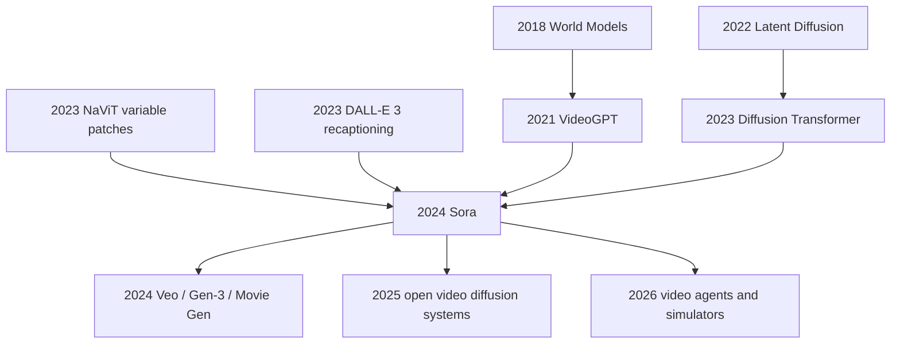

# Sora Technical Report - 把视频生成模型推向世界模拟器

> **2024 年 2 月 15 日，OpenAI 发布 [Video generation models as world simulators](https://openai.com/index/video-generation-models-as-world-simulators/)，没有 arXiv、没有代码、没有训练数据配方、没有参数量，却用一组一分钟高清视频样片把“文本生成视频”从效果 demo 推到了世界模型争论的中心。** Sora 的技术报告真正让人警醒的地方，不是它宣布了一个可复现 recipe，而是它把视频、图像、时间、镜头运动、物体遮挡和语言控制都压进同一种 spacetime patch 表示里：公开事实足够清楚，工程细节又故意留白。读这篇报告，要同时看到两个事实：Sora 证明了扩散 Transformer 可以在视频尺度上吃掉多样视觉数据，也暴露了闭源前沿模型报告越来越像“能力证据包”而不是传统论文。

## 一句话总结

Tim Brooks、Bill Peebles、Connor Holmes 等 13 位作者在 OpenAI 2024 年发布的 Sora 技术报告，把 [DDPM](../era4_foundation_models/2020_ddpm.md) 和 [Stable Diffusion](../era4_foundation_models/2022_stable_diffusion.md) 之后的 latent diffusion 路线推进到视频尺度：先用视频压缩网络把原始视频变成时空潜表示，再切成 spacetime patches 作为 Transformer token，让扩散模型学习 $\epsilon_\theta(z_t, t, c)$ 或等价的去噪目标，并用 DALL·E 3 风格 recaptioning 把短提示扩写成可控制的长 caption。它替代的失败 baseline 不是某个公开排行榜第二名，而是 2024 年前视频生成常见的三种限制：固定 4 秒、固定 256×256、固定正方形裁剪；样片只能生成短动作却难以保持长程物体一致性；caption 太弱导致文本控制像抽奖。反直觉之处在于，报告最有影响力的“实验”几乎全是定性样片：一分钟高保真视频、1920×1080 和 1080×1920 原生宽高比、最高 2048×2048 图像、向前/向后扩展视频、零样式 video-to-video 编辑、Minecraft 式数字世界模拟。Sora 没有公布完整训练细节，因此这篇 deep note 会把公开事实和结构化解释分开；它的历史地位在于，把视频生成从“漂亮 clip 生成器”改写成通向视觉世界模拟器的 scaling 假说，并直接点燃 Veo、Gen-3、Movie Gen 和开源视频扩散系统的追赶。

---

## 历史背景

### Sora 出现前的视频生成瓶颈

Sora 出现前，视频生成长期卡在一个尴尬位置：图像生成已经被 diffusion、latent diffusion 和文本图像对齐推到可商用水准，视频生成却仍像“会动的图像拼接”。早期 RNN、GAN、autoregressive transformer 和 diffusion video 模型都能展示短片段，但常见约束很硬：片长短、分辨率低、宽高比固定、镜头运动弱、人物或物体出画后难以保持身份，文本提示更像风格建议而不是可控脚本。OpenAI 报告开头点名这一背景：很多先前方法关注窄类别、短视频或固定尺寸视频，而 Sora 被定位成 generalist model of visual data。

这个瓶颈不是单一模块造成的。视频比图像多了时间维度，计算量随帧数、分辨率和 token 数一起膨胀；视频还要求物体在遮挡、转身、镜头切换和动作交互中保持一致。一个图像模型可以凭单帧纹理骗过人眼，视频模型必须在几十秒内不让空间、身份和因果关系崩塌。Sora 的历史震动，正来自它把这些约束同时推远：报告宣称 largest model 可以生成一分钟高保真视频，并展示原生横屏、竖屏、视频扩展、图像动画、video-to-video 编辑和数字世界模拟。

| 阶段 | 典型路线 | 能做什么 | 主要瓶颈 |
|---|---|---|---|
| 2015-2018 | RNN / GAN 视频生成 | 生成短动作、学习简单动态 | 分辨率低、训练不稳 |
| 2021 | VideoGPT / VQ token | 把视频离散化后自回归生成 | 长视频成本高、局部错误累积 |
| 2022 | Imagen Video / cascaded diffusion | 高质量短视频样片 | 多级 pipeline 复杂、尺寸常被标准化 |
| 2023 | latent video diffusion | 在潜空间提高效率 | 长程一致性和文本控制仍弱 |
| 2024 | Sora | 变长、变尺寸、变宽高比的一分钟视频 | 细节未披露，物理模拟仍不可靠 |

### 三条技术线在 2024 年前汇合

第一条线是 latent diffusion。Stable Diffusion 证明，先把像素压到较小的潜空间，再在潜变量上做扩散生成，可以把高分辨率视觉生成的成本降下来。Sora 报告公开说，它训练一个 video compression network，把视频在时间和空间上压缩到低维 latent representation，生成也发生在这个压缩潜空间里，最后用 decoder 回到像素空间。这不是 Stable Diffusion 的简单视频版，但历史逻辑清楚：要让视频扩散可扩展，必须先把像素级负担拿掉。

第二条线是 Transformer patch 化。ViT、NaViT、MAE 和 DiT 逐步证明，把图像切成 patch token 后让 Transformer 处理，是视觉 scaling 的通用接口。Sora 报告把这个接口推广到 spacetime latent patches：不是只切二维图像，而是在压缩后的视频 latent 上切时空块。这样，视频和图像都可以被看作 patch 序列；图像只是时间长度为一帧的视频。这一抽象让“视频的时长、分辨率、宽高比”从固定输入格式变成可变 token 网格。

第三条线是语言控制。DALL·E 3 的 recaptioning 证明，高质量 caption 不是文本图像生成的装饰，而是控制质量的核心数据工程。Sora 明确复用这条思路：训练一个高度描述性的 captioner 给视频训练集生成 caption，并用 GPT 把用户短提示扩写成详细 caption 后送入视频模型。换句话说，Sora 的“文本理解”不是只靠用户 prompt，而是靠 caption 数据质量、prompt expansion 和视频生成模型共同完成。

### OpenAI 发布语境：从 GPT-4 到 Sora

Sora 的发布时间也很关键。2023 年 GPT-4 Technical Report 已经确立了一种闭源 frontier report 体裁：公开能力、评测、风险和若干方法轮廓，但不公开足以复现的 recipe。Sora 延续了这种体裁，而且更极端。报告明确写道，技术报告聚焦两件事：把各种视觉数据统一成适合大规模训练的表示，以及对 Sora 能力和局限做定性评估；模型和实现细节不包含在报告中。

这意味着 Sora 不是一篇传统“读完就能复现”的机器学习论文。它更像一次研究声明：OpenAI 认为，扩展视频生成模型是通向物理和数字世界通用模拟器的有希望路径。标题里的 world simulators 不是随便写的营销词，而是把视频生成放进世界模型、具身智能、游戏模拟、机器人和视觉预测的更长历史里。Sora 样片让外界第一次强烈感到，视频模型可能不只是生成电影素材，也可能在学习某种隐式世界状态。

### 为什么它被命名为世界模拟器

“世界模拟器”这个说法容易被误解。Sora 并没有公开一个显式 3D 引擎，也没有证明它学到了牛顿力学，更没有提供可交互环境 API。报告的论点更谨慎：当视频模型在足够多样的视觉数据上扩展时，会出现若干 emergent simulation capabilities，例如 3D consistency、long-range coherence、object permanence、简单交互造成的状态改变、以及对 Minecraft 这类数字世界的零样本模拟。

这些能力的意义在于，它们不是通过显式 3D、物体、场景图或物理引擎归纳偏置硬塞进去的，而是从规模化视频生成目标中冒出来的。这个命题和 GPT-3/GPT-4 的语言 scaling 叙事相互呼应：如果 next-token prediction 能学到世界知识和推理雏形，那么 next-spacetime-patch denoising 是否能学到视觉世界的动态规律？Sora 没有给出最终答案，但它把这个问题变成了 2024 年之后视频生成研究的中心问题。

## 研究背景与动机

### 从生成短片到学习视觉世界

Sora 的动机不是“再做一个更漂亮的 text-to-video demo”。真正的问题是：视觉数据能不能像文本一样被统一 token 化，然后在大规模模型中产生通用能力？LLM 的成功部分来自 token 接口：代码、数学、自然语言和任务格式都能变成同一串 token。Sora 报告直接借用了这个类比：LLM 有 text tokens，Sora 有 visual patches。区别在于，Sora 的 token 不只是空间 patch，而是压缩潜空间中的时空 patch。

这个动机解释了为什么报告反复强调 variable durations, resolutions, aspect ratios。若只想生成固定规格视频，统一 resize/crop/trim 足够方便；若想训练 generalist visual data model，固定规格会丢掉真实世界的构图、镜头语言、纵横屏分布和时间结构。Sora 选择在原生尺寸上训练，是为了让模型直接学习视觉数据本来的形态，而不是学习被数据管线裁剪过的世界。

### 报告真正想证明什么

报告要证明的第一件事是表示统一：视频和图像可以通过 compressed latent + spacetime patch 进入同一 Transformer 扩散模型。第二件事是 scaling 有效：随着训练 compute 增加，同一 seed 和输入下的样片质量明显改善。第三件事是语言控制可增强：recaptioning 和 prompt expansion 能提升 text fidelity 和整体质量。第四件事是 emergent simulation 值得认真对待：模型能表现出 3D 一致性、物体持久性、简单状态变化和数字世界模拟。

这些论点都建立在公开样片和定性观察上，而不是完整 benchmark 表。对传统学术读者来说，这会显得证据不够硬；对工业前沿模型来说，它又足够改变方向。Sora 的报告像 GPT-4 一样，把“能力可见性”放在“方法可复现性”之前。这个优先级本身就是 2024 年 AI 研究格局的一部分。

### 披露边界本身也是历史事实

Sora 最需要被谨慎阅读的地方，是它主动承认不披露模型和实现细节。参数量、数据来源、数据过滤、训练 compute、优化器、captioner 结构、decoder 质量、采样步数、安全过滤、评测协议都没有完整给出。因此，任何试图把 Sora 写成开源 recipe 的解读都会误导读者。

但披露不足不等于没有方法贡献。公开文本已经足够确认几个关键设计：视频压缩网络、spacetime latent patches、diffusion transformer、原生尺寸训练、recaptioning、image/video prompting、定性能力分析和明确局限。Sora 的历史位置恰恰在这里：它既是视频生成 scaling 的强信号，也是闭源技术报告时代的典型文本。读者必须学会同时分析“它展示了什么”和“它没有让我们验证什么”。

---

## 方法详解

Sora 的方法详解必须先划清边界。OpenAI 报告没有公开模型参数量、层数、训练数据组成、训练 compute、优化器、采样步数、安全过滤细节，也没有代码。因此，本节不是复刻 OpenAI 内部训练配方，而是把报告明确披露的公开事实、可由这些事实组织出的系统解释、以及不能假装知道的部分拆开。公开事实很清楚：Sora 在压缩潜空间中生成视频和图像，把视觉数据切成 spacetime latent patches，用 diffusion Transformer 做去噪预测，训练时支持变长、变分辨率、变宽高比，并用 recaptioning 增强语言条件。

### 公开事实与结构化解释的边界

报告最关键的一句话是：model and implementation details are not included。它允许我们讲 Sora 的高层架构，但不允许我们编造 recipe。下面这张表把可说、可解释、不可说三层分开：

| 层级 | 公开事实 | 结构化解释 | 不应假装知道 |
|---|---|---|---|
| 表示 | 视频先压缩成低维 latent，再切 spacetime patches | patch 序列让视频和图像共享 Transformer 接口 | patch 大小、latent 通道数、压缩倍率 |
| 生成目标 | Sora 是 text-conditional diffusion model | 模型学习从 noisy patches 预测 clean patches | 噪声日程、parameterization、loss 权重 |
| 架构 | Sora 是 diffusion transformer | DiT 类骨架适合视觉 token scaling | 层数、宽度、attention 变体 |
| 数据 | 视频和图像按原生尺寸训练 | variable token grid 保留构图和时间结构 | 数据来源、过滤策略、授权范围 |
| 语言 | DALL·E 3 recaptioning 用于视频 caption | caption 质量提高 prompt fidelity | captioner 模型结构、人工审核流程 |

### 整体框架：latent spacetime-patch diffusion transformer

Sora 可以被抽象成四步系统。第一步，视频压缩网络把原始视频 $x$ 映射到时空潜变量 $z$，并配套 decoder 把生成的 $\hat z$ 还原为像素。第二步，patchifier 把 $z$ 切成时空块序列 $p_1,\dots,p_N$，这些 patch 像 text token 一样进入 Transformer。第三步，扩散过程在 patch latent 上加噪，模型在文本条件 $c$ 下预测 clean patch 或噪声。第四步，采样阶段从按目标时长、分辨率、宽高比排列的随机 patch grid 开始，逐步去噪并解码成视频。

$$
z = E(x), \qquad \{p_i\}_{i=1}^{N}=\mathrm{Patchify}(z), \qquad \hat{x}=D(\hat{z}).
$$

| 阶段 | 输入 | 输出 | 报告中的作用 |
|---|---|---|---|
| 压缩 | raw video / image | spatiotemporal latent | 降低维度，让视频生成可扩展 |
| patch 化 | compressed latent | spacetime patch tokens | 统一视频和图像表示 |
| 去噪训练 | noisy patches + text | clean patch / noise prediction | 学习条件生成分布 |
| 原生尺寸训练 | variable duration/resolution/aspect ratio | flexible token grids | 保留构图，支持横屏和竖屏 |
| 解码 | generated latents | pixel video / image | 把潜空间样本还原为可观看内容 |

这个框架的核心不是某个单点技巧，而是“所有视觉数据都变成可扩展 token 序列”。如果文本世界的统一接口是 token，那么 Sora 的统一接口就是 spacetime patches。

### 关键设计 1：把视频压进可生成的潜空间

视频像素空间太大。假设一个视频有 $T$ 帧、分辨率 $H\times W$、3 个颜色通道，原始张量大小随 $T H W$ 增长。若直接在像素上扩散，Transformer token 数和去噪成本会很快失控。Sora 因此先训练一个 video compression network，把时间和空间一起压缩：

$$
E: \mathbb{R}^{T\times H\times W\times 3}\rightarrow \mathbb{R}^{T'\times H'\times W'\times C}, \qquad T'H'W' \ll THW.
$$

这一步的公开事实是存在压缩网络和对应 decoder；结构化解释是，它承担了类似 latent diffusion 中 VAE 的角色，但需要同时照顾时间一致性。压缩器如果过强，会丢掉细节；压缩器如果太弱，后续 Transformer 仍然太贵。Sora 报告没有给出压缩倍率或重建指标，所以我们不能评价其具体设计，只能确认 latent-space generation 是可扩展视频生成的前提。

### 关键设计 2：spacetime patches 让尺寸成为条件

传统视频生成常把所有视频裁成同一尺寸和时长，例如 4 秒、256×256、正方形裁剪。这样训练方便，却把真实数据的构图和时间结构剪坏。Sora 报告强调 native aspect ratio training，并展示同一模型可以采样 1920×1080 横屏、1080×1920 竖屏和其他尺寸。关键在于：压缩 latent 被切成 spacetime patches 后，不同视频只是 patch grid 的形状不同。

$$
N = \left\lceil\frac{T'}{\tau}\right\rceil
    \left\lceil\frac{H'}{h}\right\rceil
    \left\lceil\frac{W'}{w}\right\rceil,
$$

其中 $\tau,h,w$ 是时空 patch 的大小，$N$ 是 token 数。推理时，如果想生成竖屏视频，就初始化一个竖屏形状的 noise patch grid；如果想生成单张图像，就令时间长度为一帧。这个设计把“输出格式”从后处理问题前移到生成过程本身。

| 训练策略 | 数据处理 | 优点 | 代价 |
|---|---|---|---|
| 固定正方形裁剪 | resize/crop 到同一尺寸 | batch 简单，旧 pipeline 兼容 | 主体被裁、构图失真 |
| 固定短片段 | trim 到同一长度 | 时间 token 数可控 | 学不到长程依赖 |
| 原生宽高比训练 | 保留横屏、竖屏和中间比例 | 构图更自然，设备适配直接 | batching 和 attention 更复杂 |
| Sora 式 patch grid | 以 patch 序列承载不同形状 | 同一模型控制时长和尺寸 | 需要强工程和数据调度 |

### 关键设计 3：扩散 Transformer 做去噪预测

Sora 是 diffusion model，也是 diffusion transformer。扩散模型的训练可以抽象成：给 clean latent patch $z_0$ 加噪得到 $z_t$，模型在时间步 $t$ 和条件 caption $c$ 下预测噪声或 clean latent：

$$
\mathcal{L}(\theta)=\mathbb{E}_{z_0,t,\epsilon,c}\left[\left\|\epsilon-\epsilon_\theta(z_t,t,c)\right\|_2^2\right],
\qquad z_t=\alpha_t z_0+\sigma_t\epsilon.
$$

为什么用 Transformer？因为 patch 序列一旦形成，视频生成就变成了长 token 序列建模问题。局部卷积能处理纹理，但长程物体一致性、镜头运动和跨帧依赖需要模型在远距离 patch 间交换信息。DiT 的历史意义在这里接上 Sora：当视觉数据被 token 化后，Transformer 的 scaling 属性可以从语言、图像迁移到视频。

报告展示了一个重要定性现象：固定 seed 和输入时，训练 compute 增加会让样片质量明显提升。这不是严格 scaling law 曲线，但它支持一个工程判断：视频 diffusion transformer 至少在公开展示的范围内没有迅速撞墙。Sora 的方法论贡献，正是把“视频也能像语言/图像一样通过 token + Transformer + scale 变强”这件事变得可信。

### 关键设计 4：recaptioning 把语言变成控制接口

视频生成的控制质量高度依赖 caption。如果训练视频只有粗略标签，模型很难学会“红色毛衣的人向左转身后拿起玻璃杯”这种细粒度条件。Sora 复用 DALL·E 3 的 recaptioning 技术：先训练高度描述性的 captioner，再给训练集视频生成详细 caption；用户输入短 prompt 时，再用 GPT 扩写成更详细的 caption 送入视频模型。

这一步经常被低估，因为它看起来不像模型架构。但对 text-to-video 来说，caption 就是监督信号的语言侧。如果 caption 描述不了镜头、主体、动作、背景、风格和时间变化，模型就算视觉能力很强，也无法稳定遵循用户意图。Sora 报告说，descriptive captions 改善了 text fidelity 和整体视频质量；这意味着数据语义密度本身就是方法的一部分。

### 伪代码：概念化训练与采样流程

下面的伪代码不是 OpenAI 内部实现，而是根据公开报告整理出的概念流程。它省略了分布式训练、数据过滤、安全系统、具体噪声日程和 decoder 细节，只表达 Sora 报告可确认的结构：

```python
def train_sora_like_model(videos, images, captioner, encoder, decoder, dit, noise_schedule):
    for visual_item in mix(videos, images):
        caption = captioner.describe(visual_item)
        latent = encoder.compress_spacetime(visual_item)
        patches = patchify_spacetime(latent)

        step = noise_schedule.sample_step()
        noise = sample_gaussian_like(patches)
        noisy_patches = noise_schedule.add_noise(patches, noise, step)

        predicted_noise = dit(noisy_patches, step=step, text=caption)
        loss = mse(predicted_noise, noise)
        loss.backward()


def sample_sora_like_model(prompt, output_shape, gpt_rewriter, dit, decoder, noise_schedule):
    detailed_caption = gpt_rewriter.expand(prompt)
    noisy_grid = initialize_spacetime_noise(output_shape)
    denoised_patches = iterative_denoise(noisy_grid, detailed_caption, dit, noise_schedule)
    latent = unpatchify_spacetime(denoised_patches, output_shape)
    return decoder.to_pixels(latent)
```

| 能力 | 来自哪一层 | 公开证据 | 注意事项 |
|---|---|---|---|
| 一分钟视频 | patch latent + scalable DiT | report abstract and samples | 未给稳定成功率 |
| 横屏/竖屏生成 | native aspect ratio patch grid | 1920×1080 and 1080×1920 examples | 未公开 batching 细节 |
| 图像生成 | one-frame video view | up to 2048×2048 images | 不是独立图像模型说明 |
| 视频扩展/连接 | conditional denoising over video context | forward/backward extension demos | 失败率未知 |
| 世界模拟迹象 | long-range visual dynamics | 3D consistency, object permanence, Minecraft | 不是显式物理引擎 |

读 Sora 的方法，最重要的是不把概念图当复现配方。公开事实已经足够说明它为什么重要：视频生成被重新表述为“在统一视觉 token 空间中做条件扩散”。但工程上真正难的部分，仍然被 OpenAI 留在黑箱里。

---

## 失败案例

### 为什么 Sora 没有传统失败 baseline 表

Sora 报告没有给传统论文式的 ablation 表，也没有给公开 benchmark 上的 FVD、CLIP-score、human preference 胜率或成功率曲线。它的失败案例必须换一种读法：不是“模型 A 比模型 B 高多少分”，而是“2024 年前视频生成系统常见的设计假设，在哪些地方被 Sora 的公开样片和技术描述绕开了”。这也意味着我们不能编造数字。Sora 的失败 baseline 是一组方法路线和产品体验，而不是一个完整复现实验表。

### 失败路线 1：固定尺寸短视频训练

第一条被挑战的路线，是把所有视频统一裁成短片和固定正方形尺寸。这样做方便 batching，也方便沿用图像模型 pipeline，但会造成两个损失：一是构图被裁掉，主体可能只剩半个；二是模型训练时没有真正看到横屏、竖屏、长镜头、不同设备画幅带来的视觉分布。Sora 报告专门比较了 native aspect ratio training 和 square crop 版本，指出 square crop 模型有时会把主体生成到画面外，而 Sora 的构图更好。

### 失败路线 2：把视频当作图像帧的后处理

第二条失败路线，是把视频生成理解成“生成好看的帧，再用插帧或时序平滑把它们粘起来”。这种思路可以制造局部视觉质量，却很难保证长程 object permanence。角色离开画面再回来时是否还是同一个角色？镜头移动时背景和前景是否保持 3D 一致？物体被吃掉、画布被画上新笔触后，状态是否持续？Sora 的公开样片并不总是成功，但它把这些问题推到了生成目标内部，而不是交给后处理补救。

### 失败路线 3：弱 caption 导致弱控制

第三条失败路线，是把 caption 当作附属元数据。早期视频数据集经常只有短标签或粗略描述，这会让模型学到“视频大概是什么”，却学不到“动作如何随时间展开”。Sora 的 recaptioning 直接针对这一点：用高度描述性的 captioner 给训练视频生成更细文本，再用 GPT 把用户短提示扩写成详细条件。失败 baseline 因此不是模型太小，而是语言监督太薄。

### 失败路线 4：把模拟能力误读为物理引擎

第四条失败路线反而来自对 Sora 的过度解读：看到样片能维持 3D 一致性和物体持久性，就把它当成已经学会真实物理的世界引擎。报告自己否定了这种读法。Sora 不准确模拟许多基础互动，例如玻璃破碎；吃东西这类动作也不总能产生正确的物体状态改变；长样片仍可能出现不一致或物体凭空出现。Sora 的强处是从视觉数据中学到可生成的动态先验，不是替代显式物理仿真。

| 失败 baseline | 被挑战的假设 | Sora 的回应 | 仍未解决的问题 |
|---|---|---|---|
| 固定 4 秒 / 256×256 | 标准化尺寸足够训练视频模型 | 原生时长、分辨率、宽高比训练 | token 和 batching 成本未公开 |
| square crop | 裁成正方形不会伤害内容 | 原生宽高比改善构图 | 数据调度细节未知 |
| 帧级生成 + 后处理 | 时间一致性可由后处理补 | 直接在时空 patch 上建模 | 长样片仍可能漂移 |
| 弱 caption | 粗标签足够 text-to-video | recaptioning 提高 text fidelity | captioner 偏差和审核未知 |

## 实验关键数据

### 公开报告里的关键证据

Sora 的实验关键数据主要是公开定性证据和少量可量化规格，而不是传统 benchmark 表。报告最硬的数字包括：largest model capable of generating a minute of high fidelity video；可以采样 1920×1080 横屏视频和 1080×1920 竖屏视频；图像生成最高到 2048×2048；训练 compute 增加到 base compute、4× compute、32× compute 时，固定 seed 和输入下样片质量明显提高。这些数字不等价于完整评测，但足以说明系统设计瞄准的是可扩展通用视频生成，而不是短 demo。

| 证据类型 | 报告公开内容 | 它支持的结论 | 不能推出什么 |
|---|---|---|---|
| 时长 | 一分钟高保真视频 | 长程生成能力显著推进 | 不能推出稳定成功率 |
| 尺寸 | 1920×1080 与 1080×1920 | 原生横竖屏采样可行 | 不能推出所有分辨率同质稳定 |
| 图像 | 最高 2048×2048 | 图像可视为一帧视频 | 不能推出超越专用图像模型 |
| scaling | base / 4× / 32× compute 样片改善 | DiT 视频 scaling 有效 | 不能推出完整 scaling law |
| 语言 | recaptioning 提升 text fidelity | caption 数据工程关键 | 不能推出 prompt 可靠遵循所有细节 |
| 模拟 | 3D consistency、object permanence、Minecraft | 出现隐式动态建模迹象 | 不能推出真实物理引擎 |

### 定性评测如何读

定性评测的优点是能直接展示人类关心的现象：镜头是否自然，角色是否一致，提示词是否被遵循，长镜头是否崩溃，世界是否有可感知的动态规律。视频生成尤其需要这种展示，因为很多失败很难被单一数字覆盖。Sora 样片展示的浪潮、街景、动物、人物、游戏世界和视频编辑任务，让外界看到模型在分布多样性和镜头语言上的跃迁。

但定性评测的风险也必须写清楚。样片可能经过筛选；失败率、重试次数、prompt 调参、人工选择标准都没有公开。报告中的“often, though not always”很关键：Sora 经常能保持短程和长程依赖，但并不总能做到。因此，Sora 的实验结论应读成“上限能力和研究方向被证明”，而不是“平均可靠性已经被完整证明”。

### 未披露数字也是实验结论的一部分

Sora 最重要的实验缺口，是缺少公开可复验的量化协议。没有公开视频测试集结果，没有统一人类偏好评测，没有失败率分布，没有不同 prompt 类型的成功率，没有与 Runway、Pika、Imagen Video 或其他系统的严格对照，也没有安全和版权过滤的细节。这些缺口不是小事，它们决定了研究社区能否把 Sora 的 claims 转化成可比较科学结论。

| 未披露项目 | 为什么重要 | 对读者的影响 | 合理读法 |
|---|---|---|---|
| 数据来源 | 视频版权和分布决定能力边界 | 无法审计数据治理 | 把数据视为黑箱变量 |
| 成功率 | 样片是否代表平均情况 | 无法估计产品可靠性 | 把样片看作能力上界 |
| 计算量 | scaling 成本和碳/资金成本 | 无法判断可复现门槛 | 只讨论方向，不猜成本 |
| 安全过滤 | 视频生成滥用风险高 | 无法评价防护强度 | 需参考单独安全材料 |
| 对照实验 | 确认哪个设计真正起作用 | 无法分离模块贡献 | 不把报告当 ablation 论文 |

这种实验形态让 Sora 同时强大和不完整。它强大，是因为公开样片足以改变研究方向；它不完整，是因为外部研究者无法复验平均性能。深度笔记必须保留这种张力，而不是把营销材料改写成传统论文表格。

---

## 思想史脉络

Sora 的思想史不是单一“视频生成模型变大”的故事。它把三条旧线接在一起：世界模型希望智能体能在潜空间里预测环境；视觉生成希望把像素压进可扩展 latent；Transformer scaling 希望把不同模态统一成 token 序列。Sora 的新意，是把这些线索放到视频生成这个最难欺骗人眼的模态上，并用“world simulators”这个标题把审美生成、物理预测和数字环境模拟放进同一个叙事。

### 前世：从世界模型到视觉 token

2018 年 World Models 把“在潜空间中模拟环境”做成了强化学习和生成建模之间的桥。2021 年 VideoGPT 证明，视频可以先被压缩成离散 token，再由 Transformer 自回归生成。2022 年 latent diffusion 证明，视觉生成不必在像素空间硬扛成本。2023 年 DiT 又证明，扩散模型可以用 Transformer 作为可扩展骨架。这些工作没有直接给出 Sora，但它们分别解决了 Sora 需要的四个概念：潜空间、视频 token、扩散生成、Transformer scaling。

### 今生：Sora 把视频生成改写成模拟假说

Sora 报告把问题从“如何生成更清晰的视频”改写成“规模化视频生成是否能产生世界模拟能力”。这个转写非常重要，因为它让视频生成不再只是创意工具，也成为视觉世界建模的候选路径。报告列出的 3D consistency、long-range coherence、object permanence、interacting with the world 和 Minecraft simulation，都在暗示同一件事：如果模型要生成可信视频，它必须在内部保留某种关于场景、物体、动作和时间的状态。



### 误读：Sora 不是完整物理世界引擎

最常见的误读，是把 Sora 的样片当作“物理规律已经解决”的证据。报告自己的措辞比外界讨论谨慎得多：Sora exhibits numerous limitations as a simulator。它可以模拟某些方面的人、动物和环境，但玻璃破碎、吃东西导致的物体状态变化、长样片不一致和物体凭空出现仍然是失败模式。因此，Sora 更准确的定位是“视觉动态先验的强生成模型”，而不是“可验证物理仿真器”。

另一种误读，是把 Sora 看成纯产品 demo，忽略其方法抽象。即使没有完整 recipe，spacetime patches 这个表示选择仍然改变了后续研究语言。2024 年之后，很多视频模型都围绕长程一致性、原生宽高比、视频编辑、图像到视频、视频扩展和物理一致性展开竞争。Sora 把这些目标放进同一个坐标系。

### 影响：闭源冲击与开源追赶同时发生

Sora 发布后，视频生成很快进入前沿公司竞赛。Google Veo、Runway Gen-3、Meta Movie Gen 等系统都在长视频、镜头控制、视频编辑和高保真样片上回应 Sora。与此同时，开源和半开源社区开始追赶：更高效的 video diffusion、可控 motion 模块、开源数据管线、LoRA 微调、camera control、video-to-video editing 都变成热门方向。Sora 本身不开源，但它把“要追赶什么”说清楚了。

| 思想线索 | Sora 前的形态 | Sora 的转折 | 后续继承者 |
|---|---|---|---|
| 世界模型 | 潜空间预测和智能体环境 | 视频生成被解释为模拟路径 | video agents、robotics simulators |
| latent diffusion | 图像生成降成本 | 视频也在压缩潜空间中生成 | open video diffusion systems |
| Transformer scaling | 文本和图像 token 化 | spacetime patches 成为视频 token | DiT video models |
| recaptioning | DALL·E 3 文本图像控制 | 视频 caption 成为控制核心 | prompt rewriting for video |
| 闭源报告 | GPT-4 式能力证据包 | 视频模型也进入黑箱发布体裁 | Veo、Movie Gen、frontier demos |

Sora 的思想史意义因此有两面：它证明了视频生成模型可以被认真看作世界模拟器候选，也提醒研究社区，最重要的能力展示可能来自无法复现的闭源系统。前者推动方法，后者推动开源替代和评测规范。

---

## 当代视角

### 2026 年回看：它改变了什么

从 2026 年回看，Sora 改变了三件事。第一，它把视频生成的目标从“短片质量”改成“长程视觉一致性”。Sora 之前，很多讨论集中在单个 clip 是否清晰；Sora 之后，研究者和产品团队更关心角色在一分钟内是否保持身份、镜头运动是否像真实摄影、物体遮挡后是否仍存在、动作是否改变世界状态。

第二，它把视频模型放进世界模型和智能体讨论。Minecraft 样片、3D consistency 和 object permanence 让人开始想象：如果模型能预测视频中的世界动态，它是否可以帮助机器人、游戏智能体、规划系统或仿真环境？这个想象还没有完全实现，但研究问题被改写了。视频生成不再只是内容生产，也可能是学习可行动世界表示的一条路。

第三，它强化了闭源 frontier demo 的行业节奏。Sora 没有公开 recipe，却足以推动竞争对手和开源社区重排优先级。2024 年之后，Veo、Gen-3、Movie Gen、Wan、HunyuanVideo 等系统的叙事都绕不开长视频、控制、编辑和模拟能力。Sora 像 GPT-4 一样，用不可复现的公开能力展示重置了目标线。

### 今天仍站得住的判断

Sora 报告里最站得住的判断，是视频和图像应该共享统一视觉 token 接口。spacetime latent patches 让图像变成一帧视频，让不同画幅变成不同 patch grid，让生成格式成为模型条件的一部分。这一抽象到今天仍然有效，因为后续视频模型几乎都要解决类似的可变尺寸、长程一致性和条件控制问题。

第二个仍站得住的判断，是 caption 数据工程决定控制质量。无论后来的模型使用何种架构，text-to-video 都必须解决“训练文本是否足够描述时间变化”的问题。更好的 prompt rewriting、更细的 motion caption、更强的视觉语言标注、更可靠的安全过滤，都是 Sora recaptioning 思路的延伸。

| 判断 | 2024 年证据 | 2026 年状态 | 为什么仍重要 |
|---|---|---|---|
| 视频需要 latent 生成 | Sora 在压缩潜空间训练和生成 | 主流视频扩散仍依赖压缩表示 | 像素空间成本太高 |
| patch token 是统一接口 | spacetime patches 同时覆盖图像和视频 | 可变尺寸视频模型继续使用 token grid | 支持长宽时长控制 |
| 原生宽高比有价值 | square crop 对构图有伤害 | 产品视频需要横屏、竖屏、方屏 | 后处理裁剪不够 |
| recaptioning 是方法 | 描述性 caption 提升 text fidelity | prompt rewriting 成为标配 | 文本监督决定可控性 |
| scaling 值得继续 | 4×/32× compute 样片改善 | frontier video labs 持续加大模型 | 仍缺公开 scaling law |

### 今天站不住的假设

最站不住的假设，是“只要继续扩大视频生成模型，就会自然得到可靠世界模拟器”。Sora 展示了 emergent simulation capabilities，但也展示了局限：错误物理、错误状态变化、长程不一致、物体凭空出现。到 2026 年，更合理的看法是：视频生成目标能学到强视觉先验，但要成为可用于机器人或科学仿真的世界模型，还需要交互、动作条件、状态估计、约束验证和可控环境反馈。

第二个站不住的假设，是“好看的样片足以证明平均能力”。视频模型的失败高度依赖 prompt、采样、筛选和重试。Sora 样片证明能力上界，但不能替代系统性评测。后来的视频生成研究越来越需要公开 failure taxonomy、人类偏好协议、prompt 分布、时长分层指标、物理一致性测试和版权/安全审计。

## 局限与展望

### 技术局限

Sora 的技术局限首先是物理和因果。报告自己承认，模型不能准确模拟很多基础互动，例如玻璃破碎；吃东西这类动作也不总能让物体状态正确变化。这说明模型学到的是视觉统计和动态先验，而不是可验证的因果世界模型。对内容生成来说，这可能只是偶发瑕疵；对机器人、仿真和规划来说，这会成为核心问题。

第二个局限是长程可靠性。Sora 可以生成一分钟视频，但“可以生成”不等于“稳定生成”。长视频越长，身份、几何、物体数量、背景布局和动作目标越容易漂移。视频模型需要的不只是局部去噪质量，还需要记忆、状态绑定和约束传播。未来方法可能要结合显式 3D 表示、scene graph、tracking、world state memory 或 test-time correction。

### 披露局限

Sora 最大的科研局限，是不可复现。报告没有给参数量、数据、训练 compute、评测协议和失败率。外部研究者只能观察样片和产品行为，不能独立验证模型内部机制。这使得 Sora 更像“方向标”而不是“可继承 recipe”。它对产业足够有力，对科学共同体则留下很多无法回答的问题。

披露不足也影响安全讨论。视频生成涉及肖像、版权、误导性媒体、政治宣传、儿童安全和深度伪造。没有数据治理、过滤策略、红队协议和部署限制的详细说明，外界很难评估风险缓解是否足够。未来前沿视频模型报告需要比 Sora 更系统地公开安全评测和治理接口。

### 如果今天重写

如果 2026 年重写 Sora 技术报告，至少应补四类内容。第一，给出标准化评测：按时长、分辨率、prompt 类型、动作复杂度、人物一致性、物理交互分别报告成功率。第二，公开失败 taxonomy：哪些场景最容易出错，错误是物体消失、身份漂移、运动不连续、还是因果状态错误。第三，分层披露系统：区分 base video model、captioner、prompt rewriter、safety filter、decoder 和产品选择机制。第四，引入第三方评测，让闭源系统的 claims 至少能被外部协议检验。

展望上，Sora 之后的关键问题不是“能不能生成更高清的视频”，而是“视频模型能不能成为可验证、可交互、可控制的世界模型”。这需要从纯 text-to-video 走向 action-conditioned video prediction、interactive simulation、tool-verified editing、robotics data grounding 和 causal consistency evaluation。Sora 打开了门，但门后不是一条单纯扩大模型的直路。

## 相关工作与启发

### 直接继承

Sora 直接继承了 latent diffusion、Diffusion Transformer、VideoGPT、Imagen Video、DALL·E 3 recaptioning 和 NaViT 式可变尺寸视觉 token 的思想。latent diffusion 给它效率基础，DiT 给它可扩展骨架，VideoGPT 给它视频 token 化前史，Imagen Video 给它高质量视频扩散参照，DALL·E 3 给它 caption 数据工程，NaViT 给它不同宽高比 patch 化的先例。

它的后继则分成三条线。第一条是闭源前沿系统：Veo、Gen-3、Movie Gen、Kling 等继续追求长视频、电影控制和编辑能力。第二条是开放视频模型：围绕更小成本、更公开数据、更可微调的 video diffusion 展开。第三条是世界模型与智能体：把视频生成和动作、环境反馈、机器人数据、游戏模拟结合起来，尝试把“会生成视频”推进到“会预测行动后果”。

### 给后来论文的启发

Sora 给后来论文最大的启发，是不要把视频生成只当作图像生成的时间扩展。真正难的问题在时空表示、长程绑定、语言监督、原生格式、交互状态和安全评测。后来的好论文需要说明：模型如何记住物体，如何处理遮挡，如何控制镜头，如何跟随复杂动作，如何评估物理一致性，如何避免样片筛选掩盖失败。

第二个启发是，闭源展示会制造开源任务清单。Sora 没有公开 recipe，但把目标拆得很清楚：一分钟、原生宽高比、图像到视频、视频扩展、视频编辑、世界模拟迹象、文本 fidelity。开源社区可以逐项追赶，并用更透明的评测补上闭源报告没有给出的平均性能。

## 相关资源

### 论文与官方材料

| 资源 | 链接 | 用途 |
|---|---|---|
| Sora technical report | https://openai.com/index/video-generation-models-as-world-simulators/ | 原始技术报告和样片说明 |
| Sora overview | https://openai.com/sora/ | 产品概览和公开视频能力 |
| DALL·E 3 report | https://cdn.openai.com/papers/dall-e-3.pdf | recaptioning 前序工作 |
| Diffusion Transformer | https://arxiv.org/abs/2212.09748 | DiT 骨架前序工作 |
| Latent Diffusion Models | https://arxiv.org/abs/2112.10752 | 潜空间扩散基础 |

### 推荐阅读路径

如果想理解 Sora 的技术来源，先读 latent diffusion 和 DiT，再读 VideoGPT、Imagen Video、Align your Latents，最后读 Sora 报告；这样能看出压缩潜空间、视频 token 化和扩散 Transformer 如何汇合。如果想理解 Sora 的思想史意义，先读 World Models，再读 GPT-4 Technical Report，最后看 Veo、Movie Gen 和开源视频模型的后续材料；这样能看出“世界模拟器”既是技术假说，也是闭源前沿模型重置研究议程的方式。

真正值得继续追的问题，不是猜 OpenAI 内部参数，而是把 Sora 暴露出的缺口做实：公开视频评测、失败 taxonomy、长程一致性指标、动作条件视频预测、可审计数据治理、视频安全红队、以及能把视觉生成和真实世界反馈连起来的模型接口。


---

> 🌐 [English version](/en/era5_genai_explosion/2024_sora/) · 📚 awesome-papers project · CC-BY-NC