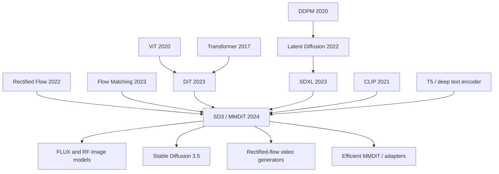

# Stable Diffusion 3 / Rectified Flow — 把文生图从 U-Net 扩散推进到可缩放的 MMDiT

> **2024 年 3 月 5 日，Stability AI 的 Patrick Esser、Sumith Kulal、Andreas Blattmann、Robin Rombach 等 17 位作者把 [arXiv 2403.03206](https://arxiv.org/abs/2403.03206) 上传为 Stable Diffusion 3 的技术论文。** 这篇论文没有再给 Stable Diffusion 的 U-Net 加一圈补丁，而是把整条文生图管线的两块地基一起换掉：训练目标从弯曲扩散轨迹切到直线 Rectified Flow，骨架从只让图像 token 听文本的 cross-attention U-Net 切到文本和图像可以双向交换信息的 MMDiT。它最抓人的数字不是某个单项 FID，而是 8B 模型在 GenEval 总分从 DALL-E 3 的 0.67 推到 0.74，并把“会写字、能数物体、懂空间关系”变成开源视觉生成模型必须正面回答的问题。

## 一句话总结

Stable Diffusion 3 这篇 2024 年 ICML 论文把 [Stable Diffusion / LDM（2022）](../era4_foundation_models/2022_stable_diffusion.md) 的“VAE latent + 文本条件扩散”保留下来，但把核心训练目标改写为直线插值上的速度预测：$z_t=(1-t)x_0+t\epsilon,\ v_\theta(z_t,t,c)\approx \epsilon-x_0$，再用 logit-normal 采样把训练权重压到中间噪声尺度；同时用 MMDiT 让文本 token 与图像 patch token 进入同一次 attention，而不是像 U-Net cross-attention 那样单向注入。它替代的 baseline 很具体：统一 RF 明显弱于 logit-normal RF，LDM-linear / EDM 在 5-25 步采样下不如重加权 RF，DiT / CrossDiT / UViT 在 CC12M 上都落后于 MMDiT；最后 8B depth=38 + DPO 在 GenEval overall 达到 0.74，高于 DALL-E 3 的 0.67。它的反直觉 lesson 是：文生图下一次跃迁不是“再大一点 U-Net”，而是像 [DiT（2023）](https://arxiv.org/abs/2212.09748) 与 [Flow Matching（2023）](https://openreview.net/forum?id=PqvMRDCJT9t) 那样，把生成模型改造成可缩放、可验证、可少步采样的 token-transport 系统。

---

## 历史背景

### 2023 年底，文生图的主战场从“能不能生成”变成“能不能听懂”

Stable Diffusion v1 的历史意义是把文生图从封闭实验室拉到消费级显卡上；SDXL 的历史意义是把开源图像质量抬到足够商用的水平。但到 2023 年底，下一道墙已经很清楚：图像质量不再是唯一矛盾，**文本理解、空间关系、计数、排版和长提示词服从性**成了文生图模型被用户反复挑错的地方。一个模型可以画出漂亮画面，却把“红色方块在蓝色圆形左边”画反，把两个对象画成三个，把招牌上的英文拼错；这类错误不是审美问题，而是条件建模问题。

闭源模型已经把压力传到开源侧。DALL-E 3 用更强的 captioning 与提示词重写能力显著改善 prompt following；Midjourney v6 与 Ideogram 把“能写字”变成产品卖点；SDXL 虽然仍是最强开源基线之一，但 U-Net + cross-attention 的形态越来越像旧时代架构：文本 token 作为外部条件被图像特征读取，文本流本身不在生成过程中被反复更新，长文本里细粒度约束很容易被压扁。

### 扩散模型的训练目标也卡在采样步数上

另一个压力来自采样效率。DDPM / LDM 的训练目标默认围绕噪声预测、离散 beta schedule 与概率流 ODE 展开，采样轨迹通常是弯的。弯曲轨迹本身不致命，但它让少步采样更难：每减少一步，数值积分误差就更容易累积，图像质量和 prompt 对齐一起掉。EDM、DPM-Solver、DDIM、consistency distillation 都在修这个问题，但许多方法要么偏采样器技巧，要么依赖蒸馏已有模型。

Rectified Flow 和 Flow Matching 给出另一条路线：**训练时就学一条从数据到噪声的直线速度场**。如果路径足够直，少步采样不是事后压缩，而是训练目标本身的性质。问题在于，2022-2023 年这些方法的优势多在小规模或 class-conditional 实验中展示，离“高分辨率、多文本编码器、网页级数据、工业文生图”还有一段距离。SD3 的论文正是把这个理论路线推到大规模 text-to-image 上。

### 作者团队不是第一次改 Stable Diffusion 的地基

Patrick Esser、Robin Rombach、Andreas Blattmann、Dominik Lorenz 等作者来自 CompVis / Stability AI 的同一条技术谱系：VQGAN 证明“先压缩再生成”可行，LDM 把扩散搬进 latent space，SDXL 把 U-Net latent diffusion 打磨成工业基线。SD3 延续这个风格：它没有把创新包装成单一神奇模块，而是把一组工程上互相咬合的选择组合起来，逐层替换旧系统的短板。

这也解释了论文的写法为什么像一份系统升级报告。它先比较 61 种 diffusion / flow 训练形式，找到 logit-normal rectified flow；再比较 DiT、CrossDiT、UViT 与 MM-DiT，确认双流多模态 transformer 更适合文生图；然后处理更现实的问题：16-channel autoencoder、合成 caption、预编码三套文本 encoder、高分辨率微调中的 QK norm、不同分辨率下 timestep shift、DPO 偏好对齐。SD3 的贡献不是“某个公式赢了”，而是把这些部件一起推到 8B 规模并验证 scaling trend 仍然顺滑。

## 研究背景与动机

### 旧范式的三个瓶颈

第一个瓶颈是 **U-Net 的缩放性**。U-Net 很擅长局部纹理与多尺度细节，但它不是为 token 级文本推理设计的；当文本约束变长、对象关系变复杂时，cross-attention 只能让图像特征去查一个冻结文本表，不能让文本表示在生成过程中和图像状态一起更新。

第二个瓶颈是 **扩散 schedule 的少步采样**。LDM-linear 与常见 epsilon-prediction 对 30-50 步采样已经成熟，但如果目标是 5-10 步，弯曲路径和不合适的 loss weighting 会暴露。SD3 的核心假设是：直线路径 + 中间 timestep 加权，会比旧扩散目标更适合少步生成。

第三个瓶颈是 **文本监督质量**。网页数据自带 caption 往往只写主体，不写背景、构图、相对位置或画面里的文字。DALL-E 3 已经证明合成长 caption 有用；SD3 将这一点开源化，用 CogVLM 生成 caption，并用 50/50 原始 caption 与合成 caption 混合，避免模型只学习视觉语言模型知道的概念。

### SD3 真正想回答的问题

SD3 问的不是“能不能再做一个更大的 Stable Diffusion”，而是四个更基础的问题：第一，Rectified Flow 能否在高分辨率 text-to-image 上系统性超过经典扩散公式？第二，Transformer backbone 是否真的比 U-Net 更适合作为下一代文生图骨架？第三，模型 validation loss 是否能像语言模型那样成为可预测的 scaling 指标？第四，当模型放大到 8B、训练 FLOPs 到 $5\times10^{22}$ 时，prompt following、typography、human preference 是否会一起改善？

论文的答案是肯定的，但不是无条件肯定。Rectified Flow 需要 logit-normal 等重采样策略，不是 uniform RF 直接赢；MMDiT 需要 modality-specific weights，不是把文本和图像粗暴 concat 就行；T5-XXL 提升复杂文字与长提示词，但也带来 4.7B 额外参数和显存压力；DPO 能改善偏好，但不是替代基础模型 scaling 的捷径。SD3 因此更像一个转折点：它把“Stable Diffusion 的下一代”定义成 **flow + transformer + deep text encoding + preference tuning** 的组合，而不再是单纯 U-Net 时代的版本号升级。

---

## 方法详解

### 整体框架：仍在 latent space，但不再是旧 U-Net 扩散

SD3 没有抛弃 LDM 最值钱的资产：图像仍先经过预训练 autoencoder 编码到 latent，生成模型只在 latent 上工作，最后再解码回 RGB。它真正替换的是 latent 上的动力学和 backbone。训练样本 $X$ 被编码成 $x=E(X)$，噪声为 $\epsilon\sim\mathcal{N}(0,I)$，Rectified Flow 用直线路径 $z_t=(1-t)x+t\epsilon$ 构造中间状态，模型学习速度 $v_\theta(z_t,t,c)$。条件 $c$ 来自三套冻结文本 encoder：CLIP-L/14、OpenCLIP bigG/14 和 T5-v1.1-XXL。

这条管线的关键不是“换掉所有旧东西”，而是保留经验证的压缩空间，同时把旧扩散模型最难缩放的两个组件换成更像 foundation model 的形式：一个连续时间的 flow objective，一个 token 化的 multimodal transformer。

| 模块 | SDXL / LDM 风格 | SD3 选择 | 目的 |
|---|---|---|---|
| 图像空间 | 4-channel latent, f=8 | 16-channel latent, f=8 | 提高 autoencoder 上限 |
| 训练目标 | epsilon-prediction + LDM-linear schedule | rectified flow + logit-normal timestep sampling | 少步采样更稳 |
| 主干网络 | U-Net + cross-attention | MMDiT with modality-specific weights | 文本与图像双向交互 |
| 文本条件 | CLIP / OpenCLIP 为主 | CLIP-L + CLIP-G + T5-XXL | 长提示词和文字生成 |
| 对齐 | base model / RLHF-like product tuning | DPO with LoRA in appendix | 偏好与拼写修正 |

### 关键设计 1：Rectified Flow + logit-normal timestep 采样

Rectified Flow 把数据 $x_0$ 和噪声 $\epsilon$ 用直线连接：$z_t=(1-t)x_0+t\epsilon$。最朴素的速度目标是 $\epsilon-x_0$，也就是“从当前位置朝噪声端走”的方向。和 DDPM 的逐步加噪马尔可夫链相比，这个表述更像一个 ODE transport 问题：如果学到的速度场够直，Euler 几步就能从噪声走回数据。

但 SD3 发现 uniform timestep 并不是最好的训练分布。靠近 $t=0$ 或 $t=1$ 时，速度目标相对容易；中间区域最难，也最影响感知质量。于是论文用 logit-normal 采样给中间 timestep 更多权重：$\pi_{ln}(t;m,s)=\frac{1}{s\sqrt{2\pi}}\frac{1}{t(1-t)}\exp(-\frac{(\operatorname{logit}(t)-m)^2}{2s^2})$。实验里最稳的默认点是 `rf/lognorm(0.00, 1.00)`，它在全局 rank 上压过 uniform RF、EDM 和 LDM-linear。

```python
def sd3_training_step(autoencoder, text_encoders, mmdit, image, caption):
    x0 = autoencoder.encode(image)                    # latent image, e.g. 16 channels at f=8
    context = [encoder(caption) for encoder in text_encoders]
    epsilon = torch.randn_like(x0)
    t = torch.sigmoid(torch.randn(x0.shape[0], device=x0.device))  # logit-normal m=0, s=1
    view = (slice(None),) + (None,) * (x0.ndim - 1)
    zt = (1.0 - t[view]) * x0 + t[view] * epsilon
    target_velocity = epsilon - x0
    predicted_velocity = mmdit(zt, t, context)
    return (predicted_velocity - target_velocity).pow(2).mean()
```

### 关键设计 2：MMDiT，让文本和图像在同一个 attention 里相遇

传统 LDM / SDXL 的 cross-attention 是单向的：图像特征做 query，文本 token 做 key/value。SD3 的 MMDiT 改成双流结构：文本 token 和图像 patch token 各自有一套 projection、norm 和 MLP 权重，但在 attention 时把两个序列的 $Q,K,V$ 拼到同一个注意力操作里。这样文本能看图像状态，图像也能看文本状态，二者都在每个 block 中更新。

这个设计有一个很实用的折中。完全共享权重会忽略“文本 token 与 latent patch 分布不同”；完全分开又没有跨模态交互。MMDiT 用 modality-specific weights 处理分布差异，用 joint attention 处理信息交换。论文对比 DiT、CrossDiT、UViT 后发现，MM-DiT 在 validation loss、CLIP score 与 FID 上都更优；三套权重只比两套权重略好但显存成本更高，所以主模型采用两套权重。

### 关键设计 3：16-channel autoencoder、三文本 encoder 与 50/50 caption mix

LDM 的 latent compression 让文生图可训练，但 autoencoder 的重建质量天然限制生成质量。SD3 将 f=8 的 latent 通道从旧系统常见的 4 通道提高到 16 通道。论文 Table 3 显示，16-channel autoencoder 的 FID、perceptual similarity、SSIM、PSNR 都显著优于 4/8-channel 设置；代价是 latent 更难预测，因此必须配合更大模型。

文本侧同样做了加法。CLIP-L/14 与 OpenCLIP bigG/14 的 pooled 输出拼成 $c_{vec}\in\mathbb{R}^{2048}$，序列输出拼成 $77\times2048$，再与 T5-v1.1-XXL 的 $77\times4096$ 表示对齐拼接，得到 $154\times4096$ context。T5 的 4.7B 参数很重，但它对长提示词、细节描述和画面文字特别有价值。训练时三套 text encoder 各自以约 46% 概率 dropout，因此推理时可以只用 CLIP，两者之间形成性能与显存的可选 trade-off。

caption 也被系统性升级。论文用 CogVLM 为大规模图文数据生成合成描述，再按 50/50 混合原始 caption 与合成 caption。GenEval overall 从原始 caption 的 43.27 提升到 49.78，尤其 color attribution 从 11.75 到 24.75，position 从 6.50 到 18.00，说明更细的语言监督直接改善组合理解。

### 关键设计 4：高分辨率训练的 QK norm、位置网格与 timestep shift

当模型从 256² 预训练转向 1024²、多宽高比 finetune 时，SD3 遇到 transformer 大模型常见的不稳定：attention logits 增长，entropy collapse，bf16 mixed precision 下 loss 发散。论文借鉴大 ViT 训练经验，在 MMDiT 的文本流和图像流中对 Q/K 加 RMSNorm，使 attention logit 不再失控，并保住 mixed precision 的吞吐。

高分辨率还改变噪声尺度的语义。同样的 $t$ 在更大图像上不一定对应同样的不确定性，因为像素数更多，平均信息更容易恢复。SD3 用分辨率相关的 timestep shift：$t_m=\frac{(m/n)t_n}{1+(m/n-1)t_n}$，在 1024² 训练和采样中使用约 $\alpha=3.0$ 的 shift。这个技巧看似小，却把 flow objective 和多分辨率训练接起来，否则高分辨率阶段会在错误噪声区间浪费大量更新。

### 关键设计 5：Scaling study 和 DPO 不是装饰，而是闭环

SD3 的 scaling study 训练不同深度的 MMDiT，最大到 depth=38、约 8B 参数、$5\times10^{22}$ training FLOPs。论文发现 validation loss 随模型规模和训练步数平滑下降，并且和 GenEval、T2I-CompBench、人类偏好都有强相关。这一点非常重要：视觉生成终于开始接近语言模型式的“loss 可预测能力”。

最后，论文把 DPO 接到图像生成上。它不是全量 finetune，而是给线性层加 rank-128 LoRA，在 2B 和 8B base 上用偏好数据训练几千步。DPO 改善审美、prompt following 和文字拼写，把 depth=38 模型的 GenEval overall 从 0.68 推到 0.71 / 0.74。换句话说，SD3 把 base scaling 与 preference tuning 分开：前者负责能力，后者负责偏好边界。

---

## 失败案例

### Baseline 1：Uniform Rectified Flow 不是自动胜利

直线 flow 听起来比扩散 schedule 更自然，但 SD3 的实验明确说明：**只把目标换成 Rectified Flow、不改 timestep 分布，并不会自动成为最佳模型**。uniform RF 在 Table 1 的平均 rank 是 5.67，明显落后于 `rf/lognorm(0.00, 1.00)` 的 1.54。原因很朴素：训练时每个 $t$ 同权，模型把太多容量花在接近数据端或噪声端的容易样本上，中间区域的复杂感知结构反而学习不足。

这也是论文最容易被误读的地方。SD3 不是“RF 一定比 diffusion 好”，而是“RF + 合适的 SNR / timestep weighting 才能把直线路径优势释放出来”。如果只看公式 $z_t=(1-t)x_0+t\epsilon$，会错过真正让它工作的训练分布。

### Baseline 2：LDM-linear 与 EDM 在少步 regime 里不够稳

LDM-linear 是 Stable Diffusion 旧系统的默认惯性，EDM 则是 2022-2023 年扩散设计空间里很强的统一公式。但 SD3 对 61 种 formulation 的比较显示，只有经过 timestep 重加权的 RF 家族稳定压过旧公式。Table 2 中，`eps/linear` 在 CC12M 上 CLIP 0.222、FID 90.34，`rf/lognorm(0.00,1.00)` 为 CLIP 0.224、FID 89.91；差距不夸张，但配合少步采样和全局 rank 就很关键。

失败并不是说 LDM-linear 或 EDM 做错了，而是它们的优化目标更像“训练一个能被好采样器慢慢解开的模型”。SD3 想要的是“训练一个天然适合少步 ODE 积分的模型”。目标函数的偏好变了，旧 baseline 的优势就不再稳。

### Baseline 3：Vanilla DiT / CrossDiT / UViT 没有解决跨模态更新

DiT 证明 transformer 可以做 diffusion backbone，但原始 DiT 面向 class-conditional ImageNet，不是长文本文生图。把文本和图像 token 简单 concat 的 vanilla DiT 会混淆模态分布；CrossDiT 回到 cross-attention，改善了文本注入，却仍然是单向；UViT 保留 U-Net 式归纳偏置，早期学习快，但最终性能不如 MM-DiT。

SD3 的 Figure 4 结论是：MMDiT 在 validation loss、CLIP score、FID 上都优于这些变体。失败原因可以概括为一句话：**文生图不是图像生成加一个文本查表，而是两个 token 系统的持续协商**。MMDiT 的 modality-specific weights + joint attention 正好对应这个问题。

### Baseline 4：原始网页 caption 不足以训练“懂提示词”的模型

只用原始 caption 的模型在 GenEval overall 上是 43.27；加入 50% CogVLM 合成 caption 后提升到 49.78。最明显的改进出现在 color attribution、position、counting、two objects 这些需要描述细节的类别。网页 caption 往往写“a chair in a room”，而不是“a red chair left of a blue table with text on the wall”。如果训练监督本身没有关系词，模型自然很难学会关系。

这个 baseline 的失败也提醒我们：文生图的上限不仅由网络结构决定，还由 caption 里的语言密度决定。DALL-E 3 已经把 better captions 做成闭源优势，SD3 把这个经验转成开源可复用的训练策略。

## 实验关键数据

### 公式比较：61 个变体里谁稳定

论文在 ImageNet-caption 与 CC12M 两个数据集上训练 61 种 formulation，并在 EMA / non-EMA、不同 sampler steps、不同 guidance scale 下做非支配排序。核心结论是 `rf/lognorm(0.00,1.00)` 全局 rank 最好，且在 5-step 与 50-step 子集里都很稳。

| 对比项 | 旧 baseline | SD3 结果 | 关键读法 |
|---|---:|---:|---|
| Global rank | `eps/linear` 2.88 | `rf/lognorm(0,1)` 1.54 | 重加权 RF 最稳 |
| 5-step rank | `eps/linear` 4.25 | `rf/lognorm(0,1)` 1.25 | 少步优势明显 |
| CC12M CLIP | `eps/linear` 0.222 | `rf/lognorm(0,1)` 0.224 | prompt 对齐略优 |
| CC12M FID | `eps/linear` 90.34 | `rf/lognorm(0,1)` 89.91 | 质量不牺牲 |
| Uniform RF rank | `rf` 5.67 | lognorm RF 1.54 | RF 需要采样分布 |

### 表征与 caption：不是模型越大前的数据都可忽略

Autoencoder 和 caption 的实验说明，基础表征质量会直接传到生成模型上。16-channel latent 重建更好，虽然预测更难，但更适合大模型；50/50 caption mix 把 GenEval overall 从 43.27 拉到 49.78，并显著改善位置与属性绑定。

| 实验 | Baseline | 改动 | 数字 |
|---|---:|---:|---|
| Autoencoder FID | 4-channel: 2.41 | 16-channel | 1.06 |
| Autoencoder PSNR | 4-channel: 25.12 | 16-channel | 28.62 |
| Caption overall | original only: 43.27 | 50/50 mix | 49.78 |
| Color attribution | original only: 11.75 | 50/50 mix | 24.75 |
| Position | original only: 6.50 | 50/50 mix | 18.00 |

### 大模型结果：GenEval、human preference 与少步采样

最大 depth=38 模型在 GenEval overall 达到 0.68，加入 DPO 后到 0.71 / 0.74，高于 DALL-E 3 的 0.67。Table 6 还显示模型越大越能少步采样：depth=38 在 10/50 steps 的相对 CLIP 降幅只有 0.14%，depth=15 是 0.86%。这与 Rectified Flow 的动机一致：更大的模型更好拟合直线路径，path length 更短，少步误差更小。

最重要的是 Figure 8 的 scaling 结论：validation loss 随训练步数和模型规模平滑下降，并且与 GenEval、T2I-CompBench、人类偏好相关。文生图长期缺少像语言模型 perplexity 那样可预期的中间指标，SD3 给了一个强信号：至少在 MMDiT + RF 的设定下，loss 已经能作为模型扩展的方向盘。

---

## 思想史脉络

### 前世：从像素扩散到 latent transport

SD3 站在三条线的交点。第一条是 DDPM 到 LDM：扩散模型证明质量，latent diffusion 证明效率。第二条是 ViT 到 DiT：视觉任务可以 token 化，diffusion backbone 也可以摆脱 U-Net。第三条是 Rectified Flow / Flow Matching：生成模型可以被写成从噪声到数据的速度场，而不只是反转一个离散加噪链。

如果只看 Stable Diffusion 品牌，SD3 是 SDXL 的后继；如果看方法史，它更像 LDM、DiT、Flow Matching 三条线的合流。它的独特位置在于：第一次把这三条线放进同一个开源级 text-to-image 系统，并做了足够多的 ablation 证明不是只靠规模硬推。



### 今生：它改写了“开源文生图”的默认配方

SD3 之后，开源文生图的新默认不再是“U-Net + cross-attention + epsilon prediction”。FLUX、AuraFlow、SD3.5、若干视频生成模型和高效 MMDiT 变体都把 rectified flow / diffusion transformer / 多文本 encoder 当作自然起点。即使某些系统不直接复用 SD3 的代码，也复用了它的问题定义：少步采样、可缩放 backbone、文字能力、prompt following 和偏好对齐必须一起优化。

更微妙的影响是评测范式。SD3 把 GenEval、T2I-CompBench、PartiPrompts human preference 与 validation loss 放在同一条曲线上讨论，逼迫后续模型说明“好看”之外的能力：能不能正确数数，能不能遵守空间关系，能不能生成指定文字，能不能在少步采样下不崩。

### 误读：SD3 不是“把 diffusion 换成 flow 就完了”

最常见误读是把 SD3 简化成“RF 比 DDPM 强”。论文自己的实验恰好反驳这种说法：uniform RF 并不是最佳，真正强的是 logit-normal 等 timestep reweighting。第二个误读是“DiT 越大越好”。SD3 证明的是 MMDiT 这个跨模态结构好，而不是任意 transformer concat 都好。第三个误读是“加 T5 就会写字”。T5 对复杂 prompt 和 typography 有帮助，但 caption 质量、DPO、模型规模和 MMDiT 结构一起决定结果。

### 这条线为什么能继续长

SD3 的思想史价值在于它把文生图变成了一个更可工程化的 scaling 问题。U-Net 时代的很多技巧像局部经验：某个 sampler、某个 guidance scale、某个 checkpoint merge。MMDiT + RF 把问题拉回更统一的语言：token 序列如何交互，速度场是否直，validation loss 是否可预测，偏好优化如何接入。这个语言更容易被视频、3D、编辑、控制生成和多模态统一模型继承。

---

## 当代视角

### 今天仍然站得住的判断

SD3 最稳的判断是：文生图 backbone 会越来越像可缩放 transformer，而不是更复杂的卷积 U-Net。2024-2025 年的许多强模型都在使用 DiT / MMDiT / rectified-flow 组合，说明这不是一次孤立选择。第二个仍然站得住的判断是：caption engineering 是训练策略的一部分，不是数据清洗细节。合成 caption、prompt rewriting、VLM filtering 已经成为视觉生成模型的核心投入。

第三个判断是：少步采样必须从训练目标里解决。蒸馏和 sampler 当然有价值，但如果 base model 的路径本身很弯，后处理空间就有限。Rectified Flow 把“路径直不直”提前到训练阶段，这也是它能迁移到视频和编辑任务的原因。

### 站不住的假设

**“开源 SD3 会自然复制 SD v1 的社区爆炸”**：这个假设没有完全成立。SD3 Medium 的早期社区反馈受到模型质量、许可、生态迁移成本等因素影响，说明论文级范式正确不等于产品级扩散顺利。Stable Diffusion v1 的成功同时依赖低门槛权重、清晰许可、轻量推理和社区插件，SD3 的 8B 级架构天然更重。

**“更深文本 encoder 总是值得”**：T5-XXL 对复杂 prompt 和 typography 有帮助，但 4.7B 参数对本地推理是硬成本。论文自己也发现只用两套 CLIP encoder 时 aesthetic quality 几乎不掉，prompt adherence 只小幅下降；T5 最主要的价值集中在复杂细节和长文字。

**“GenEval 高就等于全面更好”**：GenEval 抓住了对象、计数、位置、属性，但不能覆盖审美风格、真实感、文化偏好和安全边界。SD3 把 GenEval 推高是重要进步，但它仍需要 human preference、真实用户反馈和下游编辑任务一起判断。

### 如果今天重写这篇论文

今天重写 SD3，第一件事会是更系统地讨论 inference economics：8B RF transformer 在少步采样下质量很好，但显存、T5 预编码、KV/attention 成本仍然不轻。第二件事会是把 FLUX、SD3.5、AuraFlow 等后续模型放进比较，说明哪些结论是 SD3 特有，哪些已经成为行业共识。第三件事会是给出更多开放训练细节：数据构成、过滤阈值、captioner 误差、DPO 偏好数据来源，这些对复现和社会影响都很关键。

## 局限与展望

### 已知局限

SD3 的论文强在系统实验，但也有局限。第一，训练数据细节仍然不够透明，尤其是大规模数据源、过滤策略和合成 caption 误差如何影响模型偏见。第二，MMDiT 比 U-Net 更可缩放，也更吃显存，社区微调和低端部署门槛提高。第三，DPO 改善偏好，但偏好数据本身可能把审美与文化偏差固化。第四，文生图评测仍然脆弱，GenEval 与 T2I-CompBench 只是局部视角。

### 未来方向

后续方向大致有四条。第一是效率：稀疏 attention、linear attention、latent token pruning、teacher-student distillation 都会围绕 MMDiT 展开。第二是控制：ControlNet、IP-Adapter、T2I-Adapter 需要重新适配双向 token stream。第三是视频：RF + transformer 的路径天然适合扩展到时空 token，但时序一致性和算力会放大所有问题。第四是统一多模态：如果图像生成已经是 token transport，理解、编辑、生成就更容易被统一到同一模型里。

## 相关工作与启发

### 研究启发

SD3 给研究者的启发不是“追热点换 backbone”，而是如何做一次可信的范式迁移：先把旧公式和新公式放在同一训练预算下比较，再做结构 ablation，最后用 scaling curve 检查方向是否继续变好。它也提醒我们，生成模型的改进常常来自“目标函数、数据表征、网络结构、对齐方式”四者一起动，而不是只动一个模块。

| 启发 | 在 SD3 中的体现 | 可迁移任务 |
|---|---|---|
| 训练目标要匹配采样目标 | RF 为少步 ODE 服务 | 视频、3D、语音生成 |
| 模态差异不能靠共享权重硬抹平 | MMDiT 分权重、同 attention | VLM、编辑、控制生成 |
| 数据描述质量是能力来源 | CogVLM caption mix | 机器人、医学、多视角数据 |
| loss 要和下游指标建立联系 | validation loss 对 GenEval / preference | 大模型 scaling study |
| 对齐应与 base capability 分层 | base scaling + DPO LoRA | 个性化、风格、安全微调 |

### 对今天模型设计的影响

今天设计文生图或视频模型时，SD3 已经变成默认参考之一。即使不用 Stability AI 的具体模型，也很难绕开它提出的 checklist：是不是在 latent 上建模？是不是用 flow 或更直的路径？文本是否有足够深的表示？文本和图像 token 是否双向交互？高分辨率训练是否稳定？validation loss 能否预测真实指标？这些问题构成了新一代视觉生成系统的基本审稿清单。

## 相关资源

### Paper and code

- Paper: [Scaling Rectified Flow Transformers for High-Resolution Image Synthesis](https://arxiv.org/abs/2403.03206)
- Project/code family: [Stability-AI/generative-models](https://github.com/Stability-AI/generative-models)
- Predecessor note: [Stable Diffusion / LDM](../era4_foundation_models/2022_stable_diffusion.md)
- Key predecessors: [DDPM](../era4_foundation_models/2020_ddpm.md), [ViT](../era4_foundation_models/2020_vit.md), [CLIP](../era4_foundation_models/2021_clip.md)
- Core concepts to revisit: Rectified Flow, Flow Matching, DiT, classifier-free guidance, DPO, synthetic captioning, QK-normalization

### Suggested reading path

先读 LDM 理解为什么 latent space 是生成图像的经济学核心；再读 DiT 理解为什么 transformer 能替换 U-Net；然后读 Flow Matching / Rectified Flow 理解为什么速度场和直线路径会影响少步采样；最后读 SD3，会更容易看出它不是单篇孤立论文，而是把三条技术线接到同一套工业系统里。


---

> 🌐 [English version](/en/era5_genai_explosion/2024_stable_diffusion3/) · 📚 awesome-papers project · CC-BY-NC