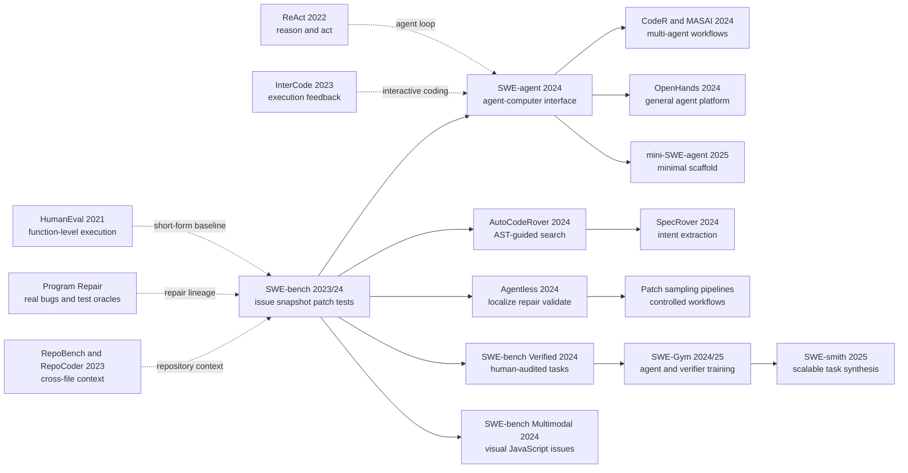

# SWE-bench + SWE-agent — 当写代码从函数题变成真实仓库

> **2023 年 10 月，[SWE-bench（arXiv:2310.06770）](https://arxiv.org/abs/2310.06770) 把代码模型从 164 道函数题赶进了 12 个真实 Python 仓库：给它一张 GitHub issue、一个历史 commit，让它交出能通过项目测试的 patch。** 当时最强现实 baseline Claude 2 + BM25 只解决 1.96%；2024 年 4 月，配套的 SWE-agent 用专为模型设计的搜索、查看、编辑与执行接口把 GPT-4 Turbo 推到 12.47%。更戏剧性的是，同年 8 月，这把尺子接受了对自己的测试：93 位开发者审查 1,699 道原题，因题意不足、隐藏测试不公平或其他问题综合过滤 68.3%，留下 500 道 Verified。它真正改变的不是某个模型，而是“会写代码”的定义，也迫使整个领域承认：模型、agent scaffold、执行环境和 benchmark 本身都可能是误差来源。

## 一句话总结

Carlos E. Jimenez、John Yang、Alexander Wettig 等 7 位作者在 ICLR 2024 Oral 发表的 SWE-bench，把代码评测从“按 docstring 补函数”改成仓库状态转换：系统读取 issue $P_i$ 与 `repository@base_commit` 快照 $C_i$，输出补丁 $\hat{\delta}_i$；patch 可应用且隐藏 F2P/P2P 全过时，$r_i=1$，最终 $\mathrm{pass@1}=100N^{-1}\sum_i r_i$。BM25 取文件后一次生成的 Claude 2 在原始 2,294 题、12 个 Python 仓库上仅 1.96%，oracle 文件也只有 4.80%。配套的 SWE-agent 用 ACI 让 GPT-4 Turbo 达到 286/2,294 = 12.47%；同模型在 Lite 上从 Shell-only 11.00% 升到完整 ACI 18.00%。

它继承 [ReAct（2022）](/era4_foundation_models/2022_react/) 的动作-观察循环，也把 [Toolformer（2023）](/era5_genai_explosion/2023_toolformer/) 之后的工具使用落到真实仓库，随后分化出 Agentless、OpenHands、SWE-Gym，以及 Verified 与 Multimodal。最反直觉的 lesson 是：低分不全等于模型弱，高分也不全属于模型。Verified 审计 1,699 题后综合过滤 68.3%，说明 issue 规格、隐藏测试与环境也会出错；2026 年任何分数都必须绑定模型、scaffold、数据版本、harness 与预算，测试通过也不等于代码可直接合并生产。

---

## 历史背景

### 2023 年的代码模型，强在函数题，弱在软件维护

2023 年秋天，代码大模型的公开形象已经相当耀眼。Codex 带来的 [HumanEval](https://arxiv.org/abs/2107.03374) 把自然语言题目、函数签名和隐藏单元测试压进 164 道短题；APPS、MBPP、DS-1000、HumanEvalPack 又分别把范围扩到编程竞赛、基础 Python、数据科学库和多语言修复。SWE-agent 论文回顾当时的局面时指出，最强方法在 HumanEval 上已经达到 94.4%。如果只看这类数字，下一步似乎只需把模型做大一点。

但软件维护不是从空白函数开始。开发者面对的是一张工单、一份会继续演化的仓库、某个历史版本的依赖和一套不能破坏的旧行为。真正耗时的工作往往发生在写补丁之前：复现现象，读堆栈，找到相关模块，沿调用关系追到根因，理解项目约定，再决定改一处还是改多处。补丁写完也不是结束，还要安装项目、运行测试、解释失败，并判断新错误是实现问题、环境问题还是测试本身的问题。

[ClassEval](https://arxiv.org/abs/2308.01861) 已经表明，从单方法走到一个类，模型就会明显暴露方法依赖理解不足；[RepoBench](https://arxiv.org/abs/2306.03091) 与 [RepoCoder](https://arxiv.org/abs/2303.12570) 开始把跨文件上下文纳入补全；[InterCode](https://arxiv.org/abs/2306.14898) 则把代码动作与执行反馈组织成可交互环境。这些前序都在逼问同一件事：**会生成局部代码，是否等于会维护一个真实软件系统？** 2023 年 10 月发布的 SWE-bench 给出的答案几乎是否定的。

### 直接逼出 SWE-bench 的四条前序线索

第一条线索来自 **执行式代码评测**。[HumanEval](https://arxiv.org/abs/2107.03374) 不再用 BLEU 判断代码像不像答案，而是直接运行测试；[EvalPlus](https://arxiv.org/abs/2305.01210) 随后把 HumanEval 测试扩充约 80 倍，证明测试不充分会接受错误代码，甚至改变模型排序。SWE-bench 保留“让程序说话”的原则，却把执行对象从一个函数升级为完整仓库版本。

第二条线索来自 **自动程序修复**。Defects4J、GenProg、AlphaRepair 与 NL2Fix 已经把真实缺陷、故障定位、补丁搜索和测试套件连起来；[Towards Generating Functionally Correct Code Edits from Natural Language Issue Descriptions](https://arxiv.org/abs/2304.03816) 更直接提出从 issue 描述生成修复。它们证明问题报告和测试可以共同构成修复信号，但常见设置仍会给定缺陷位置、限定语言或使用人工整理的小范围程序。

第三条线索来自 **长上下文与检索的失败**。[Lost in the Middle](https://arxiv.org/abs/2307.03172) 说明模型即便能接收长 prompt，也未必可靠利用位于中间的信息。SWE-bench 的平均代码库有 3,010 个非测试文件、约 43.8 万行非测试代码，而参考补丁平均只改 1.7 个文件、3 个函数、32.8 行。这里的核心不是把 43.8 万行全塞进上下文，而是在巨大的搜索空间中找到那几十行。

第四条线索来自 **交互式 agent**。[ReAct](https://arxiv.org/abs/2210.03629) 把推理、动作和观察交错起来；[WebShop](https://arxiv.org/abs/2207.01206) 与 [WebArena](https://arxiv.org/abs/2307.13854) 用可执行网站考验长程决策；InterCode 又把相同思想搬进 Bash、SQL 和 Python。SWE-bench 提供了一个比合成 shell 题更真实的落点：工单由真实用户写，补丁由维护者合并，测试由项目自己运行。

### Princeton 团队把 GitHub 历史变成可执行数据

Carlos E. Jimenez、John Yang、Alexander Wettig、Shunyu Yao、Kexin Pei、Ofir Press、Karthik Narasimhan 七位作者来自 Princeton Language and Intelligence、普林斯顿大学与芝加哥大学的合作网络。团队此前已经沿着 WebShop、ReAct、InterCode 研究“语言模型如何在环境中行动”；SWE-bench 则把这条 agent 线与软件工程中的程序修复、故障定位、回归测试接到一起。

他们没有雇人另写 2,294 道题，而是把开源协作历史当作数据源：从 12 个热门 Python 仓库抓取约 90,000 个 pull request，筛出会关闭 issue、会修改测试、能够安装执行，而且至少有一个测试在应用解决方案后从失败变为通过的 PR。每个样本都保留 issue 文本、仓库名、`base_commit`、从 PR 中拆出的测试补丁和实现补丁，以及 `FAIL_TO_PASS`、`PASS_TO_PASS` 测试身份。官方镜像保存原始提交历史，避免上游删改让旧快照消失。

这套构造让数据规模与人工可信度之间出现新折中。GitHub 天然提供问题、讨论、代码、补丁和测试，收集流程可以持续运行；但 PR 不是为 benchmark 写的规范文档，issue 也可能含糊，测试还可能编码只有维护者在后续讨论里才确定的细节。SWE-bench 最初把这些现实噪声视为真实性的一部分，SWE-bench Verified 后来则证明：现实数据不等于天然公平，自动筛选之后仍需要专业开发者审计。

### 算力、上下文与工程环境都成了评测变量

SWE-bench 发布时，能处理这类输入的模型选择并不多。原论文比较 ChatGPT-3.5 16K、GPT-4 32K、Claude 2 与基于 CodeLlama-Python 的 SWE-Llama。代码库远超任何上下文窗口，因此 baseline 用 BM25 按 issue 检索完整文件，并测试 13K、27K、50K 等上下文预算。反直觉的是，检索更多文件并不总是更好：在 27K 预算下，BM25 虽能在约 40% 样本中覆盖全部参考编辑文件，却在接近一半样本里一个参考文件都没找回；Claude 2 也常在较短上下文上表现更好。

为了建立开放模型基线，团队从与测试仓库不重叠的 37 个仓库收集 19,000 个 issue-PR 训练对，过滤超过 30,000 token 的样本后约剩 10,000 个，用 LoRA 微调 CodeLlama-Python。SWE-Llama 7B 在 4 张 A100 上训练 20 小时，13B 在 8 张 A100 上训练 47 小时。这些数字说明，长上下文训练本身已经是系统工程；然而 SWE-Llama 13B 在真实 BM25 上仍只有 0.70%，因为它训练时看到的是参考补丁编辑过的 oracle 文件，推理时却收到含噪检索结果。

环境同样进入能力边界。不同历史版本依赖不同 Python、编译器和系统库；测试命令与日志格式还因仓库而异。原始实现按项目版本手工构建环境，2024 年 6 月官方才迁移到完整 Docker harness。于是 SWE-bench 从一开始就不仅在测模型：它也在测检索、补丁格式、依赖复现、测试选择和日志解析能否共同工作。

## 研究背景与动机

### 从“生成答案”改成“交付可验证变更”

SWE-bench 的核心动机，是把代码模型从答题者改成一次软件变更的提交者。输入不再直接给出目标函数，而是问题陈述 $P_i$ 与历史仓库快照 $C_i$；系统要产生补丁 $\hat{\delta}_i$。评测器在对应环境中应用隐藏测试补丁 $T_i$ 和预测补丁，只有所有用于证明新行为的 `FAIL_TO_PASS` 测试与用于保护旧行为的 `PASS_TO_PASS` 测试都通过，任务才记为解决。

这个定义把几个原来分散的能力绑在一个可执行终点上。文件定位错了，补丁无从写起；根因判断错了，局部修改会成为 no-op 或回归；diff 格式坏了，正确想法也无法应用；环境没建好，任何补丁都得零分。与此同时，它不要求预测补丁逐字复刻人工 PR。只要行为通过同一组检查，另一种实现也可以成功。这比字符串相似度更接近软件工程，却仍只覆盖测试可见的行为。

原始结果正是为制造这种能力落差。最佳现实 baseline Claude 2 + BM25 只解决 1.96%；即使作弊式地给出人工补丁编辑过的 oracle 文件，也只有 4.80%。这说明失败不只是“没搜到文件”，而是从规格理解、跨文件推理到补丁生成都存在缺口。SWE-bench 因而不是把 HumanEval 做得更长，而是换了评测单位：从函数答案换成仓库状态转换。

### 为什么 benchmark 自然催生 ACI

原论文 baseline 是非交互式的：BM25 一次取回文件，模型一次生成 patch，测试只在评分阶段运行。可人类不会这样修 bug。人会先复现，再搜索，读一点代码，形成假设，改动，执行，看到新证据后调整。SWE-bench 附录也发现，大量已应用但未解决的补丁属于 no-op 或 regression，并明确提出让模型接入执行环境、依据测试反馈继续编辑。

SWE-agent 正面接住了这个动机，但没有把结论简化为“给模型一个 shell 就行”。作者把 LM agent 视为一种新的终端用户，提出 **agent-computer interface（ACI）**：接口既规定模型能调用哪些动作，也规定环境状态、错误和历史怎样反馈给模型。原始 Bash 命令对人类灵活，对模型却可能参数繁多、输出失控、编辑静默；GUI IDE 对人类直观，却把视觉层级和交互状态压成模型难以消费的信号。

因此，SWE-agent 的研究问题不是再训练一个更大的代码模型，而是在固定模型权重时重塑动作空间与观察空间：搜索结果是否应该一次摘要，文件窗口是 30 行、100 行还是整文件，编辑后是否立即显示差异，语法错误是否应拒绝落盘，旧观察应该保留多少。GPT-4 Turbo 的 Shell-only baseline 在 SWE-bench Lite 上解决 11.00%，完整 ACI 达到 18.00%，同一基础模型相对提高 64%。这组消融比跨模型排行榜更直接地说明：在仓库级任务里，接口不是包装，接口会决定多少潜在能力真正落到补丁上。

---

## 方法详解

### 整体框架：四层对象，两个闭环

SWE-bench 与 SWE-agent 经常被一句“让 AI 修 GitHub issue”揉在一起，但要理解结果，必须先把四层对象拆开：**benchmark/dataset** 定义什么任务算一道题；**evaluation harness** 负责恢复历史环境并执行评分；**base LM** 提供语言、代码与推理能力；**agent scaffold / ACI** 决定模型如何看仓库、如何行动、何时得到反馈。前两层决定尺子，后两层组成被测系统。换模型不等于换 benchmark，升级 Docker harness 也不等于 agent 变聪明。

完整流程包含两个闭环。第一个是离线的**数据构造闭环**：从人类已经合并的 PR 反推出问题、快照、测试与参考修复，并用前后执行确认样本可用。第二个是在线的**求解闭环**：给系统 issue 与快照，模型或 agent 生成补丁，harness 在隐藏测试上判定它是否既修复目标行为，又没有破坏已有行为。

```text
DATA CONSTRUCTION (offline)
GitHub issue <---- linked merged PR at base_commit
      |                         |
      |                         +--> split diff --> test_patch + gold_patch
      |                                              |
      +--> problem_statement                         v
                                   run tests before / after gold_patch
                                                |
                                      keep executable F2P tasks

SYSTEM EVALUATION (per task)
problem_statement + repository@base_commit
                    |
                    v
       [base LM + retrieval or agent ACI] ---> predicted_patch
                                                   |
                                                   v
Docker / versioned harness: checkout -> install -> apply test_patch
                            -> apply prediction -> run tests -> grade
```

| 层 | 固定内容 | 可变化内容 | 不能混淆的结论 |
|---|---|---|---|
| Benchmark / dataset | issue、仓库、`base_commit`、测试身份 | Full、Lite、Verified 等版本 | 换数据集会改变题目分布与分母 |
| Evaluation harness | checkout、安装、打补丁、运行与解析 | Conda/Docker、镜像、测试命令 | harness 失败不是模型语义失败 |
| Base LM | 权重与推理 API | Claude 2、GPT-4 Turbo、Claude 3 Opus 等 | 跨模型涨分不能单独证明 ACI 有效 |
| Agent scaffold / ACI | 动作、观察、历史、预算、提交策略 | RAG、Shell-only、SWE-agent 等 | 同一模型可因接口不同产生不同能力 |

### 关键设计 1：把 PR 历史冻结成任务状态

一道任务不是“issue 文本 + 最新代码”。它可以写成六元组：

$$
x_i=(P_i, R_i, b_i, T_i, F_i, Q_i), \qquad C_i=\operatorname{checkout}(R_i,b_i).
$$

$P_i$ 是从相关 issue 标题、正文和限定时间之前的评论聚合出的 problem statement；$R_i$ 是仓库；$b_i$ 是解决 PR 的 base commit；$T_i$ 是从 PR 测试文件改动中拆出的 test patch；$F_i$ 是 `FAIL_TO_PASS` 测试集合；$Q_i$ 是 `PASS_TO_PASS` 集合。$C_i$ 则是评测真正使用的历史代码库。人工解决方案 $\delta_i$ 用于构造和验证样本，但不作为模型输入。

这里最关键的是 `base_commit`。如果只下载今天的 Django 或 SymPy，issue 可能早已被修复，依赖接口也已变化，原测试甚至不再存在。SWE-bench 为每个原仓库创建镜像，保留提交哈希、分支、标签和历史；给定 `repo + base_commit` 就能恢复 PR 发生前的状态。**这使题目测的是“能否完成当时那次变更”，而不是“能否在今天的代码里猜出旧 bug”。**

| 字段 | 来自哪里 | 求解时可见 | 作用 |
|---|---|---:|---|
| `problem_statement` | issue 标题、正文、早期评论 | 是 | 描述用户看到的问题或需求 |
| `repo`, `base_commit` | 原 PR 元数据 | 是 | 唯一定位历史仓库状态 |
| `test_patch` | PR 中测试相关 diff | 否 | 在评分环境中加入维护者测试 |
| `patch` / gold patch | PR 中非测试 diff | 否 | 构造时验证任务，分析时作参考 |
| `FAIL_TO_PASS` | solution 前后日志差分 | 否 | 检查目标行为是否修复 |
| `PASS_TO_PASS` | solution 前后都通过的测试 | 否 | 检查既有行为是否回归 |

### 关键设计 2：从 PR diff 分离规格与答案

一个合并 PR 通常同时改实现和测试。如果直接把完整 diff 当答案，测试里就可能包含实现线索；如果不保留新增测试，评测又缺少针对 issue 的行为 oracle。SWE-bench 用路径中是否含 `test`、`tests`、`testing` 等关键词，把 diff block 分为 $T_i$ 与 $\delta_i$。然后在同一个 $C_i$ 上依次运行：只应用 $T_i$ 的前态，以及再应用 $\delta_i$ 的后态。

只有至少一个测试从 fail 变 pass，且安装、补丁应用、测试执行都成功，候选才进入数据集。论文还过滤了会首先调用参考补丁中新建但 issue 未命名实体的测试，因为任意类名或函数名会让任务近乎不可推断。下面的伪代码压缩了构造逻辑；真实实现还要处理仓库特定安装脚本、测试命令和日志 parser。

```python
def build_instance(issue, pull_request, repo_mirror, environment):
    snapshot = repo_mirror.checkout(pull_request.base_commit)
    test_patch, gold_patch = split_pr_diff(pull_request.diff)

    snapshot.install(environment)
    snapshot.apply(test_patch)
    before = run_repository_tests(snapshot, test_patch)

    snapshot.apply(gold_patch)
    after = run_repository_tests(snapshot, test_patch)

    fail_to_pass = tests_with_transition(before, after, "fail", "pass")
    pass_to_pass = tests_with_transition(before, after, "pass", "pass")
    if not fail_to_pass:
        return None

    return Task(issue.text, pull_request.base_commit, test_patch,
                gold_patch, fail_to_pass, pass_to_pass)
```

这个设计的力量与风险来自同一个来源：**人类 PR 是天然的规格-实现对，但两者并不独立。** 测试由同一讨论和实现过程产生，可能要求 PR 中后来才决定的精确警告字符串，也可能只覆盖维护者选中的一条路径。于是 `test_patch` 比模型生成代码的文本相似度强，却仍不是完整规格。Verified 的人审正是对这条依赖做第二次质量控制。

### 关键设计 3：执行式正确性与 pass@1

对预测补丁 $\hat{\delta}_i$，评分器先恢复 $C_i$，准备版本对应的环境，应用 $T_i$，再应用预测。如果 diff 无法应用、测试进程无法完成或任何目标测试缺失，任务都记为失败。令 $s(t,C)$ 表示测试 $t$ 在代码状态 $C$ 上是否通过，则单任务分数是：

$$
r_i=\mathbb{1}[\operatorname{apply}(\hat{\delta}_i,C_i\oplus T_i)]
\prod_{t\in F_i\cup Q_i}\mathbb{1}[s(t,C_i\oplus T_i\oplus\hat{\delta}_i)=\text{pass}].
$$

完整测试集上的一次提交指标为：

$$
\operatorname{pass@1}=\frac{100}{N}\sum_{i=1}^{N}r_i\ \%.
$$

这里的 pass@1 不是“单元测试通过比例”。某个任务 99 个测试过、1 个 `FAIL_TO_PASS` 没过，$r_i$ 仍为 0；也不是“采样 100 次总有一次成功”的 pass@100。原始 baseline 每题贪心生成一个 patch，SWE-agent 每题运行一条受预算限制的轨迹并提交最终 repository diff。比较分数时必须同时写清 split、模型、scaffold、采样次数和 harness 版本。

| 结果 | `FAIL_TO_PASS` | `PASS_TO_PASS` | 含义 |
|---|---:|---:|---|
| Resolved | 全部通过 | 全部通过 | 目标行为和已检查旧行为都成立 |
| Breaking resolved | 全部通过 | 至少一个失败 | 修了 issue，但引入回归 |
| Partially resolved | 部分通过 | 全部通过 | 修复不完整，但旧行为保留 |
| No-op | 全部未通过 | 全部通过 | 补丁可应用，却没触及目标行为 |
| Regression | 全部未通过 | 至少一个失败 | 既没修好，又破坏旧行为 |

执行式评分允许预测与 gold patch 完全不同，这是它相对 exact match 的优势；它也会把环境、测试与实现耦合在同一个二值结果里。2026 年解读任何分数时，应把“测试所定义的行为通过”写成“resolved”，而不是扩张成“代码生产可用”或“agent 理解了整个仓库”。

### 关键设计 4：用 BM25 与 oracle 拆解定位瓶颈

原始论文需要一个简单、可复现而又不替未来方法设限的 baseline。它把每个代码文件连同路径作为文档，以 issue 为查询，用 BM25 排序，再按模型上下文预算依次放入文件。BM25 的直觉是：某个稀有符号、类名或错误词在 issue 与文件中同时出现时，它比到处出现的通用词更有定位价值。论文没有把检索器包装成新算法，而是把它当作诊断尺。

作者同时设计了 oracle retrieval：直接提供人工参考补丁改过的文件。这个条件使用答案的位置信息，不是可部署系统；它回答的是“如果文件定位已经解决，模型还差多少”。27K token 的 BM25 在约 40% 样本中找回全部 oracle 文件，却在接近一半样本中一个也没找回。Claude 2 从现实 BM25 的 1.96% 升到 oracle 的 4.80%，说明定位很重要；但 oracle 下仍有 95.2% 未解决，说明规格理解与补丁推理更难。

| 上下文方案 | 是否使用答案信息 | 能诊断什么 | 主要缺陷 |
|---|---:|---|---|
| BM25 full files | 否 | 现实稀疏检索 + 一次生成 | 词面匹配弱，完整文件噪声大 |
| Oracle files | 是 | 文件定位解决后的模型上限 | 不可部署，仍可能缺依赖上下文 |
| Oracle collapsed | 是 | 极小相关窗口下的生成能力 | 近似泄露编辑位置 |
| Interactive search | 否 | 模型能否依据新证据主动定位 | 成本、错误传播与接口设计敏感 |

更微妙的发现是“上下文越多越好”站不住。把 oracle 文件折叠为参考编辑附近 $\pm15$ 行，Claude 2 从 4.8% 升到 5.9%，GPT-4 在对应分析中从 1.3% 升到 3.4%。这不是说模型只该看答案附近，而是说当时的模型无法在大段无关代码中稳定找到证据。SWE-agent 的搜索与 100 行 viewer 正是在不泄露答案的前提下，让模型逐步构造自己的小上下文。

### 关键设计 5：ACI 同时设计动作与观察

SWE-agent 把 agent 写成固定 LM 与 ACI 的组合。每一轮模型生成 thought 与一个 command，环境执行后返回 observation；下一轮输入由系统指令、任务、动作历史和经过裁剪的观察组成。ACI 不只是 `open`、`edit` 这些函数签名，还包括搜索结果最多显示多少条、编辑成功后展示哪段代码、错误信息保留什么，以及旧输出何时折叠。

作者提炼了四条设计原则：动作要简单易懂；单个动作要足够紧凑，避免为一个高层操作消耗多轮；反馈要有信息但不能淹没上下文；guardrail 要阻断常见错误的级联。最终工具仍建立在 Linux shell 上，必要时模型可以调用常规命令，但针对高频工作给出更稳定的抽象。

| ACI 组件 | 具体设计 | 针对的模型失败 |
|---|---|---|
| Search | `find_file`、`search_file`、`search_dir`；最多 50 个结果 | `grep` 洪水、无效逐条翻页、错误路径 |
| File viewer | 默认 100 行，显示路径、总行数、行号与省略量 | `cat` 塞满上下文，滚动位置丢失 |
| Editor | 按当前文件行区间替换，改后立即显示 | `sed` 多行编辑脆弱、静默修改难确认 |
| Lint guardrail | 选定 flake8 错误触发回滚，并显示前后片段 | 缩进/语法错误引发连续失败编辑 |
| Context manager | 保留最近 5 条观察，更早输出折叠为一行 | 旧文件内容与重复错误占满上下文 |
| Submit | 汇总工作区变更为最终 patch | 输出格式漂移、遗漏已落盘改动 |

下面的伪代码展示“接口是控制系统”而非工具列表。真正的性能来自 `render_observation`、`history_processor`、guardrail 与动作语义共同作用。

```python
def solve_issue(base_lm, aci, issue, repository, dollar_budget=4.0):
    history = aci.initialize(issue, repository)

    while aci.cost(history) < dollar_budget:
        prompt = aci.history_processor(history, keep_recent=5)
        thought, command = base_lm.next_action(prompt)
        result = aci.execute(command)

        if result.introduces_lint_error:
            aci.revert(command)
            observation = aci.render_guardrail_error(result)
        else:
            observation = aci.render_observation(result)

        history.append((thought, command, observation))
        if command.name == "submit":
            break

    return repository.diff()
```

### 关键设计 6：让错误可见，但不替模型解决问题

SWE-agent 的 linter 只选择 `F821,F822,F831,E111,E112,E113,E999,E902` 等未定义名、重复参数、缩进、语法或文件读取错误。它不会判断业务逻辑是否正确，也不会把 gold patch 暗中补上。guardrail 的目标是阻止一个括号或缩进错误污染后续所有观察，让模型有机会回到可执行状态。论文消融中，带 lint 的编辑接口在 Lite 上是 18.0%，去掉 lint 降到 15.0%，完全没有专用 edit 动作则降到 10.3%。

搜索也采用同样哲学。`search_dir` 不在宽泛查询时吐出几千行，而是在超过 50 个命中时要求模型收窄。100 行 viewer 既不是越短越省 token，也不是整文件越完整越好：30 行得到 14.3%，整文件 12.7%，100 行则是 18.0%。迭代式逐条搜索模仿人类编辑器，却让模型执着地按 `next` 看完所有结果，只有 12.0%；一次摘要式搜索为 18.0%，甚至“无专用搜索”也有 15.7%。

**反直觉点在这里：对人友好的 UI 不必对 LM 友好，更丰富的动作和观察也不必更强。** ACI 的工作是把正确证据放进有限上下文，同时减少模型做行号算术、记忆滚动位置、猜测静默命令是否成功的负担。它提高的是同一基础模型完成闭环的概率，不是给模型注入新的代码知识。

### 训练、推理与评测配置：哪些数字属于哪一层

最后要把两篇论文的设置分开。SWE-bench 论文训练了 SWE-Llama，但其主 baseline 是一次检索、一次生成；SWE-agent 论文不改基础模型权重，主要比较 GPT-4 Turbo 和 Claude 3 Opus 在 RAG、Shell-only、完整 ACI 下的行为。两者都用 `% Resolved / pass@1`，但推理过程、成本和可见反馈不同。

| 项目 | SWE-bench 原始 baseline | SWE-Llama | SWE-agent 主设置 |
|---|---|---|---|
| 被测对象 | 闭源 LM + BM25 + 单次 patch | CodeLlama-Python 微调模型 + retrieval | 固定 LM + 多轮 ACI scaffold |
| 训练 | 不在论文内训练闭源 LM | 19K 原始对，>30K token 过滤后约 10K | 不更新 GPT-4 Turbo / Claude 3 Opus 权重 |
| 上下文获取 | BM25 完整文件或 oracle 文件 | 训练用 oracle，测试用 BM25/oracle | 主动 search/open，观察逐轮进入历史 |
| 代码修改 | 一次生成 `.patch` | 一次生成 `.patch` | 编辑仓库多轮，最后汇总 diff |
| 执行反馈 | 评分前无 | 评分前无 | 可运行 shell、Python、pytest；隐藏测试仍不可见 |
| 预算/解码 | 每题一个贪心 patch | 每题一个贪心 patch | 每题最多 $4，超限自动提交已有编辑 |
| 评分 | 原始 Full 2,294；另有 Lite 300 | 同一 harness/split | Full 报主结果，Lite 用于消融 |

这张表也是阅读任何后续 SWE-bench 成绩时的最低核对表。一个数字可以因更强模型、更好 scaffold、更多采样、测试生成、patch reranking、数据清洗或更可靠环境而上升。只有控制其他层，才可以把差异归因给某个设计。

---

## 失败案例

### 对手一：BM25 找文件，一次性生成补丁

SWE-bench 最初击败的不是一个成熟 agent，而是当时代码模型最自然的用法：把 issue 当查询，用 BM25 找几个文件，连同 diff 示例一起塞给模型，让它一次性吐出 patch。这个 baseline 简单、公平、可复现，也准确暴露了 2023 年系统的短板。Claude 2 在原始 2,294 题上只解决 1.96%；ChatGPT-3.5 为 0.17%；专门用 issue-PR 数据微调的 SWE-Llama 7B 与 13B 在最佳 BM25 设置下都只有 0.70%。

BM25 的失败首先是词面定位。Issue 可能写“保存关联对象时报错”，真正要改的却是一个没在文本里出现的内部方法；错误栈可能点向调用者，不是根因；同名符号还可能遍布仓库。27K token 预算下，BM25 在约 40% 样本里覆盖所有参考编辑文件，却在接近一半样本里一个参考文件都没找回。模型在前一类样本中仍会失败，则说明“文件找对”也不等于“规格理解对”。

一次生成进一步放大错误。模型看不到执行结果，无法发现 patch 没应用、import 路径错了、改动只覆盖 issue 示例却破坏一般情况，或者一处 API 变更需要同步修改调用者。SWE-bench 的细分统计显示，大量能应用但未解决的补丁属于 no-op 或 regression，而不是差一点通过。换言之，静态 RAG 往往连“当前假设错了”这条最有价值的信息都拿不到。

### 对手二：oracle 文件和更长上下文也救不了一次生成

为了区分“找不到代码”与“不会修代码”，作者给出 oracle retrieval：直接提供人工参考补丁修改过的文件。这是使用答案位置的诊断条件，不是现实系统。Claude 2 从 BM25 的 1.96% 上升到 4.80%，SWE-Llama 13B 达到 3.97%，说明定位确实是大瓶颈；但即使文件由 oracle 选好，Claude 2 仍有 95.2% 任务失败。

更反直觉的是，完整 oracle 文件可能比极小窗口更差。把这些文件压成参考编辑位置前后各 15 行，Claude 2 从 4.8% 升到 5.9%，GPT-4 在对应实验中从 1.3% 升到 3.4%。这不代表真实 agent 应该获得答案附近的代码，而是证明长上下文接收能力与长上下文定位能力并非一回事。噪声越多，模型越容易抓住 issue 里最显眼但不关键的词。

输出格式也有一个诚实的失败。作者尝试让 Claude 2 重写整个文件，结果在 oracle 设置下只有 2.2%，低于生成 patch 的 4.8%；即使只看输入较短的一半任务，重写文件也只有 3.9%，patch 为 7.8%。模型虽然不常在预训练中看到 unified diff，生成完整文件却要复制大量不变代码，任何截断、漏行或无关改写都会让风险上升。最朴素的格式反而不是最容易的格式。

### 作者承认的失败：SWE-Llama 学会了 oracle 契约

SWE-Llama 是一个特别有价值的失败。团队从 37 个与测试仓库不重叠的项目收集 19,000 个训练对，并用 LoRA 微调长上下文 CodeLlama-Python；这排除了“训练仓库与测试仓库直接重合”这一层污染。可训练输入使用人工补丁编辑过的 oracle 文件，测试时的现实输入却来自 BM25。模型于是学到一个隐藏契约：上下文里的文件大多应该被改。到了 BM25 场景，许多文件只是候选证据，这个契约立刻失效。

SWE-Llama 13B 在 oracle 下解决 3.97%，BM25 下只有 0.70%。这不是简单的模型容量不足，而是 **retrieval distribution shift**：训练时定位已由答案完成，推理时模型却要判断哪些文件相关。它提醒后来的 coding-agent 训练，轨迹数据不仅教模型“怎么改”，也在悄悄规定“谁已经替它找好了代码”“哪些测试可见”“何时停止”。如果部署环境改变这些约定，离线分数不会自动迁移。

原论文还记录了补丁风格问题。模型常写更短、更原始的 Python，不复用仓库已有 utility，也难以覆盖人工 PR 的结构性改动。一个预测可以侥幸通过有限测试，却不符合项目风格或维护者意图；也可能改到正确函数，却只修 issue 中的单个例子。这正是传统 automated program repair 所说的 plausible patch 与 correct patch 之间的缝隙。

### ACI 自己也会失败：人类界面、更多上下文与更多轮数

SWE-agent 并没有证明“交互越多越好”。它的消融恰恰展示了接口如何拖垮同一模型。最典型的是 iterative search：像编辑器那样一次显示一个命中，让模型用 `next`/`prev` 浏览。人类会快速跳过无关结果，GPT-4 Turbo 却常执着地把命中全部看完，耗尽 token 或美元预算；结果只有 12.0%，低于没有专用搜索的 15.7%，更低于摘要搜索的 18.0%。

文件窗口也有 U 形代价。30 行太窄，模型看不全函数与邻近定义，得到 14.3%；整文件太宽，无关内容淹没当前状态，只有 12.7%；100 行达到 18.0%。历史同样如此：保留完整 observation history 得 15.0%，只保留最近 5 条并折叠旧输出得 18.0%。这些结果击穿了两个直觉：“模型窗口够长就全部给它”和“模仿 VS Code 的人类交互一定最自然”。

编辑失败仍然严重。完整 2,294 题中，GPT-4 Turbo 的 1,185 条轨迹至少出现一次被 linter 拒绝的 edit，占 51.7%；286 条成功轨迹中也有 113 条出现过，占 31.5%。一次 edit 在尚未失败时最终成功的概率是 90.5%，但发生一次失败后，后续恢复概率降到 57.2%。Guardrail 能止损，不能替模型摆脱错误假设。

### 2024 年的反例：尺子本身会低估也会高估

SWE-bench Verified 是原 benchmark 最重要的自我反例。OpenAI 与 SWE-bench 作者找来 93 位熟悉 Python 的专业开发者，对 1,699 个随机原始样本进行审查，每题由 3 人独立标注，并取最高严重度。结果有 38.3% 被标记为题意不足，61.1% 的隐藏测试可能不公平地拒绝有效方案，综合题意、测试与其他问题后有 68.3% 被过滤。这些比例有重叠，不能相加。

官方报告给出一个尖锐例子：issue 只说 `copy` 参数没有作用，隐藏测试却要求抛出 `DeprecationWarning`，而且警告文本必须与 PR 后续讨论确定的字符串完全一致。Agent 看不到测试，也看不到那段讨论。即便它让参数真正生效，也可能被判错。这里低分不一定表示模型不会修，而是评测要求了输入中不可推断的意图。

反方向也成立。有限 `FAIL_TO_PASS` 可以被过拟合，某个特判可能通过隐藏测试却破坏未覆盖输入；公共 issue、PR 和最终代码还可能已进入模型训练。Docker harness 解决一部分环境漂移，但不能消除网络依赖、架构差异、镜像缓存和 flaky test。Verified 最终筛出 500 道高置信题，并与 2024 年 6 月推出的容器化 harness 配合。它不是承认原工作“无效”，而是证明 benchmark 也必须像软件一样版本化、测试和修复。

### 真正的反 baseline 教训：模型、scaffold 与尺子共同决定分数

从 1.96% 到 12.47% 的历史叙事很诱人：SWE-agent 把结果提高六倍多，交互式 agent 战胜一次 RAG。但这不是纯 ACI 对照，因为基础模型也从 Claude 2 换成 GPT-4 Turbo。更干净的证据来自 Lite：同为 GPT-4 Turbo，Shell-only 是 11.00%，完整 SWE-agent 是 18.00%，相对提升 64%。同时，后来的 Agentless 又用固定的 localization-repair-validation 流水线证明，自由行动不是唯一答案。

真正的工程哲学是：**SWE-bench 分数属于一个完整系统配置，不属于裸模型名。** 基础模型、检索器、动作空间、观察格式、预算、采样、patch selector、可见测试、dataset revision 与 harness 都能改变结果。把所有提升都叫“模型更会写代码”，就会错过 SWE-agent 最重要的发现，也会错读 Verified 对 benchmark 的修正。

## 实验关键数据

### 原始 SWE-bench 与 SWE-agent 主实验

下面只列论文中固定、可复核的历史结果。`Full` 是原始 2,294 题，`Lite` 是 300 题便利子集；破折号表示论文没有在该设置报告对应结果。Claude 2 的原始摘要写 1.96%，修订表格有 1.97% 的显示差异，本文沿用首发 headline 1.96%。

| 系统配置 | Full % Resolved | Lite % Resolved | 解释 |
|---|---:|---:|---|
| ChatGPT-3.5 + BM25 RAG | 0.17% | 0.33% | 一次检索、一次 patch |
| SWE-Llama 13B + BM25 | 0.70% | 1.00% | oracle-context 微调后的分布偏移 |
| Claude 2 + BM25 RAG | **1.96%** | 3.00% | 原始论文最佳现实 baseline |
| GPT-4 Turbo + RAG | 1.31% | 2.67% | SWE-agent 论文复跑的非交互 baseline |
| Claude 3 Opus + RAG | 3.79% | 4.33% | 更强模型仍受一次生成限制 |
| GPT-4 Turbo + Shell-only | — | 11.00% | 可交互，但无专用 ACI |
| GPT-4 Turbo + SWE-agent | **12.47% (286/2,294)** | **18.00% (54/300)** | 主 ACI 结果 |
| Claude 3 Opus + SWE-agent | 10.46% | 13.00% | ACI 可迁移到另一基础模型 |

SWE-agent 的完整集结果不是 12.5% 的模糊宣传，而是 286/2,294 = 12.47%；Lite 是 54/300 = 18.00%。论文给每题最多 $4 API 预算，超限会自动提交已有编辑；表中成本口径还需注意，SWE-agent Table 1 的 `$ Avg. Cost` 是对成功解决任务平均，而其他工作有时报告每个尝试任务的平均成本。

### ACI 消融：同一 GPT-4 Turbo，接口改变结果

这些实验在 SWE-bench Lite 300 题上进行，默认完整配置为 18.0%。每次只改变一类接口设计，因此比跨模型比较更接近因果证据。

| ACI 变化 | % Resolved | 相对完整配置 | 读法 |
|---|---:|---:|---|
| 完整 ACI | **18.0%** | 0.0 pp | 摘要搜索、100 行 viewer、lint edit、最近 5 条观察 |
| Shell-only | 11.0% | -7.0 pp | 同一模型与环境，缺专用接口 |
| 无 demonstration 的 Shell-only | 7.33% | -10.67 pp | 示例主要帮助动作格式与工作流 |
| Edit 无 linting | 15.0% | -3.0 pp | 错误编辑更易级联 |
| 无专用 edit | 10.3% | -7.7 pp | `sed`/重写文件脆弱且反馈不足 |
| Iterative search | 12.0% | -6.0 pp | 模型会穷举 `next` 结果 |
| 无专用 search | 15.7% | -2.3 pp | 原始 shell 有时胜过坏抽象 |
| 30 行 viewer | 14.3% | -3.7 pp | 局部上下文不足 |
| 整文件 viewer | 12.7% | -5.3 pp | 信息过载与旧状态干扰 |
| 完整历史 | 15.0% | -3.0 pp | 过期 observation 挤占上下文 |
| 无 demonstration 的完整 ACI | 16.3% | -1.7 pp | ACI 本身比示例贡献更大 |

表格说明 ACI 不是“工具越多越好”的配方。摘要搜索比逐条搜索强，100 行比完整文件强，折叠历史比全保留强，甚至 no-search 胜过设计不当的 iterative search。接口的作用是控制信息与错误传播。

### 失败轨迹：成功者早收敛，失败者常在局部循环

SWE-agent 的行为分析提供了比总分更有价值的诊断。成功轨迹通常先复现或定位，随后进入 `edit -> python/pytest -> edit`；但错误积累后，模型很少利用更多轮数彻底换策略。

| 诊断量 | 数值 | 限定条件 |
|---|---:|---|
| 至少一次 failed edit | 1,185/2,294 (51.7%) | GPT-4 Turbo 完整集全部轨迹 |
| 成功任务中至少一次 failed edit | 113/286 (31.5%) | GPT-4 Turbo 已解决轨迹 |
| 一次失败后的 edit 恢复概率 | 57.2% | 相比无失败时最终成功 90.5% |
| 错误/过度特化实现 | 52.0% | 248 条未解决 Lite 轨迹的自动分类 |
| Failed edit recovery | 23.4% | 同一自动分类；15 题人审一致率 87% |
| 成功轨迹 | 中位 $1.21、12 步 | 未耗尽预算的 GPT-4 Turbo 结果 |
| 失败轨迹 | 平均 $2.52、21 步 | 未耗尽预算的 GPT-4 Turbo 结果 |

“成功快、失败慢”说明简单增加 token 或美元上限未必有效。到第 20 步仍围绕错误位置反复 edit 的 agent，需要的是更好的诊断、状态压缩或策略重启，不只是更长轨迹。

### Verified 修订：测量误差不是边角料

Verified 的数字应被理解为一次 benchmark audit，而不是新排行榜营销。500 题来自原始测试集；1,699 个随机样本经过专业标注，每题三人，取最高严重度。官方还尽量保留 1-4 小时与 >4 小时任务，再抽样补足 500，因此它并非简单删除“难题”。

| 审计/版本事实 | 数值 | 含义 |
|---|---:|---|
| 参与开发者 | 93 | 均有 Python 经验并通过 onboarding |
| 被标注随机样本 | 1,699 | 每题 3 次独立标注 |
| 题意不足标记 | 38.3% | 问题陈述无法充分定义成功方案 |
| 测试可能不公平 | 61.1% | 有效替代方案可能被隐藏测试拒绝 |
| 综合过滤 | 68.3% | 与前两项重叠，不能相加 |
| Verified 规模 | 500 | 原始测试集的高置信子集 |
| Easy 子集 | 196 | 专业开发者估计 <15 分钟 |
| Hard 子集 | 45 | 专业开发者估计 >1 小时 |
| 2024 报告中的 GPT-4o + 最佳 scaffold | 33.2% | 单 seed 历史实验，不是当前榜单 |

官方报告还显示同一 GPT-4o 在该历史实验的最佳 scaffold 上，Verified 为 33.2%，原始 Full 为 16%。报告明确说只跑一个 seed，并采用最接近文档或默认的超参，因此不能拿它当永久可比的当前值。它真正证明的是：换一套更可信的题与更合适的 scaffold，测得的能力会大幅变化。

### 关键发现

- **仓库级难度不是代码长度的线性放大。** 2,294 题来自 12 个仓库，平均参考修复只改 32.8 行，但定位、依赖和规格推断让 Claude 2 + BM25 只有 1.96%。
- **定位必要但不充分。** Claude 2 获得 oracle 文件后是 4.80%，远低于可用水平；找到文件之后仍要理解跨函数行为与项目约定。
- **同一模型的接口差异可以超过许多模型升级。** GPT-4 Turbo 从 Shell-only 11.00% 到完整 ACI 18.00%，而错误的 iterative search 反而降到 12.0%。
- **交互让模型能修正假设，也会积累错误。** 51.7% 轨迹出现 failed edit；一次失败后恢复率只有 57.2%，说明 guardrail 与策略重启同样重要。
- **测试通过是可执行证据，不是完整质量证明。** F2P/P2P 能抓回归，却看不到所有输入、维护性、安全和隐藏意图；Verified 直接量化了测试与题意风险。
- **最反直觉的发现是 benchmark quality 也是能力测量的一部分。** 68.3% 被审样本因题意、测试或其他问题遭过滤；低分可能低估 agent，高分也可能来自污染、特判或 scaffold 代做关键决策。

---

## 思想史脉络

### 从函数合成到仓库状态转换

SWE-bench 的历史坐标不在某个新模型结构上，而在“什么算一道代码题”的迁移上。HumanEval 把正确性从文本相似度改成函数测试，自动程序修复把真实 bug、补丁与测试 oracle 连起来，RepoBench/RepoCoder 把跨文件上下文带进代码任务，ReAct 与 InterCode 则证明模型可以通过动作和执行反馈逐步修正。SWE-bench 把这些线索合成一个新的最小单位：**issue 描述的意图，作用在一个固定仓库快照上，经 patch 改变状态，再由项目测试判定。**

这一步改变了研究对象。过去的模型可以独立接受 prompt 并输出答案；在 SWE-bench 上，被测对象自然扩张成“模型 + 上下文策略 + 工具/工作流 + 执行环境 + patch 提交器”。SWE-agent 进一步给这个扩张命名：agent-computer interface 不只是工具 API，而是模型与计算机之间的动作、观察、错误和历史协议。于是模型权重之外第一次有了一块能被系统化消融的能力表面。

### 引用图

下面的图刻意把 benchmark、agent、固定流水线、评测修订与训练环境画成不同节点。中英版本使用完全相同的英文 Mermaid，避免把“谁继承了任务定义”和“谁继承了 ACI”混为一谈。



### 前世：五种思想在 2023 年汇合

- **2021 HumanEval：可执行函数正确性。** [HumanEval](https://arxiv.org/abs/2107.03374) 用隐藏测试替代字符串相似度，让 `pass@k` 成为代码模型的共同语言；SWE-bench 继承执行原则，同时拒绝把目标范围预先缩成一个函数。
- **2014-2023 自动程序修复：bug、定位、补丁和测试 oracle。** [Defects4J](https://doi.org/10.1145/2610384.2628055)、[Automatic Software Repair](https://arxiv.org/abs/1807.00515) 与 [NL2Fix](https://arxiv.org/abs/2304.03816) 提供真实缺陷与修复谱系。SWE-bench 的新意是让 issue-PR 历史自动产生大规模、跨仓库任务，而不是只在人工选定 bug 上比较修复器。
- **2023 RepoBench / RepoCoder：跨文件上下文。** [RepoBench](https://arxiv.org/abs/2306.03091) 评测跨文件补全，[RepoCoder](https://arxiv.org/abs/2303.12570) 让检索与生成迭代。它们把“仓库不是文件集合”推到台前，但输出仍多是局部补全，不是完整 issue 的状态变更。
- **2022 ReAct：推理与动作交错。** [ReAct](https://arxiv.org/abs/2210.03629) 让模型在环境观察之间生成动作，成为 SWE-agent thought-command-observation 循环的直接认知模板。
- **2023 InterCode：执行反馈是 observation。** [InterCode](https://arxiv.org/abs/2306.14898) 把 Bash、SQL、Python 放进 Docker 化互动环境。SWE-agent 的 Shell-only baseline 直接承接这条线，再用 ACI 证明“有 shell”与“会用计算机”之间还有接口设计层。

### 今生：两类求解器、两类评测演化

**直接 agent 后继。** [SWE-agent](https://arxiv.org/abs/2405.15793) 是最直接的配套工作：它让模型主动搜索、查看、编辑和执行，并把 ACI 当成实验变量。[RepairAgent](https://arxiv.org/abs/2403.17134) 把自主动作带入程序修复；[CodeR](https://arxiv.org/abs/2406.01304) 用预定义 task graph 协调多个 agent；[MASAI](https://arxiv.org/abs/2406.11638) 给不同子任务配置专门策略；[OpenHands](https://arxiv.org/abs/2407.16741) 则把 shell、Python、浏览器、沙箱、事件流和评测做成通用 agent 平台。SWE-agent 官方后来把开发重心移向 [mini-SWE-agent](https://github.com/SWE-agent/mini-swe-agent)，说明影响力并不依赖一个越来越厚的框架，最小可读 scaffold 同样能承载 ACI 思想。

**结构化流水线后继。** [AutoCodeRover](https://arxiv.org/abs/2404.05427) 用 AST 级类/方法搜索与可选的 spectrum-based fault localization，把 repository navigation 变成受控 API；[Alibaba LingmaAgent](https://arxiv.org/abs/2406.01422) 用知识图与树搜索覆盖全仓库；[SpecRover](https://arxiv.org/abs/2408.02232) 强调从代码和 issue 中提炼意图；[Agentless](https://arxiv.org/abs/2407.01489) 更直接提出固定的 localization-repair-validation 三阶段流程。它们不是否定 ACI，而是在回答 ACI 留下的选择：哪些决定应交给模型，哪些应固化为可靠工作流。

**评测修订与扩展。** [SWE-bench Verified](https://openai.com/index/introducing-swe-bench-verified/) 通过开发者人审修复题意、隐藏测试与环境可靠性；[SWE-bench Multimodal](https://arxiv.org/abs/2410.03859) 把同一 issue-snapshot-patch-tests 公式扩到视觉信息与 JavaScript 仓库，反过来暴露许多 Python AST scaffold 的过拟合。前者提高尺子可信度，后者扩大尺子覆盖面，两者都不是新模型。

**训练与验证后继。** [SWE-Gym](https://arxiv.org/abs/2412.21139) 把 2,438 个带可执行环境的真实 Python 任务用于训练 agent 与 verifier；[SWE-smith](https://arxiv.org/abs/2504.21798) 再把任务合成和训练数据扩展做成工具链。研究由“在测试集上写更好 prompt”转向“如何获得可训练、可验证、与测试隔离的仓库轨迹”。这也是污染风险升级的地方：公开 benchmark 的成功轨迹一旦回流训练，旧测试集就越来越难区分能力与记忆。

| 继承方向 | 代表工作 | 从 SWE-bench / SWE-agent 继承什么 | 新增矛盾 |
|---|---|---|---|
| 自由交互 agent | SWE-agent、OpenHands、mini-SWE-agent | 动作-观察闭环与可执行仓库 | 长轨迹、错误级联、成本 |
| 结构化求解器 | AutoCodeRover、Agentless、SpecRover | issue 到 patch 的任务定义 | 工作流可能过拟合语言/仓库 |
| Benchmark 修订 | Verified | issue-snapshot-tests 的核心单位 | 规模、难度与人工成本权衡 |
| Benchmark 扩展 | Multimodal | 真实 PR 与执行评分 | 视觉、JavaScript、环境复杂度 |
| 训练生态 | SWE-Gym、SWE-smith | 仓库任务与轨迹 | 数据泄漏、验证器偏差 |

**跨架构借用。** ACI 很快越过专用修复器，进入通用 digital agent 平台：OpenHands 的 event stream、sandbox 与 AgentSkills 都把“动作与 observation 必须共同设计”作为基本架构；CodeAct 则把可执行 Python 变成统一动作空间。这里继承的是交互抽象，不是 SWE-agent 的某组命令原样复制。

**跨任务渗透。** 同一公式已经被用于机器学习仓库任务（ML-Bench）、生物信息代码（BioCoder）、视觉前端修复（SWE-bench Multimodal）和操作系统任务（OSWorld 的相邻谱系）。但截至 2026 年，没有足够证据说 SWE-bench 的具体 issue-PR 构造已经形成独立的跨学科方法；它的主要外溢仍在 agent evaluation 与软件工程。

### 误读与简化

**误读一：“SWE-bench 是一个 agent。”** 它是 dataset + task formulation + harness。SWE-agent、Agentless、AutoCodeRover 才是不同求解系统，Claude/GPT/CodeLlama 是基础模型。把四者都叫 SWE-bench，会让任何分数失去归因。

**误读二：“Resolved 就等于修复正确，可以合并生产。”** Resolved 只表示预测 patch 在指定环境里应用成功，并通过该任务列出的 F2P/P2P 测试。测试没有覆盖的输入、维护性、性能、安全和项目风格都可能仍有问题。Verified 改善了 oracle 的公平性，也没有把有限测试升级成形式证明。

**误读三：“SWE-agent 证明自由 agent 永远胜过流水线。”** 它证明精心设计的 ACI 明显优于同模型 Shell-only；Agentless、AutoCodeRover 与后续系统则证明层次化定位、patch sampling 和固定验证也能很强。真正结论是模型需要合适的交互与工作流，不是自治程度越高越好。

**误读四：“Verified 只是把难题删掉，所以分数变高。”** Verified 的目标是删除不可推断、测试不公平或环境不可靠的题，并刻意保留较长任务。它确实改变难度分布，但官方分层分析显示，同一难度桶内表现也上升。更准确的说法是：原始集把一部分测量误差算成了模型失败。

**误读五：“2026 年榜单数字就是模型能力。”** 同一模型会因 scaffold、预算、采样和 patch selection 得到不同结果；公开数据还存在污染。稳定的历史事实是原论文和固定报告中的设置与数字，而不是会持续变化的当前排名。任何新结果都应附模型版本、dataset revision、harness、轨迹预算、是否生成测试和提交次数。

---

## 当代视角

### 站不住的假设

**假设一：不断抓取更新的公开 GitHub issue，就能自然避开训练污染。** 原论文认为，随着新模型训练截止日期向后移动，可以继续收集更晚的 PR，让解决方案不在训练语料中。这个方向仍有价值，但 2026 年已不能只靠日期。公开 issue、PR、镜像、评测日志和成功 agent trajectory 都可能进入预训练、微调或检索库；模型还可能记住修复后的代码，而不记得 issue 文本。原论文按年份没有观察到稳定的解决率差异，只能说明“年份不是明显捷径”，不能证明没有污染。可信评测需要私有、延迟披露或 live tasks，并审计 agent 是否访问 git 历史、网络和上游仓库。

**假设二：从人类 PR 抽出的隐藏测试足以公平表达 issue 意图。** Verified 的 93 位开发者审计已经直接否定强版本：38.3% 被标记题意不足，61.1% 的测试可能不公平地拒绝有效替代方案。测试仍是最有价值的自动 oracle，但需要检查它是否要求输入中没有的精确字符串、任意命名或 PR 讨论结论；也需要防止一个特判通过有限测试。F2P/P2P 是必要证据，不是完整规格。

**假设三：Python 仓库上有效的求解器会自然泛化。** [SWE-bench Multimodal](https://arxiv.org/abs/2410.03859) 把任务移到视觉 JavaScript 软件后发现，多种依赖 Python `ast` 和对象模型的定位器需要重写，部分系统甚至无法忠实迁移。SWE-agent 的通用 shell/文本动作较易适配，但加入浏览器和截图也增加成本与长程控制难度。这里的 lesson 不是“自由 agent 必胜”，而是 scaffold 自己也有训练分布和归纳偏置。

**假设四：一个 `% Resolved` 可以代表模型的软件工程能力。** 同一基础模型会因 Shell-only、摘要搜索、固定流水线、patch sampling、生成测试、预算与提交次数得到不同结果。数据版本与 harness 也会改变分母和失败原因。2026 年合理的结果单位应是“模型版本 + scaffold commit + dataset revision + container digest + sampling/budget + score breakdown”，而不是只写模型名。

### 时代证明的关键与冗余

**真正留下来的关键设计有四个。** 第一，issue、历史快照、patch 与执行测试组成任务的最小闭环；这比从 docstring 生成函数更贴近维护。第二，`FAIL_TO_PASS` 与 `PASS_TO_PASS` 把“修目标行为”和“保旧行为”分开，迫使系统面对回归。第三，预测只按行为评分，不必逐字复制 gold patch，给替代实现留下空间。第四，SWE-agent 的 ACI 视角把动作与观察放到同一设计面上，提醒研究者 scaffold 不是中性管道。

**被时代淘汰或降级为历史细节的部分也很清楚。** 原始按版本手工 Conda 环境已让位于 Docker 化 harness；BM25 完整文件只是最低 baseline，不是仓库理解的终局；Full 2,294 与 Lite 300 不再适合作为唯一可信测试集，Verified 加入人审，Multimodal 扩展语言与视觉域；一次贪心 patch 也只是一个推理预算点，不能代表系统在相同成本或多次采样下的能力。

| 2023/24 设计 | 2026 判断 | 保留方式 |
|---|---|---|
| Issue + snapshot + patch + tests | 核心仍成立 | 扩展到更多语言、模态和私有任务 |
| F2P + P2P 二值 resolved | 必要但不充分 | 加 patch apply、部分修复、质量与安全分解 |
| BM25 full-file baseline | 有历史价值，诊断力有限 | 与结构检索、主动搜索、无检索对照并列 |
| 静态公开测试集 | 污染风险随使用增长 | private/live/rolling test + 披露访问权限 |
| 手工版本环境 | 不够稳定 | 容器 digest、离线依赖、重复执行 |
| ACI 手工调参 | 证明接口重要，也易 test-set overfit | 独立 dev split、跨域迁移、预注册消融 |

### 作者当时没想到的副作用

1. **Benchmark 变成了 agent 产品的产品需求文档。** 许多系统不是只提交一组实验，而是围绕 SWE-bench 设计 repository map、search API、patch format、test generation 和 runtime。一个评测由此塑造了工具市场，也诱发针对固定仓库与测试的过优化。
2. **Scaffold 进入模型风险评估。** Verified 报告指出，同一模型会因外部 scaffold 产生巨大差异，因此自治风险不能只在训练结束时测裸模型。模型交付之后接入搜索、shell、浏览器和代码执行，能力边界还会继续变化。
3. **成功轨迹本身成为训练数据。** SWE-Gym、SWE-smith 与公开 agent logs 让研究从 prompt engineering 进入 agent training；同时，公开测试集、gold patch、成功轨迹和 verifier 可能形成闭环污染。越成功的 benchmark，越需要更新隔离策略。

这些副作用共同说明，SWE-bench 的影响不只是让分数从 2% 往上走。它把软件工程 agent 变成一个可优化系统，也把 benchmark governance、运行安全、数据许可与测量有效性推到研究中心。

### 如果今天重写

如果 2026 年从头设计 SWE-bench + SWE-agent，我会做以下修改：

- 从第一天同时发布 `dev`、公开回归集、延迟披露 test 与滚动 live set，明确禁止访问路径，并记录网络、git history 与上游远程权限。
- 每个任务绑定不可变 container digest、离线依赖包、架构说明与多次 gold-patch 重跑结果；flaky test 不只跑一次就放行。
- 在自动抽取之后加入轻量专业审查，分别标注题意充分性、F2P 公平性、可替代实现空间、难度与环境置信度，而不是把所有噪声压成一个二值样本。
- 报告完整系统 manifest：base model build、scaffold commit、prompt、工具、预算、temperature、采样数、patch selector、生成测试策略、harness commit 和 container image。
- 把分数拆成 patch apply、正确文件/函数定位、F2P、P2P、部分修复、重复运行稳定性，再对少量通过 patch 做可维护性与安全审查。
- 默认包含 Python 文本任务、另一种语言、视觉 issue 与跨文件长尾，防止工具链只学会某个 AST 与 12 个仓库。
- 对 ACI 预注册设计空间，在独立 dev 仓库调工具，再冻结后测 test；同时报告 Shell-only 与固定流水线，区分模型、接口和 orchestration 的贡献。

但一个核心不会变：

$$
\text{issue intent}+\text{repository snapshot}
\xrightarrow{\text{system}}\text{patch}
\xrightarrow{\text{execution}}\text{checked behavior}.
$$

这个状态转换比“生成一段看起来像代码的文本”更接近软件工程。SWE-bench 的持久价值就在这里；2026 年需要重写的是测量卫生与覆盖面，不是这个核心单位。

## 局限与展望

### 作者明确承认的局限

SWE-bench 原论文承认三点。其一，数据全部来自 Python，语言与项目类型覆盖有限。其二，论文刻意建立最简单的 baseline，没有把 agent、工具增强或复杂程序分析当成上限。其三，只靠执行测试不足以保证生成代码可靠，模型 patch 可能比人工方案更不全面、低效或难读。

SWE-agent 也明确列出边界。最终工具箱很小，尚未系统整合静态分析、动态分析、spectrum-based fault localization 或 fuzzing；ACI 主要通过人工检查失败轨迹和小规模 grid search 设计，容易受开发集与基础模型影响；实验聚焦程序性任务，跨领域 ACI 原则还需验证。论文还指出执行模型生成代码有安全风险，因此在 ephemeral Docker 中运行，但容器 namespace 不是硬件虚拟化。

### 站在 2026 年看到的局限

**公共静态数据的污染无法从年份相关性中排除。** Issue、PR、最终代码和 benchmark 导出都可被模型看到，agent 还可能从 `.git`、包缓存或网络远程获取答案。需要能力审计，而不只是训练 cutoff 声明。

**测试补丁与参考实现同源。** 它们来自同一 PR，天然共享维护者后来形成的假设。测试可能排除合理替代方案，也可能放过过拟合 patch。Verified 降低问题比例，但 500 题仍是有限样本，专业标注也有主观性。

**环境成功是能力测量的一部分，又是混杂变量。** 历史编译器、依赖源、CPU 架构、网络和 flaky tests 会改变结果。Docker 增强可重复性，却不能保证不同宿主与镜像时间点完全等价；缓存还可能把旧预测结果误当成新运行。

**任务范围仍小于真实软件生命周期。** 大多数样本是边界清晰的历史变更，许多被专业开发者估计在一小时内。现实开发还包括需求澄清、架构决策、代码审查、安全威胁建模、部署、监控和数月维护。SWE-bench 测的是重要切片，不是“软件工程师替代率”。

**二值总分压平失败机制。** 0 分可能来自 patch 格式、错误文件、部分修复、回归、安装失败或测试 parser；这些失败对研究的意义完全不同。只优化总分会鼓励更多采样与 benchmark-specific trick，而不一定提高生产可靠性。

### 已被后续工作验证的改进方向

- **人审任务有效性：** Verified 已把题意、测试公平性与难度标注纳入构造，证明 benchmark curation 需要专业工程判断。
- **容器化与运行记录：** 官方 Docker harness 让版本环境更可复现；后续仍应固定镜像 digest、保存日志并重复 gold run。
- **跨语言与多模态：** SWE-bench Multimodal 用 JavaScript、截图与浏览器暴露 Python-specific scaffold；多语言与 live 版本继续沿此方向扩展。
- **生成训练环境而非背测试集：** SWE-Gym 与 SWE-smith 尝试从更多仓库构造可执行训练任务，把 agent 学习与正式评测隔离。
- **规格与验证增强：** SpecRover、Agentless 的 reproduction tests、AutoCodeRover 的程序分析说明，issue 文本、代码结构和执行证据应共同约束 patch。
- **人类在环与分级自治：** 对含糊 issue、跨模块重构与高风险代码，应允许 agent 请求澄清、输出候选与证据，由维护者决定合并，而不是把自动提交设成唯一终点。

## 相关工作与启发

### 五组对照

- **vs HumanEval：** HumanEval 给定函数边界与短规格，SWE-bench 要先在仓库里发现边界，再交付 patch。**教训：评测单位决定模型会优化哪种能力；函数 pass@1 不能外推到维护。**
- **vs Defects4J / 传统 APR：** Defects4J 提供可控真实缺陷与强测试生态，许多 APR 方法假设已知 fault location；SWE-bench 用 issue-PR 自动扩规模并把自然语言定位加入任务。**教训：规模与规格质量需要分别治理。**
- **vs InterCode：** InterCode 标准化互动编码环境，SWE-agent 把它推进到大型真实仓库，并证明 shell 上方的 ACI 影响成功率。**教训：环境可执行只是起点，观察格式同样是算法。**
- **vs AutoCodeRover / Agentless：** SWE-agent 让模型自由决定搜索、编辑与测试；前两者把定位、修复和验证更多固化为层次化流程。**教训：把稳定子任务工程化，把不确定判断留给模型；自治程度不是单调增益。**
- **vs OpenHands：** SWE-agent 是专注 issue 修复与 ACI 消融的研究系统，OpenHands 把 event stream、sandbox、browser、skills 与多 agent 做成平台。**教训：专用接口更易做受控实验，通用平台更易扩展，但也引入更多状态与安全表面。**

## 相关资源

| 类型 | 资源 | 链接 | 为什么看 |
|---|---|---|---|
| 主论文 | SWE-bench | https://arxiv.org/abs/2310.06770 | 2,294 题构造、baseline 与局限 |
| 会议记录 | ICLR 2024 OpenReview | https://openreview.net/forum?id=VTF8yNQM66 | 正式发表记录 |
| 官方代码 | SWE-bench repository | https://github.com/SWE-bench/SWE-bench | 数据、Docker harness 与文档 |
| 官方文档 | SWE-bench docs | https://www.swebench.com/SWE-bench/ | 版本、安装、评测流程 |
| 配套论文 | SWE-agent | https://arxiv.org/abs/2405.15793 | ACI 原则、完整结果与消融 |
| 配套代码 | SWE-agent repository | https://github.com/SWE-agent/SWE-agent | 配置、轨迹、工具与复现入口 |
| 数据修订 | SWE-bench Verified report | https://openai.com/index/introducing-swe-bench-verified/ | 500 题人审方法与测量风险 |
| Benchmark 扩展 | SWE-bench Multimodal | https://arxiv.org/abs/2410.03859 | JavaScript、视觉 issue 与泛化 |
| 对照系统 | AutoCodeRover | https://arxiv.org/abs/2404.05427 | AST 搜索与程序分析路线 |
| 对照系统 | Agentless | https://arxiv.org/abs/2407.01489 | 固定三阶段流水线与数据审计 |
| 训练后继 | SWE-Gym | https://arxiv.org/abs/2412.21139 | 可执行 agent 训练与 verifier |
| 访谈 | SWE-agent / SWE-bench team interview | https://www.youtube.com/watch?v=fcr8WzeEXyk | 团队回顾设计取舍 |
| 英文版 | English edition | /en/era5_genai_explosion/2024_swe_bench/ | 本文英文镜像 |

阅读这些资源时，优先固定论文表格与官方报告的时间点，不要把官网当前 leaderboard 反向写进原始论文历史。SWE-bench 最值得继承的不是某个会过期的百分比，而是把真实软件变更做成可执行研究对象的方式。


---

> 🌐 [English version](/en/era5_genai_explosion/2024_swe_bench/) · 📚 awesome-papers project · CC-BY-NC