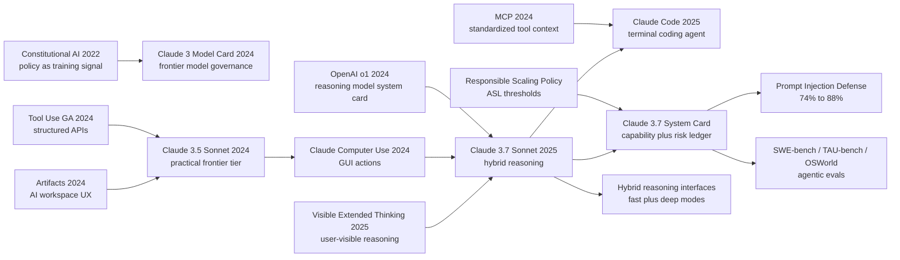

# Claude 3.5/3.7 Sonnet - 把前沿模型做成可控的工程同事

> **2025 年 2 月 24 日，Anthropic 发布 [Claude 3.7 Sonnet System Card](https://www.anthropic.com/claude-3-7-sonnet-system-card)，同时把 Claude Code 推到研究预览。** 这不是一篇教你复现模型的论文：没有参数量、没有训练集、没有 optimizer，也没有 RL 配方。它真正公开的是另一种前沿模型写法：同一个 Sonnet 既能快速回答，也能在 extended thinking 里显式思考；开发者能把 thinking budget 当成 API 旋钮；系统卡把 SWE-bench、TAU-bench、computer use、prompt injection、ASL-2 和可见思考链的风险放在同一张部署账本上。它的钩子不在“模型又涨了几分”，而在于：前沿模型第一次被包装成一个可控、可审计、能进代码仓库工作的工程同事。

## 一句话总结

Anthropic 在 2024-2025 年连续发布的 Claude 3.5/3.7 Sonnet system-card 系列，把“前沿模型论文”从可复现实验报告改写成**能力 + 接口 + 工具 + 安全阈值**的部署文档：可公开写成的核心抽象是 $p(y\mid x,B)=\sum_z p_\theta(y\mid x,z,B)p_\theta(z\mid x,B)$，其中 $B$ 是用户/API 可控的思考预算，$z$ 是 Claude 3.7 在 extended thinking 中显式展示的中间推理轨迹。它替代的失败 baseline 不是某个模型，而是 2024 年默认的“快答聊天模型 + prompt 诱导 CoT + 外部 agent scaffold”：6 月版 Claude 3.5 Sonnet 用 200K context、$3/$15 每百万 tokens 和内部 coding eval 64% 对比 Claude 3 Opus 38%，把 Sonnet 变成实用前沿档；10 月版把 SWE-bench Verified 从 33.4% 推到 49.0%，并公开 computer use；2025 年 3.7 则把同一模型做成可切换的混合推理系统，在 SWE-bench 子集 63.7% / 高算力 70.3%、prompt-injection 防护 88% 和 ASL-2 system card 之间建立一套产品化证据链。它与 [OpenAI o1](https://openai.com/index/openai-o1-system-card/) 的区别是可见、可控、统一模型；与 [DeepSeek-R1](2025_deepseek_r1.md) 的区别是少谈训练 recipe，多把推理模型写成能进企业代码库的治理对象。

---

## 历史背景

### 2024 年 6 月：Sonnet 从“中档模型”变成实用前沿档

Claude 3.5 Sonnet 的第一层历史意义，是它改变了 Anthropic 产品线里 Sonnet 这个名字的含义。Claude 3 家族在 2024 年 3 月发布时，Opus 是最强模型，Sonnet 是平衡档，Haiku 是速度档。到 6 月 21 日，Claude 3.5 Sonnet 却以 Sonnet 价格和速度拿到了接近旗舰的能力：200K context、每百万输入 tokens 3 美元、每百万输出 tokens 15 美元，并且被描述为 Claude 3 Opus 两倍速度。对企业和开发者来说，这不是小修小补，而是“前沿能力进入日常预算”。

它当时最刺眼的数字不是 MMLU 或 GPQA，而是 Anthropic 自己的 agentic coding evaluation：给模型自然语言需求、让它在开源代码库里修 bug 或加功能，Claude 3.5 Sonnet 解出 64%，Claude 3 Opus 是 38%。这个数字让 Sonnet 不再只是聊天模型，而是能和代码、工具、长上下文一起工作的模型。Artifacts 同期出现，也在产品形态上暗示了同一件事：Claude 的理想界面不是问答框，而是可持续编辑的工作台。

### 2024 年 10 月：computer use 把“调用工具”推进到“操作环境”

10 月 22 日的 upgraded Claude 3.5 Sonnet 更像一次方向转弯。过去 tool use 的常见形式是函数调用、检索、插件或代码解释器：模型选择一个结构化工具，工具返回结果，模型再写答案。computer use 把边界往外推了一层：模型看屏幕、移动鼠标、点击按钮、输入文本，开始使用给人类设计的软件界面。Anthropic 明确说这是 public beta，能力还笨拙，拖拽、滚动、缩放等动作仍会出错，但它把“通用数字劳动力”的接口公开了。

同一篇发布文给了几个关键数字：SWE-bench Verified 从 33.4% 到 49.0%；TAU-bench retail 从 62.6% 到 69.2%，airline 从 36.0% 到 46.0%；OSWorld screenshot-only 14.9%，给更多 steps 后 22.0%。这些数字的共同点是它们都不是传统 NLP benchmark，而是“模型在环境里做事”的评测。Sonnet 的竞争对象开始从 GPT-4o 这种聊天模型，变成会编辑文件、跑命令、操作网页、长期追踪状态的 agent。

### 2025 年 2 月：Claude 3.7 把推理做成同一个模型的可控模式

OpenAI o1 在 2024 年 9 月让“思考更久”变成显式能力曲线，但它的产品形态是单独的 reasoning model，原始 CoT 不展示。Claude 3.7 Sonnet 的公开叙事反过来：Anthropic 强调它是“first hybrid reasoning model”，同一个模型既能普通回答，也能进入 extended thinking；用户可以看到思考过程，API 用户可以设置 thinking token budget，最高到输出上限 128K tokens。这个接口设计比某个 leaderboard 更重要，因为它把 test-time compute 从隐含部署细节变成了产品旋钮。

这也解释了为什么 Claude 3.7 的发布和 Claude Code 同时出现。Claude Code 不是一个孤立 CLI，而是 Sonnet 作为工程同事的自然外壳：搜索和阅读代码、编辑文件、运行测试、用命令行，必要时把修改提交到 GitHub，同时让用户留在回路里。Sonnet 的历史定位因此不是“最会做数学题的模型”，而是“把推理、工具、代码库和安全边界组合成工作流的模型”。

### Anthropic 当时押的不是单点算法，而是系统卡治理

Claude Sonnet 系列不是一篇可复现训练论文。Anthropic 没有披露参数量、训练数据、optimizer、RL 算法、reward 设计或完整后训练流水线。它公开的是另一种前沿研究产物：system card。system card 的任务不是让外部实验室复刻模型，而是说明模型在真实部署前经过哪些能力评测、风险评测、外部红队、安全阈值判断和缓解措施。

这和 Anthropic 的长期路线一致：Constitutional AI 把政策和价值判断放进训练；Responsible Scaling Policy 把能力阈值和安全措施绑定；Claude 3/3.5/3.7 的 model card 则把“我们为什么认为可以部署”写成公共文档。到 Claude 3.7，system card 的对象已经不只是文本回答，而是 visible thinking、computer use、prompt injection、CBRN uplift、ASL-2/ASL-3 过渡准备和企业代码工作流。

| 时间 | 公开 artifact | 核心变化 | 历史意义 |
|---|---|---|---|
| 2024-03 | Claude 3 Model Card | 200K context、多模态、ASL-2 | Anthropic system-card 基线 |
| 2024-06 | Claude 3.5 Sonnet | Sonnet 价格 + 旗舰级能力 | 实用前沿档成形 |
| 2024-10 | New Claude 3.5 + computer use | SWE-bench 49.0%、GUI 操作 | 从 tool calling 到 environment acting |
| 2025-02 | Claude 3.7 Sonnet System Card | hybrid reasoning、visible thinking | test-time compute 产品化 |
| 2025-02 | Claude Code preview | 代码库内工作流 | 模型进入工程循环 |

## 研究背景与动机

### 痛点：前沿模型不再只是回答问题，而是在工作流里承担责任

2023 年的核心问题是“模型能不能回答得更聪明”。到 2024 年下半年，问题变成“模型能不能可靠地做事”。真实用户并不是只问 MMLU 选择题，而是让模型读仓库、改代码、查网页、填表单、运行测试、解释日志、调用内部系统。模型一旦进入这些工作流，错误不只是错一个答案，而可能改坏文件、泄露数据、点击恶意网页、执行错误命令，或在系统/开发者/用户指令冲突时服从错误的一方。

Claude Sonnet 系列的动机正是在这里：把模型能力从孤立 completion 拉进可审计的行动循环。200K context 解决“看不全材料”的问题；Artifacts 解决“输出无法持续编辑”的问题；computer use 解决“工具不是都为 API 准备”的问题；Claude Code 解决“模型必须理解项目状态”的问题；system card 则试图回答“这样的模型能不能部署”。

### 核心矛盾：可见思考有用，但可见思考也危险

Claude 3.7 的 extended thinking 把一个长期矛盾摆到台面上。显示思考过程能增加信任，帮助用户检查答案，也给对齐研究提供观察窗口；但它也可能暴露不成熟、错误、半成品甚至高风险的中间内容。Anthropic 在公开材料里明确承认 faithfulness 仍是开放问题：模型写出来的思考并不一定完全代表内部计算原因，不能把当前 CoT monitoring 当作强安全证明。

因此 Claude 3.7 的动机不是“把 CoT 全部放出来就安全”，而是做一套折中机制：默认让用户看到 enough-to-use 的 extended thinking；在少数涉及 child safety、cyber attacks、dangerous weapons 等高风险内容时加密相关思考片段；同时用 system card 记录可见思考带来的风险和缓解策略。这种折中比“隐藏全部 CoT”更透明，也比“无条件公开全部 CoT”更现实。

### 目标：用同一个 Sonnet 统一快答、深思、工具和安全阈值

Claude 3.7 的设计目标可以压缩成一句话：不要让用户在“快模型”和“推理模型”之间切换身份，而是在同一个模型里调节思考预算。快速客服、摘要、格式转换可以走普通模式；数学、物理、复杂代码修改、长链路 agent 任务可以开 extended thinking；API 用户可以用 token budget 显式权衡延迟、成本和质量。

这也是它和 DeepSeek-R1 或 OpenAI o1 的差异。R1 的历史价值是把 reasoning RL 的部分 recipe 开源化；o1 的历史价值是证明 test-time compute 是新 scaling axis；Claude 3.7 的历史价值则在接口层：把这个 axis 接到开发者手里，并用 system card 把安全、可见性、工具权限和风险阈值一起公开。

---

## 方法详解

Claude 3.5/3.7 Sonnet 的“方法”不能按 ResNet 或 R1 那样写成训练 recipe。Anthropic 没有公开模型尺寸、数据混合、RL 算法、reward 设计、optimizer、后训练阶段或部署路由。这里的方法详解只做两件事：第一，整理 system card 和发布文明确公开的系统设计；第二，用公式和伪代码给出一种可读的抽象，帮助理解为什么它成为 2025 年 agentic coding 和 hybrid reasoning 的代表性 artifact。凡是公式、伪代码和模块图，都应读作解释性模型，而不是 Anthropic 内部实现。

### 公开边界：这不是可复现训练论文

最容易写错的地方，是把 Claude 3.7 当成一篇“推理 RL 论文”。公开材料没有给出足够信息复现模型。它更像 o1 system card 和 GPT-4 Technical Report 之后的一类新文体：公司公开能力、风险、评测和缓解措施，但保留核心训练细节。可解释的边界如下：

| 层次 | 公开事实 | 可解释抽象 | 不能伪造的内容 |
|---|---|---|---|
| 模型形态 | 同一 Claude 3.7 可普通回答或 extended thinking | 条件在 budget $B$ 下生成中间轨迹 $z$ | 参数量、架构、训练数据 |
| 推理接口 | 用户可看 thinking，API 可设 token budget | test-time compute 成为产品旋钮 | raw hidden state、完整 CoT faithful 证明 |
| 工具能力 | computer use、Claude Code、bash/file edit | 模型在环境中执行 action loop | 内部工具调度器和系统 prompt |
| 安全治理 | ASL-2、红队、prompt-injection 缓解 | 能力阈值 + 缓解措施共同决定部署 | 完整风险打分和内部红队数据 |

### 整体框架：同一个模型，两个时间尺度

Claude 3.7 的核心产品抽象，是把“快答”和“深思”做进同一个模型，而不是让用户切换到另一个 reasoning model。可以把它写成条件生成：输入 $x$、预算 $B$，模型先生成或内部使用一段推理轨迹 $z$，再生成最终回答 $y$：

$$
p(y\mid x,B)=\sum_z p_\theta(y\mid x,z,B)\,p_\theta(z\mid x,B).
$$

当 $B$ 很小，$z$ 可以退化为很短的隐式草稿，模型像普通 chat LLM 一样回答；当 $B$ 变大，Claude 3.7 可以花更多 tokens 做分解、试错、验证和修正，并把用户可见的 extended thinking 展示出来。这个框架解释了为什么同一模型能服务低延迟客服，也能服务复杂代码修复。

| 组件 | 输入 | 输出 | 公开作用 |
|---|---|---|---|
| 普通回答模式 | 用户请求、上下文 | 低延迟答案 | 日常 chat、摘要、格式转换 |
| Extended thinking | 难题、budget $B$ | 可见思考 + 答案 | 数学、物理、复杂代码、长链路任务 |
| Tool/action loop | 仓库、终端、GUI、工具结果 | 文件修改、命令结果、网页状态 | Claude Code / computer use |
| System-card layer | 能力与风险评测 | ASL 判断、缓解措施、部署边界 | 公开治理证据 |

### 关键设计 1：Unified hybrid reasoning，而不是“另一个慢模型”

Claude 3.7 与 o1 最直接的产品差异，是 Anthropic 不把 reasoning 做成单独品牌模型，而是在 Sonnet 内部提供开关。这样做有一个工程好处：prompting、tool schema、上下文管理、企业权限、安全策略和计费接口可以保持连续，开发者不必维护“普通模型一套、推理模型一套”的系统分叉。

从抽象目标看，模型优化的不是单一 answer likelihood，而是“在预算约束下生成有用答案”的期望收益：

$$
\max_\theta\;\mathbb{E}_{x,B,z,y\sim\pi_\theta}\left[R_{task}(x,y)+\lambda R_{policy}(x,z,y)-c(B)\right].
$$

这里 $R_{task}$ 表示任务质量，$R_{policy}$ 表示安全与指令层级，$c(B)$ 表示思考 tokens 的成本。它不是官方 reward 公式，只是说明 hybrid reasoning 的产品本质：能力、政策和成本在同一个响应里被权衡。

| 路线 | 用户体验 | 工程成本 | Sonnet 取舍 |
|---|---|---|---|
| 快模型 + 慢 reasoning model | 能力边界清晰 | prompt、权限、路由分裂 | Anthropic 没有选这个主叙事 |
| 单模型 + thinking budget | 接口连续、预算可控 | 需要更细安全治理 | Claude 3.7 的公开定位 |
| 外部 scaffold 补推理 | 可快速迭代 | 失败来源难归因 | Claude Code 只在必要处保留 scaffold |

### 关键设计 2：Thinking budget 把 test-time compute 变成 API 参数

Claude 3.7 的 API 允许用户设置 thinking token budget，最高到输出限制 128K tokens。这个设计把“模型多想一会儿”从供应商内部策略变成开发者可调参数。它的意义类似 temperature 或 max_tokens，但控制的是另一个维度：不是输出随机性，也不是最终回答长度，而是回答前能花多少内部/可见推理预算。

Anthropic 的 extended-thinking 文章还讨论了 serial 和 parallel test-time compute。Serial scaling 是同一次推理里多走几步；parallel scaling 是采样多个独立 thought processes，再用多数投票、第二个模型或 learned scoring function 选择答案。公开材料里，Claude 3.7 在 GPQA 上用 256 个独立样本、64K thinking budget 和 learned scoring model 达到 84.8%，物理子项 96.5%。这不是线上默认能力，但说明 Sonnet 的系统卡已经把“推理预算”当成可研究对象。

| Compute 形式 | 做法 | 优点 | 风险 |
|---|---|---|---|
| Serial thinking | 单条轨迹更长 | 延迟可预测、解释性强 | 可能把错误路线想得更久 |
| Parallel sampling | 多条轨迹并行 | 可通过投票/评分提升准确率 | 成本高，scoring model 也会错 |
| High-compute ranking | 过滤失败 patch，再排名 | SWE-bench 上收益明显 | scaffold 贡献和模型贡献难拆分 |

### 关键设计 3：从 tool use 到 computer use，再到 Claude Code

Claude 3.5/3.7 的另一个关键设计，是把模型放进可执行环境。传统 function calling 要求开发者把世界包成工具；computer use 则让模型面对给人类设计的 GUI；Claude Code 又把工程环境收窄到代码仓库、终端、编辑器和测试。这个谱系非常重要：通用 computer use 范围最大但风险也最大；Claude Code 范围较窄，却能把文件系统、测试反馈和版本控制变成高价值闭环。

可以把 Claude Code 式工作流抽象成：

```python
def sonnet_engineering_loop(task, repo, budget, tools, policy):
    state = inspect(repo, task)
    while not done(state) and budget.remaining() > 0:
        thought = model.think(task, state, budget=budget.next_slice())
        action = model.choose_action(thought, tools, policy)
        result = execute(action, sandbox=policy.sandbox)
        state = update_state(state, action, result)
        if policy.requires_human_confirmation(action, result):
            request_approval(action, result)
    return summarize_changes(state)
```

这段伪代码不是 Claude Code 内部实现，但能解释 system card 为什么必须关心 prompt injection 和权限边界。模型一旦能读网页、看屏幕、跑命令、编辑文件，外部环境就可能把恶意文本注入模型上下文；工具权限和系统指令层级必须成为能力的一部分。

### 关键设计 4：System card safety loop 把部署写成证据链

Claude 3.7 system card 的方法贡献，很大一部分在安全评测如何组织。它不是只给“模型更安全”的口号，而是把不同风险面拆开：CBRN、cyber、autonomy、prompt injection、visible thinking、false refusal、外部红队和 ASL 等级。公开材料给出几条可审计事实：3.7 仍适用 ASL-2；CBRN 任务里有 model-assisted uplift，但所有端到端尝试仍有关键失败；不必要拒答比前代减少 45%；prompt-injection 防护从 74% 提高到 88%，误报 0.5%。

| 风险面 | Claude 3.7 公开处理 | 设计动机 | 剩余问题 |
|---|---|---|---|
| ASL 阈值 | 维持 ASL-2，准备 ASL-3 能力 | 把能力门槛和部署措施绑定 | 未来模型可能跨阈值 |
| Visible thinking | 少数高风险思考片段加密 | 保留可用性，同时降低滥用信息外泄 | faithfulness 仍未解决 |
| Prompt injection | 训练 + system prompt + classifier | computer use 必须抵抗环境中恶意指令 | 88% 不是完全防御 |
| False refusal | 比前代减少 45% | 安全不应靠过度拒答 | 精准边界仍需持续调参 |

### 训练 / 部署策略：少披露 recipe，多披露责任边界

如果把“方法”理解为训练算法，Claude Sonnet 的 system card 会显得不完整；如果把“方法”理解为前沿模型如何进入社会，它反而很完整。它公开了价格、上下文、工具接口、评测协议、安全级别、外部专家参与、能力边界和 mitigation，而没有公开核心 recipe。这种不对称披露是 2025 年前沿 AI 的现实：最有影响力的研究对象越来越常以 system card、release note、API 文档和产品 benchmark 的混合形式出现。

对研究者来说，Claude 3.7 的方法 lesson 是：reasoning 不只是训练范式，也是交互范式。对产品团队来说，lesson 是：agentic model 不只是“模型更聪明”，而是 budget、工具、权限、观测、评测和安全响应的组合。对治理者来说，lesson 是：如果模型可以行动，system card 就必须评估它如何行动，而不仅是它如何回答。

---

## 失败案例

### 当时输掉的不是一个模型，而是三种默认路线

Claude 3.5/3.7 Sonnet 的“失败 baseline”不能只写成 GPT-4o、o1、R1 的分数对比。它真正替代的是 2024 年前沿应用的三种默认路线。第一种是快答聊天模型：响应快、体验好，但遇到复杂代码库、长链工具和环境状态时容易短路。第二种是外部 agent scaffold：靠检索、patch localization、best-of-N、测试过滤和 reranker 把模型包起来，短期有效，但系统复杂、故障归因困难。第三种是过度安全拒答：把边界问题一概拒绝，看似安全，却让真实用户无法完成 benign 任务。

Sonnet 的系统卡把这些 baseline 放进同一张图里：模型本身要能读长上下文、写代码、调用工具和思考；scaffold 可以帮助，但不能替代模型能力；安全要减少滥用，也要减少不必要拒答；agent 能行动，就必须抵抗 prompt injection。换句话说，它击败的不是单个 leaderboard 对手，而是“把模型、工具、安全和产品体验分开优化”的旧做法。

| Baseline | 看起来合理的原因 | 失败点 | Sonnet 的替代方式 |
|---|---|---|---|
| 快答 chat LLM | 低延迟、低成本、易部署 | 复杂任务缺少可控思考预算 | extended thinking + budget |
| Heavy external scaffold | 能用工程手段补模型短板 | 系统复杂，模型贡献难归因 | stronger base model + minimal scaffold |
| Prompt-only CoT | 接入成本低 | 不稳定，难治理，不适合工具权限 | 统一 hybrid reasoning 接口 |
| Blanket refusal safety | 简单降低违规率 | 用户体验差，benign 请求被误拒 | 45% fewer unnecessary refusals |

### 作者自己暴露的边界

Anthropic 的公开材料也诚实地暴露了几个失败边界。Computer use 在 2024 年仍处于 public beta：拖拽、滚动、缩放等人类觉得简单的动作，模型会出错；OSWorld 14.9%/22.0% 说明它远没有接近可靠数字员工。Claude 3.7 的 visible thinking 也不是免费午餐：思考链可能包含错误、半成品和高风险内容，faithfulness 仍无法保证。

系统卡里的 CBRN 结论同样不是“完全无风险”。Anthropic 报告 model-assisted participants 相比非辅助组有 uplift，意味着模型确实能帮人更接近危险目标；只是所有端到端尝试仍有 critical failures，阻止了成功。这种措辞很重要：它没有把 ASL-2 写成“没问题”，而是写成“当前防护仍足以部署，但下一阶段必须准备 ASL-3”。

### 真正的反 baseline 教训

回看 2025，Sonnet 的反 baseline 教训是：agentic AI 的瓶颈不只是“模型会不会思考”，而是“模型的思考能不能接入行动、权限和审计”。o1 证明长思考有用，R1 证明开源 RL 可以逼近 reasoning frontier，但 Sonnet 系统卡证明另一个现实问题：企业真正购买的是一整套工作流，里面包括模型、上下文、工具、安全日志、权限、误拒率、prompt-injection 防护和错误恢复。

这也是为什么 Claude Code 会和 Claude 3.7 同时发布。一个纯聊天模型即使 benchmark 很高，也很难自然进入工程流程；一个可执行 agent 如果安全边界不清，也不能放心使用。Sonnet 的路线是把“模型能力”写进“系统责任”里，这是 system-card 时代的核心转变。

## 实验关键数据

### 主要公开数字

Claude Sonnet 系列的公开数字分三类：普通能力、agentic coding/tool use、safety/governance。最重要的是第二类，因为它解释了 Sonnet 在开发者中的实际声誉。June 2024 的 64% internal coding eval 让 Claude 3.5 Sonnet 首次被广泛视为代码同事；October 2024 的 SWE-bench 49.0% 把这种体验放进公开 benchmark；February 2025 的 Claude 3.7 把 SWE-bench 子集推到 63.7%，高算力版本 70.3%。

| 指标 | Claude 3.5 / 3.7 数字 | 对比或上下文 | 读法 |
|---|---|---|---|
| Internal agentic coding | 3.5 Sonnet 64% | Claude 3 Opus 38% | Sonnet 成为代码工作模型 |
| SWE-bench Verified | upgraded 3.5 Sonnet 49.0% | 前版 33.4% | agentic coding 跃迁 |
| SWE-bench Verified subset | 3.7 Sonnet 63.7% | n=489 solvable subset | minimal scaffold 下很强 |
| SWE-bench high compute | 3.7 Sonnet 70.3% | parallel attempts + ranking | test-time compute 可继续涨点 |
| TAU-bench retail / airline | 69.2% / 46.0% | 从 62.6% / 36.0% 提升 | 多轮工具交互变强 |
| OSWorld computer use | 14.9% / 22.0% | screenshot-only / more steps | 能力早期但方向明确 |

### 安全与可靠性数字

Claude 3.7 system card 的安全数字同样关键，因为它把能力增长和部署判断绑定。最醒目的不是“零风险”，而是“风险已被量化到可以讨论”：ASL-2 仍适用，CBRN 有 uplift 但端到端失败，prompt-injection 缓解有明显提升但未完全解决，不必要拒答降低而不是简单提高拒绝率。

| 主题 | 公开结果 | 为什么重要 | 残余风险 |
|---|---|---|---|
| AI Safety Level | Claude 3.7 维持 ASL-2 | 说明当前不需要 ASL-3 部署门槛 | 下一代可能跨阈值 |
| CBRN uplift | 有 uplift，但端到端 critical failures | 不把危险能力轻描淡写 | 模型进步会压缩安全余量 |
| Prompt injection | 74% 到 88%，0.5% false positive | computer use 的核心安全面 | 仍非完全防御 |
| False refusals | 不必要拒答减少 45% | 安全与可用性同时优化 | 边界案例仍难 |

### 如何读这些数字

这些数字不能按传统 leaderboard 一把尺子读。SWE-bench 的 63.7% 与 70.3% 涉及 subset、scaffold 和 ranking；TAU-bench 的 prompt addendum 和 planning tool 会影响结果；OSWorld 的 step budget 改变可显著影响 pass@1。Anthropic 在附录里说明这些 scaffold，是好事而不是扣分，因为 agentic evaluation 本来就混合了模型、工具和运行时策略。

更合理的读法是：Claude Sonnet 把“模型能力”从静态 benchmark 移到动态工作流 benchmark。它不是要证明每个分数都可以和任意对手直接横向比较，而是要证明一个系统设计方向：当模型有长上下文、可控思考预算、工具动作和安全缓解后，真实任务表现会发生结构性变化。

---

## 思想史脉络



### 前世：Constitutional AI、长上下文和 tool use 的汇合

Claude Sonnet 的思想前史不是单条算法线，而是三条 Anthropic 线索的汇合。第一条是 Constitutional AI：把安全原则写进模型行为，而不是只靠部署后过滤。第二条是 Claude 3 model card：把上下文窗口、视觉、拒答、偏见、CBRN/cyber/autonomy 风险和 ASL 等级作为发布文档的一部分。第三条是 tool use 和 Artifacts：模型不再只是回答，而是在一个可编辑、可调用工具的工作空间里协作。

2024 年的 computer use 是关键转折点。它把 tool use 从“调用开发者准备好的 API”推到“使用人类软件界面”。这一步让 prompt injection、权限分离和行动审计从安全附录变成系统核心。没有 computer use，Claude 3.7 的 system card 可能只是又一份模型能力报告；有了 computer use，它必须成为 agent 安全文档。

### 今生：o1 和 R1 之外的第三种 reasoning 模型形态

2024-2025 年 reasoning model 至少形成三种形态。OpenAI o1 是闭源、隐藏 CoT、强调 inference-time scaling 的形态；DeepSeek-R1 是开源权重、公开 RL 训练叙事、强调 rule reward 和 GRPO 的形态；Claude 3.7 Sonnet 是统一模型、可见 extended thinking、API budget 和 system-card safety 的形态。三者都把“多花推理计算”推到中心，但给外部世界的接口完全不同。

Claude 的特殊位置在于它把 reasoning 与 action 绑得最紧。o1 更像“深度答题者”，R1 更像“开源推理 recipe”，Claude 3.7 更像“能进入工作流的可控 agent backbone”。这不意味着 Claude 一定在所有 benchmark 上最强，而是它定义了另一种前沿模型评价法：看它能否在工具、代码库、屏幕、权限和安全规则之间稳定行动。

### 误读 / 简化

- **“Claude 3.7 = o1 复刻”**：不准确。o1 的公开形态是单独 reasoning model 和隐藏原始思考；Claude 3.7 的公开形态是同一 Sonnet 在普通模式和 extended thinking 间切换，并让用户/API 控制预算。
- **“可见 thinking 就等于真实内部原因”**：Anthropic 自己明确警告 faithfulness 未解决。可见思考是有用观察窗口，不是安全证明。
- **“computer use 只是 tool calling 的换皮”**：不是。Tool calling 的工具边界由开发者定义；computer use 直接暴露人类 GUI 和网页内容，因此 prompt injection 与权限治理变成核心问题。
- **“system card 没有训练细节，所以技术价值低”**：这是旧论文范式的偏见。当前沿模型进入真实部署，能力、风险和缓解措施本身就是技术贡献的一部分。

---

## 当代视角

### 站不住的假设

**假设 1：推理模型必须是单独产品。** o1 发布后，很多人默认“普通模型”和“reasoning model”会长期分离。Claude 3.7 给出相反路线：同一模型可以根据任务切换时间尺度。到 2026 年回看，这条路线更贴近企业使用方式，因为权限、上下文、工具 schema、日志和成本控制都不喜欢模型身份频繁切换。

**假设 2：可见 CoT 要么全公开，要么全隐藏。** Claude 3.7 选择中间路线：让用户看到 extended thinking，但在少数高风险内容上加密；承认 faithfulness 未解决，同时仍利用可见思考提升可检查性。这个折中让“思考链可见性”从哲学争论变成工程开关。

**假设 3：agent benchmark 只是在测模型。** SWE-bench、TAU-bench、OSWorld 都证明真实 agent 评测测的是系统：模型能力、工具接口、运行步数、提示附加、测试过滤、ranking、权限策略都在里面。Claude Sonnet 系统卡的价值之一，是把这些 scaffold 公开写出来，让读者知道分数从哪里来。

**假设 4：安全能力只体现在拒答率。** Claude 3.7 的 45% fewer unnecessary refusals 说明更强安全不一定是更多拒绝。对企业模型来说，过度拒答也是 failure mode，因为它会阻断客服、医疗行政、代码安全审计、合规分析等 benign 工作流。

### 时代证明的关键 vs 冗余

| 项目 | 后来证明关键 | 后来显得冗余或不充分 | 原因 |
|---|---|---|---|
| Thinking budget | ✅ | — | 开发者需要显式管理延迟、成本和质量 |
| Visible thinking | ✅ | 不能当作完整解释 | 有用但 faithfulness 未解 |
| Computer use | ✅ | 通用 GUI 操作仍不稳 | 方向正确，落地要收窄权限 |
| Heavy benchmark scaffold | 部分关键 | 直接比较会误导 | agent 分数包含运行时策略 |
| ASL system-card disclosure | ✅ | 仅 ASL 标签不够 | 需要具体风险面和 mitigation 数字 |

### 如果今天重写

如果今天重新写 Claude 3.7 system card，我会希望它额外给出三类内容。第一是更细的 budget-performance 曲线：不同 thinking budget 在 SWE-bench、TAU-bench、GPQA、AIME、OSWorld 上的边际收益、延迟和成本。第二是更标准化的 agent scaffold 描述：工具列表、step limit、是否允许并行、是否可见测试、ranking 规则、人工确认点。第三是更细的安全混淆矩阵：prompt injection、权限升级、数据外泄、恶意网页、命令执行、误报/漏报各自如何定义。

这不是苛求 Anthropic 公开训练机密，而是希望 system card 作为新论文体裁更可比较。前沿模型不一定能公开 recipe，但可以公开 evaluation contract：什么条件下测、哪些工具可用、风险怎样定义、失败怎样计数、哪些缓解措施在起作用。

## 局限与展望

### 局限

第一，Claude Sonnet system card 不可复现。它无法告诉外部研究者怎样训练一个 Claude 3.7，也无法区分能力来自 pretraining、post-training、tool scaffold、prompt addendum 还是 inference-time ranking。第二，它的 agent benchmark 横向比较需要非常小心，因为不同厂商用不同 scaffold。第三，visible thinking 的科学地位仍尴尬：它能帮助用户和研究者观察模型，但不能直接证明模型为什么做出某个决定。

第四，computer use 的安全边界仍不完整。88% prompt-injection 防护比 74% 好很多，但它不是形式化保证；0.5% false positive 在大规模企业工作流里也可能产生大量干扰。第五，ASL-2 判断是某个时间点的部署判断，不是永久许可证。模型能力、工具权限、攻击方式和用户工作流都会变，system card 需要持续更新。

### 未来方向

下一步最值得看的方向，是“agent safety evaluation”标准化。SWE-bench 和 OSWorld 解决了一部分任务能力问题，但安全侧还需要等价的公开基准：模型是否会执行网页里的恶意指令？是否会把隐藏 prompt 当作用户命令？是否会在代码仓库里泄露 secret？是否会在不确定时请求人类确认？这些问题比单纯 AIME 分数更接近真实部署风险。

另一个方向是 faithful reasoning interface。Claude 3.7 让思考可见，但 Anthropic 自己也承认当前思考链不一定 faithful。未来可能出现介于“完全 raw CoT”和“只给摘要”之间的接口：模型能在需要时给出可审计理由，但不默认暴露所有内部草稿；系统能监控异常推理模式，但不把 CoT 当作唯一证据。

## 相关工作与启发

### 与 o1 / R1 / Gemini 的关系

Claude 3.7 与 o1 共享“test-time compute 是能力轴”的判断，但产品选择不同：o1 更强调隐藏推理和最终答案，Claude 3.7 更强调可见 extended thinking 和同一模型的可控预算。它与 DeepSeek-R1 共享“推理模型改变 2025 年竞争格局”的时代背景，但 R1 的公共贡献偏训练 recipe 和开源权重，Claude 的公共贡献偏接口和系统治理。Gemini 1.5/2.x 则更突出长上下文、多模态和 Google 生态集成，和 Sonnet 在企业 agent 方向形成并行路线。

真正的启发是：reasoning model 不只有一种成功形态。开源路线、闭源 system-card 路线、统一 hybrid 路线、长上下文路线都能推动领域。研究者不应只问“谁 benchmark 更高”，还要问“谁把新的能力轴变成了可用接口”。

### 对研究者和产品团队的启发

对研究者，Sonnet 的启发是把 agent evaluation 当成系统问题。不要只报告模型在静态 prompt 上的分数，要报告工具、步数、上下文、预算、reranking 和失败恢复。对产品团队，启发是把 thinking budget 当成 UX 和成本设计的一部分：所有请求都深思会贵且慢，所有请求都快答会脆弱，真正的产品需要动态分配。

对安全团队，启发是把 prompt injection 看成 agent 时代的基础威胁，而不是边缘 jailbreak。只要模型能读外部内容并采取行动，外部内容就可能尝试重写指令层级。系统必须有权限分离、工具确认、环境隔离、日志和异常检测。

## 相关资源

### 官方资料

- [Claude 3.5 Sonnet release](https://www.anthropic.com/news/claude-3-5-sonnet)：June 2024 原始 Sonnet 发布，包含 200K context、价格、Artifacts、64% coding eval、ASL-2。
- [Introducing computer use, a new Claude 3.5 Sonnet, and Claude 3.5 Haiku](https://www.anthropic.com/news/3-5-models-and-computer-use)：October 2024 upgraded Sonnet，包含 SWE-bench 49.0%、TAU-bench、OSWorld 和 computer use beta。
- [Claude 3.7 Sonnet and Claude Code](https://www.anthropic.com/news/claude-3-7-sonnet)：February 2025 发布，包含 hybrid reasoning、thinking budget、Claude Code 和 SWE-bench/TAU-bench 附录。
- [Claude's extended thinking](https://www.anthropic.com/research/visible-extended-thinking)：解释 visible extended thinking、serial/parallel test-time compute、GPQA 84.8%、prompt-injection 防护。
- [Claude 3.7 Sonnet System Card](https://www.anthropic.com/claude-3-7-sonnet-system-card)：系统卡 PDF，包含 ASL-2、安全评测和部署判断。

### 后续阅读

- [OpenAI o1 System Card](https://openai.com/index/openai-o1-system-card/)：对比 hidden reasoning 和 test-time compute system card 的另一种写法。
- [DeepSeek-R1](2025_deepseek_r1.md)：对比 open reasoning RL recipe 与闭源产品化 system card。
- [Llama 3](2024_llama3.md)：对比开放权重前沿模型如何用论文/报告公开训练和评测。
- [Model Context Protocol](https://www.anthropic.com/news/model-context-protocol)：理解 Claude 工具生态和 agent context 标准化。
- [SWE-bench Verified](https://www.swebench.com/#verified)：理解 Sonnet coding benchmark 的任务形态和评测边界。


---

> 🌐 [English version](/en/era5_genai_explosion/2025_claude_sonnet/) · 📚 awesome-papers project · CC-BY-NC