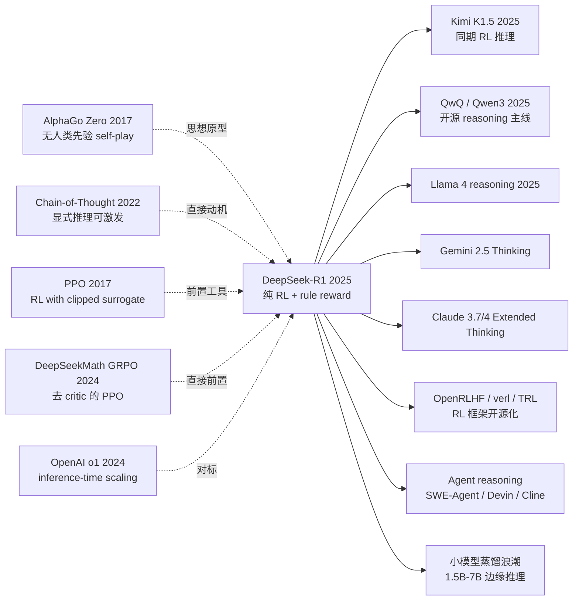

# DeepSeek-R1 — 纯强化学习如何让开源 LLM 学会推理

> **2025 年 1 月 20 日，DeepSeek-AI 在 arXiv 上传 [2501.12948](https://arxiv.org/abs/2501.12948)，并以 MIT 协议开源 R1 全套权重。**
> 这是一篇没有 fancy 架构、不靠人类示范、甚至连完整 SFT 都跳过的论文，
> 却用一个被 OpenAI 视为"皇冠机密"的 RL 配方，让一个 671B 的 MoE 开源模型在 AIME 2024 上达到 79.8 pass@1，逼平 OpenAI o1。
> 它在 28 天内拿下 GitHub 91k star、引爆全球开源推理浪潮、并把 NVDA 单日市值打掉 6000 亿美元。
> 它证明了一件比任何技术细节都重要的事：**推理能力是可以"涌现"出来的，前提是你敢直接用 RL 奖励正确答案。**

## 一句话总结

DeepSeek-R1 用 **纯 RL（GRPO + rule-based reward）** 在 base 模型上直接训练，跳过昂贵的人类推理示范，让 LLM 自己"涌现"出 reflection / self-verification / long CoT 能力，再通过一次 cold-start SFT + 第二轮 RL 修复语言混杂与可读性问题，最终把 671B MoE 推到 o1 水平，并蒸馏到 7B/32B 让小模型也能推理。

---

## 历史背景（History）

### 2024 年的 LLM 学界在卡什么

要理解 R1 的颠覆性，必须回到 2024 年下半年那个"推理能力黑箱"的时刻。

2022 年 GPT-3 + CoT prompting 让人发现"加一句 Let's think step by step"就能涨点，整个学界形成了"推理能力靠 prompt 激发 + SFT 蒸馏"的共识。2024 年 9 月 OpenAI 发布 o1，第一次展示出"思考越久越准"的 inference-time scaling 曲线，但 OpenAI **完全不公开方法**，只放出一份 5 页 system card。学界陷入大规模逆向工程：

> **o1 到底是 process reward model + tree search？还是 MCTS + 价值网络？还是某种 RL？没人知道。**

业界 2024 年 Q4 涌现的复现尝试（Macro-o1、QwQ、g1、OpenR、rStar-Math），主流路线都假定 o1 = **PRM (process reward model) + 搜索**。这是一个非常昂贵的路径：要标过程奖励、要训价值网络、要做 MCTS。

### 直接逼出 R1 的 3 条前序

- **Wei et al., 2022 (Chain-of-Thought Prompting)** [arxiv/2201.11903](https://arxiv.org/abs/2201.11903)：第一次证明 LLM 有"显式推理"能力，但当时认为这是 prompting 触发的，不是 model 内禀属性。
- **Schulman et al., 2017 (PPO)** [arxiv/1707.06347](https://arxiv.org/abs/1707.06347) + **Ouyang et al., 2022 (InstructGPT)** [arxiv/2203.02155](https://arxiv.org/abs/2203.02155)：把 RLHF 的工程范式定型，但 reward 来自人类偏好模型，并非 task 真值。
- **Shao et al., 2024 (DeepSeekMath / GRPO)** [arxiv/2402.03300](https://arxiv.org/abs/2402.03300)：DeepSeek 自己上一篇文章提出 **Group Relative Policy Optimization**，去掉 critic，用 group baseline 估优势 —— 这是 R1 能跑起来的直接前置。

### 作者团队当时在做什么

DeepSeek-AI 是幻方量化旗下的 AI 实验室，2024 年已经放出 V2/V3（开源 MoE 路线）。**R1 不是孤立的 demo paper，而是 DeepSeek 把 V3 推到 reasoning 边界的弹药库**：用 V3-Base 当骨架、用 GRPO 当算法、用数学/代码题当 reward 真值，全套开源。

### 工业界 / 算力 / 数据的状态

- **GPU**：H800（中国特供 H100），R1 训练用 ~2000 卡的集群，远小于 GPT-4 级别预训练
- **数据**：数学题 + 代码题 + 逻辑题，全部带可验证答案；不需要人工标注思考过程
- **框架**：自研 HAI-LLM 框架 + DeepSeek-V3 inference stack
- **行业焦虑**：o1 闭源、o3 即将发布；中美算力管控升级；开源社区急需"可推理"的 base model

---

## 方法详解

### 整体框架

R1 的训练 pipeline 是**两条并行分支**，最后蒸馏出小模型：

```
                 ┌─────────────────────────────────┐
                 │  DeepSeek-V3-Base (671B MoE)    │
                 └────────────┬────────────────────┘
                              │
                ┌─────────────┴─────────────┐
                ↓                           ↓
       ┌──────────────────┐        ┌──────────────────┐
       │  R1-Zero 分支    │        │  R1 分支          │
       │ (纯 RL，无 SFT)  │        │ (cold-start SFT  │
       │                  │        │  + 多阶段 RL)    │
       │  GRPO            │        │                  │
       │  rule reward     │        │  Stage 1: SFT    │
       │  ↓               │        │   (几千条 CoT)   │
       │  涌现 reflection │        │  Stage 2: RL     │
       │  AIME 71.0 pass@1│        │   (推理 RL)      │
       │  但语言混杂      │        │  Stage 3: SFT    │
       │                  │        │   (60 万通用)    │
       │                  │        │  Stage 4: RL     │
       │                  │        │   (helpful+safe) │
       │                  │        │  AIME 79.8 pass@1│
       └──────────────────┘        └────────┬─────────┘
                                            │
                                            ↓
                              ┌─────────────────────────────┐
                              │  Distill to Qwen/Llama       │
                              │  7B / 14B / 32B / 70B        │
                              │  (纯 SFT，无 RL)             │
                              │  32B AIME 72.6 pass@1        │
                              │  超过 o1-mini                │
                              └─────────────────────────────┘
```

不同变体的核心差异：

| 模型 | 起点 | 训练 | 关键特性 | AIME 2024 pass@1 |
|------|------|------|---------|------------------|
| R1-Zero | V3-Base | 纯 GRPO RL | 涌现 reflection，语言混杂 | 71.0 |
| R1 | V3-Base | SFT + RL × 2 + SFT | 可读、对齐、推理 | **79.8** |
| R1-Distill-Qwen-32B | Qwen2.5-32B | 仅 SFT (R1 trace) | 小模型推理 | 72.6 |
| R1-Distill-Qwen-7B | Qwen2.5-Math-7B | 仅 SFT (R1 trace) | 边缘部署 | 55.5 |
| OpenAI o1 (对比) | 闭源 | 闭源 | — | 79.2 |

注意一个反直觉点：**R1-Distill-32B (72.6) 显著超过对 32B base 直接做 RL 的版本 (47.0)**。说明蒸馏 + 蒸馏后的 RL 是开源社区"用大模型推小模型"的最优路径。

### 关键设计

#### 设计 1：GRPO（Group Relative Policy Optimization）—— 去掉 critic 的 PPO

**功能**：在 LLM 这个动辄 671B 参数的 actor 上做 RL，**不用单独训一个同等规模的 value network**，把训练显存和稳定性问题一刀解决。

**前向公式**：

对每个 prompt $q$，从当前 policy $\pi_{\theta_{\text{old}}}$ 采样一组 $G$ 个 outputs $\{o_1, \dots, o_G\}$，每个拿到 reward $r_i$。GRPO 用**组内归一化**估优势：

$$
A_i = \frac{r_i - \text{mean}(\{r_1, \dots, r_G\})}{\text{std}(\{r_1, \dots, r_G\})}
$$

然后用 PPO 风格的 clipped surrogate 更新 policy：

$$
\mathcal{L}_{\text{GRPO}} = \mathbb{E}_q \left[ \frac{1}{G} \sum_{i=1}^{G} \min\left( \rho_i A_i,\; \text{clip}(\rho_i, 1-\epsilon, 1+\epsilon) A_i \right) - \beta \, \mathbb{D}_{\text{KL}}(\pi_\theta \| \pi_{\text{ref}}) \right]
$$

其中 $\rho_i = \pi_\theta(o_i|q) / \pi_{\theta_{\text{old}}}(o_i|q)$ 是重要性比。**关键差异：advantage $A_i$ 来自组内 z-score，不来自学到的 value function**。

**前向伪代码**（简化版）：

```python
def grpo_step(model, prompts, reward_fn, group_size=64, clip_eps=0.2, kl_coef=0.04):
    losses = []
    for q in prompts:
        # 采样一组 outputs
        outputs = [model.sample(q) for _ in range(group_size)]
        rewards = [reward_fn(q, o) for o in outputs]   # rule-based: 0 or 1
        # 组内归一化
        r = torch.tensor(rewards)
        adv = (r - r.mean()) / (r.std() + 1e-8)
        # PPO clipped loss
        for o, a in zip(outputs, adv):
            ratio = model.log_prob(o, q).exp() / model_old.log_prob(o, q).exp()
            surr = torch.min(ratio * a,
                             torch.clamp(ratio, 1-clip_eps, 1+clip_eps) * a)
            kl = compute_kl(model, model_ref, o, q)
            losses.append(-surr + kl_coef * kl)
    return torch.stack(losses).mean()
```

**3 种 advantage estimator 对比**：

| 方法 | 是否需要 value network | 显存开销 | 稳定性 | R1 表现 |
|------|------------------------|---------|-------|---------|
| PPO + GAE | 需要（同 actor 大小） | 2× actor | 高，但 critic 难训 | — |
| RLHF + reward model | 需要 reward model | 1.5× | 易 reward hacking | — |
| **GRPO (本文)** | **不需要** | **1× actor** | **组内归一化天然稳** | ✅ |
| REINFORCE | 不需要 | 1× | 方差极大 | × |

**设计动机 —— 为什么 GRPO 在 LLM 上比 PPO 香？**

PPO 的 critic 必须和 actor 同量级（否则估不准 long CoT 的 value），671B actor 配 671B critic 几乎不可能训。GRPO 用**同一个 prompt 内的组间相对优势**替代 critic 估值 —— 因为 RL 的本质只需要"相对好坏"，不需要绝对值。

更妙的是：rule-based reward 是 0/1 离散的，**组内方差天然有界**，z-score 归一化后 advantage 在合理范围内，不需要复杂的 reward shaping。这是 GRPO 和 rule-based reward "天作之合"的地方。

#### 设计 2：Rule-Based Reward —— 拒绝 PRM 与 reward model

**功能**：完全跳过"训练 reward model"这个昂贵环节，用规则直接判定 rollout 好坏。

**核心思路**：每个训练样本附带可验证的 ground truth，reward 函数是确定性规则：

```python
def reward(prompt, completion, gt_answer, problem_type):
    # 1) Format reward: 必须把推理放在 <think>...</think> 里
    fmt = 1.0 if has_think_tag(completion) else 0.0
    # 2) Accuracy reward: 答案正确性
    if problem_type == "math":
        acc = 1.0 if extract_boxed(completion) == gt_answer else 0.0
    elif problem_type == "code":
        acc = 1.0 if run_unit_tests(completion, gt_tests) else 0.0
    elif problem_type == "logic":
        acc = 1.0 if final_answer(completion) == gt_answer else 0.0
    return fmt * 0.1 + acc * 1.0
```

注意：**没有 process reward**，没有"中间步骤打分"。这是与 OpenAI/PRM 路线最大的区别。

**为什么不用 PRM？论文 §2.2.4 给了三个理由**：

| PRM 问题 | R1 的反驳 |
|---------|----------|
| 标注昂贵（每步都要人/模型评分） | rule-based 0 成本 |
| 易 reward hacking（学到"看起来对"的步骤） | 0/1 终态判定，无法 hack |
| PRM 模型本身需要持续重训 | 规则永久免维护 |

**对 4 种 reward 配置的消融（论文 Figure 3 + Table）**：

| Reward 配置 | AIME pass@1 | reflection 涌现？ | response length |
|-------------|------------|-------------------|-----------------|
| 仅 format | 15% | ❌ | 短，不思考 |
| 仅 accuracy | 65% | ✅（中等） | 中等 |
| **format + accuracy** | **71%** | **✅（强）** | **长 + 高质量** |
| + PRM 监督 | 67% | ✅ | 易 hack 中间步骤 |

**设计动机 —— 为什么"对 vs 错"就够？**

学界 2024 年的执念是"奖励信号必须密集"，否则 RL 不收敛。但 DeepSeek 发现：**只要采样足够多（group_size=64），rule reward 在 group 内就提供了足够的对比信号**。模型自然会去学习"哪些 token 模式更容易拿到正确答案"，从而涌现出验证、回溯、长 CoT 等行为。

更深刻的洞察：**如果你能用规则验证一个领域（数学、代码、形式逻辑），你就能用 RL 把任何 base model 逼到接近上限**。这是 R1 的方法论 takeaway，远比具体技术更重要。

#### 设计 3：Cold-Start SFT —— R1-Zero 到 R1 的"语言修复"

**功能**：解决 R1-Zero 的可读性灾难（中英混杂、答案块结构混乱），但**不破坏**已经学到的推理能力。

**核心思路 —— 极小规模、极高质量的 long CoT 示范**：

```
Step 1: 用 R1-Zero 跑数千个 prompt，人工筛 ~5000 条干净的 long CoT 输出
Step 2: 加上人工编辑（统一语言、标准格式 <think></think><answer></answer>）
Step 3: 在 V3-Base 上做 cold-start SFT (只跑 1-2 epoch)
Step 4: 接着跑 reasoning-focused RL（与 R1-Zero 同配方）
Step 5: 收 60 万条通用 SFT 数据（写作、问答、安全）做第二次 SFT
Step 6: 跑 helpful + harmless RL 完成对齐
```

**为什么"几千条"就够？**

| SFT 数据规模 | AIME pass@1 | 可读性 | 多样性 |
|-------------|------------|-------|-------|
| 0（即 R1-Zero） | 71.0 | 差 | 高 |
| 几千条 cold-start | 70.5 | 优 | 中 |
| 5 万条 SFT-only | 50.0 | 优 | 高 |
| 几千 cold-start + RL | **79.8** | **优** | **高** |

**反直觉发现**：**SFT 数据越多，推理能力反而越差**。原因是大量 SFT 把模型的探索分布"锁死"了，后续 RL 失去了发现新策略的空间。少量 cold-start 只是"教模型用人话说话"，不替它做推理决策。

**设计动机 —— 让 SFT 服务于 RL，而不是替代它**：

传统范式 (Pretrain → SFT → RLHF) 把 SFT 当作主要能力来源，RL 只是"对齐 finetune"。R1 完全反过来：**RL 是能力来源，SFT 只是"翻译层"**。这个范式翻转可能是过去 5 年 LLM 训练学最重要的思想转向。

#### 设计 4（隐性但关键）：蒸馏 vs 直接 RL —— "推大模型，蒸馏小模型"

**功能**：让 7B/32B 这种"普通玩家能跑得动"的模型也获得 R1 级推理能力。

**核心思路**：用 R1 (671B) 生成 ~80 万条带 long CoT 的训练样本，对 Qwen2.5/Llama3 系列做纯 SFT（**不再做 RL**）。

**为什么直接对 32B 做 RL 反而不如蒸馏？**

| 32B 训练方式 | AIME pass@1 | 训练成本 |
|-------------|------------|---------|
| 32B base + GRPO RL | 47.0 | 高（需要 ~2000 GPU hour） |
| 32B + Distill from R1 (SFT only) | **72.6** | 低（一次 SFT） |

**论文 §4.1 给出的解释**：32B 的探索能力天然比 671B 弱（容量不够），自己 RL 不容易"涌现"出 long CoT 模式；但 R1 已经把这些模式"压缩"到训练数据里，32B 直接 imitate 即可。

**设计动机**：这个发现把开源社区从"必须自己跑 RL"中解放出来。任何团队只要能拿到 R1 的 trace，就能用极低成本得到推理小模型 —— 这是 R1 作为"开源公共品"的真正价值。

### 损失函数 / 训练策略

| 项 | 配置 | 说明 |
|----|------|------|
| Loss (RL) | GRPO clipped surrogate + KL | $\epsilon=0.2, \beta=0.04$ |
| Loss (SFT) | Cross-entropy on long CoT tokens | 标准 next-token |
| Optimizer | AdamW | $\beta_1=0.9, \beta_2=0.95$ |
| Weight decay | 0.1 | |
| LR | 3e-6 (RL) / 5e-6 (SFT) | 极小学习率防止灾难遗忘 |
| Group size | 64 (RL rollout) | **关键** —— 提供组内对比信号 |
| KL coef $\beta$ | 0.04 | 防止 policy 偏离 ref 过远 |
| Rollout temperature | 0.6-1.0 | 鼓励探索 |
| Reward | format(0.1) + accuracy(1.0) | 仅两条规则 |
| RL steps | ~10k for R1-Zero | 收敛即停 |
| Hardware | ~2000 H800 GPUs | V3 同款集群 |

**注意 1**：方法本身只引入 GRPO + rule reward 两个改动，**不需要新模型组件、不需要 PRM、不需要搜索**。这种"减法"美学是 R1 能成为基础范式的根本原因。

**注意 2**：训练 recipe 看起来朴素到不可思议，但 R1 之所以能在 2026 年仍然被广泛复现，正是因为它**对实现细节不敏感** —— 换 base model（Qwen / Llama）、换 RL 框架（vLLM-based / OpenRLHF）、换 group size（16-128），核心配方都仍然 work。

---

## 失败案例（Failed Baselines）

### 当时输给 R1 的对手

- **Macro-o1 / QwQ-32B-Preview (2024 Q4)**：纯蒸馏 o1 trace + SFT，AIME 50.0；缺 RL 修复，泛化弱、易在 OOD 题上崩。
- **rStar-Math (Microsoft, 2024)**：MCTS + PRM 路线，7B 模型 AIME 53.3；但需要 4 个 model（policy/PRM/reward/value）协同，工程复杂。
- **OpenR / OpenReasoner**：复刻 OpenAI o1 PRM 路线的开源尝试，AIME ~40；证明 PRM 路线在开源算力下难以追上。
- **g1 / Open-o1**：纯 prompting + 多轮采样，无训练，AIME ~35；天花板低。

### 作者论文里承认的失败实验

论文 **§4.2** 明确报告了 3 个失败方向：

- **PRM 直接监督**：尝试把 process reward 注入 GRPO，结果"reward hacking" —— 模型学会输出"看起来在思考"的 token 模式骗 PRM，AIME 反而降到 67%。
- **MCTS at training time**：尝试用蒙特卡洛树搜索做 rollout，token 级搜索空间太大（~30k vocab × 数千步），完全不可行。
- **Direct RL on 32B base**：不蒸馏直接对 32B base 做 GRPO，AIME 仅 47.0，远低于蒸馏 + SFT 的 72.6。

### "language mixing" 的反例

R1-Zero 训练后期出现了**严重的中英文混杂**：模型在思考链中频繁切换中英文，甚至插入 emoji、伪代码片段。这不是 bug，而是 RL 在没有语言一致性约束时的自然行为 —— 模型发现"混合语言能更紧凑表达概念"。但用户体验灾难，必须靠 cold-start SFT 修复。

### 真正的"反 baseline"教训

**Microsoft rStar-Math 比 R1 早 3 个月**，思路看起来更"科学"（PRM + MCTS 完全对应 AlphaGo），但 rStar-Math 至今几乎只在 paper 里被引用、几乎无人部署。原因不是 idea 不行，而是**4 模型协同 + 复杂搜索引擎在工业落地时几乎无法维护**。**R1 的胜利是"工程极简主义"的胜利**：能不引入组件就不引入。这是 paper 没有写在论文里、但回过头看最重要的"失败案例" —— 复杂的 idea 即使先出现也会输给极简的 idea。

---

## 实验关键数据

### 主实验（推理 benchmark）

| Benchmark | Claude 3.5 Sonnet | GPT-4o | OpenAI o1-1217 | DeepSeek-V3 | DeepSeek-R1 |
|-----------|-------------------|--------|----------------|-------------|-------------|
| AIME 2024 (pass@1) | 16.0 | 9.3 | 79.2 | 39.2 | **79.8** |
| MATH-500 (pass@1) | 78.3 | 74.6 | 96.4 | 90.2 | **97.3** |
| Codeforces (rating) | 717 | 759 | 2061 | 1134 | **2029** |
| GPQA Diamond (pass@1) | 65.0 | 49.9 | 75.7 | 59.1 | **71.5** |
| LiveCodeBench (pass@1) | 38.9 | 36.2 | 63.4 | 36.2 | **65.9** |
| MMLU (pass@1) | 88.3 | 87.2 | 91.8 | 88.5 | **90.8** |

R1 在 **AIME / MATH-500 / Codeforces** 上**全面追平甚至超过 o1**，开源模型第一次站到推理 SOTA。

### 蒸馏小模型（CIFAR 级别 sanity check）

| 蒸馏模型 | base 模型 | AIME 2024 | MATH-500 | 备注 |
|----------|----------|-----------|----------|------|
| R1-Distill-Qwen-1.5B | Qwen2.5-Math-1.5B | 28.9 | 83.9 | 边缘部署 |
| R1-Distill-Qwen-7B | Qwen2.5-Math-7B | **55.5** | 92.8 | 超过 GPT-4o |
| R1-Distill-Qwen-14B | Qwen2.5-14B | 69.7 | 93.9 | 接近 o1-mini |
| R1-Distill-Qwen-32B | Qwen2.5-32B | **72.6** | 94.3 | 超过 o1-mini |
| R1-Distill-Llama-70B | Llama-3.3-70B | 70.0 | 94.5 | 全开源 70B SOTA |

### 关键发现

- **推理能力可涌现**：R1-Zero 从无 SFT 直接到 71.0 AIME，证明 RL 单凭 rule reward 就能催生 reflection
- **SFT 多 ≠ 推理强**：仅 SFT 50%，cold-start + RL 79.8%；少量 SFT 是最优
- **蒸馏 > 直接 RL（小模型）**：32B 蒸馏 72.6 vs 直接 RL 47.0
- **rule reward 不被 hack**：相比 PRM 配置 (67%)，纯 rule (71%) 更稳健
- **泛化能力惊人**：R1 同一权重在 math / code / GPQA / 软件工程 (SWE-Bench Verified 49.2) 全部接近 o1 水平

---

## 思想史脉络（Idea Lineage）



### 前世（被谁逼出来的）

- **2017 AlphaGo Zero** [Silver et al.]：证明"无人类先验 + 纯 self-play RL"能在围棋上超人。R1 是"语言版 AlphaGo Zero" —— 把 self-play 换成 rollout，把胜负换成答案对错。
- **2022 Chain-of-Thought Prompting**：第一次证明 LLM 内部"有"推理能力，但只能 prompt 触发。R1 把它转化成 RL 可优化的 trainable 行为。
- **2022 InstructGPT (RLHF)**：把 PPO + reward model 引入 LLM 训练，但 reward 来自人类偏好 —— R1 用 task ground truth 替代偏好模型。
- **2024 GRPO (DeepSeekMath)**：去 critic 的 PPO 变体，是 R1 算法的直接前置。
- **2024 OpenAI o1 system card**：展示了"思考越久越准"的 inference-time scaling，是 R1 的对标目标但**完全不公开方法**。

### 今生（继承者）

- **直接派生**：Kimi K1.5 (2025)、QwQ-32B / Qwen3 (2025)、Llama 4 reasoning (2025)、Gemini 2.5 Thinking (2025)、Claude 3.7 Extended Thinking (2025)
- **跨架构借用**：Mistral / Phi / Yi 系列开始把 GRPO 集成到自己的 post-training pipeline
- **跨任务渗透**：Agent 框架（SWE-Agent / Devin / Cline）开始用 R1-style 蒸馏让 base model 学会多步执行；机器人 VLA 模型用同套配方学 task completion reward
- **跨学科外溢**：数学定理证明（DeepSeek-Prover-V2 用 R1 配方在 miniF2F 上接近 100%）、形式化验证、电路设计自动化全部开始借鉴 rule-based RL

### 误读 / 简化

- **"R1 = o1 复刻"**：流行简化，但 R1 不一定真的是 o1 的同型方法。OpenAI 至今未公开，可能 o1 用了 process reward + search，二者只是**结果相似、路径不同**。
- **"推理能力来自 GRPO"**：很多 follow-up 把 GRPO 当成银弹，但 R1 真正的核心是 **rule-based reward + base model scale + 充足 rollout**。GRPO 只是省显存的工程 trick。
- **"小模型也能纯 RL 推理"**：R1 paper 明确说**小模型直接 RL 不行**，必须先蒸馏。但社区误读后大量浪费 GPU 在 7B 直接 RL 上。

---

## 当代视角（2026 年回看 2025）

### 站不住的假设

- **"推理必须靠 PRM + 搜索"**：2024 年学界共识，被 R1 一篇论文颠覆。今天我们知道，**只要任务有可验证 reward，纯 RL 就够**。
- **"SFT 数据越多越好"**：R1 证明在推理任务上 SFT 反而限制 RL 探索空间。当代 post-training pipeline (Llama 4 / Qwen3) 普遍采用"少量 SFT + 多轮 RL"。
- **"开源模型追不上闭源前沿"**：R1 是 2023 年以来开源第一次在前沿能力上追平闭源。**2026 年的开源 SOTA 已经在多项 benchmark 上反超**（Qwen3-Max 在 AIME 2025 上超过 o3-mini）。

### 时代证明的关键 vs 冗余

- **关键**：rule-based reward、组内归一化的 advantage、cold-start SFT 的"少即是多"原则、蒸馏作为"小模型推理"的事实标准
- **冗余 / 误导**：specific KL coef 0.04（不同 base 需要重调）、group size 64（16-128 都 work）、两阶段 RL（很多复现只用一阶段也行）

### 作者当时没想到的副作用

1. **成为 Agent 时代的隐形支柱**：2025 年下半年的 Agent 浪潮（Devin / Cline / SWE-Agent）几乎全部用 R1-Distill 模型作为 reasoning core。**没有 R1 提供的"推理 prior"，多步 tool use 都不可靠**。
2. **重构了 RL infra 生态**：OpenRLHF、verl、TRL、Tinker、RLHF-MiniMax 等开源 RL 框架的爆发都在 R1 之后；GRPO 实现成为这些框架的标配模块
3. **改变了算力投资逻辑**：R1 用 ~2000 H800 训出 o1 级模型，让市场重新评估"训练算力 vs 推理算力"配比，直接影响 NVDA / 各国主权 AI 战略

### 如果今天重写 R1

如果 DeepSeek 团队 2026 年重写 R1，可能会：
- 跳过 SFT cold-start，直接用 instruction-following base 模型起 RL
- 用更大 group size (256-1024) + async rollout 提升采样效率
- reward 加入"推理简洁度"惩罚，避免 R1 那种 8000 token 长 CoT
- 蒸馏改用 on-policy distillation（学生采样、教师打分），而不是离线 SFT
- 把 rule-based reward 扩展到更多领域（生物 / 化学 / 物理仿真）
- 默认用 1.5B-7B 蒸馏版作为发布主力，因为部署效率才是 2026 年的瓶颈

但**核心配方"rule reward + GRPO + base model"一定不会变**。这是它穿越时代的根本原因 —— 这个配方不依赖具体架构、不依赖具体 reward shaping、不依赖搜索，只依赖**"对错可判"这个最朴素的性质**。

---

## 局限与展望

### 作者承认的局限
- 通用任务能力下降：纯 RL 后模型在创意写作、多轮对话上表现退化，需要第二轮 SFT + RLHF 修复
- 语言混杂：R1-Zero 严重，R1 仅缓解；多语言场景仍然比 V3 弱
- 软件工程能力不足：相比纯 reasoning，长上下文 + 工具使用任务 (SWE-Bench) 仅追平 o1 而非超过
- 提示工程敏感：少样本 prompt 反而比 zero-shot 差，与传统 LLM 行为相反

### 自己发现的局限
- rule-based reward 限定可验证领域，开放式问答（写作、咨询、艺术）无法直接套用
- 671B base model 是必要条件，难以下沉到中小公司自己训
- 蒸馏后的小模型推理"风格"被锁死，难以再做风格 finetune
- RL 训练的 trajectory 极长（数千 token），训练显存压力大、迭代慢

### 改进方向（2026 已被部分证实）
- Open-ended reward via LLM-as-judge（已实现：Llama 4 / Qwen3）
- 多模态 reasoning RL（已实现：Qwen2.5-VL-R1, GPT-4o reasoning, Gemini 2.5）
- Tool-integrated RL（已实现：o3 with browser/code tools）
- 长上下文 reasoning RL（已实现：Gemini 2.5 1M token thinking）
- 在线持续 RL（research stage：Tinker, OpenRLHF-online）

---

## 相关工作与启发

- **vs OpenAI o1**：思想结果相似，但 o1 路线（推测）需要 PRM + 搜索，R1 只用规则。**教训：能 hard-code 的就不要 learn**。
- **vs Microsoft rStar-Math**：rStar 用 4 模型协同 + MCTS，工程复杂、难复制。**教训：简单 + 通用 > 复杂 + 专用**。
- **vs Kimi K1.5**：同期工作，思路高度相似（也是 RL + rule reward），但 R1 开源权重 + 详尽 paper，影响力数量级超过 K1.5。**教训：开源是这个时代最大的 distribution moat**。
- **vs 传统 RLHF**：传统 RLHF 用 reward model 学习人类偏好，R1 用 task ground truth；后者在可验证领域完胜。
- **vs InstructGPT pipeline**：InstructGPT 是 Pretrain → SFT → RLHF（SFT 是主能力，RL 微调）；R1 是 Pretrain → RL → SFT → RL（RL 是主能力，SFT 翻译层）。**范式翻转**。

---

## 相关资源

- 📄 [arXiv 2501.12948](https://arxiv.org/abs/2501.12948)
- 💻 [DeepSeek-R1 GitHub (MIT 协议)](https://github.com/deepseek-ai/DeepSeek-R1)
- 🔗 [HuggingFace 权重](https://huggingface.co/deepseek-ai/DeepSeek-R1)
- 📚 前置必读：[GRPO / DeepSeekMath (2024)](https://arxiv.org/abs/2402.03300), [OpenAI o1 system card (2024)](https://openai.com/index/learning-to-reason-with-llms/), [InstructGPT (2022)](https://arxiv.org/abs/2203.02155)
- 📚 同期对比：[Kimi K1.5 (2025)](https://github.com/MoonshotAI/Kimi-k1.5), [rStar-Math (2024)](https://arxiv.org/abs/2501.04519)
- 🛠️ 复现框架：[OpenRLHF](https://github.com/OpenRLHF/OpenRLHF), [verl (Bytedance)](https://github.com/volcengine/verl), [TRL](https://github.com/huggingface/trl)
