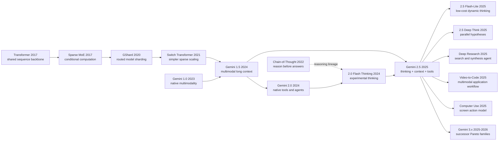

# Gemini 2.5 - 当思考、多模态、长上下文与工具调用汇成一个模型族

> **2025 年 3 月 25 日，Google 用 [Gemini 2.5 Pro Experimental](https://blog.google/technology/google-deepmind/gemini-model-thinking-updates-march-2025/) 第一次把 “thinking model” 这个说法与 1M token 多模态上下文、代码、原生工具和 agent 叙事绑成同一个产品入口；到 6 月 17 日 GA 时，这条线又扩成 Pro、Flash 与 Flash-Lite 的整族接口。** 它真正抓人的地方，不是又一次把窗口、分数或宣传词堆高，而是让一个 frontier 模型第一次像可编程工作台那样被使用：长文档、代码仓、视频、搜索结果、函数回执和中间计划都能留在同一轮推理循环里，而“想多久”本身也变成了 budget。Gemini 2.5 因而比 Gemini 1.5 更像一个时代转折点的下半场: 1.5 解决“能看到多少”，2.5 开始逼业界回答“看到了之后，怎样思考、怎样行动、怎样把代价和风险一起算进去”。

## 一句话总结

Gemini Team, Google 在 2025 年发布的这份技术报告，真正交出的不是“又一个更强大模型”，而是一条把 long context、thinking、multimodality、coding 和 tool use 压进同一家族接口的产品与系统路线：在解释层面，它仍可被看成让每个 token 只激活部分专家的 sparse MoE 路线，活跃计算更接近 $C_\text{active}=\sum_{e\in\mathrm{TopK}(r(x))} C_e$，再叠加可控的 inference-time thinking budget；在行为层面，它把 [Gemini 1.5](2024_gemini15.md) 的多模态百万级工作台推进成一个会思考、会调用 Search/代码/函数、会在 1M 上下文里处理视频与代码仓的 agent 底座。它击穿的失败 baseline 也不是单个竞争模型，而是 2024 年那种“长上下文、推理模型、工具调用器、视频模型可以各做各的”的默认切分：相较 1.5 Pro，2.5 Pro 在 LiveCodeBench 从 29.7% 升到 74.2%，SWE-bench Verified 单次从 22.3% 升到 59.6%，LOFT hard retrieval 1M 从 47.1% 升到 69.8%，VideoMME 从 73.2 升到 84.3；但它又用 Pokémon、MRCR-V2 和 prompt injection 数据提醒读者，模型并没有因为 1M context 就自动获得长期规划、完美视觉 agent 或安全工具自治。隐藏 lesson 因而很尖锐：**Gemini 2.5 的历史地位，不是重新发明长上下文，而是第一次把“模型该看多少、想多久、何时调工具、如何验证结果”压缩成一个可编程 family interface。**

---

## 历史背景

### 2024 年：Gemini 1.5 打开了输入带宽，却还没有把“慢思考”做成模型接口

Gemini 2.5 的故事不能从 2025 年 3 月突然讲起。它最直接的地基是 [Gemini 1.5](https://arxiv.org/abs/2403.05530)：2024 年的这条产品线把原生多模态与百万级上下文放进同一个模型家族，让整本书、完整代码库、长视频和长音频第一次成为正常输入，而不只是被检索器切成若干片段。Gemini 1.5 v5 披露，Pro 是稀疏 Mixture-of-Experts Transformer，Flash 是从更大模型在线蒸馏而来的 dense Transformer；Pro 的研究实验把文本检索推到 1000 万 token，产品家族则围绕 100 万到 200 万 token 的窗口落地。已有的 [Gemini 1.5 深度解读](/era5_genai_explosion/2024_gemini15/) 已经详细讨论了 Kalamang、长视频和 needle-in-a-haystack，本篇只保留它对 2.5 至关重要的一层：1.5 把“模型一次能看到多少”改写了。

但看得多不等于会在回答前主动分配更多计算。Gemini 2.5 报告的 Table 1 用后见之明把 1.5 Flash 与 Pro 都标为不支持 thinking，文本输出上限是 8K；报告所选的这两个 1.5 API 型号也没有 2.x 所说的原生 tool use。1.5 报告当然已经做过 chain-of-thought 提示、数学专用模型、函数调用和 in-context planning 实验，可那些能力仍分散在提示协议、专门 checkpoint 或评测设置里。换句话说，1.5 扩大的是工作台，尚未把“先规划、再调用工具、根据结果继续推理”打包成统一推理循环。

这个区别也解释了为什么 2.5 没有继续用“窗口更长”作为唯一标题。1.5 已经证明模型能在百万 token 里找东西；下一道难题是能否在同一个巨大工作台上思考、验证、写代码并行动。Gemini 2.5 不再把 long context 当作孤立特技，而把它变成 agent 的状态载体：上下文里既有用户材料，也有工具返回、行动历史、代码仓和模型自己维护的中间目标。

### 2024 年 12 月：Gemini 2.0 把原生工具调用推到“agentic era”

2024 年 12 月 11 日，Google 发布 [Gemini 2.0 Flash Experimental](https://blog.google/technology/google-deepmind/google-gemini-ai-update-december-2024/)，措辞从 1.5 的“理解更多信息”转向“让信息更有用”。2.0 Flash 延续低延迟和多模态输入，却新增原生调用 Google Search、代码执行与第三方函数的能力；原生图片输出、可控 TTS 和 Multimodal Live API 则先以实验或早期访问形式出现。这里真正的变化不是函数调用语法本身，而是模型训练目标开始覆盖“观察环境 - 选择工具 - 消化结果 - 再采取动作”的闭环。

同一天出现的几个原型，把抽象路线画得很具体。Project Astra 用 Search、Lens 与 Maps 接上实时多模态助手；Project Mariner 在浏览器像素和 DOM 元素上执行点击、输入和滚动，并在敏感动作前要求确认；Jules 接收 GitHub issue，制定计划并在开发者监督下执行。Google 还把 Gemini 2.0 的目标直接称作 agentic era。它并不意味着这些原型已经可靠：发布稿明确说 Mariner 当时速度慢、并非总是准确，而且只在当前活动标签页行动。恰恰是这种限制让 2.0 成为 2.5 的真正前序，而不是宣传插曲：模型能力必须与权限边界、确认机制、提示注入防护和工具接口一起设计。

2.0 还留下另一条关键支线。报告把 2024 年 12 月上线的 Gemini 2.0 Flash Thinking Experimental 称为 2.5 thinking recipe 的起点。传统 2.0 Flash 追求快速直接回答，Thinking 版本则允许先消耗额外推理计算。到 2025 年 2 月 5 日，2.0 Flash 正式 GA，1M 上下文的 Flash-Lite 进入 preview，2.0 Pro Experimental 则用 2M 上下文测试复杂提示和编码。这个产品矩阵已经露出后来 Pareto 家族的形状：不是让每次请求都跑最贵模型，而是让不同延迟、成本和能力需求落到不同档位。

### 2025 年 3 月到 6 月：推理模型竞争从单一高分变成可控计算

2025 年初的前沿模型竞争不再满足于“参数更多、预训练更久”。OpenAI o1、DeepSeek-R1 与 Claude 3.7 Sonnet 分别把 test-time compute、强化学习推理和混合快答/深思接口推到台前；Google 必须回答一个更难的问题：Gemini 已经拥有多模态和长上下文，能否让 thinking 与这些能力原生结合，而不是再挂一个只会做数学的专用模型？3 月 25 日发布的 [Gemini 2.5 Pro Experimental 03-25](https://blog.google/technology/google-deepmind/gemini-model-thinking-updates-march-2025/) 就是这个回答。Google 将它定义为 thinking model，初始开放 1M token，并强调不靠 majority voting 的单次推理成绩。

随后两个月的版本节奏说明“Gemini 2.5”不是一个静态 checkpoint。5 月 6 日的 05-06 Preview 提前发布 I/O edition，重点修复 function-calling 触发、代码变换和前端应用生成；5 月 20 日，Flash 更新强调用更少 token 覆盖推理、多模态、代码与长上下文，并引入 thought summaries、Pro thinking budget 与 SDK 级 MCP 支持；6 月 17 日，06-05 Pro 与 05-20 Flash 分别固定为 GA 端点，Flash-Lite 进入 preview。Flash-Lite 默认关闭 thinking，Pro 与 Flash 则动态思考，但三者都允许通过预算控制质量、延迟和价格。

7 月 7 日，72 页的技术报告 v1 才登上 arXiv；其后在 7 月 11 日、7 月 17 日、7 月 22 日、10 月 16 日和 12 月 19 日连续修订，当前应引用 v6。这个顺序很重要：论文不是先提出算法、再等待产品实现，而是把半年内快速演化的模型、API、评测、基础设施和安全工作整理成一份部署后技术报告。读者面对的不是一条干净的论文时间线，而是一组 checkpoint、preview、GA 与专用变体。任何数字都必须同时注明型号、日期和评测协议。

### 一份由 3000 余位参与者共同完成、却主动隐藏大量 recipe 的报告

arXiv 作者栏写的是 “Gemini Team, Google”，正文列出随机排序的 contributors，并说明 Gemini 开发涉及 Google 内部 3000 余位研究、工程和运营参与者。这种署名方式本身就是项目性质的线索：Gemini 2.5 的核心不是一个实验室用几页公式描述的新层，而是模型、数据、TPU、Pathways、服务、产品、红队与治理共同组成的工业系统。报告披露了多座 8960-chip TPUv5p pod、跨数据中心同步数据并行、弹性容错和静默数据损坏检测，却不披露模型参数量、专家数量或总训练算力。

因此，它与可复现算法论文的阅读方法不同。我们可以核验“稀疏 MoE Transformer”“Flash 及更小型号使用蒸馏”“2.5 数据截止到 2025 年 1 月”“RL 使用可验证奖励和模型生成奖励”等高层事实；不能从这些句子反推出 Top-k router、位置编码、优化器或训练 token 数。Google 给出的 benchmark 很丰富，却大多仍是提供商自报；Table 4 甚至主动提醒，各家公司 SWE-bench 的 scaffold 和基础设施不同，不能直接横比。这份报告最值得研究的不是秘方，而是它如何定义一个前沿模型系统应公开哪些能力、成本、失败与安全证据。

## 研究背景与动机

### 痛点：五种强能力各自成立，组合起来却会互相拖累

到 2025 年 3 月，thinking、multimodality、long context、coding 和 tool use 都已有单项强例子，但把它们放进一个请求会出现新的耦合。长视频与整个代码仓会占满输入预算；thinking 又增加输出 token、延迟与费用；工具调用把外部不可信内容带回上下文；agent 循环让一次小 hallucination 变成后续几十步的错误状态；更强的模型还可能拥有更强的网络攻击或提示注入能力。单看 AIME、VideoMME、NIAH 或函数调用准确率，都无法说明组合系统是否有用。

Gemini 2.5 的研究问题因此不是“如何再做一个 reasoning model”，而是“能否让同一个模型在多模态长材料上分配推理计算，调用工具，读取返回结果，再生成可执行代码或下一步行动”。视频转学习应用就是最紧凑的例子：模型先理解长视频，生成应用规格，再根据规格写出交互界面。任一能力单独失效，工作流都会断掉。相反，能力组合成功时，产物不再只是答案，而是报告、代码、网页、搜索计划或环境动作。

### 目标：把 capability-cost Pareto frontier 做成模型族，而不是一个冠军点

一个只追最高分的旗舰无法覆盖 Google 的调用规模。2.5 Pro 负责最难的推理、代码库理解和多模态编码；2.5 Flash 用可控 thinking budget 服务大多数复杂请求；2.0 Flash 面向无需深思的日常低延迟任务；2.0 Flash-Lite 则压到大规模吞吐的最低成本端。后来加入的 2.5 Flash-Lite 进一步说明这不是临时命名：低成本型号也获得 1M 上下文、原生工具和可选 thinking，只是默认关闭思考。

“Pareto frontier”在这里比“最好模型”更准确。若一种配置在质量上不差、同时成本和延迟更低，它会支配另一配置；真正有价值的家族应在不同预算下都提供不可被同时超越的选项。报告 Figure 1 用 LMArena 与 token 价格画出这种前沿，Figure 2 再补输出速度。这个视角把 test-time compute 从实验参数变成产品资源：开发者不是简单选模型，还要为每个任务决定上下文长度、thinking budget、工具数量、尝试次数和验证强度。

### 报告要证明的不是隐藏思维，而是可观测的系统结果

Gemini 2.5 报告用三类证据支撑这条路线。第一类是核心能力表：2.5 Pro 相比 1.5 Pro，在 LiveCodeBench、Aider Polyglot、GPQA、AIME、LOFT、MMMU 和 VideoMME 上都有可量化提升。第二类是系统案例：Deep Research 把搜索与多步综合接起来，Gemini Plays Pokémon 暴露数百小时 agent 运行中的规划、循环和 context poisoning。第三类是安全证据：自动红队、间接提示注入、记忆提取、CBRN、网络安全、ML R&D 与 deceptive alignment 都按 checkpoint 和 protocol 报告。

这些证据能说明“系统在给定设置下做到了什么”，却不能说明模型内部究竟如何形成每一步思路。2025 年 5 月公开的是经过组织的 thought summaries；报告说 thinking 会消耗额外内部计算，并允许 token budget，但没有承诺向用户暴露完整原始 chain-of-thought。本笔记因此只讨论可验证接口：输入、预算、工具调用、输出、评测和失败轨迹。把营销词“模型会思考”翻译成工程语言，就是同一模型能用可控的额外推理计算改善任务结果，同时让成本、延迟和风险进入可测量范围。

---

## 方法详解

Gemini 2.5 不是一篇可以照着超参数表复现模型的论文。它公开了模型类别、训练基础设施、数据模态、后训练阶段、评测 API 与若干安全方法，却没有公开参数规模、层数、专家数、token 总量或优化器。因此，本节的目标不是反推 Google 内部实现，而是从可核验材料中拆出一套系统逻辑：为什么 sparse MoE、稳定的大规模训练、蒸馏、动态 thinking、多模态长上下文与原生工具必须一起工作，才能让 Gemini 2.x 形成能力-成本前沿。

### 公开边界：能画系统接口，不能补完隐藏网络

报告 Section 2.1 明确称 Gemini 2.5 为原生支持文本、视觉与音频输入的 sparse mixture-of-experts Transformer。Section 2.2 说明预训练数据覆盖公开网页、代码、图像、音频和视频，2.0 截止到 2024 年 6 月、2.5 截止到 2025 年 1 月；Section 2.4 列出 SFT、reward modeling 与 RL，并提到可验证奖励、模型生成奖励以及多步工具环境。公开内容到这里就停了。下表是阅读整篇报告最重要的护栏。

| 层面 | 官方披露 | 官方没有披露 | 本文可做的解释 |
|---|---|---|---|
| 主干 | sparse MoE Transformer | 层数、宽度、总参数与激活参数 | 用条件计算解释容量与单 token 成本解耦 |
| 路由 | 每个 token 激活部分专家 | 专家数、Top-k、router 和均衡损失 | 只写概念公式，不声称内部实现 |
| 长上下文 | Pro/Flash 支持 1M；报告比较 128K 与 1M | attention、位置编码、KV cache 方案 | 从 LOFT/MRCR 结果讨论可用性 |
| 多模态 | 文本、图像、视频、音频输入 | 各模态 encoder、tokenizer 与融合位置 | 从每帧视觉 token 与评测协议讨论压缩 |
| 数据 | 数据类型、质量过滤/去重改进、截止日期 | 规模、来源清单、授权结构、混合比例 | 不把 knowledge cutoff 当训练规模 |
| 训练 | TPUv5p、Pathways、多 pod 同步并行、弹性与 SDC 检测 | batch、步数、优化器、学习率和总 FLOPs | 分析系统稳定性为何属于模型方法 |
| 后训练 | SFT、RM、RL、可验证/生成奖励、工具环境 | 具体算法、奖励权重和数据量 | 将 thinking 与 agent 行为视作可测接口 |
| 思考 | 额外推理计算、动态时长、token budget | 原始隐藏思维及其忠实可见性 | 只讨论 thought summary，不推断 hidden CoT |

这条边界不是保守措辞，而是技术结论的一部分。Gemini 2.5 的公开价值来自能力与系统证据，不来自可复现 recipe。若解读者把 sparse MoE 自动写成“某个专家数和 Top-2 router”，或把 thought summary 当成原始思维，就会把未知项伪装成论文贡献。

### 整体框架：五种能力如何汇成一个可行动模型

可以把公开的 Gemini 2.5 系统压成下面这条数据流。图中的 `THINKING` 不是向用户公开的完整推理文本，而是受预算约束的额外内部计算；`THOUGHT SUMMARY` 是可选的组织化摘要。`TOOLS` 也不等于模型自己执行任意动作，实际执行仍由 API、agent scaffold 和权限系统完成。

```text
TEXT / IMAGE / VIDEO / AUDIO / PDF
                  |
          MULTIMODAL CONTEXT (1M)
                  |
          SPARSE MoE TRANSFORMER
                  |
       DYNAMIC THINKING WITH BUDGET
                  |
      +-----------+------------+
      |                        |
 TEXT / CODE OUTPUT      TOOL-CALL REQUEST
                               |
             SEARCH / CODE / FUNCTIONS / URLS
                               |
                    VERIFIED TOOL RESULT
                               |
                       NEXT MODEL TURN
```

把它写成解释性目标，可以把模型选择、思考预算与工具策略一起看成受成本约束的优化。这里的 $Q$ 是任务质量，$C$ 是 token/工具费用，$L$ 是延迟，$R$ 是安全与失败风险；它不是 Google 披露的 loss：

$$
\pi^*=\arg\max_{m,B,\tau}\;Q(x;m,B,\tau)-\lambda_C C(m,B,\tau)-\lambda_L L(m,B,\tau)-\lambda_R R(m,B,\tau).
$$

其中 $m$ 决定 Pro、Flash 或 Flash-Lite，$B$ 是 thinking budget，$\tau$ 是可用工具与调用策略。这个抽象抓住 2.x 的核心：不能只问“哪个模型分最高”，而要问“在这个任务、预算和权限下，哪种组合最合适”。

| 能力层 | 解决的问题 | 与其他层的耦合 | 公开证据 |
|---|---|---|---|
| Sparse MoE | 增加容量但控制每 token 激活计算 | 长上下文会把任何单 token 成本放大 | Section 2.1 |
| 原生多模态 | 让图像、视频、音频和代码成为直接证据 | 媒体 token 化决定可容纳时长 | Sections 2.1/2.6 |
| 动态 thinking | 给难题更多推理计算 | 增加延迟、输出预算和调用成本 | Section 2.5 |
| 长上下文 | 保留整本材料、代码仓和行动历史 | 过长轨迹会诱发循环与旧动作复读 | Tables 3/6, Section 4.1 |
| 原生工具 | 获取新信息、执行代码和函数 | 外部内容带来提示注入与权限风险 | Sections 2.6/5.5 |
| Agent scaffold | 保存状态、分解任务、验证行动 | 最终成绩不能归因于裸模型 | Appendix 8.2 |

### 关键设计 1：Sparse MoE 把“更大模型”改成条件计算

Dense Transformer 对每个 token 使用同一组前馈参数；sparse MoE 先由 router 根据表示选择少数专家，再混合这些专家的输出。下面是通用 MoE 抽象，不是 Gemini 的内部方程：

$$
h'_i=\sum_{e\in\operatorname{TopK}(r(h_i))}\alpha_{i,e}E_e(h_i),\qquad \sum_e\alpha_{i,e}=1.
$$

它让总容量与单 token 激活计算部分解耦。这个性质对 1M context 尤其重要：如果输入长度放大十倍，那么每 token 多一点计算都会在整次请求里被放大。MoE 不能让长上下文免费，却给模型家族一条可扩展路径。报告声称架构改进提升了训练稳定性、信号传播和优化动态，并让预训练后能力明显增强；但它没有给出专家数或 routing ablation，所以我们只能确认“条件计算存在”，不能量化它独自贡献了多少分数。

| 维度 | Dense 路线 | Sparse MoE 路线 | Gemini 2.5 中的可核验含义 |
|---|---|---|---|
| 激活 | 每 token 经过完整 FFN | 每 token 路由到部分专家 | 报告明确说明部分参数激活 |
| 容量/计算 | 容量增加通常抬高每 token 计算 | 总容量与激活计算可部分分离 | 支撑能力与服务成本共同优化 |
| 风险 | 全局训练不稳定 | 再加路由不均和专家利用问题 | 报告只披露整体稳定性进展 |
| 可复现性 | 仍需完整超参数 | 还需 router 与专家配置 | 两者在报告中都不够复现 |

设计动机不是“MoE 天生更聪明”，而是让一个覆盖多模态、多语言、代码和工具行为的模型拥有足够容量，同时不让每个长请求都付出全参数计算。Gemini 1.5 Pro 已走 sparse MoE 路线；2.5 的新增价值是把这条效率线与 thinking 和 agent 工具线合并，而不是再次发明专家模型。

### 关键设计 2：TPUv5p、Pathways 与容错把训练稳定性变成方法组成

Gemini 2.5 是首个在 TPUv5p 上训练的 Gemini 家族。报告称其采用同步数据并行，跨多个数据中心使用多座 8960-chip pod。这个规模下，硬件故障每小时发生多次；若每次故障都让整个训练等待健康机器重排，训练配方再好也会被停机和回滚吞掉。于是 Section 2.3 把两个看似“基础设施”的设计放进模型方法：slice 粒度弹性与 split-phase silent data corruption 检测。

弹性控制器在局部故障时用更少 TPU slice 继续训练，重配置只损失几十秒，而旧方案等待重排会损失至少 10 分钟；故障 slice 恢复期间仍维持约 97% throughput。SDC 检测则在指标可疑时立即确定性重放一步，比对每台设备的中间 checksum，把过去可能耗时数小时的定位压到几分钟。整次 run 中约 0.25% 的 step 因疑似 SDC 被重放，其中 6% 确认为真实硬件损坏；93.4% 时间用于 TPU 计算，但约 4.5% 已计算 step 最终仍因调试介入而重放或回滚。

| 失效源 | 旧代价 | 2.5 基础设施应对 | 报告结果 |
|---|---|---|---|
| 局部 TPU 故障 | 等健康机器重新调度，至少 10 分钟 | slice 粒度降配继续训练 | 几十秒损失，恢复期约 97% throughput |
| Silent Data Corruption | 数小时后才发现，回滚大量 step | 可疑 step 确定性重放 + 设备 checksum | 数分钟定位并排除设备 |
| 模型调试介入 | 大规模 run 上不可避免 | Pathways 单控制器掌握全局状态 | 约 4.5% step 为重放或回滚 |
| 多数据中心协调 | 控制面复杂 | 单个 Python 程序协调 accelerator | 93.4% 时间用于 TPU 计算 |

这里的反直觉点是：**前沿模型的方法不只活在神经网络图里。** 当 run 大到故障成为常态，故障恢复速度会改变可承受的实验次数、训练连续性和有效算力。报告没有证明这两项基础设施分别带来多少 benchmark 增益，但它给出了可以审计的运行数字，比“我们使用大量 TPU”更有方法价值。

### 关键设计 3：蒸馏与型号分层共同形成 capability-cost Pareto frontier

2.5 Pro 不需要承担每一次分类、抽取或摘要。报告说明 Flash size 及以下型号沿用 1.5 的蒸馏路线，并用词表上的 k-sparse 分布近似教师 next-token 分布。完整教师分布为每个 token 存整个 vocabulary 概率，成本很高；只保留 k 个重要项会把存储与吞吐开销控制在与 $k$ 成比例的范围，同时仍传递比 hard label 更丰富的相对概率。报告没有给出 $k$，因此任何具体值都属于杜撰。

模型族的目标不是让小模型复制 Pro 的全部能力，而是让每个成本区间都有非支配选项。用质量 $Q$、成本 $C$ 和延迟 $L$ 表示，一个型号位于 Pareto 前沿，当且仅当不存在另一个型号同时质量不低、成本不高、延迟不高，且至少一项严格更优：

$$
m\in\mathcal{P}\iff\nexists m': Q(m')\ge Q(m),\ C(m')\le C(m),\ L(m')\le L(m).
$$

| 报告型号 | 输入长度 | 输出长度 | Thinking | Tool use | 家族角色 |
|---|---:|---:|---|---|---|
| Gemini 1.5 Flash | 1M | 8K | No | No | 长上下文效率前代 |
| Gemini 1.5 Pro | 2M | 8K | No | No | 长上下文能力前代 |
| Gemini 2.0 Flash-Lite | 1M | 8K | No | No | 报告中的最低成本 2.0 档 |
| Gemini 2.0 Flash | 1M | 8K | Yes* | Yes | 日常低延迟与工具调用 |
| Gemini 2.5 Flash | 1M | 64K | Dynamic | Yes | 可控质量/成本/延迟折中 |
| Gemini 2.5 Pro | 1M | 64K | Dynamic | Yes | 最强推理、代码与多模态档 |

星号表示报告发表时能力仍限 Experimental 或 Preview。2025 年 6 月 17 日 GA 时，Flash 定价被统一为每百万输入 token 0.30 美元、每百万输出 token 2.50 美元，不再区分 thinking 与 non-thinking 价格；Flash-Lite 则承担更低价档。价格会变，方法思想不会：推理预算必须在模型选择、内部 thinking token 与外部多次尝试之间分配。

### 关键设计 4：Thinking budget 把 test-time compute 变成 API 参数

传统 Gemini 模型收到问题后直接生成答案，推理计算大致被输出长度与一次前向过程锁住。报告说 2.5 thinking models 通过 RL 学会在回答前使用额外 inference-time compute，thinking 阶段可以消耗数万次 forward passes；2.5 又把这套机制从 2.0 Flash Thinking 的实验分支整合进多模态与长上下文主线。用户可以让模型动态决定，也可以设置 token budget 限制内部计算。

这里最容易犯两个错误。第一，budget 不是“推理深度”的线性旋钮；Figure 4 只显示 AIME、LiveCodeBench 与 GPQA 随预算增加整体改善，不能推出每道题都单调变好。第二，内部计算 token 与最终可见 answer token 不是同一概念。thought summary 是对过程的组织化摘要，不能当作完整 raw chain-of-thought，更不能据此逆向训练算法。

| 模式 | 预算行为 | 适合任务 | 主要代价/风险 |
|---|---|---|---|
| Non-thinking | 直接回答或关闭额外思考 | 分类、抽取、简单转换 | 难题准确率可能不足 |
| Dynamic thinking | 模型自行选择时长 | 难度未知的通用请求 | 成本与延迟不完全可预测 |
| Fixed budget | 调用者给内部 token 上限 | 有明确 SLA 的代码/推理 | 预算太低截断搜索，太高浪费 |
| Multiple attempts | 采样多条轨迹并选择 | 高价值可验证任务 | 不是单模型 pass@1，费用倍增 |
| Deep Think | 并行提出并批评多种假设 | 极难数学、代码、多模态问题 | 独立实验/专用变体，不能混作 GA Pro |

设计动机是把“快模型”和“推理模型”的二选一改成连续控制。Flash-Lite 发布时默认 thinking off，说明最低成本端更重视吞吐；Pro/Flash 默认动态思考，说明主力档把难度判断交给模型；固定 budget 则把上限交还开发者。三种控制共同形成可部署的推理接口。

### 关键设计 5：多模态长上下文不只扩大窗口，还压缩每帧表示

Gemini 1.5 已经建立百万 token 多模态上下文；2.5 的问题是如何让同样窗口容纳更多有效视频，并在其中完成推理。报告给出的关键工程数字是每帧视觉 token 从 258 降到 66，同时保持有竞争力的质量。若其他开销近似不变，可容纳时长与每帧 token 数近似成反比：

$$
T_{\text{video}}\propto\frac{W}{v},\qquad \frac{258}{66}\approx3.91.
$$

实际报告保守地写成：在 1M context 中，从约 1 小时提升到约 3 小时，因为音频、提示、采样率和保留 token 也占预算。这不是通用 API 上限。2025 年 5 月开发者博客另有 low media resolution + 2M context 约 6 小时的 preview 设置；2026 年 9 月 Vertex AI 页面则给当前 2.5 Pro 文件限制：含音频视频约 45 分钟、无音频约 1 小时。三者条件不同，必须并列而不能择一当“Gemini 2.5 视频时长”。

| 口径 | 视频时长 | 上下文/表示条件 | 正确读法 |
|---|---:|---|---|
| arXiv v6 建模能力 | 约 3 小时 | 1M、66 visual tokens/frame | 报告能力，不是所有端点 SLA |
| 2025-05 Gemini API preview | 约 6 小时 | 2M、low media resolution | 特定预览设置 |
| 2026-09 Vertex AI 含音频 | 约 45 分钟 | 当前文件/API 限制 | 产品上传规格 |
| 2026-09 Vertex AI 无音频 | 约 1 小时 | 当前文件/API 限制 | 产品上传规格 |
| Appendix 8.5 demo | 46 分钟 | 找 1 秒事件，3 次试验 | 可审计的定位案例 |

压缩的价值不仅是“视频更长”。2.5 把 video understanding 接到 code generation：先从讲座视频抽取概念与交互需求，再生成应用规格，最后写成学习工具；也可以把 Project Astra 视频按时间顺序转成 p5.js 动画。模型不是简单输出字幕，而是在同一个上下文里跨模态抽象，再把抽象变成代码。与此同时，46 分钟视频 demo 也提醒我们不要把个案写成完美能力：2.5 Pro 三次都认对蓝色衣服，只有一次精确到 27:29，另两次在 3 秒内；这仍远胜 1.5 Pro 的 1/3 颜色和 0/3 时间戳，但不是 100% 精确定位。

### 关键设计 6：代码、原生工具与 scaffold 组成 agent，而不是模型单打独斗

Gemini 2.5 把代码能力同时放在预训练、后训练和评测上。报告说预训练增加 repository 与 web code 的数量和多样性，后训练加入 reasoning 与工程任务，目标覆盖 IDE、整个 repo 的多步操作、端到端网页/移动应用和多模态交互。LiveCodeBench 从 1.5 Pro 的 29.7% 到 2.5 Pro 的 74.2%，Aider Polyglot 从 16.9% 到 82.2%；但真正的 agentic coding 还需要文件浏览、编辑、测试和候选选择 scaffold。

下面的伪代码只表达报告公开的控制面，不是 Google 实现。两条硬边界是：工具返回必须标为不可信数据；最终行动必须经过策略与验证器，而不是因为模型“想过”就直接执行。

```python
def run_agent(request, materials, model, tools, policy, verifier):
    state = policy.initialize(request, materials)

    while not state.done and state.steps < policy.max_steps:
        response = model.generate(
            context=state.context,
            thinking_budget=policy.budget_for(state),
            tool_schemas=tools.schemas(),
        )

        if response.tool_call:
            policy.authorize(response.tool_call)
            observation = tools.execute(response.tool_call)
            state.add_untrusted_observation(observation)
        else:
            state.propose_answer(response.text)

        state = verifier.check_and_update(state)

    return policy.finalize(state)
```

这条循环可抽象为 $s_{t+1}=F(s_t,a_t,o_t)$：状态 $s_t$ 包含材料、计划与历史，动作 $a_t$ 是回答或工具请求，观察 $o_t$ 是执行结果。Gemini Plays Pokémon 展示了这种组合，也揭穿了“模型独自通关”的简单叙事。Run 2 的固定 scaffold 把 RAM 转成文本，每 100 turn 写摘要、每 1000 turn 再压缩摘要，每 25 turn 由 Guidance Gemini 批评主 agent，还提供 `pathfinder` 和 `boulder_puzzle_strategist` 两个专门提示的 Gemini 实例。最终 406.5 小时通关是模型与这套记忆/工具/验证结构的共同结果。

| 组件 | 公开职责 | 若缺失会怎样 | 不能归因的内容 |
|---|---|---|---|
| Base model | 理解状态、生成计划与代码 | 局部推理和语言能力不足 | 不能独占整个 agent 成绩 |
| Long context | 保存轨迹、地图、摘要和目标 | 无法维持跨小时状态 | 1M 支持不等于 1M 有效规划 |
| Tool schema | 限定 Search、代码或函数动作 | 输出停在自然语言建议 | 工具成功不等于模型内生知识 |
| Memory scaffold | 摘要、压缩、目标管理 | 历史增长失控 | 摘要可能把错误固化进状态 |
| Specialist agents | 路径和推箱子子问题 | 主 agent 在局部搜索上浪费步数 | 不能称为已验证的自主造工具 |
| Policy/verifier | 权限、测试、终止和确认 | 错误动作可直接影响环境 | benchmark scaffold 必须随分数报告 |

### 训练与安全闭环：能力提升以后，评测也必须进入训练回路

公开训练流程可以概括为四层。预训练从多模态网页、代码和媒体学习通用表示；SFT 用配对指令/回答和 adversarial prompts 塑造可用行为；reward modeling 把人工偏好压入 Data Reward Model，同时用按 rubric 提示的 Critic 打分；RL 再结合人类与 critic feedback、可验证奖励和模型生成奖励，在多步工具环境里优化。报告把这套组合写作 RL*F，而不是只写传统 RLHF。

| 阶段 | 官方公开内容 | 与 2.5 能力的关系 | 仍未知 |
|---|---|---|---|
| Pre-training | 网页、代码、图像、音频、视频；新过滤与去重 | 多模态、代码、世界知识底座 | token 数、混合权重、完整来源 |
| SFT | 人工/模型生成 adversarial prompts，配对指令响应 | 指令、工具格式、安全与减少误拒 | 数据量和采样配方 |
| Reward modeling | 人类比较训练 DRM；prompted Critic 按 rubric 评分 | 可扩展质量与安全反馈 | 模型结构、目标权重 |
| RL | 更多 compute、可验证/生成奖励、更长稳定训练 | thinking、多步行动与工具使用 | 算法、环境比例、更新规则 |
| Assurance | 开发组外 held-out 测试 + RSC 审查 | 影响发布决定 | 完整 prompt 和逐样本结果 |
| Product controls | 过滤、权限、确认、日志和平台限制 | 防止 agent 直接扩大错误 | 各产品完整实现 |

能力与安全在 agent 场景里不能分开：工具让模型变得有用，也让网页、邮件和文档中的间接提示注入有机会触发未授权函数。Gemini 2.5 因此增加 security adversarial training，并用 Actor Critic、Beam Search 与 TAP 测试数据外泄。结果并非“已经解决”：Table 9 中 2.5 Pro 的攻击成功率仍为 61.4%、63.8% 和 30.8%，而且 Pro 比 Flash 更难防。这正是方法章节最后的 lesson：2.5 的贡献不是一个万能智能体，而是一套把模型能力、推理预算、工具权限、系统 scaffold 与持续安全评测放进同一工程对象的路线。

---

## 失败案例

Gemini 2.5 没有传统架构论文那种“移除模块 A，准确率掉 B 点”的完整消融。报告没有公开足够的模型细节，无法把收益拆到某一层、某种路由或某个训练阶段。它真正稀缺的失败证据来自两处：Table 3 在同一 Gemini API 方法下比较 1.5、2.0 与 2.5；Gemini Plays Pokémon 则把一个 agent 连续运行数百小时，记录长上下文、视觉、记忆与规划如何在真实循环里失效。下面讨论的 baseline 因而是系统假设，不是被刻意贬低的历史模型。

### Baseline 1：把 1M context 当成 1M token 都能有效推理

Gemini 1.5 已经证明单针检索可以在极长上下文保持高召回，2.5 又把 1M 输入变成 Pro、Flash 和 Flash-Lite 的共同接口。最诱人的 baseline 是：既然信息装得下，agent 就能把整段历史一直留着，不再摘要或检索。v6 报告自己的数字直接反驳它。LOFT hard retrieval 在 1M 上，2.5 Pro 得 69.8%，但更强调相似请求辨析的 MRCR-V2 8-needle 只有 16.4%；2.5 Flash 反而是 21.0%。支持窗口长度与有效使用窗口不是同一指标。

Gemini Plays Pokémon 给出更接近真实 agent 的反例。约 100K token context 对地图、工具和策略保持很关键；当历史显著超过 100K 后，模型却开始偏爱重复旧动作，而不是综合新计划。scaffold 因此每 100 turn 写一次摘要、每 1000 turn 再压缩已有摘要。**失败的不是长上下文本身，而是“原始轨迹越完整，规划一定越好”的假设。** 历史里既有证据，也有错误、过时目标和动作惯性；窗口扩大只保证它们都在，并不保证模型正确加权。

这个失败把 1.5 与 2.5 的分工说得很清楚。1.5 把上下文做成大工作台，2.5 给工作台加 thinking 与 tools；但 agent 仍需外部记忆策略决定保留什么、压缩什么、何时重新检索。百万 token 不是长期状态管理器。

### Baseline 2：Thinking budget 越大，质量就会单调上升

Figure 4 显示，增加 thinking budget 会在 AIME 2025、LiveCodeBench 与 GPQA Diamond 的总体曲线上提高性能。这很容易被简化成 $B\uparrow\Rightarrow Q\uparrow$：把预算拉满总没错。报告没有支持这么强的结论。曲线是 benchmark 聚合，不是每个样本的单调保证；thinking 消耗 token、延迟和费用，也可能让模型在错误假设上走得更远。Deep Think 更是一个单独的实验/专用模式，不能拿它的并行假设搜索成绩替代 GA Pro 的常规结果。

Table 3 还给出一个漂亮反例：1M MRCR-V2 上，2.5 Flash 的 21.0% 高于 Pro 的 16.4%。这不证明 Flash 普遍比 Pro 会推理，却证明“型号更强、thinking 更重，所以每个长任务必胜”的排序不成立。任务结构、budget policy、context length 和采样协议会改变最优点。

Flash-Lite 在 2025 年 6 月 preview 时默认关闭 thinking，恰好体现正确工程哲学：高吞吐分类和抽取不该先付推理税；高价值代码修改则可能值得固定 budget、执行测试，甚至尝试多条轨迹。思考不是仪式，而是可分配资源。

### Baseline 3：把 agent 成绩全部记在裸模型名下

Gemini Plays Pokémon 最吸睛的数字是首轮 813 小时通关，固定 scaffold 的第二轮 406.5 小时通关。但称它为“Gemini 2.5 Pro 看屏幕独立玩通 Pokémon Blue”并不准确。模型读取的是从游戏 RAM 转成文本的状态，屏幕截图只是部分叠加；报告说模型直接使用 Game Boy 原始像素很吃力，一次移除视觉信息的消融后表现大致相同。这是对“原生多模态自然会驱动视觉 agent”的强反例。

固定 scaffold 还维护主、次、三级目标及 contingency，定期压缩摘要，每 25 turn 调用 Guidance Gemini 批评主 agent，并提供两个专用提示实例：`pathfinder` 与 `boulder_puzzle_strategist`。路径工具常在 100K+ token 上规划 50 步，极端可到 150 步；这些能力很强，但结果属于整个系统。报告甚至说明两个工具的 prompt 多数由 Gemini 编写，却只说未来“很可能”探索自主建工具，不能把它升级成已经验证的自我扩展。

这个 baseline 的工程教训是：报告 agent 分数时，模型 ID 只是起点，还要给工具、状态表示、摘要频率、最大步数、重试、验证器和终止条件。否则所谓“模型进步”可能来自 scaffold 变化。Run 1 在开发中改过 harness，Run 2 才是固定系统，两者耗时减半不能当作纯 checkpoint A/B。

### Baseline 4：一个 leaderboard 数字可以跨日期、checkpoint 和 scaffold 直接比较

Gemini 2.5 的发布过程留下多个都“正确”、却不可互换的数字。3 月发布稿给 03-25 Experimental 报 Humanity's Last Exam 18.8%（无工具）与 custom-agent SWE-bench Verified 63.8%；v6 Table 3 对最终 API 型号报 HLE 21.6%、SWE-bench single attempt 59.6%、multiple attempts 67.2%。5 月博客曾写 VideoMME 84.8%，v6 Table 6 在 audio+visual 协议下写 84.3%，而 low media resolution 的另一个设置又是 84.7% 对 85.2%。差异可能来自 checkpoint、数据集快照、媒体处理或 scaffold，不是互相“打假”。

报告 Section 3.1 主动限定：Gemini 默认是 pass@1、single attempt，除非特别标注；Aider 是三次试验平均；SWE-bench multiple attempts 会采样多条 agent trace，再用 Gemini 自己判断并重排。Table 4 的非 Gemini 数字来自各提供商自报，scaffold 与基础设施不同，因此不可直接比较。2.0 的 HLE 还使用较早的数据集版本。只把所有百分比排进一张无脚注排行榜，会制造不存在的精度。

真正可用的 baseline 不是“最大数字”，而是同一表内、同一协议、明确 checkpoint 的代际对照。例如 v6 Table 3 中 Aider Polyglot 从 1.5 Pro 的 16.9% 到 2.5 Pro 的 82.2%，LiveCodeBench 从 29.7% 到 74.2%；这比跨公司挑最好看的自报数更能支持 2.5 的代码进步。

### Baseline 5：原生工具调用等于 agent 已经安全

Gemini 2.0 把 Search、代码执行和函数调用原生化，2.5 再把 thinking 插进工具循环。这会提高事实核验与行动能力，也扩大攻击面：恶意指令可以藏在 agent 检索的邮件、网页或文档中，诱导模型调用发信函数外泄上下文秘密。v6 Table 9 的测试正模拟这个场景，并在 500 个 held-out synthetic passport-number 对话上测 attack success rate。

Gemini 2.5 加入针对间接提示注入的 security adversarial training，Pro 仍分别有 61.4% Actor Critic、63.8% Beam Search 与 30.8% TAP 攻击成功率；Flash 对应 40.8%、4.2% 与 53.6%。没有一个型号全面支配另一个：Pro 对 TAP 更稳，却在前两类攻击更差。报告明确说 Pro 比 Flash 更难防，说明能力上升会压缩 mitigation 余量。

安全评测同样不允许一句“未达到危险阈值”收尾。2.5 Pro 在 CBRN、Cyber、ML R&D 与 Deceptive Alignment 四类 Critical Capability Level 都没有过线，但 Cyber Uplift 1 已越过更低的 early-warning alert threshold，Google 因此加快缓解和测试频率。正确结论是“在这组 checkpoint 与协议下未达到 CCL，同时已出现需要预警的能力”，不是“模型已证明安全”。

## 实验关键数据

### 先读评测协议：同一个百分比可能代表一次、三次或多次尝试

v6 Table 2 固定了代际比较的 API ID：`gemini-1.5-flash-002`、`gemini-1.5-pro-002`、`gemini-2.0-flash-lite-001`、`gemini-2.0-flash-001`、`gemini-2.5-flash` 和 `gemini-2.5-pro`。Gemini 结果默认使用 AI Studio API 与默认采样，按 pass@1 和 single attempt 报告；小型 benchmark 为降方差会平均多次，Aider Polyglot 明确是三次平均。SWE-bench 则同时给单条 agent trace 和多轨迹采样后重排两种数。

长上下文也有两个口径。128K 结果是在最长 128K 的上下文上取平均，1M 则是恰好 1M 的 pointwise value；不能把两行当成同一测试样本简单算掉点。视频任务又混有 string-match accuracy、LLM-based accuracy、R1@0.5 与 CIDEr，数值大小不能跨 metric 比。下面所有表都保留报告定义。

### 代码、推理与事实性：2.5 Pro 的主代际跃迁

| Benchmark | Gemini 1.5 Pro | Gemini 2.0 Flash | Gemini 2.5 Flash | Gemini 2.5 Pro | 协议/含义 |
|---|---:|---:|---:|---:|---|
| LiveCodeBench | 29.7% | 29.1% | 59.3% | **74.2%** | 2025-01-01 至 2025-05-01 区间 |
| Aider Polyglot | 16.9% | 21.3% | 56.7% | **82.2%** | 六语言代码编辑，三次平均 |
| SWE-bench Verified, single | 22.3% | 21.4% | 48.9% | **59.6%** | 单条 agent trace |
| SWE-bench Verified, multiple | 34.2% | 34.2% | 60.3% | **67.2%** | 多轨迹采样 + 模型重排 |
| GPQA Diamond | 58.1% | 65.2% | 82.8% | **86.4%** | 单次设置 |
| Humanity's Last Exam, no tools | 4.6% | 5.1%* | 11.0% | **21.6%** | 2.0 使用较早 HLE 数据集 |
| AIME 2025 | 17.5% | 29.7% | 72.0% | **88.0%** | 30 道题，MathArena 来源 |
| SimpleQA | 24.9% | 29.9% | 26.9% | **54.0%** | 无搜索的参数知识 F1 |
| FACTS Grounding | 80.0% | 84.6% | 85.3% | **87.8%** | 给定文档的事实忠实度 |
| MMMU | 67.7% | 69.3% | 79.7% | **82.0%** | 多学科图像理解与推理 |

这张表最强的信号不是 AIME 单项，而是进步同时出现在代码生成、代码编辑、repo agent、科学推理、无工具事实性、文档 grounding 和视觉推理。2.5 Flash 也全面跨过旧 Flash，且在多项上超过一年前的 1.5 Pro，支持“前沿向低成本档移动”的说法。反面证据同样要保留：SimpleQA 上 2.5 Flash 的 26.9% 低于 2.0 Flash 的 29.9%，说明家族升级不是每格单调。

### 长上下文与视频：能装下、能检索、能辨析是三层不同问题

| Benchmark / 设置 | Gemini 1.5 Pro | Gemini 2.0 Flash | Gemini 2.5 Flash | Gemini 2.5 Pro | 读法 |
|---|---:|---:|---:|---:|---|
| LOFT hard retrieval, 128K | 75.9% | 58.0% | 82.1% | **87.0%** | 多跳/多针检索，最长 128K 平均 |
| LOFT hard retrieval, 1M | 47.1% | 7.6% | 58.9% | **69.8%** | 恰好 1M |
| MRCR-V2 8-needle, 128K | 26.2% | 19.0% | 54.3% | **58.0%** | 相似请求辨析与复现 |
| MRCR-V2 8-needle, 1M | 12.1% | 5.3% | **21.0%** | 16.4% | Flash 在该点高于 Pro |
| 1H-VideoQA, visual-only | 72.2 | 67.5 | 67.5 | **81.0** | 一小时视频问答 |
| VideoMME, audio + visual | 73.2 | 72.8 | 75.5 | **84.3** | long subset，0-shot |
| VideoMME, audio + visual + subtitles | 79.8 | 78.8 | 81.5 | **86.9** | full test set，0-shot |
| FLEURS, 53-language WER | 7.14 | 9.04 | 9.95 | **6.66** | 越低越好 |
| CoVoST2, 21-language BLEU | 37.53 | 36.35 | 36.15 | **38.48** | 越高越好 |

2.5 Pro 在 LOFT 1M 从 47.1% 升到 69.8%，显示长上下文不只是保留了 1.5 的窗口；但 MRCR 1M 的 16.4% 也说明复杂辨析仍远未解决。视频侧，报告把每帧视觉 token 从 258 降到 66，在 1M 研究设置里把约 1 小时扩到约 3 小时，并在 1H-VideoQA 从 72.2 提到 81.0。它证明更紧表示与更强推理可以同时进步，却不等于当前每个 API 都能上传 3 小时视频。

### Agent 与安全数据：系统能力进步，也把失败放大到更长时间尺度

| 评测/案例 | 结果 | 条件 | 不能推出的结论 |
|---|---|---|---|
| Deep Research on HLE | 7.95% -> 26.9% -> 32.4% | 2024-12 到 2025-06；最后一项 higher compute | 不能当裸 2.5 Pro 的 21.6% HLE |
| Pokémon Run 1 | 813 小时通关 | 开发 run，途中修改 harness | 不能与 Run 2 做纯模型 A/B |
| Pokémon Run 2 | 406.5 小时通关 | 固定 scaffold，全自主执行 | 不能忽略 RAM-to-text、摘要和子工具 |
| Cyber autonomous offense | 74/76 easy, 11/13 medium, 1/13 hard | 每题 5-30 次尝试取至少一次成功 | 不是 pass@1 |
| Cyber key skills | 7/8 easy, 14/28 medium, 6/12 hard | 2.5 Pro 每题 30-50 次尝试 | hard 仍只解一半 |
| RE-Bench best runs | 人类最佳参考解的 50%-125% | 32 小时总预算，多次 run | 平均未过 ML R&D alert threshold |
| Situational awareness | 11 项中 8 项在 50 次均为 0 成功 | 03-25 checkpoint + scaffold | 不等于模型无任何 deception 风险 |
| Prompt injection, Pro | 61.4% / 63.8% / 30.8% ASR | Actor Critic / Beam / TAP，500 个场景 | 不能说原生工具已安全 |
| Divergence, 2.5 family | 约 59%；其中约 0.2% 匹配训练文本 | 3750 个重复 token prompts | 不代表真实世界隐私风险恰为 0.2% |
| FSF CCL | 四个领域均未达到 | 最多评到 06-17；Cyber Uplift 已过预警线 | 不能说不存在严重风险 |

这张表让“agentic”从形容词变成测量难题。一个 agent 可以花 406.5 小时完成游戏，也会花许多小时追逐不存在的 TEA；可以在 RE-Bench 某两项超过专家参考，也无法在多数 situational-awareness 场景成功；工具让 Deep Research 提升 HLE，也让间接 prompt injection 有了实际外泄动作。能力与风险共享同一个放大器：更长轨迹、更多工具、更多尝试。

### 六条关键发现

- **Thinking 带来的是代际能力曲线，不是万能证明。** 1.5 Pro 到 2.5 Pro 的 AIME 从 17.5% 到 88.0%、GPQA 从 58.1% 到 86.4%，但具体任务仍受 budget 与 protocol 控制。
- **代码进步同时出现在生成、编辑和 agent 三层。** LiveCodeBench 74.2%、Aider 82.2%、SWE-bench single 59.6% 互相补充，比只报一个 custom scaffold 更可信。
- **1M 仍是一条陡峭难度边界。** LOFT 1M 有 69.8%，MRCR-V2 1M 只有 16.4%；“找回证据”和“区分相似历史并按要求生成”相差很远。
- **Flash 不是 Pro 的简单缩水版。** 2.5 Flash 在 MRCR 1M 以 21.0% 高于 Pro，同时成本与延迟更低；Pareto 家族允许任务相关的反转。
- **多模态与代码组合产生新工作流。** VideoMME 与 1H-VideoQA 的进步支撑 video-to-code，但 Appendix 8.5 的三次时间戳试验提醒读者保留误差。
- **最反直觉的失败来自历史太多。** 超过约 100K 的 agent 轨迹会诱导旧动作循环；长上下文使错误状态更持久，因此摘要、外部验证和可撤销行动反而更重要。

---

## 思想史脉络

Gemini 2.5 更像多条技术线的汇合点，而不是单点发明。Transformer 与 Google 的 sparse expert 研究提供模型主干和条件计算；Gemini 1.0/1.5 提供原生多模态与长上下文；chain-of-thought 与推理模型浪潮提供 test-time compute 的问题意识；Gemini 2.0 再把 Search、代码执行、函数调用和实时交互接进模型。2.5 的历史位置，在于把这些能力放进同一模型族、同一预算接口和同一 agent 叙事，而不是宣称其中任何一项始于 2025 年。

### 引用图：从条件计算到“思考 + 上下文 + 工具”



图中实线表示报告或官方产品材料明确支持的继承关系，唯一虚线表示更宽的推理思想线：chain-of-thought 让“回答前展开计算”成为可研究对象，但它不能证明 Gemini 2.0/2.5 使用相同算法，更不能让外部观察者获得隐藏推理。右侧也混合两种后继：Flash-Lite、Deep Think、Computer Use 是型号或专用变体；Deep Research、Video-to-Code 则是把模型接进 scaffold 后形成的工作流。把二者分清，才不会把产品系统误写成网络架构。

### 前世：九条线索怎样把 Gemini 2.5 逼出来

1. **Transformer（2017）**：自注意力给文本、代码和经 token 化的媒体提供共享序列主干。Gemini 2.5 报告明确引用它，却没有披露自己在 attention 或位置表示上的具体变体，所以继承只应写到 backbone 层。

2. **Sparsely-Gated Mixture-of-Experts（2017）**：Noam Shazeer、Azalia Mirhoseini、Krzysztof Maziarz 等作者把条件计算推到超大网络：每个样本只激活部分专家。GShard（2020）、Switch Transformer（2021）、GLaM（2021/2022）和 routed-model scaling laws 又把路由、分片与效率做成 Google 的连续研究线。Gemini 2.5 的 sparse MoE 身份来自这条线，不是 2.5 新造的模块。

3. **Pathways（2021/2022）**：单控制器跨设备编排让大模型训练成为一个全局可观察程序。Gemini 2.5 用 Pathways 协调多座 TPUv5p pod，并把弹性降配与 SDC checksum 重放放进同一控制面；这条系统线解释了为什么训练容错会出现在模型报告正文。

4. **Chain-of-Thought Prompting（2022）**：它证明中间推理文本可以改善复杂任务，也开启“推理过程到底该不该展示”的长期争论。Gemini 2.5 继承的是 test-time reasoning 议题，不是已知训练 recipe。报告只确认 RL 训练的额外推理计算、预算接口和 thought summary。

5. **Gemini 1.0（2023）**：把文本、图像、视频、音频和代码定义为一个原生多模态模型家族的问题，而不是语言模型外围插件。2.5 的 video-to-code、native audio 和多模态 thinking 都建立在这条统一输入路线之上。

6. **Gemini 1.5（2024）**：直接前代用 Pro sparse MoE、Flash dense distillation 和百万级上下文把工作台放大。它已经展示长文档、代码仓、长视频、音频与 in-context learning，因此 2.5 的贡献不能重复记成“发明 1M context”。2.5 要解决的是如何在这个窗口里更好推理、编码与调用工具。

7. **Gemini 2.0 Flash（2024）**：2024 年 12 月把 Google Search、代码执行和用户函数变成原生工具，并用 Astra、Mariner、Jules 把“agentic era”具体化。它将模型输出从答案扩展为带权限的行动请求，也把间接提示注入从文本风险升级成动作风险。

8. **Gemini 2.0 Flash Thinking Experimental（2024）**：v6 Section 2.5 点名它是 2.5 thinking recipe 的实验起点。2.5 的变化是让 thinking 跨领域进入模型主线，而不是只留在一个 Flash 实验端点。

9. **同时代推理模型（2024-2025）**：o1、DeepSeek-R1 与 Claude 3.7 分别让 test-time compute、可验证奖励和快答/深思接口成为产品竞争维度。它们不是 Gemini 2.5 报告的架构祖先，却构成 2025 年用户会比较的接口基线：思考能否控制，过程暴露多少，成本如何计算，工具如何结合。

### 今生：从一个模型族分出十类后继

1. **Gemini 2.5 Flash-Lite（型号后继）**：把 1M、多模态输入、原生 Search/代码/URL/函数与动态 thinking 下放到低成本档，发布时默认关闭 thinking。它验证了 Pareto 思路不是 Pro 与 Flash 的两点直线，而是还要覆盖高吞吐边缘。

2. **Gemini 2.5 Deep Think（推理变体）**：官方模型卡索引记录其 2025 年 8 月更新；v6 把它描述成并行产生多种假设并相互批评的增强模式。它继承 thinking，却不能与普通 `gemini-2.5-pro` 的 GA 数字混用。

3. **Gemini 2.5 Computer Use（行动变体）**：2025 年 10 月进入独立模型卡。它把 Mariner 的浏览器行动方向做成专用模型接口，说明“原生工具”之后仍需要针对屏幕感知、点击与导航单独训练和治理。

4. **Gemini Deep Research（系统后继）**：在 2.5 Pro 上组合搜索、任务优先级、死路识别、来源综合与更高 compute。HLE 从 2024 年 12 月的 7.95% 到 2025 年 6 月的 26.9%/32.4%，展示模型与 scaffold 相乘，而非裸模型自然成为研究员。

5. **Jules（编码 agent）**：沿 2.0 开始的路线，把 issue、计划、repo 编辑与测试接成受监督开发流程。Gemini 2.5 报告里的 SWE-bench single/multiple 设置，正好提醒 Jules 类系统必须把 agent trace 和候选选择算进方法。

6. **Project Mariner 与 Computer Use（浏览器 agent）**：模型读取像素与网页结构，再执行受限动作。继承点是“多模态证据 + 工具行动”，新增问题则是确认、权限、提示注入和可撤销性。

7. **MCP SDK 支持（工具生态）**：2025 年 I/O 更新把 MCP definition 支持加入 Gemini API/SDK，使外部工具更容易进入同一调用界面。它是接口继承，不改变 Gemini 2.5 已公开的网络架构。

8. **Video-to-Code（跨模态工作流）**：长视频先被压缩和理解，模型生成交互应用规格，再生成网页代码。它把 1.5 的“能读视频”变成 2.5 的“视频内容可以驱动软件产物”。

9. **Gemini 3.x（型号族后继）**：截至 2026 年 9 月的官方目录已把主前沿推进到 3.x，但仍保留 Pro、Flash、Flash-Lite 的能力-成本分层和多模态 agent 定位。2.0 API 已在 2026 年 6 月关闭，说明型号名会消失，Pareto 产品结构却继续存在。

10. **托管式 Deep Research endpoint（agent 产品后继）**：2026 年官方 API 目录把 Deep Research 列成专门 agent preview，意味着长程搜索与综合不再只是 demo 或 app 功能，而开始成为带明确执行环境的服务面。

这些后继并不构成十篇“引用 Gemini 2.5 的学术论文”。这篇报告太新，且许多继承发生在 Google 产品与 API 内。更准确的思想史表述是：2.5 把一个组合模板固定下来，后继分别沿低成本推理、并行推理、屏幕行动、研究 agent、编码 agent、工具协议和下一代型号族展开。

### 误读 / 简化：五种流行说法为什么不成立

- **“Gemini 2.5 的贡献就是 1M context。”** 1.5 Pro 已公开 2M 产品口径与更长研究实验。2.5 保留 1M GA 接口，真正增量是长上下文质量、dynamic thinking、64K 输出、代码、工具与 agent 组合；在 Vertex 当前产品里，视频上传时长还可能远低于报告建模上限。
- **“Thinking 等于用户能看到模型真实思维。”** 官方只承诺额外内部计算、budget 与 thought summaries。摘要是被组织后的产物，不是可验证的完整 hidden chain-of-thought；本报告也没有公开让外界复现 thinking 的 RL 算法。
- **“Gemini Plays Pokémon 证明原生视觉 agent 已解决。”** 报告恰好写了相反的消融：原始像素利用困难，RAM-to-text 是主要状态通道，移除视觉一度几乎不影响表现。通关证明的是 model + textualized state + memory + specialist tools 的组合。
- **“Pro 一定支配 Flash。”** Pareto frontier 本来就允许反转。MRCR-V2 在 1M 上 Flash 为 21.0%、Pro 为 16.4%；Flash-Lite 又在吞吐/成本上占据另一点。型号选择必须依任务与 SLA，而不是按名字排序。
- **“没有达到 CCL 就代表 agent 风险很低。”** Cyber Uplift 已触发 early warning，间接提示注入仍有高 ASR，外部安全测试只覆盖早期 Pro checkpoint 且未覆盖 Flash。CCL 是特定 severe-harm 门槛，不是对事实错误、权限越界、隐私泄露或普通产品伤害的全局认证。

---

## 当代视角

### 到 2026 年 9 月已经站不住的假设

**假设一：Gemini 2.5 的意义只是把 Gemini 1.5 的长上下文再包装一遍。** 这已经不成立。[Gemini 1.5](2024_gemini15.md) 早就把多模态百万级工作台摆到台面上，真正的新问题是怎样让这个工作台在同一轮里同时承载推理、代码、工具返回和行动历史。2.5 报告给出的证据不是“窗口更大”，而是把同一 1M 接口和 64K 输出拉到代码、科学推理、视频理解与 agent scaffold 上共同提升：例如 LiveCodeBench 从 1.5 Pro 的 29.7% 到 2.5 Pro 的 74.2%，SWE-bench Verified 单次从 22.3% 到 59.6%，LOFT hard retrieval 1M 从 47.1% 到 69.8%，VideoMME 从 73.2 提到 84.3。**真正被重写的不是输入带宽，而是模型如何在长工作台里分配计算和行动。**

**假设二：thinking 等于把隐藏 chain-of-thought 直接展示给用户。** 官方材料并不支持这种说法。2025 年 5 月 Google 公开的是 thought summaries，r0 中已明确标注：它们是把 raw thoughts 重新组织后的摘要，而不是完整可核验的原始推理轨迹。报告能确认的是另一件事：2.5 系列通过 RL 学会在回答前使用额外 inference-time compute，并允许开发者用 budget 控制“想多久”。这让 thinking 更像一种受预算约束的系统资源，而不是一段可直接抄录的私有日志。

**假设三：模型越强、上下文越长，agent 就越不需要外部记忆和编排。** Pokémon 案例恰好反着证明。报告写得很坦白：超过大约 100K token 的历史后，agent 更容易重复旧动作而不是综合新计划；Run 2 之所以把 813 小时降到 406.5 小时，不是单靠 base model，而是靠 RAM-to-text 状态、周期性摘要、Guidance Gemini 以及两个专门工具实例共同完成。也就是说，1M context 更像把“工作现场”装进模型，而不是自动把状态管理问题彻底消灭。

**假设四：有了 Pro，Flash 和 Flash-Lite 只是营销分层。** 2.5 家族的数字说明这也不对。恰好在 1M 的 MRCR-V2 8-needle 上，Flash 为 21.0%，高于 Pro 的 16.4%；Flash-Lite 又把原生 Search grounding、code execution、URL context 和 function calling 推到更低成本档，只是默认关闭 thinking。这个家族真正继承下来的，是 capability-cost Pareto frontier 的产品哲学：同一个接口面上允许能力、延迟、成本和预算形成不同工作点，而不是所有请求都强迫走旗舰路线。

### 被保留下来的设计与被产品化替换的细节

| Layer | 到 2026 年仍然耐久的东西 | 很快被替换或被重新限定的东西 |
|---|---|---|
| Context | 把长文档、代码仓、视频和工具回执放进同一工作台 | 1M 本身不再是唯一卖点，2M preview 与不同平台限制必须分开写 |
| Thinking | 用额外 inference-time compute 提高难题质量 | thought summary 不是 raw hidden CoT，不能拿来当训练 recipe |
| Tools | Search、code execution、functions、URL context 成为主力接口 | “会调工具”不等于“工具循环已经安全可靠” |
| Family design | Pro / Flash / Flash-Lite 的 Pareto 分层 | “Pro 永远支配 Flash”这类单向排序被具体任务反例击穿 |
| Multimodality | 视频、音频、图像和文本共同进入 reasoning loop | 视频时长必须区分报告能力、preview 设置和 Vertex 当前 SLA |
| Agent systems | scaffold、验证器、预算与权限控制和模型同等重要 | 把 Deep Research、Jules、Mariner 的成绩全算在裸模型头上会误判能力来源 |

真正留下来的，是一种组合模板：**长上下文负责保留原始材料，thinking 负责把额外计算投到真正困难的步骤，tools 负责把世界状态重新拉回上下文，agent scaffold 负责约束行动与验证结果。** 很多具体工作点已经变了。2025 年 3 月发布稿里“2M coming soon”的口径，到 2026 年 API 稳定页就变成 1,048,576 输入和 65,536 输出的清晰接口；同一时期 Vertex 页面又给出含音频视频大约 45 分钟的文件限制。用户真正需要继承的不是某个宣传数字，而是**始终把能力口径和产品口径拆开**。

### 作者当时没完全解决的副作用

1. **benchmark 越来越像系统分数而不是纯模型分数。** 2.5 Pro 在 SWE-bench Verified 上单次 59.6%、多次采样再重排 67.2%，差距本身就说明“尝试次数 + 选择器 + scaffold”会改变最终分数。报告已经提醒不同提供商的 SWE-bench 基础设施不可横比，但公开传播时最容易被抹平。
2. **长上下文把错误状态也一起放大。** Pokémon 里的 TEA 幻觉不是没有知识，而是预训练先验把不存在于 Red/Blue 的物品持续写进长期计划。上下文越长，错误摘要、错误目标和错误动作就越可能变成自我强化记忆。
3. **原生工具让安全问题从“答错”升级到“做错”。** 间接 prompt injection 在 2.5 Pro 上仍有 61.4% 的 Actor Critic 攻击成功率和 63.8% 的 Beam Search 攻击成功率，说明把网页、邮件和文档接进 agent 循环后，风险不再只是在文本里胡说八道，而是可能触发未授权动作。
4. **产品家族越成功，研究透明度反而越容易退到接口层。** 2.5 很擅长公开行为、评测和系统容错，却没有公开参数量、专家数、总训练 token、优化器和奖励配比。对使用者来说这足够做工程选型；对研究者来说，这又留下了巨大的因果黑箱。

### 如果今天重写 Gemini 2.5 技术报告

- **把“模型结果”和“系统结果”拆成更明确的主表。** Deep Research、SWE-bench multiple attempts、Pokémon 和 video-to-code 都很重要，但它们应该与裸模型的 pass@1 结果在版式上更强烈地区分。
- **为 thinking budget 增加更细的成本账本。** 今天读者已经知道 quality 会随预算变化，更需要知道不同预算对应的延迟、失败模式和工具调用放大效应，而不是只看分数曲线。
- **把 1M、2M preview、约 3 小时视频能力和 Vertex 当前限制放进同一张口径对照表。** 这能避免后来的二手转述把不同产品和不同日期的数字混成一个“Gemini 2.5 支持 X 小时视频”的神话。
- **给多模态 agent 增加更直接的失败案例章节。** Pokémon 已经很有价值，但视觉依赖弱、RAM-to-text 更关键、旧知识会污染长期计划，这些内容值得被提升到和成功案例同等显眼的位置。
- **公开一个缩小版可复核配方。** 即使不能公布全部训练账本，也可以提供更小规模的 sparse MoE + thinking + tools 对照实验，让“为什么组合有效”不完全停留在产品行为层。

## 局限与展望

### 报告明确承认的局限

Gemini 2.5 最可贵的地方之一，是它没有把 agent 成功故事写成“问题已经解决”。报告反复承认：provider-reported benchmark 之间的 scaffold 不可直接横比；thinking 只说明额外推理计算存在，不说明用户可见完整原始思维；安全评测覆盖的 checkpoint 也有严格边界，外部 safety testing 当时只覆盖早期 05-06 Pro Preview，而不是所有最终型号。对 2.5 Pro 而言，四类 Critical Capability Level 都没有达到，但 Cyber Uplift Level 1 已经过 early-warning 阈值，需要更频繁测试和更快缓解。

更重要的是，最吸睛的 Pokémon 案例同时也是限制说明书。模型在原始 Game Boy 像素上并不稳定，移除视觉后的一个消融与保留视觉时大致相近；也就是说，这个案例展示的不是“纯视觉 agent 已成熟”，而是**文本化状态、摘要、专门工具与 base model 组合**已经足够强，能把一个长程任务推到数百小时尺度。对于写 deep note 来说，这比简单吹捧“会玩游戏”更重要。

### 站在 2026 年能看见的额外局限

**第一，复现性仍是最大空白。** 报告公开了 TPUv5p、Pathways、多 pod 同步、弹性降配和 SDC 检测这些系统事实，却没有公开参数量、专家数、优化器、总训练 token 或奖励混合。于是我们能解释“它做成了什么”，却很难解释“哪一步最关键”。

**第二，agent 能力强烈依赖接口设计。** Deep Research、Jules 和 Mariner 说明 2.5 很适合做工作流底座，但也说明模型能力越来越离不开权限控制、状态压缩、外部搜索和验证器。未来读者若只记住一个模型名，而忘记 budget、tool schema、重试次数和终止条件，就会高估“纯模型本体”的自主性。

**第三，多模态长上下文仍有平台割裂。** 研究报告、Gemini API、Vertex AI 和单独的 model card 在时长、分辨率、输出模态和生命周期日期上并不总一致。开发者真正面对的是多个平台的交集，而不是论文里最漂亮的上界。

**第四，安全评测仍然偏实验室化。** 间接 prompt injection 已经说明在合成 held-out 场景里仍有较高攻击成功率，但真实企业环境还会叠加 OAuth 权限、内部文档格式、组织级审计和人工确认流程。模型层 resilience 是必要条件，不是完整产品防线。

### 后续值得验证的改进方向

- **把 context management 变成一级研究对象。** 2.5 已证明“能装下”不等于“会规划”；下一步更值得研究的是何时摘要、何时回看原文、何时丢弃旧行动历史。
- **把 thinking budget 和 verifier 联动。** 当前 budget 更多控制模型内部计算；更理想的 agent 应该能根据任务价值、失败代价和外部验证结果动态决定是否继续思考或重试。
- **给多模态 agent 提供更细的状态表示审计。** Pokémon 说明文本化 RAM 状态远比像素直观；未来系统若要真正依赖视觉行动，必须清楚记录模型到底读了什么状态、丢了什么状态。
- **把工具安全评测和产品权限模型一起公开。** 单独报模型层攻击成功率还不够，用户更需要知道在实际产品里哪些动作默认需要确认、哪些可自动执行、哪些会被策略层拒绝。
- **继续保持家族化而不是单点冠军化。** 2.5 最耐久的产品洞见，不是 Pro 在某张榜单上赢多少，而是同一代模型同时覆盖研究、编码、多模态和低成本高吞吐工作点。

## 相关工作与启发

- **vs [Gemini 1.5](2024_gemini15.md)：** 1.5 的核心贡献是把原生多模态百万级工作台做出来；2.5 的核心贡献是把这个工作台接上 dynamic thinking、64K 输出和原生工具。**启发：不要把 2.5 重写成“再次发明长上下文”。**
- **vs [ReAct](../era4_foundation_models/2022_react.md)：** ReAct 证明“思考文本 + 行动文本 + 观察文本”的闭环可以工作；2.5 把 Search、code execution、functions 和 URL context 做成原生接口。**启发：从 prompt 范式走到产品接口时，权限边界会成为方法的一部分。**
- **vs [Flamingo](../era4_foundation_models/2022_flamingo.md)：** Flamingo 让长视频和图像上下文进入多模态 LLM，但主要停在感知与问答；2.5 更进一步，把视频理解接到代码和 agent 工作流。**启发：多模态 frontier 的关键不只是“看懂”，而是“看懂之后如何行动”。**
- **vs OpenAI o1 / DeepSeek-R1 / Claude 3.7 这类推理模型：** 同时代竞品把 test-time compute 变成公开卖点；2.5 的差异在于把 thinking 明确压进多模态、长上下文和工具循环，而不是停留在数学题或纯文本推理。**启发：推理模型的胜负会越来越取决于系统组合，而不只是单题得分。**

## 相关资源

- 📄 [Gemini 2.5 technical report, arXiv v6](https://arxiv.org/abs/2507.06261) · [HTML version](https://arxiv.org/html/2507.06261v6)
- 🧠 [Gemini 2.5 launch post, 2025-03-25](https://blog.google/technology/google-deepmind/gemini-model-thinking-updates-march-2025/) · [GA family update, 2025-06-17](https://developers.googleblog.com/en/gemini-2-5-thinking-model-updates/)
- 🎥 [Gemini 2.5 video understanding update](https://developers.googleblog.com/en/gemini-2-5-video-understanding/) · [I/O 2025 Gemini update](https://blog.google/technology/google-deepmind/google-gemini-updates-io-2025/)
- 🛠️ [Gemini 2.5 Pro API page](https://ai.google.dev/gemini-api/docs/models/gemini-2.5-pro?hl=en) · [Gemini 2.5 Flash API page](https://ai.google.dev/gemini-api/docs/models/gemini-2.5-flash?hl=en) · [Gemini 2.5 Flash-Lite API page](https://ai.google.dev/gemini-api/docs/models/gemini-2.5-flash-lite?hl=en)
- 🤖 [Gemini 2.0 launch post](https://blog.google/technology/google-deepmind/google-gemini-ai-update-december-2024/) · [Gemini Deep Research](https://gemini.google/overview/deep-research) · [Jules](https://jules.google.com/) · [Project Mariner](https://deepmind.google/models/project-mariner)
- ⚠️ [Gemini API deprecations](https://ai.google.dev/gemini-api/docs/deprecations?hl=en) · [Vertex AI Gemini 2.5 Pro page](https://docs.cloud.google.com/gemini-enterprise-agent-platform/models/gemini/2-5-pro)
- 🌐 [English version](/en/era5_genai_explosion/2025_gemini25/)

> 本节只引用 r0_context.json 中已核验的官方来源与本项目已有笔记，不补任何未公开参数、训练 token 或隐藏推理细节。


---

> 🌐 [English version](/en/era5_genai_explosion/2025_gemini25/) · 📚 awesome-papers project · CC-BY-NC