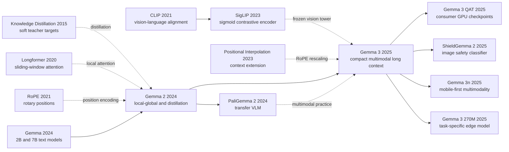

# Gemma 3 - 把多模态长上下文压进单张加速卡的开放权重模型族

> **2025 年 3 月，Google DeepMind 以 [Gemma 3 Technical Report](https://arxiv.org/abs/2503.19786) 的形式交出一份很少见的开放权重答卷：它没有再追求“最大的开放模型”，而是把问题改成“能不能把看图、128K 长上下文、多语言和量化部署同时压进普通团队碰得到的硬件预算里”。**
> 这篇报告最值得读的地方，不是某个前所未见的新公式，而是它如何用一串看起来克制的工程选择把四本账同时算清楚：上层三档模型共享一个冻结的 SigLIP 视觉塔，把每张图先压成可控的 256 个 soft tokens；语言主干用 5:1 的 local/global attention，让长上下文的 KV cache 不至于先把显存吃光；所有尺寸都接受 teacher 分布蒸馏，提高每个训练 token 的信息密度；最后再用 QAT 把权重显存压到消费级显卡能承受的区间。于是 Gemma 3 的历史意义，不是它在某个榜单上赢了谁，而是它把“开放模型”从可下载，往“可部署、可审计、可组合”又推进了一步。
> 但这份克制也带着边界：官方说它能跑在单个 GPU 或 TPU 上，Table 3 却提醒你 27B int4 权重的 14.1 GB 还没算 32K KV cache；官方说它支持 128K，Table 15 又提醒你 128K 的有效检索已经明显弱于 32K；官方仓库开源的是代码，checkpoint 本身仍受 Gemma Terms 约束。也正因为这些边界没有被刻意藏起来，Gemma 3 才像一篇真正值得做 deep note 的论文级工程报告，而不只是一次产品发布会的技术包装。

## 一句话总结

Gemma Team 在 2025 年发布的 Gemma 3，不是再造一个更大的开放模型，而是把一个 decoder-only Transformer 家族按部署账本重写：上层三档模型用冻结 SigLIP 处理图像、把 crop 压成 256 个 soft tokens，语言主干用 5:1 的 local/global attention 和 1,024-token 局部窗口控制 KV cache，再让所有尺寸通过每 token 采样 256 个 teacher logits 的蒸馏目标学习，从而在保持多模态与长上下文接口的同时，把单次部署成本压到量化后可落在单张加速卡的区间。它最核心的系统取舍可以概括为一条不漂亮但很实用的式子：总部署负担不是只看参数量，而更像 $\text{cost} \approx \text{weights} + \text{KV cache} + \text{vision tokens} + \text{runtime overhead}$；Gemma 3 的几乎每个关键设计都在压这四项中的至少一项。

这就是为什么它比许多“更大、更强”的开放模型更值得写进思想史。Gemma 3 27B-IT 在发布时用 1338 的 Arena Elo 把自己放进开放权重第一梯队，更重要的是它把“本地可运行的多模态开放模型”从概念变成了可操作的家族接口；同一份报告里，你既能看到 27B int4 权重只要 14.1 GB、又能看到 32K KV cache 会把总占用抬到 32.8 GB，既能看到 4B-IT 在 MATH 上用 75.6 超过 Gemma 2 27B-IT 的 55.6，也能看到 128K 下的 RULER 明显弱于 32K。换句话说，Gemma 3 对开放生态的真正影响，不是像 [LLaMA](/era5_genai_explosion/2023_llama/) 那样首先证明“公开数据也能追平闭源大模型”，而是接着 [Gemma 2](https://arxiv.org/abs/2408.00118) 证明：只要愿意正视显存、KV cache、视觉预算与条款治理这几道现实约束，开放权重模型也可以在单卡、多模态和长上下文之间达成一套足够诚实的工程平衡。

---

## 历史背景

### 2024 年的开放模型，卡在“拿得到”和“跑得动”之间

2024 年初，开放权重模型已经证明“权重可下载”能够催生独立研究、微调与本地应用，但下载按钮并没有自动解决部署问题。一个模型是否真能离开云端 API，取决于至少三本账：静态权重占多少显存，长对话的 KV cache 如何随序列增长，以及图像编码器会不会再吞掉一块独立预算。当时的旗舰路线仍频繁把能力和规模绑定在一起。Llama 3.1 以 405B dense 模型拉高开放权重上限，Qwen2.5 用 72B dense 模型覆盖通用任务，DeepSeek-V3 则用 671B 总参数、37B 激活参数的 MoE 改写每 token 计算量；它们证明开放模型可以很强，却没有让“单张消费级加速卡上的强模型”成为默认答案。

上下文与多模态又各自加了一层成本。全局自注意力的计算随序列长度呈平方增长，推理时每层还要为历史 token 保存 key 和 value；把 8K 扩成 128K，不只是修改一个配置数字。图像模型也不能只把 JPEG 塞给语言模型：通常还需视觉编码器、投影层与大量视觉 token。到 2024 年底，Gemini 1.5 已展示百万 token 和原生多模态，闭源 API 可以把这些系统成本藏在服务端；开放权重模型若要提供同类接口，必须把内存、量化、运行时与许可证一起交给使用者面对。

Gemma 3 的历史位置就在这个缝隙里。它没有宣称用 27B 参数击败所有前沿系统，而是把问题改写成：能否在 1B、4B、12B、27B 四档中，同时提供预训练与指令调优权重，让 4B 以上模型读图、让主力型号支持 128K 上下文，并给出足以落到单张加速卡的量化版本？这类工程目标不如“参数翻十倍”醒目，却直接决定开放权重究竟是论文附件，还是普通实验室和开发者真能部署的基础设施。

### 从 Gemma 到 Gemma 2：一年内形成的直接路线

第一代 [Gemma 报告](https://arxiv.org/abs/2403.08295) 于 2024 年 3 月提交，发布 2B 与 7B 两个文本模型，训练上下文为 8,192 token。它继承 Gemini 的研究与训练基础，提供预训练和指令调优 checkpoint，也公开推理、微调代码与责任工具；但训练数据仍以英语为主，模型不处理图像，也没有把多语言能力作为首要目标。Gemma 的关键贡献不是新造一个 Transformer，而是让 Google 第一次把 Gemini 路线中的一部分能力以可下载权重交给外部开发者，并明确承认权重发布具有不可逆性。

四个月后，[Gemma 2 报告](https://arxiv.org/abs/2408.00118) 把家族扩为 2B、9B、27B。它开始围绕部署效率改骨架：用 GQA 减少 key/value 头，以 1:1 比例交替全局层和 4,096-token 滑窗局部层，并在注意力与输出 logits 上做 soft-capping。更重要的是，2B 与 9B 不再只从 one-hot next-token 标签学习，而是长期拟合大教师的概率分布；Gemma 2 的 500B-token 消融中，2B 模型三项平均分由从头训练的 60.3 升到蒸馏的 67.7。27B 仍从头训练，这使蒸馏当时更像“小模型增强术”，还不是整个家族的统一训练原则。

Gemma 3 在 2025 年 3 月接过这条路线，但不是简单加一代编号。它把 1:1 改成 5:1 local/global，把局部窗口从 4,096 压到 1,024；把 8K 扩到 4B/12B/27B 的 128K；把第一代沿用的视觉缺口补成共享的 SigLIP 编码器；把多语言数据、Gemini 2.0 tokenizer 和图文混合训练放进主线；还把“只有小模型蒸馏”改成所有规模都蒸馏。换句话说，Gemma 3 把 Gemma 2 的几项局部优化收束为一套以有限硬件为约束的系统设计。

### 五条前序技术线在 Gemma 3 汇合

第一条线是 [Longformer（2020）](https://arxiv.org/abs/2004.05150) 的局部滑窗注意力：并非每层都需要让每个 token 看见全部历史。Gemma 2 已采用局部/全局交替，Gemma 3 进一步把全局层稀释到每六层一层，以 KV cache 换取长上下文。第二条线是 [GQA（2023）](https://arxiv.org/abs/2305.13245)：多个 query 头共享更少的 key/value 头，在维持表达能力的同时减少缓存和带宽。两者一起回答“长序列如何跑”，而不是“上下文数字如何写进模型卡”。

第三条线是 Hinton、Vinyals、Dean 的[知识蒸馏（2015）](https://arxiv.org/abs/1503.02531)。硬标签只告诉学生正确 token 是谁，教师分布还告诉它其他候选有多合理。Gemma 3 每个 token 按教师概率抽取 256 个 logits，截断后重归一化，再以交叉熵训练学生；这是用更丰富监督弥补参数规模，而非无限延长原始语料训练。第四条线是 [SigLIP（2023）](https://arxiv.org/abs/2303.15343) 与 [PaliGemma 2（2024）](https://arxiv.org/abs/2412.03555) 的视觉语言经验：成熟视觉编码器可以被冻结并复用，语言模型只需接收固定数量的软 token。Gemma 3 把 896×896 图像压成 256 个视觉 token，使图像成本不随 ViT patch 数量原样灌入语言主干。

第五条线是 [位置插值（2023）](https://arxiv.org/abs/2306.15595) 与 RoPE 延展。Google 没有从第一步就用 128K 序列训练，而是先用 32K，再在预训练末段把 4B、12B、27B 扩到 128K；全局层的 RoPE base frequency 从 10K 提到 1M，局部层仍保持 10K。这个做法把昂贵长序列训练压缩到后段，也留下一个后来必须正视的事实：支持 128K 不等于 128K 检索质量与 32K 相同。

### 团队不是从零做 VLM，而是在 Gemini 与 Gemma 之间搬运成熟部件

Gemma 3 的作者署名是 Gemma Team，核心贡献名单横跨语言模型、视觉、后训练、系统、安全和产品团队。报告明确说这一家族与 Gemini 共同设计，并直接采用 Gemini 2.0 tokenizer；训练侧继续使用 JAX、Pathways、GSPMD、MegaScale XLA 和 ZeRO-3 式优化器状态切分。这里的组织优势不是“知道一个秘密公式”，而是能从内部前沿模型中选择已经验证的部件，再按开放部署边界重新组合。

视觉侧尤其能说明这种搬运。Gemma 3 没有联合从零训练一个新视觉塔，而是共享一套约 400M 的 SigLIP encoder，Table 1 的具体计数为 417M；4B、12B、27B 全部使用它，并在语言模型训练时冻结。图像 embedding 预先计算，因此报告称它不会增加语言模型训练的在线成本。面对非方图和小字，团队也没有把 encoder 分辨率继续暴力上调，而是在推理时加入 Pan & Scan：必要时把原图切成若干不重叠窗口，各自缩放到 896×896，再让语言模型整合。

这条路线也解释了“开放”为什么必须精确措辞。官方 [JAX 仓库](https://github.com/google-deepmind/gemma) 是 Apache-2.0 的开源代码，但 checkpoint 受 [Gemma Terms](https://ai.google.dev/gemma/terms) 约束，使用、修改与再分发需要保留通知并传递用途限制。因此 Gemma 3 是**开放权重模型**，不是按 OSI 软件定义完整开源的训练系统；原始训练代码、教师身份、完整数据清单和复现实验预算都没有公开。把这条边界讲清楚，反而比把“open”翻成一个宽泛标签更能说明它的历史意义。

## 研究背景与动机

### 动机 1：让一个家族覆盖真实硬件，而不是只交付一个榜单点

Gemma 3 的四个首发尺寸不是等比例缩放的同一商品。1B 是 32K 上下文的纯文本模型；4B、12B、27B 才带共享视觉编码器，并支持 128K。Table 1 还揭示了小模型的成本结构：1B 中有 302M embedding 参数、698M 非 embedding 参数；4B 则有 417M vision、675M embedding、3,209M 非 embedding 参数。262K tokenizer 的大词表（报告 Table 1 另写 256K，这一内部不一致必须保留）使低资源语言和罕见 token 更易表达，却也让 embedding 在小模型中占比很高。

这不是无关紧要的型号营销。开发者做分类、抽取或路由时，1B 甚至后来新增的 270M 可能比 27B 更合适；文档 VQA、图表理解与多轮图文问答才需要 4B 以上；复杂推理则可以换到 12B 或 27B。一个“模型家族”真正提供的是可迁移接口：同一聊天格式、相近 tokenizer 约定、PT/IT 两类权重、官方 QAT 和多种运行时。模型规模因此成为工程旋钮，而非能力身份。

### 动机 2：把 KV cache 当作架构问题，而不是部署后的麻烦

128K 上下文最容易被写成产品规格，Gemma 3 更值得记住的却是它如何付账。若每层都是 global attention，每个历史 token 的 key/value 都要跨全部层保留；参数量固定时，KV cache 会随上下文近似线性增长，并最终反客为主。报告的 2B 消融在 32K prefill 下显示，global-only 架构的缓存带来约 60% 内存 overhead，而 1:3 local/global、1,024 窗口把它降到 15% 以下。最终模型采用更激进的 5:1，局部层只保存近邻窗口，只有稀疏出现的全局层承担远程依赖。

这是一种反直觉取舍：长上下文模型并不需要每一层都“看得远”。局部层负责组合邻近 token，全局层周期性广播远程信息；只要全局层足以连通序列，增加局部层比例对 validation perplexity 的影响很小，报告甚至观察到 7:1 仍变化有限。Gemma 3 的创新不在发明局部注意力，而在把它推到一个以实际缓存曲线为依据的家族配方，并让量化表同时报告权重与 32K KV cache，而不是只报模型文件大小。

### 动机 3：用能力迁移和责任发布补上“小模型”的两块短板

紧凑模型的第一块短板是容量。Gemma 3 不把解决方案限定为再喂更多网页，而是让所有尺寸长期学习大教师的概率分布；后训练又从大型 IT teacher 蒸馏，并接入基于人类偏好、代码执行和数学真值的奖励。论文最反直觉的消融是：短训练时小教师更好，训练足够久后大教师反而胜出。较强教师早期可能带来更难拟合的分布，但长训练让学生逐渐吸收其中的暗知识。这为 4B-IT 能接近 Gemma 2 27B-IT 提供了机制解释，而不是把差距压缩归因于一个神秘数据集。

第二块短板是开放权重后的控制边界。权重一旦发布，Google 无法像托管 API 那样持续套一层过滤器，也无法收回被重新微调的副本。Gemma 3 因此把预训练过滤、评测集去污染、记忆与隐私审计、SFT/RLHF、安全红队、assurance evaluation、模型卡、用途条款和 ShieldGemma 2 放在同一发布叙事里。它没有证明所有风险都已解决：安全提示主要是英语，CBRN 采用内部闭集，训练语料也未完整公开。但它确立了一条值得继承的工程原则：所谓“单卡可运行”不仅是显存指标，还意味着能力、许可证、风险说明与下游防护都必须随权重一起交付。

---

## 方法详解

### 整体框架：不是把 27B 缩小，而是围绕内存预算重组一个家族

Gemma 3 的语言主干仍是 decoder-only Transformer：token 先进入大词表 embedding，经过带 GQA 的 Transformer blocks，再由自回归头预测下一个 token。它保留 Gemma 2 的 pre-norm 与 post-norm RMSNorm，但用 QK-norm 取代 attention logit soft-capping。这里的 QK-norm 可以概念化为先分别归一化 query 与 key，再做点积；报告没有公布所有实现常数，因此不应把某个第三方实现的 epsilon 或 scale 当成论文事实。

真正的新结构来自三条并行路径。文本路径以 5 个局部层加 1 个全局层为周期；视觉路径把每个 896×896 crop 经冻结 SigLIP 压成 256 个软 token，再与文本 token 交错；训练路径让所有尺寸拟合大教师的截断概率分布，并在 IT 阶段叠加多种奖励。最后，QAT 从完成训练的 checkpoint 出发，以全精度模型概率为目标适配低精度权重。

```text
text tokens ------------------------------+
                                           |
image -> Pan & Scan -> frozen SigLIP -> 256 soft tokens / crop
                                           |
                                           v
                                  interleaved token stream
                                           |
                             [L L L L L G] x N blocks
                             local=1,024; global=full
                                           |
                               autoregressive text output
                                           |
                  PT weights -> IT weights -> QAT variants
```

首发四档模型并不完全同构。1B 没有 vision encoder，只处理文本；其余三档共享 417M 视觉编码器。下表照录 Technical Report Table 1 的组件计数；“4B/12B/27B”是型号名，不是把三列机械相加后的精确参数声明。

| 型号 | Vision encoder | Embedding | 非 embedding | 上下文 | 输入模态 |
|---|---:|---:|---:|---:|---|
| Gemma 3 1B | 0 | 302M | 698M | 32K | 文本 |
| Gemma 3 4B | 417M | 675M | 3,209M | 128K | 文本、图像 |
| Gemma 3 12B | 417M | 1,012M | 10,759M | 128K | 文本、图像 |
| Gemma 3 27B | 417M | 1,416M | 25,600M | 128K | 文本、图像 |

有一个容易被二手资料抹平的原文冲突：Table 1 写 vocabulary 有 256K entries，§2.2 却写 Gemini 2.0 SentencePiece tokenizer 有 262K entries。两处都来自同一版报告；在没有开放 checkpoint 配置作无门槛仲裁时，严谨写法是记录冲突，而不是挑一个看起来顺眼的数字。确定无争议的是 tokenizer 会拆分数字、保留空白，并为未知字符提供 byte-level encoding，以改善非英语文本的均衡性。

### 关键设计 1：五个局部层才放一个全局层，让 128K 先过显存关

**功能。** 这项设计解决的不是训练时能否构造 128K 样本，而是推理时历史 key/value 会不会吞掉显存。设全局层数为 $L_g$、局部层数为 $L_l$、序列长为 $n$、局部窗口为 $w$、KV heads 数与 head dimension 的乘积为 $h_{kv}d_h$，缓存元素量可以近似写成：

$$
M_{KV}\propto 2h_{kv}d_h\left(L_g n+L_l\min(n,w)\right).
$$

global-only 模型的每一层都支付 $n$；Gemma 3 的局部层只支付最多 $w=1024$，只有每六层中的全局层保留完整历史。GQA 又让多个 query heads 共享较少的 key/value heads，从 $h_{kv}$ 这一维继续减缓存。两者相乘，才是它能把上下文从 Gemma 2 的 8K 推到 128K 的内存基础。

```python
def gemma3_attention_schedule(num_layers: int):
    for layer_index in range(num_layers):
        # The first five layers in each six-layer cycle are local.
        is_global = (layer_index + 1) % 6 == 0
        yield {
            "kind": "global" if is_global else "local",
            "window": None if is_global else 1024,
            "rope_theta": 1_000_000 if is_global else 10_000,
        }
```

**长上下文训练。** 4B、12B、27B 并非从第一步就吃 128K。报告先以 32K sequence 预训练，再在末段用类似 positional interpolation 的办法扩到 128K，经验上采用 8 倍 scaling factor；全局层 RoPE base frequency 从 Gemma 2 的 10K 提到 1M，局部层仍是 10K。这样把最昂贵的长序列阶段压到训练尾部，但不会神奇地消除长度外推损失。Table 15 的 RULER 27B-IT 从 32K 的 91.1 降到 128K 的 66.0，正说明“能接收”与“能稳定利用”必须分开。

| 注意力方案 | 全局层比例 | 局部窗口 | 32K cache 特征 | 主要代价 |
|---|---:|---:|---|---|
| Global only | 100% | 不适用 | 2B 消融中约 60% memory overhead | cache 最大 |
| Gemma 2 | 1/2 | 4,096 | 比 global-only 小 | 只支持 8K 训练上下文 |
| Gemma 3 最终配方 | 1/6 | 1,024 | 显著降低长序列 cache | 全局传播更稀疏 |
| 1:3 消融 | 1/4 | 1,024 | overhead 低于 15% | 不是最终型号配方 |

**设计动机。** Figure 3/4 给出的关键结论不是“5:1 永远最优”，而是 validation perplexity 对 local/global 比例与窗口缩小出乎意料地不敏感：比例甚至到 7:1 仍只受很小影响。于是团队把富余质量预算换成可测的缓存收益。这个选择也揭示了 Gemma 3 的工程美学：global attention 是稀缺资源，应周期性使用；local attention 才是默认计算。它没有发明稀疏注意力，却把稀疏程度和部署内存绑成可验证的产品配方。

### 关键设计 2：冻结 SigLIP、固定 256 个视觉 token，再用 Pan & Scan 补分辨率

**功能。** 4B、12B、27B 共用一套约 400M 的 SigLIP Vision Transformer，Table 1 精确列为 417M。编码器接收 896×896 方图，并在 Gemma 3 训练期间冻结；Google 预计算图像 embedding 后直接训练语言模型，因此视觉塔不增加语言模型训练步骤的在线反向传播成本。对单个 crop，可以把流程概念化为：

$$
V(I)=\operatorname{Pool}_{4\times4}\left(\operatorname{SigLIP}(\operatorname{Resize}_{896}(I))\right)\in\mathbb{R}^{256\times d_v}.
$$

896-resolution encoder 输出经过 4×4 average pooling，最终无论原始 patch 数多少，每个 crop 都只给语言模型 256 个 image tokens。这里的核心取舍是把视觉空间分辨率与语言序列成本解耦：encoder 内部可以看高分辨率，LLM 不必为每个 patch 都保留一枚 token。

```python
def encode_image_for_gemma3(image, pan_and_scan=True):
    crops = adaptive_non_overlapping_crops(image) if pan_and_scan else [image]
    soft_tokens = []
    for crop in crops:
        square = resize(crop, (896, 896))
        vision_features = frozen_siglip(square)
        soft_tokens.append(average_pool_4x4(vision_features))  # 256 tokens
    return concatenate(soft_tokens)
```

固定方图会伤害长票据、文档和非方照片：直接 resize 可能让小字消失或几何形状变形。Pan & Scan 是推理时窗口算法，仅在需要时把原图切成若干不重叠区域，每块再缩放到 896×896；它可关闭以换取更快推理，也可限制最大 crop 数以约束 token 成本。它不是第二次训练，也不改变视觉 encoder 权重。

| Encoder 输入分辨率 | DocVQA | InfoVQA | TextVQA |
|---:|---:|---:|---:|
| 256 | 31.9 | 23.1 | 44.1 |
| 448 | 45.4 | 31.6 | 53.5 |
| 896 | 59.8 | 33.7 | 58.0 |

| PT checkpoint | Pan & Scan | DocVQA | InfoVQA | TextVQA |
|---|---|---:|---:|---:|
| 4B | 关闭 | 72.8 | 44.1 | 58.9 |
| 4B | 开启 | 81.0 | 57.0 | 60.8 |
| 27B | 关闭 | 85.6 | 59.4 | 68.6 |
| 27B | 开启 | 90.4 | 76.4 | 70.2 |

**设计动机。** Table 7 表明提升 encoder 分辨率对 OCR 型任务不是装饰：DocVQA 从 256 输入的 31.9 升到 896 的 59.8。Table 8 又显示，保持原图局部尺度比单纯固定高分辨率更重要，4B 的 InfoVQA 因 P&S 从 44.1 升到 57.0，27B 从 59.4 升到 76.4。反直觉之处在于，更强视觉不一定要求向 LLM 输入更多单图 token；可以先让专用 encoder 看清，再用 pooling 控制语言侧成本，需要时才增加 crop 数。

### 关键设计 3：所有尺寸都蒸馏，每个 token 只传教师分布的一小片

**功能。** Gemma 2 只对 2B、9B 做 pre-training distillation，27B 从头训练；Gemma 3 则让 1B、4B、12B、27B 全部蒸馏。对位置 $t$，教师给出完整词表分布 $p_T(v\mid x_{<t})$。系统按教师概率采样一个含 256 个 logits 的支持集 $S_t$，把集合外概率设为零，再在集合内归一化：

$$
q_T(v\mid x_{<t})=
\begin{cases}
\dfrac{p_T(v\mid x_{<t})}{\sum_{u\in S_t}p_T(u\mid x_{<t})}, & v\in S_t,\\
0, & v\notin S_t,
\end{cases}
\qquad
\mathcal{L}_{KD}=-\sum_v q_T(v)\log p_S(v).
$$

这比保存 262K 左右词表的完整 teacher logits 便宜，也比 one-hot 标签信息丰富：学生不仅知道真实 token，还看到教师认为哪些替代词接近。报告没有公开教师型号、温度、采样实现细节或各阶段 loss 权重，下面代码只表达论文公开的计算图，不是假装可复现的官方配方。

```python
def sampled_teacher_cross_entropy(student_logits, teacher_logits):
    teacher_probs = softmax(teacher_logits, dim=-1)
    support = sample_support(teacher_probs, count=256)
    target = gather(teacher_probs, support)
    target = target / target.sum(dim=-1, keepdim=True)
    student_log_probs = log_softmax(student_logits, dim=-1)
    return -(target * gather(student_log_probs, support)).sum(dim=-1).mean()
```

| 监督方式 | 每 token 目标 | 传递的信息 | 主要边界 |
|---|---|---|---|
| 标准 next-token | 一个 one-hot 标签 | 真实 token 身份 | 不含替代 token 相似度 |
| 完整分布蒸馏 | 全词表概率 | 最丰富的教师排序 | 存储与传输昂贵 |
| Gemma 3 sampled-logit KD | 按概率抽取 256 logits | 高概率候选与暗知识 | 教师与采样细节未披露 |

**长训练为什么改变教师选择。** Figure 8 专门挑战“训练小模型应选尺寸接近的教师”这一常见经验。短训练 horizon 下，小教师带来更低 perplexity；token 数增加后趋势反转，大教师更好。论文的解释是，较差教师提供的 regularization 在短实验里可能掩盖强教师的信息优势，长期训练才让学生吸收更复杂的分布。这里不能从图中编造一个不存在的交叉 token 数，但可以得出清楚的实验教训：用短 proxy run 选 teacher，会系统性偏向更小教师。

### 关键设计 4：多语言预训练与多奖励后训练，共用一个能力迁移逻辑

**预训练数据。** 1B、4B、12B、27B 分别训练 2T、4T、12T、14T tokens；增长包含文本与图像混合带来的预算。报告只披露 web documents、code、mathematics、images 四个大类，模型卡给出 2024 年 8 月知识截止，并称数据含 140 多种语言。团队增加 monolingual 与 parallel data，并用受 UniMax 启发的策略处理语言不平衡。它没有公布网页域名清单、各语言比例、版权状态逐项表或图文配对来源，因此“用了某个具体秘密语料”都属于无证据推断。

**后训练。** PT checkpoint 先从大型 instruction-tuned teacher 蒸馏，再进行基于 BOND、WARM、WARP 改进版本的 RL。奖励来源至少包括：由人类反馈数据训练的 weight-averaged reward models、代码执行反馈、数学题 ground-truth reward，以及减少 harmfulness 的安全目标。下式只是多目标结构的示意，不代表论文披露了具体线性组合或系数：

$$
J(\theta)=\mathbb{E}_{y\sim\pi_\theta(\cdot\mid x)}
\left[R_{human}(x,y)+R_{exec}(x,y)+R_{math}(x,y)-R_{harm}(x,y)\right].
$$

```python
def post_training_step(prompt, policy, reward_models):
    response = policy.generate(prompt)
    signals = {
        "human_preference": reward_models.weight_averaged(response),
        "code_execution": execute_if_code(response),
        "math_ground_truth": check_if_math(response),
        "safety": safety_policy_score(response),
    }
    return update_with_bond_warm_warp_family(policy, prompt, response, signals)
```

| 阶段/信号 | 公开来源 | 主要目标 | 未披露项 |
|---|---|---|---|
| IT teacher distillation | 大型 IT teacher | 迁移聊天与指令能力 | teacher 身份、温度、配比 |
| Human feedback / WARM | weight-averaged reward models | helpfulness 与偏好 | 数据规模、标注分布 |
| Code execution feedback | 程序运行结果 | coding correctness | sandbox 与任务混合 |
| Math ground truth | 可验证答案 | 数学与 reasoning | curriculum 与采样比例 |

**设计动机。** 多语言、数学、代码和安全不是四次互不相干的 fine-tune，而是同一能力迁移思想：先用更大模型的软分布提供密集监督，再用可验证或偏好奖励拉正行为。数据过滤还移除个人信息、unsafe/toxic output、错误自我身份和重复样本，并加入鼓励 attribution、hedging 与 refusal 的数据。结果是 Gemma 3 4B-IT 在多项指标上接近 Gemma 2 27B-IT，但代价是完整 recipe 无法从报告独立复现。

### 关键设计 5：QAT 把“权重能装下”做成正式发布物，而不是社区补丁

**功能。** 训练后量化通常直接把完成训练的 BF16 权重映射到更少 bit，模型没有机会适应 rounding error。Gemma 3 的 QAT checkpoint 则额外微调通常约 5,000 steps，在前向中模拟低精度权重，并以非量化 checkpoint 的输出概率为目标；数据分布会匹配 PT 或 IT checkpoint。常见对称量化可以示意为：

$$
\hat{w}=s\cdot\operatorname{clip}\left(\operatorname{round}(w/s),q_{min},q_{max}\right),
$$

但报告没有说所有格式都使用这一完全相同的 scale 规则。它正式瞄准三类表示：per-channel int4、block size 32 的 per-block int4，以及 switched FP8。官方 QAT 博文还报告，在 llama.cpp perplexity evaluation 中，QAT 相对直接 Q4_0 量化把 perplexity drop 减少 54%；这是特定评测，不应改写成“所有 benchmark 保留 99% 性能”。

```python
def qat_step(batch, full_precision_teacher, quantized_student):
    with no_grad():
        target_probs = softmax(full_precision_teacher(batch), dim=-1)
    simulated_low_precision_logits = quantized_student.fake_quant_forward(batch)
    loss = cross_entropy_with_soft_targets(
        simulated_low_precision_logits, target_probs
    )
    loss.backward()
```

| 模型内存（32K 条件） | BF16 | Int4 channel | Int4 block=32 | SFP8 |
|---|---:|---:|---:|---:|
| 1B 权重 | 2.0 GB | 0.5 GB | 0.7 GB | 1.0 GB |
| 1B + KV | 2.9 GB | 1.4 GB | 1.6 GB | 1.9 GB |
| 4B 权重 | 8.0 GB | 2.6 GB | 2.9 GB | 4.4 GB |
| 4B + KV | 12.7 GB | 7.3 GB | 7.6 GB | 9.1 GB |
| 12B 权重 | 24.0 GB | 6.6 GB | 7.1 GB | 12.4 GB |
| 12B + KV | 38.9 GB | 21.5 GB | 22.0 GB | 27.3 GB |
| 27B 权重 | 54.0 GB | 14.1 GB | 15.3 GB | 27.4 GB |
| 27B + KV | 72.7 GB | 32.8 GB | 34.0 GB | 46.1 GB |

**设计动机与边界。** “27B 能在 RTX 3090 上跑”来自 int4 权重只占 14.1 GB 的官方部署说明，而不是 Table 3 的 32K 完整状态；同一表中 27B int4 channel 加 32K KV 已到 32.8 GB，超过 24 GB。单卡部署因此需要缩短 context、选择合适 runtime、管理视觉 crops，或进一步卸载。Gemma 3 的历史意义不是取消硬件约束，而是把约束量化到 checkpoint、格式和 cache 条件，使社区不必先自行摸索一次压缩路径。

### 训练目标与执行账本：公开到哪一步，哪里仍不可复现

四个尺寸的 token 预算与芯片切分由报告明确给出。视觉 embedding 会预计算，优化器状态按 ZeRO-3 思路切分，跨 pod replica reduction 通过 Pathways 完成；JAX 的 single-controller、GSPMD partitioner 与 MegaScale XLA compiler 负责大规模执行。下表保留原始训练基础设施数字。

| 型号 | Token budget | TPU / chips | Data shards | Sequence shards | Replicas |
|---|---:|---|---:|---:|---:|
| 1B | 2T | TPUv5e / 512 | 16 | 16 | 2 |
| 4B | 4T | TPUv5e / 2,048 | 16 | 16 | 8 |
| 12B | 12T | TPUv4 / 6,144 | 16 | 16 | 24 |
| 27B | 14T | TPUv5p / 6,144 | 24 | 8 | 32 |

| 复现要素 | 报告状态 | 可以可靠复述的内容 |
|---|---|---|
| 架构主线 | 已披露 | decoder-only、GQA、5:1、1,024 window、QK-norm |
| 视觉接口 | 已披露 | frozen SigLIP、896×896、256 tokens、P&S |
| Token budget | 已披露 | 2T / 4T / 12T / 14T |
| 数据组成 | 部分披露 | 四个大类、140+ languages、mono+parallel；无来源比例 |
| 蒸馏 | 部分披露 | 256 sampled logits；无 teacher 身份与温度 |
| 优化超参 | 未充分披露 | optimizer、LR、batch、schedule 无完整表 |
| 后训练 | 部分披露 | IT KD、BOND/WARM/WARP、三类 reward；无完整 recipe |
| QAT | 部分披露 | 约 5,000 steps、teacher probabilities、三类表示 |

最终预训练目标不是“纯 next-token loss”，而是蒸馏交叉熵；最终 IT 目标也不是一个公开可复写的标量公式，而是教师迁移、偏好与可验证奖励的组合。正因为 Gemma 3 是开放权重而非开放训练工程，读者可以复现推理、微调和量化格式，却不能凭报告重建原始 14T-token 27B 训练。把这条复现边界留在方法章节，比用推测参数补齐一张漂亮的超参表更重要。

---

## 失败案例

### 对手 1：每层都做 global attention，长上下文先输给 KV cache

最直接的失败 baseline 不是另一家模型，而是 dense Transformer 的默认实现：所有层都让每个 token 看完整历史。它在短上下文下简单、表达路径短，却让 KV cache 按“层数 × 序列长度”增长。Gemma 3 的 Figure 5 用 2B text-only proxy 和 32K prefill 比较多种配置；global-only 的 cache 带来约 60% memory overhead，而 1:3 local/global、sliding window 1,024 的配置降到 15% 以下。这里的 1:3 是消融点，最终模型是更激进的 5:1，不能把两个数字混写成“5:1 实测低于 15%”。

为什么 global-only 输？不是它的 perplexity 必然更差，而是它花了大量内存买一个几乎测不到的质量增益。Figure 3 把 local:global 从 1:1 推到 3:1、5:1、7:1，validation perplexity 变化仍很小；Figure 4 也显示局部窗口可明显缩短而不显著影响 perplexity。换言之，baseline 的隐含假设是“每层全局可见性都很值钱”，消融却表明多数层只看邻域已经足够，全局信息可以隔几层再汇合。

这个失败还解释了为什么只报模型权重大小会误导部署判断。Technical Report Table 3 中，27B 的 per-channel int4 权重为 14.1 GB，看似能轻松放进 24 GB 显卡；加上 32K KV cache 后却是 32.8 GB。global-only 若继续抬高 cache，量化省下的权重显存很快又会被上下文吃掉。Gemma 3 的 local/global 配方与 QAT 不是两个独立卖点，而是共同对付同一瓶颈。

### 对手 2：把所有图像硬缩成一个方块，小字和长图会消失

固定 896×896 输入是一个有效而不完整的 baseline。它让 4B、12B、27B 共享同一 frozen SigLIP，并把每张图稳定压成 256 tokens；但票据、网页截图、图表和宽幅照片一旦直接拉伸或缩小，文字可能变得不可读，小物体也可能被平均掉。报告没有用形容词掩盖这个失败，而是在 §2.1 明说 fixed resolution 会给 non-square 与 high-resolution images 带来 artifacts。

Pan & Scan 的消融把代价量化出来。在 pre-trained checkpoint、4-shot validation 设置下，4B 的 DocVQA 从 72.8 升到 81.0，InfoVQA 从 44.1 升到 57.0，TextVQA 从 58.9 升到 60.8；27B 的三项则从 85.6/59.4/68.6 升到 90.4/76.4/70.2。最大增益不是自然图像常识，而是 27B InfoVQA 的 +17.0，这正是需要保留局部文字尺度的任务。

| 模型 | 单个 896×896 resize | Pan & Scan | DocVQA 增益 | InfoVQA 增益 | TextVQA 增益 |
|---|---|---|---:|---:|---:|
| Gemma 3 4B PT | 72.8 / 44.1 / 58.9 | 81.0 / 57.0 / 60.8 | +8.2 | +12.9 | +1.9 |
| Gemma 3 27B PT | 85.6 / 59.4 / 68.6 | 90.4 / 76.4 / 70.2 | +4.8 | +17.0 | +1.6 |
| 机制差异 | 整图缩放 | 必要时切不重叠 crops | 保留文档布局 | 保留小字 | 额外收益较小 |
| 部署代价 | 固定 256 tokens | 每个 crop 各 256 tokens | 更慢 | context 更长 | 可限制 crop 数 |

Pan & Scan 也不是免费胜利。每增加一个 crop，就增加 256 个视觉 tokens 和一次 encoder 前向；因此论文允许关闭它并限制最大窗口数。真正的教训不是“多切图总是更好”，而是固定成本与信息保真必须由输入类型决定。自然照片可能单视图足够，密集文档才值得支付额外 token。

### 对手 3：只看 one-hot 标签，或用短跑实验挑一个较弱教师

Gemma 3 没有公开同规模“纯 next-token 对照组”的完整表，因此不能捏造一个 Gemma 3 from-scratch 分数。能直接引用的前序证据来自 Gemma 2：一个 2B student 在 500B tokens 上从头训练，三项 benchmark 平均为 60.3；从 7B teacher 蒸馏后为 67.7。这个实验发生在 Gemma 2，不是 Gemma 3，但它解释了为什么新一代把 distillation 从 2B/9B 扩展到全部四档。one-hot baseline 输在监督带宽：它只给出一个正确 token，教师分布还给出相近替代项的相对概率。

另一个失败更隐蔽：用短训练 proxy 选择 teacher。既有经验常说，小 student 从尺寸更接近的小 teacher 蒸馏更好。Gemma 3 Figure 8 确实在短 horizon 复现了这个结论，但随着训练 token 增加，曲线反转，大 teacher 最终更优。报告没有给出可可靠读取的精确交叉 token 数，因此这里不能补一个数字；它能支持的是实验设计结论：短跑把较弱 teacher 的 regularization 优势放大了，却看不到强 teacher 在长训练中的信息优势。

这也给 4B 接近上一代 27B 的说法加上必要限定。Table 6 中 Gemma 3 4B-IT 的 MATH 为 75.6，高于 Gemma 2 27B-IT 的 55.6；FACTS Grounding 为 70.1，对方是 62.4。但 MMLU-Pro 是 43.6 对 56.9，LiveCodeBench 是 12.6 对 20.4，Global MMLU-Lite 是 54.5 对 68.6。“competitive across benchmarks”指能力轮廓总体可竞争，不等于小模型逐项碾压大模型。蒸馏转移能力，也会保留容量上限与任务差异。

### 作者承认的反例：128K 是接口上限，不是恒定有效长度

最重要的反例在 Table 15。所有主力尺寸都能接收 128K，但 RULER 与 MRCR 在 128K 普遍低于 32K。27B-IT 的 RULER 从 91.1 降到 66.0；12B-IT 从 80.3 降到 57.1；4B-IT 从 61.4 降到 46.8。MRCR 降幅较缓，27B-IT 从 63.2 到 59.3，4B-IT 从 49.8 到 44.6。论文 §5.3 还明说模型扩展到 128K 后能泛化，但继续外推会快速退化。因此“128K context”首先是输入协议和训练范围，不能当作每个位置都等质量的记忆承诺。

| 反例/边界 | 论文证据 | 不能得出的结论 | 后续研究问题 |
|---|---|---|---|
| 128K 利用率下降 | RULER/MRCR 的 128K 分数低于 32K | 128K 等质量于 32K | 更强长程训练与检索评测 |
| 1B 能力缺口 | 仅文本、32K，无 vision encoder | 全家族都多模态、都 128K | 更小多模态与端侧架构 |
| Probe contamination | §5.1 明说去污染后仍有风险 | benchmark 等于真实泛化 | 动态、私有、可审计评测 |
| 安全覆盖不全 | 模型卡安全提示仅英语 | 140+ 语言都完成同等安全验证 | 多语言与多模态红队 |
| 数据与 teacher 未披露 | 只给大类、token budget 与算法概述 | 外部团队可从报告重训同一模型 | 训练透明度与数据治理 |

此外，视觉输入不等于任意视觉推理：1B 完全没有视觉，4B/12B/27B 的输出仍是文本；模型卡也警告事实准确性、常识、讽刺与复杂开放任务。训练数据知识截止于 2024 年 8 月，长上下文不会把模型变成实时知识库。Responsible release 的评测和条款降低部分风险，却不能替代具体应用自己的安全测试。

## 实验关键数据

### 主实验：同代能力提升很大，但不同任务并不单调缩放

论文最可控的比较是 Gemma 2、Gemma 3 与 Gemini 系列在同一内部评测设置下的 Table 6，而不是从各家公司博客拼一张排行榜。下表选取能覆盖知识、代码、数学、多语言与视觉的六项。Gemma 3 27B-IT 在 MMLU-Pro、LiveCodeBench、MATH 和 Global MMLU-Lite 上都高于 Gemma 2 27B-IT；4B 则呈现明显偏科，数学和 grounding 跳升大，通识与代码仍落后于上一代 27B。

| Benchmark（Table 6） | Gemma 2 27B-IT | Gemma 3 4B-IT | Gemma 3 12B-IT | Gemma 3 27B-IT |
|---|---:|---:|---:|---:|
| MMLU-Pro | 56.9 | 43.6 | 60.6 | **67.5** |
| LiveCodeBench | 20.4 | 12.6 | 24.6 | **29.7** |
| MATH | 55.6 | 75.6 | 83.8 | **89.0** |
| FACTS Grounding | 62.4 | 70.1 | **75.8** | 74.9 |
| Global MMLU-Lite | 68.6 | 54.5 | 69.5 | **75.1** |
| MMMU (val) | 不适用 | 48.8 | 59.6 | **64.9** |

视觉 scaling 也不是每项都随参数单调上升。Table 16 使用 P&S（除非另有说明）：12B DocVQA 87.1 略高于 27B 的 86.6，TextVQA 67.7 高于 65.1，VQAv2 71.6 高于 71.0；但 27B 在 InfoVQA、ChartQA、MathVista 和 MMMU 上领先。这提醒读者，encoder 三档共享，语言主干增大只是影响视觉任务的一部分，数据、解码和任务格式也会改变排序。

| IT 视觉 benchmark（Table 16） | Gemma 3 4B | Gemma 3 12B | Gemma 3 27B | 最大值 |
|---|---:|---:|---:|---:|
| DocVQA | 75.8 | **87.1** | 86.6 | 87.1 |
| InfoVQA | 50.0 | 64.9 | **70.6** | 70.6 |
| TextVQA | 57.8 | **67.7** | 65.1 | 67.7 |
| VQAv2 (val) | 62.4 | **71.6** | 71.0 | 71.6 |
| MathVista (testmini) | 50.0 | 62.9 | **67.6** | 67.6 |

### 人类偏好与长上下文：两个必须带日期和长度的快照

Chatbot Arena Table 5 是发布时最抓眼球的数据：Gemma-3-27B-IT Elo 1338，在表中列为 rank 9，高于 Gemini-1.5-Pro-002 的 1302、Llama 3.1 405B 的 1269 和 Gemma 2 27B 的 1220。但表注明 Gemma 3 数字是 **2025 年 3 月 8 日收到的 preliminary result**，Arena 排名会随投票池变化，且该轮对比不计视觉能力。因此它适合作为发布时的人类偏好快照，不适合写成永久“全球第九”。

| 模型（Table 5 快照） | Elo | 95% CI | 表内 rank | 参数类型 |
|---|---:|---|---:|---|
| Gemma-3-27B-IT | **1338** | +8/-9 | 9 | 27B dense |
| DeepSeek-V3 | 1318 | +8/-6 | 13 | 671B / 37B active MoE |
| Gemini-1.5-Pro-002 | 1302 | +3/-3 | 18 | 未披露 |
| Llama-3.1-405B-Instruct | 1269 | +4/-3 | 28 | 405B dense |
| Gemma-2-27B-it | 1220 | +3/-2 | 59 | 27B dense |

长上下文则必须把 benchmark 与长度同时写出。Table 15 既报告 PT 也报告 IT，不允许只挑 128K 的最好值来证明“长记忆已经解决”。27B-PT 在 RULER 上甚至出现 32K 的 85.9 低于 12B-PT 的 90.6，而 27B-IT 则升到 91.1；到了 128K，所有 IT 型号都下降。这些非单调结果比一个 context-window 标签更有解释力。

| Benchmark | Context | PT 4B / 12B / 27B | IT 4B / 12B / 27B |
|---|---:|---|---|
| RULER | 32K | 67.1 / 90.6 / 85.9 | 61.4 / 80.3 / **91.1** |
| RULER | 128K | 51.7 / 80.7 / 72.9 | 46.8 / 57.1 / **66.0** |
| MRCR | 32K | 44.7 / 59.8 / 63.2 | 49.8 / 53.7 / **63.2** |
| MRCR | 128K | 40.6 / 56.9 / 60.0 | 44.6 / 49.8 / **59.3** |

### 部署数据与六条读数：单卡不是一句无条件承诺

QAT 的价值可以直接从内存看出，但必须区分 weights-only 与 +KV。下表使用 per-channel int4 与 32K 上下文；官方 QAT 博文说 27B 的 14.1 GB 权重可放入 24 GB RTX 3090，同时明确提醒运行还需 KV cache。Table 3 的 32.8 GB 正好给这句营销话加上条件：3090 上应缩短上下文、减少 crops、使用 offload 或选择更小型号。

| 型号 | BF16 权重 | Int4 权重 | Int4 + 32K KV | 单卡解释 |
|---|---:|---:|---:|---|
| 1B | 2.0 GB | 0.5 GB | 1.4 GB | 端侧文本最轻量 |
| 4B | 8.0 GB | 2.6 GB | 7.3 GB | 8 GB 档需控制 runtime overhead |
| 12B | 24.0 GB | 6.6 GB | 21.5 GB | 24 GB 档空间有限 |
| 27B | 54.0 GB | 14.1 GB | 32.8 GB | 24 GB 可装权重，不等于 32K 完整状态 |

- **能力压缩最强的证据在数学。** Gemma 3 4B-IT 的 MATH 75.6，比 Gemma 2 27B-IT 的 55.6 高 20.0 点；这与可验证数学奖励和长程蒸馏方向一致，但不能单独分离每个训练部件的贡献。
- **模型越大不保证每项越高。** 12B 在 FACTS Grounding、DocVQA、TextVQA、VQAv2 上超过 27B，说明共享 encoder、后训练和 benchmark 方差会打破单调 scaling。
- **128K 是有折损的能力。** 27B-IT RULER 从 91.1 降到 66.0，不应只发布 context 上限而省略有效利用曲线。
- **视觉分辨率比想象中昂贵。** 896 输入让短程 2B proxy 的 DocVQA 从 31.9 升到 59.8；P&S 又用额外 crops 换取最多 +17.0 InfoVQA。
- **量化没有让 cache 消失。** 27B int4 权重 14.1 GB，但 32K 条件下 +KV 为 32.8 GB；context planning 仍是部署设计的一部分。
- **外部比较要服从协议。** 作者主动不在 Table 6 拼外部静态 benchmark，因为不同 prompt 与评分设置不可比；Arena 只提供同池人类偏好快照，也不测视觉。

真正的“反 baseline”教训是：紧凑模型不是把大模型参数砍掉后期待奇迹，而是同时提高每个训练 token 的监督密度、减少每个历史 token 的缓存成本、控制每张图的语言 token 数，并把量化变成官方 checkpoint。Gemma 3 的历史意义来自这四本账一起成立，而不是某一行榜单比 70B 高几分。

---

## 思想史脉络

### 一张图：旧技术如何在“单张加速卡”这个约束下重新组合



这张图故意没有把 Gemma 3 画成横空出世的单点突破。它的几乎每个部件都有清楚前史：local attention 来自长文档模型，RoPE 与 positional interpolation 解决位置外推，SigLIP 延续 CLIP 的视觉语言对齐，distillation 早在 2015 年就已成熟。真正值得写进思想史的，是这些部件第一次在 Gemma 主线里围绕同一个约束联合优化：一个可下载、可微调、可量化的 dense 家族，既要看图、读 128K，又不能让 KV cache 和视觉 token 把单卡部署挤垮。

图中的实线表示明确的家族或产品继承，虚线表示论文陈述的技术借用。它没有把 OpenAlex 中所有 63 条 citing records 都画成后继；“引用了 Gemma 3”可能只是拿它做 benchmark 或列入综述，并不等于继承其 5:1 attention 或 sampled-logit distillation。对一篇只有一年多历史的 technical report，少画几条确定边，胜过把每个下游应用都包装成思想后代。

### 前世：Gemma 3 把六条成熟路线收进一个部署目标

- **2015 - Knowledge Distillation。** Hinton、Vinyals、Dean 把教师的软分布变成学生监督；[Gemma 2](https://arxiv.org/abs/2408.00118) 证明长 horizon 蒸馏能让 2B/9B 跨过纯 next-token baseline，Gemma 3 再把它扩到 27B，并把每个 token 的 teacher support 压成 256 logits。思想变化不是“第一次蒸馏”，而是把蒸馏从压缩后的补救变成全家族的预训练目标。
- **2020 - Longformer。** [Longformer](https://arxiv.org/abs/2004.05150) 证明滑窗局部注意力与少量全局连接可以处理长文档。Gemma 2 采用 1:1 local/global，Gemma 3 把比例推到 5:1、窗口缩到 1,024。它继承的是“多数 token 交互是局部的”这一结构假设，改变的是部署强度。
- **2021/2023 - RoPE 与 Positional Interpolation。** [RoPE](https://arxiv.org/abs/2104.09864) 为 decoder 提供旋转位置编码，[位置插值](https://arxiv.org/abs/2306.15595) 展示如何扩展已训练上下文。Gemma 3 先在 32K 训练，再用 8 倍 rescaling 延到 128K，并只把 global-layer base frequency 提到 1M。
- **2021/2023 - CLIP 到 SigLIP。** [CLIP](../2021_clip/) 建立大规模视觉语言对齐范式，[SigLIP](https://arxiv.org/abs/2303.15343) 用 sigmoid loss 改写对比学习。Gemma 3 不重新训练视觉世界模型，而是冻结 400M-class SigLIP，把每个 crop 池化为 256 soft tokens。
- **2024 - Gemma。** [第一代 Gemma](https://arxiv.org/abs/2403.08295) 给出 2B/7B、8K、文本-only 的开放权重起点，也建立“发布前安全评估 + 模型卡 + Responsible Generative AI Toolkit”的治理框架。Gemma 3 沿用的既是模型血统，也是发布制度。
- **2024 - Gemma 2 与 PaliGemma 2。** Gemma 2 带来 2B/9B/27B、GQA、local/global 与长程蒸馏；[PaliGemma 2](https://arxiv.org/abs/2412.03555) 则积累冻结/迁移视觉语言模型的经验。Gemma 3 把原先分开的语言主线与视觉迁移主线合在同一通用家族。

这六条路线之间没有一条单独足以推出 Gemma 3。只有把它们放进统一成本函数，才得到论文的核心：蒸馏减少达到某种能力所需的 student 参数，local/global 减少每个历史 token 的 cache，pooling 限制每个 crop 的视觉 token，QAT 减少每个权重的 bit 数。历史意义来自四种压缩同时服务于“标准硬件可运行”。

### 今生：真正的直接后继不多，但部署哲学很快分叉

**直接产品后继。** 2025 年 4 月的 [Gemma 3 QAT](https://developers.googleblog.com/en/gemma-3-quantized-aware-trained-state-of-the-art-ai-to-consumer-gpus/) 把论文 §2.3 的 5,000-step 量化适配发布成 Q4_0、int4 等可直接进入 Ollama、llama.cpp、MLX 的 checkpoint；它把“27B 权重 14.1 GB”从表格变成 RTX 3090 上的部署路径。同期的 [ShieldGemma 2](https://ai.google.dev/gemma/docs/shieldgemma/model_card_2) 从 Gemma 3 4B-IT 指令调优出图像安全分类器，在 dangerous、sexually explicit、violence 三类上输出 Yes/No 概率。这是 responsible release 从说明书变成下游防护模型的一次具体继承。

**向更小端侧分叉。** 2025 年 6 月完整发布的 [Gemma 3n](https://developers.googleblog.com/en/introducing-gemma-3n-developer-guide/) 没有照搬 Gemma 3 backbone，而是把其部署问题推得更远：5B/8B 总参数以 E2B/E4B 有效规模运行，Per-Layer Embeddings 把部分 embedding 留在 CPU，MatFormer 提供嵌套子模型，KV Cache Sharing 相对 Gemma 3 4B 报告 2 倍 prefill 提升，并加入 MobileNet-V5 vision 与 USM audio。它继承的不是某一层代码，而是“先按设备预算设计能力”的目标。8 月的 [Gemma 3 270M](https://developers.googleblog.com/en/introducing-gemma-3-270m/) 又把路线推向专用模型：270M 中 170M 是 embedding、100M 是 Transformer blocks，强调在设备端为分类、抽取、路由单独微调，而不是让一个通用 27B 包办所有请求。

**跨任务采用。** 真实 citing records 显示 Gemma 3 很快进入“可本地跑的 VLM”实验池，但这些是采用证据，不自动构成思想继承。2025 年农业综述 [Zhu 等](https://doi.org/10.3389/fpls.2025.1579355) 把 Gemma 到 Gemma 3 标成 LLM→MLLM；一篇[自主挖掘机多模态微调研究](https://doi.org/10.3389/frai.2025.1681277)把资源效率直接写进标题；[放射学多步检索与推理](https://doi.org/10.1038/s41746-025-02250-5)、[自托管病理报告编码](https://doi.org/10.1101/2025.07.23.25332040)与[日本药师考试上的本地开放权重 VLM 评测](https://doi.org/10.21203/rs.3.rs-8962575/v1)则说明医疗场景关心数据不出域与本地推理。仅凭 citation metadata，不能断言这些工作采用了 Gemma 3 的特定算法；能说的是，紧凑、多模态、可自托管的组合成为可实验对象。

**跨学科外溢。** 目前还没有证据表明 5:1 local/global 本身已成为农业或医学的新标准。更可信的外溢是部署命题：当图像、长记录和隐私数据必须在机构内处理时，一个 4B/12B/27B 开放权重 VLM 提供了闭源 API 之外的基线。2026 年的[大模型压缩相变研究](https://doi.org/10.1038/s44387-026-00072-8)与[行为特征通过数据隐信号传递](https://doi.org/10.1038/s41586-026-10319-8)也把这类模型当成压缩或蒸馏研究对象，提示 Gemma 3 最长远的影响可能不是某个 leaderboard 名次，而是成为别人能够拆解、量化和审计的实验材料。

### 误读：把“紧凑、开放、长上下文”各自说满，反而看不见贡献

1. **误读一：Gemma 3 是 open-source model。** 官方仓库明确称它为 open-weights；checkpoint 受 Gemma Terms 与 Prohibited Use Policy 约束，再分发需要传递条款和用途限制。Apache-2.0 覆盖的是 JAX 实现代码，不会自动把训练数据、原始训练流水线和权重许可证变成开源。农业综述 Table 2 的 “open source” 是二手分类，不应压过控制性条款。

2. **误读二：128K context 就是 128K 无损记忆。** Table 15 在 RULER/MRCR 上清楚显示 128K 分数低于 32K，§5.3 还说超过 128K 会快速退化。local attention 减少 cache，并不保证任意相距十万 token 的细节都能同样准确地交互；每六层一次 global attention 维持连通性，不等于无限带宽。

3. **误读三：27B 在 24 GB RTX 3090 上运行，所以 128K 全状态也能装下。** 14.1 GB 是 per-channel int4 权重；同一 Table 3 的 32K +KV 为 32.8 GB。官方 QAT 博文也明确提醒 cache 另占显存。单卡结论成立于量化、较短上下文、合适 runtime 或 offload 的具体组合，不是对所有输入的无条件保证。

4. **误读四：4B 已全面取代上一代 27B。** 4B-IT 在 MATH 与 FACTS Grounding 上越级，但在 MMLU-Pro、LiveCodeBench、Global MMLU-Lite 上仍低于 Gemma 2 27B-IT。蒸馏把教师能力压进小模型的程度因任务而异；“competitive”最有价值的含义，是一个单卡多模态模型进入了过去更大模型的能力区间，而不是参数规律从此失效。

5. **误读五：Gemma 3 的原创性等于某个新 attention 公式。** local attention、GQA、RoPE、distillation、SigLIP、QAT 都有前序。论文的贡献属于系统组合：它让视觉、长上下文、多语言、蒸馏、量化与责任发布共同服从本地部署。只按“有没有从零发明模块”判断，会错过工程论文如何改变能力的可获得性。

思想史最终关心的不只是“谁先写了公式”，还关心谁把公式变成可持续的制度和硬件边界。Gemma 3 的赌注是：前沿能力不必只以最大模型或托管 API 的形式存在。它没有完成开放训练，也没有解决长上下文质量和多语言安全，但它把一套可审计的折中交给了社区，这正是紧凑开放权重家族在 2025 年能够具有历史意义的原因。

---

## 当代视角

### 站不住的假设

Gemma 3 最容易被今天推翻的第一个假设，是“把 128K 写进规格，就等于长上下文问题已经基本解决”。这在 2025 年发布语境里很好理解：当时闭源系统已经把百万 token 变成营销语言，开放权重阵营若仍停在 8K 或 32K，就很难被视为通用平台。但报告自己的 Table 15 已经否定了“窗口上限等于有效记忆”的偷换。27B-IT 在 RULER 上从 32K 的 91.1 降到 128K 的 66.0，12B-IT 从 80.3 降到 57.1，4B-IT 从 61.4 降到 46.8；MRCR 也一致下降。再加上正文明确写出“generalize to 128K, but rapidly degrade as we continue to scale”，今天回看就必须承认：Gemma 3 解决的是“把长上下文跑起来”的工程门槛，而不是“把 128K 内每段证据都同质量召回”的算法终局。后来的长上下文研究和工业实践越来越把重点放在检索、重排序、外部记忆与任务分块，而不是单纯继续拉长原生窗口。

第二个站不住的假设，是“单张加速卡可运行”可以被读成无条件硬件真相。官方产品页与 QAT 博文都把 Gemma 3 包装为能在单个 GPU 或 TPU 上部署的最强 Google 模型，这句口号本身没有错，但它依赖量化、运行时、上下文长度和多模态输入形态。Table 3 给出的约束非常直接：27B 的 BF16 权重约 54.0 GB，per-channel int4 权重约 14.1 GB，看起来能装进 24 GB RTX 3090；但加上 32K KV cache 后是 32.8 GB。换句话说，发布期营销中成立的其实是“量化后的权重可以放进单卡”，而不是“27B + 长上下文 + 多 crop 图像推理在所有单卡上都宽松可用”。今天更成熟的端侧路线，例如官方后续的 Gemma 3n，就进一步把有效参数、KV-cache sharing、Per-Layer Embeddings 一起纳入设计，说明单卡命题后来被拆解得更细，不再由一个 int4 数字代表全部现实。

第三个站不住的假设，是“开放模型”可以靠一个宽泛标签一次性解释清楚。2025 年不少二手材料把 Gemma 3 直接叫作 open-source model，但官方控制性材料并不支持这个说法。仓库代码是 Apache-2.0，checkpoint 却要求接受 Gemma Terms；模型卡和条款还把禁止用途、责任边界和再分发义务写得很明确。站在 2026 年回看，这种边界区分反而更重要，因为社区已经越来越清楚地区分 open-source code、open-weight checkpoint、open data、open training recipe 这四个层级。Gemma 3 的贡献是把 Gemini 研究系的一部分能力开放为可下载权重，而不是把完整训练体系对外开源。如果继续用“开源”这个大词把所有层级揉在一起，反而会看不见这篇 technical report 真正保守而务实的工程定位。

第四个站不住的假设，是“把视觉、多语言、长上下文、蒸馏、量化堆进一个家族后，小模型会线性逼近大模型”。Gemma 3 的确展示了惊人的压缩收益，例如 4B-IT 在 MATH 上做到 75.6，超过 Gemma 2 27B-IT 的 55.6；但 Table 6 也同样显示它在 MMLU-Pro、LiveCodeBench 和 Global MMLU-Lite 上仍落后于 Gemma 2 27B-IT。视觉 benchmark 里 12B 在 DocVQA、TextVQA、VQAv2 上还会超过 27B。今天看，这些不单调现象不是噪声，而是提醒我们：一旦模型族目标从“最大参数”转成“固定硬件下的综合能力”，不同任务的瓶颈就会落在 teacher 质量、视觉 token 压缩、后训练奖励、上下文长度和推理预算的不同组合上，能力曲线不再是一个简单的参数函数。

### 时代证明的关键 vs 冗余

被时代证明为关键的，首先是 Gemma 3 把成本模型前置到了架构层。5:1 的 local/global pattern、1,024-token 局部窗口、GQA、QAT 和官方多运行时支持，本质上都在回答同一个问题：每增加一个历史 token、一个视觉 crop、一个部署平台，系统要额外付出多少显存和带宽。后续官方路线从 ShieldGemma 2 到 Gemma 3n，再到 270M 端侧小模型，都继续沿着“先算设备预算，再定义模型能力”的思路扩展，说明这不是一次性调参，而是一条产品化研究路线。

第二个仍然关键的设计，是“所有尺度都蒸馏”的训练原则。Gemma 2 中蒸馏更像小模型的增强器；Gemma 3 则明确把 sampled-logit distillation 放到全家族预训练主线里，每个 token 采样 256 个 teacher logits，再以截断重归一化分布监督 student。后来社区越来越接受一个事实：对于中小模型，训练 token 的信息密度和监督质量，往往比继续按传统 next-token from-scratch 路线盲目加数据更划算。Gemma 3 没有发明蒸馏，却把它从“压缩技巧”提升成“开放模型家族的默认训练制度”。

第三个仍然关键的点，是多模态不要直接把视觉成本灌爆语言主干。共享 frozen SigLIP、把 896×896 crop 池化到 256 soft tokens、必要时用 Pan & Scan 只在高分辨率和非方图上付出额外 token，这种做法在今天看依然合理。它承认多模态不是免费加一个 encoder 就完事，而是需要把“图像信息保真”与“语言上下文预算”一起规划。Gemma 3 之后的移动端与本地 VLM，也都在做类似的 token 节流与感知前端模块化。

相对冗余或被时代部分淘汰的，首先是把 Chatbot Arena 快照当作长期历史结论。Table 5 的 1338 Elo 和表内第 9 名，对发布当天的心理冲击很大，但它只是不含视觉能力、且写明为 2025-03-08 preliminary result 的人类偏好切片。今天讨论 Gemma 3，不会再把这张表当主证据，真正留下来的还是其部署哲学和系统折中。

第二个逐渐显得冗余的，是把“支持 140+ 语言”近似理解为“跨语言同等成熟”。模型卡已经提示其安全提示词主要是英语；数据披露也只到 broad categories 与 over 140 languages。时代后来要求的不是语言覆盖的存在性，而是低资源语言、跨脚本输入、多语安全和区域性任务上的可审计证据。Gemma 3 代表了从英语中心开放模型向多语开放模型过渡的一步，但距离“多语能力与多语治理都对齐”的终点还很远。

### 作者当时没想到的副作用

1. **“单卡可运行”很快变成跨学科机构采用 Gemma 3 的主要理由，而不是附带卖点。** r0_context 收录的放射学、病理、自托管医疗编码、日本药师考试和自主挖掘机等工作，并没有把 5:1 attention 当成理论焦点；它们真正继承的是“可本地部署的多模态开放权重基线”。这说明论文的工程折中改变了谁有资格把前沿 VLM 带进私有数据环境。

2. **Gemma 3 把 Google 自家的责任发布栈也一起模块化了。** ShieldGemma 2 直接从 Gemma 3 4B-IT 派生，说明安全不再只是模型卡里的注意事项，而被重新包装成可组合的下游分类器。作者在报告里强调 irreversibility，原本是在解释为什么发布前要做过滤、红队和隐私审计；副作用则是后续家族开始把“能力模型 + 防护模型 + 条款工具包”视为同一生态的一部分。

3. **它推动了“更小、更专用”的官方后继，比“更大、更通用”的后继更快出现。** 仅在数月内，官方就给出 Gemma 3n 与 Gemma 3 270M。前者继续把多模态能力压向手机，后者干脆强调分类、抽取、路由等 task-specific fine-tuning。也就是说，Gemma 3 触发的不是再做一个 70B 级通用模型，而是证明一条产品线可以围绕不同设备和任务密度继续细分。

### 如果今天重写

- 作者团队大概率会把“128K context”从主卖点改成更细的两组指标：一组是可接受输入长度，另一组是不同长度下的有效检索/推理保持率。Gemma 3 的报告已经给了 RULER 和 MRCR，但它们在正文中的解释仍不够靠前。
- 他们很可能会把单卡声明写成分场景表述，例如“24 GB 档可运行 27B int4 weights under short-to-medium context”之类，而不是让读者自行从 QAT 博文与 Table 3 推断约束条件。
- 如果今天重写多模态部分，Pan & Scan 也许会升级为更显式的自适应视觉预算器：根据文档、小字、图表和自然图像自动决定 crop 数、分辨率和视觉 token 配额，而不是只作为 inference-time option。
- 在开放权重表述上，团队大概率会更早、更明确地区分 code、weights、data transparency 和 safety governance 四个层面，因为 2025-2026 年社区对 open-weight 与 open-source 的区分已经显著强化。
- 如果今天重写后训练章节，作者可能会给出更多按任务拆分的蒸馏收益曲线，而不是主要通过总榜和少量消融去展示“所有尺度都蒸馏”的合理性。
- **不会变的核心设计**仍是“把能力目标写进硬件成本函数里”。不论具体 attention 变成 5:1、4:1 还是别的配方，Gemma 3 最持久的思想不是某个神秘模块，而是任何开放模型若想真正被部署，都必须同时结算权重、KV cache、视觉 token 和治理成本这四本账。

## 局限与展望

### 作者承认的局限

作者最明确承认的局限，是长上下文能力并不随窗口扩展自动稳定。报告在 §5.3 直接说模型能泛化到 128K，但继续放大会快速退化；Table 15 又给出 32K 到 128K 的系统性下降。这个承认很关键，因为 Gemma 3 的长上下文卖点如果脱离这组表格，很容易被误读成“已经和短上下文一样可靠”。

第二个作者承认的局限来自视觉输入机制。固定 896×896 分辨率会对 non-square images 和 high-resolution documents 产生 artifacts，所以才需要 Pan & Scan。也就是说，多模态能力在很大程度上仍依赖推理时的裁剪策略，而不是纯粹由主干参数量决定。

第三个作者承认的局限来自责任评估本身。报告与模型卡都把安全、隐私、memorization、CBRN、儿童安全等评测写得很认真，但同时明确这些只是发布时的 assurance snapshot，不能穷尽所有下游环境。尤其模型卡指出其安全 prompts 主要为英语，这说明多语言开放发布与多语言安全覆盖之间仍然存在缺口。

### 自己发现的局限

站在 2026 年看，Gemma 3 最大的外部局限是透明度层级依然不够支撑独立复现。官方披露了 broad data categories、token budgets、knowledge cutoff、系统栈和大量消融，却没有给出 corpus inventory、source-level licensing provenance、deduplication thresholds 或 teacher identity。对研究者来说，这让 Gemma 3 成为可部署、可微调、可评测的对象，但还不是可严格重训和可审计溯源的开放系统。

第二个局限是家族结构里存在明显的不对称。1B 是 text-only 且只有 32K，上层三档才拥有 vision 与 128K。这样的 SKU 设计当然务实，但也意味着“Gemma 3 family”这个名字容易遮蔽内部差异。很多二手总结会把 1B 也说成多模态或把全家族都说成 128K，这些都与官方事实不符。对工程使用者而言，真正需要看的不是家族名，而是每一档的 modality 和 context contract。

第三个局限是 benchmark 结构还不足以完整解释工程折中的真实代价。Gemma 3 报告了很多表，但对开发者最关键的一些联合条件，例如“长上下文 + 多 crop 文档 + 量化 runtime”下的延迟、吞吐和质量权衡，并没有被系统化公开。于是用户会拿到权重显存、Arena 排名和若干任务分，却仍需要自己补完真正的 deployment envelope。

### 改进方向

第一条已经被后续工作证实的方向，是把设备约束继续内生化。Gemma 3n 用 E2B/E4B effective size、Per-Layer Embeddings、KV-cache sharing 与移动端视觉/音频 encoder，把“可运行”进一步缩到手机级场景；Gemma 3 270M 则说明另一条路是明确服务 task-specific fine-tuning，而非继续追求一个统一大模型覆盖所有细任务。

第二条被后续实践证实的方向，是把责任发布从文档升级为组合式工具。ShieldGemma 2 直接证明 Gemma 3 系模型可以分化出专用安全分类器，这比单靠模型卡提示更接近可执行的系统方案。未来更强的开放模型发布，很可能都要同时给出基座模型、守门模型、用途条款和审计脚本。

第三条改进方向，是让长上下文评测与训练更加任务化。Gemma 3 已经用 RULER 和 MRCR 揭示了退化；下一步合理路线不是继续把 context number 拉大，而是把 retrieval、document QA、multi-image reasoning、agent memory 等真实任务纳入训练和评测，使“128K”变成可解释的能力曲线，而不是一个统一标签。

## 相关工作与启发

- **vs [Gemma (2024)](https://arxiv.org/abs/2403.08295)**：第一代 Gemma 解决的是“Google 是否愿意把 Gemini 系研究蒸馏成可下载权重”，Gemma 3 解决的是“这些权重能否在更现实的硬件和模态上真正被用起来”。前者是开放发布的起点，后者是开放部署的系统化推进。**教训：** 同一家族的代际跃迁，不一定来自更大的参数，也可能来自把未结清的工程账补齐。
- **vs [Gemma 2 (2024)](https://arxiv.org/abs/2408.00118)**：Gemma 2 引入 local/global、GQA 和蒸馏，但仍以 1:1 local/global、4,096 窗口和文本主线为主；Gemma 3 把比例推到 5:1、窗口压到 1,024、全尺度蒸馏，并补上共享 SigLIP 与 128K。它不是简单加模态，而是把每一个新能力都套回部署成本。**教训：** 真正可落地的升级，往往不是多一项能力，而是对每项能力都给出成本压缩路径。
- **vs [PaliGemma 2 (2024)](https://arxiv.org/abs/2412.03555)**：PaliGemma 2 更像专注视觉语言迁移的产品线，Gemma 3 则试图把图像理解并入通用开放权重家族。前者强调视觉任务完成度，后者强调同一接口下的文本、图像、长上下文与量化可部署性。**教训：** 多模态产品线若想成为通用基础设施，必须把视觉前端设计成可以共享、冻结、裁剪和预算化的模块。
- **vs [Llama 3.1 405B](https://ai.meta.com/blog/meta-llama-3-1/)**：Llama 3.1 把开放权重旗舰上限推到 405B，更像“能力上限展示”；Gemma 3 的 27B 则把“普通团队能否自托管多模态模型”当成核心问题。两者不是谁绝对替代谁，而是在开放生态中服务不同层级。**教训：** 一个生态既需要天花板模型，也需要认真计算底座成本的中型模型；后者常常决定实际采用面。
- **vs [CLIP (2021)](/era4_foundation_models/2021_clip/)**：CLIP 用对比学习证明大规模图文对齐的价值，但它不是一个通用生成式多模态助手；Gemma 3 则把冻结视觉 encoder 接到 decoder-only backbone 上，重点不在最强视觉表示，而在把视觉信息以受控 token 预算送进语言系统。**教训：** 从表征模型走向可部署多模态助手时，真正难的是接口压缩与预算管理，而不是单次预训练分数。

## 相关资源

- 论文报告：[Gemma 3 Technical Report](https://arxiv.org/abs/2503.19786)
- 官方 HTML 版本：[arXiv HTML for Gemma 3](https://arxiv.org/html/2503.19786)
- 官方模型卡：[Gemma 3 model card](https://ai.google.dev/gemma/docs/core/model_card_3)
- 官方发布博文：[Introducing Gemma 3: The Developer Guide](https://developers.googleblog.com/en/introducing-gemma3/)
- 官方产品页：[Gemma 3 product page](https://deepmind.google/models/gemma/gemma-3/)
- 官方 QAT 说明：[Gemma 3 QAT Models](https://developers.googleblog.com/en/gemma-3-quantized-aware-trained-state-of-the-art-ai-to-consumer-gpus/)
- 官方代码：[google-deepmind/gemma](https://github.com/google-deepmind/gemma)
- 权重条款：[Gemma Terms of Use](https://ai.google.dev/gemma/terms)
- 官方后继一：[ShieldGemma 2 model card](https://ai.google.dev/gemma/docs/shieldgemma/model_card_2)
- 官方后继二：[Introducing Gemma 3n](https://developers.googleblog.com/en/introducing-gemma-3n-developer-guide/)
- 官方后继三：[Introducing Gemma 3 270M](https://developers.googleblog.com/en/introducing-gemma-3-270m/)
- 对照阅读：[Gemma 2 report](https://arxiv.org/abs/2408.00118)
- 思想史参照：[LLaMA deep note](/era5_genai_explosion/2023_llama/)
- 跨语言版本：English version link will be added by assembly footer and frontmatter.


---

> 🌐 [English version](/en/era5_genai_explosion/2025_gemma3/) · 📚 awesome-papers project · CC-BY-NC