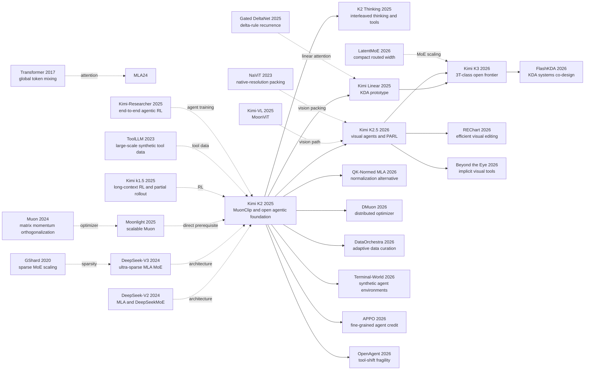

# Kimi K2 家族：从开放智能体到 3T 级前沿模型

> **2025 年 7 月 28 日，Moonshot 在 arXiv 提交 [Kimi K2](https://arxiv.org/abs/2507.20534) 时，官方发布页还明确写着它“不支持视觉”。** 这反而让这条家族线的戏剧性更强：K2 先把问题收窄成“怎样稳定训出一个开放权重、会真实调用工具的 1T 级智能体底座”，七个月后的 K2.5 再把视觉与并行子代理接进来，五个月后的 K3 又把主干改写成 2.78T / 104.2B、1M context 的新架构。真正值得读的不是某个单点分数，而是 Moonshot 在一年内连续三次重定义瓶颈：先解决 Muon 放大时的注意力失稳，再解决视觉和编排如何进入同一 RL 系统，最后承认旧的全 MLA 主干撑不起百万 token 长程任务。**K2 家族最重要的贡献，不是“2025 年就什么都有了”，而是把开放模型迈向前沿的每一道护栏都摊在报告里。**

## 一句话总结

Kimi Team 在 2025 年发布的这组 arXiv family report 以 K2 为中心，真正交出的不是“又一个 1T MoE”，而是一条把开放权重模型从会答题推到会行动、再推到原生多模态与超长状态的路线：K2 先用逐头 QK-Clip 把 $S_{\max}^h=\max(QK^\top/\sqrt d)$ 过大的注意力头压回阈值附近，修掉 vanilla Muon 在 53B / 9B MoE 试验里容易把最大 logit 冲到 1000+ 的失败基线，再把 1.04T / 32.6B 的 MLA MoE 稳定训过 15.5T token，并用真实 MCP 工具、合成工具与联合 RL 把它推进到 SWE-bench Verified 65.8、Tau2-Bench 66.1 这类执行型任务前沿；它继承了 [DeepSeek-V3](2024_deepseek_v3.md) 的稀疏 MLA MoE 直觉，也接上了 [DeepSeek-R1](2025_deepseek_r1.md) 之后“用环境反馈而不是只用文字偏好训练能力”的时代转向。

更重要的是，这个家族后两代把 K2 没做完的问题逐一摊开：K2.5 沿用 K2 的 1T / 32B MLA 语言骨干，却把 BrowseComp 从 60.6 拉到 78.4、把 WideSearch item-F1 从 72.7 拉到 79.0，证明“并行子代理 + 视觉在环 RL”可以成为新能力，而不是给 2025 年的 K2 倒填原生视觉；K3 则明确换成 2.78T / 104.2B、69 个 KDA 层加 24 个 Gated MLA 层的新底座，同时仍坦白自己总体落后 Claude Fable 5 与 GPT-5.6 Sol。隐藏 lesson 恰好在这里：**K2 家族最强的设计不是某个模块，而是拒绝把 K2.5 的视觉、K3 的 KDA 或未披露的训练账本伪装成 K2 早就拥有的能力。**

---

## 历史背景

### 2025 年的开放模型卡在什么地方

2025 年初，开放权重大模型的困难已经不再只是“参数能不能做大”。DeepSeek-R1 在 1 月把可验证奖励与大规模推理强化学习推到公众面前；Moonshot 同月发布 [Kimi k1.5](https://arxiv.org/abs/2501.12599)，证明长上下文、多模态题目和简化的策略优化可以共同支撑推理扩展。真正没有解决的是下一步：模型如何在现实环境中连续行动，而不只是把一道数学题想得更久。工具调用轨迹在自然语料中极少，真实 API 会失效、收费或泄露隐私，软件工程任务又需要能执行测试的沙箱。一个会答题的模型离一个能规划、调用工具、读回反馈并修正动作的智能体，仍隔着数据、奖励和系统三道门槛。

预训练也碰到另一堵墙。AdamW 已有成熟的大规模配方，却未必把每个 token 的学习信号榨到极致；Muon 在小模型上显示出更高的 token 效率，但放大后容易出现注意力 logit 爆炸。对万亿参数 MoE 来说，一次训练尖峰不是折线图上的小瑕疵，而可能意味着昂贵的回滚。与此同时，扩大专家池能够在相近激活计算下增加容量，却会把路由、全互连通信和负载均衡变成系统问题。K2 的历史位置正落在这里：它不是先发明一个“会思考”的新界面，而是先造一个足够强、足够稳、可供智能体后训练探索的开放权重底座。

第三个瓶颈是上下文。代码仓库、网页搜索和多轮工具反馈天然比聊天长。K2 的 128K 窗口已经要求在注意力头数与长序列 FLOPs 之间作取舍；K2 Thinking 和 K2.5 又把窗口推到 256K。但仅仅把 RoPE 外推得更远，并不能让一次持续数小时、跨数百次工具调用的任务稳定运行。到 2026 年，问题从“能塞多少 token”变成“如何让模型、KV 缓存和外部环境一起活得足够久”。K3 的 1M 上下文、混合线性注意力与可恢复沙箱，正是对这道系统题的回答，而不是 K2 在 2025 年已经具备的隐藏能力。

### 把 K2 逼出来的四条前序线索

第一条是 [DeepSeek-V2](https://arxiv.org/abs/2405.04434) 与 [DeepSeek-V3](https://arxiv.org/abs/2412.19437) 的 MLA + 稀疏 MoE 路线。MLA 把每个 token 的键值表示压到低维潜变量，减少长上下文 KV 缓存；DeepSeek-V3 则展示了 671B 总参数、37B 激活参数的工程参照。K2 没有掩饰继承关系：它沿用 MLA 与共享/路由专家的基本组织，但把专家数从 256 增到 384，把注意力头从 128 减到 64，在推理成本和稀疏容量之间重新选点。

第二条是 Moonshot 自己的 [Moonlight / Muon 可扩展性研究](https://arxiv.org/abs/2502.16982)。这项工作把 Muon 从小实验推到 16B 总参数、3B 激活参数的 MoE，并报告相对 AdamW 的计算效率优势。K2 遇到的 logit 爆炸说明“优化器更快”不等于“可直接放大到 1T”；MuonClip 的 QK-Clip 因而不是装饰性命名，而是把一次中型实验变成完整预训练所缺的保险丝。

第三条是工具数据的自动生成。2023 年的 [ToolLLM](https://arxiv.org/abs/2307.16789) 用 16,464 个真实 API 生成调用路径，[Self-Instruct](https://arxiv.org/abs/2212.10560)、[AgentInstruct](https://arxiv.org/abs/2407.03502) 与 [AutoIF](https://arxiv.org/abs/2406.13542) 逐步把“模型教模型”推进到复杂指令和执行验证。K2 把这些线索接成生产管线：真实 MCP 规范、合成工具、生成的代理与任务、状态化模拟器、rubric 过滤，再用真实代码沙箱补足模拟可信度。

第四条是 Moonshot 的强化学习连续线。[Kimi k1.5](https://arxiv.org/abs/2501.12599) 给出无价值网络、无 MCTS 的长链策略优化与 partial rollout；2025 年 6 月 20 日发布的 [Kimi-Researcher](https://moonshotai.github.io/Kimi-Researcher/) 又把严格 on-policy 的端到端 RL 放进搜索、浏览和代码环境。K2 把范围从可验证题扩到开放任务：能自动验算的任务进入 Gym，创作、开放问答则交给自批评 rubric 奖励。这个扩展也埋下风险：当 critic 偏好“自信而单一”的答案时，模型可能牺牲必要的保留意见，K2 报告附录对此已有坦白。

### Moonshot 当时在做什么

K2 不是一次孤立发布。2025 年上半年，Moonshot 同时推进 Kimi-VL、Kimi k1.5 和 Kimi-Researcher：一条线研究视觉编码，一条线扩强化学习，一条线把模型放进真实搜索和工具循环。7 月 28 日提交的 K2 报告把其中两条收束到一个开放底座：预训练端追求 token 效率和稳定性，后训练端追求工具数据与通用 RL。官方发布页甚至明确写着“K2 尚不支持视觉”，并把 thinking 与 visual understanding 列为后续计划。这句话是理解家族史的护栏：K2 的核心贡献是文本智能体底座，不应因为 K2.5 与 K3 后来有视觉，就倒推 K2 已是原生多模态模型。

随后几个月，K2 Thinking 在同一 1T/32B MLA 骨干上补入长思考、思考与工具调用交错、256K 上下文和原生 INT4 后训练。它让单一模型可以维持 200–300 次连续工具调用，但没有重写预训练架构。2025 年 10 月 30 日提交的 [Kimi Linear](https://arxiv.org/abs/2510.26692) 才首次公布 Kimi Delta Attention：一个以细粒度遗忘门扩展 Gated DeltaNet 的线性注意力模块。这又是一条关键护栏：KDA 是通往 K3 的架构试验，不属于 K2 或 K2.5。

### 从 K2 到 K3：一年内改了三次问题定义

K2 在 2025 年 7 月问的是：**怎样稳定预训练一个开放的 1T 稀疏底座，并让它在不展开长思考时可靠使用工具？** 答案是 1.04T/32.6B 的 MLA MoE、15.5T token、MuonClip，以及 3,000 多个真实 MCP 工具与 20,000 多个合成工具支撑的数据/RL 管线。它在非思考设置下取得 SWE-bench Verified 65.8 和 Tau2-Bench 66.1，但报告也承认工具定义含糊时会过度生成，误开工具还可能降性能。

K2.5 在 2026 年 2 月把问题改成：**文本和视觉能否从预训练到 RL 一起优化，并把顺序智能体变成可学习的并行编排器？** 它没有换掉 K2 的语言骨干，而是从近末期 K2 检查点继续做约 15T 混合视觉文本训练，接入 MoonViT-3D。反直觉之处有两个：低比例视觉 token 的早期融合优于把大量视觉数据迟到地灌进去；完成联合预训练后，纯文本 SFT 反而比人工视觉轨迹更能启动视觉工具能力。PARL 冻结子代理、只训练 orchestrator，把“何时并行”变成策略，而不是写死的工作流。

K3 在 2026 年 7 月第三次改题：**当开放模型要同时扩大预训练规模、测试时计算和任务时长，旧的 1T 全 MLA 骨干是否仍够用？** Moonshot 的答案是否定的。K3 变成 2.78T/104.2B、93 层、69 个 KDA 层与 24 个 Gated MLA 层，加入 AttnRes、Stable LatentMoE、从零训练的 MoonViT-V2 和 1M 上下文。后训练把三类领域与三档思考力度交叉成九个专家策略，再由多教师 on-policy 蒸馏合并。它是一场架构与系统转向，不是“K2 再多训一点”。

## 研究背景与动机

### 三种稀缺资源：高质量 token、可信反馈与可持续状态

这条家族线索可以压缩成三种稀缺资源。K2 首先处理**高质量 token**：既然人类文本增长追不上算力，就用 Muon 提高每个 token 的优化效率，用受验证的改写增加同一知识的表达多样性，同时用 QK-Clip 防止优化效率换来不稳定。它的设计目标不是最低总参数，而是在相近激活计算下得到更大的专家容量，因此 384 个专家只激活 8 个，32.6B 激活参数承担 1.04T 参数库的每步计算。

K2 与 K2.5 接着处理**可信反馈**。智能体的训练样本不是一问一答，而是“观察—动作—环境变化—再观察”的轨迹。模拟器可以扩规模，却可能教会模型利用模拟漏洞；真实环境可信，却昂贵且难复现。K2 用模拟覆盖广度、用代码沙箱提供真值，再把可验证奖励与自批评 rubric 合并。K2.5 为视觉任务加入 IoU、点匹配、编辑距离、计数误差等任务奖励；对并行智能体，则把最终任务成功、启动子代理和子任务完成率拆开，最后逐步撤掉辅助奖励。

K3 最后处理**可持续状态**。百万 token 只是接口数字；真正困难的是一次 RL rollout 可能跨数个训练迭代，沙箱中的文件、进程和应用状态也不能丢。K3 的 partial rollout、外部 KV 池、自适应并发控制与可暂停 microVM，目的是让模型状态和世界状态一起恢复。架构上，KDA 用固定大小的递归状态承担大部分长序列混合，周期性的 Gated MLA 保留全局交互；AttnRes 则让层在深度方向选择性读取旧表示。三个方向共同服务同一目标：让长期任务不因 token、反馈或状态任一资源耗尽而中断。

### 为什么要把三代作为一个家族读

只读 K2，会把它误解成“又一个 1T MoE”；只读 K2.5，会看不见零视觉 SFT 依赖先前约 15T 的联合预训练；只读 K3，又容易把 KDA、AttnRes 和原生视觉错误地追溯到 2025 年。把三代并读，才能看到继承与替换：K2 的 Muon/QK 稳定化、数据改写和环境式 RL 被保留；K2.5 的联合视觉训练、视觉在环工具使用和并行编排被吸收；K3 则替换全 MLA 主干、扩大激活计算并重做长状态基础设施。

这也给“开放”的讨论加上尺度。公开 1T 乃至 2.8T 权重，让外部团队能检查、量化、微调和自托管，这是实质性的能力转移；但数据清单、全部过滤器、奖励模型、RL 环境和训练集群没有完整开放，复现从来不等于下载权重。K2/K2.5 的 Modified MIT 与 K3 自定义许可证还有大规模商业归属或 MaaS 条款。因此，本笔记统一使用更准确的“开放权重”：肯定它相对闭源 API 的研究意义，也不把可下载误写成从数据到训练都可重现。

---

## 方法详解

### 整体框架：不是一次升级，而是三次换瓶颈

Kimi K2 家族的连续性不在于三代共享同一套模块，而在于它们依次把“智能体”所需的瓶颈往底层推。K2 先解决底座问题：用稀疏 MLA MoE 承载 1.04T 参数，用 MuonClip 稳定 15.5T token 预训练，再用合成工具轨迹和联合 RL 把文本模型变成会行动的非思考智能体。K2.5 保留这套语言骨干，通过约 15T 混合视觉文本续训接入 MoonViT-3D，并把单代理串行执行扩展为可学习的 Agent Swarm。K3 则不再把 K2 骨干当作不可动的地基：它重写 token、深度和专家三个方向的信息流，把规模、原生视觉和 1M 上下文一起推进。

下面这张流程图在两个语言版本中完全相同，箭头上的 **keep** 与 **replace** 是理解方法归属的关键：

```text
K2 (2025)
  15.5T text tokens -> 1.04T / 32.6B MoE -> MLA + MuonClip
       -> agentic SFT (real MCP + synthetic tools + sandboxes)
       -> joint RL (verifiable rewards + self-critique rubrics)
                         |
                         | keep K2 language backbone
                         v
K2.5 (2026-02)
  near-end K2 checkpoint + MoonViT-3D -> ~15T mixed vision-text continuation
       -> zero-vision SFT -> joint text-vision RL
       -> PARL orchestrator + frozen subagents -> Agent Swarm
                         |
                         | inherit recipes, replace foundation architecture
                         v
K3 (2026-07)
  from-scratch native multimodal pre-training -> 2.78T / 104.2B MoE
       -> 69 KDA + 24 Gated MLA + AttnRes + Stable LatentMoE
       -> 8K -> 64K -> 256K -> 1M context curriculum
       -> 3 domains x 3 effort levels -> 9 RL teachers -> MOPD unified model
```

| Generation | Total / active params | Token mixing | Vision path | Released context | Agentic training |
|---|---:|---|---|---:|---|
| K2 | 1.04T / 32.6B | 61 MLA layers | None | 128K | Synthetic tool SFT + joint RL |
| K2 Thinking | 1.04T / 32B | Inherited MLA | None | 256K | Interleaved thinking and tools |
| K2.5 | ~1T / 32B + 0.4B ViT | Inherited MLA | SigLIP-initialized MoonViT-3D | 256K | Joint multimodal RL + PARL |
| K3 | 2.78T / 104.2B | 69 KDA + 24 Gated MLA | From-scratch MoonViT-V2 | 1,048,576 | Multi-effort RL + MOPD |

**最容易误读的一点**是把家族名当成单一架构名。K2.5 的“2.5”主要来自多模态续训与后训练，它仍是 K2 的 MLA 语言模型；KDA、AttnRes、Stable LatentMoE 都到 K3 才进入发布模型。反过来，K3 虽然换了骨干，却继续使用 K2 发端的 Muon/QK 稳定化、数据改写和环境式 RL 思路，也继承 K2.5 的视觉在环任务与并行代理能力。

### 设计 1：K2 的超稀疏 MLA MoE 与 MuonClip

**功能。** K2 要在每 token 只计算约 32.6B 激活参数的前提下，提供 1.04T 参数容量，并让更高 token 效率的 Muon 在这个尺度上不因注意力 logit 爆炸而中断训练。模型有 61 层、7168 隐藏维、384 个路由专家与 1 个共享专家；每个 token 选 8 个路由专家，稀疏度为 48。注意力使用 MLA，将每个 token 的完整 K/V 压成潜表示。64 个注意力头不是随意减配：K2 的实验显示，在 128K 序列上把头数从 64 翻到 128 会增加 83% 推理 FLOPs，而验证损失收益只有约 0.5%–1.2%。

**核心思路。** Muon 对矩阵动量做 Newton–Schulz 正交化，更新的有效秩高于 AdamW，但这也更容易增大查询和键矩阵的谱范数。注意力 logit 由两个投影相乘，增长会被放大。对第 $h$ 个头，K2 观测当前 batch 的最大 logit，并在 Muon 更新以后计算逐头缩放：

$$
S_{\max}^{h}=\frac{1}{\sqrt d}\max_{X\in B}\max_{i,j}Q_i^h(K_j^h)^\top,
\qquad
\gamma_h=\min\left(1,\frac{\tau}{S_{\max}^{h}}\right),
\qquad \tau=100.
$$

随后把查询和键投影分别乘以 $\gamma_h^\alpha$ 与 $\gamma_h^{1-\alpha}$，默认 $\alpha=0.5$。这个动作不改当前步的前向或反向，只约束下一步使用的权重。对 MLA，K2 只缩放不共享的 $q_C$、$k_C$ 与 $q_R$，不碰跨头共享的 $k_R$，避免一个异常头牵连所有头。

```python
def qk_clip_after_muon_step(q_weight, k_weight, max_logits,
                            threshold=100.0, balance=0.5):
    """Simplified per-head QK-Clip; applied after the optimizer update."""
    gamma = torch.minimum(
        torch.ones_like(max_logits),
        threshold / max_logits.clamp_min(1e-12),
    )
    q_weight.mul_(gamma.pow(balance).view(-1, 1, 1))
    k_weight.mul_(gamma.pow(1.0 - balance).view(-1, 1, 1))
```

| Stabilizer | Controls | Compatible with latent KV caching? | K2 finding |
|---|---|---|---|
| Logit soft-cap | Softmax input after QK product | Yes | Product can still grow before cap |
| Standard QK-Norm | Materialized Q and K | Not directly in K2's MLA path | Rejected for this implementation |
| Global QK-Clip | All heads from one maximum | Yes | Over-regularizes unaffected heads |
| Per-head QK-Clip | Q/K projection weights per head | Yes | Minimal intervention used in K2 |

**设计动机与边界。** 这不是把 logit 永久钉在 100。附录 D 报告，前 70,000 步有 12.7% 的头至少触发过一次；之后所有头的最大 logit 都曾降到阈值以下，QK-Clip 自行失活。小规模实验即使用更激进的 $\tau=30$ 也没有可测的下游退化。它更像训练初期的护栏，而不是持续施加的正则项。不过，2026 年的 QK-Normed MLA 已给出不缓存完整键也能做精确 QK 归一化的方法，并在小模型实验中优于 clipping。这说明 MuonClip 是 K2 当时可扩展的解法，不是注意力稳定性的终局。

### 设计 2：K2 的智能体数据工厂与联合强化学习

**功能。** 预训练能让模型读懂工具说明，却不会自动提供“何时调用、如何根据失败重试、何时停止”的稀有轨迹。K2 把工具学习拆成可扩展的数据工厂：从 GitHub 获取 3,000 多个真实 MCP 工具，按领域演化出 20,000 多个合成工具；再生成不同 system prompt 的代理、与工具匹配的任务和显式 rubric。用户模拟器制造多轮需求，状态化工具模拟器返回成功、局部失败和边界情况，LLM judge 只保留满足 rubric 的轨迹。涉及代码和软件工程时，真实 Kubernetes 沙箱与单元测试补上模拟器无法提供的真实性。

这条管线没有公开最终 SFT 轨迹总数，因此不能把“20,000 个工具”误写成“20,000 条训练样本”。它的核心是组合空间：同一工具会出现在不同代理、任务、用户风格和环境状态里，让模型学习接口语义，而不是背一条固定 workflow。工具声明主要用 TypeScript 表达以节省上下文，同时保留 JSON 样本兼容通用框架；解码 enforcer 只负责保证调用格式，不代表模型已经学会正确选择工具。

**从可验证到开放任务。** K2 的 RL Gym 把数学、STEM、逻辑、复杂指令、事实忠实度、竞赛代码、GitHub issue 与安全任务纳入同一框架。能执行的题用规则、测试或环境终态打分；无法写出唯一规则的开放问答和创作，则由 K2 critic 按核心 rubric、场景 rubric 与人工 rubric 做成对比较。可验证 rollout 还会持续更新 critic，使主观判分器跟随最新策略，而不是冻结在旧分布上。

对 prompt $x$ 采样 $K$ 个输出 $y_i$ 后，K2 继承 K1.5 的相对奖励目标。下面保留报告的关键结构：奖励减去组均值，再以相对旧策略的 log-ratio 作稳定项。

$$
\mathcal L_{\mathrm{RL}}(\theta)=
\mathbb E_{x\sim\mathcal D}\left[
\frac{1}{K}\sum_{i=1}^{K}
\left(r(x,y_i)-\bar r(x)-
\tau\log\frac{\pi_\theta(y_i\mid x)}{\pi_{\mathrm{old}}(y_i\mid x)}\right)^2
\right],
\quad
\bar r(x)=\frac1K\sum_i r(x,y_i).
$$

```python
def k2_agentic_training_round(tool_repo, actor, critic, environments):
    agents = synthesize_agents(tool_repo)
    tasks = generate_tasks_with_rubrics(agents)
    demonstrations = []
    for task in tasks:
        env = environments.pick(task)
        trajectory = rollout(actor, task, env)
        if critic.meets_rubric(trajectory, task.rubric):
            demonstrations.append(trajectory)
    actor.supervised_finetune(demonstrations)
    actor.reinforcement_learn(
        verifiable_envs=environments.verifiable,
        open_ended_reward=critic.pairwise_rubric_reward,
    )
```

| Signal | Example domains | Evaluator | Main failure controlled |
|---|---|---|---|
| Deterministic outcome | Math, logic, format constraints | Rules / interpreters | Ambiguous learned reward |
| Executable outcome | Code, SWE, tool environments | Tests / final state | Plausible but non-working output |
| Faithfulness reward | Grounded long-form answers | Sentence-level judge | Unsupported claims |
| Self-critique rubric | Writing, open QA, assistance | K2 critic comparisons | No single ground-truth answer |
| Budget penalty | All RL domains | Task-dependent token cap | Correct but wasteful over-generation |

**设计动机与边界。** 只用可验证奖励会把模型锁在数学和代码；只用 learned critic 又会产生 reward hacking。K2 的联合方案试图让硬反馈校准软反馈，并以 PTX 辅助损失保住精选高质量数据，以温度衰减从探索过渡到稳定生成。代价是 critic 仍携带价值偏差：报告附录承认“避免自我保留”和“偏好清晰单一答案”可能惩罚合理的不确定性。K2 的智能体能力因此应理解为“在其工具与 rubric 分布上被系统训练”，而不是在任意新环境里获得了可靠自治。

### 设计 3：K2.5 的联合视觉训练、零视觉 SFT 与视觉 RL

**功能。** K2.5 不把视觉当作发布前挂上的适配器，而是从近末期 K2 检查点继续做大规模联合训练。语言骨干仍是 K2 的 61 层 MLA MoE；新增路径由 MoonViT-3D、MLP projector 和原语言模型组成。MoonViT-3D 从 SigLIP-SO-400M 初始化，用 NaViT packing 接受原始宽高比和可变分辨率。视频不另造一套编码器：最多四个连续帧组成时空块，共享图像权重，在 projector 前做时间池化，把视觉 token 压缩 4 倍。

**训练次序。** 论文 Table 3 的三阶段必须按“谁在更新”来读。ViT 阶段约 1T token，先把视觉塔对齐到 Moonlight-16B-A3B，再短暂只训 projector；联合阶段从近末期 K2 出发，对 ViT 与 1T 语言模型处理约 15T 混合 token；长上下文 mid-training 再用 500B 与 200B token 把序列长度推到 32K 和 262,144。正文把整个续训概括成“约 15T mixed visual and text tokens”，所以不能机械相加后声称语言骨干精确训练了 16.7T 新 token。

固定视觉与文本 token 总预算时，K2.5 的消融反驳了“视觉越晚、占比越高越高效”的常见做法：

| Injection | Vision:text ratio | Vision knowledge | Vision reasoning | OCR | Text knowledge | Text reasoning | Code |
|---|---:|---:|---:|---:|---:|---:|---:|
| Early | 10:90 | 25.8 | 43.8 | 65.7 | 45.5 | 58.5 | 24.8 |
| Mid | 20:80 | 25.0 | 40.7 | 64.1 | 43.9 | 58.6 | 24.0 |
| Late | 50:50 | 24.2 | 39.0 | 61.5 | 43.1 | 57.8 | 24.0 |

**零视觉 SFT。** 名字最容易制造误会。它不是“模型没看过图”，而是说在已经完成联合预训练以后，SFT 阶段只喂高质量文本轨迹。文本里的 IPython 操作教会模型把感知问题转成程序化动作；预训练形成的跨模态表示把这些动作迁移到定位、计数、OCR 和图表任务。作者的初步实验中，人工设计的视觉 CoT 与简单 crop/rotate/flip 轨迹反而限制泛化，text-vision SFT 比纯文本方案更差。接下来的 outcome-based visual RL 才强制模型在必须看图才能答对的任务上使用视觉证据。

```python
def k25_post_training(joint_pretrained_model, text_trajectories, visual_envs):
    # "Zero-vision" applies only to SFT, not to pre-training or RL.
    model = sft(joint_pretrained_model, text_trajectories)
    visual_rollouts = rollout_with_images_and_python(model, visual_envs)
    rewards = {
        "grounding": soft_iou_or_point_f1(visual_rollouts),
        "segmentation": mask_iou(visual_rollouts),
        "ocr": normalized_edit_distance(visual_rollouts),
        "counting": absolute_count_error(visual_rollouts),
    }
    return joint_text_vision_rl(model, rewards)
```

视觉 RL 后，论文报告 MMLU-Pro 从 84.7 升到 86.4，GPQA-Diamond 从 84.3 升到 86.4，LongBench v2 从 56.7 升到 58.9。这三项支持“视觉训练没有必然侵蚀文本”的局部结论，却不能证明任何视觉数据或任意权重都会正迁移。K2.5 真正新颖的地方，是把模态边界从训练组织中拿掉：RL 专家按知识、推理、代码、智能体等能力分组，每组同时接收文本与多模态问题，GRM 也跨模态评价。

### 设计 4：PARL 只训练编排器，避免多代理信用分配失控

**功能。** 单代理把每次搜索、下载、阅读与综合串成一条链，任务宽度越大，墙钟时间和全局上下文近似线性增长。K2.5 给主代理 `create_subagent` 与 `assign_task` 两个动作，让它动态创建有不同 system prompt 的执行者，并发处理可分解子问题。关键不是“有多个代理”，而是**并行策略本身通过 RL 学出**：训练 prompt 不直接命令并行，而是选择顺序执行很难在步数预算内完成的 wide-search、deep-search、百文档阅读和批量下载任务。

端到端更新所有代理看似更完整，却会遇到稀疏终局奖励下的信用歧义：成功不表示每个子轨迹都正确，失败也不说明所有执行者都错。PARL 因而冻结来自固定中间检查点的子代理，把其输出视为环境 observation，只更新 orchestrator。奖励由三项组成：

$$
r_{\mathrm{PARL}}(x,y)=
\lambda_1 r_{\mathrm{parallel}}+
\lambda_2 r_{\mathrm{finish}}+
r_{\mathrm{perf}}(x,y),
\qquad \lambda_1,\lambda_2\rightarrow 0.
$$

$r_{\mathrm{parallel}}$ 防止 orchestrator 落入“永远自己做”的 serial collapse；$r_{\mathrm{finish}}$ 防止它为刷并行度而生成大量没有完成的子任务。两项系数最后退火到零，终局策略仍由任务结果主导。墙钟代理指标也不是总工具步数，而是每个阶段的主代理步骤加最慢并行分支：

$$
\mathrm{CriticalSteps}=\sum_{t=1}^{T}
\left(S_{\mathrm{main}}(t)+\max_i S_{\mathrm{sub},i}(t)\right).
$$

```python
def parl_episode(orchestrator, frozen_subagents, task):
    plan = orchestrator.decompose(task)
    observations = parallel_map(
        lambda item: frozen_subagents[item.role].run(item.prompt),
        plan.subtasks,
    )
    answer = orchestrator.aggregate(task, observations)
    reward = task.score(answer)
    reward += parallel_bonus(plan) + completion_bonus(observations)
    update(orchestrator, reward)   # Subagent parameters stay frozen.
```

| Strategy | Trainable component | Credit assignment | Context behavior | Main risk |
|---|---|---|---|---|
| Single agent | One policy | Direct but long-horizon | One growing history | Serial latency |
| Static workflow | Usually none | Hand-designed | Fixed partitions | Brittle roles |
| End-to-end multi-agent RL | All agents | Ambiguous terminal credit | Many coupled histories | Instability |
| K2.5 PARL | Orchestrator only | Outcome assigned to coordination policy | Isolated subagent contexts | Frozen worker ceiling |

**结果与代价。** Table 6 中，Agent Swarm 把 BrowseComp 从 60.6 提到 78.4、WideSearch item-F1 从 72.7 提到 79.0、内部 Swarm Bench 从 41.6 提到 58.3；在 WideSearch 达到不同目标 F1 时，墙钟时间缩短 3–4.5 倍。官方博客展示最多 100 个子代理和 1,500 次调用，但那是研究预览容量，不应替代表格协议。并行不是免费午餐：总 token 和总工具成本可能上升，最慢分支仍决定关键路径，冻结执行者也让 orchestrator 无法通过梯度修复底层技能。

### 设计 5：K3 用 KDA + Gated MLA 管序列，用 AttnRes 管深度

**功能。** 全 MLA 的 KV 缓存仍随序列增长，1M 上下文下的训练、prefill 与多轮恢复成本成为瓶颈。K3 把 93 个注意力层排成 69 个 KDA 与 24 个 Gated MLA，基本模式是 3 个 KDA 后接 1 个全局 MLA，末层保证全局注意力。KDA 以固定大小递归状态处理大部分 token 混合，MLA 周期性恢复不受限的全局内容交互。所有 MLA 层使用 NoPE；位置信息来自 KDA 的递归衰减，因此扩到 1M 不需要重新缩放 RoPE 或再套 YaRN。

KDA 继承 Kimi Linear 的 delta-rule 记忆。对单头状态 $S_t$，先按通道遗忘旧状态，再用键方向擦除旧关联并写入新值：

$$
S_t=(I-\beta_t k_tk_t^\top)\operatorname{Diag}(\alpha_t)S_{t-1}
+\beta_t k_tv_t^\top,
\qquad \tilde o_t=S_t^\top q_t.
$$

K3 相对 Kimi Linear 的新增不是“发明 delta rule”，而是让实现适合更大模型。原负 Softplus 衰减可能使 chunk 内倒数缩放溢出；K3 用下界为 $g_{\min}=-5$ 的 scaled sigmoid：

$$
g_t^h=g_{\min}\operatorname{Sigmoid}(e^{A_h}z_t^h),
\qquad
\alpha_t^h=\exp(g_t^h)\in(e^{-5},1).
$$

于是 16-token tile 的累计 log-decay 落在 $(-80,0)$，倒数仍在 BF16 动态范围内，所有 tile 都可走 Tensor Core dense matmul。K3 还把 Kimi Linear 的低秩输出门改成 full-rank、输入依赖的门；Gated MLA 使用同类门选择全局注意力输出通道。

**深度方向。** 普通残差把此前所有层压成一个累加状态，深度上像一条 RNN。AttnRes 为每层学习伪查询，对 embedding 和此前层输出分配 softmax 权重，再组成当前输入：

$$
a_{i\rightarrow l}=
\frac{\exp(w_l^\top\operatorname{RMSNorm}(v_i))}
{\sum_{j=0}^{l-1}\exp(w_l^\top\operatorname{RMSNorm}(v_j))},
\qquad
h_l=\sum_{i=0}^{l-1}a_{i\rightarrow l}v_i.
$$

完整形式要保存每层表示。K3 用 Block AttnRes 把 93 层切成 8 个 12 层块和一个不满块；块内做累积和，跨块只对聚合表示做注意力，把存储/通信从 $O(Ld)$ 降到 $O(Nd)$。这与 KDA 分工清楚：KDA 回答“当前 token 如何读长序列”，AttnRes 回答“当前层如何读网络历史”。二者都叫 attention，却作用在不同轴上。

### 设计 6：K3 的 Stable LatentMoE、原生视觉与 Per-Head Muon

**功能。** K3 把路由专家扩到 896 个、每 token 激活 16 个，总激活参数升到 104.2B。如果每个专家都在 7168 全宽上收发 token，通信和权重带宽会随激活数快速上升。LatentMoE 先把路由分支降到 3584 维，让两个共享专家留在全宽路径，专门化专家在半宽潜空间工作，再映回主干：

$$
u=\sum_{i\in\mathcal T_k(x)}p_iE_i^{\mathrm{routed}}(W_\downarrow x),
\qquad
y=\sum_{j=1}^{2}E_j^{\mathrm{shared}}(x)+
W_\uparrow\operatorname{RMSNorm}(u).
$$

极端稀疏放大了两个失败模式：连续多次矩阵乘使潜分支 activation 爆炸，近千专家的固定步长 bias 更新又容易振荡或留下“死专家”。Stable LatentMoE 插入 RMSNorm，并以 SiTU-GLU 同时平滑封顶 gate 与 up 分支：

$$
\operatorname{SiTU\!\!\!-GLU}(x)=
\left[\beta_1\tanh\left(\frac{W_gx}{\beta_1}\right)
\odot\sigma(W_gx)\right]
\odot
\left[\beta_2\tanh\left(\frac{W_ux}{\beta_2}\right)\right],
\quad \beta_1=4,\ \beta_2=25.
$$

每坐标输出因此不超过 100。Quantile Balancing 不再以手调步长慢慢推专家 bias，而从全局 batch 的 router margin 直方图估计使每个专家达到目标负载的分位数；最终 bias 在推理时冻结。MoonEP 则在物理执行层动态放置冗余专家，让每个 EP rank 收到同量 token。QB 决定语义路由，MoonEP 平衡硬件执行，两者不能混为一个算法。

**原生视觉的含义。** K3 不再从 SigLIP 接入视觉塔，而从零训练 27 层、401M 参数的 MoonViT-V2，视觉与文本从训练开端共享 next-token objective。它仍继承 K2.5 的图像/视频共享参数与时空分解，但用 RMSNorm、无 bias 投影和 2×2 pixel shuffle：后者把视觉 token 减到四分之一，使最高 3584×3584 输入能放进 1M 上下文。报告中的消融显示，从零版本的视觉评测追平 SigLIP 初始化，同时梯度范数更低、尖峰更少。这里的“原生”指从训练初期共同优化，不表示像素未经独立 ViT 就直接进入语言层。

Muon 也继续演化。K3 对 Q/K/V 投影不再把所有头拼成一个矩阵正交化，而按 head 切分动量块分别做 Newton–Schulz。这样大梯度头不会主导整个矩阵的更新尺度，小头也能获得充分归一化。它仍配合 K2 的 weight-clipping 机制，但 **Per-Head Muon 是 K3 的变化**，不能回写成 K2 的训练配方。

### 训练配方与继承关系：什么保留，什么被替换

| Component | K2 | K2.5 | K3 | Family interpretation |
|---|---|---|---|---|
| Base initialization | From scratch | Near-end K2 checkpoint | From scratch | K2.5 is continuation; K3 is a new foundation |
| Pre-training volume | 15.5T disclosed | ~15T mixed continuation; staged accounting | Total not disclosed | Never transfer token totals across generations |
| Optimizer | MuonClip | Inherited MuonClip recipe | Per-Head Muon + K2 clipping | Stability idea persists; implementation changes |
| Attention | Full MLA + YaRN | Full MLA + YaRN | 3:1 KDA / Gated MLA + NoPE | KDA begins only with K3 release architecture |
| Vision | None | SigLIP-initialized MoonViT-3D | From-scratch MoonViT-V2 | Native multimodality deepens across generations |
| Agent structure | Single policy and environments | Orchestrator + frozen subagents | General/coding/knowledge-work agents | Parallel orchestration appears in K2.5 |
| RL consolidation | Joint multi-domain RL | Joint multimodal RL + PARL | 9 teachers merged by MOPD | Specialize, then reunify |
| Deployment precision | Block FP8 checkpoint | Native INT4 path | MXFP4 experts / MXFP8 activations | Quantization moves into post-training |

K2 的关键公式是“相对奖励 + 策略邻域”，K2.5 把这一思想扩到 token-level off-policy clipping、视觉奖励与 PARL，K3 再让 partial rollout 跨迭代保存，并用多教师 on-policy 蒸馏把九个策略重新合成一个模型。K3 从 SFT 起就做 MXFP4/MXFP8 量化感知训练，rollout 与训练采用同一精度，减少训练—推理错位；一个预训练 MTP 层又被微调为 EAGLE-3 风格 draft model，提高长生成吞吐。

因此，这个家族真正稳定的“方法”不是某个单独模块，而是一条工程原则：**先找出扩展时最先失稳的量，再为它设计可测、可退火或可冻结的控制器。** K2 控制 logit、工具轨迹质量和生成预算；K2.5 控制模态冲突、串行塌缩与虚假并行；K3 控制递归衰减、深度信息瓶颈、潜专家 activation、路由负载和跨迭代状态。模型变大只是结果，控制住新的失稳面才是三代共同的主线。

---

## 失败案例

### K2 首先打败的不是某个模型，而是四种扩展捷径

K2 报告最有价值的“失败 baseline”并不都在排行榜里。第一种捷径是**把 vanilla Muon 直接放大**。团队在 53B 总参数、9B 激活参数的 MoE 上观察到最大注意力 logit 很快超过 1,000，并伴随 loss spike 与偶发发散；AdamW 较少出现这个现象。Muon 在 Moonlight 的同预算实验里更省 token，并不意味着它能无修改穿越两个数量级。MuonClip 的意义正来自这次失败，而不是在 K2 已成功训练后随手加的一层保险。

第二种捷径是**在 softmax 入口做 logit soft-cap**。它限制最终送进 softmax 的数值，却不限制 $QK^\top$ 在投影矩阵内部继续变大；根因仍会积累。标准 QK-Norm 又要求归一化物化后的键，而 K2 的 MLA 解码只缓存低维潜状态，作者当时认为这条路不兼容其推理路径。于是 K2 选择在更新后逐头缩放投影权重。到 2026 年，QK-Normed MLA 证明这种不兼容不是数学必然，而是实现限制，这反过来说明 K2 的论证应读作“当时系统里的可行选择”，不能升级为永恒否定。

第三种捷径是**以更多注意力头换一点 loss**。K2 对比 64 与 128 个头，后者在不同训练 FLOPs 下只改善约 0.5%–1.2% 验证损失，却在 128K 上增加 83% 推理 FLOPs。对短 benchmark，128 头或许仍显得合理；对要反复 prefill 工具历史的智能体，代价被每一轮放大。K2 因而选了看似“更窄”的 64 头，这是一项面向部署的次优训练损失选择。

第四种捷径是**只靠真实环境或只靠模拟环境**。真实工具有费用、隐私、可用性和构建规模问题；模拟器便宜，却可能生成不真实反馈。K2 用模拟器扩覆盖，用真实代码沙箱给关键任务落地，并以 rubric 做拒绝采样。它没有消除 sim-to-real gap，只是拒绝在两种不完美来源中二选一。

### 论文中明确放弃或承认不足的实验

K2 的基础设施章节写得很坦率。团队没有采用 DeepSeek-V3 的 DualPipe：对超过 1T 参数的 K2，它会把参数和梯度内存翻倍，迫使更高并行度，继而引入 pipeline bubble 或更大的 expert-parallel 开销。K2 选择 interleaved 1F1B，并通过拆出 weight-gradient 计算来覆盖 pipeline 通信。这不是说 DualPipe 普遍更差，而是它在 K2 的内存边界下输给了较少复制的方案。

K2 也没有在计算中全面使用 FP8。报告只把不敏感 activation 以 FP8-E4M3 存储，明确说预研曾观察到潜在性能退化，因此不把 FP8 用于算术。其余 activation 依靠选择性重计算和 CPU offload。这个决定提醒读者：公开的 block-FP8 检查点不等于整次预训练都是 FP8 计算，更不能从发布格式反推训练 FLOPs。

后训练的失败出现在产品行为里。K2 会在难题或含糊工具说明下生成过多 token，导致输出截断或工具调用不完整；某些任务不必要地启用工具还会掉分；完整软件项目的一次提示成功率低于放进 agentic coding framework。附录 F 又指出自批评 rubric 可能偏好强硬单一的答案，抑制合理的 epistemic humility。这些不是后人挑刺，而是作者在报告中留下的边界。

### K2.5 暴露的反例：视觉数据和代理数量都不是越多越好

K2.5 直接反驳了“视觉 token 越多、注入越晚越省事”。固定视觉和文本总预算时，早期 10:90 融合在视觉知识、视觉推理、OCR、文本知识和代码上都高于晚期 50:50；附录曲线还显示中期与晚期注入会发生 text capability 的 dip-and-recover，说明突然迁移模态分布会先扰乱语言表示。失败不是视觉本身，而是把视觉当作训练末尾的大剂量补丁。

更反直觉的是 SFT。团队先联合预训练约 15T 混合 token，随后发现人工构造的视觉 CoT 和 crop/rotate/flip 轨迹在视觉智能体任务上比纯文本 SFT 更差。低质量视觉演示会把策略锁在狭窄操作里；纯文本轨迹反而能借助已经对齐的跨模态表示迁移到视觉工具使用。这里必须保留因果次序：没有前面的联合预训练，“零视觉 SFT”不会凭空造出视觉能力。

多代理同样不是越多越好。PARL 需要 $r_{parallel}$ 防止 orchestrator 退回单代理的 serial collapse，又需要 $r_{finish}$ 防止它刷出大量不完成的子任务，也就是 spurious parallelism。最终还要把两个辅助项退火到零，以免策略只学会“开代理”。团队刻意放弃端到端联合更新所有 worker，因为终局奖励无法可靠判断哪个子代理应负责；冻结 worker 换来稳定，却也把执行能力上限锁死在固定检查点。

### K3 的失败 baseline：旧组件在 3T 与 1M 条件下开始失效

K3 把前两代的成功组件重新当作 baseline。K2.5 的 SigLIP 初始化视觉塔在联合训练中表现出持续较高且频繁尖峰的梯度范数；从零训练的 MoonViT-V2 反而更稳，并在报告的视觉评测中追平。这不是说对比预训练失去价值，而是 3T 语言骨干与原生 next-token 联合训练改变了初始化的最佳点。

Kimi Linear 的 KDA 衰减也不够直接放大。负 Softplus 让 log-decay 没有下界，chunk 内按累计衰减倒数缩放时可能溢出，需要对角 tile 的逐位置特殊路径。K3 把它改成下界 $-5$ 的 scaled sigmoid，使 16-token tile 的累计范围落在 BF16 可表达区间。类似地，SwiGLU 两个相乘分支都无界，在 2.8T + LatentMoE 的连续矩阵乘路径上产生 activation outlier；SiTU-GLU 用平滑 tanh cap 把每坐标上界控制为 100。

近千专家也让旧的无辅助损失 bias 更新失灵。固定步长 sign update 在“适应慢”和“负载振荡”之间需要手调，部分专家可能长期欠训练。Quantile Balancing 直接估计达到目标负载所需的 margin 分位数。报告还承认，更细粒度的 top-$k$ 蒸馏目标在 K3 的 MOPD 实验里没有显示出收敛速度或终值优势，因此选择更简单的逐 token teacher/student log-ratio 奖励。

K3 最后没有把失败藏在 SOTA 叙事后面：HLE-Full 为 43.5/56.0（无工具/有工具），低于 Claude Fable 5 的 53.3/63.0 与 GPT-5.6 Sol 的 44.5/58.0；CritPt 23.4 也低于两者。官方博客还列出 preserved thinking history 敏感、可能替用户过度主动，以及总体体验仍落后最强闭源系统。规模、上下文和开放权重没有自动抹掉行为可靠性问题。

### 真正的反 baseline 教训：把失败面变成可观测量

这三代最稳定的工程风格不是“永远选最简单模块”，而是**不接受无法定位的扩展失败**。K2 把“训练突然炸”缩成逐头最大 logit，把“工具会不会用”缩成 rubric 与可执行终态；K2.5 把“多代理更快吗”缩成 CriticalSteps，把“视觉是否伤文本”缩成联合消融；K3 把“近千专家不均衡”缩成 margin 分位数，把“长 rollout 卡住”缩成可暂停、可恢复的模型与沙箱状态。

相对的反例也一以贯之：一个 headline 数字不能独立解释系统。更多专家需要 latent routing 与 MoonEP，更多上下文需要 KDA、缓存和状态恢复，更多代理需要编排奖励与隔离上下文，更多视觉数据需要正确注入时机。家族的真正 lesson 不是“scale always wins”，而是 **scale 只在失稳变量可测、可控、可复核时才有意义**。

## 实验关键数据

### 三代主结果：只能按各自协议读

下表把家族数字放在一处，但最后一列是必要条件而不是脚注。K2 的主要比较是非思考、通常最多 8K 输出；K2.5 多数推理评测启用 thinking，部分允许 96K completion；K3 默认 max effort，并在不同 agent harness 下测试。空格表示报告没有给同协议数字，不能自行补齐。

| Benchmark / property | K2 | K2.5 | K3 | Protocol boundary |
|---|---:|---:|---:|---|
| Total / active parameters | 1.04T / 32.6B | ~1T / 32B + 0.4B ViT | 2.78T / 104.2B | Architecture tables |
| Released context | 128K | 256K | 1,048,576 | Model cards / reports |
| SWE-bench Verified | 65.8 | 76.8 | — | K2/K2.5 use their own minimal agent frameworks |
| SWE-bench Multilingual | 47.3 | 73.0 | — | Same benchmark family; post-training differs |
| GPQA-Diamond | 75.1 | 87.6 | 93.5 | K2 non-thinking; later models use thinking/max effort |
| HLE-Full, no tools | 4.7 text-only | 30.1 multimodal full | 43.5 multimodal full | Different subsets and reasoning budgets |
| HLE-Full, with tools | — | 50.2 | 56.0 | Tool sets and context policies differ |
| BrowseComp | — | 60.6 / 74.9 ctx / 78.4 swarm | 91.2 | K3 uses compaction at 300K for headline |
| LongBench v2 | 49.1 | 61.0 | — | K2 direct; K2.5 standardized around 128K input |
| Representative vision | None | MMMU-Pro 78.5 | MMMU-Pro 81.6 / 83.4 Python | K2 has no vision; K3 reports tool/no-tool pair |

这组数字能支持“家族能力范围逐代扩大”，却不能单独量化架构贡献。K2.5 与 K3 同时改变预训练、SFT、RL、工具、上下文管理和思考预算；把 GPQA 的 75.1→87.6→93.5 全归因于 MoonViT 或 KDA，都超出了证据。

### 与强基线的胜负，而不是只列赢的行

| Snapshot | Kimi result | Stronger / close baseline | What the result actually says |
|---|---:|---:|---|
| K2 SWE-bench Verified, single attempt | 65.8 | Claude Sonnet 4: 72.7 | Strong open-weight agentic coding, not closed-frontier parity |
| K2 ACEBench | 76.5 | GPT-4.1: 80.1 | Competitive tool use; proprietary model still leads |
| K2 LongBench v2 | 49.1 | GPT-4.1: 54.3; Gemini 2.5 Flash: 55.5 | Long window does not guarantee best long reasoning |
| K2.5 HLE-Full with tools | 50.2 | Gemini 3 Pro: 45.8; GPT-5.2: 45.5 | Leads this reported tool protocol |
| K2.5 SWE-bench Verified | 76.8 | Claude Opus 4.5: 80.9; GPT-5.2: 80.0 | Near frontier, still behind two baselines |
| K2.5 OSWorld-Verified | 63.3 | Claude Opus 4.5: 66.3 | Strong GUI action under one-shot testing |
| K3 ProgramBench | 77.8 | GPT-5.6 Sol: 77.6; Fable 5: 76.8 | Best row by a narrow margin |
| K3 Terminal-Bench 2.1 | 88.3 | GPT-5.6 Sol: 88.8; Fable 5: 88.0 | Effectively frontier cluster, harness-dependent |
| K3 HLE-Full with tools | 56.0 | Fable 5: 63.0; GPT-5.6 Sol: 58.0 | Research-level reasoning gap remains |
| K3 GDPval-AA v2 Elo | 1686 | Fable 5: 1747; GPT-5.6 Sol: 1736 | Third in the dated knowledge-work snapshot |

K2 的开源意义来自“在能下载权重的模型里把智能体编码推到前沿”，而不是每项都赢闭源模型。K3 也采用同样克制的总评：在报告套件中普遍领先除两款最强闭源模型之外的对手，但总体仍落后二者。保留输掉的行，比罗列 SOTA 更能说明 2026 年的真实边界。

### 关键消融与失败信号

| Experiment | Baseline | Intervention | Measured outcome | Interpretation limit |
|---|---|---|---|---|
| K2 data utility | Raw text, 10 epochs: 23.76 SimpleQA | 10 rephrasings, 1 epoch: 28.94 | +5.18 points | Small controlled corpus, not full-run attribution |
| K2 QK stability | Vanilla Muon max logit >1000 | MuonClip, tau=100 | No observed K2 loss spike | Stability evidence, not isolated quality gain |
| K2 head count | 64 heads | 128 heads | +83% FLOPs at 128K for ~0.5%-1.2% lower val loss | Long-context trade-off |
| K2.5 fusion | Late 50:50 | Early 10:90 | 43.8 vs 39.0 vision reasoning; 65.7 vs 61.5 OCR | Fixed mixed-token budget |
| K2.5 visual RL | Before vision RL | After vision RL | +1.7 MMLU-Pro; +2.1 GPQA; +2.2 LongBench v2 | Three text benchmarks only |
| K2.5 swarm | Single K2.5 | Agent Swarm | BrowseComp +17.8; WideSearch +6.3 | More total compute may be used |
| K3 vision init | SigLIP-initialized MoonViT-3D | From-scratch MoonViT-V2 | Lower/fewer gradient spikes; matched vision evals | Report gives curves, not one universal scalar |
| K3 architecture bundle | K2 scaling curve | K3 architecture/data/recipe bundle | ~2.5x scaling efficiency | No factorial attribution per component |

### 五个读数结论

- **稳定性是 K2 最硬的预训练结果。** “15.5T token 无可观察 loss spike”比某个下游高 1 分更能说明 MuonClip 是否完成任务，但它仍缺少与同尺度 AdamW 的完整并行 run。
- **K2 的智能体优势集中在执行型任务。** SWE-bench、Tau2 与 ACEBench 强，LongBench v2 和 HLE 仍暴露长推理与研究级知识缺口；128K 容量不等于 128K 有效推理。
- **K2.5 的关键消融是跨模态正迁移和“少而早”的视觉配比。** 它支持联合优化，不支持“任意视觉数据都不会伤文本”。
- **Agent Swarm 同时提高分数和墙钟效率，但没有证明总计算更省。** 3–4.5 倍是达到目标 F1 的时间缩短；并行子代理可能消耗更多累计 token。
- **K3 的优势是完整系统前沿，不是所有 benchmark 第一。** 2.5× 是架构、数据和训练配方的整体 scaling-law 增益；报告没有公开总预训练 token、训练 FLOPs或成本，也明确承认研究推理、行为纪律和用户体验仍有差距。

---

## 思想史脉络

### 家族与引用网络



图中的实线也不是同一种“继承”。K2→K2.5 与 K2.5/Kimi Linear→K3 是 Moonshot 官方报告明确给出的家族关系；K2→QK-Normed MLA、DMuon 或 OpenAgent 表示后者引用、扩展或检验 K2 暴露的问题，而不是使用了 K2 权重。虚线则是上游思想与工程前提。这样画可以避免一种常见的历史伪造：某篇论文只要晚于 K2、提到 Muon 或智能体，就被说成 K2 的“直接后代”。

### 前世：谁把问题推到 K2 面前

- **2017 Transformer**：全局 softmax attention 建立了 token mixing 的主干；K2 仍完全生活在这条路线中，只是通过 MLA 压缩 KV 缓存。[论文](https://arxiv.org/abs/1706.03762)
- **2020 GShard 与稀疏 MoE**：证明条件计算能把总容量推到数千亿参数而不让每 token 计算同比增长。K2 的 384 选 8 是这条路线在 1T 级的延伸。[论文](https://arxiv.org/abs/2006.16668)
- **2023 ToolLLM**：把 16,464 个真实 API 变成自动生成的工具学习数据，先展示了“工具规范→任务→调用路径”的可扩展性；K2 增加状态化模拟、rubric 和真实沙箱。[论文](https://arxiv.org/abs/2307.16789)
- **2024 DeepSeek-V2 / V3**：V2 引入 MLA，V3 把 MLA、共享专家与超稀疏 MoE 组合成 K2 最接近的架构 baseline。K2 的创新点是重新选择专家数与头数，并换成 MuonClip，而不是从零发明 MoE。[V2](https://arxiv.org/abs/2405.04434) · [V3](https://arxiv.org/abs/2412.19437)
- **2024 Muon 与 2025 Moonlight**：Muon 提出矩阵动量正交化；Moonlight 加入 weight decay 与 update-RMS scaling，把它推到 16B MoE。K2 的 QK-Clip 是这个优化器继续放大时被迫补上的稳定器。[Muon](https://kellerjordan.github.io/posts/muon/) · [Moonlight](https://arxiv.org/abs/2502.16982)
- **2025 Kimi k1.5 / Kimi-Researcher**：前者提供长上下文策略优化、无价值网络的相对奖励与 partial rollout；后者把严格 on-policy RL 放进搜索、浏览和代码环境。K2 的 general RL 与 agentic rollout 直接沿这条内部路线前进。[k1.5](https://arxiv.org/abs/2501.12599) · [Researcher](https://moonshotai.github.io/Kimi-Researcher/)
- **2025 Kimi-VL 与 Kimi Linear**：Kimi-VL 的 MoonViT 是 K2.5 视觉路径的直接前身；10 月公布的 Kimi Linear 才引入 KDA，并成为 K3 的 token-mixing 原型。[Kimi-VL](https://arxiv.org/abs/2504.07491) · [Kimi Linear](https://arxiv.org/abs/2510.26692)

这些前序并非齐头并进。K2 本身主要汇合“DeepSeek 式 MLA MoE”“Moonshot 的 Muon/RL”“自动工具数据”三条线；视觉分支在 K2 发布时仍明确缺席，线性注意力分支更晚才出现。把 Kimi-VL 或 Kimi Linear 说成 K2 的组件，会把旁支研究误写成首发架构。

### 今生：官方直系、技术扩展与批判性后继

**官方直系。** [K2 Thinking](https://huggingface.co/moonshotai/Kimi-K2-Thinking) 沿用 K2 的 1T/32B MLA 骨干，用后训练补入思考—工具交错、256K 与原生 INT4；[K2.5](https://arxiv.org/abs/2602.02276) 沿用同一语言底座，通过视觉文本续训、零视觉 SFT、联合 RL 与 PARL 变成视觉并行智能体；[Kimi Linear](https://arxiv.org/abs/2510.26692) 在 48B/3B 原型上验证 KDA；[K3](https://arxiv.org/abs/2607.24653) 最终把 KDA、AttnRes、Stable LatentMoE、原生视觉和 1M 状态系统合成新的 2.78T 基础模型。这四个节点构成最可靠的家族继承链。

**优化器与稳定性扩展。** [QK-Normed MLA](https://arxiv.org/abs/2606.16310) 针对 K2 声称的 QK-Norm/MLA 冲突给出精确分解，显示归一化也可保留潜 KV 路径；[DMuon](https://arxiv.org/abs/2606.27153) 处理矩阵优化器在分布式训练中的通信与 Newton–Schulz 成本；[Spectral Allocation](https://arxiv.org/abs/2608.25990) 追问 Muon 为何胜过 Adam，并对不同谱方向分配步长；[Muon with Finite Newton–Schulz](https://arxiv.org/abs/2608.26288) 从理论上解释有限迭代的平滑作用；[CMuon](https://arxiv.org/abs/2608.02502) 则把“先按功能块拆矩阵再正交化”的想法带到 diffusion Transformer。它们继承的是问题意识，不是 K2 的完整模型配方。

**智能体数据与 RL 扩展。** [Terminal-World](https://arxiv.org/abs/2605.20876) 与 [LiteCoder-Terminal](https://arxiv.org/abs/2605.29559) 把 K2 的合成工具/沙箱思路推进到可执行终端环境；[APPO](https://arxiv.org/abs/2606.12384) 和 [AgentOPSD](https://arxiv.org/abs/2608.05987) 试图比终局奖励更细地分配长轨迹信用；[EfficientRollout](https://arxiv.org/abs/2606.18967) 与 [DARTS](https://arxiv.org/abs/2605.30859) 正面处理 K2 已暴露的 rollout 长尾；[DataOrchestra](https://arxiv.org/abs/2607.24717) 把固定领域级改写变成逐样本数据处理策略。这里至少七项工作分别继承了环境合成、相对策略优化、rollout 系统和 token utility，而不是一个模糊的“agentic AI”标签。

**批判性与跨任务后继。** [Can Agents Generalize to the Open World?](https://arxiv.org/abs/2607.01084) 发现 SFT 与 RL 智能体面对 query、tool、observation 和 domain shift 都会掉性能，是对 K2“陌生工具泛化”叙事的重要压力测试。[REChart](https://arxiv.org/abs/2608.17414) 在视觉图表编辑中发现思考长度呈倒 U 型，并以效率奖励减少 79% 推理 token；[Beyond the Eye](https://arxiv.org/abs/2607.11106) 尝试把频繁外部视觉工具调用压回隐式视觉状态。这些工作延续 K2.5 的视觉在环路线，同时指出“能调用更多工具”可能带来延迟、过思考和错误累积。

**跨学科外溢。** 截至 2026 年 9 月，最可核验的外溢主要是优化器而非 K2 权重本身：CMuon 将矩阵正交化带入图像扩散训练，YOLO26 报告中的 MuSGD 也把 Muon 思想用于实时视觉。将一般多代理生物信息学、机器人或金融系统都称为 K2 后代，证据并不足；它们最多共享“环境反馈 + 工具编排”的时代方法。

### 误读与过度简化

1. **“K2 从一开始就用 KDA。”** 错。K2 与 K2.5 的语言主干都是 MLA；KDA 由 2025 年 10 月的 Kimi Linear 首次公开，K3 才以 69 KDA + 24 Gated MLA 进入家族发布架构。MuonClip 里的 QK-Clip 是优化器后处理，也不是注意力机制。
2. **“K2.5 是 1T 模型再加一个视觉 adapter。”** 不准确。它确实继承 K2 语言骨干，但做了约 15T 混合视觉文本联合续训，视觉塔、projector 与 LLM 同时更新，并延伸到视觉 RL。它不是从零的新骨干，也不只是小规模 adapter tuning。
3. **“K2 15.5T + K2.5 15T，所以 K3 一共见过 30.5T token。”** 错。K2.5 从 K2 检查点续训，可以讨论继承经验，却不能把不同组件、不同阶段的 token 简单相加成单一精确量；K3 又是从零训练的新架构，其 v2 报告没有公布总 token 数。
4. **“开放权重等于完全开源、可复现。”** 权重、配置和推理代码公开是一项重大转移，但训练数据、全部过滤器、reward model、环境和集群并未完整发布。K2/K2.5 的 Modified MIT 与 K3 自定义许可证还有大规模商业条件。精确说法是开放权重。
5. **“分数逐代上涨证明每个新模块都有效。”** 跨代同时改变数据、上下文、思考预算、工具、harness 和评测时间。只有同表消融能支持局部因果；K3 的约 2.5× 也明确是架构、数据和训练 recipe 的整体结果，不是 KDA 单模块倍率。

这五种误读有同一个根：把“家族路线”压成一个品牌标签。更准确的思想史是：K2 证明开放权重的万亿参数底座可以围绕环境行动训练；K2.5 证明视觉与并行编排可以进入同一 RL 系统；K3 则证明当任务延长到百万 token 时，模型架构、训练基础设施与环境状态必须一起重做。

---

## 当代视角

### 到 2026 年 9 月已经站不住的假设

**假设一：更长 context window 就等于更可靠的长期工作。** K2 从 128K 走到 K2.5 的 256K，再到 K3 的 1M，但每一代都不得不在模型外继续修状态。K2 用 partial rollout 避免最慢轨迹卡住整批；K2.5 把子任务隔离进独立上下文，并在部分评测中用 discard-all；K3 更需要外部 KV 池、可恢复 microVM 和 300K 触发的 context compaction。窗口是上限，不是记忆策略。K3 在无 context management 的 1M BrowseComp 测试为 90.4，headline 的 91.2 仍使用压缩；二者都很强，却恰好证明“更长就不必管理”不成立。

**假设二：只要模型学会工具调用，开工具总会更好。** K2 报告直接说，某些任务在不必要启用工具时会掉性能，含糊的工具定义还会诱发过长输出与不完整调用。K2.5 的视觉工具能把 ZeroBench 从 9 提到 11，K3 的 Python 能把 ZeroBench-main pass@5 从 23.0 提到 41.0；但 REChart 等 2026 年后继又观察到视觉编辑中推理长度呈倒 U 型。工具扩大动作空间，也扩大失误、延迟和 reward hacking 空间。正确问题不是“能否调用”，而是“调用的边际收益能否被验证”。

**假设三：一个强 judge 可以无限扩展开放任务 RL。** K2 的 self-critique rubric 把 RL 从数学/代码推到创作和开放问答，是关键进步；同一报告附录却承认，它可能奖励自信、单一、少保留的表达。K2.5 用多个 GRM rubric 缓解对单一偏好的过拟合，K3 的 Agentic GRM 又强制先读产物、生成 rubric、逐项评分并写 scorepad，同时用长度上限防止“越啰嗦越好”。judge 能扩展反馈，不会自动成为无偏真值。

**假设四：开放权重会把前沿能力直接变成普遍可用能力。** 下载 K2/K2.5/K3 权重，确实让外部团队能量化、微调和检查模型；但 1T 与 2.8T 的存储、通信和推理门槛仍高。K3 官方博客建议 64 个以上加速器的 supernode，说明“可获得”与“普通实验室可完整运行”相距甚远。数据、全部 reward model、RL 环境和训练基础设施也没有完整发布，许可证还附带大规模商业条件。开放权重缩短了能力垄断，却没有消除资本与系统门槛。

### 时代保留下来的关键设计与被替换的细节

| Layer | Still essential in 2026 | Replaced or narrowed by the family itself |
|---|---|---|
| Optimization | Matrix-aware Muon updates plus explicit stability telemetry | K2 whole-matrix Muon evolves into Per-Head Muon; clipping is no longer the only MLA option |
| Data | Verified rephrasing and executable agent trajectories | Fixed domain-level recipes move toward adaptive per-example curation |
| Attention | Compressed global attention remains useful | Full MLA + YaRN is replaced by hybrid KDA / NoPE MLA at 1M |
| Vision | Joint text-vision optimization and vision-in-the-loop verification | K2.5 SigLIP initialization is dropped for from-scratch MoonViT-V2 |
| Agents | Environment feedback, isolated state, and verifiable outcomes | Purely sequential execution yields to learned orchestration where tasks are wide |
| RL | Relative/on-policy learning and partial rollouts | One undifferentiated effort level yields to low/high/max experts and MOPD |

真正被保留的是控制思想，而非每个超参。K2 的 $\tau=100$、64 个头和 15.5T token 属于一代模型的工作点；K3 保留“监控不稳定量并在源头控制”的原则，却换成 per-head Muon、下界衰减、SiTU-GLU 与 Quantile Balancing。K2.5 的低比例早期视觉融合也不应被神化为固定 10:90 配方；可迁移的 lesson 是在固定预算下通过消融找注入时机，并用文本与视觉双向测量冲突。

智能体侧最耐久的是**终态验证**。K2 的代码测试、K2.5 的视觉 IoU/编辑距离和 K3 的 hidden verifier 都要求“环境真的改变”，而非模型声称完成。相比之下，公开 benchmark 的具体 harness、tool schema 和提示词很快过时。K3 甚至在 RL 中随机组合 Kimi Code、Claude Code、Codex、OpenClaw 与 Hermes 风格组件，正面承认单一 harness 上的高分可能是格式过拟合。

### 作者当时没完全预见的副作用

1. **开放模型的竞争单位从权重变成了权重加系统。** K2 的发布已经要求 vLLM、SGLang 或 TensorRT-LLM 处理 1T MoE；K3 又让 KDA kernel、专家并行、前缀缓存、量化与 fleet scheduler 成为能力能否落地的一部分。权重公开后，最稀缺的资产会转向高质量推理实现、长状态存储和可靠 agent harness。
2. **benchmark 分数越来越像“模型×思考预算×工具×harness”的乘积。** K2 的 65.8 SWE-bench 是单次非思考，K2.5 的最佳 SWE 设置反而是 non-thinking，K3 的表格默认 max effort 且在三种 coding harness 中择用。只发布一个模型名和一个分数已经无法描述实验对象，横向榜单也更容易把系统优化伪装成权重能力。
3. **并行代理既是算力扩展，也是治理扩展。** K2.5 的独立子上下文减少主上下文污染，K3 的统一环境可以动态加载技能、记忆和子代理；同时，更多并行动作扩大授权、隐私、错误传播和成本控制面。K3 官方博客承认模型在含糊意图下可能替用户作出意外决定，说明“更主动”不是单向收益。
4. **模型家族的开放措辞变得更需要法律精度。** K2/K2.5 的 Modified MIT 主要增加超大商业产品的显示义务；K3 License 又对达到收入门槛的 MaaS 业务要求另行协议。社区可以研究和部署，但不能把三个许可证简化成标准 MIT，也不能因仓库公开就默认与 OSI 定义等价。

### 如果今天重写这组三份报告

- **给 K2 加同尺度对照。** MuonClip 最有说服力的结果是 15.5T 无尖峰，但缺少 1T 级 AdamW、vanilla Muon 与 QK-Clip 的完整同预算质量/稳定性对照。今天至少应公开 loss、最大 logit、恢复次数和下游评测的成套曲线。
- **给 K2.5 统一 token 账本。** 正文“约 15T”与 Table 3 的 1T、15T、500B、200B 各自更新不同组件。报告应同时给唯一 token、重复曝光、视觉 token、进入 LLM 的 token 和训练 FLOPs，避免读者自行相加。
- **给 PARL 报告总成本。** 除墙钟 3–4.5 倍外，还应给总生成 token、峰值并发、工具调用、失败子任务和能耗。否则只能确认更快到达目标，不能确认更省。
- **给 K3 补预训练透明度。** v2 没有总 token、训练 FLOPs、GPU 数、训练时长和数据比例。对于“首个开放 3T 级模型”，这些信息决定 2.5× scaling efficiency 能否由外部研究者解释。
- **把行为评测升为主表。** K3 的 thinking-history 敏感、过度主动与 Agent Behavior Bench 落后不应只在博客或内部表里；应与 GPQA、BrowseComp 并列，并测试权限升级、提示注入、工具失败和跨模型会话切换。
- **公开可复核的小规模配方。** 完整 2.8T 复现不现实，但可以发布缩小版 KDA/AttnRes/Stable LatentMoE 配方、消融 checkpoint、路由直方图和 RL 环境样例，让关键因果不依赖一条总 scaling curve。

即使今天重写，核心不会变：**让模型在有状态环境里行动，并让成功由外部可检查结果而不是自我报告定义。** 架构、优化器与并行策略会继续变化；可验证反馈仍是从 fluent text 走向可靠执行的最硬支点。

## 局限与展望

### 作者明确承认的局限

K2 的局限最具体：难推理或工具定义不清时会过度生成，造成截断或不完整调用；工具不必要时可能反而降性能；一次提示完成整个软件项目不如 agent framework；自批评 rubric 可能让模型过度确信。K2.5 的报告没有单列 limitations 章节，但评测设置暴露了工程边界：超出 256K 的智能体任务有时直接计失败，BrowseComp 需要特定 context management，Terminal-Bench 2.0 因 thinking 状态不兼容而在 non-thinking 模式测试，Agent Swarm 依赖冻结 worker 和更大并发资源。

K3 报告承认总体仍落后 Claude Fable 5 与 GPT-5.6 Sol，尤其 HLE、CritPt 和部分知识工作/计算机使用任务。官方博客进一步说明 preserved thinking history 必须完整回传，否则质量可能高度不稳定；中途从别的模型切换到 K3 也有风险；模型面对小问题或含糊意图会过度主动。内部 Agent Behavior Bench 65.0 低于 GPT-5.6 Sol 的 76.4，也说明结果正确和过程纪律不是同一能力。

### 站在 2026 年能看到的额外局限

**可复现性仍是最大空白。** K2 公布架构、15.5T token 和大量系统细节，却不公开完整数据配方、最终 SFT/RL 样本数或同尺度控制实验；K2.5 的阶段 token 口径易混；K3 连总预训练 token 都没有公布。权重能做推理研究，却不足以回答哪种数据、哪段训练真正贡献了能力。

**评测越来越依赖自家系统。** K2/K2.5 使用内部 agent framework、verifier 和访问受限测试；K3 主表混合 Kimi Code、Claude Code、Codex、内部 benchmark 与时间敏感 leaderboard。报告通常认真写了 footnote，但公众传播会丢掉它们。对 agent model，权重与 scaffold 的贡献必须用多 harness 交叉矩阵拆开，否则“模型分数”不再是稳定对象。

**稀疏不等于易部署。** K2 每 token 只激活 32.6B，K3 只激活 104.2B，但所有专家权重仍需存储或高速调度。K3 的 MXFP4 大幅减小内存，仍推荐 64+ accelerator supernode。开放权重给研究者更多控制，却没有给多数个人开发者本地运行的经济性。

**开放世界可靠性缺证。** 2026 年 OpenAgent 类研究已经显示，query、tool、observation 与 domain shift 会让 SFT/RL 智能体掉点。K2 的 20,000 多个合成工具提高覆盖，却不能穷举真实 API 漂移、权限变化或对抗性工具输出。越长的自主轨迹越需要权限最小化、可回滚状态和独立审计。

### 已被后续工作验证的改进方向

- **从 clipping 走向可缓存的 QK normalization。** QK-Normed MLA 已证明精确归一化可与潜 KV 缓存共存，下一代应在更大尺度比较二者，而不是沿用“不兼容”的旧前提。
- **让视觉从训练开端参与统一目标。** K3 的 MoonViT-V2 从零训练更稳并追平初始化 baseline，支持进一步研究不依赖外部 contrastive tower 的原生多模态扩展。
- **把并行代理与总成本共同优化。** PARL 已学会降低关键路径，下一步应把累计 token、能耗、授权边界和最慢 worker 风险直接纳入 reward，而非只报告时间到目标。
- **用多 harness 和环境扰动训练。** K3 的 composable white-box environment 已朝这一步前进；公开的 tool-shift 反例说明需要系统性随机化 schema、错误、延迟、权限和观测噪声。
- **把 process quality 变成一等指标。** K3 在结果 benchmark 很强，却在 Agent Behavior Bench 留有缺口。未来 verifier 应同时评价终态、步骤纪律、证据链、成本和可逆性。
- **提供分层开放。** 完整训练集可能受版权、隐私与竞争限制，但数据统计、污染审计、缩小配方、环境接口、消融权重和训练 telemetry 可以显著提高可解释性。

## 相关工作与启发

- **vs [DeepSeek-V3](2024_deepseek_v3.md)：** 两者都用 MLA 与超稀疏 MoE，K2 把 256 专家扩到 384、头数减半并改用 MuonClip；DeepSeek-V3 更强调低精度训练与整体基础设施。**教训：继承架构时，应公开说明重新选择了哪个系统工作点。**
- **vs [DeepSeek-R1](2025_deepseek_r1.md)：** R1 把可验证推理 RL 推到中心，K2 则把 RL 扩到工具、软件工程和开放 rubric，并以非思考 K2-Instruct 作为首发主角。K2 Thinking 才与长推理线正面会合。**教训：reasoning RL 与 agentic RL 共享 rollout，却需要不同环境和成功定义。**
- **vs [Kimi k1.5](https://arxiv.org/abs/2501.12599)：** k1.5 提供策略目标、长上下文 RL 和 partial rollout；K2 增加全新 1T 预训练底座、工具数据工厂和开放任务 critic。**教训：算法突破只有接上数据与系统，才能成为通用模型配方。**
- **vs [Kimi-VL](https://arxiv.org/abs/2504.07491)：** Kimi-VL 先建立 MoonViT 视觉路径，K2.5 再把它接到 K2 并做约 15T 联合续训和视觉 RL；K3 又从零训练视觉塔。**教训：视觉 adapter、联合预训练与原生从零训练是三种不同主张。**
- **vs [Qwen3](2025_qwen3.md)：** Qwen3 同样把 thinking/non-thinking 与 MoE 推向开放生态；K2 家族更突出 Muon、环境式工具训练和后来的并行代理/KDA 系统。**教训：模型模式切换是产品接口，真正差异仍在预训练与后训练证据。**
- **vs Anthropic 的 multi-agent research system：** Anthropic 公开工程系统采用人工设计的 lead-agent/subagent workflow；K2.5 PARL 让 orchestrator 学习何时创建和调度冻结 worker。**教训：静态 workflow 易控，学习式编排更适应任务，但必须额外约束信用与成本。**
- **vs [Kimi Linear](https://arxiv.org/abs/2510.26692)：** Kimi Linear 在 48B/3B 模型上证明 KDA 混合注意力的潜力；K3 才加入下界衰减、full-rank gate、AttnRes、Stable LatentMoE 和 3T 系统。**教训：原型的 up-to 效率数字不能直接搬到生产尺度，必须重做 kernel、并行和缓存。**
- **vs [DeepSeek-V4](2026_deepseek_v4.md)：** 两者都把 1M context 与开放前沿视为架构—系统联合问题；K3 走 KDA/Gated MLA + AttnRes + LatentMoE，竞争路线则可能用不同稀疏注意力和 MoE 平衡。**教训：百万上下文没有单一模块答案，评估要同时覆盖质量、prefill、decode、恢复与 agent state。**

## 相关资源

- 📄 [Kimi K2 technical report, arXiv:2507.20534](https://arxiv.org/abs/2507.20534) · [official repository](https://github.com/MoonshotAI/Kimi-K2) · [model card](https://huggingface.co/moonshotai/Kimi-K2-Instruct)
- 📄 [Kimi K2.5 technical report, arXiv:2602.02276](https://arxiv.org/abs/2602.02276) · [official repository](https://github.com/MoonshotAI/Kimi-K2.5) · [model card](https://huggingface.co/moonshotai/Kimi-K2.5)
- 📄 [Kimi K3 technical report, arXiv:2607.24653](https://arxiv.org/abs/2607.24653) · [official repository](https://github.com/MoonshotAI/Kimi-K3) · [model card](https://huggingface.co/moonshotai/Kimi-K3)
- 🔬 [Kimi Linear / KDA report](https://arxiv.org/abs/2510.26692) · [FlashKDA implementation](https://github.com/MoonshotAI/FlashKDA)
- 🤖 [Kimi k1.5](https://arxiv.org/abs/2501.12599) · [Kimi-Researcher end-to-end agentic RL](https://moonshotai.github.io/Kimi-Researcher/) · [K2 Thinking model card](https://huggingface.co/moonshotai/Kimi-K2-Thinking)
- 👁️ [Kimi-VL technical report](https://arxiv.org/abs/2504.07491) · [NaViT](https://arxiv.org/abs/2307.06304) · [SigLIP](https://arxiv.org/abs/2303.15343)
- ⚙️ [Muon](https://kellerjordan.github.io/posts/muon/) · [Muon is Scalable for LLM Training](https://arxiv.org/abs/2502.16982) · [QK-Normed MLA](https://arxiv.org/abs/2606.16310)
- 📜 [K2 license](https://raw.githubusercontent.com/MoonshotAI/Kimi-K2/main/LICENSE) · [K2.5 license](https://raw.githubusercontent.com/MoonshotAI/Kimi-K2.5/master/LICENSE) · [K3 license](https://raw.githubusercontent.com/MoonshotAI/Kimi-K3/main/LICENSE)
- 🌐 [English version](/en/era5_genai_explosion/2025_kimi_k2/)

> 资源选择只包含三份主报告、Moonshot 官方记录与笔记中实际讨论的前序/后继。K3 的总预训练 token、训练 FLOPs、GPU 数与总成本截至报告 v2 仍未披露；没有用第三方估算补空。


---

> 🌐 [English version](/en/era5_genai_explosion/2025_kimi_k2/) · 📚 awesome-papers project · CC-BY-NC