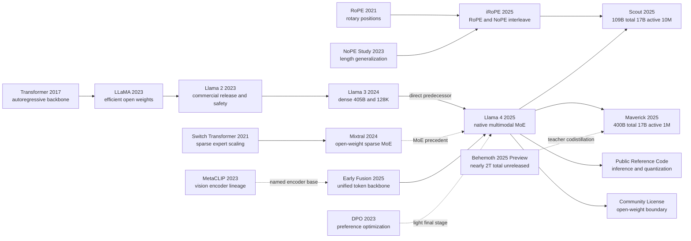

# Llama 4 - 原生多模态、稀疏专家与十百万上下文的开放权重实验

> **2025 年 4 月 5 日，Meta 用一篇官方发布公告、模型卡、参考实现和两套可下载 checkpoint，把 [Llama 4](https://ai.meta.com/blog/llama-4-multimodal-intelligence/) 推到公众面前：Scout 主打 109B total / 17B active 与 10M 上下文，Maverick 主打 400B total / 17B active 与更强通用能力，Behemoth 则只以未发布 teacher 身份出场。**
> 这套材料最值得读的地方，不是它让人第一次“相信”多模态 MoE 能做大，而是它把 2025 年开放权重模型的新边界一次性暴露出来：你已经能检查公共前向、量化路径、图像切块、许可与使用政策，却仍然拿不到一篇足以逐项复现训练与评测的正式技术报告。Llama 4 因而像一个时代的分水岭：**开放模型终于把系统 artifact 公开到了论文之外，但也第一次如此清楚地提醒读者，公开发布包并不自动等于可复现科学。**

## 一句话总结

Llama 4 不是一篇传统意义上的论文，而是一组必须拆开阅读的官方材料：Meta 在 2025 年 4 月 5 日同时发布公告、模型卡、参考实现与 Scout / Maverick 权重，公开宣称它们是原生多模态的自回归 MoE 系统，其中教学上可用 $\mathcal{L}_{AR}(\theta)=-\sum_t\log p_\theta(x_t\mid x_{<t})$ 描述基本 next-token 目标，用 $j^*=\arg\max_j(hW_r)_j$ 描述公开前向中的 top-1 expert 选择；Scout 走 109B total / 17B active / 10M 上下文路线，Maverick 走 400B total / 17B active / 1M 上下文路线，二者共同把 [LLaMA（2023）](2023_llama.md) 的开放权重传统，从文本 dense 模型推进到多模态、稀疏专家与超长上下文时代。

它真正重要的地方，是一边把可下载 checkpoint、模型卡和前向代码公开得比过去更彻底，一边又明确暴露出边界：没有正式 Llama 4 技术论文，没有完整架构表、训练 recipe、数据配比、蒸馏与在线 RL loss 权重，也没有能独立复做公告 headline 的统一 benchmark harness。换句话说，Llama 4 最值得记住的 lesson 不是“Meta 又放出了一代大模型”，而是 **open weights 已经足以让社区研究系统形态，却还不足以把这套系统当作 [LLaMA（2023）](2023_llama.md) 或 Llama 3 那样的可复现技术报告来阅读。**

---

## 历史背景

### 2025 年的开放权重模型卡在什么位置

2025 年 4 月 5 日，Meta 发布 Llama 4 Scout 与 Maverick 时，Llama 系列面对的已不是“开放权重模型能不能用”这个问题。2023 年的 LLaMA 把可下载权重带入大规模开发者生态，Llama 2 把商业使用与安全说明写进发布流程，2024 年的 Llama 3 则用 8B、70B、405B 模型族、15.6T 文本 token 和 128K 上下文，把开放权重推到可以同闭源前沿模型直接比较的位置。[Llama 3 技术报告](https://arxiv.org/abs/2407.21783)甚至公开了 dense Transformer 的架构表、数据配比、并行训练、后训练与推理工程。到 Llama 4，Meta 需要回答的是下一组更难的问题：开放权重能否原生处理图像，能否用稀疏激活承载更大的总容量，能否把上下文从 128K 推到百万乃至千万 token，同时仍给开发者可下载的模型。

官方发布选择同时改动三条轴。第一，Scout 与 Maverick 被定义为原生多模态模型，文本和视觉 token 通过 early fusion 进入统一主干；第二，Llama 系列旗舰从 Llama 3 的 dense 路线切换到 mixture-of-experts；第三，Scout 把标称最大上下文写成 10M。三个变化都很醒目，却也把验证难度一起推高：多模态数据如何混合、路由如何训练、十百万 token 的质量如何测，都需要比普通模型卡更细的证据。

### 从 Llama 3 的组合式多模态到 early fusion

Llama 3 报告已经包含图像、视频和语音实验，但它走的是组合式路线：以训练好的文本语言模型为中心，外接视觉编码器、cross-attention adapter、视频聚合器或语音 adapter。报告明确说这些多模态模型仍在开发，并未广泛发布。这个设计的优点是保护成熟的文本能力，也容易按模态增加组件；代价是模态之间的交互较晚发生，视觉能力更像接到文本模型上的扩展件，而不是模型从预训练开始形成的共同表征。

Llama 4 的官方叙事正面改写了这一点。Meta 说模型在预训练阶段便联合接触文本、图像与视频数据，视觉表示和文本 embedding 在统一 backbone 中处理。这里的“原生”并不意味着原始像素直接送进语言 Transformer：官方公告说明视觉编码器基于 MetaCLIP，并曾配合冻结的 Llama 单独训练以适配语言模型；开发者文档还公开了 336×336 图像切块、全局缩略块和图像特殊 token。真正的变化是融合位置提前了，视觉不再只是 Llama 3 报告末尾尚未发布的 adapter 实验，而成为 Scout 与 Maverick 已发布 checkpoint 的输入能力。

### 从 405B dense 到 17B active 的稀疏容量

Llama 3 405B 的工程选择曾很克制：主干采用 dense decoder-only Transformer，把复杂度主要放在数据、训练基础设施、后训练与安全系统。Llama 4 则第一次在 Llama 主线上采用 MoE。官方模型卡给出的数字刻意区分“总参数”和“激活参数”：Scout 为 109B total、17B activated、16 experts；Maverick 为 400B total、17B activated、128 experts。总参数描述模型存下多少容量，激活参数描述一个 token 前向时参与计算的参数规模，两者回答不同问题。

Meta 对 Maverick 的说明最具体：dense 层与 MoE 层交替，在一个 MoE 层里，每个 token 都进入 shared expert，同时只进入 128 个 routed experts 中的一个。官方参考实现与这段话一致，公开了 `top_k=1`、学习得到的 router matrix、top-k 选择、sigmoid 路由分数、共享专家与路由专家求和的前向路径。它仍没有公开训练路由器所需的完整损失、数据分布或稳定化方案。因而 Llama 4 能证明的是“这一稀疏前向已被发布并可检查”，不能证明外部团队仅凭公告就能复训同等模型。

### 从 128K 到 10M 的上下文竞赛

Llama 3 把上下文从最初的 8K 分阶段扩到 128K，并在报告中给出 continued pretraining 与检索评测。Llama 4 Scout 的标题数字直接跃到 10M，但官方材料留下了一条必须保留的限定：Scout 的预训练与后训练长度是 256K，10M 来自 length generalization，而不是把每个训练样本都拉到一千万 token。Meta 把相关结构称为 iRoPE，即在大多数使用 RoPE 的 attention 层之间穿插不使用位置编码的 attention 层，并在推理时调节 attention temperature。

更关键的限定来自当前开发者文档：最大上下文是在 512 张 GPU 上以 5D parallelism 评估的。发布公告同时说 INT4 Scout 可以放入一张 H100，这两句话经常被读成“一张 H100 跑 10M context”，官方文本并没有作出这种承诺。一张卡容纳量化权重和跨 512 张卡验证最大上下文属于两种不同实验。Llama 4 的长上下文突破因此既是结构与训练的进展，也是一次很好的阅读训练：上下文窗口是能力上限、质量曲线、显存、吞吐与硬件拓扑的联合命题，不能只看一个数字。

## 研究背景与动机

### 把“能看图”变成预训练本体

Llama 4 的第一层动机，是让文本与视觉能力不再分属两个后装系统。对文档理解、图表问答、多图比较和视觉 grounding 来说，晚接 adapter 可以有效，但模型的语言主干并未从一开始就在同一序列里学习两种模态的对应关系。early fusion 的目标，是把视觉表示投影到语言 hidden space，在自回归主干里同文本 token 一起处理，让多模态关系参与预训练本身。

官方参考实现把这个目标写得很直白：文本 token 先得到 embedding；图像经 vision encoder 得到表示，再线性投影到主干维度；对应 image mask 的位置由投影后的图像表示替换，然后整个序列通过同一组 Transformer blocks。这个机制足以解释“统一 backbone”，但没有告诉外部读者图文数据按什么比例采样、跨模态目标如何加权、视频帧如何进入训练批次，或 early fusion 相对 Llama 3 adapter 到底贡献了多少。方法动机可以讲清，因果收益仍缺少公开消融。

### 把总容量与每 token 计算解耦

第二层动机来自部署经济性。若继续按 dense 路线扩大模型，总参数、每 token 计算与权重存储大体一起增长。MoE 试图拆开前两者：模型可以保留许多专家参数，但每个 token 只激活共享专家和少数路由专家。Maverick 因而可以同时拥有 400B total 与 17B active 这两个数字。Meta 将其定位为比 Llama 3.3 70B 更低成本的通用助手，同时保留更大的参数容量。

这种解耦不是“把 400B 变成 17B”。所有专家权重仍需存放，路由还会引入通信、负载不均与服务编排问题。官方部署声明准确反映了这一点：Scout 经 INT4 量化后可放入一张 H100-80GB；Maverick 的 FP8 权重则是放入一台 H100 DGX host。Llama 4 想优化的是每个 token 的 active compute 与服务延迟，不是抹掉 109B 或 400B 权重的内存事实。

### 把长上下文从训练长度推向长度泛化

第三层动机不是单纯增加训练序列，而是追求从 256K 向更长输入泛化。Meta 给出的应用想象包括多文档总结、大型代码库分析和长时间用户活动的个性化处理。若每次扩大窗口都依赖同等长度的训练样本和完整 attention，数据构造与计算成本会迅速失控；iRoPE 与推理时 temperature scaling 因而被用来延伸位置行为。

这条路线最值得注意的地方恰恰是它没有解决什么。官方公告展示 retrieval needle-in-a-haystack 与长代码 cumulative NLL，却没有给出任意任务在 10M 长度上的稳定推理保证，也没有公开延迟、KV cache、不同 needle 位置、多模态长序列和真实代码仓库上的完整曲线。动机是把“窗口长度”从训练长度解耦，研究问题则转成：这种泛化在哪些任务、哪些位置和哪些硬件预算下仍然可信。

### 把开放权重做成生态入口而非完整复现

第四层动机延续 Llama 的开放权重路线。Scout 与 Maverick 的 base、instruct 和部分量化 checkpoint 可以通过 Meta 与官方 Hugging Face 页面获得，官方仓库提供推理、prompt format、图像预处理、MoE 和量化代码。开发者可以检查前向、做适配、蒸馏和部署；模型卡也披露训练 token、H100 GPU 小时、能耗估算、支持语言、安全策略与 benchmark 表。

但这不是完整开源科学。Llama 4 Community License 是定制商业许可，分发时有协议、署名、`Built with Llama` 和模型命名要求，对发布日之前一个月超过 7 亿月活的产品另设授权门槛；Acceptable Use Policy 还对用途以及欧盟主体获得多模态模型权利作出限制。更根本的是，公开材料没有完整数据清单、预训练代码、训练日志、optimizer recipe、RL 环境和可重跑的评测包。Llama 4 的历史位置因此带着张力：它确实把两款巨型多模态 MoE 权重交给外部世界，却没有把产生这些权重的科学过程一并交出。

### 一次没有 Llama 4 技术论文的技术发布

截至 2026 年 9 月 14 日，本笔记核对的 Meta 官方发布页、模型仓库、开发者文档、官方 Hugging Face 组织与研究页面中，没有找到 Llama 4 的同行评审论文或 arXiv 技术报告。可引用的核心文档是 2025 年 4 月 5 日的发布公告与模型卡。两者能确认模型状态与官方声明，却不具备 Llama 3 报告那样的完整方法章节、架构表、消融和附录。

这不是措辞细节，而是理解 Llama 4 的前提。Scout 和 Maverick 是已发布模型；Behemoth 在公告中是 288B active、近 2T total、16 experts 的 teacher，首发时仍在训练且明确未发布。截至证据截止日，官方 Hugging Face 组织没有 Behemoth checkpoint，官方仓库也没有独立的 Behemoth 模型卡。只能据此说“未验证到公开发布”，不能猜测 Meta 内部后来停止、继续或改名了该项目。Llama 4 的方法解读必须始终分开三类句子：官方公开了什么、官方声称了什么、公开证据仍无法回答什么。

---

## 方法详解

### 整体框架：先画证据边界，再画模型

Llama 4 没有技术论文，因而“方法详解”不能从一张未公开的架构表出发。最稳妥的读法是把系统拆成三层：模型卡确认 Scout 与 Maverick 的发布规格；官方参考实现确认推理前向如何融合图像、选择专家和处理位置；发布公告说明训练团队采用了哪些高层策略。只有前两层能落实到可检查的字段或代码，第三层仍缺少复现所需的目标、超参数和数据。

| 模型 | 公开状态（截至 2026-09-14） | 总参数 | 激活参数 / experts | 最大上下文 |
|---|---|---:|---|---:|
| Scout | 已发布 base / instruct 权重 | 109B | 17B / 16 | 10M |
| Maverick | 已发布 base / instruct / FP8 权重 | 400B | 17B / 128 | 1M |
| Behemoth | 仅预告 teacher；未核到公开 checkpoint | 近 2T | 288B / 16 | 未披露 |

下面的流程图只包含 Meta 官方材料明确出现的模块。它故意不写层数、hidden size、attention heads、专家容量或训练并行拓扑，因为这些值没有在本笔记核对的一手材料中完整公开。

```text
text tokens ----> token embeddings --------------------+
                                                       |
images -> tiled vision encoder -> projected embeddings +-> unified autoregressive backbone
                                                           |  interleaved dense / MoE FFN
                                                           |  shared expert + top-1 routed expert
                                                           |  RoPE / NoPE attention interleave
                                                           +-> multilingual text and code

Behemoth teacher (previewed, unreleased) --codistillation--> Maverick student
light SFT -> online RL with adaptive hard-prompt filtering -> light DPO
```

对任意自回归模型，都可以用 next-token negative log-likelihood 描述基本目标。**下式是教学抽象，不是 Meta 公布的 Llama 4 完整损失**；真实预训练还必须决定图文视频采样、蒸馏、路由与其他目标如何组合，而这些权重没有公开。

$$
\mathcal{L}_{\text{AR}}(\theta)=-\sum_{t=1}^{T}\log p_\theta(x_t\mid x_{<t}).
$$

| 证据层 | 能确认什么 | 不能推出什么 |
|---|---|---|
| 模型卡 | 参数量、模态、上下文、token 数、官方评测 | 完整训练 recipe 与独立复现 |
| 参考实现 | 图像投影、MoE 前向、iRoPE 推理路径 | 预训练代码等于公开推理代码 |
| 发布公告 | MetaP、FP8、共蒸馏、SFT→RL→DPO 的高层描述 | 未给出的公式、权重、超参数与消融 |
| 官方权重 | 可检查、微调、量化和部署的 checkpoint | 数据、训练日志和跨厂商评测条件 |

### 关键设计 1：early fusion 的原生多模态

Llama 4 的“原生”首先是融合位置的变化。Llama 3 的组合式实验把视觉 encoder 与 cross-attention adapter 接到已训练的文本模型上；Llama 4 则在预训练阶段联合使用文本、图像与视频数据，并把视觉表示送入统一的自回归 backbone。官方文档仍保留一个独立视觉前端：图像会动态切成 336×336 局部块，再附加一个缩放到 336×336 的全局块；视觉 encoder 基于 MetaCLIP，并经过与冻结 Llama 配合的单独适配训练。

公开推理代码给出了融合的最小可验证机制。设文本 embedding 为 $H_{text}$，投影后的视觉表示为 $P(V)$，图像位置 mask 为 $M$，那么代码行为可以写成：

$$
H_0=(1-M)\odot H_{text}+M\odot P(V),\qquad H_L=\operatorname{Backbone}(H_0).
$$

这不是说像素与文字“没有边界”，而是二者在进入主干后共享 hidden-state 序列。下面的伪代码按官方 `model.py` 的公开前向重写，变量名与注释为本文整理，不是 Meta 训练代码；中英版保持完全相同，便于核对。

```python
def fuse_public_inference_path(token_ids, image_states, image_mask, model):
    hidden = model.token_embeddings(token_ids)
    if image_states is not None:
        projected = model.vision_projection(image_states)
        hidden = hidden * (~image_mask) + projected * image_mask
    for block in model.transformer_blocks:
        hidden = block(hidden)
    return model.output_head(model.final_norm(hidden))
```

| 路线 | 融合位置 | 优点 | 公开证据中的代价 |
|---|---|---|---|
| Llama 3 组合式 adapter | 文本模型外接 cross-attention | 保护成熟文本主干，模块可替换 | 多模态模型未广泛发布 |
| Llama 4 early fusion | 视觉表示进入共享 token 序列 | 主干可反复进行跨模态交互 | 模态配比与消融未公开 |
| 纯像素到文本主干 | 无独立视觉 encoder | 概念上最统一 | Llama 4 并未声称采用此路线 |

设计动机来自产品输入，而非一项单独的视觉 benchmark。文档、图表、照片和多图对话都需要模型在生成文字前反复对齐局部视觉证据与上下文。early fusion 提供了这种交互位置。可是没有公开消融，就不能把 Scout/Maverick 的全部视觉增益归因于 early fusion：视觉数据规模、MetaCLIP encoder、后训练 curriculum 与模型容量都可能贡献结果。

### 关键设计 2：共享专家加 top-1 路由专家

MoE 的核心不是“模型只有 17B 参数”，而是一个 token 只激活约 17B 参数对应的计算路径。以 Maverick 为例，模型持有 400B 总参数和 128 个 routed experts；官方公告说 dense 与 MoE 层交替，每个 token 在 MoE 层中总会经过 shared expert，并额外进入一个 routed expert。Scout 的总池更小，为 109B 与 16 experts，但官方模型卡同样给出 17B activated。

官方参考实现允许把前向写得更精确。对 hidden state $h$，router matrix $W_r$ 产生分数，选择一个 routed expert，再将共享路径与路由路径相加。由于公开代码先用 sigmoid 分数缩放 routed expert 的输入，下面的式子贴近这段推理实现：

$$
j^*=\arg\max_j (hW_r)_j,\qquad y=E_{shared}(h)+E_{j^*}\!\left(\sigma((hW_r)_{j^*})h\right).
$$

```python
def public_top1_moe(hidden, router_weight, shared_expert, routed_experts):
    scores = hidden @ router_weight
    expert_id = scores.argmax(dim=-1)
    gate = scores.gather(-1, expert_id[..., None]).sigmoid()
    shared_output = shared_expert(hidden)
    routed_output = dispatch_top1(gate * hidden, expert_id, routed_experts)
    return shared_output + routed_output
```

| 方案 | 总容量 | 每 token 路径 | 主要收益 | 主要代价 |
|---|---:|---|---|---|
| Llama 3 405B dense | 405B | 同一 dense FFN | 路径规则、训练成熟 | 激活计算随总容量增长 |
| Scout MoE | 109B | shared + 1/16 routed | 17B active，较易部署 | 全部权重仍需存储 |
| Maverick MoE | 400B | shared + 1/128 routed | 17B active，容量更大 | 路由、通信与主机内存更复杂 |
| 所有 experts 全激活 | 109B/400B | shared + all routed | 不存在路由选择 | 这不是 Llama 4 的公开设计 |

共享专家给每个 token 一条共同路径，路由专家则提供条件容量。反直觉点在于：**激活参数减少的是算术，不是权重文件**。这正是官方部署措辞为何不同：INT4 Scout 可装入一张 H100-80GB，而 FP8 Maverick装入的是一台 H100 DGX host。17B active 不能用来宣称 400B 权重只占 17B 模型的显存。

训练层面仍有关键空白。参考实现暴露了 `capacity_factor`、expert dispatch 和 router，但官方材料没有给出实际训练配置、负载均衡损失、expert collapse 监控、丢 token 策略或不同模态的专家使用分布。尤其在 early fusion 下，图像 token 与文本 token 是否路由到不同专家，是一个可以实验的问题，不是可以从 `top_k=1` 推出来的事实。

### 关键设计 3：iRoPE 与训练长度之外的上下文

Scout 的 10M 上下文建立在 256K 预训练和后训练长度之上，因此核心问题是长度泛化。Meta 把方案称为 iRoPE：大多数 attention 层采用 RoPE，按间隔插入不使用位置编码的 NoPE 层，并只对 NoPE 层在推理时放大 query。公开 `ModelArgs` 为这一调节给出默认 `floor_scale=8192` 与 `attn_scale=0.1`。若位置为 $p$，公开代码的缩放可写为：

$$
a(p)=1+\alpha\log\!\left(\left\lfloor\frac{p+1}{f}\right\rfloor+1\right),\qquad q'_p=a(p)q_p,\quad f=8192,\ \alpha=0.1.
$$

```python
def public_irope_attention(query, position, uses_rope, tune_temperature):
    if uses_rope:
        return apply_rotary_embedding(query, position)
    if tune_temperature:
        scale = 1.0 + 0.1 * log(floor((position + 1.0) / 8192.0) + 1.0)
        query = query * scale
    return query
```

| 声明 | 官方材料能确认 | 必须保留的限定 | 未公开部分 |
|---|---|---|---|
| Scout 训练长度 | 预训练与后训练为 256K | 不是 10M 训练序列 | 长度 curriculum 细节 |
| Scout 最大窗口 | 10M | 来自长度泛化 | 任意任务质量保证 |
| iRoPE | RoPE/NoPE 交错 + 推理温度调节 | 参考实现可检查 | 完整消融与最优间隔 |
| 评测硬件 | 512 GPUs、5D parallelism | 不等于单 H100 跑 10M | 延迟、KV cache 与吞吐曲线 |

常规全注意力的 score matrix 随长度呈 $O(n^2)$ 增长；位置编码改动并不会自动消除这一成本。官方参考实现还存在可配置的 chunked local attention，但公开材料没有给出足够信息把它、5D parallelism 与 10M 评测拼成完整复现方案。Meta 展示 needle retrieval 和长代码 cumulative NLL，只能说明所测设置下的检索或概率行为；它不等于十百万 token 上所有推理、多模态关联与远距离因果都稳定。

### 关键设计 4：Behemoth 共蒸馏与后训练重心迁移

Maverick 的另一条容量来源不是在线调用 Behemoth，而是预训练期共蒸馏。Meta 说未发布的 Behemoth teacher 有近 2T 总参数、288B 激活参数和 16 experts；Maverick 在预训练中同时学习 hard targets 与 teacher soft targets，动态调整二者权重。对新增 student 数据，团队再运行 teacher 生成蒸馏目标；对共同训练数据，共蒸馏把昂贵 teacher 前向摊进训练过程。

下面只是一种解释“动态权衡 hard/soft targets”的通用数学形式。**Meta 没有公开真实蒸馏公式或 $\lambda(t)$ 日程，不能把此式当作 Llama 4 loss。**

$$
\mathcal{L}_{distill}=\lambda(t)\operatorname{CE}(y,p_\theta)+(1-\lambda(t))\tau^2\operatorname{KL}(q_\phi^{(\tau)}\Vert p_\theta^{(\tau)}).
$$

后训练则把能力提升重心从厚重的 SFT/DPO 移到在线 RL。公告给出的顺序是 lightweight SFT → online RL → lightweight DPO。Meta 说过多容易样本与过强 SFT/DPO 会限制 RL 探索，因此先用 Llama judge 标难度，删掉超过 50% 的 easy 数据，再以 harder set 做轻 SFT；在线 RL 期间交替训练 policy 与过滤 prompt，只保留中高难度项；最后用轻 DPO 修理回复质量边角。

```python
def disclosed_post_training_shape(candidate_prompts, policy, judge):
    hard_prompts = [p for p in candidate_prompts if judge.difficulty(p) != "easy"]
    policy = lightweight_sft(policy, hard_prompts)
    while not training_budget_exhausted():
        medium_hard = adaptive_filter(policy, candidate_prompts)
        policy = online_rl(policy, medium_hard)
    return lightweight_dpo(policy, corner_case_preferences())
```

| 阶段 | 公告披露的作用 | 披露的数据操作 | 未披露的关键项 |
|---|---|---|---|
| 共蒸馏 | Behemoth 教 Maverick | hard/soft target 动态加权 | loss 公式、温度、权重日程 |
| 轻 SFT | 建立初始行为 | 删除超过 50% easy 数据 | 样本量、训练步数、学习率 |
| 在线 RL | 提升推理、代码、数学与多模态 | 持续筛中高难 prompt | reward、环境、算法和算力 |
| 轻 DPO | 修复回复质量边角 | corner-case preferences | beta、数据构成与单项增益 |

Behemoth 的地位必须在方法图里画成 teacher，而不是已发布的第三款产品。首发时它仍在训练且没有开放权重；截至证据截止日，也未在核对的 Meta 官方模型组织中出现 checkpoint。Maverick 是它留下的可下载产物之一，但外部研究者无法直接检查 teacher、重复 soft-target 生成或量化 teacher 对 student 的净贡献。

### 训练、评测与发布配方：已知和未知同样重要

模型卡说 Scout 预训练约 40T 多模态 token，Maverick 约 22T，数据来自公开可得资料、授权数据和 Meta 产品与服务信息，包括公开分享的 Instagram/Facebook 内容及人与 Meta AI 的交互；知识截止为 2024 年 8 月。公告说整体 mixture 超过 30T，覆盖文本、图像与视频，并在 200 种语言上预训练。两个单模型 token 数不能相加成“62T 唯一语料”，因为它们描述各自训练消费量，可能共享数据并重复经过样本。

| 维度 | Scout | Maverick | 证据边界 |
|---|---|---|---|
| 预训练 token | 约 40T | 约 22T | 多模态总量；完整配比未公开 |
| 支持语言 | 12 种 | 12 种 | 预训练 200 种不等于产品支持 |
| 图像输入 | 当前文档测试至 5 张 | 当前文档测试至 5 张 | 公告另述预训练至 48、后训练良好至 8 |
| 训练 GPU 小时 | 5.0M H100-80GB | 2.38M H100-80GB | 模型卡累计值，不给训练拓扑 |
| 发布精度 | BF16；可在线 INT4 | BF16 与 FP8 | 官方 benchmark 全在 BF16 上跑 |
| 安全 | 模型级 tuning + Llama Guard 等系统保护 | 同左 | 开发者仍需场景化测试 |
| 完整复现 | 不可 | 不可 | 缺数据、训练代码、日志与完整 eval harness |

Meta 还把 MetaP 描述为可跨 batch size、宽度、深度和训练 token 迁移逐层学习率与初始化尺度的技术，并报告用 FP8 在 32K GPU 上训练 Behemoth时达到 390 TFLOPs/GPU。前者没有公开到可实现的算法，后者是未发布 teacher 的基础设施指标；都不应被改写成 Scout/Maverick 的完整超参数表。

安全训练与发布同样是系统的一部分。模型卡描述 human-generated 与 synthetic safety data、对 borderline/adversarial prompt 的调优，以及减少无害请求误拒和说教式语气的目标；部署侧继续推荐 Llama Guard、Prompt Guard 与 Code Shield。可下载权重让开发者能自定义边界，也把应用测试、许可遵循与防护责任更多交给部署方。Llama 4 的方法贡献因此不是一条可复制配方，而是一个公开了部分关键前向、部分训练策略和完整权重，却保留了决定性训练细节的工业系统。

---

## 失败案例

### 没有论文消融时，“失败”究竟指什么

Llama 4 的官方材料没有一章叫 Experiments，也没有公开同一模型、同一数据、只改一个组件的 ablation。因而本节不能声称“early fusion 比 adapter 高 N 点”或“iRoPE 比 RoPE 高 N 点”。可核对的失败证据只有两类：一类是 Llama 4 明确替换了 Llama 3 的已公开路线；另一类是 Meta 在发布公告中直接写出的训练负面经验。前者说明新一代为什么选择另一条路，不等于旧方法在所有场景都失败；后者仍是开发方自报结论，缺少完整表格与独立复现。

这种限制反而能过滤掉大模型发布中最常见的叙事偷换。若一个系统同时更换数据、容量、架构、视觉 encoder、后训练和评测协议，那么新模型分数更高不能自动成为某个模块的因果证据。Llama 4 的失败案例必须写成“这条路线无法满足新目标”或“Meta 报告它在自己的训练中带来负面效果”，而不是给未公开实验补数字。

### 失败路线 1：把多模态留给末端 adapter

Llama 3 的组合式多模态不是一个糟糕 baseline。它通过视觉 encoder 与 cross-attention adapter 给成熟文本模型增加图像、视频和语音能力，能减少重训主干的风险。真正的问题是，这套多模态系统在 Llama 3 报告中仍处于开发状态，没有广泛发布；视觉与文本的共同学习也主要发生在后接模块，而不是从预训练一开始贯穿共享 backbone。

Llama 4 对这条路线的反 baseline 是 early fusion：文本、图像和视频进入预训练混合，视觉表示被投影进统一 token 序列，Scout 与 Maverick 直接以多模态 checkpoint 发布。它解决的是“多模态是不是产品本体”而非单项视觉分数。可惜 Meta 没有公开同尺寸、同数据、同后训练的 adapter-vs-early-fusion 消融，因此不能知道视觉 encoder、数据规模、统一主干和 curriculum 分别贡献多少。这里输掉的是 Llama 3 的发布形态，不是 adapter 作为通用技术的有效性。

### 失败路线 2：总容量增加，所有参数都随 token 激活

第二条被替换路线是 dense scaling。Llama 3 405B 用 dense 主干换取训练稳定与架构简单，但每个 token 都经过相同前馈网络，活跃计算与总参数一同增长。对于可下载权重，训练成功只是第一步；外部部署还要承担显存、带宽、并行与每 token 成本。继续把 dense 模型从 405B 往上推，不能回答“如何让更多人真正服务它”。

Llama 4 用 shared expert 加 top-1 routed expert，把 total capacity 与 active compute 拆开。Maverick 有 400B 总参数，却报告 17B 激活；Scout 有 109B 总参数，同样报告 17B 激活。这条路线也不是免费午餐：全量权重仍要存储，路由与专家并行增加通信复杂度，Maverick 的官方说法是 FP8 权重放进一台 H100 DGX host，而不是一张 H100。Llama 4 证明了稀疏前向已发布，却没有公开 dense 与 MoE 在同等训练 FLOPs、数据和服务硬件下的完整成本曲线。

### 失败路线 3：用大量容易数据做厚重 SFT 和 DPO

这是官方公告中最明确的负面训练经验。Meta 说 Maverick 后训练的难点，是同时保持多模态、推理与对话能力；团队发现 SFT 与 DPO 会“over-constrain”模型，限制后续在线 RL 的探索，令推理、代码和数学准确率次优。它们因而用 Llama judge 标记难度，删掉超过 50% 的 easy 数据，只在剩余 harder set 上做轻量 SFT，把主要能力提升放到持续筛选中高难 prompt 的在线 RL，最后再用轻量 DPO 修正回复质量边角。

Behemoth 的自报经验更激进：Meta 说为这个近 2T 总参数 teacher 剪掉 95% 的 SFT 数据，采用轻 SFT 加大规模 RL，并用 pass@k 选难题、过滤 zero-advantage prompt、混合不同能力的 batch 与多样 system instructions。这里真正失败的 baseline 不是 SFT 或 DPO 本身，而是“数据越多、监督越强，后训练就越好”。但公告没有给删除前后的分数、训练预算、reward 定义或统计方差；我们能记录方向，不能重建效果量。

### 失败路线 4：把最大上下文当成单一能力数字

Scout 的 10M 很容易制造一个错误 baseline：只要模型接受一千万 token，就等于它能在任何一千万 token 任务上稳定推理。官方材料实际给出更窄的证据。Scout 在 256K 长度上完成预训练与后训练，借 iRoPE 和推理时 attention temperature scaling 做长度泛化；公告提到文本 needle retrieval 与长代码 cumulative NLL；当前开发者文档注明最大上下文评测跨 512 张 GPU、使用 5D parallelism。

因此，“普通 RoPE 直接把 `max_seq_len` 改成 10M”不是被论文表格击败的 baseline，而是 Llama 4 设计主动避开的朴素假设。最大可接受长度、远距离检索、全局推理、多模态对应、吞吐、首 token 延迟和 KV cache 是不同指标。Meta 没有公开这些维度的完整联合曲线。10M 应读成官方验证过的最大窗口声明，而不是单卡部署承诺或任务无关的质量保证。

### 真正的反 baseline 教训：不要把发布页读成控制实验

Llama 4 最有价值的失败教训来自证据结构本身。发布公告把 MoE、early fusion、iRoPE、MetaP、FP8、共蒸馏和在线 RL 放进同一个成功故事；模型卡再给出一组强结果。若把两者拼起来，读者很容易误以为每个组件都经过逐项验证。实际公开材料没有提供这种因果分解。

| 被替换或质疑的路线 | Llama 4 的选择 | 官方证据 | 仍未回答的问题 |
|---|---|---|---|
| Llama 3 组合式 adapter | early-fusion 原生多模态 | 已发布多模态权重与公开前向 | 同条件组件消融 |
| 405B dense 全激活 | shared + top-1 routed expert | 17B active / 109B 或 400B total | 同预算质量、通信和延迟曲线 |
| 厚重 SFT/DPO + easy data | 轻 SFT → 在线 RL → 轻 DPO | Meta 自报删 >50% easy data | reward、预算、前后分数 |
| 训练长度等于最大窗口 | 256K 训练后外推到 10M | iRoPE、检索/NLL 与 512-GPU 注脚 | 全任务质量与部署成本 |

工程哲学可以浓缩为一句：**把“可下载的前向”与“可复现的训练”分开，把“官方测得”与“独立成立”分开。** Scout 与 Maverick 权重是真实开放给外界的研究对象，但没有完整训练与评测包，就不该为架构营销补上实验因果链。

## 实验关键数据

### 评测契约：只复录官方 BF16 模型卡

下面的数据全部来自 Meta 官方 Llama 4 model card。模型卡明确说，虽然官方提供量化 checkpoint，但所有报告的 evaluations and testing 都在 BF16 模型上进行。因而表中数值不能直接用于证明 Scout INT4 或 Maverick FP8 与 BF16 完全等质。预训练表的前代列是 Llama 3.1 70B/405B；instruction-tuned 表则是 Llama 3.3 70B 与 Llama 3.1 405B。两张表的 shots 与 metric 也不同，不能把同名 benchmark 横向混算。

Meta 发布公告还宣称 Maverick 在一系列公开 benchmark 上超过 GPT-4o 与 Gemini 2.0 Flash、与 DeepSeek-V3 的推理和代码能力相近，并给一个“experimental chat version”报出 LMArena ELO 1417；Behemoth 则被宣称在若干 STEM benchmark 超过 GPT-4.5、Claude 3.7 Sonnet 与 Gemini 2.0 Pro。本笔记不把这些句子并入下表：官方材料没有提供完整统一 harness，而且 experimental arena 版本未被证明与可下载 Maverick checkpoint 完全相同，Behemoth更没有公开权重可复验。

### 预训练模型结果

| Benchmark（shots / metric） | Llama 3.1 70B | Llama 3.1 405B | Llama 4 Scout | Llama 4 Maverick |
|---|---:|---:|---:|---:|
| MMLU（5 / macro avg acc char） | 79.3 | 85.2 | 79.6 | **85.5** |
| MMLU-Pro（5 / macro avg EM） | 53.8 | 61.6 | 58.2 | **62.9** |
| MATH（4 / EM maj1@1） | 41.6 | 53.5 | 50.3 | **61.2** |
| MBPP（3 / pass@1） | 66.4 | 74.4 | 67.8 | **77.6** |
| TyDiQA（1 / average F1） | 29.9 | **34.3** | 31.5 | 31.7 |
| ChartQA（0 / relaxed accuracy） | 无多模态支持 | 无多模态支持 | 83.4 | **85.3** |
| DocVQA（0 / ANLS） | 无多模态支持 | 无多模态支持 | 89.4 | **91.6** |

表格给出的能力轮廓比“一代全面碾压一代”复杂。Maverick 在 MMLU、MMLU-Pro、MATH 与 MBPP 上小幅到明显超过 Llama 3.1 405B，尤其 MATH 从 53.5 到 61.2；Scout 相比 Llama 3.1 70B，在 MMLU 只从 79.3 到 79.6、MBPP 从 66.4 到 67.8，却在 MMLU-Pro 从 53.8 到 58.2。TyDiQA 上两款 Llama 4 都低于 Llama 3.1 405B 的 34.3。新结构扩大了能力面，但官方自己的表也保留了非单调结果。

### Instruction-tuned 模型结果

| Benchmark（shots / metric） | Llama 3.3 70B | Llama 3.1 405B | Llama 4 Scout | Llama 4 Maverick |
|---|---:|---:|---:|---:|
| MMMU（0 / accuracy） | 无多模态支持 | 无多模态支持 | 69.4 | **73.4** |
| MMMU-Pro（0 / accuracy） | 无多模态支持 | 无多模态支持 | 52.2 | **59.6** |
| MathVista（0 / accuracy） | 无多模态支持 | 无多模态支持 | 70.7 | **73.7** |
| ChartQA（0 / relaxed accuracy） | 无多模态支持 | 无多模态支持 | 88.8 | **90.0** |
| DocVQA test（0 / ANLS） | 无多模态支持 | 无多模态支持 | **94.4** | **94.4** |
| LiveCodeBench 2024-10-01→2025-02-01（0 / pass@1） | 33.3 | 27.7 | 32.8 | **43.4** |
| MMLU-Pro（0 / macro avg accuracy） | 68.9 | 73.4 | 74.3 | **80.5** |
| GPQA Diamond（0 / accuracy） | 50.5 | 49.0 | 57.2 | **69.8** |
| MGSM（0 / average EM） | 91.1 | 91.6 | 90.6 | **92.3** |

这张表最能体现 Maverick 的通用主力定位：LiveCodeBench 为 43.4，较列出的三个 Llama baseline 至少高 10.1 点；MMLU-Pro 为 80.5；GPQA Diamond 为 69.8。Scout 的情况再次不完全单调：GPQA Diamond 的 57.2 高于两款前代，MMLU-Pro 的 74.3 略高于 405B 的 73.4，但 LiveCodeBench 32.8 略低于 Llama 3.3 70B 的 33.3，MGSM 90.6 也低于 91.1/91.6。DocVQA 上 Scout 与 Maverick 同为 94.4，说明更大总容量没有在该行产生可见增益。

### 长上下文、资源与量化边界

| 项目 | Scout | Maverick | 如何解读 |
|---|---|---|---|
| 最大上下文 | 10M | 1M | 官方上限；上下文评测跨 512 GPUs |
| 实际训练长度披露 | 256K 预训练与后训练 | 未在公告中同样展开 | Scout 的 10M 依赖长度泛化 |
| MTOB half-book chrF（eng→kgv / kgv→eng） | 42.2 / 36.6 | **54.0 / 46.4** | 前代列只注明 128K，无可比数字 |
| MTOB full-book chrF（eng→kgv / kgv→eng） | 39.7 / 36.3 | **50.8 / 46.7** | 最大窗口不自动带来最高任务分数 |
| 预训练 GPU 小时 | 5.0M H100-80GB | 2.38M H100-80GB | 模型卡累计为 7.38M 小时 |
| 位置排放估算 | 1,354 tCO2e | 645 tCO2e | Meta 报告合计 1,999；市场法为 0 |
| 官方量化发布 | BF16；在线 INT4 可单 H100 | BF16 + FP8；FP8 可单 DGX host | benchmark 数值均来自 BF16 |

训练 GPU 小时看起来反直觉：总参数较小的 Scout 报告 5.0M，Maverick 为 2.38M。官方材料没有给出足够训练拓扑和阶段明细来解释差异，不能简单按参数量估算成本。排放表也需要保留口径：1,999 tCO2e 是 location-based 估算；Meta 以清洁与可再生电力匹配为由，将 market-based 排放写成 0。两种数值回答不同核算问题。

### 关键发现与没有被证明的结论

- **原生多模态确实进入发布物。** 前代 Llama 3 列在视觉 benchmark 中是“无多模态支持”，Scout 与 Maverick 则有 MMMU、MathVista、ChartQA 与 DocVQA 数值；这证明比较对象的能力接口发生变化，不单独证明 early fusion 的净贡献。
- **Maverick 的 400B 总容量在多项官方表格中转化为更强结果。** MATH 61.2、LiveCodeBench 43.4、MMLU-Pro 80.5 与 GPQA Diamond 69.8 都高于同表前代，但测试由 Meta 运行且缺少完整外部复现包。
- **Scout 不是缩小版 Maverick。** 它的独特目标是 10M 上下文与单 H100 INT4 部署；在常规 benchmark 上有提升、持平和回退，符合分支定位而非全面升级叙事。
- **active parameters 不是内存指标。** 17B active 描述逐 token 路径，109B/400B total 描述必须存放的容量；官方单 GPU 与单 host 的不同措辞正好验证这一区分。
- **量化质量没有被这些表直接验证。** 所有表格来自 BF16，不能把数值原封不动贴到 INT4 Scout 或 FP8 Maverick。
- **Behemoth 的 benchmark 仍是不可复验预告。** 首发时模型仍在训练、权重未发布；截至截止日也未核到官方 checkpoint，因此它适合出现在 teacher 与未决问题中，不适合作为已发布实验行。

---

## 思想史脉络

### 一张证据图，而不是虚构的引用图

Llama 4 没有正式技术论文，也就没有一份可以逐条追踪 bibliography 与 citations 的论文引用网络。下面这张图改画“官方材料能验证的技术血缘”：左侧是原始论文与 Llama 3 前代报告，中间是 Llama 4 发布所组合的四条技术线，右侧是 Meta 在 2025 年 4 月 5 日实际发布或预告的对象。实线表示直接的公开继承或发布关系，虚线表示 Meta 命名的组件来源、对照路线或未发布 teacher 关系。



这张图刻意没有从 Llama 4 画向某篇后来论文。不是因为它没有生态影响，而是因为截至证据截止日，本笔记只用官方一手材料与原始技术论文，不能用二手盘点替 Llama 4 构造学术引用。对一个没有正式论文的工业发布来说，权重、参考实现、模型卡与许可本身就是最先发生的“今生”。

### 前世：五条线在 2025 年汇合

**第一条是 LLaMA 模型族。** [LLaMA（2023）](https://arxiv.org/abs/2302.13971)确立“小于同代旗舰、训练 token 更多、权重可供研究”的路线；[Llama 2（2023）](https://arxiv.org/abs/2307.09288)加入 chat 后训练、安全评测与更广商业许可；[Llama 3（2024）](https://arxiv.org/abs/2407.21783)把模型族推到 405B dense、15.6T 文本 token 与 128K。Llama 4 继承“herd”和开放权重生态，却把 dense、文本优先与 adapter 式多模态同时改写。

**第二条是稀疏专家。** [Switch Transformer（2021）](https://arxiv.org/abs/2101.03961)展示 top-1 expert routing 如何扩大模型容量，[Mixtral（2024）](https://arxiv.org/abs/2401.04088)则把稀疏 MoE 带进强开放权重模型。它们是 Llama 4 采用 shared expert 与 routed expert 的技术先例，不是 Llama 4 未披露实现的替身。特别是 Llama 4 公共前向使用 shared path、top-1 选择和 sigmoid gate，不能仅凭“都是 MoE”就把其他模型的 auxiliary loss 或并行方案复制过来。

**第三条是视觉表示。** [MetaCLIP（2023）](https://arxiv.org/abs/2309.16671)是公告点名的 vision encoder 基础。Llama 4 没有取消视觉 encoder，而是把其输出投影到统一 hidden sequence；这条线解释了 early fusion 的输入从哪里来，也纠正了“原生多模态等于没有模态前端”的误读。

**第四条是位置与长度泛化。** [RoPE（2021）](https://arxiv.org/abs/2104.09864)提供大多数层的旋转位置编码，[NoPE 长度泛化研究（2023）](https://arxiv.org/abs/2305.19466)是 Meta 在 iRoPE 描述中直接链接的另一半。Scout 将 RoPE 层与 NoPE 层交错，再在 NoPE 层做推理时 query temperature tuning。这个组合指向 10M 窗口，但没有公开消融来证明每一半的单独收益。

**第五条是偏好优化与 teacher-student 训练。** [DPO（2023）](https://arxiv.org/abs/2305.18290)被保留为轻量收尾，而能力提升重心转向在线 RL；Behemoth 则以未发布 teacher 身份在预训练期共蒸馏 Maverick。Meta 说 hard/soft target 动态加权，却未发表对应 loss。思想关系可以确认，算法细节仍停在边界外。

| 前序节点 | Llama 4 继承什么 | Llama 4 改写什么 | 证据限制 |
|---|---|---|---|
| LLaMA / Llama 2 | 开放权重模型族与商业生态 | 原生多模态输入 | 许可仍是定制条款 |
| Llama 3 | herd、后训练、安全与长上下文 | dense→MoE，adapter→early fusion，128K→10M | 不可把 Llama 3 参数表套到 Llama 4 |
| Switch / Mixtral | 稀疏专家的 active-compute 思想 | shared + top-1 routed public path | 完整 router 训练未披露 |
| MetaCLIP | 视觉 encoder 起点 | 投影进统一 backbone | 视觉数据与消融未披露 |
| RoPE / NoPE study | 位置编码与长度泛化 | iRoPE + inference temperature | 10M 全任务曲线未披露 |
| DPO / distillation | preference 与 teacher-student 学习 | light DPO、Behemoth→Maverick 共蒸馏 | reward 与蒸馏 loss 未披露 |

### 今生：先继承为模型、代码、接口和许可

Llama 4 最直接的继承物是两套已发布权重。Scout 把 109B 总容量、17B 激活、16 experts 与 10M 最大上下文组合成极长输入分支；Maverick 把 400B 总容量、17B 激活、128 experts 与 1M 上下文组合成通用能力分支。它们各有 base 与 instruct 版本，Maverick 另有官方 FP8 变体。这个家族结构继承 Llama 3 的“不同预算对应不同模型”，但不再用单纯参数规模排列角色。

第二个继承物是公开前向。`meta-llama/llama-models` 中的 Llama 4 代码让外部读者可以检查 image mask 替换、vision projection、shared expert、top-1 router、RoPE/NoPE 交错、temperature tuning、chunked attention 接口和量化路径。它不是预训练框架，却比只有 API 的闭源模型多出一个可研究的结构层。围绕 Transformers、vLLM、云和芯片的适配，首先继承的正是这些稳定接口。

第三个继承物是 prompt 与安全契约。开发者文档规定 text、image、assistant 与 tool 输出如何进入 token stream，模型卡要求把 Llama Guard、Prompt Guard、Code Shield 等系统保护与模型一起部署。第四个继承物是法律边界：Community License 允许广泛使用、修改和衍生，同时通过 `Built with Llama`、命名、700M MAU 与 AUP 条款保留控制。这说明现代模型的“后继”不只是一篇引用论文，也可以是部署接口与许可塑造出来的生态惯例。

Behemoth 则是缺席的今生。它在图中用虚线指向 Maverick，因为官方只验证 teacher 关系，没有验证公开产品关系。首发时它仍在训练且明确未发布；截止日没有核到官方 checkpoint。Maverick 让外界间接接触到 teacher 的蒸馏影响，却无法让外界检查 teacher 本身。这个不对称关系会成为 Llama 4 可复现性争议的长期坐标。

### 误读：四种过度简化

**误读一：“17B 模型击败 400B 模型。”** Scout 与 Maverick 的 17B 是 activated parameters，不是权重总量。Maverick 仍需存放约 400B 参数；稀疏路由减少每 token 计算，不会把 checkpoint 变成普通 17B dense 模型。

**误读二：“原生多模态表示没有视觉 encoder。”** 官方公告明确说 vision encoder 基于 MetaCLIP，开发者文档也描述图像切块。原生指视觉表示从早期融合进入统一主干并参与多模态预训练，不是取消视觉前端。

**误读三：“Scout 在一张 H100 上跑 10M token。”** 官方说 INT4 权重可放一张 H100，同时又说最大上下文在 512 GPUs 上以 5D parallelism 评估。两项能力不能合并成单卡十百万上下文承诺。

**误读四：“Llama 4 已发布 Behemoth。”** Meta 只预告其近 2T total、288B active、16 experts，并称首发时仍在训练；官方可下载物是 Scout 与 Maverick。截止日未核到 Behemoth checkpoint，只能说无可验证公开发布，不能进一步宣判其内部命运。

### 这张图拒绝声称什么

图中没有“Llama 4 paper”节点，因为不存在经核实的官方技术论文；没有从 Behemoth 指向公开 checkpoint 的实线，因为不存在经核实的发布物；没有把 10M 连到“一张 H100”，因为官方硬件脚注不支持；也没有把 MetaP 画成完整算法祖先，因为首发公告只描述其目标，没有足够公式与实现。

同理，图没有列十篇看似整齐的后续论文。Llama 4 的影响当然会扩散，但本任务要求以官方原始材料为中心，并排除汇编公开信息的第三方文章。在这种证据政策下，少画一条未经验证的边，比把生态热度包装成学术引用更准确。Llama 4 的思想史目前是一张“发布驱动的开放权重系统图”，未来若 Meta 发布正式报告或明确后继，才适合补成传统论文引用图。

---

## 当代视角（2026 年回看 2025）

### 站不住的假设

- **“开放权重就等于开放科学。”** Llama 4 把 Scout 与 Maverick 权重、模型卡、参考实现和开发者文档都放到了公开面前，但这仍不足以构成一篇可复现论文。`r0_context` 已明确列出缺口：没有完整架构表、没有 optimizer 与 batch 细节、没有数据配比与 loss 权重、也没有能重做跨厂商对比的统一 harness。到 2026 年回看，Llama 4 最该纠正的不是“闭源”，而是把 **open weights** 与 **reproducible science** 混成一句话。
- **“一个最大上下文数字就能概括长上下文能力。”** Scout 的 10M headline 最容易被过度解读。官方材料真正给出的证据是：Scout 在 256K 长度上完成预训练与后训练，依靠 iRoPE 与推理时 query temperature scaling 外推；最大上下文评测跨 512 张 GPU、采用 5D parallelism。它说明 Meta 验证过一个超长窗口，不说明单卡部署、全任务质量、延迟和检索稳定性已经一并成立。
- **“17B active 就意味着 17B 级部署成本。”** Llama 4 把 active parameters 与 total parameters 的差异公开得很直白，却也最容易让读者忽略。Scout 是 109B total / 17B active，Maverick 是 400B total / 17B active。减少的是每 token 的激活计算，不是 checkpoint 的存储体量；这正是为什么官方一边说 Scout 的在线 INT4 可放一张 H100，一边又说 Maverick 的 FP8 需要一台 H100 DGX host。
- **“原生多模态就是取消视觉前端。”** 官方公告与开发者文档都没有这么说。Llama 4 仍保留基于 MetaCLIP 的视觉 encoder、图像分块与投影层；“原生”指的是视觉 token 进入统一 backbone，并在预训练与后训练阶段持续参与，而不是把像素直接无前端地塞进语言模型。

### 时代证明的关键 vs 误导性的表述

- **真正关键的，是可检查的前向与状态边界。** 公开权重、模型卡、`meta-llama/llama-models` 参考实现，以及开发者文档对 prompt format、图像切块、上下文脚注和部署条件的说明，共同构成了 Llama 4 今天仍然有研究价值的部分。你可以检查 early fusion 的公开前向、shared expert 加 top-1 routed expert 的路径，也可以核对 Scout 与 Maverick 的 released status。
- **真正重要的第二点，是把“发布”和“预告”拆开。** Scout、Maverick 是 released artifact；Behemoth 是 previewed teacher。这个区分看似文字游戏，实际上决定了哪些对象能被复验、量化、微调和部署。Llama 4 的叙事若不把这条线画清，读者就会不自觉把未发布 teacher 的 benchmark 光环借给已发布学生模型。
- **误导性的，是把公告页当作控制实验。** 发布公告同时讲了 MoE、early fusion、iRoPE、MetaP、共蒸馏与在线 RL，再加上一组亮眼 benchmark，很容易制造“每个模块都被逐项验证”的错觉。官方材料没有提供这样的 ablation。到 2026 年回看，Llama 4 更像一份高价值的系统发布文档，而不是足以支撑逐组件因果结论的技术报告。
- **另一个误导，是把 arena 或跨厂商 headline 当成最稳证据。** `r0_context` 已经把边界写得很清楚：1417 的 LMArena 分数对应 experimental Maverick chat 版本，公告里的 GPT-4o、Gemini 2.0、Claude 3.7、GPT-4.5 对比也没有完整统一 harness。最硬的公共证据，仍然是模型卡里那套由 Meta 自己定义、至少能逐行核对的 BF16 表格。

### 作者当时未必预料到的副作用

1. **“开放”的讨论重心从论文转向了发布包。** 因为没有正式技术论文，外界讨论 Llama 4 时不得不把模型卡、Hugging Face 页面、开发者文档、许可和 AUP 一起当作事实来源。这意味着一个现代大模型的研究对象，第一次明显不是单篇 paper，而是一整套 release bundle。
2. **许可与使用政策变成了方法的一部分。** Llama 4 的 Community License、命名要求、700M MAU 门槛与多模态相关限制，不再是附录里的法务文本，而是定义“谁能怎样继承这条路线”的现实边界。对开放权重模型来说，法律和接口已经与架构选择同等重要。
3. **未发布 teacher 反而成为叙事中心之一。** Behemoth 没有公开 checkpoint，却通过“共蒸馏 Maverick”的关系占据了大量讨论空间。它让 Llama 4 的故事天然带有一个不可见中心：外界能研究的是学生模型，却无法直接检查 teacher 是否真如公告所描述地决定了性能来源。
4. **开发文档比首发宣传更能暴露真实部署约束。** 到 2026 年再看，最有信息量的细节并不是“10M”或“400B”，而是“图像理解当前按最多五张图片说明”“最长上下文在 512 GPUs 上验证”“BF16 才是官方评测口径”。这些后续文档脚注，反而比首发 headline 更接近工程现实。

### 如果今天重写 Llama 4 的发布

如果 Meta 今天要把 Llama 4 重新写成一篇真正经得起学术复核的作品，最需要补的不是更大的口号，而是把系统发布和技术报告拆成两层：

- 第一，给出完整架构表，至少公开层数、hidden size、attention heads、专家容量、router 设置、tokenizer 与 dense/MoE 交错方式，不再让读者只能从参考实现逆向公共前向。
- 第二，给出可以复查的训练与后训练 recipe，把多模态数据配比、蒸馏目标、online RL、light SFT、light DPO 的损失权重与阶段预算说清楚，而不是只保留高层叙述。
- 第三，重新组织长上下文结果：把 256K 训练长度、1M/10M 最大窗口、needle retrieval、长代码 NLL、延迟、显存和并行前提放进同一张表，让“能接收多长输入”和“在多长输入上仍然有用”不再混写。
- 第四，明确区分 **released checkpoint**、**evaluated checkpoint** 与 **previewed model**。如果 LMArena、跨厂商 benchmark 和官方下载权重不是同一个对象，就应在表格里逐项标记。
- 第五，把量化结果也作为一等公民发布。既然 Scout 的单 H100 INT4、Maverick 的单 host FP8 是官方部署卖点，就应该同步给出量化后质量、吞吐和失真边界，而不是只让 BF16 表格承担全部证明责任。

Llama 4 留给 2026 年最稳的 lesson 不是“Meta 又做大了一代模型”，而是另一句更克制的话：**当开放权重模型进入多模态、MoE、超长上下文和定制许可时代，真正稀缺的不是 headline，而是把哪些东西已经公开、哪些东西仍不可复验写清楚。**

---

## 局限与展望

### 官方材料已经承认的局限

- **安全评测无法覆盖所有场景。** 模型卡明确要求开发者为具体应用自行补充评测与 safeguard，这说明官方安全结论从一开始就是“基础层”而不是终局保证。
- **支持语言与训练语言不是同一件事。** 公告称预训练覆盖 200 种语言、其中 100 多种超过 1B token，但当前开发者文档给出的 release 级支持语言只有更窄的一组。训练覆盖面不应被直接读成产品级稳定支持面。
- **多图与超长上下文都有运行条件。** 首发公告提到预训练可见更多图像、后训练在最多八张图上表现良好；当前开发文档给出的运行指引则更保守。Scout 的 10M 也依赖特定并行环境验证。官方自己已经表明，这些能力存在操作边界。

### 结构性局限：今天仍然无法从公开材料推出什么

- 没有正式 Llama 4 技术论文，也没有与之等价的 reproducibility package；因此完整 architecture、optimizer、batch schedule、数据配比、路由训练和损失权重仍处于黑箱。
- 没有完整数据清单与来源配比。官方只给出“公开数据、授权数据、Meta 产品与服务数据”的大类描述，外界无法精确判断多模态混合的来源、重复清洗和隐私边界。
- 没有可独立复做的跨厂商评测框架。公告中的 GPT-4o、Gemini 2.0、Claude 3.7、GPT-4.5 等 headline 对比，仍不足以支撑第三方逐项复验。
- Behemoth 仍是一个影响巨大却不可检查的 teacher。只要它继续作为 Maverick 能力叙事的一部分而不公开 artifact，这个空洞就会一直存在。

### 更合理的下一步

- 发布正式技术报告，最少补齐架构表、训练表、后训练表和关键 ablation。
- 为 Scout 与 Maverick 提供统一的 BF16 / INT4 / FP8 质量与吞吐对照，避免部署卖点与评测口径脱节。
- 为长上下文给出分层指标：最大窗口、检索成功率、任务质量、延迟、显存与并行需求分开报告。
- 若 Behemoth 不准备发布，就应把它从面对外部读者的 benchmark 主叙事中降级为内部 teacher 说明；若准备发布，则需要独立模型卡与状态页。

---

## 相关工作与启发

- **vs [LLaMA（2023）](2023_llama.md)**：两者都属于 Meta 的开放权重路线，但 2023 版有正式 arXiv 论文，核心命题是“更小参数 + 更多 token”；Llama 4 的核心命题变成“原生多模态 + MoE + 超长上下文”，却反而缺少一份同等完整的技术报告。**启发：开放生态最怕的不是定制架构，而是证据密度下降。**
- **vs Llama 2（2023）与 Llama 3（2024）**：Llama 2 把可商用开放权重与安全评测写进 paper；Llama 3 仍有正式技术报告，并把 dense 405B、128K 和 herd 战略讲清楚。Llama 4 继承了 herd 叙事和系统安全工具链，但把 dense 文本族扩展为 released multimodal MoE。**启发：产品线成熟了，论文式披露反而退了一步。**
- **vs [Switch Transformer（2021）](https://arxiv.org/abs/2101.03961) / Mixtral（2024）**：它们提供了 sparse expert 的论文先例，Llama 4 则把 shared expert + top-1 routed expert 带进官方开放权重发布。**启发：Llama 4 的新意更多体现在系统组合与产品交付，而不是单一 MoE 算法发明。**
- **vs MetaCLIP（2023）与 RoPE / NoPE 路线**：官方直接点名 MetaCLIP、RoPE 与 NoPE length generalization 研究，说明 Llama 4 更像一次“把若干已知路线压进同一系统”的工程整合。**启发：这类模型更适合被当作系统论文来写，而不是 marketing note。**
- **vs 传统“开放”叙事**：过去谈开放模型，通常只看 weights 是否可下载。Llama 4 逼着读者把模型卡、开发文档、许可和使用政策一起纳入证据链。**启发：下一代开放模型评审标准，应该同时检查 artifact、文档、法律边界和复验性。**

---

## 相关资源

- 📄 [Meta 官方发布公告](https://ai.meta.com/blog/llama-4-multimodal-intelligence/)
- 📄 [Llama 4 Model Card](https://github.com/meta-llama/llama-models/blob/main/models/llama4/MODEL_CARD.md)
- 💻 [官方参考实现与分发仓库](https://github.com/meta-llama/llama-models/tree/main/models/llama4)
- 🔗 [Scout 官方 Hugging Face 页面](https://huggingface.co/meta-llama/Llama-4-Scout-17B-16E-Instruct)
- 🔗 [Maverick 官方 Hugging Face 页面](https://huggingface.co/meta-llama/Llama-4-Maverick-17B-128E-Instruct)
- 📚 官方开发文档：[Llama 4 Model Cards and Prompt Formats](https://developer.meta.com/ai/docs/model-cards-and-prompt-formats/llama4/)
- 📚 前序主线：[LLaMA（2023）](https://arxiv.org/abs/2302.13971), [Llama 2（2023）](https://arxiv.org/abs/2307.09288), [Llama 3（2024）](https://arxiv.org/abs/2407.21783)
- 📚 组件来源：[Switch Transformer（2021）](https://arxiv.org/abs/2101.03961), [Mixtral（2024）](https://arxiv.org/abs/2401.04088), [MetaCLIP（2023）](https://arxiv.org/abs/2309.16671), [RoPE（2021）](https://arxiv.org/abs/2104.09864), [NoPE length generalization（2023）](https://arxiv.org/abs/2305.19466), [DPO（2023）](https://arxiv.org/abs/2305.18290)


---

> 🌐 [English version](/en/era5_genai_explosion/2025_llama4/) · 📚 awesome-papers project · CC-BY-NC