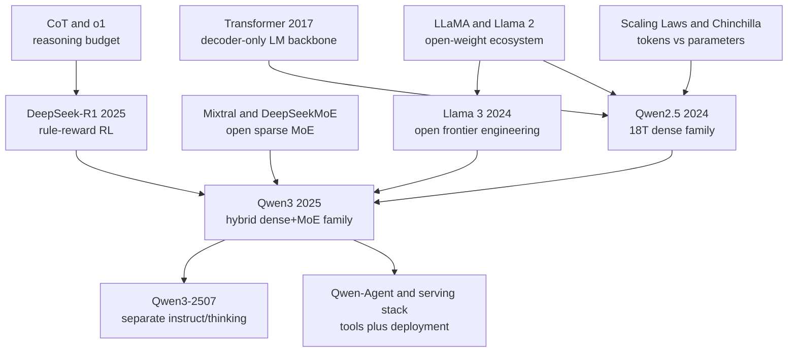

# Qwen2.5 / Qwen3 - 阿里通义千问如何把开放模型做成全栈模型族

> 2025 年 4 月 29 日，阿里 Qwen Team 发布 Qwen3；5 月的 [Qwen3 Technical Report](https://arxiv.org/abs/2505.09388) 把这次发布写成了一条清晰的路线：不是只追一个 235B-A22B 旗舰 MoE，而是把 2024 年 9 月 Qwen2.5 的 18T-token dense 家族，推进到 36T-token、119 种语言、dense+MoE、thinking/non-thinking 可切换、工具调用和本地部署都一起打包的开放模型系统。Qwen3 最有意思的地方不在“又一个国产大模型”，而在它把开放模型的竞争问题改写成：谁能让推理、代码、多语言、长上下文和 agent 工程同时可下载、可部署、可二次训练？

## 一句话总结

Qwen Team 在 2025 年 arXiv 技术报告《Qwen3 Technical Report》中做的不是单点 SOTA 论文，而是把 Qwen2.5 到 Qwen3 的开放模型路线压成一套可复用系统：底层仍是 decoder-only Transformer，用自回归目标 $\mathcal{L}_{\text{LM}}=-\sum_t\log p_\theta(x_t\mid x_{<t})$ 吃下 Qwen2.5 的 18T-token 经验，再扩到 Qwen3 约 36T tokens；后训练则把 long-CoT cold start、rule-based reasoning RL、thinking-mode fusion 和 general RL 串起来，让同一个模型能在 `enable_thinking=True/False` 之间切换。它替代的失败 baseline 不是某个模型，而是“开放模型只能追单项榜单”的做法：Qwen3-30B-A3B 只激活 3B 参数却对标更大推理模型，Qwen3-4B 被官方描述为可追平 Qwen2.5-72B-Instruct，而 235B-A22B 把 MoE、推理预算和多语言能力放进同一发布包。历史影响上，它接上 [Llama 3（2024）](2024_llama3.md) 的开放权重工程化路线，也回应 [DeepSeek-R1（2025）](2025_deepseek_r1.md) 的推理 RL 震动；隐藏 lesson 是：开放模型的壁垒正在从“有没有权重”迁移到“有没有完整生态、数据飞轮和可服务的思考接口”。

---

## 历史背景

### 从 Qwen 到 Qwen2.5：中文模型不再是英语模型的附属品

Qwen3 的故事要从一个更早的变化讲起：2023 年之后，开放大模型不再只是“拿英文模型做中文适配”。LLaMA 泄露和 Llama 2 商业许可让开放权重路线跑通，但对中文、代码、数学、长上下文和工具调用都有真实需求的团队很快发现，英语优先的 base model 不是万能底座。中文互联网文本、跨语种对齐、代码题、数学题、结构化输出、函数调用模板，这些东西如果只在后训练阶段补，模型会像贴了一层本地化外壳；真正稳定的能力必须进入预训练和模型族设计。

Qwen 系列正是在这个空位里长起来的。Qwen1.5 / Qwen2 把中文和英文、多语言、长上下文、代码、数学、VL 分支逐渐铺开；到 2024 年 9 月的 Qwen2.5，官方不再只发布一个 flagship checkpoint，而是一次性给出 0.5B、1.5B、3B、7B、14B、32B、72B 的 dense LLM，以及 Qwen2.5-Coder、Qwen2.5-Math 和 Qwen2-VL。这个节奏说明 Qwen 团队真正要做的是“模型产品线”，不是“一个榜单冠军”。

Qwen2.5 的几个数字很关键：最多 18T tokens，128K 输入上下文，最多 8K 生成长度，29+ 种语言，MMLU 85+、HumanEval 85+、MATH 80+ 这样的官方 headline。更重要的是，Qwen2.5 把结构化输出、JSON、表格理解、system prompt 稳定性、工具调用模板这些“工程味很重”的能力写进 release。它不像传统论文那样只证明一个新模块，而是在告诉开发者：这个模型要被长期服务、微调、量化、接 agent，而不是只被离线评测。

### 2024 年的开放模型压力：Llama 3、DeepSeek 与闭源 API

2024 年是开放模型的压力测试。Meta 的 Llama 3 把开放权重推到 405B dense 旗舰，公开了 15.6T tokens、128K context、后训练、安全组件和 FP8 推理等工程细节；Mistral / Mixtral 让 MoE 成为开放模型推理成本的新选项；DeepSeek-V2/V3 用 MLA + MoE 证明中国团队可以在训练与推理效率上做系统级创新；闭源侧 GPT-4o、Claude 3.5 Sonnet、Gemini 1.5 则持续把能力上限、长上下文和多模态体验往前推。

在这个竞争里，Qwen2.5 的位置很微妙。它没有 Llama 3 那种“开放权重直接挑战 GPT-4”的政治冲击，也没有 DeepSeek-V3 那种“训练成本叙事”带来的震撼，但它有另外一种优势：覆盖面极宽。一个开发者可以在同一个家族里找 3B 本地模型、32B 均衡模型、72B 强模型、coder、math、VL、tool calling 和中文/英文能力。它像一个模型操作系统的组件库，而不是一枚单点旗舰。

这种路线的压力也很明显：如果开放模型只靠“多尺寸、多任务、多语言”堆生态，推理能力怎么办？2024 年 9 月 OpenAI o1 出来以后，所有开放模型都被迫回答同一个问题：能不能让模型像 o1 一样“花更多 token 想更难的问题”？DeepSeek-R1 在 2025 年 1 月用 rule-based reward + GRPO 把问题进一步推到开放社区面前：推理不是 prompt 魔法，而是可以通过 RL 和可验证任务系统训练出来的能力。Qwen3 正是在这个窗口发布。

### Qwen3 发布时的关键问题：推理预算能不能交给用户控制

Qwen3 的官方标题是 “Think Deeper, Act Faster”。这句话很像 marketing，但背后有一个真正的技术矛盾：同一个模型如果总是长思考，简单问题会浪费延迟和成本；如果总是短回答，数学、代码、规划和工具调用又会不够稳。DeepSeek-R1 把“长 CoT + RL”推上主线，但它也让用户看到一个代价：模型会倾向于输出很长的思考过程，服务系统要处理 reasoning_content，UI 要决定展示还是隐藏，agent 框架要避免把思考内容切断。

Qwen3 的解法是 hybrid thinking modes：thinking mode 用长 CoT 做复杂推理，non-thinking mode 用快速响应处理普通聊天和低成本任务；用户可以通过 `enable_thinking=True/False`，以及 `/think`、`/no_think` 这类软开关，按任务切换推理预算。这不是一个简单 UI 选项，而是把“推理预算”从模型内部超参数变成应用层可控接口。对开发者来说，这意味着同一个 checkpoint 可以同时服务客服、代码、数学、agent 工具调用和本地聊天，而不是为每个场景维护完全不同的模型。

这里的反直觉点在于：Qwen3 并没有把自己包装成“纯推理模型”。它反而把推理和不推理放在同一个发布里。后来 Qwen3-2507 又拆出 Instruct-only 和 Thinking-only 变体，说明 hybrid 设计在产品中仍有取舍；但 2025 年 4 月的原始 Qwen3 已经把一个新问题摆到开放模型生态面前：模型是否应该把“想多久”暴露给用户和 serving stack？

### 直接前序：五条技术线

| 技术线 | 代表节点 | Qwen3 继承了什么 |
|---|---|---|
| 开放权重 | LLaMA、Llama 2、Llama 3 | 权重发布、模型卡、生态协作、商业可用性 |
| 数据规模 | Chinchilla、PaLM、Qwen2.5 | 从参数竞赛转向 token、质量、合成数据与数据 mix |
| 稀疏 MoE | Switch Transformer、GLaM、Mixtral、DeepSeekMoE | 用总参数量换容量，用 active 参数控制推理成本 |
| 推理训练 | CoT、o1、DeepSeek-R1 | long-CoT、rule-based reward、推理预算 scaling |
| 工具与 agent | Toolformer、ReAct、Qwen-Agent | 把函数调用、MCP、工具解析和服务框架放进模型生态 |

这五条线在 Qwen3 里汇合：dense 模型保证可部署性和尺寸覆盖，MoE 模型承担旗舰容量，36T-token 预训练吸收 Qwen2.5-VL / Qwen2.5-Coder / Qwen2.5-Math 反哺的数据，post-training 则吸收 DeepSeek-R1 之后的推理 RL 共识。Qwen3 的历史意义不在某个公式，而在它把这些线做成了一套可以下载、微调、部署和接工具的模型家族。

## 研究背景与动机

### 动机 1：把“模型族”做成基础设施，而不是单点榜单

Qwen2.5 / Qwen3 最核心的动机，是把大模型从“一个最大模型”改造成“多尺寸、多专长、多部署路径的基础设施”。这和传统论文的叙事不一样：传统论文会突出一个新 architecture 或一个 benchmark 领先点；Qwen3 更像一个 release engineering 论文，回答的是开发者选型时的连续问题：我有多少显存？要不要本地跑？要不要长上下文？要不要中文？要不要代码？要不要数学？要不要工具调用？要不要 thinking？

这种模型族策略让 flagship 模型不只是产品门面。Qwen3-235B-A22B 提供能力上限，Qwen3-30B-A3B 给出更便宜的 MoE 方案，32B/14B/8B/4B/1.7B/0.6B dense 模型覆盖从服务器到本地设备的梯度。Qwen2.5-Coder 和 Qwen2.5-Math 则承担“专家数据飞轮”：它们既是可用模型，也是生成代码、数学、教材和问答数据的工具。Qwen3 官方博客明确提到，Qwen2.5-Math 和 Qwen2.5-Coder 被用来生成合成数据，这意味着旧模型不是被淘汰，而是被纳入新模型的数据生产链。

### 动机 2：让长上下文、多语言、代码与数学进入同一主线

另一个动机是能力整合。很多开放模型会在发布后再补 coder、math、long-context、VL、agent 分支，结果是用户面对一堆互不兼容的 checkpoint。Qwen2.5 开始把这些分支系统化：基础 LLM 支持 128K，上层有 Coder 和 Math 专家模型，VL 分支处理图像和文档，Qwen-Agent 处理工具调用。Qwen3 再把多语言扩到 119 种语言和方言，并把 PDF-like 文档抽取、数学/代码合成数据、STEM 数据比例调整写进预训练流程。

这件事对中文读者尤其重要。中文模型过去常被评价为“中文好、英文弱”或“本地化强、前沿弱”。Qwen3 想证明的不是中文模型可以在中文榜单上赢，而是一个中国团队维护的开放模型族可以在英语、中文、多语言、代码、数学、长上下文、工具调用和本地部署之间保持同一套工程标准。它不再把中文当作补丁，而是把中文、多语言和英文一起放进 foundation model 的核心数据与后训练里。

### 动机 3：用可切换 thinking 重新定义开放推理模型

Qwen3 的第三个动机，是回应 2025 年初的推理模型热潮。DeepSeek-R1 证明 rule-based RL 可以让开源模型学会长推理，但应用层还需要更细的控制：什么时候需要 32K token 的思考？什么时候 200 token 的回答就够？如果模型在所有请求上都进入长思考，吞吐、成本和用户体验都会被拖垮；如果默认不思考，困难任务又会退化。

Hybrid thinking mode 把这个问题显式化。Qwen3 不只是“会思考”，而是尝试把思考模式做成可路由能力：用户、系统 prompt、chat template、serving parser 和 agent 框架都能参与控制。这个设计也解释了为什么 Qwen3 的官方文档花大量篇幅讲 Transformers、SGLang、vLLM、llama.cpp、Ollama、Qwen-Agent 的用法。推理能力一旦变成服务接口，模型论文就不能只讲 loss 和 benchmark，它必须讲 tokenizer 特殊 token、reasoning parser、context length、max_new_tokens、工具调用模板和部署框架。

---

## 方法详解

### 总体框架：Qwen2.5 打地基，Qwen3 做相变

Qwen2.5 / Qwen3 的方法不是一个孤立的新层，而是一条 model-family pipeline。它的底层目标仍然很朴素：给定 token 序列 $x_1,\dots,x_T$，训练 decoder-only Transformer 预测下一个 token。

$$
\mathcal{L}_{\text{LM}}(\theta)=-\sum_{t=1}^{T}\log p_\theta(x_t\mid x_{<t}).
$$

真正的变化在系统层。Qwen2.5 把 dense family、coder、math、VL、长上下文和工具调用模板铺开；Qwen3 再把这些资产纳入新一轮预训练与后训练：用 Qwen2.5-VL 抽取 PDF-like 文档文本，用 Qwen2.5 提升抽取质量，用 Qwen2.5-Math 和 Qwen2.5-Coder 生成数学、代码、教材和问答合成数据；然后通过 36T-token 预训练、MoE 扩容、long-CoT SFT、rule-based reasoning RL、thinking-mode fusion 和 general RL，把模型族推到“既能快答也能深想”的状态。

| 模块 | 典型模型 | 作用 | 对 Qwen3 的贡献 |
|---|---|---|---|
| Qwen2.5 dense | 0.5B-72B | 通用语言、长上下文、多语言 | 提供 18T-token 预训练地基 |
| Qwen2.5-Coder | 1.5B/7B/32B | 代码生成、调试、程序题 | 生成代码数据，提升 agent 工程能力 |
| Qwen2.5-Math | 1.5B/7B/72B | 数学推理、CoT/PoT/TIR | 生成数学合成数据，提供可验证任务 |
| Qwen2-VL / Qwen2.5-VL | 视觉语言 | 文档、图像、OCR-like 抽取 | 把 PDF-like 文档转成预训练文本 |
| Qwen3 dense small | 0.6B/1.7B/4B | 本地、端侧、低成本服务 | 让开放模型进入小显存场景 |
| Qwen3 dense large | 8B/14B/32B | 主力通用模型 | 在能力和部署成本之间折中 |
| Qwen3 small MoE | 30B-A3B | 30B 总参数，3B active | 用少量激活参数换取高容量 |
| Qwen3 flagship MoE | 235B-A22B | 235B 总参数，22B active | 承担开放权重旗舰能力上限 |

这张表背后的方法论是：**不要把“模型”理解为一个 checkpoint，要理解为一个生产网络**。旧模型生成新数据，专家模型反哺通用模型，小模型扩大部署面，大模型提供蒸馏和评测上限，agent 框架把能力接到真实工作流。Qwen3 的技术贡献更多体现在这个网络的耦合方式，而不是单个模块的惊艳程度。

### 关键设计 1：dense 家族先覆盖，再用专家模型补能力

Qwen2.5 的 dense family 是 Qwen3 的地基。为什么先做 dense？因为 dense Transformer 的训练和服务最稳定，生态支持最成熟，量化、LoRA、vLLM、llama.cpp、Ollama、MLX、移动端导出都更容易。对开放模型来说，稳定可部署比“论文上更花”的结构更重要。0.5B 到 72B 的连续尺寸让用户可以按预算选择，而不是在“太弱的小模型”和“跑不动的大模型”之间二选一。

专家模型则解决 dense 通用模型的能力短板。代码和数学不是简单的领域词表问题，它们需要可执行反馈、形式化答案、长链推理和数据生成。Qwen2.5-Coder 使用大规模代码相关数据，Qwen2.5-Math 支持 CoT、PoT 和 TIR；到了 Qwen3，这些专家模型不只是单独供用户下载，也被用来制造更高质量的预训练数据。这个设计形成了一个数据飞轮：

1. 通用模型学会宽覆盖语言和知识；
2. 专家模型在代码/数学上做高密度训练；
3. 专家模型生成或清洗高质量合成数据；
4. 新一代通用模型再吸收这些数据。

这种路径的隐藏好处是可控。相比完全依赖互联网抓取，代码题、数学题、教材、问答和文档抽取都更容易做质量过滤，也更容易与 rule-based reward 对接。Qwen3 后训练里的 reasoning RL 需要可验证任务，而 Qwen2.5-Math / Coder 正好提供了数据和任务形态。

### 关键设计 2：36T-token 预训练分三阶段，而不是只加 token

Qwen3 官方博客把预训练分成三阶段。第一阶段在超过 30T tokens 上用 4K context 打语言、知识和通用能力底座；第二阶段再加入 5T tokens，提升 STEM、代码和推理等知识密集数据比例；第三阶段用高质量长上下文数据把 context 扩到 32K。后续公开模型的上下文能力又通过不同模型卡和服务方式扩到 128K 乃至更新版本的更长窗口。

| 阶段 | 数据 / 上下文 | 目标 | 为什么不是简单堆量 |
|---|---|---|---|
| S1 | 30T+ tokens, 4K context | 语言、知识、基础能力 | 先让模型学稳，不让长上下文噪声拖累基础分布 |
| S2 | 额外 5T tokens | STEM、代码、推理增强 | 把高价值数据后置，提高边际收益 |
| S3 | 高质量长上下文数据, 32K context | 长文档和长依赖 | 用更干净的数据学习位置外推和长程检索 |

这里有一个容易被忽略的点：Qwen3 的 36T tokens 不是“网页多抓一倍”这么简单。官方描述中，PDF-like 文档通过 Qwen2.5-VL 抽取，再由 Qwen2.5 提升质量；数学和代码数据通过 Qwen2.5-Math / Coder 合成。也就是说，Qwen3 的数据管线已经明显模型化：上一代模型不仅消费数据，也生产数据。

从训练目标看，预训练仍是 next-token prediction；从数据系统看，Qwen3 已经进入“模型生成数据、数据训练模型”的循环。这个循环的风险是自我污染和错误固化，收益是高质量稀缺领域数据可以被放大。Qwen3 的论文和博客没有完全公开数据配比与过滤细节，所以外部无法完整复现，但方法方向很明确：用模型族自身制造下一代模型需要的高密度训练信号。

### 关键设计 3：Hybrid thinking modes 把推理预算变成接口

Qwen3 最有辨识度的设计是 hybrid thinking mode。它不是单纯让模型“输出思维链”，而是把模型行为分成两种模式：thinking mode 面向数学、代码、逻辑、STEM 和复杂 agent 任务；non-thinking mode 面向普通聊天、快速问答和低延迟请求。用户可以在 chat template 或 prompt 里控制模式。

$$
\text{answer}=f_\theta(x, m),\quad m\in\{\text{think},\text{no-think}\},\quad C_{\text{infer}}\approx |x|+|\text{reasoning}|+|\text{answer}|.
$$

这个公式故意写得简单：推理成本大致来自输入、隐藏/显式思考和最终答案。Qwen3 的目标不是让所有请求都最大化 $|\text{reasoning}|$，而是让应用根据任务选择 $m$。这让模型从“固定行为”变成“可路由行为”。

| 模式 | 典型输入 | 输出形态 | 工程含义 |
|---|---|---|---|
| Thinking | 数学证明、代码调试、复杂规划 | 长 reasoning + 最终答案 | 需要更长 `max_new_tokens` 与 reasoning parser |
| Non-thinking | 闲聊、摘要、简单问答 | 直接答案 | 更低延迟、更高吞吐、更少 token 成本 |
| Soft switch | `/think`、`/no_think`、`enable_thinking` | 同一会话内切换 | 把推理预算交给应用层控制 |

一个简化的应用层路由可以写成这样：

```python
def route_qwen3(prompt, task_type, latency_budget_ms):
    hard_tasks = {"math", "code", "logic", "agent_planning", "stem"}
    enable_thinking = task_type in hard_tasks and latency_budget_ms >= 1500
    messages = [{"role": "user", "content": prompt}]
    return tokenizer.apply_chat_template(
        messages,
        tokenize=False,
        add_generation_prompt=True,
        enable_thinking=enable_thinking,
    )
```

真实系统当然会更复杂：还要考虑用户层级、上下文长度、工具调用状态、是否允许展示思考内容、serving 框架如何解析 `reasoning_content`。但这个伪代码抓住了 Qwen3 的核心：思考不是只能在模型内部发生，它也可以成为应用调度的一部分。

### 关键设计 4：MoE 用 active 参数改写“旗舰模型”的成本定义

Qwen3 同时发布 dense 和 MoE，是因为两者解决的问题不同。Dense 模型适合稳定服务、微调和端侧生态；MoE 模型适合把总容量拉大，同时让每个 token 只激活一部分专家。Qwen3-235B-A22B 的命名很直接：235B 总参数，约 22B active 参数。Qwen3-30B-A3B 则是 30B 总参数，约 3B active 参数。

$$
\text{FLOPs}_{\text{MoE/token}}\approx \text{FLOPs}_{\text{shared}}+k\cdot\text{FLOPs}_{\text{expert}},\quad k\ll N_{\text{experts}}.
$$

MoE 的关键不是“参数越多越好”，而是“容量和激活成本分离”。总参数提供更多专家容量，active 参数决定每个 token 的主要推理成本。Qwen3-30B-A3B 的历史定位尤其有意思：它不是最大模型，却以 3B active 参数挑战更大 dense 推理模型，说明开放模型的竞争不再只看总参数，也要看 active 参数、吞吐、路由稳定性和服务生态。

| 路线 | 优点 | 代价 | Qwen3 中的角色 |
|---|---|---|---|
| Dense small | 易部署、易量化、端侧友好 | 能力上限有限 | 0.6B/1.7B/4B |
| Dense mid/large | 稳定、生态兼容、微调方便 | 推理成本随参数线性上升 | 8B/14B/32B |
| Small MoE | active 参数少，容量更大 | 路由和 serving 更复杂 | 30B-A3B |
| Flagship MoE | 能力上限高，成本低于同等 dense | 训练、推理、并行都复杂 | 235B-A22B |

这也解释了为什么 Qwen3 文档如此强调 SGLang、vLLM、KTransformers、llama.cpp、Ollama 等框架。MoE 模型如果没有 serving 支持，只是论文里的容量；一旦推理框架支持专家路由、reasoning parser、长上下文和量化，它才成为开发者可用的模型。

### 关键设计 5：post-training 不是“聊天调优”，而是模式融合

Qwen3 的 post-training 分四步：long-CoT cold start、reasoning RL、thinking mode fusion、general RL。第一步给模型基本长推理格式和能力；第二步在数学、代码、逻辑、STEM 等可验证任务上用 rule-based reward 做 RL；第三步把 non-thinking 能力融入 thinking 模型，让模型能在长思考和快速响应之间切换；第四步在 20+ 通用任务上做 general RL，修正格式、指令跟随、agent 能力和不良行为。

如果把 reward 写成简化形式，可以理解为：

$$
r(y\mid x)=\lambda_a r_{\text{answer}}+\lambda_f r_{\text{format}}+\lambda_t r_{\text{tool}}+\lambda_s r_{\text{safety}}.
$$

不同阶段调整的是 reward 组成和数据分布。Reasoning RL 更重视答案正确性与格式，general RL 则加入 instruction following、tool use、安全和偏好对齐。Qwen3 和 DeepSeek-R1 的共同点是都承认可验证任务对推理训练的价值；差异是 Qwen3 要把这种推理能力和普通 chat、工具调用、多语言体验融合到同一个模型族中。

这个设计的难点在“融合”。如果只训练 thinking，模型会在简单任务上过度思考；如果只训练 non-thinking，复杂任务不够强；如果混合不当，模型会在会话中忘记当前模式，或者在工具调用时把思考内容泄漏到参数里。Qwen3 选择把模式控制写进 tokenizer/chat template/serving parser 的接口层，说明它把 post-training 看作模型行为和系统接口共同设计，而不是最后一轮 SFT 的附属步骤。

---

## 失败案例

### 基线 1：只做一个更大的 dense 模型

如果把 Qwen3 简化成“训练一个更大的 Qwen2.5”，最自然的 baseline 是继续沿 dense 路线堆参数：从 72B 往上推到 100B、200B，像 Llama 3 405B 那样用 dense flagship 证明开放权重上限。这个路线的优点是简单、稳定、生态兼容，但对 Qwen3 来说不是最优答案。原因很现实：dense 模型的推理成本大致跟参数规模线性相关，越往上越难让普通开发者部署；而 Qwen 系列的优势恰恰在“很多人真的能用”。

Qwen3 没有放弃 dense，而是把 dense 放在 0.6B 到 32B 的可部署区间，再用 MoE 承担旗舰容量。这样做避免了两个极端：一边是只有巨大模型能看，生态难以铺开；另一边是只做小模型，能力上限被锁死。30B-A3B 和 235B-A22B 的意义就在这里：把“总容量”和“每 token 激活成本”拆开，让开放模型不仅能强，也能被更多 serving 框架承接。

| 失败路线 | 看起来合理的理由 | 实际问题 | Qwen3 的替代 |
|---|---|---|---|
| 单一 dense flagship | 结构简单，容易对标 Llama 3 405B | 推理成本高，生态覆盖窄 | dense 多尺寸 + MoE flagship |
| 只做小模型 | 本地友好，下载量大 | 能力上限不足，难做蒸馏源 | 0.6B-32B dense + 235B-A22B |
| 只做 MoE | active 参数便宜，容量大 | 路由、量化、微调和服务复杂 | dense 与 MoE 同时发布 |
| 只发布 instruct | 用户直接可用 | 研究者和企业难以继续训练 | base + post-trained 同时给出 |

失败不在于这些路线“不能用”，而在于它们只能优化一个维度。Qwen3 的路线是把多个维度绑在一起：能力、成本、生态、可微调性和可服务性同时纳入 release 设计。

### 基线 2：只做 single-mode reasoning model

DeepSeek-R1 之后，最容易跟风的方案是训练一个纯 thinking model：所有困难任务都走长 CoT，所有回答都默认思考，模型在数学和代码榜单上打高分。这条路短期很有吸引力，因为 benchmark 喜欢困难题，长推理能快速拉开差距。但它对真实应用不友好。客服、摘要、改写、闲聊、分类、格式转换、检索问答这些任务并不需要长思考；如果每次都生成大量 reasoning tokens，吞吐、延迟和成本都会被拖垮。

Qwen3 的 hybrid mode 正是在反对这个 baseline。它承认推理能力重要，但不把所有请求都变成推理题。thinking mode 解决复杂问题，non-thinking mode 保持日常交互速度，软开关让应用在同一会话里切换。后来的 Qwen3-2507 拆出 Instruct-only 与 Thinking-only 版本，反过来也说明 single checkpoint hybrid 有工程摩擦；但原始 Qwen3 的思想价值在于：它把“是否思考”变成可控变量，而不是默认风格。

### 基线 3：英语优先，再补中文和多语言

另一个失败 baseline 是英语优先训练，然后在后训练中补中文和多语言。这条路线在早期开源模型里很常见，因为高质量英文数据最多，英文 benchmark 最密集，国际影响力也主要来自英文评测。但它对 Qwen 这样的模型族不够。中文、日文、韩文、阿拉伯语、东南亚语言、代码混合注释、跨语言检索和本地办公文档，并不是最后一层 SFT 可以完全修复的能力。

Qwen3 把多语言写进预训练主线，官方列出 119 种语言和方言；Qwen2.5 也已经支持 29+ 种语言。这个选择让模型不仅能“翻译中文”，还能在中文和多语言场景里保持工具调用、结构化输出、长上下文和推理一致性。它也让 Qwen 在全球开放模型生态里不只是“中国版 Llama”，而是一个以多语言数据和中文场景为核心资产的模型族。

### 基线 4：只发模型，不发系统接口

最后一个失败 baseline 是只把权重扔到 Hugging Face。2023 年这也许已经足够震撼；到 2025 年，已经远远不够。用户需要的是可以部署的模型：Transformers 能跑，vLLM 能 serve，SGLang 能做高吞吐，llama.cpp / Ollama / LM Studio 能本地用，Qwen-Agent 能接工具，reasoning parser 能处理 `<think>` 或 `reasoning_content`，量化格式能进不同硬件。

Qwen3 把这些写进 README 和文档，说明它理解开放模型的“失败”常常发生在论文之后：权重有了，但服务框架不支持；能力有了，但工具调用模板不统一；长上下文有了，但默认 `num_ctx` 太小；thinking 有了，但 API 把 reasoning_content 丢掉。Qwen3 的系统接口设计不是附属品，而是模型能否被大规模采用的关键实验数据。

## 实验关键数据

### 模型家族数字

Qwen3 的实验数据首先体现在 release geometry，而不是某一个榜单数字。它用多尺寸 dense + 两个 MoE 组成能力阶梯，并把 Qwen2.5 的长上下文、多语言、coder/math 专家线继承下来。

| 组件 | 参数 / 数据 | 官方关键信号 | 解读 |
|---|---|---|---|
| Qwen2.5 LLM | 0.5B-72B, up to 18T tokens | 128K context, 29+ languages | dense 地基和多尺寸覆盖 |
| Qwen2.5-Coder | 1.5B/7B/32B | 5.5T code-related tokens | 代码专家和合成数据来源 |
| Qwen2.5-Math | 1.5B/7B/72B | CoT/PoT/TIR, 中英数学 | 可验证推理任务来源 |
| Qwen3 dense | 0.6B/1.7B/4B/8B/14B/32B | 小模型到主力模型连续覆盖 | 本地、服务器、微调梯度 |
| Qwen3 MoE | 30B-A3B, 235B-A22B | 3B / 22B active params | 容量与推理成本分离 |
| Qwen3 data | approximately 36T tokens | 119 languages and dialects | 数据规模和多语言范围翻倍级提升 |

这些数字的关键在“连续性”。Qwen3-4B 被官方描述为可与 Qwen2.5-72B-Instruct 对标，Qwen3 dense base 模型被描述为能匹配更大一档的 Qwen2.5 base，MoE base 则用约 10% active 参数达到类似 dense base 的效果。这些说法即使需要逐 benchmark 细看，也足以说明 Qwen3 想证明的是知识密度和 active-parameter 效率，而不只是总参数。

### Benchmark 信号

官方博客给出的 benchmark 图没有全部以文本表格形式释放，但几个 headline 清楚地表达了实验方向：Qwen3-235B-A22B 与 DeepSeek-R1、o1、o3-mini、Grok-3、Gemini-2.5-Pro 等顶级模型比较；Qwen3-30B-A3B 以远小于 QwQ-32B 的 active 参数竞争推理能力；Qwen3-4B 对标 Qwen2.5-72B-Instruct；Qwen2.5-72B-Instruct 则在 2024 年对 Llama-3.1-70B、Mistral-Large-V2 等开放模型给出强对比。

| 实验信号 | 对比对象 | 论文 / 博客想证明 | 需要谨慎读法 |
|---|---|---|---|
| Qwen3-235B-A22B | DeepSeek-R1, o1, o3-mini, Grok-3, Gemini-2.5-Pro | 开放 MoE flagship 可进入前沿讨论 | 官方图表需结合独立评测验证 |
| Qwen3-30B-A3B | QwQ-32B 等推理模型 | 3B active 参数也能做强推理 | active 参数低不等于服务总成本为 3B dense |
| Qwen3-4B | Qwen2.5-72B-Instruct | 代际知识密度大幅提升 | 小模型不同任务上会有长尾弱点 |
| Qwen2.5-72B | Llama-3.1-70B, Mistral-Large-V2 | dense 开放模型进入一线竞争 | 评测选择和 prompt 配置很关键 |
| Qwen-Plus | GPT-4o, Claude 3.5 Sonnet, Llama-3.1-405B | API 旗舰接近闭源与开放前沿 | API 模型不等同于开源权重 |

更重要的实验观察是“推理预算平滑可控”。Qwen3 官方展示了 thinking budget 与性能提升的关系，强调可按任务调节质量/成本。这类实验比单榜单更接近产品真实问题：当用户把 `max_new_tokens` 从几百调到几万，模型是否稳定变强？当应用切到 non-thinking，是否还能保持基本指令跟随？Qwen3 把这些问题放到 release 级别，比传统论文只给最终 accuracy 更贴近部署。

### 实用部署信号

Qwen3 的另一个关键数据来源是生态支持。一个开放模型如果只能在官方 demo 跑，影响力会很有限；如果能在 Transformers、vLLM、SGLang、llama.cpp、Ollama、LM Studio、MLX、TensorRT-LLM、OpenVINO、MindIE 等路径进入开发者机器，它才真正进入开放生态。

| 部署路径 | Qwen3 支持点 | 为什么重要 | 风险 |
|---|---|---|---|
| Transformers | `enable_thinking`, chat template | 研究和微调入口 | 版本要求高，显存压力大 |
| vLLM / SGLang | reasoning parser, OpenAI-compatible API | 高吞吐服务 | reasoning_content 处理不当会伤害 agent 任务 |
| llama.cpp / Ollama | GGUF, 本地命令行 | 个人设备和边缘部署 | 默认 context 太小会导致误用 |
| Qwen-Agent | function calling, MCP, built-in tools | 把模型接到真实工具链 | 工具 schema 和权限需要治理 |
| Quantization stack | GPTQ, AWQ, GGUF, MLX | 降低部署门槛 | 量化可能影响推理和多语言长尾 |

这些不是论文里的“漂亮配图”，但它们构成了 Qwen3 的真实实验：开放模型能否被不同硬件、框架、国家/地区和应用层接受。Qwen3 的强处是它把模型能力和部署说明绑在一起；局限是这种工程可用性很难用一个 benchmark 数字概括，也很依赖社区后续维护。

---

## 思想史脉络

### 前世：Qwen3 不是从推理模型突然长出来的

把 Qwen3 只放在 DeepSeek-R1 之后，会漏掉一半思想史。它当然继承了 2025 年初的推理 RL 氛围，但更早的根是开放权重、Chinchilla 式 token 观、LLaMA 生态、MoE 服务化和中文/多语言 base model。Qwen2.5 已经把 18T-token dense family、128K context、coder、math、VL 和工具调用铺好；Qwen3 的“新”不只是更强，而是把这些分支重新组织成一个能参与 reasoning-agent 时代的模型族。

| 前序思想 | 代表论文 / 系统 | 传到 Qwen3 的东西 | Qwen3 的变形 |
|---|---|---|---|
| Decoder-only LM | Transformer, GPT 系列 | 自回归训练目标和统一文本接口 | dense 与 MoE 都复用这套接口 |
| Compute/data scaling | Scaling Laws, Chinchilla | token 规模和数据质量决定知识密度 | 18T 到 36T，并加入模型生成数据 |
| Open weights | LLaMA, Llama 2, Llama 3 | 权重发布带来外部创新 | 发布模型族、文档、工具和 serving 指南 |
| Sparse MoE | Switch, GLaM, Mixtral, DeepSeekMoE | 容量和 active 参数分离 | 30B-A3B / 235B-A22B 进入主线 |
| Reasoning traces | CoT, o1, DeepSeek-R1 | 长思考、可验证任务、RL | thinking/non-thinking 可切换 |
| Agent/tool use | Toolformer, ReAct, Qwen-Agent | 模型调用外部环境 | MCP、function calling、serving parser 一体化 |

这条谱系显示，Qwen3 不是“DeepSeek-R1 的 Alibaba 版本”，也不是“Llama 3 的中文版本”。它更像两条路线的交叉点：一条是 Llama 以来的开放权重工程化，一条是 o1/R1 以来的推理预算工程化。Qwen3 把两者合并成一个可部署模型族。

### 今生：开放模型从 checkpoint 变成平台

Qwen3 发布后，最直接的影响不是某个单一 benchmark，而是开放模型平台化。开发者关心的不只是“这个模型强不强”，还会问：有没有 4B 可以本地跑？有没有 30B-A3B 可以在单机多卡上跑？有没有 235B-A22B 做旗舰？有没有 base 方便继续训练？有没有 instruct 直接用？有没有 thinking parser？有没有工具调用模板？有没有中文和多语言长尾？有没有量化和本地部署？

这让 Qwen3 在思想史上更接近 Llama 3 和 vLLM，而不只是接近 DeepSeek-R1。Llama 3 证明开放权重可以做前沿工程报告；vLLM 证明服务系统能定义模型可用性；DeepSeek-R1 证明推理 RL 可以开源化；Qwen3 试图把三者放到同一个模型家族 release 里。



### 误读：Qwen3 容易被误读成什么

Qwen3 最常见的误读有四个。第一，把它当作“国产模型追榜”。这种读法会漏掉模型族、工具、serving、数据飞轮和多语言策略。第二，把它当作“DeepSeek-R1 之后的又一个 thinking model”。事实上 Qwen3 的关键点恰恰是 thinking 与 non-thinking 共存。第三，把 MoE active 参数当成实际全部成本。30B-A3B 的 active 参数很小，但 serving 仍要处理路由、专家权重、KV cache、并行和通信。第四，把开放权重当成完整开源科学。Qwen3 公开权重、报告和大量文档，但完整预训练数据、过滤器、训练代码和后训练细节并没有全部公开。

| 误读 | 为什么会出现 | 更准确的读法 |
|---|---|---|
| “Qwen3 只是追榜模型” | 官方 benchmark 图很醒目 | 它是模型族和生态 release |
| “Qwen3 就是 R1 风格推理模型” | thinking mode 很吸引注意 | 它的核心是 thinking/non-thinking 路由 |
| “3B active 就等于 3B dense 成本” | MoE 命名突出 active 参数 | 总权重、路由和 serving 复杂度仍重要 |
| “开放权重等于可完全复现” | GitHub/Hugging Face 很完整 | 数据和训练 recipe 仍有边界 |

这些误读本身也说明 Qwen3 的位置有点复杂。它不是纯研究论文，也不是普通产品公告，而是介于论文、模型仓库、文档、生态工程和品牌叙事之间的综合体。对 awesome-papers 来说，值得记录的正是这种“论文形态变化”：经典 AI 论文越来越像系统发布。

### 一张图：从开放权重到可控思考

Qwen3 的思想史可以压缩成一句话：**开放模型从“我能下载权重”走向“我能控制模型怎么想、怎么用工具、怎么部署”。** LLaMA 打开权重，Llama 3 把开放权重做成前沿工程报告，DeepSeek-R1 把推理 RL 拉到开源社区，Qwen3 则把这些能力收束进一个可选择尺寸、可选择 dense/MoE、可选择 thinking/non-thinking、可选择部署框架的模型族。

这也是它和很多单点模型不同的地方。单点模型的影响通常来自一个能力跃迁；Qwen3 的影响来自组合：数据规模、专家数据、MoE、reasoning RL、hybrid mode、工具调用、部署生态和多语言覆盖同时出现。每一项单独看都不是第一次，但它们合在一起，改变了开放模型的默认期待。

---

## 当代视角

### 站得住的判断

到 2026 年回看，Qwen3 最站得住的判断是：开放模型的竞争已经从“谁发了最强权重”变成“谁维护了最完整的模型系统”。Qwen3 的 dense 尺寸、MoE 旗舰、base/instruct、thinking/non-thinking、Qwen-Agent、Transformers/vLLM/SGLang/llama.cpp/Ollama 支持，共同构成了它的护城河。单个榜单会过期，模型权重会被新版本替代，但生态接口和数据飞轮会留下来。

第二个站得住的判断，是 active 参数会成为开放模型讨论里的关键数字。过去开发者习惯问“这个模型多少 B？”Qwen3-30B-A3B / 235B-A22B 让问题变成“总参数、激活参数、KV cache、专家路由、吞吐和显存分别是多少？”这比简单参数量更贴近部署现实。MoE 不会替代所有 dense 模型，但它让 flagship 能力和推理成本之间有了新调节杆。

第三个判断，是 reasoning budget 必须产品化。DeepSeek-R1 证明长思考有效，Qwen3 则把“是否思考”做成接口。这个方向在后来分化成两个趋势：一类模型继续做 hybrid，让应用按请求切换；另一类模型拆成 Instruct-only 与 Thinking-only，让服务端更容易做路由。无论哪种，推理预算都不再是隐藏在模型内部的习性，而是系统设计的一部分。

| 判断 | 2025 年的证据 | 2026 年回看 | 仍需观察 |
|---|---|---|---|
| 模型系统比单权重更重要 | Qwen3 同时发模型、文档、serving、agent | 生态持续扩展，Qwen 组织模型数增加 | 社区维护质量能否长期稳定 |
| active 参数成为核心指标 | 30B-A3B / 235B-A22B 命名即指标 | MoE 服务成为常见部署选项 | 路由和量化对质量的影响 |
| reasoning budget 产品化 | `/think`、`/no_think`、`enable_thinking` | thinking/instruct 分支进一步明确 | 用户是否真正理解何时开 thinking |
| 多语言是 foundation 能力 | 119 languages and dialects | 非英语开放模型生态更强 | 长尾语言质量和安全评测不足 |
| 旧模型会变成数据生产者 | Qwen2.5-VL/Coder/Math 反哺 Qwen3 | synthetic data flywheel 成为常态 | 自我污染与错误放大风险 |

### 已经被修正的判断

Qwen3 也有一些已经被现实修正的判断。最明显的是“一个 hybrid checkpoint 可以同时优雅覆盖 thinking 与 non-thinking”。原始 Qwen3 的设计很漂亮，但 Qwen3-2507 又把 Instruct 和 Thinking 分开，说明统一模型在产品、服务和用户心智上有摩擦。混合模式对高级开发者很灵活，对普通用户和 API 平台却可能带来不确定性：同一个模型什么时候会想太久，什么时候又想得不够？

第二个被修正的是“开源开放足够解决信任”。Qwen3 的权重、报告、博客和文档都很丰富，但它仍不是完全可复现的科学实验。数据来源、过滤规则、合成数据比例、RL 细节、评测 prompt 和安全训练都不是全量公开。开放权重降低了使用门槛，却没有自动解决可审计性。对企业和研究者来说，权重开放只是第一步。

第三个被修正的是“长上下文越长越好”。Qwen3 及其后续版本不断扩展 context，但真实应用里，长上下文质量取决于检索、位置鲁棒性、attention 实现、KV cache 管理和 prompt 组织。把 context window 拉大不等于模型真的理解所有内容。Qwen 文档提醒用户设置 `num_ctx`、`num_predict`，这类细节说明长上下文已经从模型参数变成部署工程问题。

### 2026 年回看 Qwen3 的位置

Qwen3 的位置可以这样概括：它不是 2025 年最戏剧性的论文，DeepSeek-R1 才是那个改变公众叙事的事件；它也不是第一个开放权重平台，LLaMA / Llama 3 已经把这条路铺得很远。但 Qwen3 是把这些趋势揉成“可用模型族”的关键节点之一。它的价值不在一个单点震动，而在持续铺路。

对中国 AI 生态来说，Qwen3 也有标志意义。它显示中文团队可以维护全球化开放模型基础设施，而不仅是做中文适配或国内榜单。对全球开发者来说，Qwen3 提供了 Llama / Mistral / DeepSeek 之外的又一条主线：强调中文和多语言、强调工具与 agent、强调多尺寸模型族、强调 dense 与 MoE 共存。

## 局限与展望

### 局限 1：可复现性边界仍然明显

Qwen3 的开放程度很高，但不是完整开源训练 recipe。外部团队可以下载权重、跑推理、做微调、读技术报告，却无法按论文完整重建 36T-token 数据、过滤器、合成数据流程、RL 训练和评测环境。这是当代 frontier/open-weight 模型的共同局限：权重开放和科学复现之间还有很长距离。

| 局限 | 表现 | 为什么重要 | 可能方向 |
|---|---|---|---|
| 数据不可复现 | 36T tokens 的来源和过滤不完整公开 | 难以审计偏差、污染和版权问题 | 发布更细 data card 与 contamination report |
| RL 细节有限 | reward、采样、训练稳定性未全公开 | 难以复现 thinking 能力 | 开放小规模 RL recipe 和 ablation |
| 评测透明度不足 | 官方图表多，prompt 细节有限 | 容易产生榜单误读 | 标准化 eval harness 与 prompts |
| 系统复杂度高 | MoE、long context、reasoning parser、tool use 交织 | 部署错误会被误判为模型失败 | 更强默认配置和诊断工具 |

### 局限 2：Hybrid thinking 的用户心智成本高

Hybrid thinking 是 Qwen3 最有创造性的设计之一，也带来认知成本。开发者要理解什么时候开启 thinking，用户要理解为什么同一个模型有时慢有时快，服务框架要正确处理 reasoning_content，安全策略要决定思考内容能否展示。这个复杂度解释了后来 Instruct-only / Thinking-only 版本的回归：分开模型牺牲了一部分优雅，但让路由和预期更清楚。

这并不说明 hybrid 失败。更准确地说，Qwen3 把问题提前暴露出来：未来模型可能不只有“一个能力水平”，还会有“多个运行模式”。像数据库有 query planner、操作系统有 power mode、浏览器有隐私模式一样，LLM 也可能需要显式模式管理。Qwen3 是这个方向的早期大规模实验。

### 展望：从模型族走向 agent 族

Qwen3 官方 future work 提到从训练模型转向训练 agents。这个判断很可能是下一阶段核心。模型族只是底座，真正的应用会要求模型在环境中行动：调用工具、写代码、读网页、操作文件、规划长任务、验证结果、记忆用户偏好、处理多模态输入。Qwen3 已经把 Qwen-Agent、MCP、tool calling 和 reasoning parser 放进生态，下一步自然是把模型能力和环境反馈绑定得更紧。

值得期待的方向包括：更公开的小规模 RL 复现实验，更可靠的 tool-use reward，更强的多语言安全评测，视觉/音频/文本统一模型，更低成本的 MoE serving，以及能根据任务自动分配 thinking budget 的 scheduler。Qwen3 已经证明“模型族”是一个有效组织方式；下一步要证明“agent 族”也能以开放方式组织起来。

## 相关工作与启发

### 给研究者的启发

Qwen3 给研究者的启发，是不要只盯 architecture novelty。很多真正改变生态的论文，创新点在系统组织方式：数据如何循环，旧模型如何生产新数据，专家模型如何反哺通用模型，thinking 如何暴露给服务层，MoE 如何和部署框架一起设计。研究论文如果只报告最终 accuracy，会漏掉这些机制。

| 相关方向 | 代表工作 | 与 Qwen3 的关系 |
|---|---|---|
| 开放权重工程 | LLaMA, Llama 3 | Qwen3 继承模型族和开放生态路线 |
| 推理 RL | DeepSeek-R1, o1 system card | Qwen3 接受 rule-reward RL 和 thinking budget 叙事 |
| MoE scaling | Switch, Mixtral, DeepSeek-V3 | Qwen3 用 MoE 做 flagship 容量 |
| 工具调用 | Toolformer, ReAct, Qwen-Agent | Qwen3 把工具接口放进使用文档 |
| 合成数据 | Self-Instruct, Code/math distillation | Qwen2.5 专家模型反哺 Qwen3 数据 |
| 长上下文 | Gemini 1.5, Llama 3.1, YaRN-style serving | Qwen3 把长上下文与部署参数绑定 |

对学术写作来说，Qwen3 也提醒我们：经典论文不一定只有“提出一个算法”才经典。模型报告、系统文档和 release engineering 也会成为历史节点，因为它们改变了社区默认做法。

### 给工程团队的启发

工程团队从 Qwen3 得到的启发更直接：不要把模型选型只看成 benchmark 选择。实际问题包括许可证、上下文长度、吞吐、量化、工具调用、微调框架、reasoning parser、语言覆盖、默认 prompt、用户是否能理解模式切换。Qwen3 的文档之所以长，是因为这些细节决定模型是否真能上线。

另一个启发是保留多尺寸路径。很多团队会被最大模型吸引，但真实产品通常需要 4B/8B/14B/32B/30B-A3B 这样的梯度：本地 preview、小流量服务、私有云强模型、旗舰推理模型各有位置。Qwen3 的模型族思维比单旗舰更接近企业部署现实。

## 相关资源

- Qwen3 Technical Report: <https://arxiv.org/abs/2505.09388>
- Qwen2.5 Technical Report: <https://arxiv.org/abs/2412.15115>
- Qwen3 official blog: <https://qwenlm.github.io/blog/qwen3/>
- Qwen2.5 official blog: <https://qwenlm.github.io/blog/qwen2.5/>
- Qwen3 GitHub repository: <https://github.com/QwenLM/Qwen3>
- Qwen documentation: <https://qwen.readthedocs.io/>
- Qwen Hugging Face organization: <https://huggingface.co/Qwen>
- Qwen-Agent: <https://github.com/QwenLM/Qwen-Agent>


---

> 🌐 [English version](/en/era5_genai_explosion/2025_qwen3/) · 📚 awesome-papers project · CC-BY-NC