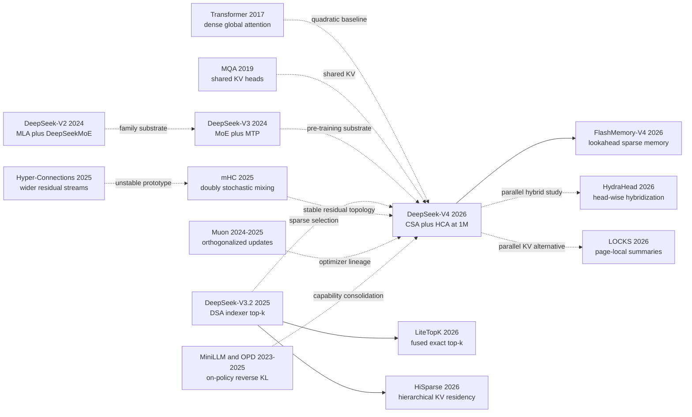

# DeepSeek-V4：把百万 token 上下文从额度变成架构问题

> 2026 年 4 月 26 日，[DeepSeek-V4 技术报告](https://arxiv.org/abs/2606.19348)没有把“百万 token”写成一个孤立的窗口数字，而是把账拆开：Pro 有 1.6T 总参数但每 token 激活 49B，Flash 为 284B/13B；CSA 先把每 4 个位置压成一个条目再做 top-k，HCA 每 128 个位置保留一个全局摘要，mHC 与 Muon则负责让这套更复杂的网络训得下去。报告估算 Pro 在 1M 时只需 V3.2 的 27% 单 token FLOPs 与 10% KV cache。真正的钩子也正是它的风险：窗口能装下一百万个 token，不等于模型能无损记住一百万个 token；MRCR 在 128K 后已经下滑，而组件消融、独立延迟复现和训练总成本仍未公开。这是一份刚发布数月的 preview 架构报告，值得读的不是尚未得到时间验证的“历史地位”，而是它如何把长上下文从产品额度重新写成 memory hierarchy 问题。

## 一句话总结

DeepSeek-AI 在 2026 年 arXiv 技术报告中，把 V2/V3 的特征维 KV 压缩和 V3.2 在逐位置 latent 上做 DSA top-k，推进成序列级 memory hierarchy：CSA 以 m=4 先压缩再检索，HCA 以 m'=128 保留密集全局通路，128-token window 保护局部细节，mHC 与 Muon支撑 284B/13B 的 Flash 和 1.6T/49B 的 Pro。若把每步可见状态写成 $N_{\mathrm{visible}}\ll n$，关键就不是把 n 配到 1,048,576，而是报告 Pro 在该长度仅用 V3.2 的 27% equivalent-FP8 单 token FLOPs 与 10% KV cache，Flash 为 10% 与 7%；两者分别训练 32T/33T tokens，再用十多个 specialist 的 full-vocabulary on-policy reverse-KL distillation 合并能力。

它替代的失败 baseline 不是“低准确率的 dense Transformer”，而是 128K 已遇到 agent 轨迹溢出的 V3.2，以及只减少读取、不先减少候选状态的 DSA。统一 base harness 上，LongBench-V2 从 40.2 提到 Flash 44.7、Pro 51.5，但 BigCodeBench 由 63.9 降到 56.8/59.2，MRCR 也在 128K 后下滑。它承接 [DeepSeek-R1 的 test-time scaling](/era5_genai_explosion/2025_deepseek_r1/) 与 [FlashAttention 的 IO-aware 思维](/era4_foundation_models/2022_flashattention/)，长期影响未知。反直觉的 lesson 是：推理时稀疏状态，后训练时反而保留完整 teacher 词表分布；“稀疏”必须落在正确的资源轴上。

---

## 历史背景

### 2024-2026：窗口变长了，注意力的账单没有消失

2024 年 5 月，DeepSeek-V2 把 DeepSeek 的架构路线定了下来：236B 总参数、每个 token 激活 21B，预训练 8.1T tokens，并用 Multi-head Latent Attention（MLA）压缩 KV 表示、用 DeepSeekMoE 稀疏激活 FFN。它把上下文推到 128K；报告给出的对照是 KV cache 减少 93.3%、最大生成吞吐提高到 5.76 倍。这里容易产生一个错觉：KV 已经被压成潜变量，长上下文似乎只剩工程问题。实际上 MLA 主要压缩的是每个位置的表示维度，序列里有多少位置，cache 仍大体随之增长。

2024 年 12 月的 DeepSeek-V3 沿用 MLA 与 DeepSeekMoE，把规模扩到 671B 总参数、37B 激活参数和 14.8T 预训练 tokens，同时加入无辅助损失的负载均衡与 Multi-Token Prediction（MTP）。V3 报告披露完整训练使用 2.788M H800 GPU hours，并强调没有不可恢复的 loss spike。随后，[DeepSeek-R1（2025）](/era5_genai_explosion/2025_deepseek_r1/) 把推理时扩展推到前台：模型通过更长轨迹、自检和工具调用换取更强能力。于是瓶颈发生了转移。参数可以靠 MoE 稀疏激活，但长推理轨迹和多轮 agent 会持续扩大上下文；标准注意力的计算规模仍接近 $O(n^2d)$，自回归解码还要在每一步读取历史 KV。

2025 年 12 月，DeepSeek-V3.2 加入 DeepSeek Sparse Attention（DSA）：轻量 indexer 给历史 KV 打分，核心注意力只读取 top-k 位置。它从已扩到 128K 的 V3 checkpoint 继续训练，先用 2.1B tokens 训练 indexer，再用约 943.7B tokens 联合训练主模型与 indexer。DSA 降低了“本步读多少历史”的计算量，却没有先减少“一共有多少历史位置需要表示”。V3.2 报告还直接记录了边界：搜索 agent 测试里有 20% 以上样例越过 128K，冗余自检会把轨迹推过窗口。到 2026 年，问题已不是能否把窗口配置写成更大的数字，而是能否同时负担训练、prefill、逐 token 解码、KV 常驻和状态恢复。

### 直接逼出 V4 的五条前序路线

第一条是 2017 年的 [Transformer](https://arxiv.org/abs/1706.03762)。全局注意力让任意两处内容直接交互，但长度翻倍时注意力矩阵面积变成四倍；在 $n=10^6$ 时，“所有 query 看所有 key”不再是默认可接受的操作。第二条是 MQA 与 GQA：Noam Shazeer 的 [MQA（2019）](https://arxiv.org/abs/1911.02150) 让多个 query head 共用一份 KV，[GQA（2023）](https://arxiv.org/abs/2305.13245) 在 MHA 与 MQA 间折中。它们缩小每个 token 的 KV 宽度，却不改变 token 数量本身。

第三条是 DeepSeek 自己从 [V2](https://arxiv.org/abs/2405.04434) 到 [V3](https://arxiv.org/abs/2412.19437) 的 MLA/DeepSeekMoE 路线。MLA 先把每个位置的 K/V 投影到低维潜表示，MoE 则把总参数量与每 token 计算量拆开。第四条是 [V3.2 的 DSA](https://arxiv.org/abs/2512.02556)：它证明 learned indexer 可以在长序列中选择少量关键位置，但被选择的对象仍是一串逐 token 潜变量。V4 的 CSA 把这两步串起来，先按序列块压缩，再在压缩条目上做 DSA；HCA 更进一步，用更高压缩率换取便宜的全局密集通路。

第五条来自注意力之外。2025 年 ICLR 的 [Hyper-Connections](https://openreview.net/forum?id=9FqARW7dwB) 把残差流扩成多条通道，却会破坏恒等映射带来的稳定性；DeepSeek 团队的 [mHC](https://arxiv.org/abs/2512.24880) 用双随机矩阵约束残差混合。与此同时，Keller Jordan 的 [Muon](https://kellerjordan.github.io/posts/muon/) 用 Newton-Schulz 迭代近似正交化二维参数更新，Moonlight 工作又展示了大模型扩展配方。V4 把 mHC 与 Muon 放进同一次万亿参数训练，说明它追求的不只是更省 cache，而是让更宽的残差拓扑和更激进的优化同时可训练。

### DeepSeek 团队当时在做什么

V4 不是从空白开始的新模型家族，而是一次连续改造。它保留 V3 的 DeepSeekMoE、无辅助损失负载均衡和 MTP；MoE affinity 从 Sigmoid 改为 Sqrt(Softplus)，最初三层 MoE 改用按 token ID 的 Hash routing，其余细节默认继承 V3。注意力侧则不再保留 MLA 作为主体，而是把 V3.2 的 indexer 思路嵌入 CSA，再与 HCA 交错。残差侧采用在 2025 年末单独公开的 mHC，优化器侧承接 2024-2025 年 Muon 的公开实验路线。

这种连续性也体现在后训练。R1 与 V3.2 已经积累了 GRPO、推理模式和 agent 数据合成经验；V4 仍先用 SFT 与 GRPO 分别训练数学、代码、agent、指令遵循等 specialist，但最终不再用一锅混合 RL 把能力揉在一起，而是让统一 student 在自己的轨迹上匹配十多个 teacher 的完整词表分布。报告把这一步称为 multi-teacher on-policy distillation（OPD）。因此，V4 的“模型”其实包含三层共同设计：预训练架构、支撑百万 token 的系统栈，以及把多个领域策略压回同一权重的后训练管线。

报告本身也应放在正确时间坐标上。arXiv v1 标记为 2026 年 4 月 26 日，标题明确称其为 preview version；Hugging Face 的 Pro/Flash 仓库创建时间是 4 月 22 日，公开集合后来仍在更新。到本文证据截止日 2026 年 9 月 14 日，只有数月观察期。可以说 V4 把一套百万 token 架构和权重公开了，不能说它已经通过多年部署证明了历史地位。

### 从 H800 集群到异构 KV：架构必须和系统一起设计

百万 token 把“模型结构”和“系统实现”的边界抹得很薄。V4 的 CSA/HCA layer 产生不同尺寸的 cache，滑动窗口还保留最近 128 个未压缩位置，尚未凑满压缩块的 tail state 也要单独保存。传统 PagedAttention 假设各层 KV block 形状相近；V4 因而设计异构 cache layout，以 $\operatorname{lcm}(m,m')$ 个原始 token 为共同分块单位，并把滑动窗口与未压缩 tail 当作 state cache 管理。共享前缀还可落盘：压缩条目直接保存，SWA 状态则通过已有压缩条目重算最后一段，而不是把体积约大 8 倍的逐层 SWA cache 全写入 SSD。

训练同样不是“换一个 attention class”就结束。Muon 需要完整梯度矩阵做正交化，与 ZeRO 分片天然冲突，报告采用 hybrid ZeRO bucket；mHC 增加 activation 与 pipeline 通信，靠重计算和 fused kernel 把重叠 1F1B stage 的 wall-time overhead 控制在 6.7%；CSA 的 top-k 又要求上下文并行知道每个 query 真正访问哪些压缩块。论文还公开了一个 MoE mega-kernel、TileLang kernel、batch-invariant deterministic kernels，以及用于 agent 后训练的 DSec sandbox。这里最值得保留的历史背景不是硬件品牌，而是设计原则：当上下文达到百万级，注意力公式、cache 布局、并行策略、低精度格式和故障恢复已经是同一个算法的一部分。

## 研究背景与动机

### 百万 token 的三张账单

第一张账单是计算。dense attention 的单层 prefill 近似随 $n^2$ 增长；解码时每个新 token 又要与历史序列交互。第二张是显存与带宽。即使 MLA 把单位置 KV 压窄，只要每层仍保存逐位置状态，1M 序列的 cache 与读流量仍然可观。第三张是训练可达性：模型要在 1M 长度上见过有效样本，indexer 要学会不漏掉远处证据，MoE router、残差流和低精度计算还不能在超长 batch 上失稳。

V4 的目标函数因此不是“最大窗口”这个单指标，而是在保留局部细节、远程检索与模型容量的同时，让每步可访问的状态变少。CSA 用压缩率 $m=4$ 先把位置数降到四分之一，再让 query 只取 top-k；HCA 用 $m'=128$ 形成便宜但粗粒度的全局通路；128-token sliding window 补回当前压缩块内看不见的邻近细节。Pro 与 Flash 都声明 1,048,576 最大位置，但使用不同 top-k、层数、hidden size 和 expert 数量，在能力与成本间形成两个点，而不是一个模型硬撑所有预算。

### 为什么 V3.2 还不够，为什么 V4 也不是终点

V3.2 已把核心注意力从“读取全部历史”改成“读取 indexer 选出的历史”，却仍需维护逐位置 KV 候选，并止于 128K。V4 对它的关键推进是 sequence-axis compression：候选集合本身先缩小，再做稀疏选择；穿插 HCA 后，一部分层甚至只保留每 128 个 token 一个全局条目。论文据此估算，在 1M 场景下，Pro 的单 token equivalent-FP8 FLOPs 与 KV cache 分别是 V3.2 的 27% 和 10%，Flash 则是 10% 和 7%。这些是作者给出的架构估算，不是独立复现实测延迟，因此应读成“设计减少了多少理论工作量与存储量”，不能直接换算成任意服务器上的同倍加速。

更重要的是，压缩会丢信息，top-k 会漏检，混合层会制造新的训练与 cache 管理复杂度。报告在 MRCR 上承认 128K 后开始退化；在结论里也承认架构为了降低风险保留了许多初步验证过的组件，显得复杂，Anticipatory Routing 与 SwiGLU Clamping 为何有效仍缺少理论解释。V4 的真正研究动机因此带着一个未闭合的问题：百万 token 能否从“偶尔可运行的上限”变成稳定、低延迟、可验证的工作区。它给出了一套可检查的答案，但在 2026 年还没有给出最终答案。

---

## 方法详解

### 整体框架：不是把 V3 放大，而是重新安排“记什么、读什么、怎么更新”

DeepSeek-V4 仍是 decoder-only Transformer 与稀疏 MoE 的组合，但一次前向经过的关键部件已经不同于 V2/V3。V2/V3 的 MLA 主要在特征维压缩每个 token 的 KV；V3.2 在这些逐 token KV 上增加 learned indexer，只让核心注意力读取 top-k；V4 则先沿序列维把多个位置合成一个条目，再决定读取哪些条目。这个顺序变化很重要：候选库先从 n 个位置变成 n/4 或 n/128 个压缩块，随后才发生稀疏选择。

```text
tokens
  -> embedding
  -> [SWA-only or HCA warm-up layers]
  -> repeated Transformer blocks
       -> mHC input mixing
       -> CSA (compress by 4, then top-k) OR HCA (compress by 128, dense)
       -> 128-token local sliding-window branch
       -> grouped output projection
       -> mHC residual mixing
       -> DeepSeekMoE (1 shared + top-6 routed experts)
  -> MTP depth 1 during pre-training
  -> language-model head
  -> specialist SFT/GRPO
  -> multi-teacher full-vocabulary OPD
```

如果忽略投影常数，dense attention 的 prefill 与 decode 累积代价由完整位置集合控制；V4 把每层可见集合拆成压缩全局项与固定局部窗：

$$
N_{\text{CSA}}(n) \approx \min(k,n/m)+n_{\text{win}},\qquad
N_{\text{HCA}}(n) \approx n/m'+n_{\text{win}}.
$$

在 n=1,048,576 时，m=4、m'=128、n_win=128。Pro 的 CSA 从最多 262,144 个压缩候选里取 1,024 个，Flash 取 512 个；HCA 的全局路径约有 8,192 个压缩条目。它们不是相同功能的两种实现：CSA 保留更细的远程选择，HCA 用更粗的密集摘要提供稳定、便宜的全局混合。

| 配置 | DeepSeek-V4-Flash | DeepSeek-V4-Pro |
|---|---:|---:|
| 报告总参数 / 每 token 激活 | 284B / 13B | 1.6T / 49B |
| Transformer 层数 / hidden size | 43 / 4096 | 61 / 7168 |
| routed experts / shared expert | 256 / 1 | 384 / 1 |
| 每 token routed top-k | 6 | 6 |
| CSA compression / attention top-k | 4 / 512 | 4 / 1024 |
| HCA compression / local window | 128 / 128 | 128 / 128 |
| query heads / head dimension | 64 / 512 | 128 / 512 |
| mHC expansion / Sinkhorn iterations | 4 / 20 | 4 / 20 |
| 预训练 tokens | 32T | 33T |
| 最大位置 | 1,048,576 | 1,048,576 |

这里采用论文的 284B/1.6T 口径。Hugging Face collection API 对 post-trained Flash 自动统计约 290.9B、对 Pro 统计约 1.599T；官方材料没有解释 Flash 约 7B 的计数差异，因此不能擅自把它归因于 MTP、量化 metadata 或 tied weights。

### 关键设计 1：CSA 先压缩序列，再做稀疏检索

**功能。** Compressed Sparse Attention（CSA）解决的是“候选位置仍太多”。对输入 H，模型产生两套 KV 候选 C^a、C^b 与逐维权重 Z^a、Z^b。第 i 个压缩条目同时汇总当前 m-token 块的 a 分支和前一块的 b 分支；两块之间有重叠信息通道，但输出数量仍是 n/m。其核心可以写成：

$$
\begin{aligned}
[S^a_i;S^b_i] &= \operatorname{Softmax}_{\rm row}([Z^a_i+B^a;Z^b_{i-1}+B^b]),\\
C_i^{\rm Comp} &= \sum_{j\in i}S^a_j\odot C^a_j+\sum_{j\in i-1}S^b_j\odot C^b_j.
\end{aligned}
$$

压缩之后，lightning indexer 复用低秩 query latent，计算多头 ReLU 相似度的加权和。它只负责排序，不直接产生语言模型输出：

$$
I_{t,s}=\sum_{h=1}^{n_h^I}w^I_{t,h}\operatorname{ReLU}\!\left(q^I_{t,h}\cdot K^{\rm IComp}_s\right),\qquad
\mathcal C_t=\operatorname{TopK}_k(I_{t,:}).
$$

选中的同一个压缩条目既作为 key 也作为 value，所有 query heads 共享，形成 MQA。V4 还把 query head 输出先分组降维，再投影回 hidden size，避免 128 个 512 维 head 直接连到 7168 维输出所带来的大矩阵开销。

```python
def csa(hidden, compression=4, top_k=1024, window=128):
    compressed_kv = weighted_overlap_compress(hidden, block=compression)
    index_keys = weighted_overlap_compress(index_projection(hidden), block=compression)
    scores = lightning_indexer(hidden, index_keys)
    selected = gather_topk(compressed_kv, scores, k=top_k)  # magic: select after compression
    local_kv = sliding_window_kv(hidden, size=window)
    return shared_kv_mqa(hidden, concat(selected, local_kv))
```

| 方案 | 序列维先压缩 | 核心注意力读取 | 主要风险 |
|---|---:|---:|---|
| Dense MHA | 否 | 全部 n 个位置、每头独立 KV | FLOPs 与 KV 都不可承受 |
| MLA | 否 | 全部 n 个低维 latent | cache 变窄但仍随 n 增长 |
| V3.2 DSA | 否 | top-k 个逐位置 latent | 候选 KV 仍逐位置存在 |
| V4 CSA | 是，m=4 | top-k 个压缩条目 + 128 local | 压缩丢失与 indexer 漏检 |

**设计动机。** 单纯 top-k 只减少 core attention 的读取量，候选 KV 与 indexer key 仍可能占满 HBM；单纯块压缩又可能把一段里唯一关键的 token 平均掉。CSA 把二者串联：learned weighted compression 尽量保留块内显著特征，indexer 再做跨块检索，滑动窗口最后补回当前块内因因果边界而不可见的近邻。反直觉之处是，CSA 的每个压缩条目看 2m 个输入，却仍只把长度压到 1/m；重叠不是少压一次，而是给块边界留一条信息缓冲带。

### 关键设计 2：HCA 用更重的压缩换一条密集全局通路

**功能。** Heavily Compressed Attention（HCA）不运行 top-k。它把每 m'=128 个位置按逐维 softmax 权重合成一个 KV 条目，然后让 query 对所有压缩条目做共享-KV MQA：

$$
S_i=\operatorname{Softmax}_{\rm row}(Z_i+B),\qquad
C_i^{\rm Comp}=\sum_{j=m'i}^{m'(i+1)-1}S_j\odot C_j,
\qquad |C^{\rm Comp}|=n/m'.
$$

```python
def hca(hidden, compression=128, window=128):
    compressed_kv = weighted_block_compress(hidden, block=compression)
    local_kv = sliding_window_kv(hidden, size=window)
    global_and_local = concat(compressed_kv, local_kv)  # magic: dense over a tiny global memory
    return grouped_output_projection(shared_kv_mqa(hidden, global_and_local))
```

| 属性 | CSA | HCA |
|---|---:|---:|
| compression ratio | 4 | 128 |
| 远程读取方式 | learned top-k | 对全部压缩条目 dense attention |
| Pro 在 1M 时的远程条目量级 | 1024 selected | 8192 compressed |
| 优势 | 细粒度检索、读取固定 | 全局覆盖、不依赖 top-k 命中 |
| 代价 | indexer 与 gather 复杂 | 每个摘要承载 128 tokens，信息更粗 |

**混合为何比单选更合理。** 如果所有层都用 CSA，模型的全局通信受 indexer 的离散选择约束，漏检会层层累积；如果所有层都用 HCA，128:1 压缩很难保留精确引用、代码符号和多 needle 细节。V4 让两类层交错：HCA 像低带宽全局总线，CSA 像按需读取的细粒度内存。Flash 前两层用纯 sliding-window attention，之后交错；Pro 前两层使用 HCA，之后交错。两种 attention 都额外执行 per-head RMSNorm、只在最后 64 个维度使用 RoPE、对输出做反向位置旋转，并加入 learnable attention sink。它们共同修补压缩后容易出现的 logit 爆炸、局部盲区和位置污染。

### 关键设计 3：mHC 把多路残差混合限制在稳定流形上

**功能。** 标准 residual 只有一条状态流。Hyper-Connections（HC）把它扩成 n_hc 条，并为每层动态产生输入映射 A_l、残差映射 B_l 与输出映射 C_l：

$$
X_{l+1}=B_lX_l+C_l\mathcal F_l(A_lX_l),\qquad
X_l\in\mathbb R^{n_{\rm hc}\times d}.
$$

自由的 B_l 可以放大或抵消信号，深层堆叠后数值不稳定。mHC 把 B_l 投影到 Birkhoff polytope，即非负、行和列都为 1 的双随机矩阵集合：

$$
B_l\in\mathcal M=\{M\ge0\mid M\mathbf1=\mathbf1,\ \mathbf1^TM=\mathbf1^T\},
\qquad \|B_l\|_2\le1.
$$

V4 先对 raw matrix 取 exp，再交替做 20 次行/列归一化；A_l 用 sigmoid，C_l 用 2 sigmoid，避免无界放大与任意符号抵消。闭包性质意味着多个 B_l 相乘仍在同一集合里，给深层信号传播一个可组合的稳定边界。

```python
def mhc(residual_streams, layer_fn, raw_a, raw_b, raw_c, iterations=20):
    a = sigmoid(raw_a)
    c = 2.0 * sigmoid(raw_c)
    b = exp(raw_b)
    for _ in range(iterations):
        b = b / b.sum(dim=-1, keepdim=True)
        b = b / b.sum(dim=-2, keepdim=True)  # magic: project toward doubly stochastic
    layer_input = a @ residual_streams
    return b @ residual_streams + c @ layer_fn(layer_input)
```

| 残差方案 | residual width | 动态混合 | 稳定约束 | V4 中的角色 |
|---|---:|---:|---:|---|
| Standard residual | 1 | 否 | 恒等 shortcut | V3 的默认基线 |
| HC | n_hc | 是 | 无 | 表达力强但会失稳 |
| mHC | 4 | 是 | 双随机 B_l，A_l/C_l 有界 | V4 每个 Transformer block |

**设计动机与代价。** mHC 给模型增加的是残差拓扑容量，不是把 attention/FFN hidden size 直接乘四；真正进入子层的 A_l X_l 仍是 d 维。因此它以较小算术成本提供多路状态。代价转移到了 activation、内存访问和 pipeline 通信。V4 用 fused kernels、重计算与调整后的 DualPipe 1F1B overlap，把报告中的 stage wall-time overhead 控制在 6.7%。这个数字不是“mHC 免费”，而是系统协同后仍可见的成本。

### 关键设计 4：Muon 正交化矩阵更新，但没有把 AdamW 全部赶走

**功能。** Muon 先积累 momentum，再把二维权重的更新矩阵近似正交化。若 M=UΣV^T，目标方向接近 UV^T，使不同奇异方向的更新尺度不被少数大方向垄断。V4 的 Newton-Schulz 多项式为：

$$
M_j=aM_{j-1}+b(M_{j-1}M_{j-1}^T)M_{j-1}
+c(M_{j-1}M_{j-1}^T)^2M_{j-1}.
$$

前 8 次用 (3.4445,-4.7750,2.0315) 快速靠近半正交集合，后 2 次改用 (2,-1.5,0.5) 把奇异值稳定到 1。加入 Nesterov、weight decay 与 RMS rescale 后，单步写成：

$$
O_t=\operatorname{HybridNS}(\mu M_t+G_t)\sqrt{\max(r,c)}\,\gamma,
\qquad W_t=(1-\eta\lambda)W_{t-1}-\eta O_t.
$$

```python
def v4_muon_step(weight, grad, momentum, lr, mu=0.95, wd=0.1, gamma=0.18):
    momentum = mu * momentum + grad
    update = mu * momentum + grad
    update = newton_schulz(update, steps=8, coeffs=(3.4445, -4.7750, 2.0315))
    update = newton_schulz(update, steps=2, coeffs=(2.0, -1.5, 0.5))  # magic: exact stabilization
    update *= max(weight.shape) ** 0.5 * gamma
    weight = weight * (1.0 - lr * wd) - lr * update
    return weight, momentum
```

| 参数类型 | Optimizer | 原因 |
|---|---|---|
| Attention/FFN 等大多数二维 hidden weights | Muon | 利用矩阵几何与正交化更新 |
| Embedding 与 prediction head | AdamW | Muon 原始证据不支持输入/输出层 |
| RMSNorm weights | AdamW | 向量参数不适用二维正交化 |
| mHC static biases 与 gating factors | AdamW | 标量/小参数不适用 Muon |

**设计动机。** V4 没有照抄最初五步 Muon，也没有照抄 Kimi 的 QK-Clip。它把迭代增至 10 次并用两阶段系数；同时 attention query/KV 前已有 RMSNorm，可直接抑制 logit 爆炸，所以报告称不再需要 QK-Clip。训练框架还必须解决 Muon 与 ZeRO 的冲突：正交化需要完整逻辑矩阵，而 ZeRO 想分片梯度。V4 用 hybrid bucket 在可行范围内聚合矩阵，数据并行过大时则在额外组内冗余计算，拿少量算力换 bucket memory。

### 训练课程与稳定性：1M 不是把 RoPE factor 改成 16

两种模型都从 4K 序列开始，依次扩到 16K、64K 与 1M。Flash 在最初 1T tokens 使用 dense attention，到 64K 阶段才引入 sparsity；进入 sparse attention 前先短暂训练 lightning indexer。Pro 使用更长的 dense stage，但报告没有给出具体 token 数。两者使用 YaRN-style RoPE scaling，official config 的原始窗口是 65,536、factor 为 16；这只是位置外推组件，不能替代长序列训练与 attention curriculum。

| 训练项 | Flash | Pro |
|---|---:|---:|
| pre-training tokens | 32T | 33T |
| max token batch | 75.5M | 94.4M |
| LR warmup | 2000 steps | 2000 steps |
| peak -> end LR | 2.7e-4 -> 2.7e-5 | 2.0e-4 -> 2.0e-5 |
| AdamW beta1 / beta2 / epsilon | 0.9 / 0.95 / 1e-20 | 0.9 / 0.95 / 1e-20 |
| Muon momentum / weight decay / RMS | 0.95 / 0.1 / 0.18 | 0.95 / 0.1 / 0.18 |
| length curriculum | 4K -> 16K -> 64K -> 1M | 4K -> 16K -> 64K -> 1M |
| disclosed dense stage | first 1T tokens | longer than Flash; exact length undisclosed |

万亿参数 MoE 训练仍出现 loss spikes。团队观察到 spike 与 MoE outlier 相关，router 会放大这个循环。Anticipatory Routing 在 step t 用当前参数计算 feature，却用历史参数 theta_(t-delta) 产生路由；只有检测到 spike 后才短期 rollback 并开启。预计算路由在开启期间约增加 20% wall time，报告称因触发式使用而让总体 overhead 很小。第二道保险是 SwiGLU clamping：linear 分支截到 [-10,10]，gate 分支上界设为 10。论文明确承认这两招的理论机制尚未解释，因此它们是有效的工程补丁，不应包装成已证明的稳定性理论。

### 关键设计 5：先养 specialist，再用完整词表 OPD 合成一个模型

**功能。** 后训练先为数学、代码、agent、指令遵循等领域分别做高质量 SFT，再用对应 prompt、verifier 或 generative reward model 运行 GRPO。不同 specialist 还用不同 length penalty 和 context budget，形成 Non-think、Think High、Think Max 三种推理力度。最后统一 student 在自己采样的轨迹上匹配十多个 teacher：

$$
\mathcal L_{\rm OPD}(\theta)=\sum_{i=1}^{N}w_iD_{\rm KL}
\!\left(\pi_\theta(\cdot\mid x,y_{<t})\,\|\,\pi_{E_i}(\cdot\mid x,y_{<t})\right),
\qquad N>10.
$$

```python
def multi_teacher_opd(student, teachers, prompts, teacher_weights):
    trajectories = student.sample(prompts)  # on-policy states come from the student
    student_logits = student.logits(trajectories)
    loss = 0.0
    for teacher, weight in zip(teachers, teacher_weights):
        teacher_logits = teacher.full_vocab_logits(trajectories)
        loss += weight * reverse_kl(student_logits, teacher_logits)  # magic: dense token supervision
    return loss
```

| 合并方式 | 训练状态来自 | 监督密度 | 主要问题 |
|---|---|---|---|
| Weight merging | 各 teacher 权重 | 无 | 参数空间不对齐、能力互相干扰 |
| Mixed RL | student rollout | 序列级 reward | reward 稀疏、领域目标冲突 |
| sampled-token OPD proxy | student rollout | 每 token 单样本 | 梯度方差高，V4 报告称不稳定 |
| full-vocabulary OPD | student rollout | 每 token 全分布 | teacher logits 与调度成本高 |

V4 选择最贵但最密的最后一行。它不把所有 teacher 的完整 logits 落盘，而只缓存 teacher 最后一层 hidden states，训练时逐个加载 prediction head 重建全词表分布；样本按 teacher index 排序，使一个 mini-batch 同时只驻留一个 teacher head。**这一步的反直觉点是：V4 用稀疏 attention 节省推理状态，却在 OPD 中刻意保留完整词表，拒绝更稀疏的 token-level KL 近似，因为这里稀疏化会放大训练方差。**

最后，post-trained checkpoint 在 MoE expert weights 与 CSA indexer QK path 上做 MXFP4 QAT，其余主要参数保持 FP8 mixed precision；index score 从 FP32 降为 BF16，报告给出 top-k selector 2 倍加速与 99.7% KV-entry recall。现有硬件上的 FP4 x FP8 peak FLOPs 与 FP8 x FP8 相同，论文所说未来可提高约三分之一只是硬件潜力，不是当前实测收益。整个方法的主线由此闭合：序列维压缩减少长期状态，MoE 减少每 token 激活参数，mHC 与 Muon支撑大规模训练，OPD 则把分散的后训练能力重新汇合。

---

## 失败案例

### 当时输给 V4 的架构基线，以及它们究竟输在哪里

**Dense MHA/GQA8。** 全量注意力不是因为质量差而输，而是因为它把“所有历史位置都值得精确保留和读取”当作结构公理。V4 报告用 BF16 GQA8、head dimension 128 作为存储基线，估算其自身 1M KV cache 约为该基线的 2%。这个比例混合了 sequence compression、MQA-style shared KV 与 FP8/BF16 mixed storage，不能归功于单一模块，也不是吞吐实测。dense baseline 的根本失败是资源曲线，而不是 benchmark accuracy。

**V2/V3 的 MLA。** MLA 已经把每个位置的 KV 压到 latent，比普通 GQA 高效很多，但仍为每个位置留下一个候选状态。V3 的 671B/37B 模型由此能在 128K 工作，却没有消除 cache 对序列长度的线性增长。V4 的对照不是否定 MLA，而是指出“压特征维”与“压序列维”解决两张不同账单。

**V3.2 的 DSA。** DSA 让 query 只读取 indexer 选出的 top-k 逐位置 latent，首次把核心 attention FLOPs 与完整长度解耦；但所有逐位置候选及 indexer 路径仍需存在。V4 在 1M 上估算 Pro 的单 token FLOPs/KV 为 V3.2 的 27%/10%，Flash 为 10%/7%。这组结果最支持 CSA/HCA 的资源优势，却没有独立拆出 compression、top-k、layer ratio、低精度与 grouped projection 各贡献多少。

**单一稀疏或单一压缩路线。** 纯 top-k 可能漏掉远处证据，纯 128:1 压缩可能抹平精确符号。V4 没有宣称找到一个万能 attention，而是让 CSA 与 HCA 交错，再补 128-token local window。它赢的不是“某一个算子全面优于 baseline”，而是不同误差模式互相兜底。

### 作者明确承认的失败与补救

第一个失败发生在预训练。万亿参数 MoE 出现 loss spikes；简单 rollback 只能暂时恢复，无法阻止同类 spike 再次出现。团队把异常与 MoE outlier 及 router 的反馈循环联系起来，后来才加入触发式 Anticipatory Routing 与 SwiGLU Clamping。前者在启用期间约增加 20% wall time，后者把 linear branch 截到 [-10,10]、gate 上界设为 10。论文只报告经验有效，并在结论中承认底层原理仍不清楚。这不是一条被理论预测后验证的路线，而是生产训练先撞墙、再用监控和约束把 run 救回来。

第二个失败发生在能力合并。论文称 V3.2 风格的 mixed RL 在 V4 中被 OPD 完全替代；常见的 sampled-token KL proxy 虽可复用 RL infrastructure，却给出高方差梯度并造成训练不稳定。V4 因而承担完整词表 teacher forward、hidden-state cache 与 prediction-head 调度的成本，计算 exact reverse KL。这里“次优 baseline”不是结果表中的弱模型，而是资源更便宜、训练却不够稳的合并算法。

第三个失败是架构复杂度本身。结论明确说，为追求极端长上下文效率又控制风险，团队保留了许多“初步验证过”的组件与技巧，结果架构不够简洁。论文没有给出纯 CSA、纯 HCA、去掉 mHC、Muon 换 AdamW、去掉 local window 或不同 CSA:HCA 比例的统一组件消融表。读者因此能验证完整系统的报告结果，却无法从本文定量判断每块是否必要。这个缺口比“某项只掉 0.2 分”更重要，因为它限制了可迁移结论。

第四个失败来自后训练与产品行为。内部 code-agent 集从约 200 个任务过滤到 30 个后，V4-Pro-Max pass rate 为 67%，低于 Opus 4.5 的 70% 与 Opus 4.6 Thinking 的 80%；85 位内部开发者调查也提到琐碎错误、误解模糊 prompt 与偶发 over-thinking。中文高复杂约束/多轮写作中，V4-Pro 为 45.9%，Opus 4.5 为 52.0%。这些数据由 DeepSeek 自己构建和评判，不能作为独立产品排名，但它们至少没有把所有失败样例藏掉。

### 1M 与最大推理力度的反例

“支持 1M”不等于“1M 内质量恒定”。报告的 MRCR 曲线在 128K 内较稳定，越过 128K 后开始下降；1M 时 V4-Pro-Max 为 83.5，优于同一评测中的 Gemini-3.1-Pro 76.3，却低于 Claude Opus 4.6 的 92.9。更贴近真实语料的 CorpusQA 1M 上，V4-Pro-Max 为 62.0，仍处在 Opus 71.7 与 Gemini 53.8 之间。GPT-5.4 因 API 对大量 1M 请求无响应而未被纳入；这也提醒读者，超长上下文评测同时测模型、API 限额和服务稳定性。

更多 reasoning budget 也不是逐项单调变好。Flash 的 MMLU-Pro 从 High 的 86.4 降到 Max 的 86.2；Pro 的 MCPAtlas Public 从 High 的 74.2 降到 Max 的 73.6。差距很小，可能落在采样方差内，但足以否定“Max 必然更好”的简单叙述。Max 的主要收益集中在最难的数学、代码和长程 agent 任务；对知识选择题或工具路由，额外轨迹可能只是多花 token。

模型规模也没有统一支配一切。Base 表里，V3.2 在 BigCodeBench 得 63.9，高于 Flash 56.8 和 Pro 59.2；BBH 上 V3.2 为 87.6，Pro 为 87.5；MGSM 与 CMath 则是 Flash 最好。报告把不超过 0.3 的差距视为同一水平，因此连作者自己的口径也不支持“Pro 每行都胜”。更大的知识容量确实让 Pro 在 SimpleQA、FACTS Parametric 等项目大幅领先，但架构和数据变化会造成局部回退。

### 真正的反 baseline 教训

V4 最有价值的工程教训不是“稀疏 attention 打败 dense attention”，而是**先把资源目标分解，再让不同近似承担不同错误**。MLA 压特征维，CSA 压序列后检索，HCA 提供粗粒度全局覆盖，SWA 保存近邻细节，异构 cache 与落盘机制处理部署，mHC 与 Muon处理训练。任何单项都不能解释 1M。

反过来，这种系统式胜利也提高了举证标准。若没有组件消融、相同硬件 latency、端到端成本与外部复现，27% FLOPs 或 10% KV 只能证明结构账面更轻，不能证明所有工作负载按同倍数变快。工程哲学应写成：“让状态量、读取量与模型容量分别稀疏化，并公开它们的失败边界”，而不是“模型越大、窗口越长、分数越高”。

## 实验关键数据

### 效率与 base model：最干净的前代对照

论文 Figure 1 以 V3.2 为 100%，比较 1M-token 场景的单 token equivalent-FP8 FLOPs 与 accumulated KV cache。图上标注与正文百分比略有舍入差异：Pro 约 3.7 倍更低 FLOPs、9.5 倍更小 KV；Flash 约 9.8 倍与 13.7 倍。下表采用正文的整数百分比，避免伪造图中未给出的绝对 T-FLOPs/GB 终点值。

| 模型 | 1M 单 token FLOPs（V3.2=100） | 1M KV cache（V3.2=100） | 解释 |
|---|---:|---:|---|
| DeepSeek-V3.2 | 100% | 100% | DSA，逐位置 latent 候选 |
| **DeepSeek-V4-Pro** | **27%** | **10%** | m=4 CSA + m'=128 HCA，49B active |
| **DeepSeek-V4-Flash** | **10%** | **7%** | 更小模型与 top-k=512，13B active |

Base model 在统一内部框架下评测，因而比跨 API instruct 对比更接近同口径。它同时展示了优势和回退：

| 模型 | 总参数 / 激活参数 | MMLU-Pro EM | LongBench-V2 EM | BigCodeBench Pass@1 |
|---|---:|---:|---:|---:|
| DeepSeek-V3.2-Base | 671B / 37B | 65.5 | 40.2 | **63.9** |
| DeepSeek-V4-Flash-Base | 284B / 13B | 68.3 | 44.7 | 56.8 |
| **DeepSeek-V4-Pro-Base** | **1.6T / 49B** | **73.5** | **51.5** | 59.2 |

Flash 用约三分之一的激活参数把 LongBench-V2 从 40.2 提到 44.7，是“更有效的参数与长上下文结构”最直接的支持；但 BigCodeBench 的倒退说明 32T tokens 与新架构没有自动保住所有代码分布。

### 后训练模型与 frontier API：亮点必须连同输掉的项目一起读

下表摘自报告的统一汇总。不同供应商的 reasoning effort、可用 API、harness 与采样条件并不完全等价；空值是报告未获得结果，不是 0。

| Benchmark | Opus-4.6 Max | GPT-5.4 xHigh | Gemini-3.1-Pro High | K2.6 Thinking | GLM-5.1 Thinking | DS-V4-Pro Max |
|---|---:|---:|---:|---:|---:|---:|
| MMLU-Pro EM | 89.1 | 87.5 | **91.0** | 87.1 | 86.0 | 87.5 |
| LiveCodeBench Pass@1 | 88.8 | - | 91.7 | 89.6 | - | **93.5** |
| MRCR 1M MMR | **92.9** | - | 76.3 | - | - | 83.5 |
| CorpusQA 1M ACC | **71.7** | - | 53.8 | - | - | 62.0 |
| Terminal Bench 2.0 Acc | 65.4 | **75.1** | 68.5 | 66.7 | 63.5 | 67.9 |
| SWE Verified Resolved | **80.8** | - | 80.6 | 80.2 | - | 80.6 |
| Toolathlon Pass@1 | 47.2 | **54.6** | 48.8 | 50.0 | 40.7 | 51.8 |

知识/推理评测温度设为 1.0；Non-think、High、Max 的评测窗口分别是 8K、128K、384K。代码 agent 使用内部 bash/file-edit harness，最多 500 steps、512K context；search agent 使用内部 websearch/Python harness，同样最多 500 steps。论文还说明 K2.6 与 GLM-5.1 部分空项来自 API 繁忙。也就是说，表中的最佳值是真实抄录的 self-reported score，但“谁更强”仍受执行环境影响。

### 推理力度扫描、关键发现与缺失的消融

论文没有公开架构组件 ablation。最接近可控变化的是同一 checkpoint 的 effort mode sweep：

| Benchmark | Flash High | Flash Max | Pro High | Pro Max |
|---|---:|---:|---:|---:|
| MMLU-Pro EM | **86.4** | 86.2 | 87.1 | **87.5** |
| GPQA Diamond Pass@1 | 87.4 | **88.1** | 89.1 | **90.1** |
| MRCR 1M MMR | 76.9 | **78.7** | 83.3 | **83.5** |
| Terminal Bench 2.0 Acc | 56.6 | **56.9** | 63.3 | **67.9** |
| MCPAtlas Public Pass@1 | 67.4 | **69.0** | **74.2** | 73.6 |

- **长上下文效率有清晰量级差。** Pro 相对 V3.2 的 27% FLOPs/10% KV 与 Flash 的 10%/7% 是全文最直接的架构结果，但仍是估算。
- **长窗口不保证平坦质量。** MRCR 在 128K 后下降，1M 仍可用却不是无损。
- **更小的 Flash 不只是廉价版。** 它在部分数学与多语项目胜过 Pro，但知识密集项明显落后，说明 active parameters 与知识容量仍相关。
- **test-time scaling 主要帮助难题。** Terminal Bench、GPQA、MRCR 从 High 到 Max 上升；MMLU-Pro 和 MCPAtlas 出现非单调小回退。
- **Pro 没有横扫闭源模型。** 它在 LiveCodeBench、Codeforces 与 Apex Shortlist 强，在知识、1M、Terminal 和工具项目各有明确输家。
- **最大的实验空白是组件消融。** 没有同训练预算的 CSA-only/HCA-only、mHC/standard residual、Muon/AdamW 对照，无法把整体提升做因果分摊。

所以，实验最稳妥的结论是：DeepSeek 报告了一套在其内部统一 base harness 上改善长上下文与多数能力、并在 1M 显著降低架构成本的 V4 系列。更强的“开放模型新 SOTA”叙述依赖跨 API、自建 harness 与未公开样本，仍需外部复现。

---

## 思想史脉络

### 引用与早期响应图



实线只表示可核验的直接延伸：FlashMemory-DeepSeek-V4 在标题与摘要中明确以 V4 架构为基础。LiteTopK 与 HiSparse 从 DSA primitive 出发，属于 V3.2/V4 共用技术栈的系统后续。HydraHead 与 LOCKS 是同年对混合 attention 或 KV 选择的平行答案，虚线不能读成“受 V4 启发”的因果断言。

### 前世：V4 是哪些问题共同逼出来的

- **2017 · Attention Is All You Need**：Transformer 把全局 token-to-token 交互变成统一接口，也留下序列长度平方增长的基线。V4 不是放弃 attention，而是拒绝“每层、每头、每步都看完整历史”这一实现。
- **2019-2023 · MQA 与 GQA**：共享或分组 KV 证明 query head 数量不必等于 KV head 数量。V4 的 CSA/HCA 进一步让所有 query heads 共享压缩条目，并把输出分组投影以控制宽矩阵成本。
- **2024 · DeepSeek-V2 / DeepSeekMoE**：V2 用 MLA 压 feature axis，用 DeepSeekMoE 稀疏 FFN；V4 保留 MoE，却把 attention 的主压缩轴转向 sequence axis。这个差异解释了为什么 V4 不是 MLA 的简单窗口扩展。
- **2024 · DeepSeek-V3**：V3 带来 671B/37B 的 MoE 基座、无辅助损失负载均衡和 MTP。V4 继承这些容量设计，改变 affinity、初层 hash routing、attention、残差和 optimizer。
- **2025 · DeepSeek-V3.2**：DSA 的 lightning indexer 学会挑 top-k 逐位置 KV。V4 的 CSA 复用这条检索思想，但把被检索对象先压成 4-token 条目；HCA 则用 128-token 摘要建立不依赖 top-k 的全局支路。
- **2025 · Hyper-Connections 与 mHC**：HC 证明 residual width 是独立于 hidden size 的扩展轴，mHC 再用 Birkhoff polytope 把动态 residual mixing 约束成非扩张映射。V4 把这个独立工作变成主干连接。
- **2024-2025 · Muon 与可扩展 Muon**：Muon 用 Newton-Schulz 处理矩阵更新，Moonlight 工作给出 weight decay 与 RMS rescale 的大模型配方。V4 又加入 8+2 次 hybrid iteration 与 hybrid ZeRO 实现。
- **2023-2025 · MiniLLM 与 On-Policy Distillation**：reverse KL 让 student 在自己会访问的状态上靠近 teacher。V4 把单教师思想扩成十多个 specialist 的 full-vocabulary consolidation，替代 mixed RL。

这些线索原本分属四个社区：efficient attention、MoE、residual topology、optimizer/post-training。V4 的思想史坐标不是某一条线的终点，而是第一次在同一公开模型里把它们绑定到“百万 token 可日常服务”这个系统目标上。绑定能否长久保留，仍需后续消融与复现来回答。

### 今生：截至 2026 年 9 月只能称为早期响应

- **直接派生**：[FlashMemory-DeepSeek-V4](https://arxiv.org/abs/2606.09079) 明确在 V4 架构上训练 lookahead sparse memory indexer，把 GPU 物理 KV footprint 压到 full-context baseline 的 13.5%，并报告 1M 时从 3.73 GB 降到 0.37 GB。它进一步说明 V4 的 compressed/indexed memory 可以被服务系统继续利用；这些数字属于该后续论文自己的实验。
- **同一 primitive 的系统推进**：[LiteTopK](https://arxiv.org/abs/2607.11976) 针对 DSA-style indexer+top-k 的 global-memory traffic 与同步开销，做 fused exact top-k；[HiSparse](https://arxiv.org/abs/2608.07009) 则指出计算稀疏并不自动让 HBM residency 有界，把完整 KV 放到 host memory、GPU 只保留固定 cache。它们更多继承 DSA primitive，而非完整 CSA/HCA 架构。
- **跨架构平行探索**：[Rethinking the Role of Efficient Attention in Hybrid Architectures](https://arxiv.org/abs/2606.15378) 发现高效层会改变长程检索能力出现的速度，并警告更大 local window 可能造成 “Large-Window Laziness”；[HydraHead](https://arxiv.org/abs/2606.20097) 把 hybrid 粒度从 layer 改到 head。它们提醒读者，V4 的层级交错只是设计空间中的一个点。
- **KV 选择的独立替代**：[LOCKS](https://arxiv.org/abs/2607.24555) 不训练 V4-style compression，而为每个 page 建局部低秩 key summary，再选择少量 page。它与 CSA 共享“先做便宜摘要，再决定读哪些 KV”的原则，却采用可解释的 page-local spectral basis。
- **跨任务渗透**：V4 报告自身把 1M context 用于代码 agent、搜索、白领任务与长文档 QA，但截至证据截止日，尚没有足够长期、独立的跨任务研究证明 CSA/HCA 已成为通用标准。
- **跨学科外溢**：无可核验的成熟案例。几个月内出现的系统论文不能证明 V4 已外溢到科学计算、数据库或生物信息学；这里明确留空比补一个听起来合理的故事更可靠。

因此，“今生”部分故意只有六组已回源条目，没有按模板硬凑十篇。早期引用数量、下载量或仓库热度都可能快速变化，也无法区分技术采用、比较 baseline 与顺手引用。能确认的是 compressed memory、indexer/top-k 和 hybrid granularity 已经形成活跃问题簇，不能确认的是 V4 会不会成为最终主干。

### 误读与过度简化

1. **“V4 把 context 从 128K 直接无损扩到 1M。”** 错。模型原生训练到 1M、config 也声明 1,048,576，但 MRCR 在 128K 后已有下降。支持上限描述可运行范围，不是信息守恒证明。
2. **“1.6T 模型每个 token 都要跑 1.6T 参数。”** 错。Pro 每 token 报告激活 49B，Flash 激活 13B；MoE 降低 FFN 计算，attention 与 KV 成本则由另一套压缩/稀疏机制控制。总参数、激活参数和 attention state 是三种不同容量。
3. **“CSA 就是把 V3.2 的 DSA 改名。”** 错。DSA 对逐位置 latent 做 top-k；CSA 先把序列压到四分之一，再在压缩 index key 上 top-k，并加 overlapping block、shared-KV MQA、grouped output 与 local window。HCA 更不是 DSA，因为它不做 top-k。
4. **“Muon 或 mHC 单独造就了 benchmark 提升。”** 证据不足。本文没有等预算 AdamW/Muon 或 standard residual/mHC 的完整模型消融。两者对稳定性与容量有合理机制和独立前序实验，但 V4 的总体分数不能因果分摊给它们。
5. **“报告写 SOTA，就已得到独立确认。”** 错。base 对照在同一内部框架里相对干净，跨 frontier model 的表格却混有不同 API、reasoning effort、harness 与缺失项；内部写作、搜索和 code-agent 集更不可复现。正确措辞是“DeepSeek 报告/估算”，直到外部评测补齐。

思想史写得诚实，关键不在把每条箭头画成胜利，而在保留虚线。2026 年 9 月能看到的是一组可复查的设计与迅速出现的工程响应；V4 是否会像 Transformer、MQA 或 MoE 那样沉淀成公共基础设施，还没有时间给出答案。

---

## 当代视角

### 站不住的假设

1. **“最大位置数就是可用记忆容量。”** 两个 official config 都写着 1,048,576，预训练也按 4K、16K、64K、1M 逐步延长，但论文自己的 MRCR 曲线在 128K 后下降。窗口上限只说明模型和服务栈能接收这么长的序列；它没有说明每个早期事实都能以同样概率被恢复，更没有说明压缩条目能无损重建原文。
2. **“FLOPs 与 KV 降十倍，端到端延迟就降十倍。”** 论文给的是 equivalent-FP8 single-token FLOPs 与 accumulated KV size 的估算。真实服务还要承担 indexer、top-k、gather、异构 block、host/SSD I/O、MoE 通信、mHC 和 kernel launch。2026 年的 LiteTopK 与 HiSparse 正是在补这些缺口：前者优化 indexer/top-k memory traffic，后者指出计算稀疏后完整 KV 仍可能占满 HBM。
3. **“推理 token 越多，能力必然单调提高。”** Max 在 GPQA、Terminal Bench 和 MRCR 上通常优于 High，但 Flash MMLU-Pro 86.2 低于 High 的 86.4，Pro MCPAtlas 73.6 低于 High 的 74.2。额外轨迹是可分配的 test-time compute，不是免费准确率；任务不需要深搜索时，模型可能只是在扩大状态与错误传播面。
4. **“统一 benchmark 表能给出稳定的模型排名。”** Base 表至少在 DeepSeek 内部同一框架里对齐，而 frontier 表混合不同 API、reasoning effort、context limit 与 harness；部分模型因 API 繁忙或 1M 请求失败留空。内部写作、搜索、白领与代码任务更由模型提供方构建。分数可以支持局部陈述，不能支持脱离评测条件的永久总排名。

这些反例不削弱 V4 的主要贡献，反而帮它找到更准确的定位：V4 把百万 token 的资源曲线改写了，却没有消除长上下文的检索误差、服务瓶颈和评测不确定性。

### 时代已证明的关键，与仍待消融的候选

从 2026 年 9 月回看，只能讨论“证据较强”与“尚未分清”，还不能宣布哪些细节已被历史淘汰。

| 设计层次 | 证据较强的关键 | 尚未证明不可替代的细节 |
|---|---|---|
| 长上下文 | 先减少候选状态，再限制每步读取量 | m=4、m'=128、window=128 的固定组合 |
| 混合 attention | 细粒度检索与粗粒度全局路径承担不同误差 | CSA/HCA 必须按当前 layer ratio 交错 |
| 训练 | 4K -> 16K -> 64K -> 1M curriculum 与 indexer warm-up | Pro dense stage 长度、first-3 Hash routing |
| 稳定性 | 对 router/outlier 反馈做监控、限制与可恢复训练 | Anticipatory Routing 和 clamp 的精确触发/阈值 |
| 优化器/残差 | 把矩阵更新几何与 residual topology 当作独立扩展轴 | mHC expansion=4、Muon 8+2 次系数是否最优 |
| 后训练 | student-state 上的 dense teacher supervision 可减少 proxy variance | 十多个 teacher 的权重、领域划分与 Think 模式格式 |

最可能长期保留的不是某组超参数，而是分层预算观：总参数由 MoE 稀疏，长期状态由 compression 稀疏，每步读取由 top-k 稀疏，局部细节由小窗口兜底，能力合并则反而保留完整词表监督。V4 在不同环节选择不同程度的稀疏化，而不是把“越稀疏越好”当作统一信条。

### 作者当时没法验证的副作用

1. **模型与 serving stack 更难解耦。** CSA/HCA 产生异构 cache，压缩比、layer pattern、local state 与 sparse kernel 共同决定 block layout。权重可以公开，但若推理框架没有对应 kernel、state cache 与 prefix restore，理论效率不会自动兑现。架构创新因此提高了部署复现门槛。
2. **百万 token 会鼓励“把所有历史都留下”。** V4 的 tool-call 路径跨 user turn 保留完整 reasoning history，这有助于长程 agent，却扩大 stale assumption、prompt injection、隐私数据和错误计划持续存在的时间。报告讨论了 context management 与 sandbox provenance，没有系统评估这种持久状态的安全边界。
3. **单步更便宜可能诱发更多 test-time compute。** 论文明确把效率与更长 reasoning、long-horizon task、online learning 联系起来。若每个请求因便宜而生成更多 token、调用更多工具，系统总算力与延迟未必下降。这不是 V4 已观测到的结论，而是其设计目标带来的可检验系统假设。

这些副作用有一个共同点：它们发生在“模型指标”之外。真正判断 V4 的长期价值，需要同时看质量随位置的曲线、每请求总 token、端到端延迟、HBM/host/SSD 流量、失败恢复和安全事件，而不是只看最大窗口与单步 FLOPs。

### 如果在 2026 年 9 月重写这份报告

- 增加同预算 CSA-only、HCA-only、不同交错比例、无 local window、MLA+DSA、standard residual/mHC、AdamW/Muon 的完整消融，并报告训练稳定性而不只报最终分数。
- 在相同 GPU、batch、prompt、precision 与 serving stack 上发布 V3.2/Pro/Flash 从 4K 到 1M 的 prefill latency、decode latency、throughput、HBM、host traffic、SSD hit/miss 与能耗曲线。
- 把 MRCR/CorpusQA 的总分拆成证据位置、needle 数量、压缩块边界、检索命中率与生成错误，区分“indexer 没选中”“compression 丢了信息”和“模型读到了却推错”。
- 公开训练数据的领域比例、长文档长度分布、去重/污染审计、Pro dense stage 长度、总训练 FLOPs 与硬件小时；“diverse and high-quality”应变成可检查的数据说明。
- 解释 paper 284B 与 Hugging Face API 约 290.9B Flash 参数统计的口径，并提供按 embedding、attention、experts、mHC、MTP 分解的 parameter accounting。
- 对 persistent reasoning history 做隐私、prompt injection、错误状态恢复和跨用户隔离评测；对 DSec trajectory log 给出威胁模型，而不只描述可恢复性。
- 发布外部可复现的 benchmark harness、prompt、sample IDs、judge 配置与失败记录，并把内部产品评测与公共 benchmark 明确分栏。

即使加入这些内容，核心原则不会变：让有效可见状态满足 $N_{\mathrm{visible}}\ll n$，同时保留一条局部精确路径与一条不会被 top-k 完全切断的全局路径。需要重写的是证据与简洁度，不是“先压缩候选、再选择读取”的问题分解。

## 局限与展望

### 作者承认的局限

报告把 Architecture Complexity 放在结论核心位置：为了追求效率又降低大规模训练风险，V4 堆叠了许多初步验证过的技巧，下一代要把它们精简成更本质的设计。作者也承认 Anticipatory Routing 与 SwiGLU Clamping 的原理没有充分解释，训练稳定性仍依赖 spike detection、短 rollback 与经验阈值。换句话说，这次 run 被救住，不等于同一策略对不同数据、规模和硬件都稳。

第二类局限是时延与模态。论文把 low-latency architecture/system techniques 列为继续研究方向，说明较低 FLOPs/KV 尚未封闭交互延迟问题；模型仍是文本模型，多模态能力正在开发而非当前贡献。第三类是架构搜索：除了 MoE 与 sparse attention，团队只把 sparse embedding 等新维度列为未来方向，没有实验结果。

### 从证据中还能看到的局限

- **缺少因果消融。** 完整模型同时改变 attention、residual、optimizer、数据、训练长度、低精度与 post-training，base score 的提升无法归因到任何单项。
- **训练透明度有限。** 32T/33T、batch、LR 与 length curriculum 已公开，但没有总 FLOPs、GPU hours、能耗、数据比例或 contamination audit；也没有 Pro dense phase 的精确长度。
- **参数口径不完全一致。** 报告与 model card 写 Flash 284B，Hugging Face collection API 对 post-trained repo 计约 290.9B。两者都来自官方渠道，却缺少 reconciliation。
- **一百万 token 仍有质量梯度。** MRCR 在 128K 后下降；CorpusQA/MRCR 只有少数 frontier 对手，且 GPT-5.4 因请求失败缺席。窗口尾部、块边界和多轮错误累积还需细测。
- **评测独立性不足。** 大量结论来自内部 harness、内部样本与 provider-run comparison。公开表给了数字，却没有全部 prompt、output、judge 与置信区间。
- **压缩不可逆。** learned weighted average 与 top-k 都可能抹掉低频但关键的 token。local window 只能保护最近 128 个位置，无法恢复远处压缩时丢失的精确字符串。
- **时间太短。** 2026 年 4 月报告到 9 月证据截止不足五个月。早期论文关注相关 primitive，不等于权重已被广泛部署、结果已被独立复现或影响已稳定。

### 已出现证据的改进方向

[FlashMemory-DeepSeek-V4](https://arxiv.org/abs/2606.09079) 把 indexer 与 backbone 解耦并预测未来 KV 需求，说明 GPU resident memory 还能在 V4 之上继续压；[LiteTopK](https://arxiv.org/abs/2607.11976) 把 exact top-k 与 index score 计算融合，针对 sparse attention 的 memory traffic；[HiSparse](https://arxiv.org/abs/2608.07009) 用 host-memory hierarchy 让 GPU residency 有界。这三条都在补“理论稀疏到系统稀疏”的落差。

[Rethinking Efficient Attention](https://arxiv.org/abs/2606.15378) 与 [HydraHead](https://arxiv.org/abs/2606.20097) 分别从训练动力学和 head-level hybridization 追问“混合在哪里最合理”；[LOCKS](https://arxiv.org/abs/2607.24555) 用 page-local spectral summary 提供不依赖 learned V4 compression 的替代。它们尚未证明优于 V4，但已把下一步问题说得更清楚：压缩率应否动态、global path 应放在哪些层/头、indexer cost 如何隐藏、完整 KV 是否必须驻留，以及错误应在哪一级被发现。

## 相关工作与启发

### 与相邻路线逐项对照

- **vs DeepSeek-V2/V3 MLA**：MLA 压每个位置的 feature width，V4 压位置数量并限制读取；前者更接近低秩表示，后者更接近 learned memory hierarchy。**教训：先说明压的是“每项大小”还是“项数”，不要把两种 cache 优化混称。**
- **vs DeepSeek-V3.2 DSA**：DSA 在逐位置 latent 上 top-k，CSA 在 4:1 压缩条目上 top-k，HCA 在 128:1 条目上 dense read。V4 更省状态但引入不可逆摘要。**教训：selection sparsity 与 storage sparsity 是两套独立开关。**
- **vs MQA/GQA**：MQA/GQA 沿 head axis 共享 KV，V4 还沿 sequence axis 共享，并用 grouped output projection控制 query width。**教训：attention 成本可以沿 head、feature、sequence 三个轴分别分解。**
- **vs FlashMemory/HiSparse**：V4 改模型内部 memory representation；FlashMemory 预测 GPU 应保留哪些 chunk，HiSparse 不改输出而改变 host/GPU placement。**教训：算法减少逻辑读取后，系统仍要解决物理驻留与数据搬运。**
- **vs HydraHead/Rethinking Efficient Attention**：V4 选择 layer-wise CSA/HCA hybrid；HydraHead 选择 head-wise FA/LA，机制研究则表明 efficient layer 还会改变 retrieval head 的形成速度。**教训：hybrid ratio 不只是 inference knob，也会改变 optimization path。**
- **vs LOCKS**：CSA 学习内容摘要与 index，LOCKS 为每页构建局部谱摘要。前者端到端且与模型共训，后者更容易独立部署与解释。**教训：同一个“先摘要后选择”原则可以落成 learned representation 或 systems plugin，证据应分别比较。**
- **vs MiniLLM/On-Policy Distillation**：早期 OPD 多讨论一个 student/teacher；V4 用十多个 specialist、完整词表 KL 与 teacher scheduling 做能力合并。**教训：后训练的稀疏 reward 与推理阶段的稀疏 attention不是同一价值观，监督不足时反而应保留密集分布。**

这些比较共同指向一个可迁移的设计习惯：先写出资源或误差发生在哪个轴，再选择 compression、selection、placement、optimization 或 distillation。V4 的复杂也来自它几乎同时动了所有轴；后续工作的任务是证明哪些轴必须耦合，哪些可以拆成更简单的模块。

## 相关资源

### 主报告、权重、代码与复核材料

- 📄 [arXiv abstract](https://arxiv.org/abs/2606.19348) · [PDF](https://arxiv.org/pdf/2606.19348) · [TeX source](https://arxiv.org/src/2606.19348)
- 🤗 [DeepSeek-V4 official collection](https://huggingface.co/collections/deepseek-ai/deepseek-v4) · [V4-Pro](https://huggingface.co/deepseek-ai/DeepSeek-V4-Pro) · [V4-Flash](https://huggingface.co/deepseek-ai/DeepSeek-V4-Flash)
- 💻 [V4-Pro inference implementation](https://huggingface.co/deepseek-ai/DeepSeek-V4-Pro/tree/main/inference) · [encoding documentation](https://huggingface.co/deepseek-ai/DeepSeek-V4-Pro/tree/main/encoding)
- 🧬 前序报告：[DeepSeek-V2](https://arxiv.org/abs/2405.04434) · [DeepSeek-V3](https://arxiv.org/abs/2412.19437) · [DeepSeek-V3.2](https://arxiv.org/abs/2512.02556) · [DeepSeek-R1](https://arxiv.org/abs/2501.12948)
- 🧱 关键组件：[mHC](https://arxiv.org/abs/2512.24880) · [Hyper-Connections](https://openreview.net/forum?id=9FqARW7dwB) · [Muon](https://kellerjordan.github.io/posts/muon/) · [Muon is Scalable](https://arxiv.org/abs/2502.16982)
- 🔄 后训练：[MiniLLM](https://arxiv.org/abs/2306.08543) · [On-Policy Distillation](https://thinkingmachines.ai/blog/on-policy-distillation)
- 📚 背景综述：[A Survey on Efficient Inference for Large Language Models](https://arxiv.org/abs/2404.14294)；该综述发表于 V4 之前，只用于推理效率 taxonomy。
- 🔬 早期响应：[FlashMemory-V4](https://arxiv.org/abs/2606.09079) · [LiteTopK](https://arxiv.org/abs/2607.11976) · [HiSparse](https://arxiv.org/abs/2608.07009) · [HydraHead](https://arxiv.org/abs/2606.20097) · [LOCKS](https://arxiv.org/abs/2607.24555)
- 🌐 [English version](/en/era5_genai_explosion/2026_deepseek_v4/)

资源列表没有放未经核验的视频或不存在的简版笔记，也没有把第三方 inference provider 的价格/吞吐快照当作模型固有属性。复核 V4 时，优先顺序应是 TeX/PDF、official config/model card，再到后续论文；排行榜聚合只适合作线索。


---

> 🌐 [English version](/en/era5_genai_explosion/2026_deepseek_v4/) · 📚 awesome-papers project · CC-BY-NC