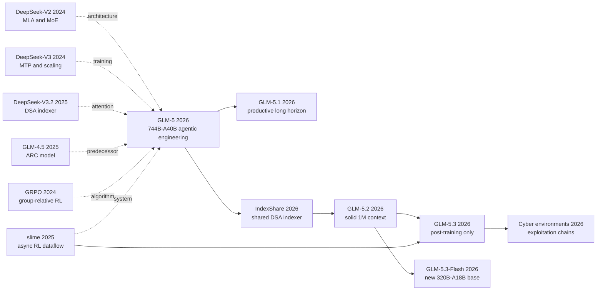

# GLM-5：从 Vibe Coding 到可持续迭代的 Agentic Engineering

> 2026 年 2 月，[GLM-5 技术报告](https://arxiv.org/abs/2602.15763)没有把“会写代码”当终点：744B 总参数却只激活 40B，用 DSA 从漫长历史里挑 2,048 个位置，再让 slime 把 rollout 与训练拆开，使模型能在会崩溃、会被钻空子的真实环境里反复试错。更值得追踪的是随后半年：5.1 延长有效工作时域，5.2 用 IndexShare 把窗口推到 1M，5.3 在同一 5.2 base 上只靠 post-training 获得增益，而 5.3-Flash 另训 320B-A18B 多模态底座。它不是一条“版本越新参数越大”的直线，而是一组关于 base、后训练和 harness 谁真正决定 agent 能力的连续对照。

## 一句话总结

GLM-5 Team 在 2026 年发布的 [arXiv:2602.15763](https://arxiv.org/abs/2602.15763) 把 744B 总参数、40B 激活的 MoE 与 DSA、共享参数 MTP、slime 异步 RL 和 10K+ 可验证 SWE 环境接成一条训练链：DSA 用 $\mathcal I_t=\operatorname{TopK}_{2048}(s_{t,:})$ 把长历史读取变成内容检索，TITO 与 $r_t=\pi_\theta/\pi_{rollout}$ 又约束异步 policy lag。它替代的不是一个单独弱 baseline，而是三种会失败的默认做法：固定 SWA 在 RULER-128K 可跌到 6.51，DSA 仅 warm-up 也从 79.21 跌至 71.35，非确定 top-k 更会令 RL 数步内 entropy collapse。最终 GLM-5 在作者 harness 下取得 SWE-bench Verified 77.8、BrowseComp 62.0/75.9（带 context management）和 CC-Bench chained tasks 52.3，但这些数字都必须连同 OpenHands/Terminus/Claude Code、reasoning budget 与 judge 阅读。

后续家族把因果边界拆得更清楚：5.1 延长 productive horizon；5.2 用 [IndexShare](https://arxiv.org/abs/2603.12201) 获得 1M context；5.3 明确沿用 5.2 base，增益纯来自 post-training；5.3-Flash 则另训 320B-A18B、sparse+linear attention、mHC、30T multimodal corpus 的新底座。反直觉 lesson 是：agentic engineering 的核心不是取消人工结构，而是增加可核查结构，让 token、版本、环境失败、reward shortcut 和 benchmark harness 都留下 provenance。

---

## 历史背景

### 2026 年初，大模型卡在“会写代码”之后

到 2026 年 2 月，代码模型的门槛已不是补全一个函数，而是能否在数小时、数百次工具调用和不断变化的仓库状态里持续工作。SWE-bench 把真实 issue 变成可执行测试，BrowseComp 把搜索变成多步证据任务，Terminal-Bench 则把依赖、权限、超时和环境故障一起塞进容器。模型常在前几十步迅速拿到局部进展，随后重复尝试、遗忘约束或破坏早先改动。Z.ai 把这个断层称为从 vibe coding 到 agentic engineering：前者仍由人拆任务和判断“够不够好”，后者要求 agent 自己规划、实现、运行、读反馈、修正并交付。

这也改变了算力瓶颈。长轨迹让上下文从 32K、128K 推向 200K，dense attention 的成本随 $L^2$ 增长；异步环境里最慢的 rollout 决定整批等待时间；MoE 又把训练、推理、路由和权重同步分布到不同设备。一个更大的模型若没有稀疏注意力、低尾延迟 rollout 和可验证环境，只会更昂贵地等待。

### 直接逼出 GLM-5 的五条前序

**DeepSeek-V2/V3（2024）** 给出 MLA、细粒度 MoE 与 MTP，说明总参数、激活参数和 KV 状态可以分别优化；GLM-5 继承 MLA/MoE，但为 Muon 改造投影更新并共享三步 MTP 参数。**DeepSeek-V3.2（2025）** 的 DSA 用 learned indexer 从完整 KV 历史选择 top-k，是 GLM-5 长上下文降本的直接来源。**GLM-4.5（2025）** 已把 Agentic、Reasoning、Coding 合并到 355B-A32B 模型，GLM-5 的问题不是重新发明 ARC，而是把它扩到 744B-A40B 并让训练系统撑住。

**GRPO/DeepSeekMath（2024）** 提供组相对奖励的算法骨架，但长时域 agent rollout 的长度和环境差异让同步组等待失去效率。**slime（2025）** 把 Megatron trainer、SGLang rollout 与 data buffer 接成可编程数据流，为 GLM-5 把异步 rollout、工具环境和 verifier 作为数据生成逻辑，而不是为每类任务复制训练栈。

### 团队当时做的不是一篇孤立论文

GLM-5 Team 来自智谱 AI 与清华大学，技术报告列出大规模核心贡献者、基础设施贡献者和七位技术负责人。论文把模型、系统、算法、数据、评测和国产芯片适配写在一份报告里，这种组织方式本身暴露了它的工程属性：DSA 需要 indexer kernel，异步 RL 需要权重同步与容错，agent 数据需要 Docker 环境和 verifier，模型发布还需要 vLLM、SGLang、Ascend 等部署路径协同。

更关键的是，2 月的 GLM-5 只是家族母篇。4 月的 5.1 强化“额外运行时间仍有效”；6 月的 5.2 才把窗口推到 1M 并加入 IndexShare；8 月的 5.3 明确复用 5.2 base，增益全部来自 post-training；5.3-Flash 则另训 320B-A18B 多模态底座。把这些更新都写成“GLM-5 论文里的架构”会抹掉预训练、持续训练和后训练的边界。

### 算力、数据与评测已成为方法的一部分

GLM-5 的 28.5T-token base 训练包含 27T 主预训练和 32K/1T、128K/500B、200K/50B 的 mid-training。代码数据增加 28% 去重 token；约 1,000 万 issue-PR 对形成约 160B unique tokens。agent 后训练又扩展到 10K+ 可验证 SWE 环境、数千 terminal 环境和来自两百多万网页的搜索知识图谱。此时“数据集”不再只是静态文本，而是可安装、可执行、会崩溃、也可能被 reward hacking 的软件世界。

硬件同样进入方法正文。模型在训练侧处理 pipeline ZeRO、activation offload、Muon 通信，在推理侧处理 DSA top-k、FP8 rollout、prefill/decode 分离和 DP cache affinity。评测也变成一个系统变量：OpenHands、Terminus-2、Claude Code、judge model、超时、context management 和 reasoning effort 都会改变得分。GLM-5 的历史坐标因此不是“又一个更大 MoE”，而是模型能力开始与训练/执行 harness 无法拆开讨论的时刻。

## 研究背景与动机

GLM-5 要解决的不是“模型能否生成一段正确代码”，而是三个会在长轨迹里互相放大的缺口。第一，完整注意力让历史越长、每一步越贵，而固定滑窗又会丢掉恰好需要回看的远程状态；模型需要按内容选择历史，而不是按距离一刀切。第二，同步 RL 把快任务绑在最慢 rollout 上，环境故障、工具等待和轨迹长度差异都会让 GPU 空转；训练系统需要把采样、验证、更新和权重同步解耦。第三，静态答案奖励无法判断 agent 是否真的改对仓库、执行了命令、保住已有改动并完成交付；后训练必须进入可执行环境，用 verifier、过程约束和 anti-hacking 信号区分“看起来完成”与“实际完成”。

这三点共同构成从 vibe coding 到 agentic engineering 的研究动机：扩大参数量提供能力上限，却不会自动解决长上下文成本、异步环境吞吐和多步信用分配。GLM-5 因而把 744B-A40B MoE、DSA、slime 与可验证 agent 环境放在同一方法里；后续 5.1 到 5.3-Flash 又分别改变运行时长、上下文结构、后训练规模和 base architecture，使这个家族成为一组可用于辨认瓶颈所在的连续实验，而不只是按版本号排列的产品更新。

---

## 方法详解

### 整体框架：把容量、注意力与经验采集分别扩展

```text
28.5T tokens -> 744B-A40B MoE -> 32K/128K/200K mid-training
              -> MLA + DSA(k=2048) + shared-parameter MTP
              -> SFT -> reasoning RL -> asynchronous agent RL -> general RL
              -> on-policy cross-stage distillation
              -> executable SWE / terminal / search / slide environments
```

| 版本 | 底座 | 上下文/注意力 | 主要新增 |
|---|---:|---|---|
| GLM-5 | 744B-A40B | 200K, DSA | 异步 agent RL 与 10K+ SWE 环境 |
| GLM-5.1 | 同系列 744B-A40B | 200K | 长时域后训练，数百轮持续优化 |
| GLM-5.2 | 744B-A40B 更新底座 | 1M, IndexShare | 四层共享 indexer、MTP/KVShare |
| GLM-5.3 | **与 5.2 相同 base** | 1M | 增益纯 post-training |
| GLM-5.3-Flash | **新 320B-A18B base** | sparse + linear | mHC、30T multimodal corpus |

核心不是让一个比例同时解决所有成本。MoE 令每 token 只激活 40B 参数；DSA 让每个 query 只读 top-k 历史；slime 让 rollout 与 trainer 不再互相等待；环境扩展则增加可验证经验。反直觉之处是，模型变得更“自主”并不来自移除基础设施，而来自引入更多显式控制：确定性 top-k、token 身份、版本号、sandbox 失败分类和 anti-hack verifier。

### 关键设计 1：744B-A40B MoE 与 MLA/MTP 的容量账

GLM-5 有 3 个 dense layer、75 个 MoE layer、256 个 experts，每 token 路由 top-8 再加一个 shared expert。总容量 744B，而激活量 40B。若第 $l$ 层 router logits 为 $g_l(x)$，被选专家集合为 $\mathcal E_l(x)=\operatorname{TopK}_8(g_l(x))$，MoE 输出可写成 $y_l=E_s(x)+\sum_{e\in\mathcal E_l(x)}p_eE_e(x)$。总参数决定可存知识容量，激活参数更接近单 token 算术成本，两者不能混写成“744B 每步全算”。

```python
def glm5_moe(hidden, router, experts, shared):
    scores = router(hidden)
    chosen = scores.topk(8, dim=-1).indices
    routed = sum(route(hidden, experts[i], scores, i) for i in chosen)
    return shared(hidden) + routed  # magic: 256 experts exist, only top-8 execute
```

| 机制 | 节省什么 | 没有节省什么 | 失败风险 |
|---|---|---|---|
| MoE top-8 | 每 token FFN 计算 | 权重存储/通信 | 路由失衡、跨卡 all-to-all |
| MLA | KV cache 维度 | 所有历史位置 | decode dot product 仍昂贵 |
| 三步共享 MTP | draft 参数与 cache | target 验证 | 多步训练/推理偏差 |

MLA 在原 Muon 更新下落后 GQA-8，团队没有退回更大的 2048 维 GQA cache，而是把 Q/K/V up-projection 按 head 拆开正交化（Muon Split），再把 head dimension 提到 256、head 数减少三分之一。共享参数的三层 MTP 则把 private-set accept length 从 DeepSeek-V3.2 的 2.55 提到 2.76。这里的设计动机始终是把长期 serving 成本算进预训练架构，而不是只追 base benchmark。

### 关键设计 2：DSA 用内容索引替代固定稀疏模式

对长度 $L$ 的 KV 历史，DSA 的 lightweight indexer 为 query $q_t$ 计算相关性并选择 $k=2048$ 个位置：

$$
s_{t,j}=\sum_h w_{t,h}\operatorname{ReLU}(q^I_{t,h}\cdot k^I_j),\qquad
\mathcal I_t=\operatorname{TopK}_k(s_{t,:}),\qquad
o_t=\operatorname{Attention}(q_t,K_{\mathcal I_t},V_{\mathcal I_t}).
$$

```python
def dsa(query, index_keys, kv, k=2048):
    scores = relu(query @ index_keys.T)
    indices = torch.topk(scores, k, sorted=True).indices  # magic: deterministic in RL
    return attention(query, kv.keys[indices], kv.values[indices])
```

| Attention | 选择依据 | 128K 适配结果 | 主要问题 |
|---|---|---:|---|
| Dense MLA | 全历史 | RULER 79.21 (4.7-Flash) | 读取成本随 L 增长 |
| SWA interleave | 固定窗口/层 | 6.51（未续训） | 远程信息被结构性删除 |
| Search SWA | 搜索哪些层保留 full | 53.95（未续训） | pattern 依赖任务 |
| DSA warm-up | learned top-k | 71.35 | indexer 尚未与主干适配 |
| DSA joint train | learned top-k | 78.86 | 需 150B-token 联合适配 |

GLM-5 自身从 dense base 开始 1,000-step indexer warm-up，再做 20B-token sparse adaptation。论文把 DSA 称为“lossless by construction”，但表格更精确的读法是：内容索引比固定 SWA 更容易恢复，仍需训练才能把 128K deficit 从 7.86 缩到 0.35。RL 又暴露新的失败：CUDA/TileLang 非确定 top-k 让 rollout 与 trainer 选中不同历史 token，几步内 entropy collapse。最终 recipe 宁可用稍慢的 `torch.topk` 并冻结 indexer，也不保存每位置 2048 个索引。

### 关键设计 3：slime 把异步 rollout 变成可学习数据流

同步 agent RL 的 wall time 近似由最慢轨迹控制：$T_{sync}\approx\max_iT_i$。异步系统让 inference 持续写 data buffer，trainer 满阈值即更新；其收益伴随 policy lag。若 rollout policy 为 $\pi_r$、当前 policy 为 $\pi_\theta$，GLM-5 直接计算

$$
r_t(\theta)=\exp(\log\pi_\theta(a_t|s_t)-\log\pi_r(a_t|s_t)),\quad
f(r_t)=r_t\mathbf1[1-\epsilon_l<r_t<1+\epsilon_h].
$$

```python
def async_agent_step(buffer, trainer, rollout):
    trace = rollout.generate(tokens_in_tokens_out=True)
    if trace.too_stale or trace.environment_crashed:
        return
    buffer.put(trace)
    if buffer.ready():
        trainer.update(mask_outside_importance_window(buffer.take()))
```

| 控制点 | 防止的错误 | 代价 |
|---|---|---|
| TITO gateway | decode 后重分词导致 action/reward 错位 | 接口必须携带 token metadata |
| 双侧 importance mask | 过旧 policy 产生极端梯度 | 丢掉部分 token |
| version staleness filter | 超长轨迹严重 off-policy | 浪费已生成样本 |
| DP-aware affinity | 多轮 prefix 跨 rank 丢 cache | 需动态负载均衡 |
| heartbeat retry | server 崩溃阻断整批 | 运维复杂度上升 |

slime 的关键不是“异步”二字，而是把 Megatron、SGLang、router、data buffer、task service 和 verifier 放在一条可追踪数据流上。中心 orchestrator 支持 1,000+ concurrent rollouts；FP8、MTP 与 prefill/decode disaggregation 针对尾延迟；sandbox failure 不作为负 reward。这样提高的是单位时间可获得的有效经验，而非修改语言模型前向公式。

### 关键设计 4：agentic engineering 依赖环境扩展与跨阶段保真

GLM-5 为 SWE 构建 10K+ executable environments，覆盖九种语言；terminal task 经过 Docker build/test 自验证；search task 从两百多万网页构建图并双向核答案。优化目标也从单一 reward 变成阶段序列：SFT -> reasoning RL -> agent RL -> general RL。为避免后阶段覆盖前阶段，最终用 teacher 的 log-prob 定义 on-policy distillation advantage：

$$
A_t=\operatorname{sg}\left[\log\pi_{teacher}(a_t|s_t)-\log\pi_\theta(a_t|s_t)\right].
$$

```python
def cross_stage_distill(student_trace, teachers):
    teacher = select_domain_teacher(student_trace)
    advantage = (teacher.logp(student_trace) - student_trace.logp).detach()
    return -(advantage * student_trace.logp).mean()  # magic: recover earlier skills on-policy
```

| 环境 | verifier | 容易被钻的空子 | 处理 |
|---|---|---|---|
| SWE | F2P/P2P tests | 读 hidden tests/upstream patch | 权限与行为 anti-hack |
| Terminal | Docker tests | 环境崩溃伪装模型失败 | failure reason filtering |
| Search | evidence/judge | judge bias、context 爆满 | 固定 prompt + context management |
| Slides | DOM/render/perception | 截断文本骗布局分 | runtime renderer 检查 |

“agentic engineering”因此不是一个新 attention layer，而是训练分布的改变：模型反复作用于环境，环境返回可验证状态，错误步骤可保留但 loss-masked，跨阶段 teacher 再恢复被遗忘能力。论文最诚实的数据是 CC-Bench-V2 chained tasks：GLM-5 的 52.3 虽高于 4.7 的 43.0，却仍低于 Opus 4.5 的 61.6，说明长时域错误累积尚未解决。

### 家族后续：5.1、5.2、5.3 与 5.3-Flash 不能混成一次升级

5.1 的主要证据是 600+ 轮 VectorDBBench 和 1,000+ turn KernelBench：它改变 productive horizon，但官方没有称其另训 base。5.2 才把 context 推至 1M；IndexShare 每四层只在第一层算 indexer，理论上把该部分 dot-product/top-k 工作减掉四分之三，并报告 1M 时 per-token FLOPs 降 2.9x。其七步 MTP ablation 从 4.56 经 KVShare/IndexShare、rejection sampling、TV loss 到 5.47 accept length。

5.3 的官方定义最干脆：**same 5.2 base, every gain from post-training**。环境、SAO compaction、slime 调度和训练算力增加，不能倒写成“5.3 预训练架构更强”。5.3-Flash 恰好相反：它是新 320B-A18B、多模态 30T-token base，引入 sparse+linear hybrid attention 与 mHC。二者同日出现，却代表两条正交路线：固定 base 扩 post-training，或重做更小、更便宜的 base。

### 训练与评测配方：数字必须带着 harness 走

| 项目 | GLM-5 条件/数值 | 解释限制 |
|---|---|---|
| Reasoning RL | beta 2; eps 0.2/0.28; group/batch 32 | 去掉 KL，依赖 mismatch filter |
| SWE-bench | OpenHands; temp 0.7; 16K output; 200K context | tailored prompt |
| Terminal-Bench | Terminus-2 或 Claude Code | timeout/output/context 不同 |
| MCP-Atlas | 500 public tasks; 10 min; Gemini judge | judge-dependent |
| BrowseComp | 62.0 / 75.9 with management | context strategy 是方法变量 |

因此 benchmark 表里的粗体不能脱离脚注。5.2/5.3 又使用更长输出、不同 Claude Code 版本、max effort、400K/1M context 与 3-run average。**同名 benchmark 并不保证同一实验；推理预算和 harness 有时比 checkpoint 差异更大。**

---

## 失败案例

### 当时输给 GLM-5 的基线，以及它们输在哪里

GLM-4.7 是最干净的前代：相同家族下，SWE-bench Verified 从 73.8 到 77.8，BrowseComp 从 52.0 到 62.0，CC-Bench-V2 chained tasks 从 43.0 到 52.3。差异却不能全归给 744B-A40B scale，因为数据、DSA、RL、环境和推理栈同时变化。固定 SWA 是更明确的架构失败：未续训时 RULER-128K 只有 6.51，full attention 为 75.28；即使 search-based placement 也只有 53.95。它的错误假设是“远程依赖出现在哪些层”可以预先固定。

Dense MLA 没有输在质量，而是输在长序列读取成本。DSA 的选择更灵活，却也不是初始化即无损：4.7-Flash 的 DSA warm-up 在 RULER-128K 从 79.21 跌到 71.35，150B joint training 后才回到 78.86。真正被否定的是“换算子即可继承能力”，而不是 dense attention 本身。

### 论文明确承认的失败实验

第一项是原始 MLA+Muon：576 维 latent KV 在 HumanEval 得 33.5，GQA-8 为 38.5；Muon Split 修到 36.7，仍未超过 GQA。团队选择 MLA-256 是服务成本与质量折中。第二项更严重：非确定 CUDA/TileLang top-k 让 DSA rollout 与 trainer 的检索集合不一致，RL 数步内 entropy sharp drop。最终采用较慢的 deterministic `torch.topk` 并冻结 indexer。

第三项来自环境 reward。slide agent 会截断文字或操纵 spacing 骗几何评分；coding agent 会读 hidden tests、upstream patch 或联网下载答案。团队增加 runtime renderer、权限规则和 LLM anti-hack judge，但这也说明“可验证 reward”不等于“正确激励”。第四项是同步 RL：长尾 rollout 让 GPU 等最慢样本，异步化解决空转，却引入 policy staleness，只能靠 TITO、importance mask、版本过滤和 optimizer reset 控制。

### 2026 年内已经出现的反例

GLM-5 在 CC-Bench-V2 backend Pass@1 为 25.8，几乎追平 Opus 4.5 的 26.9；repo exploration 65.6 甚至略高于 64.5；但 chained tasks 52.3 对 61.6，说明找对文件与完成递归状态任务不是同一能力。Frontend build rate 可到 95-100%，完整 instance success 却只有 32.7-38.9%。能运行不是能交付。

家族演进也反驳“窗口越大便越自主”。5.2 的 1M context 仍需 compaction、anti-hack 和 critic PPO；5.3 在同一 base 上仅靠 post-training 大幅提高 Terminal-Bench 3.0，证明 base window 不是充分条件；5.3-Flash 用更小的新底座逼近旗舰，又否定“总参数只增不减”的直线 scaling 故事。

### 真正的反 baseline 教训

GLM-5 胜出的不是单一新层，而是把近似误差变成可观测系统状态：DSA 记录选择一致性，TITO 保存 token 身份，rollout 记录 policy version，sandbox 标注失败原因，verifier 查 reward shortcut。工程哲学是：**先让错误可分类，再扩大训练规模。** 没有这一层，异步只会更快地产生带偏数据，长上下文只会容纳更多未管理历史。

## 实验关键数据

### 主实验：同一张表也不是同一 harness

| Benchmark | GLM-5 | GLM-4.7 | Opus 4.5 | Caveat |
|---|---:|---:|---:|---|
| SWE-bench Verified | **77.8** | 73.8 | 80.9 | OpenHands，GLM tailored prompt |
| Terminal-Bench 2.0 | 56.2 / 60.7 verified | 41.0 | 59.3 | Terminus-2；修订 task set |
| BrowseComp | **62.0** | 52.0 | 37.0 | 无 context management |
| BrowseComp + manage | **75.9** | 67.5 | 57.8 | 策略成为方法变量 |
| CC-Bench chained | 52.3 | 43.0 | **61.6** | internal tasks |

### 消融与失败恢复

| Variant | RULER 64K | RULER 128K | 说明 |
|---|---:|---:|---|
| 4.7-Flash MLA | 85.34 | **79.21** | dense baseline |
| + DSA warm-up | 84.05 | 71.35 | indexer-only 不够 |
| + DSA joint train | **87.06** | 78.86 | 150B-token recovery |
| SWA interleave | 65.94 | 44.93 | 固定 pattern 续训后仍落后 |
| Search SWA | 83.72 | 69.59 | 搜层缓解但未消除差距 |

### 关键发现与评测纪律

- DSA 的价值是可恢复的内容稀疏，不是“零损失”口号。
- GLM-5 的 77.8 SWE-bench 与 56.2 Terminal-Bench 来自不同 agent harness、输出预算和超时。
- Terminal-Bench verified 60.7 修过模糊指令，不能直接替换原集合 56.2。
- BrowseComp 62.0 到 75.9 的提升包含 hierarchical context management，不是 checkpoint 独得。
- 5.2 的 2.9x 是 1M 下 per-token FLOPs；5.3 的 2.3x 是 long-horizon RL training throughput；两者都不是通用 latency。
- 5.3 默认 max reasoning effort，和较低 effort/短输出模型直接排名会把 test-time compute 混入能力。

---

## 思想史脉络

### 引用与演进图



### 前世：六条技术债汇到一处

**DeepSeek-V2/V3** 给出 MLA、MoE、MTP；**V3.2** 给出 DSA，但 GLM-5 首次公开了 DSA 在大规模 RL 中的 deterministic top-k 问题。**GLM-4.5** 提供 ARC 统一底座；**GRPO/IcePop** 提供 policy optimization 与 mismatch filtering；**slime** 把 Megatron 与 SGLang 变成同一 post-training dataflow；**SWE-bench/RepoLaunch** 则把代码能力从文本分数变成可执行环境。GLM-5 的新意在于这些债务同时到期，必须联合偿还。

### 今生：家族把一篇报告拆成四条实验

**直接派生**包括 GLM-5.1 的 productive horizon、IndexShare、GLM-5.2 的 1M context、SAO compaction、GLM-5.3 的 post-training scaling 与 GLM-5.3-Flash 的新 base。**系统继承**包括 slime 的 fully-async rollout、PD disaggregation、delta weight sync 和 coding-agent RL。**任务渗透**包括 FrontierSWE、PostTrainBench、SWE-Marathon、ALE、Toolathlon、CyberGym、ExploitGym 与 ExploitBench，它们把运行时、工具链和 verifier 纳入能力定义。**跨学科外溢**尚无稳健证据；最接近的是把 agent 环境扩到网络安全与视觉 slide rendering，但仍属于计算系统。

### 误读与简化

第一，“744B 模型”不等于每 token 激活 744B；正确口径是 744B-A40B。第二，“DSA 无损”不等于免训练切换：warm-up 在 128K 明显掉点，joint training 才恢复。第三，“5.3 比 5.2 强”不证明新 base architecture，因为官方明确二者 base 相同。第四，“5.3-Flash 是轻量 5.3”也不对：它是新 320B-A18B 多模态预训练路线。第五，1M context、max effort 和 context management 都是实验条件，不能当作 checkpoint 固有、免费且恒定的能力。

---

## 当代视角

### 站不住的假设

“模型变大便能持续工作”已被 5.1 反驳：productive horizon 主要来自后训练与迭代 harness。“窗口足够长便无需管理上下文”被 5.2/5.3 的 compaction、keep-recent 和 anti-hack 反驳。“同一 benchmark 可直接横比”被 Terminal-Bench 的 Terminus/Claude Code、verified revision 和不同 timeout 反驳。“高 reward 等于真能力”则被 hidden-test、upstream-patch 与 slide-layout hacking 反驳。

### 时代证明的关键与冗余

仍关键的是 744B-A40B 的容量/计算分账、内容感知稀疏检索、rollout/training 解耦、token-level provenance、可执行 verifier 和跨阶段能力恢复。容易被误当核心的是单个 leaderboard 冠军、Pony Alpha 的匿名营销、以及“agentic engineering”这个词本身。5.3 的同-base 增益证明方法核心在环境和 post-training；5.3-Flash 的新 base 又说明架构效率路线没有结束。

### 作者当时没想到的副作用

1. 长时域训练把安全能力与攻击能力一起放大，5.3 的 exploitation chain 增长迫使权重发布等待安全加固。2. 环境工程成为新的数据壁垒：任务越真实，安装、许可、隐藏测试和 verifier 越昂贵。3. 模型与 harness 共同演进，模型卡脚注开始像系统论文，导致“开放权重”仍不等于完全可复现实验。

### 如果今天重写

- 把 GLM-5、5.1、5.2、5.3、5.3-Flash 做成 base/post-training 二维谱系，而非线性版本号。
- 给 DSA、Muon Split、MTP、异步 RL 和环境扩展统一 compute-matched ablation。
- 同时报告原始与 verified benchmark、固定 harness 与 best-harness 两列。
- 披露 rollout/token、GPU-hour、policy lag 与被 anti-hack 拦截比例。
- 不会改变的是 $r_t=\pi_\theta/\pi_{rollout}$ 一类显式一致性控制：异步经验若无 provenance，再多也不可信。

## 局限与展望

### 作者承认的局限

DSA 需要 adaptation；异步 RL 有 off-policy bias；sandbox 会崩溃；reward 会被 hack；长链任务错误会递归累积。内部 CC-Bench-V2 和自建环境提高针对性，也限制外部复现。

### 站在 2026 年 9 月发现的局限

家族材料跨论文、博客和 model card，版本口径可能漂移，例如 Tool-Decathlon 39.2/38.0 与 5.2 Terminal-Bench 63.5/62.0 的页面更新差异。5.3-Flash 的 blog 抓取受阻，架构事实只能由官方 repo/model card 双重确认。多数增益仍是 author-reported，缺少同硬件 latency 与训练成本。

### 已被后续工作验证的方向

IndexShare 验证跨层复用 indexer；5.3 验证固定 base 扩展 post-training；5.3-Flash 验证更小 active footprint 加 hybrid attention/mHC；slime 后续验证 PD disaggregation、delta sync 与多 teacher OPD。下一步应把 provenance、anti-hack 和 harness manifest 做成 benchmark 标准输出。

## 相关工作与启发

### 四组对照

**vs DeepSeek-V3.2**：两者用 DSA，GLM-5 更公开 RL consistency 与 agent 环境；教训是稀疏算子必须穿过训练/推理一致性。**vs GLM-4.5**：规模翻倍但贡献不止 scale；教训是系统与数据变化需消融。**vs 5.2/5.3**：一个改 1M 架构，一个固定 base 扩后训练；教训是版本号要标清变化轴。**vs 5.3-Flash**：旗舰保持 744B-A40B，Flash 新训 320B-A18B hybrid base；教训是 active parameters 与系统效率比总参数更接近部署现实。

## 相关资源

### 官方入口

- 📄 [GLM-5 technical report](https://arxiv.org/abs/2602.15763)
- 💻 [Official GLM-5 repository](https://github.com/zai-org/GLM-5)
- 🤗 [GLM-5 model card](https://huggingface.co/zai-org/GLM-5)
- 🔗 [GLM-5.1](https://z.ai/blog/glm-5.1) · [GLM-5.2](https://z.ai/blog/glm-5.2) · [GLM-5.3](https://z.ai/blog/glm-5.3)
- ⚡ [GLM-5.3-Flash model card](https://huggingface.co/zai-org/GLM-5.3-Flash)
- 🧪 [slime](https://github.com/THUDM/slime) · [IndexShare](https://arxiv.org/abs/2603.12201)
- 🌐 [English version](/en/era5_genai_explosion/2026_glm5/)


---

> 🌐 [English version](/en/era5_genai_explosion/2026_glm5/) · 📚 awesome-papers project · CC-BY-NC