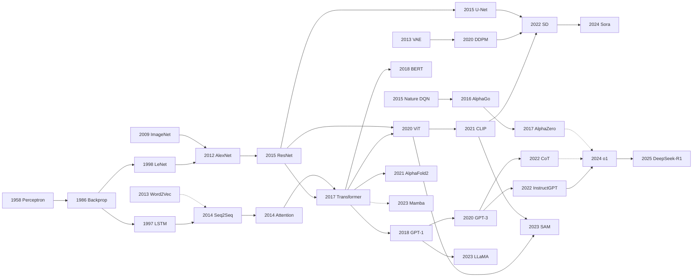

---
hide:
  - navigation
  - toc
---

## 🗺️ 70 年思想史，一张图先看大局

30 个节点串起 6 条主线：CNN · 序列建模 · 强化学习 · 生成模型 · 多模态 · 推理。<strong>实线</strong>是直接继承，<strong>虚线</strong>是间接影响或思想分支。这只是一张极简骨架——点任意节点跳进对应深度笔记，里面的「思想史脉络」section 才有完整的前世/今生/误读。

---

## 📅 完整 116 篇时间线 {#timeline}

=== "Era 5 · 大模型时代 (2023–至今)"

    **28 篇** · [完整索引 →](era5_genai_explosion/index.md)

    - **2025** · [Claude 3.5/3.7 Sonnet - 把前沿模型做成可控的工程同事](era5_genai_explosion/2025_claude_sonnet.md)
    - **2025** · [DeepSeek-R1 — 纯强化学习如何让开源 LLM 学会推理](era5_genai_explosion/2025_deepseek_r1.md)
    - **2025** · [Qwen2.5 / Qwen3 - 阿里通义千问如何把开放模型做成全栈模型族](era5_genai_explosion/2025_qwen3.md)
    - **2024** · [DeepSeek-V2 / V3 - MLA 与 MoE 如何把开源模型推到前沿](era5_genai_explosion/2024_deepseek_v3.md)
    - **2024** · [Gemini 1.5 - 百万 token 上下文的多模态长程理解](era5_genai_explosion/2024_gemini15.md)
    - **2024** · [Genie: 生成式交互环境](era5_genai_explosion/2024_genie.md)
    - **2024** · [Llama 3 Herd - 开放权重前沿模型的工程化路线图](era5_genai_explosion/2024_llama3.md)
    - **2024** · [OpenAI o1 - 用强化学习把大模型推向深度推理](era5_genai_explosion/2024_o1.md)
    - **2024** · [Sora Technical Report - 把视频生成模型推向世界模拟器](era5_genai_explosion/2024_sora.md)
    - **2024** · [Stable Diffusion 3 / Rectified Flow — 把文生图从 U-Net 扩散推进到可缩放的 MMDiT](era5_genai_explosion/2024_stable_diffusion3.md)
    - **2023** · [3DGS — 把 NeRF 从离线渲染带到实时交互的 3D Gaussian Splatting](era5_genai_explosion/2023_3dgs.md)
    - **2023** · [AudioLM - 把原始音频变成语言模型问题](era5_genai_explosion/2023_audiolm.md)
    - **2023** · [DINOv2 - 无监督视觉特征的通用底座](era5_genai_explosion/2023_dinov2.md)
    - **2023** · [DPO — 不要奖励模型也不要 PPO，直接用偏好数据对齐 LLM](era5_genai_explosion/2023_dpo.md)
    - **2023** · [GPT-4 Technical Report - 闭源时代的能力跃迁与黑箱技术报告](era5_genai_explosion/2023_gpt4.md)
    - **2023** · [LLaMA — 用更小参数与更多 token 让开源 LLM 第一次追平 GPT-3](era5_genai_explosion/2023_llama.md)
    - **2023** · [LLaVA - 把 GPT-4 生成的视觉指令变成开源多模态助手](era5_genai_explosion/2023_llava.md)
    - **2023** · [Llama 2: Open Foundation and Fine-Tuned Chat Models](era5_genai_explosion/2023_llama2.md)
    - **2023** · [Mamba — 选择性状态空间如何在 10 年里第一次让 Transformer 感到压力](era5_genai_explosion/2023_mamba.md)
    - **2023** · [Mixtral 8x7B — 把开源 LLM 带入稀疏专家时代](era5_genai_explosion/2023_mixtral.md)
    - **2023** · [QLoRA — 让 65B 大模型微调落到单张 48GB GPU 上](era5_genai_explosion/2023_qlora.md)
    - **2023** · [RT-2：把网页知识迁移到机器人控制的视觉-语言-动作模型](era5_genai_explosion/2023_rt2.md)
    - **2023** · [SAM — 一个 prompt + 11M 图像 + 1B 掩码，如何把分割变成基础模型问题](era5_genai_explosion/2023_sam.md)
    - **2023** · [Toolformer - 让语言模型自学何时调用工具](era5_genai_explosion/2023_toolformer.md)
    - **2023** · [Tree of Thoughts — 让大语言模型从一次性作答走向搜索式思考](era5_genai_explosion/2023_tot.md)
    - **2023** · [vLLM / PagedAttention — 把 LLM 服务的瓶颈从显存碎片里救出来](era5_genai_explosion/2023_vllm.md)

=== "Era 4 · 基础模型 (2020–2022)"

    **30 篇** · [完整索引 →](era4_foundation_models/index.md)

    - **2023** · [ControlNet — 用零卷积把可控空间条件接入冻结的扩散模型](era4_foundation_models/2022_controlnet.md)
    - **2022** · [Chinchilla — 用最优算力分配证明当时所有 LLM 都「训练不足」](era4_foundation_models/2022_chinchilla.md)
    - **2022** · [Classifier-Free Diffusion Guidance — 一行代码砍掉外挂分类器，统一所有现代文生图](era4_foundation_models/2022_cfg.md)
    - **2022** · [CoT — 用一句「让我们一步步思考」解锁 LLM 的推理能力](era4_foundation_models/2022_cot.md)
    - **2022** · [Constitutional AI — 用一份「宪法」+ AI 反馈替换数万人类有害样本标签](era4_foundation_models/2022_constitutional_ai.md)
    - **2022** · [DreamBooth — 用 3-5 张照片把任意主体「植入」文生图模型](era4_foundation_models/2022_dreambooth.md)
    - **2022** · [Flamingo: a Visual Language Model for Few-Shot Learning](era4_foundation_models/2022_flamingo.md)
    - **2022** · [Imagen — 用大语言模型理解提示词的级联扩散文生图](era4_foundation_models/2022_imagen.md)
    - **2022** · [InstructGPT — 用 RLHF 把 GPT-3 从续写器训练成听话的助手](era4_foundation_models/2022_instructgpt.md)
    - **2022** · [MAE — 用 75% 掩码遮蔽让 ViT 学会自监督预训练](era4_foundation_models/2022_mae.md)
    - **2022** · [PaLM — Pathways 把 dense LLM 推到 540B 的那一刻](era4_foundation_models/2022_palm.md)
    - **2022** · [ReAct: Synergizing Reasoning and Acting in Language Models](era4_foundation_models/2022_react.md)
    - **2022** · [Stable Diffusion — 把扩散搬进 latent space，让消费级显卡也能生成图像](era4_foundation_models/2022_stable_diffusion.md)
    - **2022** · [Whisper - 用 68 万小时弱监督音频把语音识别做成通用接口](era4_foundation_models/2022_whisper.md)
    - **2021** · [AlphaFold2 — 用 attention + Evoformer 把蛋白质结构预测推到原子级精度](era4_foundation_models/2021_alphafold2.md)
    - **2021** · [CLIP — 用 4 亿对图文对比让视觉模型听懂自然语言](era4_foundation_models/2021_clip.md)
    - **2021** · [Codex — 把大语言模型训练到会写代码](era4_foundation_models/2021_codex.md)
    - **2021** · [DALL-E — 把图像生成改写成语言模型问题](era4_foundation_models/2021_dalle.md)
    - **2021** · [LoRA — 用低秩矩阵把大模型微调成本砍掉 99%](era4_foundation_models/2021_lora.md)
    - **2021** · [Swin Transformer - 用 shifted windows 把 ViT 改造成通用视觉骨干](era4_foundation_models/2021_swin_transformer.md)
    - **2020** · [DDPM — 用千步去噪把扩散模型推上图像生成王座](era4_foundation_models/2020_ddpm.md)
    - **2020** · [DETR — 把目标检测改写成集合预测的 Transformer](era4_foundation_models/2020_detr.md)
    - **2020** · [GPT-3 — 当语言模型大到 175B，prompting 成为新的编程范式](era4_foundation_models/2020_gpt3.md)
    - **2020** · [MoCo：用队列和动量编码器，把视觉自监督从 pretext task 带向通用表示学习](era4_foundation_models/2020_moco.md)
    - **2020** · [NeRF — 用一个 MLP 把场景编码成可微分的辐射场](era4_foundation_models/2020_nerf.md)
    - **2020** · [Scaling Laws — 用幂律刻画 LLM 的损失、参数与算力之间的关系](era4_foundation_models/2020_scaling_laws.md)
    - **2020** · [Score SDE — 用随机微分方程统一扩散与 score-based 生成](era4_foundation_models/2020_score_sde.md)
    - **2020** · [SimCLR — 一个朴素的对比损失，把自监督视觉学习推上 ImageNet 线性评测的王座](era4_foundation_models/2020_simclr.md)
    - **2020** · [ViT — 用纯 Transformer 把卷积赶下视觉王座](era4_foundation_models/2020_vit.md)
    - **2020** · [wav2vec 2.0 - 让语音识别先听 5.3 万小时、再看 10 分钟标注](era4_foundation_models/2020_wav2vec2.md)

=== "Era 3 · 注意力机制 (2017–2019)"

    **20 篇** · [完整索引 →](era3_attention/index.md)

    - **2019** · [EfficientNet — 用 compound scaling 重新定义 CNN 模型效率](era3_attention/2019_efficientnet.md)
    - **2019** · [GPT-2 — 用规模与零样本宣告 LLM 时代的到来](era3_attention/2019_gpt2.md)
    - **2019** · [RoBERTa — 把 BERT 重新训对的工程清醒剂](era3_attention/2019_roberta.md)
    - **2019** · [T5 — 把所有 NLP 任务统一成 text-to-text](era3_attention/2019_t5.md)
    - **2018** · [BERT — 用掩码语言建模让 NLP 全面进入预训练时代](era3_attention/2018_bert.md)
    - **2018** · [ELMo — 用 BiLSTM 双向语言模型把 contextual embedding 推上主流](era3_attention/2018_elmo.md)
    - **2018** · [GPT-1 — 用 decoder-only Transformer 点燃预训练革命](era3_attention/2018_gpt1.md)
    - **2018** · [Graph Attention Networks (GAT) — 为图神经网络植入注意力](era3_attention/2018_gat.md)
    - **2018** · [Group Normalization - 让归一化摆脱 batch size](era3_attention/2018_group_norm.md)
    - **2018** · [PGD Adversarial Training — 把对抗鲁棒性写成最小最大问题](era3_attention/2018_pgd.md)
    - **2018** · [SE-Net — 用 channel attention 把 ImageNet 终结者拱上 ILSVRC 2017 冠军](era3_attention/2018_senet.md)
    - **2018** · [StyleGAN — 用 style modulation 把 GAN 推上照片级人脸生成](era3_attention/2018_stylegan.md)
    - **2017** · [AlphaZero — 用纯自对弈把人类围棋知识从 RL 中彻底删除](era3_attention/2017_alphazero.md)
    - **2017** · [CycleGAN — 用循环一致性损失打开无配对图像翻译大门](era3_attention/2017_cyclegan.md)
    - **2017** · [GCN — 半监督节点分类与图神经网络的奠基](era3_attention/2017_gcn.md)
    - **2017** · [Mask R-CNN — 在 Faster R-CNN 上加一条分支统一了实例分割](era3_attention/2017_mask_rcnn.md)
    - **2017** · [MobileNet — 用 depthwise separable conv 把深度学习装进手机](era3_attention/2017_mobilenet.md)
    - **2017** · [PPO — 用 clipping 让策略梯度终于变得「可调可用」](era3_attention/2017_ppo.md)
    - **2017** · [PointNet — 用置换不变深度网络直接处理无序点云](era3_attention/2017_pointnet.md)
    - **2017** · [Transformer — 用注意力埋葬循环神经网络](era3_attention/2017_transformer.md)

=== "Era 2 · 深度学习复兴 (2012–2016)"

    **24 篇** · [完整索引 →](era2_deep_renaissance/index.md)

    - **2016** · [AlphaGo — 用蒙特卡洛树搜索 + 深度网络打败人类围棋世界冠军](era2_deep_renaissance/2016_alphago.md)
    - **2016** · [LayerNorm: 把归一化从 batch 搬到样本内部](era2_deep_renaissance/2016_layer_norm.md)
    - **2016** · [YOLO — 把目标检测改写成一次前向的实时回归](era2_deep_renaissance/2016_yolo.md)
    - **2015** · [BatchNorm — 把训练稳定性变成一层网络](era2_deep_renaissance/2015_batchnorm.md)
    - **2015** · [FCN - 把分类网络改造成像素级分割机](era2_deep_renaissance/2015_fcn.md)
    - **2015** · [Faster R-CNN — 用 RPN 把候选框也学进网络](era2_deep_renaissance/2015_faster_rcnn.md)
    - **2015** · [He Init - 给 ReLU 深网一个不会熄火的起点](era2_deep_renaissance/2015_he_init.md)
    - **2015** · [Inception / GoogLeNet — 用多尺度模块把 CNN 往深处推进](era2_deep_renaissance/2015_inception.md)
    - **2015** · [Knowledge Distillation — 把大模型的暗知识倒进小模型](era2_deep_renaissance/2015_knowledge_distillation.md)
    - **2015** · [Nature DQN - 让 Atari 成为深度强化学习的公开试金石](era2_deep_renaissance/2015_dqn_nature.md)
    - **2015** · [ResNet — 深度残差学习如何打开 152 层之门](era2_deep_renaissance/2015_resnet.md)
    - **2015** · [U-Net — 把编码器-解码器和跳连变成医学分割的默认语法](era2_deep_renaissance/2015_unet.md)
    - **2014** · [Adam — 随机优化的自适应矩估计](era2_deep_renaissance/2014_adam.md)
    - **2014** · [Adversarial Examples — 线性解释、FGSM 与现代鲁棒性的起点](era2_deep_renaissance/2014_adversarial_examples.md)
    - **2014** · [Bahdanau Attention — 让神经翻译第一次学会看源句](era2_deep_renaissance/2014_attention.md)
    - **2014** · [GAN — 用对抗博弈让神经网络学会「造假」](era2_deep_renaissance/2014_gan.md)
    - **2014** · [R-CNN — 把 ImageNet 特征带进目标检测的转折点](era2_deep_renaissance/2014_rcnn.md)
    - **2014** · [Seq2Seq - 把任意长度序列压成向量，再把向量翻译回序列](era2_deep_renaissance/2014_seq2seq.md)
    - **2014** · [VGG — 用 3×3 小卷积把 CNN 推到 19 层](era2_deep_renaissance/2014_vgg.md)
    - **2013** · [DQN — 从像素到动作的深度强化学习第一击](era2_deep_renaissance/2013_dqn.md)
    - **2013** · [VAE — 把生成式建模变成可优化的变分下界](era2_deep_renaissance/2013_vae.md)
    - **2013** · [Word2Vec - 把词义压进向量空间的工业级捷径](era2_deep_renaissance/2013_word2vec.md)
    - **2012** · [AlexNet — 用 GPU + ReLU + Dropout 在 ImageNet 上把 Top-5 误差砍掉一半](era2_deep_renaissance/2012_alexnet.md)
    - **2012** · [Dropout — 随机关闭神经元，阻止特征探测器合谋](era2_deep_renaissance/2012_dropout.md)

=== "Era 1 · 神经网络萌芽 (1957–2011)"

    **14 篇** · [完整索引 →](era1_foundations/index.md)

    - **2011** · [ReLU — 一个 max(0, x) 如何把深度网络从「实验室玩具」变成「工业基石」](era1_foundations/2011_relu.md)
    - **2010** · [Glorot Init — 让深度网络先把信号传过去](era1_foundations/2010_glorot_init.md)
    - **2009** · [ImageNet — 用 1500 万张图把「数据集」变成深度学习革命的引信](era1_foundations/2009_imagenet.md)
    - **2008** · [t-SNE — 高维数据可视化的视觉语言](era1_foundations/2008_tsne.md)
    - **2006** · [DBN — 用逐层贪婪预训练让深层神经网络第一次「被训得动」](era1_foundations/2006_dbn.md)
    - **2006** · [Autoencoder — 用 RBM 预训练把神经网络从冷宫里唤醒](era1_foundations/2006_autoencoder.md)
    - **2003** · [LDA — 用 Dirichlet 先验把 pLSA 升级成可推广的全贝叶斯主题模型](era1_foundations/2003_lda.md)
    - **2001** · [Random Forests — 用 bagging + 特征采样把决策树推上当年 ML 的王座](era1_foundations/2001_random_forests.md)
    - **1998** · [LeNet — 把卷积、池化与反向传播缝合成第一个工业级深度网络](era1_foundations/1998_lenet.md)
    - **1997** · [LSTM — 用门控机制让循环网络第一次记得住长依赖](era1_foundations/1997_lstm.md)
    - **1992** · [SVM — 用最大间隔与核技巧统治机器学习整整 20 年](era1_foundations/1992_svm.md)
    - **1989** · [Universal Approximation — 用一条存在性定理给神经网络颁发表达力通行证](era1_foundations/1989_universal_approximation.md)
    - **1986** · [Backprop — 用链式法则把多层神经网络从「不可训练」拽进可优化世界](era1_foundations/1986_backprop.md)
    - **1958** · [Perceptron — 第一个能从数据中学习的硬件神经元如何点燃 AI 学科](era1_foundations/1958_perceptron.md)

